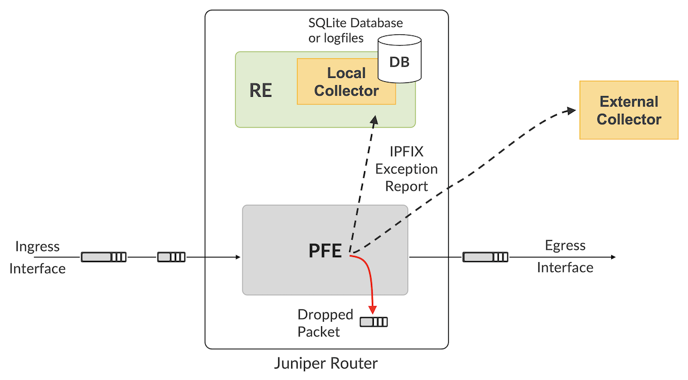
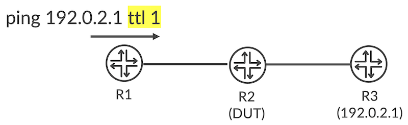
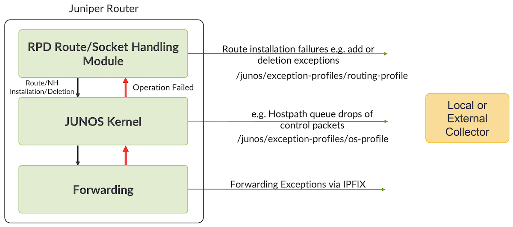

# Detection of Blackholes Using Juniper Resiliency Interface

**Julian Lucek - 01/02/2024**

Unfortunately, black-holes sometimes occur in networks -- packets disappear without trace for no apparent reason. Often the first symptom is when customers of the network complain about poor performance. Working out which router is responsible can be like looking for a needle in a haystack, and even once the suspect router is identified, it can take some time to ascertain which particular packets are being dropped and why. One needs to look at multiple log-files and the output of various show commands to piece together what is happening.

Article co-written by Julian Lucek and Chaitanya Munukutla.

## Introduction

To address these issues, we have recently introduced a feature-set called [Juniper Resiliency Interface (JRI)[1]](https://www.juniper.net/documentation/us/en/software/junos/flow-monitoring/topics/topic-map/resiliency-exception-reporting.html) in which the router proactively reports, via IPFIX, details about packets that were dropped, including why they were dropped. After all, when a packet is dropped, it is dropped for a reason, and the router knows why. JRI leverages that information and greatly increases the visibility of the black-hole. JRI is applicable regardless of the packet type: IPv4, IPv6, MPLS and Layer 2.

A Deepdive dive written by Anton Elita [has been published here](https://juniper.github.io/techposts/packets-lost-in-transit/article).

## Tracking Packet Drops

Figure 1 illustrates how it all works. A router consists of a control plane residing on the Routing Engine, and one or more Packet Forwarding Engines (PFEs) that perform lookups on the packet headers and forward them accordingly. If a packet cannot be forwarded by a PFE, it is dropped, and an exception report is sent via IPFIX. This can be sent to an external collector or to a local collector that resides on the routing engine. If sent to the local collector, the report is either put into a dedicated logfile or into an SQLite database.



The exception report sent via IPFIX contains valuable data that helps pinpoint the reason why the packet was dropped. A key item within the report is a *forwarding exception code* (also known as a *reason code*) that explains why the packet was dropped. Some of the examples of the reason code include, but are not limited to, the following:

- **No matching IP prefix in the FIB**
- **No matching MPLS label in the FIB**. This can occur when someone has manually programmed an SR-TE path in the form of a stack of SIDs on a head-end router, but made a typo with one of the SID label values. As a result, the label is unrecognised by a transit router, so it drops the packet.
- **Unknown address family**. For example, an MPLS packet arrives on an interface that does not have family MPLS configured.
- **TTL expired**. This could be due to traceroutes or could be due to transient micro-loops during convergence events.
- **Unknown VLAN tag**
- **MAC learn limit exceeded**. This can occur when a packet arrives on an L2 interface on which a MAC-limit has been configured.
- **GRE mismatch**
- **MTU exceeded on the outbound interface**
- **Various packet header errors**, for example checksum errors, or the packet length not matching the length stated in the packet header

In addition, the following items are contained in the exception report:

- **The incoming interface index**
- **The underlying incoming interface index**. This is used when the incoming interface is a LAG, in order to report the particular child link that the packet arrived on
- **The outgoing interface index**, if this had been determined before the decision was made to drop the packet
- **The packet "direction"** i.e. whether packet was dropped on the ingress or egress PFE
- **The nexthop-index**. This is a cross-reference to the entry in the routing table that matched this packet.
- **The first N bytes of the packet**.

Not all of these items are covered by pre-existing IPFIX Information Elements, so Juniper engineers [have co-authored an IETF draft [2] ](https://datatracker.ietf.org/doc/draft-mvmd-opsawg-ipfix-fwd-exceptions/)that proposes the required new Information Elements. In addition, the draft proposes that IANA creates a new registry for forwarding exception codes in order to achieve consistency across implementations. For example, TTL-expiry has a forwarding exception code of value of 2.

## Let's test it

Figure 2 shows an easy way to test JRI. The device under test (DUT) is the middle router, R2. R1 sends a ping to R3 with Time-to-Live (TTL) set to 1. This means the TTL expires at R2, so the ingress PFE on R2 creates an exception report when it drops the packet. The output below shows the IPFIX exception report (as recorded in the log-file on the Routing Engine). The items highlighted in **purple** correspond to the new IPFIX Information Elements proposed in the IETF draft. As can be seen, the exception code is TTL Expired (in the log-file, the numeric exception code carried by the IPFIX packet is translated into human-friendly text). The flow-direction is reported as 00, which means the packet was dropped by the ingress PFE.



```
***** Netflow/IPFIX ****
Version: 10
Length: 106
Export time: 1695116517
Seq no: 3397
ObservationDomainID: 65536
setID: 1024
setLength: 90
field_type: exceptionCode, field_length: 2
value: TTL Expired
field_type: nhIndex, field_length: 4
value: 707
field_type: oifIndex, field_length: 4
value: 0
field_type: underlyingiifIndex, field_length: 4
value: 0
field_type: iifIndex, field_length: 4
value: 362
field_type: flowDirection, field_length: 1
value: 00
field_type: dataLinkFrameSize, field_length: 2
value: 1446
field_type: dataLinkFrameSection, field_length: 64
value: 2c6bf561 482a2c6b f5e6d72a 88470002
31014500 05948050 00000101 b4480b65
69010b00 006b0800 d64b023a 00006509
6ce50007 b6370809 0a0b0c0d 0e0f1011
```

## rpd and kernel exceptions

So far, this Techpost has been focusing on packets dropped by the PFE. However, the JRI framework as a whole also covers other levels in the system. This is illustrated in Figure 3.



The top layer in the figure represents Routing Protocol Daemon (rpd) exceptions. When the router is under high stress, rpd may not succeed in adding or deleting prefixes when it asks the kernel to do so. Such exceptions are reported to an external or local collector via streaming telemetry, as this is better suited to this type of exception than IPFIX.

The middle layer in the figure represents kernel exceptions. An example of a kernel exception is when control-plane packets are dropped from the host-path queues that the kernel is responsible for managing. Like the rpd exceptions, kernel exceptions are reported to an external or local collector via streaming telemetry.

The rpd and kernel exceptions use the same data-model as the PFE exceptions, for example the format used for timestamps and exception codes.

## Conclusion

Deployments of Juniper Resiliency Interface have paid valuable dividends, as black-holes are detected a lot earlier and in a much more obvious, visible way due to the proactive nature of the scheme. This means that remediation steps can be applied in a more timely way, reducing the amount of time that customer traffic is affected.

## References

- [1] Juniper Resiliency Interface in the Juniper Techpubs: [https://www.juniper.net/documentation/us/en/software/junos/flow-monitoring/topics/topic-map/resiliency-exception-reporting.html](https://www.juniper.net/documentation/us/en/software/junos/flow-monitoring/topics/topic-map/resiliency-exception-reporting.html)
- [2] IETF draft about reporting forwarding exceptions via IPFIX: [https://datatracker.ietf.org/doc/draft-mvmd-opsawg-ipfix-fwd-exceptions/](https://datatracker.ietf.org/doc/draft-mvmd-opsawg-ipfix-fwd-exceptions/)
- [3] Deepdive into Juniper Resiliency Interface (JRI) forwarding-plane (PFE) exceptions: Packets Lost in Transit - [https://juniper.github.io/techposts/packets-lost-in-transit/article](https://juniper.github.io/techposts/packets-lost-in-transit/article)

## Glossary

- DUT: Device Under Test
- GRE: Generic Routing Encapsulation
- IANA: Internet Assigned Numbers Authority
- IETF: Internet Engineering Task Force
- IPFIX: Internet Protocol Flow Information Export
- FIB: Forwarding Information Base
- JRI: Juniper Resilience Interface
- MPLS: Multi-Protocol Label Switching
- MTU: Maximum Transmission Unit
- PFE: Packet Forwarding Engine
- RE: Routing Engine
- rpd: Routing Protocol Daemon
- TTL: Time To Live
- VLAN: Virtual Local Area Network

## Acknowledgments

This article has been co-written by Julian Lucek and Chaitanya Munukutla.
