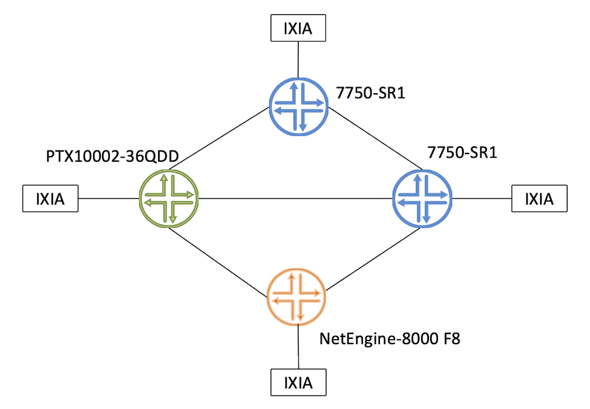
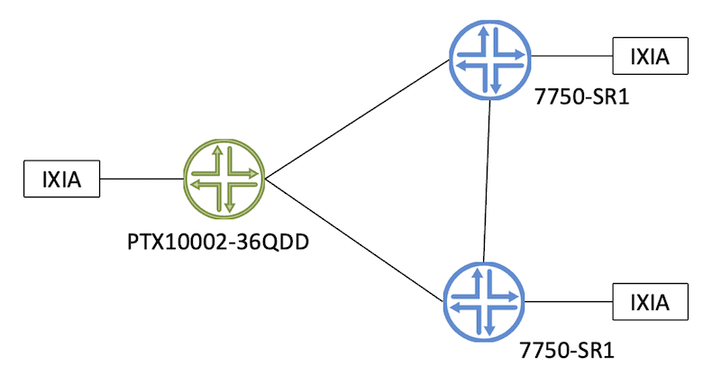
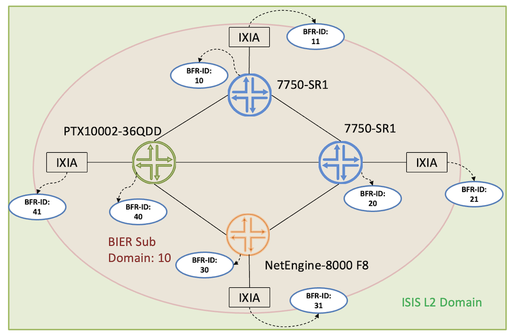
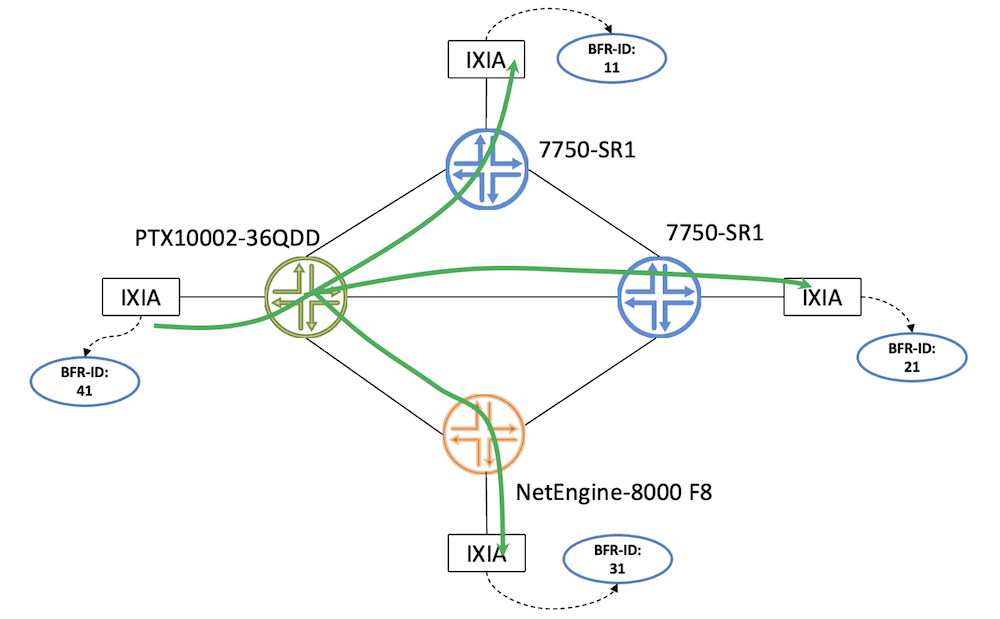

# EANTC BIER InterOp Testing on PTX10002-36QDD

**Suneesh Babu - 05/13/2024**

BIER Interoperability testing verified between PTX10002-36QDD and other vendors during the EANTC 2024.

## Introduction

BIER -- Bit Index Explicit Replication provides a multicast architecture with no per-tree multicast states in the core, by having the information of the destination multicast routers within the packet.  The architecture details of BIER are captured in the RFC-8279. BIER is supported on Juniper Networks PTX10002-36QDD platform (Jeffrey Zhang posted an article recently on the support brought by Express5 Forwarding ASIC: [https://juniper.github.io/techposts/bier-mvpn-in-ptx-express-5/article](https://juniper.github.io/techposts/bier-mvpn-in-ptx-express-5/article)) and Interop testing is successfully completed with Nokia and Huawei as part of the EANTC Interop event in Berlin and a demonstration of the interop is performed during the MPLS World Congress-2024 in Paris. This article discusses the interop test cases we performed on PTX10002-36QDD.

In the EANTC-2024 Interop event, there were three participants: Nokia 7750 SR-1, Huawei 8000 F8, and Juniper Networks PTX10002-36QDD. In the MPLS World Congress 2024 Nokia 7750 SR-1 and Juniper Networks PTX10002-36QDD BIER interop capabilities were demonstrated.

## EANTC BIER Interop Topology

Interop test topology consists of four routers, one router each from Juniper Networks and Huawei and two routers from Nokia. KeySight IxNetwork is used for generating BIER multicast traffic.



## MPLS World Congress BIER Interop Demo Topology

In the MPLS World Congress BIER Demonstration, PTX10002-36QDD was peered with two  Nokia 7750 devices, and BIER functionality was tested:



## BIER Interop Test Cases

Interop mainly focussed on two cases, in the first test case the BIER underlay got verified with ISIS as IGP, and in the second test case, nodes' capability to replicate the multicast packet as BFR nodes were tested.



### BIER Underlay with ISIS

In the Underlay test, ISIS is used as the IGP in level-2 mode. BFR-ID got configured as shown in the below diagram with BFR-ID of 40 on PTX10002-36QDD.

BIER configuration and its association with ISIS as follows:

```
suneesh@JNPR-333-PTX10002-36QDD> show configuration groups BIER_LAYER

protocols {
    bier {
        sub-domain 10 {
            bfr-id 40;
            bfr-prefix 10.0.0.233;
            encapsulation mpls bitstringlen 256 number-sets 4;
        }
    }
    isis {
        bier-sub-domain 10;
    }
}
```

ISIS adjacency was formed with both Nokia devices and also with IXIA and Huawei devices as shown below:

```
suneesh@JNPR-333-PTX10002-36QDD> show isis adjacency |no-more 

Interface             System         L State         Hold (secs) SNPA
et-0/0/2.0            Nokia_58-SR1-3-SRv6 2 Up                18
et-0/0/20:0.41        Keys-225-333   2  Up                    24
et-0/0/3.0            NOKIA-SR2-57   2  Up                    23
et-0/0/8:0.0          huawei_254_NetEngine_8000_F8 2 Up       29
```

The ISIS database contains the BIER specific information including the encapsulation type, bfr-id, bit-string-length, max set identifier, and the label as highlighted below.

```
suneesh@JNPR-333-PTX10002-36QDD> show isis database extensive |no-more 

<snip>
JNPR-333-PTX10002-36QDD.00-00 Sequence: 0x73, Checksum: 0xe291, Lifetime: 867 secs
   IS neighbor: Keys-225-333.00               Metric:       10
     Two-way fragment: Keys-225-333.00-00, Two-way first fragment: Keys-225-333.00-00
   IS neighbor: huawei_254_NetEngine_8000_F8.00 Metric:       10
     Two-way fragment: huawei_254_NetEngine_8000_F8.00-00, Two-way first fragment: huawei_254_NetEngine_8000_F8.00-00
   IS neighbor: NOKIA-SR2-57.00               Metric:       10
     Two-way fragment: NOKIA-SR2-57.00-00, Two-way first fragment: NOKIA-SR2-57.00-00
   IS neighbor: Nokia_58-SR1-3-SRv6.00        Metric:       10
     Two-way fragment: Nokia_58-SR1-3-SRv6.00-00, Two-way first fragment: Nokia_58-SR1-3-SRv6.00-00
   IP prefix: 10.0.0.233/32                   Metric:        0 Internal Up
   IP prefix: 20.56.2.0/24                    Metric:       10 Internal Up
   IP prefix: 20.57.11.0/24                   Metric:       10 Internal Up
   IP prefix: 20.57.12.0/24                   Metric:       10 Internal Up
   IP prefix: 20.57.13.0/24                   Metric:       10 Internal Up

  Header: LSP ID: JNPR-333-PTX10002-36QDD.00-00, Length: 298 bytes
    Allocated length: 1492 bytes, Router ID: 10.0.0.233
    Remaining lifetime: 867 secs, Level: 2, Interface: 0
    Estimated free bytes: 982, Actual free bytes: 1194
    Aging timer expires in: 867 secs
    Protocols: IP, IPv6

  Packet: LSP ID: JNPR-333-PTX10002-36QDD.00-00, Length: 298 bytes, Lifetime : 1198 secs
    Checksum: 0xe291, Sequence: 0x73, Attributes: 0x3 <L1 L2>
    NLPID: 0x83, Fixed length: 27 bytes, Version: 1, Sysid length: 0 bytes
    Packet type: 20, Packet version: 1, Max area: 0

  TLVs:
    Area address: 49.0005 (3)
    LSP Buffer Size: 1492
    Speaks: IP
    Speaks: IPV6
    IP router id: 10.0.0.233
    IP address: 10.0.0.233
    Hostname: JNPR-333-PTX10002-36QDD
    Extended IS Reachability TLV, Type: 22, Length: 148
    IS extended neighbor: Nokia_58-SR1-3-SRv6.00, Metric: default 10 SubTLV len: 26
      IP address: 20.57.11.1
      Neighbor's IP address: 20.57.11.2
      Local interface index: 1027, Remote interface index: 11
      Link MSD Advertisement Sub-TLV:Type: 15, Length: 2
        Base MPLS Imposition MSD:Type: 1, Value: 0
    IS extended neighbor: huawei_254_NetEngine_8000_F8.00, Metric: default 10 SubTLV len: 26
      IP address: 20.57.13.1
      Neighbor's IP address: 20.57.13.2
      Local interface index: 1038, Remote interface index: 101
      Link MSD Advertisement Sub-TLV:Type: 15, Length: 2
        Base MPLS Imposition MSD:Type: 1, Value: 0
    IS extended neighbor: Keys-225-333.00, Metric: default 10 SubTLV len: 26
      IP address: 20.56.2.1
      Neighbor's IP address: 20.56.2.2
      Local interface index: 1059, Remote interface index: 1
      Link MSD Advertisement Sub-TLV:Type: 15, Length: 2
        Base MPLS Imposition MSD:Type: 1, Value: 0
    IS extended neighbor: NOKIA-SR2-57.00, Metric: default 10 SubTLV len: 26
      IP address: 20.57.12.1
      Neighbor's IP address: 20.57.12.2
      Local interface index: 1028, Remote interface index: 26
      Link MSD Advertisement Sub-TLV:Type: 15, Length: 2
        Base MPLS Imposition MSD:Type: 1, Value: 0
    IP extended prefix: 20.57.11.0/24 metric 10 up
    IP extended prefix: 20.57.13.0/24 metric 10 up
    IP extended prefix: 10.0.0.233/32 metric 0 up
      13 bytes of subtlvs
      Bier-Sub-Domain: 10, Bfr-Id: 40, Bier-Algo: 0, Algo: 0
        Max-SI: 4, BS Len: 256, Label: 17
    IP extended prefix: 20.56.2.0/24 metric 10 up
    IP extended prefix: 20.57.12.0/24 metric 10 up
    Router Capability:  Router ID 10.0.0.233, Flags: 0x00
      Node MSD Advertisement Sub-TLV:Type:  23, Length: 4
        Base MPLS Imposition MSD:Type:  1, Value: 0
        Entropy Readable Label Depth MSD:Type:  2, Value: 8
  No queued transmissions


Nokia_58-SR1-3-SRv6.00-00 Sequence: 0xad, Checksum: 0xe4bd, Lifetime: 663 secs
  IPV4 Index: 1958
  Node Segment Blocks Advertised:
    Start Index : 0, Size : 2000, Label-Range: [ 20000, 21999 ]
   IS neighbor: Keys-224-58.00                Metric:       10
     Two-way fragment: Keys-224-58.00-00, Two-way first fragment: Keys-224-58.00-00
     P2P IPv4 Adj-SID:  524282, Weight:   0, Flags: -BVL--
   IS neighbor: NOKIA-SR2-57.00               Metric:       10
     Two-way fragment: NOKIA-SR2-57.00-00, Two-way first fragment: NOKIA-SR2-57.00-00
     P2P IPv4 Adj-SID:  524284, Weight:   0, Flags: -BVL--
   IS neighbor: JNPR-333-PTX10002-36QDD.00    Metric:       10
     Two-way fragment: JNPR-333-PTX10002-36QDD.00-00, Two-way first fragment: JNPR-333-PTX10002-36QDD.00-00
     P2P IPv4 Adj-SID:  524283, Weight:   0, Flags: -BVL--
   IP prefix: 10.0.0.58/32                    Metric:        0 Internal Up
   IP prefix: 20.55.2.0/24                    Metric:       10 Internal Up
   IP prefix: 20.57.10.0/24                   Metric:       10 Internal Up
   IP prefix: 20.57.11.0/24                   Metric:       10 Internal Up
   V6 prefix: 2002::58/128                    Metric:        0 Internal Up

  Header: LSP ID: Nokia_58-SR1-3-SRv6.00-00, Length: 422 bytes
    Allocated length: 422 bytes, Router ID: 10.0.0.58
    Remaining lifetime: 663 secs, Level: 2, Interface: 1027
    Estimated free bytes: 257, Actual free bytes: 0
    Aging timer expires in: 663 secs
    Protocols: IP, IPv6

  Packet: LSP ID: Nokia_58-SR1-3-SRv6.00-00, Length: 422 bytes, Lifetime : 1198 secs
    Checksum: 0xe4bd, Sequence: 0xad, Attributes: 0x3 <L1 L2>
    NLPID: 0x83, Fixed length: 27 bytes, Version: 1, Sysid length: 0 bytes
    Packet type: 20, Packet version: 1, Max area: 3

  TLVs:
    Area address: 49.0001.0000.0057.00 (8)
    Speaks: IP
    Speaks: IPV6
    Hostname: Nokia_58-SR1-3-SRv6
    IP router id: 10.0.0.58
    IPv6 TE Router ID: 2002::58
    Router Capability:  Router ID 10.0.0.58, Flags: 0x00
      SPRING Capability - Flags: 0xc0(I:1,V:1), Range: 2000, SID-Label: 20000
      SPRING Algorithm - Algo: 0
      Node MSD Advertisement Sub-TLV:Type:  23, Length: 4
        Base MPLS Imposition MSD:Type:  1, Value: 12
        Entropy Readable Label Depth MSD:Type:  2, Value: 15
    IS neighbor: NOKIA-SR2-57.00, Internal, Metric: default 10
    IS neighbor: JNPR-333-PTX10002-36QDD.00, Internal, Metric: default 10
    IS neighbor: Keys-224-58.00, Internal, Metric: default 10
    IP prefix: 10.0.0.58/32, Internal, Metric: default 0, Up
    IP prefix: 20.55.2.0/24, Internal, Metric: default 10, Up
    IP prefix: 20.57.10.0/24, Internal, Metric: default 10, Up
    IP prefix: 20.57.11.0/24, Internal, Metric: default 10, Up
    IPv6 prefix: 2002::58/128 Metric 0 Up
    IP address: 10.0.0.58
    IP address: 20.55.2.1
    IP address: 20.57.10.2
    IP address: 20.57.11.2
    IPv6 address: 2002::58
    Extended IS Reachability TLV, Type: 22, Length: 30
    IS extended neighbor: NOKIA-SR2-57.00, Metric: default 10 SubTLV len: 19
      IP address: 20.57.10.2
      Neighbor's IP address: 20.57.10.1
      P2P IPV4 Adj-SID - Flags:0x70(F:0,B:1,V:1,L:1,S:0,P:0), Weight:0, Label: 524284
      P2P IPv4 Adj-SID:  524284, Weight:   0, Flags: -BVL--
    Extended IS Reachability TLV, Type: 22, Length: 30
    IS extended neighbor: JNPR-333-PTX10002-36QDD.00, Metric: default 10 SubTLV len: 19
      IP address: 20.57.11.2
      Neighbor's IP address: 20.57.11.1
      P2P IPV4 Adj-SID - Flags:0x70(F:0,B:1,V:1,L:1,S:0,P:0), Weight:0, Label: 524283
      P2P IPv4 Adj-SID:  524283, Weight:   0, Flags: -BVL--
    Extended IS Reachability TLV, Type: 22, Length: 30
    IS extended neighbor: Keys-224-58.00, Metric: default 10 SubTLV len: 19
      IP address: 20.55.2.1
      Neighbor's IP address: 20.55.2.2
      P2P IPV4 Adj-SID - Flags:0x70(F:0,B:1,V:1,L:1,S:0,P:0), Weight:0, Label: 524282
      P2P IPv4 Adj-SID:  524282, Weight:   0, Flags: -BVL--
    IP extended prefix: 10.0.0.58/32 metric 0 up
      21 bytes of subtlvs
      Node SID, Flags: 0x60(R:0,N:1,P:1,E:0,V:0,L:0), Algo: SPF(0), Value: 1958
      Bier-Sub-Domain: 10, Bfr-Id: 10, Bier-Algo: 0, Algo: 0
        Max-SI: 16, BS Len: 256, Label: 524256
    IP extended prefix: 20.55.2.0/24 metric 10 up
    IP extended prefix: 20.57.10.0/24 metric 10 up
    IP extended prefix: 20.57.11.0/24 metric 10 up
  No queued transmissions

</snip>
```

BIER Neighborship on PTX10002-36QDD is as follows:

```
suneesh@JNPR-333-PTX10002-36QDD> show bier neighbor |no-more 

BIER info:
Subdomain ID: 10   BSL: 256
BIER Neighbor                     Label      Nexthop                                   Packets(pps)      Bytes
100.0.0.254                       874496     20.57.13.2                                      0(    0)              0
FBM:0:0:0:0:0:0:0:60000000                                                  
10.0.0.58                         524256     20.57.11.2                                      0(    0)              0
FBM:0:0:0:0:0:0:0:00000600                                                  
12.0.0.225                        524002     20.56.2.2                                 1217456( 1000)     1190671968
FBM:0:0:0:0:0:0:00000100:0                                                  
10.0.0.57                         524260     20.57.12.2                                      0(    0)              0
FBM:0:0:0:0:0:0:0:00180000        
```

BIER Routing Table is verified as follows:

```
suneesh@JNPR-333-PTX10002-36QDD> show route table :bier-10.inet.9 |no-more 

:bier-10.inet.9: 7 destinations, 7 routes (7 active, 0 holddown, 0 hidden)
+ = Active Route, - = Last Active, * = Both

10.0.0.57/32       *[L-ISIS/14] 00:19:25, metric 10
                    >  to 20.57.12.2 via et-0/0/3.0, Push 524260
10.0.0.58/32       *[L-ISIS/14] 19:26:41, metric 10
                    >  to 20.57.11.2 via et-0/0/2.0, Push 524256
12.0.0.219/32      *[L-ISIS/14] 01:29:35, metric 30
                    >  to 20.57.11.2 via et-0/0/2.0, Push 524256
12.0.0.221/32      *[L-ISIS/14] 00:06:46, metric 30
                    >  to 20.57.13.2 via et-0/0/8:0.0, Push 874496
12.0.0.225/32      *[L-ISIS/14] 01:29:27, metric 20
                    >  to 20.56.2.2 via et-0/0/20:0.41, Push 524002
12.0.0.227/32      *[L-ISIS/14] 00:19:25, metric 30
                    >  to 20.57.12.2 via et-0/0/3.0, Push 524260
100.0.0.254/32     *[L-ISIS/14] 02:27:01, metric 10
                    >  to 20.57.13.2 via et-0/0/8:0.0, Push 874496
```

BIER Forwarding Table is verified as follows:

```
suneesh@JNPR-333-PTX10002-36QDD> show route table :bier-10-0.bier.0 |no-more 

:bier-10-0.bier.0: 8 destinations, 8 routes (8 active, 0 holddown, 0 hidden)
+ = Active Route, - = Last Active, * = Both

10/16                
                   *[BIER/70] 19:26:41
                    >  to 20.57.11.2 via et-0/0/2.0, Push 524256
11/16                
                   *[BIER/70] 01:29:35
                    >  to 20.57.11.2 via et-0/0/2.0, Push 524256
20/16                
                   *[BIER/70] 00:19:25
                    >  to 20.57.12.2 via et-0/0/3.0, Push 524260
21/16                
                   *[BIER/70] 00:19:25
                    >  to 20.57.12.2 via et-0/0/3.0, Push 524260
30/16                
                   *[BIER/70] 02:27:01
                    >  to 20.57.13.2 via et-0/0/8:0.0, Push 874496
31/16                
                   *[BIER/70] 01:23:42
                    >  to 20.57.13.2 via et-0/0/8:0.0, Push 874496
40/16                
                   *[BIER/70] 22:27:15
                       to table mpls.0
41/16                
                   *[BIER/70] 01:29:27
                    >  to 20.56.2.2 via et-0/0/20:0.41, Push 524002
```

MPLS Routing Table is as follows:

```
<snip>

mpls.0: 11 destinations, 11 routes (11 active, 0 holddown, 0 hidden)
+ = Active Route, - = Last Active, * = Both

0                  *[MPLS/0] 23:47:19, metric 1
                       to table inet.0
0(S=0)             *[MPLS/0] 23:47:19, metric 1
                       to table mpls.0
1                  *[MPLS/0] 23:47:19, metric 1
                       Receive
2                  *[MPLS/0] 23:47:19, metric 1
                       to table inet6.0
2(S=0)             *[MPLS/0] 23:47:19, metric 1
                       to table mpls.0
13                 *[MPLS/0] 23:47:19, metric 1
                       Receive
17                 *[BIER/70] 00:20:01
                       Multicast (IPv4) Composite
18                 *[BIER/70] 22:27:51
                       Discard
19                 *[BIER/70] 22:27:51
                       Discard
20                 *[BIER/70] 22:27:51
                       Discard
</snip>
```

## BIER Multicast Replication

In the BIER multicast replication test, IXIA acted as the BFIR and BFER roles, with routers acted as transit or BFR role. IXIA send multicast traffic with BIER header having receivers on the IXIA nodes. As shown below, once the multicast traffic with BIER header having destination set with BFR-ID of 11, 21 and 31 hits the PTX10002-36QDD router, it looks into the respective BIER forwarding table and replicates the multicast packets to three different destinations.



As shown below the packets got replicated to three neighbors

```
suneesh@JNPR-333-PTX10002-36QDD> show interfaces extensive et-0/0/2 |match pps 
   Input  packets:                 1312                    0 pps
   Output packets:               985697                 1001 pps
    Input  packets:                    1                    1 pps
    Output packets:               978467                 1000 pps

suneesh@JNPR-333-PTX10002-36QDD> show interfaces extensive et-0/0/3 |match pps    
   Input  packets:              1314198                    0 pps
   Output packets:               542453                 1002 pps
    Input  packets:              2626212                    0 pps
    Output packets:               538301                 1000 pps

suneesh@JNPR-333-PTX10002-36QDD> show interfaces extensive et-0/0/8:0 |match pps  
   Input  packets:               559926                    0 pps
   Output packets:              1009698                 1001 pps
    Input  packets:              1116750                    0 pps
    Output packets:              1002464                 1000 pps
```

The test also got repeated with replication happening at Nokia and Huawei nodes.

## Conclusion

PTX10002-36QDD demonstrated its BIER interop capability on multicast replication with both Nokia and Huawei and the same is verified by EANTC and demonstrated in MWC-2024.

## Useful Links

- [https://eantc.de/wp-content/uploads/2023/12/EANTC-MPLSSDNInterop2024-TestReport-v1.3.pdf](https://eantc.de/wp-content/uploads/2023/12/EANTC-MPLSSDNInterop2024-TestReport-v1.3.pdf)
- [https://datatracker.ietf.org/wg/bier/documents/](https://datatracker.ietf.org/wg/bier/documents/)
- [https://juniper.github.io/techposts/bier-mvpn-in-ptx-express-5/article](https://juniper.github.io/techposts/bier-mvpn-in-ptx-express-5/article)
- [https://juniper.github.io/techposts/bier-for-sr-multicast-cheers/article](https://juniper.github.io/techposts/bier-for-sr-multicast-cheers/article)
- [https://juniper.github.io/techposts/introducing-ptx10002-36qdd/article](https://juniper.github.io/techposts/introducing-ptx10002-36qdd/article)

## Glossary

- BIER Bit Index Explicit Replication
- BFR Bit Forwarding Router
- BFER Bit Forwarding Egress Router
- BFIR Bit Forwarding Ingress Router
- BIFT Bit Index Forwarding Table
- BIRT Bit Index Forwarding Table
- BSL Bit String Length
- BFR-ID BFR Identifier
- EANTC European Advanced Networking Test Center
- FBM Forwarding Bit Mask
- MWC MPLS World Congress
- RFC Request For Comments

## Acknowledgements

Thanks to Dmitry Shokarev, Jeffrey Zhang, Vasily Mukhin, and Nicolas Fevrier for the review and corrections.
