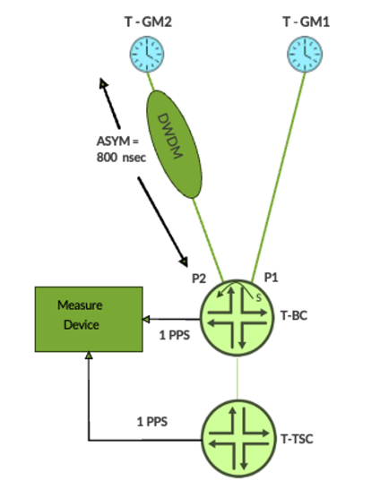
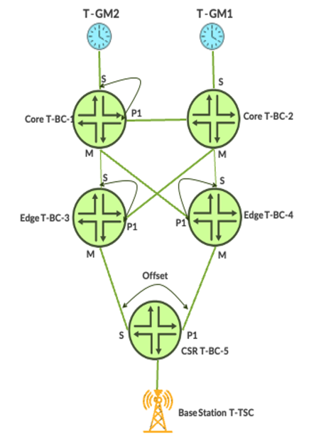
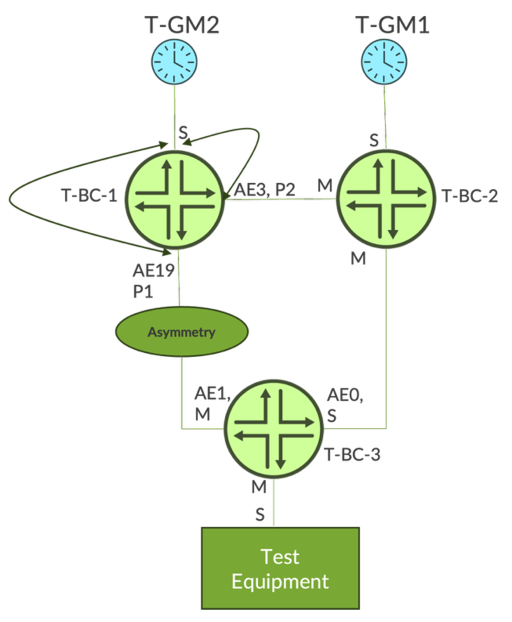
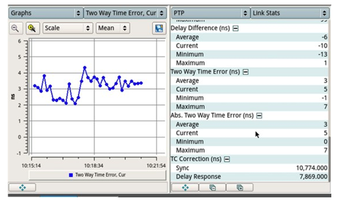

# Enhancing Network Synchronization with Passive Port Monitoring

**Kamatchi Gopalakrishnan - 10/10/2025**

## Why Synchronization Matters

In the era of 5G, CRAN, cloud-native infrastructure, and ultra-low latency applications, precise time synchronization is foundational. Juniper Networks introduces a powerful tool to elevate the visibility, accuracy, and security of synchronization networks: **Passive Port Monitoring (PPM)**.

## Introduction to Passive Port Monitoring

In modern synchronization networks, ensuring precise timing is critical. Passive Port Monitoring (PPM) plays a major role in enhancing visibility and control over synchronization accuracy. Defined in [**Annex G of ITU-T G.8275.1**](https://www.itu.int/rec/t-rec-g.8275.1/en), PPM enables the monitoring of PTP phase/time differences between passive and timeReceiver (slave) ports in T-BC/T-TSC nodes.

A distinctive feature introduced by Juniper is the "Measure-Only" port mode, which enables ports to remain in a passive state solely for monitoring purposes. This mode ensures that the ports do not transition to either master or slave roles.

## Use Cases for PPM

## Provisioning

- Measure and compensate for **asymmetry** in network nodes.
- Validate timing paths before activating them.

## Monitoring

- Continuously track time error differences across multiple network paths.
- Compare PTP phase/time differences between ports on a T-BC/T-TSC node from different upstream sources.
- Detect clock degradation or security anomalies in real time.

## Steps for Provisioning Asymmetry Compensation

Figure 1 shows a topology model of how the PPM feature can be used to determine the 800ns asymmetry introduced by the DWDM network between T-GM2 and T-BC.



## Steps for Provisioning

- Step 1. **Lock** the Boundary Clock (T-BC) to T-GM1 via port P1 and start 1PPS measurement.
- Step 2. **Measure** 1PPS, determine offset error, and apply as asymmetry compensation on port P1.
- Step 3. **Check** that offset error is zero or close to zero on 1PPS measured output.
- Step 4. **Enable** port P2 in Measure-Only mode with PPM feature.
- Step 5. **Wait 5 minutes** to get the port P2 Phase Offset relative to port P1 at T-BC.
See the "PhaseOffsetFromMaster" field in the "Sample output of PPM feature" provided in the later part of this blog.
- Step 6.** Apply compensation** for the offset on port P2.
- Step 7. **Verify** the offset is near zero after another 5 minutes wait.
- Step 8. **Remove Measure-Only** mode on P2 and switchover from P1 to P2.
- Step 9. **Check** that 1 PPS measured at the measurement device shows no significant change in Time Error (TE).
- Step 10. **Sample Output of PPM feature:**

PTP Passive Port Interface Details:

```
PPM monitor status        : Enabled
Local interface           : et-0/0/16:1.0
Source port ID            : 00:00:00:00:00:00:00:01 port-num: 4
Port state                : Passive
Configured role           : Measure-only
Measurement status        : Valid
Timestamp                 : 2023-09-19 10:53:35 PDT
PhaseOffsetFromMaster(ns) : -391 / -385 / -380 (min/mean/max)
Master->slave delay(ns)   : -3446 / -3443 / -3441 (min/mean/max)
Slave->master delay(ns)   : 2663 / 2672 / 2680 (min/mean/max)
Mean path delay(ns).      : 3057
```

## Monitoring Clock Quality in Service Provider Networks



PPM is a valuable tool for **end-to-end clock quality monitoring** across the network,Äîfrom the **core** to the **cell site**. It helps:

- Identify devices degrading clock quality.
- Detect **asymmetric delays** and **path drift**.
- Detect and mitigate **security attacks** targeting synchronization.

Sample Configuration of the T-BC-3 in Figure 2 is shown below before compensating for the phase offset:

```
set protocols ptp clock-mode boundary
set protocols ptp profile-type g.8275.1
set protocols ptp performance-monitor passive-port delay-request-rate -4
set protocols ptp slave hybrid
set protocols ptp master interface et-0/0/19.0 multicast-mode transport ieee-802.3
set protocols ptp stateful interface et-0/0/16:0.0 multicast-mode transport ieee-802.3
set protocols ptp stateful interface et-0/0/16:0.0 not-master
set protocols ptp stateful interface et-0/0/16:0.0 passive-port-monitor
set protocols ptp stateful interface et-0/0/16:1.0 multicast-mode transport ieee-802.3
set protocols ptp stateful interface et-0/0/16:1.0 passive-port-monitor measure-only
```

Sample configuration for Sync-E

```
set chassis synchronization network-option option-1
set chassis synchronization selection-mode received-quality
set chassis synchronization quality-mode-enable
set chassis synchronization enable-extended-ql-tlv
set chassis synchronization source interfaces et-0/0/16:0 priority 1
set chassis synchronization source interfaces et-0/0/16:0 wait-to-restore 0
set chassis synchronization source interfaces et-0/0/16:0 quality-level prc
set chassis synchronization source interfaces et-0/0/16:1 priority 2
set chassis synchronization source interfaces et-0/0/16:1 wait-to-restore 0
set chassis synchronization source interfaces et-0/0/16:1 quality-level prc
set chassis synchronization esmc-transmit interfaces et-0/0/19
```

## Technical Insights

- **Measure-Only Mode**: Prevents port role transitions into slave or master role, ensuring passive state.
- **Not-master**: Prevents port role transitions into the master role.
- **Phase Offset Analysis**: Enables precise asymmetry compensation on various synchronization paths.
- **Security Monitoring**: Detects spoofed or manipulated time sources by comparing multiple upstream references.

## Switchover Confidence

With PPM and Measure-Only mode, switchover between time sources can be executed with minimal impact on synchronization accuracy - ensuring **network stability and performance.**

### EMEA Service Provider using PPM to measure and compensate asymmetry

An EMEA-based Service Provider has been deploying network time synchronization for its 5G infrastructure using the ITU-T G.8275.1 profile, which incorporates both Synchronous Ethernet (SyncE) and Precision Time Protocol (PTP). In this deployment, routers configured as Boundary Clocks are interconnected via a Dense Wavelength Division Multiplexing (DWDM) transport network. While DWDM offers high-capacity and long-distance connectivity, it can introduce asymmetry in the timing path, which adversely affects synchronization accuracy.

Traditionally, detecting and measuring this asymmetry requires on-site testing with specialized equipment,Äîa process that is both time-consuming and costly. To address this challenge, the Service Provider has adopted the PPM feature, which enables remote detection and compensation of asymmetry directly from the Boundary Clock.

This approach allows for continuous monitoring. To validate the accuracy of the PPM feature, the Service Provider conducted a comparative analysis between asymmetry measurements obtained via test equipment and those derived from the PPM-enabled Boundary Clock. The results demonstrated a strong correlation between the two methods, confirming the reliability of PPM as a remote diagnostic and compensation tool for timing asymmetry in DWDM-based transport networks.

The following topology and measurement results were obtained using the test equipment. The system states are as follows:

- **T-BC-2** is SyncE-locked and PTP phase-aligned to **T-GM-1**.
- **T-BC-1** is SyncE-locked and PTP phase-aligned to **T-GM-2**.
- **T-BC-3** is SyncE-locked and PTP phase-aligned to **T-BC-2** via a link that exhibits no asymmetry.





The Figure 4 above, captured from the test equipment, indicates a current Two-Way Time Error of 5 nanoseconds. This minimal deviation confirms that no asymmetry has been introduced on the interface between T-BC-3 and T-BC-2.

The interface between T-BC-3 (AE1) and T-BC-1 (AE19) is identified as the source of asymmetry and requires further measurement. On T-BC-1, PPM is configured on both AE19 and AE3 interfaces.

The CLI output below presents the PPM measurement results for these interfaces:

- AE19 shows an offset of 6165 nanoseconds, indicating significant asymmetry on the link between T-BC-1 and T-BC-3.
- AE3 shows an offset of 8 nanoseconds, confirming that there is no notable asymmetry on the link between T-BC-1and T-BC-2.

```
lab@T-BC1-re0> show ptp passive-port-monitor-status
PTP Passive Port Interface Details:
PPM monitor status       : Enabled 
PPM delay request rate   : -4 (16 packets per second)
Actively monitored PTP ports data   :

Local interface          : ae19.0(et-0/0/3 primary)
Clock stream             : 7    
Source port ID           : aa:bb:7a:ee:aa:86:a0:8d:8a port-num: 2
Port state               : Passive              
Monitor mode             : Enabled  
PhaseOffsetThreshold(ns) : 200          
Configured role          : Measure-only
Measurement status       : Valid    
Latest measurement data  :
Timestamp                : 2025-09-08 12:56:52 CEST
PhaseOffsetFromMaster(ns): 6153     / 6165     / 6173      (min/mean/max)
Master->slave delay(ns)  : -140     / -130     / -121      (min/mean/max)
Slave->master delay(ns)  : 12446    / 12460    / 12468     (min/mean/max)
Mean path delay(ns)      : 6295      (mean)

Local interface          : ae3.0(et-1/0/2 primary)
Clock stream             : 5    
Source port ID           : 12:34:8d:aa:bb:0a:a1:ca port-num: 2
Port state               : Passive              
Monitor mode             : Enabled  
PhaseOffsetThreshold(ns) : 200          
Configured role          : Measure-only
Measurement status       : Valid    
Latest measurement data  :
Timestamp                : 2025-09-08 12:56:52 CEST
PhaseOffsetFromMaster(ns): 1        / 8        / 19        (min/mean/max)
Master->slave delay(ns)  : 120      / 126      / 133       (min/mean/max)
Slave->master delay(ns)  : -117     / -109     / -95       (min/mean/max)
Mean path delay(ns)      : 117       (mean)
```

To compensate for the asymmetry observed on the AE19 interface of T-BC-1 towards T-BC-3, the following command can be used. This configuration adjusts the timing offset to correct the measured deviation and restore phase alignment across the link:

```
lab@T-BC1-re0#set protocols ptp stateful interface ae19.0 multicast-mode asymmetry -12330
```

> Note: Asymmetry is always twice the measured offset, with the opposite sign. In this case, the measured offset is +6165 **nanoseconds**; therefore, the required asymmetry compensation is ,àí12,330 nanoseconds to correct it.

The output below, obtained from the CLI command on **T-BC-1**, displays the PPM measurement for the **AE19** interface **after asymmetry compensation** has been applied. This data confirms the effectiveness of the correction and reflects the updated timing offset across the link:

```
lab@T-BC1-re0> show ptp passive-port-monitor-status

PTP Passive Port Interface Details:
PPM monitor status       : Enabled 
PPM delay request rate   : -4 (16 packets per second)
Actively monitored PTP ports data   :
 
Local interface          : ae19.0(et-0/0/3 primary)
Clock stream             : 7    
Source port ID           : aa:bb:7a:ee:aa:86:a0:8d:8a port-num: 2
Port state               : Passive              
Monitor mode             : Enabled  
PhaseOffsetThreshold(ns) : 200          
Configured role          : Measure-only
Measurement status       : Valid    
Latest measurement data  :
Timestamp                : 2025-09-08 13:06:52 CEST
PhaseOffsetFromMaster(ns): -12      / 0        / 8         (min/mean/max)
Master->slave delay(ns)  : -6304    / -6294    / -6286     (min/mean/max)
Slave->master delay(ns)  : 6279     / 6295     / 6303      (min/mean/max)
Mean path delay(ns)      : 6294      (mean)
```

## Conclusion

Juniper's Passive Port Monitoring (PPM) is a **great tool** for service providers and enterprises seeking **high-precision, secure, and resilient synchronization**. Whether you're provisioning new paths or monitoring live networks, PPM delivers the insights needed to maintain timing integrity.

## References

- [ITU-T G.8275.1 (2022)](https://www.itu.int/rec/t-rec-g.8275.1/en) Amendment 2 (08/24): Precision time protocol telecom profile for phase/time synchronization with full timing support from network.

## Acknowledgments

Thanks to Shankar Ganesan, Staff Engineer, and Rafik P, Sr. Product Manager
