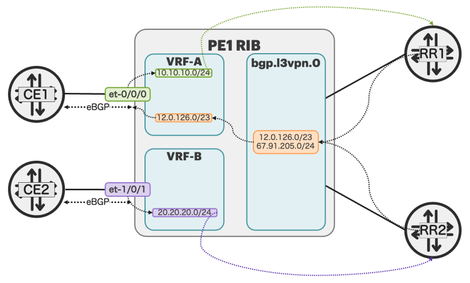
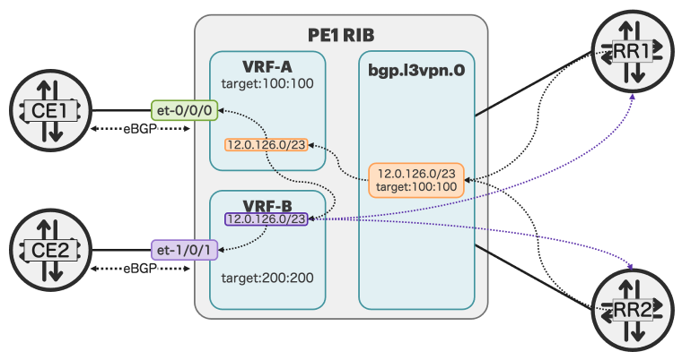

# Enhancing Route Manipulation

**Moshiko Nayman - 02/05/2026**

Advanced Junos OS route control techniques, such as rib-groups, vpn-global-import, and rib-export, enable selective sharing, controlled leaking, and cloning of routes across different RIBs while maintaining loop prevention for complex service-provider routing scenarios.

## Introduction

Junos OS 25.2 and 25.4 introduces a powerful vrset of new features that enhance the already extensive route manipulation toolkit available to service providers. Building on decades of proven routing capabilities (including rib-groups, auto-export, and advanced policy controls),

We will explore two enhancements, **rib-export** (Junos 25.2) for controlled secondary route cloning, and **route-target-prefix-count** (Junos 25.4) for per-customer prefix limiting at scale. They are particularly valuable in complex BGP/MPLS L3VPN deployments at scale, where traditional mechanisms reach their limits.

This article focuses on two key features:

- 1. **rib-export**, enables cloning of secondary routes across routing tables, solving the limitations of traditional rib-groups
- 2. **route-target-prefix-count**, enforces per-customer prefix limits in multi-VPN environments, going beyond traditional BGP peer-level prefix-limits

## Understanding Routes in Junos: Primary vs. Secondary

Before diving into the new features, it's essential to understand the distinction between primary and secondary routes in Junos, particularly in L3VPN environments.

## Route Types in L3VPN

In BGP/MPLS L3VPNs, routes fall into two categories based on their origin and how they're learned:

### CE Routes (Customer Edge)

These are routes received directly by a Provider Edge (PE) router from connected Customer Edge (CE) routers. They're learned over BGP inet unicast (AFI 1 / SAFI 1 for IPv4) or inet6 unicast (AFI 2 / SAFI 1 for IPv6) within a VRF (routing-instance). These routes are installed as **primary routes** in the VRF's routing table because they originate directly from the customer equipment.

Example:

A customer's CE router at Site A advertises 10.10.10.0/24 to your PE router. This prefix becomes a primary route in the customer's VRF and will be exported from that RIB table

```
mnayman@MX304-PE1> show bgp statistics 

VPN NLRI being advertised from main-tables: inet-mvpn inet6-mvpn inet-transport inet6-transport, because:
   Apps requested to advertise from main-tables for: inet-mvpn inet6-mvpn inet-transport inet6-transport
```

Unless the router is acting as an RR or ASBR for that address family. In that case, the CE routes will be exported into the bgp.l3vpn.0 table and will also be exported from there. To verify

```
mnayman@MX304-RR1> show bgp statistics 

 VPN NLRI being advertised from main-tables: inet-vpn-unicast evpn, because:
   Configured as RR/ASBR for: inet-vpn-unicast
```

### PE Routes (Remote Provider Edge)

These are routes learned over BGP inet-vpn unicast (SAFI 128, also known as VPNv4) or inet6-vpn unicast (SAFI 128, also known as VPNv6) from remote PE routers within the service provider's VPN backbone. When these routes arrive, they're initially stored in the bgp.l3vpn.0 table (for IPv4) or bgp.l3vpn-inet6.0 table (for IPv6) as primary routes. They're then imported into the local VRF's routing table as **secondary routes** based on matching vrf-target or vrf-import Route Target (RT) communities.

Example: The same 10.10.10.0/24 prefix from Site A is advertised by the remote PE to your local PE. It arrives in your bgp.l3vpn.0 table, then gets imported into your customer's VRF as a secondary route.

To verify

```
mnayman@MX304-PE1> show route 192.168.223.0/24 extensive | match "pri|sec"  
                State: <Secondary Active Int Ext ProtectionPath ProtectionCand>
                Primary Routing Table: bgp.l3vpn.0
                Secondary Tables: inet.0
```

## The Route Import Flow

```
+-------------------------------------------------------------+
|  Remote PE advertises 12.0.126.0/23 via inet-vpn unicast    |
|  with Route Target: target:100:100                          |
|                                                             |
|  Stored in: bgp.l3vpn.0 (Primary)                           |
|  (bgp.l3vpn-inet6.0 for IPv6 routes)                        |
+-----------------------+-------------------------------------+
                        |
                        | Route Target Match
                        |
                        v
+-------------------------------------------------------------+
|  Local VRF (VRF-A) imports the route                        |
|  12.0.126.0/23 becomes Secondary in VRF-A.inet.0            |
|  (or VRF-A.inet6.0 for IPv6)                                |
+-------------------------------------------------------------+
```



The key limitation: Secondary routes cannot be re-advertised via BGP due to Junos's built-in loop prevention mechanism. This ensures that routes learned through the VPN backbone cannot inadvertently leak back into BGP advertisements and prevents spoofing.

## Existing Route Leaking Capabilities in Junos

Before discussing the new rib-export feature, it's important to recognize that Junos already offers **a rich and mature toolkit for route manipulation and leaking

The new features enhance, rather than replace these capabilities.

## Current Route Leaking Mechanisms

### 1. rib-groups (Available since Junos OS 7.4)

The cornerstone of route sharing in Junos, rib-groups, function as templates that enable selective sharing of routing information across multiple routing tables. A primary routing table can export specific routes, or entire tables, to other RIBs or routing instances.

The mechanism supports two key operations:

- **import-rib**: Defines which routing tables receive the copied routes
- **export-rib**: Specifies the source table for BGP route advertisements (useful for interdomain routing)

Example configuration:

```
set routing-options rib-groups VRF-A-TO-VRF-B import-rib VRF-A.inet.0
set routing-options rib-groups VRF-A-TO-VRF-B import-rib VRF-B.inet.0
set routing-instances VRF-A routing-options interface-routes rib-group inet VRF-A-TO-VRF-B
```

RIB groups also enable stitching between IP and MPLS tables (e.g., populating inet.3 from inet.0), which is of many methods for BGP next-hop resolution in MPLS environments.

**Limitation**: Works primarily with primary routes. Secondary routes (those imported into VRFs from bgp.l3vpn.0) cannot be re-exported using traditional rib-groups due to loop prevention mechanisms.

### 2. auto-export (Available since Junos OS 7.4)

A streamlined feature that simplifies VRF route leaking by automatically exporting routes between routing instances or to the global table. Unlike rib-groups, the auto-export doesn't require defining explicit RIB group templates. Instead, it evaluates export policies dynamically to determine which routes should be shared.

This feature is particularly useful for sharing VRF routes with the global routing table (inet.0) or dynamic route leaking between VRFs based on policy matching.

It simplify configurations where full rib-group control isn't needed

Example configuration:

```
set routing-instances VRF-A routing-options auto-export family inet unicast
```

With auto-export, routes learned locally in the VRF (primary routes from CE routers) are automatically evaluated against configured export policies. Matching routes are then exported to target tables without manual RIB group definitions.

**Limitation**: Only works with locally learned routes (primary in the VRF). Does not handle secondary routes imported from bgp.l3vpn.0.

### 3. vpn-global-import (Available since Junos OS 24.2)

A specialized feature designed to leak remote L3VPN routes from bgp.l3vpn.0 or bgp.l3vpn-inet6.0 into the global internet tables (inet.0 or inet6.0). Prior to this feature, importing VPN routes to the global table was deliberately blocked to prevent route leaks and internet IP spoofing.

The vpn-global-import knob provides controlled leaking with policy-based filtering:

```
set routing-options rib inet.0 vpn-global-import INETVPN-TO-INET0
set policy-options policy-statement INETVPN-TO-INET0 term CUSTOMER from community SAFE-CUSTOMER
set policy-options policy-statement INETVPN-TO-INET0 term CUSTOMER then accept
set policy-options policy-statement INETVPN-TO-INET0 term REST then reject
set policy-options community SAFE-CUSTOMER members target:999:999
```

This feature is critical for use cases such as providing internet access to VPN customers, creating intentional asymmetric routing for DDoS protection, controlled advertisement of VPN prefixes to the internet backbone

**Important**: Only leak public, authorized prefixes to the global table. Service providers must implement strict policy controls to prevent accidental leaks of private address space or hijacked prefixes.

### 4. BGP within the Same Router

For extreme cases requiring complete attribute stripping, Junos supports establishing iBGP adjacencies within the same router (or between logical-systems) to intentionally re-originate routes with a completely clean attribute set.

**Advantage**: Complete attribute control. Routes are re-advertised as if originated locally, without any inherited BGP attributes (originator-id, cluster-list, AS-path modifications).

**Caution**: This technique bypasses standard loop prevention mechanisms. Use with extreme care and comprehensive policy controls to avoid routing loops, black holes, or unintended route propagation. Primarily used in advanced scenarios where standard features are insufficient.

## Built-in Loop Prevention

All these mechanisms respect Junos's built-in loop-prevention framework and implement the relevant BGP RFC-defined mechanisms, along with Junos-specific safeguards, ensuring routing stability and preventing inadvertent loops:

- **ORIGINATOR_ID (RFC 4456)**
Identifies the router that injected the route into BGP. A route containing the local ORIGINATOR_ID is rejected to prevent intra-AS loops.
- **CLUSTER_LIST (RFC 4456)**
Tracks the RR clusters a route has traversed. A route reflector discards any route containing its own Cluster ID to avoid reflection loops.
- **AS_PATH (RFC 4271)**
Provides fundamental BGP loop prevention by rejecting routes that contain the local AS.
- **Secondary Route Restriction (Junos)**
Secondary VPN routes imported from bgp.l3vpn.0 are not re-advertised via BGP, preventing unintended VPN route leakage.

In BGP/MPLS L3VPNs, routes fall into two categories based on their origin and how they're The new rib-export feature enhances this ecosystem by providing a standardized, attribute-aware way to clone secondary routes while maintaining these critical safeguards. Unlike workarounds (such as internal BGP sessions), rib-export integrates seamlessly with Junos's loop prevention logic.

## RIB Export Feature: Cloning Routes with Control

### Why rib-export Matters

As we've established, secondary routes cannot be re-advertised due to Junos's loop prevention mechanisms. However, there are legitimate use cases where you need to clone these routes to make them primary in another table: disaster recovery architectures, multi-tier VPN hierarchies, or controlled route sharing across isolated VRFs. Traditional rib-groups cannot solve this. This is where rib-export comes in.

### The Solution: rib-export, Controlled Secondary Route Cloning

Introduced in Junos OS 25.2, rib-export provides a standardized mechanism to copy routes (including secondary routes) from one RIB to another as **new primary routes**, enabling them to be advertised via BGP while maintaining loop prevention.

### How rib-export Works

```
+------------------------------------------------------------------+
| Step 1: Remote PE advertises 12.0.126.0/23 with RT:100:100       |
|         Route installed in bgp.l3vpn.0 (Primary)                 |
+----------------------------+-------------------------------------+
                             |
                             | RT Match & Import
                             v
+------------------------------------------------------------------+
| Step 2: VRF-A.inet.0 imports route (Secondary)                   |
|         12.0.126.0/23 [BGP/170] - cannot be re-advertised        |
+----------------------------+-------------------------------------+
                             |
                             | rib-export Applied
                             v
+------------------------------------------------------------------+
| Step 3: VRF-B.inet.0 receives cloned route (Primary!)            |
|         12.0.126.0/23 [RIB-Export/190] - can be advertised       |
|         Attributes: stripped per policy, new origination         |
+------------------------------------------------------------------+
```



Unlike traditional rib-groups and auto-export, rib-export offers distinct advantages.

It clones secondary routes and re-originates them as primary routes in the target table rather than creating secondary copies. This capability includes flexible attribute control, allowing you to strip specific attributes (originator-id, cluster-list, extended-community) via policy to fine-tune loop prevention behavior. Internally, rib-export uses identifiers to track exported routes and prevent reloops, complementing existing mechanisms like rib-groups and auto-export for comprehensive route control.

The cloned route receives a new protocol identifier RIB-Export visible in the routing table, making it immediately recognizable to operators as a re-originated route. This designation indicates the route can be treated as locally originated, making it eligible for BGP advertisement, policy manipulation, and further processing.

## Configuration Example

### 1. Define the rib-export group:

```
set routing-options rib-exports rib-export-group CLONE-A to-rib VRF-A-CLONE.inet.0
```

This statement specifies: - CLONE-A, name of the export group to-rib VRF-A-CLONE.inet.0, target routing table where routes will be cloned

### 2. Apply the rib-export to a VRF:

```
set routing-instances VRF-A routing-options rib VRF-A.inet.0 rib-export CLONE-A
```

This enables the CLONE-A export group on VRF-A's primary routing table.

### 3. (Optional) Strip route attributes using policy:

```
set policy-options policy-statement ROUTE-CLONE term 1 then rib-export-strip cluster-list
set policy-options policy-statement ROUTE-CLONE term 1 then rib-export-strip originator-id
```

These policy actions control which BGP attributes are carried over to the cloned route:

**Available rib-export-strip options:**

- Attribute (10) CLUSTER_LIST with cluster-list knob, strip the BGP cluster list attribute from a cloned route.
The BGP originator id attribute is implicitly set to "self" when the cluster list attribute is removed.

- Attribute (9) ORIGINATOR_ID with originator-id knob, strip the originator ID

Stripping these attributes is useful when you need to re-advertise routes through Route Reflector hierarchies or when the cloned route should appear as a fresh origination without VPN-related attributes.

### 4. (Optional) Apply import policy to the rib-export group:

```
set routing-options rib-exports rib-export-group CLONE-A policy SELECTIVE-EXPORT
set policy-options policy-statement SELECTIVE-EXPORT term PRODUCTION from route-filter 12.0.126.0/23 exact
set policy-options policy-statement SELECTIVE-EXPORT term PRODUCTION then accept
set policy-options policy-statement SELECTIVE-EXPORT term DEFAULT then reject
```

This allows selective cloning - only routes matching the policy criteria will be copied to the target table.

## Operational Validation

Once configured, you can verify rib-export functionality with these commands:

**Check route in the source VRF:**

```
mnayman@vSRX1> show route table VRF-A 12.0.126.0/23 extensive | match "pri|sec"
                   State: <Secondary Active Int Ext ProtectionCand>
                Primary Routing Table: bgp.l3vpn.0
```

**Verify route appears in the cloned table:**

```
mnayman@vSRX1> show route 12.0.126.0/23 exact

VRF-A.inet.0: 33 destinations, 43 routes (33 active, 0 holddown, 0 hidden)
+ = Active Route, - = Last Active, * = Both

 12.0.126.0/23      *[BGP/170] 00:15:14, localpref 100, from 172.16.1.100
                       AS path: I, validation-state: unverified
                     >  to 10.106.1.1 via ge-0/0/6.0, Push 16, Push 300000(top)

VRF-A-CLONE.inet.0: 33 destinations, 33 routes (33 active, 0 holddown, 0 hidden)
+ = Active Route, - = Last Active, * = Both

 12.0.126.0/23      *[RIB-Export/190] 00:02:29, metric2 1
                     >  to 10.106.1.1 via ge-0/0/6.0, Push 16, Push 300000(top)
```

Note the protocol change from BGP/170 to RIB-Export/190, indicating the route has been re-originated in the target table.

**Confirm the route can be advertised:**

```
mnayman@vSRX1> show route advertising-protocol bgp 172.16.1.100 12.0.126.0/23

VRF-A-CLONE.inet.0: 33 destinations, 33 routes (33 active, 0 holddown, 0 hidden)

  Prefix                  Nexthop              MED     Lclpref    AS path
* 12.0.126.0/23           Self                         100        I
```

The route now appears as Self (originated locally), confirming it can be advertised.

## Important Considerations

### Prerequisite: MPLS Label Resolution

Prefixes learned via the inet-vpn family require a resolvable next hop in the inet.3 table for proper installation and forwarding. Similarly, inet6-vpn routes require resolution in the inet6.3 (or inet.3) table.

This resolution occurs automatically when MPLS forwarding paths are created through mechanisms such as LDP or RSVP. However, Junos offers additional options to control or customize MPLS resolution:

### Option 1: Using the resolve-vpn knob

```
set protocols bgp family inet labeled-unicast resolve-vpn 
set protocols bgp group <group_name> family inet labeled-unicast resolve-vpn 
set protocols bgp group <group_name> neighbor <address> family inet labeled-unicast resolve-vpn
```

### Option 2: Leaking routes via rib-groups

- For interface routes:

```
set routing-options rib-groups INET0-INET3 import-rib inet.0
set routing-options rib-groups INET0-INET3 import-rib inet.3
set routing-options interface-routes rib-group inet INET0-INET3 
```

- For BGP routes:

```
set routing-options rib-groups INET0-INET3 import-rib inet.0
set routing-options rib-groups INET0-INET3 import-rib inet.3
set protocols bgp group JUNIPER family inet unicast rib-group INET0-INET3
```

### Option 3: Customize resolution RIBs for BGP Labeled Unicast (BGP-LU)

You can instruct Junos to use alternative tables for next-hop resolution instead of the default inet.3 table.

```
set routing-options resolution rib inet.0 resolution-ribs bgp.l3vpn.0
```

This tells Junos to look at inet.0 for resolution instead of inet.3 when resolving BGP inet-vpn routes from bgp.l3vpn.0.

## Per-VPN Prefix Limiting

## The Challenge: Granularity Limitations of Session-Level prefix-limit

Junos offers the BGP prefix-limit feature, which is highly efficient and performant, operating directly at the BGP session level. You can choose several enforcement actions when the limit is reached:

- Log when the limit is exceeded using maximum knob
- Silently discard any prefixes beyond the limit using drop-excess
- Accept but mark excess prefixes unusable using hide-excess
- Terminate the BGP session when the limit is violated using teardown

However, in extreme large-scale networks and customer environments with many VPN sites, you may need finer-grained per-customer control than what prefix-limit can provide.

While this is a rare scenario, it can be useful for Route Reflectors.

### Example Scenario: Extra Large Customer with Strict Prefix Quota

Consider a hyperscale customer with the following deployment:

- 1,000 VPN sites with active BGP connections
- Up to 100,000 prefixes per site (each PE-CE connection)
- Customer total routes from all sites must not exceed 2,000,000

### Why session-level prefix-limit may not be sufficient

On each PE, configured prefix-limit: 100,000 per CE connection.  Each PE enforces this per-site limit locally, working perfectly. However, each PE also advertises this customer's routes to the VPN-RR on its own BGP session to the VPN-RR.

From the RR's perspective:

- Per PE session: 100,000 routes (enforced by each PE's prefix-limit)
- Total from all 1,000 PEs: 10,000,000 routes arriving at the VPN-RR

**The problem:** The VPN-RR could potentially receive 10 million routes from this customer across 1,000 separate PE sessions, even though the limit for this customer to a total of 2 million. The VPN-RR has no mechanism to aggregate and enforce a per-customer limit across multiple PE sessions. A session-level prefix-limit cannot recognize that all these routes belong to the same customer and should share a unified quota.

**The requirement:** Enforce a per-customer 2M prefix baseline, regardless of how many PE connections they have, treating the customer as a single entity at the VPN-RR.

### The Solution: route-target-prefix-count

Introduced in Junos OS 25.4, route-target-prefix-count feature provides per-customer granularity by enforcing limits based on Route Target communities rather than BGP sessions. Instead of limiting at the peer level, it limits per customer (identified by RT), regardless of how many sites or PE routers they use.

*Key Advantages*

1. **Customer-Granular Control**, each customer's prefixes are counted separately, regardless of how many sites or PE routers they use
2. **Route Reflector Enforcement**, ideal for central RRs that see many VPNs on a single BGP session
3. **Transparent to Customers**, limits are enforced without requiring per-customer BGP sessions
4. **Deterministic Behavior**, works with multihoming and redundancy without affecting other customers

## Configuration Example

### 1. Create a community definition for your customer

```
set policy-options community COMM-PROVIDER-A members target:65000:100
```

### 2. Configure the import policy with route-target-prefix-count

The key configuration uses a combination of community matching and the route-target-prefix-count match condition:

```
set policy-options policy-statement BGP-IMPORT term PROVIDER-A from community COMM-PROVIDER-A
set policy-options policy-statement BGP-IMPORT term PROVIDER-A from route-target-prefix-count 10000 orhigher
set policy-options policy-statement BGP-IMPORT term PROVIDER-A then reject
set policy-options policy-statement BGP-IMPORT term ALLOW-UNDER-LIMIT then accept
```

How it works:

1. **Community match**: Identifies which Route Target(s) this term applies to
2. **route-target-prefix-count orhigher**: Matches when the prefix count for the matched RT(s) equals or exceeds the threshold
3. **then reject**: Routes beyond the limit are marked as hidden/unusable
4. **ALLOW-UNDER-LIMIT term**: Accepts routes that don't match the count limit

This evaluates to true when the current count for the Route Target >= specified limit.

### 3. Apply the policy to your BGP session

```
set protocols bgp group RR_CUSTOMERS family inet-vpn unicast import BGP-IMPORT
```

## Operational Monitoring to check RT prefix counts and limits

```
show community all
show community route-target prefix-count
show community route-target limit-exceeded
show community route-target limit-exceeded member target:65000:100
```

These commands display:

- All defined communities in the system
- Current prefix count per Route Target (live counter)
- Which Route Targets have exceeded their configured limits
- Detailed information for a specific Route Target

Example output from a Route Reflector:

**Viewing all RT prefix counts:**

```
mnayman@RR1> show community route-target limit-exceeded

Communities: target:100:100 (CUSTOMER-A)
    References: 12
    Bucket: 512
    Well known ExtCom mask: rtgt
    BGP Prefix Count: 2,100,000    <- Exceeds 2M limit
    Limit Exceeded Count: 47       <- Policy rejected 47 updates

Communities: target:200:200 (CUSTOMER-B)
    References: 8
    Bucket: 513
    Well known ExtCom mask: rtgt
    BGP Prefix Count: 1,800,000    <- Under 2M limit
```

**Checking hidden routes due to limit:**

```
mnayman@RR1> show route table bgp.l3vpn.0 hidden extensive | match "Community|Hidden" 
bgp.l3vpn.0: 13847292 destinations, 13847292 routes (13747292 active, 0 holddown, 100000 hidden)
                State: <Hidden Ext Changed ProtectionPath ProtectionCand>
                Hidden reason: Route Target Prefix Limit Exceeded
```

## Important Caveats and Behaviors

Import Policy Evaluation Timing:

- **On-wire enforcement**, limits are strictly enforced when BGP updates arrive
- **Config changes**, if you increase the limit after it's been exceeded, hidden routes may be unhidden automatically
- **Decrease limits**, lowering a limit does NOT hide already-installed routes (requires manual clear bgp soft-reconfig import)

## Comparison: prefix-limit vs. route-target-prefix-count

| Aspect | prefix-limit | route-target-prefix-count |
|:--|:--|:--|
| Scope | Per peer-family | Per Route Target (per customer) |
| Use Case | Peer-based limiting | Customer-based limiting |
| Ideal for | Direct CE connections | Route Reflectors, multi-site customers |
| Enforcement | At BGP session level | At policy evaluation level |
| Transparency | Affects the BGP session | Transparent route filtering |
| Scalability | Requires many sessions | Single session, multiple VPNs |
| Actions | Teardown, log, drop, hide | Accept or reject (via policy) |

## Summary

Junos OS 25.4's route manipulation features, **rib-export **and **route-target-prefix-count**, provide service providers with unprecedented control and scalability:

- **rib-export** solves the secondary route limitation by creating primary copies, enabling route re-advertisement and flexibility in multi-table deployments
- **route-target-prefix-count** addresses scale challenges in multi-VPN environments by enforcing per-customer limits instead of peer-level limits

## Glossary

- AFI Address Family Identifier
- BGP Border Gateway Protocol
- CE Customer Edge router
- IFL Logical interface
- IP Internet Protocol
- EVPN Ethernet Virtual Private Network
- L3VPN Layer 3 VPN
- L2VPN Layer 2 Virtual Private Network
- MPLS Multiprotocol Label Switching
- PE Provider Edge router
- RIB Routing Information Base
- RT Route Target
- SAFI Subsequent Address Family Identifier
- VPN Virtual Private Network
- VRF Virtual Routing and Forwarding

## Useful Links

- L3VPN to Global RIB Leaking: [https://juniper.github.io/techposts/l3vpn-to-global-rib-leaking/article](https://juniper.github.io/techposts/l3vpn-to-global-rib-leaking/article)
- Juniper RIB Groups Documentation: [https://www.juniper.net/documentation/us/en/software/junos/cli-reference/topics/ref/statement/rib-groups-edit-routing-options.html](https://www.juniper.net/documentation/us/en/software/junos/cli-reference/topics/ref/statement/rib-groups-edit-routing-options.html)
- What is the use of RIB groups: [https://supportportal.juniper.net/s/article/Junos-What-is-the-use-of-RIB-groups-and-how-are-they-used](https://supportportal.juniper.net/s/article/Junos-What-is-the-use-of-RIB-groups-and-how-are-they-used)
- BGP Prefix Limit: [https://www.juniper.net/documentation/us/en/software/junos/cli-reference/topics/ref/statement/prefix-limit-edit-protocols-bgp.html](https://www.juniper.net/documentation/us/en/software/junos/cli-reference/topics/ref/statement/prefix-limit-edit-protocols-bgp.html)
- Auto-Export: [https://www.juniper.net/documentation/us/en/software/junos/cli-reference/topics/ref/statement/auto-export-edit-routing-options.html](https://www.juniper.net/documentation/us/en/software/junos/cli-reference/topics/ref/statement/auto-export-edit-routing-options.html)

## Acknowledgments

Special thanks to Kaliraj Vairavakkalai, Ashish Kumar, Shivam Agrawal, and Truman Joe for their collaboration in identifying the problem statement, requirements, scoping, and developing these features in Junos.
