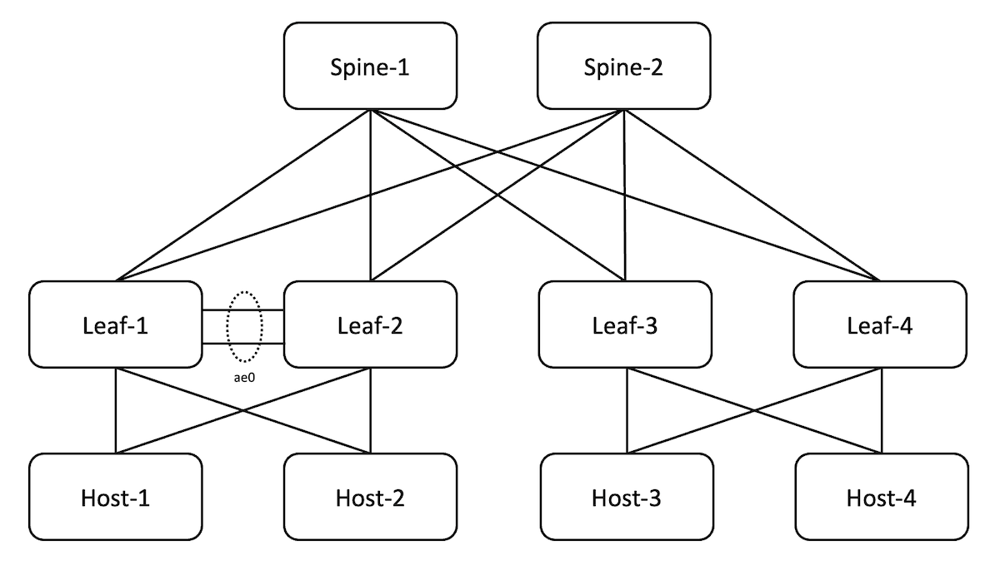
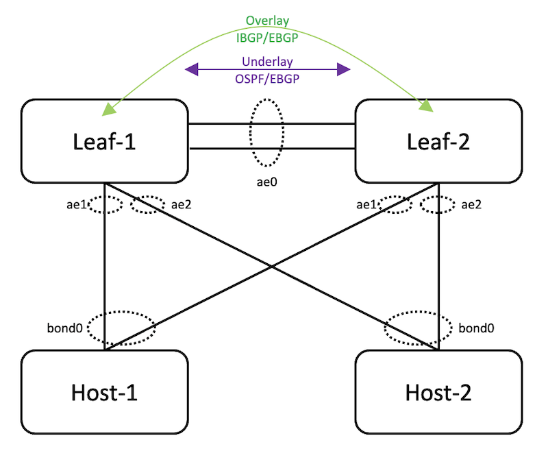

# ESI-LAG Made Easier with EZ-LAG

**Ridha Hamidi - 10/10/2023**


A detailed configuration example that shows how to dual-home data center servers to Juniper leaf switches by using EZ-LAG, a simplified version on ESI-LAG made for customers looking for a smooth transition from Multi-Chassis LAG without having to immediately learn all the features and complexities of EVPN-VXLAN technology.

## Introduction

Dual homing is an essential feature to provide connection redundancy for data center servers. Vendors have implemented multiple solutions to avoid single switch failure in data center fabrics, and to fulfill the need for redundant server connectivity, like Virtual-Chassis and MC-LAG/MLAG. These solutions are generally based on proprietary protocols and have variable levels of complexity for configuration and troubleshooting. In most recent years, and with the increasing adoption of EVPN-VXLAN as the founding technology for building modern and resilient data centers, ESI-LAG became the de-facto dual-homing solution between servers and Top-Of-Rack (TOR) switches. However, customers who are only looking for a better alternative to MC-LAG, adopting EVPN-VXLAN technology solely to fulfill the need for server dual-homing, is a steep transition and a hard decision to make, given the learning curve for this new technology.

## Topology



- The fabric is preconfigured to provide basic underlay connectivity and all leafs and spines redistribute and receive all lookback addresses via the underlay protocol.

- In this post, we will use EBGP as the underlay protocol, but we will explain later that OSPF can be equally used.

- For the sake of comparing EZ-LAG to ESI-LAG and providing connectivity between all the hosts in the topology, the fabric is configured with BGP as an overlay protocol for family evpn, but only Leaf-3 and Leaf-4 are configured for EVPN-VXLAN. Therefore, Host-3 and Host-4 are dual homed to Leaf-3 and Leaf-4 with ESI-LAG and have overlay connectivity, but there is no connectivity between Host-1/Host-2 and Host-3/Host-4. The objective is to show how to achieve that connectivity by configuring EZ-LAG. Therefore, in the rest of this post, we will focus solely on the configuration of Leaf-1 and Leaf-2 for EZ-LAG.

- In this post, we will use EBGP as the overlay protocol, but we will explain later that IBGP can be equally used.

## How Does EZ-LAG Work?



- A new configuration hierarchy, called "evpn" under "services" stanza has been introduced specifically for EZ-LAG, where the user can specify a limited set of parameters to configure the feature.

- A Python script that the user can call via a commit script. The commit script takes the set of parameters specified by the user and derives all the necessary configuration to build the EZ-LAG. All configuration generated by the commit script will not be visible to the user, unless they explicitly specify "display commit-script", that's how the complexity of configuration is hidden from users who want to use the benefits of EZ-LAG feature, without carrying the complexity of its configuration.

```
show services evpn {
        defaults-override {
            no-aggregate-device-count-config;
            no-loop-detect-config;
            no-platform-defaults-config;
            no-policy-and-routing-options-config;
            no-storm-control-config;
            no-underlay-config; # hidden
        }
        global-parameters {
            start-aggregate-ethernet-index [ae-index];
            default-vlan-id [vlan-id];
            anycast-mac [mac-address];
            virtual-gateway {
                v4-mac [mac-address];
                v6-mac [mac-address];
            }
            virtual-gateway-mac [mac-address];
            no-irb-address-auto-derive;
        }
        device-attribute {
            peer-id [peer-id];
            loopback-subnet [subnet-address];
            system-id [system-id];
            peer-to-peer {
                peer-subnet {
                    inet [ipv4-address];
                    inet6 [ipv6-address];
                    interface-name [interface-list];
                }
                overlay-connectivity {
                    ibgp;
                }
                underlay-connectivity {
                    ospf;
                }
            }
        }
        evpn-vxlan {
            dhcp-relay [relay-group] {
                relay-source [relay-source];
                dhcp-server-address [dhcp-server-address];
                vrf-instance [instance-id];
            }
            irb [irb-instance-name]
                use-anycast-address;
                subnet-address {
                    inet [ipv4-subnet-address];
                    inet6 [ipv6-subnet-address];
                    virtual-gateway-v4-address [gateway-v4-address];
                    virtual-gateway-v6-address [gateway-v6-address];
                    no-irb-address-auto-derive;
                }
                no-dhcp-relay;
                vlan-id [vlan-id];
                instance {
                    vrf-instance [instance-id];
                    mac-vrf-instance [instance-id];
                }
                apply-config-groups [group-name];
            }
            server [server-name] {
                esi-lag-id [esi-lag-id];
                single-home-id [single-home-id];
                enable-pxe-boot;
                vlan-id-list [vlan-id-list];
                mac-vrf-instance [instance-id] vlan-id-list [vlan-id-list];
                interface [interface-name];
                apply-config-groups [group-name];
                no-lacp;
            }
        }
    }
    traceoptions {
        level {
              all;
              error;
              info;
              notice;
              verbose;
              warning;
        }
        flag {
              all;
              chassis;
              forwarding-options;
              input-configuration;
              Interfaces;
              policy-options;
              Protocols;
              routing-instance;
              routing-options;
    }
}
```

- "defaults-override" : all configuration knobs under this section are optional ; in this section, the user can specify all parameters they want to preserve, so the commit script will not override them. For example, if the user prefers to use a pre-configured ASN and specify "no-policy-and-routing-options-config" then they will need to configure everything under ""routing-options" and "policy-options" hierarchies that are needed for EZ-LAG to function, like a Router-ID, a policy to export loopback addresses in the underlay, and a policy to load balance traffic exported to the forwarding table. Otherwise, an error will be thrown if you try to commit.
- "global-parameters" : all configuration knobs under this section are optional ; in this section, the user specifies the parameters that are common to both peers
- "device-attribute" : all configuration knobs under this section are mandatory, except "overlay-connectivity" ; this section contains parameters that are specific to the local peer. Parameters in this section must be carefully selected because must either match or be compatible with what is configured on the remote peer.
- "evpn-vxlan" : this section contains a mix of mandatory and optional parameters ; in this section, the user specifies the parameters needed to configure EVPN-VXLAN for EZ-LAG to function. This section requires a minimum understanding of how this feature works.

Table 1 below provides more details about the new configuration stanzas, attributes, their purpose, and if they are mandatory or optional:

Table: Parameters in Services EVPN Configuration Hierarchy

| Object | Attribute | Description | Mandatory |
|:--|:--|:--|:--|
| default-override |  | All configuration parameters in this section are optional. In this section, the user specifies which configuration sections they want to configure manually and to prevent them from being over-written by auto-derived parameters. | No |
|  | no-platform-defaults-config | Do not auto-derive platform specific configurations. | No |
|  | no-aggregate-device-count-config | EZ-LAG needs at least two ae interfaces to function, ae0 for inter-chassis link, then one per dual-homed server.Device count must be configured otherwise the script will use the platform default, commonly 255 | No |
|  | no-policy-and-routing-options-config | EZ-LAG script needs to configure autonomous-system and router-id under routing-options section, and per-packet load-balancing and export loopback under policy-options section. This knob id to allow the user to configure these manually.Note that if policies are configured manually, their names must be "pplb" and "EXPORT-LO0" | No |
|  | no-loop-detect-config | This knob can be used to configure "protocols loop-detect" section manually. The auto-derived configuration of this section will be shown later in this post | No |
|  | no-storm-control-config | This know lets the user configure storm-control manually under interfaces and forwarding-options sections. More details on this later in this post. | No |
|  | no-underlay-config | This is a hidden knob that instructs the script not to generate an underlay configuration section.At the time of writing this post, this knob is not implemented | No |
| global-parameters |  | This section contains parameters that are common across peers |  |
|  | start-aggregate-ethernet-index [ae-index] | By default, the script starts assigning dual-homed server interfaces starting from ae1. This knob allows to start the numbering from a different index to avoid potential conflicts | No |
|  | default-vlan-id [vlan-id] | Specify the default VLAN ID. The default is system-default, generally 0 | No |
|  | anycast-mac [mac-address] | In case anycast is used for irb interfaces, this knob allows to configure the anycast MAC address.If virtual-gateway is used, this MAC address will be used as virtual-gateway-v4-mac | No |
|  | no-irb-address-auto-derive | Do not auto-derive address and use the subnet address as is | No |
| virtual-gateway |  | You can configure either virtual-gateway-mac or virtual-gateway and then either v4-mac or v6-mac or both parameters | No |
|  | v4-mac [mac-address] | The default is 00:00:5e:00:01:01 | No |
|  | v6-mac [mac-address] | The default is 00:00:5e:00:02:01 | No |
| virtual-gateway-mac | [mac-address] | This applies both to v4 and v6 gateways |  |
| device-attribute |  | This section contains parameters that are specific to local peer device |  |
|  | peer-id [peer-id] | Local peer ID. It's important to choose this parameter carefully for both peers, because many other parameters are auto-derived by using this peer-idOne of the peers must have peer-id=1 and the other must be different than 1 | Yes |
|  | loopback-subnet [loopback-subnet] | lo0 prefix for deriving loopback address | Yes |
|  | system-id [system-id] | System identifier in MAC address format ; this parameter must be identical on both peers, and will be used to auto-generate one system-id per ae interface, by incrementing by esi-lag-id for each ae interface. | Yes |
| peer-to-peer | peer-subnet [inet] | IPv4 address to be used for ae0 interface. Must be /31 subnetNOTE: either ipv4 or ipv6 is mandatory | Yes |
|  | peer-subnet [inet6] | IPv6 address to be used for ae0 interface. Must be a /127 subnetNOTE: either ipv4 or ipv6 is mandatory | Yes |
|  | peer-subnet interface [interface-name] | Peer to peer interface or list of interfaces between "[]" brackets | Yes |
|  | overlay-connectivityibgp | Option to choose IBGP for the overlayNOTE: default is EBGP | No |
|  | underlay-connectivityospf | Option to choose OSPF for the underlayNOTE: default is EBGP | No |
| evpn-vxlan |  | Parameters for routing-instance and ESI-LAG configuration |  |
| dhcp-relay |  | Dynamic Host Configuration Protocol relay configuration |  |
| group-name |  | Group name to identify a Server/Relay group | No |
|  | relay-source | Interface name for relay source | No |
|  | dhcp-server-address [ip-address] | IP Address of one or more DHCP servers | No |
|  | vrf-instance | Identifier for VRF instance (1..255) | No |
| irb-instance |  | Attribute specific to l3-interface/irb/etc | Yes |
|  | use-anycast-address | Option to use anycast address instead of an irb gateway.If you configure this knob, you must also configure the anycast-mac address | No |
|  | interface-name | Name of irb interface ; there could be multiple irb interfaces. | Yes |
|  | subnet-address inet [ipv4-subnet-address] | Ipv4 address for irb gatewayNOTE: Either inet or inet6 is mandatory | See Note |
|  | subnet-address inet6 [ipv6-subnet-address] | Ipv6 address for irb gatewayNOTE: Either inet or inet6 is mandatory | See Note |
|  | subnet-address no-irb-address-auto-derive | Do not auto-derive address and use the subnet address as is | No |
|  | subnet-addressvirtual-gateway-v4-address | Virtual Gateway IPv4 address | No |
|  | subnet-addressvirtual-gateway-v6-address | Virtual Gateway IPv6 address | No |
|  | vlan-id [vlan-id] | IEEE 802.1q VLAN identifier for VLAN (1..4094) | Yes |
|  | no-dhcp-relay | Exclude this irb from dhcp-relay | No |
|  | apply-config-groups | Apply groups to the generated irb configuration | No |
| irb-instance instance |  |  |  |
|  | vrf-instance [instance-id] | VRF instance identifier (1..255)NOTE: default is 1 | No |
|  | mac-vrf-instance [instance-id] | MAC-VRF instance identifier (1..255)NOTE: default is 1 | No |
|  | apply-config-groups | Apply groups to the generated irb configuration | No |
| server |  |  |  |
|  | server-name | Server name ; each server must be assigned a server-name | Yes |
|  | esi-lag-id | Assign an identifier for each server (1..1024)NOTE: Either esi-lag-id or single-home-id is mandatory | See Note |
|  | single-home-id | Assign an identifier for a single home server (1..1024)NOTE: Either esi-lag-id or single-home-id is mandatory | See Note |
|  | enable-pxe-boot | Enable PXE boot on this server | No |
|  | vlan-id-list [vlan-id-list] | List of VLANs for PEER to SERVERNOTE: With this config all VLANs will be in mac-vrf-instance 1NOTE: Either vlan-id-list or mac-vrf-instance vlan-id-list is mandatory | See Note |
|  | interface [interface-name] | Interface or list of peer-to-server interfaces | Yes |
|  | mac-vrf-instance [instance-id] vlan-id-list | List of VLANs for PEER to SERVER for mac-vrf-instanceNOTE: Either vlan-id-list or mac-vrf-instance vlan-id-list is mandatory | See Note |
|  | apply-config-groups | Apply groups to the generated interface configuration | No |
|  | no-lacp | Do not configure LACP for this server | No |

Table: Default and Auto-Derived Parameters

| Attribute | Description | Default ValueAuto-Derived Value |
|:--|:--|:--|
| [ae-device-count] | number of AE devices in the system | 255 or platform specific |
| [ae-peer-to-peer] | PEER to PEER aggregate interface name | ae0 |
| [local-address] | PEER to PEER address for ae0 ; derived from[peer-subnet]parameter | Example:[peer-subnet] == 172.16.12.0/31if peer_id == 1:local_address = 172.16.12.0/31else:local_address = 172.16.12.1/31 |
| [ae-peer-to-server] | PEER to SERVER aggregate interface name | for dual-homed server:ae[esi-lag-id]for single-homed server:ae[1024 + esi-lag-id] |
| [system-id] | LACP system id | [system-id] + [esi-lag-id] |
| [loopback-address] | Loopback addressAlso, the router-id and the local-address of overlay BGP session | [loopback-subnet]Example:[loopback-subnet]:192.0.2.10/32[loopback-address]:192.0.2.10/32 |
| [router-id] | Router identifier | [loopback-address] |
| [virtual-gateway-v4-mac] | Virtual gateway mac for v4 | Default is 00:00:5e:00:01:01 |
| [virtual-gateway-v6-mac] | Virtual gateway mac for v6 | Default is 00:00:5e:00:02:01 |
| [virtual-gateway-address] | Virtual gateway addressNOTE: this can be specified by the:set services evpn evpn-vxlan irb irb_10subnet-address inet [ipv4-subnet-address] virtual-gateway-v4-address [virtual-gateway-v4-address]set services evpn evpn-vxlan irb irb_10subnet-address inet6 [ipv6-subnet-address] virtual-gateway-v6-address [virtual-gateway-v6-address] | Rightmost digit of [subnet-address] set to 254For exampleIf [subnet-address] == 10.0.1.11/24:[virtual-gateway-address] = 10.0.1.254 |
| [policy-statement] | Policy to load-balance "per-packet", aka per flowset policy-options policy-statement pplb then load-balance per-packetset routing-options forwarding-table export pplb | pplb |
| [neighbor-address] | lo0 address of neighbor PEER | [loopback-subnet]+-1 for the leftmost IPv4 address digitFor example, [loopback-subnet] ==192.0.2.10/32If [peer-id] == 1:[neighbor-address] =193.0.2.10else[neighbor-address] =191.0.2.10 |
| [underlay-interface] | Interface for OSPF | ae0.0 |
| [routing-instance] | Routing instance name | __SERVICES_EVPN_EVPN_VXLAN_MAC_VRF_[mac-vrf-instance] |
| [l3-interface] | Routing interface name | irb.[vlan-id] |
| [vlan-name] | Bridge domain name | SERVICES_EVPN_EVPN_VXLAN_VLAN_[vlan-id] |
| [vni] | VXLAN identifier | 10000 + [vlan-id] |
| [ae-peer-to-server-subunit] | PEER to SERVER aggregate interface subunit | ae[server-id].0 |
| [route-distinguisher] | Route Distinguisher | [loopback-address]:[mac-vrf-instance]Example:[route-distinguisher]:192.0.2.10:1 |
| [vrf-target] | VRF Target Extended Community | target:1:[mac-vrf-instance] |
| [ae-unit] | Unit for aggregated interface (server) | ae[esi-lag-id].[mac-vrf-instance]Example:ae1.1 |
| [as_number] | Autonomous system number | 65000 + [peer-id] |
| [local-as] | Local as number for underlay | if peer_id == 1:local_as = 65000 + 4else:local_as = 65000 + 3 |
| [local-address] | Local address for underlay | [peer-subnet]+-1Example for [peer-subnet] = 172.16.12.0/31if peer_id == 1:local_address = 172.16.12.0else:local_address = 172.16.12.1 |
| [neighbor] | Neighbor address for underlay | [peer-subnet]+-1Example for [peer-subnet] = 172.16.12.0/31if peer_id == 1:neighbor = 172.16.12.1else:neighbor = 172.16.12.0 |
| [peer-as] | Peer as number for underlay | if peer_id == 1:peer_as = 65000 + 3else:peer_as = 65000 + 4 |
| [local-address] | Local address for overlay | [loopback-address] |
| [neighbor] | Neighbor address for overlay | [loopback-subnet]+-1 for the leftmost IPv4 address digitFor example, [loopback-subnet] ==192.0.2.10/32if [peer-id] == 1:[neighbor-address] =193.0.2.10else[neighbor-address] =191.0.2.10 |
| [peer-as] | Peer as number for overlay | if peer_id == 1:peer_as = 65000 + peer_id + 1else:peer_as = 65000 + peer_id - 1 |

In the setup we used for this post, these are the configured attributes:

|  | Leaf-1 | Leaf-2 |
|:--|:--|:--|
| peer-id | 1 | 2 |
| loopback-subnet | 111.1.1.10/32 | 112.1.1.10/32 |
| system-id | 00:14:15:16:17:10 | 00:14:15:16:17:10 |
| peer-subnet | 172.16.12.0/31 | 172.16.12.0/31 |
| interface-name | xe-0/0/46 | xe-0/0/46 |
| irb instance interface-name | IRB_100 | IRB_100 |
| irb instance subnet-address | 10.0.1.11/24 | 10.0.1.10/24 |
| irb instancevlan-id | 100 | 100 |
| irb instance interface-name | IRB_200 | IRB_200 |
| irb instance subnet-address | 10.0.2.11/24 | 10.0.2.10/24 |
| irb instancevlan-id | 200 | 200 |
| server-name | SERVER_1 | SERVER_1 |
| server esi-lag-id | 1 | 1 |
| server vlan-id-list | 100 | 100 |
| interface-name | xe-0/0/45 | xe-0/0/45 |
| server-name | SERVER_2 | SERVER_2 |
| server esi-lag-id | 2 | 2 |
| irb instancevlan-id | 200 | 200 |
| interface-name | xe-0/0/44 | xe-0/0/44 |

These are the auto derived attributes:

|  | Leaf-1 | Leaf-2 |
|:--|:--|:--|
| ae-peer-to-peer | ae0 | ae0 |
| Local-address | 172.16.12.0/31 | 172.16.12.1/31 |
| ae-peer-to-server | ae1 | ae1 |
| LACP system-id | 00:14:15:16:17:11 | 00:14:15:16:17:11 |
| ae-unit | ae1.1 | ae1.1 |
| vlan members | 100 | 100 |
| VNI | 10100 | 10100 |
| l3-interface | Irb.100 | Irb.100 |
| virtual-gateway-address | 10.0.1.254 | 10.0.1.254 |
| ae-peer-to-server | ae2 | ae2 |
| LACP system-id | 00:14:15:16:17:12 | 00:14:15:16:17:12 |
| ae-unit | ae2.1 | ae2.1 |
| vlan members | 200 | 200 |
| VNI | 10200 | 10200 |
| l3-interface | Irb.200 | Irb.200 |
| virtual-gateway-address | 10.0.2.254 | 10.0.2.254 |
| MAC-VRF instance name | __SERVICES_EVPN_EVPN_VXLAN_MAC_VRF_1 | __SERVICES_EVPN_EVPN_VXLAN_MAC_VRF_1 |
| Loopback address | 111.1.1.10/32 | 112.1.1.10/32 |
| router-id | 111.1.1.10 | 112.1.1.10 |
| route-distinguisher | 111.1.1.10:1 | 112.1.1.10:1 |
| vrf-target | target:1:1 | target:1:1 |
| autonomous-system | 65001 | 65002 |
| Underlay BGP local-address | 172.16.12.0 | 172.16.12.1 |
| Underlay BGP local-as | 65004 | 65003 |
| Underlay BGP neighbor | 172.16.12.1 | 172.16.12.0 |
| Underlay peer-as | 65003 | 65004 |
| Overlay BGP local-address | 111.1.1.10 | 112.1.1.10 |
| Overlay BGP neighbor | 112.1.1.10 | 111.1.1.10 |
| Overlay BGP peer-as | 65002 | 65001 |

## Basic EZ-LAG Configuration

### Peer 1 Configuration

**Peer 1** Base Configuration

```
set version 23.2R1.13
set system host-name qfx1
set system root-authentication encrypted-password "[secret data]"
set system services ssh root-login allow
set system syslog user * any emergency
set system syslog file interactive-commands interactive-commands any
set system syslog file messages any notice
set system syslog file messages authorization info
set interfaces em0 unit 0 family inet address 192.168.1.101/24
set forwarding-options evpn-vxlan shared-tunnels
set routing-options static route 0.0.0.0/0 next-hop 192.168.1.1
set protocols lldp port-id-subtype interface-name
set protocols lldp interface all
```

**Peer 1** EZ-LAG Configuration

```
set system scripts commit allow-transients
set system scripts commit file services_evpn_commit_script.py
set services evpn device-attribute peer-id 1
set services evpn device-attribute loopback-subnet 111.1.1.10/32
set services evpn device-attribute system-id 00:14:15:16:17:11
set services evpn device-attribute peer-to-peer peer-subnet inet 172.16.12.0/31
set services evpn device-attribute peer-to-peer peer-subnet interface-name xe-0/0/46
set services evpn evpn-vxlan irb IRB_100 vlan-id 100
set services evpn evpn-vxlan irb IRB_100 subnet-address inet 10.0.1.11/24
set services evpn evpn-vxlan irb IRB_200 vlan-id 200
set services evpn evpn-vxlan irb IRB_200 subnet-address inet 10.0.2.11/24
set services evpn evpn-vxlan server SERVER_1 esi-lag-id 1
set services evpn evpn-vxlan server SERVER_1 vlan-id-list 100
set services evpn evpn-vxlan server SERVER_1 interface xe-0/0/45
set services evpn evpn-vxlan server SERVER_2 esi-lag-id 2
set services evpn evpn-vxlan server SERVER_2 vlan-id-list 200
set services evpn evpn-vxlan server SERVER_2 interface xe-0/0/44
```

### Peer 2 Configuration

**Peer 2** Base Configuration

```
set version 23.2R1.13
set system host-name qfx2
set system root-authentication encrypted-password "[secret data]"
set system services ssh root-login allow
set system syslog user * any emergency
set system syslog file interactive-commands interactive-commands any
set system syslog file messages any notice
set system syslog file messages authorization info
set interfaces em0 unit 0 family inet address 192.168.1.102/24
set forwarding-options evpn-vxlan shared-tunnels
set routing-options static route 0.0.0.0/0 next-hop 192.168.1.1
set protocols lldp port-id-subtype interface-name
set protocols lldp interface all
```

**Peer 2** EZ-LAG Configuration

```
set system scripts commit allow-transients
set system scripts commit file services_evpn_commit_script.py
set services evpn device-attribute peer-id 7
set services evpn device-attribute loopback-subnet 111.1.1.10/32
set services evpn device-attribute system-id 00:14:15:16:17:10
set services evpn device-attribute peer-to-peer peer-subnet inet 172.16.12.0/31
set services evpn device-attribute peer-to-peer peer-subnet interface-name xe-0/0/46
set services evpn evpn-vxlan irb IRB_100 vlan-id 100
set services evpn evpn-vxlan irb IRB_100 subnet-address inet 10.0.1.10/24
set services evpn evpn-vxlan irb IRB_200 vlan-id 200
set services evpn evpn-vxlan irb IRB_200 subnet-address inet 10.0.2.10/24
set services evpn evpn-vxlan server SERVER_1 esi-lag-id 1
set services evpn evpn-vxlan server SERVER_1 vlan-id-list 100
set services evpn evpn-vxlan server SERVER_1 vlan-id-list 200
set services evpn evpn-vxlan server SERVER_1 interface xe-0/0/45
set services evpn evpn-vxlan server SERVER_2 esi-lag-id 2
set services evpn evpn-vxlan server SERVER_2 vlan-id-list 100
set services evpn evpn-vxlan server SERVER_2 vlan-id-list 200
set services evpn evpn-vxlan server SERVER_2 interface xe-0/0/44
```

### Host-1 Configuration Files (Centos 7)

/etc/sysconfig/network-scripts/ifcfg-ens2f0

```
NAME=ens2f0
UUID=4f8772aa-1c36-44d8-a1d5-8da3d7921eec
DEVICE=ens2f0
TYPE=Ethernet
BOOTPROTO=none
ONBOOT=yes
NM_CONTROLLED=no
SLAVE=yes
MASTER=bond0
```

/etc/sysconfig/network-scripts/ifcfg-ens2f1

```
NAME=ens2f1
DEVICE=ens2f1
TYPE=Ethernet
UUID=9b89bf2d-2d26-49e8-b1d1-c532816e1dcb
BOOTPROTO=none
ONBOOT=no
NM_CONTROLLED=no
SLAVE=yes
MASTER=bond0
```

/etc/sysconfig/network-scripts/ifcfg-bond0

```
DEVICE=bond0
TYPE=Bond
ONBOOT=yes
BONDING_OPTS="mode=802.3ad miimon=100 lacp_rate=fast"
NM_CONTROLLED=no
MTU="9000"
```

/etc/sysconfig/network-scripts/ifcfg-bond0.100

```
DEVICE=bond0.100
ONPARENT=yes
BOOTPROTO=none
DEFROUTE=yes
IPADDR=10.0.1.111
PREFIX=24
VLAN=yes
NM_CONTROLLED=no
ZONE=trusted
```

/etc/sysconfig/network-scripts/route-bond0.100

```
10.0.2.0/24 via 10.0.1.254
10.0.3.0/24 via 10.0.1.254
10.0.4.0/24 via 10.0.1.254
```

### Host-2 Configuration (Ubuntu 20.04)

```
network:
    version: 2
    renderer: networkd
    ethernets:
        ens2f0:
          match:
            macaddress: a0:42:3f:3a:f7:76
          set-name: ens2f0
        ens2f1:
          match:
            macaddress: a0:42:3f:3a:f7:77
          set-name: ens2f1
    bonds:
        bond0:
          dhcp4: false
          dhcp6: false
          interfaces: [ ens2f0, ens2f1 ]
          parameters:
            mode: 802.3ad
            mii-monitor-interval: 100
    vlans:
        bond0.200:
          id: 200
          link: bond0
          addresses : [10.0.2.2/24]
          routes:
          - to: 10.0.1.0/24
            via: 10.0.2.1
          - to: 10.0.3.0/24
            via: 10.0.2.1
          - to: 10.0.4.0/24
            via: 10.0.2.1
```

## Verifications

Let's now look at the details of the configuration that has been generated by the commit script and verify that the setup is working as expected.

As explained at the beginning of this post, since the whole objective of this feature is to not expose the complexity of EVPN-VXLAN configuration to the user, we chose to implement it by using a commit script. The curious user can refer to the document listed in the "Useful Links" section to learn more about how commit scripts work on a Junos device. For the purpose of this post, we can simply say that a commit script is a tool that allows the user to verify at commit time that the configuration complies with certain user defined rules, and generate warnings, logs, or even change the configuration itself. It is the latter option that is used to implement EZ-LAG feature. In this case, when the user commits the configuration above, the commit script parses "services evpn" section of the configuration and generates other configuration sections that are not exposed by default in the configuration displayed with "show configuration" command. However, the user can always use "display commit-scripts" to see the entire configuration, the original one and the commit-script generated one, all merged into one configuration, with certain markers for easier reading.

The excerpt below shows the output of this special "show" command on Leaf-1 after committing the configuration listed above.

We can see that the commit script auto generated CLI configuration commands under interfaces, forwarding-options, policy-options, routing-instances, routing-options, and protocols stanzas.

```
{master:0}
root@qfx1] show configuration | display commit-scripts | display set 
set version 23.2R1.13
set system host-name qfx1
set system root-authentication encrypted-password "$6$8xY0iVur$w8.f59mL/q7w4VtO4KZCCSape0vDokgktMxfJ2Z.MY.1pBjvVR5wPlhYiG.3sg31UsxjHnnWjHezBJ6kAQYnd0"
set system scripts commit allow-transients
set system scripts commit file services_evpn_commit_script.py
set system services ssh root-login allow
set system syslog user * any emergency
set system syslog file interactive-commands interactive-commands any
set system syslog file messages any notice
set system syslog file messages authorization info
set chassis aggregated-devices ethernet device-count 255
set chassis network-services enhanced-ip
set services evpn device-attribute peer-id 1
set services evpn device-attribute loopback-subnet 111.1.1.10/32
set services evpn device-attribute system-id 00:01:02:03:04:05
set services evpn device-attribute peer-to-peer peer-subnet inet 172.16.12.0/31
set services evpn device-attribute peer-to-peer peer-subnet interface-name xe-0/0/46
set services evpn evpn-vxlan irb IRB_100 vlan-id 100
set services evpn evpn-vxlan irb IRB_100 subnet-address inet 10.0.1.11/24
set services evpn evpn-vxlan irb IRB_200 vlan-id 200
set services evpn evpn-vxlan irb IRB_200 subnet-address inet 10.0.2.11/24
set services evpn evpn-vxlan server SERVER_1 esi-lag-id 1
set services evpn evpn-vxlan server SERVER_1 vlan-id-list 100
set services evpn evpn-vxlan server SERVER_1 interface xe-0/0/45
set services evpn evpn-vxlan server SERVER_2 esi-lag-id 2
set services evpn evpn-vxlan server SERVER_2 vlan-id-list 200
set services evpn evpn-vxlan server SERVER_2 interface xe-0/0/44
set interfaces xe-0/0/44 ether-options ethernet-switch-profile storm-control __SERVICES_EVPN_EVPN_VXLAN_STORM_CONTROL
set interfaces xe-0/0/44 ether-options 802.3ad ae2
set interfaces xe-0/0/45 ether-options ethernet-switch-profile storm-control __SERVICES_EVPN_EVPN_VXLAN_STORM_CONTROL
set interfaces xe-0/0/45 ether-options 802.3ad ae1
set interfaces xe-0/0/46 ether-options 802.3ad ae0
set interfaces ae0 aggregated-ether-options lacp active
set interfaces ae0 unit 0 family inet address 172.16.12.0/31
set interfaces ae1 vlan-tagging
set interfaces ae1 encapsulation flexible-ethernet-services
set interfaces ae1 esi auto-derive type-1-lacp
set interfaces ae1 esi all-active
set interfaces ae1 aggregated-ether-options lacp active
set interfaces ae1 aggregated-ether-options lacp system-id 00:01:02:03:04:06
set interfaces ae1 unit 1 family ethernet-switching interface-mode trunk
set interfaces ae1 unit 1 family ethernet-switching vlan members 100
set interfaces ae2 vlan-tagging
set interfaces ae2 encapsulation flexible-ethernet-services
set interfaces ae2 esi auto-derive type-1-lacp
set interfaces ae2 esi all-active
set interfaces ae2 aggregated-ether-options lacp active
set interfaces ae2 aggregated-ether-options lacp system-id 00:01:02:03:04:07
set interfaces ae2 unit 1 family ethernet-switching interface-mode trunk
set interfaces ae2 unit 1 family ethernet-switching vlan members 200
set interfaces em0 unit 0 family inet address 10.87.11.81/25
set interfaces irb unit 100 virtual-gateway-accept-data
set interfaces irb unit 100 family inet address 10.0.1.11/24 virtual-gateway-address 10.0.1.254
set interfaces irb unit 100 virtual-gateway-v4-mac 00:00:5e:00:01:01
set interfaces irb unit 200 virtual-gateway-accept-data
set interfaces irb unit 200 family inet address 10.0.2.11/24 virtual-gateway-address 10.0.2.254
set interfaces irb unit 200 virtual-gateway-v4-mac 00:00:5e:00:01:01
set interfaces lo0 unit 0 family inet address 111.1.1.10/32 primary
set interfaces lo0 unit 0 family inet address 111.1.1.10/32 preferred
set forwarding-options storm-control-profiles __SERVICES_EVPN_EVPN_VXLAN_STORM_CONTROL all bandwidth-percentage 1
set forwarding-options evpn-vxlan shared-tunnels
set forwarding-options vxlan-routing next-hop 45056
set forwarding-options vxlan-routing interface-num 8192
set forwarding-options vxlan-routing overlay-ecmp
set policy-options policy-statement EXPORT-LO0 term LOOPBACK from interface lo0.0
set policy-options policy-statement EXPORT-LO0 term LOOPBACK then accept
set policy-options policy-statement EXPORT-LO0 term REJECT then reject
set policy-options policy-statement pplb then load-balance per-packet
set routing-instances __SERVICES_EVPN_EVPN_VXLAN_MAC_VRF_1 instance-type mac-vrf
set routing-instances __SERVICES_EVPN_EVPN_VXLAN_MAC_VRF_1 protocols evpn encapsulation vxlan
set routing-instances __SERVICES_EVPN_EVPN_VXLAN_MAC_VRF_1 protocols evpn default-gateway no-gateway-community
set routing-instances __SERVICES_EVPN_EVPN_VXLAN_MAC_VRF_1 vtep-source-interface lo0.0
set routing-instances __SERVICES_EVPN_EVPN_VXLAN_MAC_VRF_1 service-type vlan-aware
set routing-instances __SERVICES_EVPN_EVPN_VXLAN_MAC_VRF_1 interface ae1.1
set routing-instances __SERVICES_EVPN_EVPN_VXLAN_MAC_VRF_1 interface ae2.1
set routing-instances __SERVICES_EVPN_EVPN_VXLAN_MAC_VRF_1 route-distinguisher 111.1.1.10:1
set routing-instances __SERVICES_EVPN_EVPN_VXLAN_MAC_VRF_1 vrf-target target:1:1
set routing-instances __SERVICES_EVPN_EVPN_VXLAN_MAC_VRF_1 vlans SERVICES_EVPN_EVPN_VXLAN_VLAN_100 vlan-id 100
set routing-instances __SERVICES_EVPN_EVPN_VXLAN_MAC_VRF_1 vlans SERVICES_EVPN_EVPN_VXLAN_VLAN_100 l3-interface irb.100
set routing-instances __SERVICES_EVPN_EVPN_VXLAN_MAC_VRF_1 vlans SERVICES_EVPN_EVPN_VXLAN_VLAN_100 vxlan vni 10100
set routing-instances __SERVICES_EVPN_EVPN_VXLAN_MAC_VRF_1 vlans SERVICES_EVPN_EVPN_VXLAN_VLAN_200 vlan-id 200
set routing-instances __SERVICES_EVPN_EVPN_VXLAN_MAC_VRF_1 vlans SERVICES_EVPN_EVPN_VXLAN_VLAN_200 l3-interface irb.200
set routing-instances __SERVICES_EVPN_EVPN_VXLAN_MAC_VRF_1 vlans SERVICES_EVPN_EVPN_VXLAN_VLAN_200 vxlan vni 10200
set routing-options router-id 111.1.1.10
set routing-options autonomous-system 65001
set routing-options static route 0.0.0.0/0 next-hop 10.87.11.126
set routing-options forwarding-table export pplb
set protocols bgp group __SERVICES_EVPN_EVPN_VXLAN_EBGP_UNDERLAY type external
set protocols bgp group __SERVICES_EVPN_EVPN_VXLAN_EBGP_UNDERLAY local-address 172.16.12.0
set protocols bgp group __SERVICES_EVPN_EVPN_VXLAN_EBGP_UNDERLAY export EXPORT-LO0
set protocols bgp group __SERVICES_EVPN_EVPN_VXLAN_EBGP_UNDERLAY local-as 65004
set protocols bgp group __SERVICES_EVPN_EVPN_VXLAN_EBGP_UNDERLAY multipath multiple-as
set protocols bgp group __SERVICES_EVPN_EVPN_VXLAN_EBGP_UNDERLAY neighbor 172.16.12.1 peer-as 65003
set protocols bgp group __SERVICES_EVPN_EVPN_VXLAN_EBGP_OVERERLAY type external
set protocols bgp group __SERVICES_EVPN_EVPN_VXLAN_EBGP_OVERERLAY multihop ttl 2
set protocols bgp group __SERVICES_EVPN_EVPN_VXLAN_EBGP_OVERERLAY multihop no-nexthop-change
set protocols bgp group __SERVICES_EVPN_EVPN_VXLAN_EBGP_OVERERLAY local-address 111.1.1.10
set protocols bgp group __SERVICES_EVPN_EVPN_VXLAN_EBGP_OVERERLAY family evpn signaling
set protocols bgp group __SERVICES_EVPN_EVPN_VXLAN_EBGP_OVERERLAY neighbor 112.1.1.10 peer-as 65002
set protocols evpn no-core-isolation
set protocols lldp port-id-subtype interface-name
set protocols lldp interface all
set protocols loop-detect enhanced interface ae1 vlan-id 100
set protocols loop-detect enhanced interface ae1 loop-detect-action interface-down
set protocols loop-detect enhanced interface ae1 transmit-interval 1s
set protocols loop-detect enhanced interface ae1 revert-interval 60
set protocols loop-detect enhanced interface ae2 vlan-id 200
set protocols loop-detect enhanced interface ae2 loop-detect-action interface-down
set protocols loop-detect enhanced interface ae2 transmit-interval 1s
set protocols loop-detect enhanced interface ae2 revert-interval 60
```

You see the benefits of EZ-LAG feature by comparing the length of the original config to that of the auto-generated one and understand the time saving to configure it and having less chances to make configuration mistakes at the same time.

Notice the highlighted system-ids for both ae interfaces that are autogenerated and must match on the two peers.

Let's now verify that the setup is working as expected by running some operational CLI commands.

**Leaf-1**

```
{master:0}
root@qfx1] show interfaces terse    
Interface               Admin Link Proto    Local                 Remote

[snip]

xe-0/0/44               up    up
xe-0/0/44.1             up    up   aenet    --] ae2.1
xe-0/0/44.32767         up    up   aenet    --] ae2.32767
xe-0/0/45               up    up
xe-0/0/45.1             up    up   aenet    --] ae1.1
xe-0/0/45.32767         up    up   aenet    --] ae1.32767
xe-0/0/46               up    up
xe-0/0/46.0             up    up   aenet    --] ae0.0

[snip]

ae0                     up    up
ae0.0                   up    up   inet     172.16.12.0/31  
ae1                     up    up
ae1.1                   up    up   eth-switch
ae1.32767               up    up  
ae2                     up    up
ae2.1                   up    up   eth-switch
ae2.32767               up    up  

[snip]

irb                     up    up
irb.100                 up    up   inet     10.0.1.11/24    
                                            10.0.1.254/24   
irb.200                 up    up   inet     10.0.2.11/24    
                                            10.0.2.254/24   

[snip]

lo0.0                   up    up   inet     111.1.1.10          --] 0/0
lo0.16384               up    up   inet     127.0.0.1           --] 0/0
lo0.16385               up    up   inet    

[snip]
```

**Leaf-2**

```
{master:0}
root@qfx2] show interfaces terse        
Interface               Admin Link Proto    Local                 Remote
gr-0/0/0                up    up
pfe-0/0/0               up    up
pfe-0/0/0.16383         up    up   inet    
                                   inet6   
pfh-0/0/0               up    up
pfh-0/0/0.16383         up    up   inet    
pfh-0/0/0.16384         up    up   inet    
xe-0/0/44               up    up
xe-0/0/44.1             up    up   aenet    --] ae2.1
xe-0/0/44.32767         up    up   aenet    --] ae2.32767
xe-0/0/45               up    up
xe-0/0/45.1             up    up   aenet    --] ae1.1
xe-0/0/45.32767         up    up   aenet    --] ae1.32767
xe-0/0/46               up    up
xe-0/0/46.0             up    up   aenet    --] ae0.0
et-0/0/48               up    up
et-0/0/48.16386         up    up  
et-0/0/50               up    up
et-0/0/50.16386         up    up  
ae0                     up    up
ae0.0                   up    up   inet     172.16.12.1/31  
ae1                     up    up
ae1.1                   up    up   eth-switch
ae1.32767               up    up  
ae2                     up    up
ae2.1                   up    up   eth-switch
ae2.32767               up    up  
bme0                    up    up
bme0.0                  up    up   inet     128.0.0.1/2     
                                            128.0.0.4/2     
                                            128.0.0.63/2    
cbp0                    up    up
dsc                     up    up
em0                     up    up
em0.0                   up    up   inet     10.87.11.82/25  
em1                     up    down
em2                     up    up
em2.32768               up    up   inet     192.168.1.2/24  
em3                     up    up
esi                     up    up
fti0                    up    up
gre                     up    up
ipip                    up    up
irb                     up    up
irb.100                 up    up   inet     10.0.1.11/24    
                                            10.0.1.254/24   
irb.200                 up    up   inet     10.0.2.11/24    
                                            10.0.2.254/24   
jsrv                    up    up
jsrv.1                  up    up   inet     128.0.0.127/2   
lo0                     up    up
lo0.0                   up    up   inet     112.1.1.10          --] 0/0
lo0.16384               up    up   inet     127.0.0.1           --] 0/0
lo0.16385               up    up   inet    
lsi                     up    up
mtun                    up    up
pimd                    up    up
pime                    up    up
pip0                    up    up
tap                     up    up
vme                     up    down      
vtep                    up    up
vtep.32768              up    up  
vtep.32769              up    up   eth-switch
vtep.32771              up    up  

{master:0}
root@qfx2]
```

The above excerpt shows that the script created interfaces ae0.0, ae1.1, ae2.1, irb.100, irb.200, and lo0.0 and assigned the proper addresses.

It's also important to verify that ae1 and ae2 interfaces are "up    up" on both leafs, because ESI is configured in all-active mode.

Let's first look at LACP status and statistics. It is important that Host-1 sees Leaf-1 and Leaf-2 as the same LACP system, therefore it does not know that it is dual-homed to two separate leafs. This is verified below because the System ID is identical for the "Actor" role on both leafs.

**Leaf-1**

```
{master:0}
root@qfx1] show lacp interfaces ae1 extensive 
Aggregated interface: ae1
    LACP state:       Role   Exp   Def  Dist  Col  Syn  Aggr  Timeout  Activity
      xe-0/0/45      Actor    No    No   Yes  Yes  Yes   Yes     Fast    Active
      xe-0/0/45    Partner    No    No   Yes  Yes  Yes   Yes     Fast    Active
    LACP protocol:        Receive State  Transmit State          Mux State 
      xe-0/0/45                 Current   Fast periodic Collecting distributing
    LACP info:        Role     System             System       Port     Port    Port 
                             priority         identifier   priority   number     key 
      xe-0/0/45      Actor        127  00:01:02:03:04:06        127        2       2
      xe-0/0/45    Partner      65535  90:e2:ba:d9:30:64        255        1      15

{master:0}
root@qfx1]
```

**Leaf-2**

```
{master:0}
root@qfx2] show lacp interfaces ae1 extensive 
Aggregated interface: ae1
    LACP state:       Role   Exp   Def  Dist  Col  Syn  Aggr  Timeout  Activity
      xe-0/0/45      Actor    No    No   Yes  Yes  Yes   Yes     Fast    Active
      xe-0/0/45    Partner    No    No   Yes  Yes  Yes   Yes     Fast    Active
    LACP protocol:        Receive State  Transmit State          Mux State 
      xe-0/0/45                 Current   Fast periodic Collecting distributing
    LACP info:        Role     System             System       Port     Port    Port 
                             priority         identifier   priority   number     key 
      xe-0/0/45      Actor        127  00:01:02:03:04:06        127        2       2
      xe-0/0/45    Partner      65535  90:e2:ba:d9:30:64        255        2      15

{master:0}
root@qfx2]
```

Let's now have a closer look at one of the AE interfaces.

**Leaf-1**

```
{master:0}
root@qfx1] show interfaces ae1 extensive 
Physical interface: ae1, Enabled, Physical link is Up
  Interface index: 692, SNMP ifIndex: 522, Generation: 183
  Link-level type: Flexible-Ethernet, MTU: 1518, Speed: 10Gbps, BPDU Error: None, Ethernet-Switching Error: None, MAC-REWRITE Error: None, Loopback: Disabled, Source filtering: Disabled,
  Flow control: Disabled, Minimum links needed: 1, Minimum bandwidth needed: 1bps
  Device flags   : Present Running
  Interface flags: SNMP-Traps Internal: 0x4000
  Current address: 80:7f:f8:d2:d0:29, Hardware address: 80:7f:f8:d2:d0:29
  Ethernet segment value: 01:90:e2:ba:d9:30:64:00:0f:00, Mode: all-active
  Last flapped   : 2023-08-28 09:28:48 UTC (02:31:09 ago)
  Statistics last cleared: Never
  Traffic statistics:
   Input  bytes  :              1297388                 1256 bps
   Output bytes  :              1332988                 1256 bps
   Input  packets:                 9983                    1 pps
   Output packets:                 9957                    1 pps
   IPv6 transit statistics:
   Input  bytes  :                    0
   Output bytes  :                    0
   Input  packets:                    0
   Output packets:                    0
  Input errors:
    Errors: 0, Drops: 0, Framing errors: 0, Runts: 0, Giants: 0, Policed discards: 0, Resource errors: 0
  Output errors:
    Carrier transitions: 1, Errors: 0, Drops: 0, MTU errors: 0, Resource errors: 0
  Egress queues: 10 supported, 5 in use
  Queue counters:       Queued packets  Transmitted packets      Dropped packets
    0                              566                  566                    0
    3                                0                    0                    0
    4                                0                    0                    0
    7                             9386                 9386                    0
    8                                9                    9                    0
  Queue number:         Mapped forwarding classes
    0                   best-effort
    3                   fcoe
    4                   no-loss
    7                   network-control
    8                   mcast

  Logical interface ae1.1 (Index 878) (SNMP ifIndex 537) (HW Token 1) (Generation 339)
    Flags: Up SNMP-Traps 0x20024000 Encapsulation: Ethernet-Bridge
    Statistics        Packets        pps         Bytes          bps
    Bundle:
        Input :             0          0             0            0
        Output:             3          0           138            0
    Adaptive Statistics:
        Adaptive Adjusts:          0
        Adaptive Scans  :          0
        Adaptive Updates:          0
    Link:
      xe-0/0/45.1
        Input :             0          0             0            0
        Output:             3          0           138            0

    Aggregate member links: 1

    Marker Statistics:   Marker Rx     Resp Tx   Unknown Rx   Illegal Rx
      xe-0/0/45.1                0           0            0            0
    Protocol eth-switch, MTU: 1518, Generation: 305, Route table: 8, Mesh Group: __all_ces__, EVPN multi-homed status: Forwarding, EVPN multi-homed ESI Split Horizon Label: 0, Next-hop: 1804,
    vpls-status: up
    Local Bias Logical Interface Name: vtep.32770, Index: 881, VXLAN Endpoint Address: 112.1.1.10
      Flags: Trunk-Mode, 0x4000000      

  Logical interface ae1.32767 (Index 879) (SNMP ifIndex 529) (Generation 340)
    Flags: Up SNMP-Traps 0x4004000 VLAN-Tag [ 0x0000.0 ]  Encapsulation: ENET2
    Statistics        Packets        pps         Bytes          bps
    Bundle:
        Input :             0          0             0            0
        Output:             0          0             0            0
    Adaptive Statistics:
        Adaptive Adjusts:          0
        Adaptive Scans  :          0
        Adaptive Updates:          0
    Link:
      xe-0/0/45.32767
        Input :             0          0             0            0
        Output:           329          0        134873            0
    LACP info:        Role     System             System       Port     Port    Port 
                             priority         identifier   priority   number     key 
      xe-0/0/45.32767    Actor      127 00:01:02:03:04:06       127        2       2
      xe-0/0/45.32767  Partner    65535 90:e2:ba:d9:30:64       255        1      15
    LACP Statistics:       LACP Rx     LACP Tx   Unknown Rx   Illegal Rx 
      xe-0/0/45.32767         9048        9007            0            0
    Marker Statistics:   Marker Rx     Resp Tx   Unknown Rx   Illegal Rx
      xe-0/0/45.32767            0           0            0            0

{master:0}
root@qfx1]
```

EZ-LAG sets LACP auto-derive mode to "type-1-lacp" and, in this mode, the ESI is the system ID and the administrative key on the remote CE device in the LACP link (partner). In our case, the remote CE device is Host-1

- 01 - ESI Type-1
- 90:e2:ba:d9:30:64 - MAC address of the bond on Host-1
- 00:0f - admin key on Host-1
- 00 - the last octet is always 0

These information can be easily verified on Host-1

```
[root@5a7s38 ~]# ifconfig bond0 | grep ether
        ether 90:e2:ba:d9:30:64  txqueuelen 1000  (Ethernet)
[root@5a7s38 ~]#
[root@5a7s38 ~]# tcpdump -i ens2f0 -vvv
tcpdump: listening on ens2f0, link-type EN10MB (Ethernet), capture size 262144 bytes
19:53:42.884097 LACPv1, length 110
        Actor Information TLV (0x01), length 20
          System 90:e2:ba:d9:30:64 (oui Unknown), System Priority 65535, Key 15, Port 1, Port Priority 255
          State Flags [Activity, Timeout, Aggregation, Synchronization, Collecting, Distributing]
          0x0000:  ffff 90e2 bad9 3064 000f 00ff 0001 3f00
          0x0010:  0000
        Partner Information TLV (0x02), length 20
          System 00:01:02:03:04:06 (oui Unknown), System Priority 127, Key 2, Port 2, Port Priority 127
          State Flags [Activity, Timeout, Aggregation, Synchronization, Collecting, Distributing]
          0x0000:  007f 0001 0203 0406 0002 007f 0002 3f00
          0x0010:  0000
        Collector Information TLV (0x03), length 16
          Max Delay 0
          0x0000:  0000 0000 0000 0000 0000 0000 0000
        Terminator TLV (0x00), length 0
```

Verify that ESI is identical on Leaf-2

```
{master:0}
root@qfx2] show interfaces ae1 extensive | match segment               
  Ethernet segment value: 01:90:e2:ba:d9:30:64:00:0f:00, Mode: all-active

{master:0}
root@qfx2]
```

It is important to verify that for each ae interface, only one leaf is forwarding BUM traffic to the server and the other leaf is blocking it.

```
{master:0}
root@qfx2] show interfaces ae1 extensive | match multi-homed 
    Protocol eth-switch, MTU: 1518, Generation: 301, Route table: 8, Mesh Group: __all_ces__, EVPN multi-homed status: Blocking BUM Traffic to ESI, EVPN multi-homed ESI Split Horizon Label: 0,

{master:0}
root@qfx2]
```

In our case, we can see that EVPN multi-homed status on Leaf-1 is "Forwarding" and that on Leaf-2, the status is "Blocking BUM traffic to ESI".

From BGP perspective, we need to have two BGP sessions, one for the underlay and another for the overlay. Here both are "Established" and Leaf-1 received 12 EVPN routes.

```
{master:0}
root@qfx1] show bgp summary 
Threading mode: BGP I/O
Default eBGP mode: advertise - accept, receive - accept
Groups: 2 Peers: 2 Down peers: 0
Table          Tot Paths  Act Paths Suppressed    History Damp State    Pending
bgp.evpn.0           
                      12         12          0          0          0          0
inet.0               
                       1          1          0          0          0          0
Peer                     AS      InPkt     OutPkt    OutQ   Flaps Last Up/Dwn State|#Active/Received/Accepted/Damped...
112.1.1.10            65002        130        131       0       0       55:16 Establ
  bgp.evpn.0: 12/12/12/0
  __SERVICES_EVPN_EVPN_VXLAN_MAC_VRF_1.evpn.0: 12/12/12/0
  __default_evpn__.evpn.0: 0/0/0/0
172.16.12.1           65003        127        125       0       0       55:19 Establ
  inet.0: 1/1/1/0

{master:0}
root@qfx1]
```

Now, it's important to check EVPN routes that have been exchanged between the two peers, after verifying reachability between Host-1 and Host-2.

In the context of this post, we're more particularly interested in Type 1 EVPN routes that are used for per Ethernet segment auto-discovery to advertise EVPN multi-homing mode.

```
{master:0}
root@qfx1] show route table bgp.evpn.0 protocol bgp    

bgp.evpn.0: 44 destinations, 44 routes (44 active, 0 holddown, 0 hidden)
+ = Active Route, - = Last Active, * = Both

1:112.1.1.10:0::0190e2bad1e230000f00::FFFF:FFFF/192 AD/ESI        
                   *[BGP/170] 02:25:52, localpref 100, from 112.1.1.10
                      AS path: 65002 I, validation-state: unverified
                    ]  to 172.16.12.1 via ae0.0
1:112.1.1.10:0::0190e2bad93064000f00::FFFF:FFFF/192 AD/ESI        
                   *[BGP/170] 02:25:53, localpref 100, from 112.1.1.10
                      AS path: 65002 I, validation-state: unverified
                    ]  to 172.16.12.1 via ae0.0
1:112.1.1.10:0::050000fdea0000277400::FFFF:FFFF/192 AD/ESI        
                   *[BGP/170] 04:09:41, localpref 100, from 112.1.1.10
                      AS path: 65002 I, validation-state: unverified
                    ]  to 172.16.12.1 via ae0.0
1:112.1.1.10:0::050000fdea000027d800::FFFF:FFFF/192 AD/ESI        
                   *[BGP/170] 04:09:41, localpref 100, from 112.1.1.10
                      AS path: 65002 I, validation-state: unverified
                    ]  to 172.16.12.1 via ae0.0
1:112.1.1.10:1::0190e2bad1e230000f00::0/192 AD/EVI        
                   *[BGP/170] 02:25:53, localpref 100, from 112.1.1.10
                      AS path: 65002 I, validation-state: unverified
                    ]  to 172.16.12.1 via ae0.0
1:112.1.1.10:1::0190e2bad93064000f00::0/192 AD/EVI        
                   *[BGP/170] 02:25:54, localpref 100, from 112.1.1.10
                      AS path: 65002 I, validation-state: unverified
                    ]  to 172.16.12.1 via ae0.0
2:112.1.1.10:1::10100::00:00:5e:00:01:01/304 MAC/IP        
                   *[BGP/170] 04:09:41, localpref 100, from 112.1.1.10
                      AS path: 65002 I, validation-state: unverified
                    ]  to 172.16.12.1 via ae0.0, Push 631
2:112.1.1.10:1::10100::80:7f:f8:d2:02:60/304 MAC/IP        
                   *[BGP/170] 04:09:41, localpref 100, from 112.1.1.10
                      AS path: 65002 I, validation-state: unverified
                    ]  to 172.16.12.1 via ae0.0, Push 631
2:112.1.1.10:1::10100::90:e2:ba:d9:30:64/304 MAC/IP        
                   *[BGP/170] 01:34:16, localpref 100, from 112.1.1.10
                      AS path: 65002 I, validation-state: unverified
                    ]  to 172.16.12.1 via ae0.0, Push 631
2:112.1.1.10:1::10200::00:00:5e:00:01:01/304 MAC/IP        
                   *[BGP/170] 04:09:41, localpref 100, from 112.1.1.10
                      AS path: 65002 I, validation-state: unverified
                    ]  to 172.16.12.1 via ae0.0, Push 637
2:112.1.1.10:1::10200::80:7f:f8:d2:02:60/304 MAC/IP        
                   *[BGP/170] 04:09:41, localpref 100, from 112.1.1.10
                      AS path: 65002 I, validation-state: unverified
                    ]  to 172.16.12.1 via ae0.0, Push 637
2:112.1.1.10:1::10200::90:e2:ba:d1:e2:30/304 MAC/IP        
                   *[BGP/170] 01:34:16, localpref 100, from 112.1.1.10
                      AS path: 65002 I, validation-state: unverified
                    ]  to 172.16.12.1 via ae0.0, Push 637
2:112.1.1.10:1::10100::00:00:5e:00:01:01::10.0.1.254/304 MAC/IP        
                   *[BGP/170] 04:09:41, localpref 100, from 112.1.1.10
                      AS path: 65002 I, validation-state: unverified
                    ]  to 172.16.12.1 via ae0.0, Push 631
2:112.1.1.10:1::10100::80:7f:f8:d2:02:60::10.0.1.11/304 MAC/IP        
                   *[BGP/170] 04:09:41, localpref 100, from 112.1.1.10
                      AS path: 65002 I, validation-state: unverified
                    ]  to 172.16.12.1 via ae0.0, Push 631
2:112.1.1.10:1::10100::90:e2:ba:d9:30:64::10.0.1.111/304 MAC/IP        
                   *[BGP/170] 00:19:07, localpref 100, from 112.1.1.10
                      AS path: 65002 I, validation-state: unverified
                    ]  to 172.16.12.1 via ae0.0, Push 631
2:112.1.1.10:1::10200::00:00:5e:00:01:01::10.0.2.254/304 MAC/IP        
                   *[BGP/170] 04:09:41, localpref 100, from 112.1.1.10
                      AS path: 65002 I, validation-state: unverified
                    ]  to 172.16.12.1 via ae0.0, Push 637
2:112.1.1.10:1::10200::80:7f:f8:d2:02:60::10.0.2.11/304 MAC/IP        
                   *[BGP/170] 04:09:41, localpref 100, from 112.1.1.10
                      AS path: 65002 I, validation-state: unverified
                    ]  to 172.16.12.1 via ae0.0, Push 637
2:112.1.1.10:1::10200::90:e2:ba:d1:e2:30::10.0.2.112/304 MAC/IP        
                   *[BGP/170] 00:19:07, localpref 100, from 112.1.1.10
                      AS path: 65002 I, validation-state: unverified
                    ]  to 172.16.12.1 via ae0.0, Push 637
3:112.1.1.10:1::10100::112.1.1.10/248 IM            
                   *[BGP/170] 04:09:42, localpref 100, from 112.1.1.10
                      AS path: 65002 I, validation-state: unverified
                    ]  to 172.16.12.1 via ae0.0
3:112.1.1.10:1::10200::112.1.1.10/248 IM            
                   *[BGP/170] 04:09:42, localpref 100, from 112.1.1.10
                      AS path: 65002 I, validation-state: unverified
                    ]  to 172.16.12.1 via ae0.0
4:112.1.1.10:0::0190e2bad1e230000f00:112.1.1.10/296 ES            
                   *[BGP/170] 02:25:53, localpref 100, from 112.1.1.10
                      AS path: 65002 I, validation-state: unverified
                    ]  to 172.16.12.1 via ae0.0
4:112.1.1.10:0::0190e2bad93064000f00:112.1.1.10/296 ES            
                   *[BGP/170] 02:25:54, localpref 100, from 112.1.1.10
                      AS path: 65002 I, validation-state: unverified
                    ]  to 172.16.12.1 via ae0.0

{master:0}
root@qfx1]
```

In the CLI output above, we notice that there are two Type-1 EVPN routes per host, these are AD/ESI and AD/EVI routes. the AD/ESI route advertises the Ethernet segment to which the host is connected and the AD/EVI route advertises the remote EVPN to which the route belongs.

By looking at the ESIs in these routes and recalling what we explained above about how are these Type-1 ESI are constructed, we can identify that the 1st and 5th Type-1 routes are relative to Host-2, and that the 2nd and 6th Type-1 routes are relative to Host-1.

Now, how about the 3rd and 4th routes? Let's dissect the ESI of these routes and figure it out.

ESI "050000fdea0000277400" can be deconstructed as follows:

- 0x05 : Autonomous System Number (ASN) based ESI
- 0x0000fdea : ASN = 65002 (decimal)
- 0x00002774 : Local Discriminator = 10100 (decimal). In this case, the VNI is used as a Local Discriminator
- 0x00 : the last octet is always zero

This Type-1 route is in fact relative to the Virtual Gateway that was auto-derived from the EZ-LAG configuration. by default, EZ-LAG configures IRB interfaces with a virtual gateway, but there are CLI knobs available to change that into anycast mode. Those commands are:

```
set services evpn global-parameters anycast-mac [mac_address]
set services evpn evpn-vxlan irb [irb_instance] use-anycast-address
```

We verified by testing, that when this mode is used, the 3rd and 4th Type-1 routes above do not show up anymore.

## Conclusion

In this post, we explained EZ-LAG feature in details. This new feature was introduced by Juniper as an alternative to MC-LAG and based on EVPN-VXLAN technology. We showed that the configuration of this feature has been made much simpler than ESI-LAG, which requires a full-fledged EVPN-VXLAN configuration. EZ-LAG hides the complexity of an ESI-LAG configuration while still providing the same feature and the same service. The knobs supported by EZ-LAG CLI allow the user to tailor the configuration and avoid conflicts with existing one for other features on the same switch.

## Useful links

- Understanding Multi-Chassis Link Aggregation Groups: [https://www.juniper.net/documentation/us/en/software/junos/mc-lag/topics/concept/mc-lag-feature-summary-best-practices.html](https://www.juniper.net/documentation/us/en/software/junos/mc-lag/topics/concept/mc-lag-feature-summary-best-practices.html)

- Commit Scripts Overview: [https://www.juniper.net/documentation/us/en/software/junos/automation-scripting/topics/concept/junos-script-automation-commit-script-overview.html](https://www.juniper.net/documentation/us/en/software/junos/automation-scripting/topics/concept/junos-script-automation-commit-script-overview.html)

## Glossary

- AD : Auto Discovery
- ASN : Autonomous System Number
- BGP : Border Gateway Protocol
- CLI : Command Line Interface
- ESI : Ethernet Segment Identifier
- EVI : Ethernet VPN Instance
- EVPN : Ethernet Virtual Private Network
- LAG : Link Aggregation Group, aka bond or port channel
- MC-LAG : Multi-Chassis LAG
- OSPF : Open Shortest Path First
- VNI : Virtual Network Identifier
- VXLAN : Extended Virtual Local Area Network

## Acknowledgments

Many thanks to Aninda Chatterjee, Santhosh Somasekharan Nair and Selvakumar Sivaraj
