# Everything You Always Wanted to Know about ACX7000

**Nicolas Fevrier - 03/06/2024**

The ACX7000 family is growing fast. Today, we try a different approach to present this update of the ACX7000 portfolio.

## Introduction

Trying to present each product individually will be a very repetitive and boring process. A more exciting approach could be to describe how they are built and explain why we are selecting specific internal components. That way, you are putting yourself in the shoes of a product manager and understand the trade-offs we are making when designing these routers.

## The Portfolio

ACX7000 or ACX7K is a very distinct series of routers compared to the other ACX products.  Starting from the PFE: in early 2024, it's a platform based on the Jericho2 family.

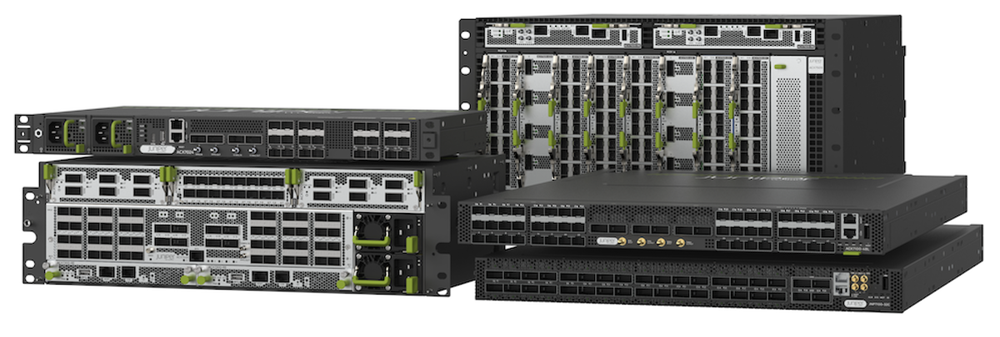

The portfolio consists of the following routers:

- ACX7100-32C: 1RU, aggregation of 100GE to 400GE
- ACX7100-48L: 1RU, aggregation of 10/25/50GE to 100GE/400GE
- ACX7509: 5RU, control plane and forwarding plane redundancy, 8 slots for three different types of FPCs

20x ports SFP for 1GE to 50GE
16x ports QDD for 40GE/100GE
4x ports QDD56 for 400GE
- ACX7024: 1RU, aggregation from SFP to 100GE
- ACX7348 and ACX7332: 3RU, control-plane redundancy, with a mix of fixed 10/25GE and 100GE ports, and 3 slots for two different types of modular FPCs

2x QSFPDD + 4x QSFP28
16x SFP ports 1GE to 50GE
- ACX7024X:1RU, a variant of ACX7024 with higher scale support

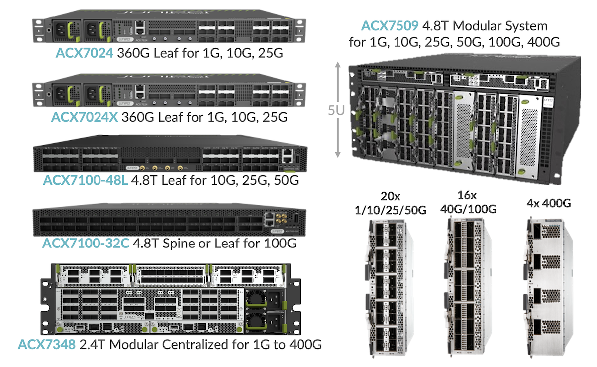

Now, let's detail the internals and the thought process behind the platform architecture.

We start with an example in the form of a fixed system, based on a single forwarding ASIC.

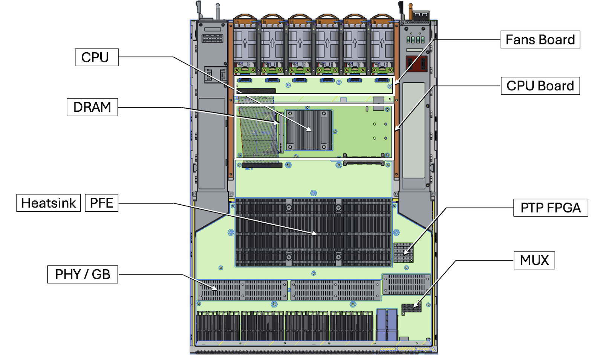

With this 30,000 foot view of the architecture, this ACX7100-32C contains:

- 32x QSFP cages on the bottom, plus 4x cages QSFP56-DD for 400 GE optics
- six blocks of fans, on the top
- two power supply units (PSU/PSM), on the side with air baffles
- represented in green, one big PCB (Printed Circuit Board): the "main board" or "motherboard"
- a big heat sink covers the PFE. It's usually twice the size of the PFE, sometimes even larger
- on the CPU board, we have another heat sink covering the Intel CPU and the SODIMM DRAM
- the fan board, connected to all fan modules, controls their speed
- between the PFE and the optical cages, we have a line of heat sinks covering retimers, also called PHY.  They occupy a specific role in our design. We will detail it in a dedicated section below
- finally, we will find other parts like the timing FPGA on the right of the PFE, used with a MUX to interconnect it to the PFE or a revenue port.

These components occupy a lot of space inside the system.  And when the site requirements impose to reduce the depth of a chassis to the minimum, we will need to adjust specific parameters:

- use fewer components, that means: collapse more functions in less number of parts
- use smaller components
- accept that certain parts can not be FRUs (field-replaceable) but fixed in the chassis
- increase the number of rack units, that's why ACX7300 are 3RU high

Following Figure 4 sums up the rack unit and depth of the different family members.

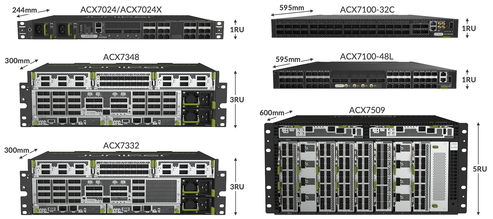

## Redundancy

Depending on the network position, operators expect routers to offer different kinds of redundancy:

- Power supply: module or energy feed
- Fan trays / cooling system
- Control plane: two routing engine/control cards
- Forwarding plane: multiple PFE cards or a system based on fabric and line cards

All ACX7000 family members are offering fan tray and power supply redundancy: the system can operate if a PSU or power feed is lost or if one of the fans fails.

### Control and Forwarding Plane

For control plane and forwarding plane redundancy, the only system offering both kinds will be the ACX7509. The ACX7300 on the other hand will offer control plane redundancy only.

ACX7509 is called "centralized" in the sense we don't have six fabric cards, but instead, we rely on two forwarding cards mapped to all ports. These cards are called FEB for Forwarding Engine Boards. They act in active/active mode, with the traffic duplicated to both of them, reducing to the minimum the impact in case of failure.

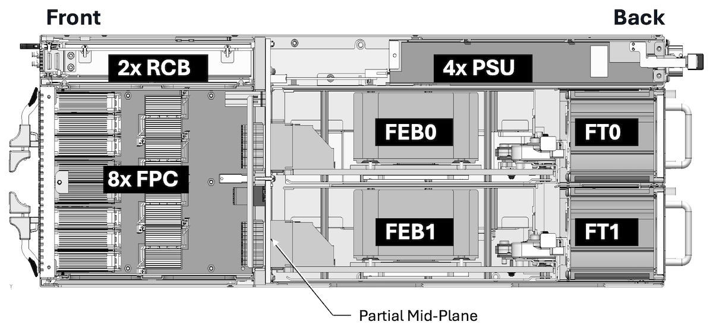

Figure 5 illustrates the position of the FEB cards between FPCs (line cards) and fan trays. We can populate the system with eight different FPCs and they will be interconnected to a mid-plane through connectors. We will describe the implications of using these connectors in terms of signal integrity. Midplane means we need very strong fan trays to guarantee proper cooling.

The ACX7509 can operate with one or two Routing and Controller Board (RCB). If we select the 1x RCB mode, it will also run with a single FEB.

You can find a lot of details on the hardware architecture and the life of a packet in this article: [https://juniper.github.io/techposts/acx7509-deepdive/article](https://juniper.github.io/techposts/acx7509-deepdive/article)

The architecture is optimized significantly with the ACX7300.

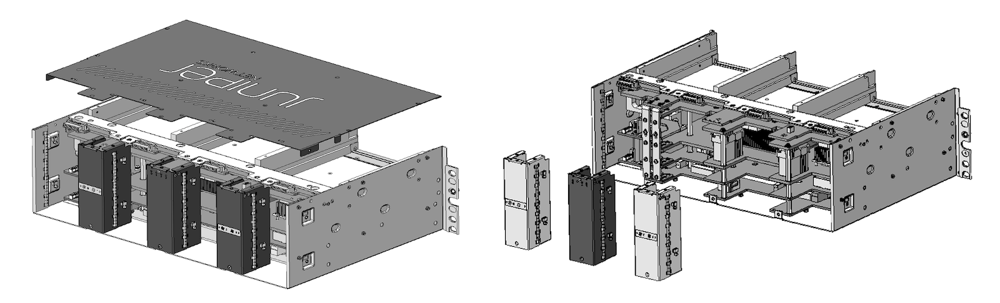

ACX7300 doesn't rely on a mid-plane anymore: such design permits shallow depth with itemp capability. That is unique to that form factor. The ACX7300s are 3 RU systems offering a mix of fixed ports and modular ports, with two RCB (routing engines) but a single PFE, a Jericho2c. It's a centralized system with control plane redundancy.

## Cooling

Coming back to the cooling part, there are three big categories in this industry (if you ignore the water cooling and the fanless systems).

We have front-to-back, back-to-front and side-to-side. In the ACX7K portfolio, all the routers are front-to-back of AFO (Air Flow Out) and one only is also back-to-front capable: the ACX7100-48L can be ordered in AFI mode (Air Flow In)

Note: the ACX7020 (under preparation for 2025) will be the first side-to-side router of the portfolio.

Cooling and more generally the thermal design optimization of a router is a very critical exercise. Sometimes, it leads to the change of initial plans.

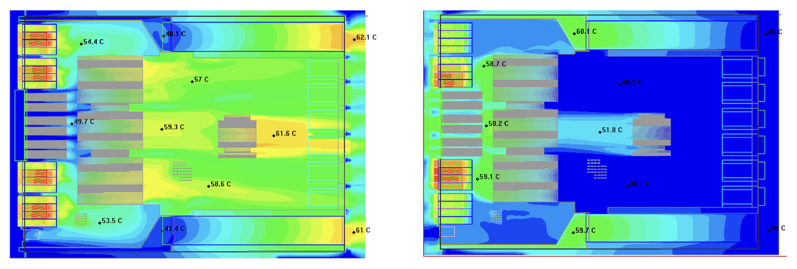

That was the case for this ACX7100-48L. The ports were initially positioned slightly differently. We decided to move the six ports 400GE to the center to guarantee that we can operate it securely in back-to-front mode. Figure 7 illustrates why we don't support high-power optics in Back-to-Front mode: the optic cages being the last element on the airflow path, it's difficult to guarantee good cooling conditions.

Also when we talk about cooling, we need to differentiate products with fixed parts and products with field-replaceable parts. The only ones with fixed parts will be the ACX7024 and ACX7024X systems. This design decision is motivated by economical reasons but also for the "real estate": fixed elements occupy a smaller footprint. With all other systems of the portfolio, the fan modules can be extracted by the operator, and we guarantee N+1 of redundancy.

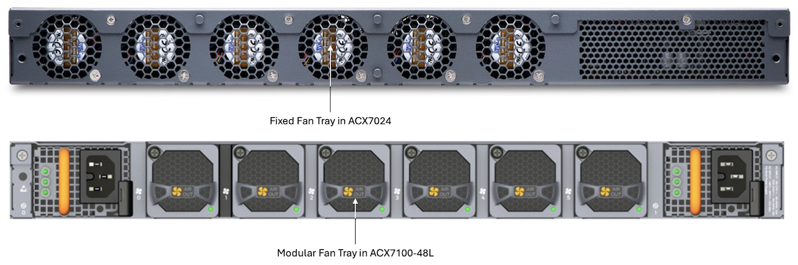

### Belly-to-Belly

The choice of optical cages is very important too. When you need to build a router with two rows of interfaces, you have two options: belly-to-belly cages or stacked cages. "stacked" means: two rows in one single cage and the heat sink on the top. With such an approach, the bottom row of the cage is not optimally cooled and it becomes challenging to support high-power optics in these ports. The ideal solution consists of using only one-row cages, each of them is directly in contact with the heat sink. And they are positioned in "sandwich" or "belly-to-belly" mode.  One is positioned above the PCB, and the other is flipped and attached to the bottom.

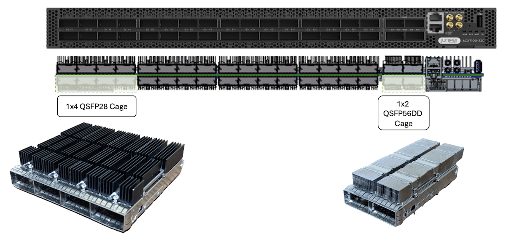

That way, we are providing an ideal cooling capability, particularly with the new optimized ZR Optics coming in 2024 consuming quite a lot of power.

For more details on these designs, take a look at the QSFP-DD MSA Whitepaper: [http://www.qsfp-dd.com/wp-content/uploads/2021/01/2021-QSFP-DD-MSA-Thermal-Whitepaper-Final.pdf](http://www.qsfp-dd.com/wp-content/uploads/2021/01/2021-QSFP-DD-MSA-Thermal-Whitepaper-Final.pdf)

## Environmental Conditions

It's common to find mentions of "i-temp" for industrial temperature range, or "c-temp" for commercial, and sometimes "e-temp" for extended... But you need to understand these concepts are very component-specific but also industry-specific. You'll find different definitions for CPUs, DPUs, optics, memories, etc.

Less subjective are standards like ETSI classes and NEBS GRs. They define very precisely what needs to be supported in terms of environmental conditions.

You'll find for each ACX7000 router, a precise list of the supported environmental standards in their datasheet on the juniper.net website, but we can sum it up to the following:

- iTemp describes products supporting: ETSI Class 3.4 up to 70C, NEBS GR63 and GR3108. All parts of the router must be rated for these conditions. For example: the PFE is designed to operate up to 110C. In a general manner, the components are more expensive, and since we are using a smaller heatsink and less fan speed, they are using less power
- cTemp: NEBS from 0C to 45C and DC NEBS up to 40C only
- eTemp: 0C-55C (class3.3)

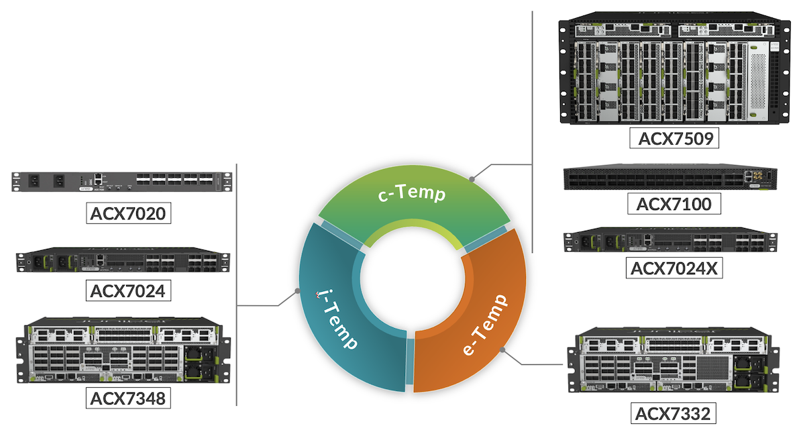

We'll explain why ACX7024X is not in the same i-temp category as ACX7024. The ACX7332 is more capable than commercial but can't be rated industrial because of one part, the eTCAM OP2, that's why it goes in the intermediate category e-temp.

## Packet Forwarding Engine

Broadcom offers dozens of SKUs in the Jericho2 family, and to select one, or another, based on various parameters:

- the bandwidth
- the number of SerDes but also the speed range we can operate these SerDes
- the number of queues
- the number of counters
- the buffer size
- the memory size
- the need (or not) to interconnect the PFE to other PFE through the fabric side
- the temp requirement (industrial/commercial)
- the chipset footprint and how big should be the heat sync
- the power usage
- the cost

Basically in our current ACX7K portfolio, we are using four different chipsets types: the Jericho 2, the Jericho2C (or Qumran2C), the Qumran2U and the Qumran2n.

To avoid repetitions, we invite you to read this article "Building the ACX7000 Series: the PFE": [https://juniper.github.io/techposts/building-the-acx7000-series-the-pfe/article](https://juniper.github.io/techposts/building-the-acx7000-series-the-pfe/article)

The article covers the different PFEs, the Port Macros PM25/PM50 and SerDes, the PHYs used in retimer/gearbox/reverse-gearbox modes, and the resource scale. To complete this article, it's interesting to note that MACsec is not natively supported on these four PFEs, and they can provide class-B or class-C timing quality.

Also, the concept of over-subscription is important.

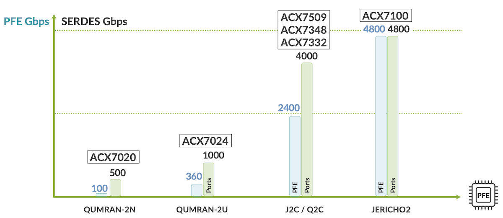

With the notable exception of Jericho2, these forwarding ASICs are purposefully designed to offer more port connectivity than forwarding capacity. It's in the nature of the aggregation role to "mux" the ports and consider we don't dimension the product to operate all interfaces with line rate traffic simultaneously.

Also, as a reminder, we present the number of SerDes and PortMacro types used with each PFE:

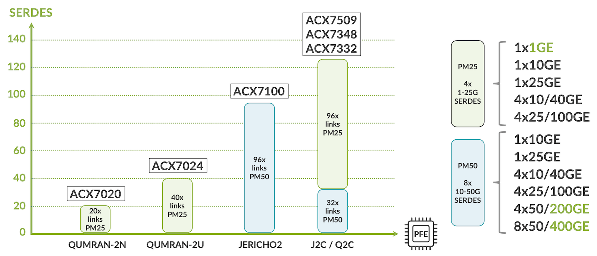

The number of SerDes influences directly the front plate of the router.

For example, with an ACX7024:

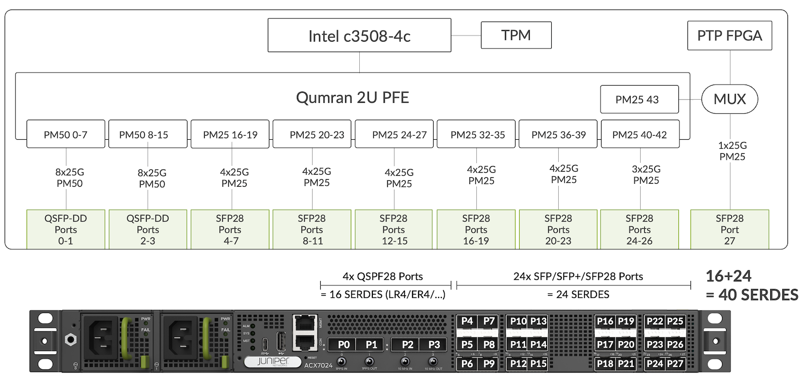

We examine the ports offered by ACX7024:

- We have four ports P0 to P3 at 100Gbps in the center. Each 100GE is four SerDes at 25Gbps. 4x4 equals 16 SerDes
- Then you have the port 4 to port 27. Those are the 24 ports SFP (one single SerDes each)
- So you do the math: 16 + 24 equals 40 SerDes

If you look at the Qumran2u in Figure 13, "40" is precisely the number of SerDes it supports. You understand now the port density of an ACX7024 is directly derived from the SerDes available on the PFE.

The PortMacro type proposed on a chipset also dictates the port speed, as shown in the right part of Figure 12. A PM25 can be used for 1GE to 100GE, but not 400GE. And a PM50 can be used for 10GE to 400GE, but not 1GE.

That makes the J2c option particularly interesting, since it exposes a mix of PM25 and PM50: more flexibility.

And that's why it could make sense to use two J2c back-to-back rather than a single J2.

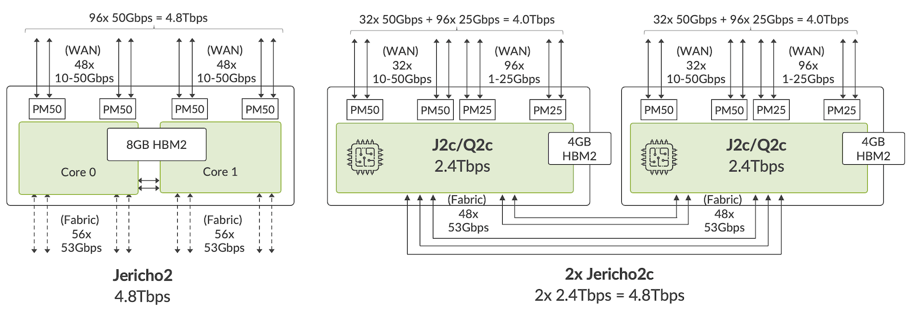

Both options are capable of 4.8Tbps. The 2x J2c choice is attractive because:

- we have a mix of PM25 and PM50 offering natively a larger span of interface options: from 1GigE to 400GigE
- we have a total of 256 SerDes compared to J2's 96 links
- we can over-subscribe the Jericho2C which is not supported on Jericho2: 4.8Tbps max. With over-subscription, we can have potentially offer up to 8Tbps of connectivity
- we have twice the number of queues and twice the number of counters compared to Jericho2C

But it also comes at a price:

- a larger footprint on the board
- more power usage (2x PFEs but also the links to interconnect them)
- more expensive

### PHY, Retimers and Reverse GearBoxes

When designing routers, very often you need to rely on these ethernet transceiver components. PHY is a generic term that can be configured in retimer, gearbox and reverse gearbox mode.

First, it will be used for "fanout".

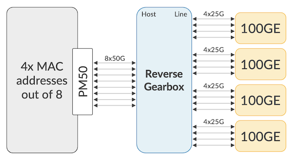

If we consider a PM50 alone with 8 SerDes that we can configure from 10Gbps to 50Gbps. And we connect the PM50 directly to the optical cage, each SerDes configured at 25Gbps: we will end up with two 100GE interfaces (LR4, SR4, ...). Indeed, each interface is 4x25Gbps.

Now we position a PHY between the PM50 and the optical cage. This RGB converts the SerDes signal in PAM4 at 50Gbps into two signals in NRZ at 25Gbps (it also takes care of the error correction). So, it's a 1:2 mux offering now 16 links at 25Gbps. That's four ports 100GE. And since the PM50 can manage 8 MAC addresses maximum (because it's designed for 8 links), we are in the budget with four interfaces.

This budget of 8 MAC addresses is very important to understand why we may need to configure certain ports "unused" when enabling channelization (use of break-out cables). In the following example, we want to use break-out behind as many QSFP28 ports as possible.

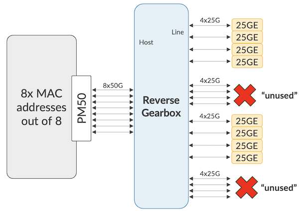

You understand quickly that the channelisation of all four ports will give us 16 interfaces, and we only have 8 MAC addresses in the budget. That's why we need to "sacrifice" the N+1 port if you configure break-out on port N. More precisely, the port N+1 needs to be explicitly configured "unused" to get port N:[0-3] up. The Juniper Pathfinder Port Checker tool can be used to verify this behaviour.

Another very important role of the PHY is to re-amplify and re-align the signal. It may be required for very long traces but also with modular systems. The FPC you insert in ACX7509 and ACX7300s will be connected through Orthogonal Direct (OD) connectors and it will impact on the quality of the signal. That's why every FPC contains a retimer to boost the signal quality.

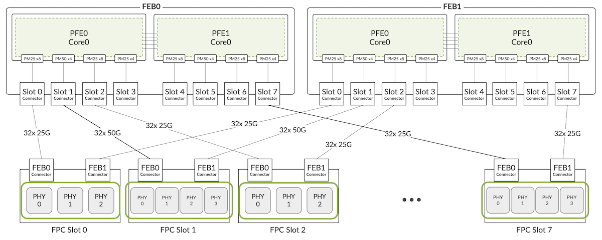

Modifying the SerDes speed and encoding, and improving the signal quality are not the only reasons we are using these PHYs. They are coming with interesting additional features like timing and MACsec, and if you remember the PFEs we selected, none of them support MACsec internally. So we rely on this component to provide encryption services.

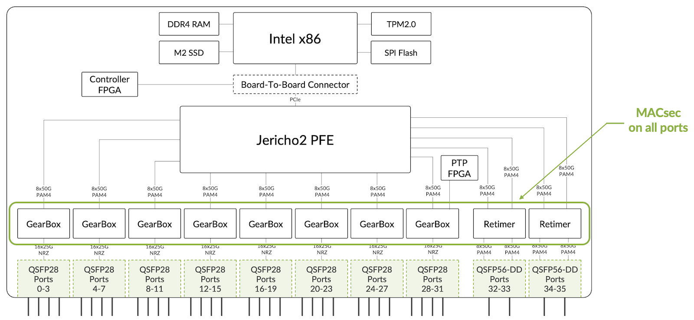

In this ACX7100-32C, the PHYs are used in RGB mode for all 100 GE ports but also you can see that we positioned a couple of them on the right side of the diagram, between the PFE and the 400GE ports. You should wonder why we need a PHY here, since we need 50 Gbps SerDes for 400GE interfaces and that's exactly what the PM50 is giving us. But if we connect directly the cages to the PFE , we will not be able to offer MACsec encryption on the 400GE ports. So we position PHYs configured in retimer mode to deliver MACsec on all ports of the router.

Another example with ACX7100-48L: here we don't have any PHY present between the PFE and the optical cages. Therefore, it cannot provide MACsec Services.

### Resources and Memory

A very important dimension to consider in the PFE selection process is the application memory size and how to manipulate it. We published a recent article on MDB, hardware profiles, and the logic used to sort routes in the different databases: [https://juniper.github.io/techposts/acx7000-hardware-profiles/article](https://juniper.github.io/techposts/acx7000-hardware-profiles/article)

Starting from Junos 23.2R1, the FIB compression is enabled by default. It's common to say it "doubles" the FIB size, but numbers from production networks are showing a much higher (more efficient) compression ratio. The software implementation is the same as PTX's deployed in live networks for 3 years already. More details in this other article: [https://juniper.github.io/techposts/ptx-fib-compression/article](https://juniper.github.io/techposts/ptx-fib-compression/article)

## CPU

We have two big categories of CPU: the C and D classes from Intel.

Table:  CPU used in ACX7000 Family

| Router | CPU | Core / Speed | Threads | DRAM |
|:--|:--|:--|:--|:--|
| ACX7100-32 | D-1637 | 6C@2.9GHz | 12 | 64GB |
| ACX7100-48L | D-1637 | 6C@2.9GHz | 12 | 64GB |
| ACX7509 RCB | D-1637 | 6C@2.9GHz | 12 | 64GB per RCB |
| ACX7024 | C-3508 | 4C@1.6GHz | 4 | 16GB |
| ACX7024X | C-3758R | 8C@2.4GHz | 8 | 64GB |
| ACX7332 | D-1713 | 4C@2.2GHz | 8 | 64GB |
| ACX7348 | D-1713 | 4C@2.2GHz | 8 | 64GB |

It's interesting to note that a small form-factor / low-speed port router is usually very "cost-optimized". That's why the ACX7024 is shipping with a CPU with four cores at 1.6 GHz and only 16GB of RAM.

This is absolutely fine for the aggregation use-cases but if anyone would like to use the ACX7024 for Enterprise roles, they will very quickly hit the limitation of the CPU before reaching the maximum scale of the PFE.

That's why several customers asked for a different version of this product, with same port density, same forwarding capability and features but with a more powerful CPU and larger DRAM space. We have this ACX7024X exactly to meet that requirement with a CPU offering eight cores at 2.9GHz and 64GB of RAM. The consequence is this type of chip and memory are not i-temp. That's why ACX7024X is no longer in the industrial temp category, but on the commercial side.

## Timing

We have two main hardware components that differentiate us from the competition.

First, a GNSS antenna receiver is integrated into the ACX7348 and ACX7332 only. On the other products, we can rely on an external part, the Furuno TB1, that can be connected via the USB and timing ports. It's a reference sale, which means we do have the software support for it.

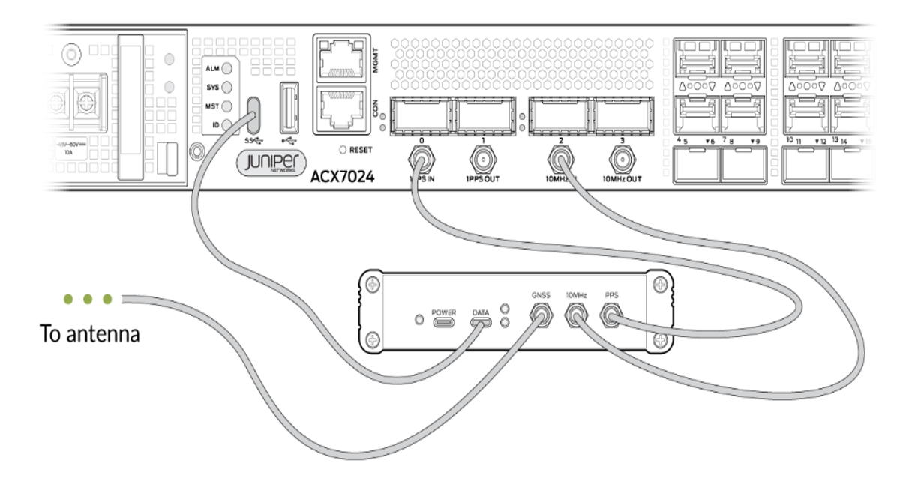

The second differentiator is the PTP FPGA that we have on all ACX7000 products, a Juniper-developed component. It gives us a very high-scale in terms of peers and class D quality:

- FPGA for PTP packet acceleration
- 512 PTP clients
- Packet rate 128PPS
- around 300 Mbps packet rate total

Rafik published a detailed article on the Class-D support here: [https://juniper.github.io/techposts/time-synchronization-and-class-d-clocks-support/article](https://juniper.github.io/techposts/time-synchronization-and-class-d-clocks-support/article)

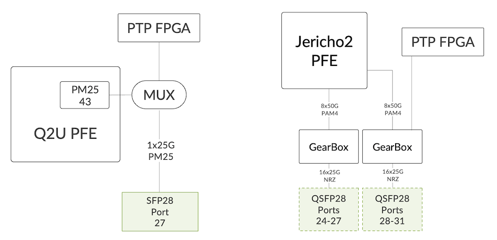

We explained earlier that all SerDes are mapped to revenue ports to optimize the interface density. That's why we will connect the PTP FPGA via MUX or Reverse GearBox, and deactivate a physical port when PTP is enabled via configuration.

Finally, please note the PHY guarantees PTP over MACsec on these routers.

## External Resource

Specifically on the ACX 7332, we use an additional part called OP2: an eTCAM completing the PFE resources.

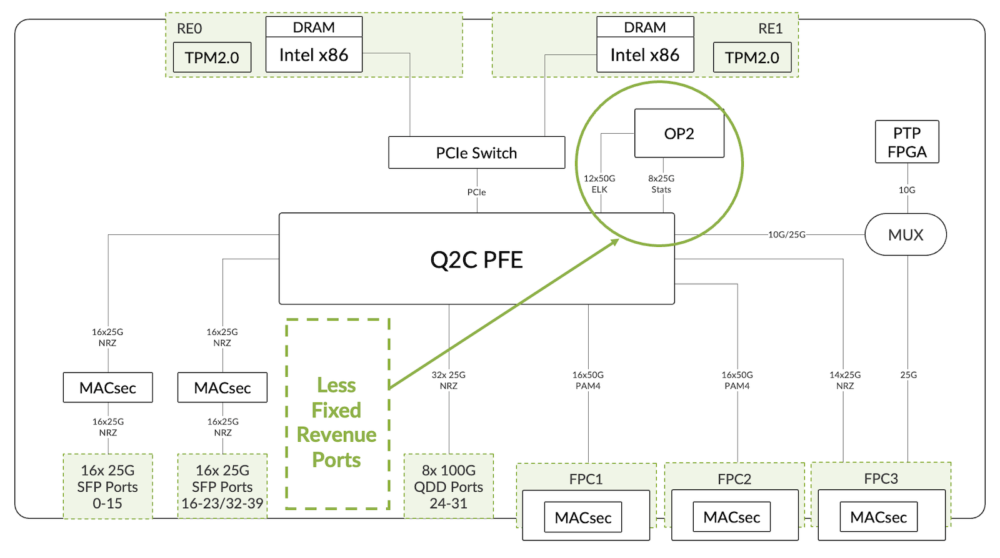

It could potentially offer higher FIB, but it's no longer such an important topic with current J2 profiles and FIB compression enabled by default. However, an external TCAM will increase significantly the number of firewall filters and statistics. That will open the door to certain use cases, particularly on the peering side, the Enterprise and the distributed BNG, the BNG CUPS. Figure 21 shows why we have a slightly less number of fixed ports, we need to interconnect this OP2 part via SerDes.

## Conclusion

In this very long article, companion of the video [https://www.youtube.com/watch?v=Ss4PwZt5WNM](https://www.youtube.com/watch?v=Ss4PwZt5WNM), we detailed the thought process behind building a modern router, with the different trade-offs. We hope this approach is giving you a better understanding of the products' capabilities.

## Useful links

- ACX7509 Deepdive: [https://juniper.github.io/techposts/acx7509-deepdive/article](https://juniper.github.io/techposts/acx7509-deepdive/article)
- ACX7024 Deepdive: [https://juniper.github.io/techposts/acx7024-deepdive/article](https://juniper.github.io/techposts/acx7024-deepdive/article)
- ACX7100 Deepdive: [https://juniper.github.io/techposts/acx7100-deepdive/article](https://juniper.github.io/techposts/acx7100-deepdive/article)
- Building the ACX7000 Series: the PFE: [https://juniper.github.io/techposts/building-the-acx7000-series-the-pfe/article](https://juniper.github.io/techposts/building-the-acx7000-series-the-pfe/article)
- Let's Talk About VOQ and DNX Pipeline: [https://juniper.github.io/techposts/voq-and-dnx-pipeline/article](https://juniper.github.io/techposts/voq-and-dnx-pipeline/article)
- ACX7000 Hardware Profiles: [https://juniper.github.io/techposts/acx7000-hardware-profiles/article](https://juniper.github.io/techposts/acx7000-hardware-profiles/article)
- FIB Compression: [https://juniper.github.io/techposts/ptx-fib-compression/article](https://juniper.github.io/techposts/ptx-fib-compression/article)
- QSFP-DD MSA Whitepaper: [http://www.qsfp-dd.com/wp-content/uploads/2021/01/2021-QSFP-DD-MSA-Thermal-Whitepaper-Final.pdf](http://www.qsfp-dd.com/wp-content/uploads/2021/01/2021-QSFP-DD-MSA-Thermal-Whitepaper-Final.pdf)
- Time Synchronization and Class D Clocks Support: [https://juniper.github.io/techposts/time-synchronization-and-class-d-clocks-support/article](https://juniper.github.io/techposts/time-synchronization-and-class-d-clocks-support/article)
- Hardware Compatibility Tool: [https://apps.juniper.net/hct/home/](https://apps.juniper.net/hct/home/)
- Port Checker Tool: [https://apps.juniper.net/port-checker/](https://apps.juniper.net/port-checker/)
- Power Calculator Tool: [https://apps.juniper.net/power-calculator/](https://apps.juniper.net/power-calculator/)

## Glossary

- AFI: AirFlow In
- AFO: AirFlow Out
- BNG: Broadband Network Gateway
- CLI: Command Line Interface
- CPU: Central Processor Unit
- DRAM: Dynamic Random Access Memory
- FEB: Forwarding Engine Board
- FIB: Forwarding Information Base
- FPC: Flexible PIC Concentrator
- FRU: Field Replaceable Unit
- FPGA: Field Programmable Gate Arrays
- HBM: High Bandwidth Memory
- TCAM: Ternary Content-Addressable Memory
- MSA: Multi-Source Agreement
- MUX: Multiplexer Component
- NRZ: Non-Return to Zero
- OP2: Olympus Prime v2 (external TCAM)
- PAM4: Pulse Amplitude Modulation 4-level
- PFE: Packet Forwarding Engine
- PM: Port Macro
- PPS: Packet Per Second
- PSM/PSU : Power Supply Module/Unit
- PTP: Precision Timing Protocol
- QSFP-DD: Quad Small Form Factor Pluggable Double Density
- RCB: Routing and Control Board
- RU: Rack Unit
- SERDES: SERializer DESerializer
- SFP: Small Form-factor Pluggable
- SKU: Stock Keeping Unit
- SSD / SATA: Solid State Drive / Serial Advanced Technology Attachment
- TPM : Trusted Platform Module
- VOQ: Virtual Output Queue

## Acknowledgments

Thanks to the talented engineering and PLM team who helped in the development of these products and features during the last years. You guys did an amazing job.

Thanks to David Tatlisu and Ashvin Oogorah for pointing typos.
