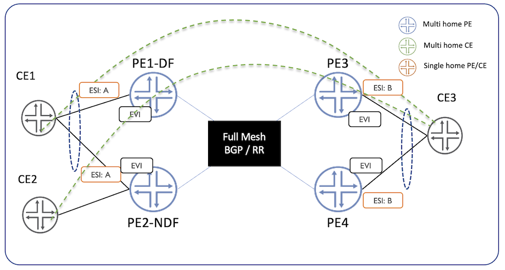
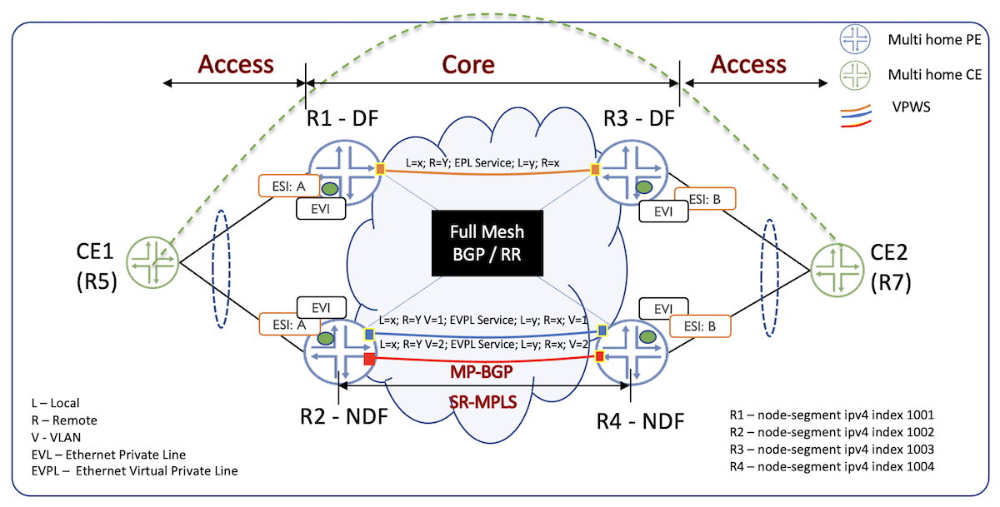
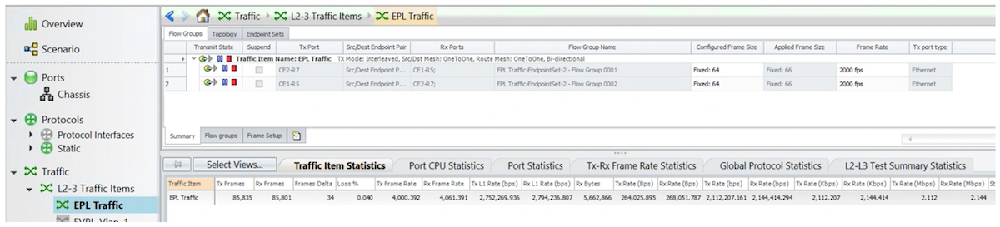
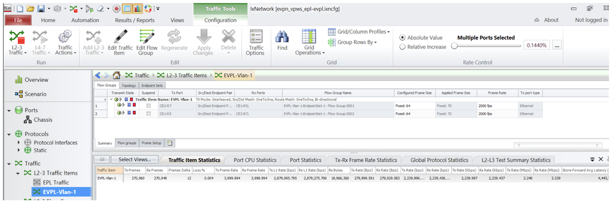
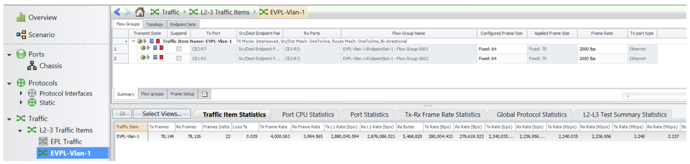
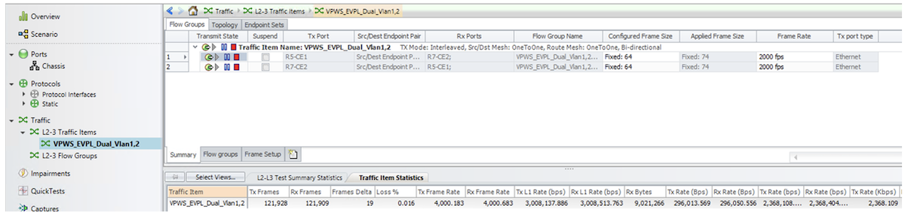
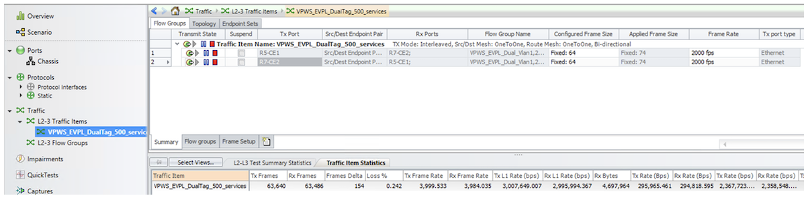

# EVPN E-Line on PTX10k platforms

**Ramdas Machat - 12/12/2022**

Let's test EVPN ELINE/VPWS on Express4-based platforms playing the role of PE. In this article, we will describe the various approaches, the configurations and the instance scaling.

## Introduction

Service providers always look for the adoption of new technologies to improve their connectivity and the total uptime for the services they offer to their customers. There is a requirement to move to a more controlled and predictable network for the SP and Cloud providers. EVPN offers the most advanced L2 deployments with much better scale and performance in terms of availability, overcomes underutilization of revenue ports, faster convergence, and many more advantages over legacy technologies.

Ethernet EVPN (EVPN) as a technology has matured with large-scale deployment seen across various use case requirements including Service Provider and Cloud. EVPN helps with many benefits such as Faster convergence, Control plane MAC learning, Multiple Provider Edge (PE) participating in a single Ethernet Segment Identifier (ESI), and many more. Such features are not available in legacy L2 services.

## Topology and Testing

This document covers the EVPN E-LINE service implementation on the PTX with Junos EVO. 400GE platforms powered by Express 4 ASIC were used to validate and produce the configurations.

Figure 1 is a reference topology and Figure 2 further down gives more details on the configuration and the different cases covered including Single homed, Multi-homed, and Scaling of the test scenario on a live topology with the configuration and operational status for each case.



| Device Name | Model | Software Version |
|:--|:--|:--|
| CE1 | Hostname: R5-RE0Model: mx960 | 21.1R1.11 |
| PE1 | Hostname: r1-RE0-re0Model: ptx10008 | 22.2R2-202210200108.0-EVO |
| PE2 | Hostname: r2-RE0-re0Model: ptx10008 | 22.2R2-202210200108.0-EVO |
| PE3 | Hostname: r3-RE0-re0Model: ptx10008 | 22.2R2-202210200108.0-EVO |
| PE4 | Hostname: r4-RE0-re0Model: ptx10008 | 22.2R2-202210200108.0-EVO |
| CE2 | Hostname: R7-RE0Model: mx960 | 21.1R1.11 |

## EVPN E-LINE/VPWS

EVPN-VPWS is a framework for delivering point-to-point VPN service with the EVPN signalling mechanisms. The endpoints are identified using a service identifier also called VPWS-ID discovered using BGP signaling. The service ids are 24bit values encoded in the Ethernet Tag of the Auto Discover (AD) route /Type 1 per EVI (Ethernet Virtual Instance). The advantages of EVPN VPWS are

- Single homing (SH) and Multi homing (MH) scenario. One of the biggest advantages of the EVPN VPWS multi-homing is support for load balancing -- both connections are active.
- Support for Inter-AS across the ASBR (Autonomous System Boundary Router) using the BGP EVPN signalled VPNs.

EVPN-VPWS is used to deliver private line services defined by the Metro Ethernet Forum (MEF)

- EPL (Ethernet Private Line)


Offers a point-to-point ethernet virtual connection (EVC) between a dedicated UNI (User Network Interface) with a high degree of transparency.
- EVPL (Ethernet Virtual Private Line)


Offers service multiplexing which means multiple EVCs are paired per UNI



### Underlay and Customer Equipment (CE) Configuration

All PEs as depicted in figure 2 are configured using the OSPF and MPLS for underlay or ISIS and SR. The PEs are configured with fully meshed BGP sessions with "family evpn signalling" enabled to exchange the EVPN routes among each other. A sample configuration is covered as part of Underlay Configuration -- MPLS towards the end of the document for reference. Also, the CE configuration used during the testing is covered towards the end for reference.

## EVPN VPWS EPL Test Scenarios

All four PEs in the above topology are BGP-EVPN PE and have the EVPN VPWS instance setup and then relevant configurations are made in each one of these PEs. These PEs discover each other in the network and established the EVPN sessions.

As covered above and as per the Metro Ethernet Forum standards, an EPL-based service is constructed based on the physical Ethernet Ports, and the service is provisioned between a pair of UNI ports.

The Ethernet Segment Identifier (ESI) is based on the Ethernet Virtual Instance (EVI) and port. In the Multihomed scenario as depicted in the Topology above, the Designate Forwarder (DF) election here is Modulus (MOD) based (see [RFC7432](https://datatracker.ietf.org/doc/html/draft-ietf-bess-evpn-df-election-framework-09)). As of time of writing this article, Express4 based PTX platforms support the preference-based DF election.

### EVPN EPL Configuration -- Single/Active mode

The below section highlights the EVPN Instance (EVI) and the UNI-facing interface configuration on all four PE nodes shown in figure 2 above for EVPN EVPL based service. This test focuses on the single-active mode.

PE1:

```
regress@r1-re0# show interfaces et-0/0/7
description "To R5";
encapsulation ethernet-ccc;
esi {
    00:11:11:11:11:11:11:11:11:11;
    single-active;
}
unit 0 {
    family ccc;
}
regress@r1-re0# show routing-instances 
evpn-vpws-epl {
    instance-type evpn-vpws;
    protocols {
        evpn {
            interface et-0/0/7.0 {
                vpws-service-id {
                    local 1;
                    remote 2;
                }
            }
        }
    }
    interface et-0/0/7.0;
    route-distinguisher 11.11.11.11:1;
    vrf-target target:11:1;
}
```

PE2: 

```
regress@r2-re0# show interfaces et-0/0/9
description "To R5";
encapsulation ethernet-ccc;
esi {
    00:11:11:11:11:11:11:11:11:11;
    single-active;
}
unit 0 {
    family ccc;
}
regress@r2-re0# show routing-instances 
evpn-vpws-epl {
    instance-type evpn-vpws;
    protocols {
        evpn {
            interface et-0/0/9.0 {
                vpws-service-id {
                    local 1;
                    remote 2;
                }
            }
        }
    }
    interface et-0/0/9.0;
    route-distinguisher 22.22.22.22:1;
    vrf-target target:11:1;
}
```

PE3: 

```
regress@r3-re0# show interfaces et-0/0/7
description "To R7";
encapsulation ethernet-ccc;
esi {
    00:22:22:22:22:22:22:22:22:22;
    single-active;
}
unit 0 {
    family ccc;
}
regress@r3-re0# show routing-instances 
evpn-vpws-epl {
    instance-type evpn-vpws;
    protocols {
        evpn {
            interface et-0/0/7.0 {
                vpws-service-id {
                    local 2;
                    remote 1;
                }
            }
        }
    }
    interface et-0/0/7.0;
    route-distinguisher 33.33.33.33:1;
    vrf-target target:11:1;
}
```

PE4: 

```
regress@r3-re0# show interfaces et-0/0/7
description "To R7";
encapsulation ethernet-ccc;
esi {
    00:22:22:22:22:22:22:22:22:22;
    single-active;
}
unit 0 {
    family ccc;
}
regress@r3-re0# show routing-instances
evpn-vpws-epl {
    instance-type evpn-vpws;
    protocols {
        evpn {
            interface et-0/0/7.0 {
                vpws-service-id {
                    local 2;
                    remote 1;
                }
            }
        }
    }
    interface et-0/0/7.0;
    route-distinguisher 33.33.33.33:1;
    vrf-target target:11:1;
}
```

### EVPN EPL Configuration - Active/Active mode

The below section highlights the EVPN Instance (EVI) and the UNI-facing interface configuration on all four PE nodes shown in figure 2 above. This test focuses on the active-active mode.

In Active/Active we need to bundle the UNI links from CE to PE in order to load balance the traffic. So necessary configuration need to be done on the router to achieve the load balance behaviour.

Here we have a small change in the configurations to support active-active mode. The configuration shows just to add active-active on one of the MH PEs (PE1, PE2). But we cannot configure an MH PEs ESI in different modes like for example PE1 in active-standby and PE2 in active-active.


PE1:

```
regress@r1-re0# show interfaces ae0
ae0 {
    encapsulation ethernet-ccc;
    esi {
        00:11:11:11:11:11:11:11:11:11;
        single-active;
    }
    aggregated-ether-options {
        lacp {
            active;
            system-id 00:00:00:00:11:01;
        }
    }
    unit 0 {
        family ccc;
    }
}
regress@r1-re0# show routing-instances 
evpn-vpws-evpl {
    instance-type evpn-vpws;
    protocols {
        evpn {
            interface ae0.0 {
                vpws-service-id {
                    local 1;
                    remote 2;
                }
            }
        }
    }
    interface ae0.0;
    route-distinguisher 11.11.11.11:1;
    vrf-target target:11:1;
}
```

PE2: 

```
regress@r2-re0# show interfaces ae0
ae0 {
    encapsulation ethernet-ccc;
    esi {
        00:11:11:11:11:11:11:11:11:11;
        single-active;
    }
    aggregated-ether-options {
        lacp {
            active;
            system-id 00:00:00:00:11:01;
        }
    }
    unit 0 {
        family ccc;
    }
}
regress@r2-re0# show routing-instances 
evpn-vpws-evpl {
    instance-type evpn-vpws;
    protocols {
        evpn {
            interface ae0.0 {
                vpws-service-id {
                    local 1;
                    remote 2;
                }
            }
        }
    }
    interface ae0.0;
    route-distinguisher 22.22.22.22:1;
    vrf-target target:11:1;
}
```

PE3: 

```
regress@r3-re0# show interfaces ae0
ae0 {
    encapsulation ethernet-ccc;
    esi {
        00:22:22:22:22:22:22:22:22:22;
        single-active;
    }
    aggregated-ether-options {
        lacp {
            active;
            system-id 00:00:00:00:22:01;
        }
    }
    unit 0 {
        family ccc;
    }
}
regress@r3-re0# show routing-instances 
evpn-vpws-evpl {
    instance-type evpn-vpws;
    protocols {
        evpn {
            interface ae0.1 {
                vpws-service-id {
                    local 2;
                    remote 1;
                }
            }
        }
    }
    interface ae0.1;
    route-distinguisher 33.33.33.33:1;
    vrf-target target:11:1;
}
```

PE4: 

```
regress@r4-re0# show interfaces ae0
ae0 {
    encapsulation ethernet-ccc;
    esi {
        00:22:22:22:22:22:22:22:22:22;
        single-active;
    }
    aggregated-ether-options {
        lacp {
            active;
            system-id 00:00:00:00:22:01;
        }
    }
    unit 0 {
        family ccc;
    }
}
regress@r4-re0# show routing-instances
evpn-vpws-evpl {
    instance-type evpn-vpws;
    protocols {
        evpn {
            interface ae0.1 {
                vpws-service-id {
                    local 2;
                    remote 1;
                }
            }
        }
    }
    interface ae0.1;
    route-distinguisher 44.44.44.44:1;
    vrf-target target:11:1;
}
```

### EVPN EPL Operational -- Single/Active mode

The below cli outputs show information learned by the multihomed PEs for the ESI (Ethernet Segment Information) to which these PEs belong and then also the ESI information learned from the remote end. PE3, PE4 outputs are not captured here.

You can see that PE2 is DF (Designated Forwarder) and PE1 is Backup DF which were elected based on the MOD operation.

PE1:

```
regress@r1-re0# run show evpn vpws-instance
Instance: evpn-vpws-epl, Instance type: EVPN VPWS
  Route Distinguisher: 11.11.11.11:1
  Number of local interfaces: 1 (1 up)

    Interface name  ESI                            Mode          Role       Status     Control-Word    Flow-Label-Tx    Flow-Label-Rx
    et-0/0/7.0      00:11:11:11:11:11:11:11:11:11single-active   Backup     Up         Yes             No               No
        Local SID: 1 Advertised Label: 104
            PE addr         ESI                           Label  Mode           Role     TS                      Status
            22.22.22.22     00:11:11:11:11:11:11:11:11:11 17     single-active  Primary  2022-11-22 22:18:59.989 Resolved
        Remote SID: 2
            PE addr         ESI                           Label  Mode           Role     TS                      Status
            44.44.44.44     00:22:22:22:22:22:22:22:22:22 57     single-active  Backup   2022-11-23 00:41:37.218 Resolved
            33.33.33.33     00:22:22:22:22:22:22:22:22:22 91     single-active  Primary  2022-11-23 00:41:36.999 Resolved
  Number of protect interfaces: 0

    Fast Convergence Information
    ESI: 00:11:11:11:11:11:11:11:11:11 Number of PE nodes: 1
        PE: 22.22.22.22
            Advertised SID: 1

    Fast Convergence Information 
    ESI: 00:22:22:22:22:22:22:22:22:22 Number of PE nodes: 2
        PE: 44.44.44.44
            Advertised SID: 2
        PE: 33.33.33.33
            Advertised SID: 2

    DF Election Information for Single-Active ESI
    ESI: 00:11:11:11:11:11:11:11:11:11
    DF Election Algorithm: MOD based
    SID used for DF Election: 1
    Primary PE: 22.22.22.22
    Backup PE: 11.11.11.11
    Last DF Election: 2022-11-22 22:50:24

regress@r1-re0# run show interfaces et-0/0/7 terse
Interface               Admin Link Proto    Local                 Remote
et-0/0/7                up    up
et-0/0/7.0              up    down ccc     

regress@r1-re0# run show route table mpls.0 ccc et-0/0/7

mpls.0: 23 destinations, 23 routes (23 active, 0 holddown, 0 hidden)
+ = Active Route, - = Last Active, * = Both

et-0/0/7.0         *[EVPN/7] 02:39:42, route-type Egress
                       Discard

regress@r1-re0# run show route table mpls.0 ccc et-0/0/7 detail    

mpls.0: 23 destinations, 23 routes (23 active, 0 holddown, 0 hidden)
et-0/0/7.0 (1 entry, 1 announced)
        *EVPN   Preference: 7
                Next hop type: Discard, Next hop index: 0
                Address: 0x564f543839dc
                Next-hop reference count: 187, key opaque handle: (nil), non-key opaque handle: (nil)
                State: <Active Int>
                Age: 2:40:25
                Validation State: unverified
                Task: evpn global task
                Announcement bits (1): 1-KRT
                AS path: I 
                Route Type Egress
                Thread: junos-main
```

PE2:

```
regress@r2-re0# run show evpn vpws-instance
Instance: evpn-vpws-epl, Instance type: EVPN VPWS
  Route Distinguisher: 22.22.22.22:1
  Number of local interfaces: 1 (1 up)

    Interface name  ESI                            Mode          Role       Status     Control-Word    Flow-Label-Tx    Flow-Label-Rx
    et-0/0/9.0      00:11:11:11:11:11:11:11:11:11single-active   Primary    Up         Yes             No               No  
        Local SID: 1 Advertised Label: 17
            PE addr         ESI                           Label  Mode           Role     TS                      Status
            11.11.11.11     00:11:11:11:11:11:11:11:11:11 104    single-active  Backup   2022-11-22 22:19:00.204 Resolved
        Remote SID: 2
            PE addr         ESI                           Label  Mode           Role     TS                      Status
            44.44.44.44     00:22:22:22:22:22:22:22:22:22 57     single-active  Backup   2022-11-23 00:41:37.217 Resolved
            33.33.33.33     00:22:22:22:22:22:22:22:22:22 91     single-active  Primary  2022-11-23 00:41:36.998 Resolved
  Number of protect interfaces: 0

    Fast Convergence Information 
    ESI: 00:11:11:11:11:11:11:11:11:11 Number of PE nodes: 1
        PE: 11.11.11.11
            Advertised SID: 1

    Fast Convergence Information
    ESI: 00:22:22:22:22:22:22:22:22:22 Number of PE nodes: 2
        PE: 44.44.44.44
            Advertised SID: 2
        PE: 33.33.33.33
            Advertised SID: 2

    DF Election Information for Single-Active ESI 
    ESI: 00:11:11:11:11:11:11:11:11:11
    DF Election Algorithm: MOD based
    SID used for DF Election: 1
    Primary PE: 22.22.22.22
    Backup PE: 11.11.11.11
    Last DF Election: 2022-11-22 22:50:24

{master}[edit]

regress@r2-re0# run show interfaces et-0/0/9 terse
Interface               Admin Link Proto    Local                 Remote
et-0/0/9                up    up
et-0/0/9.0              up    up   ccc     

{master}[edit]
regress@r2-re0# run show route table mpls.0 ccc et-0/0/9 detail  

mpls.0: 22 destinations, 22 routes (22 active, 0 holddown, 0 hidden)
et-0/0/9.0 (1 entry, 1 announced)
        *EVPN   Preference: 7
                Next hop type: Indirect, Next hop index: 0
                Address: 0x559b3cd59bdc
                Next-hop reference count: 8, key opaque handle: (nil), non-key opaque handle: (nil)
                Next hop type: Router, Next hop index: 23068
                Next hop: 23.1.1.2 via et-0/0/1.0, selected
                Label element ptr: 0x559b3d2a4868
                Label parent element ptr: (nil)
                Label element references: 3
                Label element child references: 0
                Label element lsp id: 0
                Session Id: 5
                Protocol next hop: 33.33.33.33
                Label operation: Push 91 Offset: 252
                Label TTL action: no-prop-ttl
                Load balance label: Label 91: None;
                Composite next hop: 0x559b3dea7100 23076 INH Session ID: 22
                Indirect next hop: 0x559b390b7b08 23056 INH Session ID: 22
                State: <Active Int>
                Age: 22:39 
                Validation State: unverified
                Task: evpn global task
                Announcement bits (1): 1-KRT
                AS path: I 
                Route Type Egress
                Thread: junos-main
```

Traffic Screenshot showing traffic flowing.



### EVPN EPL Operational - Active/Active mode

PE1:

```
    Interface name  ESI                            Mode          Role       Status     Control-Word    Flow-Label-Tx    Flow-Label-Rx
    ae0.1           00:11:11:11:11:11:11:11:11:11all-active      Primary    Up         Yes             No               No
        Local SID: 1 Advertised Label: 131
            PE addr         ESI                           Label  Mode           Role     TS                      Status
            22.22.22.22     00:11:11:11:11:11:11:11:11:11 120    all-active     Primary  2022-11-23 03:37:06.808 Resolved
        Remote SID: 2
            PE addr         ESI                           Label  Mode           Role     TS                      Status
            44.44.44.44     00:22:22:22:22:22:22:22:22:22 57     all-active     Primary  2022-11-23 03:37:08.809 Resolved
            33.33.33.33     00:22:22:22:22:22:22:22:22:22 91     all-active     Primary  2022-11-23 03:37:16.805 Resolved
  Number of protect interfaces: 0

    Fast Convergence Information
    ESI: 00:11:11:11:11:11:11:11:11:11 Number of PE nodes: 1
        PE: 22.22.22.22
            Advertised SID: 1

    Fast Convergence Information
    ESI: 00:22:22:22:22:22:22:22:22:22 Number of PE nodes: 2
        PE: 44.44.44.44
            Advertised SID: 2
        PE: 33.33.33.33
            Advertised SID: 2

{master}[edit]
regress@r1-re0# run show interfaces ae0 terse
Interface               Admin Link Proto    Local                 Remote
ae0                     up    up
ae0.1                   up    up   ccc
ae0.32767               up    up   multiservice

regress@r1-re0# run show route table mpls.0 ccc ae0.1 detail

mpls.0: 23 destinations, 23 routes (23 active, 0 holddown, 0 hidden)
ae0.1 (1 entry, 1 announced)
        *EVPN   Preference: 7
                Next hop type: List, Next hop index: 25084
                Address: 0x564f5011851c
                Next-hop reference count: 3, key opaque handle: (nil), non-key opaque handle: (nil)
                Next hop: ELNH Address 0x564f5395f99c
                    Next hop type: Indirect, Next hop index: 0
                    Address: 0x564f5395f99c
                    Next-hop reference count: 7, key opaque handle: (nil), non-key opaque handle: (nil)
                    Protocol next hop: 33.33.33.33
                    Label operation: Push 91 Offset: 252
                    Composite next hop: 0x564f5395e840 25074 INH Session ID: 27
                    Indirect next hop: 0x564f4fcb6988 25040 INH Session ID: 27
                        Next hop type: Router, Next hop index: 25076
                        Address: 0x564f54aadb1c
                        Next-hop reference count: 7, key opaque handle: (nil), non-key opaque handle: (nil)
                        Next hop: 13.1.1.2 via et-0/0/5.0
                        Label element ptr: 0x564f53ea43e8
                        Label parent element ptr: (nil)
                        Label element references: 3
                        Label element child references: 0
                        Label element lsp id: 0
                Next hop: ELNH Address 0x564f53962b1c, selected
                    Next hop type: Indirect, Next hop index: 0
                    Address: 0x564f53962b1c
                    Next-hop reference count: 4, key opaque handle: (nil), non-key opaque handle: (nil)
                    Protocol next hop: 44.44.44.44
                    Label operation: Push 57 Offset: 252
                    Composite next hop: 0x564f5395d880 25081 INH Session ID: 39
                    Indirect next hop: 0x564f57a24b08 25079 INH Session ID: 39
                        Next hop type: Router, Next hop index: 25080
                        Address: 0x564f54ab069c
                        Next-hop reference count: 7, key opaque handle: (nil), non-key opaque handle: (nil)
                        Next hop: 14.1.1.2 via et-0/0/1.0
                        Label element ptr: 0x564f53ea43e8
                        Label parent element ptr: (nil)
                        Label element references: 3
                        Label element child references: 0
                        Label element lsp id: 0
                State: <Active Int>
                Age: 3:45
                Validation State: unverified
                Task: evpn global task
                Announcement bits (1): 1-KRT
                AS path: I
                Route Type Egress
                Thread: junos-main
```

## EVPN VPWS EVPL Test Scenarios

All four PEs in the above topology are BGP-EVPN PE and have the EVPN VPWS instance setup and then relevant configurations are made in each one of these PEs. These PEs discover each other in the network and establishes the EVPN sessions.

We support both modes single/active and active-active offering EVPN VPWS service in multihomed PEs. The current configuration is with Single-Active for the Multihomed PEs.

As covered above and as per the Metro Ethernet Forum standards, an EVPL based service is constructed based on the IFD and the service is provisioned between a multiple pair of UNI ports. The ESI is based on the EVI and per IFD. In the Multihomed scenario as depicted in the Topology above, the DF election here is MOD based. Express4 based PTX platforms also support the preference-based DF election.

### EVPN EVPL Configuration -- Single/Active mode.

The below section highlights the EVPN Instance (EVI) and the UNI-facing interface configuration on all four PE nodes shown in figure 2 above for EVPN EVPL based service. This test focuses on the single-active mode.

PE1:

```
regress@r1-re0# show interfaces et-0/0/7
description "To R5";
flexible-vlan-tagging;
encapsulation vlan-ccc;
esi {
    00:11:11:11:11:11:11:11:11:11;
    single-active;
}
unit 1 {
    encapsulation vlan-ccc;
    vlan-id 1;
}

regress@r1-re0# show routing-instances evpn-vpws-epl
instance-type evpn-vpws;
protocols {
    evpn {
        interface et-0/0/7.1 {
            vpws-service-id {
                local 1;
                remote 2;
            }
        }
    }
}
interface et-0/0/7.1;
route-distinguisher 11.11.11.11:1;
vrf-target target:11:1;
```

PE2:

```
regress@r2-re0# show interfaces et-0/0/9
description "To R5";
flexible-vlan-tagging;
encapsulation vlan-ccc;
esi {
    00:11:11:11:11:11:11:11:11:11;
    single-active;
}
unit 1 {
    encapsulation vlan-ccc;
    vlan-id 1;
}

regress@r2-re0# show routing-instances evpn-vpws-epl
instance-type evpn-vpws;
protocols {
    evpn {
        interface et-0/0/9.1 {
            vpws-service-id {
                local 1;
                remote 2;
            }
        }
    }
}
interface et-0/0/9.1;
route-distinguisher 22.22.22.22:1;
vrf-target target:11:1;
```

### EVPN EVPL Configuration -- Active/Active mode

The below section highlights the EVPN Instance (EVI) and the UNI-facing interface configuration on all four PE nodes shown in figure 2 above for EVPN EVPL-based service. This test focuses on the active-active mode.

In Active/Active we need to bundle the UNI links from CE to PE in order to load balance the traffic. So necessary configuration needs to be done on the router to achieve the load balance behaviour.

Here we have a small change in the configurations to support active-active mode. The configuration shows just to add active-active on one of the MH PEs (PE1, PE2). But we cannot configure an MH PEs ESI in different modes, for example, PE1 in active-standby and PE2 in active-active.

PE1:

```
regress@r1-re0# show interfaces ae0
ae0 {
    flexible-vlan-tagging;
    encapsulation flexible-ethernet-services;
    esi {
        00:11:11:11:11:11:11:11:11:11;
        all-active;
    }
    aggregated-ether-options {
        lacp {
            active;
            system-id 00:00:00:00:11:01;
        }
    }
    unit 1 {
        encapsulation vlan-ccc;
        vlan-id 1;
    }
}

regress@r1-re0# show routing-instances
evpn-vpws-evpl {
    instance-type evpn-vpws;
    protocols {
        evpn {
            interface ae0.1 {
                vpws-service-id {
                    local 1;
                    remote 2;
                }
            }
        }
    }
    interface ae0.1;
    route-distinguisher 11.11.11.11:1;
    vrf-target target:11:1;
}
```

PE2:

```
regress@r2-re0# show interfaces ae0
ae0 {
    flexible-vlan-tagging;
    encapsulation flexible-ethernet-services;
    esi {
        00:11:11:11:11:11:11:11:11:11;
        all-active;
    }
    aggregated-ether-options {
        lacp {
            active;
            system-id 00:00:00:00:11:01;
        }
    }
    unit 1 {
        encapsulation vlan-ccc;
        vlan-id 1;
    }
}

regress@r2-re0# show routing-instances 
evpn-vpws-evpl {
    instance-type evpn-vpws;
    protocols {
        evpn {
            interface ae0.1 {
                vpws-service-id {
                    local 1;
                    remote 2;
                }
            }
        }
    }
    interface ae0.1;
    route-distinguisher 22.22.22.22:1;
    vrf-target target:11:1;
}
```
### EVPN EVPL Operational -- Single/Active mode

PE1

```
regress@r1-re0# run show evpn vpws-instance
Instance: evpn-vpws-epl, Instance type: EVPN VPWS
  Route Distinguisher: 11.11.11.11:1
  Number of local interfaces: 1 (1 up)

    Interface name  ESI                            Mode          Role       Status     Control-Word    Flow-Label-Tx    Flow-Label-Rx
    et-0/0/7.1      00:11:11:11:11:11:11:11:11:11single-active   Backup     Up         Yes             No               No
        Local SID: 1 Advertised Label: 104
            PE addr         ESI                           Label  Mode           Role     TS                      Status
            22.22.22.22     00:11:11:11:11:11:11:11:11:11 17     single-active  Primary  2022-11-23 01:34:14.940 Resolved
        Remote SID: 2
            PE addr         ESI                           Label  Mode           Role     TS                      Status
            33.33.33.33     00:22:22:22:22:22:22:22:22:22 91     single-active  Primary  2022-11-23 01:51:10.610 Resolved
            44.44.44.44     00:22:22:22:22:22:22:22:22:22 57     single-active  Backup   2022-11-23 01:52:40.485 Resolved
  Number of protect interfaces: 0

    Fast Convergence Information 
    ESI: 00:11:11:11:11:11:11:11:11:11 Number of PE nodes: 1
        PE: 22.22.22.22
            Advertised SID: 1

    Fast Convergence Information
    ESI: 00:22:22:22:22:22:22:22:22:22 Number of PE nodes: 2
        PE: 33.33.33.33
            Advertised SID: 2
        PE: 44.44.44.44
            Advertised SID: 2

    DF Election Information for Single-Active ESI
    ESI: 00:11:11:11:11:11:11:11:11:11
    DF Election Algorithm: MOD based
    SID used for DF Election: 1
    Primary PE: 22.22.22.22
    Backup PE: 11.11.11.11
    Last DF Election: 2022-11-23 01:50:02

{master}[edit]
regress@r1-re0# run show interfaces et-0/0/7 terse 
Interface               Admin Link Proto    Local                 Remote
et-0/0/7                up    up
et-0/0/7.1              up    down ccc
et-0/0/7.32767          up    up   multiservice

{master}[edit]
regress@r1-re0# run show route table mpls.0 ccc et-0/0/7.1

mpls.0: 23 destinations, 23 routes (23 active, 0 holddown, 0 hidden)
+ = Active Route, - = Last Active, * = Both

et-0/0/7.1         *[EVPN/7] 01:00:57, route-type Egress
                       Discard

{master}[edit]
regress@r1-re0# run show route table mpls.0 ccc et-0/0/7.1 detail

mpls.0: 23 destinations, 23 routes (23 active, 0 holddown, 0 hidden)
et-0/0/7.1 (1 entry, 1 announced)
        *EVPN   Preference: 7
                Next hop type: Discard, Next hop index: 0
                Address: 0x564f543839dc
                Next-hop reference count: 201, key opaque handle: (nil), non-key opaque handle: (nil)
                State: <Active Int>
                Age: 1:01:00
                Validation State: unverified 
                Task: evpn global task
                Announcement bits (1): 1-KRT
                AS path: I 
                Route Type Egress
                Thread: junos-main 
```

PE2

```
regress@r2-re0# run show evpn vpws-instance
Instance: evpn-vpws-epl, Instance type: EVPN VPWS
  Route Distinguisher: 22.22.22.22:1
  Number of local interfaces: 1 (1 up)

    Interface name  ESI                            Mode          Role       Status     Control-Word    Flow-Label-Tx    Flow-Label-Rx
    et-0/0/9.1      00:11:11:11:11:11:11:11:11:11single-active   Primary    Up         Yes             No               No
        Local SID: 1 Advertised Label: 17
            PE addr         ESI                           Label  Mode           Role     TS                      Status
            11.11.11.11     00:11:11:11:11:11:11:11:11:11 104    single-active  Backup   2022-11-23 01:50:02.447 Resolved
        Remote SID: 2
            PE addr         ESI                           Label  Mode           Role     TS                      Status
            33.33.33.33     00:22:22:22:22:22:22:22:22:22 91     single-active  Primary  2022-11-23 01:51:10.610 Resolved
            44.44.44.44     00:22:22:22:22:22:22:22:22:22 57     single-active  Backup   2022-11-23 01:52:40.488 Resolved
  Number of protect interfaces: 0

    Fast Convergence Information
    ESI: 00:11:11:11:11:11:11:11:11:11 Number of PE nodes: 1
        PE: 11.11.11.11
            Advertised SID: 1

    Fast Convergence Information
    ESI: 00:22:22:22:22:22:22:22:22:22 Number of PE nodes: 2
        PE: 33.33.33.33
            Advertised SID: 2
        PE: 44.44.44.44
            Advertised SID: 2

    DF Election Information for Single-Active ESI
    ESI: 00:11:11:11:11:11:11:11:11:11
    DF Election Algorithm: MOD based
    SID used for DF Election: 1
    Primary PE: 22.22.22.22
    Backup PE: 11.11.11.11
    Last DF Election: 2022-11-23 01:50:01

{master}[edit]
regress@r2-re0# run show interfaces et-0/0/9 terse
Interface               Admin Link Proto    Local                 Remote
et-0/0/9                up    up
et-0/0/9.1              up    up   ccc
et-0/0/9.32767          up    up   multiservice

{master}[edit]
regress@r2-re0# run show route table mpls.0 ccc et-0/0/9.1 detail

mpls.0: 23 destinations, 23 routes (23 active, 0 holddown, 0 hidden)
et-0/0/9.1 (1 entry, 1 announced)
        *EVPN   Preference: 7
                Next hop type: Indirect, Next hop index: 0
                Address: 0x559b3cd59bdc
                Next-hop reference count: 16, key opaque handle: (nil), non-key opaque handle: (nil)
                Next hop type: Router, Next hop index: 23068
                Next hop: 23.1.1.2 via et-0/0/1.0, selected
                Label element ptr: 0x559b3d2a4868
                Label parent element ptr: (nil)
                Label element references: 3
                Label element child references: 0
                Label element lsp id: 0
                Session Id: 5
                Protocol next hop: 33.33.33.33
                Label operation: Push 91 Offset: 252
                Label TTL action: no-prop-ttl
                Load balance label: Label 91: None;
                Composite next hop: 0x559b3dea7100 23076 INH Session ID: 22
                Indirect next hop: 0x559b390b7b08 23056 INH Session ID: 22
                State: <Active Int>
                Age: 59:41
                Validation State: unverified
                Task: evpn global task
                Announcement bits (1): 1-KRT
                AS path: I
                Route Type Egress
                Thread: junos-main
```

Traffic Screenshot



### EVPN EVPL Operational -- Active/Active mode

PE1

```
regress@r1-re0# run show evpn vpws-instance
Instance: evpn-vpws-epl, Instance type: EVPN VPWS
  Route Distinguisher: 11.11.11.11:1
  Number of local interfaces: 1 (1 up)

    Interface name  ESI                            Mode          Role       Status     Control-Word    Flow-Label-Tx    Flow-Label-Rx
    ae0.1           00:11:11:11:11:11:11:11:11:11all-active      Primary    Up         Yes             No               No
        Local SID: 1 Advertised Label: 131
            PE addr         ESI                           Label  Mode           Role     TS                      Status
            22.22.22.22     00:11:11:11:11:11:11:11:11:11 120    all-active     Primary  2022-11-23 03:37:06.808 Resolved
        Remote SID: 2
            PE addr         ESI                           Label  Mode           Role     TS                      Status
            44.44.44.44     00:22:22:22:22:22:22:22:22:22 57     all-active     Primary  2022-11-23 03:37:08.809 Resolved
            33.33.33.33     00:22:22:22:22:22:22:22:22:22 91     all-active     Primary  2022-11-23 03:37:16.805 Resolved
  Number of protect interfaces: 0

    Fast Convergence Information 
    ESI: 00:11:11:11:11:11:11:11:11:11 Number of PE nodes: 1
        PE: 22.22.22.22
            Advertised SID: 1

    Fast Convergence Information
    ESI: 00:22:22:22:22:22:22:22:22:22 Number of PE nodes: 2
        PE: 44.44.44.44
            Advertised SID: 2
        PE: 33.33.33.33
            Advertised SID: 2

{master}[edit]
regress@r1-re0# run show interfaces ae0 terse 
Interface               Admin Link Proto    Local                 Remote
ae0                     up    up
ae0.1                   up    up   ccc
ae0.32767               up    up   multiservice

regress@r1-re0# run show route table mpls.0 ccc ae0.1 detail

mpls.0: 23 destinations, 23 routes (23 active, 0 holddown, 0 hidden)
ae0.1 (1 entry, 1 announced)
        *EVPN   Preference: 7
                Next hop type: List, Next hop index: 25084
                Address: 0x564f5011851c
                Next-hop reference count: 3, key opaque handle: (nil), non-key opaque handle: (nil)
                Next hop: ELNH Address 0x564f5395f99c
                    Next hop type: Indirect, Next hop index: 0
                    Address: 0x564f5395f99c
                    Next-hop reference count: 7, key opaque handle: (nil), non-key opaque handle: (nil)
                    Protocol next hop: 33.33.33.33
                    Label operation: Push 91 Offset: 252
                    Composite next hop: 0x564f5395e840 25074 INH Session ID: 27
                    Indirect next hop: 0x564f4fcb6988 25040 INH Session ID: 27
                        Next hop type: Router, Next hop index: 25076
                        Address: 0x564f54aadb1c
                        Next-hop reference count: 7, key opaque handle: (nil), non-key opaque handle: (nil)
                        Next hop: 13.1.1.2 via et-0/0/5.0
                        Label element ptr: 0x564f53ea43e8
                        Label parent element ptr: (nil)
                        Label element references: 3
                        Label element child references: 0
                        Label element lsp id: 0
                Next hop: ELNH Address 0x564f53962b1c, selected
                    Next hop type: Indirect, Next hop index: 0
                    Address: 0x564f53962b1c
                    Next-hop reference count: 4, key opaque handle: (nil), non-key opaque handle: (nil)
                    Protocol next hop: 44.44.44.44
                    Label operation: Push 57 Offset: 252
                    Composite next hop: 0x564f5395d880 25081 INH Session ID: 39
                    Indirect next hop: 0x564f57a24b08 25079 INH Session ID: 39
                        Next hop type: Router, Next hop index: 25080
                        Address: 0x564f54ab069c
                        Next-hop reference count: 7, key opaque handle: (nil), non-key opaque handle: (nil)
                        Next hop: 14.1.1.2 via et-0/0/1.0
                        Label element ptr: 0x564f53ea43e8
                        Label parent element ptr: (nil)
                        Label element references: 3
                        Label element child references: 0
                        Label element lsp id: 0
                State: <Active Int>
                Age: 3:45
                Validation State: unverified
                Task: evpn global task
                Announcement bits (1): 1-KRT
                AS path: I
                Route Type Egress
                Thread: junos-main
```

PE2

```
regress@r2-re0# run show evpn vpws-instance
Instance: evpn-vpws-epl, Instance type: EVPN VPWS
  Route Distinguisher: 22.22.22.22:1
  Number of local interfaces: 1 (1 up)

    Interface name  ESI                            Mode          Role       Status     Control-Word    Flow-Label-Tx    Flow-Label-Rx
    ae0.1           00:11:11:11:11:11:11:11:11:11all-active      Primary    Up         Yes             No               No
        Local SID: 1 Advertised Label: 120
            PE addr         ESI                           Label  Mode           Role     TS                      Status
            11.11.11.11     00:11:11:11:11:11:11:11:11:11 131    all-active     Primary  2022-11-23 03:37:07.242 Resolved
        Remote SID: 2
            PE addr         ESI                           Label  Mode           Role     TS                      Status
            44.44.44.44     00:22:22:22:22:22:22:22:22:22 57     all-active     Primary  2022-11-23 03:37:08.809 Resolved
            33.33.33.33     00:22:22:22:22:22:22:22:22:22 91     all-active     Primary  2022-11-23 03:37:16.821 Resolved
  Number of protect interfaces: 0

    Fast Convergence Information 
    ESI: 00:11:11:11:11:11:11:11:11:11 Number of PE nodes: 1
        PE: 11.11.11.11
            Advertised SID: 1

    Fast Convergence Information
    ESI: 00:22:22:22:22:22:22:22:22:22 Number of PE nodes: 2
        PE: 44.44.44.44
            Advertised SID: 2
        PE: 33.33.33.33
            Advertised SID: 2

{master}[edit]
regress@r2-re0# run show interfaces ae0 terse 
Interface               Admin Link Proto    Local                 Remote
ae0                     up    up
ae0.1                   up    up   ccc
ae0.32767               up    up   multiservice

{master}[edit]
regress@r2-re0# run show route table mpls.0 ccc ae0.1 detail

mpls.0: 23 destinations, 23 routes (23 active, 0 holddown, 0 hidden)
ae0.1 (1 entry, 1 announced)
        *EVPN   Preference: 7
                Next hop type: List, Next hop index: 23085
                Address: 0x559b3cdbe71c
                Next-hop reference count: 3, key opaque handle: (nil), non-key opaque handle: (nil)
                Next hop: ELNH Address 0x559b3cd59bdc, selected
                    Next hop type: Indirect, Next hop index: 0
                    Address: 0x559b3cd59bdc
                    Next-hop reference count: 17, key opaque handle: (nil), non-key opaque handle: (nil)
                    Protocol next hop: 33.33.33.33
                    Label operation: Push 91 Offset: 252
                    Composite next hop: 0x559b3dea7100 23076 INH Session ID: 22
                    Indirect next hop: 0x559b390b7b08 23056 INH Session ID: 22
                        Next hop type: Router, Next hop index: 23068
                        Address: 0x559b3dea9b1c
                        Next-hop reference count: 7, key opaque handle: (nil), non-key opaque handle: (nil)
                        Next hop: 23.1.1.2 via et-0/0/1.0
                        Label element ptr: 0x559b3d2a4868
                        Label parent element ptr: (nil)
                        Label element references: 3
                        Label element child references: 0
                        Label element lsp id: 0
                Next hop: ELNH Address 0x559b3cd5bf1c
                    Next hop type: Indirect, Next hop index: 0
                    Address: 0x559b3cd5bf1c
                    Next-hop reference count: 31, key opaque handle: (nil), non-key opaque handle: (nil)
                    Protocol next hop: 44.44.44.44
                    Label operation: Push 57 Offset: 252
                    Composite next hop: 0x559b3cd586c0 23089 INH Session ID: 15
                    Indirect next hop: 0x559b390b7d88 23061 INH Session ID: 15
                        Next hop type: Router, Next hop index: 23090
                        Address: 0x559b3deac5dc
                        Next-hop reference count: 7, key opaque handle: (nil), non-key opaque handle: (nil)
                        Next hop: 24.1.1.2 via et-0/0/5.0
                        Label element ptr: 0x559b3d2a4868
                        Label parent element ptr: (nil)
                        Label element references: 3
                        Label element child references: 0
                        Label element lsp id: 0
                State: <Active Int>
                Age: 6:01
                Validation State: unverified
                Task: evpn global task
                Announcement bits (1): 1-KRT
                AS path: I
                Route Type Egress
                Thread: junos-main
```

Traffic Screenshot



## EVPN EVPL Test Scenarios

### EVPN EVPL DualTag Configuration -- Active/Active mode.

The PE1, PE2 configuration remains the same for most part, just the vlan tags configuration different as highlighted below.

PE1:

```
regress@r1-re0# show interfaces ae0
ae0 {
    flexible-vlan-tagging;
    encapsulation flexible-ethernet-services;
    esi {
        00:11:11:11:11:11:11:11:11:11;
        all-active;
    }
    aggregated-ether-options {
        lacp {
            active;
            system-id 00:00:00:00:11:01;
        }
    }
    unit 1 {
        encapsulation vlan-ccc;
        vlan-tags outer 1 inner 2;
    }
}
```

PE2:

```
regress@r2-re0# show interfaces ae0
ae0 {
    flexible-vlan-tagging;
    encapsulation flexible-ethernet-services;
    esi {
        00:11:11:11:11:11:11:11:11:11;
        all-active;
    }
    aggregated-ether-options {
        lacp {
            active;
            system-id 00:00:00:00:11:01;
        }
    }
    unit 1 {
        encapsulation vlan-ccc;
        vlan-tags outer 1 inner 2;
    }
}
```

### EVPN EVPL Operational -- Active/Active mode

The operational mode for this case is similar to test scenario covered above with single tag.

Traffic Screenshot:



### EVPN EVPL -- FAT Flow

The PE1, PE2 configuration remains the same for most part, just the highlighted part in the configuration enables the FAT Flow for the routing instance. Also the Control word is enabled by default and this needs to be disabled if remote PE's do not support control word or it is disabled by default.

PE1:

```
regress@r2-RE0-re0# show routing-instances
evpn-vpws-epl {
    instance-type evpn-vpws;
    protocols {
        evpn {
            interface ae0.1 {
                vpws-service-id {
                    local 1;
                    remote 2;
                }
            }
            flow-label-transmit-static;
            flow-label-receive-static;
        }
    }
    interface ae0.1;
    route-distinguisher 22.22.22.22:1;
    vrf-target target:11:1;
}
```

PE2:

```
regress@r2-RE0-re0# show routing-instances
evpn-vpws-epl {
    instance-type evpn-vpws;
    protocols {
        evpn {
            interface ae0.1 {
                vpws-service-id {
                    local 1;
                    remote 2;
                }
            }
            flow-label-transmit-static;
            flow-label-receive-static;
        }
    }
    interface ae0.1;
    route-distinguisher 22.22.22.22:1;
    vrf-target target:11:1;
}
```

### EVPN EVPL FAT Flow Configuration Operational -- Active/Active mode

The operational mode for this case is similar in single tag case.

PE1

```
regress@r1-RE0-re0# run show evpn vpws-instance
Instance: evpn-vpws-epl, Instance type: EVPN VPWS
  Route Distinguisher: 11.11.11.11:1
  Number of local interfaces: 1 (1 up)

    Interface name  ESI                            Mode          Role       Status     Control-Word    Flow-Label-Tx    Flow-Label-Rx
    ae0.1           00:11:11:11:11:11:11:11:11:11all-active      Primary    Up         Yes             Yes              Yes
        Local SID: 1 Advertised Label: 20
            PE addr         ESI                           Label  Mode           Role     TS                      Status
            22.22.22.22     00:11:11:11:11:11:11:11:11:11 20     all-active     Primary  2022-11-24 06:51:31.580 Resolved
        Remote SID: 2
            PE addr         ESI                           Label  Mode           Role     TS                      Status
            33.33.33.33     00:22:22:22:22:22:22:22:22:22 19     all-active     Primary  2022-11-24 06:51:30.512 Resolved
            44.44.44.44     00:22:22:22:22:22:22:22:22:22 19     all-active     Primary  2022-11-24 06:51:31.521 Resolved
  Number of protect interfaces: 0

    Fast Convergence Information 
    ESI: 00:11:11:11:11:11:11:11:11:11 Number of PE nodes: 1
        PE: 22.22.22.22
            Advertised SID: 1

    Fast Convergence Information
    ESI: 00:22:22:22:22:22:22:22:22:22 Number of PE nodes: 2
        PE: 33.33.33.33
            Advertised SID: 2
        PE: 44.44.44.44
            Advertised SID: 2
```

## Scalability Test: EVPN VPWS -- 16000 Instances

All the Express4-based platforms can support 16000 VPWS instances which is qualified internally. Here we scaled up each of the PEs to 16k VPWS instances along with the CEs to bring up VPWS services in a Multihomed Active/Active mode.

Use the below script to generate the configuration for each of the PE and CE devices depicted in Figure 2. The underlay configuration is not part of the script, refer to the Underlay configuration and the CE configuration for reference.

### EVPN VPWS 16000 instances Scaling - Script

```
# while-else loop

outervlan = 1
ifl = 1
local = 1
remote  = 16001
file1 = open('r1.txt', 'w')
file2 = open('r2.txt', 'w')
file3 = open('r3.txt', 'w')
file4 = open('r4.txt', 'w')
file5 = open('r5.txt', 'w')
file6 = open('r7.txt', 'w')
while outervlan < 3:
    innervlan = 1
    while innervlan < 4001:
      #print("set interfaces ae0 unit ", ifl, " vlan-tags outer ", outervlan, " inner ", innervlan)
      s  = "set interfaces ae0 unit " + str(ifl) + " vlan-tags outer " + str(outervlan) + " inner " + str(innervlan) + "\n"
      s0  = "set interfaces ae0 unit " + str(ifl) + " encapsulation vlan-bridge" + "\n"
      s1 = "set routing-instances evpn-vpws16k" + str(ifl) +  " instance-type evpn-vpws interface ae0." + str(ifl) + "\n"
      s3 = "set routing-instances evpn-vpws16k" + str(ifl) +  " vrf-target target:11:" + str(ifl) + "\n"
      s8  = "set interfaces ae0 unit " + str(ifl) + " encapsulation vlan-ccc" + "\n"
      r1s2 = "set routing-instances evpn-vpws16k" + str(ifl) +  " route-distinguisher 11.11.11.11:" + str(ifl) + "\n"
      r1s4 = "set routing-instances evpn-vpws16k" + str(ifl) +  " protocols evpn interface ae0." + str(ifl) + " vpws-service-id local " + str(local) + " remote " + str(remote) + "\n"
      r2s2 = "set routing-instances evpn-vpws16k" + str(ifl) +  " route-distinguisher 22.22.22.22:" + str(ifl) + "\n"
      r2s4 = "set routing-instances evpn-vpws16k" + str(ifl) +  " protocols evpn interface ae0." + str(ifl) + " vpws-service-id local " + str(local) + " remote " + str(remote) + "\n"
      r3s2 = "set routing-instances evpn-vpws16k" + str(ifl) +  " route-distinguisher 33.33.33.33:" + str(ifl) + "\n"
      r3s4 = "set routing-instances evpn-vpws16k" + str(ifl) +  " protocols evpn interface ae0." + str(ifl) + " vpws-service-id local " + str(remote) + " remote " + str(local) + "\n"
      r4s2 = "set routing-instances evpn-vpws16k" + str(ifl) +  " route-distinguisher 44.44.44.44:" + str(ifl) + "\n"
      r4s4 = "set routing-instances evpn-vpws16k" + str(ifl) +  " protocols evpn interface ae0." + str(ifl) + " vpws-service-id local " + str(remote) + " remote " + str(local) + "\n"
      s5  = "set bridge-domains bd" + str(ifl) + " vlan-tags outer " + str(outervlan) + " inner " + str(innervlan) + "\n"
      s6  = "set bridge-domains bd" + str(ifl) + " interface ae0." + str(ifl) + "\n"
      s7  = "set bridge-domains bd" + str(ifl) + " bridge-options no-mac-learning" + "\n"
      r5s1  = "set interfaces ge-0/0/2 unit " + str(ifl) + " vlan-tags outer " + str(outervlan) + " inner " + str(innervlan) + "\n"
      r5s2  = "set interfaces ge-0/0/2 unit " + str(ifl) + " encapsulation vlan-bridge " + "\n"
      r5s3  = "set bridge-domains bd" + str(ifl) + " interface ge-0/0/2." + str(ifl) + "\n"
      r7s1  = "set interfaces ge-0/0/0 unit " + str(ifl) + " vlan-tags outer " + str(outervlan) + " inner " + str(innervlan) + "\n"
      r7s2  = "set interfaces ge-0/0/0 unit " + str(ifl) + " encapsulation vlan-bridge " + "\n"
      r7s3  = "set bridge-domains bd" + str(ifl) + " interface ge-0/0/0." + str(ifl) + "\n"

      file1.write(s)
      file1.write(s1)
      file1.write(s3)
      file1.write(s8)
      file1.write(r1s2)
      file1.write(r1s4)

      file2.write(s)
      file2.write(s1)
      file2.write(s3)
      file2.write(s8)
      file2.write(r2s2)
      file2.write(r2s4)

      file3.write(s)
      file3.write(s1)
      file3.write(s3)
      file3.write(s8)
      file3.write(r3s2)
      file3.write(r3s4)

      file4.write(s)
      file4.write(s1)
      file4.write(s3)
      file4.write(s8)
      file4.write(r4s2)
      file4.write(r4s4)

      file5.write(s)
      file5.write(s0)
      file5.write(s5)
      file5.write(s6)
      file5.write(s7)
      file5.write(r5s1)
      file5.write(r5s2)
      file5.write(r5s3)

      file6.write(s)
      file6.write(s0)
      file6.write(s5)
      file6.write(s6)
      file6.write(s7)
      file6.write(r7s1)
      file6.write(r7s2)
      file6.write(r7s3)

      innervlan += 1
      ifl += 1
      local += 1
      remote  += 1
    outervlan += 1
```

### EVPN VPWS 500 instances Scaling with Traffic - Operational

PE1

```
regress@r2-RE0-re0# run show bgp summary | match "Estab|bgp.evpn"
bgp.evpn.0           
11.11.11.11           64512      13787       4732       0       0     5:42:26 Establ
  bgp.evpn.0: 1006/1006/1006/0
33.33.33.33           64512       1852       2428       0       1       21:49 Establ
  bgp.evpn.0: 1089/1089/1089/0
44.44.44.44           64512       3511       4608       0       0     5:39:12 Establ
  bgp.evpn.0: 1042/1042/1042/0
```

PE2

```
regress@r2-RE0-re0# run show bgp summary | match "Estab|bgp.evpn"
bgp.evpn.0           
11.11.11.11           64512      13787       4732       0       0     5:42:26 Establ
  bgp.evpn.0: 1006/1006/1006/0
33.33.33.33           64512       1852       2428       0       1       21:49 Establ
  bgp.evpn.0: 1089/1089/1089/0
44.44.44.44           64512       3511       4608       0       0     5:39:12 Establ
  bgp.evpn.0: 1042/1042/1042/0
```

PE3

```
regress@r3-RE0-re0# run show bgp summary | match "Estab|bgp.evpn"
bgp.evpn.0           
11.11.11.11           64512       5196       1256       0       0       21:42 Establ
  bgp.evpn.0: 1005/1005/1005/0
22.22.22.22           64512       2429       1850       0       0       21:51 Establ
  bgp.evpn.0: 1005/1005/1005/0
44.44.44.44           64512       1403       1835       0       0       21:48 Establ
  bgp.evpn.0: 1043/1043/1043/0
```

PE4

```
regress@r4-RE0-re0# run show bgp summary | match "Estab|bgp.evpn"
bgp.evpn.0           
11.11.11.11           64512      10828       3126       0       0     5:39:22 Establ
  bgp.evpn.0: 1005/1005/1005/0
22.22.22.22           64512       4609       3509       0       0     5:39:17 Establ
  bgp.evpn.0: 1005/1005/1005/0
33.33.33.33           64512       1837       1402       0       1       21:50 Establ
  bgp.evpn.0: 1090/1090/1090/0
```

Traffic snapshot



### EVPN VPWS 16000 instances Scaling - Operational

PE1

```
regress@r1-RE0-re0> show bgp summary | match "Establ|bgp.evpn"
bgp.evpn.0           
22.22.22.22           64512      35452      36153       0       0    13:52:00 Establ
  bgp.evpn.0: 16081/16081/16081/0

33.33.33.33           64512      17945      68065       0       0    13:52:56 Establ
  bgp.evpn.0: 16081/16081/16081/0
44.44.44.44           64512      34105      45012       0       0    13:51:58 Establ
  bgp.evpn.0: 16080/16080/16080/0

regress@r1-RE0-re0> show evpn vpws-instance | match "all-active      Primary    Up" | count
Count: 16000 lines

regress@r1-RE0-re0> show evpn vpws-instance
Instance: evpn-vpws16k1, Instance type: EVPN VPWS
  Route Distinguisher: 11.11.11.11:1
  Number of local interfaces: 1 (1 up)

    Interface name  ESI                            Mode          Role       Status     Control-Word    Flow-Label-Tx    Flow-Label-Rx
    ae0.1           00:11:11:11:11:11:11:11:11:11all-active      Primary    Up         Yes             No               No
        Local SID: 1 Advertised Label: 47
            PE addr         ESI                           Label  Mode           Role     TS                      Status
            22.22.22.22     00:11:11:11:11:11:11:11:11:11 53     all-active     Primary  2022-12-05 23:35:56.191 Resolved
        Remote SID: 16001
            PE addr         ESI                           Label  Mode           Role     TS                      Status
            44.44.44.44     00:22:22:22:22:22:22:22:22:22 47     all-active     Primary  2022-12-05 23:35:56.636 Resolved
            33.33.33.33     00:22:22:22:22:22:22:22:22:22 51     all-active     Primary  2022-12-06 00:16:34.623 Resolved
  Number of protect interfaces: 0

    Fast Convergence Information
    ESI: 00:11:11:11:11:11:11:11:11:11 Number of PE nodes: 1
        PE: 22.22.22.22
            Advertised SID: 1

    Fast Convergence Information 
    ESI: 00:22:22:22:22:22:22:22:22:22 Number of PE nodes: 2
        PE: 44.44.44.44
            Advertised SID: 16001
        PE: 33.33.33.33
            Advertised SID: 16001
```

PE2

```
regress@r2-RE0-re0> show bgp summary | match "Establ|bgp.evpn"
bgp.evpn.0           
11.11.11.11           64512      36168      35464       0       0    13:58:14 Establ
  bgp.evpn.0: 16081/16081/16081/0
33.33.33.33           64512      17949      70060       0       0    13:58:07 Establ
  bgp.evpn.0: 16081/16081/16081/0
44.44.44.44           64512      34116      52969       0       0    13:58:11 Establ
  bgp.evpn.0: 16080/16080/16080/0

regress@r2-RE0-re0> show evpn vpws-instance
Instance: evpn-vpws16k1, Instance type: EVPN VPWS
  Route Distinguisher: 22.22.22.22:1
  Number of local interfaces: 1 (1 up)
    Interface name  ESI                            Mode          Role       Status     Control-Word    Flow-Label-Tx    Flow-Label-Rx
    ae0.1           00:11:11:11:11:11:11:11:11:11all-active      Primary    Up         Yes             No               No  
        Local SID: 1 Advertised Label: 53
            PE addr         ESI                           Label  Mode           Role     TS                      Status
            11.11.11.11     00:11:11:11:11:11:11:11:11:11 47     all-active     Primary  2022-12-05 23:34:28.430 Resolved   
        Remote SID: 16001
            PE addr         ESI                           Label  Mode           Role     TS                      Status
            44.44.44.44     00:22:22:22:22:22:22:22:22:22 47     all-active     Primary  2022-12-05 23:36:08.229 Resolved   
            33.33.33.33     00:22:22:22:22:22:22:22:22:22 51     all-active     Primary  2022-12-06 00:16:34.613 Resolved   
  Number of protect interfaces: 0
 
    Fast Convergence Information
    ESI: 00:11:11:11:11:11:11:11:11:11 Number of PE nodes: 1
        PE: 11.11.11.11
            Advertised SID: 1

    Fast Convergence Information
    ESI: 00:22:22:22:22:22:22:22:22:22 Number of PE nodes: 2
        PE: 44.44.44.44
            Advertised SID: 16001
        PE: 33.33.33.33
            Advertised SID: 16001

regress@r2-RE0-re0> show evpn vpws-instance | match "all-active      Primary    Up" | count
Count: 16000 lines
```

PE3

```
regress@r3-RE0-re0> show bgp summary | match "Establ|bgp.evpn"
bgp.evpn.0           
11.11.11.11           64512      68086      17963       0       0    14:01:33 Establ
  bgp.evpn.0: 16080/16080/16080/0
22.22.22.22           64512      70067      17953       0       0    14:00:30 Establ
  bgp.evpn.0: 16080/16080/16080/0
44.44.44.44           64512      67805      17957       0       0    14:01:25 Establ
  bgp.evpn.0: 16081/16081/16081/0

{master}
regress@r3-RE0-re0> show evpn vpws-instance
Instance: evpn-vpws16k1, Instance type: EVPN VPWS
  Route Distinguisher: 33.33.33.33:1
  Number of local interfaces: 1 (1 up)

    Interface name  ESI                            Mode          Role       Status     Control-Word    Flow-Label-Tx    Flow-Label-Rx
    ae0.1           00:22:22:22:22:22:22:22:22:22all-active      Primary    Up         Yes             No               No
        Local SID: 16001 Advertised Label: 51
            PE addr         ESI                           Label  Mode           Role     TS                      Status
            44.44.44.44     00:22:22:22:22:22:22:22:22:22 47     all-active     Primary  2022-12-06 00:09:55.581 Resolved
        Remote SID: 1
            PE addr         ESI                           Label  Mode           Role     TS                      Status
            22.22.22.22     00:11:11:11:11:11:11:11:11:11 53     all-active     Primary  2022-12-06 00:09:39.917 Resolved
            11.11.11.11     00:11:11:11:11:11:11:11:11:11 47     all-active     Primary  2022-12-06 00:09:46.478 Resolved
  Number of protect interfaces: 0

    Fast Convergence Information 
    ESI: 00:11:11:11:11:11:11:11:11:11 Number of PE nodes: 2
        PE: 22.22.22.22
            Advertised SID: 1
        PE: 11.11.11.11
            Advertised SID: 1

    Fast Convergence Information 
    ESI: 00:22:22:22:22:22:22:22:22:22 Number of PE nodes: 1
        PE: 44.44.44.44
            Advertised SID: 16001

{master}
regress@r3-RE0-re0> show evpn vpws-instance | match "all-active      Primary    Up" | count
Count: 16000 lines
```

PE4

```
regress@r4-RE0-re0> show bgp summary | match "Establ|bgp.evpn"
bgp.evpn.0           
11.11.11.11           64512      45099      34188       0       0    14:30:45 Establ
  bgp.evpn.0: 16080/16080/16080/0
22.22.22.22           64512      53042      34186       0       0    14:30:43 Establ
  bgp.evpn.0: 16080/16080/16080/0
33.33.33.33           64512      18024      67869       0       0    14:31:35 Establ
  bgp.evpn.0: 16082/16082/16082/0

{master}
regress@r4-RE0-re0> show evpn vpws-instance 
Instance: evpn-vpws16k1, Instance type: EVPN VPWS
  Route Distinguisher: 44.44.44.44:1
  Number of local interfaces: 1 (1 up)

    Interface name  ESI                            Mode          Role       Status     Control-Word    Flow-Label-Tx    Flow-Label-Rx
    ae0.1           00:22:22:22:22:22:22:22:22:22all-active      Primary    Up         Yes             No               No
        Local SID: 16001 Advertised Label: 47
            PE addr         ESI                           Label  Mode           Role     TS                      Status
            33.33.33.33     00:22:22:22:22:22:22:22:22:22 51     all-active     Primary  2022-12-06 00:16:34.651 Resolved
        Remote SID: 1
            PE addr         ESI                           Label  Mode           Role     TS                      Status
            11.11.11.11     00:11:11:11:11:11:11:11:11:11 47     all-active     Primary  2022-12-05 23:34:28.424 Resolved
            22.22.22.22     00:11:11:11:11:11:11:11:11:11 53     all-active     Primary  2022-12-05 23:34:33.433 Resolved
  Number of protect interfaces: 0

    Fast Convergence Information 
    ESI: 00:11:11:11:11:11:11:11:11:11 Number of PE nodes: 2
        PE: 11.11.11.11
            Advertised SID: 1
        PE: 22.22.22.22
            Advertised SID: 1

    Fast Convergence Information
    ESI: 00:22:22:22:22:22:22:22:22:22 Number of PE nodes: 1
        PE: 33.33.33.33
            Advertised SID: 16001

{master}
regress@r4-RE0-re0> show evpn vpws-instance | match "all-active      Primary    Up" | count
Count: 16000 lines
```

## Configuration Snippets

Underlay Configuration -- MPLS/OSPF

PE1:

```
regress@r1-re0# show interfaces
et-0/0/1 {
    unit 0 {
        description to-r4;
        family inet {
            address 14.1.1.1/30;
        }
        family mpls;
    }
}
et-0/0/3 {
    unit 0 {
        description to-r2;
        family inet {
            address 12.1.1.1/30;
        }
        family mpls;
    }
}
et-0/0/5 {
    unit 0 {
        description to-r3;
        family inet {
            address 13.1.1.1/30;
        }
        family mpls;
    }
}
et-0/0/7 {
    description "To R5";
    ether-options {
        802.3ad ae0;
    }
}
lo0 {
    unit 0 {
        family inet {
            address 11.11.11.11/32;
        }                            
    }
}

regress@r1-re0# show protocols 
bgp {
    group ibgp {
        type internal;
        local-address 11.11.11.11;
        family evpn {
            signaling;
        }
        neighbor 44.44.44.44;
        neighbor 33.33.33.33;
        neighbor 22.22.22.22;
    }
}
ldp {
    interface all;
    interface fxp0.0 {
        disable;
    }
}
mpls {
    interface all;
    interface fxp0.0 {
        disable;
    }
}
ospf {
    area 0.0.0.0 {
        interface et-0/0/1.0;
        interface et-0/0/3.0;
        interface et-0/0/5.0;
        interface lo0.0 {
            passive;
        }
    }
}
lldp {
    interface all;
}

regress@r1-re0# show routing-options
router-id 11.11.11.11;
autonomous-system 64512;
```

PE2:

```
regress@r2-re0# show interfaces
et-0/0/1 {
    unit 0 {
        description to-r3;
        family inet {
            address 23.1.1.1/30;
        }
        family mpls;
    }
}
et-0/0/3 {
    unit 0 {
        description to-r1;
        family inet {
            address 12.1.1.2/30;
        }
        family mpls;
    }
}
et-0/0/5 {
    unit 0 {
        description to-r4;
        family inet {
            address 24.1.1.1/30;
        }
        family mpls;
    }
}
et-0/0/9 {
    description "To R5";
    ether-options {
        802.3ad ae0;
    }
}
lo0 {
    unit 0 {
        family inet {
            address 22.22.22.22/32;
        }                      
    }
}

regress@r2-re0# show protocols 
bgp {
    group ibgp {
        type internal;
        local-address 22.22.22.22;
        family evpn {
            signaling;
        }
        neighbor 11.11.11.11;
        neighbor 44.44.44.44;
        neighbor 33.33.33.33;
    }
}
ldp {
    interface all;
    interface fxp0.0 {
        disable;
    }
}
mpls {
    interface all;
    interface fxp0.0 {
        disable;
    }
}
ospf {
    area 0.0.0.0 {
        interface et-0/0/1.0;
        interface et-0/0/3.0;
        interface et-0/0/5.0;
        interface lo0.0 {
            passive;
        }
    }
}
lldp {
    interface all;
}

regress@r2-re0# show routing-options
router-id 22.22.22.22;
autonomous-system 64512;
```

PE3:

```
regress@r3-re0# show interfaces
et-0/0/1 {
    unit 0 {
        description to-r2;
        family inet {
            address 23.1.1.2/30;
        }
        family mpls;
    }
}
et-0/0/3 {
    unit 0 {
        description to-r1;
        family inet {
            address 13.1.1.2/30;
        }
        family mpls;
    }
}
et-0/0/5 {
    unit 0 {
        description to-r4;
        family inet {
            address 34.1.1.1/30;
        }
        family mpls;
    }
}
et-0/0/7 {
    description "To R7";
    ether-options {
        802.3ad ae0;
    }
}
lo0 {
    unit 0 {
        family inet {
            address 33.33.33.33/32;
        }
    }
}

regress@r3-re0# show protocols     
bgp {
    group ibgp {
        type internal;
        local-address 33.33.33.33;
        family evpn {
            signaling;
        }
        neighbor 11.11.11.11;
        neighbor 22.22.22.22;
        neighbor 44.44.44.44;
    }
}
ldp {
    interface all;
    interface fxp0.0 {
        disable;
    }
}
mpls {
    interface all;
    interface fxp0.0 {
        disable;
    }
}
ospf {
    area 0.0.0.0 {
        interface et-0/0/1.0;
        interface et-0/0/3.0;
        interface et-0/0/5.0;
        interface lo0.0 {
            passive;
        }
    }
}
lldp {
    interface all;
}

regress@r3-re0# show routing-options
router-id 33.33.33.33;
autonomous-system 64512;
```

PE4:

```
regress@r4-re0# show interfaces
et-0/0/1 {
    unit 0 {
        description to-r1;
        family inet {
            address 14.1.1.2/30;
        }
        family mpls;
    }
}
et-0/0/3 {
    unit 0 {
        description to-r2;
        family inet {
            address 24.1.1.2/30;
        }
        family mpls;
    }
}
et-0/0/5 {
    unit 0 {
        description to-r3;
        family inet {
            address 34.1.1.2/30;
        }
        family mpls;
    }
}
et-0/0/7 {
    description "To R7";
    ether-options {
        802.3ad ae0;
    }
}
lo0 {
    unit 0 {
        family inet {
            address 44.44.44.44/32;
        }
    }
}

regress@r4-re0# show protocols
bgp {
    group ibgp {
        type internal;
        local-address 44.44.44.44;
        family evpn {
            signaling;
        }
        neighbor 11.11.11.11;
        neighbor 22.22.22.22;
        neighbor 33.33.33.33;
    }
}
ldp {
    interface all;
    interface fxp0.0 {
        disable;
    }
}
mpls {
    interface all;
    interface fxp0.0 {
        disable;
    }
}
ospf {
    area 0.0.0.0 {
        interface et-0/0/1.0;
        interface et-0/0/3.0;
        interface et-0/0/5.0;
        interface lo0.0 {
            passive;
        }
    }
}
lldp {
    interface all;
}

regress@r4-re0# show routing-options
router-id 44.44.44.44;
autonomous-system 64512;
```


Underlay Configuration -- SR, ISIS

PE1:

```
regress@r1-re0# show interfaces
et-0/0/1 {
    unit 0 {
        description to-r4;
        family inet {
            address 14.1.1.1/30;
        }
        family mpls;
        family iso;
    }
}
et-0/0/3 {
    unit 0 {
        description to-r2;
        family inet {
            address 12.1.1.1/30;
        }
        family mpls;
        family iso;
    }
}
et-0/0/5 {
    unit 0 {
        description to-r3;
        family inet {
            address 13.1.1.1/30;
        }
        family mpls;
        family iso;
    }
}
et-0/0/7 {
    description "To R5";
    ether-options {
        802.3ad ae0;
    }
}
lo0 {
    unit 0 {
        family inet {
            address 11.11.11.11/32;     
        }
        family iso {
            address 49.0001.1111.1111.00
        }  
    }
}

regress@r1-re0# show protocols 
bgp {
    group ibgp {
        type internal;
        local-address 11.11.11.11;
        family evpn {
            signaling;
        }
        neighbor 44.44.44.44;
        neighbor 33.33.33.33;
        neighbor 22.22.22.22;
    }
}
isis {
    interface all {
        point-to-point;
    }
    interface fxp0.0 {
        disable;
    }
    source-packet-routing {
        node-segment ipv4-index 1001;
    }
    level 2 wide-metrics-only;
    level 1 disable;
}
mpls {
    interface all;
    interface fxp0.0 {
        disable;
    }
}
lldp {
    interface all;
}

regress@r1-re0# show routing-options
router-id 11.11.11.11;
autonomous-system 64512;
```

PE2:

```
regress@r2-re0# show interfaces
et-0/0/1 {
    unit 0 {
        description to-r3;
        family inet {
            address 23.1.1.1/30;
        }
        family mpls;
        family iso;
    }
}
et-0/0/3 {
    unit 0 {
        description to-r1;
        family inet {
            address 12.1.1.2/30;
        }
        family mpls;
        family iso;
    }
}
et-0/0/5 {
    unit 0 {
        description to-r4;
        family inet {
            address 24.1.1.1/30;
        }
        family mpls;
        family iso;
    }
}
et-0/0/9 {
    description "To R5";
    ether-options {
        802.3ad ae0;
    }
}
lo0 {
    unit 0 {
        family inet {
            address 22.22.22.22/32;
        }
        family iso {
            address 49.0001.2222.2222.00
        }                                          
    }
}

regress@r2-re0# show protocols 
bgp {
    group ibgp {
        type internal;
        local-address 22.22.22.22;
        family evpn {
            signaling;
        }
        neighbor 11.11.11.11;
        neighbor 44.44.44.44;
        neighbor 33.33.33.33;
    }
}
isis {
    interface all {
        point-to-point;
    }
    interface fxp0.0 {
        disable;
    }
    source-packet-routing {
        node-segment ipv4-index 1002;
    }
    level 2 wide-metrics-only;
    level 1 disable;
}
mpls {
    interface all;
    interface fxp0.0 {
        disable;
    }
}
lldp {
    interface all;
}

regress@r2-re0# show routing-options
router-id 22.22.22.22;
autonomous-system 64512;
```

PE3:

```
regress@r3-re0# show interfaces
et-0/0/1 {
    unit 0 {
        description to-r2;
        family inet {
            address 23.1.1.2/30;
        }
        family mpls;
        family iso;
    }
}
et-0/0/3 {
    unit 0 {
        description to-r1;
        family inet {
            address 13.1.1.2/30;
        }
        family mpls;
        family iso;
    }
}
et-0/0/5 {
    unit 0 {
        description to-r4;
        family inet {
            address 34.1.1.1/30;
        }
        family mpls;
        family iso;
    }
}
et-0/0/7 {
    description "To R7";
    ether-options {
        802.3ad ae0;
    }
}
lo0 {
    unit 0 {
        family inet {
            address 33.33.33.33/32;
        }
        family iso {
            address 49.0001.3333.3333.00
        }                      
    }
}

regress@r3-re0# show protocols
bgp {
    group ibgp {
        type internal;
        local-address 33.33.33.33;
        family evpn {
            signaling;
        }
        neighbor 11.11.11.11;
        neighbor 22.22.22.22;
        neighbor 44.44.44.44;
    }
}
isis {
    interface all {
        point-to-point;
    }
    interface fxp0.0 {
        disable;
    }
    source-packet-routing {
        node-segment ipv4-index 1003;
    }
    level 2 wide-metrics-only;
    level 1 disable;
}

mpls {
    interface all;
    interface fxp0.0 {
        disable;
    }
}
lldp {
    interface all;
}

regress@r3-re0# show routing-options
router-id 33.33.33.33;
autonomous-system 64512;
```

PE4:

```
regress@r4-re0# show interfaces
et-0/0/1 {
    unit 0 {
        description to-r1;
        family inet {
            address 14.1.1.2/30;
        }
        family mpls;
        family iso;
    }
}
et-0/0/3 {
    unit 0 {
        description to-r2;
        family inet {
            address 24.1.1.2/30;
        }
        family mpls;
        family iso;
    }
}
et-0/0/5 {
    unit 0 {
        description to-r3;
        family inet {
            address 34.1.1.2/30;
        }
        family mpls;
        family iso;
    }
}
et-0/0/7 {
    description "To R7";
    ether-options {
        802.3ad ae0;
    }
}
lo0 {
    unit 0 {
        family inet {
            address 44.44.44.44/32;
        }
        family iso {
            address 49.0001.4444.4444.00
        }
    }
}

regress@r4-re0# show protocols
bgp {
    group ibgp {
        type internal;
        local-address 44.44.44.44;
        family evpn {
            signaling;
        }
        neighbor 11.11.11.11;
        neighbor 22.22.22.22;
        neighbor 33.33.33.33;
    }
}
isis {
    interface all {
        point-to-point;
    }
    interface fxp0.0 {
        disable;
    }
    source-packet-routing {
        node-segment ipv4-index 1004;
    }
    level 2 wide-metrics-only;
    level 1 disable;
}
mpls {
    interface all;
    interface fxp0.0 {
        disable;
    }
}
lldp {
    interface all;
}

regress@r4-re0# show routing-options
router-id 44.44.44.44;
autonomous-system 64512;
```

CE Configuration in EPL, A/A mode

CE1:

```
regress@r5_re0# show interfaces
ge-0/0/0 {
    description "To R2";
    gigether-options {
        802.3ad ae0;
    }
}
ge-0/0/1 {
    description "To R1";
    gigether-options {
        802.3ad ae0;
    }
}
ge-0/0/2 {
    description "To IXIA - (10.49.119.55)";
    flexible-vlan-tagging;
    encapsulation flexible-ethernet-services;
    unit 0 {
        encapsulation ethernet-bridge;
    }
}
ae0 {
    description "Connected to PE1";
    flexible-vlan-tagging;
    encapsulation flexible-ethernet-services;
    aggregated-ether-options {
        lacp {
            active;
            system-id 00:00:00:00:11:02;
        }
    }
    unit 1 {
        encapsulation ethernet-bridge;
    }
}
```

CE2:

```
regress@r7_re0# show interfaces
ge-0/0/0 {
    description "To IXIA --";
    flexible-vlan-tagging;
    encapsulation flexible-ethernet-services;
    unit 0 {
        encapsulation ethernet-bridge;
    }
}
ge-0/0/1 {
    description "To R3";
    gigether-options {
        802.3ad ae0;
    }
}
ge-0/0/2 {
    description "To R4";
    gigether-options {
        802.3ad ae0;
    }
}
ae0 {
    description "Connected to PE3-4";
    flexible-vlan-tagging;
    encapsulation flexible-ethernet-services;
    aggregated-ether-options {
        lacp {
            active;
        }
    }
    unit 0 {
        encapsulation ethernet-bridge;
    }
}
```

CE Configuration in EPL, A/S mode

CE1:

```
regress@r5_re0# show interfaces
ge-0/0/0 {
    description "To R2";
    encapsulation ethernet-bridge;
    unit 0 {
        family bridge;
    }
}
ge-0/0/1 {
    description "To R1";
    encapsulation ethernet-bridge;
    unit 0 {
        family bridge;
    }
}
ge-0/0/2 {
    description "To IXIA - (10.49.119.55)";
    encapsulation ethernet-bridge;
    unit 0 {
        family bridge;
    }
}
regress@r5_re0# show bridge-domains
bd1 {
    interface ge-0/0/2.0;
    interface ge-0/0/0.0;
    interface ge-0/0/1.0;
    bridge-options {
        no-mac-learning;
    }
}
```

CE2:

```
regress@r7_re0# show interfaces
ge-0/0/0 {
    description "To IXIA-R10 - 10.49.106.252 ";
    inactive: flexible-vlan-tagging;
    encapsulation ethernet-bridge;
    unit 0 {
        family bridge;
    }
}
ge-0/0/1 {
    description "To R3";
    encapsulation ethernet-bridge;
    unit 0 {
        family bridge;
    }
}
ge-0/0/2 {
    description "To R4";
    encapsulation ethernet-bridge;
    unit 0 {
        family bridge;
    }
}
regress@r7_re0# show bridge-domains
bd1 {
    interface ge-0/0/0.0;
    interface ge-0/0/1.0;
    interface ge-0/0/2.0;
    bridge-options {
        no-mac-learning;
    }
}
```

CE Configuration in EPL & Dual-Tag with A/A mode

CE1:

```
regress@R5-RE0> show configuration interfaces
ge-0/0/0 {
    description "To R2";
    gigether-options {
        802.3ad ae0;
    }
}
ge-0/0/1 {
    description "To R1";
    gigether-options {
        802.3ad ae0;
    }
}
ge-0/0/2 {
    description "To IXIA";
    flexible-vlan-tagging;
    encapsulation flexible-ethernet-services;
    unit 1 {
        encapsulation vlan-bridge;
        vlan-tags outer 1 inner 2;
    }
}
ae0 {
    description "Connected to PE1";
    flexible-vlan-tagging;
    encapsulation flexible-ethernet-services;
    aggregated-ether-options {
        lacp {
            active;
            system-id 00:00:00:00:11:02;
        }
    }
    unit 1 {
        encapsulation vlan-bridge;
        vlan-tags outer 1 inner 2;
    }
}

regress@R5-RE0> show configuration bridge-domains 
bd1 {
    vlan-tags outer 1 inner 2;
    interface ae0.1;
    interface ge-0/0/2.1;
    bridge-options {
        no-mac-learning;
    }
}
```

CE2:

```
regress@R7-RE0> show configuration interfaces
ge-0/0/0 {
    description "To IXXIA";
    flexible-vlan-tagging;
    encapsulation flexible-ethernet-services;
    unit 1 {
        encapsulation vlan-bridge;
        vlan-tags outer 1 inner 2;
    }
}
ge-0/0/1 {
    description "To R3";
    gigether-options {
        802.3ad ae0;
    }
}
ge-0/0/2 {
    description "To R4";
    gigether-options {
        802.3ad ae0;
    }
}
ae0 {
    description "Connected to PE1";
    flexible-vlan-tagging;
    encapsulation flexible-ethernet-services;
    aggregated-ether-options {
        lacp {
            active;
            system-id 00:00:00:00:22:02;
        }
    }
    unit 1 {
        encapsulation vlan-bridge;
        vlan-tags outer 1 inner 2;
    }
}

regress@R7-RE0> show configuration bridge-domains
bd1 {
    vlan-tags outer 1 inner 2;
    interface ae0.1;
    interface ge-0/0/0.1;
    bridge-options {
        no-mac-learning;
    }
}
```
## Glossary

- CE: Customer Edge
- DF: Designated Forwarder
- ESI: Ethernet Segment Identifier
- EVI: EVPN Instance
- EVPN: Ethernet VPN
- MOD: Modular Function
- NDF: Non Designated Forwarder
- PE: Provider Edge
- VPWS: Virtual Private Wired Service

## Acknowledgement

Thanks to Nicolas Fevrier, Soumyodeep Joarder, Dmitry Shokarev, Vasily Mukhin for their feedback and review comments on this document.
