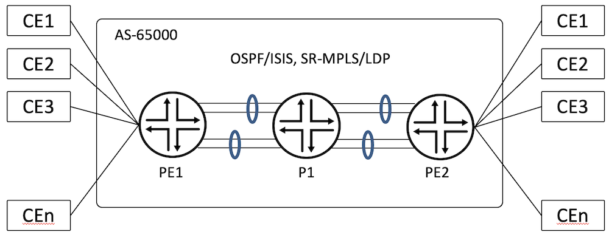
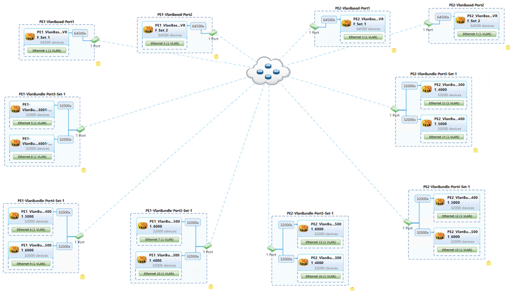
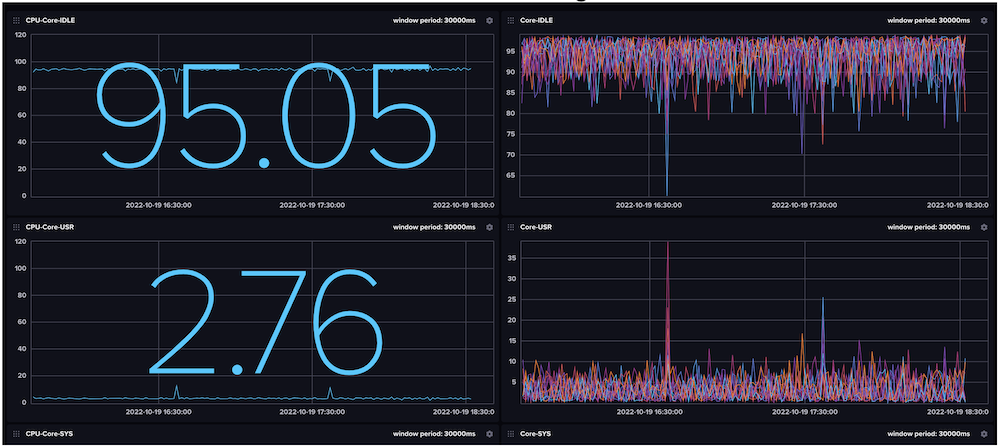
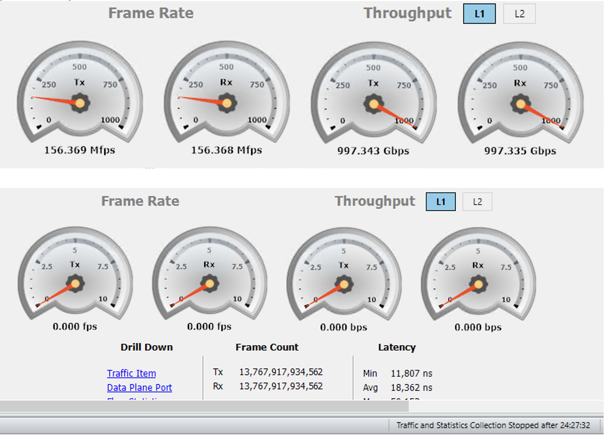

# EVPN MAC-VRF Validation on ACX7000

**Suneesh Babu - 10/29/2022**

JUNOS unified way of bringing up EVPN E-LAN using mac-vrf instance type supporting 6,000 instances on ACX7000 with 642,000 MAC scale.

## Introduction

This article is the first in a series on ACX7k Metro Validation. We are covering the following features and their scale.

Layer-2 VPN Technologies provide multipoint services over IP/MPLS networks. The latest addition to this is [Ethernet VPN (EVPN)](https://www.juniper.net/documentation/us/en/software/junos/evpn-vxlan/topics/concept/evpns-overview.html) where MAC learning is done via control plane compared to its predecessor [Virtual Private LAN Service (VPLS)](https://www.juniper.net/documentation/us/en/software/junos/vpn-l2/topics/concept/vpn-vpls-introduction.html) where MAC got learned via data plane.

[RFC-7432](https://datatracker.ietf.org/doc/html/rfc7432) describes BGP MPLS Based Ethernet VPNs with three service types, namely VLAN-Based, VLAN-Bundle, and VLAN-Aware-Bundle. In VLAN-Based MAC-VRF, only one broadcast domain or VLAN is present. In VLAN-Bundle MAC-VRF multiple broadcast domains or VLANs are present, all of them bundled into a single bridge table. In VLAN-Aware Bundle MAC-VRF multiple broadcast domains are present, each having its own bridge table.

JUNOS supports EVPN with [MPLS](https://www.juniper.net/documentation/en_US/junos/topics/concept/mpls-security-overview.html) and [VxLAN](https://www.juniper.net/documentation/us/en/software/junos/evpn-vxlan/topics/topic-map/sdn-vxlan.html) encapsulations. Its E-LAN configuration constructs differ across the platforms. The instance type "mac-vrf" is a unified way to configure EVPN E-LAN across entire Juniper platforms.

[ACX7100-32C](https://www.juniper.net/us/en/products/routers/acx-series/acx7000-family-cloud-metro-routers/acx7100-line/acx7100.html) supports EVPN-MPLS E-LAN functionality with instance-type "mac-vrf". In this test scenario, VLAN-Based and VLAN-Bundle service types of MAC VRF are covered for their scale with 22.2R1 Junos-EVO build. VLAN-Aware Bundle Support is on the roadmap.

6,000 EVPN MAC-VRF Instances were tested on ACX7100-32C with 3,000 VLAN-Based Service Types and 3,000 VLAN-Bundle Service Types. 642,000 MACs across 6,000 MAC-VRF Instances. The same scale is tested on [ACX7100-48L](https://www.juniper.net/documentation/us/en/hardware/acx7100-48L/topics/topic-map/acx7100-48L-system-overview.html) as well as on [ACX7509](https://www.juniper.net/us/en/products/routers/acx-series/acx7000-family-cloud-metro-routers/acx7500-line/acx7509.html).

But the [ACX7024](https://www.juniper.net/us/en/products/routers/acx-series/acx7000-family-cloud-metro-routers/acx7000-line/acx7024.html) Scale is not covered in this article (same features but different scale are expected on this platform).

**Please note** that despite sharing the same ACX moniker, the ACX7000 products are different products than ACX500/710/1000/1100/2100/2200/4000/5000/5400/6000. They are powered by different Packet Forwarding Engines (PFE), and support different feature sets and scales.

The Key Performance Indicator (KPI) tested are:

| EVPN MAC-VRF KPI | Scale |
|:--|:--|
| Number of MAC-VRF instances | 6,000 |
| Number of VLAN-Based Service Types | 3,000 |
| Number of VLAN-Bundle Service Types | 3,000 |
| Number of VLANs | 9,000 |
| Number of Interfaces | 9,000 |
| Number of MACs | 642,000 |

## Metro EVPN Topology

Test topology consists of three routers:

- PE1: ACX7100-32C
- PE2: ACX7100-48L
- P1: [PTX10008](https://www.juniper.net/documentation/us/en/hardware/ptx10008/topics/topic-map/ptx10008-line-card-components.html#line-Card-ptx10k-lc201).

CEs are simulated using a traffic generator and are connected to PEs using 5x 100G links. PEs are connected to the core using 8x 100G links, bundled in 2x LAGs of four links each.

The ACX7100-32C is the Device Under Test (DUT). The underlay transport used for testing is SR-MPLS with both OSPF and ISIS protocols individually. We also covered LDP as the underlay transport. The CE-bound interface configurations are of SP-Style (see glossary).



For this test, we configured 6,000 MAC-VRF instances:

- 3,000 with VLAN-Based and the remaining VLAN-Bundle.
- VLAN-Based instances have one VLAN and VLAN-Bundle have two VLANs.
- 43 Local and 43 Remote hosts are learned per VLAN-Based MAC-VRF Instances
- 64 Local and 64 Remote hosts are learned per VLAN-Bundle MAC-VRF Instances
- Total: 642,000 hosts.

Bidirectional traffic in iMIX mode at 99.9% offer-load flows for all the EVPN services. A total of ~1Tbps traffic transits through the DUT.

### Base Configuration

The IGP and BGP configurations require to bring up EVPN:

```
regress@PE1> show configuration protocols |display inheritance no-comments
bgp {
    group IBGP {
        type internal;
        local-address 12.1.1.1;
        family inet {
            unicast;
        }
        family evpn {
            signaling;
        }
        neighbor 12.1.1.3 {
            export nhself;
        }
    }
}
mpls {
    interface ae0.0;
    interface ae1.0;
}
ospf {
    source-packet-routing {
        node-segment ipv4-index 101;
        srgb start-label 45000 index-range 2000;
    }
    area 0.0.0.0 {
        interface lo0.0 {
            passive;
        }
        interface ae0.0 {
            interface-type p2p;
        }                               
        interface ae1.0 {
            interface-type p2p;
        }
    }
}

regress@PE1>

```

### MAC-VRF Routing Instance Configuration

MAC-VRF with VLAN-Based service type is as follows:

```
regress@PE1> show configuration
interfaces {
    et-0/0/0 {
        flexible-vlan-tagging;
        encapsulation flexible-ethernet-services;
        unit 1 {
            encapsulation vlan-bridge;
            vlan-id 1;
        }
    }
}
routing-instances {
    METRO_MAC_VRF_1 {
        instance-type mac-vrf;
        protocols {
            evpn {
                encapsulation mpls;
                normalization;
                no-control-word;
            }
        }
        service-type vlan-based;
        interface et-0/0/0.1;
        route-distinguisher 12.1.1.1:1;
        vrf-target target:65000:1;
        vlans {
            MVRF_VBASED_VLAN_1 {
                vlan-id 1;
                interface et-0/0/0.1;
            }
        }
    }
}
```

MAC-VRF with VLAN-Bundle service type is as follows:

```
regress@PE1> show configuration
interfaces {
    et-0/0/2 {
        flexible-vlan-tagging;
        encapsulation flexible-ethernet-services;
        unit 1 {
            encapsulation vlan-bridge;
            vlan-id-list 1;
        }
    }
    et-0/0/3 {
        flexible-vlan-tagging;
        encapsulation flexible-ethernet-services;
        unit 1001 {
            encapsulation vlan-bridge;
            vlan-id-list 1001;
        }
    }
}
routing-instances {
    METRO_MAC_VRF_3001 {
        instance-type mac-vrf;
        protocols {
            evpn {
                encapsulation mpls;
                no-control-word;
            }
        }
        service-type vlan-bundle;
        interface et-0/0/2.1;
        interface et-0/0/3.1001;
        route-distinguisher 12.1.1.1:3001;
        vrf-target target:65000:3001;
        vlans {
            MVRF_VBUNDLE_VLAN_3001 {
                interface et-0/0/2.1;
                interface et-0/0/3.1001;
            }                        
        }
    }
}
```

### MAC-VRF CE Bound Interface Schema

The five CE-bound 100G interfaces are logically split across the routing-instances as follows:

| PE1 | PE2 | Port | Service Type | MAC-VRF | VLAN Association | Traffic Load |
|:--|:--|:--|:--|:--|:--|:--|
| et-0/0/0 | et-0/0/48:0 | P1 | VLAN-Based | 1-1500 | P1-1-1500 | 99.9% |
| et-0/0/1 | et-0/0/48:1 | P2 | VLAN-Based | 1501-3000 | P2-1-1500 | 99.9% |
| et-0/0/2 | et-0/0/48:2 | P3 | VLAN-Bundle | 3001-4000 | P3-1-1000,P4-1001-2000 | 99.9% |
| et-0/0/3 | et-0/0/48:3 | P4 | VLAN-Bundle | 4001-5000 | P4-1-1000,P5-1001-2000 | 99.9% |
| et-0/0/4 | et-0/0/49 | P5 | VLAN-Bundle | 5001-6000 | P5-1-1000,P3-1001-2000 | 99.9% |

### MAC-VRF Verification

The first step to verify the EVPN service is to make sure the PE devices are having BGP established with evpn-signalling. As shown below from PE1, BGP is in Established state for the Peer PE2(12.1.1.3) and bgp.evpn.0 table got populated with Type-2 MAC routes.

```
regress@PE1> show bgp summary |no-more
Threading mode: BGP I/O
Default eBGP mode: advertise - accept, receive - accept
Groups: 1 Peers: 1 Down peers: 0
Table          Tot Paths  Act Paths Suppressed    History Damp State    Pending
inet.0               
                      10          1          0          0          0          0
inet6.0              
                       0          0          0          0          0          0
bgp.evpn.0
                  327000     327000          0          0          0          0
inet6.3              
                       0          0          0          0          0          0
Peer                     AS      InPkt     OutPkt    OutQ   Flaps Last Up/Dwn State|#Active/Received/Accepted/Damped...
12.1.1.3              65000      38691     158803       0       1  1d 0:24:43 Establ
  inet.0: 1/10/10/0
  bgp.evpn.0: 327000/327000/327000/0
  METRO_MAC_VRF_1.evpn.0: 44/44/44/0
  METRO_MAC_VRF_2.evpn.0: 44/44/44/0
  METRO_MAC_VRF_3.evpn.0: 44/44/44/0
  ...
  METRO_MAC_VRF_2998.evpn.0: 44/44/44/0
  METRO_MAC_VRF_2999.evpn.0: 44/44/44/0
  METRO_MAC_VRF_3000.evpn.0: 44/44/44/0
  METRO_MAC_VRF_3001.evpn.0: 65/65/65/0
  METRO_MAC_VRF_3002.evpn.0: 65/65/65/0
  METRO_MAC_VRF_3003.evpn.0: 65/65/65/0
  ...
  METRO_MAC_VRF_5998.evpn.0: 65/65/65/0
  METRO_MAC_VRF_5999.evpn.0: 65/65/65/0
  METRO_MAC_VRF_6000.evpn.0: 65/65/65/0
  __default_evpn__.evpn.0: 0/0/0/0

regress@PE1>
```

The MAC-Table Summary shows the DUT learned the 642,000 host MAC addresses.

```
regress@PE1> show mac-vrf forwarding mac-table summary
Jun 29 05:14:19
Total dynamic and static MAC addresses learned globally : 642000
Configured static MAC addresses learned globally       : 0
```

### VLAN Based MAC VRF Verification

As shown below, the interface et-0/0/0.1 is bound to MAC-VRF Instance METRO_MAC_VRF_1 with a single vlan (vlan-id 1). The interface is in Forwarding state:

```
regress@PE1> show mac-vrf forwarding interface et-0/0/0.1
Routing Instance Name : METRO_MAC_VRF_1
Logical Interface flags (DL - disable learning, AD - packet action drop,
                         LH - MAC limit hit, DN - interface down,
                         MMAS - Mac-move action shutdown,  AS - Autostate-exclude enabled,
                         SCTL - shutdown by Storm-control, MI - MAC+IP limit hit)

Logical         Vlan                   TAG   MAC    MAC+IP STP         Logical          Tagging
interface       members                      limit  limit  state       interface flags
et-0/0/0.1                                   0      0                                   tagged
                MVRF_VBASED_VLAN_1     1     1000001 0     Forwarding                   tagged
```

The VLAN Association of the METRO_MAC_VRF_1 instance is shown below.

```
regress@PE1> show vlans MVRF_VBASED_VLAN_1

Routing instance        VLAN name             Tag          Interfaces
METRO_MAC_VRF_1         MVRF_VBASED_VLAN_1    1
                                                           .local.202922*
                                                           et-0/0/0.1*
```

The extensive output of the METRO_MAC_VRF_1 instance captures the total number of MAC learned. The VLAN bound to instance can be found too.

```
regress@PE1> show evpn instance METRO_MAC_VRF_1 extensive
Instance: METRO_MAC_VRF_1
  Route Distinguisher: 12.1.1.1:1
  VLAN ID: 1
  Per-instance MAC route label: 16
  Duplicate MAC detection threshold: 5
  Duplicate MAC detection window: 180
  MAC database status                     Local  Remote
    MAC advertisements:                      43      43
    MAC+IP advertisements:                    0       0
    Default gateway MAC advertisements:       0       0
  Number of local interfaces: 2 (2 up)
    Interface name  ESI                            Mode             Status     AC-Role
    .local..51      00:00:00:00:00:00:00:00:00:00  single-homed     Up         Root
    et-0/0/0.1      00:00:00:00:00:00:00:00:00:00  single-homed     Up         Root
  Number of IRB interfaces: 0 (0 up)
  Number of protect interfaces: 0
  Number of bridge domains: 1
    VLAN  Domain-ID Intfs/up   IRB-intf  Mode            MAC-sync v4-SG-sync v6-SG-sync
    1                  1  1              Extended        Enabled  Disabled   Disabled
  Number of neighbors: 1
    Address               MAC    MAC+IP        AD        IM        ES Leaf-label Remote-DCI-Peer
    12.1.1.3               43         0         0         1         0
  Number of ethernet segments: 0
  SMET Forwarding: Disabled
```

The MAC-VRF Forwarding Table of METRO_MAC_VRF_1 instance captures both local and remote MAC addresses.

```
regress@PE1> show mac-vrf forwarding mac-table instance METRO_MAC_VRF_1

MAC flags (S - static MAC, D - dynamic MAC, L - locally learned, P - Persistent static, C - Control MAC
           SE - statistics enabled, NM - non configured MAC, R - remote PE MAC, O - ovsdb MAC)


Ethernet switching table : 86 entries, 86 learned
Routing instance : METRO_MAC_VRF_1
    Vlan                MAC                 MAC         Age    Logical                NH        RTR
    name                address             flags              interface              Index     ID
    MVRF_VBASED_VLAN_1  00:11:01:00:00:01   D             -   et-0/0/0.1             0         0
    MVRF_VBASED_VLAN_1  00:11:01:00:00:02   D             -   et-0/0/0.1             0         0
    MVRF_VBASED_VLAN_1  00:11:01:00:00:03   D             -   et-0/0/0.1             0         0
    ...
    MVRF_VBASED_VLAN_1  00:13:01:00:00:01   DC            -                          202922    202922
    MVRF_VBASED_VLAN_1  00:13:01:00:00:02   DC            -                          202922    202922
    MVRF_VBASED_VLAN_1  00:13:01:00:00:03   DC            -                          202922    202922
    ...

regress@PE1>
```

The labels associated with one of the remote MAC learned are displayed with:

```
regress@PE1> show route forwarding-table table METRO_MAC_VRF_1 | find 00:13:01:00:00:01/48
00:13:01:00:00:01/48 user     0                  indr   228870     1
                                                 ulst   228867     1
                                                sftw Push 17, Push 45103(top)   228865     1 ae0.0
                              15.1.1.2           ucst    17001     1 ae0.0
                                                sftw Push 17, Push 45103(top)   228866     1 ae1.0
                              15.1.2.2           ucst    17000     1 ae1.0
...
regress@PE1> 
regress@PE1> show route table mpls.0 label 45103

mpls.0: 24013 destinations, 24013 routes (24013 active, 0 holddown, 0 hidden)
+ = Active Route, - = Last Active, * = Both

45103              *[L-OSPF/10/5] 2d 22:01:11, metric 2
                       to 15.1.1.2 via ae0.0, Swap 45103
                    >  to 15.1.2.2 via ae1.0, Swap 45103
regress@PE2> show route table mpls.0 label 17

mpls.0: 24013 destinations, 24013 routes (24013 active, 0 holddown, 0 hidden)
+ = Active Route, - = Last Active, * = Both

17                 *[EVPN/7] 23:52:42, routing-instance METRO_MAC_VRF_1, route-type Ingress-MAC, vlan-id 1
                       to table METRO_MAC_VRF_1.evpn-mac.0

regress@PE2>
```

### VLAN Bundle MAC-VRF Verification

The interface and its vlan-association for a vlan-bundle service type mac-vrf instance METRO_MAC_VRF_3001 are as follows:

```
regress@PE1> show mac-vrf forwarding interface et-0/0/2.1
Routing Instance Name : METRO_MAC_VRF_3001
Logical Interface flags (DL - disable learning, AD - packet action drop,
                         LH - MAC limit hit, DN - interface down,
                         MMAS - Mac-move action shutdown,  AS - Autostate-exclude enabled,
                         SCTL - shutdown by Storm-control, MI - MAC+IP limit hit)

Logical         Vlan                   TAG   MAC    MAC+IP STP         Logical          Tagging
interface       members                      limit  limit  state       interface flags
et-0/0/2.1                                   0      0                                   tagged
                MVRF_VBUNDLE_VLAN_3001 NA    1000001 0     Forwarding                   tagged

regress@PE1> show mac-vrf forwarding interface et-0/0/3.1001
Routing Instance Name : METRO_MAC_VRF_3001
Logical Interface flags (DL - disable learning, AD - packet action drop,
                         LH - MAC limit hit, DN - interface down,
                         MMAS - Mac-move action shutdown,  AS - Autostate-exclude enabled,
                         SCTL - shutdown by Storm-control, MI - MAC+IP limit hit)

Logical         Vlan                   TAG   MAC    MAC+IP STP         Logical          Tagging
interface       members                      limit  limit  state       interface flags
et-0/0/3.1001                                0      0                                   tagged
                MVRF_VBUNDLE_VLAN_3001 NA    1000001 0     Forwarding                   tagged
```

Vlan-1 and Vlan-1000 are associated with METRO_MAC_VRF_3001 mac-vrf instance and its interface association is shown below.

```
regress@PE1> show vlans MVRF_VBUNDLE_VLAN_3001

Routing instance        VLAN name             Tag          Interfaces
METRO_MAC_VRF_3001      MVRF_VBUNDLE_VLAN_3001 NA       
                                                           .local.202905*
                                                           et-0/0/2.1*
                                                           et-0/0/3.1001*
```

and also

```
regress@PE1> show evpn instance METRO_MAC_VRF_3001 extensive
Instance: METRO_MAC_VRF_3001
  Route Distinguisher: 12.1.1.1:3001
  Service interface type: VLAN-bundle service interface
  Per-instance MAC route label: 6016
  Duplicate MAC detection threshold: 5
  Duplicate MAC detection window: 180
  MAC database status                     Local  Remote
    MAC advertisements:                      64      64
    MAC+IP advertisements:                    0       0
    Default gateway MAC advertisements:       0       0
  Number of local interfaces: 3 (3 up)
    Interface name  ESI                            Mode             Status     AC-Role
    .local..2279    00:00:00:00:00:00:00:00:00:00  single-homed     Up         Root
    et-0/0/2.1      00:00:00:00:00:00:00:00:00:00  single-homed     Up         Root
    et-0/0/3.1001   00:00:00:00:00:00:00:00:00:00  single-homed     Up         Root
  Number of IRB interfaces: 0 (0 up)
  Number of protect interfaces: 0
  Number of bridge domains: 1
    VLAN  Domain-ID Intfs/up   IRB-intf  Mode            MAC-sync v4-SG-sync v6-SG-sync
    None               2  2              Extended        Enabled  Disabled   Disabled
  Number of neighbors: 1
    Address               MAC    MAC+IP        AD        IM        ES Leaf-label Remote-DCI-Peer
    12.1.1.3               64         0         0         1         0
  Number of ethernet segments: 0
  SMET Forwarding: Disabled

regress@PE1>
```

The DUT learns MAC addresses from both the vlans as well as from remote peer over the evpn-signalling.

```
regress@PE1> show mac-vrf forwarding mac-table instance METRO_MAC_VRF_3001

MAC flags (S - static MAC, D - dynamic MAC, L - locally learned, P - Persistent static, C - Control MAC
           SE - statistics enabled, NM - non configured MAC, R - remote PE MAC, O - ovsdb MAC)


Ethernet switching table : 128 entries, 128 learned
Routing instance : METRO_MAC_VRF_3001
    Vlan                MAC                 MAC         Age    Logical                NH        RTR 
    name                address             flags              interface              Index     ID
    MVRF_VBUNDLE_VLAN_3001 00:15:01:00:00:01 D            -   et-0/0/2.1             0         0     
    MVRF_VBUNDLE_VLAN_3001 00:15:01:00:00:02 D            -   et-0/0/2.1             0         0
    MVRF_VBUNDLE_VLAN_3001 00:15:01:00:00:03 D            -   et-0/0/2.1             0         0
    ...
    MVRF_VBUNDLE_VLAN_3001 00:19:01:00:00:01 D            -   et-0/0/3.1001          0         0
    MVRF_VBUNDLE_VLAN_3001 00:19:01:00:00:02 D            -   et-0/0/3.1001          0         0       
    MVRF_VBUNDLE_VLAN_3001 00:19:01:00:00:03 D            -   et-0/0/3.1001          0         0
    ...
    MVRF_VBUNDLE_VLAN_3001 00:1b:01:00:00:01 DC           -                          202905    202905
    MVRF_VBUNDLE_VLAN_3001 00:1b:01:00:00:02 DC           -                          202905    202905  
    MVRF_VBUNDLE_VLAN_3001 00:1b:01:00:00:03 DC           -                          202905    202905
    ...
    MVRF_VBUNDLE_VLAN_3001 00:1f:01:00:00:01 DC           -                          202905    202905
    MVRF_VBUNDLE_VLAN_3001 00:1f:01:00:00:02 DC           -                          202905    202905  
    MVRF_VBUNDLE_VLAN_3001 00:1f:01:00:00:03 DC           -                          202905    202905
    ...
regress@PE1>
```

The following output captures the number of instances and total MAC learned in the DUT

```
regress@PE1> show bgp summary |match evpn.0 | count
Count: 6003 lines

regress@PE1> show ethernet-switching table summary 
Total dynamic and static MAC addresses learned globally : 642000
Configured static MAC addresses learned globally       : 0

regress@PE1> show mac-vrf forwarding mac-table summary
Total dynamic and static MAC addresses learned globally : 642000
Configured static MAC addresses learned globally       : 0

regress@PE1>
```

Traffic flows are load-balanced across the LAG bundles and the LAG member interfaces as shown below

```
PE1                               Seconds: 8                   Time: 23:53:57
 
Interface    Link  Input packets        (pps)     Output packets        (pps)
 
 ae0           Up      430732227   (39467484)        426607625   (39090991)
 ae1           Up      422504760   (38716208)        426628049   (39092631)
 esi           Up              0          (0)                0          (0)
 et-0/0/0      Up      170633946   (15628905)        170633785   (15628463)
 et-0/0/1      Up      170633695   (15629036)        170633820   (15629066)
 et-0/0/2      Up      170656791   (15641087)        170656766   (15641091)
 et-0/0/3      Up      170657143   (15641388)        170657268   (15641460)
 et-0/0/4      Up      170656970   (15641588)        170657031   (15641683)
 et-0/0/5    Down              0          (0)                0          (0)
 et-0/0/6      Up      114219791   (10466300)        106662528    (9773701)
 et-0/0/7      Up      108553610    (9946350)        106641383    (9771845)
 et-0/0/8      Up      107267131    (9828675)        106646624    (9772262)
 et-0/0/9      Up      100691695    (9226159)        106657090    (9773183)
 et-0/0/10     Up      110934212   (10165928)        106662332    (9773648)
 et-0/0/11     Up      104545101    (9579897)        106651718    (9772709)
 et-0/0/12     Up      106957607    (9800959)        106662274    (9773644)
 et-0/0/13     Up      100067840    (9169424)        106651725    (9772630)
```

## Generating Scale Configuration

The Python Script is having three components:

- a Jinja File capturing the various configuration templates,
- a Params File capturing the various user variables
- the script uses both these input files and generates the required configurations and commit that in the router.

> Note: The configs are generated as per the CE-bound interface schema.

### Jinja Configuration Template

The template contains configurations for both interfaces which are part of the routing instances and routing instance configurations.

```
# EVPN Mac-VRF Routing Instance Configuration
# File Name: evpn_jinja.j2
# Version: 1.0
groups {{group_name}} {
    interfaces {
        {{ifd_name}} {
            flexible-vlan-tagging;
            encapsulation flexible-ethernet-services;
            
            unit {{unit_id}} {
                
                vlan-id {{vlan_id}};
                
                
                vlan-id-list {{vlan_id}};
                
                encapsulation vlan-bridge;
            }
            
        }
    }
    routing-instances {
        
        METRO_MAC_VRF_{{vrf_id}} {
            instance-type mac-vrf;
            
            interface lo0.{{vrf_id}};
            
            route-distinguisher {{router_id}}:{{vrf_id}};
            vrf-target target:{{local_as_no}}:{{vrf_id}};
            protocols {
                evpn {
                    encapsulation mpls;
                    no-control-word;
                    
                    normalization;
                    
                }
            }
            interface {{ifl_name}};
            
            service-type vlan-based;
            vlans {
                MVRF_VBASED_VLAN_{{vrf_id}} {
                    vlan-id {{vlan_id}};
                    interface {{ifl_name}};
                }
            }
            
            
            service-type vlan-bundle;
            vlans {
                MVRF_VBUNDLE_VLAN_{{vrf_id}} {
                    interface {{ifl_name}};
                }
            }
            
        }
        
    }
}
```

### Configuration Parameters

```
---
# This file contains the parameters for evpn configuration building
# File Name: evpn_params.yaml
# Version: 1.0
 
#Host Name
host: 'PE1.englab.juniper.net'
 
#UserName
username: 'regress'
#Password
password: 'xxxxx'
 
#Config Group Name
group_name: 'METRO_EVPN'
 
#vrfname creation
vrf_id: 1

#maximum evpn instances
vrf_max: 10
 
#interface name
ifd_name: 'et-0/0/0'
 
#ifl_start unit
ifl_start_unit: 1
 
#vlan_id start
vlan_id_start: 1
 
#My AS no
local_as_no: 65000
 
#My Router ID
router_id: '12.1.1.1'
 
#Loopback Interface
lo0_enabled: False
 
#EVPN Service Type:
vlan_based_service: False
vlan_bundle_service: True
vlan_aware_service: False
```

### Configuration Script

```
#! /usr/bin/python
"""
    FileName: create_evpn_vrf.py
    Version: 1.0
    Description: This script will create evpn vrf instances and configure it on the router
    Author: Suneesh Babu
"""
import yaml
from glob import glob
from jinja2 import Template
import ipaddress
from jnpr.junos.utils.config import Config
from jnpr.junos import Device
from jnpr.junos.factory import loadyaml
from jnpr.junos.op import *
 
def iflrange(ifd_name, start_unit, max):
    """
    This subroutine yields the specified number of l3 ifls for the ifd
    """
    while(max):
        iflname = ifd_name + '.' + str(start_unit)
        yield iflname
        start_unit += 1
        max -= 1
 
def router_operation(config_filename, data, mode):
    """
        This sub-routine connects to the router and does the necessary commit operations
    """
    router = Device(host=data['host'], user=data['username'], password=data['password'], port=22)
    router.open()
 
    cfg = Config(router)
    if mode == 'jinja':
        cfg.load(template_path=config_filename, template_vars=data, format='text', merge=True)
    elif mode == 'setfile':
        cfg.load(path=config_filename, format='set')
    cfg.pdiff()
    cfg.commit()
    router.close()
 
def jinja_template_input(data):
    """
        This sub-routine yields the variables required for the jinja template
    """
    ifl_unit_list = range(int(data['ifl_start_unit']), int(data['ifl_start_unit']) + int(data['vrf_max']))
    vlan_list = range(int(data['vlan_id_start']), int(data['vlan_id_start']) + int(data['vrf_max']))
 
    vrf_id_list = range(int(data['vrf_id']), int(data['vrf_id']) + int(data['vrf_max']))
    ifl_name_list = iflrange(data['ifd_name'], data['ifl_start_unit'], int(data['vrf_max']))
 
    return zip(ifl_unit_list, vlan_list), zip(vrf_id_list, list(ifl_name_list), vlan_list)
 
def main():
    """
       To Build the desired number of mac-vrf instances
    """
    print("Step-1: Read the Variables from the Params File")
    with open(glob('evpn_params.yaml')[0]) as fh:
        data = yaml.safe_load(fh.read())
 
    print("Step-2: Build the Data Feed for the Jinja Template Input")
    ifl_attributes, evpn_attributes = jinja_template_input(data)
    data['ifl_variables'] = ifl_attributes
    data['evpn_variables'] = evpn_attributes
 
    print("Step-3: Build the configuration file from Jinja Template")
    with open(glob('evpn_jinja.j2')[0]) as t_fh:
        t_format = t_fh.read()
    evpn_snippet = Template(t_format)
    # print (evpn_snippet.render(data))
    print("Step-4: Load the config into router and commit it")
    router_operation('evpn_jinja.j2', data, 'jinja')

if __name__ == '__main__':
    main()
```

## Traffic Generator Configuration

Hosts are simulated as follows:



### CPU Usage during traffic flow

The 12-Core CPU of the DUT (ACX7100-32C) remains idle at 95% during the traffic flow.



### Data Plane Traffic Verification

As shown below traffic flows at 99.9% of 100G links over 5 CE bound interfaces and no packet drops are seen for a duration of 24 hours.



## Conclusion

ACX7000 Family platforms (ACX7100-32C, ACX7100-48L, ACX7509) with this tested scale are ready for the Metro deployments. This article demonstrate the MAC VRF scale reachable in architecture based on these routers. The EVPN services capabilities are paramount for the next generation Metro Solution requirements. Next TechPost article will be dedicated to the [EVPN VPWS scale validation](https://juniper.github.io/techposts/evpn-vpws-validation-on-acx7000/article).

## References

- RFC-7432 - [https://datatracker.ietf.org/doc/html/rfc7432](https://datatracker.ietf.org/doc/html/rfc7432)
- MAC-VRF - [https://www.juniper.net/documentation/us/en/software/junos/evpn-vxlan/topics/concept/mac-vrf-routing-instance-overview.html](https://www.juniper.net/documentation/us/en/software/junos/evpn-vxlan/topics/concept/mac-vrf-routing-instance-overview.html)

## Glossary

- BGP -- Border Gateway Protocol
- CE -- Customer Edge Node
- DUT -- Device Under Test
- E-LAN -- Ethernet LAN
- EVPN -- Ethernet Virtual Private Network
- KPI -- Key Performance Indicators
- LAN -- Local Area Network
- MAC-VRF -- Media Access Control VRF
- MPLS -- Multi Protocol Label Switching
- OSPF -- Open Shortest Path First
- P/PE -- Provider/Provider Edge Node
- SP Style -- Service Provider Style
- SR-MPLS -- Segment Routing - MPLS
- VLAN -- Virtual LAN
- VRF -- Virtual Routing and Forwarding
- VxLAN -- Virtual Extensible LAN

## Acknowledgement

Many thanks to Chethana Jayanna, Ramdas Machat, Vasily Mukhin and Nicolas Fevrier for reviewing the article and providing the feedback
