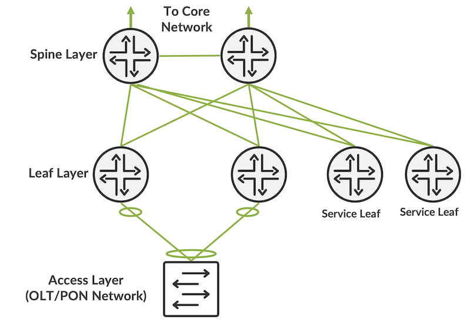
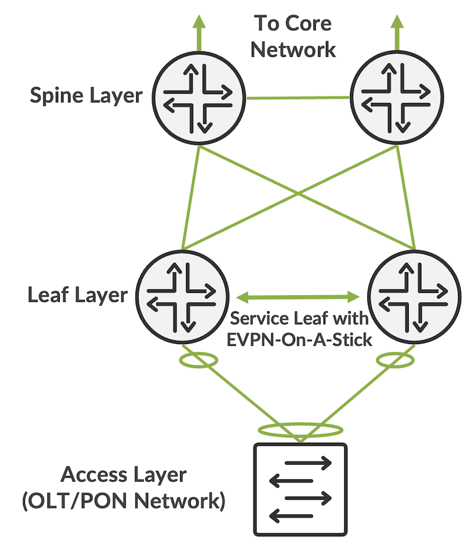
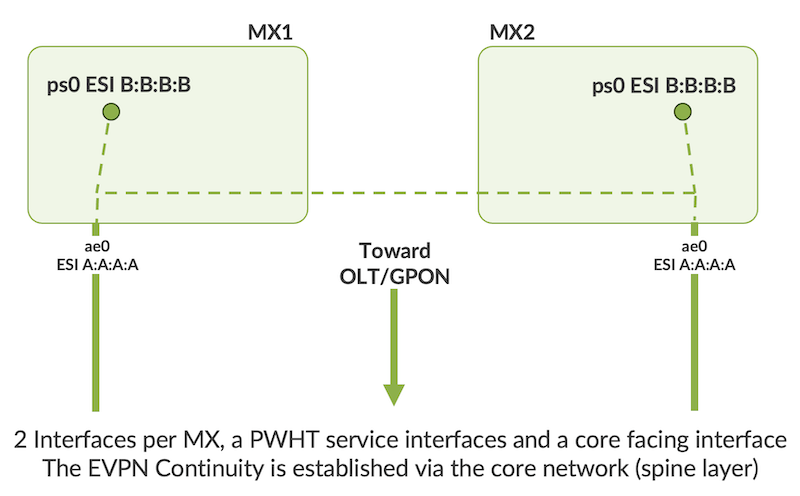

# EVPN-On-A-Stick: Rethinking Service Edge Architectures

**Francois Lecavalier - 09/25/2025**

EVPN-On-A-Stick offers a fresh way to build networks by merging service functions directly into the main fabric. The result is simpler operations, faster performance, and a more scalable foundation for future growth.

## Introduction

Over the past decade, the **spine--leaf architecture** has become the de-facto model for building scalable service provider and data center networks. Its clean separation of layers, predictable east--west scaling, and compatibility with modern overlay technologies like EVPN have made it the preferred blueprint for operators looking to meet exponential bandwidth growth.

But when it comes to **subscriber management and service edge functions** (BNG, CGNAT, OLT aggregation, enterprise EVPN gateways, etc.), this model has exposed some painful trade-offs. Service providers often introduce **service leaf nodes** that sit beside the "pure" transport leaves and spines. While this provides the necessary subscriber and service capabilities, it also introduces operational complexity, higher latency, asymmetric traffic patterns, and scale challenges.

To address these shortcomings, we introduce **EVPN-On-A-Stick** - a design that collapses service functions back into the edge while still preserving the scale-out benefits of spine/leaf. It's a modernized take on the traditional integrated edge, but powered by EVPN for resiliency, flexibility, and growth.

## The Problem with Traditional Service Leafs

In a conventional spine--leaf fabric extended with service leafs, providers face several challenges:

- **Hairpinning and Latency**: Subscriber traffic must be punted through service leafs for functions such as authentication, policy enforcement, or NAT, often doubling the traversal across the fabric.
- **Operational Complexity**: Operators now manage different flavors of leaf nodes - transport vs service - with distinct feature sets, upgrades, and failure modes.
- **Scaling Constraints**: Service nodes become chokepoints. Scaling them requires adding new service leaf pairs and redistributing subscriber contexts, a non-trivial operational exercise.
- **Asymmetric Paths**: Uplink and downlink traffic may traverse different routes, complicating OAM, lawful intercept, and billing correlation.

While workable, this architecture inherits the weaknesses of centralizing service functionality in a model originally built for distributed, stateless transport.



## EVPN-On-A-Stick: A Better Approach

The **EVPN-On-A-Stick** design collapses service functions directly onto the **edge router** (such as the MX Series). Instead of inserting a separate "service leaf" tier, the BNG, OLT termination, and EVPN gateway roles are hosted locally, with EVPN used as the unifying fabric mechanism.



At its core, this model uses two proven EVPN features:

1. **EVPN Core Protection**: Ensures no blackholing by withdrawing EVPN LACP links upstream when a node loses reachability.
2. **EVPN DF Election**: Provides deterministic control of which BNG is active for OLTs and which uplinks forward traffic.

This results in a design that is both **simpler and more resilient**, while retaining compatibility with the existing spine--leaf fabric.



## Key Benefits

1. **Lower Latency & Better Efficiency**
By eliminating hairpinning to service leafs, subscriber packets are processed "on-a-stick" at the edge device. This cuts out unnecessary fabric traversals and reduces jitter for delay-sensitive services like VoIP, IPTV, or 5G user plane traffic.
2. **Operational Simplicity**
One class of edge nodes replaces multiple device roles. Operators avoid managing distinct service leaf pools, simplifying lifecycle tasks such as upgrades, monitoring, and troubleshooting.
3. **Resilient & Deterministic**
EVPN Core Protection and DF Election guarantee clean failover behaviors. If one edge node loses connectivity, the other assumes the role without risking blackholing or forwarding ambiguity.
4. **Scale-Out Preserved**
Critically, EVPN-On-A-Stick does not abandon the scale-out principle of spine/leaf. As demand grows, operators can add additional edge nodes and spines, and EVPN's inherent multipathing ensures the fabric scales linearly. Subscriber sessions and OLT uplinks can be distributed across nodes, just like workloads in a compute cluster.
5. **Investment Protection**
Service providers can consolidate onto a single, modern platform (e.g., MX304/301 or MX10K with Trio 6/7 ASICs) without duplicating fabric and service capacity. This reduces TCO, footprint, and power while providing room for advanced functions like inline CGNAT, MACsec, or SRv6.
6. **Future-Proof for Converged Services**
As networks converge residential, business, and mobile traffic at the edge, EVPN-On-A-Stick provides a unifying model: 

- BNG (BNG CUPS / wholesale WWC)
- OLT uplink aggregation
- Enterprise EVPN gateways
- Mobile transport functions (SRv6, HQoS)

All share the same EVPN-based framework, simplifying design and operations.

## Basic Configuration

The basis of EVPN is to define an EVPN instance with a physical interface and a PWHT interface, collapsing both the traditional access leaf and service leaf in the same device.

```
regress@mx-lc9600> show configuration routing-instance evpn_1 | display set 
set routing-instance evpn_1 protocols evpn interface ps0.0 vpws-service-id local 2
set routing-instance evpn_1 protocols evpn interface ps0.0 vpws-service-id remote 1
set routing-instance evpn_1 protocols evpn interface ps0.0 control-word
set routing-instance evpn_1 protocols evpn interface ae0.0 vpws-service-id local 1
set routing-instance evpn_1 protocols evpn interface ae0.0 vpws-service-id remote 2
set routing-instance evpn_1 protocols evpn interface ae0.0 control-word
set routing-instance evpn_1 instance-type evpn-vpws
set routing-instance evpn_1 route-distinguisher 198.51.100.1
set routing-instance evpn_1 route-target target:1:1
```

The physical interface must be attached to an Aggregate Ethernet (ae) interface to benefit from EVPN Core Protection.

## Address Management: Keeping Subscribers Always-On

One of the less obvious but critical aspects of collapsing services into the edge is **how subscriber IP addresses are managed and retained during failovers.**

In EVPN-On-A-Stick, subscriber IPs are tightly coupled with the **service-facing interface**. When combined with **Active Lease Query** (ALQ), this coupling virtually eliminates downtime during BNG or edge switchover events - ensuring subscribers keep the same address without session disruption.

Operators can further simplify lifecycle operations by leveraging the Address Pool Manager (APM). Instead of manually carving up pools per device or site, APM centralizes address management, dynamically allocating subnets as needed. This removes much of the operational pain that has historically come with IP address fragmentation and lease synchronization across nodes.

Together, these capabilities ensure that EVPN-On-A-Stick doesn't just solve the transport and service convergence problem - it also provides a robust model for **subscriber continuity and operational ease at scale**.

## Inline Services with Trio: Unlocking More at the Edge

The real strength of EVPN-On-A-Stick comes from the **Trio silicon architecture** (Trio 6 today, Trio 7 tomorrow). Beyond just collapsing transport and subscriber functions, Trio enables **advanced inline services** to run at scale, directly on the same MX edge platforms.

Supported Inline Services:

- **BNG with CGNAT**: Carrier-Grade NAT at line rate ensures IPv4/IPv6 interworking without requiring external appliances.
- **IPsec**: Built-in hardware acceleration for secure tunnels at massive scale, supporting wholesale mobile backhaul or enterprise VPN services.
- **MACsec**: Link-layer encryption at wire speed, securing connections across metro and access domains.
- **Lawful Intercept and Flow Monitoring**: Inline support for compliance, visibility, and telemetry without external taps.
- **DDoS Mitigation and Filtering**: Hardware-based filters and telemetry-driven controls to protect subscriber and core services.
- **QoS and HQoS**: Hierarchical traffic shaping and scheduling at scale, critical for 5G and multi-service environments.

## Why it Matters?

By delivering these services inline, service providers avoid service-chain sprawl and appliance proliferation. Subscriber traffic is authenticated, translated, encrypted, and forwarded - all in a single box, at line rate, and under the control of EVPN's distributed resiliency.

This means that operators gain the **best of both worlds**:

- A simple, scalable EVPN-based fabric.
- A rich suite of advanced services at the edge, enabled by Trio, ready for whatever subscriber and enterprise demands the future brings.

## From Legacy to Modern Edge

In many ways, EVPN-On-A-Stick brings us "back to the future." Legacy edge routers historically combined transport and subscriber services in one box. The shift to spine/leaf sought scale and modularity, but at the cost of complexity when subscriber services were grafted back in via service leafs.

Now, with high-capacity, highly programmable silicon and EVPN as a service fabric, we can return to the simplicity of a consolidated edge - but without sacrificing the scale-out **flexibility demanded by today's multi-terabit environments.**

## Conclusion

**EVPN-On-A-Stick** represents an evolution in service edge design:

- Collapsing service leaf functionality back into the edge for simplicity.
- Using EVPN as the glue for resilience and scale.
- Enabling** inline Trio-powered services** like BNG CGNAT, IPsec, and MACsec at line rate.
- Preserving the horizontal growth model of spine--leaf while avoiding its service caveats.

For operators, this translates to **lower costs, fewer moving parts, and more capability** in the same footprint. As subscriber demand, 5G services, and edge cloud workloads accelerate, EVPN-On-A-Stick with Trio services provides a blueprint for service providers to modernize confidently - with a network that is simpler, stronger, and service-rich.

## Useful links

- [https://www.juniper.net/documentation/us/en/software/junos/subscriber-mgmt-access/topics/concept/pwht-evpn-vpws-logical-interface-bng.html](https://www.juniper.net/documentation/us/en/software/junos/subscriber-mgmt-access/topics/concept/pwht-evpn-vpws-logical-interface-bng.html)
- [https://www.juniper.net/documentation/us/en/software/junos/subscriber-mgmt-sessions/topics/topic-map/m-to-n-subscriber-redundancy.html](https://www.juniper.net/documentation/us/en/software/junos/subscriber-mgmt-sessions/topics/topic-map/m-to-n-subscriber-redundancy.html)

## Glossary

- AE - Aggregate Ethernet
Juniper's logical interface type that bundles multiple physical Ethernet links into a single logical channel. Provides higher bandwidth, redundancy, and simplified management. Works with LACP for negotiation and failover.
- EVPN - Ethernet Virtual Private Network
A standards-based technology (RFC 7432 and extensions) for providing multipoint Layer-2/Layer-3 VPN services over an IP or MPLS underlay, with integrated control-plane signaling.
- BNG - Broadband Network Gateway
The edge device in a service provider network that terminates subscriber sessions, enforces policies, and provides access to IP services.
- CGNAT - Carrier-Grade Network Address Translation
Large-scale NAT enabling multiple subscribers to share a single public IPv4 address, critical for IPv4 exhaustion.
- OLT - Optical Line Terminal
The headend device in a Passive Optical Network (PON) that aggregates subscriber ONU/ONT connections.
- OAM - Operations, Administration, and Maintenance
A set of tools and protocols for monitoring, troubleshooting, and assuring network health.
- LACP - Link Aggregation Control Protocol
IEEE 802.1AX protocol for bundling multiple physical links into a logical link for redundancy and throughput.
- DF - Designated Forwarder
In EVPN, the elected device responsible for forwarding broadcast/multicast/unknown traffic on a multi-homed segment.
- VoIP - Voice over IP
Transmission of voice communications over IP networks.
- IPTV - Internet Protocol Television
Television content delivered over IP-based networks rather than traditional broadcast.
- TCO - Total Cost of Ownership
A financial metric that accounts for all direct and indirect costs of owning and operating equipment.
- MACsec - Media Access Control Security
IEEE 802.1AE standard for link-layer encryption to secure Ethernet traffic.
- SRv6 - Segment Routing over IPv6
A source routing paradigm using IPv6 extension headers to encode network paths and service instructions.
- WWC - Wireless/Wireline Convergence
A framework (standardized in 3GPP) for converging fixed broadband and mobile services into a common core.
- HQoS - Hierarchical Quality of Service
QoS framework that supports multi-level traffic shaping, scheduling, and resource allocation.
- ALQ - Active Lease Query
A DHCP feature (RFC 7724) that enables real-time querying of active IP leases from servers for state synchronization.
- APM - Address Pool Manager
A centralized system for dynamically allocating and managing subscriber IP pools across devices and sites.
- IPsec - Internet Protocol Security
A suite of protocols providing authentication and encryption for IP traffic, widely used in VPNs and secure backhaul.
- DDoS - Distributed Denial of Service
A cyberattack where multiple systems flood a target with traffic, overwhelming its resources.
- QoS - Quality of Service
Techniques to prioritize and manage network traffic for performance guarantees.
- ASIC - Application-Specific Integrated Circuit
Custom silicon optimized for specific packet forwarding and service functions (e.g., Trio 6/7 in Juniper MX).

## Acknowledgements

Paul Lachapelle, Milind Bedare for reviewing BNG functionality on EVPN-On-A-Stick
