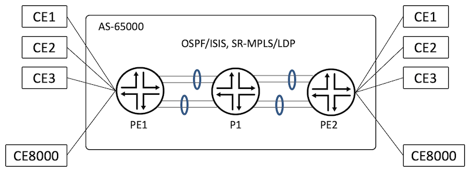
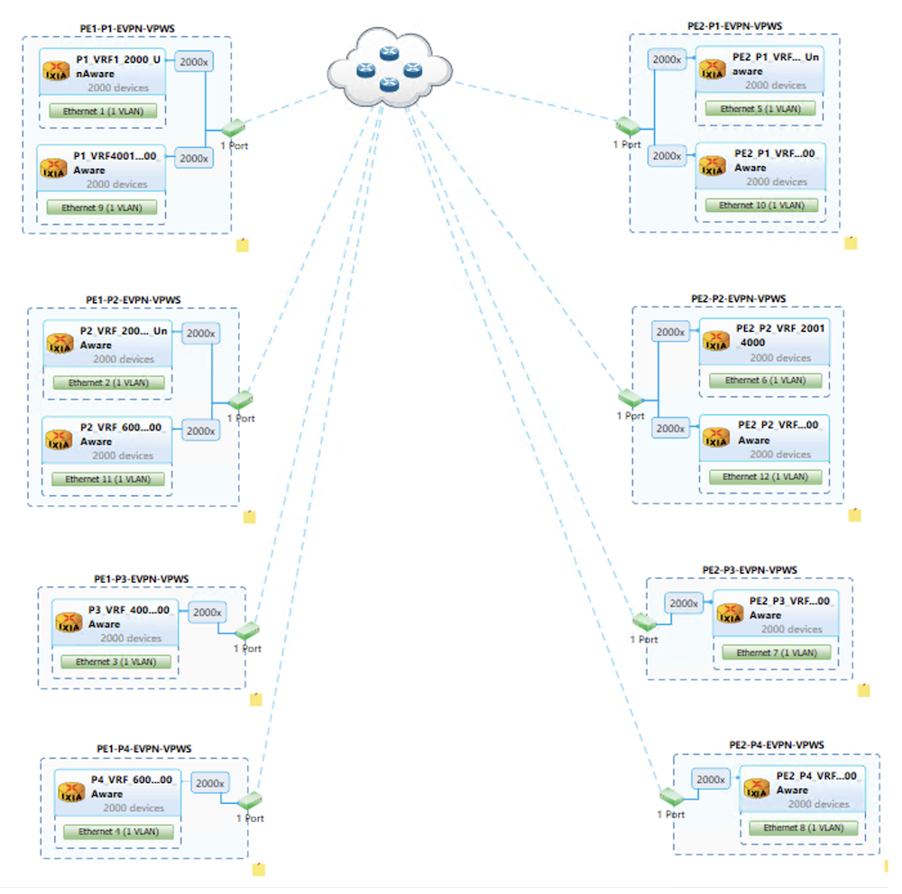
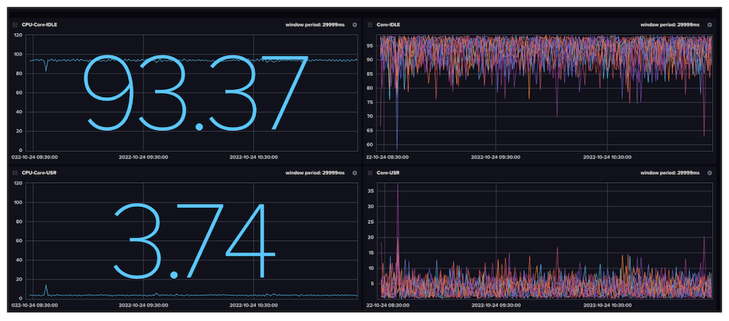
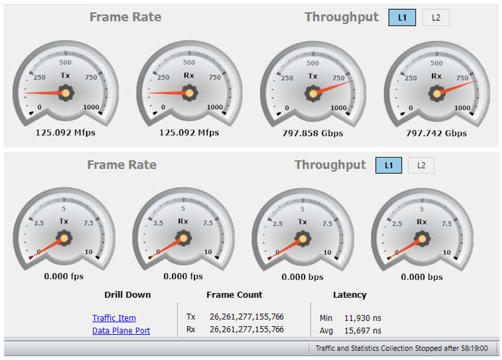

# EVPN VPWS Validation on ACX7000

**Suneesh Babu - 11/05/2022**

Junos EVPN-VPWS feature supports 8,000 instances with 4,000 VLAN-UnAware and 4,000 VLAN-Aware Service Types on ACX7000 Platforms.

## Introduction

This is the second article in the ACX7k Metro Validation Series.

In this article, we validate the [EVPN-VPWS](https://www.juniper.net/documentation/us/en/software/junos/evpn-vxlan/topics/concept/evpn-vpws-signaling-mechanisms-overview.html) feature and its scale on [ACX7100-32C](https://www.juniper.net/us/en/products/routers/acx-series/acx7000-family-cloud-metro-routers/acx7100-line/acx7100.html) with 22.2R1 Junos-EVO image.

[RFC-8214](https://www.rfc-editor.org/rfc/rfc8214.html) describes the VPWS support with [EVPN](https://www.juniper.net/documentation/us/en/software/junos/evpn-vxlan/topics/concept/evpns-overview.html). EVPN-VPWS is a point-to-point ethernet service based on BGP MPLS  connecting Customer Edge Devices (CEs) across a Provider Edge (PE) Network. The PEs of the network are connected over [MPLS](https://www.juniper.net/documentation/en_US/junos/topics/concept/mpls-security-overview.html) technology signalled via [LDP](https://www.juniper.net/documentation/us/en/software/junos/mpls/topics/topic-map/ldp-overview.html), [RSVP](https://www.juniper.net/documentation/us/en/software/junos/mpls/topics/topic-map/rsvp-overview.html) or[ SR-MPLS](https://blogs.juniper.net/en-us/industry-solutions-and-trends/segment-routing-sr-with-multiprotocol-label-switching-mpls).

JUNOS supports EVPN-VPWS functionality with the "evpn-vpws" Instance Type.

In this test, we create 8,000 EVPN VPWS Instances on ACX7100-32C:

- 4,000 VLAN-Unaware Service Types
- 4,000 VLAN-Aware Service Types.

The same scale is tested on [ACX7100-48L](https://www.juniper.net/documentation/us/en/hardware/acx7100-48L/topics/topic-map/acx7100-48L-system-overview.html) as well as on [ACX7509](https://www.juniper.net/us/en/products/routers/acx-series/acx7000-family-cloud-metro-routers/acx7500-line/acx7509.html).

But the [ACX7024](https://www.juniper.net/us/en/products/routers/acx-series/acx7000-family-cloud-metro-routers/acx7000-line/acx7024.html) Scale is not covered in this article (same features but different scale are expected on this platform).

**Please note** that despite sharing the same ACX moniker, the ACX7000 products are different products than ACX500/710/1000/1100/2100/2200/4000/5000/5400/6000. They are powered by different Packet Forwarding Engines (PFE), and support different feature sets and scales.

The Key Performance Indicators (KPI) tested are:

| EVPN VPWS KPI | Scale |
|:--|:--|
| Number of VPWS instances | 8,000 |
| Number of VLAN-Unaware Service Types | 4,000 |
| Number of VLAN-Aware Service Types | 4,000 |
| Number of VLANs | 12,000 |
| Number of Interfaces | 12,000 |

## Metro EVPN-VPWS Topology

Test topology consists of three routers:

- an ACX7100-32C is PE1
- an ACX7100-48L is the PE2
- a [PTX10008](https://www.juniper.net/documentation/us/en/hardware/ptx10008/topics/topic-map/ptx10008-line-card-components.html#line-Card-ptx10k-lc201) is P1

CEs are simulated using a traffic generator.  PEs are connected to CEs using 4x 100G links and to the core using 8x 100G links, which are bundled in 2x LAGs each having four links.

The ACX7100-32C is the Device Under Test (DUT). The underlay transport used for testing is [SR-MPLS](https://blogs.juniper.net/en-us/industry-solutions-and-trends/segment-routing-sr-with-multiprotocol-label-switching-mpls) with both [OSPF](https://www.juniper.net/documentation/us/en/software/junos/ospf/topics/topic-map/ospf-overview.html) and [ISIS](https://www.juniper.net/documentation/us/en/software/junos/is-is/topics/concept/is-is-routing-overview.html) protocols individually. In this validation, we also covered LDP as the underlay transport. The CE-bound interface configurations are of SP-Style (see glossary).



### Base Configuration

```
regress@PE1> show configuration protocols |display inheritance no-comments
bgp {
    group IBGP {
        type internal;
        local-address 12.1.1.1;
        family inet {
            unicast;
        }
        family evpn {
            signaling;
        }
        neighbor 12.1.1.3 {
            export nhself;
        }
    }
}
mpls {
    interface ae0.0;
    interface ae1.0;
}        
ospf {
    source-packet-routing {
        node-segment ipv4-index 101;
        srgb start-label 45000 index-range 2000;
    }
    area 0.0.0.0 {
        interface lo0.0 {
            passive;
        }
        interface ae0.0 {
            interface-type p2p;
        }
        interface ae1.0 {
            interface-type p2p;
        }
    }
}

regress@PE1>
```

### EVPN-VPWS Routing-Instance Configuration

VLAN-Unaware EVPN-VPWS routing-instance is configured as follows:

```
interfaces {
    et-0/0/0 {
        flexible-vlan-tagging;
        encapsulation flexible-ethernet-services;
        unit 1 {
            encapsulation vlan-ccc;
            vlan-id 1;
            family ccc;
        }
    }
}
routing-instances {
    METRO_EVPN_VPWS_1 {
        instance-type evpn-vpws;
        protocols {
            evpn {
                interface et-0/0/0.1 {
                    vpws-service-id {
                        local 1001;
                        remote 2001;
                    }
                }
                flexible-cross-connect-vlan-unaware;
                group G1 {
                    interface et-0/0/0.1;
                    service-id {
                        local 1001;
                        remote 2001;
                    }
                }
            }
        }
        interface et-0/0/0.1;
        route-distinguisher 12.1.1.1:1;
        vrf-target target:65000:1;
    }
}
```

VLAN-Aware EVPN-VPWS routing-instances with two VLANs are as follows:

```
interfaces {
    et-0/0/2 {
        flexible-vlan-tagging;
        encapsulation flexible-ethernet-services;
        unit 1 {
            encapsulation vlan-ccc;
            vlan-id 1;
        }
    }
    et-0/0/0 {
        flexible-vlan-tagging;
        encapsulation flexible-ethernet-services;
        unit 2001 {
            encapsulation vlan-ccc;
            vlan-id 2001;
            family ccc;
        }
    }
}
routing-instances {
    METRO_EVPN_VPWS_4001 {
        instance-type evpn-vpws;
        protocols {
            evpn {
                interface et-0/0/2.1 {
                    vpws-service-id {
                        local 1001;
                        remote 2001;
                    }
                }
                interface et-0/0/0.2001 {
                    vpws-service-id {
                        local 1002;
                        remote 2002;
                    }
                }
                flexible-cross-connect-vlan-aware;
            }
        }
        interface et-0/0/2.1;
        interface et-0/0/0.2001;
        route-distinguisher 12.1.1.1:4001;
        vrf-target target:65000:4001;
    }
}
```

### EVPN-VPWS CE Bound Interface Schema

The four CE-bound 100G interfaces are logically split across routing-instances as described in this chart:

| PE1 | PE2 | Port | Service Type | VRF | VLAN Association | Traffic Load |
|:--|:--|:--|:--|:--|:--|:--|
| et-0/0/0 | et-0/0/48:0 | P1 | VLAN-Unaware | 1-2000 | 1-2000 | 49.95% |
| et-0/0/1 | et-0/0/48:1 | P2 | VLAN-Unaware | 2001-4000 | 1-2000 | 49.95% |
| et-0/0/2 | et-0/0/48:2 | P3 | VLAN-Aware | 4001-6000 | 1-2000 | 99.9% |
| et-0/0/3 | et-0/0/48:3 | P4 | VLAN-Aware | 6001-8000 | 1-2000 | 99.9% |
| et-0/0/0 | et-0/0/48:0 | P1 | VLAN-Aware | 4001-6000 | 2001-4000 | 49.95% |
| et-0/0/1 | et-0/0/48:1 | P2 | VLAN-Aware | 6001-8000 | 2001-4000 | 49.95% |

## EVPN-VPWS Verification

The first step to verify the EVPN-VPWS service is to make sure that the PE devices are having BGP established with evpn-signalling. As shown below from PE1, BGP is in "established" state for the Peer PE2 (12.1.1.3) and bgp.evpn.0 table got populated with Type-1 Infra routes.

```
regress@PE1> show bgp summary
Threading mode: BGP I/O
Default eBGP mode: advertise - accept, receive - accept
Groups: 1 Peers: 1 Down peers: 0
Table          Tot Paths  Act Paths Suppressed    History Damp State    Pending
inet.0               
                      35          1          0          0          0          0
inet6.0
                       0          0          0          0          0          0
bgp.evpn.0           
                   12000      12000          0          0          0          0
inet6.3              
                       0          0          0          0          0          0
Peer                     AS      InPkt     OutPkt    OutQ   Flaps Last Up/Dwn State|#Active/Received/Accepted/Damped...
12.1.1.3              65000       8011       8008       0       0          35 Establ
  inet.0: 1/35/35/0
  bgp.evpn.0: 12000/12000/12000/0
  METRO_EVPN_VPWS_1.evpn.0: 1/1/1/0
  METRO_EVPN_VPWS_2.evpn.0: 1/1/1/0
  METRO_EVPN_VPWS_3.evpn.0: 1/1/1/0
  ...
  METRO_EVPN_VPWS_3998.evpn.0: 1/1/1/0
  METRO_EVPN_VPWS_3999.evpn.0: 1/1/1/0
  METRO_EVPN_VPWS_4000.evpn.0: 1/1/1/0
  METRO_EVPN_VPWS_4001.evpn.0: 2/2/2/0
  METRO_EVPN_VPWS_4002.evpn.0: 2/2/2/0
  METRO_EVPN_VPWS_4003.evpn.0: 2/2/2/0
  ...
  METRO_EVPN_VPWS_7998.evpn.0: 2/2/2/0
  METRO_EVPN_VPWS_7999.evpn.0: 2/2/2/0
  METRO_EVPN_VPWS_8000.evpn.0: 2/2/2/0
  __default_evpn__.evpn.0: 0/0/0/0

regress@PE1>
```

### VLAN Unaware EVPN-VPWS Verification

As shown below, the interface et-0/0/0.1 is bound to EVPN-VPWS instance METRO_EVPN_VPWS_1 with a single VLAN with vlan-id 1.

```
regress@PE1> show evpn vpws-instance METRO_EVPN_VPWS_1
Instance: METRO_EVPN_VPWS_1, Instance type: EVPN VPWS FXC
  Route Distinguisher: 12.1.1.1:1
  Number of local interfaces: 1 (1 up)

    Interface name  ESI                            Mode          Role       Status     Control-Word    Flow-Label-Tx    Flow-Label-Rx
    et-0/0/0.1      00:00:00:00:00:00:00:00:00:00single-homed    Primary    Up         No              No               No
        Local SID: 1001 Advertised Label: 16
        Remote SID: 2001
            PE addr         ESI                           Label  Mode           Role     TS                      Status
            12.1.1.3        00:00:00:00:00:00:00:00:00:00 16     single-homed   Primary  2022-10-21 02:40:19.916 Resolved
  Number of protect interfaces: 0

regress@PE1>
```

The routes of METRO_MAC_VRF_1 instance are shown below.

```
regress@PE1> show route table METRO_EVPN_VPWS_1.evpn.0

METRO_EVPN_VPWS_1.evpn.0: 2 destinations, 2 routes (2 active, 0 holddown, 0 hidden)
+ = Active Route, - = Last Active, * = Both

1:12.1.1.1:1::0::1001/192 AD/EVI
                   *[EVPN/170] 2d 16:59:40
                       Indirect
1:12.1.1.3:1::0::2001/192 AD/EVI
                   *[BGP/170] 2d 16:55:47, localpref 100, from 12.1.1.3
                      AS path: I, validation-state: unverified
                    >  to 15.1.1.2 via ae0.0, Push 45103
                       to 15.1.2.2 via ae1.0, Push 45103

regress@PE1>
```

### VLAN-Aware EVPN-VPWS Verification

In VLAN-Aware EVPN-VPWS case, the entire VLAN information is bound to that instance.

```
regress@PE1> show evpn vpws-instance METRO_EVPN_VPWS_4001
Instance: METRO_EVPN_VPWS_4001, Instance type: EVPN VPWS FXC VLAN AWARE
  Route Distinguisher: 12.1.1.1:4001
  Number of local interfaces: 2 (2 up)

    Interface name  ESI                            Mode          Role       Status     Control-Word    Flow-Label-Tx    Flow-Label-Rx
    et-0/0/0.2001   00:00:00:00:00:00:00:00:00:00single-homed    Primary    Up         No              No               No
        Local SID: 1002 Advertised Label: 4016
        Remote SID: 2002
            PE addr         ESI                           Label  Mode           Role     TS                      Status
            12.1.1.3        00:00:00:00:00:00:00:00:00:00 4016   single-homed   Primary  2022-10-21 02:40:23.424 Resolved

    Interface name  ESI                            Mode          Role       Status     Control-Word    Flow-Label-Tx    Flow-Label-Rx
    et-0/0/2.1      00:00:00:00:00:00:00:00:00:00single-homed    Primary    Up         No              No               No
        Local SID: 1001 Advertised Label: 4016
        Remote SID: 2001
            PE addr         ESI                           Label  Mode           Role     TS                      Status
            12.1.1.3        00:00:00:00:00:00:00:00:00:00 4016   single-homed   Primary  2022-10-21 02:40:23.424 Resolved
  Number of protect interfaces: 0

regress@PE1>
```

The BGP route table of the instance includes routes belonging to VLANs of the aware instance.

```
regress@PE1> show route table METRO_EVPN_VPWS_4001.evpn.0

METRO_EVPN_VPWS_4001.evpn.0: 4 destinations, 4 routes (4 active, 0 holddown, 0 hidden)
+ = Active Route, - = Last Active, * = Both

1:12.1.1.1:4001::0::1001/192 AD/EVI
                   *[EVPN/170] 2d 17:01:18
                       Indirect
1:12.1.1.1:4001::0::1002/192 AD/EVI
                   *[EVPN/170] 2d 17:01:25
                       Indirect
1:12.1.1.3:4001::0::2001/192 AD/EVI
                   *[BGP/170] 2d 16:57:30, localpref 100, from 12.1.1.3
                      AS path: I, validation-state: unverified
                       to 15.1.1.2 via ae0.0, Push 45103
                    >  to 15.1.2.2 via ae1.0, Push 45103
1:12.1.1.3:4001::0::2002/192 AD/EVI      
                   *[BGP/170] 2d 16:57:30, localpref 100, from 12.1.1.3
                      AS path: I, validation-state: unverified
                       to 15.1.1.2 via ae0.0, Push 45103
                    >  to 15.1.2.2 via ae1.0, Push 45103

regress@PE1>
```

The following output captures the number of instances, vlan-unaware and vlan-aware in the DUT.

```
regress@PE1> show evpn vpws-instance |match "(1 up)" | count
Count: 4000 lines

regress@PE1> show evpn vpws-instance |match "(2 up)" | count
Count: 4000 lines

regress@PE1> show bgp summary |match "evpn.0" | count 
Count: 8003 lines

regress@PE1>
```

Traffic flows are load-balanced across the LAG bundles and the LAG member interfaces as shown below

```
PE1                               Seconds: 30                  Time: 19:46:21

Interface    Link  Input packets        (pps)     Output packets        (pps)

 ae0           Up  6672538985109   (31797317)    6562622375572   (31273400)
 ae1           Up  6452705368593   (30750384)    6562622460395   (31274253)
 esi           Up              0          (0)                0          (0)
 et-0/0/0      Up  3281521334639   (15638860)    3281521039897   (15638591)
 et-0/0/1      Up  3281521210490   (15638642)    3281521065394   (15638962)
 et-0/0/2      Up  3281099910919   (15633867)    3281099930514   (15633920)
 et-0/0/3      Up  3281099946314   (15633783)    3281099945857   (15633649)
 et-0/0/4      Up              0          (0)             8460          (0)
 et-0/0/5    Down              0          (0)                0          (0)
 et-0/0/6      Up  1740727408250    (8295101)    1647217803561    (7849444)
 et-0/0/7      Up  1659520685579    (7908298)    1634093396240    (7787043)
 et-0/0/8      Up  1690694107451    (8056796)    1647217784947    (7849711)
 et-0/0/9      Up  1581596783829    (7537122)    1634093390824    (7787202)
 et-0/0/10     Up  1696433009095    (8084274)    1647217832273    (7849813)
 et-0/0/11     Up  1617688474851    (7709175)    1634093403093    (7787259)
 et-0/0/12     Up  1624252786691    (7740317)    1647217809682    (7849859)
 et-0/0/13     Up  1514331097956    (7216618)    1634093415347    (7787322)
```

## Generating Scale Configuration

The Python Script is having three components:

- a Jinja File capturing the various configuration templates,
- a Params File capturing the various user variables
- a script using the two input files above and generating the required configurations and committing them in the router.

> Note: The configs are generated as per the CE-bound interface schema.

### Configuration Template

The template contains configurations for both interfaces which are part of the routing instances and routing instance configurations.

```
# Routing Instance Configuration
# File Name: evpn_vpws_jinja.j2
# Version: 1.0
groups {{group_name}} {
    interfaces {
        {{ifd_name}} {
            flexible-vlan-tagging;
            encapsulation flexible-ethernet-services;
            
            unit {{unit_id}} {
                
                vlan-id {{vlan_id}};
                encapsulation vlan-ccc;
                family ccc;
                
                
                encapsulation vlan-ccc;
                vlan-id {{vlan_id}};
                
            }
            
        }
    }
    routing-instances {
        
        METRO_EVPN_VPWS_{{vrf_id}} {
            instance-type evpn-vpws;
            interface {{ifl_name}};
            route-distinguisher {{router_id}}:{{vrf_id}};
            vrf-target target:{{local_as_no}}:{{vrf_id}};
            protocols {
                evpn {
                    interface {{ifl_name}} {
                        vpws-service-id {
                            local {{vpws_local_service_id}};
                            remote {{vpws_remote_service_id}};
                        }
                    }
                    
                    
                    group G1 {
                        interface {{ifl_name}};
                        service-id {
                            local {{vpws_local_service_id}};
                            remote {{vpws_remote_service_id}};
                        }
                    }
                    flexible-cross-connect-vlan-unaware;
                    
                    
                    
                    
                    flexible-cross-connect-vlan-aware;
                    
                    
                }
            }
        }
        
    }
}
```

### Configuration Parameters

```
---
# This file contains the parameters for evpn vpws configuration building
# File Name: evpn_params.yaml
# Version: 1.0

#Host Name
host: 'PE1.englab.juniper.net'

#UserName and Password
username: 'regress'
password: 'xxxxx'

#Config Group Name
group_name: 'METRO_EVPN_VPWS'

#vrfname creation
vrf_id: 1

#maximum evpn instances
vrf_max: 10

#interface name
ifd_name: 'et-0/0/0'

#ifl_start unit
ifl_start_unit: 1

#vlan_id start
vlan_id_start: 1

#My AS no
local_as_no: 65000

#My Router ID
router_id: '12.1.1.1'

#EVPN Service Type:
enable_fxc: True 
vlan_unaware_service: False
vlan_aware_service: True

#VPWS Service ID
vpws_local_service_id: 1001  # At PE1
vpws_remote_service_id: 2001 # At PE1
# vpws_local_service_id: 2001  # At PE2
# vpws_remote_service_id: 1001 # At PE2

# vpws_local_service_id: 1002  # At PE1 for vlanaware ifl-2
# vpws_remote_service_id: 2002 # At PE1 for vlanaware ifl-2
# vpws_local_service_id: 2002  # At PE2 for vlanaware ifl-2
# vpws_remote_service_id: 1002 # At PE2 for vlanaware ifl-2
```

### Configuration Script

```
#! /usr/bin/python
"""
    FileName: create_evpn_vpws_vrf.py
    Version: 1.0
    Description: This script will create evpn vpws vrf instances and configure it on the router
    Author: Suneesh Babu
"""
import yaml
from glob import glob
from jinja2 import Template
import ipaddress
from jnpr.junos.utils.config import Config
from jnpr.junos import Device
from jnpr.junos.factory import loadyaml
from jnpr.junos.op import *

def iflrange(ifd_name, start_unit, max):
    """
    This subroutine yields the specified number of l3 ifls for the ifd
    """
    while(max):
        iflname = ifd_name + '.' + str(start_unit)
        yield iflname
        start_unit += 1
        max -= 1

def router_operation(config_filename, data, mode):
    """
        This sub-routine connectes to the router and do the necessary commit operations
    """
    router = Device(host=data['host'], user=data['username'], password=data['password'], port=22)
    router.open()

    cfg = Config(router)
    if mode == 'jinja':
        cfg.load(template_path=config_filename, template_vars=data, format='text', merge=True)
    elif mode == 'setfile':
        cfg.load(path=config_filename, format='set')
    cfg.pdiff()
    cfg.commit()
    router.close()

def jinja_template_input(data):
    """
        This sub-routine yields the variables required for the jinja template
    """
    ifl_unit_list = range(int(data['ifl_start_unit']), int(data['ifl_start_unit']) + int(data['vrf_max']))
    vlan_list = range(int(data['vlan_id_start']), int(data['vlan_id_start']) + int(data['vrf_max']))

    vrf_id_list = range(int(data['vrf_id']), int(data['vrf_id']) + int(data['vrf_max']))
    ifl_name_list = iflrange(data['ifd_name'], data['ifl_start_unit'], int(data['vrf_max']))

    return zip(ifl_unit_list, vlan_list), zip(vrf_id_list, list(ifl_name_list), vlan_list)

def main():
    """
       To Build the desired number of evpn-vpws instances
    """
    print("Step-1: Read the Variables from the Params File")
    with open(glob('evpn_vpws_params.yaml')[0]) as fh:
        data = yaml.safe_load(fh.read())

    print("Step-2: Build the Data Feed for the Jinja Template Input")
    ifl_attributes, evpn_vpws_attributes = jinja_template_input(data)
    data['ifl_variables'] = ifl_attributes
    data['evpn_vpws_variables'] = evpn_vpws_attributes

    print("Step-3: Build the configuration file from Jinja Template")
    with open(glob('evpn_vpws_jinja.j2')[0]) as t_fh:
        t_format = t_fh.read()
    evpn_snippet = Template(t_format)
    # print (evpn_snippet.render(data))

    print("Step-4: Load the config into router and commit it")
    router_operation('evpn_vpws_jinja.j2', data, 'jinja')

if __name__ == '__main__':
    main()
```

### Traffic Generator Configuration

Hosts are simulated as follows:



## CPU Usage during Traffic Flow

The 12 Core ACX7100-32C remains idle at 93% during the traffic flow



## Data Plane Traffic Verification

As shown below traffic flows at 99.9% of 100G links over 4 CE bound interfaces and no packet drops are seen for a duration of 58 hours.



## Conclusion

In this article, we demonstrate the ACX7k (ACX7100-32C, ACX7100-48L, ACX7509) platforms scale for EVPN VPWS use-cases, proving these routers are ready for the Metro deployments and capable of delivering various ethernet business services of Metro. Next TechPost article will be dedicated to L3VPN scale validation.

## References

- RFC-8214 - [https://www.rfc-editor.org/rfc/rfc8214.html](https://www.rfc-editor.org/rfc/rfc8214.html)
- FXC - [https://www.juniper.net/documentation/us/en/software/junos/evpn-vxlan/topics/concept/evpn-vpws-flexible-cross-connect-support-overview-mx-series.html](https://www.juniper.net/documentation/us/en/software/junos/evpn-vxlan/topics/concept/evpn-vpws-flexible-cross-connect-support-overview-mx-series.html)

## Glossary

- BGP -- Border Gateway Protocol
- CE -- Customer Edge Node
- DUT -- Device Under Test
- EVPN -- Ethernet Virtual Private Network
- FXC -- Flexible Cross Connect
- KPI -- Key Performance Indicators
- LAN -- Local Area Network
- MPLS -- Multi Protocol Label Switching
- OSPF -- Open Shortest Path First
- P/PE -- Provider/Provider Edge Node
- SP Style -- Service Provider Style
- SR-MPLS -- Segment Routing - MPLS
- VLAN -- Virtual LAN
- VPWS -- Virtual Private Wired Service
- VRF -- Virtual Routing and Forwarding

## Acknowledgement

Many thanks to Ramdas Machat, Deepak Kumar Tripathi, Vasily Mukhin and Nicolas Fevrier for reviewing the article and providing the feedback.
