# EVPN-VXLAN OISM on PTX Routers

**Ramdas Machat - 09/04/2023**

Guide to the EVPN VXLAN based Optimised Inter-subnet Multicast (OISM) on Express4 based PTX10k platforms.

This document is co-written by Ramdas Machat and Abdul Nasir M.

## Introduction

Handling unicast traffic is easy within the EVPN-VXLAN Data Centre Fabric (DCF) with no worries of handling the BUM, Inter-subnet routing and duplicate traffic. For multicast, that is not always the case. There are challenges in handling multicast in the Centrally Routed Bridge model with a single home or multi-homed environment. Over the time, multiple technologies emerged to overcome these challenges and provide the most efficient way to deliver multicast traffic within and outside of the DCF. This document touches upon the Optimized Inter-Subnet Multicast (OISM) and details the configurations and operational procedures to deploy Express4 based PTX10k in the DCF.

## Document Scope

This document assumes that the reader understands EVPN-based Selective Multicast Ethernet Tag (SMET) and Inclusive Multicast Ethernet Tag (IMET) traffic forwarding in a data centre (DC) without optimization. We will test EVPN OISM on Express4 based PTX platforms covering "BD everywhere" model with configuration and operational aspects. "OISM with BD not everywhere" is not covered in this document.

### Multicast in EVPN and the problem with the CRB Model

EVPN-VXLAN helps stretching L2 networks across sites at scale and is widely deployed in enterprise data centre networks. Optimized multicast traffic delivery has been supported and deployed in a Centrally Routed Bridge (CRB) Model for a while now.

SMET and Assisted Replication (AR) optimizes multicast traffic within a subnet (VLAN) in the CRB model, inter-subnet multicast traffic forwarding still could be handled better in terms of avoiding traffic hair-pinning and reducing core-bandwidth utilization. This is particularly required when there are many subnets with listeners for a multicast flow.

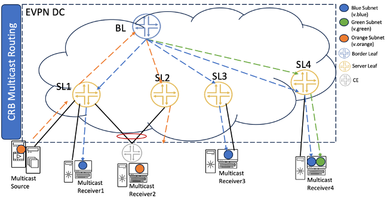

In Figure 1, the traffic from Server Leaf 1 (SL-1) to "Multicast receiver1" goes through the Border Leaf (BL) instead of routing it locally, which consumes the core bandwidth based on the number of flows. This poses a replication load on BL and increases the number of copies of the packet being sent on the core. This is called traffic hair-pinning and it is inefficient: it increases replication on BL and adds latency. If SL1 could route the traffic locally, it would reduce end-to-end latency

For details on the inter-subnet routing forwarding rules refer to the [DayOne OISM EVPN book](https://www.juniper.net/documentation/en_US/day-one-books/DO_Optimized_Multicast_EVPN.pdf#%5B%7B%22num%22%3A253%2C%22gen%22%3A0%7D%2C%7B%22name%22%3A%22XYZ%22%7D%2C-194%2C666%2C0.726288%5D).

### Optimized Inter-Subnet Multicast (OISM)

Optimized Inter-Subnet Multicast function introduces the following traffic forwarding benefits:

- In OISM model the traffic is always switched to the remote receivers using the source VLAN and the downstream multicast receiver gets routed traffic. For example, if multicast traffic is sourced at SL1 (v.orange) and the receiver is on SL3 (v.blue), then the traffic will be EVPN-switched towards SL3 using v.orange only and then routed from v.orange to v.blue locally at SL3.
- It reduces latency.
- OISM makes the network more reliable as it creates a backup path for traffic in case one Border Leaf fails.
- Multicast traffic received from outside fabric is delivered within fabric on Supplementary Bridge Domain (SBD) to receiver's leaves which further route multicast traffic to directly connected receivers.

Table 1 contains the list of supported features for the PTX platforms in 22.3R1 EVO. Please refer to OISM Documentation for the latest and more details updates.OISM Feature Support: 

| Features | Supported on PTX10000 Chassisand PTX10001-36MR |
|:--|:--|
| Intra-VLAN Multicast traffic with IGMP Snooping with Multi-homing consideration for EVPN over VXLAN | YES |
| Inter-VLAN Multicast traffic and IRB for EVPN over VXLAN | YES |
| OISM support for EVPN over VXLAN with BDs everywhere for IGMP v2/v3 | YES |
| Role of Server Leaf | YES |
| Role of Border Leaf with PIM-GW over EVPN-VXLAN IRB/L3 interface/non-EVPN IRB | YES |
| AE/non-AE/ECMP interface will be supported as underlay/OIF in the multicast route | YES |
| EVPN Type6 SMET Route to selectively send or receive traffic based on the presence of active receivers | YES |
| EVPN A/A Multi-homing by using BGP EVPN Type 7/8 NLRIs to sync IGMP joins/leaves received on multi-homed interfaces between multi-homing peer PEs | YES |
| Distributed DR for EVPN over VXLAN Multicast traffic with OISM | YES |
| SP and EP style configurations | YES |
| EVPNoMPLS Snooping | NO |
| Assisted Replication for both Leaf and Replicator role | NO |
| EVPNoVXLAN with ERB Multicast | NO |
| OISM with BDs not everywhere | NO |
| MLD Snooping v1/v2 | NO |
| IGMPv2 and IGMPv3 co-existence | NO |
| IGMPv2 and IGMPv3 Revenue BDs in same tenant VRF | NO |

### Optimized Inter-subnet Multicast within Fabric

In Figure 2 below, "Multicast Source" is behind SL1 on v.orange and the multicast traffic is originated from there. The dotted arrow lines in the figure indicate the multicast traffic flow. The receivers for this multicast traffic are:

- 1. Single-homed SL1 on v.blue VLAN [*Multicast receiver 1*]
- 2. Multi-homed  SL1/SL2 on v.blue VLAN [*Multicast receiver 2*]
- 3. Single-homed SL3 on v.blue VLAN [*Multicast receiver 3*]

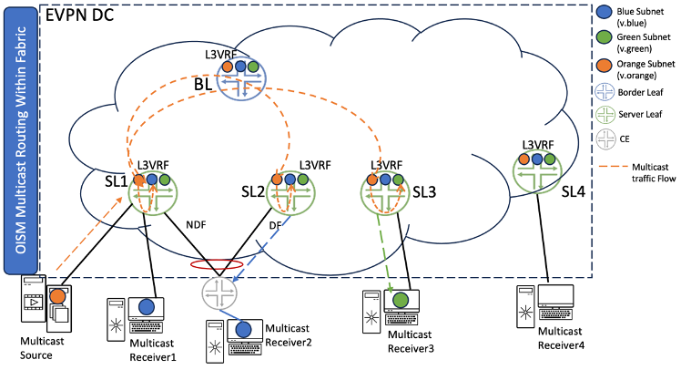

- First SL1 will route the traffic locally from IRB of v.orange VLAN to IRB of v.blue VLAN and send it towards "*Multi-homed Receiver 1*"
- One copy of multicast traffic will be EVPN switched towards SL2 on source VLAN [v.orange] and SL2 will send traffic towards "*Multi-homed Receiver 2*" as SL2 is the EVPN DF.
- One copy of traffic will be EVPN switched towards SL3 on source VLAN [v.orange] and SL3 would route it to IRB of v.green VLAN locally and sent towards "*Multicast Receiver 3*"

> *Please note*: SL2 and SL3 will not send traffic back to the core post routing traffic from source VLAN to receiver VLAN.

### OISM -- Inter-Subnet Multicast from outside fabric (Classic L3)

In the scenario of Figure 3 Border Leaf node is acting as PIM External Gateway (PEG).  The dotted arrow lines in the figure represent the multicast traffic flow. Here the multicast source is external to DC fabric and the receivers are:

1. Single-homed SL1 on v.orange VLAN [*Multicast receiver 1*]
2. Multi-homed  SL1/SL2 on v.blue VLAN [*Multicast receiver 2]*
3. Single-homed SL3 on v.orange VLAN [*Multicast receiver 3*]
4. Single-homed BL on v.orange VLAN [*Multicast receiver 4*]

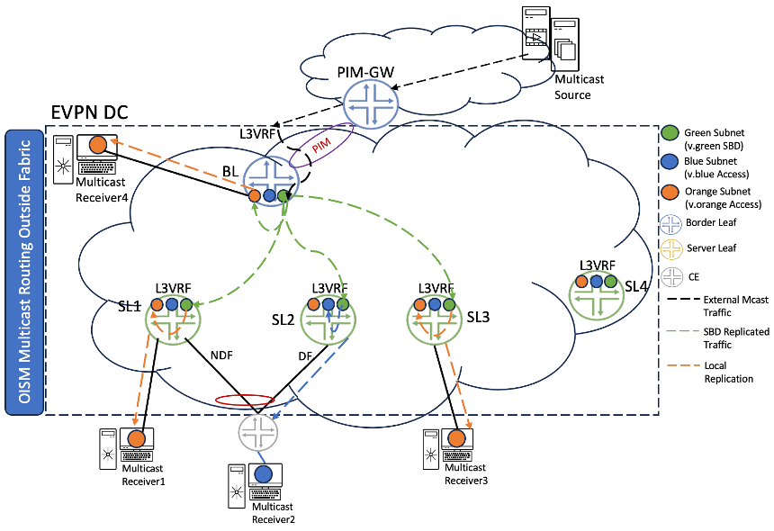

Traffic flow from the External world to the EVPN DC is described below.

- Multicast Traffic pulled from an external source will land on BL (by virtue of pim join sent towards the external source from BL)
- Since there is a local receiver "*Multicast receiver 4*" on BL, it will locally route the traffic to IRB of v.orange VLAN and send it towards "*Multicast receiver 4*".
- BL will also route the traffic to IRB of Supplementary Bridge Domain (SBD) v.green VLAN, since it has received Type6 SMET signalling on SBD VLAN.
- Post routing to IRB of SBD VLAN, one copy of multicast traffic will be EVPN switched towards SL1, SL2, and SL3 on v.green VLAN.
- On SL1, traffic will be locally routed from IRB of SBD v.green VLAN to IRB of orange VLAN and sent towards "*Multicast Receiver 1*".
- Both SL1 and SL2 will route the traffic from  IRB of v.green VLAN to IRB of v.orange VLAN, but only EVPN DF among SL1 or SL2 will send traffic towards "*Multicast Receiver 2*". In this case, SL2 is the EVPN DF.
- On SL3, traffic will be locally routed from IRB of SBD v.green VLAN to IRB of v.orange VLAN and sent towards "*Multicast receiver 3*".

> *Please note*: SL1, SL2, SL3, and BL will not send traffic back to the core post routing traffic from source VLAN to receiver VLAN. It is not recommended to host any server (unicast/multicast) on SBD to avoid any anomalies like traffic duplication.

## Topology and Testing

We have validated EVPN OISM service on PTX10K platforms powered by Express 4 ASIC and Junos EVO on 400GE interfaces.

Figure 4 illustrates the reference topology below, used to test OISM with multicast sources and receivers within the data center and outside of the data center domain with PIM-GW as Classic L3 or MVLAN.

PTX platform has been validated in three different roles (see Table 2).

OISM Nodes and Roles: 

| Node | Details |
|:--|:--|
| Border Leaf | PTX10K can be placed as Border Leaf to receive multicast traffic from outside world or to send multicast traffic to outside world from the source within fabric |
| Leaf Spine | Spine devices are underlay of EVPN Fabric as IP transit devices. The leaf spines might also act as Route Reflectors (RR) in the fabric. PTX10k is capable of playing this role |
| Server Leaf | PTX10K can be placed as Server Leaf to perform local multicast routing. In this role, the multicast traffic from other SL devices received on source VLAN is routed to receiver VLAN. The multicast traffic from external world (through BL devices) is received on SBD VLAN and is routed to receiver VLAN on the SLs. |

For external Multicast we have validated three scenarios (see Table 3).

| Mode | Details |
|:--|:--|
| External IRB -- MVLAN | The PIM-GW node will be multihomed to the BL nodes with EVPN-VXLAN. So, the PIM-GW will having BGP peering with the BL nodes. |
| Internal Classic L3 Interface | On the PIM-GW the Multicast source/receivers are connected using a regular L3 interface. The connectivity between PIM-GW and BL is a regular L3 Interface with PIM running. |
| L3 Over IRB | On the PIM-GW the Multicast source/receivers are connected using L2, terminated on the IRB which is running PIM protocols. |

For delivering multicast within the fabric, we have tested scenarios outlined in Table 4. 

OISM Terminology:

| Bridge Domain / VLAN | Description | Configured on |
|:--|:--|:--|
| Multicast VLAN(M-VLAN) | A VLAN in the EVPN fabric with associated IRB interfaces that connect the fabric to an external multicast router. This VLAN and IRB interface enable traffic flow between devices inside and outside the fabric. | Border leaf devices |
| Extra non-EVPN VLAN | (Non-EVPN IRB method for external multicast). An extra VLAN that isn't in the EVPN instances in the fabric. You configure associated IRB interfaces in the tenant L3 VRF instances. This VLAN and IRB interface enable multicast traffic flow between devices inside the fabric and devices outside the fabric. | Border leaf devices |
| Revenue Bridge Domains(VLANs) | Bridge domains for subscribers to the services that the fabric provides. You configure the revenue bridge domains as VLANs in the fabric. | All OISM devices |
| Supplemental Bridge Domain(SBD) | Bridge domain that enables support for external multicast traffic and implements SMET optimization in the EVPN core. | All OISM devices |

Table 5 summarises information about router models, roles and Junos releases, helper MX platforms and traffic generators used in the test bed.

Topology devices details: 

| Device Name | Device Model | Software Release |
|:--|:--|:--|
| R0-Server Leaf1 | PTX10001-36MR | 23.1R1.8-EVO |
| R1-Server Leaf2 | PTX10001-36MR | 23.1R1.8-EVO |
| R2-Spine Leaf1 | PTX10001-36MR | 23.1R1.8-EVO |
| R3-Spine Leaf2 | PTX10001-36MR | 23.1R1.8-EVO |
| R4-Border Leaf1 | PTX10001-36MR | 23.1R1.8-EVO |
| R5-Border Leaf1 | PTX10001-36MR | 23.1R1.8-EVO |
| R6-External | MX480 | 22.4R1.9 |
| R7-CE1 | MX480 | 22.4R1.9 |
| R8, R9, R10, R11 -- Multicast  Source/Receivers | Ixia | 8.20 |

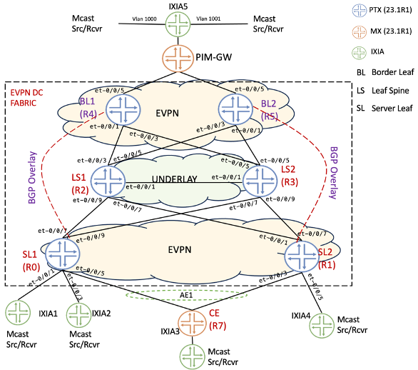

### Underlay, Overlay and Customer Equipment (CE) Configuration

All the devices including SL, BL, LS and PIM-GW are configured with OSPF as an IGP for underlay layer. For EVPN-VXLAN overlay and exchanging EVPN routes SL are BL nodes are establishing full meshed MS-iBGP sessions for evpn signalling. The Sample configuration of the underlay protocols on PTX and CE configuration of MX router (including SP/EP style configuration) is covered as part of Access/Underlay Configuration &  CE configuration - SP/EP Style (check the config snippets at the end of this article).

## OISM Specific and Global Configuration

### Originate SMET-Route-on-RevBD Configuration

On BL and SL devices, configure the following knob to originate Type-6 on RevBD where the local IGMP report is received. Without this knob, Type-6 is originated only on SBD alone, as per [draft-ietf-bess-evpn-irb-mcast](https://datatracker.ietf.org/doc/html/draft-ietf-bess-evpn-irb-mcast). This knob is provided to enable interop with other vendor devices.

`"set routing EVPN_OISM protocols evpn oism originate-smet-on-revenue-vlan-too"`

Without this knob, Type-6 is originated on SBD only. This knob enables interoperability with other vendor devices that do not support OISM.

### Multicast snooping to install L2 (*,G) forwarding routes in PFE

By default for OISM, the L2(*,G) forwarding routes will not be installed in the PFE. To override the default behaviour, use the following knob. This is for scaling considerations for OISM. Hence, use this knob to install L2(*,G) routes to PFE

`set routing-instance <instance-name> multicast-snooping-options oism install-star-g-routes"`

This improves the scaling in OISM deployments.

### OISM Global Configuration

Tunnel-termination is not enabled by default on PTX platforms. User has the option to enable tunnel-termination either globally or at the underlay interface level for VXLAN tunnel termination to work. Use the below command:

`"set forwarding-options tunnel-termination"`

Enable OISM "BD everywhere" mode on PTX SL and BL nodes by issuing the following knob:

`"set forwarding-options multicast-replication evpn irb oism"`

### OISM -- PIM-GW as Classic L3 Interface

Server Leaves (R0, R1) in Figure 4 have directly connected multicast sources and receivers. CE (R7) is multihomed to SL1 (R0) and SL2 (R1) as active/active ESI LAG with directly connected multicast source/receivers. Border Leaf's (R4, R5) are connected to the PIM-GW (R6) with multicast sources, receivers attached.

**Configuration Overview**

Each node configuration is detailed towards the end of this document in the Configuration Snippet section with name configured outlined as Access/Underlay, Overlay. Follow below steps to bring up the setup for OISM testing:

1. Bring up the underlay on the respective SL, BL, PIM-GW using the Access/Underlay section that includes the provisioning of Interfaces (Physical & Loopback), Bundles & IGP. Make sure everything works end-to-end
2. Once the underlay is all up and reachability is established. Make the overlay configurations
3. Use the section below to bring up the OISM related configuration on SLs, BLs. Use the given configuration under each sections "SL Configuration" and "PEG Configuration" respectively.
4. Once we have all the configurations done, simulate the IGMP hosts from IXIA for multicast joins and to send multicast traffic.
5. There are multicast sources and receivers connected to PIM-GW, SL1, SL2 and multihomed CE. There are two service VLANs in the DC VLAN100, VLAN101 and one SBD VLAN900 in the topology. There are two multicast group 225.1.1.10, 225.1.1.20 and receivers are associated in VLAN100, VLAN101, VLAN1000, VLAN10001. Below Table 5 lists down the various flows generated for this test.

Table: Multicast Flow details

| Multicast Flow | Source | Multicast Group | Receivers (VLAN & Node) | Traffic Rate |
|:--|:--|:--|:--|:--|
| SL1-VLAN-101 | VLAN101 (101.1.1.3) | 225.1.1.10 | SL1(100),SL2(100),PIM-GW(1000),MHCE(100) | 1000pps |
| PIM-GW-VLAN-1000 | VLAN1000 (25.1.1.2) | 225.1.1.10 | SL1(100),SL2(100),PIM-GW(1000),MHCE(100) | 1000pps |
| PIM-GW-VLAN-1001 | VLAN1001 (25.1.2.2) | 225.1.1.10 | SL1(100),SL2(100),PIM-GW(1000),MHCE(100) | 1000pps |
| SL1-VLAN-100 | VLAN100 (100.1.1.3) | 225.1.1.20 | SL1(100,101),SL2(100),PIM-GW(1000),MHCE(100,101) | 1000pps |

**SL Configuration**

Below configuration is focused on the OISM specific configuration on the SLs and the common configurations including underlay/overlay are in the configuration snippets.

Table: Multicast Flow details

SL1 (R0)

```
R0-SL1# show routing-instances 
EVPN_OISM {
    instance-type mac-vrf;
    protocols {
        igmp-snooping {
            vlan v100 {
                proxy;
            }
            vlan v101 {
                proxy;
            }
            vlan v900 {
                proxy;
            }
        }
        evpn {
            encapsulation vxlan;
        }
    }
    vtep-source-interface lo0.0;
    service-type vlan-aware;
    route-distinguisher 1.1.1.1:1;
    vrf-target target:1:1;
    multicast-snooping-options {
        oism {
            install-star-g-routes;
        }
    }
    vlans {
        v100 {
            vlan-id 100;
            interface ae1.100;
            interface et-0/0/1.100;
            interface et-0/0/3.100;
            l3-interface irb.100;
            vxlan {
                vni 100;
            }
        }
        v101 {
            vlan-id 101;
            interface et-0/0/1.101;
            interface ae1.101;
            interface et-0/0/3.101;
            l3-interface irb.101;
            vxlan {
                vni 101;
            }
        }
        v900 {
            vlan-id 900;
            l3-interface irb.900;
            vxlan {
                vni 900;
            }
        }
    }
}
OISM_VRF {
    instance-type vrf;                  
    protocols {
        evpn {
            oism {
                supplemental-bridge-domain-irb irb.900;
            }
        }
        pim {
            passive;
            interface all;
            interface irb.900 {
                accept-remote-source;
            }
        }
    }
    interface irb.100;
    interface irb.101;
    interface irb.900;
    interface lo0.1;
    route-distinguisher 1.1.1.1:2;
    vrf-target target:1:2;
}

R0-SL1# show forwarding-options 
tunnel-termination;
multicast-replication {
    evpn {
        irb oism;
    }
}
```

SL2 (R1)

```
R1-SL2# show routing-instances 
EVPN_OISM {
    instance-type mac-vrf;
    protocols {
        igmp-snooping {
            vlan v100 {
                proxy;
            }
            vlan v101 {
                proxy;
            }
            vlan v900 {
                proxy;
            }
        }
        evpn {
            encapsulation vxlan;
        }
    }
    vtep-source-interface lo0.0;
    service-type vlan-aware;
    route-distinguisher 1.1.1.2:1;
    vrf-target target:1:1;
    multicast-snooping-options {
        oism {
            install-star-g-routes;
        }
    }
    vlans {
        v100 {
            vlan-id 100;
            interface ae1.100;
            interface et-0/0/5.100;
            l3-interface irb.100;
            vxlan {
                vni 100;
            }
        }
        v101 {
            vlan-id 101;
            interface ae1.101;
            interface et-0/0/5.101;
            l3-interface irb.101;
            vxlan {
                vni 101;
            }
        }
        v900 {
            vlan-id 900;
            interface et-0/0/5.900;
            l3-interface irb.900;
            vxlan {
                vni 900;
            }
        }
    }
}
OISM_VRF {
    instance-type vrf;
    protocols {                         
        evpn {
            oism {
                supplemental-bridge-domain-irb irb.900;
            }
        }
        pim {
            passive;
            interface all;
            interface irb.900 {
                accept-remote-source;
            }
        }
    }
    interface irb.100;
    interface irb.101;
    interface irb.900;
    interface lo0.1;
    route-distinguisher 1.1.1.2:2;
    vrf-target target:1:2;
}

R1-SL2# show forwarding-options 
tunnel-termination;
multicast-replication {
    evpn {
        irb oism;
    }
}
```

**PEG Configuration/ SBD Configuration**

The BL Devices in the OISM setup are made EVPN PEG using configuration "protocols evpn oism pim-evpn-gateway" to pull the traffic from the SLs so that BLs can route the traffic to external receivers. SL devices are not required to be configured as PEG.

To configure SBD on all OISM PEs use this configuration "supplemental-bridge-domain-irb irb.<irb ifl>". Here It can be configured at the L3 VRF level specifying the IRB associated with the SBD. The same VNI must be configured for the SBD on all the PEs for a particular L3-VRF. The SBD IRB interface should be configured in this L3-VRF instance.

BL1 (R4)

```
R4-BL1> show configuration routing-instances    
EVPN_OISM {
    instance-type mac-vrf;
    protocols {
        igmp-snooping {
            vlan v100;
            vlan v101;
        }
        evpn {
            encapsulation vxlan;
            default-gateway no-gateway-community;
        }
    }
    vtep-source-interface lo0.0;
    service-type vlan-aware;
    route-distinguisher 1.1.1.5:1;
    vrf-target target:1:1;
    multicast-snooping-options {
        oism {
            install-star-g-routes;
        }
    }
    vlans {
        v100 {
            vlan-id 100;
            l3-interface irb.100;
            vxlan {
                vni 100;
            }
        }
        v101 {
            vlan-id 101;
            l3-interface irb.101;
            vxlan {
                vni 101;
            }
        }
        v900 {
            vlan-id 900;
            l3-interface irb.900;
            vxlan {
                vni 900;
            }
        }
    }
}
OISM_VRF {
    instance-type vrf;
    protocols {
        evpn {
            oism {
                supplemental-bridge-domain-irb irb.900;
                pim-evpn-gateway;
            }
        }
        ospf {
            area 0.0.0.0 {
                interface et-0/0/5.0;
                interface lo0.1;        
                interface irb.100 {
                    passive;
                }
                interface irb.101 {
                    passive;
                }
                interface irb.900;
            }
        }
        pim {
            rp {
                static {
                    address 1.1.1.7;
                }
            }
            interface irb.100 {
                distributed-dr;
            }
            interface irb.101 {
                distributed-dr;
            }
            interface irb.900 {
                accept-remote-source;
            }
            interface et-0/0/5.0;
            interface lo0.1;
        }
    }
    interface et-0/0/5.0;
    interface irb.100;
    interface irb.101;
    interface irb.900;
    interface lo0.1;
    route-distinguisher 1.1.1.5:2;
    vrf-target target:1:2;
}
R4-BL1> show configuration forwarding-options 
tunnel-termination;
multicast-replication {
    evpn {
        irb oism;
    }
}
```

BL2 (R5)

```
R5-BL2> show configuration routing-instances    
EVPN_OISM {
    instance-type mac-vrf;
    protocols {
        igmp-snooping {
            vlan v100;
            vlan v101;
        }
        evpn {
            encapsulation vxlan;
            default-gateway no-gateway-community;
        }
    }
    vtep-source-interface lo0.0;
    service-type vlan-aware;
    route-distinguisher 1.1.1.6:1;
    vrf-target target:1:1;
    multicast-snooping-options {
        oism {
            install-star-g-routes;
        }
    }
    vlans {
        v100 {
            vlan-id 100;
            l3-interface irb.100;
            vxlan {
                vni 100;
            }
        }
        v101 {
            vlan-id 101;
            l3-interface irb.101;
            vxlan {
                vni 101;
            }
        }
        v900 {
            vlan-id 900;
            l3-interface irb.900;
            vxlan {
                vni 900;
            }
        }
    }
}
OISM_VRF {
    instance-type vrf;
    protocols {
        evpn {
            oism {
                supplemental-bridge-domain-irb irb.900;
                pim-evpn-gateway;
            }
        }
        ospf {
            area 0.0.0.0 {
                interface et-0/0/5.0;
                interface lo0.1 {       
                    passive;
                }
                interface irb.100 {
                    passive;
                }
                interface irb.101 {
                    passive;
                }
                interface irb.900;
            }
        }
        pim {
            rp {
                static {
                    address 1.1.1.7;
                }
            }
            interface irb.100 {
                distributed-dr;
            }
            interface irb.101 {
                distributed-dr;
            }
            interface irb.900 {
                accept-remote-source;
            }
            interface et-0/0/5.0;
            interface lo0.1;
        }
    }
    interface et-0/0/5.0;
    interface irb.100;
    interface irb.101;
    interface irb.900;
    interface lo0.1;
    route-distinguisher 1.1.1.6:2;
    vrf-target target:1:2;
}
R5-BL2> show configuration forwarding-options 
tunnel-termination;
multicast-replication {
    evpn {
        irb oism;
    }
}
```

**Operational states and corresponding CLI commands Overview**

The section below covers different verification CLI commands to check the status of the multicast forwarding on different nodes in the network including the SL, BL, PIM-GW. Table 6 shows the summary of the commands.

Table: CLI commands to verify OISM status on each node

| Command | Description and Usage |
|:--|:--|
| show igmp snooping evpn database | Displays the entries related to bridge domain, vni, multicast group etc. |
| show igmp snooping evpn membership | Displays the multicast group entries along with the sources, OIFs and report. |
| show multicast route instance OISM_VRF extensive | This shows the multicast route entries for the active multicast traffic. Shows the downstream and upstream OIFs |
| show route table bgp.evpn.0 match-prefix 3* | This is check all Type 3 route generated by the router. |
| show route table bgp.evpn.0 match-prefix 6* | This is check all Type 6 routes generated and learnt by the router. |
| show route table bgp.evpn.0 match-prefix 7* | Type-7 is for Multicast/IGMP Join Sync |
| show route table bgp.evpn.0 match-prefix 8* | Type-8 is for Multicast/IGMP Leave |
| show evpn multicast-snooping next-hops | This is to find out the respective tunnels which is useful for debugging/troubleshooting |
| show evpn igmp-snooping database extensive l2-domain-id <l2 domain> | Print the details on the IGMP snooping database specific to the VLAN, VNI etc. |
| show evpn igmp-snooping database extensive group <multicast-group> | Print the details on Multicast details specific to the Multicast group. |

**OISM States on SL**

The show cli commands below highlights the active receivers for the multicast group based on the sources on VLAN100, VLAN101 and the SBD 900.

SL1 (R0)

```
R0-SL1> show igmp snooping evpn database                    
Instance: EVPN_OISM
    Bridge-Domain: v100, VN Identifier: 100
        Group IP: 225.1.1.10, Source IP: 0.0.0.0, Access OIF Count: 2, Core NH: 47005
    Bridge-Domain: v101, VN Identifier: 101
        Group IP: 225.1.1.20, Source IP: 0.0.0.0, Access OIF Count: 2, Core NH: 47018
    Bridge-Domain: v900, VN Identifier: 900

R0-SL1> show igmp snooping evpn membership                  
Instance: EVPN_OISM
Vlan: v100, EVPN-Core-NH: 47005
Learning-Domain: default
Interface: et-0/0/1.100, Groups: 0
Interface: ae1.100, Groups: 1
    Group: 225.1.1.10
        Group mode: Exclude
        Source: 0.0.0.0
        Type: Local
Interface: et-0/0/3.100, Groups: 1
    Group: 225.1.1.10
        Group mode: Exclude
        Source: 0.0.0.0
        Type: Local

Vlan: v101, EVPN-Core-NH: 47018
Learning-Domain: default
Interface: et-0/0/1.101, Groups: 0
Interface: ae1.101, Groups: 1
    Group: 225.1.1.20
        Group mode: Exclude
        Source: 0.0.0.0
        Type: Local
Interface: et-0/0/3.101, Groups: 1
    Group: 225.1.1.20
        Group mode: Exclude
        Source: 0.0.0.0
        Type: Local

Vlan: v900, EVPN-Core-NH: 47300

Learning-Domain: default

R0-SL1> show multicast route instance OISM_VRF extensive    
Instance: OISM_VRF Family: INET

Group: 225.1.1.10
    Source: 100.1.1.1/32
    Upstream interface: irb.100
    Downstream interface list: 
        irb.900
    Number of outgoing interfaces: 1
    Session description: Unknown
    Statistics: 158 kBps, 323 pps, 572439 packets
    Next-hop ID: 47682
    Upstream protocol: Multicast
    Route state: Active
    Forwarding state: Forwarding
    Cache lifetime/timeout: 360 seconds
    Wrong incoming interface notifications: 1
    Uptime: 00:09:51
    Sensor ID: 0xf0000011

Group: 225.1.1.10
    Source: 101.1.1.3/32
    Upstream interface: irb.101
    Downstream interface list: 
        irb.900 irb.100
    Number of outgoing interfaces: 2
    Session description: Unknown
    Statistics: 157 kBps, 321 pps, 564135 packets
    Next-hop ID: 47690
    Upstream protocol: Multicast
    Route state: Active
    Forwarding state: Forwarding
    Cache lifetime/timeout: 360 seconds
    Wrong incoming interface notifications: 2
    Uptime: 00:09:44
    Sensor ID: 0xf0000013

Instance: OISM_VRF Family: INET6
```

SL2 (R1)

```
R1-SL2> show igmp snooping evpn database 
Instance: EVPN_OISM
    Bridge-Domain: v100, VN Identifier: 100
        Group IP: 225.1.1.10, Source IP: 0.0.0.0, Access OIF Count: 2, Core NH: 47487
    Bridge-Domain: v101, VN Identifier: 101
        Group IP: 225.1.1.20, Source IP: 0.0.0.0, Access OIF Count: 2, Core NH: 47479
    Bridge-Domain: v900, VN Identifier: 900

R1-SL2> show igmp snooping evpn membership 
Instance: EVPN_OISM
Vlan: v100, EVPN-Core-NH: 47487
Learning-Domain: default
Interface: ae1.100, Groups: 1
    Group: 225.1.1.10
        Group mode: Exclude
        Source: 0.0.0.0
        Type: Remote
Interface: et-0/0/5.100, Groups: 1
    Group: 225.1.1.10
        Group mode: Exclude
        Source: 0.0.0.0
        Type: Local

Vlan: v101, EVPN-Core-NH: 47479
Learning-Domain: default
Interface: ae1.101, Groups: 1
    Group: 225.1.1.20
        Group mode: Exclude
        Source: 0.0.0.0
        Type: Remote
Interface: et-0/0/5.101, Groups: 1
    Group: 225.1.1.20
        Group mode: Exclude
        Source: 0.0.0.0
        Type: Local

Vlan: v900, EVPN-Core-NH: 47471

Learning-Domain: default
Interface: et-0/0/5.900, Groups: 0

R1-SL2> show multicast route instance OISM_VRF extensive 
Instance: OISM_VRF Family: INET

Group: 225.1.1.10
    Source: 100.1.1.1/32
    Upstream interface: irb.100
    Downstream interface list: 
        irb.900
    Number of outgoing interfaces: 1
    Session description: Unknown
    Statistics: 477 kBps, 973 pps, 1682823 packets
    Next-hop ID: 47709
    Upstream protocol: Multicast
    Route state: Active
    Forwarding state: Forwarding
    Cache lifetime/timeout: 360 seconds
    Wrong incoming interface notifications: 0
    Uptime: 00:28:09
    Sensor ID: 0xf0000011

Group: 225.1.1.10
    Source: 101.1.1.3/32
    Upstream interface: irb.101
    Downstream interface list: 
        irb.100 irb.900
    Number of outgoing interfaces: 2
    Session description: Unknown
    Statistics: 474 kBps, 967 pps, 1677420 packets
    Next-hop ID: 47719
    Upstream protocol: Multicast
    Route state: Active
    Forwarding state: Forwarding
    Cache lifetime/timeout: 360 seconds
    Wrong incoming interface notifications: 2
    Uptime: 00:28:02
    Sensor ID: 0xf0000013

Instance: OISM_VRF Family: INET6
```

The below CLI output shows the Type 3 routes on the SL, which is used for handling the BUM traffic The Ingress replication routes which are critical in building the tunnels are highlighted in the output below.
SL1 (R0)

```
R0-SL1> show route table bgp.evpn.0 match-prefix 3:* extensive    

bgp.evpn.0: 109 destinations, 109 routes (109 active, 0 holddown, 0 hidden)
3:1.1.1.1:1::100::1.1.1.1/248 IM (1 entry, 1 announced)
TSI:
Page 0 idx 0, (group ibgp type Internal) Type 1 val 0x55bff6fe1078 (adv_entry)
   Advertised metrics:
     Flags: Nexthop Change
     Nexthop: Self
     Localpref: 100
     AS path: [64512] I
     Communities: target:1:1 encapsulation:vxlan(0x8) evpn-mcast-flags:0x9:igmp-snooping-enabled:oism
     PMSI: Flags 0x0: Label 6: Type INGRESS-REPLICATION 1.1.1.1
    Advertise: 00000007
Path 3:1.1.1.1:1::100::1.1.1.1
Vector len 4.  Val: 0
        *EVPN   Preference: 170
                Next hop type: Indirect, Next hop index: 0
                Address: 0x55bff66a575c
                Next-hop reference count: 78, key opaque handle: (nil), non-key opaque handle: (nil)
                Protocol next hop: 1.1.1.1
                Indirect next hop: (nil) - INH Session ID: 0
                State: <Secondary Active Int Ext>
                Age: 1w5d 18:39:28 
                Validation State: unverified 
                Task: EVPN_OISM-evpn
                Announcement bits (1): 0-BGP_RT_Background 
                AS path: I 
                Communities: target:1:1 encapsulation:vxlan(0x8) evpn-mcast-flags:0x9:igmp-snooping-enabled:oism
                Route Label: 100
                PMSI: Flags 0x0: Label 100: Type INGRESS-REPLICATION 1.1.1.1 
                Primary Routing Table: EVPN_OISM.evpn.0
                Thread: junos-main 

3:1.1.1.1:1::101::1.1.1.1/248 IM (1 entry, 1 announced)
TSI:
Page 0 idx 0, (group ibgp type Internal) Type 1 val 0x55bff6fe10b0 (adv_entry)
   Advertised metrics:
     Flags: Nexthop Change
     Nexthop: Self
     Localpref: 100
     AS path: [64512] I
     Communities: target:1:1 encapsulation:vxlan(0x8) evpn-mcast-flags:0x9:igmp-snooping-enabled:oism
     PMSI: Flags 0x0: Label 6: Type INGRESS-REPLICATION 1.1.1.1
    Advertise: 00000007
Path 3:1.1.1.1:1::101::1.1.1.1
Vector len 4.  Val: 0
        *EVPN   Preference: 170
                Next hop type: Indirect, Next hop index: 0
                Address: 0x55bff66a575c
                Next-hop reference count: 78, key opaque handle: (nil), non-key opaque handle: (nil)
                Protocol next hop: 1.1.1.1
                Indirect next hop: (nil) - INH Session ID: 0
                State: <Secondary Active Int Ext>
                Age: 1w5d 18:39:28      
                Validation State: unverified 
                Task: EVPN_OISM-evpn    
                Announcement bits (1): 0-BGP_RT_Background 
                AS path: I              
                Communities: target:1:1 encapsulation:vxlan(0x8) evpn-mcast-flags:0x9:igmp-snooping-enabled:oism
                Route Label: 101        
                PMSI: Flags 0x0: Label 101: Type INGRESS-REPLICATION 1.1.1.1 
                Primary Routing Table: EVPN_OISM.evpn.0
                Thread: junos-main      
3:1.1.1.1:1::900::1.1.1.1/248 IM (1 entry, 1 announced)
TSI:                                    
Page 0 idx 0, (group ibgp type Internal) Type 1 val 0x55bff6fe4178 (adv_entry)
   Advertised metrics:                  
     Flags: Nexthop Change              
     Nexthop: Self                      
     Localpref: 100                     
     AS path: [64512] I                 
     Communities: target:1:1 encapsulation:vxlan(0x8) evpn-mcast-flags:0x9:igmp-snooping-enabled:oism
     PMSI: Flags 0x0: Label 56: Type INGRESS-REPLICATION 1.1.1.1
    Advertise: 00000007
```

SL2 (R1)

```
R1-SL2> show route table bgp.evpn.0 match-prefix 3:* extensive

bgp.evpn.0: 109 destinations, 109 routes (109 active, 0 holddown, 0 hidden)
3:1.1.1.2:1::100::1.1.1.2/248 IM (1 entry, 1 announced)
TSI:
Page 0 idx 0, (group ibgp type Internal) Type 1 val 0x56110ebdc428 (adv_entry)
   Advertised metrics:
     Flags: Nexthop Change
     Nexthop: Self
     Localpref: 100
     AS path: [64512] I
     Communities: target:1:1 encapsulation:vxlan(0x8) evpn-mcast-flags:0x9:igmp-snooping-enabled:oism
     PMSI: Flags 0x0: Label 6: Type INGRESS-REPLICATION 1.1.1.2
    Advertise: 00000007
Path 3:1.1.1.2:1::100::1.1.1.2
Vector len 4.  Val: 0
        *EVPN   Preference: 170
                Next hop type: Indirect, Next hop index: 0
                Address: 0x56110e28c1dc
                Next-hop reference count: 60, key opaque handle: (nil), non-key opaque handle: (nil)
                Protocol next hop: 1.1.1.2
                Indirect next hop: (nil) - INH Session ID: 0
                State: <Secondary Active Int Ext>
                Age: 1w5d 18:41:03 
                Validation State: unverified 
                Task: EVPN_OISM-evpn
                Announcement bits (1): 0-BGP_RT_Background 
                AS path: I 
                Communities: target:1:1 encapsulation:vxlan(0x8) evpn-mcast-flags:0x9:igmp-snooping-enabled:oism
                Route Label: 100
                PMSI: Flags 0x0: Label 100: Type INGRESS-REPLICATION 1.1.1.2 
                Primary Routing Table: EVPN_OISM.evpn.0
                Thread: junos-main 
3:1.1.1.2:1::101::1.1.1.2/248 IM (1 entry, 1 announced)
TSI:
Page 0 idx 0, (group ibgp type Internal) Type 1 val 0x56110ebdc690 (adv_entry)
   Advertised metrics:
     Flags: Nexthop Change
     Nexthop: Self
     Localpref: 100
     AS path: [64512] I
     Communities: target:1:1 encapsulation:vxlan(0x8) evpn-mcast-flags:0x9:igmp-snooping-enabled:oism
     PMSI: Flags 0x0: Label 6: Type INGRESS-REPLICATION 1.1.1.2
    Advertise: 00000007
Path 3:1.1.1.2:1::101::1.1.1.2
Vector len 4.  Val: 0
        *EVPN   Preference: 170
                Next hop type: Indirect, Next hop index: 0
                Address: 0x56110e28c1dc 
                Next-hop reference count: 60, key opaque handle: (nil), non-key opaque handle: (nil)
                Protocol next hop: 1.1.1.2
                Indirect next hop: (nil) - INH Session ID: 0
                State: <Secondary Active Int Ext>
                Age: 1w5d 18:41:03 
                Validation State: unverified 
                Task: EVPN_OISM-evpn
                Announcement bits (1): 0-BGP_RT_Background 
                AS path: I 
                Communities: target:1:1 encapsulation:vxlan(0x8) evpn-mcast-flags:0x9:igmp-snooping-enabled:oism
                Route Label: 101
                PMSI: Flags 0x0: Label 101: Type INGRESS-REPLICATION 1.1.1.2 
                Primary Routing Table: EVPN_OISM.evpn.0
                Thread: junos-main 
3:1.1.1.2:1::900::1.1.1.2/248 IM (1 entry, 1 announced)
TSI:
Page 0 idx 0, (group ibgp type Internal) Type 1 val 0x56110ebddd50 (adv_entry)
   Advertised metrics:
     Flags: Nexthop Change
     Nexthop: Self
     Localpref: 100
     AS path: [64512] I
     Communities: target:1:1 encapsulation:vxlan(0x8) evpn-mcast-flags:0x9:igmp-snooping-enabled:oism
     PMSI: Flags 0x0: Label 56: Type INGRESS-REPLICATION 1.1.1.2
    Advertise: 00000007
```


The below CLI output show the Type 6 routes on the SLs generated locally or learnt from remote leaves.

SL1 (R0)

```
R0-SL1> show route table bgp.evpn.0 match-prefix 6*     
bgp.evpn.0: 106 destinations, 106 routes (106 active, 0 holddown, 0 hidden)
+ = Active Route, - = Last Active, * = Both

6:1.1.1.1:1::900::225.1.1.10::1.1.1.1/520               
                   *[EVPN/170] 23:23:45
                       Indirect
6:1.1.1.1:1::900::225.1.1.20::1.1.1.1/520               
                   *[EVPN/170] 23:23:45
                       Indirect
6:1.1.1.2:1::900::225.1.1.10::1.1.1.2/520               
                   *[BGP/170] 23:10:07, localpref 100, from 1.1.1.2
                      AS path: I, validation-state: unverified
                    >  to 10.1.1.1 via et-0/0/7.0
                       to 11.1.1.1 via et-0/0/9.0
6:1.1.1.2:1::900::225.1.1.20::1.1.1.2/520               
                   *[BGP/170] 23:09:38, localpref 100, from 1.1.1.2
                      AS path: I, validation-state: unverified
                       to 10.1.1.1 via et-0/0/7.0
                    >  to 11.1.1.1 via et-0/0/9.0
6:1.1.1.5:1::100::0.0.0.0::1.1.1.5/520               
                   *[BGP/170] 1d 21:44:08, localpref 100, from 1.1.1.5
                      AS path: I, validation-state: unverified
                       to 10.1.1.1 via et-0/0/7.0
                    >  to 11.1.1.1 via et-0/0/9.0
6:1.1.1.5:1::101::0.0.0.0::1.1.1.5/520               
                   *[BGP/170] 1d 21:44:08, localpref 100, from 1.1.1.5
                      AS path: I, validation-state: unverified
                       to 10.1.1.1 via et-0/0/7.0
                    >  to 11.1.1.1 via et-0/0/9.0
6:1.1.1.6:1::100::0.0.0.0::1.1.1.6/520               
                   *[BGP/170] 1d 21:46:50, localpref 100, from 1.1.1.6
                      AS path: I, validation-state: unverified
                       to 10.1.1.1 via et-0/0/7.0
                    >  to 11.1.1.1 via et-0/0/9.0
6:1.1.1.6:1::101::0.0.0.0::1.1.1.6/520               
                   *[BGP/170] 1d 21:46:50, localpref 100, from 1.1.1.6
                      AS path: I, validation-state: unverified
                       to 10.1.1.1 via et-0/0/7.0
                    >  to 11.1.1.1 via et-0/0/9.0
```

SL2 (R1)

```
R1-SL2> show route table bgp.evpn.0 match-prefix 6* 
bgp.evpn.0: 106 destinations, 106 routes (106 active, 0 holddown, 0 hidden)
+ = Active Route, - = Last Active, * = Both

6:1.1.1.1:1::900::225.1.1.10::1.1.1.1/520               
                   *[BGP/170] 23:27:25, localpref 100, from 1.1.1.1
                      AS path: I, validation-state: unverified
                    >  to 12.1.1.1 via et-0/0/1.0
                       to 13.1.1.1 via et-0/0/7.0
6:1.1.1.1:1::900::225.1.1.20::1.1.1.1/520               
                   *[BGP/170] 23:27:25, localpref 100, from 1.1.1.1
                      AS path: I, validation-state: unverified
                       to 12.1.1.1 via et-0/0/1.0
                    >  to 13.1.1.1 via et-0/0/7.0
6:1.1.1.2:1::900::225.1.1.10::1.1.1.2/520               
                   *[EVPN/170] 23:13:47
                       Indirect
6:1.1.1.2:1::900::225.1.1.20::1.1.1.2/520               
                   *[EVPN/170] 23:13:18
                       Indirect
6:1.1.1.5:1::100::0.0.0.0::1.1.1.5/520               
                   *[BGP/170] 23:27:22, localpref 100, from 1.1.1.5
                      AS path: I, validation-state: unverified
                       to 12.1.1.1 via et-0/0/1.0
                    >  to 13.1.1.1 via et-0/0/7.0
6:1.1.1.5:1::101::0.0.0.0::1.1.1.5/520               
                   *[BGP/170] 23:27:22, localpref 100, from 1.1.1.5
                      AS path: I, validation-state: unverified
                       to 12.1.1.1 via et-0/0/1.0
                    >  to 13.1.1.1 via et-0/0/7.0
6:1.1.1.6:1::100::0.0.0.0::1.1.1.6/520               
                   *[BGP/170] 23:27:20, localpref 100, from 1.1.1.6
                      AS path: I, validation-state: unverified
                       to 12.1.1.1 via et-0/0/1.0
                    >  to 13.1.1.1 via et-0/0/7.0
6:1.1.1.6:1::101::0.0.0.0::1.1.1.6/520               
                   *[BGP/170] 23:27:20, localpref 100, from 1.1.1.6
                      AS path: I, validation-state: unverified
                       to 12.1.1.1 via et-0/0/1.0
                    >  to 13.1.1.1 via et-0/0/7.0
```

The below CLI output show the Type 7 routes on the SLs generated locally or learnt from remote leaves.

SL1 (R0)

```
R0-SL1> show route table bgp.evpn.0 match-prefix 7*     
bgp.evpn.0: 109 destinations, 109 routes (109 active, 0 holddown, 0 hidden)
+ = Active Route, - = Last Active, * = Both

7:1.1.1.1:1::111111111111111111::100::225.1.1.10::1.1.1.1/600               
                   *[EVPN/170] 00:07:54
                       Indirect
7:1.1.1.1:1::111111111111111111::101::225.1.1.20::1.1.1.1/600               
                   *[EVPN/170] 00:07:54
                       Indirect
```

SL2 (R1)

```
R1-SL2> show route table bgp.evpn.0 match-prefix 7* 
bgp.evpn.0: 109 destinations, 109 routes (109 active, 0 holddown, 0 hidden)
+ = Active Route, - = Last Active, * = Both

7:1.1.1.1:1::111111111111111111::100::225.1.1.10::1.1.1.1/600               
                   *[BGP/170] 00:08:08, localpref 100, from 1.1.1.1
                      AS path: I, validation-state: unverified
                       to 12.1.1.1 via et-0/0/1.0
                    >  to 13.1.1.1 via et-0/0/7.0
7:1.1.1.1:1::111111111111111111::101::225.1.1.20::1.1.1.1/600               
                   *[BGP/170] 00:08:07, localpref 100, from 1.1.1.1
                      AS path: I, validation-state: unverified
                    >  to 12.1.1.1 via et-0/0/1.0
                       to 13.1.1.1 via et-0/0/7.0
```

The below CLI output show the EVPN database and membership details on the SLs. Also it displays the multicast next-hops with its respective VTEP tunnels.

SL1 (R0)

```
R0-SL1> show evpn igmp-snooping database extensive group 225.1.1.10 
Instance: EVPN_OISM
  VN Identifier: 100
        Group IP: 225.1.1.10, Source IP: 0.0.0.0
            Access OIF Count: 1
                  Interface                 ESI             Local    Remote
                ae1.100       00:11:11:11:11:11:11:11:11:11 1           0

R0-SL1> show evpn igmp-snooping database extensive group 225.1.1.20    
Instance: EVPN_OISM
  VN Identifier: 101
        Group IP: 225.1.1.20, Source IP: 0.0.0.0
            Access OIF Count: 1
                  Interface                 ESI             Local    Remote
                ae1.101       00:11:11:11:11:11:11:11:11:11 1           0

R0-SL1> show evpn igmp-snooping database extensive l2-domain-id 100 
Instance: EVPN_OISM
  VN Identifier: 100
        Group IP: 225.1.1.10, Source IP: 0.0.0.0
            Access OIF Count: 1
                  Interface                 ESI             Local    Remote
                ae1.100       00:11:11:11:11:11:11:11:11:11 1           0

R0-SL1> show evpn igmp-snooping database extensive l2-domain-id 101    
Instance: EVPN_OISM
  VN Identifier: 101
        Group IP: 225.1.1.20, Source IP: 0.0.0.0
            Access OIF Count: 1
                  Interface                 ESI             Local    Remote
                ae1.101       00:11:11:11:11:11:11:11:11:11 1           0

R0-SL1> show evpn multicast-snooping next-hops 
Family: INET
ID          Refcount KRefcount Downstream interface Addr
47640             21         6 vtep.32770
                               vtep.32772
                               vtep.32771
47009              3         1 vtep.32770
                               vtep.32772
                               vtep.32771
47014              3         1
47018              3         1 vtep.32770
                               vtep.32772
47025              3         1
47001              3         1 vtep.32770
                               vtep.32772
                               vtep.32771
47003              3         1
47005              3         1 vtep.32770
                               vtep.32772
47007              3         1
47296              3         1 vtep.32770
                               vtep.32772
                               vtep.32771
47298              3         1
47300              3         1 vtep.32770
                               vtep.32772
47302              3         1
```

SL2 (R1)

```
R1-SL2> show evpn igmp-snooping database extensive l2-domain-id 100 
Instance: EVPN_OISM
  VN Identifier: 100
        Group IP: 225.1.1.10, Source IP: 0.0.0.0
            Access OIF Count: 1
                  Interface                 ESI             Local    Remote
                ae1.100       00:11:11:11:11:11:11:11:11:11 0           1

R1-SL2> show evpn igmp-snooping database extensive l2-domain-id 101    
Instance: EVPN_OISM
  VN Identifier: 101
        Group IP: 225.1.1.20, Source IP: 0.0.0.0
            Access OIF Count: 1
                  Interface                 ESI             Local    Remote
                ae1.101       00:11:11:11:11:11:11:11:11:11 0           1

R1-SL2> show evpn igmp-snooping database extensive group 225.1.1.10 
Instance: EVPN_OISM
  VN Identifier: 100
        Group IP: 225.1.1.10, Source IP: 0.0.0.0
            Access OIF Count: 1
                  Interface                 ESI             Local    Remote
                ae1.100       00:11:11:11:11:11:11:11:11:11 0           1
R1-SL2> show evpn igmp-snooping database extensive group 225.1.1.20    
Instance: EVPN_OISM
  VN Identifier: 101
        Group IP: 225.1.1.20, Source IP: 0.0.0.0
            Access OIF Count: 1
                  Interface                 ESI             Local    Remote
                ae1.101       00:11:11:11:11:11:11:11:11:11 0           1
R1-SL2> show evpn multicast-snooping next-hops 
Family: INET
ID          Refcount KRefcount Downstream interface Addr
47605             21         6 vtep.32770
                               vtep.32771
                               vtep.32772
47475              3         1 vtep.32770
                               vtep.32771
                               vtep.32772
47477              3         1
47479              3         1 vtep.32771
                               vtep.32772
47481              3         1
47483              3         1 vtep.32770
                               vtep.32771
                               vtep.32772
47485              3         1
47487              3         1 vtep.32771
                               vtep.32772
47489              3         1
47467              3         1 vtep.32770
                               vtep.32771
                               vtep.32772
47469              3         1
47471              3         1 vtep.32771
                               vtep.32772
47473              3         1
```


In EVPN table, the 0.0 mesh group is for CE mesh group and 0.1 mesh group is for VE mesh group. Whereas, the MCSNOOPD table it is other way around 0.0 mesh group is for VE and 0.1 is for CE. The below output taken from the SL1, SL2 shows these routes entries to indicate the routes along with VTEP tunnel association.

The routes in EVPN_OISM.evpn-mcsn.1 are EVPN-MCSN family routes which will be communicated from RPD to MCSNOOPD. These are not used in forwarding and for internal use. These routes and next-hops are used in MCSNOOPD to install routes. The MCSNOOPD routes are ones used for forwarding the multicast traffic.

SL1 (R0)

```
R0-SL1> show route table EVPN_OISM.evpn-mcsn.1     
EVPN_OISM.evpn-mcsn.1: 24 destinations, 24 routes (24 active, 0 holddown, 0 hidden)
+ = Active Route, - = Last Active, * = Both

0.3,0.0,0.0/48     *[Multicast/180] 6d 19:05:14
                       to 1.1.1.5 via vtep.32770
                       to 1.1.1.6 via vtep.32772
                       to 1.1.1.2 via vtep.32771
0.3,0.0,0.0,224.0.0.0/52*[Multicast/180] 6d 19:05:14
                       to 1.1.1.5 via vtep.32770
                       to 1.1.1.6 via vtep.32772
0.3,0.0,0.0,225.1.1.10/80*[Multicast/180] 6d 18:51:36
                       to 1.1.1.5 via vtep.32770
                       to 1.1.1.6 via vtep.32772
                       to 1.1.1.2 via vtep.32771
0.3,0.0,0.0,225.1.1.20/80*[Multicast/180] 6d 18:51:07
                       to 1.1.1.5 via vtep.32770
                       to 1.1.1.6 via vtep.32772
                       to 1.1.1.2 via vtep.32771
0.3,0.1,0.0/48     *[Multicast/180] 6d 19:05:14
0.3,0.1,0.0,224.0.0.0/52*[Multicast/180] 6d 19:05:14
0.3,0.1,0.0,225.1.1.10/80*[Multicast/180] 6d 18:51:36
                       Multicast (IPv4) Composite
0.3,0.1,0.0,225.1.1.20/80*[Multicast/180] 6d 18:51:07
                       Multicast (IPv4) Composite
0.4,0.0,0.0/48     *[Multicast/180] 6d 19:05:14
                       to 1.1.1.5 via vtep.32770
                       to 1.1.1.6 via vtep.32772
                       to 1.1.1.2 via vtep.32771
0.4,0.0,0.0,224.0.0.0/52*[Multicast/180] 6d 19:05:14
                       to 1.1.1.5 via vtep.32770
                       to 1.1.1.6 via vtep.32772
0.4,0.0,0.0,225.1.1.10/80*[Multicast/180] 6d 18:51:36
                       to 1.1.1.5 via vtep.32770
                       to 1.1.1.6 via vtep.32772
                       to 1.1.1.2 via vtep.32771
0.4,0.0,0.0,225.1.1.20/80*[Multicast/180] 6d 18:51:07
                       to 1.1.1.5 via vtep.32770
                       to 1.1.1.6 via vtep.32772
                       to 1.1.1.2 via vtep.32771
0.4,0.1,0.0/48     *[Multicast/180] 6d 19:05:14
0.4,0.1,0.0,224.0.0.0/52*[Multicast/180] 6d 19:05:14
0.4,0.1,0.0,225.1.1.10/80*[Multicast/180] 6d 18:51:36
                       Multicast (IPv4) Composite
0.4,0.1,0.0,225.1.1.20/80*[Multicast/180] 6d 18:51:07
                       Multicast (IPv4) Composite
0.5,0.0,0.0/48     *[Multicast/180] 4d 20:06:54
                       to 1.1.1.5 via vtep.32770
                       to 1.1.1.6 via vtep.32772
                       to 1.1.1.2 via vtep.32771
0.5,0.0,0.0,224.0.0.0/52*[Multicast/180] 4d 20:06:54
                       to 1.1.1.5 via vtep.32770
                       to 1.1.1.6 via vtep.32772
0.5,0.0,0.0,225.1.1.10/80*[Multicast/180] 6d 17:15:14
                       to 1.1.1.5 via vtep.32770
                       to 1.1.1.6 via vtep.32772
                       to 1.1.1.2 via vtep.32771
0.5,0.0,0.0,225.1.1.20/80*[Multicast/180] 6d 17:15:14
                       to 1.1.1.5 via vtep.32770
                       to 1.1.1.6 via vtep.32772
                       to 1.1.1.2 via vtep.32771
0.5,0.1,0.0/48     *[Multicast/180] 4d 20:06:54
0.5,0.1,0.0,224.0.0.0/52*[Multicast/180] 4d 20:06:54
0.5,0.1,0.0,225.1.1.10/80*[Multicast/180] 6d 18:51:36
                       Multicast (IPv4) Composite
0.5,0.1,0.0,225.1.1.20/80*[Multicast/180] 6d 18:51:07
                       Multicast (IPv4) Composite
```

SL2 (R1)

```
R1-SL2> show route table EVPN_OISM.evpn-mcsn.1 
EVPN_OISM.evpn-mcsn.1: 24 destinations, 24 routes (24 active, 0 holddown, 0 hidden)
+ = Active Route, - = Last Active, * = Both

0.7,0.0,0.0/48     *[Multicast/180] 6d 19:08:03
                       to 1.1.1.1 via vtep.32770
                       to 1.1.1.5 via vtep.32771
                       to 1.1.1.6 via vtep.32772
0.7,0.0,0.0,224.0.0.0/52*[Multicast/180] 6d 19:08:03
                       to 1.1.1.5 via vtep.32771
                       to 1.1.1.6 via vtep.32772
0.7,0.0,0.0,225.1.1.10/80*[Multicast/180] 6d 19:08:03
                       to 1.1.1.1 via vtep.32770
                       to 1.1.1.5 via vtep.32771
                       to 1.1.1.6 via vtep.32772
0.7,0.0,0.0,225.1.1.20/80*[Multicast/180] 6d 19:08:03
                       to 1.1.1.1 via vtep.32770
                       to 1.1.1.5 via vtep.32771
                       to 1.1.1.6 via vtep.32772
0.7,0.1,0.0/48     *[Multicast/180] 6d 19:08:03
0.7,0.1,0.0,224.0.0.0/52*[Multicast/180] 6d 19:08:03
0.7,0.1,0.0,225.1.1.10/80*[Multicast/180] 6d 19:08:08
                       Multicast (IPv4) Composite
0.7,0.1,0.0,225.1.1.20/80*[Multicast/180] 6d 19:08:08
                       Multicast (IPv4) Composite
0.8,0.0,0.0/48     *[Multicast/180] 6d 19:08:03
                       to 1.1.1.1 via vtep.32770
                       to 1.1.1.5 via vtep.32771
                       to 1.1.1.6 via vtep.32772
0.8,0.0,0.0,224.0.0.0/52*[Multicast/180] 6d 19:08:03
                       to 1.1.1.5 via vtep.32771
                       to 1.1.1.6 via vtep.32772
0.8,0.0,0.0,225.1.1.10/80*[Multicast/180] 6d 19:08:03
                       to 1.1.1.1 via vtep.32770
                       to 1.1.1.5 via vtep.32771
                       to 1.1.1.6 via vtep.32772
0.8,0.0,0.0,225.1.1.20/80*[Multicast/180] 6d 19:08:03
                       to 1.1.1.1 via vtep.32770
                       to 1.1.1.5 via vtep.32771
                       to 1.1.1.6 via vtep.32772
0.8,0.1,0.0/48     *[Multicast/180] 6d 19:08:03
0.8,0.1,0.0,224.0.0.0/52*[Multicast/180] 6d 19:08:03
0.8,0.1,0.0,225.1.1.10/80*[Multicast/180] 6d 19:08:08
                       Multicast (IPv4) Composite
0.8,0.1,0.0,225.1.1.20/80*[Multicast/180] 6d 19:08:08
                       Multicast (IPv4) Composite
0.9,0.0,0.0/48     *[Multicast/180] 4d 20:09:48
                       to 1.1.1.1 via vtep.32770
                       to 1.1.1.5 via vtep.32771
                       to 1.1.1.6 via vtep.32772
0.9,0.0,0.0,224.0.0.0/52*[Multicast/180] 4d 20:09:48
                       to 1.1.1.5 via vtep.32771
                       to 1.1.1.6 via vtep.32772
0.9,0.0,0.0,225.1.1.10/80*[Multicast/180] 6d 17:18:08
                       to 1.1.1.1 via vtep.32770
                       to 1.1.1.5 via vtep.32771
                       to 1.1.1.6 via vtep.32772
0.9,0.0,0.0,225.1.1.20/80*[Multicast/180] 6d 17:18:08
                       to 1.1.1.1 via vtep.32770
                       to 1.1.1.5 via vtep.32771
                       to 1.1.1.6 via vtep.32772
0.9,0.1,0.0/48     *[Multicast/180] 4d 20:09:48
0.9,0.1,0.0,224.0.0.0/52*[Multicast/180] 4d 20:09:48
0.9,0.1,0.0,225.1.1.10/80*[Multicast/180] 6d 19:08:08
                       Multicast (IPv4) Composite
0.9,0.1,0.0,225.1.1.20/80*[Multicast/180] 6d 19:08:08
                       Multicast (IPv4) Composite
```


The below CLI output shows the routes for mesh-groups _all_ces__ and __ves__created to manage the multicast traffic replication and duplicates that could possibly be created by the leaf nodes. Also the below highlighted are the next hops programmed for the corresponding routes and the vteps tunnels that are created between the SLs and BLs.

SL1 (R0)

```
R0-SL1> show multicast snooping route instance EVPN_OISM vlan v100 extensive mesh-group __all_ces__   
Nexthop Bulking: OFF

             Family: INET

Group: 224.0.0.0/4 
    Source: *
    Vlan: v100
    Mesh-group: __all_ces__
 Downstream interface list: 
        evpn-core-nh -(47021) 
    Statistics: 0 kBps, 0 pps, 2781 packets
    Next-hop ID: 47033
    Route state: Active
    Forwarding state: Forwarding
    Sensor ID: 4026531846

Group: 225.1.1.10/32
    Source: *
    Vlan: v100
    Mesh-group: __all_ces__
 Downstream interface list: 
        evpn-core-nh -(47290) ae1.100 -(85016) et-0/0/3.100 -(85020) 
    Statistics: 0 kBps, 0 pps, 0 packets

<SNIP>
R0-SL1> show multicast snooping route instance EVPN_OISM vlan v100 extensive mesh-group __ves__ 
Nexthop Bulking: OFF
             Family: INET

Group: 224.0.0.0/4 
    Source: *
    Vlan: v100
    Mesh-group: __ves__
 Downstream interface list: 
        evpn-core-nh -(47023) 
    Statistics: 0 kBps, 0 pps, 0 packets
    Next-hop ID: 47035
    Route state: Active
    Forwarding state: Forwarding
    Sensor ID: 4026531847

Group: 225.1.1.10/32
    Source: *
    Vlan: v100
    Mesh-group: __ves__
 Downstream interface list: 
        ae1.100 -(85016) et-0/0/3.100 -(85020) 
    Statistics: 0 kBps, 0 pps, 6778 packets

R0-SL1> show evpn multicast-snooping next-hops 47021                                                   
Family: INET
ID          Refcount KRefcount Downstream interface Addr
47021              3         1 vtep.32771
                               vtep.32772
R0-SL1> show multicast snooping next-hops 47033                                                        
Family: INET
ID          Refcount KRefcount Downstream interface Addr
47033              3         1 47021

R0-SL1> show interfaces terse vtep 
Interface               Admin Link Proto    Local                 Remote
vtep                    up    up
vtep.32768              up    up  
vtep.32769              up    up  
vtep.32770              up    up   ethernet-switching
vtep.32771              up    up   ethernet-switching
vtep.32772              up    up   ethernet-switching
R0-SL1> show interfaces vtep.32770    
  Logical interface vtep.32770 (Index 25305) (SNMP ifIndex 549)
    Flags: Up Encapsulation: Unspecified DF
    VXLAN Endpoint Type: Shared Remote, VXLAN Endpoint Address: 1.1.1.2, L3 Routing Instance: default
    Input packets : 7424411
    Output packets: 7757318
    Protocol ethernet-switching, MTU: Unlimited
      Flags: Trunk-Mode

R0-SL1> show interfaces vtep.32771    
  Logical interface vtep.32771 (Index 25306) (SNMP ifIndex 550)
    Flags: Up Encapsulation: Unspecified DF
    VXLAN Endpoint Type: Shared Remote, VXLAN Endpoint Address: 1.1.1.5, L3 Routing Instance: default
    Input packets : 3046
    Output packets: 7784797
    Protocol ethernet-switching, MTU: Unlimited
      Flags: Trunk-Mode

R0-SL1> show interfaces vtep.32772    
  Logical interface vtep.32772 (Index 25307) (SNMP ifIndex 552)
    Flags: Up Encapsulation: Unspecified DF
    VXLAN Endpoint Type: Shared Remote, VXLAN Endpoint Address: 1.1.1.6, L3 Routing Instance: default
    Input packets : 353646
    Output packets: 7780217
    Protocol ethernet-switching, MTU: Unlimited
      Flags: Trunk-Mode
```

SL2 (R1)

```
R1-SL2> show multicast snooping route instance EVPN_OISM vlan v100 extensive mesh-group __all_ces__ 
Nexthop Bulking: OFF
             Family: INET

Group: 224.0.0.0/4 
    Source: *
    Vlan: v100
    Mesh-group: __all_ces__
 Downstream interface list: 
        evpn-core-nh -(47487) 
    Statistics: 0 kBps, 0 pps, 0 packets
    Next-hop ID: 47525
    Route state: Active
    Forwarding state: Forwarding
    Sensor ID: 4026531843

Group: 225.1.1.10/32
    Source: *
    Vlan: v100
    Mesh-group: __all_ces__
 Downstream interface list: 
        evpn-core-nh -(47793) ae1.100 -(83074) et-0/0/5.100 -(83075) 
    Statistics: 6 kBps, 11 pps, 16785552 packets

<SNIP>

R1-SL2> show multicast snooping route instance EVPN_OISM vlan v100 extensive mesh-group __ves__        
Nexthop Bulking: OFF

             Family: INET

Group: 224.0.0.0/4 
    Source: *
    Vlan: v100
    Mesh-group: __ves__
 Downstream interface list: 
        evpn-core-nh -(47489) 
    Statistics: 0 kBps, 0 pps, 0 packets
    Next-hop ID: 47527
    Route state: Active
    Forwarding state: Forwarding
    Sensor ID: 4026531842
Group: 225.1.1.10/32
    Source: *
    Vlan: v100
    Mesh-group: __ves__
 Downstream interface list: 
        ae1.100 -(83074) et-0/0/5.100 -(83075) 
    Statistics: 145 kBps, 296 pps, 436299347 packets
R1-SL2> show evpn multicast-snooping next-hops 47487 
Family: INET
ID          Refcount KRefcount Downstream interface Addr
47487              3         1 vtep.32771
                               vtep.32772
R1-SL2> show multicast snooping next-hops 47525 
Family: INET
ID          Refcount KRefcount Downstream interface Addr
47525              3         1 47487
R1-SL2> show interfaces terse vtep 
Interface               Admin Link Proto    Local                 Remote
vtep                    up    up
vtep.32768              up    up  
vtep.32769              up    up  
vtep.32770              up    up   ethernet-switching
vtep.32771              up    up   ethernet-switching
vtep.32772              up    up   ethernet-switching

R1-SL2> show interfaces vtep.32770                                                                 
  Logical interface vtep.32770 (Index 19304) (SNMP ifIndex 543)
    Flags: Up Encapsulation: Unspecified DF
    VXLAN Endpoint Type: Shared Remote, VXLAN Endpoint Address: 1.1.1.1, L3 Routing Instance: default
    Input packets : 7817082
    Output packets: 7725299
    Protocol ethernet-switching, MTU: Unlimited
      Flags: Trunk-Mode

R1-SL2> show interfaces vtep.32771    
  Logical interface vtep.32771 (Index 19302) (SNMP ifIndex 548)
    Flags: Up Encapsulation: Unspecified DF
    VXLAN Endpoint Type: Shared Remote, VXLAN Endpoint Address: 1.1.1.5, L3 Routing Instance: default
    Input packets : 130092
    Output packets: 24998805
    Protocol ethernet-switching, MTU: Unlimited
      Flags: Trunk-Mode

R1-SL2> show interfaces vtep.32772    
  Logical interface vtep.32772 (Index 19303) (SNMP ifIndex 549)
    Flags: Up Encapsulation: Unspecified DF
    VXLAN Endpoint Type: Shared Remote, VXLAN Endpoint Address: 1.1.1.6, L3 Routing Instance: default
    Input packets : 318336776
    Output packets: 24989556
    Protocol ethernet-switching, MTU: Unlimited
      Flags: Trunk-Mode
```


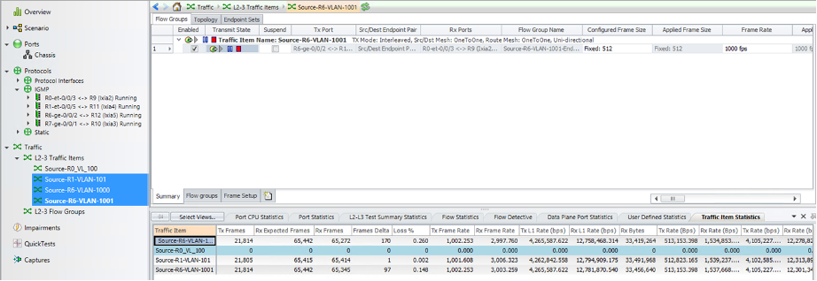

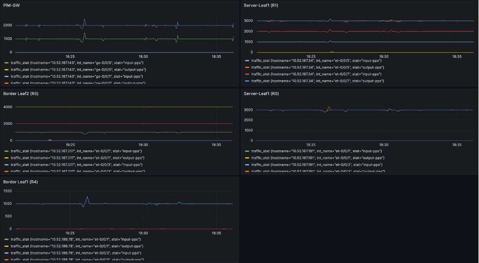

The show cli commands below highlights the active receivers for the multicast group based on the sources on VLAN100, VLAN101 and the SBD 900.
SL1 (R0)

```
R0-SL1> show igmp snooping evpn database 
Instance: EVPN_OISM
    Bridge-Domain: v100, VN Identifier: 100
        Group IP: 225.1.1.10, Source IP: 0.0.0.0, Access OIF Count: 2, Core NH: 47021
        Group IP: 225.1.1.20, Source IP: 0.0.0.0, Access OIF Count: 2, Core NH: 47021
    Bridge-Domain: v101, VN Identifier: 101
        Group IP: 225.1.1.20, Source IP: 0.0.0.0, Access OIF Count: 2, Core NH: 47013
    Bridge-Domain: v900, VN Identifier: 900
R0-SL1> show igmp snooping evpn membership 
Instance: EVPN_OISM

Vlan: v100, EVPN-Core-NH: 47021
Learning-Domain: default
Interface: ae1.100, Groups: 2
    Group: 225.1.1.10
        Group mode: Exclude
        Source: 0.0.0.0
        Type: Local
    Group: 225.1.1.20
        Group mode: Exclude
        Source: 0.0.0.0
        Type: Local
Interface: et-0/0/1.100, Groups: 0
Interface: et-0/0/3.100, Groups: 2
    Group: 225.1.1.10
        Group mode: Exclude
        Source: 0.0.0.0
        Type: Local
    Group: 225.1.1.20
        Group mode: Exclude
        Source: 0.0.0.0
        Type: Local

Vlan: v101, EVPN-Core-NH: 47013
Learning-Domain: default
Interface: ae1.101, Groups: 1
    Group: 225.1.1.20
        Group mode: Exclude
        Source: 0.0.0.0
        Type: Local
Interface: et-0/0/1.101, Groups: 0
Interface: et-0/0/3.101, Groups: 1
    Group: 225.1.1.20
        Group mode: Exclude
        Source: 0.0.0.0
        Type: Local
Vlan: v900, EVPN-Core-NH: 47005

Learning-Domain: default

R0-SL1> show multicast route instance OISM_VRF extensive 
Instance: OISM_VRF Family: INET

Group: 225.1.1.10
    Source: 101.1.1.3/32
    Upstream interface: irb.101
    Downstream interface list: 
        irb.100 irb.900
    Number of outgoing interfaces: 2
    Session description: Unknown
    Statistics: 546 kBps, 1114 pps, 481531 packets
    Next-hop ID: 47328
    Upstream protocol: Multicast
    Route state: Active
    Forwarding state: Forwarding
    Cache lifetime/timeout: 360 seconds
    Wrong incoming interface notifications: 4
    Uptime: 00:09:18
    Sensor ID: 0xf0000007

Group: 225.1.1.20
    Source: 100.1.1.1/32
    Upstream interface: irb.100
    Downstream interface list: 
        irb.101 irb.900
    Number of outgoing interfaces: 2
    Session description: Unknown
    Statistics: 547 kBps, 1116 pps, 527927 packets
    Next-hop ID: 47332
    Upstream protocol: Multicast
    Route state: Active
    Forwarding state: Forwarding
    Cache lifetime/timeout: 360 seconds
    Wrong incoming interface notifications: 6
    Uptime: 00:09:18
    Sensor ID: 0xf0000009
Instance: OISM_VRF Family: INET6
```

SL2 (R1)

```
R1-SL1> show lldp neighbors   
Local Interface    Parent Interface    Chassis Id          Port info          System Name
et-0/0/7           -                   0c:68:be:02:03:57   et-0/0/9           R3-re0.englab.juniper.net
et-0/0/3           ae1                 2c:6b:f5:be:bc:c0   ge-0/0/2           R7-re0.englab.juniper.net
re0:mgmt-0         -                   50:7c:6f:05:29:f0   tap5               q-pod-106n.englab.juniper.net
et-0/0/1           -                   70:8f:e1:25:03:57   et-0/0/7           R2-re0.englab.juniper.net

R1-SL1> show igmp snooping evpn database 
Instance: EVPN_OISM
    Bridge-Domain: v100, VN Identifier: 100
        Group IP: 225.1.1.10, Source IP: 0.0.0.0, Access OIF Count: 2, Core NH: 47487
        Group IP: 225.1.1.20, Source IP: 0.0.0.0, Access OIF Count: 1, Core NH: 47487
    Bridge-Domain: v101, VN Identifier: 101
        Group IP: 225.1.1.20, Source IP: 0.0.0.0, Access OIF Count: 2, Core NH: 47479
    Bridge-Domain: v900, VN Identifier: 900

R1-SL1> show igmp snooping evpn membership 
Instance: EVPN_OISM

Vlan: v100, EVPN-Core-NH: 47487

Learning-Domain: default
Interface: ae1.100, Groups: 2
    Group: 225.1.1.10
        Group mode: Exclude
        Source: 0.0.0.0
        Type: Remote
    Group: 225.1.1.20
        Group mode: Exclude
        Source: 0.0.0.0
        Type: Remote
Interface: et-0/0/5.100, Groups: 1
    Group: 225.1.1.10
        Group mode: Exclude
        Source: 0.0.0.0
        Type: Local

Vlan: v101, EVPN-Core-NH: 47479
Learning-Domain: default
Interface: ae1.101, Groups: 1
    Group: 225.1.1.20
        Group mode: Exclude
        Source: 0.0.0.0
        Type: Remote
Interface: et-0/0/5.101, Groups: 1
    Group: 225.1.1.20
        Group mode: Exclude
        Source: 0.0.0.0
        Type: Local
Vlan: v900, EVPN-Core-NH: 47471
Learning-Domain: default
Interface: et-0/0/5.900, Groups: 0

R1-SL1> show multicast route instance OISM_VRF extensive 
Instance: OISM_VRF Family: INET

Group: 225.1.1.10
    Source: 101.1.1.3/32
    Upstream interface: irb.101
    Downstream interface list: 
        irb.100 irb.900
    Number of outgoing interfaces: 2
    Session description: Unknown
    Statistics: 507 kBps, 1034 pps, 611775 packets
    Next-hop ID: 47866
    Upstream protocol: Multicast
    Route state: Active
    Forwarding state: Forwarding
    Cache lifetime/timeout: 360 seconds
    Wrong incoming interface notifications: 2
    Uptime: 00:10:45
    Sensor ID: 0xf000003b

Group: 225.1.1.20
    Source: 100.1.1.1/32
    Upstream interface: irb.100
    Downstream interface list: 
        irb.101 irb.900
    Number of outgoing interfaces: 2
    Session description: Unknown
    Statistics: 505 kBps, 1032 pps, 599974 packets
    Next-hop ID: 47872
    Upstream protocol: Multicast
    Route state: Active
    Forwarding state: Forwarding
    Cache lifetime/timeout: 360 seconds
    Wrong incoming interface notifications: 2
    Uptime: 00:10:45
    Sensor ID: 0xf000003d

Instance: OISM_VRF Family: INET6
```

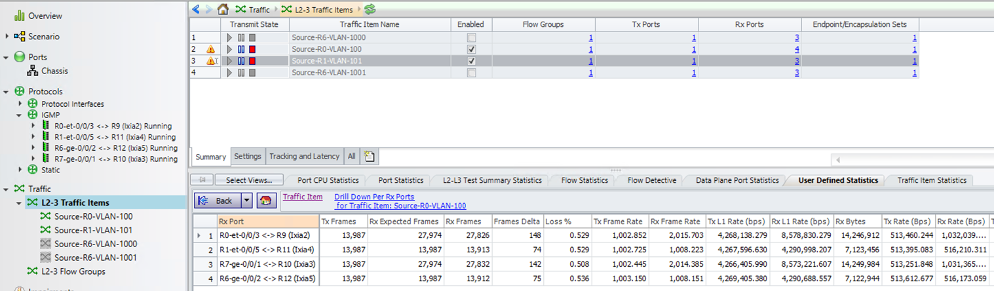

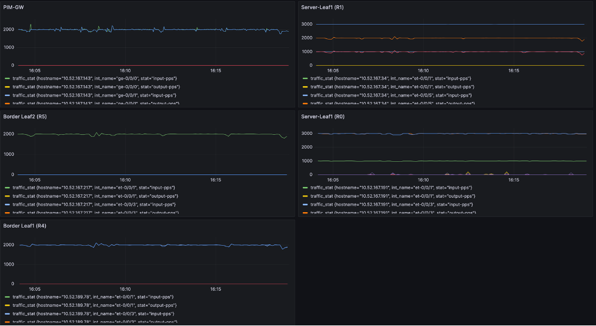

**Multicast Group Leave and Join**

Below tests focus on testing the Multicast group leave and joins to demonstrate that the OISM is responsive to the Leave and Join events not just in the local DC domain but also to the traffic all the way to the Multicast source & receivers connected with the PIM-GW. The CLI commands below shows the states of SL1 and SL2 when IXIA simulates Multicast group Leave and Joins respectively.

SL1 (R0)

```
R1-SL2> show igmp snooping membership instance EVPN_OISM 
Instance: EVPN_OISM
Vlan: v100
Learning-Domain: default
Interface: ae1.100, Groups: 0
Learning-Domain: default
Interface: et-0/0/5.100, Groups: 0
Vlan: v101
Learning-Domain: default
Interface: ae1.101, Groups: 0

Learning-Domain: default
Interface: et-0/0/5.101, Groups: 1
    Group: 225.1.1.20
        Group mode: Exclude
        Source: 0.0.0.0
        Last reported by: 101.1.1.3
        Group timeout:     239 Type: Dynamic
Vlan: v900

R1-SL2> show igmp snooping evpn database detail 
Instance: EVPN_OISM
  Bridge-Domain: v100, VN Identifier: 100
        Group IP: 225.1.1.10, Source IP: 0.0.0.0
            Core NH: 47487
            Access OIF Count: 1
                  Interface    Local    Remote
                ae1.100          0        1
  Bridge-Domain: v101, VN Identifier: 101
        Group IP: 225.1.1.20, Source IP: 0.0.0.0
            Core NH: 47479
            Access OIF Count: 2
                  Interface    Local    Remote
                ae1.101          0        1
                et-0/0/5.101     1        0
  Bridge-Domain: v900, VN Identifier: 900
```

SL2 (R1)

```
R1-SL2> show igmp snooping membership instance EVPN_OISM    
Instance: EVPN_OISM
Vlan: v100
Learning-Domain: default
Interface: ae1.100, Groups: 0
Learning-Domain: default
Interface: et-0/0/5.100, Groups: 1
    Group: 225.1.1.10
        Group mode: Exclude
        Source: 0.0.0.0
        Last reported by: 100.1.1.3
        Group timeout:     231 Type: Dynamic
Vlan: v101

Learning-Domain: default
Interface: ae1.101, Groups: 0
Learning-Domain: default
Interface: et-0/0/5.101, Groups: 1
    Group: 225.1.1.20
        Group mode: Exclude
        Source: 0.0.0.0
        Last reported by: 101.1.1.3
        Group timeout:     202 Type: Dynamic
Vlan: v900
Learning-Domain: default
Interface: et-0/0/5.900, Groups: 0

R1-SL2> show igmp snooping evpn database detail    
Instance: EVPN_OISM
  Bridge-Domain: v100, VN Identifier: 100
        Group IP: 225.1.1.10, Source IP: 0.0.0.0
            Core NH: 47487
            Access OIF Count: 2
                  Interface    Local    Remote
                ae1.100          0        1
                et-0/0/5.100     1        0
  Bridge-Domain: v101, VN Identifier: 101
        Group IP: 225.1.1.20, Source IP: 0.0.0.0
            Core NH: 47479
            Access OIF Count: 2
                  Interface    Local    Remote
                ae1.101          0        1
                et-0/0/5.101     1        0
  Bridge-Domain: v900, VN Identifier: 900
```

Figure 10 below shows the multicast traffic drop and rampup during IGMP leave and Join events on SL1 of the OISM topology. These statistics shown below in Figure 10 or 11 are polled from the routers corresponding interfaces. The IGMP hosts connected from SL1 to Ixia simulate Leave and Join events.

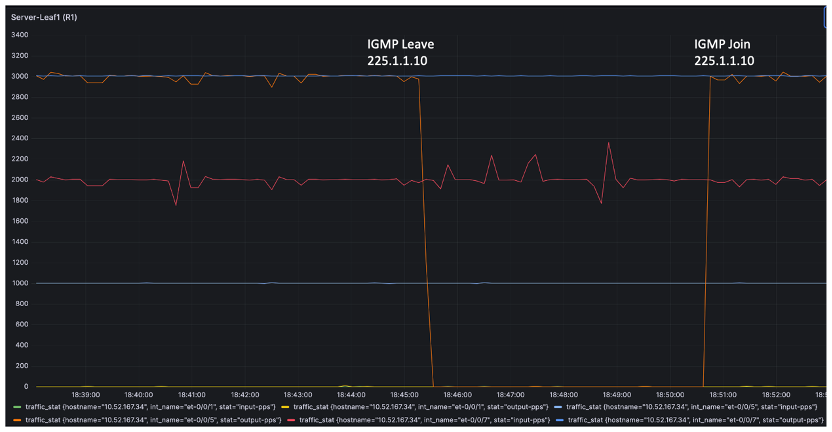

Figure 11 below shows the multicast traffic drop and rampup during IGMP leave and Join events on PIM-GW of the OISM topology. The IGMP hosts connected from PIM-GW directly to Ixia on vlan 1000 simulate Leave and Join events. This is particularly on multicast group 225.1.1.10.

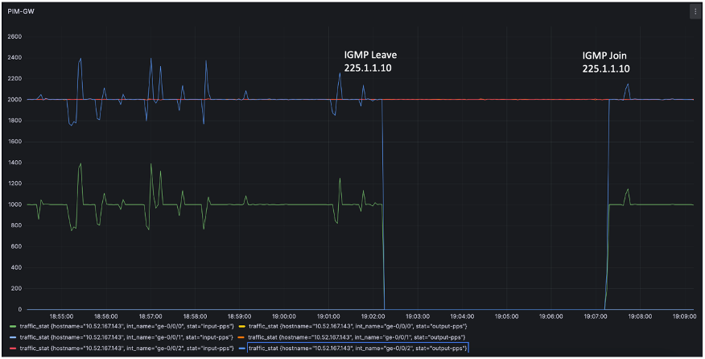

### OISM  PIM-GW with M-VLAN

**Configuration Overview**

In OISM External IRB MVLAN model there is no changes in SL configurations. However, BL and PIM-GW undergoes major additions and modifications that include LAG and MVLAN instance related configurations. Below section will focus on the configuration additions on BL and PIM-GW only and the complete underlay, overlay and access side configuration are covered in the Configuration Snippet section.

BL1:

```
R0-BL1# show | compare 
+  chassis {
+      aggregated-devices {
+          ethernet {
+              device-count 10;
+          }
+      }
+  }
[edit interfaces et-0/0/5]
+    ether-options {
+        802.3ad ae0;
+    }
[edit interfaces]
+   ae0 {
+       flexible-vlan-tagging;
+       encapsulation flexible-ethernet-services;
+       esi {
+           00:22:22:22:22:22:22:22:22:22;
+           all-active;
+       }
+       aggregated-ether-options {
+           lacp {
+               active;
+               system-id 00:22:22:22:22:22;
+           }
+       }
+       unit 2000 {
+           encapsulation vlan-bridge;
+           vlan-id 2000;
+       }
+   }
[edit interfaces irb]
+    unit 2000 {
+        family inet {
+            address 80.1.1.50/24 {
+                virtual-gateway-address 80.1.1.254;
+            }
+        }
+    }
[edit]
+  policy-options {
+      prefix-list p1 {
+          80.1.1.70/32;
+      }
+      policy-statement pol {
+          term 1 {
+              from {
+                  prefix-list p1;
+              }
+              then accept;
+          }
+      }
+  }
[edit routing-instances]
+   EVPN_MVLAN {
+       instance-type mac-vrf;
+       protocols {
+           igmp-snooping {
+               vlan v2000 {            
+                   proxy;
+                   interface ae0.2000 {
+                       multicast-router-interface;
+                   }
+               }
+           }
+           evpn {
+               encapsulation vxlan;
+               default-gateway no-gateway-community;
+               extended-vni-list 2000;
+           }
+       }
+       vtep-source-interface lo0.0;
+       service-type vlan-aware;
+       route-distinguisher 1.1.1.5:3;
+       vrf-target target:1:3;
+       vlans {
+           v2000 {
+               vlan-id 2000;
+               interface ae0.2000;
+               l3-interface irb.2000;
+               vxlan {
+                   vni 2000;
+               }
+           }
+       }
+   }
[edit routing-instances OISM_VRF protocols evpn oism pim-evpn-gateway]
+        external-irb irb.2000;
[edit routing-instances OISM_VRF protocols ospf area 0.0.0.0]
        interface irb.900 { ... }
+       interface irb.2000;
-       interface et-0/0/5.0;
[edit routing-instances OISM_VRF protocols pim]
+      interface irb.2000 {
+          accept-join-always-from pol;
+          distributed-dr;
+      }
[edit routing-instances OISM_VRF]
+    interface irb.2000;
```

BL2:

```
R0-BL2# show | compare 
+  chassis {
+      aggregated-devices {
+          ethernet {
+              device-count 10;
+          }
+      }
+  }
[edit interfaces et-0/0/5]
+    ether-options {
+        802.3ad ae0;
+    }
[edit interfaces]
+   ae0 {
+       flexible-vlan-tagging;
+       encapsulation flexible-ethernet-services;
+       esi {
+           00:22:22:22:22:22:22:22:22:22;
+           all-active;
+       }
+       aggregated-ether-options {
+           lacp {
+               active;
+               system-id 00:22:22:22:22:22;
+           }
+       }
+       unit 2000 {
+           encapsulation vlan-bridge;
+           vlan-id 2000;
+       }
+   }
[edit interfaces irb]
+    unit 2000 {
+        virtual-gateway-accept-data;
+        family inet {
+            address 80.1.1.60/24 {
+                virtual-gateway-address 80.1.1.254;
+            }
+        }
+    }
[edit]
+  policy-options {
+      prefix-list p1 {
+          80.1.1.70/32;
+      }
+      policy-statement pol {
+          term 1 {
+              from {
+                  prefix-list p1;
+              }
+              then accept;
+          }
+      }
+  }
[edit routing-instances]
+   EVPN_MVLAN {
+       instance-type mac-vrf;
+       protocols {
+           igmp-snooping {             
+               vlan v2000 {
+                   proxy;
+                   interface ae0.2000 {
+                       multicast-router-interface;
+                   }
+               }
+           }
+           evpn {
+               encapsulation vxlan;
+               default-gateway no-gateway-community;
+               extended-vni-list 2000;
+           }
+       }
+       vtep-source-interface lo0.0;
+       service-type vlan-aware;
+       route-distinguisher 1.1.1.6:3;
+       vrf-target target:1:3;
+       vlans {
+           v2000 {
+               vlan-id 2000;
+               interface ae0.2000;
+               l3-interface irb.2000;
+               vxlan {
+                   vni 2000;
+               }
+           }
+       }
+   }
[edit routing-instances OISM_VRF protocols evpn oism pim-evpn-gateway]
+        external-irb irb.2000;
[edit routing-instances OISM_VRF protocols ospf area 0.0.0.0]
        interface irb.900 { ... }
+       interface irb.2000;
-       interface et-0/0/5.0;
[edit routing-instances OISM_VRF protocols pim]
+      interface irb.2000 {
+          accept-join-always-from pol;
+          distributed-dr;
+      }
[edit routing-instances OISM_VRF]
+    interface irb.2000;
```

PIM-GW:

```
R0-BL1# regress@R6-re0# show | compare 
[edit chassis]
+   aggregated-devices {
+       ethernet {
+           device-count 10;
+       }
+   }
[edit interfaces ge-0/0/0]
+    gigether-options {
+        802.3ad ae0;
+    }
[edit interfaces ge-0/0/0]
!     inactive: unit 0 { ... }
[edit interfaces ge-0/0/1]
+    gigether-options {
+        802.3ad ae0;
+    }
[edit interfaces]
+   ae0 {
+       flexible-vlan-tagging;
+       encapsulation flexible-ethernet-services;
+       esi {
+           00:22:22:22:22:22:22:22:22:22;
+           all-active;
+       }
+       aggregated-ether-options {
+           lacp {
+               active;
+               system-id 00:22:22:22:22:21;
+           }
+       }
+       unit 2000 {
+           encapsulation vlan-bridge;
+           vlan-id 2000;
+       }
+   }
+   irb {
+       unit 2000 {
+           virtual-gateway-accept-data;
+           family inet {
+               address 80.1.1.70/24 {
+                   virtual-gateway-address 80.1.1.254;
+               }
+           }
+       }
+   }
[edit protocols pim]
+    interface irb.2000;
[edit]
+  bridge-domains {
+      bd-2000 {
+          domain-type bridge;
+          vlan-id 2000;
+          interface ae0.2000;
+          routing-interface irb.2000;
+      }                                
+  }
```

## Operational Overview

Below section covers the different verification CLI commands to check the status of the multicast forwarding on different nodes in the network including the SL, BL, PIM-GW.

There are two different scenarios of traffic flow:

1. Multicast source resides in the EVPN DC and the traffic flows out to PIM GW externally.

2. Traffic comes into the EVPN DC from the multicast source connected externally on PIM GW.

### OISM States on BL & PIM-GW

**Case 1. Multicast source is inside the DC fabric**

The show cli commands below highlights the states of Multicast on the BL and PIM GW, where the active source resides within the EVPN DC and the receivers are within the DC and also in externally connected.

BL1: 

```
R4-BL1> show pim join instance OISM_VRF extensive 

Instance: PIM.OISM_VRF Family: INET
R = Rendezvous Point Tree, S = Sparse, W = Wildcard
Group: 225.1.1.10
    Source: *
    RP: 1.1.1.7
    Flags: sparse,rptree,wildcard
    Upstream interface: irb.2000              
    Upstream neighbor: 80.1.1.70
    Upstream state: Join to RP
    Uptime: 02:13:27 
    Downstream neighbors:
        Interface: irb.900                
            90.1.1.50 State: Join Flags: SRW  Timeout: Infinity
            Uptime: 02:13:27 Time since last Join: 00:14:28
        Interface: irb.2000               
            80.1.1.60 State: Join Flags: SRW Timeout: 185
            Uptime: 00:13:25 Time since last Join: 00:00:25
    Number of downstream interfaces: 2
    Number of downstream neighbors: 2

Group: 225.1.1.10
    Source: 101.1.1.3
    Flags: sparse,spt
    Upstream interface: irb.101               
    Upstream neighbor: Direct
    Upstream state: Local Source, Prune to RP
    Keepalive timeout: 0
    Uptime: 02:13:24 
    Downstream neighbors:
        Interface: irb.2000               
            80.1.1.60 State: Prune Flags: SR Timeout: 185
            Uptime: 00:13:25 Time since last Prune: 00:00:25
            80.1.1.70 State: Join Flags: S Timeout: 195
            Uptime: 00:13:15 Time since last Join: 00:00:15
    Number of downstream interfaces: 1
    Number of downstream neighbors: 2

<Output truncated for brevity>
R4-BL1> show multicast route instance OISM_VRF extensive 
Instance: OISM_VRF Family: INET

Group: 225.1.1.10
    Source: 101.1.1.3/32
    Upstream interface: irb.101
    Downstream interface list: 
        irb.2000
    Number of outgoing interfaces: 1
    Session description: Unknown
    Statistics: 577 kBps, 1178 pps, 8071586 packets
    Next-hop ID: 47749
    Upstream protocol: Multicast
    Route state: Active
    Forwarding state: Forwarding
    Cache lifetime/timeout: 360 seconds
    Wrong incoming interface notifications: 3
    Uptime: 02:14:22
    Sensor ID: 0xf0000029

Instance: OISM_VRF Family: INET6
R4-BL1> monitor interface traffic

R4-re0-re0                        Seconds: 6                   Time: 09:31:15

Interface    Link  Input packets        (pps)     Output packets        (pps)

 ae0           Up        2478851          (3)       1116414997       (1003)
 dsc           Up              0          (0)                0          (0)
 esi           Up              0          (0)                0          (0)
 et-0/0/1      Up      174182952          (1)           828496          (1)
 et-0/0/3      Up      989327606       (1002)          1033903          (1)
 et-0/0/5      Up        2478851          (3)       1116414997       (1003)
 et-0/0/7      Up     1210788863          (1)          2971320          (3)
 et-0/0/9      Up              0          (0)            66111          (0)
 et-0/0/11     Up              0          (0)            66109          (0)
 et-0/0/13     Up              0          (0)            66109          (0)
 et-0/0/15     Up              0          (0)            66106          (0)
```

BL2:

```
R5-BL2> show pim join instance OISM_VRF extensive 
Instance: PIM.OISM_VRF Family: INET
R = Rendezvous Point Tree, S = Sparse, W = Wildcard

Group: 225.1.1.10
    Source: *
    RP: 1.1.1.7
    Flags: sparse,rptree,wildcard
    Upstream interface: irb.2000              
    Upstream neighbor: 80.1.1.70
    Upstream state: Join to RP
    Uptime: 02:15:08 
    Downstream neighbors:
        Interface: irb.900                
            90.1.1.60 State: Join Flags: SRW  Timeout: Infinity
            Uptime: 02:15:08 Time since last Join: 00:16:19
        Interface: irb.2000               
            80.1.1.50 State: Join Flags: SRW Timeout: 196
            Uptime: 00:15:14 Time since last Join: 00:00:14
    Number of downstream interfaces: 2
    Number of downstream neighbors: 2
Group: 225.1.1.10
    Source: 101.1.1.3
    Flags: sparse,spt
    Upstream interface: irb.101               
    Upstream neighbor: Direct
    Upstream state: Local Source, Prune to RP
    Keepalive timeout: 0
    Uptime: 02:15:05 
    Downstream neighbors:
        Interface: irb.900                
            90.1.1.60 State: Join Flags: S   Timeout: Infinity
            Uptime: 02:15:05 Time since last Join: 02:15:05
        Interface: irb.2000               
            80.1.1.50 State: Prune Flags: SR Timeout: 196
            Uptime: 00:15:14 Time since last Prune: 00:00:14
            80.1.1.70 State: Join Flags: S Timeout: 206
            Uptime: 00:15:04 Time since last Join: 00:00:04
    Number of downstream interfaces: 2
    Number of downstream neighbors: 3

<Output truncated for brevity>
R5-BL2> show multicast route extensive instance OISM_VRF 
Instance: OISM_VRF Family: INET
Group: 225.1.1.10
    Source: 101.1.1.3/32
    Upstream interface: irb.101
    Downstream interface list: 
        irb.900 irb.2000
    Number of outgoing interfaces: 2
    Session description: Unknown
    Statistics: 492 kBps, 1004 pps, 8157643 packets
    Next-hop ID: 47659
    Upstream protocol: Multicast
    Route state: Active
    Forwarding state: Forwarding
    Cache lifetime/timeout: 360 seconds
    Wrong incoming interface notifications: 4
    Uptime: 02:15:56
    Sensor ID: 0xf0000031
Instance: OISM_VRF Family: INET6

R5-BL1> monitor interface traffic

R5-re0-re0                        Seconds: 6                   Time: 09:33:51

Interface    Link  Input packets        (pps)     Output packets        (pps)

 ae0           Up     1209974498          (1)           397661          (1)
 dsc           Up              0          (0)                0          (0)
 esi           Up              0          (0)                0          (0)
 et-0/0/1      Up      989262611       (1002)       2420236540          (0)
 et-0/0/3      Up      174142496          (0)           629740          (0)
 et-0/0/5      Up     1209974498          (1)           397661          (1)
 et-0/0/7      Up        2971400          (0)       1210791451          (0)
 et-0/0/9      Up              0          (0)            66106          (0)
 et-0/0/11     Up              0          (0)            66107          (0)
 et-0/0/13     Up              0          (0)            66111          (0)
 et-0/0/15     Up              0          (0)            66122          (0)
```

PIM-GW: 

```
R6-PIM-GW> show pim join extensive 
Instance: PIM.master Family: INET
R = Rendezvous Point Tree, S = Sparse, W = Wildcard

Group: 225.1.1.10
    Source: *
    RP: 1.1.1.7
    Flags: sparse,rptree,wildcard
    Upstream interface: Local                 
    Upstream neighbor: Local
    Upstream state: Local RP
    Uptime: 1w4d 08:42:07 
    Downstream neighbors:
        Interface: irb.2000 (assert winner)
            80.1.1.50 State: Join Flags: SRW Timeout: 176
            Uptime: 02:12:34 Time since last Join: 00:00:34
            80.1.1.60 State: Join Flags: SRW Timeout: 176
            Uptime: 02:11:34 Time since last Join: 00:00:34
            Assert Winner: 80.1.1.70 Metric: 0 Pref: 2147483648 Timeout: 55
        Interface: ge-0/0/2.1001          
            25.1.2.1 State: Join Flags: SRW  Timeout: Infinity
            Uptime: 04:32:06 Time since last Join: 02:12:46
    Number of downstream interfaces: 2
    Number of downstream neighbors: 3

Group: 225.1.1.10
    Source: 101.1.1.3
    Flags: sparse,spt
    Upstream interface: irb.2000              
    Upstream neighbor: 80.1.1.50
    Upstream state: Local RP, Join to Source, No Prune to RP
    Keepalive timeout: 311
    Uptime: 02:12:34 
    Downstream neighbors:
        Interface: irb.2000 (pruned)
            80.1.1.50 State: Prune Flags: SR Timeout: 176
            Uptime: 02:12:34 Time since last Prune: 00:00:34
            80.1.1.60 State: Prune Flags: SR Timeout: 176
            Uptime: 02:11:34 Time since last Prune: 00:00:34
        Interface: ge-0/0/2.1001          
            25.1.2.1 State: Join Flags: S   Timeout: Infinity
            Uptime: 02:12:25 Time since last Join: 02:12:25
    Number of downstream interfaces: 2
    Number of downstream neighbors: 3

<SNIP>
R6-PIM-GW> show multicast route extensive 
Instance: master Family: INET

Group: 225.1.1.10
    Source: 101.1.1.3/32
    Upstream interface: irb.2000
    Downstream interface list: 
        ge-0/0/2.1001
    Number of outgoing interfaces: 1
    Session description: Unknown
    Statistics: 491 kBps, 1002 pps, 9148322 packets
    Next-hop ID: 1048575
    Upstream protocol: PIM
    Route state: Active
    Forwarding state: Forwarding
    Cache lifetime/timeout: 360 seconds
    Wrong incoming interface notifications: 0
    Uptime: 02:32:10

Instance: master Family: INET6

R6-PIM-GW> monitor interface traffic
R6-re0                            Seconds: 16                  Time: 09:28:49

Interface    Link  Input packets        (pps)     Output packets        (pps)
 ge-0/0/0      Up     1116101154       (1005)          2403761          (1)          >>>>>>>> Interface connected to BL1 (R4)
 lc-0/0/0      Up              0                             0
 pfh-0/0/0     Up              0                             0
 ge-0/0/1      Up         303472          (0)       1209892130          (0)
 ge-0/0/2      Up     1228012918          (0)       1735868562       (1005)          >>>>>>>> Interface connected to IXIA
```

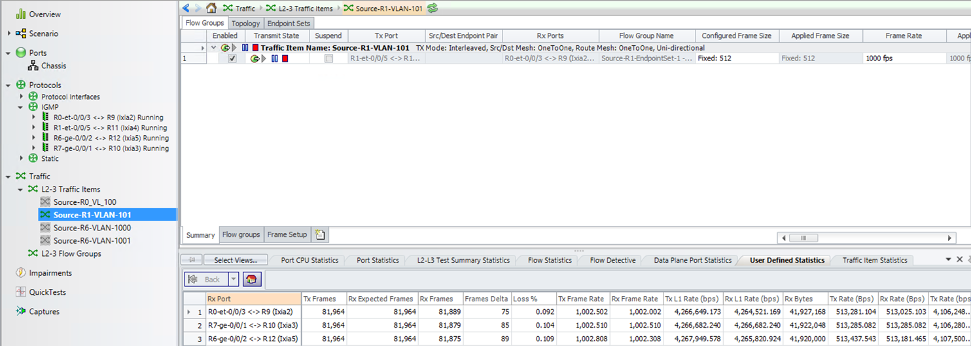

**Case 2. External multicast source.**

The show cli commands below highlights the states of multicast routes on the BL and PIM GW, where the active source resides within the EVPN DC and some receivers are within the DC and others are connected externally.

BL1: 

```
R4-BL1> show pim join instance OISM_VRF extensive 

Instance: PIM.OISM_VRF Family: INET     
R = Rendezvous Point Tree, S = Sparse, W = Wildcard
Group: 225.1.1.10
    Source: *
    RP: 1.1.1.7
    Flags: sparse,rptree,wildcard
    Upstream interface: irb.2000              
    Upstream neighbor: 80.1.1.70
    Upstream state: Join to RP
    Uptime: 04:54:11 
    Downstream neighbors:
        Interface: irb.900                
            90.1.1.50 State: Join Flags: SRW  Timeout: Infinity
            Uptime: 04:54:11 Time since last Join: 02:55:12
        Interface: irb.2000               
            80.1.1.60 State: Join Flags: SRW Timeout: 201
            Uptime: 02:54:09 Time since last Join: 00:00:09
    Number of downstream interfaces: 2
    Number of downstream neighbors: 2
Group: 225.1.1.10
    Source: 25.1.1.2
    Flags: sparse,spt
    Upstream interface: irb.2000              
    Upstream neighbor: 80.1.1.70
    Upstream state: Join to Source, No Prune to RP
    Keepalive timeout: 0
    Uptime: 00:06:10 
    Downstream neighbors:
        Interface: irb.2000               
            80.1.1.60 State: Join Flags: S Timeout: 201
            Uptime: 00:06:10 Time since last Join: 00:00:09
    Number of downstream interfaces: 1
    Number of downstream neighbors: 1
Group: 225.1.1.10
    Source: 101.1.1.3
    Flags: sparse
    Upstream interface: irb.101               
    Upstream neighbor: Direct
    Upstream state: Local Source, No Prune to RP
    Keepalive timeout: 
    Uptime: 04:54:08 
    Downstream neighbors:
        Interface: irb.2000               
            80.1.1.70 State: Join Flags: S Timeout: 151
            Uptime: 02:53:59 Time since last Join: 00:00:59
    Number of downstream interfaces: 1
    Number of downstream neighbors: 1
<SNIP>

R4-BL1> monitor interface traffic

R4-re0-re0                        Seconds: 886                 Time: 09:45:55
Interface    Link  Input packets        (pps)     Output packets        (pps)

 ae0           Up        2663520       (1003)       1117041776          (1)
 dsc           Up              0          (0)                0          (0)
 esi           Up              0          (0)                0          (0)
 et-0/0/1      Up      174183205          (0)           828814          (0)
 et-0/0/3      Up      989953751          (0)          1034505          (0)
 et-0/0/5      Up        2663520       (1003)       1117041776          (1)
 et-0/0/7      Up     1210973222       (1003)          3155673       (1003)
 et-0/0/9      Up              0          (0)            66142          (0)
 et-0/0/11     Up              0          (0)            66141          (0)
 et-0/0/13     Up              0          (0)            66141          (0)
 et-0/0/15     Up              0          (0)            66138          (0)
```

BL2:

```
R5-BL2> show pim join instance OISM_VRF extensive 

Instance: PIM.OISM_VRF Family: INET
R = Rendezvous Point Tree, S = Sparse, W = Wildcard

Group: 225.1.1.10
    Source: *
    RP: 1.1.1.7
    Flags: sparse,rptree,wildcard
    Upstream interface: irb.2000              
    Upstream neighbor: 80.1.1.70
    Upstream state: Join to RP
    Uptime: 04:52:06 
    Downstream neighbors:
        Interface: irb.900                
            90.1.1.60 State: Join Flags: SRW  Timeout: Infinity
            Uptime: 04:52:06 Time since last Join: 02:53:17
        Interface: irb.2000               
            80.1.1.50 State: Join Flags: SRW Timeout: 198
            Uptime: 02:52:12 Time since last Join: 00:00:12
    Number of downstream interfaces: 2
    Number of downstream neighbors: 2

Group: 225.1.1.10
    Source: 25.1.1.2
    Flags: sparse,spt
    Upstream interface: irb.2000              
    Upstream neighbor: 80.1.1.70
    Upstream state: Join to Source, No Prune to RP
    Keepalive timeout: 107
    Uptime: 00:04:13 
    Downstream neighbors:
        Interface: irb.900                
            90.1.1.60 State: Join Flags: S   Timeout: Infinity
            Uptime: 00:04:13 Time since last Join: 00:04:13
        Interface: irb.2000               
            80.1.1.50 State: Join Flags: S Timeout: 198
            Uptime: 00:04:13 Time since last Join: 00:00:12
    Number of downstream interfaces: 2
    Number of downstream neighbors: 2
Group: 225.1.1.10
    Source: 101.1.1.3
    Flags: sparse,spt
    Upstream interface: irb.101               
    Upstream neighbor: Direct
    Upstream state: Local Source, Prune to RP
    Keepalive timeout: 0
    Uptime: 04:52:03 
    Downstream neighbors:
        Interface: irb.900                
            90.1.1.60 State: Join Flags: S   Timeout: Infinity
            Uptime: 04:52:03 Time since last Join: 04:52:03
        Interface: irb.2000               
            80.1.1.50 State: Prune Flags: SR Timeout: 198
            Uptime: 02:52:12 Time since last Prune: 00:00:12
            80.1.1.70 State: Join Flags: S Timeout: 207
            Uptime: 02:52:02 Time since last Join: 00:00:02
    Number of downstream interfaces: 2
    Number of downstream neighbors: 3

<SNIP>
R5-BL2> monitor interface traffic

R5-re0-re0                        Seconds: 747                 Time: 09:46:12

Interface    Link  Input packets        (pps)     Output packets        (pps)

 ae0           Up     1209975390          (1)           398595          (1)
 dsc           Up              0          (0)                0          (0)
 esi           Up              0          (0)                0          (0)
 et-0/0/1      Up      989735767          (1)       2420640210       (2005)
 et-0/0/3      Up      174142714          (0)           630008          (0)
 et-0/0/5      Up     1209975390          (1)           398595          (1)
 et-0/0/7      Up        3173525       (1003)       1210993710       (1003)
 et-0/0/9      Up              0          (0)            66133          (0)
 et-0/0/11     Up              0          (0)            66134          (0)
 et-0/0/13     Up              0          (0)            66138          (0)
 et-0/0/15     Up              0          (0)            66149          (0)
```

PIM-GW: 

```
R6-PIM-GW> show pim join extensive 
Instance: PIM.master Family: INET
R = Rendezvous Point Tree, S = Sparse, W = Wildcard

Group: 225.1.1.10
    Source: *
    RP: 1.1.1.7
    Flags: sparse,rptree,wildcard
    Upstream interface: Local                 
    Upstream neighbor: Local
    Upstream state: Local RP
    Uptime: 1w4d 09:31:58 
    Downstream neighbors:
        Interface: irb.2000 (assert winner)
            80.1.1.50 State: Join Flags: SRW Timeout: 184
            Uptime: 03:02:25 Time since last Join: 00:00:25
            80.1.1.60 State: Join Flags: SRW Timeout: 184
            Uptime: 03:01:25 Time since last Join: 00:00:25
            Assert Winner: 80.1.1.70 Metric: 0 Pref: 2147483648 Timeout: 25
        Interface: ge-0/0/2.1001          
            25.1.2.1 State: Join Flags: SRW  Timeout: Infinity
            Uptime: 05:21:57 Time since last Join: 03:02:37
    Number of downstream interfaces: 2
    Number of downstream neighbors: 3
Group: 225.1.1.10
    Source: 25.1.1.2
    Flags: sparse,spt
    Upstream interface: ge-0/0/2.1000         
    Upstream neighbor: Direct
    Upstream state: Local Source, Local RP, No Prune to RP
    Keepalive timeout: 320
    Uptime: 00:14:26 
    Downstream neighbors:
        Interface: irb.2000               
            80.1.1.50 State: Join Flags: S Timeout: 184
            Uptime: 00:14:26 Time since last Join: 00:00:25
            80.1.1.60 State: Join Flags: S Timeout: 184
            Uptime: 00:14:26 Time since last Join: 00:00:25
        Interface: ge-0/0/2.1001          
            25.1.2.1 State: Join Flags: S   Timeout: Infinity
            Uptime: 00:14:26 Time since last Join: 00:14:26
    Number of downstream interfaces: 2
    Number of downstream neighbors: 3
<Output truncated for brevity>

R6-PIM-GW> show multicast route extensive 
Instance: master Family: INET
Group: 225.1.1.10
    Source: 25.1.1.2/32
    Upstream interface: ge-0/0/2.1000
    Downstream interface list: 
        ge-0/0/2.1001 irb.2000
    Number of outgoing interfaces: 2
    Session description: Unknown
    Statistics: 491 kBps, 1002 pps, 909383 packets
    Next-hop ID: 1048577
    Upstream protocol: PIM
    Route state: Active
    Forwarding state: Forwarding
    Cache lifetime/timeout: 360 seconds
    Wrong incoming interface notifications: 0
    Uptime: 00:15:18

Instance: master Family: INET6

R6-PIM-GW> monitor interface traffic
R6-re0                            Seconds: 10                  Time: 09:58:33

Interface    Link  Input packets        (pps)     Output packets        (pps)
 ge-0/0/0      Up     1116872970          (0)          3354149       (1001)          >>>>>>>> Interface connected to BL1 (R4)
 lc-0/0/0      Up              0                             0
 pfh-0/0/0     Up              0                             0
 ge-0/0/1      Up         305701          (0)       1209892515          (0)
 ge-0/0/2      Up     1228962686       (1001)       1737588569       (1001)          >>>>>>>> Interface connected to IXIA
```

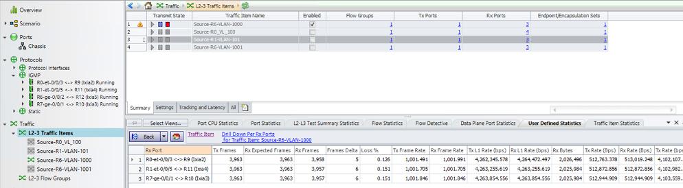

## Configuration Snippets

### Access / Underlay Configuration

SL1: 

```
R0-SL1> show configuration interfaces 
et-0/0/1 {
    description "To Multicast Source/Receiver host"
    flexible-vlan-tagging;
    encapsulation flexible-ethernet-services;
    unit 100 {
        encapsulation vlan-bridge;
        vlan-id 100;
    }
    unit 101 {
        encapsulation vlan-bridge;
        vlan-id 101;
    }
}
et-0/0/3 {
    description "To Multicast Source/Receiver host"
    flexible-vlan-tagging;
    encapsulation flexible-ethernet-services;
    unit 100 {
        encapsulation vlan-bridge;
        vlan-id 100;
    }
    unit 101 {
        encapsulation vlan-bridge;
        vlan-id 101;
    }
}
et-0/0/5 {
    ether-options {
        802.3ad ae1;
    }
}
ae1 {
    description "To CE-R7"
    flexible-vlan-tagging;
    encapsulation flexible-ethernet-services;
    esi {
        00:11:11:11:11:11:11:11:11:11;
        all-active;
    }
    aggregated-ether-options {
        lacp {
            active;
            system-id 00:11:11:11:11:11;
        }
    }
    unit 100 {
        encapsulation vlan-bridge;
        vlan-id 100;
    }                                   
    unit 101 {                          
        encapsulation vlan-bridge;
        vlan-id 101;
    }
}
et-0/0/7 {
    description "To Spine Leaf -- Overlay"
    unit 0 {
        family inet {
            address 10.1.1.2/24;
        }
    }
}
et-0/0/9 {
    description "To Spine Leaf -- Overlay"
    unit 0 {
        family inet {
            address 11.1.1.2/24;
        }
    }
}
irb {
    unit 100 {
        virtual-gateway-accept-data;
        family inet {
            address 100.1.1.101/24 {
                preferred;
                virtual-gateway-address 100.1.1.254;
            }
        }
    }
    unit 101 {
        virtual-gateway-accept-data;
        family inet {
            address 101.1.1.101/24 {
                preferred;
                virtual-gateway-address 101.1.1.254;
            }
        }
    }
    unit 900 {
        virtual-gateway-accept-data;
        family inet {
            address 90.1.1.10/24 {
                virtual-gateway-address 90.1.1.254;
            }
        }
    }
}
lo0 {
    unit 0 {
        family inet {
            address 1.1.1.1/32;
        }
    }
    unit 1 {
        family inet {
            address 1.1.10.1/32;
        }
    }
```

SL2:

```
R1-SL2> show configuration interfaces 
et-0/0/5 {
    description "To Multicast Source/Receiver host"
    flexible-vlan-tagging;
    encapsulation flexible-ethernet-services;
    unit 100 {
        encapsulation vlan-bridge;
        vlan-id 100;
    }
    unit 101 {
        encapsulation vlan-bridge;
        vlan-id 101;
    }
}
et-0/0/7 {
    unit 0 {
        family inet {
            address 13.1.1.2/24;
        }
    }
}
et-0/0/3 {
    ether-options {
        802.3ad ae1;
    }
}
ae1 {
    description "To CE-R7"
    flexible-vlan-tagging;
    encapsulation flexible-ethernet-services;
    esi {
        00:11:11:11:11:11:11:11:11:11;
        all-active;
    }
    aggregated-ether-options {
        lacp {
            active;
            system-id 00:11:11:11:11:11;
        }
    }
    unit 100 {
        encapsulation vlan-bridge;
        vlan-id 100;
    }
    unit 101 {
        encapsulation vlan-bridge;
        vlan-id 101;
    }
}
et-0/0/1 {
    description "To Spine Leaf -- Overlay"
    unit 0 {
        family inet {
            address 12.1.1.2/24;
        }
    }
}
irb {
    unit 100 {
        virtual-gateway-accept-data;    
        family inet {
            address 100.1.1.102/24 {
                virtual-gateway-address 100.1.1.254;
            }
        }
    }
    unit 101 {
        virtual-gateway-accept-data;
        family inet {
            address 101.1.1.102/24 {
                virtual-gateway-address 101.1.1.254;
            }
        }
    }
    unit 900 {
        virtual-gateway-accept-data;
        family inet {
            address 90.1.1.20/24 {
                virtual-gateway-address 90.1.1.254;
            }
        }
    }
}
lo0 {
    unit 0 {
        family inet {
            address 1.1.1.2/32;
        }
    }
    unit 1 {
        family inet {
            address 1.1.10.2/32;
        }
    }
}
```

LS1 (R2):

```
regress@R2-re0-re0> show configuration
interfaces {
    et-0/0/1 {
        unit 0 {
            family inet {
                address 16.1.1.2/24;
            }
        }
    }
    et-0/0/3 {
        unit 0 {
            family inet {
                address 15.1.1.2/24;
            }
        }
    }
    et-0/0/5 {
        unit 0 {
            family inet {
                address 17.1.1.2/24;
            }
        }
    }
    et-0/0/7 {
        unit 0 {
            family inet {
                address 12.1.1.1/24;
            }
        }
    }                                   
    et-0/0/9 {
        unit 0 {
            family inet {
                address 10.1.1.1/24;
            }
        }
    }
    lo0 {
        unit 0 {
            family inet {
                address 1.1.1.3/32;
            }
        }
    }
}
routing-options {
    router-id 1.1.1.3;
    autonomous-system 64512;
}
protocols {
    ospf {
        area 0.0.0.0 {
            interface all;
            interface re0:mgmt-0.0 {
                disable;                
            }
        }
    }
}
```

LS2 (R3):

```
regress@r2-re0# show interfaces 

interfaces {
    et-0/0/1 {
        unit 0 {
            family inet {
                address 16.1.1.1/24;
            }
        }
    }
    et-0/0/3 {
        unit 0 {
            family inet {
                address 18.1.1.2/24;
            }
        }
    }
    et-0/0/5 {
        unit 0 {
            family inet {
                address 14.1.1.2/24;
            }
        }
    }
    et-0/0/7 {
        unit 0 {
            family inet {
                address 11.1.1.1/24;
            }
        }
    }                                   
    et-0/0/9 {
        unit 0 {
            family inet {
                address 13.1.1.1/24;
            }
        }
    }
    lo0 {
        unit 0 {
            family inet {
                address 1.1.1.4/32;
            }
        }
    }
}
routing-options {
    router-id 1.1.1.4;
    autonomous-system 64512;
}
protocols {
    ospf {
        area 0.0.0.0 {
            interface all;
            interface re0:mgmt-0.0 {
                disable;
            }
        }
    }
}
```

BL1 (R4):

```
R4-BL1> show configuration interfaces 
et-0/0/1 {
    unit 0 {
        family inet {
            address 15.1.1.1/24;
        }
    }
}
et-0/0/3 {
    unit 0 {
        family inet {
            address 14.1.1.1/24;
        }
    }
}
et-0/0/5 {
    unit 0 {
        family inet {
            address 21.1.1.2/24;
        }
    }
}
et-0/0/7 {
    unit 0 {
        family inet {
            address 19.1.1.2/24;
        }
    }
}
irb {
    unit 100 {
        virtual-gateway-accept-data;
        family inet {
            address 100.1.1.105/24 {
                virtual-gateway-address 100.1.1.254;
            }
        }
    }
    unit 101 {
        virtual-gateway-accept-data;
        family inet {
            address 101.1.1.105/24 {
                virtual-gateway-address 101.1.1.254;
            }
        }
    }
    unit 900 {
        virtual-gateway-accept-data;
        family inet {
            address 90.1.1.50/24 {
                virtual-gateway-address 90.1.1.254;
            }
        }
    }
}
lo0 {
    unit 0 {
        family inet {
            address 1.1.1.5/32;
        }
    }
    unit 1 {                            
        family inet {
            address 1.1.50.2/32;
        }
    }
}
```

BL2 (R5):

```
R5-BL2> show configuration interfaces 
et-0/0/1 {
    unit 0 {
        family inet {
            address 18.1.1.1/24;
        }
    }
}
et-0/0/3 {
    unit 0 {
        family inet {
            address 17.1.1.1/24;
        }
    }
}
et-0/0/5 {
    unit 0 {
        family inet {
            address 22.1.1.2/24;
        }
    }
}
et-0/0/7 {
    unit 0 {
        family inet {
            address 19.1.1.1/24;
        }
    }
}
irb {
    unit 100 {
        virtual-gateway-accept-data;
        family inet {
            address 100.1.1.106/24 {
                virtual-gateway-address 100.1.1.254;
            }
        }
    }
    unit 101 {
        virtual-gateway-accept-data;
        family inet {
            address 101.1.1.106/24 {
                virtual-gateway-address 101.1.1.254;
            }
        }
    }
    unit 900 {
        virtual-gateway-accept-data;
        family inet {
            address 90.1.1.60/24 {
                virtual-gateway-address 90.1.1.254;
            }
        }
    }
}
lo0 {
    unit 0 {
        family inet {
            address 1.1.1.6/32;
        }
    }
    unit 1 {                            
        family inet {
            address 1.1.60.2/32;
        }
    }
}
```

### Overlay Configuration

SL1 (R0):

```
R0-SL1> show configuration protocols 
bgp {
    group ibgp {
        local-address 1.1.1.1;
        family evpn {
            signaling;
        }
        peer-as 64512;
        neighbor 1.1.1.2;
        neighbor 1.1.1.5;
        neighbor 1.1.1.6;
    }
}
ospf {
    area 0.0.0.0 {
        interface all;
        interface re0:mgmt-0.0 {
            disable;
        }
    }
}
lldp {
    interface all;
}

R0-SL1# show routing-options 
router-id 1.1.1.1;
autonomous-system 64512;
forwarding-table {
    chained-composite-next-hop {
        ingress {
            evpn;
        }
    }
}
```

SL2 (R1):

```
R1-SL2> show configuration protocols 
bgp {
    group ibgp {
        local-address 1.1.1.2;
        family evpn {
            signaling;
        }
        peer-as 64512;
        neighbor 1.1.1.1;
        neighbor 1.1.1.5;
        neighbor 1.1.1.6;
    }
}
ospf {
    area 0.0.0.0 {
        interface all;
        interface re0:mgmt-0.0 {
            disable;
        }
    }
}
lldp {
    interface all;
}
R1-SL2# show routing-options 
router-id 1.1.1.2;
autonomous-system 64512;
forwarding-table {
    chained-composite-next-hop {
        ingress {
            evpn;
        }
    }
}
```

BL1:

```
R4-BL1> show configuration protocols            
bgp {
    group ibgp {
        local-address 1.1.1.5;
        family evpn {
            signaling;
        }
        peer-as 64512;
        neighbor 1.1.1.1;
        neighbor 1.1.1.2;
        neighbor 1.1.1.6;
    }
}
ospf {
    area 0.0.0.0 {
        interface all;
        interface re0:mgmt-0.0 {
            disable;
        }
    }
}
R4-BL1> show configuration routing-options     
router-id 1.1.1.5;
autonomous-system 64512;
forwarding-table {
    chained-composite-next-hop {
        ingress {
            evpn;
        }
    }
}
```

BL2:

```
R5-BL2> show configuration protocols            
bgp {
    group ibgp {
        local-address 1.1.1.6;
        family evpn {
            signaling;
        }
        peer-as 64512;
        neighbor 1.1.1.1;
        neighbor 1.1.1.2;
        neighbor 1.1.1.5;
    }
}
ospf {
    area 0.0.0.0 {
        interface all;
        interface re0:mgmt-0.0 {
            disable;
        }
    }
}
R5-BL2> show configuration routing-options     
router-id 1.1.1.6;
autonomous-system 64512;
forwarding-table {
    chained-composite-next-hop {
        ingress {
            evpn;
        }
    }
}
```

### CE Configuration - SP/EP style

CE1 -- SP Style:

```
R7-re0> show configuration
interfaces {                            
    ge-0/0/0 {
        gigether-options {
            802.3ad ae1;
        }
    }
    ge-0/0/1 {
        flexible-vlan-tagging;
        encapsulation flexible-ethernet-services;
        unit 100 {
            encapsulation vlan-bridge;
            vlan-id 100;
        }
        unit 101 {
            encapsulation vlan-bridge;
            vlan-id 101;
        }
    }
    ge-0/0/2 {
        gigether-options {
            802.3ad ae1;
        }
    }
    ae1 {
        flexible-vlan-tagging;
        encapsulation flexible-ethernet-services;
        aggregated-ether-options {
            lacp {
                active;
                system-id 00:11:11:11:11:12;
            }
        }
        unit 100 {
            encapsulation vlan-bridge;
            vlan-id 100;
        }
        unit 101 {
            encapsulation vlan-bridge;
            vlan-id 101;
        }
    }
}
bridge-domains {
    bd-100 {
        vlan-id 100;
        interface ge-0/0/1.100;
        interface ae1.100;
    }
    bd-101 {
        vlan-id 101;
        interface ge-0/0/1.101;
        interface ae1.101;
    }
}
```

CE1 -- EP Style:

```
R7-re0> show configuration
interfaces {                            
    ge-0/0/0 {
        gigether-options {
            802.3ad ae1;
        }
    }
    ge-0/0/1 {
        unit 0 {
            family ethernet-switching;
            vlan members [v100 v101];
        }
    }
    ge-0/0/2 {
        gigether-options {
            802.3ad ae1;
        }
    }
    ae1 {
        aggregated-ether-options {
            lacp {
                active;
                system-id 00:11:11:11:11:12;
            }
        }
        unit 0 {
            family ethernet-switching;
            vlan members [v100 v101];
        }
    }
}
bridge-domains {
    v100 {
        vlan-id 100;
        interface ge-0/0/1.100;
        interface ae1.100;
    }
    v101 {
        vlan-id 101;
        interface ge-0/0/1.101;
        interface ae1.101;
    }
}
```

## Glossary

- AR: Assisted Replication
- BDF: Backup Designated Forwarder
- BGP: Border Gateway Protocol
- BL: Border Leal
- CE: Customer Edge
- CE Mesh: CE side mesh group
- DF: Designated Forwarder
- ESI: Ethernet Segment Identifier
- EVPN: Ethernet Virtual Private Network
- EVI: EVPN Instance
- IRB: Integrated Routing and Bridging
- LACP: Link Aggregation Control Protocol
- LAG: Link Aggregation
- MCSNOOPD: Multicast Snooping Daemon responsible for handling the IGMP Snooping
- OIF: Outgoing Interface
- OISM: Optimized Inter Subnet multicast
- PE: Provider Edge
- PEG: PIM EVPN Gateway
- SBD: Supplement Bridge domain
- RR: Route Reflector
- SL: Server Leaf
- SMET: Selective Multicast Ethernet
- VPN: Virtual Private Network
- VE Mesh: EVPN Core side mesh group

## Acknowledgments

This article has been co-written by Abdul Nasir M and Ramdas Machat.

Thanks to Abdul Nasir, Vikram Nagarajan, Muniyappan Suruttaiyan, Nicolas Fevrier, Vasily Mukhin for their feedback and review comments on this document. Thanks to Kowsalya B S for preparing the vLAB topologies.
