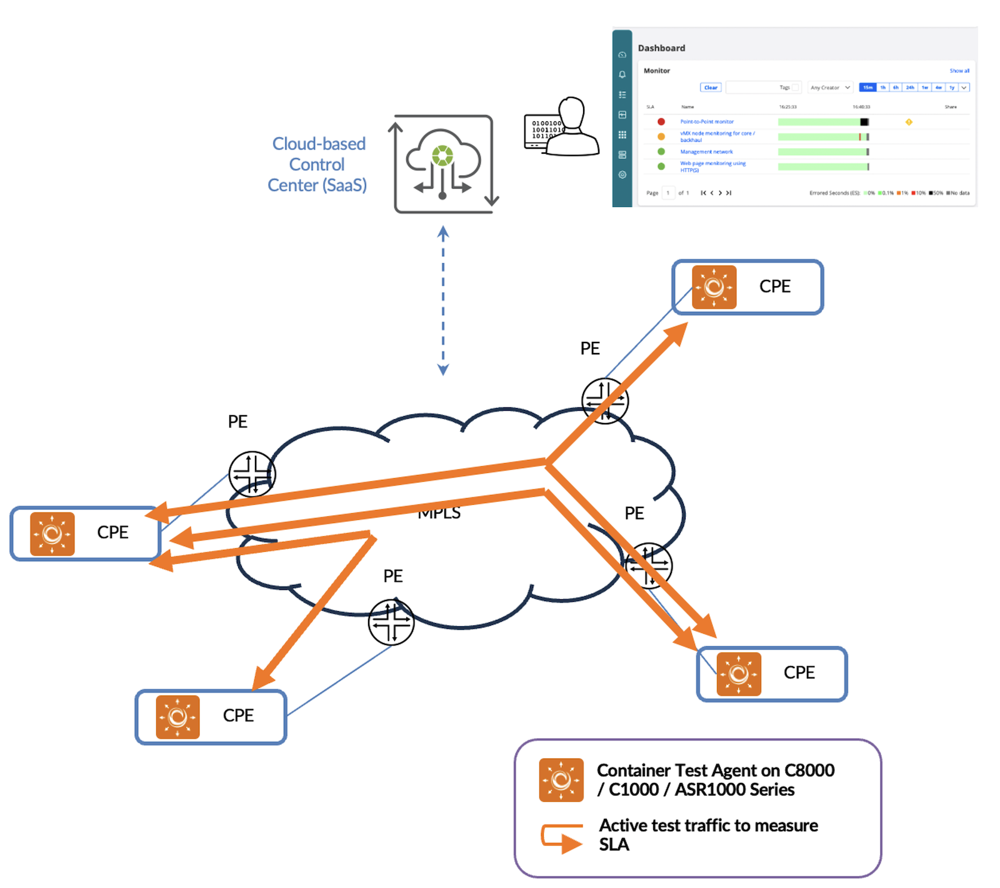
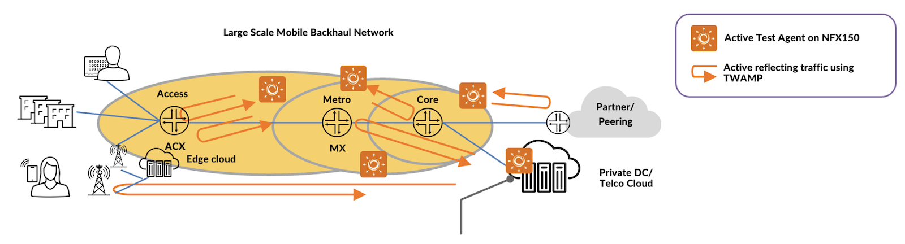
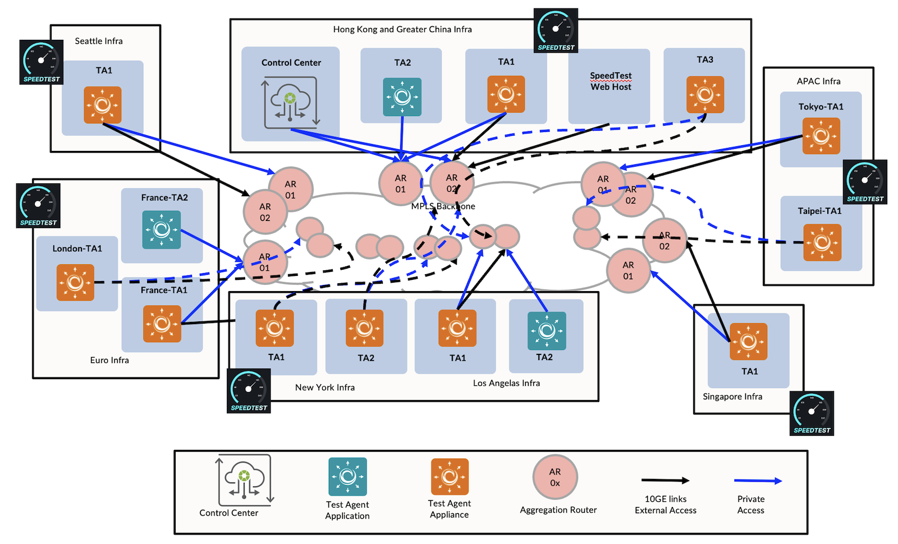
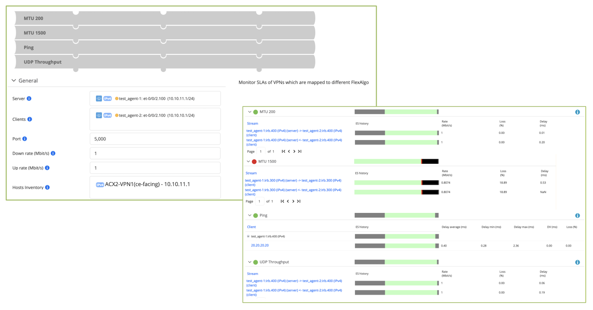

# Experience-First Networking By Routing Active Testing

**Henry Cheung - 08/07/2025**

Learn how APAC service providers are using Routing Active Testing to drive customer experience. We explore customers' motivations, Juniper's solution approach and key use cases.

## Introduction

Juniper [Routing Active Testing (formerly known as Paragon Active Assurance)](https://www.juniper.net/us/en/products/network-automation/paragon-active-assurance.html) provides programmable, active testing and monitoring for physical, hybrid, and virtual networks. Unlike passive monitors, it uses active, synthetic traffic to verify performance throughout the lifecycle of each application and service. When deployed in internet service provider (ISP) network, active testing can reduce risk and drive customer satisfaction by monitoring network quality and assurance service-level agreement (SLA). The solution is proven and widely deployed in large service provider networks. This TechPost provides insight into a few customer deployments and use cases in APAC.

## The Challenges

All service providers are committed to enhancing customer satisfaction, but the question is "how". Customer satisfaction is judged by service quality. And if we can get different metrics to monitor the services, then we can provide insight into customer satisfaction.

Service providers might explore different open-source tools to achieve this goal. Although open source software might offer flexible customization in lower cost, there are a lot of drawbacks and risk.

The obvious ones are security risk and lack of accountability.

- The open source code is publicly available, which can be good for peer review but also gives attackers insight into potential vulnerabilities.
- No single party is responsible for fixing bugs or vulnerabilities promptly.

Besides, when the test procedures are complex, e.g. in service activation test, multiple network layer and application layer measurements need to be executed in series: operator needs to maintain multiple software and each software runs different application programming interfaces (APIs) making automation more complex to implement. This creates operational overhead.

To address the above challenges, Juniper proposes the **Routing Active Testing** solution. This is a fully automated, high-performance, and flexible solution. Service providers can easily deploy a lightweight test agent in any part of the network to perform active measurement and obtain insight into service quality. Let's double-click on the deployments and use cases.

## Tier1 ISP's International MPLS Backbone - Service Activation Test

This customer manages a large MPLS backbone around the world. Before using the Active Testing solution, the operational team used iPerf to run TCP/UDP throughput tests to validate that  business VPN services meet the required SLA (Service Level Agreement). The engineer needed to bring a handheld (x86) server on-site and conduct the measurement. Operations and result capture were manual, based on text-based Command Line Interface (CLI). They needed extra effort to compile a report for the end-user.

After the service was handover to the end-user and the engineer left the customer premise, the operator lacked visibility into SLA.

When an end-user complains about service degradation, the operational team needs to dispatch an engineer to troubleshoot the problem again. Besides, some iPerf flaws and vulnerabilities also made their security teams worried about risks such as DDoS.

### Low Footprint, Flexible, and High-Performance

Juniper offered the Routing Active Testing solution to replace iPerf. In order to minimize the solution footprint, we proposed container test agents (cTAs) which run on existing Cisco CPE/PE such as C8000 / C1000 / ASR1000 series and SaaS-based Control Center (CC), hosted on Juniper Cloud. The operational team does not need to maintain extra x86 servers and compute resources to run test agents and CC. Now, when they run service activation test or troubleshoot SLA problem, the engineer can quickly spin up cTAs on CPEs and run end-to-end SLA measurement on CC remotely from network operations center (NOC).

Figure 1 depicts this deployment.

cTAs are spun up on 3rd party routers and remotely managed by cloud-based CC to run service activation tests.

The cTAs test agent installed on these 3rd party routers is lightweight yet high-performance : the maximum throughput achieved is 930Mbps on a 1GE port. A flexible solution deployed without compromising performance.

## ASEAN Mobile Operator -- TWAMP to Monitor Backhaul Network

This mobile operator operates a large mobile backhaul (MBH) network with extensive geographical coverage over 1,600km from north to south in the region.

They used traditional way to monitor the network, such as network management system (NMS), to collect device alarms and relying on SNMP to monitor protocol adjacency. It cannot reveal many details about the actual network performance, such as packet drop and latency among cell-site routers in access rings.

When failure happened in the network, the operators needed to spend a lot of time to locate the problem. This led to long Mean Time To Repair (MTTR) and impacted customer experience. While the network is growing,  a more effective way to monitor the MBH network quality is needed.

### Reduce MTTR And High Scalable

To address their pain point, we offer Routing Active Testing solution and Two-Way Active Measurement Protocol (TWAMP) to monitor the MBH network quality. Due to the size of the network, this operator required a high-scale and complete vendor-supported solution to eliminate the overhead to maintain 3rd party servers. Thus, we proposed Juniper NFX150 physical appliances to run the test agents.

Figure 2 depicts the Active Testing solution. NFX150s are deployed in different parts of the network based on provincial and geographic distribution. Over 10,000 TWAMP test sessions are running between TAs on NFXs and network devices. The measurement coverage includes telco cloud, core, metro aggregation, pre-aggregation, and access rings.

TWAMP results are visualized on CC's dashboard. When a TWAMP test stream fails, the operator can easily locate the problem and the corresponding devices. Besides, CC can raise alarm to alert the operator for any anomaly measured by TWAMP., for example, when packet drop is detected between access ring and EPC. The NOC can take remediation action to mitigate the risk of service degradation.

> Note: Routing Active Testing CC supports up to 100,000 active streams.

## Tier1 ISP In China -- Visualize Real-Time Performance Monitoring

This Tier1 ISP in China operates an international MPLS backbone across 12 countries and provides high quality business VPN services to large enterprises with stringent SLA. They had deployed JUNOS Real-Time Performance Monitoring (RPM) solution to monitor the network performance by router CLI.  However, when the network grows and carries more services, the operator had difficulties to visualize performance metrics.

To address their pain point, Active Testing TAs are deployed in multiple major locations such as Hong Kong, Singapore and London (Figure 3). TAs use NETCONF to retrieve RPM results from the nearby MX/PTX based on the geo location. The results are visualized on a user-friendly dashboard and stored in Control Center. Operator can retrieve historical data and generate SLA reports to their customer by single touch point on the dashboard.

### SLA Transparency Drives Customer Satisfaction

This operator also offers speed test portal to premium customers for experiencing service performance. In Figure 3, separate TA Appliances are deployed in a few strategic locations to run speed test server. With that, the enterprise users can validate the network performance from their branch offices to one of these test servers via the MPLS backbone. The test results are very relevant to the service performance because the speed test traffic traverses the same data path before reaching the server.

For example, an enterprise runs branch offices among Hong Kong, Singapore and New York. They can test the download/upload speed and round-trip delay between sites by running speed test from Hong Kong's branch office to the TAs in Singapore and New York.

Besides, TA Appliance is cloud-native. The solution can be flexibly scaled-out by deploying more TAs to meet the dynamic requirements. With that, the SLA becomes transparent and this helps to drive customer satisfaction.

## Looking Forward

Routing Active Testing provides an easy button for service provider to measure SLA and network performance. We have seen multiple ISP chosing this immediate solution to replace open source testing tool. Nevertheless, Active Testing can do more. The test agent supports L2 to L7 test,s such as Ethernet OAM, voice-over-IP (VoIP), and Netflix Open Connect Appliances (OCAs) speed test.

With automation and a user-friendly graphical user interface (GUI), the operator can cascade complex test procedures and integrate them into the service orchestration workflow. This further reduces operating expense (OPEX) and accelerates time to revenue.

Figure 4 illustrates multiple tests are automated and cascaded in parallel. When any of these tests fails, the operator can easily identify the problem on the dashboard.

Control Center supports Streaming API which allows operator to stream out real-time measurement data to external system via Kafka.

Some ISPs are aiming to process the data in a more customizable and meaningful way, sticky to their daily operation. They can build customized dashboards to display measurement data ingested from Streaming API.

## Conclusion

Routing Active Testing is an active test and monitoring solution for network SLA assurance. We have discussed how service providers in APAC deploy Active Testing to gain insight into service quality and network performance. The solution is very flexible to deploy, low footprint, and is highly scalable. In other words, Active Testing easily transforms any network into experience sensor to drive experience-first networking.

## Useful links

- Routing Active Testing Overview: [https://www.juniper.net/us/en/products/network-automation/paragon-active-assurance.html](https://www.juniper.net/us/en/products/network-automation/paragon-active-assurance.html)
- Routing Active Testing Documentation: [https://app.netrounds.com/static/4.4/support/overview.html](https://app.netrounds.com/static/4.4/support/overview.html)
- Routing Active Testing Streaming API Guide: [https://www.juniper.net/documentation/us/en/software/active-assurance4.4/streaming-api/index.html](https://www.juniper.net/documentation/us/en/software/active-assurance4.4/streaming-api/index.html)

## Glossary

- API: Application Programming Interface
- CC: Control Center
- CLI: Command Line Interface
- cTA: Container Test Agent
- GUI: Graphical User Interface
- ISP: Internet Service Provider
- MBH: Mobile Backhaul
- MTTR: Mean Time to Repair
- NMS: Network Management System
- NETCONF: Network Configuration Protocol
- NOC: Network Operations Center
- OAM: Operations, Administration, and Maintenance
- OCA: Open Connect Appliance
- OPEX: Operating Expense
- PAA: Paragon Active Assurance
- SaaS: Software-As-A-Service
- SLA: Service-Level Agreement
- TA: Test Agent
- TWAMP: Two-Way Active Measurement Protocol
- VoIP: Voice Over Internet Protocol
- VPN: Virtual Private Network

## Acknowledgements

Thanks to Charles Cheang, Van Cuong Le and Jeff Zhong for supporting these successful use cases.
