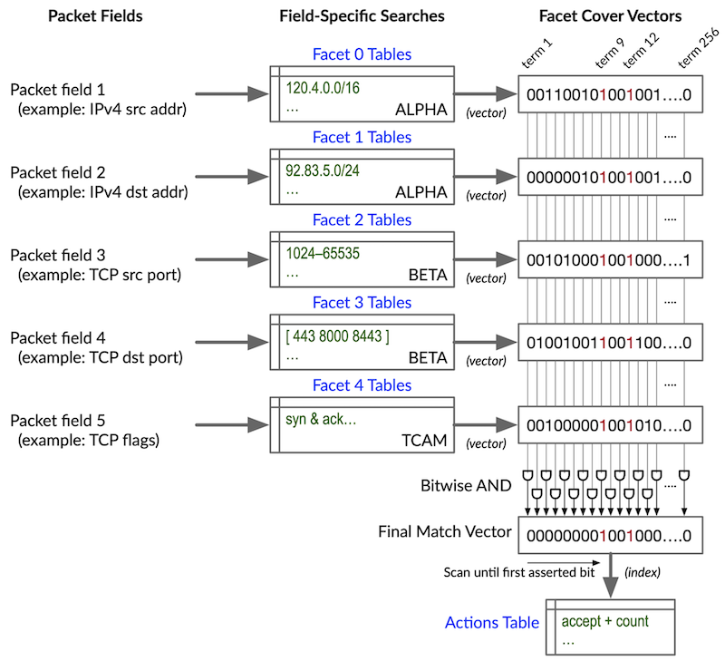
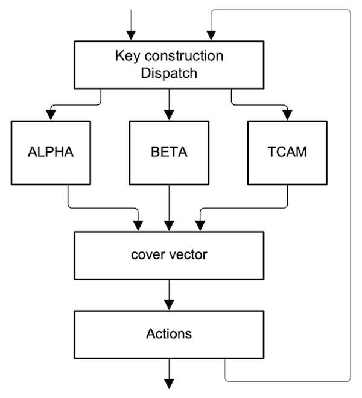
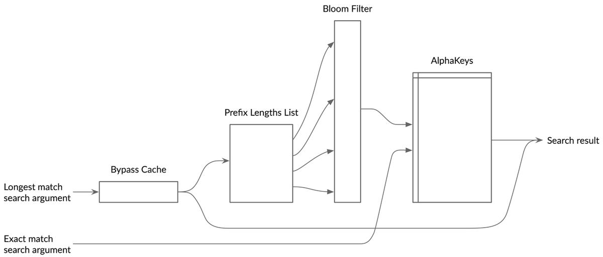
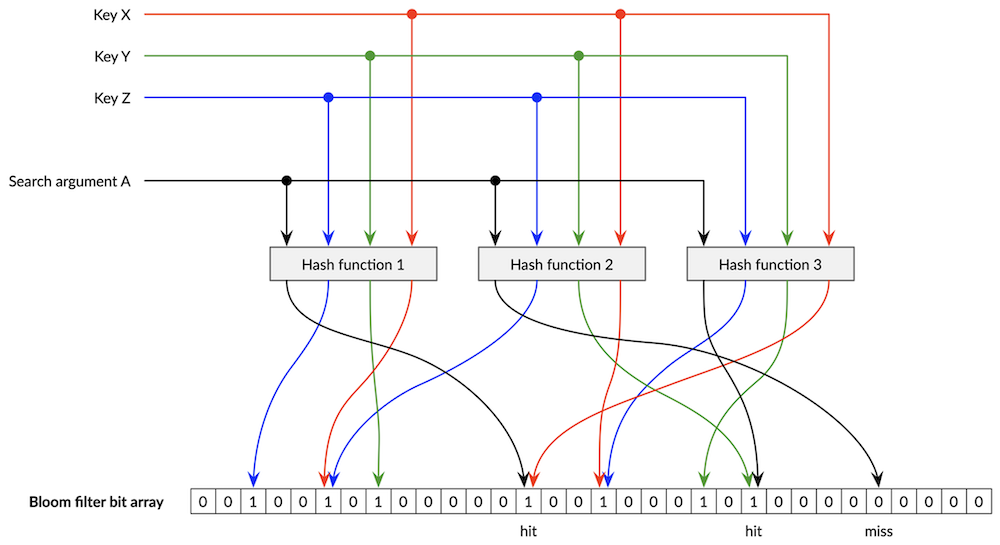
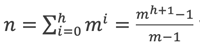

# Express 4 Filters - Foundation

**Dmitry Bugrimenko - 06/30/2022**

This series of articles provides a guide to understanding the capabilities and operating principles behind the Filter block in the Express silicon architecture, deep insights into its mighty power and efficiency, and practical application to real world networking and security problems.

In Part 1 of the series, we will examine challenges of implementing high speed feature-rich packet filters in modern hardware, then explore filter architecture in Express 4 silicon used in Juniper's PTX10001-36MR fixed form factor router as well as PTX10K-LC1201-36CD and PTX10K-LC1202-36MR line cards in PTX10004/8/16 chassis routers. The foundation and principles also apply to previous generations of PTX family routers.

Reader's familiarity with the basics of Junos OS stateless firewall filters is desirable, but not a prerequisite. For details, please refer to [Routing Policies, Firewall Filters, and Traffic Policers User Guide](https://www.juniper.net/documentation/us/en/software/junos/routing-policy/) and [Day One book Configuring Junos Policies and Firewall Filters](https://www.juniper.net/documentation/en_US/day-one-books/DO_Configuring_Junos_Policies_Filters.zip).

(Reading time: 30 minutes.)

## Filter Challenges

Filters process rules that simultaneously consider fields from packet's multiple headers along with a variety of metadata associated with the packet during its processing, then execute actions -- behaviors that are associated with a rule that matches the packet under consideration, the most fundamental action being a discard. Most if not all equipment vendors provide this capability under the generic name Access Control Lists (ACLs). If you are familiar with ACLs, map the phrase "Access Control List" to Juniper's "filter," and "Access Control Entry" (ACE) to Juniper's "filter term." In an ordinary ACL, an ACE may contain *zero or one* instance of a tuple of a *particular* kind e.g., one source IP address, one destination IP address, etc., with or without a wildcard mask which is [usually] contiguously masking least significant bits of an IP address and effectively makes it an IP prefix. Juniper's filter term, on the other hand, may contain *many instances* of a tuple of a particular kind and even point at IP prefix-lists in just a single filter term. Where Juniper's filter technology truly stands out is the *efficiency of its implementation*.

## TCAM-based Filter Implementations

Ternary content-addressable memories (TCAMs) were originally and traditionally applied to the longest-prefix match (LPM) problem in IP packet *forwarding*. Later, multi-tuple lookups were used in attempt to reduce all the packet processing to just a single step. If we care about packet attributes A, B and C when we process packets of a particular type, let's just *concatenate* A, B and C into a single, multi-tuple search argument (known as a search key) and submit it to a search within a TCAM, relying on the TCAM to return associated data that provides the required parameters for processing the packet. Let's assume that A stands in for a source address value, B for a destination address value, and C for a destination TCP or UDP port number. Not only do you have to have an entry in a TCAM for each value of A that you are concerned with, but you also must have an entry for each value of B in combination with each value of A that is of interest (that's A x B) and every value of C that's of interest (that's A x B x C). It doesn't take too many of those multiplications to reach database sizes that are wildly impractical. Processing packets in this manner suffers from *severe cross-product problems*, also known as *combinatorial explosion*. A typical ACL function can be implemented using TCAMs. The big drawback of using TCAMs is that they are typically implemented such that the multiple fields associated with the ACEs in an ACL are *simply concatenated into a very wide search key*. Although this approach to design does work, it makes the *scaling* of the number of required keys *multiplicative*.

Consider, for example, a case where IP source and destination addresses, and TCP or UDP source and destination port numbers are combined in various ways to detect and manipulate certain traffic types. If *every* combination of just 5 values for each of the 4 value types are required, then 54 = 625 TCAM keys are consumed. Juniper's implementation, on the other hand, tends to be *additive*. This same example consumes on the order of 5 x 4 = 20 keys using Juniper's implementation of filters. In real world scenarios, Juniper's filters have supported hundreds of thousands of terms (ACEs in ACL speak) with just tens of KBytes of memory, which is very efficient in terms of energy consumption, heat dissipation, and required ASIC die area.

TCAMs support keys whose bits may hold 0, 1, or "don't care" state for a key bit that matches both 0s and 1s in search arguments. (TCAMs achieve this in a clever manner, keep on reading to learn how.) This makes TCAMs relatively well suited for matching* arbitrarily masked bit* strings and IP-like address prefixes but are quite weak at encoding *arbitrary ranges of numerical values* such as TCP or UDP port numbers, especially non-consecutive or those that don't fall on a power-of-2 boundary, *combinations* of protocol's flags, etc. Consider the range of protocol ports (or any other packet's field for that matter e.g., MPLS label stack, VXLAN VNI, GRE tunnel key, ICMP type and code, DSCP/ToS, etc.) from 100 through 200, inclusive (0110_01002 through 1100_10002). This range is not as trivial as IP prefix since a *discontinuous* collection of bits is changing *within the range*. A TCAM would need 6 entries to cover this range: 0110_01XX2, 0110_1XXX2, 0111_XXXX2, 10XX_XXXX2, 1100_0XXX2, and 1100_10002.

CAMs and TCAMs typically have excellent *performance* and *latency* characteristics owing to their parallel internal operation. They have only moderate storage density, which is hurt by the large storage cell sizes, but is helped by the simplicity of the storage structure i.e., no unnecessary metadata. The biggest challenges for TCAMs are their *area* and *power* costs, especially prominent in more flexible TCAMs. To store three-state logic, two bits are required per a search key bit. The match logic in the TCAM must compare the search argument against thousands of keys *simultaneously*; not only this requires extensive logic and wiring area on a die, but also requires a lot of power to activate all those storage cells and comparison gates.

Because CAMs and TCAMs are so expensive in many respects on a per-bit basis, a database rarely stores each key's associated data within the CAM or TCAM elements. Instead, the search result from the CAM or TCAM is the *index* of the matching entry which is then used to perform an *indexed read* of an associated regular data memory. This increases the latency slightly but does not affect throughput.

### Solving TCAM's Issues

Contrary to TCAMs, *hash-based* storage has excellent performance and latency and good storage density, thereby good power and die area characteristics. Hashing is suitable for searches where the *population* density is low e.g., with IPv4 and even more so with IPv6 prefixes.

TCAMs are just one possible way of implementing an ACL function in hardware. There are many others. What all the methods have in common is that they must solve a multi-dimensional space intersection problem while there is no real limit to the number of dimensions that may be considered when performing the multi-tuple matches associated with ACLs.

One way to solve the ACL matching problem without using TCAMs is to perform a series of *individual lookups*, one for each tuple. Each lookup returns a list of the descriptions or identifiers of the *multi*-dimensional space through which the *single*-dimensional search argument passes. This is repeated for all the tuples. It is then a matter of finding the *intersection* of those lists to find the one (or more) multi-dimensional space which encompasses all the tuples. That space is associated with the highest-priority rule that uses that space in its specification.

Yet another method is to invert the problem and have each of the separate single-tuple lookups return a list of all the ACL rules that have terms that match that specific tuple. It is then a matter of finding the *intersection* of the lists of rules to find those rules that match all the tuples.

### Facets and Facet Cover Vector Algorithm

Juniper's Filter hardware utilizes the Facet Cover Vector algorithm for packet processing. This section provides an overview of how the Facet Cover Vector algorithm works. A simplified abstract view of the structure and principles of the algorithm is depicted in Figure 1.

*Facets* can be thought of as filter's search arguments. They are constructed from the packet's header fields in manners that are appropriate for the type of filter being processed. A *filter type* determines what type of traffic it can process, and combination of *types of objects* it can match against e.g., IPv4, IPv6, or MAC address, VLAN or VPN ID, packet length, TTL, etc.

Facet Cover Vector Algorithm follows these steps:

1. Perform concurrent *field-specific* searches -- an appropriate type of lookup on the relevant packet fields.
2. Obtain term cover vectors (or term vectors, for short) -- for each field, retrieve a 256-bit vector that represents *all* terms in the filter where the packet's field satisfies the terms' criteria.
3. Derive the final match vector -- bitwise AND the retrieved term vectors together to reveal those terms where the criteria for *all* relevant fields are satisfied.
4. Scan the final match vector starting from its end that corresponds to the beginning of the filter i.e., the filter's first term. The scanning is terminated at the first asserted bit (unless explicitly configured to continue, this will be discussed later); representing the first matching term in the filter.
5. The bit position in the final match vector of the asserted bit is used to fetch the action(s) from the actions table that must be executed for the current packet. The actions table is indexed by the term number of the matching term. Each record in the action table contains several fields, each field describing an action. A general outcome of these actions is modifications to the packet's metadata and instructions to other blocks in the packet processing pipeline e.g., increment of a counter, log or sample or mirror a packet, etc.

The essence of a filtering operation is the ability to consider multiple packet fields simultaneously. For example, consider the classic 5-tuple: IP source address + IP destination address + IP protocol + TCP source port + TCP destination port. It is important to note that these fields have varying lookup requirements. The IP addresses require *longest-prefix-match* (LPM) lookup whereas TCP and UDP port numbers require *arbitrary range matches*. For example, an IP address match criterion might be "112.23.0.0/16" while a TCP port number is ">1,024" (i.e., 1,025 all the way up to and including 65,535). Fortunately, prefix matching is simply a special case of arbitrary range matching. For example, 112.23.0.0/16 can also be expressed as 7017_000016 through 7017_ffff16.

Regardless of the details of the range-matching algorithm, it is sufficient to say that any specific value submitted to such a search returns a *single* index value that represents all ranges that contain that value. For example, if ranges 80--480 and 240--960 represent match criteria for two terms in a filter, then a search argument that falls into range 240--480 returns an index that represents both terms.

Because a search argument either matches or does not match the parameters of a term, only a single bit is required to indicate that a term had a match. Thus, the list of matching terms is easily expressed as a *bit vector* with each bit position representing a term in the filter. These vectors tend to be lightly populated with asserted bits; this lends the vectors to efficient run-length and pattern dictionary compression in the cover vector table (not shown in the above figure for clarity). That index is used to lookup a cover vector table that returns the bit vector describing covered (matched) terms for the given search argument range. This is the purpose of the term cover vectors.

Each matching term in a filter whose parameters match all relevant packet fields is the term whose associated action(s) must be executed. With a series of vectors (one for each parameter in the terms that make up the filter), finding those terms that match across all the parameters is a simple matter of performing a bitwise AND of the vectors; resulting in a single vector that has asserted bits that correspond to the matching terms.

There are some filter term design patterns that can be expensive to express in the facet and cover vector methods described above and can lead to an unfortunate expansion of table entries of various types e.g., direction indifference, frequent ranges and wildcards, excepts. The solution to these patterns relies upon the use of additional special cover vectors to impart specific functionality (not shown in the above figure for clarity).

The match vectors and the various special cover vectors are combined to form a final match vector that represents all of the terms whose parameters match the submitted packet. The final match vector is then scanned to determine the offset of the asserted bits, returning the term number of the matching terms. The bit position in the final match vector of this asserted bit is used to fetch the action(s) from the action table that must be executed for the current packet. Each record in the actions table contains several fields, each field describing an action.

### ASIC's Filter Block

ASIC's **Filter** block is performing multi-tuple matching against lists of rules. These rules allow longest-prefix, exact as well as arbitrary range matches on fields from multiple headers along with a broad assortment of packet's metadata. **Filter** block achieves this by using:

- ALPHA, Absolute Longest Prefix Hash Algorithm -- to resolve longest prefix match and exact match lookups on IPv4 and IPv6 prefixes, MAC addresses, and other similar field types. Facet 0 and Facet 1 implement ALPHA algorithm.
- BETA (Best Extrema Tree Algorithm) -- to resolve arbitrary range match and exact match lookups on TCP and UDP source and destination port numbers and other similar field types. Facet 2 and Facet 3 implement BETA algorithm.
- TCAM -- to perform lookups on flags, traffic class, and other similar field types. There is single facet, Facet 4 for these purposes.

### Longest & Exact Prefix Matching with ALPHA, Absolute Longest Prefix Hash Algorithm

**Filter** block uses ALPHA, Absolute Longest Prefix Hash Algorithm to resolve longest prefix match and exact match lookups on IPv4 and IPv6 prefixes (you cannot specify non-contiguous address masks in a filter term), MAC addresses and other similar field types. Remarkably, destination lookup for packet forwarding also uses the ALPHA algorithm to perform longest prefix matches. Exact match lookup is just a special case of the longest match lookup.

The existing well-known algorithms for longest prefix matching use some variant of tries such as J-Tree and/or K-Tree. One disadvantage of trie-based algorithms is that they are not very friendly to pipelined hardware implementations when it comes to performance scaling. ALPHA was designed to address the performance scaling challenges of trie-based algorithms. ALPHA is very friendly to hardware pipelining for high performance. Besides having better performance scaling than trie-based algorithms, ALPHA also has significantly better die area and power requirements than trie-based algorithms.

ALPHA is a method whereby all possible or interesting prefix lengths are tested, from longest to shortest, looking for a match. The search is conducted in a single, large table (ALPHA's key hash table, or KHT, named **AlphaKeys**) where the keys consist of masked address values (least significant bits are masked as necessary) paired with codes that indicate the prefix length and key type. The search terminates upon the first i.e., longest match.

Probing a single, large **AlphaKeys** table 128 times per IPv6 packet when the packet rate is up to 1 packet every clock cycle is impractical and detrimental to performance. Hence, several steps are taken to reduce the number of table probes:

- Lookup bypass cache
- Candidate prefix length list
- Bloom filter

First among these probe-reducing steps is a *lookup bypass* cache which is automatically filled with entries by the hardware whenever the number of clock cycles required to complete a lookup exceeds a set threshold. Typically, excessively long lookup times are the result of multiple false positives in the Bloom filter (described below). All search arguments are initially submitted to bypass cache. If a match is found, the search result is returned, and the remainder of the ALPHA search function is bypassed. Otherwise, the entirety of the ALPHA function is executed.

Further reduction of probes into the **AlphaKeys** is provided by a *prefix length candidate choosing function*. Since every filter is established in advance and usually is not subject to frequent changes as e.g., a routing table would be, it is practical to analyze the prefix lengths that are associated with each filter and create an optimized list of prefixes for each one. This function typically reduces the number of prefixes to test from 32 or 128 (for IPv4 and IPv6, respectively) to 16 or less. For best efficiency, Facet 0 (source related search keys) and Facet 1 (destination related search keys) use their separate prefix length candidate lists.

Next in line to reduce probes into **AlphaKeys** is a *Bloom filter*. Bloom filters, conceived by Burton Howard Bloom in 1970, have a useful property of quickly optimistically indicating whether a desired key exists in a table without having to probe into the table. See [https://en.wikipedia.org/wiki/Bloom_filter](https://en.wikipedia.org/wiki/Bloom_filter) for more details and further reading. A Bloom filter has constant time complexity for both adding items and asking whether they are present and requires very little space relative to the size of the items you need to store and check. It has these useful properties because it is based on hash functions.

A Bloom filter consists of a bit array where the number of bits is some sizable multiple of the number of keys in the big table. As keys are added to the big table, the same key is hashed multiple times using a *different* hash each time. These multiple hash results are used to assert bits in the Bloom filter bit array; bits that are indexed by the hash values.

For example, and for the sake of simplicity, let's say we have a Bloom filter with three hash functions. When software adds prefix a.b.c.0/24 into the **AlphaKeys**, it must also "insert" an entry into the Bloom filter. This is done by hashing a.b.c.0/24 (one of the keys X, Y, Z in Figure 4) with the three distinct hash functions, resulting in values h1, h2 and h3 respectively, and setting bits h1, h2 and h3 in the Bloom filter bit array.

When performing a lookup for IP address a.b.c.d (search argument A in Figure 4), the hardware probes all possible matching prefixes starting at a.b.c.d/32 all the way up to 0.0.0.0/0, as long as the corresponding length is present in the candidate prefix length list (see prefix length candidate choosing function above). Let's assume that /32, /24 and /16 were present in the candidate prefix length list. The hardware will probe the Bloom filter for keys a.b.c.d/32, a.b.c.0/24 and a.b.0.0/16. This is accomplished by hashing the keys using the three Bloom filter hash functions. For key a.b.c.d/32 the result will be h1', h2' and h3'. Consequently, bits h1', h2' and h3' will be examined. If* all three* are set, a probe into **AlphaKeys** will occur. In this example, as a.b.c.d/32 was not inserted into the **AlphaKeys**, it is unlikely that *all three* of those bits are set at the *same time*, as illustrated by Figure 4. (If they did happen to be set i.e., a *false positive* occurred due to Bloom filter hash collision, and subsequent probe into the **AlphaKeys** would occur but result in a miss.) For key a.b.c.0/24, its h1, h2 and h3 would be computed, and because software previously set these bits in the bit array when inserting the key into the **AlphaKeys**, a Bloom Filter "match" will result, and the key will be probed in the **AlphaKeys**, resulting in a hit. In this scenario, the **AlphaKeys** lookup for key a.b.0.0/16 will not happen, whether the corresponding Bloom filter bits are set or not, as a match has already been found for a.b.c.0/24 prefix.

Candidate search arguments (i.e., address value and prefix length) are first submitted to the Bloom filter wherein they are hashed by the same functions used to hash the Bloom filter's keys. If all the hash values for a particular search argument point to asserted bits in the Bloom filter bit array, then there is a very high likelihood that the search argument matches a key in the big **AlphaKeys** table. Because hash collisions are sooner or later inevitable, it is also possible for a Bloom filter to return a false positive result indicating that a key is present when it is, in fact, not present. However, a false negative result is never possible, that is a mathematical property of the Bloom filter. If the asserted bits in the Bloom filter bit array are sufficiently sparse because the number of bits in the bit array is large compared to the number of valid keys, hash collisions are infrequent enough so that the number of unnecessary probes into the big **AlphaKeys** table can be just a few percent which is acceptable in practice. It is not expensive to increase the depth of the Bloom filter because each entry is just a single bit. Hash collisions are further reduced by hashing the keys multiple times with different hash coefficients.

The ASIC's Bloom filter utilizes a bit array whose width is 8 times the depth of each of the **AlphaKeys** table. Hence, with an **AlphaKeys** table depth of 48K keys (single-cell entries), each Bloom filter's array is 384K bits wide.

The **AlphaKeys** table is the main hash-based table where the searched-for keys are stored. There is one instance of **AlphaKeys** for each of Facets 0 and Facet 1. Each instance of **AlphaKeys** is structured as a 4-way hash, "4-way" means that the table is divided into 4 separate, equal-sized tables and that a unique hash function is applied in parallel to the search arguments for each of the 4 tables.

The **AlphaKeys** table uses a *cuckoo hash technique* to perform rapid lookups with very high memory efficiency. See [https://en.wikipedia.org/wiki/Cuckoo_hashing](https://en.wikipedia.org/wiki/Cuckoo_hashing) for more details. The basis of the cuckoo hash lookup technique is straightforward. Several physical tables are maintained; each containing some *fraction* of all entries. Each of the tables is associated with its own hash function. During a lookup, the exact same search argument is submitted to an independent, parallel lookup in each table. Any particular key exists in exactly zero or one of the tables and only one of these parallel lookups potentially yields a successful result. The miss in the other tables is simply ignored.

The real benefit of the cuckoo hash scheme comes when it is time to add a new entry to the table. A prospective entry's key value is hashed using the hash associated with the less full of the tables. If the hash value points to an empty location in the physical memory, then the new entry is inserted into the empty location. If the entry is already occupied, that existing entry is moved to one of the other tables to make room for the new entry. The kicked-out entry is treated just like a new entry by the other table. In other words, the kicked-out entry's key value is hashed by the other table's hash and the resulting hash value is used to check the occupancy of the associated location. If the location is occupied, the process repeats.

The downside of hash-based tables is, perhaps, that their capacity is non-deterministic. Achieving very high entry density (say above 85%) can be challenging. As the population of the hash tables continues to increase, the size of the cuckoo move trees continues to increase, eventually becoming either impractically long or becoming circular i.e., a subsequent move attempts to kick out the new entry that started the cuckoo move process. At that point, the hash table is declared full. **AlphaKeys** includes a small CAM called "stash" that helps break cuckoo move loops.

Each of the **AlphaKeys**' physical memory locations pointed to by a hash result is known as a hash *bucket* and holds multiple entries known as *cells*. Packing multiple cells into each bucket greatly improves hash table space utilization.

Each of 4 x 4,096 = 16,384 buckets is 256-bit wide and stores either of these:

- 2 x 64-bit wide cells
- 3 x 32-bit wide cells

The cell width is called "nominal" because additional bits are used to make the table operational. These additional bits hold such things as the cell's 10-bit physical filter number and prefix lengths. A physical filter number is associated with a particular filter type which encodes the *type of object* being matched against and held in a cell e.g., IPv4, IPv6, or MAC address, VLAN or VPN ID, packet length, TTL, etc.

Prefix length fields in cells indicate whether the search key consists of two consecutive 64-bit cells or 2 separate 64-bit cells or 3 separate 32-bit cells in a bucket:

- The keys with prefix length /0 to /32 take one 32-bit cell
- The keys with prefix length /33 to /64 take one 64-bit cell
- The keys with prefix length /65 to /128 take two consecutive 64-bit cells

The **AlphaKeys** total capacity is equal to 48K 32-bit cells.

There are two instances of the ALPHA function in the **Filter** block, one for each of Facets 0 and Facet 1. Do not confuse an ALPHA "instance" which is essentially a key hash table, KHT instance, with an ALPHA "structure". The latter is a pair of ALPHA instances, one for each of Facet 0 and 1.

Each pair of Facets 0 & 1 (ALPHA function) and Facets 2 & 3 (BETA function, discussed below) may be swapped with one another on a per physical filter basis by the filter compiler. This swapping of source and destination values makes it possible to store destination addresses, for example, in Facet 0 (the default for source addresses) instead of Facet 1 (the default for destination addresses). Filters that are heavy in their use of, for example, destination addresses may spread their search keys across Facets 0 & 1 instead of simply overloading capacity of Facet 1 (the default for destination addresses).

### Arbitrary Range Matching with BETA, Best Extrema Tree Algorithm

**Filter** block uses BETA (Best Extrema Tree Algorithm) to resolve arbitrary range match and exact match lookups on TCP and UDP source and destination port numbers and other similar field types.

BETA is, essentially, a binary search. By crafting keys that are the endpoints (extrema) of the ranges that are of interest and using the magnitude comparisons that are fundamental to a binary search, it is easy to see how a binary search can quickly determine which defined range a search argument belongs to (i.e., falls between the endpoints, or extrema).

The BETA implementation in **Filter** is a 4-way variation on a binary search; known as a 4-ary search. Unlike a binary search where a search argument is compared against a single key at each stage making a 2-way branch decision for the next comparison, a 4-ary search compares the search argument against 3 key values to make a 4-way branch decision at each stage which reduces the latency by half.

Every node of the search tree is associated with an extrema of the set of ranges. Each node is associated with one range. A search key is compared to the node as part of the key lookup. The left branch or the right branch of the node is picked on basis of the comparison result. The 4-ary tree is level-balanced and left packed to achieve optimal performance and memory utilization.

The hardware supports search trees with up to 15 levels. (The height *h* of an *m-*ary tree does not include the root node, with a tree containing only a root node having a height of 0.)

The maximum number of nodes at level *L* in a 4-ary tree is 4L (assuming that the root is level 0). This is easy to see because at each level you spawn 4 children from each previous leaf. The fact that it is balanced tree is irrelevant. The total number of nodes in a perfect *m*-ary tree is:

which in case of a 15-level (*h *= 14) 4-ary (*m *= 4) tree it is a whopping 357 million nodes. Remember, each node represents an extrema of an arbitrary range being matched against. The height of a complete *m*-ary tree with *n* nodes is *logm* ((*m-*1).*n*). In case of a 4-ary tree, *m *= 4 and the height of a tree is *logm ((m-1).n).* The height of a 64-node 4-ary tree is 4.

Each physical filter has its own search tree instantiated in the hardware.*
*

BETA's underlying data structures are organized as 8 banks of 1,024 tree node entries each, and an entry can contain up to 3 tree nodes. Total capacity of BETA structures is therefore 24K 24-bit search keys (again, a search key is an extrema of an arbitrary range being matched against).

Details of BETA implementation are beyond the scope of this article. Suffice it to say BETA's capacity exceeds practical requirements by a very wide margin.

There are two instances of the BETA function in **Filter**, one for each of the Facets 2 and Facet 3.

Like ALPHA's Facets 0 & 1, each pair of BETA's Facets 2 & 3 can be swapped with one another on a per physical filter basis by the filter compiler. This swapping of source and destination values makes it possible to store destination port numbers, for example, in Facet 2 (the default for source ports) instead of the Facet 3 (the default for destination ports). Filters that are heavy in their use of, for example, destination port numbers may be spread their search-for keys across Facets 2 & 3 instead of simply overloading capacity of Facet 3 (the default for destination ports).

### Arbitrary Field Matching with TCAM

Commonly used packet fields like IP address, TCP port number, etc., are searched using the Facet 0 -- Facet 3. However, there are many more fields that are of interest when creating filter terms. **Filter** uses dedicated TCAM facet, Facet 4, to perform lookups on TCP flags, traffic class, and other similar field types.

A Ternary Content Addressable Memory (TCAM) is a fully associative memory that allows a "don't care" state for a bit, in addition to a 0 and a 1. A bit in a "don't care" state matches both 0s and 1s in the corresponding input bit of the search argument. The content of the TCAM is searched in parallel. If multiple entries match the search argument, the entry with the lowest address in the TCAM is returned as the result.

Each TCAM entry has an associated X and Y component. All the even entries hold the X component, and all the odd entries hold the Y *component*. For a given pair,

- X = value AND mask
- Y = NOT(value AND mask) AND mask

If an entry matches the search argument, 'X OR Y' should be all 1's and 'X AND Y' should be all 0's.

To program a bit as "masked" (i.e., a "don't care" bit), we set X=0 and Y=0. To program a bit to match 0, we set X=0 and Y=1. To program a bit to match 1, we set X=1 and Y=0.

Facet 4 TCAM has 8,192 entries (a.k.a. rows), each entry can hold either two single-width 24-bit keys or one double-width 48-bit key. A physical filter's configuration data structure defines the range of consecutive TCAM entries allocated to the filter, and whether the entries in this range are interpreted as holding 2 single-width keys or 1 double-width key, based on required facet width.

Each entry in the TCAM has a corresponding record in the TCAM *result memory* which contains the cover vector pointer. When a match is found for a given search argument, the address of the TCAM entry is used to index the TCAM result memory to retrieve the cover vector pointer, which in turn is used as index into the cover vectors table.

There is one instance of the TCAM function in the **Filter** block.

## To Be Continued

In the next part of the series, we will examine Filter block's internals, its place and function in Express 4 packet processing pipeline, scale and performance characteristics.

## Useful links

- Routing Policies, Firewall Filters, and Traffic Policers User Guide: [https://www.juniper.net/documentation/us/en/software/junos/routing-policy/](https://www.juniper.net/documentation/us/en/software/junos/routing-policy/)
- Day One book Configuring Junos Policies and Firewall Filters: [https://www.juniper.net/documentation/en_US/day-one-books/DO_Configuring_Junos_Policies_Filters.zip](https://www.juniper.net/documentation/en_US/day-one-books/DO_Configuring_Junos_Policies_Filters.zip)
- Bloom Filter Wikipedia Page: [https://en.wikipedia.org/wiki/Bloom_filter](https://en.wikipedia.org/wiki/Bloom_filter)
- Cuckoo Hashing wikipedia Page: [https://en.wikipedia.org/wiki/Cuckoo_hashing](https://en.wikipedia.org/wiki/Cuckoo_hashing)

## Glossary

- ACL: Access-List (filter)
- ACE: Access-List Entry (filter term)
- ALPHA: Absolute Longest Prefix Hash Algorithm
- BETA: Best Extrema Tree Algorithm
- KHT: ALPHA's key hash table
- LPM: Longest Prefix Match
- TCAM: Ternary content-addressable memory
