# Express 5 Overview

**Dmitry Shokarev - 03/12/2024**

Express 5 is Juniper's new ASIC for service providers and cloud networks, delivering 2x power efficiency, enhanced traffic insights, hardware-based sampling, value-added services, and supporting high-speed, high-scale routing applications including AI/ML training clusters with up to 16M IPv4/IPv6 routes and 8M counters using a sustainable chiplet-based architecture.

## Introduction

The fifth-generation ASICs in the Express family are addressing growing traffic demand seen in service provider and cloud provider deployments -- in the aggregation networks, backbones, at the peering sites, data centers, and AI/ML training clusters.

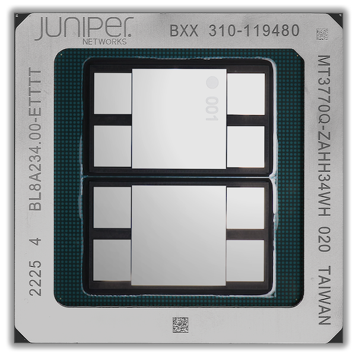

Express 5, Figure 1, enables the construction of a wide range of systems, starting from 14.4T fixed-form factor routers to high-capacity petabit routing and switching platforms, with more than 2x power efficiency gains compared to the previous generation.

The products based on Express 5 are optimized for the new high-speed 400G and 800G transceivers with 112G electrical interfaces. These transceivers offer more than 40% power consumption reduction, compared to the first generation of 56G optics counterparts.

Express 5 offers enhanced insights into the traffic flows to facilitate data-driven business decisions, engineer the traffic, and enable value-added services:

- 8M counter scale, with a multidimensional reporting capability, for example per-traffic class and destination counters
- Hardware implementation of sampling with metadata in IPFIX format

Express platforms are traditionally deployed at peering edges with extensive traffic filtering requirements. In addition to the Express unmatched filtering functionality, Express 5 enables value-added services that are based on payload matching, to identify and suppress malicious traffic based on the payload.

Express 5 is built to last -- it sets the new bar in the route scale capacity of 16M IPv4 prefixes and hundreds of thousands of overlay tunnels.

The following sections cover the technical aspects of the device.

## First Chiplet-based Networking ASIC

Express 5 ASICs are comprised of only two new dies, or chiplets: a high-capacity forwarding chip and a cell-based fabric interface / cell-switching chip. An optional external HBM memory is used for packet buffering, counter storage, and FIB expansion, Figure 2.

Chiplets are physically smaller, hence the chiplet manufacturing process is more sustainable, with less wastage and more operational ASICs coming from a wafer.

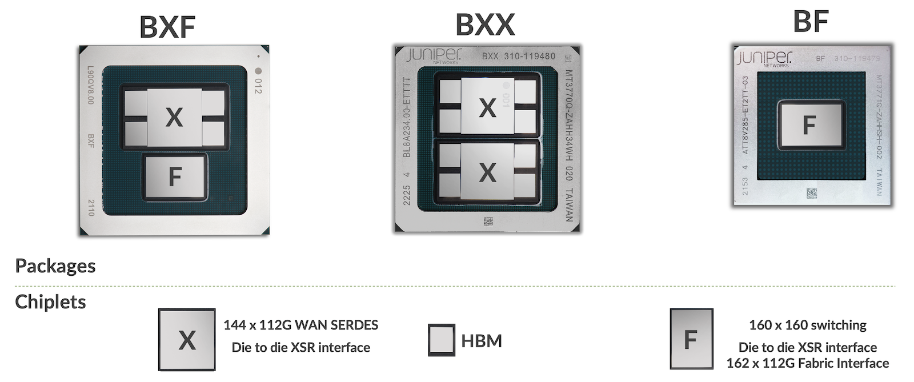

Chiplets are designed to support multiple package combinations, and three of them are selected for the first products announced in February 2024:

- BXX: 28.8T chip, the highest-radix deep-buffer ASIC to date. This package is used in fixed systems, such as the [PTX10002-36QDD router](https://www.juniper.net/us/en/products/routers/ptx-series/ptx10002-36qdd-packet-transport-router.html).
- BXF: 14.4T chip the fabric interface and external deep-buffer memory. This is a forwarding element in distributed forwarding systems, such as the [LC1301 line card](https://www.juniper.net/us/en/products/routers/ptx-series/ptx10000-line-of-packet-transport-routers-datasheet.html) for PTX10K systems which uses two of them for a total WAN capacity of 28.8T.
- BF: 16T cell-switching fabric chip, this is a fabric element in a distributed system, it interconnects forwarding elements. This chip is used in PTX10K SF5 fabrics.

More package options to support other products are in the planning phase now.

## 36 Ports for Ethernet Fabric Deployments

One of the reasons for the higher-radix 28.8T device is the adoption of Data Center fabric architectures in the WAN. These days, businesses rely on cloud-hosted applications and data, with always-on connectivity. The importance of the network availability only increases over time, and Ethernet fabrics in the WAN allow cloud and service providers to control the failure domains by using smaller building blocks. Express 5 device is a perfect building block for these fabrics: 36 x 800GE port radix of Express 5 enables configurations with 18 WAN-facing interfaces and 18 spine-facing interfaces. For example, 3-stage fabric based on the PTX10002-36QDD offers 1 petabit of the WAN forwarding capacity, Figure 3. Other configurations with even higher capacities are possible too.

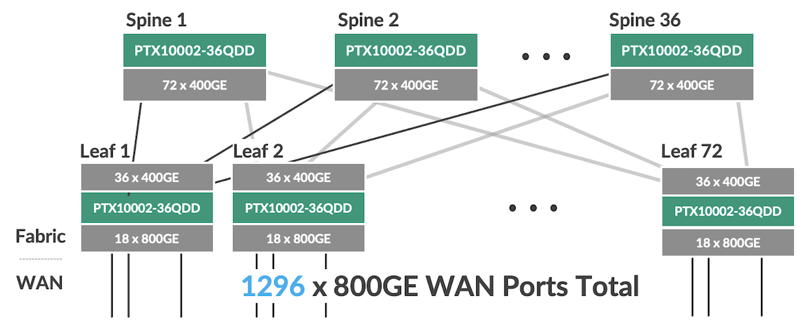

## Applications

Deep buffers and higher logical scale differentiate routing chips from the switching chips. Express 5 is a routing chip that focuses on high-speed and moderate to high-scale routing applications. Ultimately, the entire network segment between a broadband gateway, mobile packet gateway or an access router and the data center is entirely covered by the routers powered by the Express chips: aggregation, core, peering, and many of the edge roles are fully supported by Express 5.

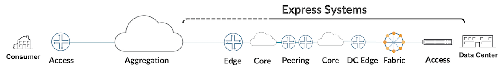

An important application of Express 5 is a high-capacity / high-radix switch in the AI/ML training cluster. For example, a 16-slot chassis with 32 x Express 5 chips offers 576 x 800GE ports. This allows us to build 36,864 x 400GE port AI/ML cluster fabric based on PTX and QFX5240 products in a 3-stage architecture.

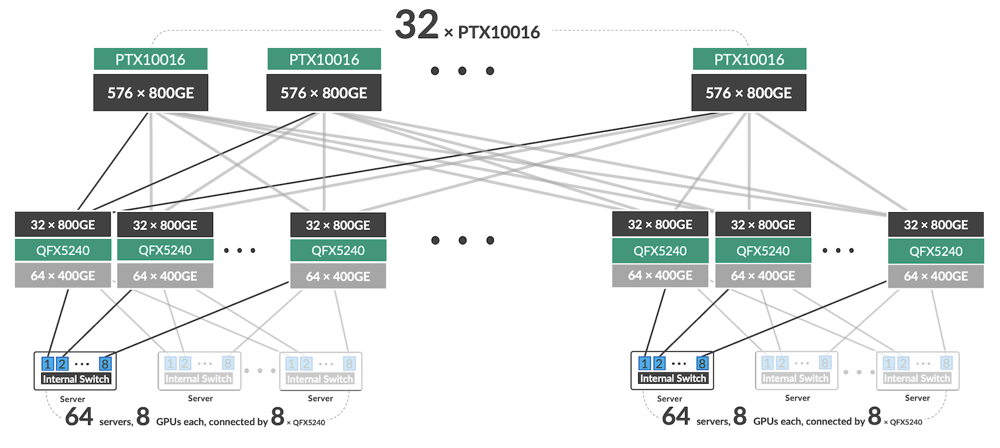

Other fabric designs are possible too, for example, eight PTX10016 systems enable the interconnect of 9,216 400GE ports in a single-stage rail-optimized fabric topology,

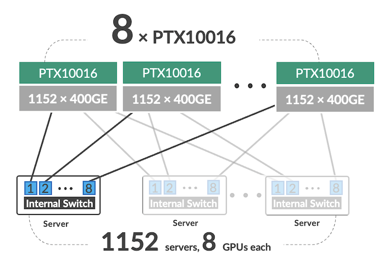

## Built to last.

General purpose CPUs are not designed to keep all application data on chip, external memories have been in computers since the early days. Likewise, Express 5 leverages external memory for demanding routing applications through the mechanism of off-chip counters and forwarding table structures expansion. The external memory can host up to 16 million IPv4 or IPv6 routes and up to 8 million counters.

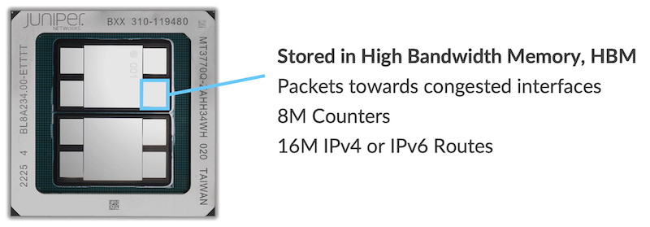

Tremendous scale brings an important systems-level advantage that is traditionally seen in Juniper platforms - the same software implementation covers a wide spectrum of applications.

There is no concept of a counter or route profile in systems based on Juniper silicon.

## Security

Juniper pioneered integrated MACSec security back in 2018. Express 5 supports MACSec on all ports at any rate, including 800GE, both port-based and VLAN-based.

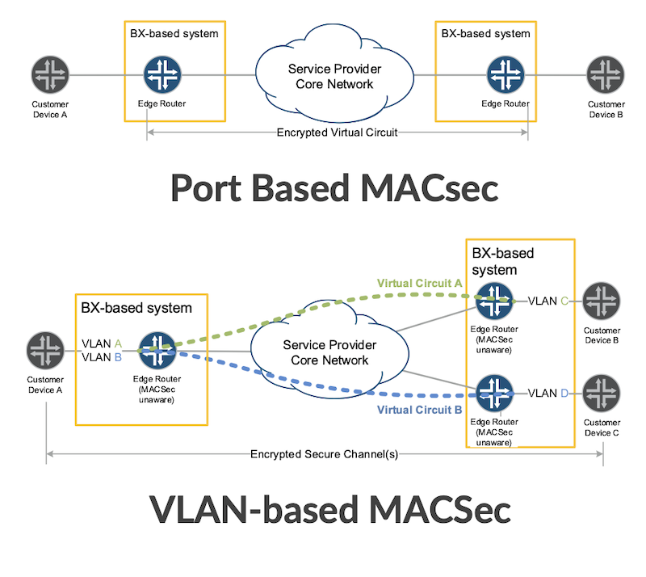

Besides encryption, Juniper silicon products focus on router, network, and application security. Filters or access control lists are a fundamental security enabler.

Juniper Express filter implementation features five lookup engines all operating in parallel. The overall width of the lookup key is 736-bit, by far exceeding current TCAM-based implementations. This ASIC design manifests itself in two user-visible system-level aspects:

- No scale impact with wider search keys. Port ranges, prefix matches, and packet length matches are independently stored; therefore, there is no multiplicative impact as in TCAM architectures. In the example shown in Figure 9, 3 prefixes and 4 ports would only occupy 3 and 4 entries in longest prefix match and range tables, and not 3 x 4 = 12 entries.
- No compromise in the lookup key selection. Systems based on Juniper silicon have no concept of pre-configured filter profiles to enable the selection of certain packet fields.

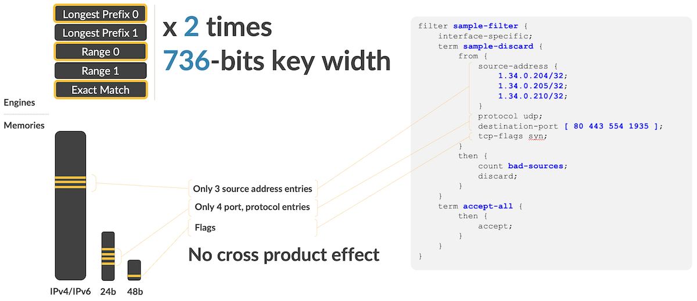

Express 5 further expands these capabilities by adding flexible offset filter key extraction logic. Filtering can now be done based on the packet payload matches. The feature is designed to mitigate the impact of distributed denial of service attacks.

## Programmability

Systems based on Express 5 support various programmability options:

- An extensive API set for routing table manipulation, both Juniper native as well as industry-standard ones such as GRIBI, and SAI.
- P4 runtime interfaces

Single-chip configuration in a 28.8T system also makes it simpler to program in a standalone device.

At a very low level, the Express packet processing pipeline is comprised of several specialized processing blocks tailored to support specific functions, such as parsing, lookup, next-hop processing, filtering, or encapsulation, Figure 7. A packet passes blocks in a pre-defined order, with an option to traverse blocks an unlimited number of times without leaving the ingress packet processor (with packet performance impact only), or through the loopback path.

The blocks are configurable, and many are programmable -- they execute microcode instructions. For example, the next-hop processor instructions include branching and procedure calls; the lookup engine supports sequencing, search argument manipulation, statistics collection, and control passing.

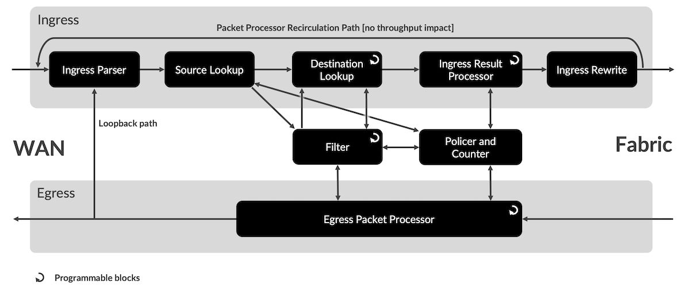

Express 5 adds new programming capabilities to the ingress and egress processing. These ASIC packet processing capabilities enable support for new data plane encapsulations, such as SRv6 which is known today, and futuristic not yet defined formats.

Two more ASIC design principles facilitate better usage of finite resources:

- Fungible memories.
- Any to any access.

The allocation of memory to packet processing blocks happens at run time, with the destination lookup engine being the only exception with its memory blocks reserved at boot time.

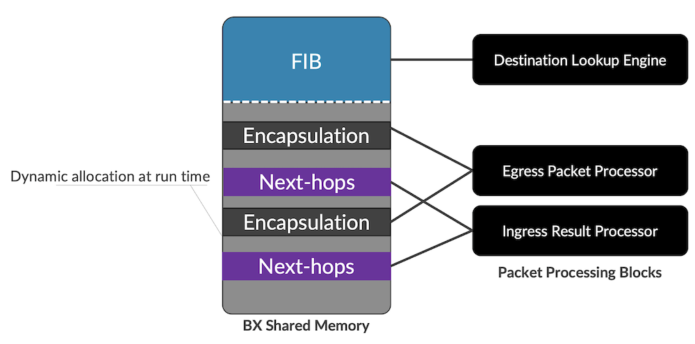

The Ingress Result Processor and Egress Packet Processor execute multiple instructions in the processing cycle, any instruction can access any memory allocated at run time to the block. One practical implication of this is that there is no limit to the number of top-level ECMP next-hops, second or third-level next-hops this architecture can support, it is only limited by the total memory capacity.

## Fabric Configurations

The Express 5 packet forwarding ASICs are supported by a complementary cell-based fabric ASIC, BF, which is used in distributed forwarding systems: PTX10004, PTX10008, and PTX10016.

Cell-based fabrics are different from Ethernet-based fabrics in a few important ways:

- Simplified operation, as there is no need to keep Ethernet MAC framers, and there is a minimal queuing subsystem in a fabric chip.
- Lower latency and jitter as switching is implemented in units of smaller size -- this also reduces buffer requirements for the packet forwarding engines connected to the cell-based fabric.

The simplification results in power consumption reduction by at least 30%, the main reason being the core logic has fewer gates.

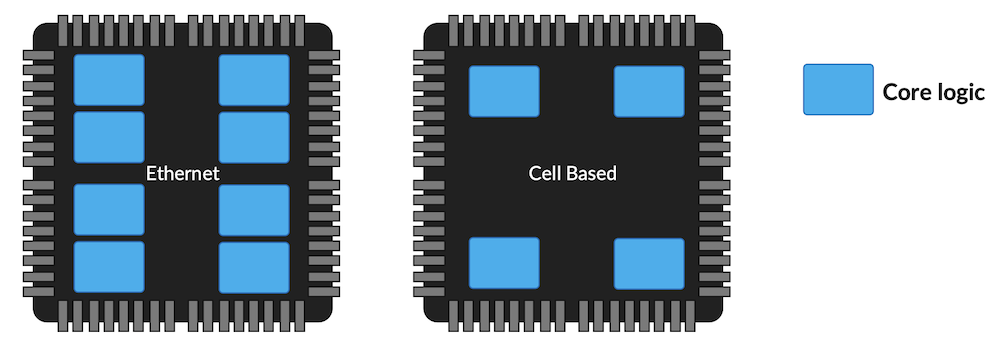

In addition to that, Juniper Express 5 proprietary cell-fabric protocol supports Juniper Reliable Transmission. Modern chassis systems have thousands of links between chips: PTX10016 has 10,368 individual links between the fabric elements and the forwarding engines.

Forward Error Correction greatly increases the reliability of transmission; however, given the number of links the system has, further improvements may only be achieved by implementing new link-layer techniques.

Juniper Reliable Transmission is such a technique: if errors are registered in the link between the fabric element and the packet forwarding element by either side, then re-transmission is requested over this link, Figure 13 illustrates the concept.

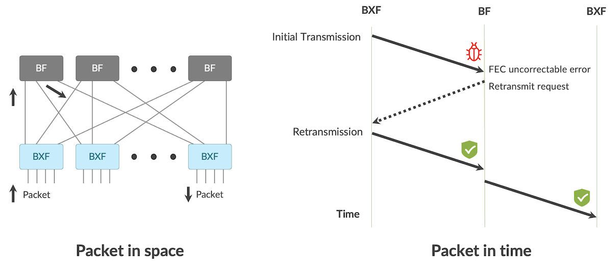

Reliable Transmission is one of the techniques to make the transmission over the chassis fabric at least 1,000x more reliable than an external interconnect.

## Traffic Visibility

Express ASICs offer unmatched traffic visibility and statistics collection options:

- Statistics collection without compromises. Any higher-level object, a label-switched path, a segment routing label entry, or even an individual route may have a counter associated with it. For example, Juniper software uses this functionality to support hundreds of thousands of label-switched paths with full statistics collection.
- An ability to look deep into the packet. Juniper systems offer the capability to mirror or filter MPLS-tunneled traffic based on encapsulated IP-traffic fields.

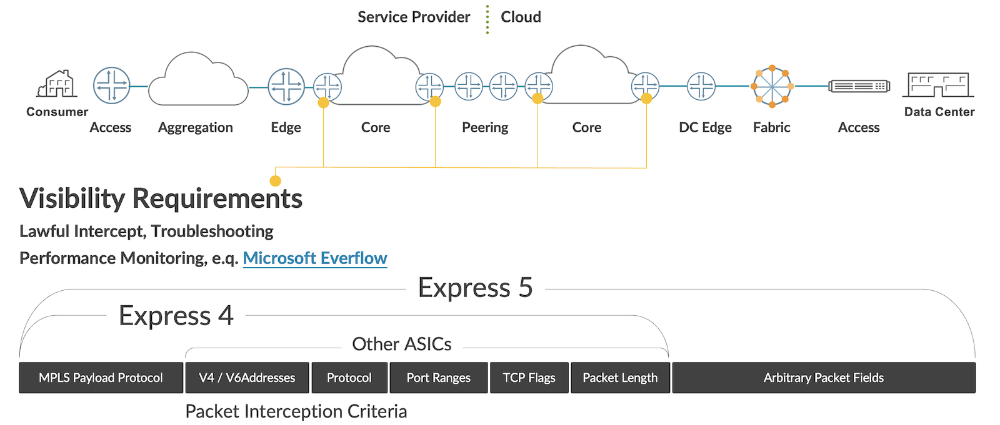

Express 5 addresses another challenge often seen in production deployments:

- Analytics tools and DDoS attack mitigation tools rely on traffic sampling with additional metadata, such as interface identifiers and autonomous system numbers.
- Metadata enrichment is typically implemented in software and a router's main CPU performance becomes a bottleneck.

Express 5 adds a zero-latency sampling capability to export packet content with metadata to the external collector in IPFIX format directly, without any software assistance.

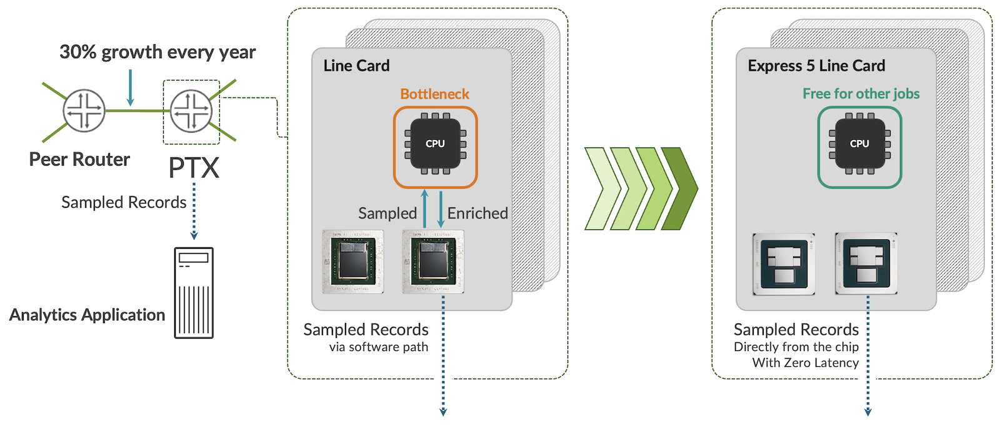

## Hierarchical Quality of Service

Express 5 enables deployments where high-speed transport routers carry auxiliary service functions, for example:

- Business L2 and L3 services are offered at the peering router.
- Core and edge router functions are enabled on the same device.
- Metro aggregation router hosts an ENNI interface towards a retail service provider.

To specifically target these use cases, Express 5 offers:

- Ingress policy enforcement options, including hierarchical policing.
- Comprehensive 4-level output queue hierarchy with:

Thousands of queues.
Guaranteed and excess rate control at queue level, logical interface level (usually a customer circuit), a group of logical interfaces (usually, a group of related customer circuits), and a port.
Five scheduling priorities.
Overhead adjustment capabilities.

Most of the functionality is configured through well-known JUNOS constructs, such as traffic control profiles, schedulers, scheduler maps. The principles of operations are retained too.

## Enabling Controller-led Network Deployments

Controller-based designs are receiving wider adoption in the WAN networks these days. The level of controller-managed tasks ranges from relatively simple path computation to full forwarding state provisioning into the router.

Controller-based designs tend to rely less on signaling between network elements. Technologies that minimize the number of touchpoints in a network start to proliferate. The most prominent one is segment routing, the path through the network is chosen by the edge device and the rest of the network may have no state at all.
An interesting and non-obvious consequence of segment routing is that while routing table scale requirements to the transit elements reduce, routers that originate paths in a segment-routed network keep much more data in the forwarding path: the entire network topology may need to be encoded in the encapsulation database. Figure 15 shows the reduction of the state (number of LSPs or routes) in the SR-TE network core, but the increase in the SR-TE forwarding data structure size (path specification) at the originator node. The increase can be as high as 2-5x times compared to non-segment routing designs. Express 5 fully addresses this change in requirements.

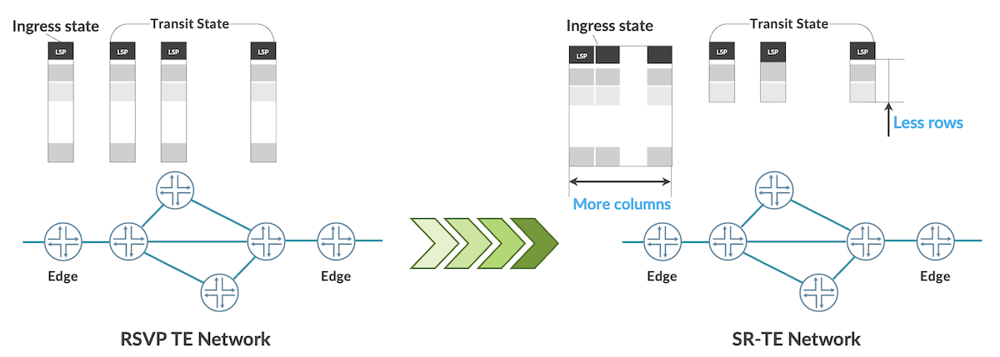

Segment Routing enables controller-led designs with a single touchpoint at the edge element and minimal forwarding state in transit for unicast traffic. Similarly, multicast traffic transport is enabled by Bit Index Explicit Replication (BIER), Figure 16 demonstrates the BIER replication principle.

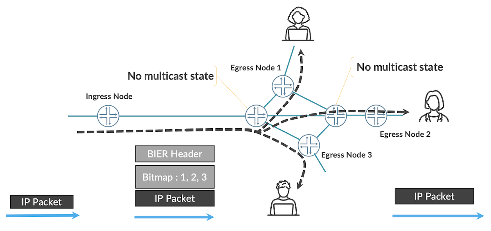

BIER is fully supported by Express 5.

## Summary

Express 5 addresses the latest trends in network design and operation: controller-led networks, ethernet fabric designs, programmable pipeline, security, and traffic visibility.
The ASICs leverage 112G I/O to bring operational efficiencies, such as power consumption reduction, and the density increase.

Express 5 brings chiplet technology innovation to support single-chip Ethernet-only systems and multi-chip fabric-based systems without compromises on both sides. Chiplet design also makes manufacturing process sustainable -- more silicon wafer material is used in the product and less is discarded due to defects.

This ASIC is the crystallization of Juniper's 26-year expertise in developing ASICs, platforms, and software that supports the world's most critical networks today.

## Useful links

- 1. Hot Chips 34, 2022, "Juniper's Express 5: A 28.8Tbps Network Routing ASIC and Variations", Chang-Hong Wu, [https://hc34.hotchips.org/assets/program/conference/day2/Network%20and%20Switches/HC2022.Juniper.ChangHong_Wu.v03.pdf](https://hc34.hotchips.org/assets/program/conference/day2/Network%20and%20Switches/HC2022.Juniper.ChangHong_Wu.v03.pdf).
- 2. PTX10002-36QDD Packet Transport Router datasheet, [https://www.juniper.net/us/en/products/routers/ptx-series/ptx10002-36qdd-packet-transport-router.html](https://www.juniper.net/us/en/products/routers/ptx-series/ptx10002-36qdd-packet-transport-router.html)
- 3. PTX10K Line Card datasheet, [https://www.juniper.net/us/en/products/routers/ptx-series/ptx10000-line-of-packet-transport-routers-datasheet.html](https://www.juniper.net/us/en/products/routers/ptx-series/ptx10000-line-of-packet-transport-routers-datasheet.html).
- 4. Packet-Level Telemetry in Large Datacenter Networks, [https://www.microsoft.com/en-us/research/publication/packet-level-telemetry-in-large-datacenter-networks/](https://www.microsoft.com/en-us/research/publication/packet-level-telemetry-in-large-datacenter-networks/).

## Glossary

- AI/ML: Artificial Intelligence Machine Learning
- ASIC: Application Specific Integrated Circuits
- BIER: Bit-Index Explicit Replication
- CPU: Central Processor Unit
- ENNI: External Network to Network Interface
- FIB: Forwarding Information Base
- GRIBI: gRPC Routing Information Base Interface
- HBM: High-Bandwidth Memory
- IPFIX: IP Flow Information Export
- LSP: Label Switched Paths
- MACsec: Media Access Control Security
- SAI: Switch Abstraction Interface
- SR-TE: Segment Routing Traffic Engineering
- TCAM: Ternary Content-Addressable Memory
