# Fast Lookup Tuple: an Innovative Filtering Feature

**David Roy - 09/02/2024**

An innovative filtering solution for IPv4 traffic on MX Series, developed to handle five tuples matching criteria at scale.

The MX platform is one of the most powerful routers on the market for packet filtering. MX offers a comprehensive set of tools for packet manipulation, classification, filtering, policing, and redirection. This article will introduce an innovative filtering solution for IPv4 traffic on MX. This feature was introduced in Junos 24.2R1 and is called **fast-lookup-tuple** (FLT).

In the first part of this article, we will describe how to configure this new filtering feature and share some scaling figures. The second part will discuss typical use cases for this feature.

## Fast-Lookup-Tuple in Detail

### Configuration

It is important to note that this new feature, **fast-lookup-tuple**, should be distinct from the existing feature, **fast-lookup-filter**. Fast-lookup-filter feature enables us to accelerate the search process (match conditions) by offloading tasks to the hardware-accelerated filter block (FLT block) available on all recent MPCs (starting from the XL chipset in Trio 3). The FLT block can significantly enhance the performance of filtering operations, particularly for large filters comprising thousands of terms. A discussion of the FLT block is beyond the scope of this article, though we will share some scaling figures about it later in this article. For further information, please refer to [1] [https://www.juniper.net/documentation/us/en/software/junos/cli-reference/topics/ref/statement/firewall-fast-lookup-filter.html](https://www.juniper.net/documentation/us/en/software/junos/cli-reference/topics/ref/statement/firewall-fast-lookup-filter.html).

Moving back to our new feature. **Fast-lookup-tuple** filters are managed directly by the ASIC, in the same way as standard filters.

These standard filters are also known as "DMEM filters" because the filter's program is stored in DMEM memory, a specific memory partition of the external ASIC memory, mostly HBM memory on recent TRIO generations (TRIO 5 and 6).

The fast-lookup-tuple feature has been developed to handle five tuples matching criteria at scale. The five tuples in question are:

- source IP address,
- destination IP address,
- source port,
- destination port,
- and protocol field.

Before the implementation of the fast-lookup-tuple feature, these five fields could be matched using either:

- A standard filter (managed by the ASIC's microcode). Please refer to the sample configuration below. In the event of worst-case scenarios, such as thousands of terms and a small packet size, this solution could potentially face traffic penalties. To overcome this issue, the FLT block was introduced several years ago.

```
[edit firewall family inet filter SIMPLE-5-TUPLES]
bob@mx304# show 
term 1 {
    from {
        source-address {
            10.1.1.1/32;
        }
        destination-address {
            172.16.1.1/32;
        }
        protocol tcp;
        source-port 1234;
        destination-port 443;
    }
    then {
        count drops;
        discard;
    }
}
```

- The "fast-lookup-filter" using the FLT block offloads "packet matching" processing to hardware, improving performance in worst-case scenarios. However, the current sizing of the YT ASIC's (Trio 6) FLT block is a maximum of 8,000 terms per filter, sufficient for most use cases. Simply add the fast-lookup-filter on your filter to leverage the FLT block acceleration.

```
[edit firewall family inet filter SIMPLE-5-TUPLES]
bob@mx304# show 
fast-lookup-filter;
term 1 {
    from {
        source-address {
            10.1.1.1/32;
        }
        destination-address {
            172.16.1.1/32;
        }
        protocol tcp;
        source-port 1234;
        destination-port 443;
    }
    then {
        count drops;
        discard;
    }
}
```

Please take a moment to analyze the figure 1 below:

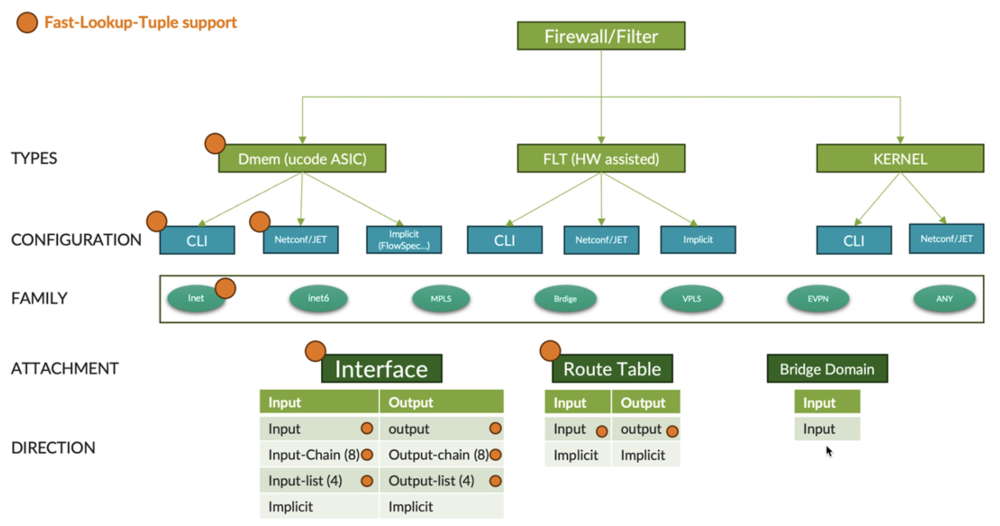

As you can see, filtering is a broad topic on MX. Figure 1 illustrates the various filter types, their respective families, attachment points, and directions. This article will not delve into the full range of filter functions, as that would necessitate a comprehensive book. Instead, we will focus on the fast-lookup-tuple knob and its current supported features, indicated by orange circles. At the time of writing, the fast-lookup-tuple functionality is only supported for the IPv4 family. Such a filter can be configured manually or via an external API. We currently support the Netconf API and the JET API. Figure 1 shows that the functionality supports the same direction and attachment characteristics as a standard DMEM filter. A fast-lookup-tuple filter can be attached to a dedicated interface as a single filter, a filter chain, or a list of filters in both directions. The filter can also be applied globally at the PFE level using a Forwarding Table Filter (FTF).

Fast-lookup-tuple is fairly easy to configure, either directly embedded in a filter's term configuration or using a new prefix list type. The code below shows the first way to configure it (fully embedded in the filter configuration):

```
[edit firewall family inet filter FAST-LOOKUP-TUPLE-FILTER]
bob@mx304# show 
term 1 {
    from {
        fast-lookup-tuple {
            113.13.155.46:160.108.17.73:6:30880:19708;
            173.156.234.0:67.159.218.146:17:63131:58908;
            17.30.62.173:79.210.62.255:17:5489:63829;
        }
    }
    then {
        count TERM1-CPT;
        discard;
    }
}
term 2 {
    from {
        fast-lookup-tuple {
            157.198.226.119:49.51.134.39:17:52480:14070;
        }
    }
    then {
        next-ip 172.172.0.2/32;
    }
term end {
    then accept;
}
```

Each fast-lookup-tuple entry describes a "unique flow" that matches the 5-tuple in this order:

```
<destination-address>:<source-address>:<proto>:<src-port>:<dest-port>
```

The second way to configure fast-lookup-tuple entries is to use the new policy-options knob: **fast-lookup-tuple-list**. At the policy-options level, you can now configure fast-lookup-tuple-list just like any standard IP prefix list and then reference it in your filter configuration.

The code below illustrates this second way of configuring fast-lookup-tuple entries:

```
[edit policy-options]
bob@mx304# show
fast-lookup-tuple-list FLOWS_TO_BLOCK {
    113.13.155.46:160.108.17.73:6:30880:19708;
    17.30.62.173:79.210.62.255:17:5489:63829;
    173.156.234.0:67.159.218.146:17:63131:58908;
}

[edit firewall family inet filter FAST-LOOKUP-TUPLE-FILTER]
bob@mx304# show 
term 1 {
    from {
        fast-lookup-tuple-list {
            FLOWS_TO_BLOCK;
        }
    }
    then {
        count TERM1-CPT;
        discard;
    }
}
term 2 {
    from {
        fast-lookup-tuple {
            157.198.226.119:49.51.134.39:17:52480:14070;
        }
    }
    then {
        next-ip 172.172.0.2/32;
    }
}
term end {
    then accept;
}
```

As observed above, we can use both configuration models in a single filter. It's also important to mention that all actions are supported with fast-lookup tuple match entries.

This feature was first designed for some particular use cases, which will be discussed further, so there are some limitations (the feature will be improved in future releases). Having said that, let's have a look at the current limitations listed below:

- Only the inet family is supported.
- All tuples must be defined.
- No wildcard, range, list, or netmask is supported. As mentioned above, each fast-lookup-tuple term matches a 5-tuple flow.
- You cannot combine classical match criteria and fast-lookup-tuple match in the same term or filter. Only a "last term" with no matches is allowed (see "end" term above).
- Only filters with fast-lookup-tuple terms are allowed in a filter list (input-list or output-list).
- You cannot combine a standard filter with a term having a next-ip or a next interface terminating action followed by an FTF (Forwarding Table Filter) using fast-lookup-tuple entries.

### Scaling Figures and Implementation Details

After reading the first part, the question that might come to mind is: "Why?"

Indeed, why do we need another way to match/filter 5-tuple flows? We already have standard filters. If we need better performance at scale (thousands of entries), we have the FLT block, which allows us to offload the 5-tuples matching to accelerated hardware.

Ok, but what if I want more than "thousands" of entries? If I wish to tens of thousands or even more, hundreds of thousands of 5-tuple entries. As mentioned above, the FLT block is currently limited to 8K terms per filter. We still have a standard DMEM filter on which we can configure up to 256K terms per filter, but with such a huge filter, we may face some traffic penalty with high throughput flows (close to linerate).

The chart below provides the current scaling figures for the standard (DMEM) and FLT filter on Trio 6 (codename YT):

|  | Filters stored in FLT Block | Filter stored in DMEM |
|:--|:--|:--|
| Number of filters | 4K (filters made of 255 terms - if the filter has more than 255 terms, it will be split in Nx255 terms filters - so big filters consume extra entries) | 256K |
| Number of terms per filter | Up to 8K | 256K |
| Total terms | 64K | 512K |
| Prefixes | 192K for IPv464-128K for IPv6 (depends on mask length) | 1M for IPv4 and 512K for IPv6 |
| Ranges (proto/ports) | 48K | N/A (no real limit) |
| Policers | N/A (see DMEM) | 256K |
| Counters |  | 512K |

In this context, we have developed the fast-lookup-tuple, which can support up to 256K 5-tuple entries with no (or almost no) traffic impact even at very high throughput (such as we may encounter in a massive DDOS attack). **This feature is supported on all TRIO platforms.**

The five-lookup-tuple also provides an easy way to limit the number of configuration lines, speeding up commit time. Configuring a 5-tuple entry with the new fast-lookup-tuple knob reduces the configuration size by 70% compared to the standard approach. For example, committing a filter with 256k fast-lookup-tuple entries takes about 1 minute and 10 seconds. The hardware installation time for this huge filter is about 30 seconds.

As for the data plane performance of such a filter, there is no traffic impact in most cases, even for packets matching the last term (the 256,000th term). We designed the solution so there would be no differences between the first and last terms. In other words, the time it takes to find the matching term is independent of the number of entries.

### Implementation

How did we achieve this?

On Junos we have a particular data structure called "Ktree". Ktree is Juniper's implementation of a RADIX tree [2] [https://en.wikipedia.org/wiki/Radix_tree](https://en.wikipedia.org/wiki/Radix_tree). This implementation consists of several proprietary enhancements (our magic sauce). Ktree is used for many purposes on TRIO: route lookup, MPLS lookup, filtering, etc.

Ktree can do LPM (Longest Prefix Match), mainly for IPv4 or IPv6 lookups, but it can also be used for exact match lookups, such as a list of MPLS label values or, in our case, a list of 5-tuple entries.

Let's illustrate this with a simple test on an MX304 with Junos 24.2R1. Figure 3 depicts the topology.

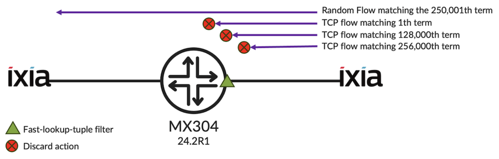

### Testing 256k Terms

First, we create a huge filter named FWF-5TUPLE with 256 001 terms -- 256K terms matching a single 5-tuple entry each, and a last term that will accept anything. All the 5-tuple entries have the same action: a counter + a discard action. We apply this filter on one LAG interface in the "ingress" direction.

```
bob@mx304> show configuration firewall family inet filter FWF-5TUPLE   term 1 {
    from {
        fast-lookup-tuple {
            78.34.225.143:166.182.229.2:6:61990:26459;
        }
    }
    then {
        count cpt-1;
        discard;
    }
}
term 2 {
    from {
        fast-lookup-tuple {
            17.30.62.173:79.210.62.255:17:5489:63829;
        }
    }
    then {
        count cpt-2;
        discard;
    }
}

 - (output truncated) - 

term END {
    then {
        count others;
        accept;
    }
}
```

Let's verify the number of terms:

```
{master}[edit]
bob@mx304# show firewall family inet filter FWF-5TUPLE | match term | count    
Count: 256001 lines
```

Just before committing the configuration below, we create 4 IXIA flows: the packets distribution selected is "TCP IMIX", and the total throughput represents 99% of the port linerate (in this simple test, we use a 100G port)

- The 1st flow will match the first term of the FWF-5TUPLE filter - 20Gbps
- The 2nd flow will match the 128,000th term of the FWF-5TUPLE filter - 18Gbps
- The 3rd flow will match the 256,000th term of the FWF-5TUPLE filter - 16Gbps
- And a random flow matching the last and 250,001st term of the FWF-5TUPLE filter - 46Gbps

All streams are well forwarded from the 'right' port to the 'left' port, as can be seen in the graph below:

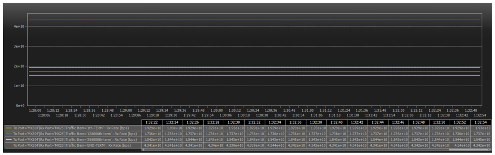

Let's commit our router's configuration and recheck the IXIA graph. A few seconds after the commit, the giant filter is programmed into the hardware and filters our 3 TCP flows. As you can see, there is no difference between the flows, regardless of whether the first or last term handles them. You may notice that the random flow handled by the last term - the 256001st term - is not affected and is still forwarded well.

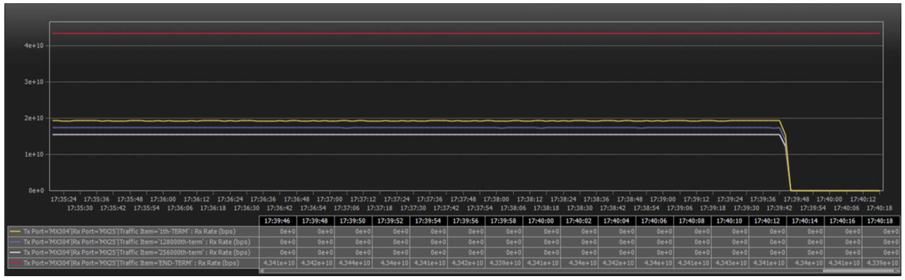

### Impact on Memory

What about the memory footprint of such a filter?

Let's analyze the state data collected by streaming telemetry. As you can see below, the master RE's memory increased slightly (~1%), mainly due to the extra memory consumed by the **dfwd** process (responsible for managing the firewall filters). On the linecard, we see that the FPC's heap memory has increased by 4%: not much for such a big filter.

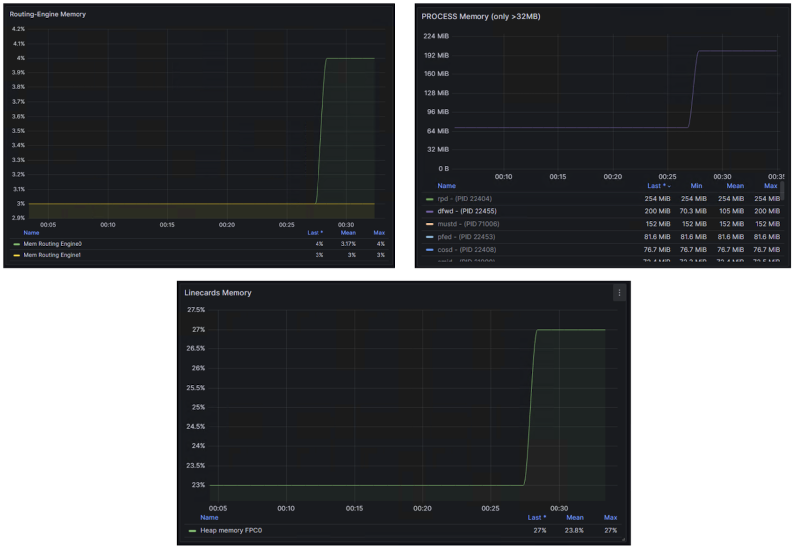

We can retrieve similar info by issuing, before and after the commit, the following CLI command:

```
 - -<before the commit> - -

{master}[edit]
bob@mx304> show system resource-monitor fpc slot 0     
FPC Resource Usage Summary

Slot #         % Heap Free        RTT      Average RTT
     0             76

                 PFE #      % ENCAP mem Free      % NH mem Free      % FW mem Free         
                    0                                 81                 99
                    1                                 81                 99
                    2                                 81                 99
                    3                                 81                 99    

 - -<after the commit> - -

{master}[edit]
bob@mx304> show system resource-monitor fpc slot 0    
FPC Resource Usage Summary

Slot #         % Heap Free        RTT      Average RTT
     0             72

                 PFE #      % ENCAP mem Free      % NH mem Free      % FW mem Free         
                    0                                 78                 84
                    1                                 78                 84
                    2                                 78                 84
                    3                                 78                 84
```

The command gives more details, especially about the memory partition that stores the filter program in the ASIC memory (HBM). You may notice that our MX304 linecard has 4 PFE. This chassis is equipped with 2 LMICs, each LMIC has a single YT (Trio 6) ASIC, and each ASIC is made up of 2 hardware "slices", which we call PFE. The filter program takes about 15% of the allocated Firewall Filter memory.

## Which Use-Cases?

The primary goal in developing the fast-lookup-tuple feature was to create an integrated security solution around the MX10k (including the MX30x) and the vSRX. The solution would leverage the new fast-lookup-tuple feature, the Juniper Extension Toolkit (JET) API, TRIO's filtering capabilities, and the vSRX's security policy framework. But we can imagine many other use cases with this fast-lookup-tuple innovation.

### vFirewall Offloading Sessions Solution

During an internal discussion, one question was ask: Could we offload the "flow's sessions" cache from the vSRX to the MX to take advantage of the throughput capacity of the MX by keeping the security intelligence in the vSRX? This answer was "yes," and several months later, we shipped the fast-lookup-tuple feature. The initial concept is illustrated below:

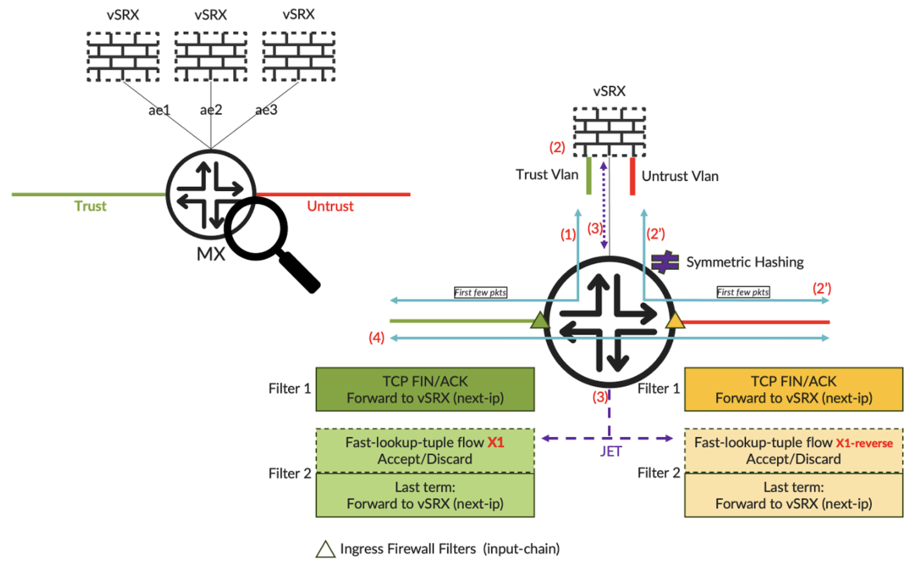

This illustration only shows "a concept" (although all the technologies are available as of now). We'll give a brief explanation below, but please note that future articles will provide more detailed information on these specific use cases..

The different steps of the process:

1. Redirect the initial packets to a cluster of vSRXs. Note that we'll also be using the latest development of our Symmetrical Load Balancing feature on MX to guarantee that the same vSRX will handle inbound and outbound packets of a given flow - see [3] [https://juniper.github.io/techposts/junos-symmetrical-load-balancing/article](https://juniper.github.io/techposts/junos-symmetrical-load-balancing/article) for more details.
2. Process the first packets using the vSRX security policies. Identify the flow (5-tuple), apply the actions, and forward the packets back to their destination through the MX. In parallel, the vSRX will program the 5-tuple entry on the MX.
3. The JET API is used to program the identified flow as a fast-lookup-tuple entry and its associated action in the MX hardware. For more details on JET, see [4] [https://www.juniper.net/documentation/us/en/software/junos/jet-api/topics/concept/jet-apis.html.](https://www.juniper.net/documentation/us/en/software/junos/jet-api/topics/concept/jet-apis.html.)
4. Once the 5-tuple entry is installed in the MX, all subsequent packets will bypass the firewall and be forwarded only by the MX. We keep passing certain TCP packets (with FIN&ACK) through the vSRX to detect flow closure and clean the MX entry. Periodically, the vSRX could monitor the statistics of the fast-lookup tuple entries, again thanks to the JET API, to detect zombie flows and trigger their cleaning.

This article does not explain the JET API in detail but notes that the JET firewall API has been well-updated in 24.2R1 to allow the creation/deletion of fast-lookup-tuple entries via JET. Let's have a look at [5] [https://github.com/Juniper/junos-extension-toolkit/blob/master/24.2/24.2R1.17/2/jnx_firewall_service.proto](https://github.com/Juniper/junos-extension-toolkit/blob/master/24.2/24.2R1.17/2/jnx_firewall_service.proto), which is the protobuf file definition of the firewall filter API (you can look for the keyword "MatchFiveTupleExact"). In a nutshell, JET is a secure, simple, and powerful API that interacts with the control and management plane. In a filtering context, JET can program and update filters at different levels of the forwarding path. The following figure shows where you can deploy filters with JET, and we take the opportunity to remind you of the filtering order and the other protocols/APIs, such as the CLI, Netconf, and FlowSpec, that can interact with the Junos filtering toolkit.

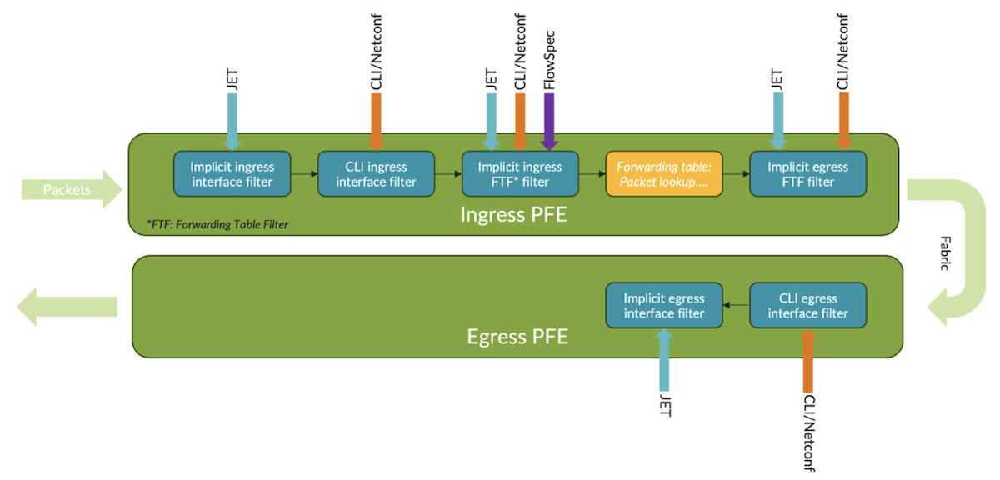

I'm sure you're like me; you often prefer examples for better understanding. No worries, I have developed a small Python script that will allow you to see how to remotely program fast-lookup-entry on an MX using the JET framework. This simple how-to is available on my Github repository - see here [6] [https://github.com/door7302/fast-lookup-tuple-samples/tree/main/jet](https://github.com/door7302/fast-lookup-tuple-samples/tree/main/jet):

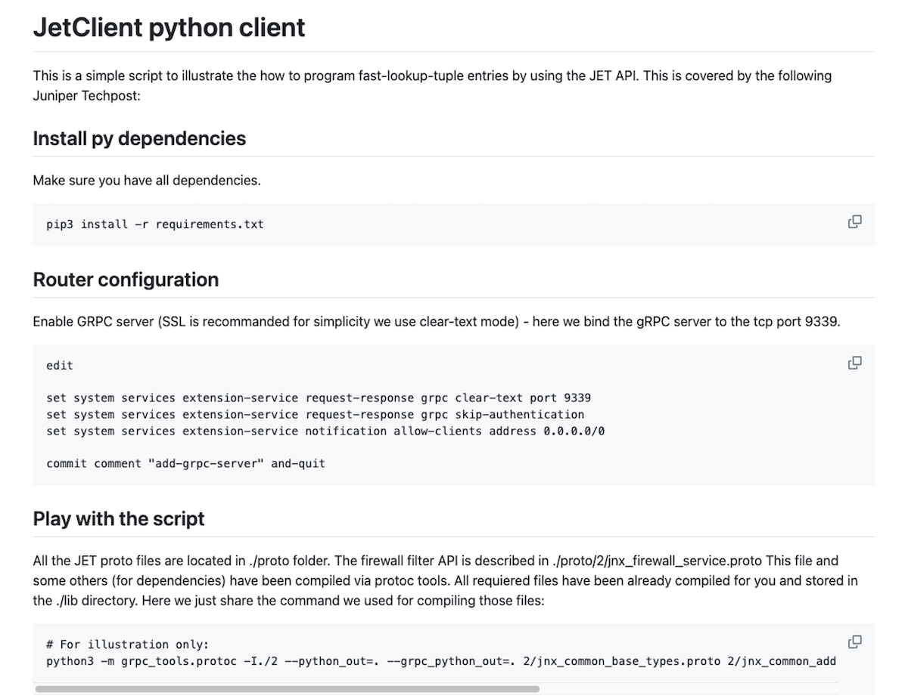

### A simple 5-tuple mitigation solution

The second use case uses, of course, the new fast-lookup-tuple feature and the Junos automation toolkit. Here below, we will combine three features:

- The fast-lookup-tuple feature
- The Netconf protocol
- The Ephemeral DataBase

We won't discuss Netconf, the well-known RPC protocol automation. Instead, let's take a short break to present the Ephemeral DB concept, which is less popular but powerful for some specific use cases. Our public documentation is also available here [7] [https://www.juniper.net/documentation/us/en/software/junos/junos-xml-protocol/topics/concept/ephemeral-configuration-database-overview.html](https://www.juniper.net/documentation/us/en/software/junos/junos-xml-protocol/topics/concept/ephemeral-configuration-database-overview.html).

The concept is depicted below:

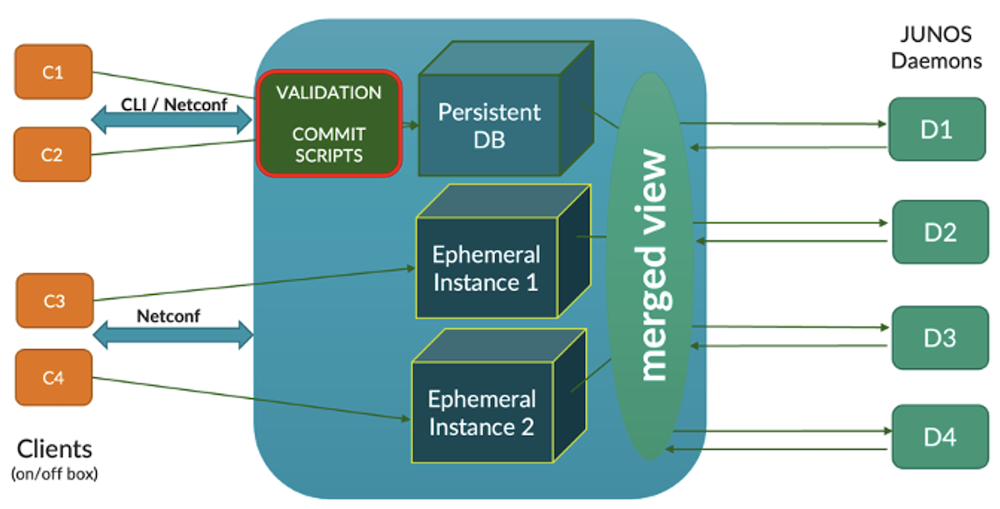

Our public document definition is the following:

"*The ephemeral database is an alternate configuration database that provides a fast programmatic interface for performing configuration updates on devices running Junos OS and Junos OS Evolved. It enables multiple client applications to concurrently configure a device by loading and committing data to separate instances of the ephemeral database. It enables fast provisioning and rapid configuration changes in dynamic environments that require fast commit times*".

In other words, this is an easy solution for very fast commits (up to 1000 commits/s) but with fewer checks/sanitizes in return. This last point is not really a drawback when the config payload you push is deterministic and validated downstream in your lab. This is our case, let's move on...

This use case aims to build a kind of "FlowSpec lite" solution (no confusion: Flowspec is not involved there) for mitigating Dynamic DDOS attacks. The following figure illustrates the use-case:

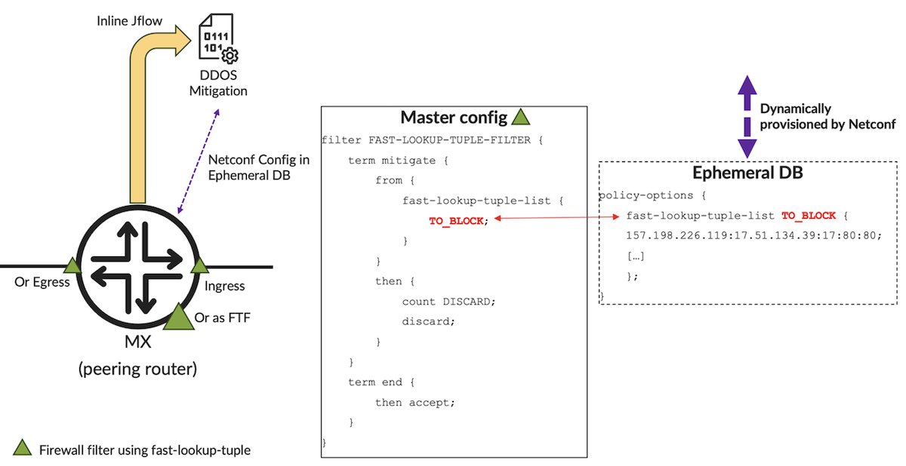

We rely on IPFIX to detect attack signatures. Signature detection is outside the scope of this article. So, let's consider we have an external solution that can provide one or a set of 5-tuple entries that describe the attack. Based on those, our off-box in-house "mitigator" will use Netconf to provision (add/remove/update), in real-time, fast-lookup-tuple entries in the ephemeral DB of one or several remote MX peering routers.

The concept is quite simple. First, create a simple standard Junos firewall filter that has only two terms:

- The term 1 matches a list of fast-lookup-tuple entries and discards them. The entries are defined in a separate fast-lookup-tuple-list.
- The term end: which accepts anything.

Using a standard filter gives us more flexibility in where we can apply it. Unlike FlowSpec rules, which are only programmed in the ingress direction as an implicit FTF filter (see Figure 8), the standard filter could be applied to interface(s) in the ingress, egress direction or as an FTF in/out filter. Using the ephemeral DB allows us to quickly update the signature by overriding the "longer" standard commit time.

Once again, an illustration is often better than a long speech for understanding a concept. As a result, I developed a second Python script, available on my Github repository - here [8] [https://github.com/door7302/fast-lookup-tuple-samples/tree/main/ephemeral-netconf](https://github.com/door7302/fast-lookup-tuple-samples/tree/main/ephemeral-netconf) - to illustrate this use case. The script provisions via Netconf (add, remove) fast-lookup-tuple entries in a fast-lookup-tuple list, this one configured in a specific Ephemeral DB. Follow this hands-on lab to understand better the above concept:

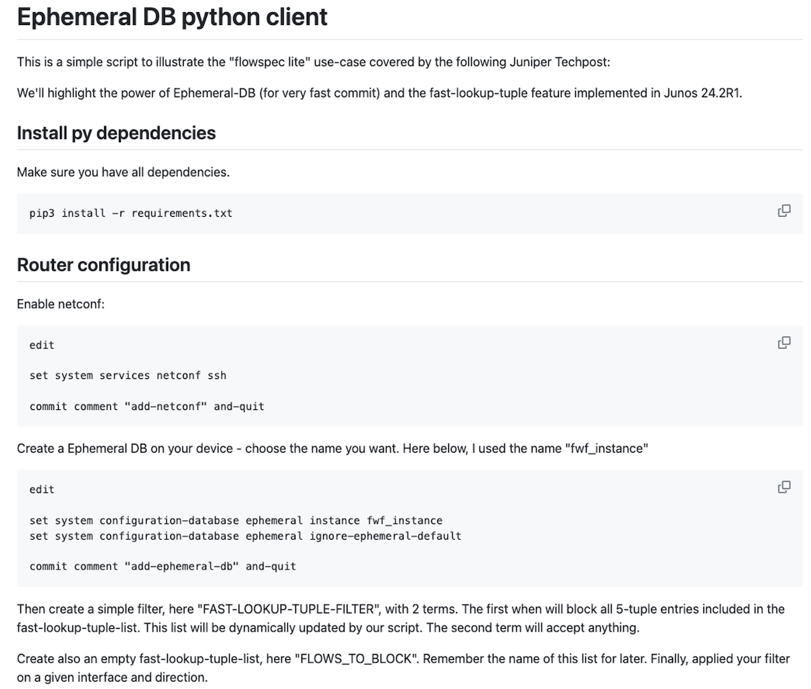

## Conclusion

In conclusion, we have once again demonstrated the power and flexibility of the Junos Network OS combined with the TRIO ASIC to deliver innovation. It is important to remember the benefits of this fast-lookup-tuple approach: it reduces the configuration, which helps to load the configuration faster and improves the overall processing and compilation time of the firewall filters. It also allows scaling without compromising the throughput. This article has illustrated two possible use cases for this new fast-lookup-tuple feature.

We already have some ideas for improvements in future releases and further development of the MX Filtering Toolkit, but in the meantime please feel free to share your ideas, suggestions, or use cases. I am interested in your feedback. Thanks in advance.

## Useful links

- [1] https://www.juniper.net/documentation/us/en/software/junos/cli-reference/topics/ref/statement/firewall-fast-lookup-filter.html
- [2] https://en.wikipedia.org/wiki/Radix_tree
- [3] https://juniper.github.io/techposts/junos-symmetrical-load-balancing/article
- [4] https://www.juniper.net/documentation/us/en/software/junos/jet-api/topics/concept/jet-apis.html
- [5] https://github.com/Juniper/junos-extension-toolkit/blob/master/24.2/24.2R1.17/2/jnx_firewall_service.proto
- [6] https://github.com/door7302/fast-lookup-tuple-samples/tree/main/jet
- [7] https://www.juniper.net/documentation/us/en/software/junos/junos-xml-protocol/topics/concept/ephemeral-configuration-database-overview.html
- [8] https://github.com/door7302/fast-lookup-tuple-samples/tree/main/ephemeral-netconf

## Glossary

- API: Application Programming Interface
- ASIC: Application-Specific Integrated Circuit
- CLI: Command Line Interface
- DB: DataBase
- DDOS: Distributed Denial Of Service
- DMEM: Data MEMory
- FLT: Fast Lookup Table
- FPC: Flexible PIC Concentrator (a line card)
- FTF: Forwarding Table Filter
- HBM: High Bandwidth Memory
- IMIX: Internet-MIX, Internet packet size distribution
- JET: Juniper Extension Toolkit
- Ktree: Juniper's implementation of a RADIX tree
- LAG: Link Aggregation
- LPM: Longest Prefix Match
- MPLS: Multi Protocol Label Switching
- PFE: Packet Forwarding Engine (=NPU)
- RPC: Remote Procedure Call
- YT: Codename for Trio 6

## Acknowledgments

Thanks to Rafik P.
