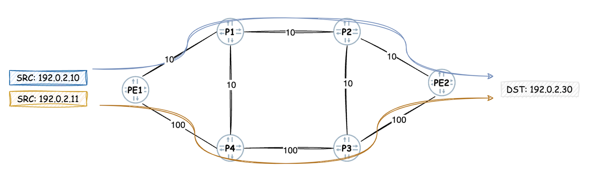
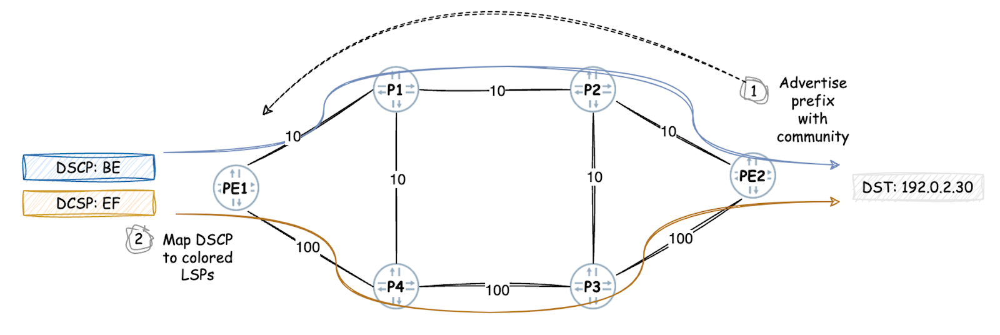

# FBF/CBF: Traffic-Engineering for Outstanding Services

**Anton Elita - 06/26/2025**

While destination-based forwarding works well for most traffic, certain services require more tailored handling -- such as routing based on source's IP or DSCP values. Leveraging alternative traffic-engineered (TE) paths for such flows enhances network flexibility and creates a compelling business case.

## Introduction

**"All animals are equal, but some animals are more equal than others." -- George Orwell, Animal Farm.**

The same principle applies to services: not all flows may be treated equally. Tailoring treatment for certain traffic flows enables unique business and operational opportunities -- such as routing via premium paths or steering specific streams over designated network hops.

Speaking technically, two components are required: identifying the "special" flows and forwarding them over a (potentially different from the default) path across the network towards the egress node. The first task is handled by Filter-Based Forwarding (FBF) or Class-Based Forwarding (CBF) -- if you're new to them, please have a look [at this great introductory article into FBF](https://juniper.github.io/techposts/filter-based-forwarding-on-mx/article). The second task can be accomplished by traffic engineering -- for example, RSVP-TE, SR-MPLS TE or SRv6-TE.

The secret sauce is how to combine the two tasks together. We'll review how to apply FBF or CBF to selected traffic streams, forcing them to take specific TE paths.

NOTE: the examples are based on MX series with a recent Junos like 24.2R1. If the platform is different, or Junos much older -- please consult with the favorite systems engineer or professional services.

In the network below, PE1 receives traffic from two different sources: "blue" 192.0.2.10 and "orange" 192.0.2.11. Both send towards 192.0.2.30. The goal is to force "orange" traffic take the south path -- the one with the worst IGP metric. Destination-based forwarding doesn't suit, so we'll do FBF on PE1. For traffic engineering, colored SR-MPLS TE is used -- color is needed to avoid attracting other traffic to the same destination.



## Configuring Traffic Engineering Label Switched Paths (LSPs)

Prior to shifting traffic over a certain path, we need to choose a TE protocol: RSVP-TE, SR-MPLS TE and SRv6-TE are the options. While SRv6 is still at a low adoption level, the other two are widely implemented as of today. The choice for this topology is SR-MPLS, but with a minor change the same approach can be used with RSVP-TE too. To be noted, that the number of SR-TE tunnels doesn't impact scaling on transit or egress nodes -- which might be an important consideration for larger networks.

The created LSPs will be configured with a color. That is a good choice when only carefully selected streams based on FBF criteria need to be using those LSPs.

It's expected that readers understand the basics of traffic engineering: how to configure ISIS or OSPF to populate the traffic-engineering database (TED) and how LSPs are provisioned in general. Worth mentioning as well that examples in this article use [Classful Transport (CT)](https://www.juniper.net/documentation/us/en/software/junos/mpls/topics/topic-map/color-based-traffic-engineering-configuration.html) for colorful resolution, and on-box (dCSPF) path computation.

Most important configuration statements for building the orange SR-TE path:

- "tunnel-tracking" is used for FBF route resolution over SR-TE
- "compute-profile" references a "segment list" with mandatory waypoints
- "use-transport-class" is need for colored SR-TE and classful transport infra
- "orange" LSP is built towards egress PE2's Loopback IP 192.0.2.6, with color 11, and a primary and a secondary path
- "blue" LSP to the same destination, but color 10

```
aelita@pe1_re# show groups SR-TE
protocols {
    source-packet-routing {
        tunnel-tracking;
        segment-list SL-via-P4-P3 {
            compute;
            P4 {
                ip-address 192.0.2.4;
                strict;
            }
            P3 {
                ip-address 192.0.2.3;
                strict;
            }
        }
        compute-profile CP-via-P4-P3 {
            compute-segment-list SL-via-P4-P3;
        }
        source-routing-path LSP-orange-PE2 {
            to 192.0.2.6;
            color 11;
            primary {
                P1 {
                    compute {
                        CP-via-P4-P3;
                    }
                }
            }
            secondary {
                P2 {
                    compute;
                }
            }
        }
        source-routing-path LSP-blue-PE2 {
            to 192.0.2.6;
            color 10;
            primary {
                P1 {
                    compute;
                }
            }
        }
        use-transport-class;
    }
}
```

Please note that the secondary path -- used as a backup -- has no constraints. It will become active once the primary path with strict hops fails. To validate this, we'll use extensive outputs from the colored tables:

```
aelita@pe1_re# run show route table junos-rti-tc-11.inet.3 192.0.2.6/32 extensive | find "Composite next hops:"
                Composite next hops: 2
                        Protocol next hop: 16 Metric: 0 ResolvState: Resolved
                        Label operation: Push 100006, Push 18(top)
                        Label TTL action: prop-ttl, prop-ttl(top)
                        Load balance label: Label 100006: None; Label 18: None;
                        Composite next hop: 0x118667a0 - INH Session ID: 0
                        Composite next hop: CNH non-key opaque: 0x0, CNH key opaque: 0x118b18e8
                        Indirect next hop: 0x8ced388 - INH Session ID: 0 Weight 0x1
                        Indirect next hop: INH non-key opaque: 0x0 INH key opaque: 0x0
                        Indirect path forwarding next hops: 2
                                Next hop type: Router
                                Next hop: 100.64.45.1 via ge-0/0/1.0 weight 0x1
                                Session Id: 0
                                Next hop: 100.64.15.1 via ge-0/0/0.0 weight 0xf000
                                Session Id: 0
                                16 /52 Originating RIB: mpls.0
                                  Metric: 0 Node path count: 1
                                  Helper node: 0x118933b0
                                  Forwarding nexthops: 2
                                        Next hop type: Router
                                        Next hop: 100.64.45.1 via ge-0/0/1.0 weight 0x1
                                        Session Id: 0
                                        Next hop: 100.64.15.1 via ge-0/0/0.0 weight 0xf000
                                        Session Id: 0
                        Protocol next hop: 100006 Metric: 30 ResolvState: Resolved
                        Composite next hop: 0x11865c40 - INH Session ID: 0
                        Composite next hop: CNH non-key opaque: 0x0, CNH key opaque: 0x118b18e8
                        Indirect next hop: 0x8ced548 - INH Session ID: 0 Weight 0xff
                        Indirect next hop: INH non-key opaque: 0x0 INH key opaque: 0x0
                        Indirect path forwarding next hops: 2
                                Next hop type: Router
                                Next hop: 100.64.15.1 via ge-0/0/0.0 weight 0x1
                                Session Id: 0
                                Next hop: 100.64.45.1 via ge-0/0/1.0 weight 0xf000
                                Session Id: 0
                                100006 /52 Originating RIB: mpls.0
                                  Metric: 30 Node path count: 1
                                  Helper node: 0x118943a8
                                  Forwarding nexthops: 2
                                        Next hop type: Router
                                        Next hop: 100.64.15.1 via ge-0/0/0.0 weight 0x1
                                        Session Id: 0
                                        Next hop: 100.64.45.1 via ge-0/0/1.0 weight 0xf000
                                        Session Id: 0
```

The primary (orange) path has a weight of 0x1, while the best-effort backup path 0xf000.

Junos allows configuring multiple primary paths, that would load-share equally (default) or unequally -- if the "weight" option is added.

```
aelita@pe1_re# show | compare rollback 1
[edit groups SR-TE protocols source-packet-routing]
      segment-list SL-via-P4-P3 { ... }
+     segment-list SL-via-P4-P1-P2 {
+         compute;
+         P4 {
+             ip-address 192.0.2.4;
+             strict;
+         }
+         P1 {
+             ip-address 192.0.2.1;
+             strict;
+         }
+         P2 {
+             ip-address 192.0.2.2;
+             strict;
+         }
+     }
[edit groups SR-TE protocols source-packet-routing]
      compute-profile CP-via-P4-P3 { ... }
+     compute-profile CP-via-P4-P1-P2 {
+         compute-segment-list SL-via-P4-P1-P2;
+     }
[edit groups SR-TE protocols source-packet-routing source-routing-path LSP-orange-PE2 primary P1]
+      weight 10;
[edit groups SR-TE protocols source-packet-routing source-routing-path LSP-orange-PE2 primary]
       P1 { ... }
+      P1a {
+          weight 90;
+          compute {
+              CP-via-P4-P1-P2;
+          }
+      }
```

The outcome of the dCSPF computation can be observed when inspecting LSP details:

```
aelita@pe1_re# run show spring-traffic-engineering lsp detail
E = Entropy-label Capability

Name: LSP-orange-PE2
  Tunnel-source: Static configuration
  Tunnel Forward Type: SRMPLS
  To: 192.0.2.6-11<c>
  State: Up
    Path: P1
    Path Status: Up
    Outgoing interface: NA
    Auto-translate status: Disabled Auto-translate result: N/A
    Compute Status:Enabled , Compute Result:success , Compute-Profile Name:CP-via-P4-P3
    Total number of computed paths: 1
    Segment ID : 128
    Computed-path-index: 1
      BFD status: N/A BFD name: N/A
      BFD remote-discriminator: N/A
      TE metric: 200, IGP metric: 200
      Delay metrics: Min: 67108860, Max: 67108860, Avg: 67108860
      Metric optimized by type: TE
      computed segments count: 3
        computed segment : 1 (computed-adjacency-segment):
          label: 16
          source router-id: 192.0.2.5, destination router-id: 192.0.2.4
          source interface-address: 100.64.45.2, destination interface-address: 100.64.45.1
        computed segment : 2 (computed-adjacency-segment):
          label: 18
          source router-id: 192.0.2.4, destination router-id: 192.0.2.3
          source interface-address: 100.64.34.2, destination interface-address: 100.64.34.1
        computed segment : 3 (computed-node-segment):
          node segment label: 100006
          router-id: 192.0.2.6 ::1
    Path: P1a
    Path Status: Up
    Outgoing interface: NA
    Auto-translate status: Disabled Auto-translate result: N/A
    Compute Status:Enabled , Compute Result:success , Compute-Profile Name:CP-via-P4-P1-P2
    Total number of computed paths: 1
    Segment ID : 256
    Computed-path-index: 1
      BFD status: N/A BFD name: N/A
      BFD remote-discriminator: N/A
      TE metric: 100, IGP metric: 100
      Delay metrics: Min: 33554430, Max: 33554430, Avg: 33554430
      Metric optimized by type: TE
      computed segments count: 2
        computed segment : 1 (computed-adjacency-segment):
          label: 16
          source router-id: 192.0.2.5, destination router-id: 192.0.2.4
          source interface-address: 100.64.45.2, destination interface-address: 100.64.45.1
        computed segment : 2 (computed-node-segment):
          node segment label: 100006
          router-id: 192.0.2.6 ::1
    Path: P2
    Path Status: Up
    Outgoing interface: NA
    Auto-translate status: Disabled Auto-translate result: N/A
    Compute Status:Enabled , Compute Result:success , Compute-Profile Name:N/A
    Total number of computed paths: 1
    Segment ID : 384
    Computed-path-index: 1
      BFD status: N/A BFD name: N/A
      BFD remote-discriminator: N/A
      TE metric: 0, IGP metric: 0
      Delay metrics: Min: 0, Max: 0, Avg: 0
      Metric optimized by type: TE
      computed segments count: 1
        computed segment : 1 (computed-node-segment):
          node segment label: 100006
          router-id: 192.0.2.6 ::1
```

Following three paths are up:

- primary P1, via Adj-SID to P4, then Adj-SID to P3, then Node SID of egress PE2
- primary P1a, via Adj-SID to P4, then Node SID of egress PE2
- secondary P2, via Node SID of egress PE2

An observant reader would notice, that the calculated P1a deviates from it's configured segment-list P4->P1->P2. There is a reason for this behavior: by default, compute profile uses compression in the calculated segment list, so that only strictly necessary labels are used in the label stack. Indeed, once we hand over the packet to P4, the configured strict path P4->P1->P2 is exactly the same as the default lowest metric path -- so Junos just compresses the label stack!

Whenever the topology changes, dCSPF might recompute the result and adapt the label stack, satisfying the configured constraints with a new path.

The secondary path P2 was defined as a backup -- if any path towards PE2 exists, this path will stay up. It's a good idea to have a "best effort" secondary path to avoid traffic being dropped in case primary fails.

## Configuring Filter-Based Forwarding (FBF)

Junos uses "firewall filters" to match virtually any field of a packet's header. Most fields like source or destination address have a dedicated name (match condition) - for easier filter writing and reading. For specific needs, operators can use flexible match conditions, that enable a pattern match starting from a specific offset in the packet's header.
In this example, match criterium is very simple -- just the source IP -- so it'll be a very simple filter as well.

Junos would accept policy-based forwarding towards a certain next-hop IP (interface, routing-instance), but not directly towards a TE tunnel. This is why we first need to have an IP pointing to the TE tunnel, then tell FBF to use that IP as a next-hop. This IP can be a fake IP address, and it's usage is strictly local -- so it can be re-used on other nodes. Obviously, it's recommended to take an IP from a range that's unused (and will not be used) for production elsewhere. One can think of CGNAT or private IP address spaces allocated by IETF.

The configuration for the static route:

```
aelita@pe1_re# show groups FBF
routing-options {
    static {
        route 100.64.6.11/32 {
            spring-te-lsp-next-hop {
                LSP-orange-PE2;
            }
        }
    }
}
```

The firewall filter has the required match criterium (source IP of the sender) and two actions: forward towards the new next-hop IP, and accept. Don't forget to allow the rest of the transit traffic, as the final action is an implicit drop

```
firewall {
    family inet {
        filter FF-FBF-1 {
            term SRC-192.0.2.11 {
                from {
                    source-address {
                        192.0.2.11/32;
                    }
                }
                then {
                    count SRC-192.0.2.11;
                    next-ip 100.64.6.11/32;
                }
            }
            term LAST {
                then accept;
            }
        }
    }
}
```

The last action is to apply the filter on the interface facing our source:

```
interfaces {
    ge-0/0/6 {
        unit 0 {
            family inet {
                filter {
                    input FF-FBF-1;
                }
            }
        }
    }
}
```

That's it. A quick validation by running rapid ICMP from 192.0.2.11:

```
aelita@pe1_re# run show interfaces ge-0/0/[0,1] | match "phys|pps"
Physical interface: ge-0/0/0, Enabled, Physical link is Up
  Input rate     : 127560 bps (189 pps)
  Output rate    : 456 bps (0 pps)
Physical interface: ge-0/0/1, Enabled, Physical link is Up
  Input rate     : 0 bps (0 pps)
  Output rate    : 140800 bps (190 pps)
```

Outgoing is via the tunnel, incoming is via interface with the lowest metric.
If we send packet from a different source (e.g. 192.0.2.10), traffic flows in both directions via the same interface with lowest metric:

```
aelita@pe1_re# run show interfaces ge-0/0/[0,1] | match "phys|pps"
Physical interface: ge-0/0/0, Enabled, Physical link is Up
  Input rate     : 138416 bps (205 pps)
  Output rate    : 138960 bps (206 pps)
Physical interface: ge-0/0/1, Enabled, Physical link is Up
  Input rate     : 0 bps (0 pps)
  Output rate    : 216 bps (0 pps)
```

## Configuring Class-Based Forwarding (CBF)

With FBF, one can match on various criteria, including CoS fields like DSCP. However, this approach is quite inflexible: it requires a filter on the corresponding traffic family on the incoming interface, and an LSP with a statically configured name.

There are situations however, where it's required to map [a subset of] certain traffic classes to colored routing topologies. Those topologies can be formed by colored SR-TE LSPs or Flex-Algo. CBF achieves the goal without using a firewall filter or fixed naming of LSPs.

To make CBF work, following ingredients are required:

- mark the traffic with a special color community on the egress device


ingress nodes will know that these destinations are subject to CBF
- create colored network topologies on each ingress device


for example, with Flex-Algo, or on-demand / static / BGP / PCEP-based SR-TE
- map certain traffic to a topology based on CoS (forwarding-class)


can be behavior-aggregate (BA), or multifield classifier (firewall filter)



We'll take a new unused color community for this purpose. Configuration on the egress node PE2:

```
policy-options {
    policy-statement direct-192.0.6.30 {
        term TR-CBF {
            from {
                protocol direct;
                route-filter 192.0.6.30/31 exact;
            }
            then {
                community add color:0:99;
                accept;
            }
        }
    }
    community color:0:99 members color:0:99;
}
```

The above policy needs to be used as a BGP export policy towards the route-reflector or directly towards PE1 -- depending on the network topology. Alternatively, one could apply a similar import policy on the ingress node.

The ingress node PE1 needs to understand the meaning of this color:0:99 community.
Below config creates a next-hop map: EF-classified packets will be forwarded to next-hops with color 11, while BE and any other class -- to next-hops with color 10.

```
class-of-service {
    forwarding-policy {
        next-hop-map NHM-CBF {
            forwarding-class expedited-forwarding {
                transport-class {
                    color 11;
                }
            }
            forwarding-class best-effort {
                transport-class {
                    color 10;
                }
            }
            forwarding-class-default {
                transport-class {
                    color 10;
                }
            }
        }
    }
}
```

Next, we'll create a policy statement that would perform a destination match (only packets with the specific community in our case) and make the next-hop lookups as per above next-hop map. This policy is applied to the forwarding plane. For it to work, preserve-nexthop-hierarchy is a required configuration: it'll allow creating multiple next-hops for a multipath scenario, instead of using a single compressed next-hop.

In addition, we've defined transport classes:

- any-class: it's a reserved keyword, not a name of a class. This transport will have multipath contributors from any existing colored next-hops. We need to match community value for CBF, hence we use value 99.
- auto-create: transport classes with no specific requirements will be auto-created

```
policy-options {
    policy-statement PS-CBF {
        term TR-CBF {
            from community color:0:99;
            then cos-next-hop-map NHM-CBF;
        }
    }
    community color:0:99 members color:0:99;
}
routing-options {
    resolution {
        preserve-nexthop-hierarchy;
    }
    transport-class {
        auto-create;
        any-class {
            color 99;
        }
    }
    forwarding-table {
        export PS-CBF;
    }
}
```

Please note, that basic configurations like BGP config or CoS classifiers on interfaces are omitted for brevity.

To validate, we'll first check the LSPs that contribute to our different topologies:

```
aelita@pe1_re# run show spring-traffic-engineering lsp
To                        State        LSPname
192.0.2.6-10<c>           Up           LSP-blue-PE2
192.0.2.6-11<c>           Up           LSP-orange-PE2
```

Both LSPs with colors 10 and 11 towards egress PE are up. Both of them contribute to the "multipath" route in "tc-any.inet.3" routing table:

```
aelita@pe1_re# run show route table junos-rti-tc-any.inet.3

junos-rti-tc-any.inet.3: 1 destinations, 5 routes (1 active, 0 holddown, 2 hidden)
+ = Active Route, - = Last Active, * = Both

192.0.2.6/32       *[SPRING-TE/8] 00:39:12, metric 1, metric2 30
                    >  to 100.64.45.1 via ge-0/0/1.0, Push 100006
                       to 100.64.15.1 via ge-0/0/0.0, Push 100006, Push 100004(top)
                    >  to 100.64.45.1 via ge-0/0/1.0, Push 100006, Push 18(top)
                       to 100.64.15.1 via ge-0/0/0.0, Push 100006, Push 18, Push 100004(top)
                       to 100.64.15.1 via ge-0/0/0.0, Push 100006
                       to 100.64.45.1 via ge-0/0/1.0, Push 100006
                    [SPRING-TE/8] 00:39:12, metric 1, metric2 30
                    >  to 100.64.15.1 via ge-0/0/0.0, Push 100006
                       to 100.64.45.1 via ge-0/0/1.0, Push 100006
                    [Multipath/8] 00:39:12, metric 30
                    >  to 100.64.45.1 via ge-0/0/1.0, Push 100006
                    >  to 100.64.15.1 via ge-0/0/0.0, Push 100006, Push 100004(top)
                    >  to 100.64.45.1 via ge-0/0/1.0, Push 100006, Push 18(top)
                    >  to 100.64.15.1 via ge-0/0/0.0, Push 100006, Push 18, Push 100004(top)
                    >  to 100.64.15.1 via ge-0/0/0.0, Push 100006
                    >  to 100.64.45.1 via ge-0/0/1.0, Push 100006
                       to 100.64.15.1 via ge-0/0/0.0, Push 100006
                       to 100.64.45.1 via ge-0/0/1.0, Push 100006
```

There are three entries for the same destination: the first and the second are our orange and blue LSPs, including their primary, backup paths, and TI-LFA.  The last entry is a multipath, which includes both LSPs' next-hops at the same time. Multipath entry is required for CBF to work.

Seeing is believing -- let us send some traffic with different codepoints and observe the forwarding behavior. When ToS bits are set to zero (BE traffic), both forward and return traffic follow the shortest metric path:

```
aelita@testrouter_re# run ping 192.0.2.30 rapid count 100000 tos 0
PING 192.0.2.30 (192.0.2.30): 56 data bytes
!!!!!!!!!!!!!!!!!!!!!!!!!!!!!!!!!!!!!!!!!![..]

aelita@pe1_re# run show interfaces ge-0/0/[0,1] | match "phys|pps"
Physical interface: ge-0/0/0, Enabled, Physical link is Up
  Input rate     : 132480 bps (197 pps)
  Output rate    : 133432 bps (197 pps)
Physical interface: ge-0/0/1, Enabled, Physical link is Up
  Input rate     : 1344 bps (0 pps)
  Output rate    : 592 bps (0 pps)
```

When ToS bits set to 160 (EF traffic), forwarding takes the "orange" path in the outgoing direction:

```
aelita@testrouter_re# run ping 192.0.2.30 rapid count 100000 tos 160
PING 192.0.2.30 (192.0.2.30): 56 data bytes
!!!!!!!!!!!!!!!!!!!!!!!!!!!!!!!!!!!!!!!!!!!!!!!!!!![..]

aelita@pe1_re# run show interfaces ge-0/0/[0,1] | match "phys|pps"
Physical interface: ge-0/0/0, Enabled, Physical link is Up
  Input rate     : 121280 bps (180 pps)
  Output rate    : 1072 bps (0 pps)
Physical interface: ge-0/0/1, Enabled, Physical link is Up
  Input rate     : 280 bps (0 pps)
  Output rate    : 121888 bps (180 pps)
```

This concludes the scope of this article.

## Conclusion

Junos provides powerful and robust tools for packet routing. In contrast to the destination-based routing decisions, certain traffic flows can be forced to take alternative paths:

- FBF: steer specific traffic flows into pre-configured tunnels based on any value in the packet header
- CBF: dynamically map traffic flows to colored network topologies based on the CoS fields.

## Useful links

- [Introduction to filter based forwarding](https://juniper.github.io/techposts/filter-based-forwarding-on-mx/article)
- [Classful Transport (CT) planes  ](https://www.juniper.net/documentation/us/en/software/junos/mpls/topics/topic-map/color-based-traffic-engineering-configuration.html)

## Glossary

- BA: behavior aggregate
- BE: best effort
- BGP: border gateway protocol
- CBF: class based forwarding
- CoS: class of service
- CGNAT: carrier-grade NAT
- CT: classful transport
- dCSPF: distributed constrained shortest path first
- DSCP: Differentiated Services Code Point
- EF: expedited forwarding
- FBF: filter based forwarding
- ICMP: internet control message protocol
- IP: internet protocol
- LSP: label switched path
- NAT: network address translation
- PE: provider edge (router)
- SID: segment identifier
- SR: segment routing
- TE: Traffic Engineering
- TI-LFA: topology-independent loop-free alternate
- ToS: type of service
- VPN: virtual private network
- TE: Traffic Engineering
- TED: traffic-engineering database

## Acknowledgements

Thanks to the Juniper Engineering team for continuous innovation, and to the customers for continuous demand.
