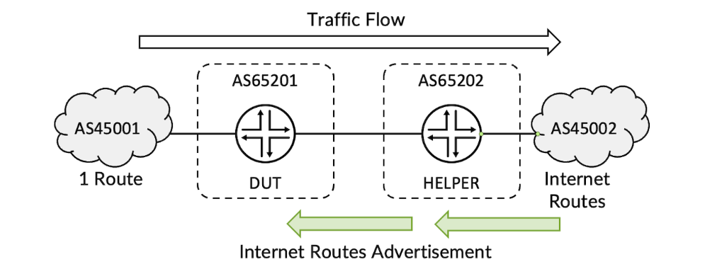
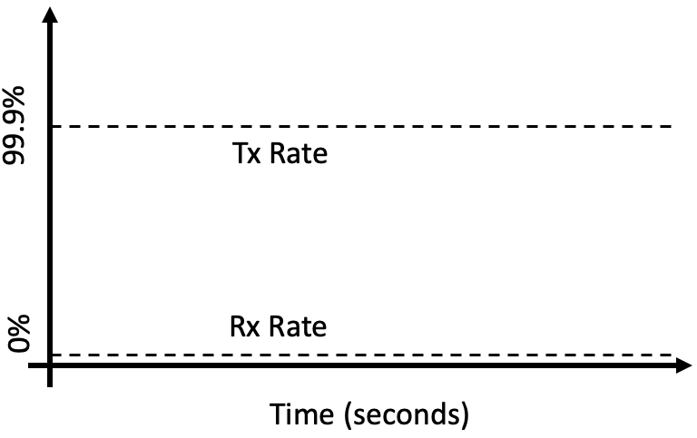
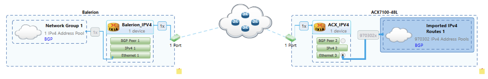
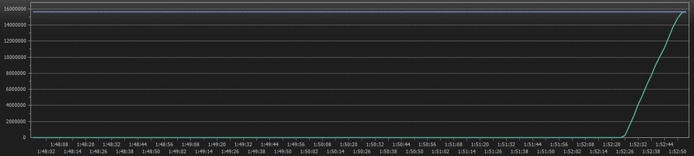
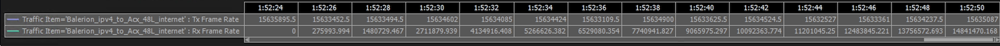
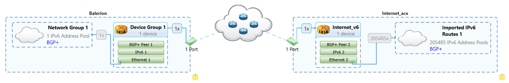
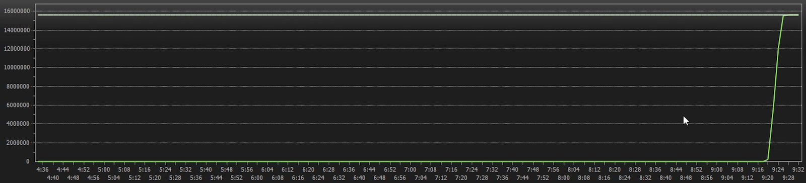
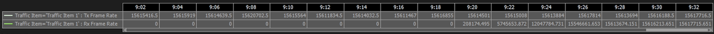

# FIB Install Rate in PTX Express5

**Vivek Singh Sikarwar - 05/31/2024**

PTX10002-36QDD is the first router equipped with the new Juniper Express5 packet forwarding engine, a new deep-buffer 28.8Tbps package introducing a lot of innovations and improvements compared to its predecessor.

This post will answer a simple question: how fast can we program the FIB entries in hardware on this new chipset?

TL;DR: that's around 38,000 prefixes / second.

*Tests prepared, executed and originally documented by Vivek Singh Sikarwar. Article written by Nicolas Fevrier.*

## Introduction

The new Juniper Networks Packet Forwarding Engine (PFE) is now available in shipping products, for instance the PTX10002-36QDD. We will use this new router for the test and will follow the same methodology described in this article: [https://juniper.github.io/techposts/ptx10001-36mr-fib-install-rate/article](https://juniper.github.io/techposts/ptx10001-36mr-fib-install-rate/article)

## Test Methodology

It consists in using an intermediate helper / shadow router then:

- inject the full routing table from the Ixia testing device
- generate traffic for all prefixes
- enable the links between the Device Under Test (DUT) and the helper router
- measure how long it takes to have Tx traffic equals Rx traffic

The packet size used for this test is following this distribution:

| Packet Size (Bytes) | Weight IPv4 IMIX | Weight IPv6 IMIX |
|:--|:--|:--|
| 64 | 3 | 0 |
| 78 | 0 | 3 |
| 100 | 26 | 26 |
| 373 | 6 | 6 |
| 570 | 5 | 5 |
| 1300 | 6 | 6 |
| 1518 | 16 | 16 |
| 9000 | 1 | 1 |

EBGP peering is enabled across the routers as well as across the router and traffic generator. The DUT learns a single route from the traffic generator and 970k IPv4 Internet prefixes from the helper DUT. Traffic is sent from the single route as the source and internet routes as the destination with 99.9% of offer load in iMIX mode.

The test starts with disabling the EBGP peering between the DUT and helper DUT, such that traffic drops and Tx is MAX rate and Rx is ZERO.

Once the interface between the routers is enabled, BGP peering will establish and Helper DUT advertise the internet prefixes to the DUT and Rx Rate increases as DUT installs the routes.

The total routes divided by T2-T1 gives the number of routes installed per second.

## Test Results

Each test is executed three times for IPv4 and three times for IPv6. We found consistent results for each test category.

### Test Results with IPv4 Internet Profile

Despite the large routing table, the routes are programmed very fast in the system and the traffic/route generator only displays information with a cadence of 2 seconds.

Let's try to calculate an average of the programming speed during this route advertisement sequence.

We generate 15,633,625 PPS on 970,304 routes. That represents 16,1121228 PPS for each route in average.

The graph above starts between 01:52:26 and 01:52:28 and Rx=Tx between 01:52:50 and 01:52:52, so we will skip these two intervals and focus our attention on the intervals between these two points.

| Time | PPS Received | Delta of PPS Received(2s interval) | Install Rate in pfx/sfor this 2s Interval |
|:--|:--|:--|:--|
| 01:52:26 | 275,993 | - | - |
| 01:52:28 | 1,480,729 | 602,368 | 37,386 |
| 01:52:30 | 2,711,879 | 615,575 | 38,206 |
| 01:52:32 | 4,134,916 | 711,518.5 | 44,160 |
| 01:52:34 | 5,266,626 | 565,855 | 35,120 |
| 01:52:36 | 6,529,080 | 631,227 | 39,177 |
| 01:52:38 | 7,710,941 | 590,930.5 | 36,676 |
| 01:52:40 | 9,065,974 | 677,517 | 42,050 |
| 01:52:42 | 10,092,363 | 513,194 | 31,851 |
| 01:52:44 | 11,201,045 | 554,341 | 34,405 |
| 01:52:46 | 12,483,845 | 641,400 | 39,808 |
| 01:52:48 | 13,756,572 | 636,363 | 39,495 |
| 01:52:50 | 14,841,470 | 542,449 | 33,667 |

In average, during this installation period, we installed 37,667 IPv4 prefixes per second.

### Test Results with IPv6 Internet Profile

Same approach will be used for IPv6.

We generate 15,616,855 PPS on 205,485 routes. That represents 76 PPS for each route in average.

The graph above shows that traffic starts being received between 9:20 and 9:22 and Rx=Tx between 9:26 and 9:28. If doesn't give us much intervals to really monitor the installation rate.

| Time | PPS Received | Delta of PPS Received(2s interval) | Install Rate in pfx/sfor this 2s Interval |
|:--|:--|:--|:--|
| 9:20 | 208,174 | - | - |
| 9:22 | 5,745,653 | 2,768,739.5 | 36,431 |
| 9:24 | 12,047,784 | 3,151,065.5 | 41,461 |
| 9:26 | 15,546,661 | 1,749,438.5 | 23,019 |
| 9:28 | 15,617,814 | - | - |

That gives us only three datapoints to draw our average, which is not a lot from a statistical point of view. Nevertheless, this average is 33,637 prefixes per second.

## Conclusion

Installation rate has been optimised on the Express5 powering the PTX10002-36QDD. It exceeds 37,500 prefixes per second. With an internet table reaching the million IPv4 entry in mid-2024, it takes less than 27 second to complete the programming in hardware.

## Useful links

- Express 5 Overview: [https://juniper.github.io/techposts/express-5-overview/article](https://juniper.github.io/techposts/express-5-overview/article)
- Introducing PTX10002-36QDD: [https://juniper.github.io/techposts/introducing-ptx10002-36qdd/article](https://juniper.github.io/techposts/introducing-ptx10002-36qdd/article)
- FIB Scale in Express5: [https://juniper.github.io/techposts/fib-scale-in-express5/article](https://juniper.github.io/techposts/fib-scale-in-express5/article)
- Tests on PTX10001-36MR: [https://juniper.github.io/techposts/ptx10001-36mr-fib-install-rate/article](https://juniper.github.io/techposts/ptx10001-36mr-fib-install-rate/article)

## Glossary

- DUT: Device Under Test
- EBGP: External Border Gateway Protocol
- FIB: Forwarding Information Base
- PFE: Packet Forwarding Engine
- PPS: Packets per Second

## Acknowledgments

Tests prepared, executed and originally documented by Vivek Singh Sikarwar. Article written by Nicolas Fevrier. Thanks to Suneesh Babu and  Anson Varghese Isaacs for original tests and support.
