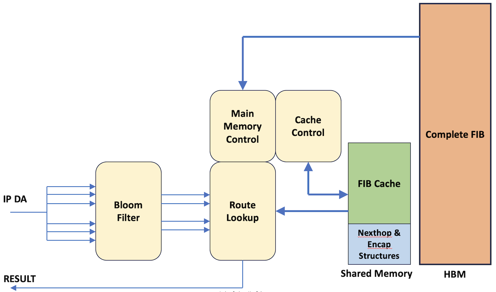

# FIB Scale in Express5

**Chandrasekaran Venkatraman - 04/10/2024**

Express5 has leap frogged in terms of Route scale, thanks to a novel approach in implementing the route table memory.

This article is part of a series of publications on Express5:

- Express 5 Overview: [https://juniper.github.io/techposts/express-5-overview/article](https://juniper.github.io/techposts/express-5-overview/article)
- Introducing PTX10002-36QDD: [https://juniper.github.io/techposts/introducing-ptx10002-36qdd/article](https://juniper.github.io/techposts/introducing-ptx10002-36qdd/article)
- Flexible Packet Processing Pipelines: [https://juniper.github.io/techposts/flexible-packet-processing-pipelines/article](https://juniper.github.io/techposts/flexible-packet-processing-pipelines/article)
- Flex Offset Filters in Express5: [https://juniper.github.io/techposts/flex-offset-filters-in-express5/article](https://juniper.github.io/techposts/flex-offset-filters-in-express5/article)

## Introduction

Supporting a large FIB in ASIC poses the challenge of making the trade-off between Silicon internal memory area and external memory bandwidth. Embedding the entire FIB on-chip becomes physically impossible for large FIB scales, and on the other hand having the entire FIB only in the external memory makes the design expensive due to the need for dedicated memory bandwidth for route lookup. Hence in Express5, a hybrid approach is taken. The complete route table is stored in the external HBM main memory, while a 'live' working set of routes is contained in a sufficiently large internal cache. The process of promotion of the routes from main memory to cache is entirely handled in the hardware without any software intervention. This makes the design capable of meeting the twin-goal of scale and performance.

## FIB Scale Comparison

Below is a comparison of FIB scale supported by different Express generations.

Table: FIB Scale Comparison

| Chipset | Entry Sizes Supported | FIB Scale without Compression | FIB Scale with Compression |
|:--|:--|:--|:--|
| Express1 and Express2 | 8, 16 words | 4M 8-word entries | n/a |
| Express3 | 5, 10 words | 512K 5-word entries | n/a |
| Express4 | 2.5, 5, 10 words | 2M 2.5-word entries | Up to 4M 2.5-word entries |
| Express5 | 2.5, 5, 10 words | 10M 10-word entries | Up to 16M 10-word entries |

For more details on the FIB Compression principles, please have a look at this article: [https://juniper.github.io/techposts/ptx-fib-compression/article](https://juniper.github.io/techposts/ptx-fib-compression/article)

## FIB Cache

Express5 takes advantage of the fact that in real-life networks, a large percentage of the installed routes don't receive much traffic while only a small percentage of the routes carry almost all of the active traffic. According to a study presented in NANOG for Comcast network (Ref 1), an Internet FIB table of 575K prefixes showed the following distribution:

Table: Internet FIB Distribution

| Percentage of total installed Routes | Percentage of Traffic carried by those Routes |
|:--|:--|
| 0.5% | 90% |
| 4% | 9% |
| 23.5% | 0.9% |
| 72% | 0.1% |

As shown in Table 2 above, only a very small portion of the FIB gets frequently accessed. From this, we deduce the following: if a significant number of the active routes are continuously made available in an optimally sized high-bandwidth memory, then the input traffic can be sustained at its full throughput even if the read bandwidth to the main FIB table is limited.

In Express5 the internal fungible shared memory is used as the L1-cache for the FIB database. The shared memory also contains partitions for Nexthops and Encapsulation data structures. A dedicated hardware state machine in the route lookup function processes the input traffic to keep the cache occupied with the most frequently accessed routes.

When FIB entries in the main memory get added/deleted/modified by the Control Plane, the FIB Cache coherency is maintained.

To forward an IP address, a series of prefix-masks are applied on the address value based on results from the Bloom-filter and those masked prefixes are probed into the FIB. This will entail a series of probes into the cache for different prefix-lengths, of which the longest match is considered the final result. In the event of a cache miss, the entry is fetched from the main memory and updated in the cache.

The FIB cache size can be programmed to accommodate up to 1M routes. If the number of active routes at any given time is within this range, then the cache can serve the input traffic sufficiently well to meet the performance goals at the same time providing high scale.

## Glossary

- FIB : Forwarding Information Base
- NANOG : North American Network Operators Group
- HBM :  High Bandwidth Memory
- IP : Internet Protocol (refers to IPv4 and IPv6)
- L1 : Level 1
- Word : 32-bits or 4 bytes

## Useful links

- 1. Comcast (NANOG June 2015) [https://archive.nanog.org/sites/default/files/meetings/NANOG64/1031/20150603_Field_Motivation_Analysis_And_v1.pdf](https://archive.nanog.org/sites/default/files/meetings/NANOG64/1031/20150603_Field_Motivation_Analysis_And_v1.pdf)
- FIB Compression: [https://juniper.github.io/techposts/ptx-fib-compression/article](https://juniper.github.io/techposts/ptx-fib-compression/article)
- Express 5 Overview: [https://juniper.github.io/techposts/express-5-overview/article](https://juniper.github.io/techposts/express-5-overview/article)
- Introducing PTX10002-36QDD: [https://juniper.github.io/techposts/introducing-ptx10002-36qdd/article](https://juniper.github.io/techposts/introducing-ptx10002-36qdd/article)
- Flexible Packet Processing Pipelines: [https://juniper.github.io/techposts/flexible-packet-processing-pipelines/article](https://juniper.github.io/techposts/flexible-packet-processing-pipelines/article)
- Flex Offset Filters in Express5: [https://juniper.github.io/techposts/flex-offset-filters-in-express5/article](https://juniper.github.io/techposts/flex-offset-filters-in-express5/article)

## Acknowledgements

- Dmitry Shokarev
- Nicolas Fevrier
- Sharada Yeluri
- Swamy SRK
