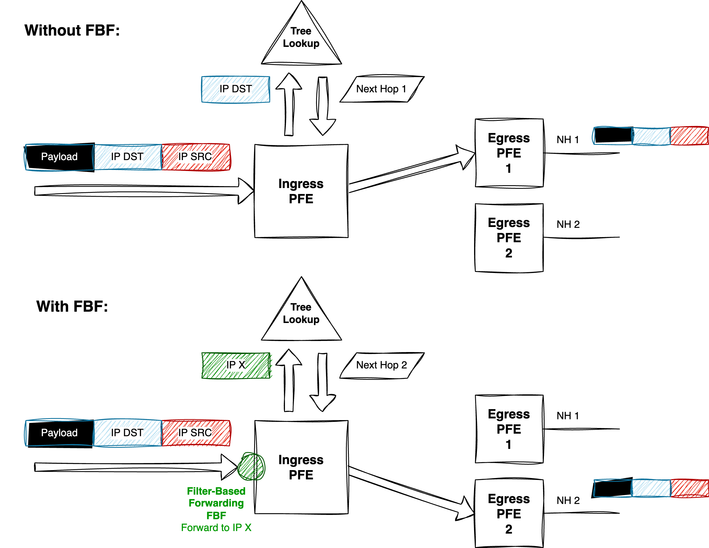
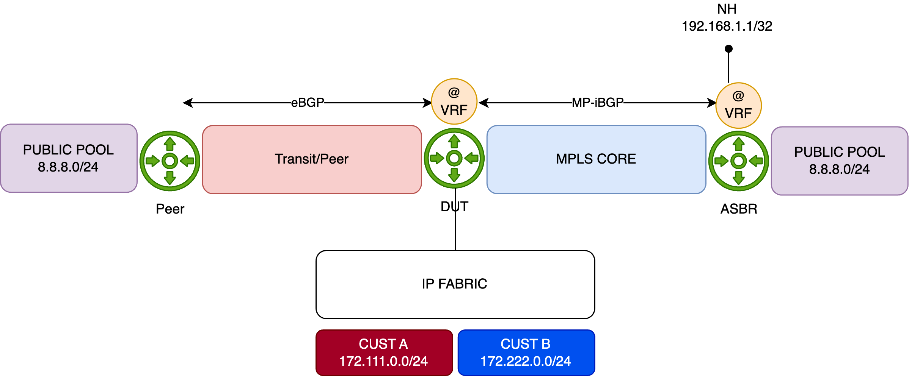
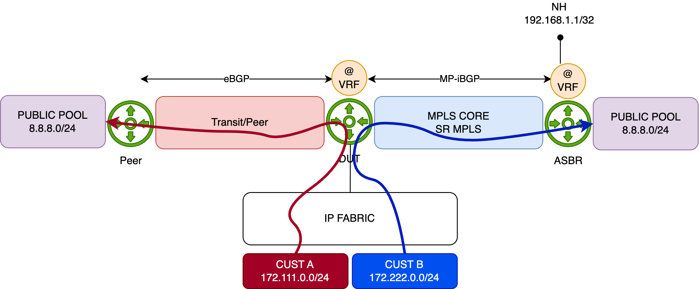
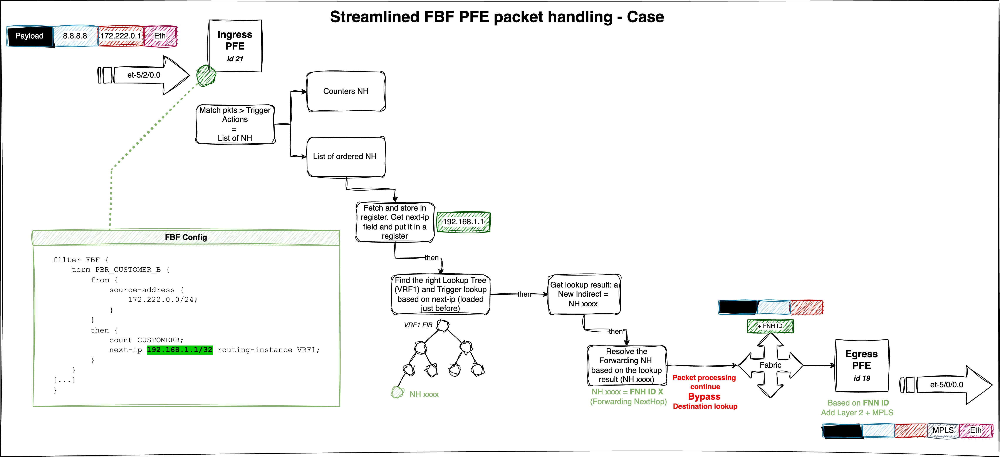
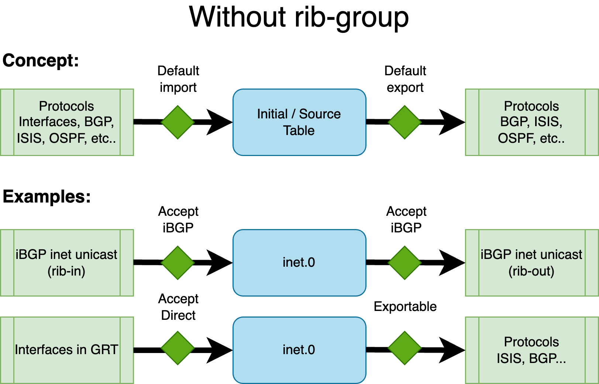
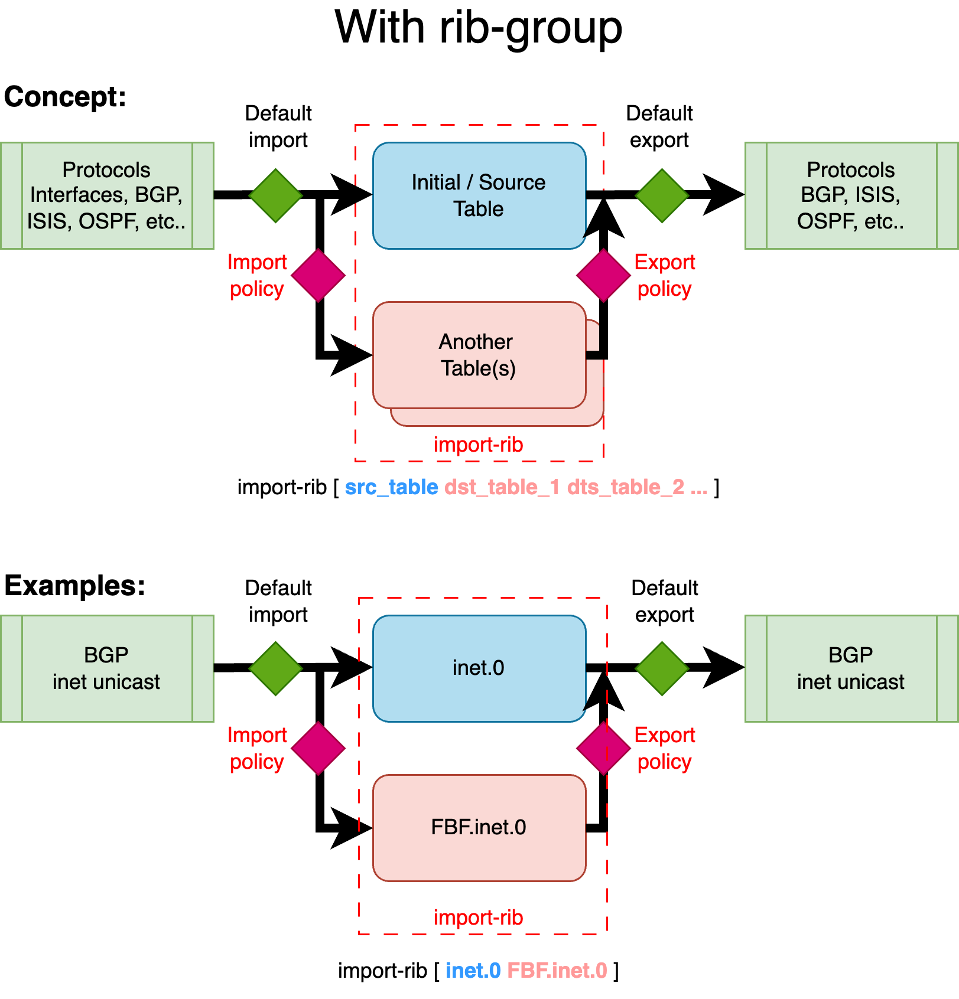
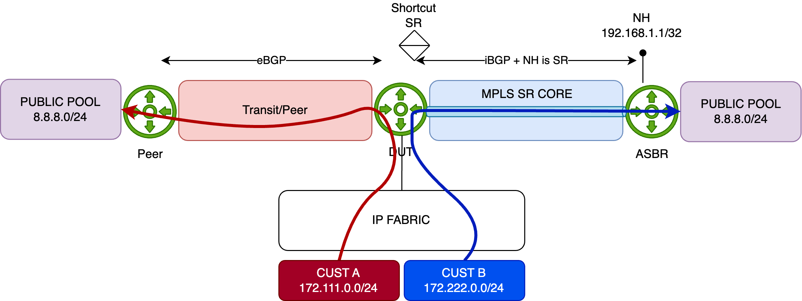
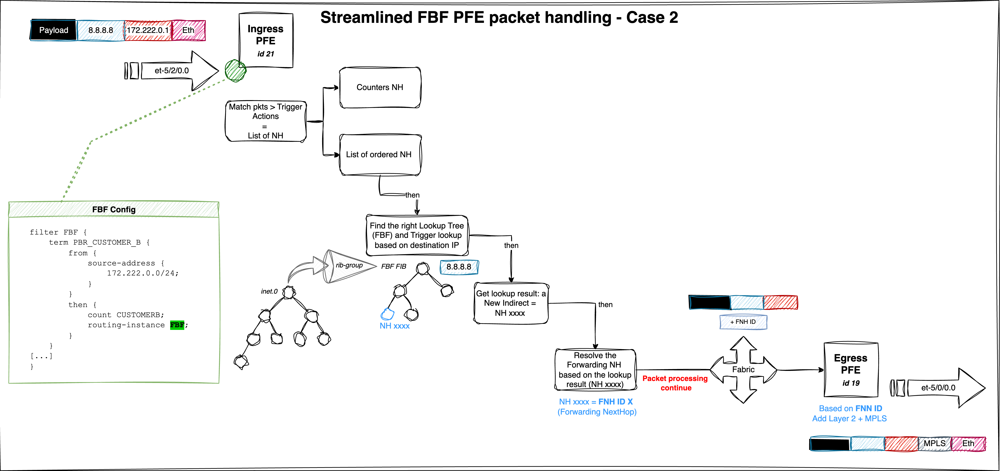

# Filter-Based Forwarding on MX

**David Roy - 04/27/2025**

A detailed overview of Filter-Based Forwarding (FBF), also known as Policy-Based Routing (PBR), on MX Series routers (AFT), using common deployment scenarios to illustrate configuration methods.

## Introduction

The Filter-Based Forwarding (FBF) concept is relatively simple. On ingress, filtering (via the Firewall Filter toolkit) is applied before the source or destination route lookup. The diagram below illustrates this process. In a standard routing scenario without any constraints, the destination IP from the IP datagram is used for a route lookup (using Longest Prefix Match1), which returns a next-hop and an associated egress interface (Encapsulation may occur before egress.)

With FBF, we alter the ingress lookup behavior in one of the following ways:

- Forcing traffic to exit through a specific egress port;
- Using a "proxy" or alias IP address as the lookup key (as shown in our example below);
- Leveraging a specific, constrained forwarding instance to influence the lookup outcome.



To summarize: on Juniper platforms, FBF can generally be implemented using two main approaches. The first is more straightforward and involves minimal configuration, but offers limited flexibility. It uses a single firewall filter to directly redirect traffic. The second approach requires slightly more configuration but offers more granular traffic handling.

This article is specific to the AFT architecture. Quick reminder:  the MX family can be divided into two groups (both run Junos, only the PFE software design/architecture differs):

1st generation of PFE: called uKernel-based platforms:

- all MX products and LC from MPC1 to MPC9 (included).

2nd generation of PFE: called AFT-based platforms:

- all new MX10K and the MX304
- MPC10e and MPC11e for previous MX chassis generation, like MX240/480/960

All examples are based on Junos OS release 24.2. We'll begin with the simpler method.

## Case 1 - FBF Using next-ip / next-interface Actions

Junos 12.2R1 introduced two new terminating actions in firewall filters:

- next-interface routing-instance
- next-ip routing-instance

Note: IPv6 is also supported via the next-ip6 variant.

These actions are **terminating**, meaning there's no need to include an explicit accept statement. Both are supported under the inet and inet6 families.

The typical usage for these actions is illustrated below:

```
firewall {
    family inet|inet6 {
      filter foo {
        from { 
          Any from the set of ip match conditions
        } then {
          next-interface <intf-name> routing-instance <RI-name>
      }
    }
  }
  family inet {
      filter foo4 {
        from { 
          Any from the set of ipv4 match conditions
        } then {
          next-ip <prefix> routing-instance <RI-name>
      }
    }
  }
  family inet6 {
      filter foo6 {
        from { 
          Any from the set of ipv6 match conditions
        } then {
          next-ip6 <prefix> routing-instance <RI-name>
      }
    }
  }
}

```

### Overall Behavior

When a packet matches a term using one of the below actions:

- next-interface: The system verifies the operational state of the specified interface, along with the availability of an ARP (or ND for IPv6) entry for the next-hop. If a routing-instance is specified, the interface lookup is performed within that context. If all conditions are met, the packet is forwarded via the corresponding egress IFL (logical interface). If the interface is down or unresolved, the packet is dropped.
- next-ip(6): The IP address specified in next-ip or next-ip6 is not automatically resolved. On Ethernet interfaces, reachability must be ensured through routing---either via dynamic protocols or static routes. If a matching route (exact or more specific) is found, the packet follows the next-hop associated with that route. If no matching route exists, the packet is **rejected**.

Read carefully: if next-ip address becomes unreachable, the default approach is to point the traffic to the default reject next-hop. Traffic rejected is thus punted to the RE for sending back an ICMP unreachable. However, no worries about "overloading" the internal host-path. Indeed, there is a default DDOS protection policer that will rate-limit those rejected punted packets to 2Kpps. We will see later, how to handle this behavior in case you want silently discard the packet when next-ip address becomes unreachable.

### Caveats

Known limitations include:

- Supported only for **ingress** filtering
- No fallback mechanism (The EVO **exact** match option is not supported)
- Not supported on **LT** interfaces

### Example 1 - Topology

The diagram below illustrates the topology used to demonstrate simple FBF on an MX platform. The Device Under Test (DUT) is an **MX480** equipped with an **MPC10E** line card.

This simplified setup represents a typical **DCI** router connected to an **IP Fabric**, providing access to remote resources via two distinct paths:

- A **quality** path through an **MPLS/SR** core network, and
- A **best-effort **path via a **direct peering or transit (PNI)** connection.

By default, remote resources are reached via the direct PNI link. The DUT hosts an **Internet VRF**, which is also used by a remote **ASBR** in the same AS. This ASBR advertises "public/remote" prefixes to all PE routers, including the DUT, via **L3VPN** (inet-vpn). The direct PNI interface is also part of the Internet VRF.



For demonstration purposes, the remote resource is simulated using the public prefix **8.8.8.0/24**. This prefix is preferred by default via the direct PNI, with a backup path available through the MPLS/SR core:

```
regress@rtme-mx-62> show route 8.8.8.0/24 

VRF1.inet.0: 9 destinations, 13 routes (9 active, 0 holddown, 0 hidden)
+ = Active Route, - = Last Active, * = Both

8.8.8.0/24         *[BGP/170] 00:00:04, localpref 10000
                      AS path: 1234 6000 I, validation-state: unverified
                    >  to 172.16.8.1 via et-2/0/0.0                             <<< Via PNI
                    [BGP/170] 21:23:18, localpref 100, from 193.252.102.201
                      AS path: I, validation-state: unverified
                    >  to 172.16.1.1 via et-5/0/0.0, Push 16, Push 20103(top)   <<< Via MPLS/SR Core

```

The IP Fabric serves two customer types, **A and B**, represented by IP prefixes **172.111.0.0/24** and **172.222.0.0/24**, respectively. The DUT exchanges IP traffic with these customers directly.

### Initial Configuration

Below is the initial configuration for the DUT's **Internet VRF**, kept simple for clarity:

- The DUT receives customer prefixes via **eBGP** from the peer group **FABRIC**.
- It receives public prefixes from the peer ASBR via **eBGP**, with an import policy (**PREF**) setting a high **local preference** to make this path the best.
- Two interfaces belong to the Internet VRF, one facing the IP Fabric, and the other towards the PNI peer.
- The DUT also connects to the MPLS core, running **IS-IS with Segment Routing** for label distribution.

```
regress@rtme-mx-62> show configuration routing-instances VRF1 
instance-type vrf;
protocols {
    bgp {
        group FABRIC {
            type external;
            local-address 172.16.0.4;
            peer-as 5000;
            neighbor 172.16.0.5;
        }
        group PEER {
            type external;
            local-address 172.16.8.0;
            import PREF;
            family inet {
                unicast;
            }
            peer-as 1234;
            neighbor 172.16.8.1;
        }
    }
}
interface et-4/0/0.0;
interface et-5/2/0.100;
route-distinguisher 193.252.102.101:1;
vrf-target target:65000:1234;
vrf-table-label;
```

### Configuration of FBF

Using the previous topology, we demonstrate a typical FBF use case leveraging the next-ip action (the same behavior applies to next-ip6 and next-interface).

The objective is to override the default forwarding behavior---where traffic exits via the direct PNI interface---for traffic sourced from **Customer B (172.222.0.0/24)**. Instead, traffic from this prefix should be redirected through the **MPLS backbone**, targeting the remote ASBR to reach the public resource.

Traffic from other sources will continue to follow the default "best path," which remains the direct PNI link.

The diagram below illustrates this behavior



### How will we achieve this?

The configuration is straightforward. First, we define a firewall filter that matches the source prefix **172.222.0.0/24**, and apply the next-ip action to redirect traffic.

Which next-ip address should be used?

That depends on the network design. In this example, we target the **loopback address of the remote ASBR**, which is advertised via **BGP (L3VPN)**. As shown below, the route to this loopback is reachable through the MPLS/SR core via an established tunnel:

```
regress@rtme-mx-62> show route 192.168.1.1 table VRF1.inet   

VRF1.inet.0: 9 destinations, 13 routes (9 active, 0 holddown, 0 hidden)
+ = Active Route, - = Last Active, * = Both

192.168.1.1/32     *[BGP/170] 20:42:26, localpref 100, from 193.252.102.201
                      AS path: I, validation-state: unverified
                    >  to 172.16.1.1 via et-5/0/0.0, Push 16, Push 20103(top)
```

Now let's configure the FBF filter. Since we're operating within a **VRF context**, the routing-instance parameter is specified along with the next-ip action. This ensures that the next-hop lookup is performed in the correct **FIB instance**.

An additional term is included to match all remaining traffic, allowing it to follow the default forwarding behavior.

```
family inet {
    filter FBF {
        term PBR_CUSTOMER_B {
            from {
                source-address {
                    172.222.0.0/24;
                }
            }
            then {
                count CUSTOMERB;
                next-ip 192.168.1.1/32 routing-instance VRF1;
            }
        }
        term OTHER {
            then {
                count OTHER;
                accept;
            }
        }
    }
}
```

Before applying the filter, we'll generate traffic from Customer A and Customer B. To distinguish between the two flows, we configure the traffic rates as follows:

- **Customer A**: 1000 packets per second (pps)
- **Customer B**: 5000 packets per second (pps)

Both customers will send traffic toward the **8.8.8.0/24** prefix.

We now start the traffic and verify the statistics on the **PNI interface**:

```
regress@rtme-mx-62> monitor interface et-2/0/0.0   

<- truncated output ->

Remote statistics:
  Input bytes:                 132708516 (0 bps)                           [0]
  Output bytes:              48292808336 (23518344 bps)             [11195520]
  Input packets:                  270844 (0 pps)                           [0]
  Output packets:               98556757 (6000 pps)                    [22848] <<< Customer A + Customer B traffics
```

At this point, all traffic is following the best active path, via the **PNI interface**, to reach the **8.8.8.0/24** prefix.

We now apply the **FBF filter** in the **ingress** direction on the interface connected to the **IP Fabric**:

```
edit private

set interfaces et-5/2/0 unit 100 family inet filter input FBF

commit comment "ADD_FBF" and-quit
```

And then, recheck the PNI interface statistics:

```
regress@rtme-mx-62> monitor interface et-2/0/0.0   
Interface: et-2/0/0.0, Enabled, Link is Up

<- truncated output ->

Remote statistics:
  Input bytes:                 132708516 (0 bps)                           [0]
  Output bytes:              49128737556 (3921056 bps)                     [0]
  Input packets:                  270844 (0 pps)                           [0]
  Output packets:              100262735 (1000 pps)                        [0] <<< Only Customer A traffic
```

The **FBF filter** is functioning as expected. Only **Customer A** traffic continues to follow the default best path toward **8.8.8.0/24** via the PNI interface.

Next, we check the statistics on the **core-facing interfaces** to confirm that **Customer B** traffic is being properly redirected through the **SR/MPLS tunnel** as intended by the FBF configuration:

```
regress@rtme-mx-62> monitor interface et-5/0/0.0  
Interface: et-5/0/0.0, Enabled, Link is Up

<- truncated output ->

Remote statistics:
  Input bytes:                 253750639 (584 bps)                         [0]
  Output bytes:              57241664165 (19600072 bps)                    [0]
  Input packets:                  533880 (1 pps)                           [0]
  Output packets:              116839924 (5000 pps)                        [0] <<< the tunneled Customer B traffic 
```

Everything looks good! To demonstrate that there is no fallback mechanism with **next-ip-based FBF**, we'll remove the **loopback (192.168.1.1/32)** announcement from the ASBR. As a result, the DUT will no longer have a route to the loopback, and the traffic will be dropped:

```
regress@rtme-mx-62> show route 192.168.1.1 table VRF1.inet
```

This means that traffic from **Customer B** should be dropped, which is exactly what we observe. As shown below, there is no longer any traffic on the **Core interface**, and **Customer A** traffic continues to flow through the **PNI port**.

```
regress@rtme-mx-62> monitor interface et-5/0/0.0  
Interface: et-5/0/0.0, Enabled, Link is Up

<- truncated output ->

Remote statistics:
  Input bytes:                 253763429 (248 bps)                         [0]
  Output bytes:              58533097602 (0 bps)                          [57]
  Input packets:                  534091 (0 pps)                           [0]
  Output packets:              119475689 (0 pps)                           [1] <<< Customer B traffic dropped

monitor interface et-2/0/0.0 
Interface: et-2/0/0.0, Enabled, Link is Up

<- truncated output ->

Remote statistics:
  Input bytes:                 132708516 (296 bps)                         [0]
  Output bytes:              49685006066 (3921096 bps)                     [0]
  Input packets:                  270844 (0 pps)                           [0]
  Output packets:              101397976 (1000 pps)                        [0] <<< Customer A still forwarded
```

As discussed earlier, the default action when next-ip address becomes unreachable is to redirect traffic to the reject next-hop. Above, we issue a show route of the next-ip address and nothing was returned as expected. Just now issue the show route forwarding-table:

```
regress@rtme-mx-62> show route forwarding-table destination 192.168.1.1 table VRF1    
Routing table: VRF1.inet
Internet:
Destination        Type RtRef Next hop           Type Index    NhRef Netif
default            perm     0                    rjct      695     1       <<< rjct = reject next-hop  
```

The route points to reject next-hop in the FIB. As said, the next-hop will punted the packets to the RE for further processing (ICMP unreachable). As also mentioned those punted packets are rate-limited by the ASIC to 2kpps. We can verify this behavior, by checking the DDOS protection statistics for the "reject" protocol:

```
regress@rtme-mx-62> show ddos-protection protocols reject statistics terse 
Packet types: 1, Received traffic: 1, Currently violated: 1

Protocol    Packet      Received        Dropped        Rate     Violation State
group       type        (packets)       (packets)      (pps)    counts
reject      aggregate   6396663340756   6395549305435  5000     9         viol 
```

We saw our 5K of Customer B traffic before being rate-limited. Issue the "violation" check command to see the rate-limit value of 2K pps:

```
regress@rtme-mx-62> show ddos-protection protocols violations 
Packet types: 255, Currently violated: 1

Protocol    Packet      Bandwidth  Arrival   Peak      Policer bandwidth
group       type        (pps)      rate(pps) rate(pps) violation detected at
reject      aggregate   2000       5000      11682678  2025-04-10 08:22:39 PDT  <<< Bandwidth = rate-limit = 2k pps
          Detected on: FPC-5
```

So it means our RE will receive a maximum of 2K rejected packets and will generate 2K ICMP unreachable packets in reply. Just check our port connected to the IP Fabric and oh! Suprise... 2Kpps in output. These are our ICMP unreachable sent out back to Customer B.

```
regress@rtme-mx-62> monitor interface et-2/0/0.0   
Interface: et-2/0/0.0, Enabled, Link is Up

<- truncated output ->

Remote statistics:
  Input bytes:              117022326356 (23519664 bps)             [11197970]
  Output bytes:                178738122 (895984 bps)                 [426496]
  Input packets:               238821075 (6000 pps)                    [22853]
  Output packets:                3191752 (2000 pps)                     [7616] <<< 2K ICMP Unreachable targeting Cust. B
```

### How we can avoid that?

The easiest solution is to have in your FIB always a last resort route entry, that could be "discard", but why not a fallback path to route the next-ip address. In our case, if 192.168.1.1 disappears, we may want:

- to not reject/discard the traffic but move back to the PNI interface. For that, we need to configure a static route pointing to the PNI peer, with a higher preference as a backup path for 192.168.1.1. Let's simply add this static route in our VRF and check just after the commit the statistics of our PNI interface to see if all our 6K pps (A+B traffic) are forwarded back:

```
edit private

set routing-instances VRF1 routing-options static route 192.168.1.1/32 next-hop 172.16.8.1 preference 254

commit comment "ADD_BACKUP_NEXT_IP" and-quit

regress@rtme-mx-62> monitor interface et-2/0/0.0   
Interface: et-2/0/0.0, Enabled, Link is Up

<- truncated output ->

Remote statistics:
  Input bytes:                 132708516 (0 bps)                           [0]
  Output bytes:              50812435866 (23522568 bps)              [5629120]
  Input packets:                  270844 (0 pps)                           [0]
  Output packets:              103698854 (6000 pps)                    [11488] <<< We backup B traffic to PNI
```

- or to silently discard the traffic. In this scenario, we can create a static route with higher preference pointing to discard next-hop. In our case, I've just added a default discard route in the VRF. so, if 192.168.1.1/32 is not announced anymore, the lookup of the next-ip address will fall back to this default discard instead of matching the default reject. Let's remove the previous static route and add the new default one:

```
edit private

delete routing-instances VRF1 routing-options static route 192.168.1.1/32          

set routing-instances VRF1 routing-options static route 0.0.0.0/0 discard 

commit comment "ADD_DEFAULT" and-quit
```

So, with this last configuration, our Customer B traffic should be now silently discarded and we shouldn't observe DDOS protocol violation and ICMP unreachable traffic:

```
regress@rtme-mx-62> monitor interface et-2/0/0.0   
Interface: et-2/0/0.0, Enabled, Link is Up
Flags: SNMP-Traps 0x4000
Encapsulation: ENET2
Local statistics:                                                Current delta
  Input bytes:                    216186                                   [0]
  Output bytes:                   505399                                   [0]
  Input packets:                    3530                                   [0]
  Output packets:                   6274                                   [0]
Remote statistics:
  Input bytes:              119682374166 (23516136 bps)              [5628630]
  Output bytes:                230359258 (0 bps)                           [0]
  Input packets:               244249744 (5999 pps)                    [11487]
  Output packets:                4113558 (0 pps)                           [0] <<< No more ICMP Unreach. 

regress@rtme-mx-62> show ddos-protection protocols violations    
Packet types: 255, Currently violated: 0   <<< No more Violation 
```

The figure below summarizes our packet walkthrough and highlights the main FBF steps:



Please reach out to your favorite SE or Juniper representatives for a deeper dive into this packet walkthrough.

And that wraps up part one. Take a break, in part two, we'll dive into configuring FBF thanks to the rib-group feature.

## Case 2 - FBF Using Forwarding Instance

The second approach to achieving Filter-Based Forwarding (FBF) leverages the **forwarding-type routing instance**. In this method, the FBF filter term action redirects traffic to a specific routing instance of type forwarding.

This solution is considered the legacy approach and is widely supported on MX platforms. Compared to Case 1, it requires a deeper understanding of the rib-group concept. The following section will elucidate the necessary concepts to effectively implement FBF using this method.

### rib-group Concept

A **RIB group** on Juniper devices enables routes learned in one routing table (the source or initial RIB) to be simultaneously installed into multiple routing tables (the destination RIBs). This feature is commonly utilized to share routes between routing instances (VRFs) or between the global routing table and a VRF. Policies can control which routes are imported, making RIB groups a flexible method for internal route redistribution without relying on BGP or other protocols.

Without a RIB group, each protocol, depending on the address family, feeds routes into a default routing table. In the context of RIB groups, this default table is referred to as the source or initial RIB. Similarly, protocols fetch routes (for a given family) from this default table when exporting routes.

The figure below illustrates the default routing behavior:



*Default routing table management*

As shown above, for BGP with the inet family (IPv4 unicast), the default routing table in the global context is inet.0, both for importing and exporting routes. Similarly, interface IPv4 addresses (direct routes) in the global context also reside in inet.0.

To leak routes from one table to another, the **RIB group** feature is employed, configured under routing-options. A RIB group is defined with the following parameters:

```
[edit routing-options]
rib-groups {
    <rib-group-name> {
        import-rib [ <source_table> <destination_table_1> <destination_table_2> ... ];
        import-policy <rib-group-import-policy>;
        export-policy <rib-group-export-policy>;
    }
}
```

Note: import-policy and export-policy are optional, but at least one destination table must be specified in import-rib.

The import-rib statement is crucial. The order of tables matters: the first table is the source (or *initial*, *standard*, *contributing*) table. This is the default RIB associated with a given protocol/family combination. With a RIB group, routes are taken from this source table and replicated into one or more *destination* tables.

The RIB group establishes a link between the source RIB and the destination RIBs. The import-policy provides fine-grained control, allowing only specific routes or protocols to be leaked to the destination tables. Similarly, export-policy controls which routes from the destination tables are eligible for export by routing protocols.

The next figure illustrates the concept:



This example demonstrates how BGP unicast routes from the global routing context are leaked into a new routing table (or instance) called **FBF**. While these routes remain in their default (*source*) table, inet.0, they are also copied into an additional table, in this case, the destination FBF.inet.0, using a RIB group.

In the context of Filter-Based Forwarding (FBF), this allows you to constrain routing decisions to a specific set of routes, not by using the standard FIB, but by relying on a custom FIB built from the custom destination RIB. This destination RIB can be selectively populated with only the routes you want to use for FBF-based traffic steering.

Let's illustrate this second FBF method with an example.

### Example 2 - Topology

The Device Under Test (DUT) is an **MX480** equipped with an **MPC10E** line card.

This simplified setup represents a typical **DCI** router connected to an **IP Fabric**, providing access to remote resources via two distinct paths:

- A **quality** path through an **MPLS/SR** core network, and
- A **best-effort** path via a **direct peering or transit (PNI)** connection.

In this scenario, remote resources are reached via the direct PNI link connected in the Global Routing Table (GRT) and sent from the peer to our DUT via an eBGP session. The DUT also receives the same remote resources from a remote **ASBR** through an iBGP session. The remote ASBR sets the next-hop address of these routes with its Segment Routing node-SID (advertised in the ISIS SR domain). This allows for a BGP Free-core by tunneling traffic in a transport SR tunnel.


For demonstration purposes, the remote resource is simulated using the public prefix **8.8.8.0/24**. This prefix is preferred by default via the direct PNI, with a backup path available through the MPLS/SR core (shortcut SR):

```
regress@rtme-mx-62> show route 8.8.8.0/24 

inet.0: 43 destinations, 44 routes (43 active, 0 holddown, 0 hidden)
+ = Active Route, - = Last Active, * = Both


8.8.8.0/24         *[BGP/170] 6d 17:31:10, localpref 10000
                      AS path: 1234 6000 I, validation-state: unverified
                    >  to 172.16.8.1 via et-2/0/0.0                       <<< PNI
                    [BGP/170] 00:00:11, localpref 50, from 193.252.102.2
                      AS path: I, validation-state: unverified
                    >  to 172.16.1.1 via et-5/0/0.0, Push 20002           <<< SR Tunnel 
```

### Initial Configuration

Below is the initial configuration for the DUT, kept simple for clarity:

- The DUT receives customer prefixes via **eBGP** from the peer group **FABRIC**.
- The DUT receives public prefixes from the PNI peer---this is the primary/best path. A higher local-preference is set using the PREF import policy.
- It also receives public prefixes from the peer ASBR via **iBGP**, this is a backup path, remotely reachable through an MPLS SR Tunnel.

```
regress@rtme-mx-62> show configuration 
protocols {
    bgp {
        group FABRIC {
            type external;
            local-address 172.16.0.4;
            peer-as 5000;
            neighbor 172.16.0.5;
        }
        group PEER {
            type external;
            local-address 172.16.8.0;
            import PREF;
            family inet {
                unicast;
            }
            peer-as 1234;
            neighbor 172.16.8.1;
        }
        group ASBR {
            type internal;
            local-address 193.252.102.101;
            family inet {
                unicast;
            }
            neighbor 193.252.102.2;
        }
    }
}
```

### Configuration of FBF

The next steps involve creating a new routing instance (type forwarding) and leaking both the interface routes (i.e., direct routes for resolving the Layer 2 header) and the remote resources (in our case, **8.8.8.0/24**), but only those announced by the core network, not those learned via the PNI.

First, create the FBF routing instance:

```
edit 
load merge terminal relative

routing-instances {
    FBF {
        instance-type forwarding;
    }
}

commit comment "add_fbf_ri"
```

Next, create a new rib-group called **RG_FBF**, establishing a relationship between the inet.0 table and FBF.inet.0. In other words, a relation between the default IPv4 table and the IPv4 table of our newly created **FBF** routing instance.

```
edit 
load merge terminal relative

routing-options {
    rib-groups {
        RG_FBF {
            import-rib [ inet.0 FBF.inet.0 ];
        }
    }
}

commit comment "add_rib-group"
```

Remember, the order inside the import-rib option is important. The first table is considered the source table, and the second one is the destination table. At this point, nothing is leaked between these two tables; this configuration merely establishes the relationship.

The first routes to leak are the direct interfaces attached to inet.0. This can be achieved with the following configuration under routing-options:

```
edit 
load merge terminal relative

routing-options {
    interface-routes {
        rib-group inet RG_FBF;
    }
}

commit comment "import-direct"
```

Once committed, you should see direct and local routes in the FBF.inet.0 table. Verify with:

```
regress@rtme-mx-62> show route table FBF.inet.0 

FBF.inet.0: 10 destinations, 10 routes (10 active, 0 holddown, 0 hidden)
+ = Active Route, - = Last Active, * = Both

172.16.0.4/31      *[Direct/0] 6d 20:12:58
                    >  via et-5/2/0.0         <<< Fabric
172.16.0.4/32      *[Local/0] 00:00:59
                       Local via et-5/2/0.0
172.16.1.0/31      *[Direct/0] 6d 20:12:58
                    >  via et-5/0/0.0         <<< Core
172.16.1.0/32      *[Local/0] 00:00:59
                       Local via et-5/0/0.0
172.16.8.0/31      *[Direct/0] 6d 20:12:58
                    >  via et-2/0/0.0         <<< PNI
172.16.8.0/32      *[Local/0] 00:00:59
                       Local via et-2/0/0.0
193.252.102.101/32 *[Direct/0] 6d 20:12:58
                    >  via lo0.0
```

Everything looks good so far. The next step is to leak some BGP routes into the FBF routing table. But which ones?

Our goal is to redirect traffic entering this forwarding instance along a specific path, the one advertised by our remote ASBR. This route is available in the default inet.0 table as a backup path. To achieve this, we'll configure BGP to use the RG_FBF rib-group. This rib-group allows routes normally imported into inet.0 to be simultaneously leaked into FBF.inet.0.

Let's apply this to the ASBR peer-group:

```
edit 
edit protocols
load merge terminal relative

bgp {
    group ASBR {
        type internal;
        local-address 193.252.102.101;  
        family inet {
            unicast {
                rib-group RG_FBF;    <<< This tells BGP to use the rib-group and specifies where to leak learned routes
            }
        }
        neighbor 193.252.102.2;
    }
}

commit comment "import_bgp"
```

With this configuration, all routes received from this peer-group will be leaked into FBF.inet.0. However, for demonstration purposes, we'll restrict the leaking to a specific BGP prefix: **8.8.8.0/24**.

To do that, we'll use the import-policy feature of the rib-group. First, we define a policy to authorize leaking from inet.0 to FBF.inet.0, but only for:

- direct routes, and
- the BGP prefix 8.8.8.0/24

Here's the policy definition, followed by its application to the RG_FBF rib-group:

```
edit 
load merge terminal relative

policy-options {
    policy-statement FBF_POLICY {
        term LEAK_DIRECT {
            from protocol direct;
            then accept;
        }
        term LEAK_BGP {
            from {
                protocol bgp;
                route-filter 8.8.8.0/24 orlonger;
            }
            then accept;
        }
        term REJECT_OTHER {
            then reject;
        }
    }
}

routing-options {
    rib-groups {
        RG_FBF {
            import-rib [ inet.0 FBF.inet.0 ];
            import-policy FBF_POLICY;         <<< controls which routes get leaked
        }
    }
}

commit comment "add_leaking_policy"
```

After committing, you can verify the result with:

```
regress@rtme-mx-62> show route table FBF.inet.0 protocol bgp   

FBF.inet.0: 7 destinations, 7 routes (7 active, 0 holddown, 0 hidden)
+ = Active Route, - = Last Active, * = Both

8.8.8.0/24         *[BGP/170] 01:16:31, localpref 50, from 193.252.102.2
                      AS path: I, validation-state: unverified
                    >  to 172.16.1.1 via et-5/0/0.0, Push 20002
```

Perfect, only the **8.8.8.0/24** prefix received from the internal ASBR is installed. The primary route via the PNI isn't present in this instance and remains solely in the inet.0 table.

Now, to redirect the traffic, we'll use a simple firewall filter. It will match traffic sourced from **Customer B** and redirect it to the FBF routing instance. This filter is applied to the physical interface connected to the IP Fabric:

```
edit 
load merge terminal relative

firewall {
    family inet {                       
        filter FBF_FWD {
            term CUSTOMER_B {
                from {
                    source-address {
                        172.222.0.0/24;
                    }
                }
                then {
                    count FBF;
                    routing-instance FBF;
                }
            }
            term other {
                then {
                    count OTHER;
                    accept;
                }
            }
        }
    }
}

interfaces {
    et-5/2/0 {
        mtu 9200;
        unit 0 {
            family inet {
                filter {
                    input FBF_FWD;
                }
                address 172.16.0.4/31;
            }
        }
    }
}

commit comment "apply_fbf"
```

At this point, traffic should be redirected as expected:



To help distinguish the flows, we've configured traffic rates as follows:

- **Customer A**: 1000 packets per second (pps)
- **Customer B**: 5000 packets per second (pps)

Let's monitor the PNI interface. As expected, only **Customer A**'s traffic goes through it (1000pps):

```
regress@rtme-mx-62> monitor interface et-2/0/0.0   
Interface: et-2/0/0.0, Enabled, Link is Up

<- truncated output ->

Remote statistics:
  Input bytes:                 132708516 (0 bps)                           [0]
  Output bytes:              49128737556 (3921056 bps)                     [0]
  Input packets:                  270844 (0 pps)                           [0]
  Output packets:              100262735 (1000 pps)                        [0] <<< Only Customer A traffic
```

Now let's check the core-facing interface, we can see **Customer B**'s traffic being redirected via FBF to the ASBR:

```
regress@rtme-mx-62> monitor interface et-5/0/0.0  
Interface: et-5/0/0.0, Enabled, Link is Up

<- truncated output ->

Remote statistics:
  Input bytes:                 253750639 (584 bps)                         [0]
  Output bytes:              57241664165 (19600072 bps)                    [0]
  Input packets:                  533880 (1 pps)                           [0]
  Output packets:              116839924 (5000 pps)                        [0] <<< the tunneled Customer B traffic 
```

Now, what if the iBGP session to the ASBR drops, or the **8.8.8.0/24** prefix is no longer announced?

In that case, the route will vanish from FBF.inet.0, and the default reject route will take over:

```
regress@rtme-mx-62> show route forwarding-table destination 0.0.0.0/0 table FBF 
Routing table: FBF.inet
Internet:
Destination        Type RtRef Next hop           Type Index    NhRef Netif
default            perm     0                    rjct      520     1       <<< default reject route
```

Just like in **Case 1**, traffic to **8.8.8.0/24 **will be rejected and punted to the routing engine (RE), which will respond with ICMP Unreachable messages (after being HW-policed to 2Kpps).

To silently drop such packets instead of punting them, configure a static discard route as the default inside the FBF instance. But what if you want a fallback to the default routing table instead?

That's simple. If fallback forwarding is needed, just configure a default route inside the FBF instance pointing to the inet.0 table. If **8.8.8.0/24** disappears, traffic is then forwarded via the primary PNI path through inet.0.

Here's the configuration:

```
edit 
load merge terminal relative

routing-instances {
    FBF {
        instance-type forwarding;
        routing-options {
            static {
                route 0.0.0.0/0 next-table inet.0; <<< default fallback route
            }
        }
    }
}

commit comment "add_fallback_route"
```

The following figure provides a consolidated view of the packet traversal process and outlines the key steps of the FBF mechanism:



Here again, if you want more internal details about this packet walkthrough, please reach out to your Juniper representative.

## Conclusion

In this article, we explored the mechanics of the Filter-Based Forwarding (FBF) feature, focusing on how traffic steering is implemented at the PFE level. We demonstrated two distinct approaches to configuring and validating FBF behavior. While both are effective, the second method provides greater flexibility, making it especially useful for advanced use cases.

All tests and examples provided were conducted within the IPv4 address family, but it's important to highlight that the same FBF logic and infrastructure are fully supported for IPv6 as well, offering consistent behavior across protocol versions.

By understanding the inner workings of FBF down to the hardware abstraction layer, network engineers can confidently design and validate sophisticated traffic steering policies.

## Useful links

- [https://www.juniper.net/documentation/us/en/software/junos/routing-policy/topics/example/firewall-filter-option-filter-based-forwarding-example.html](https://www.juniper.net/documentation/us/en/software/junos/routing-policy/topics/example/firewall-filter-option-filter-based-forwarding-example.html)
- [https://www.juniper.net/documentation/us/en/software/junos/routing-policy/topics/topic-map/filter-based-forwarding-policy-based-routing.html](https://www.juniper.net/documentation/us/en/software/junos/routing-policy/topics/topic-map/filter-based-forwarding-policy-based-routing.html)

## Glossary

- AFT: Recent MX Routers Forwarding Architecture
- ARP: Address Resolution Protocol
- ASBR: Autonomous System Border Router
- ASIC: Application-Specific Integrated Circuit
- BGP: Border Gateway Protocol
- DCI: Data Center Interconnect
- DDoS: Distributed Deny of Service
- DUT: Device Under Test
- FBF: Filter-Based Forwarding
- FIB: Forwarding Information Base
- GRT: Global Routing Table
- ICMP: Internet Control Message Protocol
- LSR: Label Switch Router
- MPLS: Multiprotocol Label Switching
- ND: Neighbor Discovery
- PBR: Policy-Based Routing
- PNI: Private Network Interconnect
- PPS: Packet Per Second
- RIB: Routing Information Base
- SR: Segment Routing
- VRF: Virtual Routing and Forwarding (instance)
