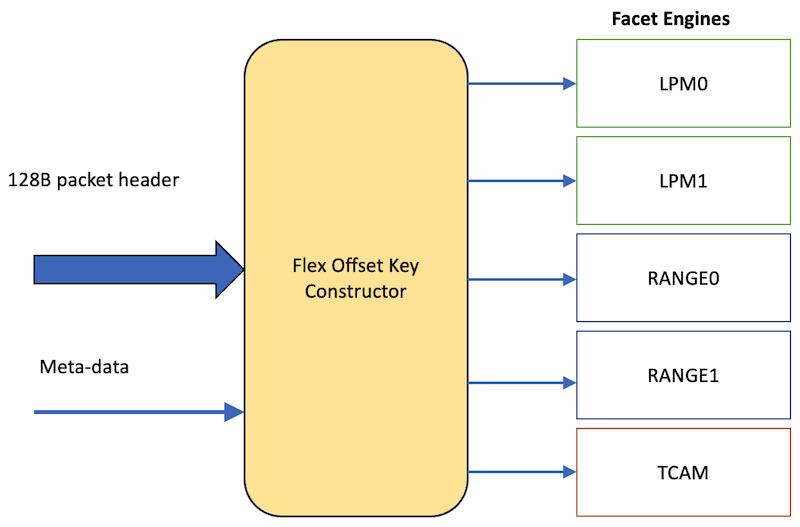
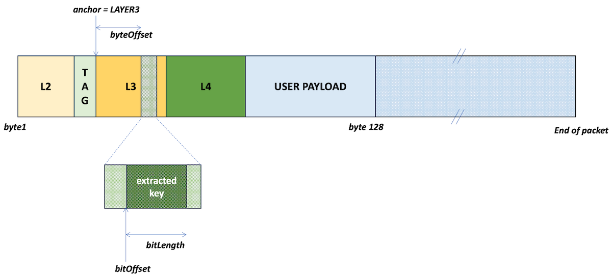
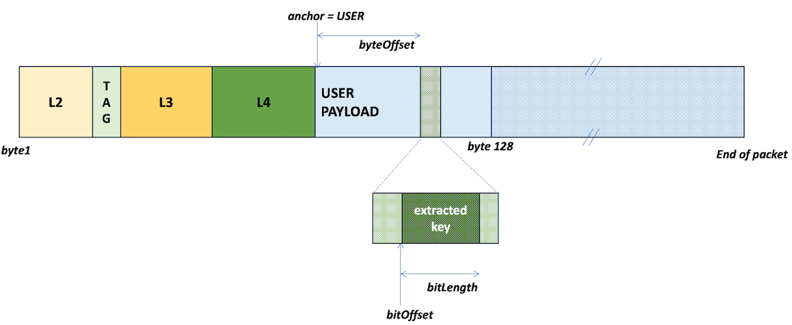

# Flex Offset Filters in Express5

**Chandrasekaran Venkatraman - 04/04/2024**

Filter in Express5 supports Flex Key match on any field in the first 128 bytes of the packet. Using software defined templates, firewall term matches are done using flex-key construction. This can be used to specify matches on user-defined packet byte locations via CLI.

## Introduction

Express architecture supports a highly versatile, multi-facet, high performance Filter to execute Firewall rules. In Express5 total flexibility is added in extracting the fields directly from the packet header. This will greatly enhance the firewall configurability.

## Filter Facets

The Filter function in Express chips is built using multiple Facet Engines that operate in parallel. The Facet Engines can do specialized lookups to perform Longest Prefix Match, Range Match and Exact Match. Each filter execution can support up to 4 Longest Prefix matches, 4 Range matches and 2 Exact matches. A large set of packet header fields are available for inclusion in the match criteria.

In Express4 and its predecessor chips, the protocol header fields were extracted from the packet by the Parser and made available to the Filter for inclusion in the Facet lookup. So, the firewall terms were restricted to those fields extracted by pre-defined, hard-wired rules of the Parsing function. Check this article for more details: [https://juniper.github.io/techposts/express-4-filters-foundation/article](https://juniper.github.io/techposts/express-4-filters-foundation/article)

In Express5 this is entirely flexible, which not only satisfies the most typical firewall applications, but also makes it possible to quickly add support for future applications that require matching on fields from user payload or new protocol headers defined by newly defined drafts and RFCs.

This flexibility of the Express5 Filter can be leveraged to support Flex Offset matches via CLI. This will allow customers to do matches on user-defined byte locations in the packet.



## Dual Stack Capability

In Express5 an enhanced set of metadata is generated by the processing stages that are upstream of the Filter. These preceding blocks can parse and classify two protocol stacks in the incoming packet. This enhanced ability is made use for tunnel applications by sending the dual-stack metadata information to the Filter. The information set comprises the byte offsets of layer2, layer3, layer4 headers of the transport stack (outer) and the payload stack (inner), and the logical interfaces and the VRF information derived from both stacks. This allows the Filter to extract fields from the tunnel headers as well as the payload headers. In addition to this, the Filter can extract fields from the user bytes that come after the payload headers deep inside the packet.

Having the logical interfaces and the VRF information of both tunnel and payload available to the Filter lets us support multiple bind-points for filter. For example, if a VXLAN tunnel is terminated, Filter can extract fields from the inner Ethernet payload headers as well as from the outer VXLAN tunnel headers for matching terms.

## Flex Offset Filter

Filter receives the first 128 bytes of the packet header and uses it to extract fields from any byte offset. Software programmable FlexKey Templates specify the parameters for field extraction. The byte offsets are programmed in the form of FieldDescriptors in the Templates and are specified relative to an anchor-point in the protocol stack.

A sufficiently large number of *FlexKey Templates* are supported by the Facet Key constructor that fronts the Facet Engines. Each *FlexKey Template* consists of up to 6 *FieldDescriptors* (number varies depending on the Facet type). Each *FieldDescriptor* has the following parameters:

- ***anchor***: specifies one of the valid Protocol Layers or the User Payload in the first 128 bytes. For example, this can specify the standard headers such as Ethernet, IP, MPLS, UDP, TCP etc., using the layer indicator or can specify the user payload

- ***stack***: specifies whether to extract from tunnel or payload stack

- ***byteOffset***: a signed value that seeks forward or backward by +/- 64 bytes relative to the anchor inside the stack to set the final extraction point in byte granularity

- ***bitOffset, bitLength***:  specify how many bits to slice from what bit position

- ***shift, mask***: offer flexibility to transform the extracted bits before including in the lookup key

The combined key size of all the Facet engines for a given Filter execution can be as wide as 92 bytes.





## Flex Offset Filter Examples

- **BGP FlowSpec payload match**:  BGP FlowSpec is used to mitigate denial-of-service attacks by disseminating firewall rules across the network. Operators specify n-tuple match criteria using packet header fields such as IP protocol, Prefix, Port numbers. The Express5 FlexOffset Filter adds enhancement to this feature by allowing the operator to specify matches at user-defined arbitrary locations in the packet header or payload.

- **Example CLI command** (based on MX):

```
firewall {
    flexible-match FM-FIRST-TWO-L3-BYTES {
        match-start layer-3;
        byte-offset 0;
        bit-offset 0;
        bit-length 16;
    }
    flexible-match FM-THREE-PAYLOAD-BYTES {
        match-start payload;
        byte-offset 1;
        bit-offset 0;
        bit-length 24;
    }
}
```

## Useful links

- Firewall Filter Flexible Match Conditions on MX: [https://www.juniper.net/documentation/us/en/software/junos/routing-policy/topics/concept/firewall-filter-flexible-match-conditions-overview.html](https://www.juniper.net/documentation/us/en/software/junos/routing-policy/topics/concept/firewall-filter-flexible-match-conditions-overview.html)
- Draft : BGP FlowSpec Payload Matching: [https://datatracker.ietf.org/doc/draft-khare-idr-bgp-flowspec-payload-match/](https://datatracker.ietf.org/doc/draft-khare-idr-bgp-flowspec-payload-match/)
- Express 4 Filters Foundation: [https://juniper.github.io/techposts/express-4-filters-foundation/article](https://juniper.github.io/techposts/express-4-filters-foundation/article)

## Glossary

- LPM : Longest Prefix Match
- TCAM : Ternary Content Addressable Memory
- CLI : Command Line Interface
- VRF : Virtual Routing and Forwarding instance
- VXLAN : Virtual Extensible Local Area Network

## Acknowledgements

Below is a list of people who helped build and review the content or provided information for this article:

- Dmitry Shokarev
- Nancy Shaw
- Sharada Yeluri
- Swamy SRK
