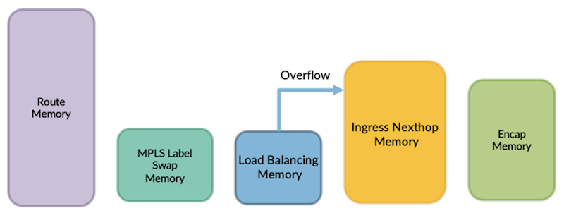
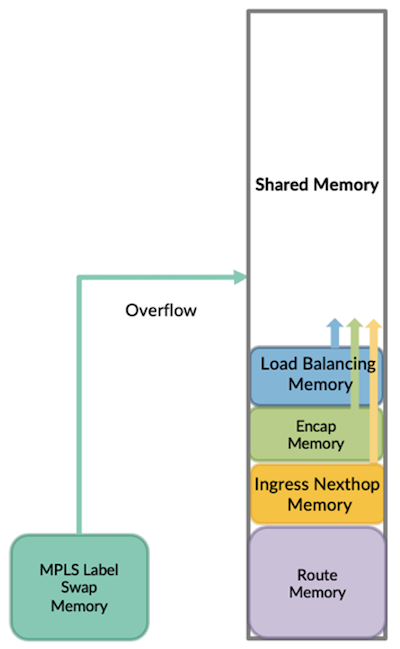

# Flexible Memory in Express5

**Swamy Srk - 06/03/2024**

Express5 fungible shared memory architecture provides the foundation for a flexible memory scheme which increases scale and efficiency of memory utilization.

## Introduction

Typically, a fixed pipeline architecture ASIC comes with fixed-size tables or memories for various applications in the packet processing pipeline. Each memory's occupancies vary depending on the features configured and scale supported. In certain scenarios, combinations of features and scale could lead to the memory exhaustion of certain memories. In earlier ASICs, this kind of issue could be mitigated in software using the following techniques:

- Software optimizations
- Introducing profile based CLI knob

## Flexible Shared Memory

Each of the above approaches comes with challenges related to software maintainability and increased test cycles. In Express5 ASIC, this issue is addressed by introducing shared or common memory for the memory blocks in contention to support high-scale multi-dimensional use cases. Shared memory comes with a couple of capabilities:

- Combining multiple memory blocks into a single large memory.
- Added overflow support for extending feature-specific memory blocks.

Shared memory in Express5 is statically partitioned between Route and Nexthop Memory. Route memory ([used as FIB Cache](https://juniper.github.io/techposts/fib-scale-in-express5/article)) size is fixed and cannot be modified during runtime (after bootup) whereas Nexthop memory can grow dynamically as shown in the above diagram. Nexthop memory is classified into:

- **MPLS Label Swap Memory**: Enables sharing the MPLS nexthops by keeping the varying MPLS labels in the swap memory.
- **Load Balancing Memory**: Load balancing data structures a.k.a selector table are stored in this memory.
- **Ingress Nexthop Memory**: Hosts the Ingress nexthop instructions which are used to build ingress nexthop hierarchies for steering the packet to egress PFE.
- **Egress Memory**: Stores the encapsulation headers.

In Express5 PFE software, a new application called "Fuse allocator" is introduced to manage the shared memory efficiently. This allocator provides APIs to allocate and free shared memory resources by reducing fragmentation, handles various intricacies of ASIC memory allocation scheme, and provides APIs for insights. In summary, this new shared memory scheme helped to increase the unidimensional scale of various features by leaps and bounds. In addition, it also helped to address many high-scale multi-dimensional use cases related to peering, DCI, and service providers.

Table: Unidimensional Scale Improvements in Express5 compared to Express4

| Feature | Express5 compared to Express4 |
|:--|:--|
| MPLS RSVP Ingress Scale | x4 |
| MPLS RSVP Transit Scale | x2 |
| SR-TE MPLS Scale | x8 |
| Tunnel Encapsulation Scale | x2 |
| Route Scale | x5 |

## Glossary

- MPLS: MultiProtocol Label Switching
- CLI: Command Line Interface
- SR-TE: Segment Routing Traffic Engineering
- PFE: Packet Forwarding Engine
- DCI: Data Center Interconnect
- API: Application Programming Interface

## Useful Links

- Express 5 Overview: [https://juniper.github.io/techposts/express-5-overview/article](https://juniper.github.io/techposts/express-5-overview/article)
- Introducing PTX10002-36QDD: [https://juniper.github.io/techposts/introducing-ptx10002-36qdd/article](https://juniper.github.io/techposts/introducing-ptx10002-36qdd/article)
- Flexible Packet Processing Pipelines: [https://juniper.github.io/techposts/flexible-packet-processing-pipelines/article](https://juniper.github.io/techposts/flexible-packet-processing-pipelines/article)
- FIB Scale In Express5: [https://juniper.github.io/techposts/fib-scale-in-express5/article](https://juniper.github.io/techposts/fib-scale-in-express5/article)

## Acknowledgements

- Chandrasekaran Venkataraman
- Dmitry Shokarev
- Nancy Shaw
- Sreenivas Gadela
