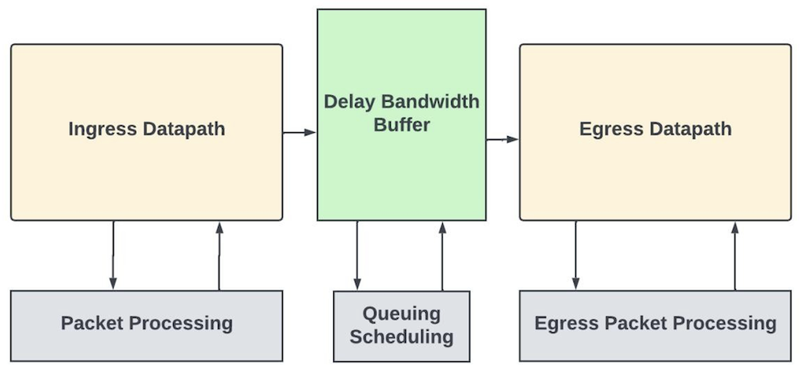
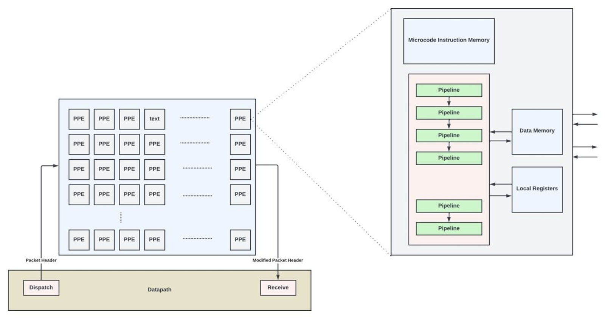
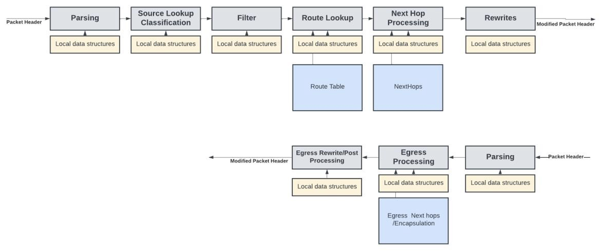
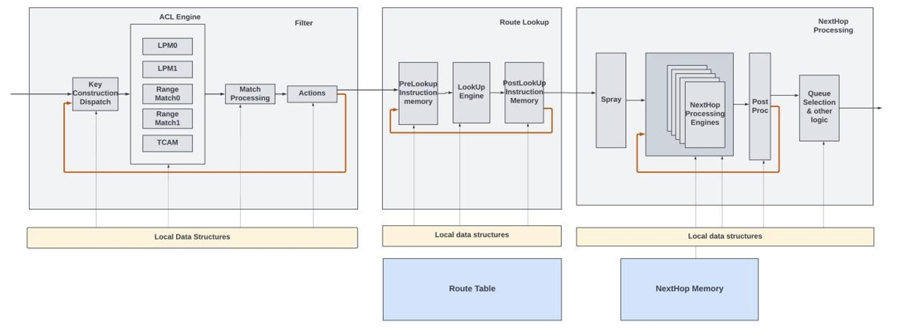
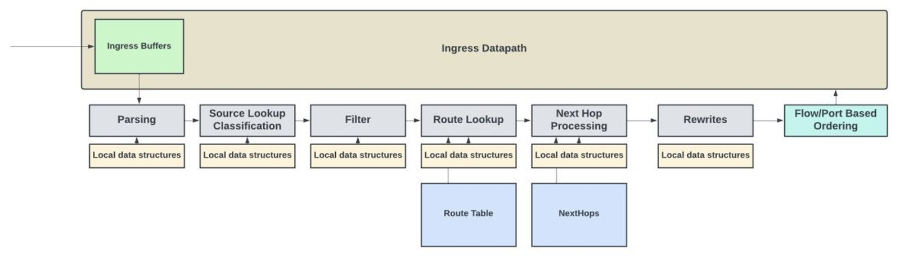
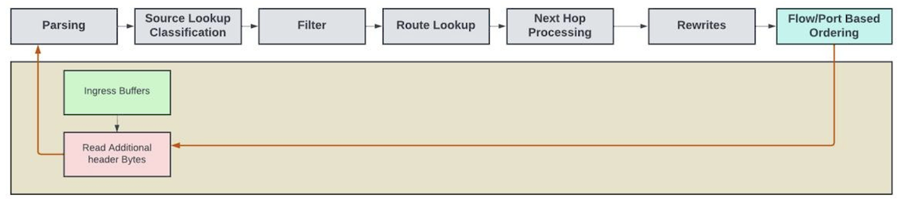
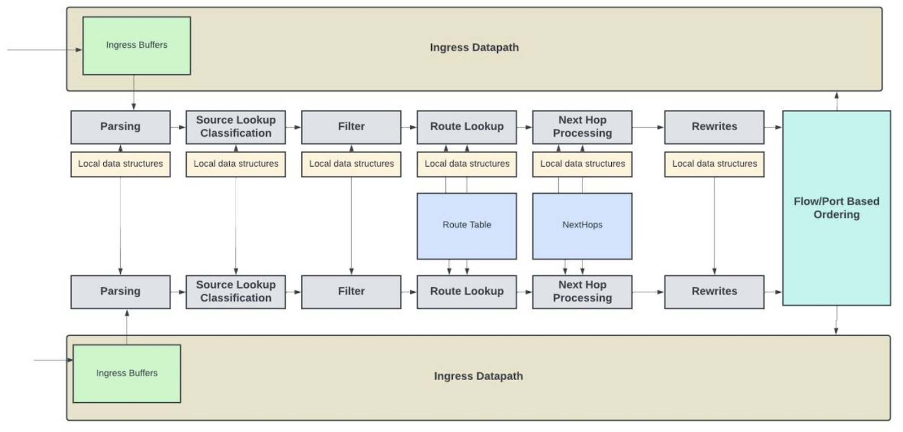
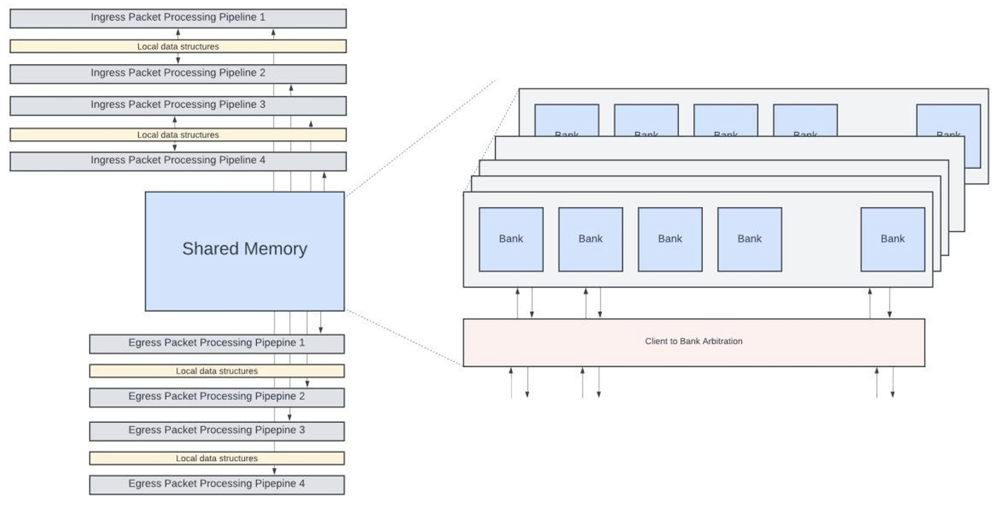
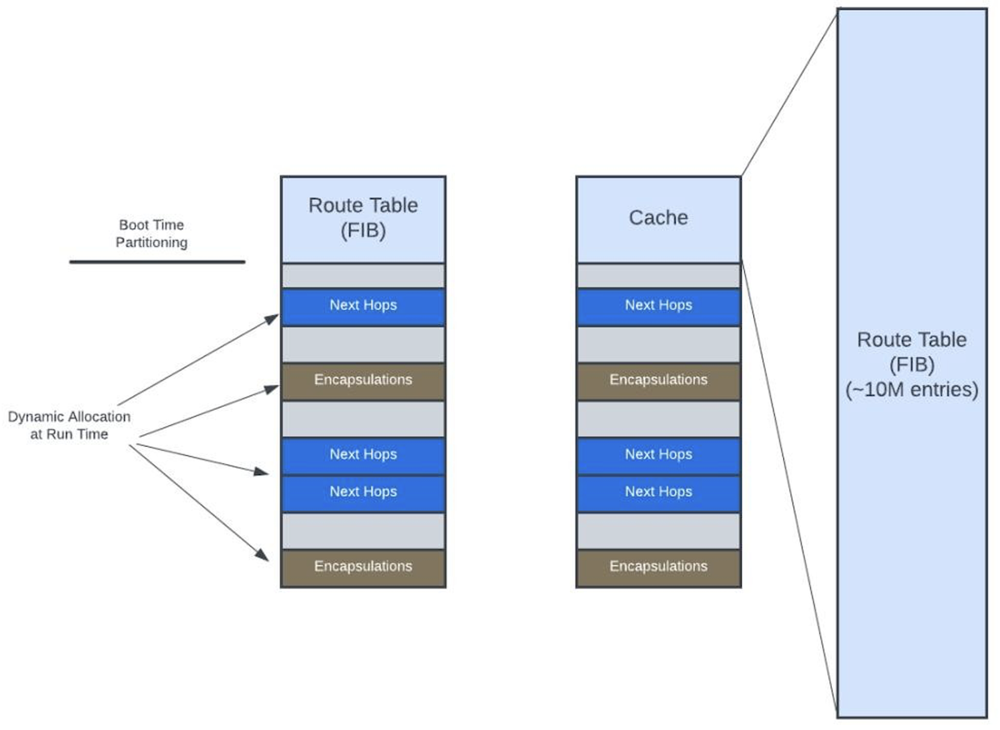

# Flexible Packet Processing Pipelines

**Sharada Yeluri - 03/28/2024**

High-level overview of packet processing, exploring the evolution of throughput demands for these processing units, and discussing various methods employed to execute these functions within networking chips.

This article has been initially published on LinkedIn at: [https://www.linkedin.com/pulse/flexible-packet-processing-pipelines-sharada-yeluri-enf5c/](https://www.linkedin.com/pulse/flexible-packet-processing-pipelines-sharada-yeluri-enf5c/)

It's part of a series on Express5, PTX Routers and 800Gbps interfaces:

- Express5 Overview: [https://juniper.github.io/techposts/express-5-overview/article](https://juniper.github.io/techposts/express-5-overview/article)
- Introducing PTX10002-36QDD: [https://juniper.github.io/techposts/introducing-ptx10002-36qdd/article](https://juniper.github.io/techposts/introducing-ptx10002-36qdd/article)

## Introduction

As networking chips pack higher bandwidth with each new generation, the workload on their internal packet processing units rises proportionally. Failure to process packets at the incoming rate from network interfaces results in random packet loss and reduced throughput.

## Packet Processing

Packet processing in a networking chip refers to the series of actions a chip performs on network packets as they pass through the chip in a router, switch, or firewall. The actions can be determining the final physical interface through which the packet must leave the router, queuing and scheduling to go out from that interface, dropping the packet if it violates traffic rules/checks, or sending the packet to the control plane for further inspection and so on.

Network chips mainly inspect the L2/L3 headers of the packet. They also natively support inspecting the headers encapsulated under 1-2 tunnels. The main functions of packet processing (at a helicopter level) can be described below.

### Parsing

The first step involves analyzing the packet's header to understand its structure and protocols (like Ethernet, VLANs, IP, TCP/UDP, and any encapsulations present). Parsing identifies key fields that will be used in subsequent processing steps, such as source and destination addresses, port numbers, and protocol types. Encapsulation is a common practice in networking where the packet is wrapped with an additional layer of header, often to provide additional functionality such as security (in the case of VPNs) and tunneling (like GRE or VXLAN). This results in a packet having an outer header and one or more inner headers. In such cases, parsing logic needs to inspect the outer header as well as the inner headers. This capability is crucial for modern network infrastructures that rely heavily on encapsulation technologies to segment, secure, and manage network traffic.

### Classification

The source of the packet is determined. The source of a packet encompasses its host identity (layer 2 and, if possible, layer 3), its receive interface (logical and physical), and its forwarding domains. Often, binding checks between the layer2 addresses and the physical interface where the packet comes in are performed.

Packets are then classified based on their header fields, such as source/destination IP addresses, port numbers, and protocol type. Classification determines how the packet should be treated, for example, which Quality of Service (QoS) policies apply.

### Tunnel Termination

By comparing the tunnel header fields with the tunnel endpoints, the logic determines if the tunnel needs to be terminated. For tunnel termination, the encapsulated data packets are decapsulated, returning them to their original format before being delivered to their final destination. There are many variations of outer/inner headers, and the network chips may support different subsets of tunnel terminations depending on their deployment use cases. Some popular tunnels supported are MPLS, VXLAN, GRE, MPLSoverUDP, IPinIP, etc.

### Filtering

Many devices implement packet filtering through Access Control Lists (ACLs). ACLs contain a list of terms. Terms are used to define the matching criteria for packets. Each term may specify criteria for several of the packet's fields. Conceptually, the list of terms in a filter is processed in order from the first term to the last. When a matching term is found, the testing of further terms is halted, and the actions associated with the matching term are executed. The actions could involve dropping the packet or policing/accounting, etc. Filters can be applied to inbound or outbound traffic on network interfaces.

The filter can use exact matches (e.g., on MAC addresses), longest prefix matches (e.g., on IP addresses), arbitrary range matches (e.g., on TCP/UDP ports), or TCAM matches (e.g., on TCP flags) to check for required conditions in each term.

### Route Lookup

Based on the packet's destination address and the routing table, the processor decides the next hop for the packet and forwards it accordingly. This involves doing the longest prefix match lookup for IPv4/IPv6 packets and index-based lookups when forwarding MPLS packets or exact matches when doing L2 forwarding based on the destination MAC address. The lookup results may directly indicate the outgoing transmit interface for the packet or can point to a series of nexthop instructions that are executed to find the transmit interface.

### NextHop Processing

Next-hop processing (executing a series of next-hop instructions stored in a large memory) determines how to forward the packet to its destination. The processing yields the destination port from which the packet must leave, load balancing for ECMP or LAG, and determining MPLS labels pushed or swapped, among others. Packets are optionally policed and counted.

### Rewrites

As the last step, packet headers are modified to strip encapsulating headers (in case of tunnel termination), TTL decrement updates, V4 checksum updates, timestamp updates, etc.

### Post Ingress Processing

Once the ingress packet processing is complete, the packet may get dropped if the destination queue is congested or if the packet is chosen for WRED drop. When the packet is allowed to forward, it gets queued inside the on-chip buffer or external memory buffer. The queuing of the packet on the ingress and the optional queuing on egress (for CIOQ architectures where the packets are buffered and queued in both ingress and egress) and the egress scheduling depends heavily on the architecture of the network chip and is a topic for a later discussion.

### Egress Packet Processing

When the packet is read out of the buffers to go out of the egress interfaces, it goes through further processing on the egress for making any required modifications to the packet before transmission. The modifications include adding new L2 header and/or VLAN tags, encapsulations (when the network device is at a tunnel entry point), adding MPLS labels, etc. Optionally, the packets can go through egress filtering/policing as well. The implementations vary from device to device.

A large-scale router could be built using multiple modular routing chips interconnected through the switch fabric. I will use the term packet forwarding entity (PFE) to refer to these modular routing chips. In these systems, ingress packet processing happens in the PFE where the network traffic enters, and the egress packet processing happens at the PFE through which the traffic exits.

## Packet Processing Implementations

The implementation choice depends on the flexibility required, the total throughput of the device, and the power/performance/area budget for this functionality.

### Special Purpose Processing Engines

Around two decades ago, when the network protocols were evolving rapidly with new optional/extension headers and tunnel standards released at a breakneck pace, the obvious choice to implement the packet processing functions was through a sea of special purpose processing engines that are highly flexible and programmable. These special-purpose processing engines typically contain microcode instructions stored in on-chip and/or off-chip instruction memories. Unlike RISC and X86 instruction sets, microcode is a low-level instruction set, often packed as a very long instruction word (VLIW). The processing engine sequences through these microcode instructions that parse different fields of the packet header stored in its local memory to determine the structure of the packet and perform all other ingress and egress processing functions described above. The processing engine's hardware is unaware of any network protocol. It blindly executes the instructions to form a new packet header and to compute the outgoing interface.

While offering infinite flexibility, microcode-based processing is inefficient in chip area or power per Gbps. In hybrid approaches, some functions like filtering/longest prefix match lookups, policing, etc., could be natively implemented in the hardware (hardware accelerators) while using microcode instructions for parsing and the rest of the packet forwarding functions.

### Packet Processing Pipelines

As the high-end chips started packing more WAN bandwidth, the hybrid approaches could not keep up with power/area per Gbps targets. Over a decade ago, several network vendors moved on to implementing all packet processing functions natively with hardware pipelines (while providing limited flexibility in the form of local/function-specific instructions/sequencing operations).
The conceptual diagram of an ingress packet processing pipeline (loosely based on Juniper's Express Architecture pipeline implementation) is shown below.

The pipeline contains a series of subsequent blocks or modules where each module is responsible for specific functions described in the previous section. Usually, the entire packet is stored in the data path memories while the headers (the first 128B of the packets) go through the packet processing pipeline. Since the packet processing does not inspect or care about the headers beyond L4 headers, sending the entire packet through the pipeline is unnecessary.

Depending on the throughput requirements, the packet headers are sent through the pipeline at the rate of one packet per cycle or slower. Each module has many local data structures/configurations stored in the SRAMs.

### Flexibility in the Pipelines

Networking is an emerging field with new protocols and extensions to existing protocols developed/standardized often to accommodate emerging technologies and requirements. There is almost a 3-4-year delay between a new RFC standard and when it can be seen in the networking silicon. That's why having some flexibility in these pipelines is highly desirable.

For example, in addition to standard parsing of known L2-L4 headers, the hardware can support flexible parsing functions to parse a future protocol header or an extension of an existing protocol. It can be implemented using a series of cams and rulesets that specify byte offsets to look for the Type/Length/Value fields of the new protocol.

All network applications do not go through the same packet processing. For example, some packets might need more than one lookup. The first lookup could be an LPM look-up to find the packet's next destination. The second lookup might involve more specific routing policies, such as policy-based routing, where decisions are made based on additional packet fields or the application type. Similarly, In MPLS networks, the first lookup might involve reading the MPLS label to make forwarding decisions within the MPLS network. When the packet reaches the edge of the MPLS network, and the label is popped, a second lookup is necessary to determine the packet's next hop based on its original IP header.

The lookup functions in the Express packet processing pipeline provide this option where the action from the first lookup can indicate a subsequent lookup and the header is circulated back to the beginning of the lookup function for the next lookup.

Similarly, each packet might have more than one filter attached, and the action from the first filter may indicate the need for a second filter, and so on. The search arguments (or the keys) used in both route lookup and filter should allow flexibility in extracting any byte from the header fields to allow customers to use CLI to set up matches on any custom byte positions in the packet. The sequence and the number of next-hop instructions the packet executes varies from packet to packet, and the next-hop processing should allow variable processing for packets of different applications/destinations.

Express architecture's packet processing pipelines support all of the above-mentioned and many more hooks to allow flexibility.

Note that the packet order is not maintained in a flexible packet processing pipeline as each packet goes through a different pipeline and with a different number of lookups, filters, and next-hop operations. A network device must not reorder packets belonging to the same flow. The coarse granularity for the flow is the input port/interface the packet came in. A finer granularity that looks at the five tuples of the packet and computes the hash function to determine the flow can be used. A reorder engine at the end of the pipelines puts the packets back in the per-port or per-flow order.

### Recirculation

In some encapsulations, the header bytes can go beyond 128B. For these cases where the inner header could not be detected in the first pass, the packets are sent through the processing pipeline again after stripping the header bytes that were already parsed, reading additional header bytes from the ingress memory, and sending the new header back through the pipeline. The processing steps are repeated with inner headers in the subsequent pass.

Examples of recirculation applications are MPLS over UDP, where more than two stacks need to be processed, and Firewall-based Tunnel Decapsulations.

## Throughput

The packets per second processing rate required of a network chip is proportional to the smallest packets that can enter the device (usually 64B ethernet frames), the inter-packet gap (IPG), and the total WAN throughput of the device.

`Packets per second = (bits/second) / (bits /packet + IPG/packet)`

For a 3.2Tbps device, if the packet processing has to keep up with 64B packets coming back to back, it would need to process close to 5 packets per cycle at 1GHz clock frequency. Since the maximum each pipeline can operate is one packet per cycle, this translates to ~5 packet processing pipelines! This is quite expensive in terms of area and power.

| WAN BW(Gbps) | Minimum Packet Size | Bits/Packet | IPG/Packet | Packets/Second (BPPS) | Processing Time per Packet (ns) | Clock Frequency (GHz) | Packets per Cycle |
|:--|:--|:--|:--|:--|:--|:--|:--|
| 3200 | 64 | 512 | 160 | 4.76 | 0.21 | 1.00 | 4.76 |

*Meeting the line rate for 64B packets requires 5 pipelines for a 3.2Tbps device.*

In real-world network traffic, the average packet size is typically larger than 64B. While minimum-sized packets are common in specific scenarios (like control messages or ACK packets in TCP communications), most traffic, especially streaming, file transfers, and bulk data applications generally use maximum transmission unit (MTU) sized packets to maximize throughput. The average packet size varies between the applications where the router is placed but is generally 4x-10x the 64B minimum packet that ethernet can support.

Designing packet processing engines to optimize for the average common packet sizes can lead to a better design where the die area is used effectively. How do we come up with an average packet size? One approach is to inspect the various IMIX patterns that are used in network performance tests.

IMIX, which stands for Internet MIX, refers to a concept used in network performance testing to simulate real-world Internet traffic patterns more accurately. Instead of using uniform packet sizes, an IMIX employs a mixture of packet sizes to represent the diverse nature of Internet traffic. For instance, an IMIX might include a mix of small packets (64 bytes, common for ACKs or control messages), medium-sized packets (around 576 bytes, often used for specific application data), and large packets (around 1500 bytes, typical for data transfer protocols like TCP to maximize throughput within the Ethernet MTU constraints) and the distribution ratio among them.

There isn't a universally accepted standard for what an IMIX packet size distribution should be. Different organizations might define their own IMIX profiles based on their specific needs and observations of network traffic. Both Google and Meta have their own IMIX patterns when evaluating the network devices. Wikipedia defines IMIX as a mix of 64B/576B and 1500B packets at an average packet size of 370B.

Assuming packet processing needs to process, on average, ~345Byte size packets at line rate (to give some speed-up over standard IMIX), and we can clock the chip at 1.1GHz, we can get away with one pipeline! This is 5x area savings over the design that can handle a 64B packet line rate.

| WAN BW(Gbps) | Minimum Packet Size | Bits/Packet | IPG/Packet | Packets/Second (BPPS) | Processing Time per Packet (ns) | Clock Frequency (GHz) | Packets per Cycle |
|:--|:--|:--|:--|:--|:--|:--|:--|
| 3200 | 64 | 512 | 160 | 4.76 | 0.21 | 1.00 | 4.76 |
| 3200 | 128 | 1024 | 160 | 2.70 | 0.37 | 1.00 | 2.70 |
| 3200 | 180 | 1440 | 160 | 2.00 | 0.50 | 1.00 | 2.00 |
| 3200 | 345 | 2760 | 160 | 1.10 | 0.91 | 1.10 | 1.00 |

*The table shows how the number of pipelines can be reduced as we increase the average packet size to meet the line rate.*

However, this needs a burst absorption buffer at the input of the packet processing to absorb the transient bursts as the internet traffic pattern could be bursty, and there could be transient scenarios where the average packet size is less than 350B with many back-to-back small packets. If this buffer (ingress buffer, as shown in the diagram below) starts filling up, the hardware can do priority-aware drops where control/keep-alive packets are given higher priority. The policy for the drops differs from vendor to vendor.

In the previous generation, Express Silicon (Express4), it was decided to add two pipelines for 3.2Tbps processing to give an average packet size of ~180B. As shown below, they could share the local data structures, route tables, and next-hop memories when implementing two pipelines.

The current generation network chips pack a lot more bandwidth than 3.2Tbps. For example, in Express5, each die can handle 14.4Tbps of network bandwidth. Unfortunately, transistor frequencies can be scaled only 15-20% with each process node. To support the same 180B minimum packet size would have meant adding 87 pipeline stages. Instead, we decided to take advantage of the fact that most of the well-known IMIX patterns have average packet sizes above 350B and decided to have four pipelines that can service 343B average packet size line rate at **~5 Billion** packets per second!

| WAN BW(Gbps) | Minimum Packet Size | Bits/Packet | IPG/Packet | Packets/Second (BPPS) | Processing Time per Packet (ns) | Clock Frequency (GHz) | Packets per Cycle |
|:--|:--|:--|:--|:--|:--|:--|:--|
| 14400 | 180 | 1440 | 160 | 9.00 | 0.11 | 1.24 | 7.26 |
| 14400 | 343 | 2744 | 160 | 4.96 | 0.20 | 1.24 | 4.00 |

*Pipelines for 14.4Tbps of processing*

These packet processing pipelines access large data structures that contain route tables for route lookups and tunnel tables to aid tunnel termination decisions and nexthops (ingress and egress). If these tables were to be replicated for each paired pipeline, it would take up precious areas in the chip by storing the same information twice.

### Shared Memory for Large Data Structures

To overcome this, Express5 provides a fungible, heavily banked shared memory structure that all pipelines access. Each bank can handle a memory access request independently of the others, allowing for simultaneous read/write operations from different pipelines. Novel client-to-bank request matching schemes maximize the number of clients that are serviced in every cycle. Small, per-client hot banking caches could reduce access to the central memory for frequently accessed locations from each pipeline's functions.

The software can use memory interleaving to distribute data structures across multiple banks so that sequential memory accesses are spread over different banks. This technique can enhance parallel access by reducing the likelihood of simultaneous access requests to the same bank (hot banking).

The structures could be managed as blocks that are partitioned at the boot time between the FIB (forwarding information database, a term used to refer to the route table entries installed in the network chip) and the rest of the data structures. The various data structures can be allocated blocks of memory locations dynamically. This memory management technique reduces the fragmentation and enables different applications to have different scales for these data structures.

The FIB partition may contain the actual route tables or the cached entries (when the route table resides in the external memory)

### Memory Expansion

The on-chip data structures, even with fungible partitioning are not large enough to store tens of millions of route table entries. Express5 architecture allows expanding the route table to the external memory (with up to 16M entries). When the FIB is stored in external memory, the on-chip memory can be used as the cache for frequently accessed entries.

## Summary/Future

Using Juniper's Express architecture as an example, the blog describes the techniques used in the packet processing engines of high-end routers to achieve billions of packets per second performance while providing enough flexibility in processing.

Packet processing functions rely on large configuration memories and data structures for flexibility and scaling. Unfortunately, SRAMs scaling with process nodes has stopped while transistors continue to scale somewhat (Refer to my previous blogs on chipsets to understand the scaling challenges). As more throughput gets packed in the chip, packet processing pipelines have to share the data structures more aggressively in next-generation designs.

In addition, any software enhancements that can optimize the data structures are much needed. For example, FIB compression is often done in high-end routers (like Juniper's PTX series) with millions of route table entries to reduce the memory footprint of the FIB in the device. Compression involves combining multiple FIB entries into a single entry where possible. This is usually done by arranging the IP addresses in a tree-like structure and collapsing certain child nodes with the parent node if they have the same next-hop. Similarly, multiple routes with overlapping IP address prefixes can be combined together if they share the same next-hop. Compression can provide up to 2x-8x compression of the routing table for various customer configurations.

The co-design of hardware and software, where both are developed in tandem with a deep understanding of the needs of network applications and hardware capabilities, can lead to a very efficient design. This approach ensures that the software and software demands fully utilize hardware capabilities and are met by hardware features without overdesign in hardware.

Next-generation architectures could further exploit increasing the average packet size (~500B) and use 3D packages with SRAM dies above the logic die (that contains the packet buffers and/or packet processing data structures) to pack more processing power inside the ASICs.

## Glossary

- ACL: Access-List
- ASIC: Application-Specific Integrated Circuit
- CIOQ: Combined Input Output Queue
- CLI: Command Line Interface
- FIB: Forwarding Information Base
- GRE: Generic Routing Encapsulation
- IPG: Inter-Packet Gap
- IMIX: Internet Mix packet size distribution
- MAC: Media Access Control (Address)
- MPLS: Multiprotocol Label Switching
- MTU: Maximum Transmission Unit
- PFE: Packet Forwarding Engine
- RFC: Request For Comment
- RISC: Reduced Instruction Set Computer
- SRAM: Static Random Access Memory
- TCP: Transmission Control Protocol
- UDP: User Datagram Protocol
- VLAN: Virtual Local Area Network
- VLIW: Very Long Instruction Word
- VXLAN: Virtual eXtensible Local-Area Network
- WRED: Weighted Random Early Detection

## Resources

- Express5 Overview: [https://juniper.github.io/techposts/express-5-overview/article](https://juniper.github.io/techposts/express-5-overview/article)
