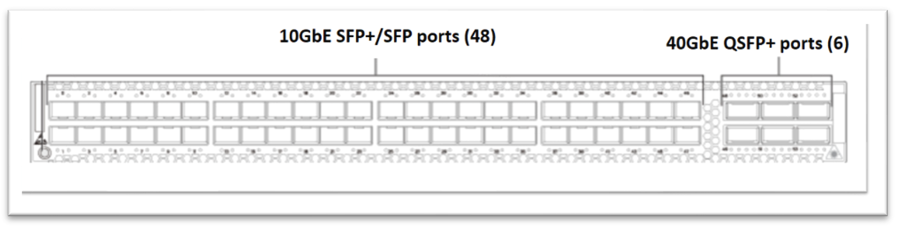
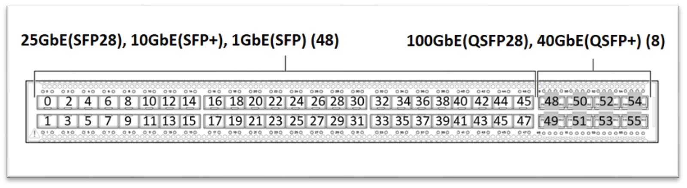
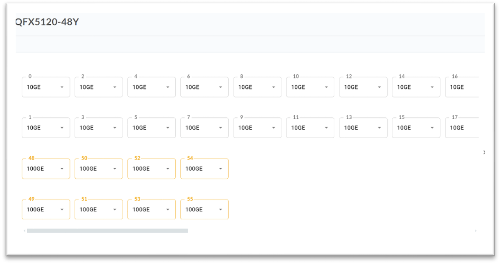
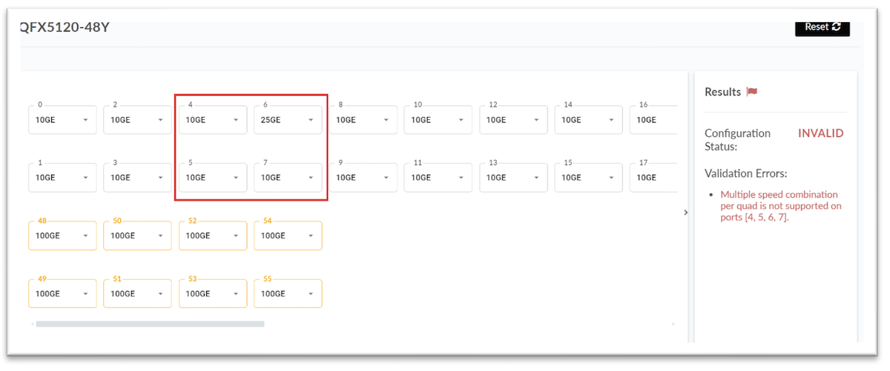
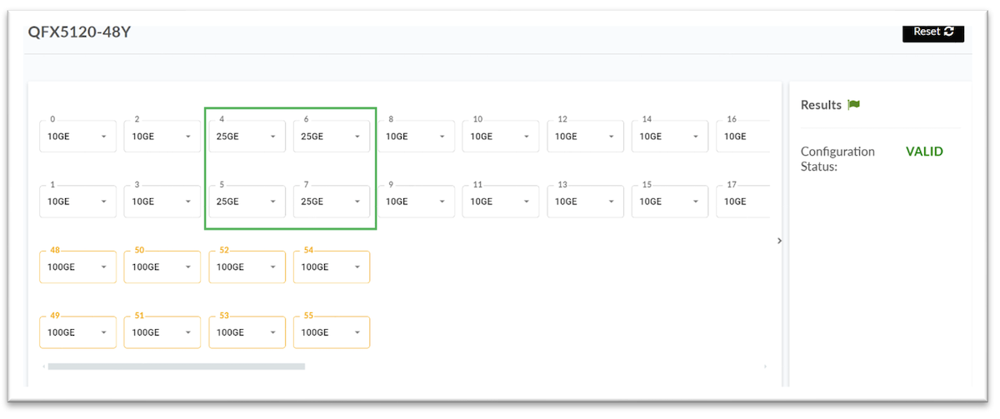
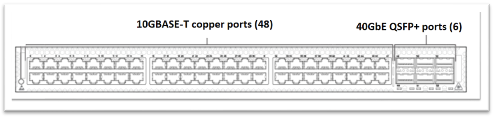
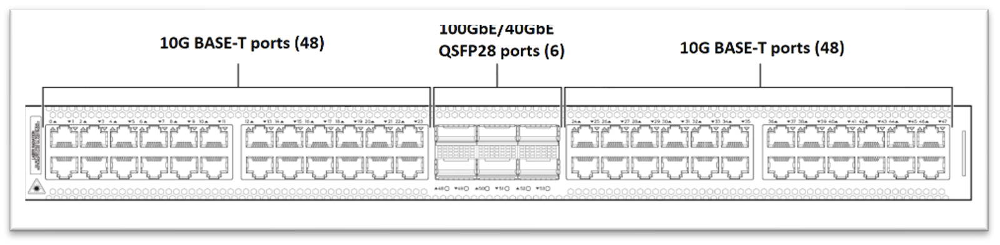

# From QFX5100 to QFX5120

**Nicole Henry - 08/27/2024**

Explore the software and hardware differences you will encounter regarding switch connectivity when transitioning from the end-of-life QFX5100-48S and QFX5100-48T switches to the replacement QFX5120-48T and QFX5120-48Y switches.

This document provides an overview of the connectivity differences between the -48S and -48T QFX5100 switches and the -48Y and -48T QFX5120 switches. It also covers physical interface hardware, interface configuration, optics, and design considerations that differ between these switches.

## Introduction

In April of 2021, the End Of Life (EOL) for the QFX5100-48S and QFX5100-48T switches was announced, with the last order of these switches having been on the first of July, 2022. The [QFX5100 line of switches](https://www.juniper.net/documentation/product/us/en/qfx5100/junos-os/) were popular switches in the leaf and access roles, and have been replaced by the [QFX5120 line of switches](https://www.juniper.net/us/en/products/switches/qfx-series/qfx5120-data-center-switches.html).

The QFX5120-48Y switch replaces the QFX5100-48S, while the QFX5120-48T replaces the QFX5100-48T.

While the QFX5120 line of switches is positioned as a direct replacement for the QFX5100 line of switches, there are important differences between them, especially for the -48(x) switches in these lines. This document will not cover all differences between these switches but should provide the information you need to plan a replacement of your QFX5100-48S and -48T switches with their 5120 successors.

Readers are encouraged to review the information on the [QFX5100 switches](https://apps.juniper.net/home/qfx5100/overview) and the [QFX5120 switches](https://apps.juniper.net/home/qfx5120-48y/overview) in the Juniper Pathfinder app.

## QFX5100 to QFX5120: Hardware

### From QFX5100-48S to QFX5120-48Y

The QFX5100-48S has 48 SFP+ downlink ports which are capable of 10 Gbps and 1 Gbps speeds using SFP+ modules for 10 GbE and SFP modules for 1 GbE. The QFX4100-48s also has 6 QSFP+ uplink ports capable of 40 Gbps speeds using QSFP+ modules.



The QFX5120-48Y has 48 SFP28 downlink ports that support 25 Gbps, 10 Gbps, and 1 Gbps speeds using SFP28 modules for 25 GbE, SFP+ modules for 10 Gbps, and SFP modules for 1 Gbps speeds. The QFX5120-48Y also has 8 uplink QSFP28 ports that support 100 Gbps & 40 Gbps speeds using QSFP28 modules for 100 GbE and QSFP+ modules for 40 Gbps speeds.



On the QFX5120-48Y, the default speed of the SFP28 interfaces (ports 0-47) is 10 Gbps, and the default speed of the QSFP28 interfaces (ports 48-55) is 100 Gbps. Additionally, the QSFP28 interfaces (ports 48-55) can be channelized to 4x25 Gbps and 4x10 Gbps.

> *Note: the QSFP28 ports on the QFX5120-48Y can only be channelized into four channels, meaning that you cannot channelize these ports into 10x10 Gbps ports.*

On the QFX5120-48Y The "S" ports are grouped in quads (groups of four, ports [0-3], ports [4-7], etc,) and, as such, the speeds of these ports can only be configured in quads. The SFP28 port speeds cannot be configured individually. For example, to set port 6 to 25GbE or 1GbE, you must configure the quad of ports 4-7 at the same speed for the configuration to take.

Figures 1-3 show an example from the Port Checker tool to visually see how the speed configuration should happen.







Below is a configuration example to set port 6 on fpc 0 pic 0 on a QFX5120-48Y to 1 Gbps.

CLI format :

```
set chassis fpc <fpc_number> pic <pic_number> port-range <lower_port_number> <upper_port_number> channel-speed <speed>

#set chassis fpc 0 pic 0 port-range 4 7 channel-speed 1g
#commit
```

There is no commit check. If an individual SFP28 port speed is configured, the device will not give an error message. However, the speed will not change.

Below is a configuration example to change a configured quad of ports from one speed to another, you must delete the configuration first and then set the next configuration.

```
#delete chassis fpc 0 pic 0 port-range 4 7 channel-speed 1g
#set chassis fpc 0 pic 0 port-range 4 7 channel-speed 10g
#commit
```

On the QFX5120-48Y the speeds of the QSFP28 interfaces (ports 48-55) can be configured individually, unlike the SFP28 ports.

### From QFX5100-48T to QFX5120-48T

The QFX5100-48T has 48 tri-speed copper downlink ports which are capable of 10 Gbps, 1 Gbps and 100 Mbps speeds using 8P8C (RJ-45)-based Category 5e or better ethernet cables, depending on the distance of the run. The QFX5100-48T also has 6 QSFP+ uplink ports capable of 40 Gbps speeds using QSFP+ modules



The QFX5120-48T has 48 copper downlink ports which are capable of 10 Gbps and 1 Gbps speeds using 8P8C (RJ-45)-based Category 5e or better ethernet cables (though category 6 or better is strongly recommended), depending on the distance of the cable run. The QFX5120-48T also has 6 QSFP28 ports that support 100 Gbps and 40 Gbps speeds using QSFP28 modules for 100 Gbps and QSFP+ modules for 40 Gbps speeds.



*Note: the QFX5120-48T does not support 100 Mbps speeds.*

Port speeds on the QFX5120-48T are configured individually. For the 48 8P8C (RJ-45) interfaces, the default speed is 10 Gbps and can be set to 1 Gbps. These ports do not support channelization. The default speed of the QSFP28 interfaces (ports 48-53) is 100 Gbps. These ports do support channelization.

Channelization support of the QSFP28 interfaces on the QFX5120-48T is as follows:

- All QSFP28 ports support 2x50 Gbps
- Only QSFP ports 50 & 51 support 4x10 Gbps or 4x25 Gbps.

Below is a configuration example to set port 49 on fpc 0 pic 0 of the QFX5120-48T to 50 Gbps.

CLI format :

```
set chassis fpc <fpc_number> pic <pic_number> port-num <port_number> channel-speed <speed>

#set chassis fpc 0 pic 0 port-num 49 channel-speed 50g
#commit
```

The interface names of the 48 8P8C (RJ-45) ports start with "xe", and the interface names of the 6 QSFP28 ports start with "et".

Below is a configuration example to set port 6 on fpc 0 pic 0 of the QFX5120-48T to 1 Gbps.

CLI format :

```
set interface <interface name> speed <speed>

#set interface xe-0/0/6 speed 1G
#commit
```

## QFX5100 to QFX5120: Software

### Virtual Chassis

If you're using Virtual Chassis (VC) functionality on your currently deployed QFX5100-series switches, be aware that the QFX5120-series switches do not support more than 2 members in a VC. If you have more than 2 members of a VC in your current QFX5100-series deployment you will need to engage your account team to discuss a redesign.

### Channelization: Interface Naming Conventions

When a physical port supports multiple interfaces, a colon will be used in the interface naming conventions as a delimiter to distinguish the multiple interfaces on that physical port. In the interface naming convention, xe-x/y/z:channel:

- x represents the FPC slot number.
- y represents the PIC slot number.
- z represents the physical port number.
- channel represents the number of interfaces that are channelized.

When the 40 GbE interfaces (et-fpc/pic/port) are channelized as 10 GbE interfaces, the interface appears in the format of xe-fpc/pic/port:channel, in which "channel" is a value of 0 through 3.

A practical nomenclature example of this is channelizing the 40 GbE interface of FPC slot 0, PIC 0, port 6 into 4x10 GbE interfaces.

This would result in the interface name transforming from et-0/0/6 to xe-0/0/6:0, xe-0/0/6:1, xe-0/0/6:2, xe-0/0/6:3.

**40GbE interface et-0/0/6 -> channelize -> 10Gbe interfaces xe-0/0/6:0-3**

Table: Channelized and Non-Channelized Interface Naming Formats

| Interfaces | Non-channelized InterfacesNaming Formats | Channelized InterfacesNaming Formats |
|:--|:--|:--|
| 10 GbE | Prefix is xe-.The interface name appears inxe-fpc/pic/port format. | Prefix is xe-.The interface name appears inxe-fpc/pic/port:channel format. |
| 25, 40, 100, 200, 400GbE | Prefix is et-.The interface name appears inet-fpc/pic/port format. | Prefix is et-.The interface name appears inet-fpc/pic/port:channel format. |

## QFX5100 to QFX5120: Optics

Table: Optics supported for QFX5100-48S but not for QFX5120-48Y

| Model Type | Model Number | Part Number | Description | Reasoning |
|:--|:--|:--|:--|:--|
| 40 GbE | JNP-QSFP-DAC-5MA | 740-052306 | QSFP+ 40GBase Direct Attach Copper Cable 5-meter, active | Lack of use case |
| 40 GbE | QSFPP-40G-LX4 | 740-062254 | QSFP+ 40GBase-LX4 40 GbE Optics, 100m(150m) with OM3(OM4) duplex MMF fiber | Please useJNP-QSFP-40G-LX4 |

## Glossary

- 8P8C: 8 position, 8 contact. The proper name for the network plug is commonly referred to as "RJ-45". In the context of computer networking, this refers exclusively to an unkeyed 8P8C connector supporting ANSI/TIA-568-wired cables.
- EOL: End of life
- FPC: Flexible PIC concentrator
- PIC: Physical interface card
- QSFP+: Quad small form-factor pluggable +
- QSFP28: Quad small form-factor 28
- RJ-45: Registered jack 45. This is a common term used for 8P8C connectors due to their similarity to the RJ45S standard. In the context of computer networking, this refers exclusively to an unkeyed 8P8C connector supporting ANSI/TIA-568-wired cables.
- SFP: Small form-factor pluggable
- SFP+: Small form-factor pluggable +
- SFP28: Small form-factor pluggable 28
- VC: Virtual chassis

## Useful links

- QFX5100 documentation: [https://www.juniper.net/documentation/product/us/en/qfx5100/junos-os/](https://www.juniper.net/documentation/product/us/en/qfx5100/junos-os/)
- QFX 5120 documentation: [https://www.juniper.net/us/en/products/switches/qfx-series/qfx5120-data-center-switches.html](https://www.juniper.net/us/en/products/switches/qfx-series/qfx5120-data-center-switches.html)
- Pathfinder information for QFX5100 switches: [https://apps.juniper.net/home/qfx5100/overview](https://apps.juniper.net/home/qfx5100/overview)
- Pathfinder information for QFX5120 switches: [https://apps.juniper.net/home/qfx5120-48y/overview](https://apps.juniper.net/home/qfx5120-48y/overview)

## Acknowledgments

Thanks to the reviewers: Trevor Pott, Ridha Hamidi, and Jeff Doyle
