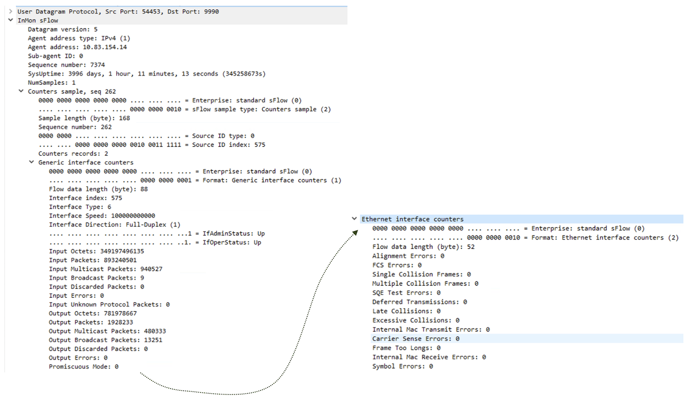
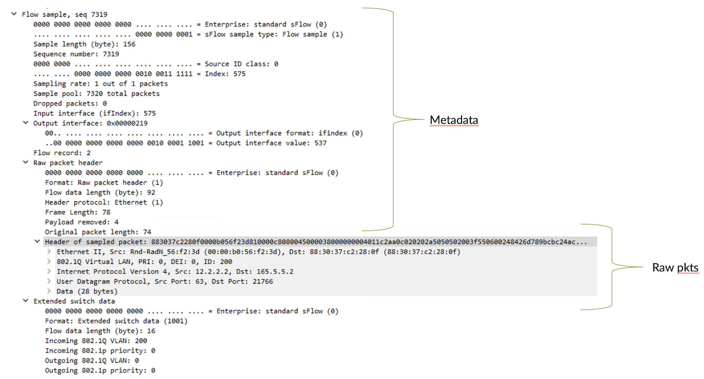
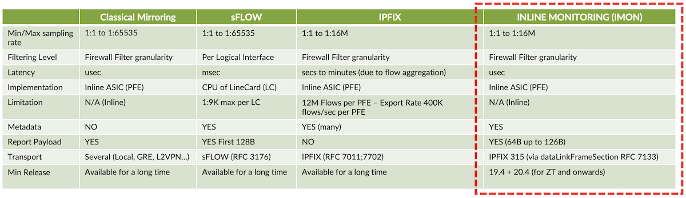
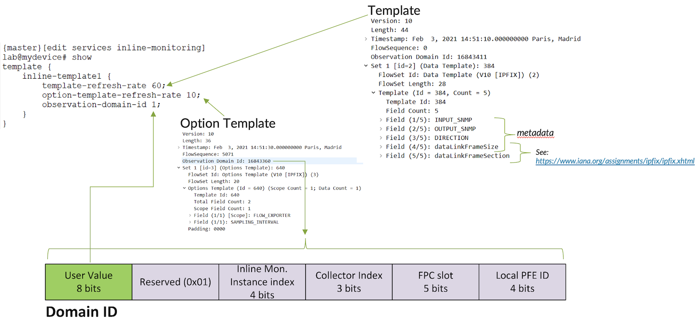
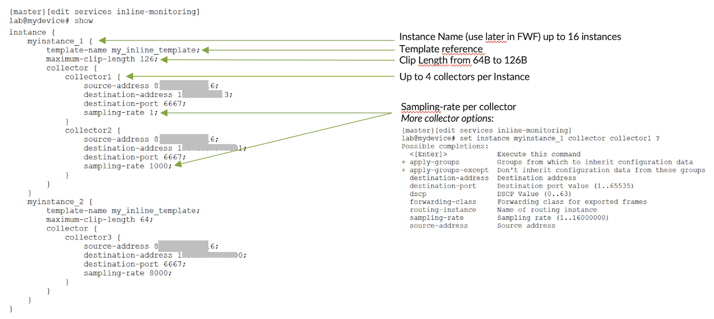
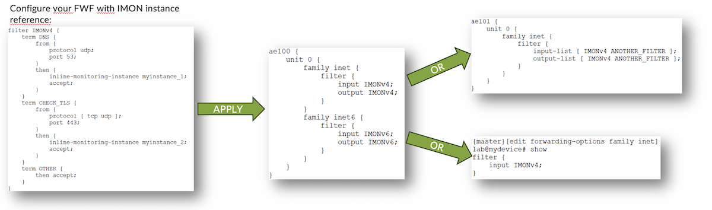
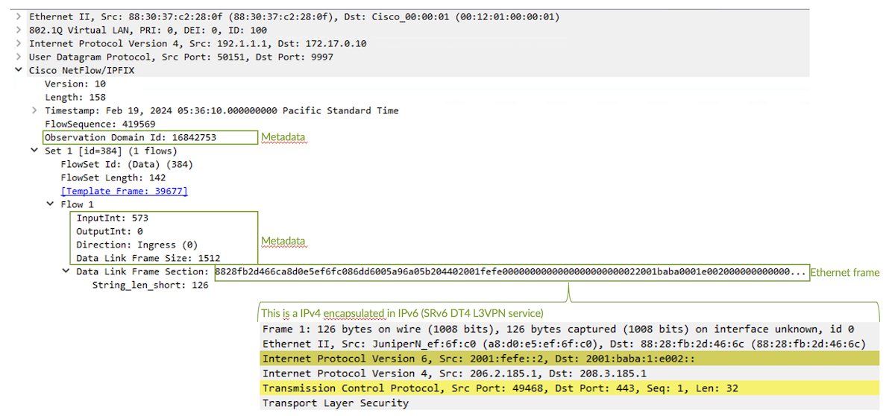
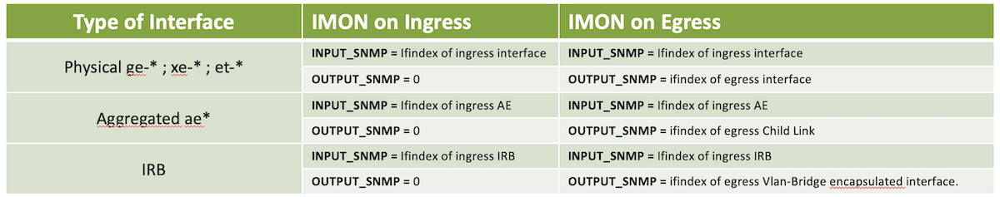

# From sFlow to IMON Flow Sampling on MX10K Platforms

**David Roy - 03/01/2024**

## Introduction

sFlow (sampled flow) is a protocol used for monitoring and collecting traffic data in devices, such as switches, routers, and other networking equipment. The specification of the sFlow protocol [is defined here: [1]](https://sflow.org/sflow_version_5.txt).

The sFlow protocol samples packets at the network device level and then send summarized information about these sampled packets to a central collector or monitoring system. A chunk of the sample packets can also be sent to the collector (like mirroring does).

Key components of sFlow include:

- Agents: embedded in network devices and are responsible for sampling packets and generating sFlow data.
- Collector: The central monitoring system that receives and processes the sFlow data from multiple agents. The collector aggregates the sampled data to provide insights into network performance, traffic patterns, and potential issues.
- sFlow datagrams: the units of data transmitted over the network containing information about the sampled packets, such as source and destination addresses, port numbers, and other relevant details.

As of now, the sFlow protocol is supported on several Juniper equipment. For the MX family, sFlow is only supported on platforms or linecards (LC) relying on the first Packet Forwarding Engine (PFE) software generation also known as uKernel-based platforms.

Indeed, the MX family is broad and can be divided into two groups (both run Junos, only the PFE software design/architecture differs):

- 1st generation of PFE: called uKernel-based platforms:
    - all MX products and LC from MPC1 to MPC9 (included).
- 2nd generation of PFE: called AFT-based platforms:
    - all new MX10K and the MX304
    - MPC10e and MPC11e for previous MX chassis generation, like MX240/480/960

So, the questions are: why new MX generations don't support sFlow and how to enable similar services, on recent MX platforms?

Let's answer the first question: why?

The answer is pretty straightforward. On Junos uKernel-based platforms, sFlow was implemented, based on [RFC3176 [2]](http://www.faqs.org/rfcs/rfc3176.html), as a pure software solution. This means: managed by the linecard's CPU and not by the ASIC itself. Only the packet capture is performed by the ASIC, then packets are punted to LC's CPU for further processing. This software implementation implies several limitations, particularly in term of scaling. By default on MX uKernel-based platforms, Junos supports a maximum of 1,000 flow samples per second, per LC. Nevertheless, the adaptive sampling rate feature and tuning "ddos-protection sample protocol" can help to reach up to 9,500 flow samples maximum per Flexible PIC Concentrator (FPC). This is still low for high-speed routers.

Based on this fact, and the increase in the router's throughput year after year (including high-density linecards), Juniper decided to not implement sFlow on recent MX Hardware. We preferred to implement a more efficient and scalable solution called Inline Monitoring (IMON), also known as IPFIX 315 (for [IPFIX Information Elements ID 315 [3]](https://www.iana.org/assignments/ipfix/ipfix.xhtml)). It relies on an open and standard solution, well-known for inline sampling: IPFIX.

In this article, we'll first summarize what sFlow offers in terms of functionalities. Then, in the second part, we'll present Inline Monitoring features and how we can configure it to propose similar sFlow functionalities and even more. We'll also present several open-source tools that are available to play the collector role.

## sFLOW Quick Overview of Juniper MX Implementation

As previously said, sFlow on MX uKernel-based platforms is a pure software solution, implemented by the CPU of the linecard/PFE. However,

- The packet sampling (copy of the packet) is by default performed in hardware by the ASIC.
- Then, the linecard CPU will process the sampled packets.
- Based on these packets, it will generate the flow samples packed into sFlow UDP datagrams.


As of now, sFlow MX implementation supports the following sFlow headers:

- sFlow Datagram header
- Flow Sample header
- Counter Sample header
- Raw Packet Header
- Ethernet Frame Data
- IPv4 Data
- IPv6 Data
- Extended Switch

A typical sFlow configuration on an MX204 is depicted below:

```
bob@mx204> show configuration protocols sflow 
polling-interval 60;
adaptive-sample-rate 1000 fallback sample-limit-threshold 500;
sample-rate ingress 1000;
source-ip 172.16.0.9;
collector 172.16.0.10 {
    udp-port 9990;
}
interfaces et-0/0/0.200
```

On the one hand, with the configuration above, we could expect to collect every minute (polling-interval 60) the interface statistics.

Sample export below:



And on the other hand, depending on the sample-rate you have configured, you will receive flow records like the example shown in figure 3. Additional metadata is also provided with the raw packet such as the input and output interface indexes and the original packet size.



To sum up, the sFlow protocol provides a range of valuable information:

- Overall port statistics (only for port(s) configured for sFlow).
- Packet metadata -- in/out interfaces indexes; original packet size.
- A chunk of the packet or the entire packet if the size is less than the max length.

Based on these details, an sFlow collector can extract well-known fields from the raw packet, compute traffic statistics and traffic matrix. But, because there is a "but", this feature doesn't scale on routers with tens of 100Gbps, 400Gbps, or even 800Gbps ports per linecard. We need a solution that scales more and this is, now, where the power of Inline Monitoring enters into the game.

Let's see in details how we configure and use it on all recent MX10K/MX304 and future MX products to achieve similar solutions as sFlow and even more.

> Note: Inline Monitoring is also supported on uKernel-based platforms.

## Which Solutions for Replacement?

sFlow isn't the right approach for high-density routers. We need a new scalable solution for these 2 main "services":

- the port statistics exports,
- and the flow sample exports.

### Port statistics

To replace the port statistics export feature, the first thing that comes to mind is Juniper streaming telemetry. This solution provides a more accurate and more scalable solution to collect port statistics (and not only). If we want to collect similar statistics, as sFlow, with streaming telemetry you can use these different sensor paths:

**/interfaces/interface[name=*]/state/counters:**

- counters/carrier-transitions
- counters/in-octets
- counters/in-pkts
- counters/out-octets
- counters/out-pkts
- counters/in-unicast-pkts
- counters/in-multicast-pkts
- counters/in-broadcast-pkts
- counters/in-pause-pkts
- counters/out-unicast-pkts
- counters/out-multicast-pkts
- counters/out-broadcast-pkts
- counters/out-pause-pkts
- counters/in-errors
- counters/in-fcs-errors
- counters/in-discards
- counters/out-errors
- counters/out-discards

**/interfaces/interface[name=*]/ethernet/state**

- state/port-speed
- state/enable-flow-control
- state/negotiated-port-speed
- state/mac-address
- state/auto-negotiate
- state/duplex-mode
- state/hw-mac-address
- state/negotiated-duplex-mode
- state/counters/in-mac-control-frames
- state/counters/in-mac-pause-frames
- state/counters/in-oversize-frames
- state/counters/in-jabber-frames
- state/counters/in-fragment-frames
- state/counters/in-xq-frames
- state/counters/in-crc-errors
- state/counters/in-block-errors
- state/counters/out-mac-control-frames
- state/counters/out-mac-pause-frames
- state/counters/in-distribution/in-frames-x-octets
- state/counters/in-distribution/in-frames-x-x-octets

### Flow Sample Solutions

The next step is to find a solution for collecting traffic "patterns" statistics. To replace this "flow sample" sFlow's feature on MX10K and MX304, we have 3 solutions:

- IPFIX aka. inline jFlow
- Inline Port Mirroring
- Inline Monitoring

We'll not spend time on the 2 firsts but let's briefly explain why those 2 first solutions might be a good replacement for sFlow. First, have a look at the next figure which gives you an overview of the different "flow sampling" solutions the MX platform offers us:



If you were using sFlow to extract, from the raw packets, some well-known fields such as IP source, destination, TCP/UDP port and you didn't want to extract "exotics" fields or proprietary headers, the de-facto solution is "classical" IPFIX. IPFIX for flow aggregation, is an inline feature on MX. With the right sampling rate configured depending on your use case and your overall router's throughput you can easily rely on IPFIX to have a good approximation of your traffic and most of the well-known fields are exported in the records.

You can find more information about [IPFIX for flow aggregation, here [4]](https://www.juniper.net/documentation/us/en/software/junos/flow-monitoring/topics/concept/services-ipfix-flow-template-flow-aggregation-configuring.html)

The second solution is to use classical port-mirroring. This approach provides a way to sample transit packets and send those samples to a remote collector (via GRE, L2VPN). In this case, you will collect only the raw packets without any metadata.

More info about port-mirroring configuration on MX routers [can be found here: [5]](https://supportportal.juniper.net/s/article/MX-Example-Configuring-port-mirroring-on-MX-devices?language=en_US)

In the rest of the article, we will focus on the third solution, Inline Monitoring aka. IMON, which offers similar sFlow's features, and more.

## The Power of Inline Monitoring

### Pros of Inline Monitoring

In previous table (figure 4), you see IMON has no real flow limitation as it is fully implemented in hardware. One other "pro" of IMON compared to sFlow is the ability to specify which kind of traffic you want to sample, thanks to the granularity of the Junos firewalling toolkit.

The main benefits of IMON are:

- Packet sampling: capture packets from the Ethernet Header: 64B up to 126B (configurable)
- Add metadata: Input / Output Interface Index / Direction / Original packet size.
- Use IPFIX "container" + leverages IPFIX templating (easy to add metadata in the future)
- No latency: no flow aggregation/buffering
- No MPC/PFE adherence (unlike classical IPFIX)
- Several instances (up to 16)
- Several collectors per instance (up to 4 per instance)
- Per collector sampling rate
- Flexible: applied through Firewall Filter
- Supported on all families (starting from 21.1 -- before only inet and inet6 were supported)
- Applicable on Ingress and/or Egress direction
- Compatible with Forwarding Table Filter - FTF
- Configurable DSCP/Forwarding Class/Routing Instance for inline monitoring flow exports.
- Can be combined in parallel with other sampling solutions such as classical IPFIX flow aggregation.

### How to configure Inline Monitoring

Inline Monitoring is configured under "services inline-monitoring". The first step is to define an IMON IPFIX template:

```
[edit services inline-monitoring]
bob@mx204# show
template {
    inline-template1 {
        template-refresh-rate 60;
        option-template-refresh-rate 10;
        observation-domain-id 1;
    }
}
```

As seen, you should define the refresh interval rate (in seconds) for the IPFIX/IMON template and option-template. Both templates will be used by the remote collector to be aware of the structure of the data and be able to decode the IPFIX records. Only the "template" is used for decoding raw packets. The "option template" only provides some IMON engine metadata, such as information about the flow exporter and the sampling rate (useful to extrapolate and compute throughput approximation). The observation-domain-id is a field exported in all IPFIX/IMON records which provides additional metadata regarding the origin of the sample packet. In reality, the value set by the configuration knob is a sub-field of a larger field. Indeed, the observation-domain-id is a 32 bits, and what you'll set using the "observation-domain-id" config stanza is just a value of 8 bits size called domain-id. The other bits/fields of the real observation-domain-id field will be filled automatically by the ASIC. The following figures try to summarize what we discussed above and provide details about the observation-domain-id structure:



We configured our template, now it's time to set up one IMON Instance made of one collector. For that, we applied the following configuration. As you can see, we refer to the previously configured template named "inline-template1":

```
[edit services inline-monitoring]
bob@mx204# show
instance {
    myinstance1 {
        template-name inline-template1;
        maximum-clip-length 126;
        collector {
            collector1 {
                source-address 192.1.1.1;
                destination-address 172.17.0.10;
                destination-port 9997;
                sampling-rate 1000;
                routing-instance public;
            }
        }
    }
}
```

For each instance, you can define the length of the chunk of packet: between 64 and 126 bytes. For each collector, you should at least define IP information, a destination UDP port value and finally a sampling rate. In our case, we want to stream Inline Monitoring datagrams in a specific routing-instance but this is optional. The next figure summarizes the different options for configuring IMON instances:



As already mentioned, there is no need to "anchor" a given IMON instance to a given MPC/PFE like we had to do with classical IPFIX for flow aggregation. In this context, we just refer to our configured IMON instances in any kind of firewall filter. Remember,  IMON is supported for all families starting from 21.1 -- before this Junos release only inet and inet6 families were supported.



As depicted in figure 7, we can apply the IMON Firewall Filter either directly under the interface family (via input/output knobs or input-list/output-list knobs or input-chain/output-chain knobs) or apply it to the overall system by using the FTF approach.

### Decoding the IMON's records

Before discussing how to decode IMON records with a collector, let's have a look at the Wireshark packet capture of one IMON/IPFIX record. The below figure shows the decoded metadata conveyed along with the raw packet. In this specific example, we had also asked Wireshark to decode the raw packet - as you can see for our example this is an SRv6 packet.
**



As you can observe in the previous pcap example, the "OutputInt" metadata field is empty (set to 0). Actually, this field is not always updated in the records. It depends on the direction you applied Inline Monitoring feature. If you applied it on ingress, some packet processing is done after the IMON packet sampling and thus some fields are not updated due to the lack of information at the ASIC level (LUSS to be precise). The following table below details how the Input and Output interface indexes are filled by the ASIC.



### IMON Collectors

Can we ingest and decode those IMON flow records at scale with open-source solutions?

The answer is quite simply YES. As IMON relies on "standard" and is based on well-known IPFIX headers, it's easy to extend/evolve a collector that already supports classical IPFIX, for supporting IMON payloads. This is, for instance, the case of 2 well-known and heavily deployed tools for flow collection:

- [pmacct [6]](https://github.com/pmacct/pmacct)
- [Goflow 2 [7]](https://github.com/netsampler/goflow2)

> Note: These are not the only two open-source collectors that support IMON ([i.e. FastNetMon [8] is one](https://fastnetmon.com/) and [Akvorado is another one [10]](https://github.com/akvorado/akvorado)). Remember, IMON relies on an open standard: IPFIX 315.

With these 2 above tools, you can define a template to decode well-known fields or any other field that is present in the first 126 bytes of the raw packet. This is one advantage of IMON compared to IPFIX (Netflow v10). IMON lets the field decoding task on the collector side and does not rely on pre-defined templates. This allows users to define by themselves what they want to decode: from well-known fields such as IP addresses, to unusual fields or proprietary headers.

First, let's have a look at the first tool "pmacct". We use the docker version of this tool for simplicity and flexibility. First step is to download the docker image. For that, we use the following command.

> Note: we pull the nfacctd module of pmacct which is responsible of Netflow protocol:

```
dave@my-vm# docker pull pmacct/nfacctd:latest
```

Then, we create a new directory under /opt and we create 2 config files for the nfacctd daemon:

```
dave@my-vm# mkdir /opt/pmacct
dave@my-vm# cd /opt/pmacct 
dave@my-vm# touch nfacctd.conf
dave@my-vm# touch primitive.lst
```

The first config file content is the following:

```
dave@my-vm# cat nfacctd.conf

debug: false
debug_internal_msg: false

nfacctd_port: 9997
plugin_buffer_size: 13107200
plugin_pipe_size: 1342177280
nfacctd_disable_checks: false
!
plugins: print
!
aggregate_primitives: /var/tmp/primitive.lst
aggregate: mac_src,mac_dst,ip4_src,ip4_dst,ip4_proto,udp_src,ip6_src,ip6_dst,ip6_proto,udp_dst,tcp_src,tcp_dst
!
print_output: json
print_refresh_time: 30
print_history: 60m
print_output_file: /var/log/imon.json
print_output_file_append: true
print_history_roundoff: m
!
```

Some explanations regarding the highlighted lines:

- We define the udp port to listen to -- here 9997
- We want to push flow samples, after decoding, into a file - this is why we use the plugin "print". Several other output plugins are available such as Kafka. Refer to the documentation for details.
- As IMON provides raw packets, we need to decode some fields. For that, we refer to another config file called aggregate_primitives. We see later the content of this file.
- Then, we specify the fields we want to aggregate the flows on. The field's names, here, are defined in the primitive.lst file.
- Finally we configure the "print" output plugin -- we define among other things the type of encoding: json and the name of the output file: imon.json.

Now, let's have a look at the content of the primitive.lst file:

```
dave@my-vm# cat primitive.lst

name=mac_src packet_ptr=packet:+6 len=6 semantics=mac
name=mac_dst packet_ptr=packet len=6 semantics=Mac

name=ip4_src packet_ptr=l3:0x0800+12 len=4 semantics=ip
name=ip4_dst packet_ptr=l3:0x0800+16 len=4 semantics=ip
name=ip4_proto packet_ptr=l3:0x0800+9 len=1 semantics=u_int

name=ip6_src packet_ptr=l3:0x86dd+8 len=16 semantics=ip
name=ip6_dst packet_ptr=l3:0x86dd+24 len=16 semantics=ip
name=ip6_proto packet_ptr=l3:0x86dd+6 len=1 semantics=u_int

name=udp_src packet_ptr=l4:17 len=2 semantics=u_int
name=udp_dst packet_ptr=l4:17+2 len=2 semantics=u_int
name=tcp_src packet_ptr=l4:6 len=2 semantics=u_int
name=tcp_dst packet_ptr=l4:6+2 len=2 semantics=u_int
```

At first glance, the syntax seems a little bit complex but it's well-documented. It is just a combination of start pointer, bit offset and field length/type. With this specific and simple config file, we can extract from the IMON raw packet the fields: MAC src/dst, IP src/dst and IP proto for both families, and TCP and UDP src/dst ports.

Now let's run pmacct/nfacctd by using docker run command. You can see we set up 3 volumes one for linking the nfacctd.conf file, the second for the primitive.lst file and finally the third one for the output file imon.json.

```
dave@my-vm# docker run -p 9997:9997/udp / 
-v /opt/pmacct/nfacctd.conf:/etc/pmacct/nfacctd.conf /
-v /opt/pmacct/primitive.lst:/var/tmp/primitive.lst  /
-v /opt/pmacct/imon.json:/var/log/imon.json pmacct/nfacctd
```

If you issue a "tail -f" of the imon.json output file you should be able to see some flows (we also use jq tool for pretty printing json content):

```
dave@my-vm# tail -f /opt/pmacct/imon.json | jq 
{
  "event_type": "purge",
  "mac_src": "a8:d0:e5:ef:6f:c0",
  "mac_dst": "88:28:fb:2d:46:6c",
  "ip4_src": "0.0.0.0",
  "ip4_dst": "0.0.0.0",
  "ip4_proto": "0",
  "udp_src": "0",
  "ip6_src": "2001:fefe::2",
  "ip6_dst": "2001:baba:1:e002::",
  "ip6_proto": "4",
  "udp_dst": "0",
  "tcp_src": "0",
  "tcp_dst": "0",
  "stamp_inserted": "2024-02-19 13:00:00",
  "stamp_updated": "2024-02-19 15:53:01",
  "packets": 71234,
  "bytes": 28716182
}
{
  "event_type": "purge",
  "mac_src": "a8:d0:e5:ef:6f:c0",
  "mac_dst": "88:28:fb:2d:46:6c",
[...]
```

Fantastic, we can see our flow aggregation.

The second well-known tool, my favorite one, to be honest, is Goflow2. This software is the Swiss army knife for all flow-based protocols, and it scales pretty well even with hundreds of thousands of flows per second.

Of course, it supports IMON and we are going to see how to use it for decoding our IMON datagrams. Like pmacct, for simplicity, we'll use the docker instance. Let's first pull the tool:

```
dave@my-vm# docker pull netsampler/goflow2:latest
```

Then, just run the goflow2 container. We only setup one volume to retrieve decoded flows on the host OS and then we pass to goflow2 some parameters to indicate the UDP port to listen to and the output plugin -- once again for testing purposes, we choce to use a file: imon.json. In production, the most common output is a Kafka Bus on which you can then collect "consumers" like a DB ([ClickHouse DB [9]](https://clickhouse.com/) is well designed for flow-based data) or any other third-party tools to perform data enrichment, trigger alarms or play some machine learning algorithms...

```
dave@my-vm# docker run -p 9997:9997/udp /
-v /opt/pmacct/imon.json:/var/log/imon.json /
netsampler/goflow2:latest -listen 'netflow://:9997' -format json -transport.file /var/log/imon.json
```

Once started, we can issue a "tail -f" of the imon.json file:

```
dave@my-vm# tail -f /opt/pmacct/imon.json | jq 

{
  "Type": "IPFIX",
  "TimeReceived": 1708367557,
  "SequenceNum": 415031,
  "SamplingRate": 1000,
  "FlowDirection": 0,
  "SamplerAddress": "192.1.1.1",
  "TimeFlowStart": 0,
  "TimeFlowEnd": 0,
  "TimeFlowStartMs": 0,
  "TimeFlowEndMs": 0,
  "Bytes": 159,
  "Packets": 1,
  "SrcAddr": "2001:fefe::2",
  "DstAddr": "2001:baba:1:e002::",
  "Etype": 34525,
  "Proto": 4,
  "SrcPort": 0,
  "DstPort": 0,
  "InIf": 573,
  "OutIf": 0,
  "SrcMac": "a8:d0:e5:ef:6f:c0",
  "DstMac": "88:28:fb:2d:46:6c",
  "SrcVlan": 0,
  "DstVlan": 0,
  "VlanId": 0,
  "IngressVrfId": 0,
  "EgressVrfId": 0,
  "IpTos": 0,
  "ForwardingStatus": 0,
  "IpTtl": 64,
  "TcpFlags": 0,
  "IcmpType": 0,
  "IcmpCode": 0,
  "Ipv6FlowLabel": 5552,
  "FragmentId": 0,
  "FragmentOffset": 0,
  "BiFlowDirection": 0,
  "SrcAs": 0,
  "DstAs": 0,
  "NextHop": "",
  "NextHopAs": 0,
  "SrcNet": 0,
  "DstNet": 0,
  "BgpNextHop": [],
  "BgpCommunities": [],
  "AsPath": [],
  "HasMpls": false,
  "MplsCount": 0,
  "Mpls_1Ttl": 0,
  "Mpls_1Label": 0,
  "Mpls_2Ttl": 0,
  "Mpls_2Label": 0,
  "Mpls_3Ttl": 0,
  "Mpls_3Label": 0,
  "MplsLastTtl": 0,
  "MplsLastLabel": 0,
  "MplsLabelIp": [],
  "ObservationDomainId": 16842756,
  "ObservationPointId": 0,
  "CustomInteger_1": 0,
  "CustomInteger_2": 0,
  "CustomInteger_3": 0,
  "CustomInteger_4": 0,
  "CustomInteger_5": 0,
  "CustomBytes_1": [],
  "CustomBytes_2": [],
  "CustomBytes_3": [],
  "CustomBytes_4": [],
  "CustomBytes_5": []
}
{
  "Type": "IPFIX",
  "TimeReceived": 1708367557,
  "SequenceNum": 414287,
```

Awesome, as observed, goflow2 can decode a lot of well-known fields from the raw packets without defining them. Nevertheless, if you want to decode a specific header or field, you can tune goflow2 for that (see documentation).

## Conclusion

New MX routers don't support sFlow. Instead, IMON, coupled with Juniper streaming telemetry, offers a better, richer and more scalable solution. Juniper's Inline Monitoring solution relies on standards: any tools supporting IPFIX 315 can easily evolve to decode it. That's already the case for several popular IPFIX collectors like pmacct or goflow2.

IMON is a powerful solution. Give it a try, you'll adopt it.

## Useful links

- [1] [https://sflow.org/sflow_version_5.txt](https://sflow.org/sflow_version_5.txt)
- [2] [http://www.faqs.org/rfcs/rfc3176.html](http://www.faqs.org/rfcs/rfc3176.html)
- [3] [https://www.iana.org/assignments/ipfix/ipfix.xhtml](https://www.iana.org/assignments/ipfix/ipfix.xhtml)
- [4] [https://www.juniper.net/documentation/us/en/software/junos/flow-monitoring/topics/concept/services-ipfix-flow-template-flow-aggregation-configuring.html](https://www.juniper.net/documentation/us/en/software/junos/flow-monitoring/topics/concept/services-ipfix-flow-template-flow-aggregation-configuring.html)
- [5] [https://supportportal.juniper.net/s/article/MX-Example-Configuring-port-mirroring-on-MX-devices?language=en_US](https://supportportal.juniper.net/s/article/MX-Example-Configuring-port-mirroring-on-MX-devices?language=en_US)
- [6] [https://github.com/pmacct/pmacct](https://github.com/pmacct/pmacct)
- [7] [https://github.com/netsampler/goflow2](https://github.com/netsampler/goflow2)
- [8] [https://fastnetmon.com/](https://fastnetmon.com/)
- [9] [https://clickhouse.com/](https://clickhouse.com/)
- [10] [https://github.com/akvorado/akvorado](https://github.com/akvorado/akvorado)

## Glossary

- AFT: Advanced Forwarding Toolkit
- ASIC: Application Specific Integrated Circuits
- CPU: Central Processing Unit
- DDoS: Distributed Deny of Service
- DSCP: Differentiated Services Code Point
- FTF: Forwarding Table Filter
- GRE: Generic Routing Encapsulation
- IMON: Inline Monitoring
- IPFIX: IP Flow Information Export
- KPI: Key Performance Indicator
- LC: Line Card
- LUSS: LookUp Sub-System
- MPC: Modular PIC Concentrator
- PFE: Packet Forwarding Engine
