# From SRX Chassis Cluster to MNHA -- Configurations side by side

**Laurent Paumelle - 07/13/2026**

After the techpost "SRX clustering: from Chassis Cluster to MultiNode High Availability", let's deep dive into their respective configuration side by side. Below a simplified diagram showing the same architecture with an SRX pair segmenting 2 networks:

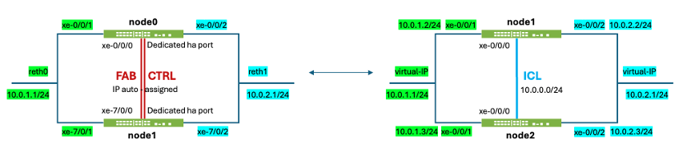

In this series, also mention the other techposts from various people:

- [Multi-Node High Availability Basics](https://juniper.github.io/techpost/articles/multi-node-high-availability-basics/article/) (from Steven Jacques)
- [Hybrid MNHA with eBGP](https://juniper.github.io/techpost/articles/hybrid-mnha-with-ebgp/article/) (from James Rathburn)
- [SRX clustering: from Chassis Cluster to MultiNode High Availability](https://juniper.github.io/techpost/articles/srx-from-chassis-cluster-to-mnha/article/) (from Laurent Paumelle)
- [MNHA, IPSec and Multiple Routing Instances](https://juniper.github.io/techpost/articles/mnha-ipsec-and-multiple-routing-instances/article/)
- [DHCP on MNHA: Back to Basics](https://juniper.github.io/techpost/articles/dhcp-on-mnha-back-to-basics/article/) (from James Rathburn)
- [SRX MNHA with VRRP](https://juniper.github.io/techpost/articles/srx-mnha-vrrp/article/) (from Karel Hendrych)

As quick reminder, I'll use terms "CC" for "legacy Chassis Cluster" and "MNHA" for the new "MultiNode High Availability". See techposts above for more details.

## Introduction

The topology to study is a simple network interconnection with an SRX pair sandwiched between the Trust/Left (in green) and Untrust/Right networks (in blue). The network mode is simple, Default Gateway for the left network, matching the most used "reth" (redundant interface) of a Chassis Cluster, and also the Virtual IP (VIP) of MNHA.

The left diagram below represents a CC and its right counterpart for MNHA. Some links between the SRX pair represent the synchronization link and packet-forwarding link, when appropriate: CTRL and FAB for CC and ICL, and ICD for MNHA (ICD not shown below since not used in this setup).

The networking is the same on both sides to make comparison simpler:

- 10.0.1.0/24 for Trust/Left, default gateway being reth0/VIP 10.0.1.1
- 10.0.2.0/24 for Untrust/Right, common IP being reth0/VIP 10.0.2.1
- Not shown on below diagrams are the management interface (fxp0) but it appears in some config statements. Its network is 192.168.100.0/24

Notes for CC:

- Left/Right per device interfaces have no IP address (optional)
- CTRL and FAB links have requirements: dedicated L2 segment, jumbo frame support (mtu > 9000 bytes), disable igmp-snooping, preserve vlan-id 4094.
- CTRL link is used for state control between the 2 devices
- FAB link is used for session synchronization, and in the asymmetric case also forwards packets (Z-mode)
- Node numbering is node0 and node1

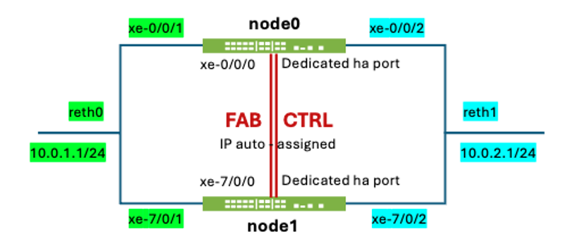

Notes for MNHA:

- Left/Right interfaces have an IP address as they can be used for monitoring and/or peering with BGP (not mandatory though)
- ICL is just a regular IP link and has no specific requirement and can be also routed, and IPsec encrypted.
- There is no dedicated ICL link so any interface (or sub-interface) can be used.
- If used, ICD helps handle asymetric session establishments (and then have a slightly larger MTU with its UDP header)
- Node numbering is node1 and node2

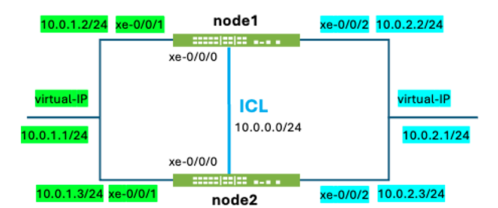

The configurations below will show side by side (when not too large) for CC and MNHA. For CC, since it uses a single active Routing Engine (RE, aka management), there is no duplication of commands/configs across nodes (except at initial setup), as the chassis is "extended" between the 2 SRX. For MNHA, it's often split into node1 and node2 commands and config as each has independent configurations. An optional mechanism exists in Junos to synchronize part of the configuration (commit sync).

Color used to make things clearer (hopefully):

- Green for trust/left side
- Blue for untrust/right side
- Yellow for cluster specific elements (but important to highlight)
- Pink for some other cluster IP elements

The content below will be split into 2 columns to compare configurations and outputs side by side:

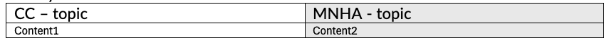

## Cluster initialization

To build a Chassis Cluster, we need to set initial commands and reboot. Same for MNHA, but in reverse order, it starts with the initial configuration, then reboot.

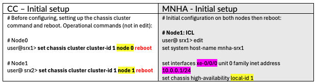

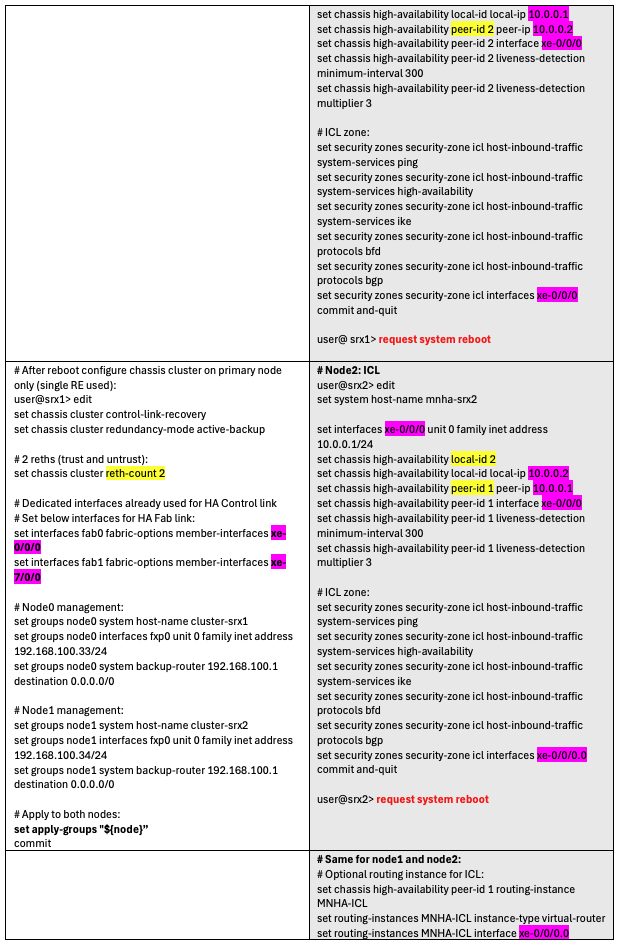

## Cluster Groups

CC uses Redundancy Groups (RG) and MNHA Secure Redundancy Groups (SRG), but their meanings are (almost) the same: grouping functions together.

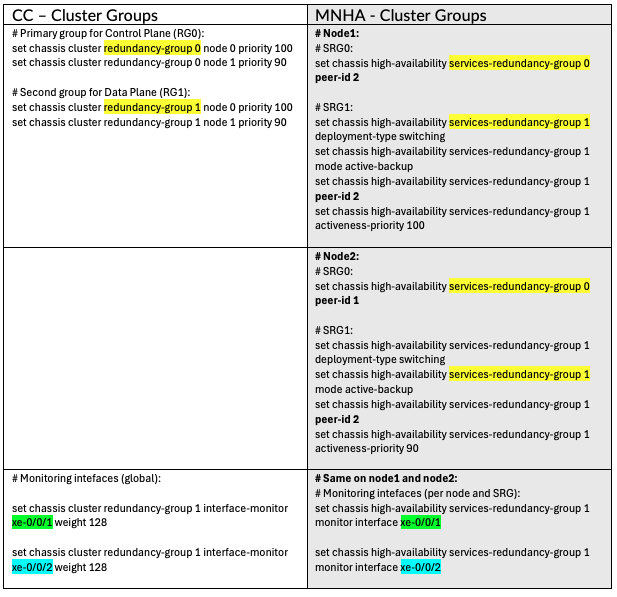

## Interfaces and Zones

By design, CC uses redundant interfaces between the 2 chassis. But the syntax is not "aggregate interface" (ae) but instead "reth". The common IP are set on reth0 (trust) and reth1 (untrust).

We do not use the ae or reth equivalents in MNHA, since they do not need this syntax. We use a Virtual IP (VIP) instead, which fails over using a gratuitous ARP. Note that aggregate interfaces are possible, but per node (like xe-0/0/5 and xe-0/0/6 together in ae0 bundle), not across nodes as reth does.

Also, MNHA can use an IP address on its physical interfaces, mostly used for monitoring or doing dynamic routing with peer routers. Those are set below.

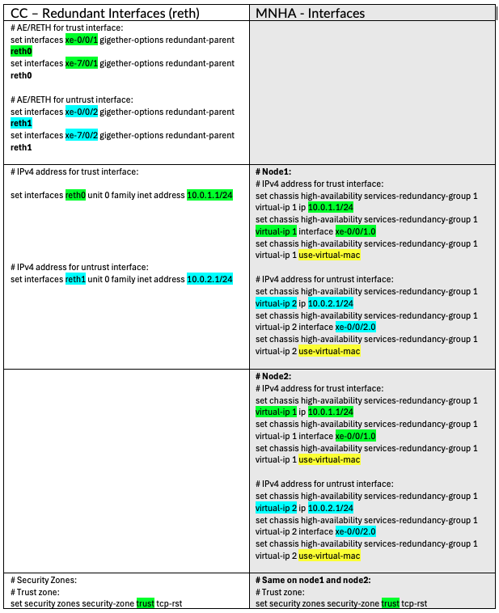

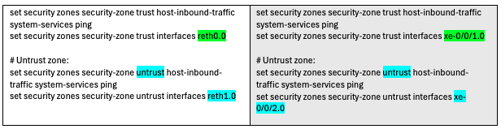

> Note: if using IPv4 and IPv6 addressing, this is just an additional family inet6 for CC. But for MNHA, IPv4 and IPv6 need to be on different sub-interfaces (VLAN tagged), except if using VRRP.

> Note: this should be solved in Junos 26.2R1 with an IPv4 and IPv6 on same VIP.

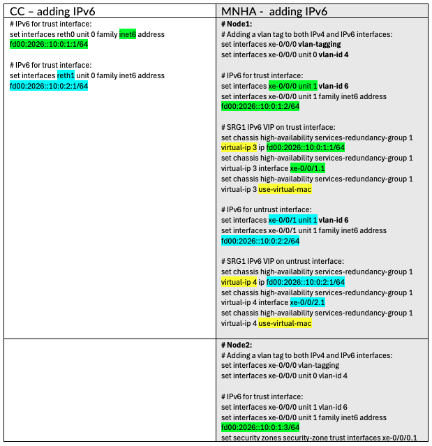

## Cluster Communication Encryption

MNHA natively supports IPsec encryption for its session synchronization link, also known as the ICL (Inter-Chassis Link). This needs the proper IKE daemon to be loaded (which is default in all latest Junos) or can be loaded manually.

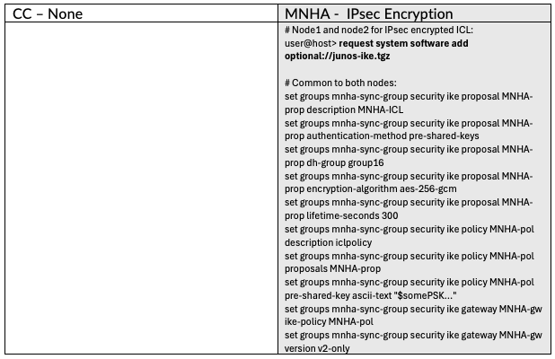

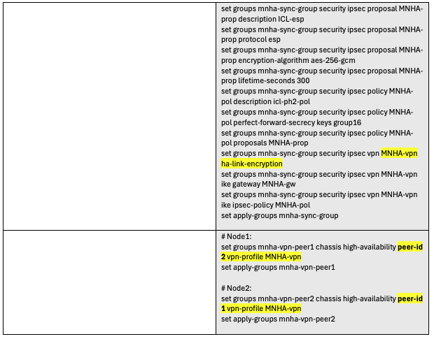

> Note: the IKE config above can also use certificates if any are present, but it is not required.

## Security - Source NAT

Network Address Translation (NAT), uses the interface IP of the outbound interface on CC by default. But on MNHA, since each node has its own IP address, the VIP needs to be declared as a Source NAT Pool to serve the same purpose.

## Special Configuration -- DHCP server

When the SRX is used as a local DHCP Server for local machines (PCs, Wi-Fi, etc.), it simply uses reth0 on CC. In MNHA, the setting needs to be made on both nodes since the DHCP service is not synchronized (and not handled by a single process like CC). In case of a LAN DHCP Server or a DHCP Relay on SRX toward a DMZ-located DHCP Server (not on SRX), there are no special settings for MNHA, but the DHCP Relay still needs to be set up. Look at James's techpost DHCP on MNHA: Back to Basics, precisely on this subject, right à propos!

## Common Configuration -- Security Policies

We have seen the CC and MNHA-specific settings side by side, but the rest of the configuration remains the same. All security statements are usually identical between CC and MNHA for elements like: Zones, Policies, Addresses, UTM, IDP, Screens, ATP, Applications, etc.

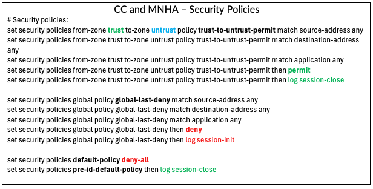

## Verification -- Cluster Status

After this setup, reboots, and finalizing the cluster elements, the verification can show the cluster status in each mode.

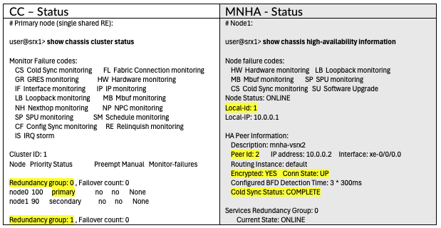

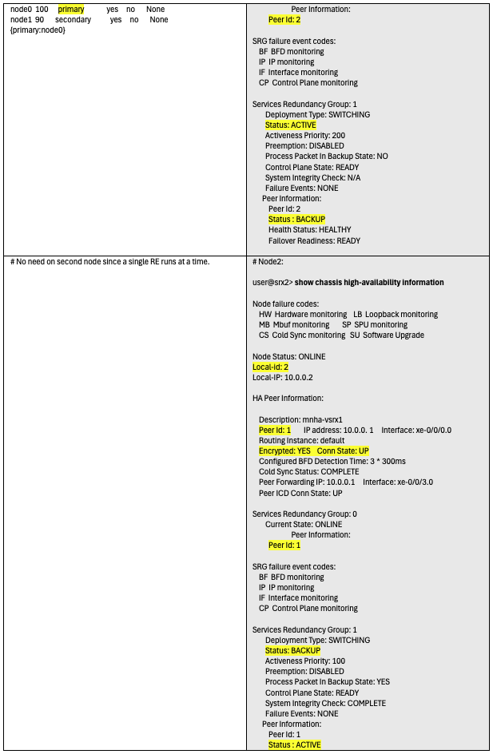

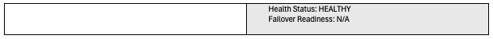

## Verification -- Cluster Interfaces

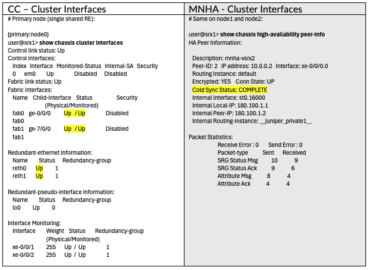

## Verification -- Cluster Statistics

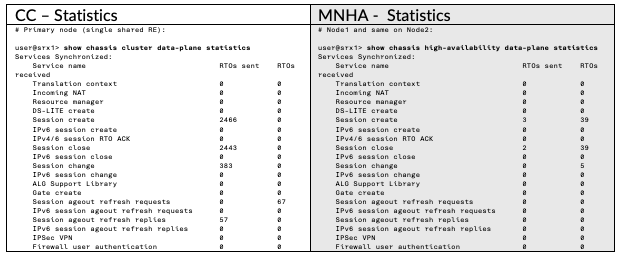

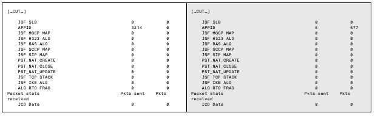

## Conclusion

Chassis Cluster and MNHA have been using different methods and settings from the beginning. However the concepts are quite close (RG vs SRG). Hoping this techpost will help compare and migrate from Chassis Cluster to MNHA; it was not meant to explore all possible options, but it should give the user some options. Another techpost would cover the other possible configurations in the 3 main network modes of MNHA: Default Gateway (L2), Hybrid (L2L3) and Routing (L3).

Also, this has been shown at the angle of console/cli access and configuration (easier to compare side by side than screenshots), but Security Director Cloud can also help with those settings; it would be another techpost to develop.

See the other tech posts below for other explanations and architectures.

## Useful Links

Other techposts on MNHA:

- [Multi-Node High Availability Basics](https://juniper.github.io/techpost/articles/multi-node-high-availability-basics/article/) (from Steven Jacques)
- [Hybrid MNHA with eBGP](https://juniper.github.io/techpost/articles/hybrid-mnha-with-ebgp/article/) (from James Rathburn)
- [SRX clustering: from Chassis Cluster to MultiNode High Availability](https://juniper.github.io/techpost/articles/srx-from-chassis-cluster-to-mnha/article/) (from Laurent Paumelle)
- [MNHA, IPSec and Multiple Routing Instances](https://juniper.github.io/techpost/articles/mnha-ipsec-and-multiple-routing-instances/article/)
- [DHCP on MNHA: Back to Basics](https://juniper.github.io/techpost/articles/dhcp-on-mnha-back-to-basics/article/) (from James Rathburn)
- [SRX MNHA with VRRP](https://juniper.github.io/techpost/articles/srx-mnha-vrrp/article/) (from Karel Hendrych)

High Availability = Chassis Cluster

- [Chassis Cluster Overview](https://www.juniper.net/documentation/us/en/software/junos/chassis-cluster-security-devices/topics/topic-map/security-chassis-cluster-overview.html)
- [SRX Series Chassis Cluster Configuration Overview](https://www.juniper.net/documentation/us/en/software/junos/chassis-cluster-security-devices/topics/concept/chassis-cluster-srx-series-node-interface-understanding.html)
- [SRX Chassis Cluster Slot Numbering](https://www.juniper.net/documentation/us/en/software/junos/chassis-cluster-security-devices/topics/concept/chassis-cluster-srx-series-node-interface-understanding.html) (all SRX models)
- [SRX Getting Started - Configure Chassis Cluster (High Availability) - KB15650](https://supportportal.juniper.net/s/article/SRX-Getting-Started-Configure-Chassis-Cluster-High-Availability?language=en_US)
- [SRX HA Configuration Generator](http://www.juniper.net/support/tools/srxha/) (SRX Branch, vSRX, SRX1500, SRX4100, SRX4200)

Multi-Node High Availability

- [Multinode High Availability](https://www.juniper.net/documentation/us/en/software/junos/high-availability/topics/topic-map/mnha-introduction.html)
- [Example: Configure Multinode High Availability in a Default Gateway Deployment](https://www.juniper.net/documentation/us/en/software/junos/high-availability/topics/example/mnha-configuration-example-default-gateway-deployment.html)
- [Example: Configure Multinode High Availability in a Hybrid Deployment](https://www.juniper.net/documentation/us/en/software/junos/high-availability/topics/example/mnha-configuration-example-hybrid-deployment.html)
- [Example: Configure Multinode High Availability in a Layer 3 Network](https://www.juniper.net/documentation/us/en/software/junos/high-availability/topics/example/mnha-configuration-example.html)
- [Example: Configure IPSec VPN in Active-Active Multinode High Availability in a Layer 3 Network](https://www.juniper.net/documentation/us/en/software/junos/high-availability/topics/example/mnha-active-active-configuration-example.html)
- [Asymmetric Traffic Flow Support in Multinode High Availability](https://www.juniper.net/documentation/us/en/software/junos/high-availability/topics/topic-map/mnha-asymmetric-route-support.html)

## Glossary

Terminology used for Cluster:

- CC = "Chassis Cluster"
- L2HA = Layer 2 High Availability = Chassis Cluster
- CTRL = Control Link (dedicated interface)
- FAB = Fabric Link (dedicated interface)
- RG = Redundancy Group
- RTO = Real Time Objects (states to synchronize: sessions, NAT, ALG, IPsec...)

Terminology used for MNHA:

- MNHA = MultiNode High Availability
- ICL = Inter Chassis Link (similar to CTRL link)
- ICD = Inter Chassis Datapath (similar to FAB link)
- IDL = Inter Domain Link (more than 2 nodes scenario)
- SRG = Service Redundancy Group (similar to RG)
- RTO = Real Time Objects

Junos Terminology:

- RE = Routing Engine on Junos
- NSR = Non Stop Routing (allowing protocols such as BGP to hold its route states when RE restarts)
- ISSU = In Service Software Update (updating the 2 nodes of a cluster, one at a time, without disturbing traffics)

Network Layers:

- L2 = simple Layer 2 network, i.e. same IP broadcast domain
- L3 = Layer 3, refers to routed networks
- L2L3 = mix of Layer 2 and Layer 3, also named Hybrid
- L3-L7 = L3 + Layer 4 (TCP/UDP/ICMP/...) to Layer 7 (applications such as HTTP/S, DNS, Google, AWS, etc...)