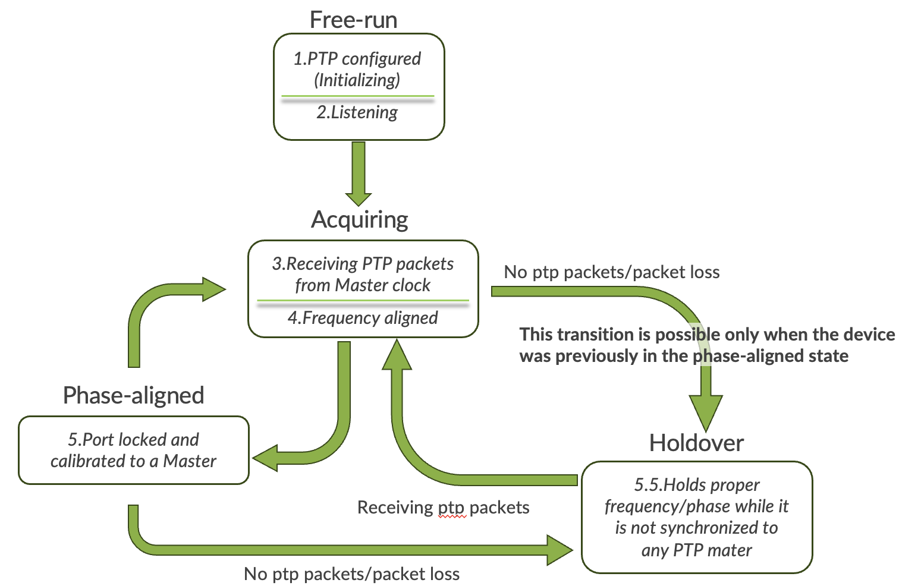
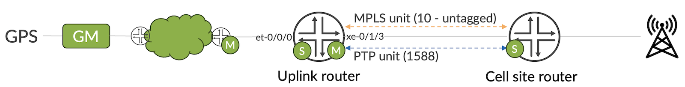
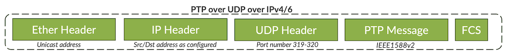
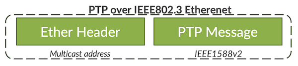
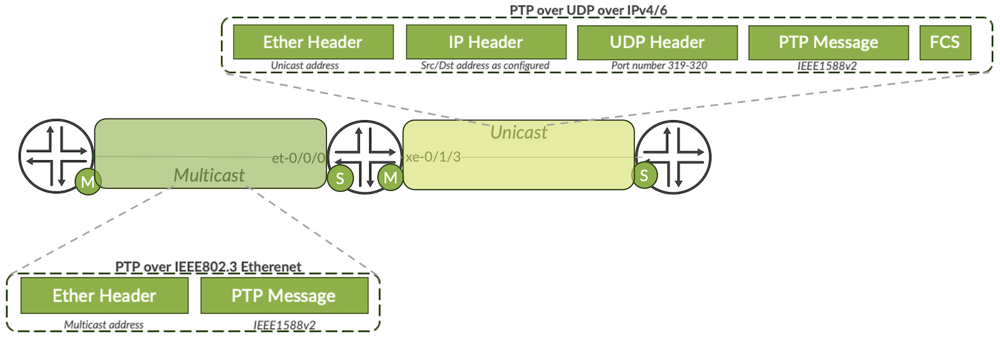
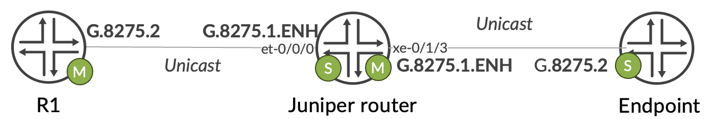

# G.8275.1.enh: Juniper's Advancements in Timing and Synchronization

**Vladimir Moki - 12/13/2023**

The benefits and versatility that Juniper brings with the PTP G.8275.1.ENH profile and the reasons behind its enhancements.

## Introduction

This blog will primarily highlight the PTP G.8275.1.ENH profile and the reasons behind its enhancements. The blog will detail the benefits and versatility that Juniper brings with this profile. Additionally, it will delve into the configuration specifics, examine the packet structure, and explore the various modes of operation. Towards the end, the post will present some practical topology examples and share valuable lessons learned from real-world implementations.

## Overview

The IEEE 1588 standard outlines how Precision Time Protocol (PTP) works for synchronizing frequency, phase, and time over packet-based networks. The ITU-T G.8275.2 specifies a PTP profile for partial timing support in telecom networks, while G.8275.1 defines a PTP profile with full timing support. Juniper's implementations align with these standards and include G.8275.2.enh and G.8275.1.enh profile types. These profiles support PTP over unicast IP configurations, offering options like IPv4, IPv6 (**G.8275.2/2.ENH**), Hybrid mode, PTP over loopback, and PTP over aggregated Ethernet. Worth mentioning, G.8275.2.enh finds application in cable service providers using remote PHY devices for distributed access, while G.8275.1.enh is employed for interoperability and PTP/SyncE hybrid applications in mobile backhaul/fronthaul networks.

Firstly, Juniper's enhanced profile (G.8275.1.ENH) can be configured exactly like the standard profile (G.8275.1) and is interoperable with it. The main enhancements available in the enhanced profile include:

- The ability to use VLAN.
- It also allows configuring the profile to operate in Unicast mode, enabling PTP over IP, as opposed to Multicast mode, which works with PTP over Ethernet multicast as part of the standard profile.
- Another enhancement is the expansion of the domain range; instead of 24-43 in the standard profile, the enhanced profile can support a range of 0-127.
- Additionally, some interval parameters have an extended range (Sync & Follow-up/Delay-req/Delay-resp/Announce).

## State-machine

Before moving forward, let's analyze the state machine and the steps to achieve a fully synchronized clock. There are four visible states you'll notice from the moment you configure the PTP until it reaches the step of being fully synchronized:

1. **Free-run** -- This is the step where the PTP configuration is in place. Subsequently, it enters listening mode, awaiting PTP packets. Clksyncd manages clock selection and ESMC messages, selecting primary and secondary sources. Chassisd interfaces with SCBE or CCG, updating clock information. Ppmd handles ESMC packets, filtering repetitive ones. The clock selection process involves receiving signals and packets, with clksyncd selecting the best signal for system clock generation.
2. **Acquiring** -- This state breaks down into two steps. The first involves accepting PTP packets from the master, particularly when the PTP is uncalibrated, leading to multiple PTP packet exchange cycles to sync with the PTP master. In hybrid mode, with the stability of the physical layer frequency, the local clock state quickly transitions to a phase-aligned state. The second state is Frequency Aligned, where the frequency is aligned and syntonized, as the name implies.
3. **Phase-aligned** -- In this state, the clock is fully calibrated and synchronized with the master. This is the intended and final state to achieve.
4. **Holdover** -- In Phase-aligned state when no PTP packets are received, or due parameters mismatch,  the device transitions to the holdover state. The performance and accuracy depend on the oscillator.



## Configuration Examples

Now let's examine some configuration examples including different modes of operation of protocol G.8275.1.enh, also some tricks an tweaks on how to transform either to this profile, or this profile to another.

### PTP with VLAN example

In this example, we're looking at how an improved profile can help when G.8275.1 needs to work over a VLAN. Check out the diagram: The GM is connected to the core router, which is then linked to metro network devices. The clock travels through the network and reaching the UPLINK router via the et-0/0/0 interface in the diagram. Next, the clock goes to the CSR (Cell Site Router) through the xe-0/1/3 interface. Unit 10, which is an untagged unit, is already in use for MPLS and routing. In our case, setting up PTP is easy and won't cause any impact because the enhanced profile lets us configure it on the VLAN.



In the bellow configuration can be noticed that native vlan is already used by MPLS unit which is used by the uplink and downlink for the underlay configuration, in this scenario enhanced profile will allow to configure ptp over vlan, whereas standard profile will have to run on untagged unit. Another thing worth mentioning, is that PTP will operate in unicast mode which will allow to configure the profile without hybrid mode. This example illustrates the flexibility and advantage of the enhanced profile, which can be served for various scenarios.

```
set protocols ptp clock-mode boundary
set protocols ptp profile-type g.8275.1.enh
set protocols ptp domain 24
set protocols ptp phy-timestamping
set protocols ptp slave hybrid 
set protocols ptp slave interface et-0/0/0.1588 unicast-mode transport ipv4
set protocols ptp slave interface et-0/0/0.1588 unicast-mode clock-source 20.10.10.1 local-ip-address 20.10.10.2
set protocols ptp master interface xe-0/1/3.1588 unicast-mode transport ipv4
set protocols ptp master interface xe-0/1/3.1588 unicast-mode clock-client 10.10.10.1 local-ip-address 10.10.10.2

set interfaces et-0/0/0 description UPLINK
set interfaces et-0/0/0 flexible-vlan-tagging
set interfaces et-0/0/0 native-vlan-id 10
set interfaces et-0/0/0 mtu 9192
set interfaces et-0/0/0 unit 10 vlan-id 10
set interfaces et-0/0/0 unit 10 family inet address 20.0.0.1/30
set interfaces et-0/0/0 unit 10 family mpls
set interfaces et-0/0/0 unit 1588 vlan-id 1588
set interfaces et-0/0/0 unit 1588 family inet address 20.10.10.1/30

set interfaces xe-0/1/3 description DOWNLINK
set interfaces xe-0/1/3 flexible-vlan-tagging
set interfaces xe-0/1/3 native-vlan-id 10
set interfaces xe-0/1/3 mtu 9192
set interfaces xe-0/1/3 unit 10 vlan-id 10
set interfaces xe-0/1/3 unit 10 family inet address 10.0.0.1/30
set interfaces xe-0/1/3 unit 10 family mpls
set interfaces xe-0/1/3 unit 1588 vlan-id 1588
set interfaces xe-0/1/3 unit 1588 family inet address 10.10.10.1/30
```

In the configuration above the hybrid mode knob is configured which means that SyncE configuration ("set chassis synchronous-ethernet") is present and should be used for frequency recovery from the primary or secondary SyncE source.

Now, let's check out how the packet is being transported. In the example, it's using unicast, which means PTP over UDP over IPv4/6. The packet looks like the one below, and you can configure this transport mode without using the hybrid mode. This feature is only possible with the enhanced profile.



There's another transport type called multicast, and it's the only option available in the G.8275.1 profile. It works over Ethernet. The enhanced profile can operate just like the standard profile in this case.



### G.8275.1.ENH with one side PTPoEth and another PTPoIP

In this situation, we can see the flexibility of configuring the profile, with the option to set it as multicast on one side and unicast on the other. In the diagram below, the uplink interface et-0/0/0 is set up in multicast mode, meaning PTP over Ethernet. On the other hand, the downlink interface xe-0/1/3 is configured as unicast and operates as PTP over IPv4. As mentioned before, because it's an enhanced protocol, both modes are permitted to operate with VLAN

Note: No PTPoIPv4 and PTPoE master ports supported at the same time.



This configuration example will illustrate the flexibility of the enhanced protocol where there is a requirement to interoperate with the standard protocol from the uplink port and synchronize downstream device with enhanced profile

**Uplink router**

```
set protocols ptp clock-mode boundary
set protocols ptp profile-type g.8275.1.enh
set protocols ptp domain 24
set protocols ptp phy-timestamping
set protocols ptp slave interface et-0/0/1.1588 multicast-mode transport ieee-802.3 link-local
set protocols ptp slave hybrid
set protocols ptp master interface xe-0/1/3.1588 unicast-mode transport ipv4
set protocols ptp master interface xe-0/1/3.1588 unicast-mode clock-source 10.10.10.1 local-ip-address 10.10.10.2
```

### Use G.8275.1.ENH for G.8275.2

Another instance is utilizing the enhanced profile to simulate the G.8275.2 protocol. There are cases where the device doesn't support the G.8275.2 profile, and this is where the 8275.1.enh profile can be useful. It's important to note that this is not an official workaround or recommendation from Juniper, so each scenario should undergo thorough testing and consultation with Juniper professionals. The example below was tested with a customer whose endpoint device needed to receive the clock via the G.8275.2 profile.

In the illustration below, I'll illustrate exactly what I mentioned earlier. R1 can be either a Juniper or a third-party vendor supporting G.8275.2 and manual mode (no unicast negotiation). The Juniper router in the diagram is configured with the G.8275.1.ENH profile in PTPoUDPoIPv4 mode, and finally, the endpoint device is configured as G.8275.2.



The configuration below mirrors what is shown in the diagram. Since the G.8275.2 profile's domain is 44, the enhanced profile should also be configured with the same domain. Additionally, as 8275.2 operates in PTPoIPv4 unicast mode, the enhanced profile will be configured in the same manner.

**R1**

```
set protocols ptp clock-mode boundary
set protocols ptp profile-type g.8275.2
set protocols ptp domain 44
set protocols ptp phy-timestamping
set protocols ptp slave interface et-0/0/0.1588 unicast-mode transport ipv4
set protocols ptp slave interface et-0/0/0.1588 unicast-mode clock-source 30.10.10.1 local-ip-address 30.10.10.2 
set protocols ptp master interface et-0/0/1.1588 unicast-mode transport ipv4
set protocols ptp master interface et-0/0/1.1588 unicast-mode clock-client 20.10.10.2 local-ip-address 20.10.10.1 
```

**Juniper router**

```
set protocols ptp clock-mode boundary
set protocols ptp profile-type g.8275.1.enh
set protocols ptp domain 44
set protocols ptp phy-timestamping
set protocols ptp slave interface et-0/0/0.1588 unicast-mode transport ipv4
set protocols ptp slave interface et-0/0/0.1588 unicast-mode clock-source 20.10.10.1 local-ip-address 20.10.10.2 
set protocols ptp master interface xe-0/1/3.1588 unicast-mode transport ipv4
set protocols ptp master interface xe-0/1/3.1588 unicast-mode clock-client 10.10.10.1 local-ip-address 10.10.10.2 
```

## Summary

In conclusion, the G.8275.1.enh protocol emerges as a groundbreaking solution, seamlessly integrating into your network with unprecedented adaptability. Its ability to operate over VLANs, support both unicast and multicast modes, and function effortlessly across IP and Ethernet domains sets a new standard for synchronization protocols. This protocol not only meets diverse networking requirements but also stands out for its remarkable flexibility, allowing it to emulate other protocols seamlessly. As a pioneer and leader in the timing and synchronization domain, Juniper continues to innovate, providing cutting-edge solutions that redefine network precision and reliability. Elevate your network to new heights with the unmatched advantages of G.8275.1.enh, backed by Juniper's commitment to excellence in timing and synchronization.

## Glossary

- CCG: Centralized Clock Generators
- ESMC: Ethernet Synchronization Message Channel
- GM: Grand Master
- Hybrid Mode: Using both PTP and SyncE to recover time of day and frequency, respectively
- Master Port: A PTP port that is in the master state
- PTP: Precision Time Protocol, IEEE 1588
- SCBE: Switch Control Board
- Slave Port: A PTP port that is in the slave state
- SyncE:  Synchronous Ethernet

## Acknowledgements

Thanks to Kamatchi Gopalakrishnan , Rafik P and Dayan NG

## Useful links

- PTP Profiles
[https://www.juniper.net/documentation/us/en/software/junos/time-mgmt/topics/topic-map/ptp-profiles.html](https://www.juniper.net/documentation/us/en/software/junos/time-mgmt/topics/topic-map/ptp-profiles.html)
- Clock Synchronization
[https://www.juniper.net/documentation/us/en/software/junos/time-mgmt/topics/topic-map/clock-synchronization.html](https://www.juniper.net/documentation/us/en/software/junos/time-mgmt/topics/topic-map/clock-synchronization.html)
- DAY ONE: DEPLOYING JUNOS(R) TIMING AND SYNCHRONIZATION
[https://www.juniper.net/documentation/en_US/day-one-books/DO_TimeAndSync.pdf](https://www.juniper.net/documentation/en_US/day-one-books/DO_TimeAndSync.pdf)
