# GPU Fabrics for GenAI Workloads

**Sharada Yeluri - 01/02/2024**

GPU cluster scale, model partitioning, and traffic patterns between the GPUs for training workloads.

*Article initially published on LinkedIn at: [https://www.linkedin.com/pulse/gpu-fabrics-genai-workloads-sharada-yeluri-j8ghc/ ](https://www.linkedin.com/pulse/gpu-fabrics-genai-workloads-sharada-yeluri-j8ghc/)*

This article is a sequel to "[Large Language Models - The Hardware Connection](https://juniper.github.io/techposts/large-language-models-the-hardware-connection/article)"

## Introduction

This article covers GPU cluster scale, model partitioning, and traffic patterns between the GPUs for training workloads. Many hyperscalers are racing to build large GPU clusters, often with 64K or more GPUs, to accommodate all variants of generative AI (genAI) training workloads. While the size of these large transformer models and the data sets may need thousands of GPUs to train, providing any-to-any non-blocking network connectivity between the GPUs might be an over-design. Understanding model partitioning and the traffic patterns for the GenAI training workloads can help optimize the network topology and enable the efficient use of commodity ethernet switches for GPU fabrics.

I also examine the various network topologies optimized for genAI training workloads. Robust end-to-end congestion control is critical for improving the training performance and utilizing the GPUs effectively. I attempt to review the various methods for congestion control and their impact on the network hardware.

## Model Math - A Deeper Look

The GPU cluster size and the fabric topology depend heavily on

- The characteristics of the workloads (parameter size, data-set size, and the model architecture)
- Optimal training time and training frequency. In other words, how frequently do the models need to be updated?
- Model partitioning. When the state space of parameters and datasets is large, a compiler/optimizer that is aware of the network topology and can iteratively evaluate different partition choices to pick the one that offers a good balance between compute and communication is a must.

To derive the GPU cluster size for training LLM models, we can safely make the below assumptions:

- About 60-80% of the operations in a deep learning transformer model are matrix multiplications, which can use tensor cores (TF32/TF16) operations.
- Due to memory and interconnect bottlenecks, GPU utilization when training large transformer models hovers around 30-40%. However, utilization heavily depends on effective model partitioning and the underlying GPU fabric. The [paper from Nvidia](https://arxiv.org/abs/1909.08053) claims 50% utilization for a large model with one trillion parameters using tensor, pipeline, and data parallelisms effectively.
- For models where the actual training FLOPs are not published, the well-known approximation of ~6-8 FLOPS per parameter and per token can be used.

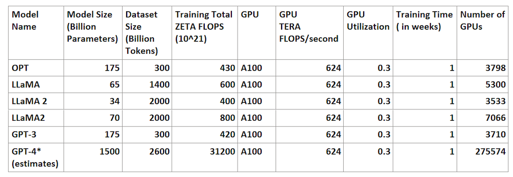

*Table-1: The number of GPUs needed for training different LLMs with A100 GPUs*

Table 1 shows the GPU scale needed with older version (*A100*) GPUs to train various models if the training needs to be finished in a week. *GPT-4* parameters and data set sizes were not officially published by openAI. However, it is widely speculated in many forums that the model size is 1.5 trillion parameters. Using the same scaling of dataset size to parameters as in *GPT-3*, the data set size for *GPT-4* was extrapolated. The above table assumes the Tensor Float 32 (TF32) format for training with a typical 30% GPU utilization.

From the table, a 275K *A100* GPU cluster can train the *GPT-4* model in about a week. It is speculated that OpenAI trained their *GPT-4* model over three months (or 12 weeks) with a 24-32K *A100* GPU cluster.

The *H100* GPUs from Nvidia offer 2.5-3x better performance for TF32 operations over *A100* GPUs. In addition, it has been proven that mixed precision training is a viable alternative to TF32 operations to speed up training performance. GPU cluster sizes with *H100* and mixed precision arithmetic (with a 7:3 ratio between TF16 and TF32) are shown in Table 2.

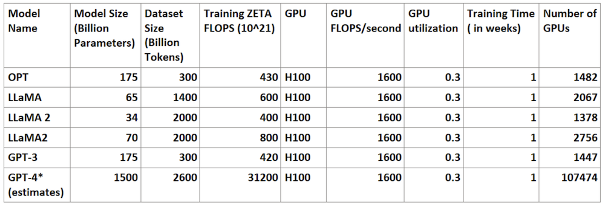

*Table 2. The number of GPUs needed in a cluster for training LLM models with H100 GPUs and with mixed precision arithmetic*

*H100* supports FP8 arithmetic. [The papers from Nvidia](https://developer.nvidia.com/blog/nvidia-arm-and-intel-publish-fp8-specification-for-standardization-as-an-interchange-format-for-ai/) claim that there is less than 1% precision loss with FP8 arithmetic when used for convolutions and matrix multiplications while leaving the output tensors at FP32. [Microsoft recently published a paper](https://arxiv.org/pdf/2310.18313.pdf) showing FP8 as a viable option for training LLM models.

GPU utilization could be improved to about 50% using frameworks that exhaustively try different ways of partitioning the models to reduce communication overhead.

FP8 operations and 50% utilization would further reduce the cluster scale, as shown in Table 3.

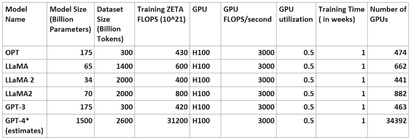

*Table 3. GPU cluster size for training various LLM models with H100 GPUs, FP8 arithmetic, and 50% utilization*

*To summarize, using the latest GPU hardware, mixed-precision and FP8 floating point operations, and modern topology-aware compilers brings down the cluster size for GPT-4 from **275K** to around **34K** GPUs, and the model can be trained in a week! And, except for GPT-4, all other LLM models train in less than a week with less than 1K GPUs!*

The total cost for training involves the power delivery and the thermal solutions to dissipate the heat. This could be very expensive in large clusters, influencing how often enterprises train the LLM models. If the enterprises can tolerate longer training times (once a month as opposed to once every week), there is an opportunity to optimize the hardware further linearly. For example, the *GPT-4* model needs **~8.5K** (34K/4) GPUs with a 4-week training period.

Public cloud providers usually build larger clusters with >64K GPUs to run multiple training jobs in parallel and future-proof their fabrics for next-gen models (assuming model sizes and data sets continue to grow).

Nvidia's just unveiled *H200* GPU with 75% more memory. Its roadmap shows the next-generation *B100* in 2024 and *X100* in 2025. With a one-year cadence of new GPU releases from Nvidia, it is unclear whether future-proofing beyond a few years has any clear advantages. The newer versions of GPUs will definitely have better memory capacity/power/performance and cost per TFLOP (Tera Floating point operations per second) than *H100*.

Would building multiple parallel clusters of reasonable size (8K) be more efficient and easier to manage than a gigantic cluster with 128K nodes?

## Parallelisms -A Closer Look

The cluster math in the previous section assumes that the model parameters and datasets are distributed across all GPUs in the cluster and that the training happens in parallel. Model partitioning plays a critical role in optimizing the network topology and improving the efficiency of the GPUs.

Let's examine the GPU server internals and how the models can be partitioned by considering the intra-server and inter-server link capacity.

### GPU Server

An *H100*-based GPU server from Nvidia consists of eight GPUs with 8 ConnectX-7 NICs. These GPUs can communicate with each other using high-speed NVLinks connected to the NVSwitches. Each GPU connects to a group of NVswitches through 3600 Gbps NVLlinks (18 links @ 200 Gbps each) in each direction.

Each of the eight GPUs inside the server can talk to outside switches through 8 ConnectX-7 NICs, with each GPU capable of sending 400Gbps to the NIC. The eight NICs can connect to the leaf switches in the external GPU fabric through the 4 x 800Gbps OSFP optical interfaces.

Thus the GPUs inside a server can communicate with each other with 9x bandwidth through the NVswitches compared to the 400Gbps links each GPU uses to connect to the other servers through the fabric.

In addition, each server has two separate OSFP modules to connect to the storage network. The massive training datasets (~10TB for a 2600 Billion token *GPT-4 *model with 4B tokens) reside in the storage file systems and are fetched to the system memory through the storage network. This activity overlaps with training and ideally should not cause stalls between the iterations.

Each *H100* GPU inside the server has 80GB of memory. This memory stores the model parameters (weights and biases), gradients, intermediate values (output activations during the forward pass and the gradients during the backward pass), optimizer states, scratch space for the computations, and other miscellaneous states. For large language models, most memory is taken up by the model parameters, gradients, and optimizer states. The storage required for intermediate values depends heavily on the model architecture and the training batch size.

### Model Partitioning

A typical deep learning model training involves dividing the data set into an equal number (***B***) of batches. Do one iteration of the training (running a forward pass to make predictions and a backward pass to calculate gradients for each parameter) on each batch, update the parameters, and repeat the training again using the next batch. This process is repeated until all the batches are done. This is called an epoch. The training consists of hundreds of such epochs until the model converges.

### Data Parallelism

The easiest way to speed up the training for large data sets is to partition each batch into ***Bm*** number of mini-batches and train a copy of the model on each mini-batch. This is referred to as data parallelism.

In data parallelism, each model copy does one full training iteration on a mini-batch. The gradients for each parameter from all the model copies are aggregated at the end of the iteration. The updated gradients for all the parameters are broadcast to all the model copies, and once the model copies adjust their weights (parameters) with the updated gradients, the training repeats again using the next batch.

For LLM models, the data in the batch typically contains a sequence length (the number of consecutive tokens the model looks at for predicting the next token during the training). The batch size and sequence length vary between different models.

When training the model with mini-batches, the size of the intermediate activations or results passed on from one layer of the model copy to the next is linearly proportional to the min-batch size.

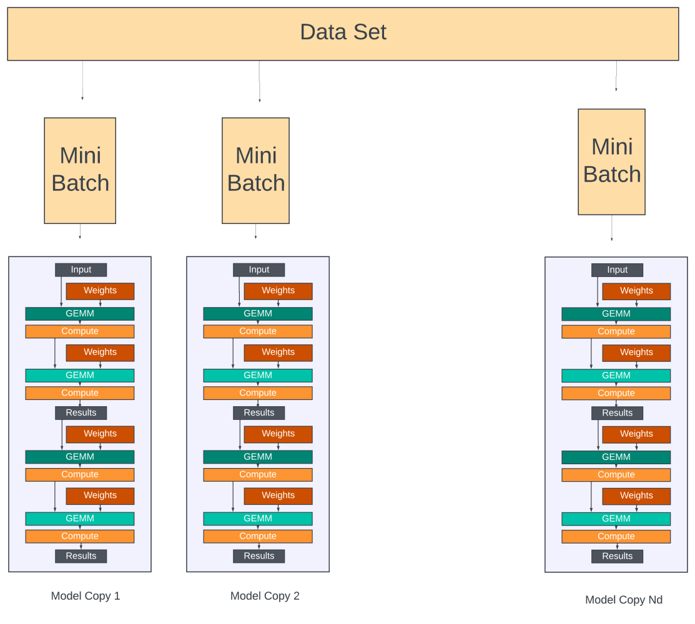

The model internals are oversimplified in this diagram for clarity.*

According to Microsoft's paper, a 175B parameter model requires about 16 * 175B memory for storing the parameters, gradients, and optimizer states in mixed precision training. Obviously, a single *H100* GPU with only 80GB of memory can only fit part of the model. It would require ~35 GPUs for the *GPT-3* and ~300 for *GPT-4* models to fit the parameters alone.

If ***Nm*** is the number of GPUs a model is partitioned into and if ***Nd*** is the number of data-parallel groups (number of model copies), then the total GPUs in the cluster is ***Nm x Nd***, and this speeds up the training by ***Nd*** times over training the entire dataset using just ***Nm*** number of GPUs.

### Model Parallelism with Pipelining

There are two approaches to partitioning a model across the Nm GPUs. In the pipeline model parallelism, the model is divided into several stages, each consisting of one or more model layers. Each stage is assigned to a different GPU. When used on large language models with repeated transformer blocks, each device can be assigned an equal number of transformer layers. Pipeline parallelism is sometimes referred to as inter-operator parallelism.

Pipeline parallelism keeps all the ***Nm*** GPUs active by further dividing the mini-batch (***Bm***) into micro-batches (***Bu***) and scheduling them through the GPUs in a pipeline fashion.

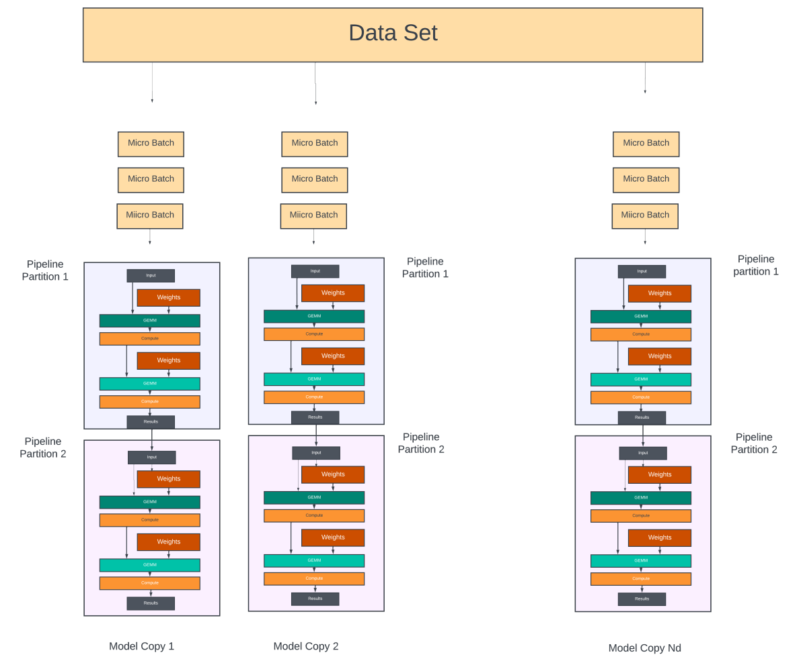

*The model internals are oversimplified in this diagram for clarity.*

**Data Distribution**: Inside each model copy of ***Nm*** GPUs,

1. - Each mini-batch is further divided into the "***Bu***" number of micro-batches. The first micro-batch is sent to the GPU at the first stage of the pipeline (partition #1).

**Training**

1. - Once the first stage completes its forward pass for a micro-batch, it sends its output to the next stage (the next GPU in the pipeline) and immediately starts processing the next micro-batch in the queue.
2. - This process continues until all forward passes are done on all the micro-batches
3. - At this point, the backward pass begins on the micro-batches. Each pipeline stage, starting from the last stage, computes the gradients for all the micro-batches and passes them on to the previous stage.
4. - At the end of each backward pass, the gradient for "each parameter" in each pipeline stage is accumulated. At the end of all Bu backward passes in this model copy, all parameters would have their accumulated gradients.

**Gradient Aggregation across *Nd* data parallel groups:**

1. - The gradients for each parameter are then aggregated across all the ***Nd*** model copies.
2. - The aggregated gradients for each parameter are then broadcast to ***Nd*** GPUs across all model copies that hold the corresponding parameter.

**Synchronization/Repeat:**

1. - Once all model copies have updated their parameters, the process is repeated for the next mini-batch in the training. Fetching the dataset for the next mini-batch happens through the storage fabric while the current batch is being executed in the pipeline.

As you can see in the figure below, doing all forward passes followed by all backward passes would mean that the GPUs need to store the intermediate activations generated during the forward passes for all ***Bu*** micro-batches so that they can be used for gradient computations during the backward passes. Instead, most pipeline scheduling schemes use one forward pass followed by one backward pass (**1F1B**), as shown in Figure 2. This reduces the storage for intermediate activations to the depth of the pipeline.

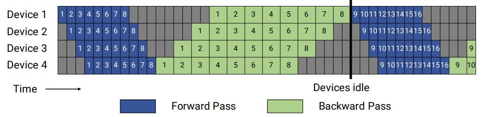

Illustration of pipeline parallelism and the bubbles (gray regions) with forward and backward passes clubbed together. Each device represents a pipeline stage. Four pipeline stages and eight micro-batches.

*Courtesy: Nvidia's Megatron-LM paper*

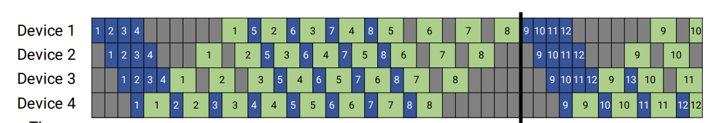

Interleaving of forward and backward passes results in less storage in each GPU for intermediate activations. Each GPU stores activations from 4 micro-batches (pipeline depth) at any point.

*Courtesy: Nvidia's Megatron-LM paper*

The gradient aggregation can overlap with forward/backward passes to some extent. For example, as a GPU in a pipeline stage of a model copy has accumulated gradients from all the micro-batches, it can participate in the gradients aggregation with all the GPUs in the same pipeline stage across all ***Nd*** model copies.

There is usually a flush period (synchronization period) after all ***Bu*** micro batches are sent to give enough time for GPUs across all model copies to update their parameters before the next iteration can start. The flush duration depends on the pipeline depth and the number of model copies (***Nd***). The more model copies there are, the longer it will take to aggregate the gradients.

Coming up with optimal pipeline depth is critical. The goal is to maximize the compute and memory resources of each GPU. Some schemes try to alleviate the pipeline flush at the expense of storing two pairs of model parameters. They enable the pipelines to work on the next pair while the gradients are aggregated and synchronized for the current pair. This could result in some accuracy loss in the training and requires double the memory in each GPU to store the parameters. There is no way to avoid flush/synchronization periods to get accurate results and faster convergence.

In addition to the parameters/optimizer states, the GPUs must store intermediate activations during the forward pass. As shown in Figure 4, the storage for intermediate activations is directly proportional to the number of pipeline stages. To save the GPU memory space for parameters, some schemes allow intermediate activations to be recomputed in the backward pass - thus trading off the GPU compute over GPU memory.

Some large models like *GPT-3/GPT-4* would require deeper pipelines just to fit the parameters/states in each pipeline stage. With deeper pipelines, the training takes longer, and the synchronization delays at the end of the iteration, where the entire pipeline needs to be flushed, would also take up a significant amount of the training time. That is where tensor or intra-operator parallelism helps. In tensor parallelism, the computations in each pipeline stage are spread across multiple GPUs so that more can be accomplished in each pipe stage. This results in fewer pipeline partitions and lower latencies.

### Tensor Parallelism

The matrix (GEMM) operations in each pipeline stage could be spread across multiple GPUs. Tensor parallelism uses this fact to create 2D model parallelism (pipeline + tensor) to reduce the pipeline depth and the training time.

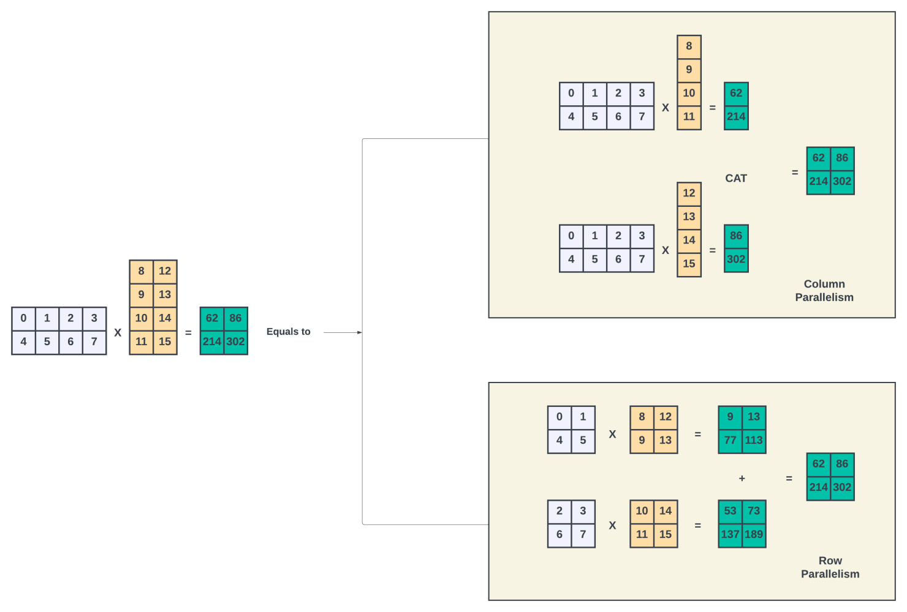

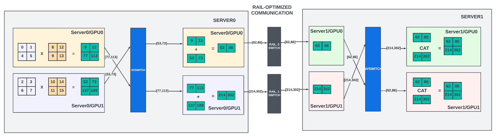

Example of Row parallelism with rail-optimized data communication between two servers. The number of tensor-parallel GPUs is 2 in this example.

Parallelizing the matrix multiplications is straightforward. Whenever an input matrix (***X***) is multiplied with a weight matrix (***Y***), It can be divided into ***Nt*** discreet partial matrix multiplications, as shown in Figure 5 above, where ***Nt*** is 2.

If the ***Nt*** partial matrix multiplications are assigned to ***Nt*** discreet GPUs, then the input ***X*** must be broadcast to all these GPUs. We call these GPUs tensor-parallel GPUs. A partial multiplication happens in each GPU to get the result ***Zt***. Each tensor-parallel GPU needs to communicate its partial results to all other tensor-parallel GPUs. Each GPU computes the final result (***Z***) by either concatenating the partial results (column parallelism) or adding the results (row parallelism). This result will be used in the subsequent computations in that pipeline.

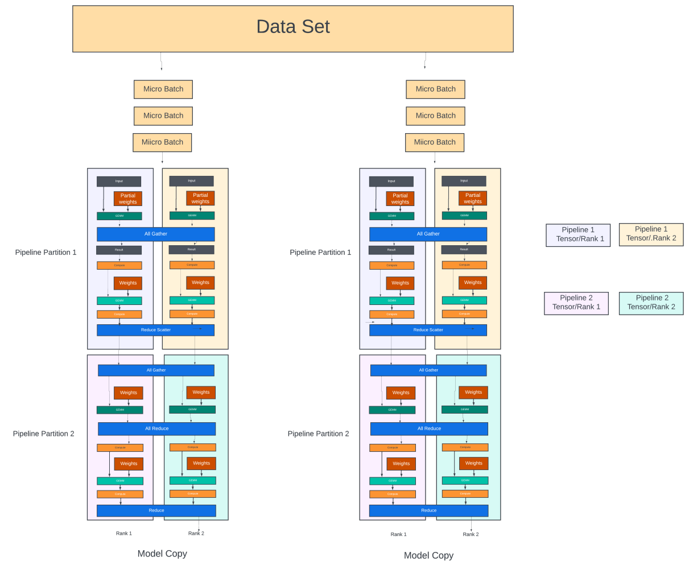

A conceptual diagram illustrating pipeline/tensor and data parallelism with examples of reduce-scatter/all-gather, all-reduce communication (blue boxes)

This all-to-all communication across ***Nt*** GPUs for each micro-batch requires high bandwidth. The size of the communication depends on the micro-batch size and the size of the hidden layers (weights used in the matrix multiplication). Due to the high bandwidth requirements, the number of GPUs participating in the tensor parallelism in each pipeline is often limited to the number of GPUs inside a GPU server or a node. These intra-server GPUs are connected through high-speed NVlinks and NVSwitches. Recall that GPU-to-GPU bandwidth in the *H100* server is 9x when the two GPUs are within the server versus if they are on two different servers.

There is also a need for all-to-all communication between the tensor parallel groups of two consecutive pipeline stages, as shown in Figure 6, when the tensor parallel GPUs in one pipeline stage exchange the intermediate results with the GPUs in the next pipeline stage.

In the matrix example above, if the next pipeline stage GPUs are in a different server, instead of broadcasting the final result ***Z*** to all the tensor parallel groups in the next pipeline stage, Nvidia offers collectives like scatter-gather, as explained in the Megatron-LM paper. The result can be split on the send side into equal-sized chunks, and each GPU sends one chunk to the GPU in the same tensor rank (rail) in the next pipeline stage through the leaf switches (Figure 5.a). Thus the data communication could be one-eighth smaller with eight tensor parallel GPUs in each pipeline stage. With this scheme, on the receive side, each tensor parallel GPU can perform all gather over NVlinks to get all the chunks and compute the final result ***Z*** before using it in further matrix multiplications.

### Gradient Aggregation Traffic

Gradient aggregation involves aggregating gradients of each parameter across all the model copies. Each GPU in a model copy participates in gradient aggregation with GPUs in the same rank/pipe across all the model copies. So, with ***Nm*** GPUs inside each model copy, there are ***Nm*** parallel gradient aggregation threads (with ***Nd*** GPUs participating in each thread) for each iteration.

Traditionally, schemes like Ring-All-Reduce have been used to send the gradients in a ring pattern from one GPU to the other, where each GPU aggregates the gradients it received from the previous GPU with its locally computed gradients for the parameters it holds before sending it out to the next GPU. This process is slow as gradient aggregation is done in a sequential manner, and the final result is also propagated back to all the GPUs sequentially in the ring topology.

Nvidia collectives provide a double binary tree mechanism, which offers full bandwidth and a logarithmic latency for gradient aggregation. [Refer to the paper](https://developer.nvidia.com/blog/massively-scale-deep-learning-training-nccl-2-4/) for more details. GPUs in the same pipeline stage across all the model copies can be arranged as part of a tree structure when using the binary tree for gradient aggregation. Each leaf node sends its gradients for all the parameters it stores to its parent node, which is summed with the corresponding gradients from its sibling leaf node. This process continues recursively until the gradients are aggregated at the tree's root node.

After the root node has the sum of all the gradients, the aggregated gradient must be sent back to all nodes in that tree to update their local copies of the model parameters. The root node starts by sending the aggregated gradient to its children, who then pass it on to their children until all nodes have received it.

In the double binary tree method, two binary trees are constructed using GPUs of the same rank across the data parallel groups. The leaf nodes of the first tree are the intermediate nodes of the other tree. Each tree aggregates half the gradients. As described in the paper, in a double-binary tree, each GPU can have at most two parents and two children, and the performance (training time) is much superior to ring topologies in large clusters. With large clusters, part of the gradient aggregation can happen using leaf switches if the child and parent GPUs are reachable using the leaf switches alone. But gradient aggregation (or data-parallel traffic) needs to use spine/aggregation switches also to aggregate across all data parallel GPU ranks that are not reachable through leaf switches.

While tree structures have low latency, they also introduce many 2-to-1 and 1-to-2 traffic patterns in the network that could create transient congestion scenarios. Ring-all-reduce, with its 1-to-1 traffic pattern, is still preferred by some hyperscalers to reduce spine-leaf traffic.

### GPU Memory Optimization

GPU memory stores the parameters, gradients, optimizer states, intermediate activations, and input data for the pipeline/tensor partition it belongs to. It also needs temporary/scratch space for computation.

The storage required for parameters, gradients, and optimizer states is around (***4*P + K*P***) for mixed precision training. ***K*** is 12 when using Adam's optimizer. A one trillion parameter model would require a storage of ~24TB.

In addition, intermediate activations (from the forward pass that gets used in the backward pass) take up additional space directly proportional to the model's batch size and hidden layer sizes. Activation recomputation, where the intermediate activations are computed again in the backward pass, could reduce the memory requirement at the expense of additional computing. Still, we may need 1-2TB of memory for storing input activations. There is additional scratch space and inefficiencies due to memory fragmentation etc.

Overall, the total memory for a 1.5 Trillion *GPT-4* model comes to 32TB with 75% efficiency. With 80GB per GPU, it would take 400 GPUs to fit one copy of the model.

With ***Nd*** model copies, there are ways to optimize the memory by storing only a small fraction of the parameters and/or gradients and optimizer states in each model copy. In this scheme, the GPUs dynamically fetch the parameters/states stored in other GPUs before each compute. This is called "sharding". It adds additional communication overhead but reduces the memory footprint (and the total number of GPUs required for training). The Microsoft paper talks about sharding for ~100B parameter models. How well sharding improves the GPU scale for trillion parameter models like *GPT-4* is unknown.

### The GPU-GPU Traffic Takeaways

- Communication between tensor parallel GPUs of a pipeline partition is very high bandwidth. Model partition frameworks should keep them within a server node as much as possible.
- A scatter-gather approach could reduce the all-to-all communication between the tensor parallel GPUs from one pipeline stage to the next (in a different server). This enables GPU servers to be connected in a rail-optimized topology for pipeline parallel traffic (traffic between different pipeline stages) where the Nth GPU in a group of servers can communicate to each other through the Nth leaf switch (also called rail switch) with non-blocking bandwidth.
- The data parallel traffic is mainly gradient aggregation. It happens between GPUs of the same rank/pipe across all data parallel groups. Hierarchical tree aggregation creates many 2-to-1 or 1-to-2 traffic patterns between these GPUs. The transfer size is proportional to the parameters stored in each GPU rank.
- Once the GPUs in the cluster are partitioned for data/tensor and model parallelism, the communication pattern between them is repetitive for each iteration of training. Side effects of suboptimal partitioning (congestion, long tail latencies, etc) add up across all iterations and adversely affect the job completion times.
- The number of GPUs in a cluster may be reduced further by sharding the parameters across all data parallel GPUs - this adds more data parallel communication but could reduce the cluster size.

### State Space/Methods for Partitioning

The state space to decide the best possible combination of tensor, pipeline, and data parallel GPUs is large and depends on many factors.

- Too many data parallel GPU groups mean increased communication for gradient aggregation. Since gradient aggregation is a barrier for the next iteration, the stalls in the pipeline would cause the compute to stall, thus reducing the GPU utilization. For a given batch size, the mini-batch and micro-batch sizes are reduced with many data parallel groups. This might not efficiently use the GPU compute resources (as the compute in each pipeline and tensor group is directly proportional to the micro-batch size).
- Deeper pipelines result in more bubbles when doing the pipeline flush operations before the next iteration. They also have long latencies for each iteration.
- The larger the number of micro-batches (***Bu***) for a given mini-batch, the lower the impact of the pipeline flush stalls. However, increasing the micro-batches for a given mini-batch also means the size of each micro-batch reduces, which may underutilize the GPU compute.
- Having more than 8 GPUs in the tensor parallel group means the GPUs in these groups need to use the low-bandwidth connections to the leaf switches for high-bandwidth traffic, which creates a choke point. Almost all model partition methods try to keep the number of tensor parallel GPUs to less than what is available in each server.
- Nvidia provides superpods with up to 256 GPUs connected through a hierarchy of NV switches (*GH200*). When using superpods, having more than eight tensor-parallel GPUs is fine.
- Sharding of the model states creates ~1.5x more communication between data parallel GPUs but could reduce the total number of GPUs needed for training. This will improve the training time/cost overall.

It is difficult to manually partition the model across many GPUs such that each partition fits within the memory limit of a GPU while fully utilizing the GPU's computing. [Nvidia offers open-source frameworks (Alpa/Ray)](https://developer.nvidia.com/blog/efficiently-scale-llm-training-across-a-large-gpu-cluster-with-alpa-and-ray/) to perform this state space search automatically that considers GPU cluster topology.

Further, based on the topology and the communication pattern required for the specific collective operation, NVIDIA Collective Communications Library (NCCL) constructs rings or trees that span the GPUs and nodes involved in the computation. These structures are designed to minimize contention and maximize throughput.

### Inter-Server Traffic

During training, the inter-server traffic uses GPU direct RDMA to transfer data (intermediate results, gradients, etc.) from one GPU memory to another (on a different server). GPU Direct RDMA is a specialized version of RDMA. It extends the capabilities of standard RDMA to allow direct data transfer between the GPU memory and a remote device (like another GPU or a NIC) without involving the host CPU.

All hyperscalers and public data centers are investing heavily in building ethernet fabric due to the ubiquitous nature of the ethernet and the rich ecosystem of switches/routers available for building the fabric. With ethernet, RoCEv2 (RDMA over converged ethernet/IP) is used to carry this inter-server traffic. This traffic is switched/routed like any other IP traffic.

The RDMA write involves the below steps at a very high level

1. - Establish queue pairs (QP) between the sending and receiving GPUs/flows. Share the QP information using out-of-band communication. QP may be established once for the entire duration of the training.
2. - Transition the QP to a ready state to send/receive transactions
3. - Prepare the RDMA for writes (sender/receiver memory address, size of the transfer)
4. - The operation is queued into the Send Queue of the established QP. Note that data is still in the GPU memory.
5. - RDMA network interface card (NIC) on the sending server takes over, reads the data from the specified GPU memory, and sends it across the network to the destination server. It uses the MTU size of the GPU fabric to break up the writes into multiple transactions over the network.
6. - On the receiving side, the RDMA NIC writes the incoming data directly into the specified GPU memory location
7. - Each RDMA operation (write/read/send/receive) in a QP is assigned a sequence number by the sender. The receiver uses the sequence number to detect missing operations. In traditional RDMA NICs that expect the network not to reorder the packets within a QP, if a missing sequence number is detected, the receiver stops receiving the packets from that point onwards and requests the sender to retransmit all packets from the missing sequence number. This is called *go-back-N* retransmission, which is extremely inefficient as it wastes the network bandwidth and adds long delays.

Some NICs support selective NACKs where they request the retransmission of only missing packets. Some NICs, like Nvidia's ConnectX NICs, allow the network to reorder the packets (limited reordering). In this mode, the NICs write the operations out of order (OOO) into GPU memory directly without triggering retransmission to the sender. The hardware inside the NICs could keep track of up to N number of operations (N corresponds to the bandwidth-delay product or RTT) using bitmaps and deliver the metadata to the GPU in order. This mechanism elegantly uses GPU memory for storing the OOO packets and can be implemented without taking up NIC memory space.

## GPU Fabric Topologies

There are two approaches to building GPU topologies.

- Fat-tree CLOS with non-blocking any-to-any connectivity that is not dependent on the model being trained. This is a preferred approach used by public cloud providers whose GPU clusters could be used for training a diverse set of models, including the recommendation models with large embedding tables that create all-to-all communication across all GPUs. However, providing non-blocking connectivity to tens of thousands of GPUs is very expensive as it would require many switches and more hops than a flat spine/leaf topology. There is a greater chance of congestion and long tail latencies with these topologies.
- Topologies optimized for specific training workloads. This approach is popular across hyperscalers building dedicated GPU clusters for LLM training workloads. Optimizing topologies makes the clusters efficient and sustainable. Some examples are 3D torus and optical spine switches used by Google and the rail-optimized leaf switches with oversubscribed spine links used by Meta. Some HPC fabrics also use dragonfly topology that optimizes the number of hops between the GPUs.

### Rail-Only Topologies

[This interesting paper from Meta](https://arxiv.org/pdf/2307.12169.pdf) analyzes the traffic pattern in a large GPU cluster. They group the GPUs into high-bandwidth (HB) domain clusters with 256 GPUs each. The 256 GPUs are part of the GH200 supercomputer, where all GPUs are connected through a hierarchy of NVSwitches. The HB domains are connected through rail-optimized switches. The main takeaways from the traffic pattern analysis of GPT-3/OPT-175B models

- 99% of GPU pairs in the entire cluster do not carry any traffic
- Less than 0.25% of GPU pairs carry pipeline/tensor parallel and second-stage data parallel traffic between them. The second-stage data parallel traffic corresponds to all-reduce operation for the gradients that happen within the HB domain GPUs. These two traffic types account for over 90% of the total transmitted data
- The heatmap diagram from the paper reflects the observations. The paper proposes that a topology with rail-only switches can perform as well as a non-blocking CLOS topology. In rail-only switches, the Nth GPUs from all the M number of HB domains are connected with 400Gbps links to the M x400G Rail switch.

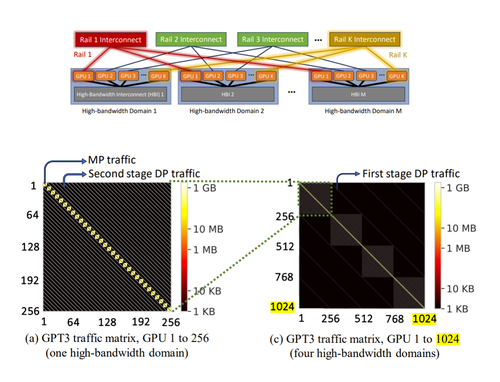

While the *GH200* supercomputers are quite expensive and providing a 256-GPU HB domain is a hard challenge, the traffic heat maps from the paper provide rich insights into LLM training traffic patterns and how one can optimize the spine layer of the CLOS (either completely remove the spine or provide oversubscription) to reduce the network complexity.

In rail-optimized CLOS topologies with standard GPU servers (HB domain of 8 GPUs), the Nth GPUs of each server in a group of servers are connected to the Nth leaf switch, which provides higher bandwidth and non-blocking connectivity between the GPUs in the same rail. Scatter-gather operations between the pipeline partitions in different GPU servers could effectively use this topology.

In the topology below, when a GPU needs to move the data to a GPU in another server and in a different rail, it will first move it to the memory of the GPU inside the server belonging to the same rail as the destination GPU using NVlink interconnect. After that, the data can move to the destination through the rail switch. That enables message aggregation and network traffic optimization. [Refer to the link for more details](https://developer.nvidia.com/blog/doubling-all2all-performance-with-nvidia-collective-communication-library-2-12/).

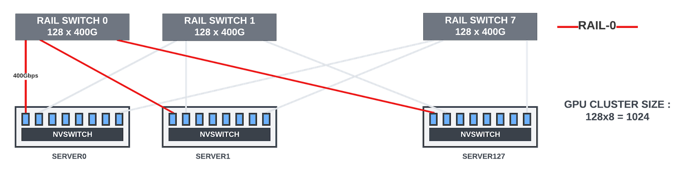

A topology for 1024 GPU cluster with rail-only switches. Inter-rail communication happens by first copying the data to the GPU within the server on the same rail as the destination GPU, then using rail-only leaves for inter-server traffic

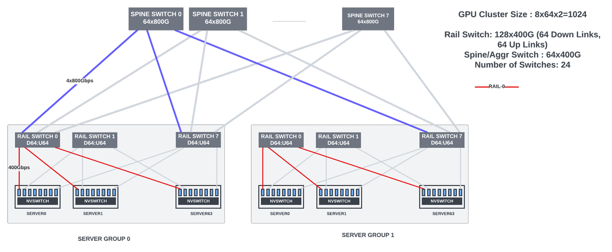

The rail-optimized connections work well for most of the LLM/transformer models.

- Tensor parallel traffic is always within the GPU server. It is high-bandwidth (results communicated for each micro-batch)
- Pipeline-parallel traffic between the GPU servers uses rail-optimized communication.
- The data parallel traffic (gradient aggregation) happens once for each iteration. It can use hierarchical ring-all-reduce or binary tree approaches to reduce the communication overhead.

It is hard to scale the cluster with rail-only switches when using fixed-form-factor switches. The largest radix fixed-form-factor switch available today has 128 ports of 400G, and it has shallow buffers. With 8 GPUs in each server and eight rail switches for each of the 8 GPU ranks, the largest cluster that can be built with rail-only topology is 1024 GPUs. Hence, spine switches are needed for inter-GPU data parallel communication for clusters >1024.

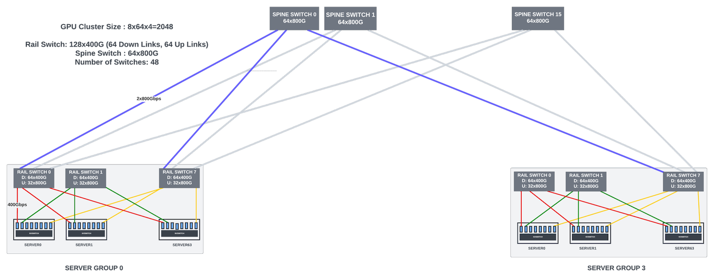

As the GPU cluster size increases, providing full bandwidth between spine-leaf switches becomes expensive. But most of the spine-leaf traffic is data-parallel traffic for gradient aggregation. This traffic is heavily pipelined (ring or tree algorithms) across the GPUs participating in the data aggregation to reduce the load on the leaf-spine links. Some hyperscalers use this and provide oversubscription (7:1 or 8:1) for the links between leaf and spine switches for large clusters. The actual oversubscription ratio depends heavily on the traffic loads and model sizes.

Figure 11 shows a 28K cluster with 51.2Tbps 128x400G switches. You will notice that there are multiple server clusters(groups) with rail-optimized switches. The topology-aware frameworks do not spread the GPUs of a model copy across different clusters. Thus the pipeline-parallel traffic is still contained within rail-optimized server groups.

Figure 12 shows a topology that Meta uses. Here, modular chassis switches (288 x 400G) reduced the number of switches in the topology. There is a 7:1 oversubscription between leaf and spine links in both the topologies.

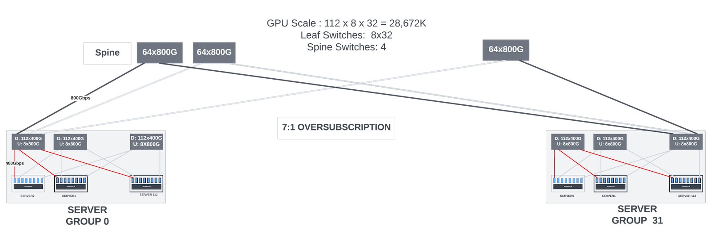

All the connectivity is not shown in this diagram*

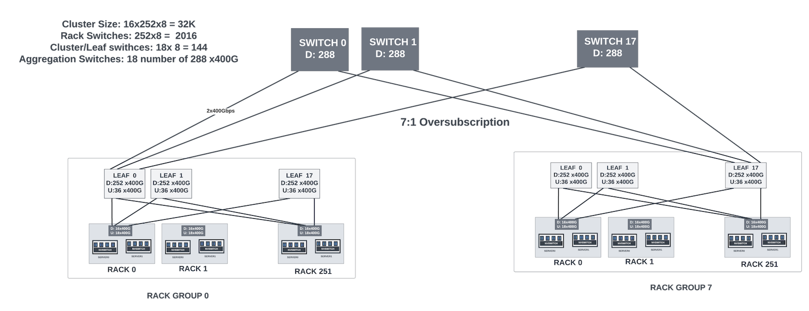

Note that Meta used modular systems (288x400G) for the cluster/aggregation switches in this topology.*

### Modular vs Fixed Form Factor Switches

Modular switch systems (scale-up systems with line/fabric cards) provide very high bandwidth, often 4x-8x more than the 51.2Tbps (128x400G) bandwidth provided by the largest fixed form factor shallow buffer switches currently in the market.

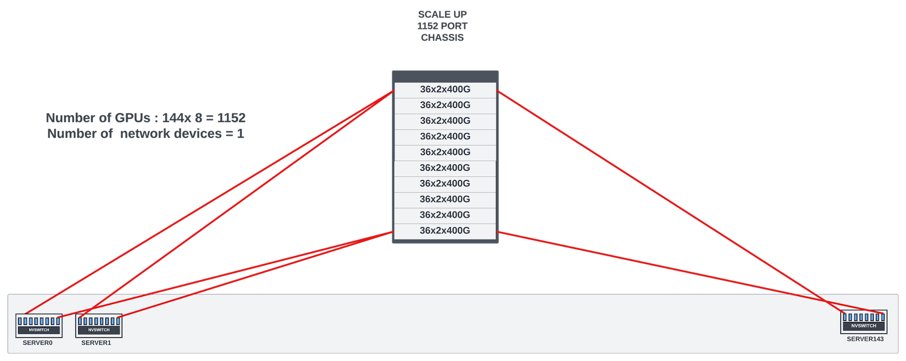

With large radix switches, the number of switches in the network and the number of optical cables needed for the interconnect reduces. These modular switches often come with superior non-blocking connectivity, deep buffers, and scheduled fabric that reduces the HOL blocking. These switches could be ideal candidates for large radix rail or aggregation/spine switches. Deep buffers in these switch systems can absorb transient congestion on some flows before the end-to-end congestion control kicks in.

The argument against using large modular systems is the blast radius when any hardware error happens. If a modular chassis goes down, it brings many servers down, and providing redundancy with additional chassis could be expensive. In addition, if the chassis is not fully utilized, it would be inefficient in area/power per Gbps bandwidth.

This is not an issue with shallow buffer fixed form-factor switches. They are relatively inexpensive and consume less power. Providing additional redundancy in the network is not expensive. Adding extra capacity in the scale-out architectures with fixed form-factor switches is easier. However, shallow buffer switches are very sensitive to congestion and could cause packet drops, triggering go-back-N retransmission if the congestion is not tightly controlled by robust algorithms that keep the queues near empty in the fabric. However, one could argue that this is better than allowing switches to absorb transient congestion (using either modular or deep-buffer fixed-form-factor switches), as near-empty queues keep the end-to-end latency small and predictable.

Ultimately, the choice comes down to the cluster size, congestion control mechanism deployed, area/power/performance targets, and the cost of building and maintaining the cluster. No one size fits all.

### Dragonfly Topology

Dragonfly topology was mainly used in HPC clusters earlier. In this topology, pods or groups of switches connect to the servers. These pods also connect to each other directly with high-bandwidth links. This topology requires fewer switches than the traditional leaf-spine topologies. But it comes with its own challenges when deployed for ethernet/IP traffic. It must support non-minimal global adaptive routing when direct links between two pods are congested. The topology is very sensitive to congestion. Scaling the topology to add more switches is disruptive as it requires re-cabling all the switches in the topology. At the Hot Interconnects 2023, Dr. Bill Dally proposed a topology where the direct links between the groups connect to optical circuit switches. With this, adding additional groups and changing the connectivity of the direct links is less disruptive. Due to the many challenges, this topology is not currently favored by the many enterprises building large ethernet-based GPU clusters. All front-end fabrics in the data centers use CLOS topologies. Adapting the same for GPU backend fabrics is the preferred approach.

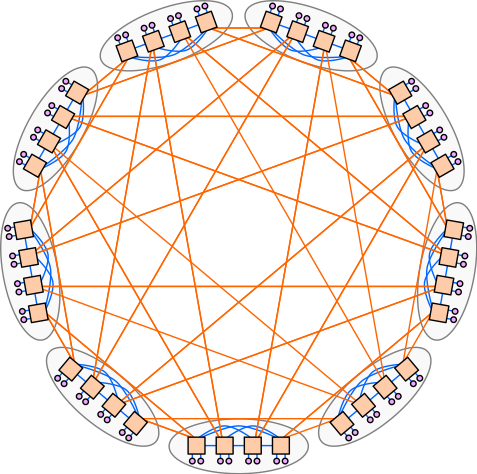

## Fabric Congestion

Lossless transmission is essential for optimizing training performance. Any network drops trigger go-back-N retransmissions in RoCE using standard NICs, which waste bandwidth and cause long tail latencies.

While link-level priority flow control (PFC) can be enabled on all the links, extended PFC could create head-of-line blocking if the allocated buffers are fate-shared between the queues, wasted buffer space, deadlocks, PFCstorms, etc. PFC should be used as a last resort to prevent traffic drops.

Let's take a look at the congestion points in the network

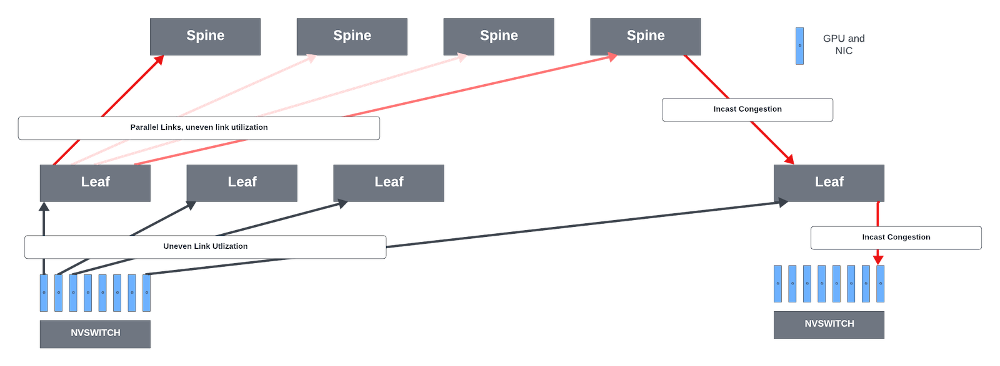

### NIC -> Leaf Links

In rail-optimized leaf switches, for inter-server traffic, NCCL/PXN leverages NVSwitch connectivity within the node to move data to a GPU on the same rail as the destination, then send it to the destination GPU without crossing rails, enabling NIC to leaf traffic optimization.

While each GPU can send 400Gbps to its rail switch, not all GPUs might be fully saturating their links to the leaf switches all the time, thus creating uneven bandwidth distribution across the server to leaf links. For this reason, some hyperscalers do not prefer rail-optimized leaf switches. They prefer to load-balance the GPU traffic across all available links from the server to the leaf switches. This approach has pros and cons.

### Leaf -> Spine Links

In rail-optimized networks, the leaf-spine traffic is mostly data parallel traffic. But these flows have moderately high bandwidth and are long-lived. For example, each *H100* GPU has 80GB of memory. Gradients could occupy 1/10th of that memory (~8GB). When the GPU sends 8GB of data using a 400Gbps up-link using a single QP (flow), it creates a >160ms flow that the rail switch needs to handle.

The Equal-Cost Multi-Path routing (ECMP) mechanism does not work perfectly with these high bandwidth flows and when the system has low entropy. ECMP distributes the packets across the available parallel equal cost (hops) paths between the leaf and spine links when the destination can be reached using these paths. ECMP aims to spread the network traffic to improve link utilization and prevent congestion. The switch uses a hash function to decide which path to send the packet. However, when the system has very low entropy, the hashing could lead to collisions with uneven utilization of the parallel links and with some links heavily congested. The link utilization could go below 50% for some traffic patterns with ECMP load balancing.

### Spine -> Leaf Links

Spine-to-leaf congestion can happen when

- Multiple parallel links can exist between the spine and each leaf switch, and ECMP used to load balance the traffic across the links could create uneven link utilization.
- In-cast traffic. Incast is a traffic pattern in which many flows converge on the same output interface of a switch, exhausting the buffer space for that interface and resulting in packet drops. Even with heavy pipelining and hierarchical aggregation of the gradients, with many parallel aggregation threads, there could be in-cast scenarios where more traffic is trying to go out of a spine-leaf link than the link's capacity. This incast could also happen when multiple training jobs are running in parallel in the GPU cluster.

### Leaf-to-NIC links

They carry high-bandwidth pipeline parallel and data parallel traffic
    The pipeline parallel traffic load depends heavily on the model architecture and partitioning. It has high bandwidth and bursty, with microsecond bursts between the GPUs. These two traffic patterns together could create incast scenarios for those links.

## Congestion Control

Various techniques, listed below, can be used to control congestion in GPU fabrics. The final deployment depends on NICs/switches that support these protocols and the scale of the GPU cluster.

- **Improving link utilization**: Evenly distribute the traffic across all the parallel paths between any two switches or switch/NIC if the destination can be reached equally using these paths. Dynamic/Adaptive load balancing and packet spraying belong to this category. More paths to reach the destination would help the queues build up less in the network switches.
- **Sender-driven congestion control algorithms** (CCA) that rely on ECN or real-time telemetry from the switches. Based on the telemetry data, the sender adjusts the flow injection rate into the fabric.
- **Receiver-driven congestion control** - The receiver meters out credits to the sender for transmitting the packets.
- Scheduled fabric
- New transport protocols that can handle congestion better

### Dynamic/Adaptive Load Balancing

Dynamic/adaptive load balancing in ethernet switches dynamically moves the flows from congested links to lightly used links when the destination can be reached using these parallel links. To not reorder the packets inside a flow, most implementations look for gaps in the flow to do the load balancing. The assumption is that if the gap is wide enough, the packets before the gap are so far ahead in the fabric that sending the future packets through uncongested links would not cause them to reach the destination ahead of the earlier packets. Links do not get rebalanced immediately because of this constraint of waiting for the gaps. This technique can be re-purposed to dynamically load balance the links without waiting for the gaps and having the endpoint NICs take care of the minor reordering introduced. An extreme form of dynamic load-balancing is packet-level spraying which is discussed below.

### Packet Spraying

The other popular method is packet spraying. Each switch in the fabric evenly sprays the packets of a flow across all available (and uncongested) parallel links. Packet spraying could improve the parallel link utilization to >90%

When packets of a flow (QP) are sprayed, they take different paths through the fabric, experience different congestion delays, and can reach the destination GPU out of order.

NICs should have logic/hardware to handle the out-of-order RDMA transactions. As mentioned in the previous sections, Nvidia's ConnectX NICs can handle out-of-order (OOO) RDMA operations. However, the amount of reordering they can support without losing the performance could be limited and might not scale to very large clusters that can introduce larger reordering. Nvidia offers limited field support for this feature, and it is unknown if packet reordering is officially supported in the latest version of their NICs.

The alternate option for cloud providers/hyper scalers is to build their own NICs with hardware that supports reordering of the RDMA operations and use them in their customer-built GPU servers. Using Bluefield DPU from Nvidia is also an option when building custom NICs. Bluefield supports out-of-order RDMA operations by (*most probably*) storing them in the local memory and then writing the packets to GPU memory as it reorders the transactions. However, DPUs are much more expensive and power-hungry than the simple ASICs/FPGAs found in standard NICs. They come with many features besides packet ordering that are not needed for AI/ML training workloads. If Bluefield is indeed using local memory for reordering, it adds additional latency to the transactions and wastes memory resources in the NIC for storing the packets while they can stored in GPU memory itself while being reordered.

Amazon/Microsoft's custom NICs support packet reordering. Other switch vendors might be building smart NICs (or the ASIC used in the NICs) that can support packet reordering.

The sender can also achieve packet spraying by modulating the source UDP port randomly for packets in the QP which allows switches to spray the packets with existing ECMP load-balancing schemes.

### Scheduled Fabric

This was covered in my previous article on the LLMs. To function correctly, the scheduled fabric needs large ingress buffering/state in every end-point leaf switch to queue the packets destined for all end-point GPUs in the entire cluster. It also needs large egress buffers at these end-point switches for all output loss-less queues to hide the RTT from ingress to egress through the fabric. Maintaining the state of all output queues in each switch adds significant silicon area/power. Before transmitting packets, there is an additional RTT delay (for a request-grant handshake between the endpoint switches). In addition, there are no defined standards yet. Each vendor offering this solution has their own proprietary protocol. The control plane management, especially when some links/switches go down and to add extra capacity, is complex and requires customers to have deep knowledge of each vendor's offering. There is a high risk of vendor lock-in.

### Receiver-Driven Congestion Control

Burdening the network switches with end-to-end scheduling and scheduled fabric is an over-design. Instead, it is more optimal if end-point hosts (or NICs) implement this functionality in either their software stack or hardware. Edge Queuing datagram service (EQDS) is one such protocol that moves most of the queuing from the network switches to the sending hosts and uses a receiver-driven credit scheme to control packet transmission. This means that the sender can only send packets when it receives credits from the receiver, and the receiver only grants credits when it has enough buffer space and meters the grants not to exceed the receiver's access link speed. This way, network switches can operate with very small buffers and minimize congestion/packet loss.

The good thing about this protocol is that it does not introduce yet another transport layer protocol. Instead, it provides a datagram service to the existing transport layers through dynamic tunnels.

EQDS uses packet spraying to improve the utilization of the fabric links. The receiving host needs ordering logic to put the packets back in order before sending them to higher-layer protocols that can not tolerate reordering.

EQDS can be implemented in the endpoint NIC's software. But, for high-bandwidth servers, this should be implemented in NIC hardware. Broadcom acquired the company (correct networks) that published this protocol, and it may be building NIC hardware with this feature.

While it can work with existing ethernet switches, its receiver control loop (where the receiver controls the rate at which the sender transmits packets) can be made more effective with in-network mechanisms like **packet trimming**.

With the packet trimming feature, the sending host first starts sending one RTT worth of data to the receiving host without waiting for the credits from the receiver. The header added to the packet indicates how many credits are needed to send the entire transaction. After that, it waits for the receiver's PULL packets (credits) to send more data. Inside the network, if that flow experiences congestion, the network trims the packet by removing the payload and only sends the headers (using high-priority queues) to the receiver. Note that these headers never get dropped inside the network. The receiving host also sends ACKs (for successfully received packets) and NACKs (for trimmed packets) to the sending hosts so the sender can selectively retransmit lost packets.

EQDS could also be implemented without the packet trimming feature. In this case, the sender must request credits (Request to transmit) and wait for the receiver to acknowledge with pull packets before it can start transmission. This adds additional RTT delay for transmission.

While EQDS moves the queues to the endpoint NICs, the queues can build up in a congested network. For RDMA packets, as the queue builds up, the NIC could use existing mechanisms like probabilistic ECN to inform the host to reduce transmission.

Based on Bill Dally's talk at Hot Interconnects 2023, Nvidia may be supporting packet trimming with its own reservation protocol for handling incast traffic for IB and/or Ethernet fabric.

### Sender-driven Congestion Control with DCQCN

In this scheme, the network switches inform the endpoints through ECN if they experience congestion. The sender then can modulate the rate at which data is sent into the network. As the packets of a flow go through the network, if the flow experiences congestion (as measured by queue buildup inside the switch or the end-end latency), the switch/router could mark the packets as congestion experienced before the queue gets full and packets get dropped. For TCP/IP traffic, when endpoints receive packets with congestion experienced set, they notify the sender while sending the ACK packets. The Active Queue Management (AQM) schemes implemented in the host software stack respond to the congestion notification and throttle the traffic.

With RoCEv2 (using IP/UDP as transport) RDMA traffic, there is a need for a much faster congestion response without going through the host software. DCQCN is one such algorithm that is typically implemented in NIC. When the NIC receives the ECN-marked packets, it sends them back to the sender using congestion notification packets (CNP) of RDMA protocol. And the sender adjusts the sending rate to avoid triggering the PFC persistently. The switches should not send PFC before ECN marking for this algorithm to work. The PFC is the last resort to prevent packet losses in extreme fabric congestion.

### Sender-driven Congestion Control with HPCC/HPCC++

While ECN indicates the presence of congestion in the network, the indication is extremely coarse-grained. There is only one state to indicate if the packet experienced congestion in one of the switches in the fabric. The congestion/queue build-up has already happened when the sender starts to reduce the rates. This increases the delays through the network. And the congestion control algorithms (like DCQCN) must act quickly to avoid triggering PFC. In addition, it is hard for the schemes that rely on ECN to figure out how much to reduce the sending rate. These algorithms use guesswork to update the rates iteratively. Iterative methods are slow to converge.

HPCC (High Precision Congestion Control) tries to solve the problem. It is also a sender-driven control loop like DCQCN. As the packets go from the sender to the receiver, each switch along the path uses the INT (In-band Telemetry) feature of the switches to append metadata to the packet. The metadata may contain the timestamp, queue length, transmitted bytes, and link capacity. The receiver copies all the metadata fields from all the switches in the path in the ACK packet it sends back to the sender. The sender adjusts the flow rate using this information. HPCC can achieve faster convergence, small queues in the fabric, and fairness at the sender by leveraging rich telemetry information from the switches. The overhead to the packet is around 8 bytes for each switch, and with five hops seen in large clusters, the overhead is about 4% for 1KB packets.

HPCC++ adds additional enhancements to the HPCC congestion control algorithm to converge faster.

### Google's CSIG for Congestion Signaling

Congestion Signaling, or CSIG, is another way for switches to signal congestion to end-point devices. Google made this protocol open source in OCP 2023. It aims to achieve similar goals to HPCC/HPCC++ with less overhead for the packet. A few salient features of CSIG

- It uses a fixed-length header to carry the signals, while INT uses a variable-length header that grows with the number of hops. This makes it more efficient in bandwidth and overhead.
- CSIG is more scalable than INT because it uses a compare-and-replace mechanism to collect the signals from bottleneck devices along the path, while INT uses a hop-by-hop append mechanism that requires each device to insert its own information.
- CSIG tags are structurally similar to VLAN tags. This enables networks to repurpose existing VLAN rewrite logic to support CSIG tages. This may simplify the implementation and compatibility with in-network tunneling and encryption.
- CSIG information can be used by existing CCA to adjust the flow rates for more accurate control of the network and incast congestion.

### Scalable Reliable Datagram (SRD) by Amazon

Amazon went a step ahead and developed a new transport protocol called Scalable Reliable Datagram (SRD) to address the limitations of RoCEv2. This transport layer protocol looks very similar to Infiniband RC, with a few enhancements. It removes the need for in-order delivery of the packets by the network. The packets are delivered out of order to the application layer, and the message order restoration is left to that layer, as it better understands the required ordering semantics.

SRD is incorporated in Amazon's Elastic Fabric Adapter (EFA) and works with *commodity* ethernet switches. It uses the standard ECMP for multi-path load balancing. The sender controls the ECMP path selection by manipulating packet encapsulation. The sender knows the congestion in each multipath (through the RTT collected for each path) and can modulate how much to send through each path. SRD adjusts its per-connection transmission rate according to rate estimation as indicated by the timing of incoming acknowledge packets and RTT changes.

### Falcon by Google

At OCP Global Summit 2023, Google opened its hardware-assisted transport layer, Falcon, to the ecosystem. Falcon is built on the same principles as SRD to provide low latency and high bandwidth reliable transport. It does this with multi-path connections, handling out-of-order packets in the NIC, selective retransmission, and faster and better delay-based congestion control (swift). Swift uses network round-trip time as the congestion signal. The network switches do not need any changes to support this transport layer.

### Support for CCAs in Network Switches

Packet spraying (either through the switch hardware or by adding more entropy to the packets, as SRD does) is a must-have feature in data center switches to improve link utilization. Almost all commodity ethernet switches support packet-level spraying at the output links (as a configurable feature).

While spraying improves the link utilization and reduces the congestion/queuing delays due to uneven utilization of the parallel links, it may not reduce the congestion experienced at some links due to the incast traffic. Hence, there is a need for robust congestion control schemes in large-scale AI/ML cluster fabrics. Many of these new schemes piggyback on existing ECN marking capabilities of the commodity switches. However, there is growing evidence that ECN is too coarse, and the algorithms that solely depend on ECN may not react/converge fast enough for backend fabric congestion scenarios.

CCA algorithms that depend on INT, IFA (Inband Flow Analyzer), and Google's CSIG fare better in congestion control. Many switches already support some of these telemetry features already. With some additional enhancements, they could broaden their telemetry and congestion signaling offerings to interoperate with a wider range of NICs/other vendor switches. The switches are blissfully unaware of the actual CCA algorithms implemented in the NICs. They would just need to relay congestion to the endpoints with one of the protocols discussed above (and support packet trimming optionally).

For incast congestion, the scheduled fabric is an over-design as it adds large buffers to the switch and makes them inefficient in area/power. It adds a lot of complexity to the control plane to manage proprietary fabric. Instead, moving the queues and scheduling to the endpoint NICs (like in EQDS) are easier to implement/manage and cost-effective.

One of the goals of the UEC (Ultra Ethernet Consortium) is to optimize the link-level and end-to-end network transport protocols or create new ones to enable ethernet fabrics to handle large AI/ML clusters elegantly. However, it is unknown how quickly they would converge on these goals as all the founding members have adapted to different proprietary solutions in their switches/NICs and host stacks. Even if a new protocol is proposed, it is unknown if the hyper scalers, with their custom solutions, would immediately adapt to the new standards. As with RDMA/RoCE, it takes multiple generations to get robust implementations for any new transport protocols. In the meantime, commodity switch vendors must continue to watch out for where the industry is headed and provide better telemetry and congestion signaling options for end-point congestion controls.

## Recap/Future

This article discussed the GPU cluster scale and how it can be optimized using mixed-precision and FP8 operations, next-gen GPUs, parameter sharding, etc. These approaches could train even the largest LLM model (*GPT-4*) with *~8.5K H100/H200* GPUs in less than four weeks. The article questions if there is a need to build gigantic (>32K) clusters in the first place. Wouldn't multiple medium-sized clusters perform better?

Next, GPU traffic patterns for genAI/LLM models and how the network topologies could be optimized for these traffic patterns are discussed.

Lastly, congestion control and the enhancements network switch vendors should consider to prepare their switches for large cluster challenges and interoperability with various NICs are discussed.

The industry is in the early stages of deploying ethernet fabrics for large GPU clusters. If packet spraying and end-to-end congestion control worked well for large IB networks used so far in AI/ML/HPC clusters, ethernet fabric would benefit from the same features. However, there will be some trial and error in the topologies and congestion management features before the hyperscalers settle down on the "recipes" that work for them and publish their protocols (through UEC or independently) for NICs/switches to adapt. Overall, the future looks very bright for ethernet fabric and the switch vendors!

## Useful links

- [Megatron-LM Paper](https://arxiv.org/abs/1909.08053)
- [Microsoft paper on ZeRo](https://arxiv.org/abs/1910.02054)
- [EQDS](https://www.usenix.org/system/files/nsdi22-paper-olteanu.pdf)
- [Packet Trimming](https://arxiv.org/pdf/2207.04967.pdf)
- [DCQCN](https://conferences.sigcomm.org/sigcomm/2015/pdf/papers/p523.pdf)
- [HPCC](https://liyuliang001.github.io/publications/hpcc.pdf),
- [HPCC+](https://datatracker.ietf.org/doc/draft-miao-tsv-hpcc/)
- [SRD](https://ieeexplore.ieee.org/document/9167399)
- [IRN](https://people.eecs.berkeley.edu/~apanda/assets/papers/sigcomm18-irn.pdf) (reordering logic in the NIC)
- [CSIG](https://datatracker.ietf.org/doc/draft-ravi-ippm-csig/)

## Glossary

- AQM: Active Queue Management
- CCA: Congestion Control Algorithm
- CNP: Congestion Notification Packet
- CSIG: Congestion Signaling
- DCQCN: DataCenter Quantized Congestion Notification
- ECMP: Equal-Cost Multi-Path
- ECN: Explicit Congestion Notification
- EFA: Elastic Fabric Adapter
- EQDS: Edge Queuing Datagram Service
- FLOP: Floating Point Operations
- FP: Floating Point
- GEMM: General Matrix Multiply
- GPU: Graphical Processor Unit
- GPT: Generative Pre-training Transformer
- HB: High Bandwidth
- HOL(B): Head of Line (Blocking)
- HPCC: High Precision Congestion Control
- IFA: Inband Flow Analyzer
- INT: In-band Telemetry
- LLM: Large Language Model
- NCCL: Nvidia Collective Communications Library
- NIC: Network Interface Card
- OoO: Out of Order
- OSPF: Octal Small Form Factor Pluggable Module
- PFC: Priority Flow Control
- QP: Queue Pair
- RDMA: Remote Direct Memory Access
- ROCEv2: RDMA over converged ethernet/IP
- RTT: Round Trip Time
- SRD: Scalable Reliable Datagram
- TF16/TF32: Tensor Flow
- UEC: Ultra Ethernet Consortium:
