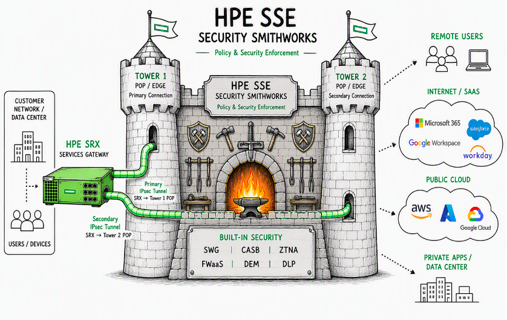
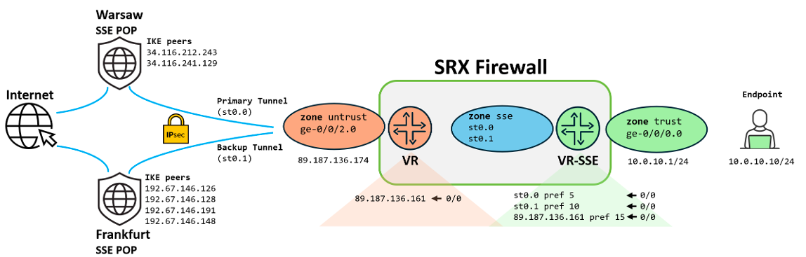
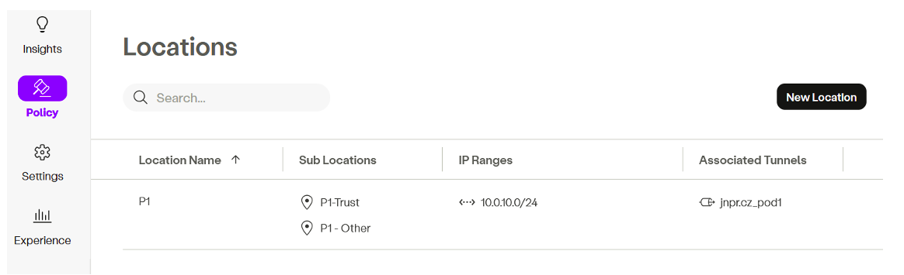
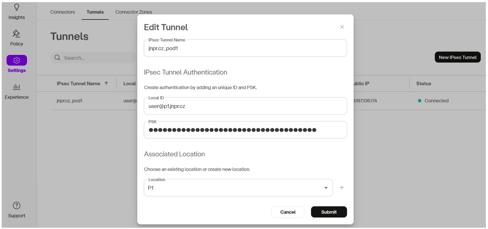
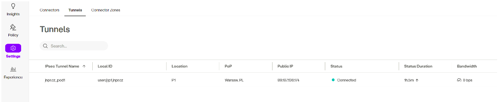
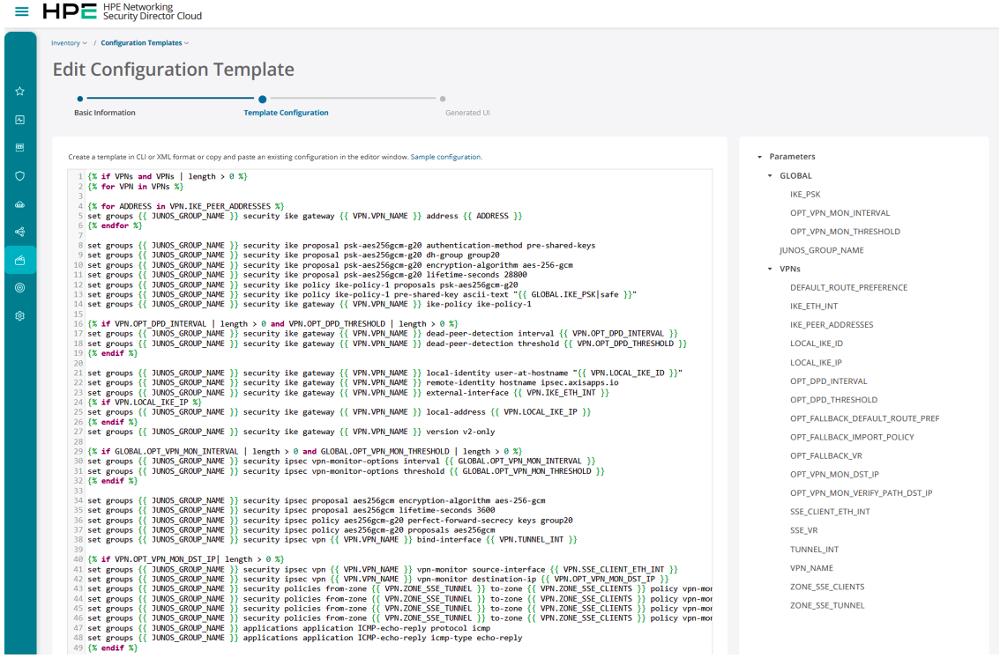
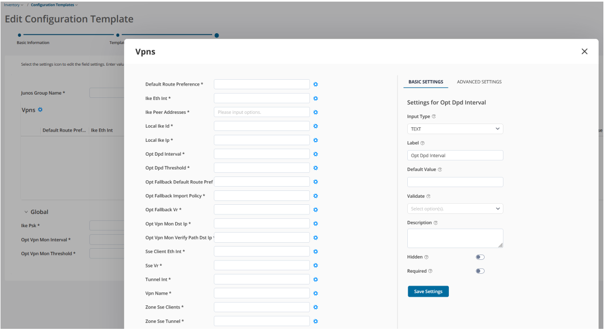
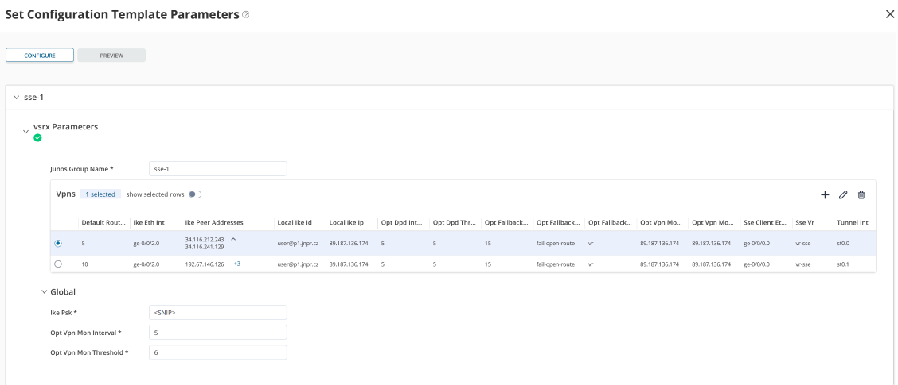
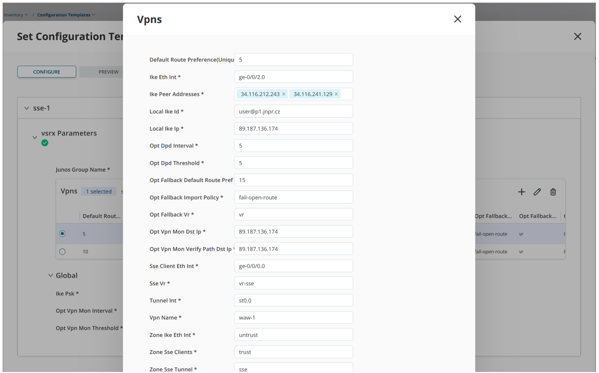
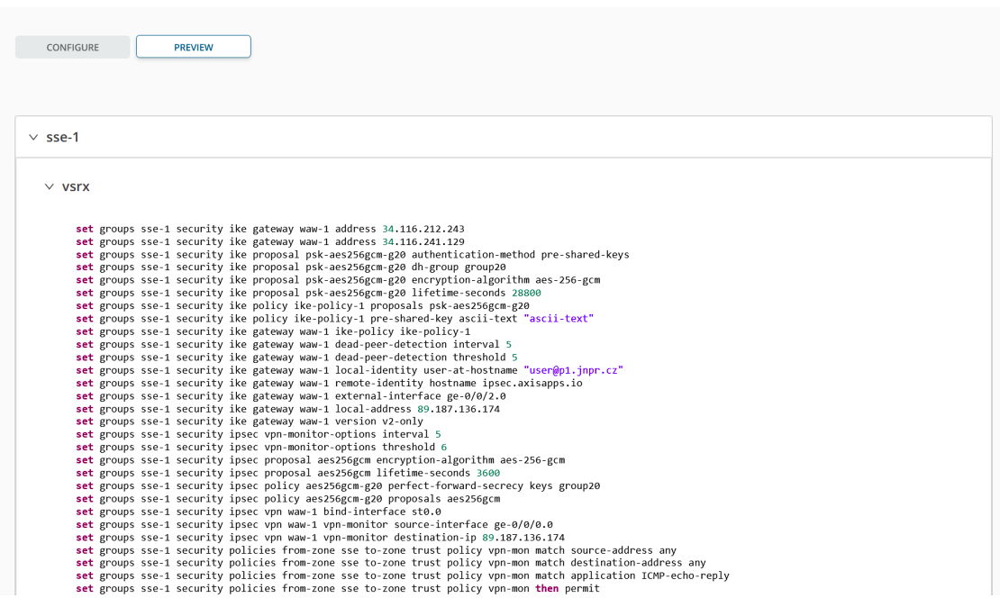

# HPE SRX-SSE Link

**Karel Hendrych - 09/01/2026**



This TechPost provides an example of how to connect unmanaged users and systems behind an HPE SRX Firewall to HPE Security Services Edge (SSE) for security policy enforcement in the cloud. This facilitates a common cloud based policy for these systems as well as system with the SSE agent installed. In addition to connectivity itself, a deployed production setup is explored to provide a resilient connection to local and backup SSE POPs.

## Introduction

In certain use cases, although the SRX is a fully capable NGFW, it may be desirable to enforce advanced security in the HPE SSE service using ZTNA principles beyond a single site context.  This could be to unify policy enforcement, add features not available on the SRX, introduce alternative multi-tenancy, or keep on-prem settings as simple as possible and move complexity to agile SaaS. More about the motivation for bringing traffic to SSE is discussed here.

Any combination of these approaches is possible as well: some security controls can be enforced on the SRX - potentially for traffic that breaks out locally - while the remaining tasks are handled in the cloud via the SSE; or any combination. The question then becomes how to ensure connectivity, where the tried and trusted IPSEC tunnel facilitates integration.

With IPSEC as the transport tunnel, questions arise related to redundancy. Most customers will want a cloud service that does not rely on a single SSE POP location and hence single point of failure. Ideally, failover happens to a geographically close backup POP, ensuring a reasonable user experience during a failure, while still using the closest available POP as primary in normal operation for the best user experience. This TechPost will discuss how to ensure connectivity with redundancy - within the local POP, fall back to the backup POP, and return to the primary POP when it becomes available again.

## Design Principles and Discussion

With SRX, the options for a resilient connection to the HPE SSE service that accepts dynamic-endpoint IKEv2 spokes with static routing are:

- Single-tunnel failover based on Dead Peer Detection standard (DPD) where multiple peer gateways are listed under the IKE gateway settings. This ensures sequential connection attempts when DPD determines that the active peer is down. Advantage: only one tunnel is up at a time, which helps stay within each tenant's finite tunnel limits (today's HPE SSE soft limit is 50). Disadvantage: the DPD mechanism would not revert to the preferred SSE POP upon recovery.
- Two or more tunnels with route preferences, monitored either by DPD or by a VPN monitor (effectively ICMP echo probes). Advantage: connectivity failover without needing to establish a new tunnel and reverting to the primary POP once available. Disadvantage: this counts against the tunnel limits for the SSE solution.
- A combination of the above in one configuration. Since each POP has two or more IPSEC VPN termination points, DPD can handle failover within the POP while keeping one preferred tunnel. A secondary tunnel with less-preferred routing can point to the backup POP. Failover within the backup POP can still be handled using DPD as well. Advantage: increased redundancy by having redundancy within the POPs while keeping the active tunnel count to a minimum. Disadvantage: short time interval when traffic fails over to the backup POP and then reverts when the DPD failover completes in the primary POP.
- Other combinations considering service availability requirements for specific locations. For example, some non-critical locations could use only DPD-based IKE gateway failover.

Overall, a "combination of both" approach seems best: keep two tunnels active while having DPD-based backup peers within each POP. This design is supported by an SRX attribute where DNS-based IKE peers are resolved to IP addresses only at configuration time. Otherwise, the alternative would have been to leverage DNS-based steering as suggested in the SSE documentation. In this TechPost, explicit region-specific termination points entered by IP address will be used.

A final aspect is the internal SRX design for connecting clients to SSE. This TechPost uses a design with decoupled routing instances for IKE peer connectivity, and a separate routing instance that hosts the client-facing Ethernet interface and the tunnel interfaces. Default gateways are configured in order of preference. While not covered in this TechPost, it allows exceptions to be made using Filter-Based Forwarding (FBF) - either driven by rich Junos-style match options (most commonly L4 filters) or using SRX specific Layer 7 application routing (Advanced Policy Based Routing - APBR). Possible motivations for the exceptions include SSE bandwidth and the volume of data subject to licensing. Lastly, it's possible to enable fail-open behaviour when both SSE POPs are down, allowing traffic to break out locally if desired.

> Note: advanced use cases would consider RPM (Junos Real-Time Performance Measurement) to introduce SLA-type SSE service monitoring and to conduct failover actions beyond simple ICMP probe monitoring. Naturally, an HA pair of SRX devices would also be used.

## Demo Topology

Let's consider the following demo topology consisting of an SRX, an endpoint device, and connectivity to two SSE POPs. On the SRX, the interface toward the protected endpoint and the tunnel interfaces representing the POPs are bound to routing instance vr-sse. The external interface toward the SSE IKE peers resides in a custom routing instance called vr, which is bound to the untrust zone.



The Warsaw POP acting as the primary is represented by two IKE peers for sequential DPD-driven failover, bound to tunnel interface st0.0 (routing preference 5). The Frankfurt POP acting as the backup is represented by four DPD-monitored peers, bound to interface st0.1, with a lower priority route preference of 10. Both POPs are monitored using the SRX VPN monitor feature, which sends ICMP echo requests sourced from the trust zone ge-0/0/0.0 interface IP address 10.0.10.1 via the tunnel interfaces to its own external IP address 89.187.136.174 (effectively an end-to-end connectivity test with SSE POP-side source NAT). By design, the VPN monitor is slower than DPD (details in the Configuration Breakdown section), so DPD reacts first and performs sequential connection attempts to an alternative IKE peer within the POP. Lastly, a route of last resort (fail-open behavior) is imported from the vr routing instance (preference 15).

> Note: the monitored destination would be a reliable anycast service in scenarios where the SRX is behind a NAT. In this case, a public IPv4 address on the external interface is handy for triggering VPN monitoring events as described in the Validation section.

## Configuration Breakdown

The aim of this section is to describe a configuration for achieving the goals outlined above. It is designed for replication in a lab environment, with options to easily enable SSE connectivity configuration and conduct failover testing using Junos groups. The SRX used is an IKED-enabled vSRX3 instance (request system software add optional://junos-ike.tgz). Details about the IKE control plane daemon, IKED, and SRX platform specifics can be found in this TechPost. Complete configuration files are available in Appendix 1. As for software versions, mature Junos 24.4R2-S4.12 was used, and, at the time of writing, the latest 26.2R1.7 was also tested. To move beyond "pure" CLI configuration, Appendix 2 includes a configuration template for Security Director (SD) central management, applicable to both Cloud and On-prem variants.

## SRX Basic Configuration

Leaving aside basic SRX system configuration and Flow tuning (covered in previous articles 1 and 2), the following configures a basic trust/untrust firewall with a permit-any policy and source NAT to the egress interface. The system section includes logging configuration for placing VPN control plane-related logs into a separate file named vpn and excluding them from the messages file:

```
set system syslog file vpn any any
set system syslog file vpn match iked
set system syslog file vpn archive size 5m
set system syslog file vpn archive files 4
set system syslog file messages any any
set system syslog file messages match "!iked"
set system syslog file messages archive size 5m
set system syslog file messages archive files 4
set interfaces ge-0/0/0 unit 0 description trust
set interfaces ge-0/0/0 unit 0 family inet address 10.0.10.1/24set interfaces ge-0/0/2 unit 0 description untrust
set interfaces ge-0/0/2 unit 0 family inet address 89.187.136.174/27
set security zones security-zone trust tcp-rst
set security zones security-zone trust interfaces ge-0/0/0.0 host-inbound-traffic system-services ping
set security zones security-zone untrust interfaces ge-0/0/2.0 host-inbound-traffic system-services ping
set security policies from-zone trust to-zone untrust policy trust-untrust-1 match source-address any
set security policies from-zone trust to-zone untrust policy trust-untrust-1 match destination-address any
set security policies from-zone trust to-zone untrust policy trust-untrust-1 match application any
set security policies from-zone trust to-zone untrust policy trust-untrust-1 then permit
set security policies from-zone trust to-zone untrust policy trust-untrust-1 then log session-closeset security nat source rule-set untrust from zone trust
set security nat source rule-set untrust to zone untrust
set security nat source rule-set untrust rule untrust-1 match source-address 0.0.0.0/0
set security nat source rule-set untrust rule untrust-1 match destination-address 0.0.0.0/0
set security nat source rule-set untrust rule untrust-1 then source-nat interface
set routing-instances vr instance-type virtual-router
set routing-instances vr routing-options static route 0.0.0.0/0 next-hop 89.187.136.161
set routing-instances vr interface ge-0/0/2.0
```

## SRX no-SSE Junos Group

The configuration above does not intentionally attach the ge-0/0/0.0 trust zone interface to the vr routing instance. That is a task for either a Junos group that enables clients in the trust zone to break out locally (no-sse), or a group that enables tunneling toward SSE (the sse group described in the next section). The groups are intended to be mutually exclusive: they either place ge-0/0/0.0 into the vr routing instance xor into vr-sse, respectively. The goal is to provide an on/off style toggle for lab work:

```
edit groups no-sse
set routing-instances vr interface ge-0/0/0.0
```

## SRX SSE Junos Group

Let's break down the sse Junos group and the skeleton settings for SRX connectivity to the HPE SSE service. The first section configures pre-shared key based IKE proposal and IKE policy. Although the SSE documentation suggests using AES CBC mode ciphers and DH14 group, the more modern GCM ciphers and DH20 groups are working fine:

```
top edit groups sse
set security ike proposal psk-aes256gcm-g20 authentication-method pre-shared-keys
set security ike proposal psk-aes256gcm-g20 dh-group group20
set security ike proposal psk-aes256gcm-g20 encryption-algorithm aes-256-gcm
set security ike proposal psk-aes256gcm-g20 lifetime-seconds 28800
set security ike policy ike-policy-1 proposals psk-aes256gcm-g20
set security ike policy ike-policy-1 pre-shared-key ascii-text "<PSK>"
```

IKE gateways (waw-1 stands for the Warsaw POP and fra-1 for the Frankfurt POP) define the remote peers for sequential DPD-based failover. DPD is configured with a conservative 30-second fail-over (5x5 seconds plus a 5-second response timeout) and the default optimized DPD probing where probes are sent only if there is egress traffic and no ingress. Otherwise, timers default to 5x10 seconds (effectively a minute). IKE identities relate to the SSE admin portal settings, where the Local ID setting corresponds to the SRX-side local-identity (a proven approach is to use the user-FQDN type). The SRX remote-identity corresponds to the "Peer FQDN" in the SSE documentation.

```
set security ike gateway waw-1 ike-policy ike-policy-1
set security ike gateway waw-1 address 34.116.212.243
set security ike gateway waw-1 address 34.116.241.129
set security ike gateway waw-1 dead-peer-detection interval 5
set security ike gateway waw-1 dead-peer-detection threshold 5
set security ike gateway waw-1 local-identity user-at-hostname "user@p1.jnpr.cz"
set security ike gateway waw-1 remote-identity hostname ipsec.axisapps.io
set security ike gateway waw-1 external-interface ge-0/0/2.0
set security ike gateway waw-1 local-address 89.187.136.174
set security ike gateway waw-1 version v2-only

set security ike gateway fra-1 ike-policy ike-policy-1
set security ike gateway fra-1 address 192.67.146.126
set security ike gateway fra-1 address 192.67.146.128
set security ike gateway fra-1 address 192.67.146.191
set security ike gateway fra-1 address 192.67.146.148
set security ike gateway fra-1 dead-peer-detection interval 5
set security ike gateway fra-1 dead-peer-detection threshold 5
set security ike gateway fra-1 local-identity user-at-hostname "user@p1.jnpr.cz"
set security ike gateway fra-1 remote-identity hostname ipsec.axisapps.io
set security ike gateway fra-1 external-interface ge-0/0/2.0
set security ike gateway fra-1 local-address 89.187.136.174
set security ike gateway fra-1 version v2-only
```

> Note: multiple IKE peers were introduced in IKED with Junos 23.4R1- up to 5 IKE peers can be configured.

The next section defines two unnumbered Secure Tunnel interface (st0) logical units. The VPN monitor accounts for about 35--40 seconds of detection time (default is one minute). Although SSE documentation recommends AES-CBC for the transform as well as for IKE, the IPSEC proposals below use GCM, as it is the most optimal choice for the SRX in terms of VPN performance. The VPNs themselves reference the corresponding IKE gateways and enable the VPN monitor source from the trust zone IP address to the external IP address (which can be any other reliable IP). With no traffic selector defined, the SRX implicitly allows 0/0 (any). The verify-path setting does not mark the st0 unit as up (routes not instantiated) until the ICMP probe is successfully passing:

```
set interfaces st0 unit 0 description waw-1
set interfaces st0 unit 0 family inet
set interfaces st0 unit 1 description fra-1
set interfaces st0 unit 1 family inet

set security ipsec vpn-monitor-options interval 5
set security ipsec vpn-monitor-options threshold 6

set security ipsec proposal aes256gcm encryption-algorithm aes-256-gcm
set security ipsec proposal aes256gcm lifetime-seconds 3600

set security ipsec policy aes256gcm-g20 perfect-forward-secrecy keys group20
set security ipsec policy aes256gcm-g20 proposals aes256gcm
set security ipsec vpn waw-1 bind-interface st0.0
set security ipsec vpn waw-1 vpn-monitor source-interface ge-0/0/0.0
set security ipsec vpn waw-1 vpn-monitor destination-ip 89.187.136.174
set security ipsec vpn waw-1 vpn-monitor verify-path destination-ip 89.187.136.174
set security ipsec vpn waw-1 ike gateway waw-1
set security ipsec vpn waw-1 ike ipsec-policy aes256gcm-g20
set security ipsec vpn waw-1 establish-tunnels immediately

set security ipsec vpn fra-1 bind-interface st0.1
set security ipsec vpn fra-1 vpn-monitor source-interface ge-0/0/0.0
set security ipsec vpn fra-1 vpn-monitor destination-ip 89.187.136.174
set security ipsec vpn fra-1 vpn-monitor verify-path destination-ip 89.187.136.174
set security ipsec vpn fra-1 ike gateway fra-1
set security ipsec vpn fra-1 ike ipsec-policy aes256gcm-g20
set security ipsec vpn fra-1 establish-tunnels immediately
```

The next block of settings binds the tunnel interface units to a security zone named sse, expands the IKE peer-facing interface by enabling the IKE host-inbound-traffic service, and configures a simple Layer 4 policy that permits everything from the trust zone toward the SSE service. This is where you would insert any security measures performed locally on the SRX:

```
set security zones security-zone sse interfaces st0.0
set security zones security-zone sse interfaces st0.1
set security zones security-zone untrust interfaces ge-0/0/2.0 host-inbound-traffic system-services ike
set security policies from-zone trust to-zone sse policy trust-sse-1 match source-address any
set security policies from-zone trust to-zone sse policy trust-sse-1 match destination-address any
set security policies from-zone trust to-zone sse policy trust-sse-1 match application any
set security policies from-zone trust to-zone sse policy trust-sse-1 then permit
set security policies from-zone trust to-zone sse policy trust-sse-1 then log session-close
```

With the VPN monitor sending ICMP echo-requests that aren't tracked by the stateful firewall, ICMP echo-replies are subject to the default drop. The vpn-mon policy permits what appears to be otherwise unsolicited echo-replies. The MSS settings are a safety measure, since the SSE cloud configuration uses an MSS of 1327 B (overrides effectively the local 1350 B setting):

```
set applications application ICMP-echo-reply protocol icmp
set applications application ICMP-echo-reply icmp-type echo-reply
set security policies from-zone sse to-zone trust policy vpn-mon match source-address any
set security policies from-zone sse to-zone trust policy vpn-mon match destination-address any
set security policies from-zone sse to-zone trust policy vpn-mon match application ICMP-echo-reply
set security policies from-zone sse to-zone trust policy vpn-mon then permit
set security flow tcp-mss ipsec-vpn mss 1350
```

The policy-options section defines a policy-statement for importing the default gateway from the internet-facing routing instance vr as an optional route of last resort when SSE is not reachable. Static routing in the vr-sse routing instance sets preferences for the POPs: Warsaw is most preferred (preference 5, the default for static route), followed by Frankfurt (preference 10), and the local-breakout fall back (instance-import) is least preferred (preference 15). The vr-sse routing instance references both the tunnel interfaces and the trust zone interface ge-0/0/0.0:

```
set policy-options policy-statement import-fallback-default term 1 from instance vr
set policy-options policy-statement import-fallback-default term 1 from route-filter 0.0.0.0/0 exact
set policy-options policy-statement import-fallback-default term 1 then preference 15
set policy-options policy-statement import-fallback-default term 1 then accept
set policy-options policy-statement import-fallback-default term 100 then reject
set routing-instances vr-sse instance-type virtual-router
set routing-instances vr-sse routing-options static route 0.0.0.0/0 qualified-next-hop st0.0 preference 5
set routing-instances vr-sse routing-options static route 0.0.0.0/0 qualified-next-hop st0.1 preference 10
set routing-instances vr-sse routing-options instance-import import-fallback-default
set routing-instances vr-sse interface ge-0/0/0.0
set routing-instances vr-sse interface st0.0
set routing-instances vr-sse interface st0.1
```

Finally, the Junos groups need to be applied. To activate SSE:

```
top
set apply-groups sse
```

To deactivate SSE entirely and revert to a simple trust/untrust firewall:

```
delete apply-groups sse
set apply-groups no-sse
```

> Note: in normal operation, when both the preferred and backup tunnels are up, the administrative toggle to switch POPs is to disable the tunnel interface - for example, to flip from Warsaw to Frankfurt:

```
set groups sse interfaces st0.0 disable
```

## SSE Cloud Side Configuration

On the HPE SSE management console, the first step is to configure the location (and possibly the sub-location) associated with the specific IPSEC VPN tunnel so it can be used in security policies - for example:



The tunnel itself is defined by name, Local ID (effectively the SRX local-identity), and PSK, with a referral to a pre-created location. Location (and, optionally, sub-location) can also be created inline without the earlier step:



The Tunnels view provides an indication of the VPN status. However, it shows the most recently connected POP tunnel rather than an exhaustive list of all active tunnels:



## Validation

The validation section checks for normal operation without failures and explains how to test failover (using DPD and the VPN monitor).

## Normal Operation

The first place to check is the IPSEC SAs listing. Two bi-directional pairs indicate that both VPNs are up with the corresponding IKE peers. The "U" values in the monitoring column indicate the Up status for the VPN monitor:

```
show security ipsec security-associations   
 
  Total active tunnels: 2     Total IPsec sas: 2
  ID      Algorithm                  SPI       Life:sec/kb Mon lsys Port  Gateway
  <500018 ESP:aes-gcm-256/aes256-gcm 0x8e98aec6 1606/ unlim U root 4500 34.116.241.129  
  >500018 ESP:aes-gcm-256/aes256-gcm 0xcc413b78 1606/ unlim U root 4500 34.116.241.129  
  <500003 ESP:aes-gcm-256/aes256-gcm 0x5e5a357a 1402/ unlim U root 4500 192.67.146.126  
  >500003 ESP:aes-gcm-256/aes256-gcm 0xc220b912 1402/ unlim U root 4500 192.67.146.126  
```

> Note: although there is no NAT, the VPNs are coming up in NAT-T UDP encapsulation mode (indicated by Port 4500 above). As of the time of writing, attempts to use forced ESP mode from the SRX spoke perspective resulted in non-passing traffic.

Default routes reflect the desired priorities: Warsaw, Frankfurt, and the local fall back:

```
show route table vr-sse.inet.0 0/0 exact    
vr-sse.inet.0: 3 destinations, 5 routes (3 active, 0 holddown, 0 hidden)
+ = Active Route, - = Last Active, * = Both
0.0.0.0/0          *[Static/5] 01:21:55
                    >  via st0.0
                    [Static/10] 19:23:55
                    >  via st0.1
                    [Static/15] 19:44:08
                    >  to 89.187.136.161 via ge-0/0/2.0
```

## Failover Testing

For failover testing a new Junos group block-sse will be used. An external device could also have been used, but it may not be available everywhere. Let's assume the following settings define the egress IP addresses of the POPs (effectively the NAT IPs) in the address book. These will be used in stateful security policies to block IPSEC monitoring probes originating from the untrust zone. To block all IKE peer traffic, a stateless filter bound to the external interface is used, along with disabling IPSEC power-mode. Disabling power-mode ensures the stateless filter is effective; otherwise it could be bypassed before IPSEC processing. The following sample blocks the entire Warsaw POP (both IKE peers on ingress) and VPN monitoring probes from the NAT IP:

```
edit groups block-sse
set security address-book global address FRA_POP_egress_1 192.67.146.100/32
set security address-book global address WAW_POP_egress_1 34.118.27.241/32

top edit groups block-sse security policies from-zone untrust to-zone junos-host
set policy vpn-mon-block match source-address WAW_POP_egress_1
set policy vpn-mon-block match destination-address any
set policy vpn-mon-block match application any
set policy vpn-mon-block then deny

top edit groups block-sse
set security flow power-mode-disable
set firewall family inet filter block-sse term 1 from address 34.116.241.129/32
set firewall family inet filter block-sse term 1 from address 34.116.212.243/32
set firewall family inet filter block-sse term 1 then discard
set firewall family inet filter block-sse term 100 then accept
set interfaces ge-0/0/2 unit 0 family inet filter input block-sse
```

> Note: the junos-host policies are explained by an example in this TechPost and power-mode is briefly touched upon here.

## IKE Peer Failure Within POP

Based on the IPSEC SA, connectivity to the Warsaw POP is using IP address 34.116.241.129:

```
show security ipsec security-associations
 Total active tunnels: 2     Total IPsec sas: 2
  ID      Algorithm       SPI      Life:sec/kb  Mon lsys Port  Gateway
  <500032 ESP:aes-gcm-256/aes256-gcm 0xc111373b 3575/ unlim U root 4500 34.116.241.129  
  >500032 ESP:aes-gcm-256/aes256-gcm 0xc9b3f44c 3575/ unlim U root 4500 34.116.241.129  
  <500003 ESP:aes-gcm-256/aes256-gcm 0xbf238306 2237/ unlim U root 4500 192.67.146.126  
  >500003 ESP:aes-gcm-256/aes256-gcm 0xc0174b04 2237/ unlim U root 4500 192.67.146.126
```

Let's alter the block-sse group so that only DPD engages by deactivating the security policies configuration hierarchy (the VPN monitor probes would be blocked otherwise) and unblocking 34.116.212.243, then apply the group:

```
deactivate groups block-sse security policies
delete groups block-sse firewall family inet filter block-sse term 1 from address 34.116.212.243/32
set apply-groups block-sse
```

> Note: in the optimized mode, DPD triggers only when there is outgoing traffic but no incoming traffic. It can engage even without endpoint activity because VPN monitoring initiates echo probes.

As a result, after the commit at 19:13:25, IKE peer 34.116.241.129 is declared down at 19:13:59 and a successful connection attempt is made toward the next peer in sequence, 34.116.212.243. As mentioned in the design principles section above, during this time traffic briefly starts flowing via the Frankfurt POP. The log appears as if there was manual tunnel redistribution, as known from SRX5k systems:

```
show log vpn
19:13:59  IKE_GATEWAY_DPD_PEER_DEAD: IKE: Gateway N:waw-1 C:89.187.136.174:500 R:34.116.241.129:4500 Failed Role:I DPD Failed
19:13:59  IKE_VPN_DOWN_ALARM_USER: VPN waw-1 from 34.116.241.129 is down. Local-ip: 89.187.136.174, gateway name: waw-1, vpn name: waw-1, 
tunnel-id: 500052, tunnel type: regular-tunnel, local tunnel-if: st0.0, remote tunnel-ip: 34.116.241.129, Local IKE-ID: user@p1.jnpr.cz, 
Remote IKE-ID: ipsec.axisapps.io, AAA username: Not-applicable, VR id: root, Traffic-selector: default_any_any_v4, Traffic-selector local ID: ipv4(0,0-65535,0.0.0.0-255.255.255.255) , Traffic-selector remote ID: ipv4(0,0-65535,0.0.0.0-255.255.255.255) , SA Type: dynamic, Reason: User issued tunnel redistribution command from CLI
19:14:00  IKE_GATEWAY_ID_VALIDATION_SUCCESS: IKE: Gateway N:waw-1 L:89.187.136.174:500 R:34.116.212.243:4500 Successful 
ike-id:ipsec.axisapps.io U:N/A IKE:IKEv2 Role:I
19:14:00  IKE_VPN_UP_ALARM_USER: VPN waw-1 from 34.116.212.243 is up. Local-ip: 89.187.136.174, gateway name: waw-1, vpn name: waw-1, 
tunnel-id: 500053, tunnel type: regular-tunnel, local tunnel-if: st0.0, remote tunnel-ip: 34.116.212.243, Local IKE-ID: user@p1.jnpr.cz, 
Remote IKE-ID: ipsec.axisapps.io, AAA username: Not-applicable, VR id: root, Traffic-selector: default_any_any_v4, Traffic-selector 
local ID: ipv4(0,0-65535,0.0.0.0-255.255.255.255) , Traffic-selector remote ID: ipv4(0,0-65535,0.0.0.0-255.255.255.255) , 
SA Type: dynamic, Service Offload: No
```

Corresponding tcpdump captures on the Linux bridge, where the untrust ge-0/0/2.0 interface is connected, show 5 DPD probes with an interval of 5 seconds. After a timeout of 5 seconds following the last probe, the IKE_GATEWAY_DPD_PEER_DEAD log above appears, and the alternative IKE peer 34.116.212.243 is contacted (IKE_GATEWAY_ID_VALIDATION_SUCCESS log).

```
19:13:34.442130 IP 89.187.136.174.4500 > 34.116.241.129.4500: NONESP-encap: isakmp: child_sa  inf2[I]
19:13:34.457128 IP 34.116.241.129.4500 > 89.187.136.174.4500: NONESP-encap: isakmp: child_sa  inf2[R]
19:13:39.442662 IP 89.187.136.174.4500 > 34.116.241.129.4500: NONESP-encap: isakmp: child_sa  inf2[I]
19:13:39.457903 IP 34.116.241.129.4500 > 89.187.136.174.4500: NONESP-encap: isakmp: child_sa  inf2[R]
19:13:44.443217 IP 89.187.136.174.4500 > 34.116.241.129.4500: NONESP-encap: isakmp: child_sa  inf2[I]
19:13:44.457946 IP 34.116.241.129.4500 > 89.187.136.174.4500: NONESP-encap: isakmp: child_sa  inf2[R]
19:13:49.444281 IP 89.187.136.174.4500 > 34.116.241.129.4500: NONESP-encap: isakmp: child_sa  inf2[I]
19:13:49.459247 IP 34.116.241.129.4500 > 89.187.136.174.4500: NONESP-encap: isakmp: child_sa  inf2[R]
19:13:54.445596 IP 89.187.136.174.4500 > 34.116.241.129.4500: NONESP-encap: isakmp: child_sa  inf2[I]
19:13:54.460585 IP 34.116.241.129.4500 > 89.187.136.174.4500: NONESP-encap: isakmp: child_sa  inf2[R]
```

## VPN Monitor (POP) Failure

To trigger the VPN monitor, let's activate security policies that include the stateful untrust-to-junos-host security policy, which was deactivated earlier, to further escalate the simulation of a failing POP:

```
activate groups block-sse security policies
```

As a result of the above change, IKE peer will still be available, allowing the VPN to reconnect. However, because of the verify-path setting - which requires VPN monitoring to succeed - the tunnel interface will remain down, and the corresponding route will not be installed. The logs from the commit at 22:03:34 show the initial VPN monitor failure, followed by reconnection and subsequent path-validation failure:

```
show log vpn
22:04:11  IKE_VPN_DOWN_ALARM_USER: VPN waw-1 from 34.116.212.243 is down. Local-ip: 89.187.136.174, gateway name: waw-1, vpn name: waw-1, 
tunnel-id: 500006, tunnel type: regular-tunnel, local tunnel-if: st0.0, remote tunnel-ip: 34.116.212.243, Local IKE-ID: user@p1.jnpr.cz, 
Remote IKE-ID: ipsec.axisapps.io, AAA username: Not-applicable, VR id: root, Traffic-selector: default_any_any_v4, 
Traffic-selector local ID: ipv4(0,0-65535,0.0.0.0-255.255.255.255) , Traffic-selector remote ID: ipv4(0,0-65535,0.0.0.0-255.255.255.255) , 
SA Type: dynamic, Reason: IPSEC SA VPN Monitor Failure
22:04:13  IKE_VPN_UP_ALARM_USER: VPN waw-1 from 34.116.212.243 is up. Local-ip: 89.187.136.174, gateway name: waw-1, vpn name: waw-1, 
tunnel-id: 500007, tunnel type: regular-tunnel, local tunnel-if: st0.0, remote tunnel-ip: 34.116.212.243, Local IKE-ID: user@p1.jnpr.cz, 
Remote IKE-ID: ipsec.axisapps.io, AAA username: Not-applicable, VR id: root, Traffic-selector: default_any_any_v4, 
Traffic-selector local ID: ipv4(0,0-65535,0.0.0.0-255.255.255.255) , Traffic-selector remote ID: ipv4(0,0-65535,0.0.0.0-255.255.255.255) , 
SA Type: dynamic, Service Offload: No
22:04:53  IKE_VPN_DOWN_ALARM_USER: VPN waw-1 from 34.116.212.243 is down. Local-ip: 89.187.136.174, gateway name: waw-1, vpn name: waw-1, 
tunnel-id: 500007, tunnel type: regular-tunnel, local tunnel-if: st0.0, remote tunnel-ip: 34.116.212.243, Local IKE-ID: user@p1.jnpr.cz, 
Remote IKE-ID: ipsec.axisapps.io, AAA username: Not-applicable, VR id: root, Traffic-selector: default_any_any_v4, 
Traffic-selector local ID: ipv4(0,0-65535,0.0.0.0-255.255.255.255) , Traffic-selector remote ID: ipv4(0,0-65535,0.0.0.0-255.255.255.255) , 
SA Type: dynamic, Reason: IPSEC SA VPN Monitor Verify-Path Failure
```

Corresponding tcpdump of the VPN monitor probes destined to the local external address shows that 7 probes were sent (this can vary due to timing around commit, since 6x5 seconds are configured). The IKE_VPN_DOWN_ALARM_USER log appeared 5 seconds after the last ICMP echo probe with ID 47617, accounting for an overall detection time of around 35 seconds:

```
22:03:36.056274 IP 34.118.27.241 > 89.187.136.174: ICMP echo request, id 47617, seq 2816, length 64
22:03:41.182085 IP 34.118.27.241 > 89.187.136.174: ICMP echo request, id 47617, seq 3072, length 64
22:03:46.297357 IP 34.118.27.241 > 89.187.136.174: ICMP echo request, id 47617, seq 3328, length 64
22:03:51.428324 IP 34.118.27.241 > 89.187.136.174: ICMP echo request, id 47617, seq 3584, length 64
22:03:56.537697 IP 34.118.27.241 > 89.187.136.174: ICMP echo request, id 47617, seq 3840, length 64
22:04:01.658331 IP 34.118.27.241 > 89.187.136.174: ICMP echo request, id 47617, seq 4096, length 64
22:04:06.791155 IP 34.118.27.241 > 89.187.136.174: ICMP echo request, id 47617, seq 4352, length 64
22:04:18.164655 IP 34.118.27.241 > 89.187.136.174: ICMP echo request, id 47616, seq 256, length 64
```

IPSEC SAs for the Warsaw POP can still be observed during the condition above; however, the "V" flag indicates the verify-path monitoring stage.

```
show security ipsec security-association
  Total active tunnels: 2     Total IPsec sas: 2
  ID      Algorithm                  SPI       Life:sec/kb  Mon lsys Port  Gateway
  <500038 ESP:aes-gcm-256/aes256-gcm 0x5257aa72 3578/ unlim V root 4500 34.116.212.243  
  >500038 ESP:aes-gcm-256/aes256-gcm 0xc2f7370f 3578/ unlim V root 4500 34.116.212.243  
  <500003 ESP:aes-gcm-256/aes256-gcm 0xbf238306 1095/ unlim U root 4500 192.67.146.126  
  >500003 ESP:aes-gcm-256/aes256-gcm 0xc0174b04 1095/ unlim U root 4500 192.67.146.126
```

Finally, no route exists to st0.0, and the tunnel interface via the backup POP st0.1 becomes active:

```
show route table vr-sse.inet.0 0/0 exact
vr-sse.inet.0: 3 destinations, 4 routes (3 active, 0 holddown, 0 hidden)
+ = Active Route, - = Last Active, * = Both
0.0.0.0/0          *[Static/10] 20:18:42
                    >  via st0.1
                    [Static/15] 20:38:55
                    >  to 89.187.136.161 via ge-0/0/2.0
```

## Fail-Open

The last step is to test the optional fail-open behavior when both SSE POPs are unavailable. To trigger the condition with the Warsaw POP link already down, let's block the source of the VPN monitoring probes from the Frankfurt POP NAT IP:

```
edit groups block-sse security policies
set from-zone untrust to-zone junos-host policy vpn-mon-block match source-address FRA_POP_egress_1
```

After the commit at 22:29:36, the following log reappeared approximately 35 seconds later:

```
22:30:12  IKE_VPN_DOWN_ALARM_USER: VPN fra-1 from 192.67.146.126 is down. Local-ip: 89.187.136.174, gateway name: fra-1, vpn name: fra-1, 
tunnel-id: 500001, tunnel type: regular-tunnel, local tunnel-if: st0.1, remote tunnel-ip: 192.67.146.126, Local IKE-ID: user@p1.jnpr.cz, 
Remote IKE-ID: ipsec.axisapps.io, AAA username: Not-applicable, VR id: root, Traffic-selector: default_any_any_v4, 
Traffic-selector local ID: ipv4(0,0-65535,0.0.0.0-255.255.255.255) , Traffic-selector remote ID: ipv4(0,0-65535,0.0.0.0-255.255.255.255) , 
SA Type: dynamic, Reason: IPSEC SA VPN Monitor Failure
```

Also, the corresponding log for the st0.1 link status change:

```
show log messages | match st0.1
22:30:12  SNMP_TRAP_LINK_DOWN: ifIndex 525, ifAdminStatus up(1), ifOperStatus down(2), ifName st0.1
```

The only remaining route is the one imported from the vr routing instance:

```
show route table vr-sse.inet.0 0/0 exact 
vr-sse.inet.0: 3 destinations, 3 routes (3 active, 0 holddown, 0 hidden)
+ = Active Route, - = Last Active, * = Both
0.0.0.0/0          *[Static/15] 00:42:16
                    >  to 89.187.136.161 via ge-0/0/2.0
```

Flow sessions are traversing vr and vr-sse routing instances and exiting directly via ge-0/0/2.0 with policy look-up in the trust to untrust zone context, where alternative security measures could be applied. NAT to the external interface IP address is also occurring. An ICMP echo-request to the well-known 1.1.1.1 anycast address (session listing):

```
show security flow session destination-prefix 1.1.1.1
Session ID: 1671, Policy name: trust-untrust-1/4, Timeout: 2, Session State: Valid
  In: 10.0.10.10/3 --> 1.1.1.1/7;icmp, Conn Tag: 0x0, If: ge-0/0/0.0, Pkts: 1, Bytes: 84, 
  Out: 1.1.1.1/7 --> 89.187.136.174/21178;icmp, Conn Tag: 0x0, If: ge-0/0/2.0, Pkts: 1, Bytes: 84,
```

## Reverting to Normal Operation

To revert from testing mode, simply de-apply the block-sse Junos group (and potentially remove it as well):

```
delete apply-groups block-sse
```

Routing to the SSE services will then revert to the normal operating state described earlier, with the Warsaw SSE POP as the preferred path.

## Appendix 1 -- Complete SRX Configuration

```
set system syslog file vpn any any
set system syslog file vpn match iked
set system syslog file vpn archive sze 5m
set system syslog file vpn archive files 4
set system syslog file messages any any
set system syslog file messages match "!iked"
set system syslog file messages archive size 5m
set system syslog file messages archive files 4
set security zones security-zone trust tcp-rst
set security zones security-zone trust interfaces ge-0/0/0.0 host-inbound-traffic system-services ping
set security zones security-zone untrust interfaces ge-0/0/2.0 host-inbound-traffic system-services ping
set security policies from-zone trust to-zone untrust policy trust-untrust-1 match source-address any
set security policies from-zone trust to-zone untrust policy trust-untrust-1 match destination-address any
set security policies from-zone trust to-zone untrust policy trust-untrust-1 match application any
set security policies from-zone trust to-zone untrust policy trust-untrust-1 then permit
set security policies from-zone trust to-zone untrust policy trust-untrust-1 then log session-close
set interfaces ge-0/0/0 unit 0 description trust
set interfaces ge-0/0/0 unit 0 family inet address 10.0.10.1/24
set interfaces ge-0/0/2 unit 0 description untrust
set interfaces ge-0/0/2 unit 0 family inet address 89.187.136.174/27
set routing-instances vr instance-type virtual-router
set routing-instances vr routing-options static route 0.0.0.0/0 next-hop 89.187.136.161
set routing-instances vr interface ge-0/0/2.0
```

```
top edit groups sse
set security ike proposal psk-aes256gcm-g20 authentication-method pre-shared-keys
set security ike proposal psk-aes256gcm-g20 dh-group group20
set security ike proposal psk-aes256gcm-g20 encryption-algorithm aes-256-gcm
set security ike proposal psk-aes256gcm-g20 lifetime-seconds 28800
set security ike policy ike-policy-1 proposals psk-aes256gcm-g20
set security ike policy ike-policy-1 pre-shared-key ascii-text "<PSK>"
set security ike gateway waw-1 ike-policy ike-policy-1
set security ike gateway waw-1 address 34.116.212.243
set security ike gateway waw-1 address 34.116.241.129
set security ike gateway waw-1 dead-peer-detection interval 5
set security ike gateway waw-1 dead-peer-detection threshold 5
set security ike gateway waw-1 local-identity user-at-hostname "user@p1.jnpr.cz"
set security ike gateway waw-1 remote-identity hostname ipsec.axisapps.io
set security ike gateway waw-1 external-interface ge-0/0/2.0
set security ike gateway waw-1 local-address 89.187.136.174
set security ike gateway waw-1 version v2-only
set security ike gateway fra-1 ike-policy ike-policy-1
set security ike gateway fra-1 address 192.67.146.126
set security ike gateway fra-1 address 192.67.146.128
set security ike gateway fra-1 address 192.67.146.191
set security ike gateway fra-1 address 192.67.146.148
set security ike gateway fra-1 dead-peer-detection interval 5
set security ike gateway fra-1 dead-peer-detection threshold 5
set security ike gateway fra-1 local-identity user-at-hostname "user@p1.jnpr.cz"
set security ike gateway fra-1 remote-identity hostname ipsec.axisapps.io
set security ike gateway fra-1 external-interface ge-0/0/2.0
set security ike gateway fra-1 local-address 89.187.136.174
set security ike gateway fra-1 version v2-only
set security ipsec vpn-monitor-options interval 5
set security ipsec vpn-monitor-options threshold 6
set security ipsec proposal aes256gcm encryption-algorithm aes-256-gcm
set security ipsec proposal aes256gcm lifetime-seconds 3600
set security ipsec policy aes256gcm-g20 perfect-forward-secrecy keys group20
set security ipsec policy aes256gcm-g20 proposals aes256gcm
set security ipsec vpn waw-1 bind-interface st0.0
set security ipsec vpn waw-1 vpn-monitor source-interface ge-0/0/0.0
set security ipsec vpn waw-1 vpn-monitor destination-ip 89.187.136.174
set security ipsec vpn waw-1 vpn-monitor verify-path destination-ip 89.187.136.174
set security ipsec vpn waw-1 ike gateway waw-1
set security ipsec vpn waw-1 ike ipsec-policy aes256gcm-g20
set security ipsec vpn waw-1 establish-tunnels immediately
set security ipsec vpn fra-1 bind-interface st0.1
set security ipsec vpn fra-1 vpn-monitor source-interface ge-0/0/0.0
set security ipsec vpn fra-1 vpn-monitor destination-ip 89.187.136.174
set security ipsec vpn fra-1 vpn-monitor verify-path destination-ip 89.187.136.174
set security ipsec vpn fra-1 ike gateway fra-1
set security ipsec vpn fra-1 ike ipsec-policy aes256gcm-g20
set security ipsec vpn fra-1 establish-tunnels immediately
set security zones security-zone sse interfaces st0.0
set security zones security-zone sse interfaces st0.1
set security zones security-zone untrust interfaces ge-0/0/2.0 host-inbound-traffic system-services ike
set security policies from-zone trust to-zone sse policy trust-sse-1 match source-address any
set security policies from-zone trust to-zone sse policy trust-sse-1 match destination-address any
set security policies from-zone trust to-zone sse policy trust-sse-1 match application any
set security policies from-zone trust to-zone sse policy trust-sse-1 then permit
set security policies from-zone trust to-zone sse policy trust-sse-1 then log session-close
set security policies from-zone sse to-zone trust policy vpn-mon match source-address any
set security policies from-zone sse to-zone trust policy vpn-mon match destination-address any
set security policies from-zone sse to-zone trust policy vpn-mon match application ICMP-echo-reply
set security policies from-zone sse to-zone trust policy vpn-mon then permit
set security flow tcp-mss ipsec-vpn mss 1350
set interfaces st0 unit 0 description waw-1
set interfaces st0 unit 0 family inet
set interfaces st0 unit 1 description fra-1
set interfaces st0 unit 1 family inet
set policy-options policy-statement import-fallback-default term 1 from instance vr
set policy-options policy-statement import-fallback-default term 1 from route-filter 0.0.0.0/0 exact
set policy-options policy-statement import-fallback-default term 1 then preference 15
set policy-options policy-statement import-fallback-default term 1 then accept
set policy-options policy-statement import-fallback-default term 100 then reject
set routing-instances vr-sse instance-type virtual-router
set routing-instances vr-sse routing-options static route 0.0.0.0/0 qualified-next-hop st0.0 preference 5
set routing-instances vr-sse routing-options static route 0.0.0.0/0 qualified-next-hop st0.1 preference 10
set routing-instances vr-sse routing-options instance-import import-fallback-default
set routing-instances vr-sse interface ge-0/0/0.0
set routing-instances vr-sse interface st0.0
set routing-instances vr-sse interface st0.1
set applications application ICMP-echo-reply protocol icmp
set applications application ICMP-echo-reply icmp-type echo-reply
```

```
top edit groups no-sse 
set routing-instances vr interface ge-0/0/0.0
```

```
top set apply-groups sse
```

## Appendix 2 -- SDC Configuration Template

[Security Director configuration templates](https://www.juniper.net/documentation/us/en/software/sd-cloud/sd-cloud-user-guide/user-guide/topics/concept/ems-overview-config-temp.html) provide a UI for Jinja2 based templates of SRX settings/workflows that aren't available out of the box. The included sample configuration template reflects the described CLI settings, but in a GUI form. This supports large-scale rollout and allows the template to be seeded using a CSV file with per-device specific settings.

Below is a set of self-explanatory screenshots from the SD (Cloud variant) GUI, starting with the template configuration capture:





Resulting SD dialogs for configuring the VPNs to the SSE service with sample data:





Preview of the set commands that would be pushed to the device:



The template itself is intended for copy/pasting into an external editor. In practice, the template needs to be adjusted for the specific scenario - for example, multiple zones for segmented SSE clients may be required. As part of customer customisation, it's important to review the host-inbound services for IKE and uncomment the appropriate option. The variables prefixed by OPT in the Jinja template (Opt in the GUI representation) are optional and can be flagged accordingly by toggling the Required button in the SD template configuration GUI. Except for VPN monitor related policy, firewall policies are intended to be configured from the SD Security Policies editor, not within the template, since SD does not control settings in Junos groups. Template:

```



set groups {{ JUNOS_GROUP_NAME }} security ike gateway {{ VPN.VPN_NAME }} address {{ ADDRESS }}

set groups {{ JUNOS_GROUP_NAME }} security ike proposal psk-aes256gcm-g20 authentication-method pre-shared-keys
set groups {{ JUNOS_GROUP_NAME }} security ike proposal psk-aes256gcm-g20 dh-group group20
set groups {{ JUNOS_GROUP_NAME }} security ike proposal psk-aes256gcm-g20 encryption-algorithm aes-256-gcm
set groups {{ JUNOS_GROUP_NAME }} security ike proposal psk-aes256gcm-g20 lifetime-seconds 28800
set groups {{ JUNOS_GROUP_NAME }} security ike policy ike-policy-1 proposals psk-aes256gcm-g20
set groups {{ JUNOS_GROUP_NAME }} security ike policy ike-policy-1 pre-shared-key ascii-text "{{ GLOBAL.IKE_PSK|safe }}"
set groups {{ JUNOS_GROUP_NAME }} security ike gateway {{ VPN.VPN_NAME }} ike-policy ike-policy-1

set groups {{ JUNOS_GROUP_NAME }} security ike gateway {{ VPN.VPN_NAME }} dead-peer-detection interval {{ VPN.OPT_DPD_INTERVAL }}
set groups {{ JUNOS_GROUP_NAME }} security ike gateway {{ VPN.VPN_NAME }} dead-peer-detection threshold {{ VPN.OPT_DPD_THRESHOLD }}

set groups {{ JUNOS_GROUP_NAME }} security ike gateway {{ VPN.VPN_NAME }} local-identity user-at-hostname "{{ VPN.LOCAL_IKE_ID }}"
set groups {{ JUNOS_GROUP_NAME }} security ike gateway {{ VPN.VPN_NAME }} remote-identity hostname ipsec.axisapps.io
set groups {{ JUNOS_GROUP_NAME }} security ike gateway {{ VPN.VPN_NAME }} external-interface {{ VPN.IKE_ETH_INT }}

set groups {{ JUNOS_GROUP_NAME }} security ike gateway {{ VPN.VPN_NAME }} local-address {{ VPN.LOCAL_IKE_IP }}

set groups {{ JUNOS_GROUP_NAME }} security ike gateway {{ VPN.VPN_NAME }} version v2-only

set groups {{ JUNOS_GROUP_NAME }} security ipsec vpn-monitor-options interval {{ GLOBAL.OPT_VPN_MON_INTERVAL }}
set groups {{ JUNOS_GROUP_NAME }} security ipsec vpn-monitor-options threshold {{ GLOBAL.OPT_VPN_MON_THRESHOLD }}

set groups {{ JUNOS_GROUP_NAME }} security ipsec proposal aes256gcm encryption-algorithm aes-256-gcm
set groups {{ JUNOS_GROUP_NAME }} security ipsec proposal aes256gcm lifetime-seconds 3600
set groups {{ JUNOS_GROUP_NAME }} security ipsec policy aes256gcm-g20 perfect-forward-secrecy keys group20
set groups {{ JUNOS_GROUP_NAME }} security ipsec policy aes256gcm-g20 proposals aes256gcm
set groups {{ JUNOS_GROUP_NAME }} security ipsec vpn {{ VPN.VPN_NAME }} bind-interface {{ VPN.TUNNEL_INT }}

set groups {{ JUNOS_GROUP_NAME }} security ipsec vpn {{ VPN.VPN_NAME }} vpn-monitor source-interface {{ VPN.SSE_CLIENT_ETH_INT }}
set groups {{ JUNOS_GROUP_NAME }} security ipsec vpn {{ VPN.VPN_NAME }} vpn-monitor destination-ip {{ VPN.OPT_VPN_MON_DST_IP }}{# explicit permit for VPN-monitor echo-replies #}
set groups {{ JUNOS_GROUP_NAME }} security policies from-zone {{ VPN.ZONE_SSE_TUNNEL }} to-zone {{ VPN.ZONE_SSE_CLIENTS }} policy vpn-mon match source-address any
set groups {{ JUNOS_GROUP_NAME }} security policies from-zone {{ VPN.ZONE_SSE_TUNNEL }} to-zone {{ VPN.ZONE_SSE_CLIENTS }} policy vpn-mon match destination-address any
set groups {{ JUNOS_GROUP_NAME }} security policies from-zone {{ VPN.ZONE_SSE_TUNNEL }} to-zone {{ VPN.ZONE_SSE_CLIENTS }} policy vpn-mon match application ICMP-echo-reply
set groups {{ JUNOS_GROUP_NAME }} security policies from-zone {{ VPN.ZONE_SSE_TUNNEL }} to-zone {{ VPN.ZONE_SSE_CLIENTS }} policy vpn-mon then permit
set groups {{ JUNOS_GROUP_NAME }} applications application ICMP-echo-reply protocol icmp
set groups {{ JUNOS_GROUP_NAME }} applications application ICMP-echo-reply icmp-type echo-reply

set groups {{ JUNOS_GROUP_NAME }} security ipsec vpn {{ VPN.VPN_NAME }} vpn-monitor verify-path destination-ip {{ VPN.OPT_VPN_MON_VERIFY_PATH_DST_IP }}

set groups {{ JUNOS_GROUP_NAME }} security ipsec vpn {{ VPN.VPN_NAME }} ike gateway {{ VPN.VPN_NAME }}
set groups {{ JUNOS_GROUP_NAME }} security ipsec vpn {{ VPN.VPN_NAME }} ike ipsec-policy aes256gcm-g20
set groups {{ JUNOS_GROUP_NAME }} security ipsec vpn {{ VPN.VPN_NAME }} establish-tunnels immediately
set groups {{ JUNOS_GROUP_NAME }} security zones security-zone {{ VPN.ZONE_SSE_CLIENTS }} interfaces {{ VPN.SSE_CLIENT_ETH_INT }} host-inbound-traffic system-services ping
{# to have SSE tunnel zone visible in SD #}
set security zones security-zone {{ VPN.ZONE_SSE_TUNNEL }}
set groups {{ JUNOS_GROUP_NAME }} security zones security-zone {{ VPN.ZONE_SSE_TUNNEL }} interfaces {{ VPN.TUNNEL_INT }}
{# following needs selection which one as interface level overrides zone settings - potential to distract remote management! #}
{# set groups {{ JUNOS_GROUP_NAME }} security zones security-zone {{ VPN.ZONE_IKE_ETH_INT }} interfaces {{ VPN.IKE_ETH_INT }} host-inbound-traffic system-services ike #}
{# set groups {{ JUNOS_GROUP_NAME }} security zones security-zone {{ VPN.ZONE_IKE_ETH_INT }} host-inbound-traffic system-services ike #}
set groups {{ JUNOS_GROUP_NAME }} interfaces {{ VPN.TUNNEL_INT }} description {{ VPN.VPN_NAME }}
set groups {{ JUNOS_GROUP_NAME }} interfaces {{ VPN.TUNNEL_INT }} family inet

set groups {{ JUNOS_GROUP_NAME }} policy-options policy-statement {{ VPN.OPT_FALLBACK_IMPORT_POLICY }} term 1 from instance {{ VPN.OPT_FALLBACK_VR }}
set groups {{ JUNOS_GROUP_NAME }} policy-options policy-statement {{ VPN.OPT_FALLBACK_IMPORT_POLICY }} term 1 from route-filter 0.0.0.0/0 exact
set groups {{ JUNOS_GROUP_NAME }} policy-options policy-statement {{ VPN.OPT_FALLBACK_IMPORT_POLICY }} term 1 then preference {{ VPN.OPT_FALLBACK_DEFAULT_ROUTE_PREF }}
set groups {{ JUNOS_GROUP_NAME }} policy-options policy-statement {{ VPN.OPT_FALLBACK_IMPORT_POLICY }} term 1 then accept
set groups {{ JUNOS_GROUP_NAME }} policy-options policy-statement {{ VPN.OPT_FALLBACK_IMPORT_POLICY }} term 100 then reject
set groups {{ JUNOS_GROUP_NAME }} routing-instances {{ VPN.SSE_VR }} routing-options instance-import {{ VPN.OPT_FALLBACK_IMPORT_POLICY }}

set groups {{ JUNOS_GROUP_NAME }} routing-instances {{ VPN.SSE_VR }} instance-type virtual-router
set groups {{ JUNOS_GROUP_NAME }} routing-instances {{ VPN.SSE_VR }} routing-options static route 0.0.0.0/0 qualified-next-hop {{ VPN.TUNNEL_INT }} preference {{ VPN.DEFAULT_ROUTE_PREFERENCE }}
set groups {{ JUNOS_GROUP_NAME }} routing-instances {{ VPN.SSE_VR }} interface {{ VPN.TUNNEL_INT }}
set groups {{ JUNOS_GROUP_NAME }} routing-instances {{ VPN.SSE_VR }} interface {{ VPN.SSE_CLIENT_ETH_INT }}

set apply-groups {{ JUNOS_GROUP_NAME }}



set groups {{ JUNOS_GROUP_NAME }} security ike gateway {{ VPN.VPN_NAME }} address {{ ADDRESS }}

set groups {{ JUNOS_GROUP_NAME }} security ike proposal psk-aes256gcm-g20 authentication-method pre-shared-keys
set groups {{ JUNOS_GROUP_NAME }} security ike proposal psk-aes256gcm-g20 dh-group group20
set groups {{ JUNOS_GROUP_NAME }} security ike proposal psk-aes256gcm-g20 encryption-algorithm aes-256-gcm
set groups {{ JUNOS_GROUP_NAME }} security ike proposal psk-aes256gcm-g20 lifetime-seconds 28800
set groups {{ JUNOS_GROUP_NAME }} security ike policy ike-policy-1 proposals psk-aes256gcm-g20
set groups {{ JUNOS_GROUP_NAME }} security ike policy ike-policy-1 pre-shared-key ascii-text "{{ GLOBAL.IKE_PSK|safe }}"
set groups {{ JUNOS_GROUP_NAME }} security ike gateway {{ VPN.VPN_NAME }} ike-policy ike-policy-1

set groups {{ JUNOS_GROUP_NAME }} security ike gateway {{ VPN.VPN_NAME }} dead-peer-detection interval {{ VPN.OPT_DPD_INTERVAL }}
set groups {{ JUNOS_GROUP_NAME }} security ike gateway {{ VPN.VPN_NAME }} dead-peer-detection threshold {{ VPN.OPT_DPD_THRESHOLD }}

set groups {{ JUNOS_GROUP_NAME }} security ike gateway {{ VPN.VPN_NAME }} local-identity user-at-hostname "{{ VPN.LOCAL_IKE_ID }}"
set groups {{ JUNOS_GROUP_NAME }} security ike gateway {{ VPN.VPN_NAME }} remote-identity hostname ipsec.axisapps.io
set groups {{ JUNOS_GROUP_NAME }} security ike gateway {{ VPN.VPN_NAME }} external-interface {{ VPN.IKE_ETH_INT }}

set groups {{ JUNOS_GROUP_NAME }} security ike gateway {{ VPN.VPN_NAME }} local-address {{ VPN.LOCAL_IKE_IP }}

set groups {{ JUNOS_GROUP_NAME }} security ike gateway {{ VPN.VPN_NAME }} version v2-only

set groups {{ JUNOS_GROUP_NAME }} security ipsec vpn-monitor-options interval {{ GLOBAL.OPT_VPN_MON_INTERVAL }}
set groups {{ JUNOS_GROUP_NAME }} security ipsec vpn-monitor-options threshold {{ GLOBAL.OPT_VPN_MON_THRESHOLD }}

set groups {{ JUNOS_GROUP_NAME }} security ipsec proposal aes256gcm encryption-algorithm aes-256-gcm
set groups {{ JUNOS_GROUP_NAME }} security ipsec proposal aes256gcm lifetime-seconds 3600
set groups {{ JUNOS_GROUP_NAME }} security ipsec policy aes256gcm-g20 perfect-forward-secrecy keys group20
set groups {{ JUNOS_GROUP_NAME }} security ipsec policy aes256gcm-g20 proposals aes256gcm
set groups {{ JUNOS_GROUP_NAME }} security ipsec vpn {{ VPN.VPN_NAME }} bind-interface {{ VPN.TUNNEL_INT }}

set groups {{ JUNOS_GROUP_NAME }} security ipsec vpn {{ VPN.VPN_NAME }} vpn-monitor source-interface {{ VPN.SSE_CLIENT_ETH_INT }}
set groups {{ JUNOS_GROUP_NAME }} security ipsec vpn {{ VPN.VPN_NAME }} vpn-monitor destination-ip {{ VPN.OPT_VPN_MON_DST_IP }}{# explicit permit for VPN-monitor echo-replies #}
set groups {{ JUNOS_GROUP_NAME }} security policies from-zone {{ VPN.ZONE_SSE_TUNNEL }} to-zone {{ VPN.ZONE_SSE_CLIENTS }} policy vpn-mon match source-address any
set groups {{ JUNOS_GROUP_NAME }} security policies from-zone {{ VPN.ZONE_SSE_TUNNEL }} to-zone {{ VPN.ZONE_SSE_CLIENTS }} policy vpn-mon match destination-address any
set groups {{ JUNOS_GROUP_NAME }} security policies from-zone {{ VPN.ZONE_SSE_TUNNEL }} to-zone {{ VPN.ZONE_SSE_CLIENTS }} policy vpn-mon match application ICMP-echo-reply
set groups {{ JUNOS_GROUP_NAME }} security policies from-zone {{ VPN.ZONE_SSE_TUNNEL }} to-zone {{ VPN.ZONE_SSE_CLIENTS }} policy vpn-mon then permit
set groups {{ JUNOS_GROUP_NAME }} applications application ICMP-echo-reply protocol icmp
set groups {{ JUNOS_GROUP_NAME }} applications application ICMP-echo-reply icmp-type echo-reply

set groups {{ JUNOS_GROUP_NAME }} security ipsec vpn {{ VPN.VPN_NAME }} vpn-monitor verify-path destination-ip {{ VPN.OPT_VPN_MON_VERIFY_PATH_DST_IP }}

set groups {{ JUNOS_GROUP_NAME }} security ipsec vpn {{ VPN.VPN_NAME }} ike gateway {{ VPN.VPN_NAME }}
set groups {{ JUNOS_GROUP_NAME }} security ipsec vpn {{ VPN.VPN_NAME }} ike ipsec-policy aes256gcm-g20
set groups {{ JUNOS_GROUP_NAME }} security ipsec vpn {{ VPN.VPN_NAME }} establish-tunnels immediately
set groups {{ JUNOS_GROUP_NAME }} security zones security-zone {{ VPN.ZONE_SSE_CLIENTS }} interfaces {{ VPN.SSE_CLIENT_ETH_INT }} host-inbound-traffic system-services ping
{# to have SSE tunnel zone visible in SD #}
set security zones security-zone {{ VPN.ZONE_SSE_TUNNEL }}
set groups {{ JUNOS_GROUP_NAME }} security zones security-zone {{ VPN.ZONE_SSE_TUNNEL }} interfaces {{ VPN.TUNNEL_INT }}
{# following needs selection which one as interface level overrides zone settings - potential to distract remote management! #}
{# set groups {{ JUNOS_GROUP_NAME }} security zones security-zone {{ VPN.ZONE_IKE_ETH_INT }} interfaces {{ VPN.IKE_ETH_INT }} host-inbound-traffic system-services ike #}
{# set groups {{ JUNOS_GROUP_NAME }} security zones security-zone {{ VPN.ZONE_IKE_ETH_INT }} host-inbound-traffic system-services ike #}
set groups {{ JUNOS_GROUP_NAME }} interfaces {{ VPN.TUNNEL_INT }} description {{ VPN.VPN_NAME }}
set groups {{ JUNOS_GROUP_NAME }} interfaces {{ VPN.TUNNEL_INT }} family inet

set groups {{ JUNOS_GROUP_NAME }} policy-options policy-statement {{ VPN.OPT_FALLBACK_IMPORT_POLICY }} term 1 from instance {{ VPN.OPT_FALLBACK_VR }}
set groups {{ JUNOS_GROUP_NAME }} policy-options policy-statement {{ VPN.OPT_FALLBACK_IMPORT_POLICY }} term 1 from route-filter 0.0.0.0/0 exact
set groups {{ JUNOS_GROUP_NAME }} policy-options policy-statement {{ VPN.OPT_FALLBACK_IMPORT_POLICY }} term 1 then preference {{ VPN.OPT_FALLBACK_DEFAULT_ROUTE_PREF }}
set groups {{ JUNOS_GROUP_NAME }} policy-options policy-statement {{ VPN.OPT_FALLBACK_IMPORT_POLICY }} term 1 then accept
set groups {{ JUNOS_GROUP_NAME }} policy-options policy-statement {{ VPN.OPT_FALLBACK_IMPORT_POLICY }} term 100 then reject
set groups {{ JUNOS_GROUP_NAME }} routing-instances {{ VPN.SSE_VR }} routing-options instance-import {{ VPN.OPT_FALLBACK_IMPORT_POLICY }}

set groups {{ JUNOS_GROUP_NAME }} routing-instances {{ VPN.SSE_VR }} instance-type virtual-router
set groups {{ JUNOS_GROUP_NAME }} routing-instances {{ VPN.SSE_VR }} routing-options static route 0.0.0.0/0 qualified-next-hop {{ VPN.TUNNEL_INT }} preference {{ VPN.DEFAULT_ROUTE_PREFERENCE }}
set groups {{ JUNOS_GROUP_NAME }} routing-instances {{ VPN.SSE_VR }} interface {{ VPN.TUNNEL_INT }}
set groups {{ JUNOS_GROUP_NAME }} routing-instances {{ VPN.SSE_VR }} interface {{ VPN.SSE_CLIENT_ETH_INT }}

set apply-groups {{ JUNOS_GROUP_NAME }}

```

## Conclusion

This TechPost demonstrated how an HPE SRX can securely connect unmanaged users and systems to HPE SSE using resilient IPSEC connectivity. By combining DPD-based peer failover within each POP with VPN-monitor/route-preference based failover between primary and backup POPs, the design provides both high availability and automatic recovery to preferred paths. Validation confirmed successful failover for individual IKE peer failures and complete SSE POP outage simulation. When no SSE path was available, the optional fail-open mechanism maintained Internet connectivity. Together, these capabilities provide a practical and flexible foundation for extending HPE SSE policy enforcement to networks protected by SRX firewalls.

## Useful Links

- [https://www.hpe.com/cz/en/juniper-srx-firewall.html](https://www.hpe.com/cz/en/juniper-srx-firewall.html)
- [https://www.hpe.com/us/en/aruba-networking-sse.html](https://www.hpe.com/us/en/aruba-networking-sse.html)
- [https://www.juniper.net/gb/en/products/security/security-director-network-security-management.html](https://www.juniper.net/gb/en/products/security/security-director-network-security-management.html)
- [https://docs.axissecurity.com/docs/global-infrastructure](https://docs.axissecurity.com/docs/global-infrastructure)
- [https://docs.axissecurity.com/docs/configuring-ipsec-tunnels](https://docs.axissecurity.com/docs/configuring-ipsec-tunnels)
- [https://docs.axissecurity.com/docs/region-specific-fqdns-for-ipsec-tunnel-termination](https://docs.axissecurity.com/docs/region-specific-fqdns-for-ipsec-tunnel-termination)
- [https://docs.axissecurity.com/docs/ipsec-termination](https://docs.axissecurity.com/docs/ipsec-termination)
- [https://www.juniper.net/documentation/us/en/software/junos/application-identification/topics/topic-map/security-application-advanced-policy-based-routing.html](https://www.juniper.net/documentation/us/en/software/junos/application-identification/topics/topic-map/security-application-advanced-policy-based-routing.html)
- [https://community.arubanetworks.com/blogs/karel-hendrych/2026/03/04/srx-secure-fabric-entry-point](https://community.arubanetworks.com/blogs/karel-hendrych/2026/03/04/srx-secure-fabric-entry-point)
- [https://community.arubanetworks.com/blogs/karel-hendrych/2024/11/15/srx4600-cgn-configuration-breakdown](https://community.arubanetworks.com/blogs/karel-hendrych/2024/11/15/srx4600-cgn-configuration-breakdown)
- [https://community.arubanetworks.com/blogs/karel-hendrych/2026/05/28/srx-mnha-vrrp](https://community.arubanetworks.com/blogs/karel-hendrych/2026/05/28/srx-mnha-vrrp)
- [https://community.arubanetworks.com/blogs/karel-hendrych/2025/11/05/srx4700-100gbps-full-duplex-ipsec-tunnel](https://community.arubanetworks.com/blogs/karel-hendrych/2025/11/05/srx4700-100gbps-full-duplex-ipsec-tunnel)
- [https://community.arubanetworks.com/blogs/karel-hendrych/2024/07/30/srx-autovpn-psk-with-linux-strongswan](https://community.arubanetworks.com/blogs/karel-hendrych/2024/07/30/srx-autovpn-psk-with-linux-strongswan)
- [https://community.arubanetworks.com/blogs/karel-hendrych/2025/08/01/srx-mpls-in-flow](https://community.arubanetworks.com/blogs/karel-hendrych/2025/08/01/srx-mpls-in-flow)

## Glossary

- AES  Advanced Encryption Standard
- CBC  Cipher Block Chaining (AES)
- CGN  Carrier-Grade NAT
- CLI  Command Line Interface
- CSV  Comma-Separated Values
- DH Diffie-Hellman (IPSEC)
- DPD  Dead Peer Detection (IPSEC)
- ESP  Encapsulating Security Payload (IPSEC)
- FBF  Filter-Based Forwarding
- FQDN  Fully Qualified Domain Name
- GCM  Galois/Counter Mode (AES)
- GUI  Graphical User Interface
- HA High Availability
- ICMP  Internet Control Message Protocol
- IKE  Internet Key Exchange
- IKED  Internet Key Exchange Daemon (SRX)
- IP  Internet Protocol
- IPSEC  Internet Protocol Security
- L4 Layer 4 (Firewall)
- L7  Layer 7 (Firewall)
- MSS  Maximum Segment Size (TCP)
- NAT  Network Address Translation
- NAT-T  NAT Traversal
- NGFW  Next-Generation Firewall
- POP  Point of Presence
- PSK  Pre-Shared Key (IPSEC)
- SA  Security Association (IPSEC)
- SaaS  Software as a Service
- SD  Security Director
- SDC  Security Director Cloud
- SSE  Security Service Edge
- SRX  Juniper SRX Services Gateway
- TCP  Transmission Control Protocol
- UDP  User Datagram Protocol
- UI  User Interface
- VPN  Virtual Private Network
- VR  Virtual Router (SRX)

## Acknowledgements

Big shout-out to Mark Barrett for his editorial work. Thanks to Al Panizzon for reviewing the HPE SSE-related sections, Eyad Alnaqi for his SSE consulting, Javier Grizzuti and Deepak Kumar Singh for comments. Special thanks to David Roy for maintaining the Tech Posts site and handling the publishing tasks. Finally, kudos to the HPE SRX and SSE engineering and product-line management teams for pushing the envelope.