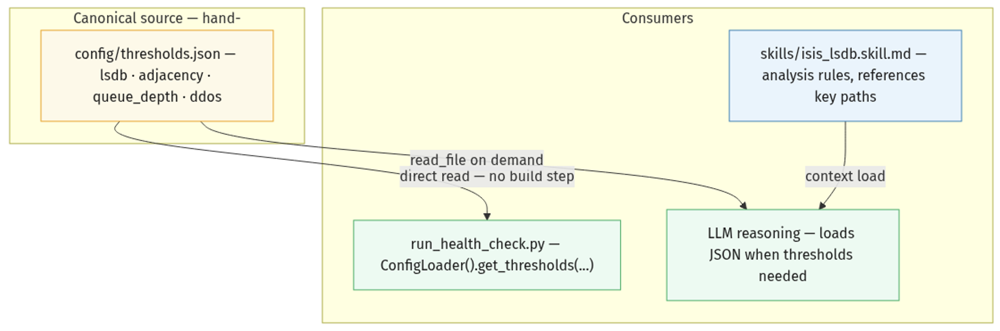
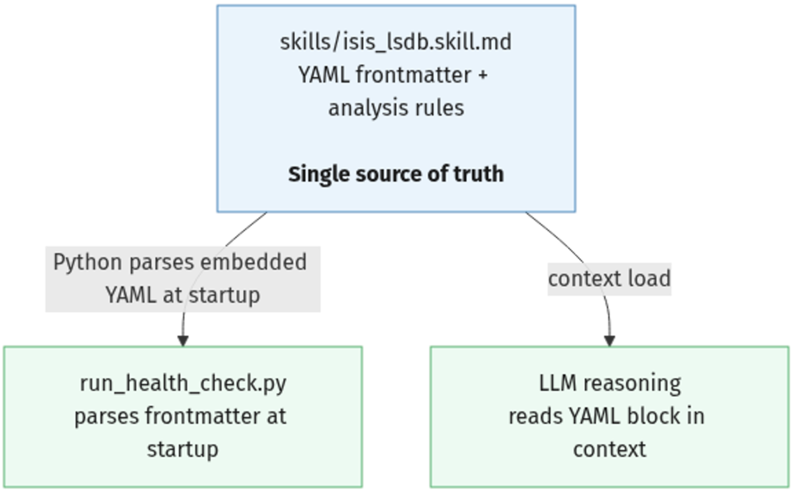
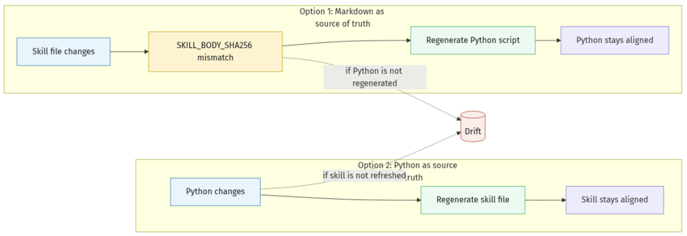
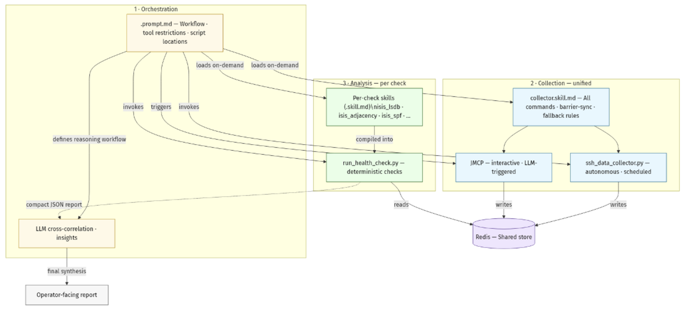
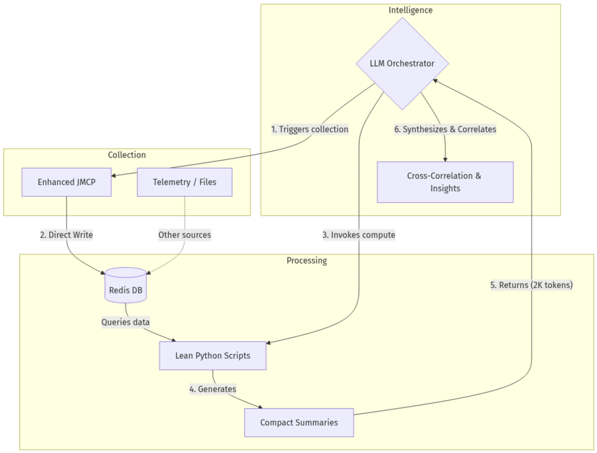

# Hybrid LLM+Python Architecture

**Christian Graf - 05/27/2026**

Sixth and last part of the Series on the Context-Files and JMCP, covering hybrid LLM and Python Architecture.

Series Navigation:

- [Part 1: Introduction & Basics](https://juniper.github.io/techposts/managing-junos-devices-with-context-file/article)
- [Part 2: Tokens & Memory](https://juniper.github.io/techposts/context-file-basics-tokens-and-memory-management/article)
- [Part 3: Optimization & Alerting](https://juniper.github.io/techposts/context-file-optimization-and-alerting-strategies/article)
- [Part 4: File Management](https://juniper.github.io/techposts/file-management-and-data-collection-strategies/article)
- [Part 5: Redis & Performance](https://juniper.github.io/techposts/context-file-redis-and-high-performance-storage/article)
- [Part 6: Hybrid Architecture](https://juniper.github.io/techposts/hybrid-llm-python-architecture/article) <- You are here

## Introduction

In Parts 1-5, we built up context file techniques for managing LLM sessions, optimizing token usage, and storing data in Redis. In this final part, we bring it all together: a hybrid architecture where the LLM orchestrates purpose-built Python scripts to achieve performance and scale that neither can deliver alone.

**Updated April 2026:** Since this post was originally written, VS Code agent mode introduced two important new primitives: **Skills & Prompt files** (.prompt.md, .skill.md) and **sub-agents** (runSubagent). Both directly affect hybrid architecture design. In practice, Skills and Prompt files significantly reshape the earlier monolithic context-file approach: orchestration becomes route-driven, and domain logic moves to on-demand skill loading. New sections cover both topics, and include empirical benchmark guidance for large-fleet operation.

What This Blog Covers (TOC)

- The LLM as Orchestrator: Why judgment stays with the LLM and deterministic work moves to Python.
- From Ad-hoc to Pre-built: When generated one-off scripts stop scaling and why pre-built scripts win in production.
- Hybrid Solution Architecture: The high-level model and the four decisions that make the design reliable.
- Decision 1: Thresholds and Defaults: External thresholds JSON versus skill-embedded thresholds and why the skill-embedded path is usually the better authoring choice.
- Decision 2: Data Collection: JMCP vs autonomous SSH collection and the shared Redis key contract.
- Decision 3: Keeping Skill and Python in Sync: Preventing drift with a single source of truth and Rule 4 hash gating.
- Decision 4: Invoking the Architecture: How .prompt.md and .skill.md work together with on-demand loading.
- Putting It All Together: The minimal four-file architecture with zero duplicated logic.
- When Parallel Collection Misbehaves: Quick host-level checks when large fan-out runs become unstable.
- Summary: Practical takeaways and recommended implementation direction.

## The LLM as Orchestrator

It might seem the LLM can do it all - collect data, run analysis, cross-correlate, and generate reports. And within limits, it can. Modern LLMs handle JSON/XML parsing natively, reason over structured data without external tools, and can generate and execute Python on the fly when a computation exceeds their native ability. For small datasets and ad-hoc investigations, that is often enough.

The limits appear at scale. Comparing sequence numbers across 84 routers means touching hundreds of thousands of data points. A Python dict lookup does this in microseconds; the LLM reasoning over the same data in-context is orders of magnitude slower. The bottleneck is not storage or network - it is the nature of transformer inference, and it is not a problem you can engineer away.

The right mental model is therefore a clean division of responsibility. **The LLM orchestrates data collection** - triggering JMCP on demand and deciding when a re-query is needed - and **handles everything that requires judgment**: cross-correlating results across protocols, interpreting anomalies in context, generating operator-readable summaries. **Python handles the deterministic work**: threshold comparisons, statistical aggregation, and autonomous scheduled collection via ssh_data_collector.py when no LLM session is running. Each does what it is best at.

## From Ad-hoc to Pre-built

When the LLM encounters a computation it cannot do natively, it will write and run Python on the spot - no operator intervention needed. GitHub Copilot can do this directly via mcp_pylance_mcp_s_pylanceRunCodeSnippet. For one-off investigations this works well: fast to produce, zero maintenance, no files to manage.

For production workflows that repeat daily - health checks, trending, automated reporting - ad-hoc falls short. Each run regenerates the same logic from scratch, the code is never tested or version-controlled, and the LLM typically generates "good enough" rather than optimized algorithms. Pre-built scripts solve this. They are tuned, tested, and consistent across runs. The LLM's role shifts from code generator to orchestrator: it invokes the scripts, interprets the compact JSON output, and produces insights. The heavy lifting lives permanently outside the context window.

## Hybrid Solution Architecture

Eliminating ad-hoc Python is what makes scale, speed, predictability, and consistent results achievable. The LLM becomes the central orchestrator: it triggers data collection, invokes pre-built Python scripts for analysis, and cross-correlates all incoming results to form the full picture - for example, recognizing that an adjacency loss is caused by DDoS protection triggering and trashing LSPs to protect the control plane. No individual script could make that connection; only the LLM, reasoning across all outputs simultaneously, can.

Four design decisions deserve careful thought before building this architecture, each with its own dedicated section below:

**Thresholds and defaults**. With external Python scripts and skill files both in play, thresholds could live in two places - and divergence produces inconsistent results. The solution is to embed thresholds exclusively in the skill file's YAML frontmatter, making it the single source of truth.

**Data collection**. Should the LLM collect via JMCP, or should an external Python script handle it autonomously? Both paths are valid and serve different operational modes.

**Keeping skill and Python in sync**. When an operator updates a skill file - for example, adding a new field to a check - how does the corresponding Python script stay current? The risk of silent divergence between the skill's markdown logic and the Python implementation is real and requires an explicit strategy.

**Invoking the architecture**. The LLM must know which test cases exist, which scripts to call, and in what order. That entry point is the .prompt.md file - how to structure it is covered in full.

## Decision 1: Thresholds and Defaults

In a hybrid system, thresholds can exist in two natural places: the skill file (where the LLM reads them) and Python code (where the script uses them). The moment these diverge, the system produces contradictory results with no error.

## The Problem (Threshold Drift)

Python has its own variables defined:

```
# In scripts/checks/isis_lsdb.py
LSDB_SEQ_DELTA_CRITICAL = 2     # Python constant - defined here
ADJ_CRITICAL_HOURS = 24
```

The same is true for the skill, which has either hardcoded values, or makes use of variables. But even if a variable, it is not aligned with the external Python values:

```
<!-- In skills/isis_lsdb.skill.md - analysis rules (old pattern: value hardcoded in prose) -->
## LSDB Sync Check
Flag CRITICAL if sequence number delta > **2** across any router pair.   <- seq_delta.critical
Flag adjacency CRITICAL if not seen in > **24** hours.                   <- adjacency.critical_hours
```

The risk is that the operator updates the markdown rule to > **1**, while the Python constant stays at 2. Both will run, but provide different results and alarms.

## Two Threshold Approaches

The two approaches below solve the original problem - divergent threshold constants - but they place the canonical source in different locations: one uses external thresholds inconfig/thresholds.json, and the other embeds thresholds directly in each skill file's YAML frontmatter. The right choice depends on your team and workflow.External thresholds JSON as canonical source

All thresholds live in a single, hand-edited JSON file. Python reads it directly. The skill file never hardcodes threshold values in its analysis prose - it references the JSON by key path.



**How it works**: the skill's analysis prose says "flag CRITICAL if lsdb.seq_delta.critical is exceeded" - not the actual value. The LLM loads thresholds.json when it needs the numbers. Python always reads from the same file. No generated artifact, no build step. A single git diff config/thresholds.json shows every threshold change across every check.

**Source of truth (external thresholds JSON)**: config/thresholds.json is the canonical source for threshold values. The skill references key paths, and Python reads the same JSON directly.

**Functional example**:

config/thresholds.json - the hand-edited canonical file:

```
{
  "lsdb": {
    "seq_delta":  { "critical": 1 },
    "lifetime":   { "min_expected": 317, "warning_percent": 0.8 },
    "propagation_wait_s": 30
  },
  "adjacency": {
    "critical_hours": 24
  },
  "queue_depth": {
    "rexmit":        { "critical": 5 },
    "high_priority": { "critical": 0 },
    "low_priority":  { "warning": 20 }
  },
  "ddos": {
    "arrival_rate": { "critical": 5000, "warning": 200 }
  }
}
```

skills/isis_lsdb.skill.md - analysis rules referencing the JSON by key path, with no hardcoded values. In the skill file, the thresholds source is referenced explicitly: Threshold source (external file): config/thresholds.json -> lsdb

**Important - External reference**: values such as lsdb.seq_delta.critical are key paths into config/thresholds.json, not inline constants in the skill text.

```
## LSDB Sync Check (external thresholds JSON example)

**Data source:** Redis key `isis:isis_database:<router>:<run_id>` - one concrete instance of the canonical schema
`<protocol>:<command_key>:<router>:<run_id>`
**Threshold source (external file):** `config/thresholds.json` -> `lsdb`

Flag `CRITICAL` if any sequence number delta exceeds `lsdb.seq_delta.critical`.
Flag `WARNING` if LSP lifetime drops below `lsdb.lifetime.min_expected` seconds.
Wait `lsdb.propagation_wait_s` seconds before confirming a CRITICAL - transient
propagation bursts are normal and should not trigger an alert.
```

Finally, any external Python needs a config-loader routine to read directly from the thresholds. scripts/checks/isis_lsdb.py - Python reading directly from the JSON:

```
from config_loader import ConfigLoader

config    = ConfigLoader()           # reads config/thresholds.json
th        = config.get_thresholds('lsdb')

SEQ_DELTA = th['seq_delta']['critical']        # 1
MIN_LIFE  = th['lifetime']['min_expected']     # 317
WARN_PCT  = th['lifetime']['warning_percent']  # 0.8
PROP_WAIT = th['propagation_wait_s']           # 30
ADJ_HOURS = config.get_thresholds('adjacency')['critical_hours']  # 24
```

Change seq_delta.critical from 1 to 2 in thresholds.json, save, and both the LLM and Python immediately use the new value - no regeneration, no extra step.

**Want to set up the external thresholds JSON approach for a new check?** Use this prompt to generate the complete scaffold - JSON entry, skill file with key-path references, and Python ConfigLoader reader:

```
Add a new `<check_name>` health check using the external thresholds JSON approach (config/thresholds.json as canonical source):
1. Add a `<check_name>` block to config/thresholds.json with thresholds: <list your thresholds>
2. Create skills/<check_name>.skill.md - analysis prose references key paths (e.g. `<check_name>.threshold_key`), no hardcoded values
3. Create scripts/checks/<check_name>.py reading all thresholds via ConfigLoader().get_thresholds('<check_name>')
Match the structure of config/thresholds.json -> lsdb and the existing isis_lsdb.skill.md / isis_lsdb.py pattern exactly.
```

### Thresholds embedded in skill frontmatter as canonical source

This approach keeps thresholds aligned under a single source of truth inside each skill file. Instead of maintaining one central thresholds file that both the skill and Python read, the skill stores the threshold variables directly in its YAML frontmatter. Python then derives those values at runtime by reading that same skill file.

Each skill file embeds its own thresholds in YAML frontmatter. Python parses the frontmatter directly at startup - no intermediate file, no manual step. Edit the skill's YAML and the next Python run picks up the new values automatically.



**How Python reads frontmatter**: YAML frontmatter is a well-defined format - the content between the opening and closing - markers is valid YAML. Python's python-frontmatter library (or a simple manual split + yaml.safe_load) extracts it in a single call. ConfigLoader does this once at startup for each skill file it needs, caching the result for the run. No separate file, no manual extraction step - the skill file is both the human-readable document and the machine-readable threshold source.

**The invariant**: the skill file is the single source of truth. Python and the LLM both read from it directly - there is nothing to keep in sync.

**Source of truth (embedded skill frontmatter)**: the .skill.md file is canonical: YAML frontmatter is the source of threshold values, and the markdown body is the source of check logic and alerting behavior.

## Functional Example

skills/isis_lsdb.skill.md - frontmatter and body are in the same file:

```
---
name: "ISIS LSDB Sync Check"

phases:
  barrier_sync:
    commands:
      - key: "isis_database"
        command: "show isis database | display json | no-more"
        reason: "LSDB snapshot - barrier-synced across all routers"

thresholds:
  lsdb:
    lifetime:
      min_expected: 317         # absolute: lifetime - 30 s
      warning_percent: 0.8      # warn if < 80% of max lifetime
    seq_delta:
      critical: 1               # flag if any sequence number differs
    propagation_wait_s: 30      # recheck interval before declaring CRITICAL
  adjacency:
    critical_hours: 24          # flag if not seen within this window
---
## LSDB Sync Check (markdown body)

Flag CRITICAL if sequence number delta > `lsdb.seq_delta.critical`.
...
```

**Python reading the skill frontmatter directly:**

```
from config_loader import ConfigLoader
config = ConfigLoader()              # parses YAML frontmatter from skills/ at startup
SEQ_DELTA  = config.get_thresholds('lsdb')['seq_delta']['critical']
PROP_WAIT  = config.get_thresholds('lsdb')['propagation_wait_s']
WARN_PCT   = config.get_thresholds('lsdb')['lifetime']['warning_percent']
ADJ_HOURS  = config.get_thresholds('adjacency')['critical_hours']
```

Changing propagation_wait_s in the YAML is the only operation needed. Python parses the frontmatter fresh on the next run; the LLM reads it in-context. Both stay aligned automatically. A git diff skills/isis_lsdb.skill.md shows all threshold and logic changes in one place.

**Want to set up the skill-embedded threshold approach for a new check? **Use this prompt to generate the skill file with embedded YAML frontmatter thresholds and the matching Python frontmatter reader:

```
Add a new `<check_name>` health check using the skill-embedded threshold approach (YAML frontmatter as canonical source):
1. Create skills/<check_name>.skill.md with a `thresholds:` block in YAML frontmatter and analysis rules in the markdown body
2. Create scripts/checks/<check_name>.py using ConfigLoader() to parse the skill file frontmatter at startup - no
hardcoded threshold values
Match the structure of skills/isis_lsdb.skill.md and its Python reader exactly.
```

### Comparison

The external thresholds JSON approach keeps thresholds in one central file, config/thresholds.json. You edit that JSON directly, Python reads it directly, and there is no build step. Its biggest advantage is centralised visibility: when you want to audit or compare threshold values across many checks, everything is in one place. The trade-off is locality inside each check: the threshold values live in JSON, while the analysis rules live in the skill file, so value and rule are split across files.

The skill-embedded threshold approach keeps thresholds inside each check's .skill.md YAML frontmatter. You edit the skill file directly, Python parses it at runtime, and there is also no build step. Its biggest advantage is per-check cohesion: threshold values and analysis rules live together in one file. The trade-off is global visibility: to review thresholds across all checks, you need to open multiple skill files.

For day-to-day skill development, the skill-embedded threshold approach should be the default. It keeps thresholds and analysis logic together in the same skill file, reduces context-loading overhead for the LLM, and avoids the friction of maintaining a second canonical thresholds file while iterating on checks. The external thresholds JSON approach remains valid when you explicitly need a central governance view across many checks, but for most authoring and maintenance workflows, the skill-embedded path is the more practical and less cumbersome choice.

As a practical rule: choose the skill-embedded path when checks are owned per team and iteration speed matters; choose the external thresholds JSON path when a central SRE/governance team must audit and approve threshold changes across many checks from one file.

**In production**: use per-check skill files (isis_lsdb.skill.md, isis_adjacency.skill.md, ,Ä). The .prompt.md loads only the skill needed for the current check, keeping context lean. collector.skill.md stays unified - the full collection profile must be cohesive to drive the autonomous scheduler.

## Decision 2: Data Collection

## The Problem (Collection Path Ambiguity)

The LLM can collect via JMCP; external Python can collect via SSH. Running both without clarity creates confusion: which data is fresh? which run_id is canonical? what happens when a session starts but no collection has yet run?

## Solution: keep both paths and ensure identical Redis keys

The [enhanced JMCP](https://github.com/chrgraf/junos-mcp-server) executes collection over pre-warmed, connection-pooled TCP sessions and, in response_mode: artifact, persists full results to a configurable artifact backend (disk by default, optional redis/dual). In deployments that set artifact_backend=redis, payloads land in Redis and the context window never sees raw multi-megabyte router dumps. Throughput: 840 show commands across 84 routers in under 14 seconds. Scaling is predictable - doubling the fleet roughly doubles collection time; adding more commands to the same fleet adds almost nothing, since they pipeline over established sessions.

**JMCP** serves the interactive case. The LLM triggers collection on demand when an operator says "check ISIS health right now." Data lands in the configured store immediately (Redis in the worked deployment), and analysis follows without pre-warming.

ssh_data_collector.py serves the autonomous case - a barrier-sync SSH collector that runs on a schedule, completely independent of any LLM session. When the agent starts, data is already present. Collection time is zero from the LLM's perspective.

Both paths must preserve the same downstream contract, <protocol>:<command_key>:<router>:<run_id> (for ISIS, that becomes isis:<command_key>:<router>:<run_id>). When JMCP runs with artifact_backend=redis, it stores a Redis artifact blob at jmcp:artifact:blob:<run_id> for direct replay, and the runner prefers that blob first before falling back to the per-command contract. Everything downstream - run_health_check.py, trending, reporting, LLM cross-correlation - is path-agnostic. The choice is purely operational: JMCP for interactive ad-hoc LLM-driven workflows, ssh_data_collector.py for scheduled production. If the LLM detects stale or missing data, it can re-trigger JMCP; if scheduled data is stale, the operator or scheduler should run ssh_data_collector.py before proceeding.

## Two Collection Paths - Same Redis Contract

Conceptual flow:

```
Interactive (operator: "check ISIS health now"):
  LLM triggers JMCP  ->  writes  ->  isis:isis_database:crpd1:20260515T1200Z-abc
                                    isis:isis_adjacency:crpd1:20260515T1200Z-abc
  LLM invokes: run_health_check.py --run-id 20260515T1200Z-abc

Autonomous (scheduled, no LLM session):
  cron: ssh_data_collector.py --profile isis --interval 15m
  Writes  ->  isis:isis_database:crpd1:20260515T1215Z-def
             isis:isis_adjacency:crpd1:20260515T1215Z-def   (same key schema)
  LLM session starts  ->  data present  ->  goes straight to analysis
```

The Redis key schema is the contract. Neither collection path nor any downstream consumer needs to know which path produced the data.

What a Good Data Collector Should Include

If you are writing your own collector, start by requiring bounded concurrency through a worker pool (for example, a configurable max_workers). Then treat TCP session handling as two separate concerns:

1. **Session reuse across commands**. Keep one pre-warmed TCP session open per router and reuse it for multiple commands in the same batch instead of opening a new session for every command. That avoids paying session-setup overhead for each command, which can easily add multiple seconds per command at scale and compound into a large delay across a multi-command batch. Keep the session open after the batch as well, so later commands can reuse it again, and only auto-teardown idle sessions after X minutes of inactivity.

2. **Barrier-sync start-up**. Open all sessions first, wait until every worker reports ready, and only then release the command batch. That guarantees no router is queried before the whole fleet has an established TCP session and gives you perfectly synchronized data collection across the full fleet.

Add a per-node and per-command retry strategy with backoff and jitter, define explicit fallback behavior for non-responsive nodes (continue, retry-later, or fail-fast), and avoid connection leaks by tearing down idle sessions after X minutes. Every run should end with a structured summary (ok, failed, timed_out, retried, and total duration), including the Redis key(s) used, so the LLM can reason over collection quality and traceability. Redis writes should always follow one deterministic contract: <protocol>:<command_key>:<router>:<run_id>.

At fleet scale, continue is usually the safest default so one dead node does not block the entire run. Failed nodes should still be recorded explicitly in both the run summary and output metadata. Reserve fail-fast for true prerequisites, such as Redis being unavailable, missing router inventory, or invalid credentials.

For library choice, PyEZ is a strong default in Junos-only environments because it provides native Junos integration, operational RPC support, and reliable structured parsing. For mixed-vendor SSH CLI collection, a vendor-neutral stack (for example scrapli or netmiko) is typically a better fit, with output normalized before analysis. If enhanced JMCP already covers your collection requirements, prefer using it directly instead of rebuilding similar pooling and retry logic.

**Want the LLM to scaffold a robust collector?** Use this prompt:

```
Generate a production-oriented Python collector for network CLI data collection.

Requirements:
1. Concurrency: configurable worker pool (`max_workers`)
2. Barrier-sync option: establish sessions first, execute only when all ready
3. Session reuse: keep TCP sessions open for multiple commands in a batch
4. Idle teardown: close sessions after configurable idle timeout (minutes)
5. Retries: per-node retry policy with backoff + jitter
6. Node failure policy: configurable `continue` or `fail-fast`
7. Output: structured run summary (ok/failed/timed_out/retried + durations)
8. Redis key contract MUST be `<protocol>:<command_key>:<router>:<run_id>`
9. Command output modes: support plain text, `| display json`, and `| display xml`
10. Include clear logging for limit/bottleneck diagnostics

Implementation target:
- Junos-only: use PyEZ
- Mixed-vendor: use a vendor-neutral SSH library

Deliver:
- collector module
- config schema example
- minimal CLI entrypoint
- example run output JSON
```

F**or detailed Redis key naming patterns and LLM-assisted schema design**, see Part 5: Key naming convention. Part 5 includes ready-to-use prompts for generating context files with Redis storage, complete key naming examples, and guidance on master index patterns. That section covers the mechanics; this section focuses on the architectural constraint: both JMCP (interactive) and ssh_data_collector.py (autonomous) must write identical keys to the same Redis namespace.

**Adding a new collection command or script that writes to Redis?** Include the key schema constraint in your generation prompt - the LLM cannot deviate from the contract if the contract is stated explicitly:

```
Write a Redis writer for the new `isis_spf` command output.
Key schema MUST follow: <protocol>:<command_key>:<router>:<run_id>
For this command: isis:isis_spf:<router>:<run_id>
Match exactly the pattern used by ssh_data_collector.py and JMCP.
Any deviation breaks run_health_check.py and all downstream consumers.
```

## Decision 3: Keeping Skill and Python in Sync

## The Problem

The skill file describes the test to perform, the thresholds, and the alerting format. In practice, operators adjust these frequently - a tighter comparison value, a new detection rule, an additional alarm condition. It is easy to trigger the problem: ask the LLM to "*Update the adjacency check - also flag if transitions > 5 in the last hour.*" The LLM updates skills/isis_adjacency.skill.md. The Python script scripts/checks/isis_adjacency.py is never touched. The LLM's in-context reasoning now says CRITICAL; Python says PASS. The system keeps running, no error is raised, and both results are silently wrong.

Solution: Choose a Source of Truth

The fix is to designate a single source of truth - either the skill file or the Python script. Whenever that source changes, the other side is regenerated from it, not hand-edited independently.

**Option 1 - Markdown as source of truth (recommended for LLM-heavy workflows):**

The skill file is the contract. Python is compiled from it. When the skill changes, the LLM regenerates the Python script. Operator validates by running the script.

```
Edit skill file  ->  LLM regenerates Python  ->  Operator validates  ->  Commit both atomically
```

Best when the operator primarily works in natural language and relies on the LLM for code generation.

**Option 2 - Python as source of truth:**

Python has embedded documentation; the LLM extracts it to refresh the skill file. Best for code-first teams with strong Python discipline who manually write and maintain the scripts. This direction is valid but not the focus of this series.

The invariant is the same either way: **never let one side drift without updating the other**. Whichever you choose as canonical, the other is regenerated - not hand-edited.

The diagram below shows the two canonical directions and the checksum gate that keeps them aligned:



## How Option 1 Looks in Practice

One practical way to prevent drift is to use a SHA-256 checksum of the skill file. When the skill changes, a checksum mismatch signals that the corresponding Python script must be updated. To help the LLM identify exactly which script to regenerate, the skill should explicitly reference its Python target.

Let's look at this approach in detail. The full working implementation is in the Decision 4 Functional Example below - look for these three markers in isis_lsdb_check.py:

isis_lsdb_check.py - generated header excerpt:

```
#!/usr/bin/env python3
# GENERATED FROM: skills/isis_lsdb.skill.md
# SKILL_BODY_SHA256: <hash>
# Do NOT edit thresholds here. Edit the skill file - they are read at startup.

_SKILL_FILE = os.path.join(os.path.dirname(os.path.abspath(__file__)), "isis_lsdb.skill.md")

def _load_thresholds():
  with open(_SKILL_FILE) as fh:
    content = fh.read()
  parts = content.split("---", 2)
  data = yaml.safe_load(parts[1]) or {}
  return data["thresholds"]

TH = _load_thresholds()
SEQ_DELTA_CRITICAL = TH["lsdb"]["seq_delta"]["critical"]
PROP_WAIT_S = TH["lsdb"]["propagation_wait_s"]
ADJ_CRITICAL_HOURS = TH["adjacency"]["critical_hours"]
```

- **GENERATED FROM**: skills/isis_lsdb.skill.md - provenance: the script was compiled from this skill file
- **SKILL_BODY_SHA256**: <hash> - the SHA-256 of the skill's markdown body at generation time
- **Do NOT edit** thresholds here. Edit the skill file - they are read at startup. - the invariant, stamped as a guard

When the skill's markdown body changes (new check, updated alert format, revised detection rule), the agent sees a hash mismatch, regenerates the script, and stamps the new hash. Threshold edits in the YAML frontmatter leave the body - and therefore the hash - untouched.

The prompt below is both corrective and preventive: it first audits whether the Python script has already drifted from the skill and repairs any gaps, then stamps the SHA-256 gate so that all future drift is detected and auto-corrected automatically.

**Not sure whether your skill and Python are already drifted - or setting up Rule 4 for the first time?** Use this prompt to audit current alignment, fix any gaps, and stamp the SHA-256 gate in one pass:

```
Audit alignment between <skill_file>.skill.md and <script>.py, then stamp Rule 4:

1. List every threshold in the skill's YAML frontmatter.
   Confirm each one is read from the frontmatter in the Python script - not hardcoded.
   Report any hardcoded value as DRIFT.

2. List every check described in the skill's markdown body.
   Confirm each check is implemented in the Python script.
   Report any missing check as DRIFT.

3. If any DRIFT items were found:
   - Regenerate the Python script from the skill file.
   - Preserve all existing error handling, logging style, and JSON output structure.
   - Do not hardcode any threshold value.

4. Stamp Rule 4 in the script header:
   - Compute SHA-256 of the skill's markdown body (everything after the second ---).
   - Write it as: # SKILL_BODY_SHA256: <hash>
   - Add the recompute one-liner as a comment directly below it.

Report: how many DRIFT items were found, what was regenerated, and the new hash.
```

Run this whenever you are unsure of the state. The gate it stamps will catch all future drift automatically: frontmatter-only edits (threshold tuning) never change the body hash, so they do not trigger unnecessary regeneration; any markdown-body change (including adding a new test case) changes the hash and does trigger regeneration.

## Decision 4: Invoking the Architecture

The .prompt.md is the entry point that ties the three components together. Before examining its structure in detail, here is how those components relate in a reference project:

## The Modern Primitives: .prompt.md and .skill.md

GitHub Copilot's VS Code agent mode introduced two first-class file types that replace manual context loading:

A **prompt file** (.prompt.md) carries YAML frontmatter and a markdown body. In GitHub Copilot's VS Code agent runtime, the runtime reads its description field and auto-routes matching requests - no /load command, no manual paste. The YAML tools: list enforces exactly what tools the agent may call. Other runtimes may use a different loading mechanism.

A **skill file** (.skill.md) is domain knowledge loaded on-demand. The prompt file loads it when a specific check or topic is needed, keeping the base context lean. The .skill.md naming convention (vs. plain SKILL.md) makes skills discoverable as a cohesive group alongside each other.

This is not a cosmetic refactor of the old runbook model; it materially changes authoring and runtime behavior by splitting always-on orchestration from selectively loaded domain logic.

In practical terms, the old workflow of pasting master_runbook.md into chat is replaced by an isis_health_check.prompt.md file that is auto-routed through description matching. The always-loaded baseline runbook context is now handled by the runtime loading the prompt file automatically, while topic-specific add-on context is implemented through .skill.md files loaded on demand via read_file. Tool constraints are no longer just documented as prose; they are enforced explicitly in the YAML tools: list. Likewise, values that used to sit as ad-hoc variables at the top of a markdown file now live in structured .skill.md YAML frontmatter thresholds.

This "master runbook" concept was introduced in Part 1 (Introduction & Basics) and expanded in Part 4 (File Management), where a single always-loaded context file acted as the operator entry point.

## What Belongs Where

In .prompt.md: workflow sequence, which scripts to invoke and with what flags, output paths, which skills to load when, YAML tool restrictions. Keep it compact - depth belongs in skill files, not here.

In .skill.md: thresholds (YAML frontmatter), collection profile (YAML frontmatter), analysis rules, detection algorithms, alert formats. Nothing in the skill file should duplicate the prompt's workflow sequencing.

LLMs suffer from attention degradation in the middle of long files. A compact prompt that pushes depth into on-demand skills keeps the model focused on the current request.

**Quick mapping example (single request)**: user asks, "Check ISIS health now." The .prompt.md routes and enforces tool boundaries, collector.skill.md provides collection instructions, isis_lsdb.skill.md provides thresholds and check logic, and run_health_check.py executes deterministic checks before the LLM produces the final operator summary.

## The Three Components

With the concept of a skill in place, let's look at how to structure a hybrid system. Building a hybrid system requires more than scripts and a Redis database. The LLM needs structured knowledge to operate effectively: it has to know *what* can be automated, *how* to collect the data, and *what criteria* to apply when analyzing it. Conceptually, this breaks down into three concerns. At minimum they always span two files - a .prompt.md and at least one .skill.md - because the whole point of a skill is selective loading. Splitting further into a dedicated collector skill and per-check analysis skills is the recommended practice for larger systems.

**1. Orchestration - the entry point and rules engine**. A .prompt.md file tells the LLM which scripts are available, which tools it is permitted to use, and the overall workflow sequence. It is the single file the agent runtime loads automatically when a user makes a relevant request. Think of it as standing orders: invoke this script for collection, call that one for analysis, load the skill file when you need deeper domain knowledge.

**2. Collection - how data arrives, and what to do when it doesn't**. The collection strategy covers which commands to run, how barrier synchronization ensures simultaneous snapshots across the fleet, and - critically - the fallback logic when data is stale or missing. In a single-file setup this lives inline in the .prompt.md; in a larger system it moves to a dedicated collector.skill.md so that both the LLM and ssh_data_collector.py can read from the same source. If the standalone collector fails, the LLM already has everything it needs to re-run collection via JMCP.

**3. Analysis - the thresholds and test logic**. The check logic and thresholds can sit inline in the .prompt.md for a single check, or in a dedicated skill file (isis_lsdb.skill.md, isis_adjacency.skill.md, ,Ä) when multiple checks need to be loaded selectively. Separating them per check lets the .prompt.md load only what is relevant to the current request - no wasted context window - and lets Python parse each file's YAML frontmatter independently. collector.skill.md, by contrast, stays unified when it exists: the collection profile must be cohesive to drive ssh_data_collector.py as a whole.

**Minimum viable split - always two files**: the whole point of a skill file is that it is *not* always loaded. Embedding everything in .prompt.md defeats that - the LLM carries the full collection profile and all check logic in context on every request, whether it needs them or not. Even the simplest setup therefore needs at least a .prompt.md (always loaded: workflow, tool restrictions, which skills exist) plus one .skill.md (loaded on demand: the knowledge the LLM pulls in only when relevant). A single-file layout is only valid for throwaway prototyping where selective loading does not matter.

**When to split further**: add a dedicated collector.skill.md once multiple checks share the same collection profile, or once ssh_data_collector.py needs to parse it directly. Add per-check skill files once you have more than one check and want the .prompt.md to load only what is needed for the current request.

The diagram below shows how these three components connect to each other and to the execution layer in the full split:



Threshold changes propagate automatically: edit a value in isis_lsdb.skill.md's YAML frontmatter and both the LLM (reads it in context) and run_health_check.py (parses frontmatter at startup) pick it up on the next run - no regeneration, no other file to touch. Logic changes to the skill's markdown body are different: those require Python regeneration per Rule 4 (Decision 3), including cases where you add a new test case or alert rule.

## Data Flow

This second diagram is intentionally generic: it shows runtime information flow independent of file layout.



## VS Code Auto-Discovery: The .github/ Layout

**Note**: This section is an example implementation for VS Code + GitHub Copilot using Skills. It is not a strict requirement to use GitHub Copilot. Other platforms and agent runtimes can implement the same architecture with different file conventions, discovery mechanisms, and invocation patterns.

In GitHub Copilot's VS Code agent runtime, prompt files are auto-discovered from <project-root>/.github/prompts/. The Copilot runtime scans for .prompt.md files, reads each description field, and routes matching requests automatically. A prompt in the project root works for personal use but does not trigger auto-routing.

Skill files follow <project-root>/.github/skills/<name>/SKILL.md. The three widely recognised conventions:

| Convention | Used by |
|:--|:--|
| <project-root>/.github/skills/<name>/SKILL.md | GitHub Copilot / VS Code |
| <project-root>/.agents/skills/<name>/SKILL.md | Multi-agent frameworks (OpenAI Agents SDK) |
| <project-root>/.claude/skills/<name>/SKILL.md | Anthropic Claude tooling |

**Avoiding duplication with symlinks**: skill files serve a dual purpose - loaded by the LLM and parsed by Python (ssh_data_collector.py reads YAML frontmatter for collection profiles). Duplication happens when you copy the same skill content into both skills/ and .github/skills/, because that creates two editable files. A symlink avoids that duplication: .github/skills/<name>/SKILL.md only points to the single canonical file under skills/.

Authoring rule: edit the canonical file under skills/; treat .github/skills/<name>/SKILL.md as a discovery path only (symlink target), not as a separate editable copy.

```
cd .github/skills/isis-health-check
ln -s ../../skills/isis_lsdb.skill.md SKILL.md
# Repeat for each skill
```

VS Code discovers SKILL.md at the expected path, while Python reads the canonical file in skills/ directly. One edit propagates everywhere because both paths resolve to the same file.

Before the full file listings below, here is the same workflow as an end-to-end request trace:

1. Operator asks: "*Check ISIS health now.*"

2. Prompt routing resolves to isis_health_check.prompt.md via description matching.

3. isis_health_check.prompt.md loads collection/analysis skill content on demand.

4. JMCP collection writes snapshot data to the configured artifact/data store (run_id becomes the correlation key). In the worked deployment shown here, that store is Redis.

5. isis_health_check.prompt.md then triggers an external Python analysis runner (shown below) to execute deterministic, large-scale checks against that run_id.

6. LLM cross-correlates check outputs and returns one operator-facing incident summary.

## Functional Example (Prompt + Skills Workflow)

**Note**: This functional example uses a VS Code + GitHub Copilot + Skills workflow to make the concepts concrete. It is one implementation pattern, not a hard requirement. Equivalent architectures can be implemented on other platforms using their own discovery, prompting, and tool-invocation models.

The files below are the real, working examples used against a live 84-router cRPD fleet. All four were validated against run 20260515T221129Z-06021c19 - 336 commands, 84 routers, single execute_junos_commands_batch call.

To read this example as proof (not just as a file dump), focus on two questions:

- 1. Where is orchestration and tool control defined?
- 2. Where are thresholds and check semantics defined?

isis_health_check.prompt.md - thin orchestrator with key non-negotiable rules:

````markdown
---
name: isis-health-check
mode: agent
description: >
  Use for ISIS health checks on Junos/cRPD (LSDB, adjacency, LSP state).
tools:
  - mcp_jmcp_stdio_en_get_router_list
  - mcp_jmcp_stdio_en_execute_junos_commands_batch
  - mcp_jmcp_stdio_en_list_artifacts
  - mcp_jmcp_stdio_en_read_artifact
  - terminal
---

## Rules (non-negotiable)

1. Fleet > 10 routers: **always** collect with `response_mode: artifact` - never load raw
   CLI text into context.
2. Use only `mcp_jmcp_stdio_en_*` tools and run multi-router collection with
  `mcp_jmcp_stdio_en_execute_junos_commands_batch`.
3. All thresholds/check logic come from `isis_lsdb.skill.md`; never hardcode thresholds.
  If the skill file is unavailable, stop.
4. Regenerate `isis_lsdb_check.py` only when skill markdown body hash changes
  (`SKILL_BODY_SHA256` mismatch). YAML-frontmatter-only edits do not require regeneration.
5. Do not create throwaway ad-hoc analysis Python; use prebuilt scripts or add a new
  version-controlled script first.

## Workflow

**Step 1 - Collect** (skip if the user says to re-use existing data):

Load `isis_collector.skill.md` and follow its frontmatter (commands, barrier-sync,
freshness/fallback rules).

- Reuse the latest artifact if still fresh (`mcp_jmcp_stdio_en_list_artifacts`).
- Otherwise collect fresh via `mcp_jmcp_stdio_en_execute_junos_commands_batch`
  with `response_mode: artifact`.

Collect all routers in one batch call:

```
barrier_sync: true
response_mode: artifact
commands:
  - "show isis database | no-more"
  - "show isis adjacency detail | no-more"
  - "show isis spf log | no-more"
  - "show system storage | no-more"
```

Record `artifact.run_id`.

**Step 2 - Run analysis:**

Run the prebuilt runner by `run_id`:

```
python3 isis_lsdb_check_runner.py --run-id <artifact.run_id>
```

`isis_lsdb_check_runner.py` fetches data from Redis, prefers the JMCP blob artifact when present, and falls back to the
per-command Redis contract before invoking `isis_lsdb_check.py`.
Thresholds are read from `isis_lsdb.skill.md` at startup.

**Step 3 - Correlate and report:**

Correlate across checks (for example, adjacency flap + LSDB churn as one incident) and
summarise in operator language using the skill alert format.
````

The prompt example above proves that orchestration stays thin and procedural: routing, tool boundaries, workflow sequence, and script invocation are centralized there, while check semantics are delegated elsewhere.

isis_lsdb.skill.md - YAML thresholds as canonical source, markdown body as check logic:

````markdown
---
name: "ISIS LSDB + Adjacency Check"

thresholds:
  lsdb:
    seq_delta:
      critical: 1               # flag if any sequence number differs across routers
    lifetime:
      min_expected_s: 317       # flag WARNING if remaining lifetime < this value
      warning_percent: 0.8      # flag WARNING if remaining lifetime < 80% of max
      over_refresh_s: 1150      # flag WARNING if min lifetime across all routers exceeds this (single snapshot)
    propagation_wait_s: 30      # wait this long before confirming a CRITICAL seq-delta
  adjacency:
    critical_hours: 24          # flag CRITICAL if no adjacency seen within this window
    transition_warning: 1       # flag WARNING if transition count exceeds this value
---

## LSDB Sync Check (Canonical Skill Body)

**Data source:** `show isis database | no-more` -> artifact key `isis_database`

**What to check:**

Compare each LSP ID across routers. Missing LSPs or sequence mismatches indicate sync issues.

- Flag **CRITICAL** if any sequence number delta across any router pair exceeds
  `lsdb.seq_delta.critical`.
- Flag **WARNING** if remaining LSP lifetime drops below `lsdb.lifetime.min_expected_s`
  seconds.
- Flag **WARNING** if the **minimum** remaining LSP lifetime across **all** routers that
  carry the LSP exceeds `lsdb.lifetime.over_refresh_s` (over-refresh signal).
- Do not raise CRITICAL immediately on a seq-delta: wait `lsdb.propagation_wait_s`
  seconds and recheck.

**How to alert:**

```
[CRITICAL] LSDB sync failure - R3.00-00 seq delta: crpd01=0x0042, crpd07=0x0041
           Affected routers: crpd01, crpd07
           Wait 30 s and recheck before escalating.

[WARNING]  LSP over-refresh - 8700k_crpd31.00-00 lifetime never drops below 1150 s
           across all 84 routers (min: 1170 s, max: 1191 s, threshold: 1150 s).
           LSP is likely being regenerated too frequently.
```

---

## LSP Fragment Count

**Data source:** `show isis database | no-more` -> same artifact as LSDB Sync Check

**What to check:**

An LSP ID has the form `<hostname>.<pseudonode>-<fragment>`, e.g. `8700k_crpd31.00-00`.
Fragment `00` is the base LSP; fragments `01`, `02`, ,Ä are overflow fragments created when
the base LSP is too large. For each originator, count distinct fragment numbers.

- **Report** the fragment count for every router that has more than one fragment - no
  threshold, no alert level. This is informational only.
- Note that high fragment count (,â- 3) may indicate an oversized LSP.

**How to report:**

```
[INFO] LSP fragments - 8700k_crpd31: 3 fragments (00, 01, 02)
[INFO] LSP fragments - 8700k_crpd8:  2 fragments (00, 01)
```

---

## Adjacency Check

**Data source:** `show isis adjacency detail | no-more` -> artifact key `isis_adjacency`

**What to check:**

For each router, extract the list of ISIS neighbours and their last-seen timestamp.

- Flag **CRITICAL** if any neighbour has not been seen within `adjacency.critical_hours`
  hours.
- Flag **WARNING** if neighbour transition count exceeds `adjacency.transition_warning`.

**How to alert:**

```
[CRITICAL] Adjacency down - crpd03 has not seen crpd12 for 26 h (threshold: 24 h)

[WARNING]  Adjacency flapping - crpd05 -> crpd09: 4 transitions (threshold: 1)
```

---

## Cross-Correlation Rule

If LSDB CRITICAL and adjacency WARNING/CRITICAL fire on the same router pair at the same
time, treat them as a single incident - the adjacency loss is the likely cause of the LSDB
divergence. Report once with combined context, not as two separate alerts.
````

## Putting It All Together

The four decisions above each produced a minimal file. Combined, they form the complete hybrid architecture - four canonical files, zero logic duplication:

```
isis_health_check.prompt.md   <- entry point: auto-routing, tool restrictions, rebuild gate (Rule 4)
isis_collector.skill.md       <- collection strategy: commands, barrier-sync, stale threshold, fallback
isis_lsdb.skill.md            <- thresholds (YAML frontmatter) + analysis rules (markdown body)
isis_lsdb_check.py            <- compiled engine: reads thresholds from skill frontmatter at startup
```

The prompt is the always-loaded anchor - thin on both sides: Step 1 defers to the collector skill, Step 2 defers to the analysis skill. Skill files load on demand. Python handles all deterministic work. The LLM receives the structured check output and contributes what Python cannot: cross-correlating results across all checks to find patterns invisible to any individual script. An adjacency flap coinciding with LSDB churn is a single incident; Python sees two separate verdicts; the LLM sees the relationship.

All four files shown in the Functional Example above are the exact files validated against run 20260515T221129Z-06021c19 - no hypothetical examples.

## How Fast is it in Practice?

By following this guide, the LLM can generate ready-to-use Python scripts that stay aligned with the skill files. Those scripts treat Redis as the primary data store, so they can read directly from Redis and run deterministic analysis quickly. In practice, operators can also execute the same scripts manually when needed.

When the LLM is in the driver seat, additional reasoning time is added on top of raw script execution. The agent still needs to discover scope (which routers to include), verify data freshness, and trigger JMCP re-collection if required. Those orchestration steps add visible latency compared with running a standalone script directly.

That overhead comes with a meaningful trade-off: operators do not need to remember tool names or execution order. They can describe the intent in plain language, and the LLM selects tools, runs the workflow, and cross-correlates findings across checks.

In most cases, enhanced JMCP collection remains fast even at large fleet size. Deterministic Python processing over the collected store (Redis in the worked deployment) is typically very fast as well. The largest added delay usually comes from LLM reasoning and workflow orchestration, not from backend read speed or deterministic Python analysis.

**LLM development prompts:**

**Starting from a monolithic context file and want to migrate to this hybrid architecture?** Use this prompt to generate the complete scaffold in one pass:

```
Convert my existing isis_health.md into the hybrid architecture:
1. Create isis_health_check.prompt.md (YAML frontmatter + compact workflow body with explicit non-negotiable rules)
2. Create isis_lsdb.skill.md - YAML thresholds in frontmatter + analysis rules in markdown body
3. Create isis_lsdb_check.py reading all thresholds from isis_lsdb.skill.md frontmatter at startup
   - no hardcoded threshold values, SKILL_BODY_SHA256 stamped in header
Preserve all existing thresholds and analysis algorithms exactly.
```

**Skill file's markdown body changed? Regenerate the Python script** (Decision 3 - Rule 4):

```
isis_lsdb.skill.md markdown body was updated - [describe what changed].
Regenerate isis_lsdb_check.py from the updated skill file.
Stamp the new SKILL_BODY_SHA256 in the script header.
Do not hardcode any threshold value - all thresholds are read from the skill frontmatter at startup.
```

## What's Next?

Coming in Part 7: One possible next step is to evolve this hybrid architecture into a more autonomous agent loop - for example, scheduled collection, recurring checks, and alert-driven drill-down workflows. Think of this as an implementation idea rather than a strict blueprint; the next post explores that direction and possible variants.

## Some Troubleshooting When Parallel Collection Misbehaves

This is a quick, informal checklist for cases where high fan-out collection starts failing in unpredictable ways.

**Typical symptoms**:

- More random timeouts as fleet size increases
- Intermittent connection failures even though devices are reachable
- Errors like "too many open files" in server logs
- Good performance at small scale, then a sharp drop beyond a specific router count

**Quick checks on the collection host**:

- Process file descriptor limit (ulimit -n)
- Open-file pressure (watch open FDs during a run)
- Kernel/global file-handle limits (sysctl values)
- TCP socket churn (many sockets in TIME_WAIT/CLOSE_WAIT)

**Rule of thumb**: Do not tune kernel settings preemptively. First confirm a bottleneck with measurements (limits hit, socket pressure, explicit errors), then tune the specific limit that is actually failing.

**If you want LLM help to diagnose quickly, use this prompt:**

```
I am running high-parallel network collection and seeing instability at scale.
Help me diagnose host-level limits before changing anything.

Check and interpret:
1) file descriptor limits (process + system)
2) current open file/socket usage during a run
3) TCP socket state pressure (TIME_WAIT/CLOSE_WAIT)
4) any log errors indicating limit exhaustion

Then tell me:
- which limit is most likely bottlenecking
- what minimal change to test first
- how to verify the change actually fixed the bottleneck
```

## Summary

To close this blog, the core objective is clear: combine LLM judgment with deterministic Python execution so the system scales without losing analytical quality. Prompt and skill files define workflow, tool boundaries, and on-demand domain logic, while Redis keeps raw collection data out of the context window. The resulting production pattern is stable and fast: LLM orchestration, Redis-centered data flow, deterministic analysis, and compact outputs returned to the LLM for final cross-correlation.

In this final part of the series, we covered:

- **Hybrid architecture**: LLM orchestrates Python for performance and scale - neither can deliver the full result alone
- **Model shift from older context files**: Skills + Prompt files substantially change the previous monolithic runbook pattern by separating routing/orchestration from on-demand domain logic
- **Four design decisions** each deserving deliberate choices
- **Decision 1** - Thresholds: embed in .skill.md YAML frontmatter (skill-embedded threshold approach - single source of truth); Python parses frontmatter directly at startup; one edit, zero divergence
- **Decision 2** - Data collection: JMCP for interactive ad-hoc; ssh_data_collector.py for scheduled autonomous; JMCP also persists a blob artifact for replay, while the downstream per-command Redis contract stays identical
- **Decision 3** - Sync: skill file is canonical; use the Rule 4 hash gate from Decision 3 so frontmatter edits do not trigger rebuilds, but logic changes do
- **Decision 4** - Invocation: .prompt.md as auto-routed entry point with YAML tool restrictions; .skill.md files loaded on-demand per check
- **Putting it all together**: four canonical files (isis_health_check.prompt.md, isis_collector.skill.md, per-check .skill.md, isis_lsdb_check.py), zero logic duplication
- **Development stages**: start with pure LLM to get the logic right, then progressively add Python, Redis, and automation as scale demands

## Series Complete

You've completed the Context-File Basics series!

- **Part 1**: Introduction & Basics - JMCP, guardrails, prompting, variables
- **Part 2**: Tokens & Memory - Data formats, retention policies, token optimization
- **Part 3**: Optimization & Alerting - HOW/WHAT removal, 3-prompt strategy, lists vs tables
- **Part 4**: File Management - Phase 0, Master Index, Extract/Store/Reuse
- **Part 5**: Redis & Performance - TTL, storage patterns, performance comparisons
- **Part 6**: Hybrid Architecture - LLM+Python, .prompt.md runbook, sync strategies

## Final Thoughts

Context files / Skills are a powerful tool for codifying operational knowledge and automating network analysis. The techniques in this series enable you to:

- Build maintainable, scalable analysis workflows
- Optimize token usage for large fleets
- Leverage both LLM intelligence and Python performance
- Create reusable, version-controlled operational runbooks

**The LLM is your partner in this journey. Ask it for help, iterate, and keep improving!**

Happy automating! 

## Glossary

- Ad-hoc Python: LLM-generated Python code created on-the-fly to solve a specific computation. Useful for one-off investigations; replaced by pre-built scripts in production workflows where consistency and speed matter.
- Artifact mode (response_mode: artifact): JMCP collection mode that persists full output to the configured artifact backend (disk by default; redis/dual when configured) and returns only a pointer containing run_id and backend-specific location Metadata. Required for fleets > 10 routers - prevents megabytes of CLI text from entering the LLM context window.
- Attention degradation: Phenomenon where LLMs reason most reliably over content at the beginning or end of the context window. Long files with critical detail buried in the middle are vulnerable. Keeping .prompt.md compact and pushing depth into on-demand .skill.md files mitigates this.
- Hybrid architecture: System design where the LLM orchestrates purpose-built Python scripts. The LLM handles judgment, cross-correlation, and natural-language output; Python handles deterministic threshold comparisons and data parsing. Neither can deliver the full result alone.
- .skill.md: Domain knowledge file loaded on demand by the prompt. YAML frontmatter holds thresholds (the canonical source in the skill-embedded threshold approach); the markdown body describes check logic, alert formats, and cross-correlation rules. Both the LLM and the Python script read from it directly.
- External thresholds JSON approach: threshold management where all thresholds live in a single hand-edited JSON file (config/thresholds.json). All checks across all skill files reference key paths in that file. Best for teams that want a single audit point across many checks.
- Skill-embedded threshold approach: threshold management where each .skill.md file embeds its own thresholds in YAML frontmatter. Python parses the frontmatter at startup (yaml.safe_load(content.split('---', 2)[1])). No intermediate file, no manual sync step. Used throughout the worked reference example in this post.
- Rule 4 (rebuild gate): The non-negotiable prompt rule that prevents isis_lsdb_check.py from being regenerated on every health-check run. The agent computes SHA-256 of the skill file's markdown body and compares it to SKILL_BODY_SHA256 in the script header. Match -> run as-is. Mismatch -> regenerate. The hash scope is markdown body only (content after the second ---), so frontmatter-only edits do not trigger a rebuild, but markdown-body changes (including added test cases) do.
- SKILL_BODY_SHA256: A comment stamped in the header of a generated Python script recording the SHA-256 hash of the .skill.md markdown body at generation time. Used by Rule 4 to detect logic changes without re-reading the full skill on every run.
- Master Runbook/prompt.md: The operator-first workflow entry point - in modern VS Code agent mode, implemented as a .prompt.md file with YAML frontmatter (name, mode, description, tools) and a compact markdown workflow body. It auto-routes via the description field, enforces tool restrictions via tools:, names the Python scripts to invoke, and delegates depth to .skill.md files loaded on demand.
- Sub-agent: A child agent spawned by runSubagent for a bounded task. Blocking in the current VS Code runtime (sequential, not parallel). Suited to single-tool calls (collect -> return run_id) and compact LLM-reasoning tasks; not suited to replacing Python for deterministic threshold checks.
