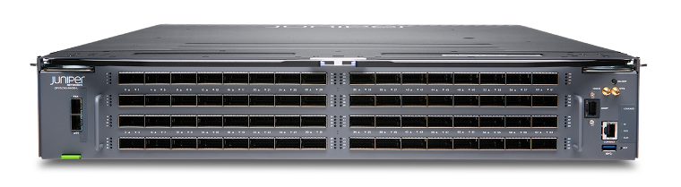
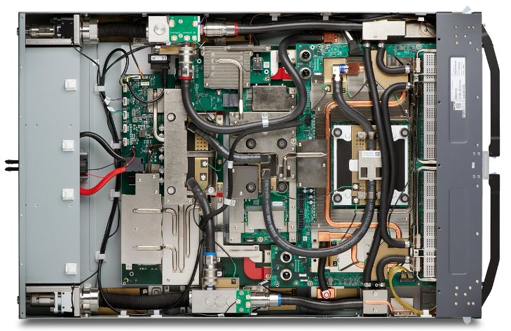
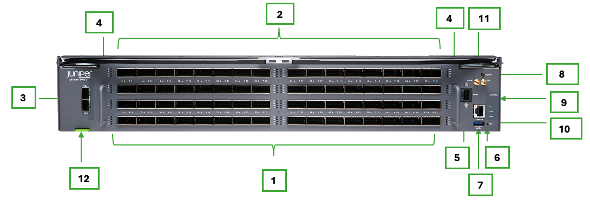
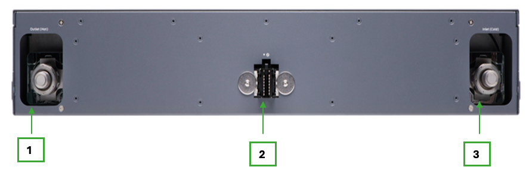
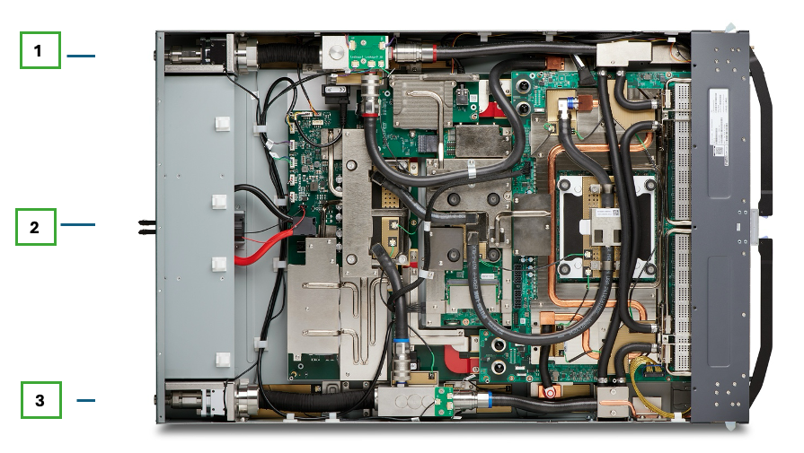
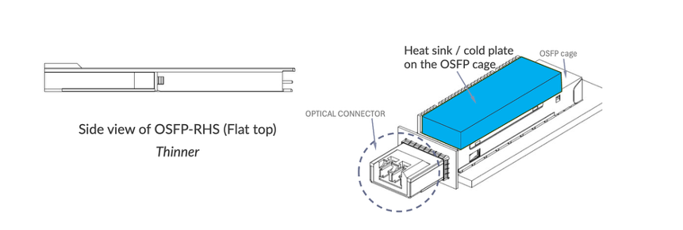

# Industry First 1.6T Liquid Cooled Switch: QFX5250-64OE-L

**Riti Sharma - 06/17/2026**

Extending HPE Juniper's innovation leadership from 800G to 1.6TbE AI data center fabrics. **HPE Juniper Networking** has started shipping the industry's first 102.4 Tbps data center switch, featuring **64 x 1.6 Tbps OSFP-RHS** ports, compliance with the Open Compute **ORV3** standard, and **100% liquid-cooling** efficiency, by using cold plates directly attached to the ASIC, the CPU, the DC-DC Converter, and the 64 x OSFP-RHS transceivers.

This paper provides highlights of this switch.

## Introduction

AI Data Center infrastructure puts unique demands on the network. Traffic between servers is high volume, latency must remain consistent, and power consumption is always a concern. The QFX5250 is designed to handle all of this at scale.

QFX5250 is a 2OU ORv3 100% liquid-cooled and fixed-form switch that delivers 102.4 Tbps of switching capacity, with 64 ports running at 1.6 Terabit Ethernet, powered by Al-optimized Junos OS Evolved. It supports configurable port speeds from 1.6TbE down to 100GbE, making it adaptable to different fabric designs without requiring a full infrastructure overhaul.

## Designed for AI Traffic

AI workloads and High-Performance Computing (HPC) generate heavy east-west traffic between GPU accelerators, and congestion can quickly degrade performance. The QFX5250 addresses this with advanced congestion avoidance techniques, including multiple load-balancing options (DLB, GLB, and RLB), weighted packet spraying, and congestion management features such as ECN and PFC --- all of which are important for running a lossless fabric that reliably transports RoCEv2 traffic.

## Built for Modern Data Centers

The QFX5250-64OE-L liquid-cooled switch uses direct-to-chip cooling and meets Open Compute ORv3 standards, helping manage the power and thermal demands of 1.6T-scale networking. Built-in leak detection and Redfish-based management give operators the tools they need in liquid-cooled environments.

## Easy to Operate at Scale

The platform integrates with Apstra Datacenter Director for intent-based management and supports open APIs, telemetry, Python, Ansible, NETCONF/YANG, and standard Junos automation frameworks, enabling seamless deployment in automated, large-scale data center environments while improving AI efficiency and optimizing job completion times. It also leverages Marvis AI to quickly identify the root cause of network disruptions.

The QFX5250 brings together high bandwidth, AI-aware traffic handling, thermal efficiency, and operational simplicity --- in a platform built for the next generation of data center networks.

## KEY USE CASES

The QFX5250 is designed for high-performance data center fabrics where scale, low latency, and efficient congestion avoidance and handling are critical. Its combination of 64 x 1.6T Ethernet interfaces, flexible breakout options, liquid-cooled efficiency, and AI-optimized transport behavior makes it well-suited for the various deployment roles.

Table: Use cases

| Use Case | How QFX5250 Fits |
|:--|:--|
| AI/ML Leaf-Spine Fabrics | Provides high-density 1.6T Ethernet connectivity for large-scale AI cluster deployments, with AIOps-driven automation for intelligent monitoring, operational optimization, and automated remediation, enabling efficient leaf-and-spine designs with flexible breakout for 800G, 400G, 200G, and 100G connectivity. |
| RoCEv2 Lossless AI Networks | Supports congestion avoidance and management features such as DLB, GLB, WPS, PFC, ECN, and PFC watchdog, helping build predictable and efficient Ethernet fabrics for AI/ML workloads while enabling extreme AI efficiency. |
| HPC Ethernet Fabrics | Delivers low-latency, high-bandwidth switching for HPC environments that require scalable east-west traffic handling and strong transport efficiency. |
| Cloud and IP Fabric Data Centers | Can be deployed as a high-speed leaf or spine switch in modern IP fabrics, providing large route scale, high port density, and operational consistency in cloud-oriented environments. |
| Data Center Interconnect (DCI) | Can be used in high-capacity interconnect roles between data center pods or facilities, supporting large traffic volumes with flexible interface speeds and high aggregate bandwidth. |
| High-Density GPU/Accelerator Cluster Networks | Helps build dense back-end cluster networks for modern accelerator-based infrastructure, where bandwidth, latency, and power efficiency directly affect workload performance. |

## SWITCH DESCRIPTION

The switch has 64 high-speed OSFP ports (ports 0--63) supporting interface speeds up to 1.6TbE, with flexible channelization options to operate at 800GbE, 400GbE, 200GbE, or 100GbE, depending on the optic and configuration. All high-speed ports support ORHS form-factor optics designed for efficient thermal operation in liquid-cooled environments.

In addition, the system includes 2 SFP28 ports (ports 64--65) supporting up to 25 GbE/10 GbE, which can be used for management or lower-speed connectivity. The platform also provides standard management and system interfaces, including a USB 3.0 port, RJ-45 console port, dedicated management port, and DIN connectors for timing interfaces (1PPS and 10 MHz).

Table: Components on the QFX5250-64OE-L Front Panel

| Number | Item |
|:--|:--|
| 1 | Network ports panel - 64 1600G OSFP ports |
| 2 | Two ejector levers on the front panel |
| 3 | 2 SFP28 ports with up to 25 Gbps transmission |
| 4 | 2 switch handles on the front panel |
| 5 | RJ-45 Management port (MGMT) |
| 6 | Status LEDs (ID, SYS, ALM), and reset (RST) button |
| 7 | Type A, USB 3.0 port (SS) |
| 8 | Power on and power off the QFX5250 switch |
| 9 | LEAKAGE LED - indicates coolantleakage in the QFX5250 switch. |
| 10 | RJ-45 console port (CON) |
| 11 | Clock input and output connectors(10 MHz and 1 PPS) |
| 12 | Pull-tab with QR code |

Table: Components on the QFX5250-64OE-L Back Panel

| Number | Item |
|:--|:--|
| 1 | UQDB06 plug (outlet) |
| 2 | IT Gear Input Connector- Connecting to DC Bus BAR |
| 3 | UQDB06 plug (inlet) |

Table: Key Specification of QFX5250-64OE-L

| Description | Specification |
|:--|:--|
| System throughput | 102.4/204.8 Tbps (uni/bidirectional) |
| Max Forwarding rate | ~38 billion packets per second (Bpps) |
| Port density | 64 ports of OSFP-RHS 1600GbE and 2x(10G/25G) SFP+/SFP28 user ports |
| Max ports with breakout | 64 x 1600GbE,128 x 800GbE, (breakouts)256 x 400GbE, breakouts)512 x 200GbE/100GbE breakouts)Max port density with mixed speeds 512 |
| Dimensions (W x H x D) | 92.7 mm (H) x 537 mm (W) x 805 mm (D) 3.65 in. (H) x 21.14 in. (W) x 31.69 in. (D) |
| Rack units | 2OU |
| Weight | 48 kg / 105.8 lb |
| Operating system | Junos OS Evolved |
| Switch chip | Broadcom Tomahawk 6 |
| Cooling | 100% Liquid cooled, Cold-plates liquid cooled for CPU, MAC, OSFP-RHS optics, and Power bricks  |
| LQ Switch Manifold type | UQDB06 |
| Coolant Type | PG25 |
| Operating Coolant Pressure PSI | 15 PSI |
| Min burst pressure (psig) | 135PSI |
| Max coolant operating pressure (psig) | 40PSI |
| Coolant Flow Rate | 10 lpm  (litres per minute) per switch |
| Switch coolant inlet temp | 7C is min and Max is 45C( target for DR optics) |
| Fluid cooling ratio (%) | 100% |
| Switch Manifold Material | Stainless Steel |
| Optics | OSFP-RHS (Riding Heat Sink) |
| Voltage (DC) | 48V (46-55V DC Busbar Klip ) |
| Acoustic | Fan less System |
| DC input voltage | Minimum: 46 VDC Operating range: 46 VDC through 56 VDC |
| DC/HVDC input current rating | 110 A |
| Maximum power consumption (loaded with DR optics) | 3435 W |
| Typical power consumption (loaded with DR optics) | 3375 W |

## LIQUID COOLING AND EARLY LEAK DETECTION

Designed for 100% liquid-cooled operation with direct-to-chip cooling in an ORv3 rack environment, the system initiates leak monitoring immediately upon receiving DC power from the rack power busbar. The combination of integrated leak sensors and UQDB connectors helps maintain safe, sustainable, and highly efficient operation.

The following design elements are integrated to support safe, efficient, and high-density liquid-cooled operation:

- UQDB06 push-lock manifold connectors enable leak-free, hot-swappable deployment in ORv3 rack environments.
- Integrated drip trays provide added protection by containing potential coolant leaks.
- Dyed fluorescent PG25 coolant ensures temperature stability, biofouling resistance, and rapid visual leak detection.
- Dedicated cold plates for CPUs, TH6 silicon, and optics improve thermal efficiency while supporting high-density rack deployments.

## Leak Detection Controller (LDC)

LDC monitors the system during early power-on. If leakage is detected, the Leakage LED turns on. In a leak-free condition, power-on continues, the LDC remains active, and Junos EVO boots normally.

If a leak is detected, the chassis can be removed for visual inspection. If a leak is confirmed, the operator can take corrective action or initiate RMA. Once the issue is resolved, the system can be powered on again using the ON/OFF button.

After boot, the CPU and BMC continue monitoring leak sensors and generate alarms as needed. Leakage events are reported through Redfish, while Junos EVO raises alarms and reports leakage severity. Leakage alarms can be cleared via the CLI and will be raised again for any future leak event.

The system also reports temperature and pressure telemetry through the CPU. If the over-temperature limit is reached, the system will power off automatically.

## FORWARDING ARCHITECTURE

The system is powered by a single Broadcom Tomahawk 6 delivering up to 102.4 Tbps of switching capacity. The single-chip architecture provides a low-latency forwarding path and eliminates the need for external fabric components.

It supports high-speed L2/L3 forwarding optimized for east-west traffic in AI, HPC, and cloud data center environments. The platform also includes ~267 MB of shared buffer, helping absorb microbursts and improve traffic handling during transient congestion.

## INTERFACES AND BREAKOUT PORTS

The QFX5250 groups all its forwarding ASICs under a single Memory Management Unit, ITM 0. The switch contains 32 data pipes, each housing two 200G SerDes devices, for a total of 64 SerDes across the system. All data pipes connect bidirectionally to ITM 0, meaning every SerDes in the system shares the same memory management unit. This single-ITM design consolidates all ports into a single unified group, simplifying buffer management and traffic coordination across the entire device.

The QFX5250 is a fixed-form-factor chassis, and by default, all active ports operate at 1.6T. Port naming is straightforward --- with only one Flexible PIC Card (FPC) and one Physical Interface Card (PIC) in the system, all interfaces follow a consistent format:

- Non-channelized: et-0/0/x, where x = 0 to 65
- Channelized: et-0/0/x:[0--7]

Table: Channelization for Ports of QFX5250-64OE-L

| Port Range | Supported Channelization Options |
|:--|:--|
| Ports 0--63 | 2 x 800G4 x 400G8 x 200G1 x 800G2 x 400G4 x 200G8 x 100G |
| Ports 64--65 | 1 x 25G1 x 10G |

## SOFTWARE OVERVIEW

The QFX5250 is released with the 25.2X100-D20 advanced Junos Evolved software feature set for AI Data Center front-end and back-end networks, as well as other DC use cases such as storage and HPC. It includes ASIC-driven intelligent workloads forwarding and load balancing, resiliency, feature-rich IP dynamic routing with many advanced BGP routing features.

The advanced software of the QFX5250 helps optimize and scale AI DC networks, thereby maximizing GPU server utilization. The automation and management feature set makes it easy to integrate the product into the new and existing data center networks. Here's a summary of the different software features of the QFX5250.

> **Note:** The features marked with a star (*) are officially coming at FRS+.

## Layer 3 & IP Routing

- BGP full stack --- IPv4, IPv6, unnumbered (RFC5549), unequal cost load balancing, and bandwidth community, IP color communities
- BGP TCP AO
- BGP unnumbered authentication
- DPF -- Deterministic Path Forwarding (BGP peering coloring) within the DC Fabric
- Advanced IP policy-statements (aka route-maps)
- OSPF v2/v3 and IS-IS for scalable link-state routing across large topologies
- VRF routing instances with IP VRF and virtual router support for multi-tenant segmentation
- VRRP/VRRPv3 for gateway redundancy
- DHCP v4/v6 relay
- Dynamic IPv6 addressing and Firewall on the GPU-facing interface
- SLAAC
- EVPN-VxLAN RT5 (EVPN Route-Type 5) for multitenancy *
- SRv6 uSID IPVPN multitenancy *
- MRC with SRv6 uSID *

## AI DC Load Balancing

- DLB -- Dynamic Load Balancing (packet spraying and flow mode), including ASIC-level micro-second level link utilization bandwidth assessment and queue buffers for the load balancing decision for ROCEv2 and other workloads besides the IP ECMP static hashing
- GLB -- Global Load Balancing -- extends the DLB by including the spine or super-spine link quality heartbeats
- RLB -- RDMA Load Balancing -- RDMA flow pinning to the paths with an NCCL plugin
- Selective Load Balancing - admin decides which DLB mode is the best for the specific AI workload
- WPS -- Weighted Packet Spraying
- Cognitive routing with reactive path rebalancing for real-time traffic optimization
- Static Load Balancing -- 5-tuple based, with ROCEv2 QP as part of the hashing

## AI DC Lossless Fabric

- RoCEv2 lossless IP fabric (IPv4 and IPv6) with per queue PFC (Priority Flow Control) and ECN (Explicit Congestion Notification) for RDMA workloads in IPv4 and IPv6 DC fabric deployments (DCQCN)
- Per-queue alpha value settings for per-queue buffer management
- PFC-DSCP x-on and x-off support
- PFC Watchdog -- to control the PFC avalanche in the lossless IP Fabric
- PFC aware DLB *
- PFC aware ECN *
- Fast CNP (Back to Sender) *
- Packet trimming for Ultra Ethernet Transport (UET) and GLB for RoCEv2
- Drop Congestion Notification (DCN) -- fast notification of the dropped RDMA packet
- Shared buffer pool settings
- QoS Classification based on DSCP, COS
- QoS Classification using access-lists (L3 and L2 ACLs)
- L2/L3 QoS pipeline --- classification, rewrite, queuing, WRED, ECN, and shared buffer monitoring

## UEC (Ultra Ethernet Consortium) readiness

- Trimming -- packet trimming
- UET packet forwarding
- CSIG support
- LLR support *

## Monitoring & Telemetry

- Junos streaming telemetry with ECN and PFC counter support for fabric visibility
- Flow Tracker -- line rate RDMA transit flow verification in CLI (for example, based on destination QP of the ROCEv2 or verify the destination QP based on source/destination IP)
- SNMP for ECN/PFC
- Mirror on drop (MoD), RSPAN, and ERSPAN for comprehensive packet-level observability
- sFlow v5
- SNMP ingress buffer and drop accounting
- Analyzer with source and destination IPv6 and IPv4 specifications
- IFA 2.0 (In Band flow Analyzer) -- originator/terminator to measure an end-to-end latency
- ROCEv2 - telemetry support for ipv6 transit traffic statistics
- Tap Aggregate mode
- Transit and non-transit packet mirroring local to the node -- save a PCAP file on the switch to read in Wireshark
- Liquid Cool Leak Detection
- Coolant Temperature
- Pressured Humidity Sensor

## Management & Automation

- Secure Zero-Touch Provisioning (sZTP) with DevID and secure boot for trusted automated deployment
- Python scripting --- on-box and off-box --- for flexible network automation
- Role-based CLI with configuration rescue, rollback, and SNMP v1/v2/v3
- SSH/Netconf various options
- SNMPv2/SNMPv3
- RADIUS
- TACACS+
- gNMI
- 3rd-party applications, containers in Junos Evolved

## Layer 2 Switching

- STP, RSTP, and MSTP with BPDU, loop, and root protect for resilient Layer 2 topologies
- LACP link aggregation (LAG interfaces)
- 802.1Q VLAN trunking (interface-mode trunk)
- L2 access-mode interfaces
- IRB interfaces for integrated routing and bridging (L3 interface mapping to L2 VLANs)
- Symmetric inter-irb routing using MAC-IP (EVPN RT2 MAC-VRF) *
- Symmetric inter-irb routing using RT5 (EVPN RT5 inter-irb routing) *
- ESI-LAG multihoming *
- MAC-VRF EVPN L2 instances *
- EVI (EVPN L2 instances with vlan-based, vlan-aware services) *

## Security features

- Access-lists (ACL), aka firewall-filters:
    - L3 ingress/egress on IP interfaces and L2 interfaces
    - VLAN access lists
    - User-Defined Filters -- specific RDMA flows can be filtered, ingress/egress, or any other upper-layer definition of the flow can be done as part of the ACL match criteria
- MAC limit support at the interface level
- DDOS protection (control plane protection at the ASIC level)
- Storm Control
- 802.1X Support

## OPTICS - OSFP-RHS (Riding Heat Sink)

## OSFP-RHS (Riding Heat Sink)

New type of optic built for liquid-cooled systems, and below are the differentiators from regular OSFPs:

- No heat sink on the transceiver itself --- instead, the heat sink lives on the cage and "rides" on top of the optic, hence the name
- Flat top design - also called "flat-top" or OSFP flattop - no fins, just a smooth metal surface that makes direct contact with the cooling system of the Chassis itself.
- Built for liquid cooling --- the riding heat sink acts as a cold plate, letting liquid carry heat away far more efficiently than air ever could.
- Enables higher power, higher density --- as speeds push to 1.6T and beyond, air cooling simply can't keep up; RHS solves that.

Table: OSFP-RHS Optic List for QFX5250-64OE-L

| Type | Connector | Supported Speeds At FRS |
|:--|:--|:--|
| ORHS-1600G-DR8-2-P | Dual MPO12 (SMF) | 1x1.6t, 2x800G, 4x400G, 8x200G,1x800G, 2x400G, 4x200G, 8x100G |
| ORHS-1600G-DR8-2 | MPO16 (SMF) | 1x1.6t, 2x800G, 4x400G, 8x200G,1x800G, 2x400G, 4x200G, 8x100G |
| ORHS-2x800G-FR4-P | Dual LC (SMF) | 2x800G, 2x400G |
| ORHS-800G-DR8-2-P | Dual MPO12 (SMF) | 1x800G, 2x400G,4x200G, 8x100G |
| ORHS-800G-VR8-P | Dual MPO12 (MMF) | 1x800G, 2x400G,4x200G, 8x100G, 1x400G |

## QFX5250 - SKU's

Table: SKU's List for QFX5250-64OE-L

| Type | SKU | Description |
|:--|:--|:--|
| Chassis | QFX5250-64OE-L | 64x1600GbE OSFP switch, DC,  Liquid Cooled Integrated ORv3 |
| License | S-QFX5K-C6-A1-X (X=3,5,P) | Advanced 1 Software License (X Years Subscription, X=3,5, or P for Perpetual) for QFX5240-OD/QD line of switches |
| License | S-QFX5K-C6-A2-X (X=3,5,P) | Advanced 2 Software License (X Years Subscription, X=1,3,5, or P for Perpetual) for QFX5240-OD/QD line of switches |
| License | S-QFX5K-C6-P1 -X (X=3,5,P) | Premium Software License (X Years Subscription, X=1,3,5, or P for Perpetual) for QFX5240-OD/QD line of switches |

## Conclusion

The QFX5250-64OE-L marks a significant evolution in data center switching, delivering unprecedented 1.6TbE performance alongside advanced AI-aware traffic optimization and full liquid-cooling efficiency. By combining ultra-high bandwidth, intelligent congestion management, and streamlined automation, it addresses the demanding requirements of modern AI, HPC, and cloud-scale environments. Its flexible design, operational simplicity, and energy-efficient architecture position it as a foundational building block for next-generation, high-density data center fabrics.

## Useful Links

For the latest information, click on the link below:

- [QFX5250 Series Switches](https://www.hpe.com/us/en/networking/juniper-qfx5250-switch-series.html)
- [Datasheet](https://www.hpe.com/psnow/doc/a00159794enw)
- [Hardware Compatibility Tool (Specifications and Transceivers Information) ](https://apps.juniper.net/hct/product/QFX5250-64OE-L/hwspecs)
- [Hardware Guide](https://www.juniper.net/documentation/us/en/hardware/qfx5250/index.html)
- [Port Checker](https://apps.juniper.net/port-checker/)
- [Power Calculator](https://apps.juniper.net/power-calculator/)
- [AI-ML software guide](https://www.juniper.net/documentation/us/en/software/junos/ai-ml-evo/index.html)
- [Junos Evolved 25.2x100d20 release notes](https://www.juniper.net/documentation/rne/us/en/release-notes/Junos%20OS%20Evolved/25.2X100-D20/junos-os-evolved-release-notes-25.2x100-d20.pdf)
- [QFX5250 - 3D View](https://apps.kaonadn.net/5185710160084992/demo360.html#2/5250;C2001)

## Glossary

- AIOps: Artificial Intelligence for IT Operations
- ACL: Access Control List
- BMC: Baseboard Management Controller
- Bpps: Billion packets per second
- CoS: Class of Service
- DCQCN: Data Center Quantized Congestion Notification
- DLB: Dynamic Load Balancing
- DR: Data Rate (commonly used for optics reach/type)
- ECMP: Equal Cost Multi-Path
- ECN: Explicit Congestion Notification
- GLB: Global Load Balancing
- gNMI: gRPC Network Management Interface
- ITM: Ingress Traffic Manager
- LACP: Link Aggregation Control Protocol
- LAG: Link Aggregation Group
- LDC: Leak Detection Controller
- LLR: Link Layer Retransmission
- OSFP-RHS: OSFP Riding Heat Sink
- ORv3: Open Rack Version 3 (Open Compute standard)
- PFC: Priority Flow Control
- QoS: Quality of Service
- RDMA: Remote Direct Memory Access
- RLB: RDMA Load Balancing
- RoCEv2: RDMA over Converged Ethernet version 2
- RSTP: Rapid Spanning Tree Protocol
- SRv6: Segment Routing over IPv6
- UET: Ultra Ethernet Transport
- UQDB: Universal Quick Disconnect Blind-mate
- WPS: Weighted Packet Spraying

## Acknowledgements

I'd like to thank my colleagues for their support and collaboration throughout this work. Special thanks to Ridhi Hamidi (PhD), Michal Styszynski, Rajesh Dhople, and Chirag Kachalia for their guidance, helpful discussions, product insights, and careful review and corrections of the blog. Their input played an important role in improving both the clarity and quality of the work.
