# Inline IPSec on MX Series

**Suneesh Babu - 12/03/2025**

Juniper adds support for inline IPsec on MX-series routers, meaning that IPsec encryption/decryption is done directly by the router's Packet Forwarding Engine (PFE) ASIC instead of by a separate service card, resulting in much higher VPN throughput and lower latency.

This Techpost details how inline IPsec works on Trio 6-based MX routers and describes the configuration steps needed to activate it.

Co-written by Poorna Pushkala Balasubramanian and Suneesh Babu

## Introduction

Internet Protocol security (IPsec) is a protocol suite for securing Internet Protocol (IP) communications by authenticating and encrypting each IP packet of a communication session. IPsec also includes protocols for establishing mutual authentication between agents at the beginning of the session and negotiation of cryptographic keys to be used during the session. Juniper's IPSec implementation supports securing both IPv4 and IPv6 network layers by providing data confidentiality, integrity, origin authentication, replay protection, and non-repudiation of source. The Junos OS combines IPSec with Internet Key Exchange (IKE), which automates the secure generation and management of cryptographic keys and Security Associations (SAs) necessary for establishing encrypted tunnels.

Juniper Inline IPsec is a state-of-the-art feature integrated into Junos OS that offloads IPsec encryption and decryption operations from the CPU to the Packet Forwarding Engine (PFE) ASIC on Juniper routers like the MX304, MX301 or MX10000 Line Cards (based on Trio 6 PFE).

This architectural design enables the MX series routers to deliver hardware-accelerated, high-throughput IPsec VPN capabilities without relying on traditional service cards (such as MS-MPC or SPC3), significantly enhancing performance and reducing latency.

## IPSec Security Association

A Security Association (SA) is a one-way (inbound or outbound) agreement between two communicating peers, that specifies the IPsec protections to be provided to their communications. A typical bidirectional IPSec connection will have two Security Associations, one in each direction. Each SA specifies a Security Parameters Index (SPI), a destination address and the IPSec Encapsulation Protocol. Juniper supports both manual and dynamic SAs. Manual SAs require static configuration of keys and security parameters on both ends. In contrast, dynamic SAs are negotiated using IKE protocols, both IKEv1 and the more modern, flexible IKEv2 are supported. IKE handles mutual authentication, key agreement, and the creation of secure bidirectional communications. Inline IPSec of MX304 supports only IKEv2.

## Encryption and Authentication Algorithms

Juniper IPSec supports strong cryptographic algorithms including AES (Advanced Encryption Standard) for encryption with granular key sizes (128-bit and 256-bit), and SHA-256 for authentication, providing compliance with high security standards such as FIPS and Common Criteria. The Encapsulating Security Payload (ESP) protocol is used to ensure confidentiality and integrity of the tunneled data while also offering anti-replay protection by default.

## Unified Services Framework

The Unified Services Framework (USF) enables next generation services on MX. This also enables inline IPSec, without relying on external service cards or modules. Enabling USF mode requires a system reboot. Enabling this mode starts various services-related daemons on JUNOS. The CLI configuration for inline services differs between USF mode and non-USF mode, so the router must be in base configuration before enabling this mode and a reboot is required.

The USF can be enabled as follows:

```
regress@rtme-mx304-09> show system unified-services status      
Unified Services : Disabled

regress@rtme-mx304-09> request system enable unified-services    
Before enabling unified services, please move to baseline configuration.
Are above conditions satisfied ? [yes,no] (no) yes 

Verified junos-unified-services signed by PackageDevelopmentECP256_2025 method ECDSA256+SHA256
NOTICE: 'pending' set will be activated at next reboot...
Unified-Services upgrade staged. Please reboot with 'request system reboot' command to complete the upgrade

regress@rtme-mx304-09> request system reboot 
Reboot the system ? [yes,no] (no) yes 

                                                                               
*** FINAL System shutdown message from regress@rtme-mx304-09 ***             

System going down IMMEDIATELY                                                  

                                                                               
Shutdown NOW!
[pid 69698]
```

> Note: Make sure that we are triggering the command on both the RE's explicitly

```
regress@rtme-mx304-09> show system unified-services status    
Unified Services : Enabled
```

## SI Interface

A Service Interface (SI) is a virtual physical interface that resides on the Packet Forwarding Engine (PFE) or lookup engine of the ASIC. The SI interface is also called Anchor interface, which enables advanced services like PPPoE, L2TP, MLPPP and IPSec VPN Processing. The SI interface on MX is the anchor for inline cryptographic processing, eliminating the need for separate service cards or PICs.

Configuring the inline-services creates the "si" interfaces. Four "si" interfaces will be created per Trio 6 ASIC, ie. two per PFE.

```
regress@rtme-mx304-09> show configuration groups IPSec_T1 chassis    
fpc 0 {
    pic 1 {
        inline-services;
    }
}

regress@rtme-mx304-09> show interfaces terse |match si-              
si-0/1/0                up    up
si-0/1/1                up    up
si-0/1/2                up    up
si-0/1/3                up    up
```

We can also specify the bandwidth for the inline-services

```
[edit groups IPSec_T1 chassis fpc 0 pic 1]
regress@PE1# set inline-services bandwidth ?
Possible completions:
  <bandwidth>          Bandwidth reserved for tunnel service
  100g                 100 gigabits per second
  10g                  10 gigabits per second
  1g                   1 gigabit per second
  200g                 200 gigabits per second
  20g                  20 gigabits per second
  300g                 300 gigabits per second
  30g                  30 gigabits per second
  400g                 400 gigabits per second
  40g                  40 gigabits per second
  50g                  50 gigabits per second
  60g                  60 gigabits per second
  70g                  70 gigabits per second
  800g                 800 gigabits per second
  80g                  80 gigabits per second
  90g                  90 gigabits per second
```

Here "si-0/1/0" and "si-0/1/1" for the first PFE and "si-0/1/2" and "si-0/1/3" for the second PFE.

| Aspect | Inside Interface | Outside Interface |
|:--|:--|:--|
| Traffic State | Cleartext (decrypted) | Encrypted (ESP) |
| Direction | To/From internal network | To/From external network |
| Service Domain | Inside | Outside |
| Typical Unit | .0 | .1 |
| IP Protocol | Original IP(TCP/UDP/etc) | ESP (protocol 50) |
| Routing | Post Decryption Routing | Pre Encryption Routing |

### ST0 Interface

Secure Tunnel Interface (ST0) is an internal interface used for route-based IPSec VPNs. It is a virtual interface that routes the cleartext traffic towards an IPSec VPN Tunnel. Each logical unit of st0, like st0.1, st0.2, st0.3 etc corresponds to a separate VPN instance.

```
regress@PE1> show interfaces st0 terse     
Interface               Admin Link Proto    Local                 Remote
st0                     up    up
st0.1                   up    up   inet    
```

## Inline IPSec on MX Trio 6

Trio 6 chip has an IPSec engine in the ASIC, which is part of the packet processing chip and does IPsec inline.

Each Trio 6 has two slices, so two engines. Each slice is a PFE, as it is a fabric destination. Each PFE has one IPSec engine.  One IPSec engine can handle 300Gbps half-duplex IPsec traffic. Each IPSec Engine provides 1,000 tunnels, so Trio 6 support a total of 2,000 IPSec Tunnels.

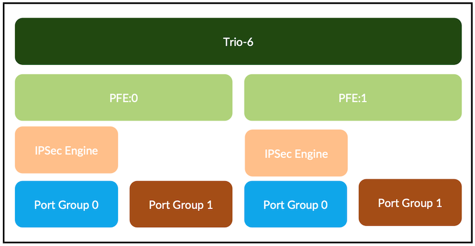

Inline IPSec on Trio 6 based MX platforms (MX304, MX301, LC9600, LC4800, LC4802) works with USF in two modes:

- Traffic Selector mode coming in Junos 25.4 release
- P2P next-hop mode supported since 24.2R1

In P2P mode, routing protocol sees unique st0 logical interface for each tunnel (we will present them as "ifl" in the rest of this document). Protocols add routes with next-hop as st0 ifl. There is one to one mapping with st0 ifl and the tunnel Id. The packet is steered towards the st0 ifl based on route look up in the forwarding path. In this case, each si ifl can be mapped to multiple st0 ifl. In P2P case, the number of tunnels supported is limited by the number of st0 ifl that can be configured in the chassis.

Traffic selection mode configuration is described in the scale tests section of this document.

### Encryption Pipeline

In USF P2P mode, there is a static route that points to a st0.x ifl. There is one st0 ifl per tunnel. The packet is steered towards the st0 ifl based on route look up in the forwarding path for encryption. After the route lookup, WAN packets are forwarded to the st0.x interface. They are then passed to the* "*si-inside IFL", which feeds them into the crypto block. Once encrypted, the packets exit through the** "**si-outside IFL" and continue toward the forwarding next hop.

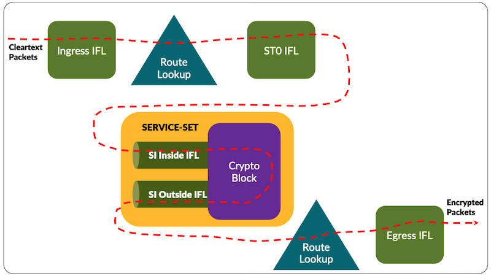

### Decryption Pipeline

In the decryption path, IKE gateway prefix-based route steers the packet towards the outside si ifl.

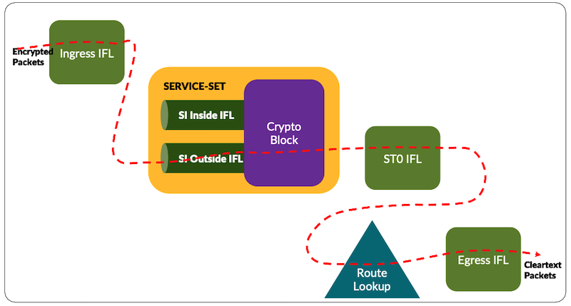

## Supported Packet Encapsulations via Inline IPSec

The following encapsulation are supported today on Trio 6 MX Series routers or line cards:

- IPv4 over IPSec
- IPv6 over IPSec
- MPLS over GRE over IPSec
- VXLAN over IPSec (vtep and fti)

## Bringing up inline IPSec on MX -- P2P

### Inline IPSec Configuration Flow

The configuration schema for bringing up inline IPSec on MX304 is as follows:

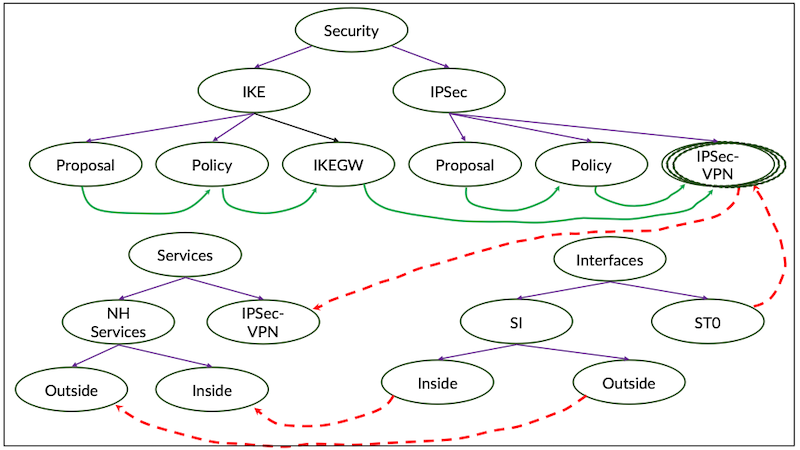

### Test Topology

In the test topology PE routers are having BGP peering for IPv4 and IPv6 family with service provider core running with ISIS SR-MPLS. The CE's are simulated on the traffic generator, PE's and CE's are having EBGP peering for both IPv4 and IPv6 family and CE's advertise 100 routes for each IP family. Traffic is set for both families in bi-directional mode.

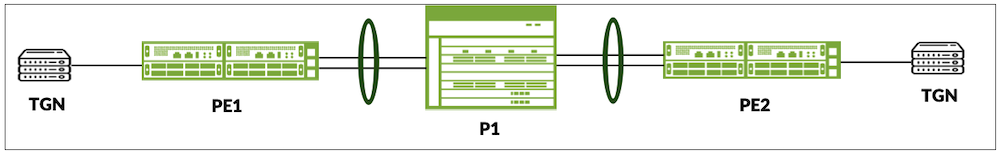

### PE1 Configuration

```
regress@PE1> show configuration groups IPSec_Global_v4_v6 |no-more 
chassis {
    aggregated-devices {
        ethernet {
            device-count 30;
        }
    }
    fpc 0 {
        pic 1 {
            inline-services;
        }
    }
    network-services enhanced-ip;
}
services {
    service-set SS-1 {
        next-hop-service {
            inside-service-interface si-0/1/0.0;
            outside-service-interface si-0/1/0.1;
        }
        ipsec-vpn ipsec_vpn;
    }
}
security {
    ike {
        proposal ike_proposal {
            description "IKE Proposal at PE1";
            authentication-method pre-shared-keys;
        }
        policy ike_policy {
            mode main;
            proposals ike_proposal;
            pre-shared-key ascii-text "$9$.fQ3ApBSrv69rvWLVb.P5Ft0SyeKWXVw"; ## SECRET-DATA
        }
        gateway ike_gw {
            ike-policy ike_policy;
            address 13.10.2.2;
            external-interface ae0;
            local-address 13.10.1.1;
            version v2-only;
        }
    }
    ipsec {
        proposal ipsec_proposal {
            extended-sequence-number;
            description "IPSec Proposal at PE1";
            protocol esp;
            encryption-algorithm aes-256-gcm;
        }
        policy ipsec_policy {
            proposals ipsec_proposal;
        }
        vpn ipsec_vpn {
            bind-interface st0.1;
            copy-outer-dscp;
            ike {
                gateway ike_gw;
                anti-replay-window-size 4096;
                ipsec-policy ipsec_policy;
            }
            establish-tunnels immediately;
        }
    }
}
interfaces {
    lo0 {
        unit 0 {
            family inet {
                address 12.1.1.1/32;
            }
            family iso {
                address 49.0002.0120.0100.1001.00;
            }
            family inet6 {
                address 2002:12:1:1::1/128;
            }
        }
    }
    si-0/1/0 {
        unit 0 {
            family inet;
            family inet6;
            service-domain inside;
        }
        unit 1 {
            family inet;
            family inet6;
            service-domain outside;
        }
    }
    st0 {
        unit 1 {
            family inet;
            family inet6;
        }
    }
    et-0/2/10 {
        description "towards CE1 at IXIA";
        unit 0 {
            family inet {
                address 13.11.1.1/24;
            }
            family inet6 {
                address 2002:13:11:1::1/64;
            }
        }
    }
    ae0 {
        description "Bundle to P1";
        aggregated-ether-options {
            lacp {
                active;
                periodic fast;
            }
        }
        unit 0 {
            family inet {
                address 13.10.1.1/24;
            }
            family iso;
            family mpls;
        }
    }
    et-0/2/3 {
        gigether-options {
            802.3ad ae0;
        }
    }
    et-0/2/4 {
        gigether-options {
            802.3ad ae0;
        }
    }
}
policy-options {
    policy-statement nhs {
        term nhs {
            then {
                next-hop self;
            }
        }
    }
    policy-statement pplb {
        term pplb {
            then {
                load-balance per-flow;
            }
        }
    }
}
protocols {
    bgp {
        group IBGP {
            type internal;
            local-address 12.1.1.1;
            family inet {
                unicast;
            }
            family inet6 {
                labeled-unicast {
                    inactive: explicit-null;
                }
            }
            export nhs;
            neighbor 12.1.1.2;
        }
        group EBGP {
            type external;
            family inet {
                unicast;
            }
            peer-as 20001;
            neighbor 13.11.1.2;
        }
        group EBGPv6 {
            type external;
            family inet6 {
                unicast;
            }
            peer-as 20001;
            neighbor 2002:13:11:1::2;
        }
    }
    isis {
        interface lo0.0 {
            passive;
        }
        interface ae0.0 {
            level 1 disable;
            point-to-point;
        }
        source-packet-routing {
            srgb start-label 20000 index-range 2000;
            node-segment {
                ipv4-index 101;
                ipv6-index 201;
            }
        }
        level 1 disable;
        level 2 wide-metrics-only;
    }
    mpls {
        ipv6-tunneling;
        interface ae0.0;
    }
    lldp {
        interface et-0/1/4;
        interface ae0;
    }
}
routing-options {
    rib inet6.0 {
        static {
            route ::ffff:12.1.1.2/128 next-hop st0.1;
        }
    }
    router-id 12.1.1.1;
    autonomous-system 64512;
    static {
        route 12.1.1.2/32 next-hop st0.1;
    }
    forwarding-table {
        export pplb;
    }
}
```

### PE2 Configuration

```
regress@PE2> show configuration groups IPSec_Global_v4_v6 |no-more 
chassis {
    aggregated-devices {
        ethernet {
            device-count 30;
        }
    }
    fpc 0 {
        pic 1 {
            inline-services;
        }
    }
    network-services enhanced-ip;
}
services {
    service-set SS-1 {
        next-hop-service {
            inside-service-interface si-0/1/0.0;
            outside-service-interface si-0/1/0.1;
        }
        ipsec-vpn ipsec_vpn;
    }
}
security {
    ike {
        proposal ike_proposal {
            description "IKE Proposal at PE2";
            authentication-method pre-shared-keys;
        }
        policy ike_policy {
            mode main;
            proposals ike_proposal;
            pre-shared-key ascii-text "$9$fQ3/uORlK8CtK8X7sYfTz601leMWXNs2"; ## SECRET-DATA
        }
        gateway ike_gw {
            ike-policy ike_policy;
            address 13.10.1.1;
            external-interface ae1;
            local-address 13.10.2.2;
            version v2-only;
        }
    }
    ipsec {
        proposal ipsec_proposal {
            extended-sequence-number;
            description "IPSec Proposal at PE2";
            protocol esp;
            encryption-algorithm aes-256-gcm;
        }
        policy ipsec_policy {
            proposals ipsec_proposal;
        }
        vpn ipsec_vpn {
            bind-interface st0.1;
            copy-outer-dscp;
            ike {
                gateway ike_gw;
                anti-replay-window-size 4096;
                ipsec-policy ipsec_policy;
            }
            establish-tunnels immediately;
        }
    }
}
interfaces {
    lo0 {
        unit 0 {
            family inet {
                address 12.1.1.2/32;
            }
            family iso {
                address 49.0002.0120.0100.1002.00;
            }
            family inet6 {
                address 2002:12:1:1::2/128;
            }
        }
    }
    si-0/1/0 {
        unit 0 {
            family inet;
            family inet6;
            service-domain inside;
        }
        unit 1 {
            family inet;
            family inet6;
            service-domain outside;
        }
    }
    st0 {
        unit 1 {
            family inet;
            family inet6;
        }
    }
    et-0/0/4 {
        description "towards CE2 at IXIA";
        unit 0 {
            family inet {
                address 13.12.1.1/24;
            }
            family inet6 {
                address 2002:13:12:1::1/64;
            }
        }
    }
    ae1 {
        description "bundle to P1";
        aggregated-ether-options {
            lacp {
                active;
                periodic fast;
            }
        }
        unit 0 {
            family inet {
                address 13.10.2.2/24;
            }
            family iso;
            family mpls;
        }
    }
    et-0/0/10 {
        gigether-options {
            802.3ad ae1;
        }
    }
    et-0/0/11 {
        gigether-options {
            802.3ad ae1;
        }
    }
}
policy-options {
    policy-statement pplb {
        term pplb {
            then {
                load-balance per-flow;
            }
        }
    }
    policy-statement nhs {
        term nhs {
            then {
                next-hop self;
            }
        }
    }
}
protocols {
    bgp {
        group IBGP {
            type internal;
            local-address 12.1.1.2;
            family inet {
                unicast;
            }
            family inet6 {
                labeled-unicast {
                    inactive: explicit-null;
                }
            }
            export nhs;
            neighbor 12.1.1.1;
        }
        group EBGP {
            type external;
            family inet {
                unicast;
            }
            peer-as 20002;
            neighbor 13.12.1.2;
        }
        group EBGPv6 {
            type external;
            family inet6 {
                unicast;
            }
            peer-as 20002;
            neighbor 2002:13:12:1::2;
        }
    }
    isis {
        interface lo0.0 {
            passive;
        }
        interface ae1.0 {
            level 1 disable;
            point-to-point;
        }
        source-packet-routing {
            srgb start-label 20000 index-range 2000;
            node-segment {
                ipv4-index 102;
                ipv6-index 202;
            }
        }
        level 1 disable;
        level 2 wide-metrics-only;
    }
    mpls {
        ipv6-tunneling;
        interface ae1.0;
    }
    lldp {
        interface et-0/1/4;
        interface ae1;
    }
}
routing-options {
    rib inet6.0 {
        static {
            route ::ffff:12.1.1.1/128 next-hop st0.1;
        }
    }
    router-id 12.1.1.2;
    autonomous-system 64512;
    static {
        route 12.1.1.1/32 next-hop st0.1;
    }
    forwarding-table {
        export pplb;
    }
}
```

### P1 Configuration

```
regress@P1> show configuration groups IPSec_Global_v4_v6 |no-more 
chassis {
    aggregated-devices {
        ethernet {
            device-count 30;
        }
    }
    network-services enhanced-ip;
}
interfaces {
    ae0 {
        description "Bundle to PE1";
        aggregated-ether-options {
            lacp {
                active;
                periodic fast;
            }
        }
        unit 0 {
            family inet {
                address 13.10.1.2/24;
            }
            family iso;
            family mpls;
        }
    }
    et-0/2/0 {
        gigether-options {
            802.3ad ae0;
        }
    }
    et-0/2/1 {
        gigether-options {
            802.3ad ae0;
        }
    }
    lo0 {
        unit 0 {
            family inet {
                address 12.1.1.3/32;
            }
            family iso {
                address 49.0002.0120.0100.1003.00;
            }
        }
    }
    ae1 {
        description "Bundle to PE2";
        aggregated-ether-options {
            lacp {
                active;
                periodic fast;
            }
        }
        unit 0 {
            family inet {
                address 13.10.2.1/24;
            }
            family iso;
            family mpls;
        }
    }
    et-0/0/0 {
        gigether-options {
            802.3ad ae1;
        }
    }
    et-0/2/2 {
        gigether-options {
            802.3ad ae1;
        }
    }
}
policy-options {
    policy-statement pplb {
        term pplb {
            then {
                load-balance per-flow;
            }
        }
    }
}
routing-options {
    router-id 12.1.1.3;
    autonomous-system 64512;
    forwarding-table {
        export pplb;
    }
}
protocols {
    isis {
        interface lo0.0 {
            passive;
        }
        interface ae0.0 {
            level 1 disable;
            point-to-point;
        }
        interface ae1.0 {
            level 1 disable;
            point-to-point;
        }
        source-packet-routing {
            srgb start-label 20000 index-range 2000;
            node-segment {
                ipv4-index 103;
                ipv6-index 203;
            }
        }
        level 1 disable;
        level 2 wide-metrics-only;
    }
    mpls {
        ipv6-tunneling;
        interface ae0.0;
        interface ae1.0;
    }
    lldp {
        interface ae0;
        interface ae1;
    }
}
```

### Verification of Inline IPSec

The IKE and IPSec Security Association are as follows:

```
regress@PE1> show security ike security-associations           
Index   State  Initiator cookie  Responder cookie  Mode           Remote Address
75      UP     e0b71d9e1c29c324  1ace68c4dcfa427b  IKEv2          13.10.2.2     

regress@PE1> show security ipsec security-associations 
  Total active tunnels: 1     Total IPsec sas: 1
  ID      Algorithm       SPI      Life:sec/kb  Mon lsys Port  Gateway
  <500011 ESP:aes-gcm-256/aes256-gcm 0x6d0c6331 1222/ unlim - root 500 13.10.2.2       
  >500011 ESP:aes-gcm-256/aes256-gcm 0xe1ed7345 1222/ unlim - root 500 13.10.2.2       

regress@PE1> show security ipsec security-associations detail 

ID: 500011 Virtual-system: root, VPN Name: ipsec_vpn
  Local Gateway: 13.10.1.1, Remote Gateway: 13.10.2.2
  Local Identity: ipv4(0.0.0.0-255.255.255.255)
  Remote Identity: ipv4(0.0.0.0-255.255.255.255)
  TS Type: proxy-id
  Version: IKEv2
  Quantum Secured: No
  Hardware Offloaded: No
  PFS group: N/A, Packet Encapsulation: None, Dest port: 0
  Passive mode tunneling: Disabled
  DF-bit: clear, Copy-Outer-DSCP: Enabled, Bind-interface: st0.1 , Policy-name: ipsec_policy
  Port: 500, Nego#: 0, Fail#: 0, Def-Del#: 0 Flag: 0 
  Tunnel events:
    Mon Nov 17 2025 21:54:47: IPSec SA is deleted because IPSec SA hard life-time expired, sent DEL notification (3 times) <- [repeated sequence END]
    Mon Nov 17 2025 21:54:47: IPsec SA rekey succeeds (3 times)
    Mon Nov 17 2025 21:54:47: IPSEC SA rekey initiated because soft life timer expired (3 times) <- [repeated sequence START]
    Mon Nov 17 2025 19:28:59: IPSec SA is deleted because received DEL notification from peer (1 times)
    Mon Nov 17 2025 19:28:56: IPsec SA rekey succeeds (1 times)
    Mon Nov 17 2025 18:40:37: IPSec SA is deleted because IPSec SA hard life-time expired, sent DEL notification (4 times) <- [repeated sequence END]
    Mon Nov 17 2025 18:40:37: IPsec SA rekey succeeds (4 times)
    Mon Nov 17 2025 18:40:37: IPSEC SA rekey initiated because soft life timer expired (4 times) <- [repeated sequence START]
    Mon Nov 17 2025 15:26:26: IPSec SA is deleted because received DEL notification from peer (2 times) <- [repeated sequence END]
    Mon Nov 17 2025 15:26:26: IPsec SA rekey succeeds (2 times) <- [repeated sequence START]
  Location: FPC 0, PIC 1
  Anchorship: Thread 0
  Distribution-Profile: si-0/1/0
  Direction: inbound, SPI: 0x3160cdce, AUX-SPI: 0
                              , VPN Monitoring: -
    Hard lifetime: Expires in 715 seconds
    Lifesize Remaining:  Unlimited
    Soft lifetime: Expires in 12 seconds
    Mode: Tunnel(0 0), Type: dynamic, State: installed
    Protocol: ESP, Authentication: aes256-gcm, Encryption: aes-gcm (256 bits)
    Anti-replay service: counter-based enabled, Replay window size: 4096
    Extended-Sequence-Number: Enabled
    tunnel-establishment: establish-tunnels-immediately
    IKE SA Index: 75
  Direction: outbound, SPI: 0x36c700ce, AUX-SPI: 0
                              , VPN Monitoring: -
    Hard lifetime: Expires in 715 seconds
    Lifesize Remaining:  Unlimited
    Soft lifetime: Expires in 12 seconds
    Mode: Tunnel(0 0), Type: dynamic, State: installed
    Protocol: ESP, Authentication: aes256-gcm, Encryption: aes-gcm (256 bits)
    Anti-replay service: counter-based enabled, Replay window size: 4096
    Extended-Sequence-Number: Enabled
    tunnel-establishment: establish-tunnels-immediately
    IKE SA Index: 75
```

### Packet Flow - Encryption

Traffic hitting the Ingress IFL of PE1 destined to hosts behind PE2

```
regress@PE1> show interfaces extensive et-0/2/10.0 |match pps 
    Input  packets:               160002                10000 pps
    Output packets:                    0                    0 pps
     Input  packets:              160002                10000 pps
     Output packets:                   0                    0 pps
```

PE2 is reachable via the st0.1 ifl

```
regress@PE1> show route 12.1.1.2 

inet.0: 227 destinations, 228 routes (227 active, 0 holddown, 0 hidden)
+ = Active Route, - = Last Active, * = Both

12.1.1.2/32        *[Static/5] 02:29:23
                    >  via st0.1
                    [IS-IS/18] 02:29:26, metric 20
                    >  to 13.10.1.2 via ae0.0
```

The network 60.1.1.0/24 behind PE2 is having PNH as that of PE2 which got resolved over st0.1

```
regress@PE1> show route 60.1.1.0 

inet.0: 227 destinations, 228 routes (227 active, 0 holddown, 0 hidden)
+ = Active Route, - = Last Active, * = Both

60.1.1.0/24        *[BGP/170] 02:28:19, localpref 100, from 12.1.1.2
                      AS path: 20002 I, validation-state: unverified
                    >  via st0.1
```

The detailed output of the route is as follows:

```
regress@PE1> show route 60.1.2.0 extensive                                          

inet.0: 227 destinations, 228 routes (227 active, 0 holddown, 0 hidden)
60.1.2.0/24 (1 entry, 1 announced)
TSI:
KRT in-kernel 60.1.2.0/24 -> {indirect(1048574)}
Page 0 idx 0, (group EBGP type External) Type 1 val 0x244f4308 (adv_entry)
   Advertised metrics:
     Nexthop: Self
     AS path: [64512] 20002 I
     Communities:
    Advertise: 00000001
Path 60.1.2.0
from 12.1.1.2
Vector len 4.  Val: 0
        *BGP    Preference: 170/-101
                Next hop type: Indirect, Next hop index: 0
                Address: 0x132147fc
                Next-hop reference count: 200
                Kernel Table Id: 0
                Source: 12.1.1.2
                Next hop type: Router, Next hop index: 577
                Next hop: via st0.1, selected
                Session Id: 140
                Protocol next hop: 12.1.1.2
                Indirect next hop: 0xadb8388 1048574 INH Session ID: 323, INH non-key opaque: 0x0, INH key opaque: 0x0
                State: <Active Int Ext>
                Local AS: 64512 Peer AS: 64512
                Age: 2:29:24    Metric2: 0 
                Validation State: unverified 
                Task: BGP_64512.12.1.1.2
                Announcement bits (3): 0-KRT 5-BGP_RT_Background 6-Resolve tree 4 
                AS path: 20002 I 
                Accepted
                Localpref: 100
                Router ID: 100.1.1.1
                Thread: junos-main 
                Indirect next hops: 1
                        Protocol next hop: 12.1.1.2 ResolvState: Resolved TSP index: 4
                        Indirect next hop: 0xadb8388 1048574 INH Session ID: 323, INH non-key opaque: 0x0, INH key opaque: 0x0
                        Indirect path forwarding next hops: 1
                                Next hop type: Router
                                Next hop: via st0.1
                                Session Id: 140
                                12.1.1.2/32 Originating RIB: inet.0
                                  Node path count: 1
                                  Helper node: 0x16b99100 
                                  Forwarding nexthops: 1
                                        Next hop type: Router
                                        Next hop: via st0.1
                                        Session Id: 140
```

The Global IPv4 packet encryption is as follows:

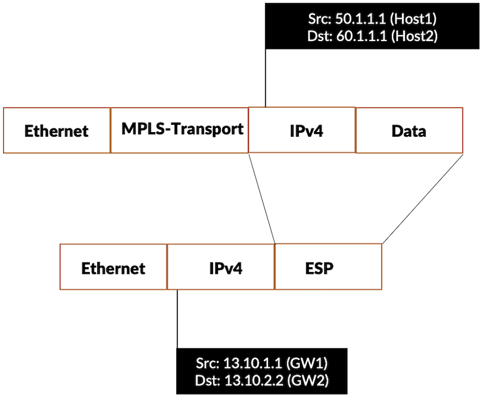

The IPv6 Route 3000:60:1:1::1 is as follows:

```
regress@PE1> show route 3000:60:1:1::1 

inet6.0: 209 destinations, 209 routes (209 active, 0 holddown, 0 hidden)
+ = Active Route, - = Last Active, * = Both

3000:60:1:1::/64   *[BGP/170] 3d 16:31:06, localpref 100, from 12.1.1.2
                      AS path: 20002 I, validation-state: unverified
                    >  via st0.1, Push 17
```

The detailed output shows the PNH as the IPv4 mapped IPv6 address, which got pointed to the secure tunnel interface

```
regress@PE1> show route 3000:60:1:1::1 extensive 

inet6.0: 209 destinations, 209 routes (209 active, 0 holddown, 0 hidden)
3000:60:1:1::/64 (1 entry, 1 announced)
TSI:
KRT in-kernel 3000:60:1:1::/64 -> {indirect(1048575)}
Page 0 idx 1, (group EBGPv6 type External) Type 1 val 0x2458ca78 (adv_entry)
   Advertised metrics:
     Nexthop: Self
     AS path: [64512] 20002 I
     Communities:
    Advertise: 00000001
Path 3000:60:1:1::
from 12.1.1.2
Vector len 4.  Val: 1
        *BGP    Preference: 170/-101
                Next hop type: Indirect, Next hop index: 0
                Address: 0xacf897c
                Next-hop reference count: 200
                Kernel Table Id: 0
                Source: 12.1.1.2
                Next hop type: Router, Next hop index: 606
                Next hop: via st0.1, selected
                Label operation: Push 17
                Label TTL action: prop-ttl
                Load balance label: Label 17: None; 
                Label element ptr: 0x13330c60
                Label parent element ptr: 0x0
                Label element references: 1
                Label element child references: 0
                Label element lsp id: 0
                Session Id: 16f
                Protocol next hop: ::ffff:12.1.1.2
                Label operation: Push 17
                Label TTL action: prop-ttl
                Load balance label: Label 17: None; 
                Indirect next hop: 0xadbbf88 1048575 INH Session ID: 378, INH non-key opaque: 0x0, INH key opaque: 0x0
                State: <Active Int Ext> 
                Local AS: 64512 Peer AS: 64512
                Age: 3d 16:31:10        Metric2: 0 
                Validation State: unverified 
                Task: BGP_64512.12.1.1.2
                Announcement bits (3): 0-KRT 1-BGP_RT_Background 7-Resolve tree 3 
                AS path: 20002 I 
                Accepted
                Route Label: 17
                Localpref: 100
                Router ID: 100.1.1.1
                Thread: junos-main 
                Indirect next hops: 1
                        Protocol next hop: ::ffff:12.1.1.2 ResolvState: Resolved TSP index: 3
                        Label operation: Push 17
                        Label TTL action: prop-ttl
                        Load balance label: Label 17: None; 
                        Indirect next hop: 0xadbbf88 1048575 INH Session ID: 378, INH non-key opaque: 0x0, INH key opaque: 0x0
                        Indirect path forwarding next hops: 1
                                Next hop type: Router
                                Next hop: via st0.1
                                Session Id: 16f
                                ::ffff:12.1.1.2/128 Originating RIB: inet6.0
                                  Node path count: 1
                                  Helper node: 0x16f23280 
                                  Forwarding nexthops: 1
                                        Next hop type: Router
                                        Next hop: via st0.1
                                        Session Id: 16f
```

The IPv6 Encrypted packet is as follows:

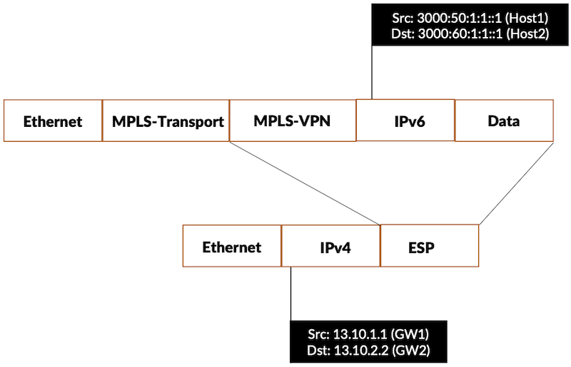

The packets hitting the st0.1 is as follows:

```
regress@PE1> show interfaces extensive st0.1 |match pps    
    Input  packets:                 1252                    0 pps
    Output packets:            169943767                10001 pps
     Input  packets:                1252                    0 pps
     Output packets:           169943767                10001 pps

regress@PE1>
```

The packets are send to Crypto Engine via the "SI-0/1/0.0" inside IFL

```
regress@PE1> show interfaces extensive si-0/1/0.0 |match pps    
    Input  packets:              4900014                10004 pps
    Output packets:                    0                    0 pps
     Input  packets:             4900014                10004 pps
     Output packets:                   0                    0 pps
     Input  packets:                   0                    0 pps
     Output packets:                   0                    0 pps
```

From the crypto, the packets are send to the "SI-0/1/0.1" outside IFL

```
regress@PE1> show interfaces extensive si-0/1/0.1 |match pps    
    Input  packets:              5200081                10001 pps
    Output packets:                    0                    0 pps
     Input  packets:             5200081                10001 pps
     Output packets:                   0                    0 pps
     Input  packets:                   0                    0 pps
     Output packets:                   0                    0 pps
```

The encrypted packet is sent to the forwarding nexthop

```
regress@PE1> show interfaces extensive ae0|match pps 
   Input  packets:                 1530                    2 pps
   Output packets:              5421597                10006 pps
   Input  packets:                    0                    0 pps
    Statistics        Packets        pps         Bytes          bps
```

The IPSec stats for the encrypted packet is as follows:

```
regress@PE1> show security ipsec statistics    
ESP Statistics:
  Encrypted bytes:         19718998
  Decrypted bytes:                0
  Encrypted packets:          39917
  Decrypted packets:              0
AH Statistics:
  Input bytes:                    0
  Output bytes:                   0
  Input packets:                  0
  Output packets:                 0
Errors:
  AH authentication failures: 0, Replay errors: 0
  ESP authentication failures: 0, ESP decryption failures: 0
  Bad headers: 0, Bad trailers: 0

regress@PE1>
```

### Packet Flow: Decryption

Encrypted packets hitting the WAN port ae1.0

```
regress@PE2> show interfaces extensive ae1 |match pps 
   Input  packets:            264104739                10005 pps
   Output packets:                72224                    3 pps
   Input  packets:                    0                    0 pps
    Statistics        Packets        pps         Bytes          bps
```

The long route points to the si outside ifl

```
regress@PE2> show interfaces extensive si-0/1/0.1 |match pps    
    Input  packets:            264418443                10004 pps
    Output packets:                    0                    0 pps
     Input  packets:           264418443                10004 pps
     Output packets:                   0                    0 pps
     Input  packets:                   0                    0 pps
     Output packets:                   0                    0 pps
```

On the decryption path, the packet wont take the si inside ifl, hence the packet pps is zero

```
regress@PE2> show interfaces extensive si-0/1/0.0 |match pps 
    Input  packets:                 1954                    0 pps
    Output packets:                    0                    0 pps
     Input  packets:                1954                    0 pps
     Output packets:                   0                    0 pps
     Input  packets:                   0                    0 pps
     Output packets:                   0                    0 pps
```

After the decryption, the packets hits the st0.1 interface

```
regress@PE2> show interfaces extensive st0.1 |match pps 
    Input  packets:            264495210                10005 pps
    Output packets:                 1955                    0 pps
     Input  packets:           264495210                10005 pps
     Output packets:                1955                    0 pps
     Input  packets:                   0                    0 pps
     Output packets:                   0                    0 pps
```

The lookup will lead to the forwarding nexthop towards the end destination network

```
regress@PE2> show interfaces extensive et-0/0/4.0 |match pps  
    Input  packets:                    0                    0 pps
    Output packets:            264695191                10005 pps
     Input  packets:                   0                    0 pps
     Output packets:           264693294                10005 pps
```

The decrypted packet status is as follows:

```
regress@PE2> show security ipsec statistics 
ESP Statistics:
  Encrypted bytes:                0
  Decrypted bytes:       1573985804
  Encrypted packets:              0
  Decrypted packets:        2889110
AH Statistics:
  Input bytes:                    0
  Output bytes:                   0
  Input packets:                  0
  Output packets:                 0
Errors:
  AH authentication failures: 0, Replay errors: 0
  ESP authentication failures: 0, ESP decryption failures: 0
  Bad headers: 0, Bad trailers: 0

regress@PE2> 
```

## EVPN-VXLAN over IPSec with P2P

EVPN-VXLAN is a modern data center and campus fabric technology that combines Ethernet VPN as the control plane with VXLAN as the overlay data plane to provide scalable Layer 2 and Layer 3 connectivity over an IP underlay network. In this model, VXLAN encapsulates Ethernet frames into UDP packets using a 24-bit VXLAN Network Identifier (VNI), allowing millions of isolated virtual networks that can span across racks, pods, or even multiple sites without relying on traditional spanning tree. EVPN uses MP-BGP to advertise MAC and IP reachability between VXLAN Tunnel Endpoints (VTEPs), enabling control-plane based MAC learning, reduced flooding, and features such as all-active multihoming and distributed anycast gateways for optimized east-west traffic. Together, EVPN and VXLAN deliver a highly scalable, multi-tenant, and resilient overlay fabric that is now a de facto standard for cloud data centers and large enterprise networks.

The VXLAN traffic can be secured with IPSec. In the below topology, EVPN-VXLAN is brought between the PE's and VXLAN traffic is tunneled via the IPSec.

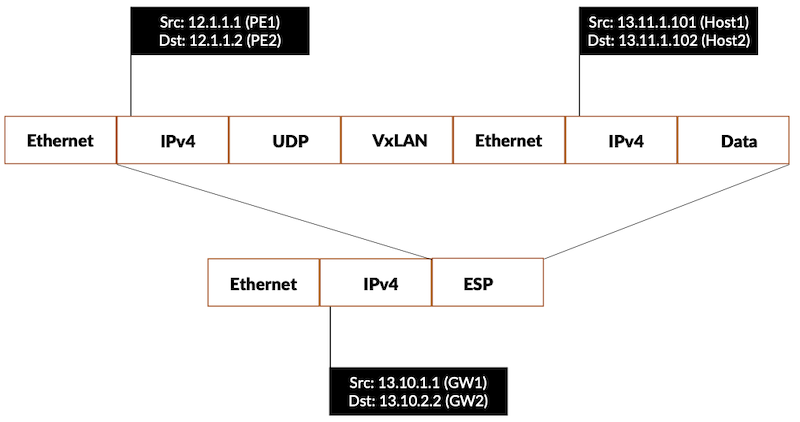

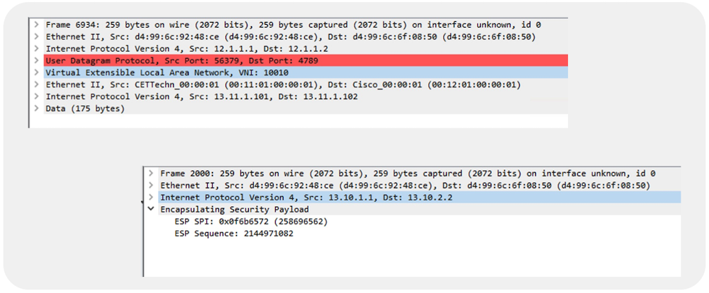

### PE1 Configuration

```
regress@PE1> show configuration groups IPSec_EVPN_VxLAN |no-more 
chassis {
    aggregated-devices {
        ethernet {
            device-count 30;
        }
    }
    fpc 0 {
        pic 1 {
            inline-services;
        }
    }
    network-services enhanced-ip;
}
services {
    service-set SS-EVPN-VxLAN {
        next-hop-service {
            inside-service-interface si-0/1/0.0;
            outside-service-interface si-0/1/0.1;
        }
        ipsec-vpn ipsec_evpn_vxlan;
    }
}
security {
    ike {
        proposal ike_proposal {
            description "IKE Proposal at PE1";
            authentication-method pre-shared-keys;
        }
        policy ike_policy {
            mode main;
            proposals ike_proposal;
            pre-shared-key ascii-text "$9$.fQ3ApBSrv69rvWLVb.P5Ft0SyeKWXVw"; ## SECRET-DATA
        }
        gateway ike_gw {
            ike-policy ike_policy;
            address 13.10.2.2;
            external-interface ae0;
            local-address 13.10.1.1;
            version v2-only;
        }
    }
    ipsec {
        proposal ipsec_proposal {
            extended-sequence-number;
            description "IPSec Proposal at PE1";
            protocol esp;
            encryption-algorithm aes-256-gcm;
        }
        policy ipsec_policy {
            proposals ipsec_proposal;
        }
        vpn ipsec_evpn_vxlan {
            bind-interface st0.1;
            copy-outer-dscp;
            ike {
                gateway ike_gw;
                anti-replay-window-size 4096;
                ipsec-policy ipsec_policy;
            }
            establish-tunnels immediately;
        }
    }
}
interfaces {
    lo0 {
        unit 0 {
            family inet {
                address 12.1.1.1/32;
            }
            family iso {
                address 49.0002.0120.0100.1001.00;
            }
            family inet6 {
                address 2002:12:1:1::1/128;
            }
        }
    }
    si-0/1/0 {
        mtu 9192;
        unit 0 {
            family inet;
            family inet6;
            service-domain inside;
        }
        unit 1 {
            family inet;
            family inet6;
            service-domain outside;
        }
    }
    st0 {
        unit 1 {
            family inet {
                mtu 9192;
                address 15.1.1.1/32;
            }
            family inet6 {
                mtu 9192;
            }
        }
    }
    et-0/2/10 {
        description "towards CE1 at IXIA";
        flexible-vlan-tagging;
        mtu 9192;
        encapsulation flexible-ethernet-services;
        unit 10 {
            encapsulation vlan-bridge;
            vlan-id 10;
        }
        unit 20 {
            encapsulation vlan-bridge;
            vlan-id 20;
        }
    }
    ae0 {
        description "Bundle to P1";
        mtu 9192;
        aggregated-ether-options {
            lacp {
                active;
                periodic fast;
            }
        }
        unit 0 {
            family inet {
                address 13.10.1.1/24;
            }
            family iso;
            family mpls;
        }
    }
    et-0/2/3 {
        gigether-options {
            802.3ad ae0;
        }
    }
    et-0/2/4 {
        gigether-options {
            802.3ad ae0;
        }
    }
    irb {
        mtu 9192;
        unit 10 {
            virtual-gateway-accept-data;
            family inet {
                address 13.11.1.1/24 {
                    virtual-gateway-address 13.11.1.254;
                }
            }
        }
        unit 20 {
            virtual-gateway-accept-data;
            family inet {
                address 13.11.2.1/24 {
                    virtual-gateway-address 13.11.2.254;
                }
            }
        }
    }
}
policy-options {
    policy-statement nhs {
        term nhs {
            then {
                next-hop self;
            }
        }
    }
    policy-statement pplb {
        term pplb {
            then {
                load-balance per-flow;
            }
        }
    }
}
routing-instances {
    evpn_vxlan_1 {
        instance-type mac-vrf;
        protocols {
            evpn {
                encapsulation vxlan;
                default-gateway no-gateway-community;
            }
        }
        vtep-source-interface lo0.0;
        bridge-domains {
            V_10 {
                vlan-id 10;
                interface et-0/2/10.10;
                routing-interface irb.10;
                vxlan {
                    vni 10010;
                }
            }
            V_20 {
                vlan-id 20;
                interface et-0/2/10.20;
                routing-interface irb.20;
                vxlan {
                    vni 10020;
                }
            }
        }
        service-type vlan-aware;
        route-distinguisher 12.1.1.1:1;
        vrf-target target:64512:1;
    }
    vrf_1 {
        instance-type vrf;
        interface irb.10;
        interface irb.20;
        route-distinguisher 12.1.1.1:10;
        vrf-target target:64512:10;
    }
}
protocols {
    bgp {
        group IBGP {
            type internal;
            local-address 12.1.1.1;
            family evpn {
                signaling;
            }
            neighbor 12.1.1.2;
        }
    }
    isis {
        interface lo0.0 {
            passive;
        }
        interface ae0.0 {
            level 1 disable;
            point-to-point;
        }
        level 1 disable;
        level 2 wide-metrics-only;
    }
    lldp {
        interface et-0/1/4;
        interface ae0;
    }
}
routing-options {
    router-id 12.1.1.1;
    autonomous-system 64512;
    static {
        route 12.1.1.2/32 next-hop st0.1;
    }
    forwarding-table {
        export pplb;
    }
}
```

### PE2 Configuration

```
regress@PE2> show configuration groups IPSec_EVPN_VxLAN |no-more 
chassis {
    aggregated-devices {
        ethernet {
            device-count 30;
        }
    }
    fpc 0 {
        pic 1 {
            inline-services;
        }
    }
    network-services enhanced-ip;
}
services {
    service-set SS-EVPN-VxLAN {
        next-hop-service {
            inside-service-interface si-0/1/0.0;
            outside-service-interface si-0/1/0.1;
        }
        ipsec-vpn ipsec_evpn_vxlan;
    }
}
security {
    ike {
        proposal ike_proposal {
            description "IKE Proposal at PE2";
            authentication-method pre-shared-keys;
        }
        policy ike_policy {
            mode main;
            proposals ike_proposal;
            pre-shared-key ascii-text "$9$fQ3/uORlK8CtK8X7sYfTz601leMWXNs2"; ## SECRET-DATA
        }
        gateway ike_gw {
            ike-policy ike_policy;
            address 13.10.1.1;
            external-interface ae1;
            local-address 13.10.2.2;
            version v2-only;
        }
    }
    ipsec {
        proposal ipsec_proposal {
            extended-sequence-number;
            description "IPSec Proposal at PE2";
            protocol esp;
            encryption-algorithm aes-256-gcm;
        }
        policy ipsec_policy {
            proposals ipsec_proposal;
        }
        vpn ipsec_evpn_vxlan {
            bind-interface st0.1;
            copy-outer-dscp;
            ike {
                gateway ike_gw;
                anti-replay-window-size 4096;
                ipsec-policy ipsec_policy;
            }
            establish-tunnels immediately;
        }
    }
}
interfaces {
    lo0 {
        unit 0 {
            family inet {
                address 12.1.1.2/32;
            }
            family iso {
                address 49.0002.0120.0100.1002.00;
            }
            family inet6 {
                address 2002:12:1:1::2/128;
            }
        }
    }
    si-0/1/0 {
        mtu 9192;
        unit 0 {
            family inet;
            family inet6;
            service-domain inside;
        }
        unit 1 {
            family inet;
            family inet6;
            service-domain outside;
        }
    }
    st0 {
        unit 1 {
            family inet {
                mtu 9192;
                address 15.1.1.2/32;
            }
            family inet6 {
                mtu 9192;
            }
        }
    }
    et-0/0/4 {
        description "towards CE2 at IXIA";
        flexible-vlan-tagging;
        mtu 9192;
        encapsulation flexible-ethernet-services;
        unit 10 {
            encapsulation vlan-bridge;
            vlan-id 10;
        }
        unit 20 {
            encapsulation vlan-bridge;
            vlan-id 20;
        }
    }
    ae1 {
        description "bundle to P1";
        mtu 9192;
        aggregated-ether-options {
            lacp {
                active;
                periodic fast;
            }
        }
        unit 0 {
            family inet {
                address 13.10.2.2/24;
            }
            family iso;
            family mpls;
        }
    }
    et-0/0/10 {
        gigether-options {
            802.3ad ae1;
        }
    }
    et-0/0/11 {
        gigether-options {
            802.3ad ae1;
        }
    }
    irb {
        mtu 9192;
        unit 10 {
            virtual-gateway-accept-data;
            family inet {
                address 13.11.1.2/24 {
                    virtual-gateway-address 13.11.1.254;
                }
            }
        }
        unit 20 {
            virtual-gateway-accept-data;
            family inet {
                address 13.11.2.2/24 {
                    virtual-gateway-address 13.11.2.254;
                }
            }
        }
    }
}
policy-options {
    policy-statement pplb {
        term pplb {
            then {
                load-balance per-flow;
            }
        }
    }
    policy-statement nhs {
        term nhs {
            then {
                next-hop self;
            }
        }
    }
}
routing-instances {
    evpn_vxlan_1 {
        instance-type mac-vrf;
        protocols {
            evpn {
                encapsulation vxlan;
                default-gateway no-gateway-community;
            }
        }
        vtep-source-interface lo0.0;
        bridge-domains {
            V_10 {
                vlan-id 10;
                interface et-0/0/4.10;
                routing-interface irb.10;
                vxlan {
                    vni 10010;
                }
            }
            V_20 {
                vlan-id 20;
                interface et-0/0/4.20;
                routing-interface irb.20;
                vxlan {
                    vni 10020;
                }
            }
        }
        service-type vlan-aware;
        route-distinguisher 12.1.1.2:1;
        vrf-target target:64512:1;
    }
    vrf_1 {
        instance-type vrf;
        interface irb.10;
        interface irb.20;
        route-distinguisher 12.1.1.2:10;
        vrf-target target:64512:10;
    }
}
protocols {
    bgp {
        group IBGP {
            type internal;
            local-address 12.1.1.2;
            family evpn {
                signaling;
            }
            neighbor 12.1.1.1;
        }
    }
    isis {
        interface lo0.0 {
            passive;
        }
        interface ae1.0 {
            level 1 disable;
            point-to-point;
        }
        level 1 disable;
        level 2 wide-metrics-only;
    }
    lldp {
        interface et-0/1/4;
        interface ae1;
    }
}
routing-options {
    router-id 12.1.1.2;
    autonomous-system 64512;
    static {
        route 12.1.1.1/32 next-hop st0.1;
    }
    forwarding-table {
        export pplb;
    }
}
```

### P1 Configuration

```
regress@P1> show configuration groups IPSec_EVPN_VxLAN |no-more 
chassis {
    aggregated-devices {
        ethernet {
            device-count 30;
        }
    }
    network-services enhanced-ip;
}
interfaces {
    ae0 {
        description "Bundle to PE1";
        mtu 9192;
        aggregated-ether-options {
            lacp {
                active;
                periodic fast;
            }
        }
        unit 0 {
            family inet {
                address 13.10.1.2/24;
            }
            family iso;
        }
    }
    et-0/2/0 {
        gigether-options {
            802.3ad ae0;
        }
    }
    et-0/2/1 {
        gigether-options {
            802.3ad ae0;
        }
    }
    lo0 {
        unit 0 {
            family inet {
                address 12.1.1.3/32;
            }
            family iso {
                address 49.0002.0120.0100.1003.00;
            }
            family inet6 {
                address 2002:12:1:1::3/128;
            }
        }
    }
    ae1 {
        description "Bundle to PE2";
        mtu 9192;
        aggregated-ether-options {
            lacp {
                active;
                periodic fast;
            }
        }
        unit 0 {
            family inet {
                address 13.10.2.1/24;
            }
            family iso;
        }
    }
    et-0/0/0 {
        gigether-options {
            802.3ad ae1;
        }
    }
    et-0/2/2 {
        gigether-options {
            802.3ad ae1;
        }
    }
}
policy-options {
    policy-statement pplb {
        term pplb {
            then {
                load-balance per-flow;
            }
        }
    }
}
routing-options {
    router-id 12.1.1.3;
    autonomous-system 64512;
    forwarding-table {
        export pplb;
    }
}
protocols {
    isis {
        interface lo0.0 {
            passive;
        }
        interface ae0.0 {
            level 1 disable;
            point-to-point;
        }
        interface ae1.0 {
            level 1 disable;
            point-to-point;
        }
        level 1 disable;
        level 2 wide-metrics-only;
    }
    lldp {
        interface ae0;
        interface ae1;
    }
}
```

### EVPN-VXLAN Verification

```
regress@PE1> show bgp summary 
Threading mode: BGP I/O
Default eBGP mode: advertise - accept, receive - accept
Groups: 1 Peers: 1 Down peers: 0
Table          Tot Paths  Act Paths Suppressed    History Damp State    Pending
bgp.evpn.0           
                      13         13          0          0          0          0
Peer                     AS      InPkt     OutPkt    OutQ   Flaps Last Up/Dwn State|#Active/Received/Accepted/Damped...
12.1.1.2              64512       3041       3047       0       0    22:39:39 Establ
  bgp.evpn.0: 13/13/13/0
  evpn_vxlan_1.evpn.0: 13/13/13/0
  __default_evpn__.evpn.0: 0/0/0/0
```

The MAC-VRF database capturing the mac and IP bindings are as follows:

```
regress@PE1> show mac-vrf routing database   
Instance: evpn_vxlan_1
VLAN  DomainId  MAC address        Active source                  Timestamp        IP address
     10010      00:00:5e:00:01:01  05:00:00:fc:00:00:00:27:1a:00  Nov 27 20:54:39  13.11.1.254
     10010      00:11:01:00:00:01  et-0/2/10.10                   Nov 27 20:52:40
     10010      00:12:01:00:00:01  12.1.1.2                       Nov 27 20:54:39
     10010      a4:7f:1b:ce:2a:91  12.1.1.2                       Nov 27 20:54:39  13.11.1.2
     10010      d4:99:6c:92:48:fc  irb.10                         Nov 27 20:52:40  13.11.1.1
     10020      00:00:5e:00:01:01  05:00:00:fc:00:00:00:27:24:00  Nov 27 20:54:39  13.11.2.254
     10020      a4:7f:1b:ce:2a:91  12.1.1.2                       Nov 27 20:54:39  13.11.2.2
     10020      d4:99:6c:92:48:fc  irb.20                         Nov 27 20:52:40  13.11.2.1

regress@PE1> show mac-vrf forwarding mac-ip-table                   

MAC IP flags  (S - Static, D - Dynamic, L - Local , R - Remote, Lp - Local Proxy,
               Rp - Remote Proxy,  K - Kernel, RT - Dest Route, (N)AD - (Not) Advt to remote,
               RE - Re-ARP/ND, RO - Router, OV - Override, Ur - Unresolved, B - Blocked,
               RTS - Dest Route Skipped, RGw - Remote Gateway, RTF - Dest Route Forced,
               SC - Static Config, P - Probe, NLC - No Local Config, LD - Local Down)
 Routing instance : evpn_vxlan_1
 Bridging domain : V_10
   IP                           MAC                  Flags              GBP    Logical            Active
   address                      address                                 Tag    Interface          source
   13.11.1.254                  00:00:5e:00:01:01    S,K                       irb.10          
   13.11.1.2                    a4:7f:1b:ce:2a:91    SR,K,RT                   vtep.32769         12.1.1.2                      
   13.11.1.1                    d4:99:6c:92:48:fc    S,K                       irb.10          

MAC IP flags  (S - Static, D - Dynamic, L - Local , R - Remote, Lp - Local Proxy,
               Rp - Remote Proxy,  K - Kernel, RT - Dest Route, (N)AD - (Not) Advt to remote,
               RE - Re-ARP/ND, RO - Router, OV - Override, Ur - Unresolved, B - Blocked,
               RTS - Dest Route Skipped, RGw - Remote Gateway, RTF - Dest Route Forced,
               SC - Static Config, P - Probe, NLC - No Local Config, LD - Local Down)
 Routing instance : evpn_vxlan_1
 Bridging domain : V_20
   IP                           MAC                  Flags              GBP    Logical            Active
   address                      address                                 Tag    Interface          source
   13.11.2.254                  00:00:5e:00:01:01    S,K                       irb.20          
   13.11.2.2                    a4:7f:1b:ce:2a:91    SR,K,RT                   vtep.32769         12.1.1.2                      
   13.11.2.1                    d4:99:6c:92:48:fc    S,K                       irb.20          
```

The IPSec stats captures the packets encrypted and decrypted

```
regress@PE1> show security ipsec statistics 
ESP Statistics:
  Encrypted bytes:   21879502721116
  Decrypted bytes:   24148488261124
  Encrypted packets:    40517598197
  Decrypted packets:    40517598266
AH Statistics:
  Input bytes:                    0
  Output bytes:                   0
  Input packets:                  0
  Output packets:                 0
Errors:
  AH authentication failures: 0, Replay errors: 0
  ESP authentication failures: 0, ESP decryption failures: 0
  Bad headers: 0, Bad trailers: 0
```

## Scale and Performance of Inline IPSec

### Inline IPSec Scale

Trio 6 based MX platforms support 2,000 Inline IPSec Tunnels per chassis. Each PFE supports 1,000 tunnels. The throughput supported is 600Gbps per Trio 6 ASIC.  The scale of the tunnels is covered with inline IPSec's traffic selection mode. In the traffic selector mode, we explicitly map the source and destination addresses in the IPSec VPN and there is no requirement to map the route to st0 via static route. IKED adds a route based on the remote-ip, instead of user adding a static route or BGP/IGP adding routes. Traffic Selector mode provides more granularity to steer the traffic of specific interest to a IPVPN tunnel.

```
security {
    ipsec {
        vpn ipsec_vpn_v4_srv6 {
            bind-interface st0.1;
            copy-outer-dscp;
            ike {
                gateway ike_gw;
                anti-replay-window-size 4096;
                ipsec-policy ipsec_policy;
            }
            traffic-selector ts1 {
                local-ip 50.1.0.0/16;
                remote-ip 60.1.0.0/16;
            }
            establish-tunnels immediately;
        }                               
        vpn ipsec_vpn_v6_srv6 {
            bind-interface st0.2;
            copy-outer-dscp;
            ike {
                gateway ike_gw;
                anti-replay-window-size 4096;
                ipsec-policy ipsec_policy;
            }
            traffic-selector ts2 {
                local-ip 3000:50:1::/48;
                remote-ip 3000:60:1::/48;
            }
            establish-tunnels immediately;
        }
    }
}
```

In the test topology 2,000 virtual routers are created in the CE which forms the ebgp peering with the PE devices. Inline IPSec tunnel is setup between the respective CE's with traffic selector mode, 1,000 tunnels created from PFE0 (si-2/1/0) and 1,000 tunnels created from PFE1(si-2/1/2)

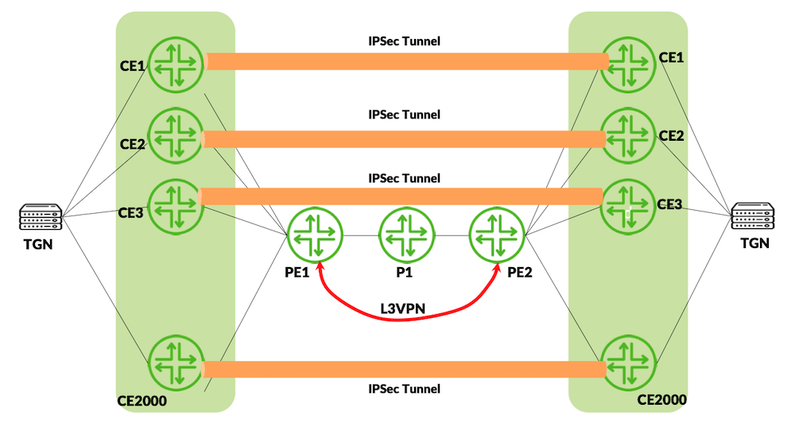

```
{master}
regress@ce1> show security ike security-associations |match UP | count 
Count: 2000 lines

regress@ce1> show security ipsec security-associations 
  Total active tunnels: 2000  Total IPsec sas: 2000
  ID      Algorithm       SPI      Life:sec/kb  Mon lsys Port  Gateway
  <508816 ESP:aes-gcm-256/aes256-gcm 0x78cb23e5 799/ unlim - root 500 173.8.209.1     
  >508816 ESP:aes-gcm-256/aes256-gcm 0x8d71f1b3 799/ unlim - root 500 173.8.209.1     
  <506755 ESP:aes-gcm-256/aes256-gcm 0x90774003 1244/ unlim - root 500 173.5.49.1      
  >506755 ESP:aes-gcm-256/aes256-gcm 0xd5045f3c 1244/ unlim - root 500 173.5.49.1      
...
...
  <507441 ESP:aes-gcm-256/aes256-gcm 0x49a8adb8 2019/ unlim - root 500 173.3.176.1     
  >507441 ESP:aes-gcm-256/aes256-gcm 0x1826ec5c 2019/ unlim - root 500 173.3.176.1     
  <507732 ESP:aes-gcm-256/aes256-gcm 0xe397fe4b 1963/ unlim - root 500 173.3.53.1      
  >507732 ESP:aes-gcm-256/aes256-gcm 0x9bfd9333 1963/ unlim - root 500 173.3.53.1      
                                        
{master}
regress@ce1> 

{master}
regress@ce1> show interfaces st0 terse |match inet | count |except inet6 
Count: 2000 lines

{master}
regress@ce1> show interfaces terse si-2/1/0 |except inet6 | count 
Count: 2002 lines

{master}
regress@ce1> show interfaces terse si-2/1/2 |except inet6 | count 
Count: 2002 lines

{master}
regress@ce1> show security ipsec statistics            
ESP Statistics:
  Encrypted bytes:       2596055034
  Decrypted bytes:       2739372792
  Encrypted packets:        2654453
  Decrypted packets:        2654431
AH Statistics:
  Input bytes:                    0
  Output bytes:                   0
  Input packets:                  0
  Output packets:                 0
Errors:
  AH authentication failures: 0, Replay errors: 0
  ESP authentication failures: 0, ESP decryption failures: 0
  Bad headers: 0, Bad trailers: 0
```

## Inline IPSec Performance

MX304 inline IPSec provides 300Gbps bandwidth per PFE and IPv4 and IPv6 performance on a single PFE is captured as follows. Total thoughput per Trio 6 is 600Gbps

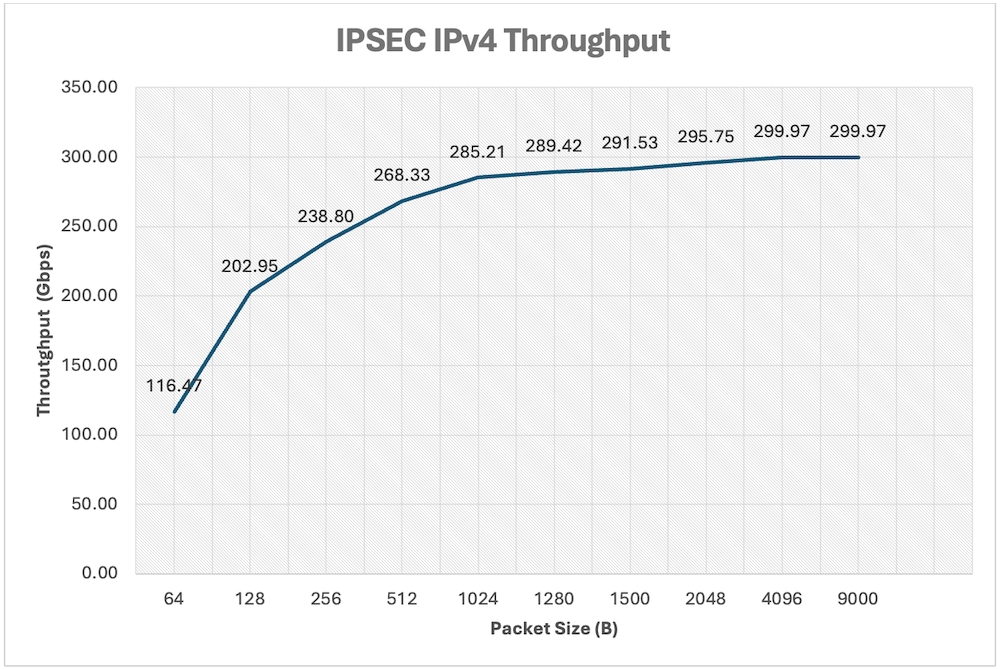

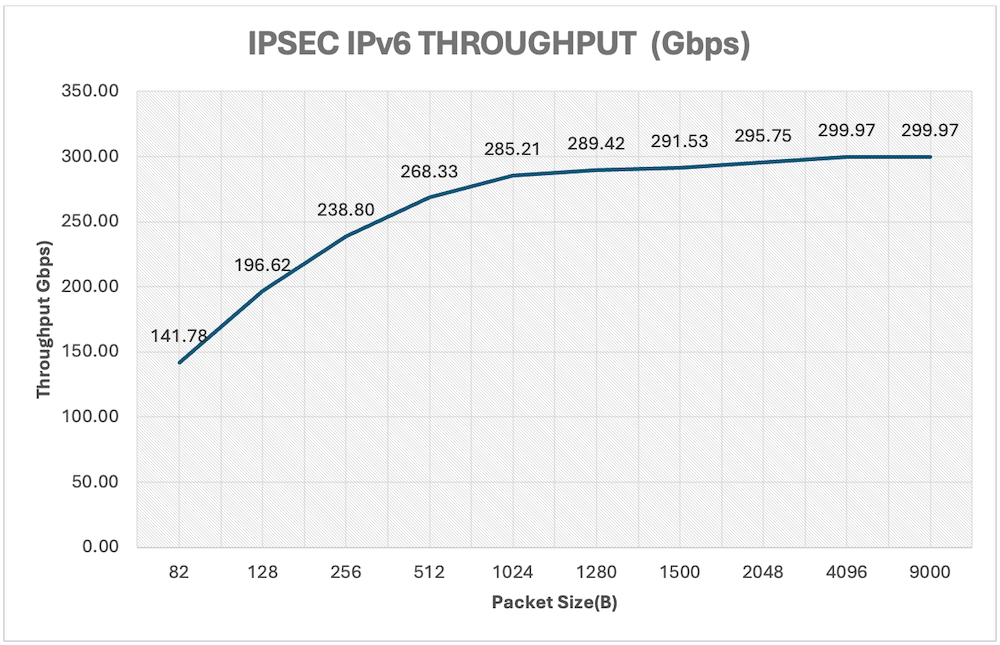

## Useful links

- [https://www.juniper.net/documentation/us/en/software/junos/interfaces-adaptive-services/topics/topic-map/inline-ipsec.html](https://www.juniper.net/documentation/us/en/software/junos/interfaces-adaptive-services/topics/topic-map/inline-ipsec.html)

## Glossary

- AES: Advanced Encryption Standard
- CPU: Central Processing Unit, the general-purpose processor of the router (implied, contrasted with PFE)
- DPD: Dead Peer Detection, a mechanism to verify the liveliness of the IKE peer to prevent black-holing of IPsec traffic.
- ESP: Encapsulating Security Payload, the IPsec protocol used for encrypting and ensuring the integrity of tunneled data.
- IKE: Internet Key Exchange, the protocol used to negotiate cryptographic keys and establish Security Associations (SAs) for IPsec.
- IKEv2: Version 2 of IKE, the modern version of the key-management protocol supported by inline IPsec on MX platforms.
- SA: Security Association, a one-way agreement between two endpoints that defines the IPsec protections (encryption, integrity, keys, lifetime) for traffic.
- SI: Service Interface, a virtual interface on the PFE used as the anchor for inline services (like IPsec) without requiring external service cards.
- SPI: Security Parameter Index, a unique identifier for an SA on a host or router.
- USF: Unified Services Framework, a configuration mode on MX routers that must be enabled to support inline IPsec (instead of relying on external service cards).

## Acknowledgments

I would like to thank my co-author Poorna Pushkala Balasubramanian for sharing the insights of the implementation and countless hours of support. I also extend my thanks to Sanjeev Venkatrao and Vidya Sagar Chitturi, who performed the scale and performance tests and also to the reviewers Arnav Shrivastava , VimalKumar Patel, David Roy, Nikhil Rao, Sandeep Patel and Nicolas Fevrier.
