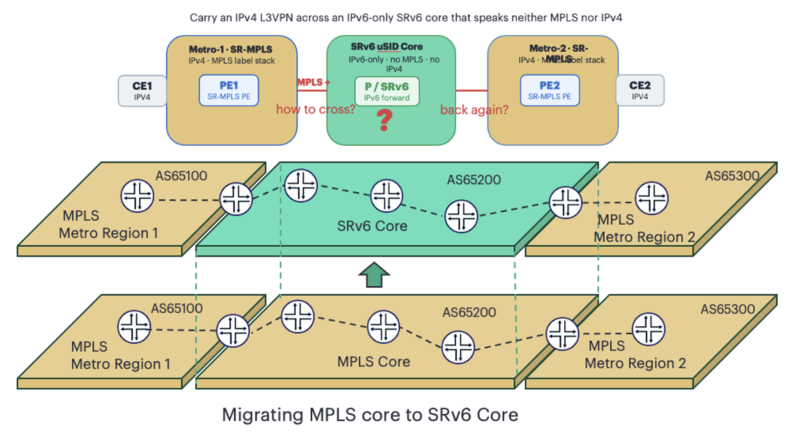
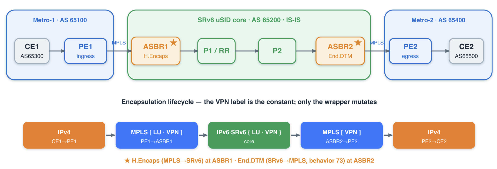
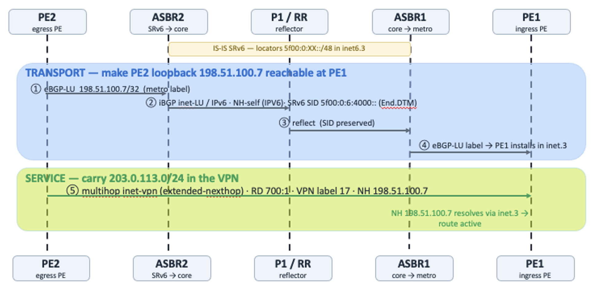
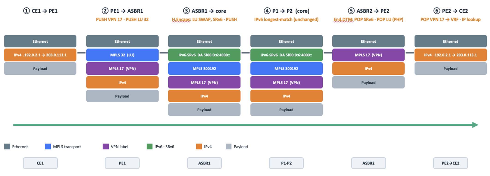

# Stitching Two Worlds: IPv4 L3VPN Inter-AS (Option C) over an IPv6-Only SRv6 uSID Core and Metro MPLS

**Pankaj Kumar - 07/26/2026**

## Introduction

In L3VPN-over-SRv6 design, the metros and the core speak the same transport: IPv6 with Segment Routing. Production networks are rarely that tidy. Most operators run large, mature SR-MPLS metros and want to slide a modern SRv6 core underneath them: without a flag day and without rebuilding the metros.

This post shows how to carry a customer IPv4 L3VPN end-to-end across two SR-MPLS metros that are glued together by an IPv6-only SRv6 uSID core, using MPLS-over-SRv6 (Mo6) transport interworking and Inter-AS Option C. The two border routers do all the heavy lifting: they encapsulate MPLS into SRv6 on the way in (H.Encaps) and decapsulate SRv6 back to MPLS on the way out (End.DTM). The customer never knows; the core never sees an IPv4 address.

Everything below is captured from a vmx based lab (CE1--CE2).

Tech post flow in natural order: problem -> solution -> configuration -> verification -> control-plane and data-plane walkthrough.

Three ideas to keep in mind throughout:

- Option C => the VPN label is assigned once by the egress PE and preserved end-to-end; the borders never touch it.
- BGP-LU => the core and borders hold no customer/VPN routes: only PE loopbacks plus a transport label. State is O(#PEs).
- Standards-based => End.DTM, H.Encaps, BGP-LU and Option C are all IETF-defined, so multivendor interop is a given.

## Problem Statement

You operate large, brownfield SR-MPLS metros. Transport there is an MPLS label stack: deployed, mature, working. You are now introducing an SRv6 core, where transport is native IPv6 and forwarding is a longest-match on an SRv6 locator. These are two different transport data planes, and they meet in the middle of your network:

| AAA | Metro(Today) | Core(Target) |
|:--|:--|:--|
| Transport | SR-MPLS (label stack) | SRv6 uSID (IPv6-only) |
| Forwarding | label swap / pop | longest-match on the locator |
| Encapsulation | [transport][VPN][IP] | IPv6(DA=uSID){[bgp-LU][VPN][IP]} |

A customer L3VPN must ride end-to-end across both, from a CE in metro-1 to a CE in metro-2, while the transport encapsulation changes mid-path: and it must happen without ripping and replacing the metros to light up the core.



The customer service is IPv4 L3VPN; the core is IPv6-only.
So the question is: who translates MPLS <-> SRv6, where, and how does the VPN service survive the handoff: over a core that carries no IPv4 at all?

## Solution Overview

MPLS-over-SRv6 (Mo6) transport interworking + Inter-AS Option C. The two ASBRs become the translators. At the metro->core border, the ASBR takes the MPLS-encapsulated VPN packet and H.Encaps it into SRv6, toward the far border's locator. At the core->metro border, the ASBR runs the End.DTM SID behavior: Endpoint with Decapsulation and MPLS table lookup: to strip SRv6 and hand a clean MPLS packet back to the metro. Because it is Option C, the VPN label is end-to-end: the egress PE assigns it, the ingress PE pushes it, and the borders only ever touch transport.

Two Junos primitives close the two gaps that an IPv6-only core creates:

- family inet labeled-unicast ... local-ipv4-address: lets the IPv4 PE-loopback transport route ride the IPv6-only iBGP session (carrying its SRv6 End.DTM SID).
- family inet-vpn unicast extended-nexthop: lets the IPv4 VPN service route ride a direct PE-to-PE session with an IPv6-encoded next hop (RFC 8950).



The two ★ borders are the only places transport changes; the VPN label (Option C) is constant from PE1 to PE2.

The whole design in one line: IP -> MPLS[LU|VPN] -> IPv6+SRv6{[LU|VPN]} -> MPLS[VPN] -> IP: the VPN label is the constant; only the transport wrapper mutates, and only at the two ASBRs.

## How We Solve It: the CLI, in Bullets

Before the full configuration, here is the shortlist of the exact knobs that make each piece work:

- SRv6 core identity: routing-options source-packet-routing srv6 block/locator + IS-IS source-packet-routing srv6 locator ... micro-node-sid (each core node gets a 5f00:0:XX::/48 locator, flavor usd).
- The MPLS<->SRv6 stitch: protocols bgp source-packet-routing srv6 locator SL-USID1 end-dtm-sid on each ASBR (this is H.Encaps in / End.DTM out, SID behavior 73). MPLS is enabled only on the metro-facing interface.
- IPv4 transport across the IPv6 core: core iBGP family inet labeled-unicast { advertise-srv6-service; accept-srv6-service; } plus neighbor <v6> family inet labeled-unicast local-ipv4-address <A.B.C.D> + global rfc8950-compliant. This is the key trick: IPv4 NLRI riding an IPv6 iBGP session.
- Metro transport: eBGP-LU family inet labeled-unicast resolve-vpn on the PE (so the far PE loopback lands in inet.3 for VPN resolution).
- The VPN service: direct multihop family inet-vpn unicast extended-nexthop between PE loopbacks (Option C, end-to-end VPN label).
- The customer edge: plain family inet unicast PE-CE eBGP; the CE is IPv4-only.

The next two sections show all of this: first every Configuration, then every Verification.

## Configuration

Addressing (documentation ranges only: RFC 5737 / 3849 / 9602):

| Plane | Value |
|:--|:--|
| Core loopbacks (IPv6-only) | ASBR1::2, P1/RR ::4, P2 ::5, ASBR2 ::6 (2001:db8:bad:cafe::/64) |
| SRv6 block / locators | block5f00:0::/32; locator 5f00:0:XX::/48; End.DTM 5f00:0:6:4000:: (ASBR2) |
| PE loopbacks (IPv4) | PE1198.51.100.1, PE2 198.51.100.7 |
| Customer prefixes | CE1192.0.2.0/24, CE2 203.0.113.0/24 |
| AS | CE1 65300 , PE1 65100 ,Core 65200 , PE2 65400 , CE2 65500 |

## C1: SRv6 core (each core node; locator value differs)

```
#Config Block and Locator
set routing-options source-packet-routing srv6 block BL-BLOCK 5f00:0::/32
set routing-options source-packet-routing srv6 block BL-BLOCK global-micro-sid maximum-sids 16384
set routing-options source-packet-routing srv6 block BL-BLOCK global-micro-sid maximum-static-sids 1000
set routing-options source-packet-routing srv6 block BL-BLOCK local-micro-sid maximum-static-sids 1000
set routing-options source-packet-routing srv6 locator SL-USID1 5f00:0:2::/48
set routing-options source-packet-routing srv6 locator SL-USID1 micro-sid block-name BL-BLOCK
set routing-options source-packet-routing srv6 locator SL-USID1 micro-sid flavor usd

#Advertise Locator in ISIS
set protocols isis interface lo0.0 passive
set protocols isis source-packet-routing srv6 locator SL-USID1 micro-node-sid
set protocols isis level 1 disable
set protocols isis level 2 wide-metrics-only
```

Configuration 1: SRv6 block + locator, advertised into IS-IS as a micro-node-SID.

## C2: the ASBR MPLS<->SRv6 stitch (both ASBRs)

```
# THE STITCH: End.DTM service SID from the locator
set protocols bgp source-packet-routing srv6 locator SL-USID1 end-dtm-sid
## MPLS only on the metro-facing interface (core side is pure IPv6)
set interfaces ge-0/0/0 unit 0 family mpls
set protocols mpls interface ge-0/0/0.0
```

Configuration 2: one line turns the ASBR into an MPLS<->SRv6 translator.

## C3: core iBGP: IPv4 transport over the IPv6 core

```
## ASBR1 -> RR (mirror on ASBR2; RR peers both ASBRs)
set protocols bgp group GR-TO-RR type internal
set protocols bgp group GR-TO-RR local-address 2001:db8:bad:cafe::2
set protocols bgp group GR-TO-RR family inet labeled-unicast advertise-srv6-service
set protocols bgp group GR-TO-RR family inet labeled-unicast accept-srv6-service
set protocols bgp group GR-TO-RR neighbor 2001:db8:bad:cafe::4 family inet labeled-unicast local-ipv4-address 10.10.10.1 <This IPv4 no role In Routing and Traffic forwarding>

## ASBR1 -> PE1 (mirror on ASBR2)
set protocols bgp group GR-TO-PE1-V4 type external
set protocols bgp group GR-TO-PE1-V4 local-address 198.51.100.13
set protocols bgp group GR-TO-PE1-V4 neighbor 198.51.100.12 family inet labeled-unicast <BLP-LU exchange>
set protocols bgp group GR-TO-PE1-V4 neighbor 198.51.100.12 peer-as 65100
set protocols bgp group GR-TO-PE1-V4 neighbor 198.51.100.12 local-as 65200
```

Configuration 3: the key: IPv4 labeled-unicast on an IPv6 iBGP session via local-ipv4-address (ASBR1 10.10.10.1, RR 11.11.11.11, ASBR2 12.12.12.12, Keep in mind these IPv4 address have no role in the routing or Data forwarding.Consider as dummy IPs).

## C4: metro eBGP-LU (Option C)

```
# PE1 -> ASBR1
set protocols bgp group GR-TO-ASBR1-V4 type external
set protocols bgp group GR-TO-ASBR1-V4 local-address 198.51.100.12
set protocols bgp group GR-TO-ASBR1-V4 export PS-LO0-EXPORT4
set protocols bgp group GR-TO-ASBR1-V4 neighbor 198.51.100.13 family inet labeled-unicast resolve-vpn
set protocols bgp group GR-TO-ASBR1-V4 neighbor 198.51.100.13 peer-as 65200 local-as 65100
```

Configuration 4: metro BGP-LU with resolve-vpn so the remote PE loopback resolves VPN next hops.

## C5: the PE<->PE L3VPN (Option C, inet-vpn)

```
## PE1 (mirror on PE2)
set protocols bgp group GR-TO-PE2 type external
set protocols bgp group GR-TO-PE2 multihop ttl 15
set protocols bgp group GR-TO-PE2 local-address 198.51.100.1
set protocols bgp group GR-TO-PE2 neighbor 198.51.100.7 family inet-vpn unicast extended-nexthop
set protocols bgp group GR-TO-PE2 neighbor 198.51.100.7 peer-as 65400 local-as 65100
```

Configuration 5: direct multihop inet-vpn session; extended-nexthop carries VPN-IPv4 with an IPv6 next hop.

## C6: VRF + PE-CE, and the CE

```
## PE1 VRF (mirror on PE2)
set routing-instances RI-VPN1 instance-type vrf
set routing-instances RI-VPN1 interface ge-0/0/2.0
set routing-instances RI-VPN1 route-distinguisher 100:1
set routing-instances RI-VPN1 vrf-import PS-VPN1-IMPORT
set routing-instances RI-VPN1 vrf-export PS-VPN1-EXPORT
set routing-instances RI-VPN1 vrf-table-label
set routing-instances RI-VPN1 protocols bgp group GR-TO-CE1-V4 type external
set routing-instances RI-VPN1 protocols bgp group GR-TO-CE1-V4 local-address 198.51.100.11
set routing-instances RI-VPN1 protocols bgp group GR-TO-CE1-V4 neighbor 198.51.100.10 family inet unicast
set routing-instances RI-VPN1 protocols bgp group GR-TO-CE1-V4 neighbor 198.51.100.10 peer-as 65300 local-as 65100
## CE1 (mirror on CE2 with 203.0.113.0/24)
set routing-options static route 192.0.2.0/24 discard
set protocols bgp group GR-TO-PE1-V4 type external
set protocols bgp group GR-TO-PE1-V4 local-address 198.51.100.10 export PS-ADV-CE1
set protocols bgp group GR-TO-PE1-V4 neighbor 198.51.100.11 family inet unicast peer-as 65100 local-as 65300
```

Configuration 6: the VRF, the IPv4 PE-CE session, and the customer prefix on the CE.

## Verification

V1: the SRv6 underlay: locators reachable as SRv6 tunnels

```
root@ASBR1> show route table inet6.3
5f00:0:4::/48     *[SRV6-ISIS/14]     >     to fe80::...:47a6 via ge-0/0/2.0, SRV6-Tunnel, Dest: 5f00:0:4::
5f00:0:5::/48     *[SRV6-ISIS/14]     >     to fe80::...:47a6 via ge-0/0/2.0, SRV6-Tunnel, Dest: 5f00:0:5::
5f00:0:6::/48     *[SRV6-ISIS/14]     >     to fe80::...:47a6 via ge-0/0/2.0, SRV6-Tunnel, Dest: 5f00:0:6::
```

CLI-Output 1: every core locator reachable via an SRv6 tunnel.

V2: IPv4 NLRI riding the IPv6 core session

```
root@ASBR1> show bgp summary
Peer                     AS   ...  State|#Active/Received/Accepted/...
198.51.100.12         65100  ...  Establ   inet.0: 1/1/1/0        (metro eBGP-LU)
2001:db8:bad:cafe::4  65200  ...  Establ   inet.0: 1/1/1/0        <-- IPv4 over an IPv6 iBGP peer
```

CLI-Output 2: the peer is an IPv6 loopback, the family table is inet.0 (IPv4).

V3: the IPv4 transport route arrives with its SRv6 SID

```
root@P1_RR> show route receive-protocol bgp 2001:db8:bad:cafe::6 198.51.100.7/32 detail
* 198.51.100.7/32
     Route Label: 300192
     Nexthop: 12.12.12.12
     SRv6 SID: 5f00:0:6:4000:: Prefix-SID tlv type: 7 Behavior: 73 BL: 32 NL: 16 FL: 16
```

CLI-Output 3: IPv4 loopback + End.DTM SID 5f00:0:6:4000:: (behavior 73), next hop = ASBR2's local-ipv4-address.

V4: the stitch in the forwarding plane (ASBR1)

```
root@ASBR1> show route 198.51.100.7/32 extensive
   Advertised metrics:  Nexthop: Self   Label: 32
   Next hop: via Chain Tunnel Composite, SRv6 (src abcd::...238 dest 5f00:0:6::)
   SRV6-Tunnel: ... Src: abcd::...238  Dest: 5f00:0:6::  Segment-list[0] 5f00:0:6::
                Protocol next hop: 5f00:0:6::  Label operation: Push 300192
```

CLI-Output 4: MPLS->SRv6: swap the metro label into an SRv6 encap toward ASBR2, re-advertise to PE1 with label 32.

V5: the L3VPN comes up; the customer prefix resolves

```
root@PE1> show bgp summary
198.51.100.7   65400  ...  Establ   bgp.l3vpn.0: 2/2/2/0   RI-VPN1.inet.0: 2/2/2/0
root@PE1> show route table RI-VPN1.inet.0 203.0.113.0/24 extensive
203.0.113.0/24  *BGP  RD 700:1  Next hop: 198.51.100.13  Label operation: Push 17, Push 32(top)
                Protocol next hop: 198.51.100.7   VPN Label: 17

```

CLI-Output 5: VPN session up; CE2's prefix resolves as [transport 32][VPN 17].

V6: the egress and end-to-end proof

```
root@ASBR2> show route 198.51.100.7/32       >  to 198.51.100.15 via ge-0/0/3.0     (PHP: no transport label to egress PE)
root@PE2>   show route table mpls.0 label 17  *[VPN/0]  > via lsi.1 (RI-VPN1), Pop   (VPN label pops into the VRF)
root@CE1> ping 203.0.113.1 source 192.0.2.1 count 5 rapid
!!!!!  5 packets transmitted, 5 packets received, 0% packet loss

```

CLI-Output 6: ASBR2 PHP, PE2 pops the VPN label into the VRF, and CE1 -> CE2 is 0 % loss.

## Control Plane: Hop by Hop

Two independent BGP planes converge: the transport (make the PE loopbacks reachable) and the service (carry the VPN prefix). Figure 3 traces both, in the order they happen.



Step by step:

1. PE2 -> ASBR2 (eBGP-LU). 198.51.100.7/32 is advertised with a metro transport label: the transport plane.
2. ASBR2 (MPLS->SRv6). Re-advertises 198.51.100.7/32 into the IPv6 core iBGP as inet labeled-unicast, next-hop-self, with its End.DTM SID 5f00:0:6:4000::; local-ipv4-address gives the IPv4 NLRI its identity on the IPv6 session.
3. RR (P1) reflects: SID intact: to ASBR1. Control plane only.
4. ASBR1 (SRv6->MPLS). Resolves ASBR2's SID over inet6.3, re-advertises to PE1 over eBGP-LU with next-hop-self and label 32. PE1 installs it in inet.3.
5. PE2 (egress). allocates VPN label  (vrf-table-label), re-originates into the multihop inet-vpn session with next hop = its own loopback 198.51.100.7. The VPN label is now fixed end-to-end (Option C).

## Control-plane summary

| From -> To | Session/Family | Carries |
|:--|:--|:--|
| CE2 -> PE2 | eBGPinet unicast | 203.0.113.0/24 |
| PE2 -> ASBR2 | eBGP-LUinet | 198.51.100.7/32 + metro label |
| ASBR2 -> RR | iBGPinet-LU over IPv6 + srv6-service | 198.51.100.7/32 + End.DTM SID |
| RR -> ASBR1 | iBGP reflect | same, SID preserved |
| ASBR1 -> PE1 | eBGP-LUinet | 198.51.100.7/32 + label |
| PE2 -> PE1 | multihopinet-vpn + extended-nexthop | 203.0.113.0/24 + VPN label 17, NH 198.51.100.7 |
| PE1 -> CE1 | eBGPinet unicast | 203.0.113.0/24 |

## Data Path: Hop by Hop

Now one customer packet, IPv4 192.0.2.1 -> 203.0.113.1, from CE1 to CE2.



The VPN label 17 is the invariant; only the transport wrapper mutates.

Step by step:

1. CE1 -> PE1: native IPv4 into the VRF.
2. PE1 (ingress). Lookup in RI-VPN1.inet.0 -> PUSH VPN 17, then PUSH transport 32. On the wire: [MPLS 32 | MPLS 17 | IPv4].
3. ASBR1 (MPLS->SRv6, H.Encaps). Swap the metro label into an SRv6 encapsulation toward ASBR2's End.DTM (DA 5f00:0:6:4000::), push the core label 300192; VPN 17 untouched. On the wire: [IPv6/SRv6 | 300192 | 17 | IPv4].
4. P1 -> P2 (core). Pure IPv6 longest-match on 5f00:0:6::/48: no MPLS, no IPv4, no label operations.
5. ASBR2 (SRv6->MPLS, End.DTM behavior 73). POP the IPv6/SRv6 header, MPLS-lookup 300192; PE2 signalled implicit-null so the transport label is popped (PHP); VPN 17 untouched. On the wire: [MPLS 17 | IPv4].
6. PE2 (egress). POP VPN 17 (via lsi.1 (RI-VPN1)) -> IPv4 lookup in the VRF.
7. PE2 -> CE2: native IPv4, byte-for-byte unchanged.

## Data-plane summary

| Hop | Transport(BGP-LU) | SRv6 Header | VPN Label 17 | On the Wire |
|:--|:--|:--|:--|:--|
| PE1 | PUSH 32 | N.A | PUSH 17 | [LU-32 | VRF-17 | IP ] |
| ASBR1 | LU SWAP 32 ->300192 | INSERT DA 5f00:0:6:4000:: | untouch | [IPv6/SRv6 | LU-300192 | VRF-17 | IP] |
| P1 / P2 | -- | IPv6 fwd 5f00:0:6:4000:: | untouch | [IPv6/SRv6 | LU-300192 | VRF-17 | IP ] |
| ASBR2 | MPLS-lookup 300192 ->POP (PHP) | POP (decap) | untouch | [VRF-17 | IP Payload] |
| PE2 | -- | -- | POP 17 -> VRF | [IP] |

Option C in one line: the transport wrapper flips MPLS -> SRv6 -> MPLS at the two ASBRs, while the VPN label 17 rides untouched end-to-end and the customer IPv4 header never changes.

## In Conclusion

We delivered an IPv4 L3VPN inter-AS (Option C) across an IPv6-only SRv6 uSID core: SR-MPLS metros, ASBR MPLS<->SRv6 stitching, and not a single IPv4 address in the core IGP links.

## Useful links

- https://juniper.github.io/techpost/articles/srv6-l3vpn-inter-as-option-c/article
- https://juniper.github.io/techpost/articles/srv6-micro-sid-basics
- draft-ietf-spring-srv6-mpls-interworking: MPLS-over-SRv6, End.DTM, H.Encaps
- RFC 8986: SRv6 Network Programming (SID behaviors) .
- RFC 9602: 5f00::/16
- RFC 8950: IPv4 NLRI with an IPv6 Next Hop
- RFC 8277: BGP Labeled-Unicast
- RFC 4364 §10(c): Inter-AS L3VPN Option C
- RFC 5737 / 3849 / 5952: doc addressing & IPv6 text

## Glossary

- ASBR: Autonomous System Boundary Router
- AS:  Autonomous System
- BGP: Border Gateway Protocol
- BGP-LU: BGP Labeled-Unicast
- CE: Customer Edge
- IGP: Interior Gateway Protocol
- IS-IS: Intermediate System to Intermediate System
- P: Provider
- PE: Provider Edge
- IP: Internet Protocol
- IPv4: Internet Protocol version 4
- IPv6: Internet Protocol version 6
- L3VPN: Layer 3 Virtual Private Network
- MPLS: MultiProtocol Label Switching
- RIB: Routing Information Base
- SID: Segment Identifier
- SRv6: Segment Routing version 6
- TLV: Type-Length-Value
- Mo6: MPLS-over-SRv6
- H.Encaps: Headend Encapsulation, SRv6 encap of MPLS/VPN packet at the ingress border
- End.DTM46: End.DTM with v4/v6 lookup
- End.DTM: Endpoint with Decapsulation and MPLS table lookup

## Acknowledgments

Thanks to Krzysztof Szarkowicz
