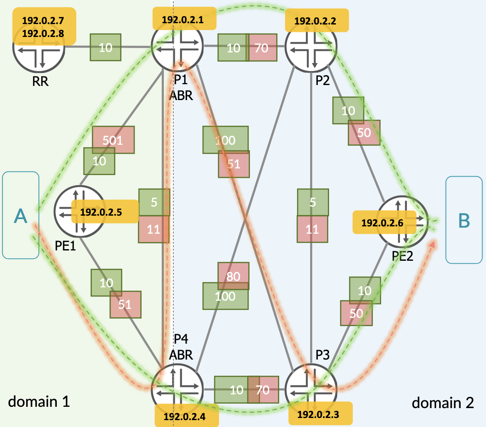
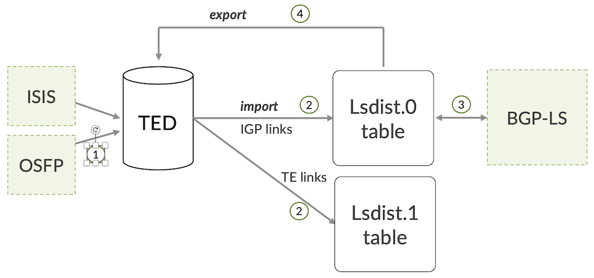

# Inter-domain On-demand SR-TE LSPs with BGP-LS

**Anton Elita - 09/16/2022**

A standard-based approach to placing MPLS-based services with path constraints across multiple networks.

Have you tried bringing up inter-domain tunnels in MPLS networks?

Well, then you know it's not so straightforward! Especially when you require fine-grained traffic-engineering (TE), like delay-based routing or link affinities spanning beyond a single autonomous system (AS).

While there are multiple options available, let's have a look how to use BGP-LS (Border Gateway Protocol - Link State) to distribute TE information where IGPs (Interior Gateway Protocol) cannot reach.

Below is a sample network, and your task is to connect A from "domain 1" with B from "domain 2" in the following manner: most services between PE1 and PE2 should use regular bandwidth-based metrics (green paths), while other premium services must be provisioned over lowest delay path represented by the red metric.



If this scenario has woken up your interest, let's dive into the technical details!

## Introduction

Today's networks often have a rich history, and many of them were shaped out during different migrations, merges, and splits. Even in a single domain, the number of provider edge (PE) nodes can grow high. It is often the case, that a network is split into multiple domains or autonomous systems (AS). This allows easier control over IGP scale (per sub-domain), rather than trying to handle a huge domain with many thousands of nodes. IGP domains cannot grow indefinitely: from a certain size even modern IGP protocols like OSPF or ISIS might melt down. It's not only the number of nodes creating additional load on IGP, but as well various TE metrics, Segment Routing (SR) node and prefix segment identifiers (SIDs), SRLGs, link affinities, bandwidth information, Flex-Algo TLVs and others.

With that in mind, it might be necessary to keep domains separated and hence IGP size under control. But then, how to do end-to-end traffic engineering? Usually, TE information is carried by IGP...

There are multiple answers to this question, depending on your preference: distributed TE (head-end calculation) or centralized TE (controller-based), SR-TE or RSVP or SRv6, and other options. Let us review one less known option: use distributed inter-domain SR-TE and leverage BGP-LS to populate Traffic-Engineering Databases (TED).

## Why BGP-LS?

Some networking people would know BGP-LS as a means for sending TE information from a network to a controller like Paragon Pathfinder. Use cases include path diversity with a global view of the network, optimal label-switched path (LSP) placement, cost-based routing, ingress- and egress peering engineering, and others.

The same BGP-LS vehicle can however be used to extend IGP coverage across domains or autonomous systems, to build end-to-end MPLS LSPs.

BGP scales much better compared to ISIS or OSPF. The purpose of this article is to show how to populate TED of a provider edge (PE) node with TE information from a remote network: nodes, links and prefixes, IGP and TE metrics, bandwidth, admin-groups, bandwidth priorities, min/max/avg delay, delay variation, node SIDs, SRGB, Adj SIDs. Having all that in TED allows to create constrained MPLS LSPs spanning beyond a single IGP domain.

As a bonus, we will review how to create such LSPs in an on-demand fashion.

## Sample Network Overview

As shown in the Figure 1, our sample network consists of two separate IGP domains. Apart from common route-reflector (RR) loopback IPs, area border routers (ABR) do not perform route leaking. ABRs are configured with multi-instance ISIS.

Each of the ISIS domains uses a pair of metrics for every link:

- IGP metric, based on link bandwidth
- Delay metric, representing link latency. This can be a static entry or a dynamic measurement with TWAMP Light

BGP-LS topology, as well as service routes, are exchanged via route reflector(s). TE information is populated into TED on every PE device in each network. To build end-to-end SR-TE tunnels, any ingress PE would search in TED for remote PE destination address, and construct label stack according to constraints configured by the user.

Let's review these steps one by one.

### Multi-Instance ISIS

This and further configuration examples apply to the network diagram in Figure 1.

ABRs P1 and P4 are connected to different ISIS islands:

```
root@p1# top show protocols isis-instance 100 | display inheritance no-comments
interface ge-0/0/0.0 {          # to P2
    level 2 metric 10;                
    delay-metric 70;            # delay metric can be static or dynamically measured
    point-to-point; }
interface ge-0/0/1.0 {          # to P3
    level 2 metric 100;
    delay-metric 51;            # delay metric can be static or dynamically measured
    point-to-point; }
interface lo0.0;
source-packet-routing {
    node-segment ipv4-index 1;  # Set Node-SID Index
}
level 1 disable;
level 2 wide-metrics-only;           
traffic-engineering {
    l3-unicast-topology;        # Required to populate TED
    advertisement always;       # Advertise TE link information
}
export PS-ISIS-TO-IGP-INSTANCE-100;
```

```
root@p1# top show policy-options policy-statement PS-ISIS-TO-IGP-INSTANCE-100
term A {
    from tag 666;
    then reject;}                         # use tags to avoid loops!
term B {
    from {
        protocol isis;
        level 2;
        route-filter 192.0.2.7/32 exact;  # IP addresses of RR
        route-filter 192.0.2.8/32 exact;}
    then {
        tag 666;                          # tag leaked prefixes
        accept; }}
```

### Traffic-Engineering Database

*Before continuing, make sure that all ISIS speakers have "traffic-engineering l3-unicast-topology" and "advertisement always" as per previous step.*

TED is used for head-end calculation of SR-TE paths. By default, TED would not have any information.

Let's see the steps required for populating TED:



Our task is to copy TE information from the IGP into TED (1), then to take (import) from TED (2) and announce via BGP-LS (3) to the other domain. In the opposite direction, we shall export from BGP-LS into TED (4), to be able to consume TE information for SR-TE locally.

```
root@pe1# show protocols isis
traffic-engineering {                 # advertise TE data in ISIS, feed TED
    l3-unicast-topology;
    advertisement always; }           # configure on every node in the network
```

```
root@pe1# show protocols mpls
traffic-engineering {
    database {
        import {                     # import IGP-links into TED
            l3-unicast-topology {
                bgp-link-state; }    # send to lsdist.0
            policy PS-TED2ALL; }     # example: "from family traffic-engineering; then accept;"
        export {
            policy PS-TED2ALL;       
            l3-unicast-topology;     # export into TED (e.g. from BGP-LS)
        }}}
```

### Announcing TE information via BGP-LS

Let's inspect the TED contents on PE1:

```
root@pe1# run show ted database topology-type l3-unicast
TED database: 4 ISIS nodes 4 INET nodes 0 INET6 nodes
ID                            Type Age(s) LnkIn LnkOut Protocol
p1.00(192.0.2.1)                Rtr      69     3      3 IS-IS(2)
    To: pe1.00(192.0.2.5), Local: 10.0.15.1, Remote: 10.0.15.2
      Local interface index: 360, Remote interface index: 360
    To: RR.00(203.0.113.10), Local: 10.0.17.1, Remote: 10.0.17.2
      Local interface index: 361, Remote interface index: 357
    To: p4.00(192.0.2.4), Local: 10.0.14.1, Remote: 10.0.14.2
      Local interface index: 359, Remote interface index: 357
ID                            Type Age(s) LnkIn LnkOut Protocol
pe1.00(192.0.2.5)               Rtr      32     2      2 IS-IS(2)
    To: p1.00(192.0.2.1), Local: 10.0.15.2, Remote: 10.0.15.1
      Local interface index: 360, Remote interface index: 360
    To: p4.00(192.0.2.4), Local: 10.0.45.2, Remote: 10.0.45.1
      Local interface index: 361, Remote interface index: 358
ID                            Type Age(s) LnkIn LnkOut Protocol
p4.00(192.0.2.4)                Rtr     118     2      2 IS-IS(2)
    To: pe1.00(192.0.2.5), Local: 10.0.45.1, Remote: 10.0.45.2
      Local interface index: 358, Remote interface index: 361
    To: p1.00(192.0.2.1), Local: 10.0.14.2, Remote: 10.0.14.1
      Local interface index: 357, Remote interface index: 359
ID                            Type Age(s) LnkIn LnkOut Protocol
RR.00(203.0.113.10)               Rtr      69     1      1 IS-IS(2)
    To: p1.00(192.0.2.1), Local: 10.0.17.2, Remote: 10.0.17.1
      Local interface index: 357, Remote interface index: 361
```

Only four nodes, and that is expected. Remember, we have two separate domains with no re-distribution -- and this domain is comprising exactly 4 nodes.

Let's roll up our sleeves and get BGP-LS to transport the missing TE information!

```
root@pe1# show groups GR-BGP-LS-46255 protocols bgp group GR-BGP-LS
local-address 192.0.2.5;
family traffic-engineering {
    unicast;
}
export PS-TED2BGP;
peer-as 100;
local-as 100;
neighbor 192.0.2.8;
```

```
root@pe1# show groups GR-BGP-LS-46255 policy-options policy-statement PS-TED2BGP
term A {
    from {
        family traffic-engineering;
        protocol isis;
    }
    then accept;
}
```

*(Configuration of the RR is skipped for brevity).*

Junos has different layers of credibility for SR-TE paths. If we need to use combined TE information from different sources like labeled ISIS and BGP, we need to activate this knob:

```
root@pe1# set protocols mpls cross-credibility-cspf?
Possible completions:
  cross-credibility-cspf  Compute paths across multi-protocol links and nodes
```

Now we can verify the state of BGP-LS and the new TED contents:

```
root@pe1> show bgp summary group GR-BGP-LS
Threading mode: BGP I/O
Default eBGP mode: advertise - accept, receive - accept
Groups: 2 Peers: 2 Down peers: 0
Table          Tot Paths  Act Paths Suppressed    History Damp State    Pending
lsdist.0
                      34         34          0          0          0          0
bgp.l3vpn.0
                       2          2          0          0          0          0
Peer                     AS      InPkt     OutPkt    OutQ   Flaps Last Up/Dwn State|#Active/Received/Accepted/Damped...
192.0.2.8                 100       2251       2261       0       0    16:51:46 Establ
  lsdist.0: 34/34/34/0
```

```
root@pe1> show ted database topology-type l3-unicast
TED database: 7 ISIS nodes 7 INET nodes 0 INET6 nodes
ID                            Type Age(s) LnkIn LnkOut Protocol
p1.00(192.0.2.1)                Rtr     148     5      5 Exported ISIS-L2(2)
    To: 1280.5402.3195.00(192.0.2.2), Local: 10.0.12.1, Remote: 10.0.12.2
      Local interface index: 0, Remote interface index: 0
    To: 1280.5402.2202.00(192.0.2.3), Local: 10.0.13.1, Remote: 10.0.13.2
      Local interface index: 0, Remote interface index: 0
ID                            Type Age(s) LnkIn LnkOut Protocol
                                                       IS-IS(2)
    To: pe1.00(192.0.2.5), Local: 10.0.15.1, Remote: 10.0.15.2
      Local interface index: 360, Remote interface index: 360
    To: RR.00(203.0.113.10), Local: 10.0.17.1, Remote: 10.0.17.2
      Local interface index: 361, Remote interface index: 357
    To: p4.00(192.0.2.4), Local: 10.0.14.1, Remote: 10.0.14.2
      Local interface index: 359, Remote interface index: 357
ID                            Type Age(s) LnkIn LnkOut Protocol
1280.5400.5234.00(192.0.2.6)    Rtr   60738     2      2 Exported ISIS-L2(2)
    To: 1280.5402.3195.00(192.0.2.2), Local: 10.0.26.2, Remote: 10.0.26.1
      Local interface index: 0, Remote interface index: 0
    To: 1280.5402.2202.00(192.0.2.3), Local: 10.0.36.2, Remote: 10.0.36.1
      Local interface index: 0, Remote interface index: 0
ID                            Type Age(s) LnkIn LnkOut Protocol
1280.5402.2202.00(192.0.2.3)    Rtr   60738     4      4 Exported ISIS-L2(2)
    To: p1.00(192.0.2.1), Local: 10.0.13.2, Remote: 10.0.13.1
      Local interface index: 0, Remote interface index: 0
    To: p4.00(192.0.2.4), Local: 10.0.34.1, Remote: 10.0.34.2
      Local interface index: 0, Remote interface index: 0
    To: 1280.5402.3195.00(192.0.2.2), Local: 10.0.23.2, Remote: 10.0.23.1
      Local interface index: 0, Remote interface index: 0
    To: 1280.5400.5234.00(192.0.2.6), Local: 10.0.36.1, Remote: 10.0.36.2
      Local interface index: 0, Remote interface index: 0
ID                            Type Age(s) LnkIn LnkOut Protocol
1280.5402.3195.00(192.0.2.2)    Rtr   60738     4      4 Exported ISIS-L2(2)
    To: p1.00(192.0.2.1), Local: 10.0.12.2, Remote: 10.0.12.1
      Local interface index: 0, Remote interface index: 0
    To: p4.00(192.0.2.4), Local: 10.0.24.1, Remote: 10.0.24.2
      Local interface index: 0, Remote interface index: 0
    To: 1280.5402.2202.00(192.0.2.3), Local: 10.0.23.1, Remote: 10.0.23.2
      Local interface index: 0, Remote interface index: 0
    To: 1280.5400.5234.00(192.0.2.6), Local: 10.0.26.1, Remote: 10.0.26.2
      Local interface index: 0, Remote interface index: 0
ID                            Type Age(s) LnkIn LnkOut Protocol
pe1.00(192.0.2.5)               Rtr     609     2      2 IS-IS(2)
    To: p1.00(192.0.2.1), Local: 10.0.15.2, Remote: 10.0.15.1
      Local interface index: 360, Remote interface index: 360
    To: p4.00(192.0.2.4), Local: 10.0.45.2, Remote: 10.0.45.1
      Local interface index: 361, Remote interface index: 358
ID                            Type Age(s) LnkIn LnkOut Protocol
p4.00(192.0.2.4)                Rtr      78     4      4 Exported ISIS-L2(2)
    To: 1280.5402.3195.00(192.0.2.2), Local: 10.0.24.2, Remote: 10.0.24.1
      Local interface index: 0, Remote interface index: 0
    To: 1280.5402.2202.00(192.0.2.3), Local: 10.0.34.2, Remote: 10.0.34.1
      Local interface index: 0, Remote interface index: 0
ID                            Type Age(s) LnkIn LnkOut Protocol
                                                       IS-IS(2)
    To: pe1.00(192.0.2.5), Local: 10.0.45.1, Remote: 10.0.45.2
      Local interface index: 358, Remote interface index: 361
    To: p1.00(192.0.2.1), Local: 10.0.14.2, Remote: 10.0.14.1
      Local interface index: 357, Remote interface index: 359
ID                            Type Age(s) LnkIn LnkOut Protocol
RR.00(203.0.113.10)               Rtr     475     1      1 IS-IS(2)
    To: p1.00(192.0.2.1), Local: 10.0.17.2, Remote: 10.0.17.1
      Local interface index: 357, Remote interface index: 361
```

Node 1280.5400.5234.00 (ISO address) with Loopback IP 192.0.2.6 is PE2, and it's now available in our own TED! Traffic-engineering attributes of each remote link are there too, including different sets of metrics:

```
root@pe1> show route table lsdist.0 te-link-local-ip 10.0.26.1 detail

lsdist.0: 83 destinations, 83 routes (83 active, 0 holddown, 0 hidden)
LINK { Local { AS:100 BGP-LS ID:680501 ISO:1280.5402.3195.00 }.{ IPv4:10.0.26.1 } Remote { AS:100 BGP-LS ID:680501 ISO:1280.5400.5234.00 }.{ IPv4:10.0.26.2 } ISIS-L2:0 }/1216 (1 entry, 1 announced)
        *BGP    Preference: 170/-101
                Next hop type: Indirect, Next hop index: 0
                Address: 0x76b73e8
                Next-hop reference count: 34
                Source: 192.0.2.8
                Protocol next hop: 192.0.2.8
                Indirect next hop: 0x2 no-forward INH Session ID: 0
                State: <Active Int Ext>
                Local AS:   100 Peer AS:   100
                Age: 17:05:55   Metric2: 20
                Validation State: unverified
                ORR Generation-ID: 0
                Task: BGP_100.192.0.2.8
                Announcement bits (1): 0-TED Export
                AS path: I  (Originator)
                Cluster list:  192.0.2.8
                Originator ID: 192.0.2.6
                Accepted
                Color: 0
                Maximum bandwidth: 1000Mbps
                Metric: 10
                TE Metric: 10
                Average delay: 50               
                Minimum delay: 50
                Maximum delay: 50
                Delay variation: 0
                Label: 17, Flags: 0x30, Weight: 0
                Localpref: 100
                Router ID: 203.0.113.10
                Thread: junos-main
```

Remember that 192.0.2.6 is not and will not be available in ISIS, improving network scale:

```
root@pe1> show isis route 1/8
 IS-IS routing table             Current version: L1: 0 L2: 87
IPv4/IPv6 Routes
----------------
Prefix             L Version   Metric Type Interface       NH   Via                 Backup Score
192.0.2.1/32         2      87       10 int  ge-0/0/0.0      IPV4 p1
192.0.2.4/32         2      87       10 int  ge-0/0/1.0      IPV4 p4
192.0.2.7/32         2      87       20 int  ge-0/0/0.0      IPV4 p1
192.0.2.8/32         2      87       20 int  ge-0/0/0.0      IPV4 p1
```

## Creating static and On-Demand SR-TE tunnels

Information from TED can now be used for on-box SR-TE path calculation. We will review two ways to build tunnels:

- Static SR-TE
- On-Demand SR-TE

### Static SR-TE

This approach does not scale from the operational perspective. Imagine a network with a hundred of nodes: managing even a partial mesh of SR-TE tunnels might easily turn into a nightmare.

Still, it is sometimes faster to just create a static SR-TE definition in Junos, and place user traffic on top of it, or create a shortcut for other types of traffic -- such as LDP or labeled ISIS.

```
root@pe1# show protocols source-packet-routing
compute-profile no-compress-delay {
    no-label-stack-compression;
    metric-type {
        delay;
    }
}
compute-profile CP-NO-COMPRESS-IGP {
    no-label-stack-compression;
    metric-type {
        igp;
    }
}
source-routing-path SP-TO-PE2 {
    to 192.0.2.6;
    primary {
        SP-P1 {
            compute {
                CP-NO-COMPRESS-IGP;
            }
        }
    }
}
source-routing-path SP-TO-PE2-DELAY {
    to 192.0.2.6;
    primary {
        SP-P2 {
            compute {
                no-compress-delay;
            }
        }
    }
}
```

One compute profile uses delay metric, while the other -- IGP metric.
Both tunnels use Adj-SIDs when calculating the path (configured via no-label-stack-compression). Current versions of Junos require this setting for calculating paths across inter-domain boundary. Both tunnels are uncolored and do not have any other constraints.

The IGP-based tunnel creates two equal-cost multipath (ECMP) paths over P1-P2 and P4-P4:

```
root@pe1# run show spring-traffic-engineering lsp detail name SP-TO-PE2
Name: SP-TO-PE2
  Tunnel-source: Static configuration
  Tunnel Forward Type: SRMPLS
  To: 192.0.2.6
  State: Up
    Path: SP-P1
    Path Status: NA
    Outgoing interface: NA
    Auto-translate status: Disabled Auto-translate result: N/A
    Compute Status:Enabled , Compute Result:success , Compute-Profile Name:CP-NO-COMPRESS-IGP
    Total number of computed paths: 2
    Computed-path-index: 1
      BFD status: N/A BFD name: N/A
      TE metric: 30, IGP metric: 30
      Delay metrics: Min: 621, Max: 621, Avg: 621
      Metric optimized by type: IGP
      computed segments count: 3
        computed segment : 1 (computed-adjacency-segment):
          label: 18
          source router-id: 192.0.2.5, destination router-id: 192.0.2.1
          source interface-address: 10.0.15.2, destination interface-address: 10.0.15.1
        computed segment : 2 (computed-adjacency-segment):
          label: 4115
          source router-id: 192.0.2.1, destination router-id: 192.0.2.2
          source interface-address: 10.0.12.1, destination interface-address: 10.0.12.2
        computed segment : 3 (computed-adjacency-segment):
          label: 17
          source router-id: 192.0.2.2, destination router-id: 192.0.2.6
          source interface-address: 10.0.26.1, destination interface-address: 10.0.26.2
    Computed-path-index: 2
      BFD status: N/A BFD name: N/A
      TE metric: 30, IGP metric: 30
      Delay metrics: Min: 621, Max: 621, Avg: 621
      Metric optimized by type: IGP
      computed segments count: 3
        computed segment : 1 (computed-adjacency-segment):
          label: 19
          source router-id: 192.0.2.5, destination router-id: 192.0.2.4
          source interface-address: 10.0.45.2, destination interface-address: 10.0.45.1
        computed segment : 2 (computed-adjacency-segment):
          label: 4115
          source router-id: 192.0.2.4, destination router-id: 192.0.2.3
          source interface-address: 10.0.34.2, destination interface-address: 10.0.34.1
        computed segment : 3 (computed-adjacency-segment):
          label: 17
          source router-id: 192.0.2.3, destination router-id: 192.0.2.6
          source interface-address: 10.0.36.1, destination interface-address: 10.0.36.2
```

The delay-based SR-TE will take the path with lowest delay, over P4-P1-P3:

```
root@pe1# run show spring-traffic-engineering lsp detail name SP-TO-PE2-DELAY
Name: SP-TO-PE2-DELAY
  Tunnel-source: Static configuration
  Tunnel Forward Type: SRMPLS
  To: 192.0.2.6
  State: Up
    Path: SP-P2
    Path Status: NA
    Outgoing interface: NA
    Auto-translate status: Disabled Auto-translate result: N/A
    Compute Status:Enabled , Compute Result:success , Compute-Profile Name:no-compress-delay
    Total number of computed paths: 1
    Computed-path-index: 1
      BFD status: N/A BFD name: N/A
      TE metric: 125, IGP metric: 125
      Delay metrics: Min: 163, Max: 163, Avg: 163
      Metric optimized by type: Minimum-Delay
      computed segments count: 4
        computed segment : 1 (computed-adjacency-segment):
          label: 19
          source router-id: 192.0.2.5, destination router-id: 192.0.2.4
          source interface-address: 10.0.45.2, destination interface-address: 10.0.45.1
        computed segment : 2 (computed-adjacency-segment):
          label: 4112
          source router-id: 192.0.2.4, destination router-id: 192.0.2.1
          source interface-address: 10.0.14.2, destination interface-address: 10.0.14.1
        computed segment : 3 (computed-adjacency-segment):
          label: 4112
          source router-id: 192.0.2.1, destination router-id: 192.0.2.3
          source interface-address: 10.0.13.1, destination interface-address: 10.0.13.2
        computed segment : 4 (computed-adjacency-segment):
          label: 17
          source router-id: 192.0.2.3, destination router-id: 192.0.2.6
          source interface-address: 10.0.36.1, destination interface-address: 10.0.36.2 
```

### On-Demand SR-TE

Where the number of PEs is high, provisioning SR-TE does not scale due to high configuration overhead. To address this, on-demand (ODN) SR-TE can be leveraged: ingress PE will trigger SR-TE creation only when a remote PE sends some service routes via BGP. As with static configuration, pre-configured templates with TE constraints can be used -- including tunnel colors.

```
root@pe1# show routing-options
resolution {
    rib bgp.l3vpn.0 {
        inetcolor-import PS-MPATH;           # Junos needs this for ECMP, when resolution-maps are used
    }
}
dynamic-tunnels {                            # Dynamic-Tunnels
    on-demand-tunnnels {
        spring-te {
            source-routing-path-template {   # Two templates with differing colors
                SP-ODN-DELAY color 12;
                SP-ODN-IGP color 11;
            }
            destination-networks {           # Reduce ODN only to this Loopback IPs
                192.0.2.0/8;
            }
        }
    }
}
forwarding-table {                           # allow ECMP in forwarding too
    export PS-LB;
}
```

Simple templates for on-demand automatic SR-TE, they just refer to already defined compute profiles:

```
root@pe1# show protocols source-packet-routing
source-routing-path-template SP-ODN-DELAY {
    primary {
        dynamic-delay {
            compute {
                no-compress-delay;
            }
        }
    }
}
source-routing-path-template SP-ODN-IGP {
    primary {
        dynamic-igp {
            compute {
                CP-NO-COMPRESS-IGP;
            }
        }
    }
}
```

The two policies are defined like this:

```
root@pe1# show policy-options policy-statement PS-LB
then {
    load-balance per-flow;
}
```

```
root@pe1# show policy-options policy-statement PS-MPATH
then multipath-resolve;
```

As soon as a BGP peer sends service routes with matching colors, ODN SR-TE creation is triggered:

```
root@pe1# run show route receive-protocol bgp 192.0.2.7 detail table bgp.l3vpn.0

bgp.l3vpn.0: 2 destinations, 2 routes (2 active, 0 holddown, 0 hidden)
* 192.0.2.6:8:13.0.6.0/24 (1 entry, 0 announced)
     Import Accepted
     Route Distinguisher: 192.0.2.6:8
     VPN Label: 16
     Nexthop: 192.0.2.6
     Localpref: 100
     AS path: I  (Originator)
     Cluster list:  192.0.2.7
     Originator ID: 192.0.2.6
     Communities: target:100:1 color:0:12

* 192.0.2.6:9:13.1.6.0/24 (1 entry, 0 announced)
     Import Accepted
     Route Distinguisher: 192.0.2.6:9
     VPN Label: 17
     Nexthop: 192.0.2.6
     Localpref: 100
     AS path: I  (Originator)
     Cluster list:  192.0.2.7
     Originator ID: 192.0.2.6
     Communities: target:100:2 color:0:11
```

(we skip complete BGP configuration and service route mapping policies for brevity)

```
root@pe1# run show spring-traffic-engineering lsp
To              State     LSPname
192.0.2.6-11<c>   Up        192.0.2.6:b:dt-srte-on-demand-tunnnels
192.0.2.6-12<c>   Up        192.0.2.6:c:dt-srte-on-demand-tunnnels
```

```
root@pe1# run show spring-traffic-engineering lsp detail
Name: 192.0.2.6:b:dt-srte-on-demand-tunnnels
  Tunnel-source: Dynamic Tunnel Module(DTM)
  Tunnel Forward Type: SRMPLS
  Tunnel-template: SP-ODN-IGP
  To: 192.0.2.6-11<c>
  State: Up
    Path: SP-P1
    Path Status: NA
    Outgoing interface: NA
    Auto-translate status: Disabled Auto-translate result: N/A
    Compute Status:Enabled , Compute Result:success , Compute-Profile Name:CP-NO-COMPRESS-IGP
    Total number of computed paths: 2
    Computed-path-index: 1
      BFD status: N/A BFD name: N/A
      TE metric: 30, IGP metric: 30
      Delay metrics: Min: 621, Max: 621, Avg: 621
      Metric optimized by type: IGP
      computed segments count: 3
        computed segment : 1 (computed-adjacency-segment):
          label: 18
          source router-id: 192.0.2.5, destination router-id: 192.0.2.1
          source interface-address: 10.0.15.2, destination interface-address: 10.0.15.1
        computed segment : 2 (computed-adjacency-segment):
          label: 4115
          source router-id: 192.0.2.1, destination router-id: 192.0.2.2
          source interface-address: 10.0.12.1, destination interface-address: 10.0.12.2
        computed segment : 3 (computed-adjacency-segment):
          label: 17
          source router-id: 192.0.2.2, destination router-id: 192.0.2.6
          source interface-address: 10.0.26.1, destination interface-address: 10.0.26.2
    Computed-path-index: 2
      BFD status: N/A BFD name: N/A
      TE metric: 30, IGP metric: 30
      Delay metrics: Min: 621, Max: 621, Avg: 621
      Metric optimized by type: IGP
      computed segments count: 3
        computed segment : 1 (computed-adjacency-segment):
          label: 19
          source router-id: 192.0.2.5, destination router-id: 192.0.2.4
          source interface-address: 10.0.45.2, destination interface-address: 10.0.45.1
        computed segment : 2 (computed-adjacency-segment):
          label: 4115
          source router-id: 192.0.2.4, destination router-id: 192.0.2.3
          source interface-address: 10.0.34.2, destination interface-address: 10.0.34.1
        computed segment : 3 (computed-adjacency-segment):
          label: 17
          source router-id: 192.0.2.3, destination router-id: 192.0.2.6
          source interface-address: 10.0.36.1, destination interface-address: 10.0.36.2

Name: 192.0.2.6:c:dt-srte-on-demand-tunnnels
  Tunnel-source: Dynamic Tunnel Module(DTM)
  Tunnel Forward Type: SRMPLS
  Tunnel-template: SP-ODN-DELAY
  To: 192.0.2.6-12<c>
  State: Up
    Path: SP-P1
    Path Status: NA
    Outgoing interface: NA
    Auto-translate status: Disabled Auto-translate result: N/A
    Compute Status:Enabled , Compute Result:success , Compute-Profile Name:no-compress-delay
    Total number of computed paths: 1
    Computed-path-index: 1
      BFD status: N/A BFD name: N/A
      TE metric: 125, IGP metric: 125
      Delay metrics: Min: 163, Max: 163, Avg: 163
      Metric optimized by type: Minimum-Delay
      computed segments count: 4
        computed segment : 1 (computed-adjacency-segment):
          label: 19
          source router-id: 192.0.2.5, destination router-id: 192.0.2.4
          source interface-address: 10.0.45.2, destination interface-address: 10.0.45.1
        computed segment : 2 (computed-adjacency-segment):
          label: 4112
          source router-id: 192.0.2.4, destination router-id: 192.0.2.1
          source interface-address: 10.0.14.2, destination interface-address: 10.0.14.1
        computed segment : 3 (computed-adjacency-segment):
          label: 4112
          source router-id: 192.0.2.1, destination router-id: 192.0.2.3
          source interface-address: 10.0.13.1, destination interface-address: 10.0.13.2
        computed segment : 4 (computed-adjacency-segment):
          label: 17
          source router-id: 192.0.2.3, destination router-id: 192.0.2.6
          source interface-address: 10.0.36.1, destination interface-address: 10.0.36.2
```

Here we again see ECMP for the IGP-based routing, and a single best path for delay-based service.

```
root@pe1# run show route 13/8 table bgp.l3vpn.0

bgp.l3vpn.0: 2 destinations, 2 routes (2 active, 0 holddown, 0 hidden)
+ = Active Route, - = Last Active, * = Both

192.0.2.6:8:13.0.6.0/24
                   *[BGP/170] 00:22:04, localpref 100, from 192.0.2.7
                      AS path: I, validation-state: unverified
                    >  to 10.0.45.1 via ge-0/0/1.0, Push 16, Push 17, Push 4112, Push 4112(top)
192.0.2.6:9:13.1.6.0/24
                   *[BGP/170] 00:22:04, localpref 100, from 192.0.2.7
                      AS path: I, validation-state: unverified
                    >  to 10.0.15.1 via ge-0/0/0.0, Push 17, Push 17, Push 4115(top)
                       to 10.0.45.1 via ge-0/0/1.0, Push 17, Push 17, Push 4115(top)
```

### Service route mapping to colored SR-TE

Modern networks carry many types of services. Some of them existed much before segment-routing was specified. How to map such different service types to specific SR-TE tunnels? The answer to this question would require a new TechPost -- stay tuned!

In a few words, there are two major approaches in Junos:

- via [resolution maps](https://www.juniper.net/documentation/en_US/junos/topics/concept/color-based-mapping-of-vpn-services-overview.html)
- via [transport-classes](https://www.juniper.net/documentation/us/en/software/junos/mpls/topics/ref/statement/use-transport-class-edit-routing-options-flex-algorithm.html)

With older resolution-maps, it is required to apply them in BGP import policy - otherwise service mapping to transports will not take place. One additional requirement is to apply "resolution rib" policy like PS-MPATH described earlier - otherwise, ECMP might not work properly.

Transport-classes (TC) are a more modern way of service mapping (introduced in Junos 21.2R1) and have a larger service type coverage compared to resolution-maps. TC requires neither "resolution-map", nor special ECMP policy applied on RIBs, but only `set routing-options resolution preserve-nexthop-hierarchy`

More details can be found in this follow-up article: [Service Mapping to Colored MPLS Paths](https://juniper.github.io/techposts/service-mapping-to-colored-mpls-paths/article)

## Useful links

- [RFC7752](https://datatracker.ietf.org/doc/html/rfc7752) North-Bound Distribution of Link-State and Traffic Engineering (TE) Information Using BGP
- [RFC9085](https://datatracker.ietf.org/doc/html/rfc9085) Border Gateway Protocol - Link State (BGP-LS) Extensions for Segment Routing
- [Transport-Classes](https://www.juniper.net/documentation/us/en/software/junos/mpls/topics/ref/statement/use-transport-class-edit-routing-options-flex-algorithm.html)
- [Resolution Maps](https://www.juniper.net/documentation/en_US/junos/topics/concept/color-based-mapping-of-vpn-services-overview.html)

## Glossary

- ABR Area Border Router
- BGP Border Gateway Protocol
- BGP-LS BGP Link State
- ECMP Equal-Cost Multipath
- IGP Interior Gateway Protocol
- LSP Label-switched path
- MPLS Multiprotocol Label Switching
- PE Provider Edge
- RR Route-Reflector
- SR Segment Routing
- TC Transport Class
- TLV Type-Length Value
