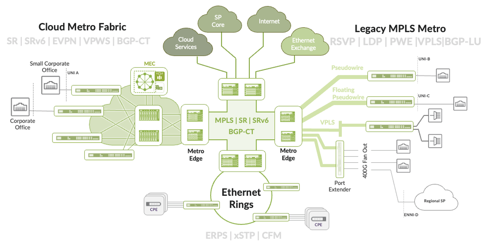
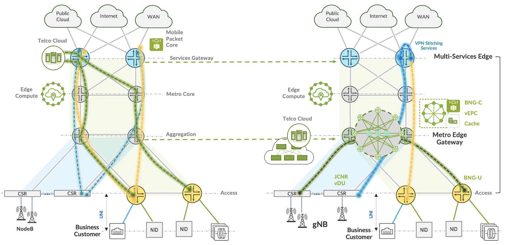
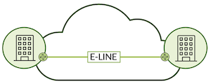
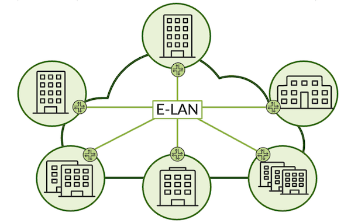
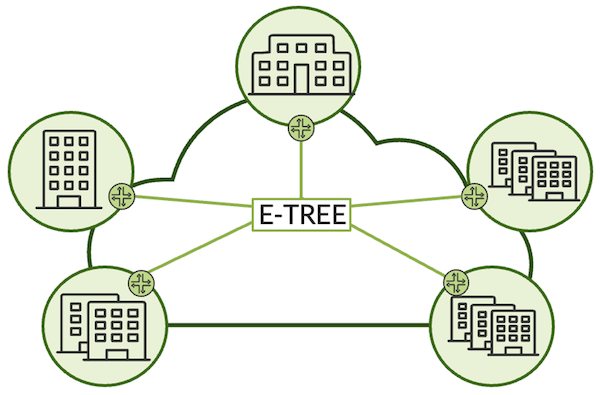
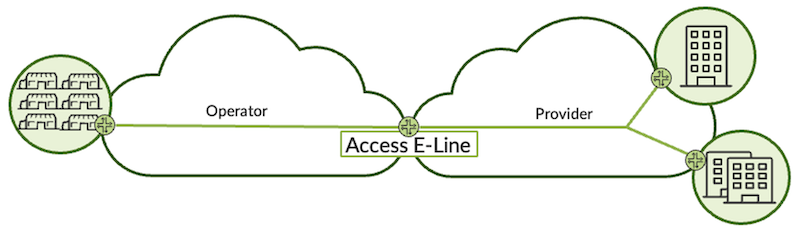
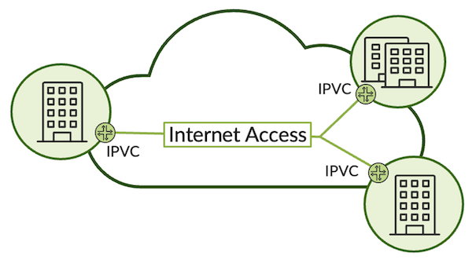

# Introduction to Metro Ethernet Business Services Validated Design

**Kevin Brown - 05/13/2024**

Introducing our latest Juniper Validated Design (JVD), addressing Metro Ethernet Business Services (EBS) with Juniper MX Series, ACX Series, and PTX Series platforms. In this profile, we'll deliver over 20 use cases across metro fabric and multi-ring architectures, blending traditional and modern technologies driving the Cloud Metro.

## Introduction

Metro Ethernet has long been a foundational infrastructure that delivers Layer 2 Ethernet business, federal, and residential services. Carrier Ethernet, largely defined by the Metro Ethernet Forum, establishes the transport and services framework within the Metro Area Network (MAN). The traditional characteristics of Metro Ethernet Services include Layer 2 connectivity models, which support point-to-point, point-to-multipoint, and multipoint-to-multipoint service types. End-to-end layer 3 business access is typically facilitated by L3VPN and extended for high-speed Internet access. In this JVD, we further extend EVPN services to include Internet access. In addition, the behavioral aspects are standardized by the MEF and include service assurance mechanisms, such as E-OAM and Quality of Service (QoS) constructs. The modern metro network has evolved to support a highly capable architecture and more sophisticated feature-set driven by the cloudification of the metro, and the emergence of new complexes like edge compute and telco cloud. Cloud services, applications, and new use cases place increased demands and challenges on the network.

The scope of the Metro Ethernet Business Services (EBS) JVD seeks to address the traditional L2 business access and dedicated Internet access services while also incorporating modern service delivery protocol sets, including EVPN-VPWS, EVPN-FXC, EVPN-ETREE, and EVPN-ELAN with high availability. We tackle the connectivity challenges that are introduced with cloud metro solutions by providing the service connectivity models that are required for interconnection with cloud edge infrastructures and parallel Layer 3 access. In addition, we explore the integration of traditional VPN services like L2VPN, VPLS, and L2Circuit for business and wholesale use cases and the interconnection of these services with the cloud metro architecture.

The topology focuses on the Juniper Cloud Metro portfolio, including the ACX7000 series and MX304 multiservice edge routers as primary devices under testing (DUTs) and PTX10001-36MR routers for core and peering roles with additional helper nodes in the access regions that include the ACX710, ACX5448, and MX204 platforms.

The reference architecture deploys an infrastructure designed to support traditional metro access ring topologies with lean edge services termination. In addition, the topology features a two-stage metro fabric spine-and-leaf design with border leaf nodes performing the metro edge gateway role and facilitating connectivity into edge cloud complexes. Both infrastructures support seamless interconnectivity within and between different access regions. We build the Cloud Metro infrastructure using spine-leaf fabric and multi-ring architecture that facilitates x-to-anything connectivity models and leverages seamless Segment Routing with fast failover TI-LFA recovery mechanisms. Multi-instance ISIS enables the partitioning of the network domain into independent IGP instances to improve scale and contain blast radius. Flexible Algorithm with Application Specific Link Attributes (ASLA) enable the creation of additional layers of abstraction that form distinct paths through the network based on delay or traffic engineering metrics. Transport classes and BGP Classful Transport (BGP-CT) enable the mapping of services onto color transport for both intra-AS and inter-AS services. Traffic is steered through the network based on the defined service-level objectives (SLOs). Flex-Algo Prefix Metrics (FAPM) enable inter-domain traffic steering across flex-algo IGP boundaries and cascade resolution schemes support the transition of services between performance hierarchies during failure events. BGP Labeled Unicast supports the coexistence of inter-AS services with color-mapped services and seamless failover from colored paths onto uncolored paths if required.

## Use Case and Reference Architecture

The reference architecture is based on a modern Carrier Ethernet MAN that takes into consideration the transformation required to facilitate diverse new services, applications, and use cases. Some common principles exist to deliver Layer 2 and/or Layer 3-enabled services for point-to-point, point-to-multipoint, and multipoint-to-multipoint solutions with more intelligent mechanisms that enable the coexistence of L2 and L3 services and improved high availability models. The architecture is referred to as Cloud Metro but carries several important characteristics in the amalgamation of service and content providers. These shifting industry trends demand massive bandwidth and increased service scale while also supporting more complex metro workloads.

A major goal of Cloud Metro is the adaptation of cloud principles into metro networks. This comes in the form of systems that support a sophisticated feature set, including the array of EVPN technologies, SR-MPLS/SRv6, and the ability to support inter-domain traffic engineering or seamless architectures across disparate networks. It must include capabilities to support and integrate the services and solutions that are found in traditional metro networks. This is a differentiating factor that characterizes the requirements for supporting x-to-anything connectivity models or building infrastructures that become access agnostic while also blending with virtualized network functions and devices.

Metro networks can vary between service providers, but the design principles are largely consistent. In the traditional metro network, the design focuses on supporting north-to-south traffic patterns where services are backhauled across access, aggregation, and core network segments and centrally aggregated. The costly scale-up architecture is supported by resilient modular systems with dense feature sets that can carry a significant failure blast radius. New challenges emerge with the growth of edge cloud complexes, leading to massive subscriber traffic increases and exasperated by the consumption of expensive links and ports while degrading the customer experience. A new design is required.

As illustrated in Figure 2, with the emergence of a new model moving to the right, aggregation nodes evolve into a metro edge gateway (MEG) role, with certain tactical and strategic advantages realized as the traffic patterns are better contained within the metro ecosystem. East-to-west traffic flows are cost-optimized and a significant reduction in the failure blast radius. Additional benefits are realized with reduced power consumption and lowered cost-per-gigabit while improving scalability and the customer experience.

The ACX7000 family is ideally positioned to support the metro edge gateway role with an advanced feature set capable of serving a majority of customer requirements and providing critical interconnectivity points for these new cloud complexes. In parallel, the MX Series multi-services edge component serves the crucial role of managing more complex interconnectivity, service stitching attributes, Pseudo-Wire Headend Termination (PWHT), or high-scale BNG use cases.

## Validation Framework

This Metro Ethernet Business Services JVD addresses the network modernization journey, which includes multiple evolving use cases. A crucial aspect of the overall solution is enabling flexibility to support heterogeneous customer architectures within the same validated design. Major attributes include:

- Seamless SR-MPLS with TI-LFA
- Flexible Algorithm Application Specific Link Attribute (ASLA)
- Co-Existence of Seamless SR-MPLS BGP-LU & BGP-CT inter-AS solutions
- End-to-end color-aware Traffic Steering  (à la Network "Lite-Slicing")
- Intra-domain Transport Class tunneling with Service Mapping
- Inter-domain color awareness with BGP Classful Transport
- All services include color-aware & color-agnostic path selection
- Intent-based routing with Color Mapping based on Delay & TE metrics
- Color agnostic services take IGP metric paths (inet.3)
- Strict Resolution Scheme (no fallback) + Cascade Fallback: Gold fallback to Bronze and Bronze fallback to Best Effort
- Alignment with MEF 3.0 standards for service characteristics and attributes

An important focus of the Metro Ethernet Business Services JVD involves alignment with the MEF standards. The Metro Ethernet Forum is an industry consortium dedicated to accelerating the adoption of Carrier Ethernet services and technologies. Its primary purposes and goals revolve around standardization, interoperability, and innovation within the Ethernet ecosystem. The MEF works to develop and promote standards for Carrier Ethernet services, ensure interoperability between Carrier Ethernet networks and equipment from different vendors, foster innovation by promoting the development of new technologies and services based on Carrier Ethernet, and educate the market about the benefits and capabilities of Carrier Ethernet services.

The referenced technical specifications include:

- MEF 6.3 Subscriber Ethernet Services Definitions
- MEF 10.4 Subscriber Ethernet Service Attributes
- MEF 23.2 Carrier Ethernet Class of Service
- MEF 26.2 Operator Ethernet Service Attributes
- MEF 35.1 Service OAM Performance Monitoring
- MEF 45.1 Ethernet Layer 2 Control Protocols
- MEF 48 Carrier Ethernet Service Activation
- MEF 51.1 Operator Ethernet Service Definitions
- MEF 62 Managed Access E-Line

The Juniper Networks routers featured in this JVD include MEF 3.0-certified MX304, ACX7100, ACX7509, ACX7024, ACX5448, and ACX710 platforms.

The services framework includes the following models:

1. E-LINE for delivering point-to-point connections as Ethernet Private Lines (EPL) or Ethernet Virtual Private Lines (EVPL).

2. E-LAN for delivering multipoint-to-multipoint connections as Ethernet Private LAN (EP-LAN) or Ethernet Virtual Private LAN (EVP-LAN).

3. E-TREE for delivering rooted-multipoint hub-and-spoke connections as Ethernet Private Tree (EP-TREE) or Ethernet Virtual Private Tree (EVP-TREE).

4. E-ACCESS for delivering wholesale point-to-point services connecting UNI to NNI as Access EPL or Access EVPL.

5. INTERNET ACCESS is an IP Service created by connecting IP Virtual Connections (IPVC) with other IPVC endpoints.

Services Attributes are further defined by the major characteristics:

- Service multiplexing determines whether the UNI terminates one (disabled) or more (enabled) Ethernet services.
- Bundling is enabled when multiple CE-VLANs are supported on the UNI, or disabled when each Ethernet Service includes a single CE-VLAN.
- All-to-One bundling means that all CE-VLANs are associated with a single Ethernet Service as a private UNI service. When bundling is disabled, one or more virtual private services are enabled per UNI.

MEF provides the below guidance for valid service multiplexing and bundling combinations, which are followed by this validated design. For more information, please refer to the MEF documentation.

Table: MEF Bundling and Service Multiplexing

| ServiceMultiplexing | Bundling | All to OneBundling | Description |
|:--|:--|:--|:--|
| Yes | No | No | Multiple virtual private services are allowed at the UNI with only one CE-VLAN ID mapped to each service. |
| Yes | Yes | No | Multiple virtual private services enabled at the UNI and multiple CE-VLAN IDs can be mapped to each service. |
| Yes | Yes | Yes | Illegal configuration |
| Yes | No | Yes | Illegal configuration |
| No | No | Yes | Single private service at the UNI. |
| No | Yes | No | Single virtual private service enabled at the UNI with multiple CE-VLAN IDs mapped to it. |
| No | Yes | Yes | Illegal configuration |
| No | No | No | Single virtual private service enabled at the UNI with only a single CE-VLAN ID mapped to it. |

Reference: [https://wiki.mef.net/display/CESG/Bundling+and+Service+Multiplexing](https://wiki.mef.net/display/CESG/Bundling+and+Service+Multiplexing)

Throughout the blog series, I'll explain how the featured services are mapped back to the MEF definitions.

That's it for this introductory blog, which presents the Juniper Validated Design (JVD) for building and deploying a sophisticated Metro Ethernet Business Services (EBS) network architecture using the Juniper ACX Series, MX Series, and PTX Series platforms.

As the series continues, I'll explain the design concepts incorporating traditional ring-based topologies with considerations for multi-ring architectures and interconnecting metro fabrics supporting edge cloud connectivity models. Intent-based routing assures service level agreement (SLA) requirements spanning multiple BGP autonomous systems (Inter-AS) by leveraging seamless MPLS Segment Routing with BGP Labeled Unicast and BGP Classful Transport. The solutions blend both traditional and modern technologies that are required for Cloud Metro.

A dense services portfolio is crafted in alignment with Metro Ethernet Forum (MEF) standards. This ensures that service providers can deliver business requirements and use cases across a diverse metro ecosystem with flexible service offerings, high bandwidth, and intelligent traffic steering using the same physical infrastructure.

This series is just getting started, so stay tuned to see how the solution architecture progresses---with full configurations and results to be provided!

## Useful links

- [https://wiki.mef.net/display/CESG/Bundling+and+Service+Multiplexing](https://wiki.mef.net/display/CESG/Bundling+and+Service+Multiplexing)

## Glossary

- BGP-LU: Border Gateway Protocol Labeled Unicast
- BGP-CT: Border Gateway Protocol Classful Transport
- DUT: Device Under Test
- EBS: Ethernet Business Services
- EP-LAN: Ethernet Private Local Area Network
- EPL: Ethernet Private Line
- ENNI: External Network to Network Interface
- EVP-LAN: Ethernet Virtual Private Local Area Network
- EVPL: Ethernet Virtual Private Line
- FAPM: Flexible Algorithm Prefix Metrix
- IGP: Interior Gateway Protocol
- IPVC: IP Virtual Connection
- JVD: Juniper Validated Design
- MAN: Metro Area Network
- MEF: Metro Ethernet Forum
- MEG: Metro Edge Gateway
- MEN: Metro Ethernet Network
- NNI: Network to Network Interface
- PWHT: Pseudowire Headend Termination
- QOS: Quality of Service
- SLO: Service Level Objectives
- SR-MPLS: Segment Routing Multiprotocol Label Switching
- SRv6: Segment Routing version 6
- TI-LFA: Topology Independent Loop Free Alternative
- UNI: User Network Interface

## Acknowledgements

Thanks to Vasily Mukhin for creating the Conceptual Cloud Metro diagram (figure 1).
