# Introducing Express5 in PTX10K Chassis

**Nicolas Fevrier - 08/18/2025**

## Introduction

In early 2025, we introduced a new line card for the PTX10000 Series: the LC1301. It comes completing the existing LC1201 and LC1202, respectively optimized for 400GbE and 100GbE/400GbE. The LC1301 offers an impressive high-speed port density with 36 ports 800GbE per slot. Since you can populate the chassis with eight line cards, the PTX becomes a 288x 800GbE system. And it also supports 576 ports 400GbE or 2,304 ports 100Gb!!!

Based on the Express 5 Packet Forwarding Engine, it is deployed in multiple use-cases such as [core, peering, CDN gateways, DCI, DC edge, aggregation, and datacenter, including AI/ML clusters.](https://blogs.juniper.net/en-us/service-provider-transformation/setting-a-new-standard-for-sustainability-performance-and-automation-juniper-networks-ptx-800ge-and-double-density-400ge-routing-solutions-for-the-ai-era)

The system design is a commitment to energy saving. It supports unique power optimization features, enabling the selective shutdown of specific forwarding capabilities during periods of non-use, thereby further enhancing energy efficiency.

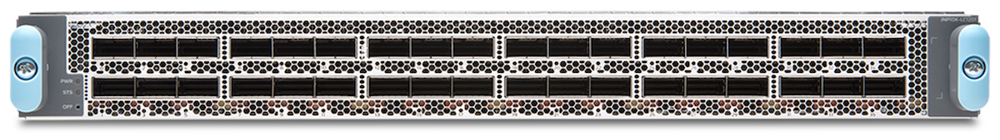

The following chart describes the maximum port density per interface type/speed with LC1301. Multiply by 8 if you want chassis-level numbers.

| Pluggable Optics Modules | Maximum Port Density per Slot |
|:--|:--|
| 800GbE with QSFP800 | 36 |
| 400GbE with QDD800 Dual-Duplex | 72 |
| 400GbE with QSFP56-DD | 36 |
| 100GbE with QDD800 break-out cable | 288 |
| 100GbE with QSFP56-DD break-out cable | 144 |
| 40GbE with QSFP+ | 36 |
| 10GbE with QSFP+ break-out cable | 144 |
| 10GbE with SFP+ in QSA | 36 |

This platform is powered by the new Express 5, supporting MACsec at line rate on all ports, and ready for class-C timing (with a future Routing Engine).

You can insert LC1301 into existing chassis and it does interoperate with the LC1201 and LC1202. To support its full forwarding and port density potential, a replacement of the fabric cards (to SF5), power supply units (to Gen3 PSU), and cooling system (to Gen3 FanTrays) will be necessary.

## LC1301 in PTX10k Chassis

As of the writing of this article (August 2025), the LC1301 is supported in the PTX10008 universal chassis. The PTX10004 support is planned to be released soon. Please, contact your Juniper representative for more details.

The PTX10008 offers eight slots for different line card types, and you can insert the LC1301 in any position, without any specific restriction. The Fabric cards and Line cards are directly connected following an orthogonal design. In the illustration Figure 2 below, we are representing the content of a chassis with two routing engines on the top, a single line card at the bottom, and 3 (out of 6 maximum) fabric cards.

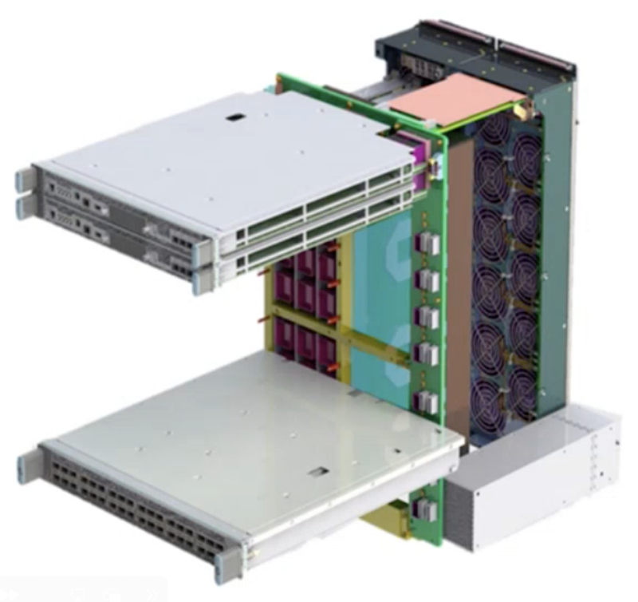

On the right side, the line card connects to a midplane for power and management (a single PSU is represented in this example). Let's have a look at the chassis from Junos' perspective:

```
root@ptx10008> show chassis hardware detail
 
Hardware inventory:
Item             Version  Part number  Serial number     Description
Chassis                                GFxxx             JNP10008 [PTX10008]
Midplane 0       REV 20   750-086802   BCEExxxx          Midplane 8
FPM 0            REV 02   711-086964   BCEExxxx          Front Panel Display
PSM 0            Rev 04   740-069994   1F21C4xxxxx       JNP10K 5500W AC/HVDC Power Supply Unit
PSM 1            Rev 04   740-069994   1F21D1xxxxx       JNP10K 5500W AC/HVDC Power Supply Unit
PSM 2            Rev 04   740-069994   1F21D1xxxxx       JNP10K 5500W AC/HVDC Power Supply Unit
PSM 3            Rev 04   740-069994   1F21D1xxxxx       JNP10K 5500W AC/HVDC Power Supply Unit
Routing Engine 0          BUILTIN      BUILTIN           JNP10K-RE1-E128
  sda   200049 MB  StorFly VSFBM8CC-000 P1T02006131102xxxxxx Solid State Disk
  sdb   200049 MB  StorFly VSFBM8CC-000 P1T02006131102xxxxxx Solid State Disk
Routing Engine 1          BUILTIN      BUILTIN           JNP10K-RE1-E128
  sda   200049 MB  SFSA200GM3AA4TO-2050 000060229950A3xxxxxx Solid State Disk
  sdb   200049 MB  SFSA200GM3AA4TO-2050 000060229950A3xxxxxx Solid State Disk
CB 0             REV 12   750-101823   BCENxxxx          Control Board
CB 1             REV 12   750-101823   BCEHxxxx          Control Board
FPC 1            REV 51   750-093524   BCETxxxx          JNP10K-LC1201
  CPU            REV 11   750-087304   BCEPxxxx          JNP10K-LC1201 PMB Board
  PIC 0                   BUILTIN      BUILTIN           JNP10K-36QDD-LC-PIC
  MEZZ 0         REV 13   711-084968   BCENxxxx          JNP10K-LC1201 MEZZ Board
FPC 5            REV 09   750-153082   BCEVxxxx          JNP10K-LC1301
  CPU            REV 02   750-153146   BCELxxxx          JNP10K-LC1301 PMB Board
  PIC 0                   BUILTIN      BUILTIN           JNP10K-36QDD800-LC-PIC
    Xcvr 1       REV 01   740-150873   1F1CSLA8xxxxx     QSFP-DD800-800G-AOC-7M
    Xcvr 2       REV 01   740-096176   1G1TZHA9xxxxx     QSFP56-DD-400GBASE-LR4-10
    Xcvr 3       REV 01   740-096176   1G1TZHA9xxxxx     QSFP56-DD-400GBASE-LR4-10
    Xcvr 9       REV 01   740-145101   1W1CUCA7xxxxx     QSFP-DD800-8x100G-FR1
    Xcvr 25      REV 02   740-056707   1FCP76xxxxx       QSFP+40GE-IR4
    Xcvr 27      REV 01   740-170960   1W1CUPA8xxxxx     QSFP-DD800-2x400G-FR4-DUAL-LC
    Xcvr 29      REV 01   740-073093   1FCPA6xxxxx       QSFP+-40G-LR4
    Xcvr 33      REV 01   740-089468   1W1CZEA5xxxxx     QSFP56-DD-4X100G-LR
    Xcvr 35      REV 01   740-060381   1ACM72xxxxx       QSFP+40GE-AOC-30M
  MEZZ 0         REV 02   750-153144   BCEPxxxx          JNP10K-LC1301 MEZZ Board
SIB 0            REV 13   750-136652   BCFxxxxx          SIB-JNP10008-SF5
SIB 1            REV 13   750-136652   BCFxxxxx          SIB-JNP10008-SF5
SIB 2            REV 13   750-136652   BCFxxxxx          SIB-JNP10008-SF5
SIB 3            REV 13   750-136652   BCFxxxxx          SIB-JNP10008-SF5
SIB 4            REV 13   750-136652   BCFxxxxx          SIB-JNP10008-SF5
SIB 5            REV 13   750-136652   BCFxxxxx          SIB-JNP10008-SF5
FTC 0            REV 19   750-083435   BCExxxxx          Fan Controller 8
FTC 1            REV 19   750-083435   BCDxxxxx          Fan Controller 8
Fan Tray 0       REV 05   760-086563   BCAxxxxx          Fan tray 8
Fan Tray 1       REV 15   750-103312   BCExxxxx          Fan tray 8

{master}
root@ptx10008>
```

This router is populated with two cards, an LC1201 and an LC1301.

## Main Forwarding Components

LC1301 is the first line card in our portfolio powered by the Express 5 Packet Forwarding Engine. The first standalone router based on an Express 5 architecture is the PTX10002-36QDD: [https://juniper.github.io/techposts/introducing-ptx10002-36qdd/article](https://juniper.github.io/techposts/introducing-ptx10002-36qdd/article)

The Juniper Express silicon line, first introduced in 2011, aimed to transform the economics of packet transport networks by optimizing the forwarding path for density and interface speeds. Initially, the Express silicon line was designed for core routing functionality and relatively low scale, supporting MPLS Label Switch Router functions.

Over five generations, the Express chipsets evolved and expanded their capabilities, increasing the supported scale and extending their functionality.

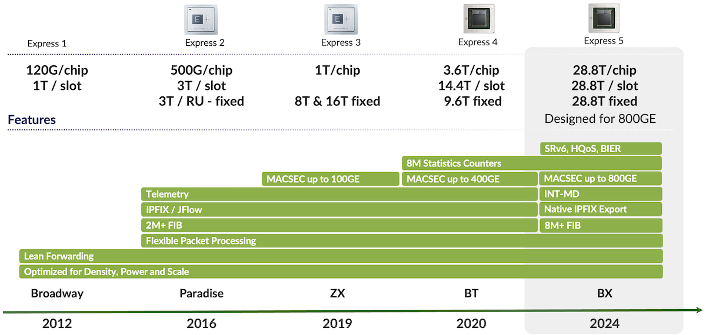

Figure 3 above illustrates this evolution over generations. The Express 5 supports both high-scale and complex forwarding protocols and services like In-band Network Telemetry (INT-MD) and Hierarchical Quality of Service (H-QoS).

### Express 5 High-Level Description

The Express 5 is not just a single chipset but more of an ASIC family. It's the first in this industry to propose a design based on chiplets. You will find more details on this blog post from Dmitry Shokarev: [https://juniper.github.io/techposts/express-5-overview/article](https://juniper.github.io/techposts/express-5-overview/article)

To keep it short, we have two main chiplets, "X" and "F", and we can mix and match them to create different packages based on the requirements.

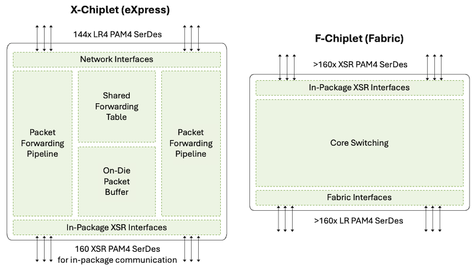

The X-chiplet offers 14.4Tbps of WAN SerDes on the north side (in Figure 4), supporting bandwidth from 10Gbps to 106Gbps. On the south part, they have very short reach links, XSR SerDes, to potentially interconnect to another X-chiplet or an F-chiplet, inside the same package.

The F-chiplet is dedicated to fabric connectivity. It offers interfaces on the south side of this diagram for receiving and transmitting cells to the fabric. And the north side is used to potentially interconnect to another X-chiplet or an F-chiplet, again in the same package.

These building blocks can be combined to meet our design needs. We can create packages made of:

- A single X-chiplet
- Two X-chiplets back-to-back, interconnected via the XSR SerDes. That's typically what we will use in the PTX10002-36QDD router. It's a 28.8Tbps ASIC, and we name it BXX.
- One X-chiplet paired with one F-chiplet offers WAN connectivity on one side and Fabric connectivity on the other side. We find them in modular chassis line cards, and they are called BXF.
- One F-chiplets, offering Fabric interfaces. You find this configuration in modular chassis fabric cards, and they are called BF.

In an LC1301, you need both WAN interfaces and fabric connectivity. That's why it is based on two BXF packages, each of them made of one X-chiplet, presenting 144 WAN SerDes at 106Gbps and one F-chiplet to connect 160 electrical SerDes to the fabric cards.

In Figure 5 below, the blocks on the sides of chiplet-X represent the deep buffer HBM used to store packets, as well as routing information and statistics.

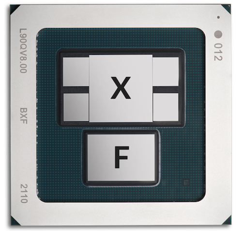

Since Express 5 supports MACsec internally, we won't need any additional parts to deliver MACsec encryption at line rate on all ports.

| Metric | Value |
|:--|:--|
| Process Node | 7nm |
| Internal Codename | BXF |
| WAN (Front Panel) Links | 144x 106Gbps |
| Fabric (Internal) Links | 160x 112Gbps |
| Off-Chip Memory | 16GB (2x 8GB) HBM |
| 800GigE Port Density | 18 |
| 400GigE Port Density | 36 |
| 100GigE Port Density | 144 (with 8x100GigE Breakout Cable) |
| 40GigE Port Density | 16 |
| 10GigE Port Density | 144 (with 8x10GigE Breakout Cable) |
| Total Forwarding Capacity | 14.4Tbps |
| Total WAN Capacity | 14.4Tbps |
| MACsec | Up to 800Gbps per port |
| Counters | 8M |
| IPv4 or IPv6 FIB* | 8M+ |

**Express 5 BXF Information**

*Tested scale, hardware capable of much more (pending software validation)*

FIB compression is enabled by default, but these numbers here represent FIB entries. In consequence, the scale could be much higher because of the compression. For more details on this technology, we invite you to check this article: [https://juniper.github.io/techposts/ptx-fib-compression/article](https://juniper.github.io/techposts/ptx-fib-compression/article)

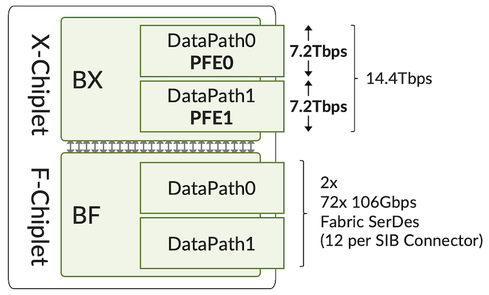

It goes without saying that all bandwidth Figures expressed in this article are Full Duplex: a 7.2Tbps DataPath can receive and transmit 7.2Tbps simultaneously.

### Vocabulary

In this document, we will talk about:

- "Package": to describe the BXF. Alternatively, we will use "chipset", "NPU" (for Network Processing Using) or even "Forwarding Engine")
- "PFE-instance" to describe the BX chiplet (made of two DPs)
- "PFE" to describe a "datapath" in the PFE-instance.

Now that we understand the forwarding engine used in this new line card, let's take a closer look at the LC1301 itself.

## LC1301 Architecture

The LC1301 is a simple design in the sense that ports are fixed (no modularity requiring additional mechanical elements, connectors, power distribution, etc.) and ports are directly connected to the NPU. Each port is mapped to an individual Port Group, terminating 8x SerDes operated at speeds from 10Gbps to 106Gbps depending on the pluggable present in the optical cage. We don't use any intermediate retimer/ReverseGearBox between the port and the forwarding engine.

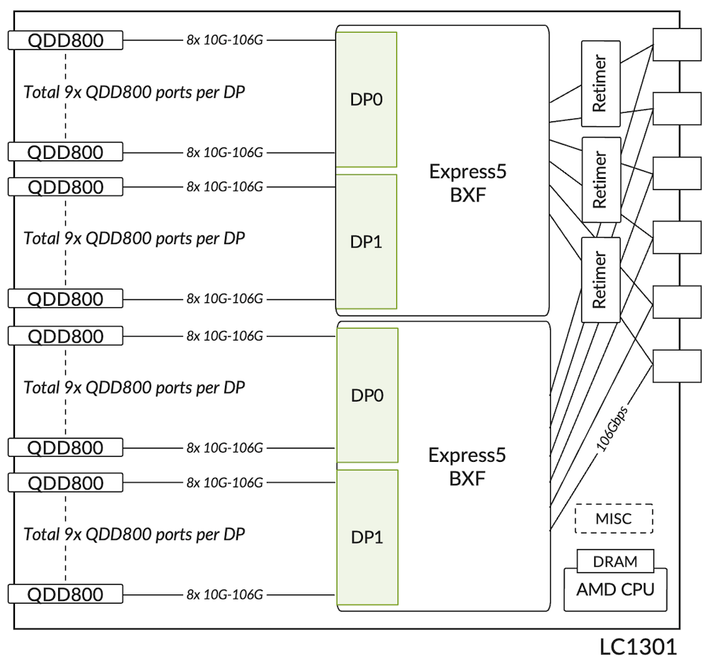

The card is composed of various boards:

- a main PCB (Printed Circuit Board) hosting
  - cages for 18x 800Gbps ports
  - two NPUs covered by large heat sinks
  - PHYs/Retimers between the NPU and Fabric connectors
  - Many other components for internal Ethernet connectivity (10Gbps to each PFE DataPath and the Routing Engines), I2C, timing, power distribution, and voltage conversion, etc.
- a mezzanine board hosting 18x 800Gbps ports and connected by flyover cables
- a processor mezzanine board (PMB) with an 8-core AMD CPU and 64GB of RAM

We don't have PHYs present between the ports and the Forwarding ASICs. But we still use 3 of them between the NPUs and the fabric connectors, as it is generally the case for modular systems where long traces and physical connectors require a signal boost and realignment to guarantee SI (Signal Integrity).

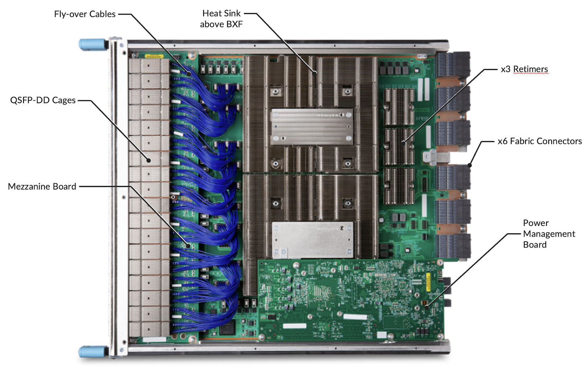

From Junos' perspective, we see:

- two BXF chipsets ("PFE-instances" 0 and 1 in following output)
- four DataPaths (aka "PFE" 0 to 3 in following output)

```
root@ptx10008> show chassis fpc 3 pfe-instance all    

FPC 3
PFE-Instance    PFE          PFE-State
0               0            ONLINE               
0               1            ONLINE               
1               2            ONLINE               
1               3            ONLINE               

{master}
root@ptx10008>
```

Each DataPath is seen as a 7.2Tbps PFE:

```
root@ptx10008> show chassis fpc 3 detail 
Slot 3 information:
  State                               Online    
  Temperature                      48 degrees C / 118 degrees F (BX-0 HBM-0)
  Temperature                      50 degrees C / 122 degrees F (BX-0 HBM-1)
  Temperature                      50 degrees C / 122 degrees F (BX-1 HBM-0)
  Temperature                      49 degrees C / 120 degrees F (BX-1 HBM-1)
  Temperature                      30 degrees C / 86 degrees F (CPU)
  Total CPU DRAM                 65536 MB
  Start time                          2025-08-07 04:34:00 PDT
  Uptime                              32 minutes, 22 seconds
  Max power consumption           3265 Watts

PFE Information:

  PFE  Power ON/OFF  Bandwidth         SLC
  0    On            7200                
  1    On            7200                
  2    On            7200                
  3    On            7200                

{master}
root@ptx10008> show chassis fpc pic-status      
Slot 1   Online       JNP10K-LC1201                                 
  PIC 0  Online       JNP10K-36QDD-LC-PIC
Slot 3   Online       JNP10K-LC1301                                 
  PIC 0  Online       JNP10K-36QDD800-LC-PIC
Slot 6   Online       JNP10K-LC1301                                 
  PIC 0  Online       JNP10K-36QDD800-LC-PIC 

{master} 
root@ptx10008>
```

## Interface Configuration and Options

The following illustration describes the mapping between the ports' position, NPU, and DataPath.

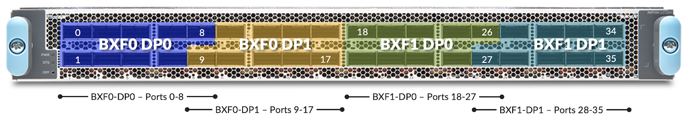

Ports on the bottom row are installed on the main board, while the ports on the top row are located on a mezzanine board and connected via flyover cables. From a user perspective, it's transparent.

### Port Naming Logic (CIC)

The table below summarizes the interface's naming rules, including channelized ports.

All the ports follow the same rules based on the "Common Interface Configuration" model (CIC), regardless of their position in PICs.

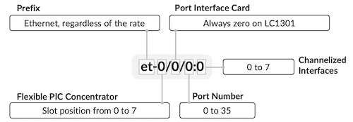

Each physical port is mapped to a unique port group (PG) via 8x SerDes and no intermediate RGB, so we don't have any port combination limitation. You can use all ports with 2x400GigE or 8x100GigE without any constraint. Every port can be configured at the speed you need, but you can only support a unique speed for all members of the same physical port channelized (4x10GigE, 4x25GigE, 8x100GigE, 2x400GigE).

### Ports Capability

The complete list of supported interfaces will be updated soon on the Pathfinder; the following chart provides a couple of examples.

| Rate | Port Type | #SerDes and Rate(Gbps) | #SerDes  Effective Rate (Gbps) |
|:--|:--|:--|:--|
| 800GigE | 1x 800GAUI-8 | 8x 106.25 | 8x 100 |
| 400GigE | 2x 400GAUI-4 | 4x 106.25 | 4x 100 |
| 400GigE | 1x 400GAUI-8 | 8x 53.125 | 8x 50 |
| 200GigE | 2x 200GAUI-4 | 4x 53.125 | 4x 50 |
| 100GigE | 8x 100GAUI-1 | 1x 106.25 | 1x 100 |
| 100GigE | 2x 100GAUI-4 | 4x 26.56254x 25.78125 | 4x 25 |
| 50GigE | 2x LAUI-2 | 2x 25.78125 | 2x 25 |
| 40GigE | 1x XLAUI | 4x 10.3125 | 4x 10 |
| 25GigE | 4x 25GAUI-1 | 1x 25.78125 | 1x 25 |
| 10GigE | 1x XFI | 1x 10.3125 | 1x 10 |

> Note that we will interchangeably use the "effective bandwidth" (amount of WAN traffic from revenue ports) or the actual bandwidth of the SerDes (106.25/100 or 53.125/50 for example).

As a quick on-box reference, the following CLI command shows transceivers plugged into the port, plus the port speed capabilities (note: it shows capabilities and not necessarily the software support. Please use the port checker and hardware compatibility tools on apps.juniper.net to verify the support).

```
root@ptx10008> show chassis pic fpc-slot 3 pic-slot 0 
FPC slot 3, PIC slot 0 information:
  Type                             JNP10K-36QDD800-LC-PIC
  State                            Online    
  PIC version                    00.00
  Uptime                           33 minutes, 58 seconds

Port speed information:

  Port  PFE      Capable Port Speeds
  0      0       1x10G 4x10G 1x40G 4x25G 1x100G 2x50G 4x50G 8x25G 8x50G 2x100G 3x100G 4x100G 1x400G 1x800G 2x400G 5x100G 6x100G 7x100G 8x100G 4x200G 
  1      0       1x10G 4x10G 1x40G 4x25G 1x100G 2x50G 4x50G 8x25G 8x50G 2x100G 3x100G 4x100G 1x400G 1x800G 2x400G 5x100G 6x100G 7x100G 8x100G 4x200G 
  2      0       1x10G 4x10G 1x40G 4x25G 1x100G 2x50G 4x50G 8x25G 8x50G 2x100G 3x100G 4x100G 1x400G 1x800G 2x400G 5x100G 6x100G 7x100G 8x100G 4x200G 
  3      0       1x10G 4x10G 1x40G 4x25G 1x100G 2x50G 4x50G 8x25G 8x50G 2x100G 3x100G 4x100G 1x400G 1x800G 2x400G 5x100G 6x100G 7x100G 8x100G 4x200G 
  4      0       1x10G 4x10G 1x40G 4x25G 1x100G 2x50G 4x50G 8x25G 8x50G 2x100G 3x100G 4x100G 1x400G 1x800G 2x400G 5x100G 6x100G 7x100G 8x100G 4x200G 
  5      0       1x10G 4x10G 1x40G 4x25G 1x100G 2x50G 4x50G 8x25G 8x50G 2x100G 3x100G 4x100G 1x400G 1x800G 2x400G 5x100G 6x100G 7x100G 8x100G 4x200G 
  6      0       1x10G 4x10G 1x40G 4x25G 1x100G 2x50G 4x50G 8x25G 8x50G 2x100G 3x100G 4x100G 1x400G 1x800G 2x400G 5x100G 6x100G 7x100G 8x100G 4x200G 
  7      0       1x10G 4x10G 1x40G 4x25G 1x100G 2x50G 4x50G 8x25G 8x50G 2x100G 3x100G 4x100G 1x400G 1x800G 2x400G 5x100G 6x100G 7x100G 8x100G 4x200G 
  8      0       1x10G 4x10G 1x40G 4x25G 1x100G 2x50G 4x50G 8x25G 8x50G 2x100G 3x100G 4x100G 1x400G 1x800G 2x400G 5x100G 6x100G 7x100G 8x100G 4x200G 
  9      1       1x10G 4x10G 1x40G 4x25G 1x100G 2x50G 4x50G 8x25G 8x50G 2x100G 3x100G 4x100G 1x400G 1x800G 2x400G 5x100G 6x100G 7x100G 8x100G 4x200G 
  10     1       1x10G 4x10G 1x40G 4x25G 1x100G 2x50G 4x50G 8x25G 8x50G 2x100G 3x100G 4x100G 1x400G 1x800G 2x400G 5x100G 6x100G 7x100G 8x100G 4x200G 
  11     1       1x10G 4x10G 1x40G 4x25G 1x100G 2x50G 4x50G 8x25G 8x50G 2x100G 3x100G 4x100G 1x400G 1x800G 2x400G 5x100G 6x100G 7x100G 8x100G 4x200G 
  12     1       1x10G 4x10G 1x40G 4x25G 1x100G 2x50G 4x50G 8x25G 8x50G 2x100G 3x100G 4x100G 1x400G 1x800G 2x400G 5x100G 6x100G 7x100G 8x100G 4x200G 
  13     1       1x10G 4x10G 1x40G 4x25G 1x100G 2x50G 4x50G 8x25G 8x50G 2x100G 3x100G 4x100G 1x400G 1x800G 2x400G 5x100G 6x100G 7x100G 8x100G 4x200G 
  14     1       1x10G 4x10G 1x40G 4x25G 1x100G 2x50G 4x50G 8x25G 8x50G 2x100G 3x100G 4x100G 1x400G 1x800G 2x400G 5x100G 6x100G 7x100G 8x100G 4x200G 
  15     1       1x10G 4x10G 1x40G 4x25G 1x100G 2x50G 4x50G 8x25G 8x50G 2x100G 3x100G 4x100G 1x400G 1x800G 2x400G 5x100G 6x100G 7x100G 8x100G 4x200G 
  16     1       1x10G 4x10G 1x40G 4x25G 1x100G 2x50G 4x50G 8x25G 8x50G 2x100G 3x100G 4x100G 1x400G 1x800G 2x400G 5x100G 6x100G 7x100G 8x100G 4x200G 
  17     1       1x10G 4x10G 1x40G 4x25G 1x100G 2x50G 4x50G 8x25G 8x50G 2x100G 3x100G 4x100G 1x400G 1x800G 2x400G 5x100G 6x100G 7x100G 8x100G 4x200G 
  18     2       1x10G 4x10G 1x40G 4x25G 1x100G 2x50G 4x50G 8x25G 8x50G 2x100G 3x100G 4x100G 1x400G 1x800G 2x400G 5x100G 6x100G 7x100G 8x100G 4x200G 
  19     2       1x10G 4x10G 1x40G 4x25G 1x100G 2x50G 4x50G 8x25G 8x50G 2x100G 3x100G 4x100G 1x400G 1x800G 2x400G 5x100G 6x100G 7x100G 8x100G 4x200G 
  20     2       1x10G 4x10G 1x40G 4x25G 1x100G 2x50G 4x50G 8x25G 8x50G 2x100G 3x100G 4x100G 1x400G 1x800G 2x400G 5x100G 6x100G 7x100G 8x100G 4x200G 
  21     2       1x10G 4x10G 1x40G 4x25G 1x100G 2x50G 4x50G 8x25G 8x50G 2x100G 3x100G 4x100G 1x400G 1x800G 2x400G 5x100G 6x100G 7x100G 8x100G 4x200G 
  22     2       1x10G 4x10G 1x40G 4x25G 1x100G 2x50G 4x50G 8x25G 8x50G 2x100G 3x100G 4x100G 1x400G 1x800G 2x400G 5x100G 6x100G 7x100G 8x100G 4x200G 
  23     2       1x10G 4x10G 1x40G 4x25G 1x100G 2x50G 4x50G 8x25G 8x50G 2x100G 3x100G 4x100G 1x400G 1x800G 2x400G 5x100G 6x100G 7x100G 8x100G 4x200G 
  24     2       1x10G 4x10G 1x40G 4x25G 1x100G 2x50G 4x50G 8x25G 8x50G 2x100G 3x100G 4x100G 1x400G 1x800G 2x400G 5x100G 6x100G 7x100G 8x100G 4x200G 
  25     2       1x10G 4x10G 1x40G 4x25G 1x100G 2x50G 4x50G 8x25G 8x50G 2x100G 3x100G 4x100G 1x400G 1x800G 2x400G 5x100G 6x100G 7x100G 8x100G 4x200G 
  26     2       1x10G 4x10G 1x40G 4x25G 1x100G 2x50G 4x50G 8x25G 8x50G 2x100G 3x100G 4x100G 1x400G 1x800G 2x400G 5x100G 6x100G 7x100G 8x100G 4x200G 
  27     3       1x10G 4x10G 1x40G 4x25G 1x100G 2x50G 4x50G 8x25G 8x50G 2x100G 3x100G 4x100G 1x400G 1x800G 2x400G 5x100G 6x100G 7x100G 8x100G 4x200G 
  28     3       1x10G 4x10G 1x40G 4x25G 1x100G 2x50G 4x50G 8x25G 8x50G 2x100G 3x100G 4x100G 1x400G 1x800G 2x400G 5x100G 6x100G 7x100G 8x100G 4x200G 
  29     3       1x10G 4x10G 1x40G 4x25G 1x100G 2x50G 4x50G 8x25G 8x50G 2x100G 3x100G 4x100G 1x400G 1x800G 2x400G 5x100G 6x100G 7x100G 8x100G 4x200G 
  30     3       1x10G 4x10G 1x40G 4x25G 1x100G 2x50G 4x50G 8x25G 8x50G 2x100G 3x100G 4x100G 1x400G 1x800G 2x400G 5x100G 6x100G 7x100G 8x100G 4x200G 
  31     3       1x10G 4x10G 1x40G 4x25G 1x100G 2x50G 4x50G 8x25G 8x50G 2x100G 3x100G 4x100G 1x400G 1x800G 2x400G 5x100G 6x100G 7x100G 8x100G 4x200G 
  32     3       1x10G 4x10G 1x40G 4x25G 1x100G 2x50G 4x50G 8x25G 8x50G 2x100G 3x100G 4x100G 1x400G 1x800G 2x400G 5x100G 6x100G 7x100G 8x100G 4x200G 
  33     3       1x10G 4x10G 1x40G 4x25G 1x100G 2x50G 4x50G 8x25G 8x50G 2x100G 3x100G 4x100G 1x400G 1x800G 2x400G 5x100G 6x100G 7x100G 8x100G 4x200G 
  34     3       1x10G 4x10G 1x40G 4x25G 1x100G 2x50G 4x50G 8x25G 8x50G 2x100G 3x100G 4x100G 1x400G 1x800G 2x400G 5x100G 6x100G 7x100G 8x100G 4x200G 
  35     3       1x10G 4x10G 1x40G 4x25G 1x100G 2x50G 4x50G 8x25G 8x50G 2x100G 3x100G 4x100G 1x400G 1x800G 2x400G 5x100G 6x100G 7x100G 8x100G 4x200G 

{master}
root@ptx10008> 
```

Interesting to note that 800Gbps ports can support:

- QDD-2x400G, QDD-8x100G with Dual LC-Duplex
- And 8x100G interfaces with Dual MPO-12.

In both cases, there are 2 independent connectors (a pair) housed on a single transceiver which will simplify cable management:

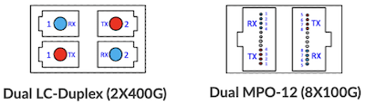

These connectors enable the high 400GigE port density without requiring specific breakout cables or patch panels: natively, we support 72x 400GigE ports per LC1301.

### Port Restrictions?

The LC1301 offers connectivity for 36 ports. They are QSFP-DD800 cages respecting the MSA recommendations ([http://www.qsfp-dd.com/](http://www.qsfp-dd.com/)). Physical ports are clubbed in 1x3 cages, guaranteeing the support of high-power optics on all the interfaces of the card (up to 30W each), both in terms of power and cooling capacity. Taken into consideration altitude and ambient temperature withing the datasheet specs, you can populate the cards with ZR/ZRP optics on all the ports.

These cages support optics from 10GbE with SFP+ and QSA (QSFP to SFP mechanical Adaptor) up to 800GbE with QDD800, with no restriction on the port distribution. Contrary to other line cards and systems where ports are connected to the PFE via an intermediate PHY component, on LC1301, all ports can be configured in channelized mode without having to configure the adjacent ports 'unused'.

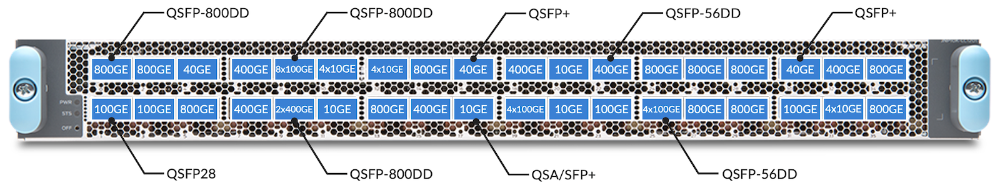

Note: the 1GbE pluggable optics are NOT supported on LC1301 ports.

### Supported Optic Modules

To get a detailed view of the supported options, we invite you to rely on this Hardware Compatibility (HCT) page: [https://apps.juniper.net/hct/product/?cat=Line%20Cards&prd=PTX10008](https://apps.juniper.net/hct/product/?cat=Line%20Cards&prd=PTX10008)

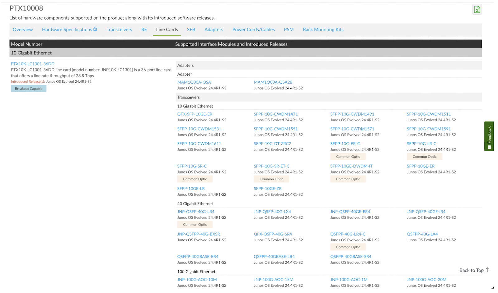

### Max/Min Packet Size

LC1301 supports an MTU (Maximum Transmission Unit) of 16,000 bytes for traffic transiting through the router, the default value being 1,514 bytes.

```
root@ptx10008> show interfaces et-0/0/0 extensive 
Physical interface: et-0/0/0, Enabled, Physical link is Up
  Interface index: 1217, SNMP ifIndex: 1139, Generation: 592705488044
  Link-level type: Ethernet, MTU: 1514, LAN-PHY mode, Speed: 800Gbps, BPDU Error: None, Loop Detect PDU Error: None, Ethernet-Switching Error: None, 
```

The lowest configurable MTU is 576 Bytes

```
root@ptx10008# set interfaces et-0/0/0 mtu ?
Possible completions:
  <mtu>                Maximum transmit packet size (576..16000)
{master}[edit]
root@ ptx10008#
```

Note the maximum packet size for host traffic (traffic targeted to the router itself) is not 16,000 but 9,600 bytes.

## Interop with Express4 Line Cards

In a PTX10008 chassis, you will be able to mix two different line card generations (Express4 and Express5), interconnected by SF3 or SF5.

In such a case, a packet can potentially be received on an LC1201 port, handled by the ingress pipeline of an Express4, then passed via the fabric to an LC1301, where the egress pipeline of an Express5 will handle it. Or vice versa.

The Express5 ASIC not only offers much more bandwidth and faster interfaces, but is also more scalable and richer than Express4, in terms of features. When mixing the two generations, we carefully considered the potential impact on all features.

By default, the system will be operated in "interop-mode", supporting both LC generations:

- It doesn't change the Express4 line card capabilities or scale.
- But on the LC1301 card, the Express5 may not be used to its fullest, potentially aligned to the Express4 supported features and scales.

The interop-mode is supported starting from Junos 25.4R2.

Certain features, specific to Express5, will not be enabled in this mode. For example, some SRv6 features, BIER, HQoS, will not be configurable.

```
root@ptx10008> show chassis interoperability    
Chassis Interoperability Mode: default

{master}
root@ptx10008>
```

If the chassis is populated with LC1301 only, another mode can be configured:

```
root@ptx10008> set chassis interoperability express5-enhanced
```

Note: It will trigger a reload of the system to enable this feature.

```
root@ptx10008> show chassis interoperability    
Chassis Interoperability Mode: express5-enhanced

{master}
root@ptx10008>
```

In this mode, any LC1201 or LC1202 inserted in the chassis will be kept offline:

```
root@ptx10008> show chassis fpc detail 
Slot 2 information:
  State                               Offline   
  Reason                              FPC incompatible with interop config
  PFE Type                            Express-4
```

Now that the system is entirely composed of Express5, all the specific features and scale can be enabled, comparable to a standalone system like the PTX10002-36QDD.

## Migration Path and Supported Configurations

The LC1301 can be inserted in a PTX10008 chassis with no specific preparation aside from a minimum Junos release. It means it will work with existing fabric cards (SF3), existing cooling system (Fan Trays FT2 and controller FTC2), and existing power supply system (PSM2).

But of course, it doesn't mean the card can be used to its full capacity.

In such a scenario, the line card will be limited to 16x ports 800Gbps or 36x ports 400Gbps.

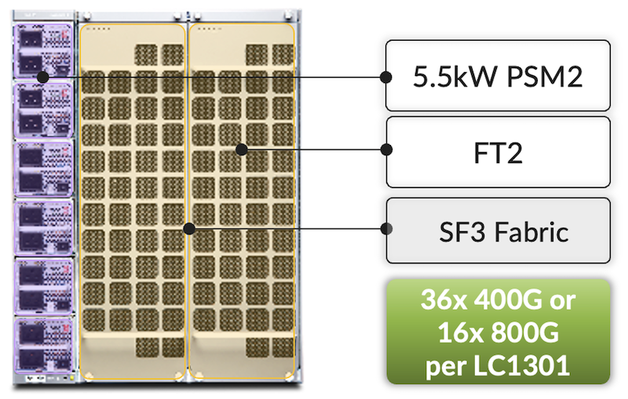

In this configuration, the forwarding capacity for WAN traffic will be 12.8Tbps (and not 14.4Tbps). Check the section "LC1301 with SF3 Fabric Cards" for more details.

When we upgrade the fabric cards to new-generation SF5, we will increase the forwarding capability.

Note: this fabric migration will require a system power off since we don't support the coexistence of SF3+SF5 in the same chassis.
At this point, the system is limited in terms of power and cooling (remember, we are still using the second-generation parts).

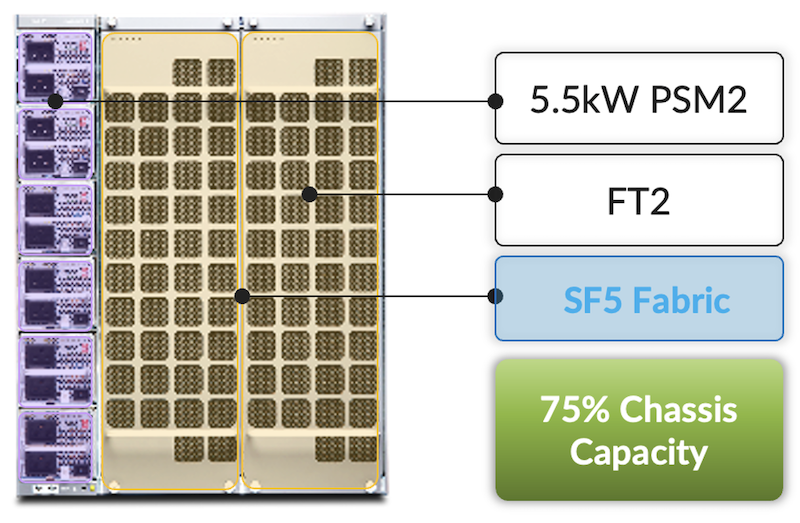

75% of the chassis capacity here means 6x LC1301 line cards in the system. But keep in mind, it's a hardware estimation based on the power and cooling requirements of the cards. But it will not be enforced by software based on the number of slots occupied. We will leverage the Power Management feature to decide if a line card can be booted (based on the maximum consumption of each slot, and the maximum system capacity).

```
root@ptx10008> show chassis power detail | find "System:"        
System:
  Zone 0:
      Capacity:          15500 W (maximum 16500 W)
      Allocated power:   9420 W (6080 W remaining)
      Actual usage:      2319 W
  Total system capacity: 15500 W (maximum 16500 W)
  Total remaining power: 6080 W

{master}
root@ptx10008>
```

To enable the full potential of the system, we will upgrade the power modules and the cooling system:

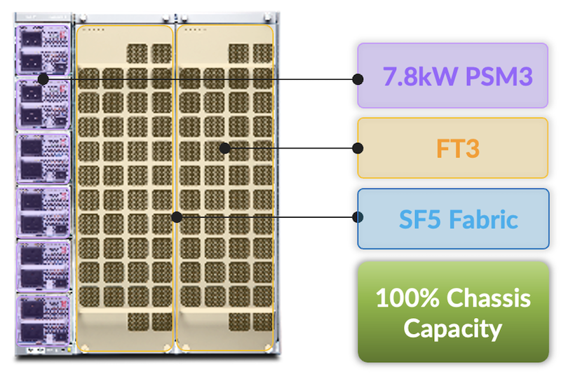

In this last configuration, your PTX10k8 operates as an 8x 36x 800Gbps = 230.4Tbps chassis.

## LC1301 with SF5 Fabric Cards

The following Figure 17 represents the new fabric cards for the PTX10008 chassis. They are composed of three Express5 BF chipsets, retimers, and orthogonal direct connectors.

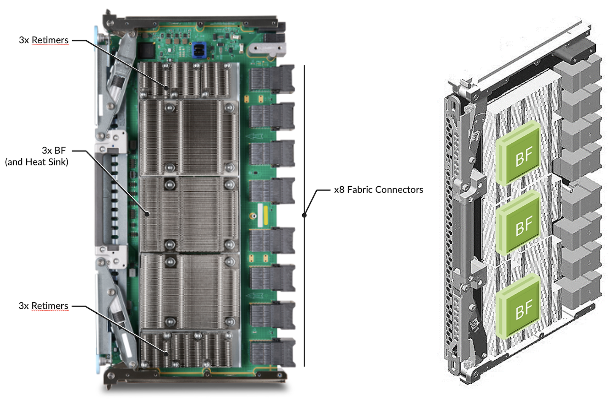

```
root@ptx10008> show chassis hardware | find SIB 
  
SIB 0            REV 06   750-136652   BCEN5947          SIB-JNP10008-SF5
SIB 1            REV 07   750-136652   BCEK4436          SIB-JNP10008-SF5
SIB 2            REV 13   750-136652   BCFE8684          SIB-JNP10008-SF5
SIB 3            REV 13   750-136652   BCFE8692          SIB-JNP10008-SF5
SIB 4            REV 13   750-136652   BCFE8704          SIB-JNP10008-SF5
SIB 5            REV 07   750-136652   BCEK4437          SIB-JNP10008-SF5
FTC 0            REV 19   750-083435   BCDW6943          Fan Controller 8
FTC 1            REV 19   750-083435   BCEM0558          Fan Controller 8
Fan Tray 0       REV 15   750-103312   BCEH6761          Fan tray 8
Fan Tray 1       REV 15   750-103312   BCED9771          Fan tray 8

{master}
root@ptx10008>
```

Each BF chipset of an SF5 fabric card is connected to all PFEs of the router, in a full-mesh design.

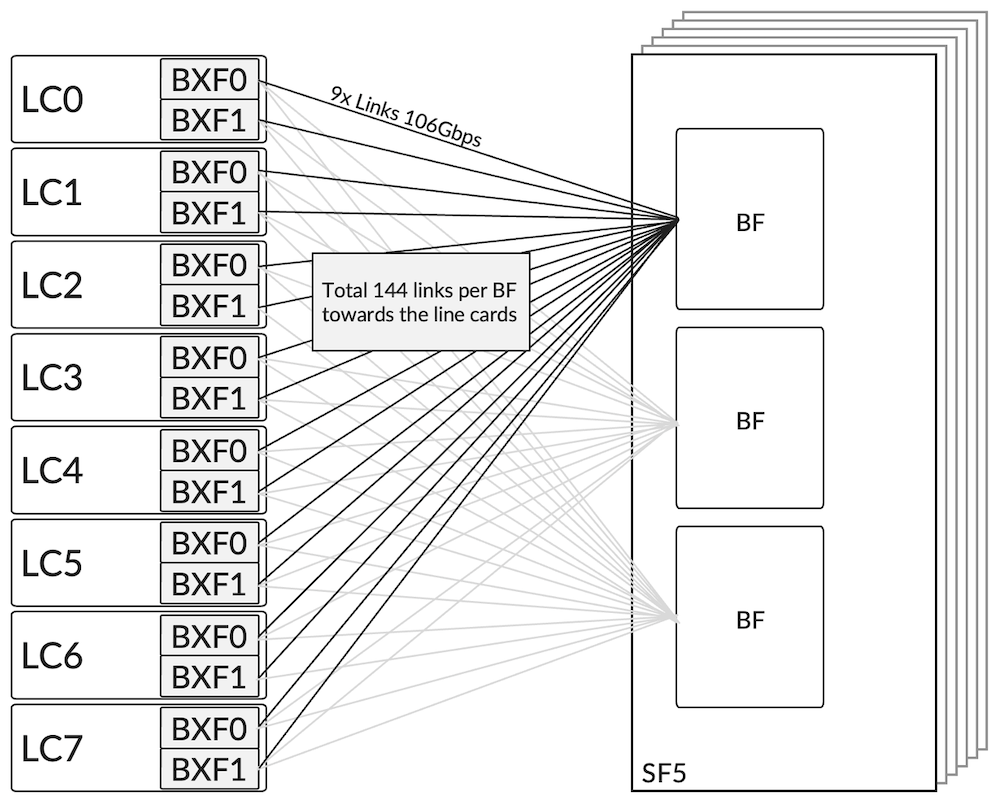

Or, from the line card perspective:

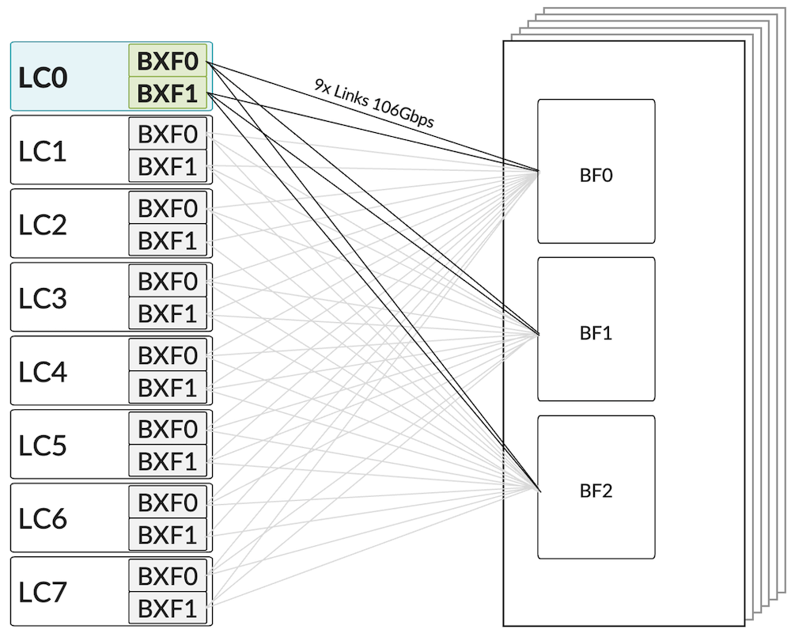

If we double-click on LC0, we see the distribution of these 9x links for each Express5 BXF package of the card.

To push 7.2Tbps of WAN traffic, the DP needs to forward around 8.1Tbps to the fabric (12.5% more due to the various packet overhead), that is 16.2Tbps per BXF.

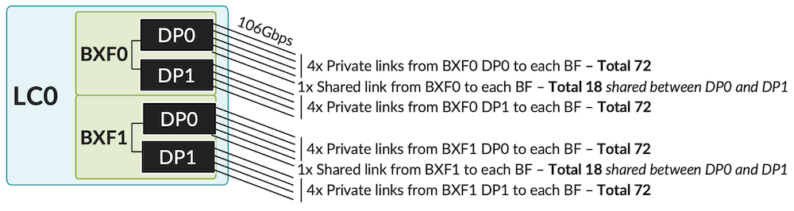

We won't go into the details of the difference between private and shared fabric link in this document since it's mostly transparent for the final user. We mention it only because it will explain the port density in the next section (LC1301 with SF3). Let's just say a shared link "lands" on the DP0: half of the bandwidth is targeted to DP0 but the other half is transmitted to the DP1 through an inter-DP connection.

So, the bandwidth of a DataPath is the sum of:

72x 100Gbps from private links + half of 18x 100Gbps shared links (or 18x 50Gbps) = 72x 100 + 18/2x100 = 8.1Tbps.

### Running the Chassis with Less Than 6x SF5

Operating the system with six or fewer fabric cards will have a linear impact on the forwarding capability of each PFE/DataPath. It's essential to understand this aspect: if you are not consuming the entire bandwidth of a DataPath, the remaining forwarding capability is not dynamically re-allocated to a busier PFE. The number of available fabric cards equally impacts all PFEs.

| SF5 | BW per PFE/DP | BW per LC1301 slot | 800GbE per slot | 400GbE per slot |
|:--|:--|:--|:--|:--|
| 6 | 7.2Tbps | 28.8 Tbps | 36 | 72 |
| 5 | 6Tbps | 24Tbps | 30 | 60 |
| 4 | 4.8Tbps | 19.2Tbps | 24 | 48 |
| 3 | 3.6Tbps | 14.4Tbps | 18 | 36 |
| 2 | 2.4Tbps | 9.6Tbps | 12 | 24 |

Multiple options exist when ordering the system: from 3 to 6 fabric cards

- 3x SF5: PTX10008-BASE5 (with 1x RE)
- 4x SF5: PTX10008-PREM4 (with 2x RE)
- 6x SF5: PTX10008-PREM5 (with 2x RE)

## LC1301 with SF3 Fabric Cards

Operating the new Express5-based LC1301 with existing fabric cards SF3 is planned to be released soon (contact your favorite Juniper account team to get more details).

This operation mode will permit the utilization of the line card with 12.8Tbps of forwarding capacity for the WAN side.

In terms of connectivity that will translate to:

- 16x 800GbE ports (12.8Tbps)
- 36x 400GbE ports (14.4Tbps of connectivity but limited to 12.8Tbps of forwarding).

This 12.5% oversubscription (14.4 to 12.8) are caused but the unusable shared links connected to the DP0 in Figure 20. The SF3 fabric cards are composed of 3x ZF ASICs connected to the forwarding ASICs with 53Gbps SerDes (50Gbps of effective traffic). In this mode of operation, the shared links cannot be used between BXF and ZF.

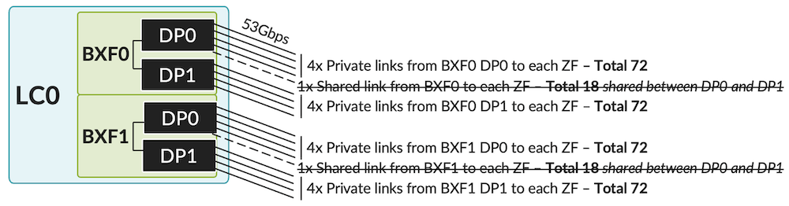

### Forwarding Capability

Each PFE-instance can use 72+72=144 links at 50Gbps. With a 12.5% overhead, we reach:

(72+72) x 50 / 1.125 = 6.4Tbps of effective (WAN traffic) global forwarding capability per BXF, or 3.2Tbps per DP.

### 800GbE Port Density

Each DataPath is limited to 72x 50Gbps of effective bandwidth, consequently, it can only service 4x 800GbE ports:

72 links / 16 per 800G = 4.5
--> RoundDown to an Integer of (72/16) = 4

And since we have 4 DPs per line card, we support up to 4 x 4 = 16 ports.

### 400GbE Port Density

For the 400GbE port density, the round down to an integer of (72/8) equals 9, multiplied by 4 DPs, we have 36 ports 400GbE per slot.

## Third Generation Fan Trays and Power Supply

We recommend upgrading existing chassis to a new generation power and cooling system to operate Express5 line cards, even if a smooth transition is possible as described earlier in the section "Migration Path and Supported Configuration".

Note: both 4-slot and 8-slot chassis can be upgraded for fans and power, but only the 8-slot chassis can use Express5-based fabric cards today.

The new generation PSM3 improved the power capacity from 5,500W to 7,800W per module.

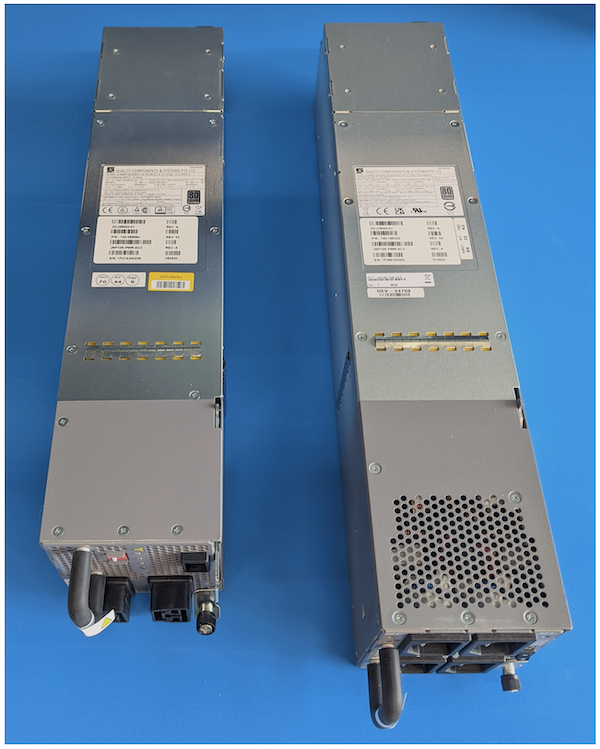

In the picture above, we see the size difference between the two generations of AC power modules. The PSM3 offers four plugs at 15A or 20A (configurable with a dip switch as shown in Figure 23 below).

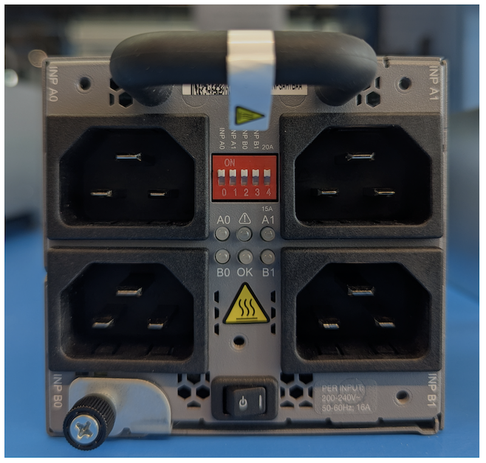

For cooling efficiency, the PTX10008 must be populated by 6 PSMs, even if they are not powered up. They have an internal fan system that maintains consistent pressure in the chassis. Even if they are turned off, the fan is powered by the bus and continues to operate.

By default, the bundles PTX10008-PREM4, PTX10008-PREM5, and PTX10008-BASE5 come with 6x PSM3. They exist in AC, ACHV, and DC (JNP10K-PWR-AC3/DC3/AC3H).

You can mix 5,500W and 7,800W in the same chassis, but you cannot mix AC and DC.

If you desire to purchase a chassis with a lower number of power modules, you can use active blanks (JNP10K-PWR-BLN3) in the power slots. They are blank modules but with fans and sensors.

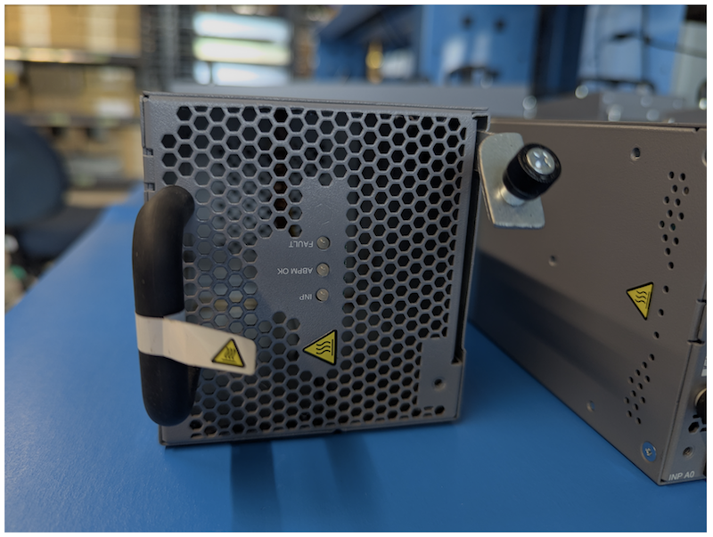

Some new redundancy features have been added, but they are out of the scope of this document.

Regarding the cooling system, we also introduce a third generation of Fan Trays and Fan Tray Controllers (power and cooling are going hand in hand; the energy needs to be dissipated). From a physical standpoint, the v2 and v3 are very similar externally: v3 is just slightly deeper.

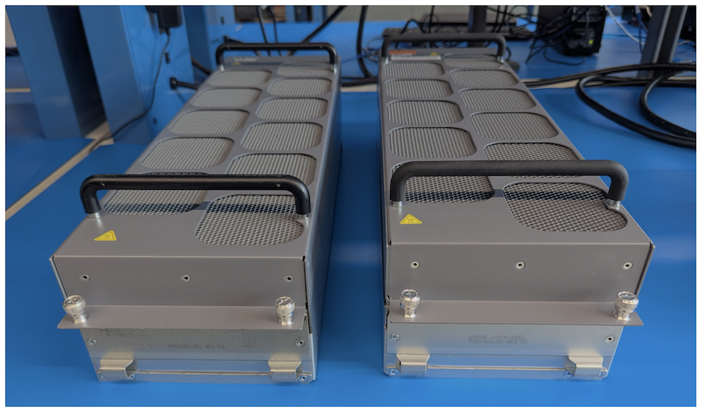

To operate JNP10004-FAN3 or JNP10008-FAN3, you also need to upgrade the controller (JNP10004-FTC3 or JNP10008-FTC3).

Checking power modules and real-time consumption on the chassis:

```
root@ptx10008> show chassis power
Chassis Power        Voltage(V)    Power(W)
Total Input Power                  42020
  PSM 0
    State: Online
    INP-A0              199         1700
    INP-A1              199         1740
    INP-B0              197         1740
    INP-B1              199         1740
    Output            12.49        6268.08   (20A input select)
  PSM 1
    State: Online
    INP-A0              197         1740
    INP-A1              199         1740
    INP-B0              197         1740
    INP-B1              195         1740
    Output            12.45        6323.18   (20A input select)
  PSM 2
    State: Online
    INP-A0              197         1740
    INP-A1              199         1760
    INP-B0              199         1740
    INP-B1              197         1760
    Output            12.45        6379.22   (20A input select)
  PSM 3
    State: Online
    INP-A0              197         1760
    INP-A1              197         1740
    INP-B0              199         1760
    INP-B1              195         1760
    Output            12.41        6396.44   (20A input select)
  PSM 4
    State: Online
    INP-A0              197         1740
    INP-A1              199         1760
    INP-B0              199         1760
    INP-B1              199         1780
    Output            12.43        6369.21   (20A input select)
  PSM 5
    State: Online
    INP-A0              199         1780
    INP-A1              199         1760
    INP-B0              199         1760
    INP-B1              199         1780
    Output            12.41        6433.68   (20A input select)

System:
  Zone 0:
      Capacity:          46800 W (maximum 46800 W)
      Allocated power:   25890 W (20910 W remaining)
      Actual usage:      42020 W
  Total system capacity: 46800 W (maximum 46800 W)
  Total remaining power: 20910 W

{master}
root@ptx10008>
```

## Power Operation Modes and Energy Saving

Multiple power-saving features are available on the LC1301:

- Feature 1: SerDes of empty ports are automatically shut down
- Feature 2: Ports can be configured "unused" individually
- Feature 3: One of the two BXFs can be shut down. It will reduce the forwarding capacity by half and the number of ports to 18
- Feature 4: We can operate the Forwarding engines in low power mode, where all ports support up to 400GbE optics (instead of 800GbE/2x400GbE/8x100GbE).
- Feature 5: And you can mix the last two features with one BXF shutdown and the second one operating in power-optimized mode
- Feature 6: Clockgate, the part responsible for the MACsec encryption in the Port Group if MACsec is not configured.
- Feature 7: Operate the chassis with fewer than 6 SF5 cards

The line card doesn't use PHY components between optical cages and PFE. This aspect can be ignored for LC1301.

### Empty Port

This behavior is consistent with PTX systems and line cards of the previous generation. It's transparent to the operator and doesn't require any specific configuration: an empty cage doesn't need to be connected to the PFE, we don't need to maintain these SerDes in "up" state, consuming energy for no service delivered.

### Port Configured "unused"

The SerDes of an empty port are shut down automatically. The "unused" configuration provides the same behavior even if the cage contains a pluggable optic.

After committing this config, the cage is no longer providing power to the optical module, turning it off entirely. Also, it shuts down the SerDes used between the cage and the port group. The amount of energy saved will depend on the optic inserted in this slot (and therefore the SerDes speed).

Note that we can track the power utilization of the optical cages individually with this cli-pfe (therefore unsupported) command. These numbers only take the optics part, not the WAN SerDes.

```
root@ptx10008> start shell pfe network fpc5    
Trying 128.0.0.21...
Connected to fpc5.
Escape character is '^]'.

root@ptx10008:pfe> show mpm54522 summary 

DevName           PowerNotGood      Channel-Power(W)    Total-Power   VCC-Volt   XCVR-Present  Temp(+/-5C)
MPM54522-5/0/0      N  N             0.00  0.00           0.00           0.00     No             below 80
MPM54522-5/0/1      N  N             7.05  7.42          14.47           3.28     Yes            below 80
MPM54522-5/0/2      N  N             2.60  2.30           4.89           3.25     Yes            below 80
MPM54522-5/0/3      N  N             2.27  2.61           4.88           3.25     Yes            below 80
MPM54522-5/0/4      N  N             0.16  0.00           0.16           3.28     Yes            below 80
MPM54522-5/0/5      N  N             0.00  0.00           0.00           3.30     Yes            below 80
MPM54522-5/0/6      N  N             0.00  0.00           0.00           0.00     No             below 80
MPM54522-5/0/7      N  N             0.00  0.00           0.00           0.00     No             below 80
MPM54522-5/0/8      N  N             0.00  0.00           0.00           0.00     No             below 80
MPM54522-5/0/9      N  N             6.40  6.26          12.66           3.28     Yes            below 80
MPM54522-5/0/10     N  N             0.00  0.00           0.00           0.00     No             below 80
MPM54522-5/0/11     N  N             0.00  0.00           0.00           0.00     No             below 80
MPM54522-5/0/12     N  N             0.00  0.00           0.00           0.00     No             below 80
MPM54522-5/0/13     N  N             0.00  0.00           0.00           0.00     No             below 80
MPM54522-5/0/14     N  N             0.00  0.00           0.00           0.00     No             below 80
MPM54522-5/0/15     N  N             0.00  0.00           0.00           0.00     No             below 80
MPM54522-5/0/16     N  N             0.00  0.00           0.00           0.00     No             below 80
MPM54522-5/0/17     N  N             0.00  0.00           0.00           0.00     No             below 80
MPM54522-5/0/18     N  N             0.00  0.00           0.00           0.00     No             below 80
MPM54522-5/0/19     N  N             0.00  0.00           0.00           0.00     No             below 80
MPM54522-5/0/20     N  N             0.00  0.00           0.00           0.00     No             below 80
MPM54522-5/0/21     N  N             0.00  0.00           0.00           0.00     No             below 80
MPM54522-5/0/22     N  N             0.00  0.00           0.00           0.00     No             below 80
MPM54522-5/0/23     N  N             0.00  0.00           0.00           0.00     No             below 80
MPM54522-5/0/24     N  N             0.00  0.00           0.00           0.00     No             below 80
MPM54522-5/0/25     N  N             0.66  1.32           1.98           3.30     Yes            below 80
MPM54522-5/0/26     N  N             0.00  0.00           0.00           0.00     No             below 80
MPM54522-5/0/27     N  N             5.44  4.97          10.41           3.30     Yes            below 80
MPM54522-5/0/28     N  N             0.00  0.00           0.00           0.00     No             below 80
MPM54522-5/0/29     N  N             0.49  1.15           1.64           3.25     Yes            below 80
MPM54522-5/0/30     N  N             0.00  0.00           0.00           0.00     No             below 80
MPM54522-5/0/31     N  N             0.00  0.00           0.00           0.00     No             below 80
MPM54522-5/0/32     N  N             0.00  0.00           0.00           0.00     No             below 80
MPM54522-5/0/33     N  N             2.64  2.48           5.12           3.30     Yes            below 80
MPM54522-5/0/34     N  N             0.00  0.00           0.00           0.00     No             below 80
MPM54522-5/0/35     N  N             0.33  0.16           0.49           3.26     Yes            below 80

root@ptx10008:pfe>
```

### Power Off One of the Two BXFs

When you commit the following configuration:

```
root@ptx10008# set chassis pfc 0 pfe-instance 1 power off
```

It will turn down one of the two Express5 packages of the LC1301 as described in Figure 26 below.

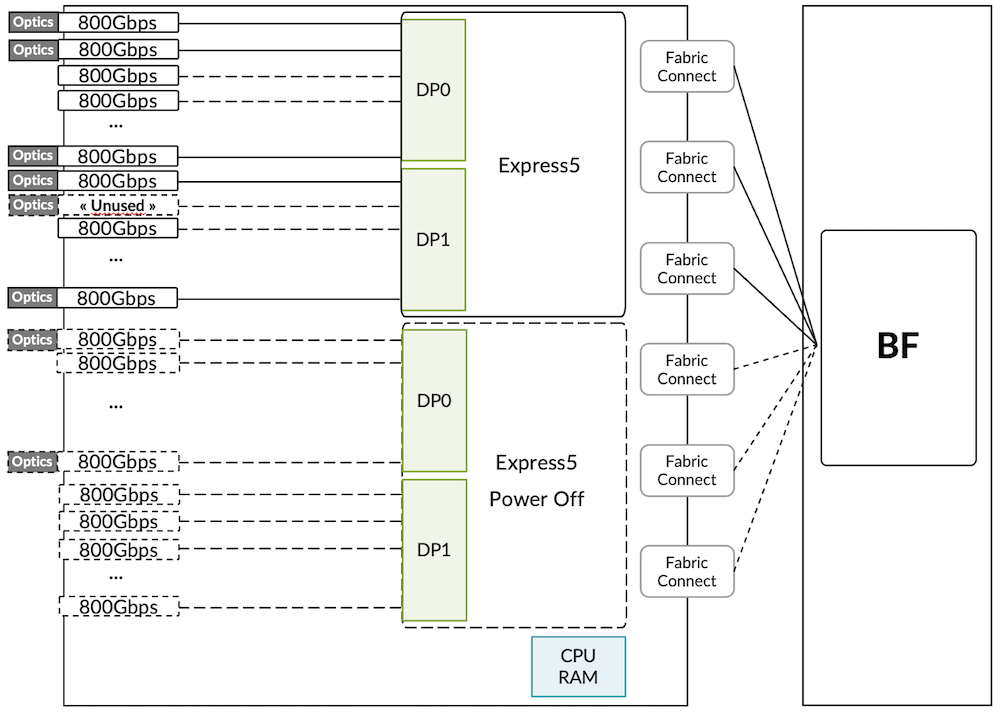

After committing this configuration, the BXF1 package and all its components are shut down. That includes the DataPath and port groups. But it will also shut down the optical cages mapped to the Forwarding ASIC, the associated WAN SerDes, and the Fabric SerDes, too.

In Figure 27, we measure in real-time the energy consumed by the system. No optic module was inserted, so it represents a baseline of the line card FPC0 power consumption.

Also, we display the energy used by one of the six fabric cards (SIB0).

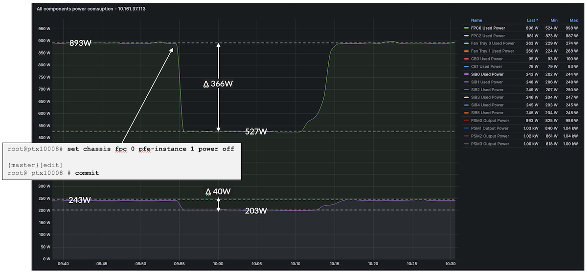

On the line card, we measure more or less 365W of power difference, and on one fabric card, it's around 40W (therefore, we can guesstimate the saving for 6x SF5 to roughly 240W).

That's a total of 600W we can save here.

Keep in mind these numbers are not meant to reflect the exact figures you can expect in your environment: power usage can vary based on multiple factors, including temperature and elevation. Nevertheless, it's an interesting ballpark estimation of the potential gain if you operate a line card with just one PFE out of two.

Note that we don't need to power cycle the chassis or the line card to enable this feature.

### Low Power Mode (Roadmap)

***The following feature is just partially implemented and not fully supported, we only tested the level of power saving it can bring when activated, but again, it's not recommended to try it in production. Results are not guaranteed.***

Another angle will soon be proposed to approach the power saving on LC1301, particularly if you plan to use the system with QSFP56-DD / 400Gbps optics. Note: this feature can be tested in lab environments but it's not officially supported. Please contact your account team or partner to get details on the roadmap.

When this configuration is committed, it will trigger a line card reload automatically, and the BXF will be initialized with a lower clock frequency. Now the ports can be used with optics up to 400Gbps maximum. The line card forwarding capacity is reduced to 14.4Tbps on 36 ports, 7.2Tbps per Express5 BXF / 18 ports, 3.6Tbps per DataPath / 9 ports.

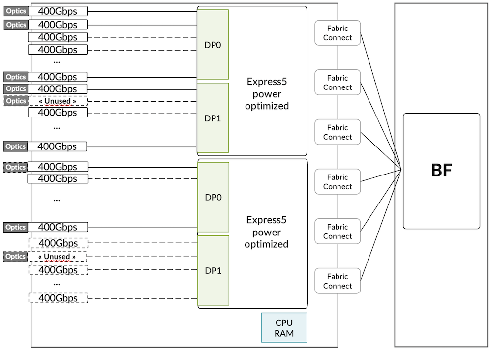

We monitor again the energy consumed in real-time.

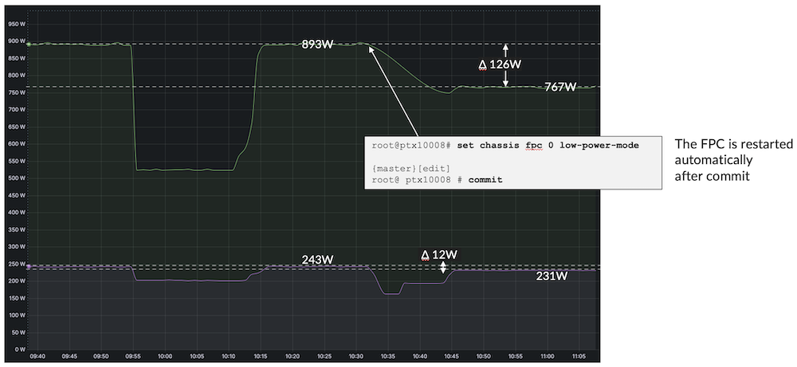

After it restarts, the line card is consuming 125W less, and the fabric card is using around 12W less (70W for 6x SF5), that's around 200W less globally (again, YMMV).

You can also mix these two features, reducing the line card to this 400Gbps / low power mode and then powering off one of the two Express5 BXF, as illustrated in Figure 30 below:

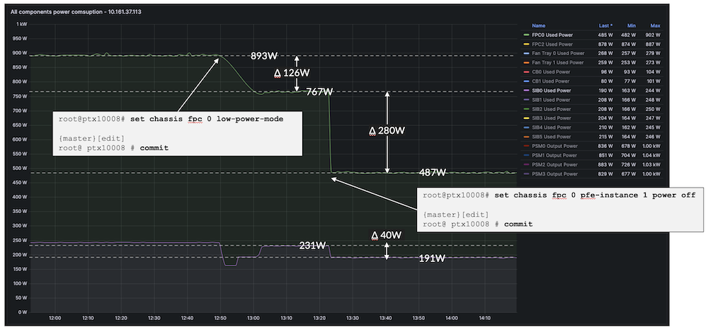

In this mode of operation, only 18x 400Gbps ports will be available per line card. The forwarding capability of the LC1301 is reduced to 7.2Tbps on two DataPaths (each 3.6Tbps and nine ports).

Note that we can also go one step further and shut down entirely the FPC with:

```
root@ptx10008 set chassis fpc 0 power ?
Possible completions:
  off                  Do not provide power to FPCs
  on                   Provide power to FPCs
{master}[edit]
root@ptx10008#
```

MACsec:

```
set security macsec interfaces et-x/y/z ...
```

### Number of Fabric Cards

1. We can operate the system with various quantity of SF3 or SF5, it does reduce the forwarding capability of each DP,  but it also reduces the power consumption.

## Minimum Releases

In the following chart, we are summarizing the minimum required release for each configuration combination.

| Configuration on PTX10008 | Minimum Recommended Release |
|:--|:--|
| LC1301 + SF5 | 24.4R1S3 |
| LC1301 + LC1201/1202 + SF5 | 24.4R2 |
| LC1301 + LC1201/1202 + SF3 | Coming Soon, Contact your favorite SE for more details on the roadmap. |

## Conclusion

The LC1301 completes the PTX10008 line card options with 36 ports 800GbE. We offer a smooth transition process, but it will require an upgrade of Fan Trays, Fan Tray Controllers, and Power Supply Module to fully utilize its capabilities. It will interoperate with existing Express4 line cards, such as LC1201 and LC1202.

## Useful links

- Introduction to Express 5 TechPost blog: [https://juniper.github.io/techposts/express-5-overview/article](https://juniper.github.io/techposts/express-5-overview/article)
- FIB Compression blog: [https://juniper.github.io/techposts/ptx-fib-compression/article](https://juniper.github.io/techposts/ptx-fib-compression/article)
- Hardware Compatibility: [https://apps.juniper.net/hct/model/?component=PTX10K-LC1301-36DD](https://apps.juniper.net/hct/model/?component=PTX10K-LC1301-36DD)
- PTX Fabric hardware guide: [https://www.juniper.net/documentation/us/en/hardware/ptx10008/topics/topic-map/ptx10008-switch-fabric.html](https://www.juniper.net/documentation/us/en/hardware/ptx10008/topics/topic-map/ptx10008-switch-fabric.html)
- PTX Line Cards hardware guide: [https://www.juniper.net/documentation/us/en/hardware/ptx10008/topics/topic-map/ptx10008-line-card-components.html](https://www.juniper.net/documentation/us/en/hardware/ptx10008/topics/topic-map/ptx10008-line-card-components.html)
- Fan Trays Guide: [https://www.juniper.net/documentation/us/en/hardware/ptx10008/topics/topic-map/ptx10008-cooling-system.html](https://www.juniper.net/documentation/us/en/hardware/ptx10008/topics/topic-map/ptx10008-cooling-system.html)
- Power Supply Modules Guide: [https://www.juniper.net/documentation/us/en/hardware/ptx10008/topics/topic-map/ptx10008-power-system.html](https://www.juniper.net/documentation/us/en/hardware/ptx10008/topics/topic-map/ptx10008-power-system.html)
- Power saving features: [https://juniper.github.io/techposts/saving-energy-on-ptx-with-pfe-power-off/article](https://juniper.github.io/techposts/ptx10000-power-optimization/article)
- Junos 24.4R2 Release Notes: [https://www.juniper.net/documentation/us/en/software/junos/release-notes/24.4/junos-evo-release-notes-24.4r2/junos-evo-release-notes-24.4r2.pdf](https://www.juniper.net/documentation/us/en/software/junos/release-notes/24.4/junos-evo-release-notes-24.4r2/junos-evo-release-notes-24.4r2.pdf)
- Datasheet with all SKUs: [https://www.juniper.net/us/en/products/routers/ptx-series/ptx10000-line-of-packet-transport-routers-datasheet.html](https://www.juniper.net/us/en/products/routers/ptx-series/ptx10000-line-of-packet-transport-routers-datasheet.html)

## Glossary

- ASIC: Application Specific Integrated Circuit
- BIER: Multicast using Bit Index Explicit Replication
- BF: Express 5 Package with only F-chiplet and used in the SF5 cards
- BXF: Express 5 Package made of one X-chiplet for WAN connectivity and one F-chiplet for fabric connectivity
- CLI: Command Line Interface
- CPU: Central Processor Unit
- DCI: DataCenter Interconnect
- DRAM: Dynamic Random Access Memory
- FIB: Forwarding Information Base
- FPGA: Field Programmable Gate Arrays
- FPC: Flexible PIC Concentrator
- GigE: Gigabit Ethernet
- HBM: High-Bandwidth Memory
- HQoS: Hierarchical Quality of Service
- INT-MD: Inband Network Telemetry Metadata
- LC: Little/Light Connector
- MACsec: Media Access Control Security
- MPLS: Multi-Protocol Label Switching
- MPO: Mult-Fibre Push-On/Off (Connector)
- PIC: Port Interface Card
- PPS: Packet Per Second
- PSM/PSU: Power Supply Module/Unit
- PTP: Precision Time Protocol
- QDD: QSFP Double Density
- RE: Routing Engine
- RGB: Reverse GearBox
- RIB: Routing Information Base
- SerDes: Serializer/Deserializer
- SF3/5: Switching Fabric cards
- SRv6: Segment Routing IPv6
- Sync-E: Synchronous Ethernet
- XSR: Extra Short Reach (SerDes)

## Acknowledgements

Many many thanks to Mayuresh Gangal, Girish Dadhish, and Amogh Dendukuri for their helpful explanations during the preparation of this article. Warm thanks too to Pradeep Chalicheemala , Christian Graf, Santo K,  Dmitry Bugrimenko and Vineet Sharma for their feedback and correction suggestions.
