# OpenJTS -- Network Observability with Streaming Telemetry

**David Roy - 03/26/2024**

## Introduction

In this article, we'll present a new open-source tool called OpenJTS (Juniper Telemetry Stack). Designed for effortless adoption, this all-in-one tool demystifies gRPC/gNMI Telemetry on Juniper routing products. We currently support PTX10K, MX (vMX, Neo, and 10K platforms) and ACX7K platforms. Junos/EVO 20.1 and onwards are supported. OpenJTS makes customers/users lives easier when they wish to start playing with gRPC Streaming Telemetry. In a few clicks, you can collect and visualize the most common data provided by Juniper's Telemetry solution.


This project is built around 3 main repositories:

- OpenJTS [1]: provides the infrastructue for deploying the stack and includes all the profiles
- JTSO [2]: the source code of the jtso component
- JTS Telegraf [3]: a fork of the telegraf project which includes several plugins and enhancements for OpenJTS.

OpenJTS relies on open-source software solutions.

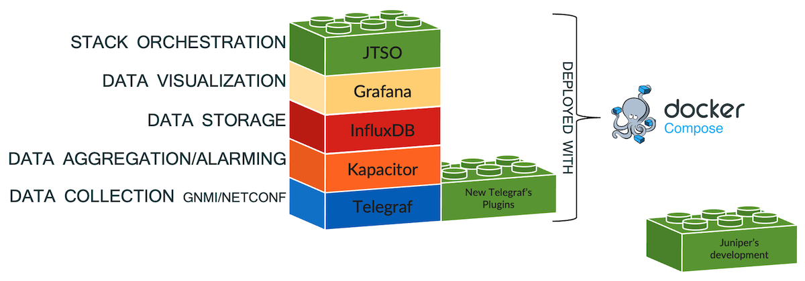

I use Telegraf for collecting gNMI Telemetry state data and pre-processing the data, InfluxDB as a Time Series Database to store data, Kapacitor to aggregate and perform Alarming and finally Grafana to display contents. Two additional pieces of software (in green in Figure 2) have been specifically developed for the OpenJTS project:

- The first one concerns Telegraf: a fork of this tool leverages several new plugins. Those plugins are developed to ease pre-aggregation, data enrichment, or alarming. But also, they enhance the data collection with a slightly modified gNMI plugin and the development of a new Juniper Netconf Input Plugin (that might be helpful in the future in cases where data are not yet available through gRPC)
- The second module, JTSO (JTS Orchestrator), is developped in Golang and is the only entry point to manage the OpenJTS stack. In other words, the configuration of all components is done via a simple web GUI. JTSO also includes its dedicated netconf collector for pulling additional metadata periodically, such as interfaces description or hardware inventory. This information will be used for enrichment purposes. In Figure 3, you can see those metadata are re-injected directly into Telegraf via a new dedicated plugin and used to enrich on-the-fly telemetry data.

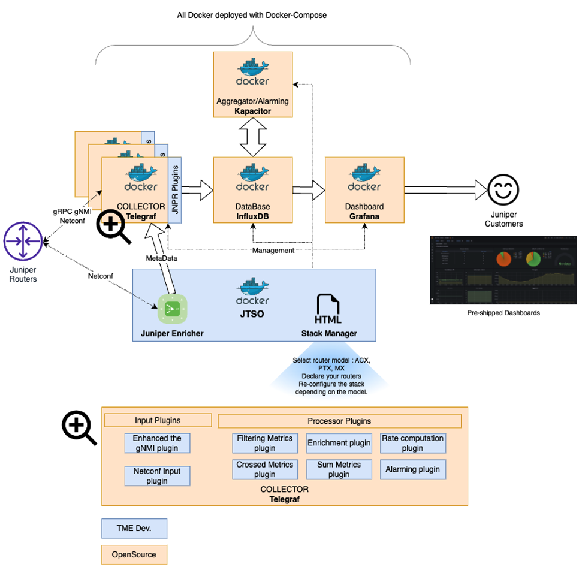

The complete software architecture is depicted in the Figure 4. We leverage docker compose to deploy the stack in one single command.

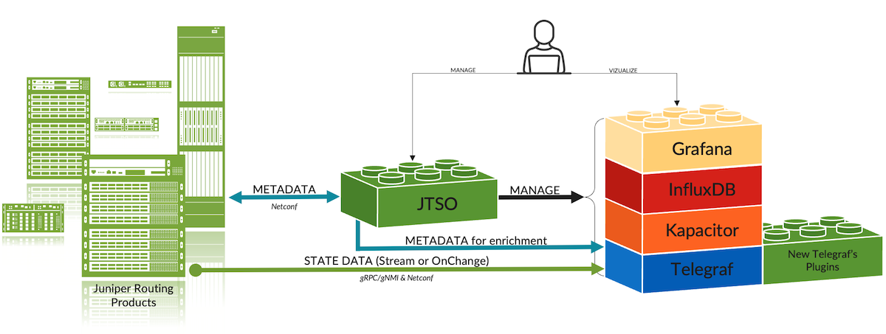

## OpenJTS Installation and Configuration

To install OpenJTS you need:

- A recent Ubuntu or Debian VM
- Enough vCPU/Mem -- 4vCPU and 8GB of RAM is a good starting point.
- Enough Disk Space -- Note: There is no retention policy -- 100GB is a good starting point.
- Docker and Docker Compose are installed on your VM. For details, let's check the following section on the Github repository: [https://github.com/door7302/openjts/blob/main/INSTALL.md](https://github.com/door7302/openjts/blob/main/INSTALL.md)
- The VM must have Internet access to fetch the different containers hosted on Github and Docker Hub

Once all these prerequisites are validated, you can clone the OpenJTS repo in a local folder and run the docker compose command to start the stack:

```
Ubuntu# cd /opt/openjts 
Ubuntu# git pull https://github.com/door7302/openjts.git . << don't forget the "."
Ubuntu# cd compose
Ubuntu# docker compose up -d
```

At this stage, docker will fetch all the containers. The JTSO and Telegraf containers require to be compiled the first time. So don't be surprised the "docker compose up" takes around 5 minutes during the first run. Next time, the stack will be loaded in a few seconds only.

By default, OpenJTS is configured like that:

- HTTP on port 80 for the JTSO portal
- HTTP on port 8080 for the Grafana portal
- Netconf port used: TCP 830
- GNMI port used: TCP 9339

All those ports are configurable. If needed, you may also switch to HTTPS for both the JTSO and Grafana portals. To change the OpenJTS default configuration, please refer to this section: [https://github.com/door7302/openjts/blob/main/CONFIG.md](https://github.com/door7302/openjts/blob/main/CONFIG.md)

## How to Use OpenJTS

OpenJTS was developed to be as simple as possible. Once the stack is up and running, just start a Web browser and open the main JTSO portal page: http(s)://<your-vm-ip>/index.html

If all works as expected, you should be able to see this main page:

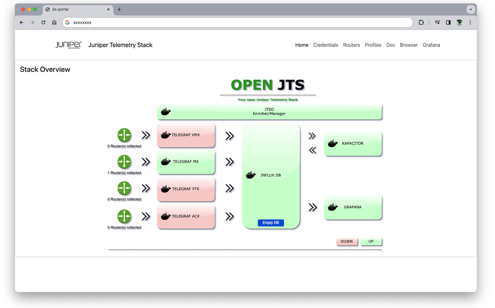

Here, you see the status of each container. Don't be afraid to see "red containers". Indeed, the JTSO module will automatically shut down unused containers to save VM's resources. As of now, there is no retention policy configured on the Influx DataBase. This tool primilary targets lab devices. If you need to clean the whole DB to restart with a fresh state, you may click on the "empty DB" button. Note, that next to each "green Telegraf instance", you can also see the number of collected routers.

Before playing with OpenJTS; you need to set up a few things.

First, let's move to the Credential menu and fill in your Netconf and gNMI username/password. Those could be the same if needed. If you want to use TLS with gNMI, you need to first generate certificates for the routers and even for OpenJTS if you want to use mutual Authentication. By default, OpenJTS uses gNMI in clear text. For detailed information about how to use TLS and generate Certificates, please refer to this section: [https://github.com/door7302/openjts/blob/main/CONFIG.md](https://github.com/door7302/openjts/blob/main/CONFIG.md)

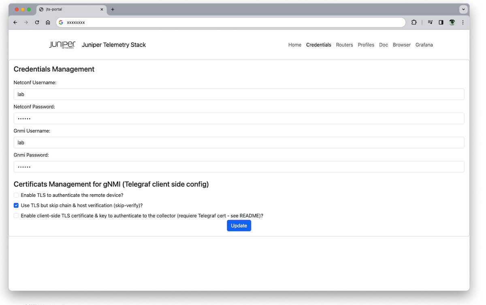

Please keep in mind, with this first OpenJTS version, all parameters all shared by all your routers. In other words, the same credentials must be configured on all routers and if TLS is preferred, TLS must be enabled on all routers as well.

The next step is to fill in the form to provision your routers. Go on to the next menu: "Routers".

Afterward, you have just to submit, one by one, your routers' information. Choose a short name and provide the full hostname or IP address of each devices. Then, automatically, JTSO will establish a Netconf session and gather some facts, such as the router family, model, and version.

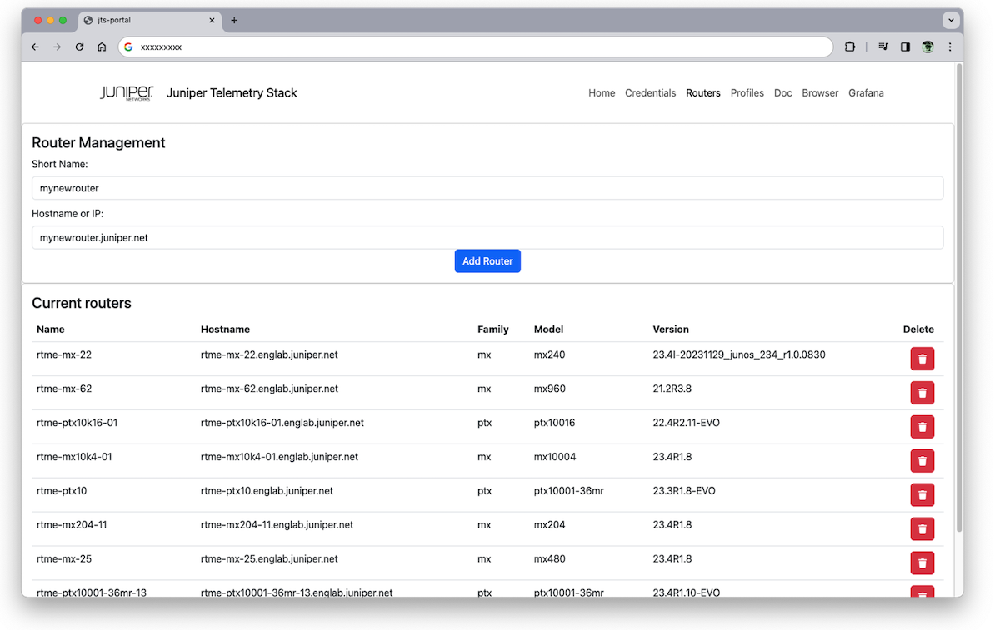

Don't forget to configure the Netconf and gNMI credentials, and enable Netconf and gNMI servers on each router you want to use with OpenJTS. Depending on whether you want to use or not gNMI with TLS, the gNMI configuration will be slightly different.

```
edit exclusive

# Netconf User
set system login user netconf_user class super-user
set system login user netconf_user authentication encrypted-password "xxx"

# gNMI User 
set system login user gnmi_user class super-user
set system login user gnmi_user authentication encrypted-password "xxx"

# Clear Text gRPC server
set system services extension-service request-response grpc clear-text port 9339
set system services extension-service request-response grpc max-connections 16
set system services extension-service request-response grpc skip-authentication

# Or TLS encryption gRPC server
set system services extension-service request-response grpc ssl port 9339
set system services extension-service request-response grpc ssl local-certificate lcert
# Optional mutual authentication 
set system services extension-service request-response grpc ssl mutual-authentication certificate-authority ca1
set system services extension-service request-response grpc ssl mutual-authentication client-certificate-request require-certificate-and-verify

# Netconf server
set system services netconf ssh
set system services netconf rfc-compliant #optional

commit and-quit
```

Finally, the last step is to assign your router to one or more profiles. A profile is just a set of config files following certain rules and naming conventions. A profile supports per-platform and per-version configuration. For instance, if two different Junos releases have some sensor paths or even some counters changed (renamed, added, removed or moved), I can provide a different config of the collector instance for each releases. This will be transparent from the user's perspective.

Now, let's select a router in the list, assign it to one or several profiles, press "create association" button, and "voilà". The stack is then fully re-configured by JTSO.

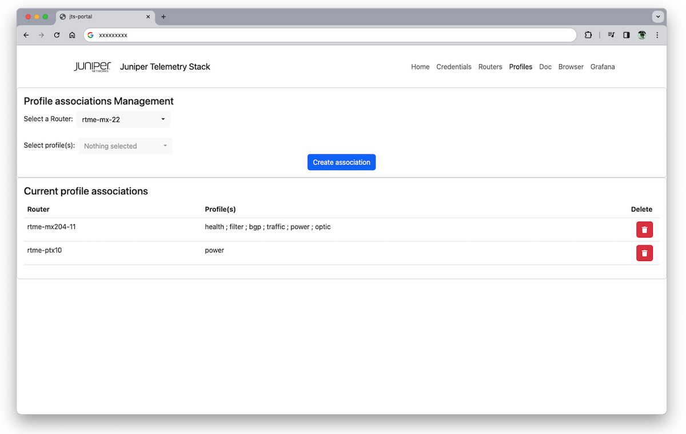

It's time to switch to the Grafana home page to enjoy playing with the pre-included dashboards.

Sometimes you may see "No Data" on some dashboard's panels or graphs. This means either the router sends no-data at this moment or the sensor path is not supported for your given Hardware/Software. You can use the embedded Telemetry Analyzer to troubleshoot it yourself (see below), but if you suspect a problem, please open a GitHub issue.

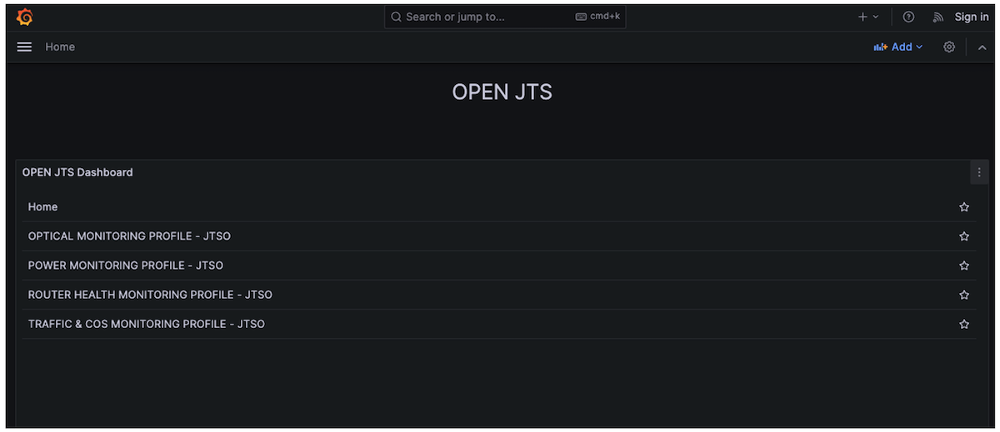

## OpenJTS's Tools

The JTSO portal offers 2 simple tools. The first one is reachable via the "doc" menu. Here you will find out how profiles have been made.

On this page, you have access to some additional profile information. Each profile is delivered with a "Memory Card" summarizing the sensors it used. A color indicates if it's a Native or an Openconfig path. Moreover, behind each sensor path, you can find the list of counters extracted to build the profile.

On the right side, you have a few more details such as short descriptions of the profile, the supported platforms, and other information related to Grafana and Kapacitor containers.

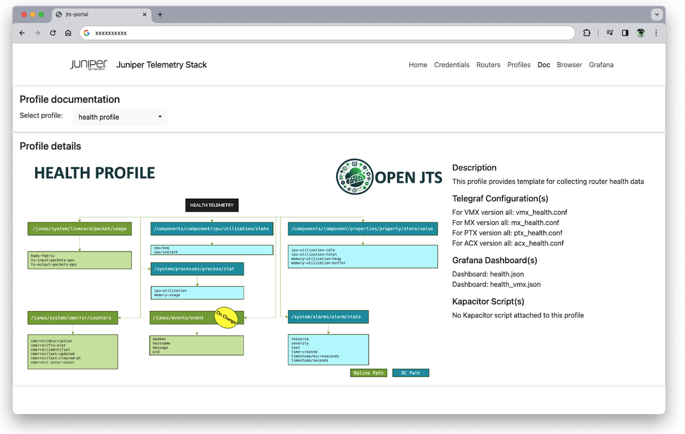

For a complete description of each included profile, please refer to this section: [https://github.com/door7302/openjts/blob/main/PROFILES.md](https://github.com/door7302/openjts/blob/main/PROFILES.md)

The second tool might be helpful if you want to troubleshoot some specific sensor paths on your devices. This tool is called Telemetry Analyser. It leverages the gNMIc API [4] to collect, for a given path and a given router, all supported nodes and leaves attached to a path. You just have to select a router in the list and fill in a well-known path in the input box. It can be a Native or an OpenConfig path. The "Merge" option allows to reduce the amount of data displayed. The aim is, as far as possible, to replace the numeric key with an "X" and make an aggregation of common keys. For a full view, unselect this default option.

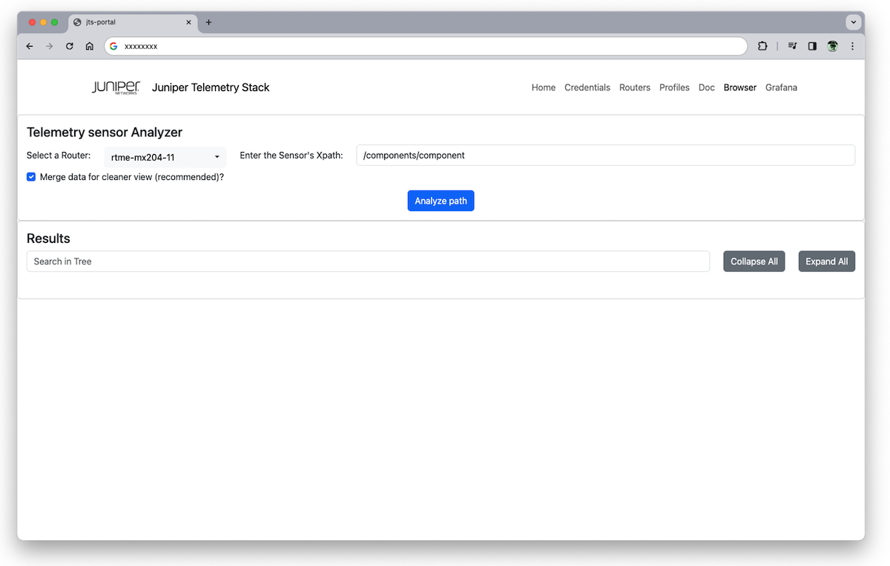

Automatically, JTSO will establish a gNMI session (clear-text or TLS depending on your config), subscribe to the requested path, and finally extract all supported XPATHs behind the given path. The collection should take around a minute; you can follow in real time the extracted XPATHs, as shown below:

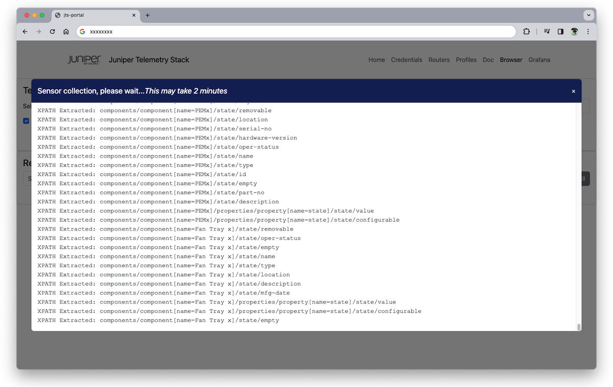

Once the collection is done, all the data are merged in a tree view to ease the navigation through the content which might be huge in some cases.

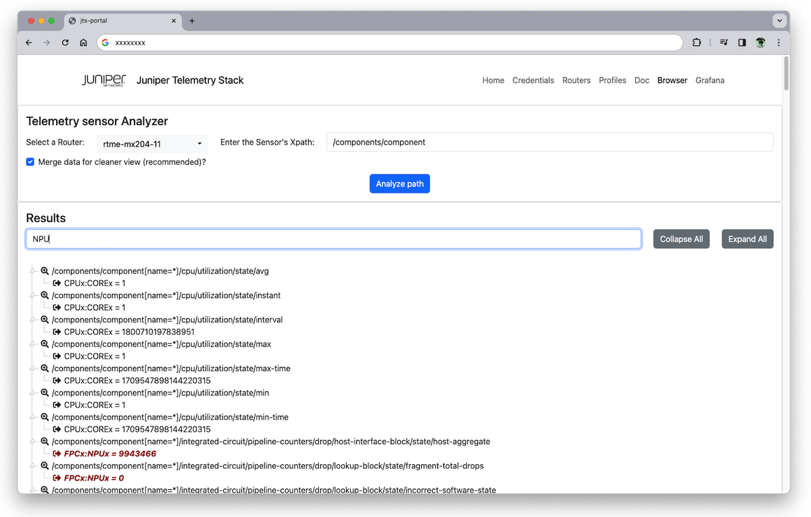

As you can see above, some XPATHs have nodes with attributes. In this example, one node  named "component" of this XPATH has a Key attribute which is "name". If you expand the tree, you should see the list of possible component names (or a merged view in case you selected the "merge" option). There are also a few options to navigate in the tree: you can use the two "grey" buttons to collapse or expand all the trees. I've also provided a simple search input box. Indeed, you can highlight all the XPATHs or even Counters matching the searched string.

For a complete explanation of how to use OpenJTS, have a look at this section: [https://github.com/door7302/openjts/blob/main/USAGE.md](https://github.com/door7302/openjts/blob/main/USAGE.md)

## Conclusion

This is the first version of OpenJTS, so feel free to open an issue if you experience trouble with a given hardware or sorfare version and a profile. The profiles have been tested with several recent Junos and Evo releases. Some older versions may use different "counters" naming, especially when OpenConfig models are used. I can easily patch a profile, in minutes, without touching the code. Likewise, don't hesitate to open an issue if you want me to develop a new profile for a new use case or enhance an existing profile.

Stay tuned to new upcoming profiles and improvements by following me on X @door7302 or LinkedIn under the name David Roy -- Juniper Network.

Each time you will have to update the OpenJTS tool, please refer to this section before:
[https://github.com/door7302/openjts/blob/main/UPDATE.md](https://github.com/door7302/openjts/blob/main/UPDATE.md)

Enjoy the tool.

## Useful links

- [1] [https://github.com/door7302/openjts](https://github.com/door7302/openjts)
- [2] [https://github.com/door7302/jtso](https://github.com/door7302/jtso)
- [3] [https://github.com/door7302/jts_telegraf](https://github.com/door7302/jts_telegraf)
- [4] [https://github.com/openconfig/gnmic](https://github.com/openconfig/gnmic)

## Glossary

- gRPC: Remote Procedure Calls
- gNMI: gRPC Network Management Interface
- JTS: Juniper Telemetry Stack
- JTSO: JTS Orchestrator
- TLS: Transport Layer Security
