# Introducing PTX10002-36QDD

**Nicolas Fevrier - 03/19/2024**

The new Juniper PTX10002-36QDD is here. It's our first 800GigabitEthernet, deep-buffer, high-scale, router in the market, powered by Express 5. And we are very excited to share some details about this unique platform.

## Introduction/Overview

The PTX10002-36QDD is a compact form-factor router (2 Rack Units) offering 28.8Tbps of connectivity, and forwarding capability, with 36x 800GigE, 72x 400GigE or 288x 100GigE interfaces.

Based on the Express 5 Packet Forwarding Engine, it is designed to be deployed for multiple applications such as core, peering, CDN gateways, DCI, DC edge, aggregation, and datacenter, including AI/ML clusters.

This very high-performance router offers an impressive density of 800Gbps ports, as well as a range of advanced features that make it ideal for a variety of applications. Its deep buffers, dynamic resource allocation, and high-scale routing capabilities (supporting over 10 million routes in the FIB) provide exceptional flexibility and performance.

Additionally, it offers flexible filtering, inline traffic sampling, and native support for cutting-edge technologies such as SRv6 and BIER, making it a truly versatile and powerful solution for even the most demanding networking needs.

Central to the PTX10002-36QDD's design is its commitment to energy saving. The system-on-the-chip architecture cuts the power consumption per gigabit per second by half, compared to its predecessor. Additionally, it supports unique power optimization features, enabling the selective shutdown of certain forwarding capabilities during periods of non-use, thereby further enhancing energy efficiency.

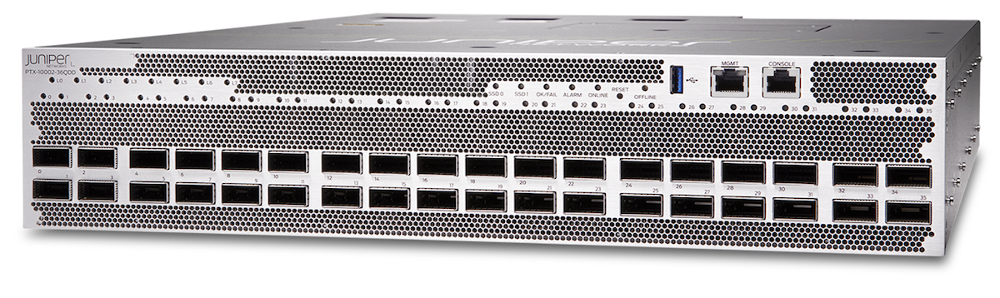

This platform is powered by the new Express 5, supporting MACsec at line rate on all ports, and class-C timing. Junos EVO is executed on a powerful multi-core CPU, enabling our multi-threaded routing stack, among other applications.

Let's now take a closer look at this router.

## Main Forwarding Components

PTX10002-36QDD is the first router in our portfolio powered by the Express 5 Packet Forwarding Engine.

The Juniper Express silicon line, first introduced in 2011, aimed to transform the economics of packet transport networks by optimizing the forwarding path for density and interface speeds. Initially, the Express silicon line was designed for core routing functionality and relatively low scale, supporting MPLS Label Switch Router functions.

Over five generations, the Express chipsets evolved and expanded their capabilities, increasing the supported scale and extending their functionality.

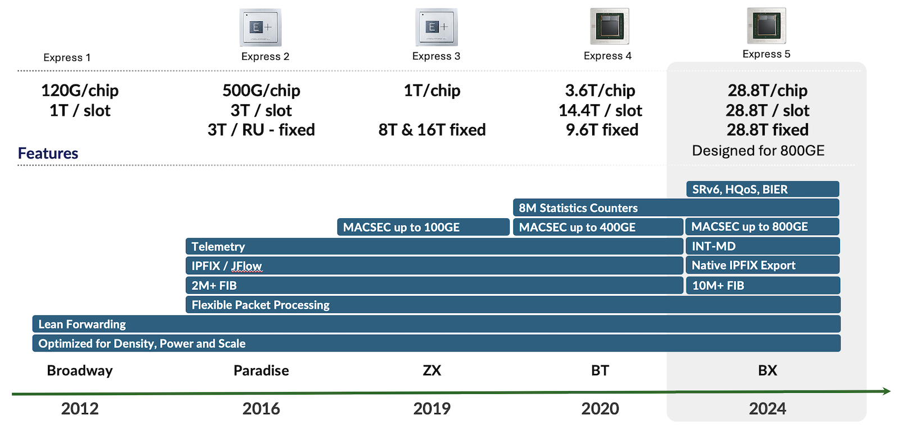

Figure 2 above illustrates this evolution over generations. The Express 5 supports both high-scale and complex forwarding protocols and services like In-band Network Telemetry (INT-MD) and Hierarchical Quality of Service (H-QoS).

### Express 5 High-Level Description

The Express 5 is not just a single chipset but more an ASIC family. It's the first in this industry to propose a design based on chiplets. You will find more details on this blog post from Dmitry Shokarev: [https://juniper.github.io/techposts/express-5-overview/article](https://juniper.github.io/techposts/express-5-overview/article)

To keep it short, we have two main chiplets, X and F, and we can mix and match them to create different packages based on the requirements.

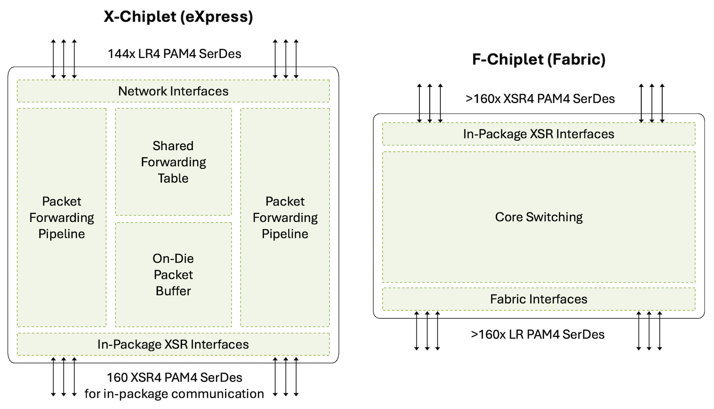

The X-chiplet offers 14.4Tbps of WAN SerDes on the north side (in Figure 3), supporting bandwidth from 10Gbps to 106Gbps. On the south part, they have very short reach links, XSR SerDes, to potentially interconnect to another X-chiplet or an F-chiplet, inside the same package.

The F-chiplet is dedicated to fabric connectivity. It offers interfaces on the south side of this diagram where cells will be received and transmitted to the fabric. And the north side is used to potentially interconnect to another X-chiplet or an F-chiplet, again in the same package.

These building bricks can be combined to meet our design needs. We can create packages made of:

- A single X-chiplet
- Two X-chiplets back-to-back, interconnected via the XSR4 SerDes. That's typically what we will use in the PTX10002-36QDD router. It's a 28.8Tbps ASIC and we name it BXX.
- One X-chiplet paired with one F-chiplet offers WAN connectivity on the network interface side and Fabric connectivity on the other side. We will find them in modular chassis line cards and they are called BXF.
- One F-chiplet, offering Fabric interfaces. You will find this configuration in modular chassis fabric cards, and they are called BF.

The PTX10002-36QDD is a standalone platform with no fabric connectivity requirements. It is based on a single BXX package made of two X-chiplets, presenting 288 WAN SerDes at 106Gbps. 288 electrical SerDes: that's 36 ports at 800Gbps or 72 ports at 400Gbps.

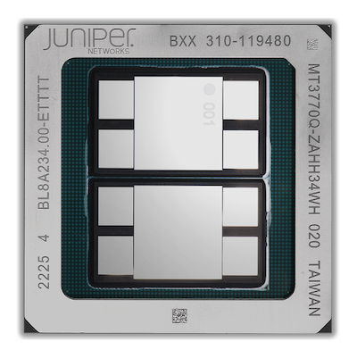

With this package configuration, we don't waste resources for unused fabric. It's ideal for a SiP: System in the Package, where all interfaces are directly connected to the Forwarding ASIC. Since Express 5 supports MACsec internally, we won't need any additional parts to deliver MACsec encryption at line rate on all ports.

Table: Express 5 BXX Information

| Metric | Value |
|:--|:--|
| Process Node | 7nm |
| Internal Codename | BXX |
| WAN (Front Panel) Links | 288x 106Gbps |
| Fabric (Internal) Links | None |
| Off-Chip Memory | 32GB (4x 8GB) HBM |
| 800GigE Port Density | 36 |
| 400GigE Port Density | 72 |
| 100GigE Port Density | 288 (with 8x100GigE Breakout Cable) |
| 50GigE Port Density* | 288 (with 8x50GigE Breakout Cable) |
| 40GigE Port Density | 36 |
| 10GigE Port Density | 144 (with 4x10GigE Breakout Cable) |
| Total Forwarding Capacity | 28.8Tbps |
| Total WAN Capacity | 28.8Tbps |
| MACsec | Up to 800Gbps |
| Counters | 8M |
| IPv4 or IPv6 FIB** | 8M+ |

* Tested scale, hardware capable of much more (pending software validation)

**FIB compression is enabled by default**, but these numbers here represent FIB entries. In consequence, the scale could be much higher because of the compression. For more details on this technology, we invite you to check this article: [https://juniper.github.io/techposts/ptx-fib-compression/article](https://juniper.github.io/techposts/ptx-fib-compression/article)

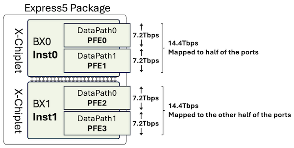

At a high level, we can represent the Express 5 Package used in PTX10002-36QDD as two PFE-instances (the chiplets) and four fully symmetric PFEs with identical throughput and packet performance  (the datapaths or "slices" inside each chiplet die).

```
user@ptx10002-36qdd> show chassis fpc pfe all 
FPC 0
PFE-Instance    PFE           PFE-State
0               0             ONLINE               
0               1             ONLINE               
1               2             ONLINE               
1               3             ONLINE               
user@ptx10002-36qdd>
```

We don't need to remind you that any bandwidth figure expressed in this article is Full Duplex: a 7.2Tbps datapath can receive and transmit 7.2Tbps simultaneously.

For more details on the Express 5 design, capabilities, and differentiators, we invite you to check this article from Dmitry Shokarev: [https://juniper.github.io/techposts/express-5-overview/article](https://juniper.github.io/techposts/express-5-overview/article)

Now that we understand the forwarding engine used in this router, let's take a closer look at the PTX10002-36QDD.

### Platform Architecture

The name of the PTX10002-36QDD is very much self-explanatory:

- PTX10k generation
- 2 Rack Units
- 36 Ports QSFP-DD 800

You can find the router datasheet here:

- [https://www.juniper.net/us/en/products/routers/ptx-series/ptx10002-fixed-configuration-packet-transport-routers-datasheet.html](https://www.juniper.net/us/en/products/routers/ptx-series/ptx10002-fixed-configuration-packet-transport-routers-datasheet.html)
- [https://www.juniper.net/us/en/products/routers/ptx-series/ptx10002-36qdd-packet-transport-router/specs.html ](https://www.juniper.net/us/en/products/routers/ptx-series/ptx10002-36qdd-packet-transport-router/specs.html)

The usual "show chassis hardware details" provides a good overview of the internal parts.

```
regress@ptx10002-36qdd> show chassis hardware detail

Hardware inventory:
Item             Version  Part number  Serial number     Description
Chassis                                GBxxx             PTX10002-36QDD [PTX10002-36QDD]
Midplane 0       REV 04   750-145729   BCDPxxxx          Power Distribution Board
FPM 0            REV 03   750-141751   BCDKxxxx          FPM-PTX10002
PSM 0            REV 09   740-073765   1GE2C15xxxx       AC AFO 3000W PSU
PSM 1            REV 09   740-073765   1GE2C15xxxx       AC AFO 3000W PSU
Routing Engine 0          BUILTIN      BUILTIN           RE-PTX10002-36QDD
  sda   200049 MB  StorFly VSFDM4CC    58134-xxxx        Solid State Disk
  sdb   200049 MB  StorFly VSFDM4CC    58134-xxxx        Solid State Disk
CB 0             REV 09   750-141519   BCDPxxxx          Control Board
FPC 0            REV 03   750-141520   BCDRxxxx          FPC-PTX10002-36QDD
  FPM 0          REV 03   750-153435   BCDVxxxx          LED Board
  PIC 0                   BUILTIN      BUILTIN           MRATE-36xQDD PIC
    Xcvr 0       REV 01   740-065630   1YCS042xxxx       QSFP28-100G-AOC-1M
    Xcvr 6       REV 01   740-065630   1YCS042xxxx       QSFP28-100G-AOC-1M
    Xcvr 8       REV 01   740-061405   1ECQ153xxxx       QSFP-100GBASE-SR4
    Xcvr 12      REV 01   740-150870   1W1CSHA72xxxx     QSFP-DD800-800G-AOC-1M
    Xcvr 35      REV 01   740-114884   UZLC4G0xxxx       QSFP56-DD-400G-ZR
Fan Tray 0       REV 02   760-144017   BCDTxxxx          PTX10002 Fan Tray, Front to Back Airflow - AFO
Fan Tray 1       REV 02   760-144017   BCDTxxxx          PTX10002 Fan Tray, Front to Back Airflow - AFO
Fan Tray 2       REV 02   760-144017   BCDTxxxx          PTX10002 Fan Tray, Front to Back Airflow - AFO

regress@ptx10002-36qdd>
```

### Power and Cooling

The PTX10002-36QDD offers power supply 1+1 redundancy and front-to-back (AFO) fan trays with 2+1 redundancy.

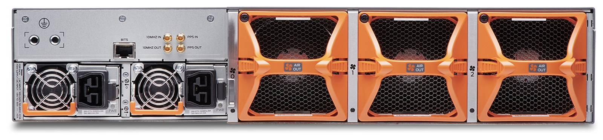

The Power Supply Modules (PSM) exist in AC and DC but also in two flavors:

- 3,000W
- 2,200W

Depending on the PSM inserted, the system will operate in a different mode. We will cover this in detail in the Power Saving section, later in this article.

### Block Diagram

You'll find below a schematic representation of the PTX10002-36QDD internal architecture:

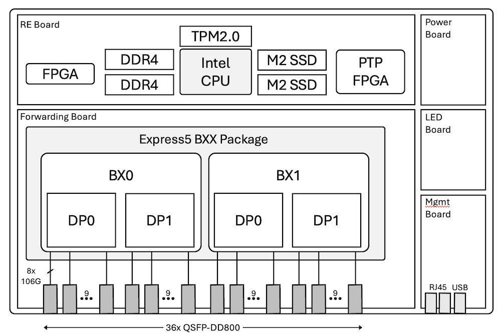

This simplified hardware design contributes to the very competitive power consumption of the PTX10002-36QDD.

### Interfaces

As illustrated in Figure 7, the architecture is very simple: we don't rely on any intermediate components such as Reverse GearBox (RGB) to connect the optical cages to the Packet Forwarding Engine Port Groups (PG).

The 36 ports of the router are split in half, with 18 ports mapped to BX0 and 18 other ports to BX1. In each chiplet, we have two datapaths (or slices) of 9 ports each.

From a router CLI perspective, these slices are named PFE0 to PFE3.

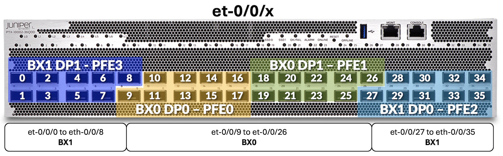

Consequently, the port naming format is also very simple:

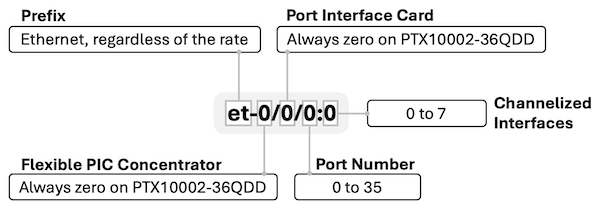

Since the system is composed of a single FPC with a single PIC, all interfaces are named et-0/0/[0-35]:[0-7]. Only port number, and potentially channelization, are variable.

Interesting to note that 800Gbps ports will support new types of pluggable and connectors:

- QDD-2x400G, QDD-8x100G with Dual LC-Duplex
- And 8X100G interfaces with Dual MPO-12.

In both cases, there are 2 independent connectors (a pair) housed on a single transceiver which will simplify cable management:

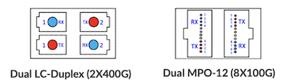

These connectors enable the high 400GigE port density without requiring specific breakout cables or patch panels: natively, we support 72x 400GigE ports on PTX10002-36QDD.

Each physical port is mapped to a unique port group (PG) via 8x SerDes and no intermediate RGB, so we don't have any port combination limitation. You can use all ports with 2x400GigE or 8x100GigE without any constraints. Every port can be configured at the speed you need, but you can only support a unique speed for members of the same physical port channelized (4x10GigE, 4x25GigE, 8x100GigE, 2x400GigE).

The full list of supported interfaces will be updated soon on the pathfinder, the following chart provides a couple of examples.

Table: Interface rate and SerDes

| Rate | Port Type | #SerDes and Rate (Gbps) |
|:--|:--|:--|
| 800GigE | 1x 800GAUI-8 | 8x 106.25 |
| 400GigE | 2x 400GAUI-4 | 4x 106.25 |
| 400GigE | 1x 400GAUI-8 | 8x 53.125 |
| 200GigE | 2x 200GAUI-4 | 4x 53.125 |
| 100GigE | 8x 100GAUI-1 | 1x 106.25 |
| 100GigE | 2x 100GAUI-4 | 4x 26.56254x 25.78125 |
| 50GigE | 2x LAUI-2 | 2x 25.78125 |
| 40GigE | 1x XLAUI | 4x 10.3125 |
| 25GigE | 4x 25GAUI-1 | 1x 25.78125 |
| 10GigE | 1x XFI | 1x 10.3125 |

As a quick on-box reference, the following CLI command shows transceivers plugged into the port, plus the port speed capabilities (note: it shows capabilities and not necessarily the software support. Please use the port checker and hardware compatibility tools on apps.juniper.net to verify the support).

```
regress@ptx10002-36qdd> show chassis pic fpc-slot 0 pic-slot 0
FPC slot 0, PIC slot 0 information:
  Type                             MRATE-36xQDD PIC
  State                            Online
  PIC version                   255.09
  Uptime    15 days, 3 hours, 6 minutes, 26 seconds

PIC port information:
                         Fiber                    Xcvr vendor       Wave-                     Xcvr          JNPR     MSA
  Port Cable type        type  Xcvr vendor        part number       length                    Firmware      Rev      Version
  0    100G AOC 1M       MM    JUNIPER-DELTA      QAOC-100G4F1xxxx  850 nm                    0.0           REV 01   SFF-8636 ver 2.7
  2    100G AOC 1M       MM    JUNIPER-DELTA      QAOC-100G4F1xxxx  850 nm                    0.0           REV 01   SFF-8636 ver 2.7
  6    100G AOC 1M       MM    JUNIPER-DELTA      QAOC-100G4F1xxxx  850 nm                    0.0           REV 01   SFF-8636 ver 2.7
  8    100GBASE SR4      MM    JUNIPER-AVAGO      AFBR-89CDDZ-xxx   850 nm                    0.0           REV 01   SFF-8636 ver 2.7
  12   800G-AOC 1M       MM    JUNIPER-1W1        740-15xxxx        1311 nm                   3.3           REV 01   CMIS 5.1
  35   400G-ZR           SM    JUNIPER-2E1        740-11xxxx        1528.77 nm - 1567.13 nm   1.6           REV 01   CMIS 5.0

Port speed information:

  Port  PFE      Capable Port Speeds
  0      NA      1x10G 4x10G 1x40G 4x25G 1x100G 2x50G 4x50G 8x25G 8x50G 2x100G 3x100G 4x100G 1x400G 1x800G 2x400G 5x100G 6x100G 7x100G 8x100G 4x200G
  1      3       1x10G 4x10G 1x40G 4x25G 1x100G 2x50G 4x50G 8x25G 8x50G 2x100G 3x100G 4x100G 1x400G 1x800G 2x400G 5x100G 6x100G 7x100G 8x100G 4x200G
  2      NA      1x10G 4x10G 1x40G 4x25G 1x100G 2x50G 4x50G 8x25G 8x50G 2x100G 3x100G 4x100G 1x400G 1x800G 2x400G 5x100G 6x100G 7x100G 8x100G 4x200G
  3      3       1x10G 4x10G 1x40G 4x25G 1x100G 2x50G 4x50G 8x25G 8x50G 2x100G 3x100G 4x100G 1x400G 1x800G 2x400G 5x100G 6x100G 7x100G 8x100G 4x200G
  4      NA      1x10G 4x10G 1x40G 4x25G 1x100G 2x50G 4x50G 8x25G 8x50G 2x100G 3x100G 4x100G 1x400G 1x800G 2x400G 5x100G 6x100G 7x100G 8x100G 4x200G
  5      3       1x10G 4x10G 1x40G 4x25G 1x100G 2x50G 4x50G 8x25G 8x50G 2x100G 3x100G 4x100G 1x400G 1x800G 2x400G 5x100G 6x100G 7x100G 8x100G 4x200G
  6      NA      1x10G 4x10G 1x40G 4x25G 1x100G 2x50G 4x50G 8x25G 8x50G 2x100G 3x100G 4x100G 1x400G 1x800G 2x400G 5x100G 6x100G 7x100G 8x100G 4x200G
  7      3       1x10G 4x10G 1x40G 4x25G 1x100G 2x50G 4x50G 8x25G 8x50G 2x100G 3x100G 4x100G 1x400G 1x800G 2x400G 5x100G 6x100G 7x100G 8x100G 4x200G
  8      NA      1x10G 4x10G 1x40G 4x25G 1x100G 2x50G 4x50G 8x25G 8x50G 2x100G 3x100G 4x100G 1x400G 1x800G 2x400G 5x100G 6x100G 7x100G 8x100G 4x200G
  9      0       1x10G 4x10G 1x40G 4x25G 1x100G 2x50G 4x50G 8x25G 8x50G 2x100G 3x100G 4x100G 1x400G 1x800G 2x400G 5x100G 6x100G 7x100G 8x100G 4x200G
  10     NA      1x10G 4x10G 1x40G 4x25G 1x100G 2x50G 4x50G 8x25G 8x50G 2x100G 3x100G 4x100G 1x400G 1x800G 2x400G 5x100G 6x100G 7x100G 8x100G 4x200G
  11     0       1x10G 4x10G 1x40G 4x25G 1x100G 2x50G 4x50G 8x25G 8x50G 2x100G 3x100G 4x100G 1x400G 1x800G 2x400G 5x100G 6x100G 7x100G 8x100G 4x200G
  12     NA      1x10G 4x10G 1x40G 4x25G 1x100G 2x50G 4x50G 8x25G 8x50G 2x100G 3x100G 4x100G 1x400G 1x800G 2x400G 5x100G 6x100G 7x100G 8x100G 4x200G
  13     0       1x10G 4x10G 1x40G 4x25G 1x100G 2x50G 4x50G 8x25G 8x50G 2x100G 3x100G 4x100G 1x400G 1x800G 2x400G 5x100G 6x100G 7x100G 8x100G 4x200G
  14     NA      1x10G 4x10G 1x40G 4x25G 1x100G 2x50G 4x50G 8x25G 8x50G 2x100G 3x100G 4x100G 1x400G 1x800G 2x400G 5x100G 6x100G 7x100G 8x100G 4x200G
  15     0       1x10G 4x10G 1x40G 4x25G 1x100G 2x50G 4x50G 8x25G 8x50G 2x100G 3x100G 4x100G 1x400G 1x800G 2x400G 5x100G 6x100G 7x100G 8x100G 4x200G
  16     0       1x10G 4x10G 1x40G 4x25G 1x100G 2x50G 4x50G 8x25G 8x50G 2x100G 3x100G 4x100G 1x400G 1x800G 2x400G 5x100G 6x100G 7x100G 8x100G 4x200G
  17     0       1x10G 4x10G 1x40G 4x25G 1x100G 2x50G 4x50G 8x25G 8x50G 2x100G 3x100G 4x100G 1x400G 1x800G 2x400G 5x100G 6x100G 7x100G 8x100G 4x200G
  18     1       1x10G 4x10G 1x40G 4x25G 1x100G 2x50G 4x50G 8x25G 8x50G 2x100G 3x100G 4x100G 1x400G 1x800G 2x400G 5x100G 6x100G 7x100G 8x100G 4x200G
  19     1       1x10G 4x10G 1x40G 4x25G 1x100G 2x50G 4x50G 8x25G 8x50G 2x100G 3x100G 4x100G 1x400G 1x800G 2x400G 5x100G 6x100G 7x100G 8x100G 4x200G
  20     1       1x10G 4x10G 1x40G 4x25G 1x100G 2x50G 4x50G 8x25G 8x50G 2x100G 3x100G 4x100G 1x400G 1x800G 2x400G 5x100G 6x100G 7x100G 8x100G 4x200G
  21     1       1x10G 4x10G 1x40G 4x25G 1x100G 2x50G 4x50G 8x25G 8x50G 2x100G 3x100G 4x100G 1x400G 1x800G 2x400G 5x100G 6x100G 7x100G 8x100G 4x200G
  22     1       1x10G 4x10G 1x40G 4x25G 1x100G 2x50G 4x50G 8x25G 8x50G 2x100G 3x100G 4x100G 1x400G 1x800G 2x400G 5x100G 6x100G 7x100G 8x100G 4x200G
  23     1       1x10G 4x10G 1x40G 4x25G 1x100G 2x50G 4x50G 8x25G 8x50G 2x100G 3x100G 4x100G 1x400G 1x800G 2x400G 5x100G 6x100G 7x100G 8x100G 4x200G
  24     1       1x10G 4x10G 1x40G 4x25G 1x100G 2x50G 4x50G 8x25G 8x50G 2x100G 3x100G 4x100G 1x400G 1x800G 2x400G 5x100G 6x100G 7x100G 8x100G 4x200G
  25     1       1x10G 4x10G 1x40G 4x25G 1x100G 2x50G 4x50G 8x25G 8x50G 2x100G 3x100G 4x100G 1x400G 1x800G 2x400G 5x100G 6x100G 7x100G 8x100G 4x200G
  26     2       1x10G 4x10G 1x40G 4x25G 1x100G 2x50G 4x50G 8x25G 8x50G 2x100G 3x100G 4x100G 1x400G 1x800G 2x400G 5x100G 6x100G 7x100G 8x100G 4x200G
  27     1       1x10G 4x10G 1x40G 4x25G 1x100G 2x50G 4x50G 8x25G 8x50G 2x100G 3x100G 4x100G 1x400G 1x800G 2x400G 5x100G 6x100G 7x100G 8x100G 4x200G
  28     2       1x10G 4x10G 1x40G 4x25G 1x100G 2x50G 4x50G 8x25G 8x50G 2x100G 3x100G 4x100G 1x400G 1x800G 2x400G 5x100G 6x100G 7x100G 8x100G 4x200G
  29     2       1x10G 4x10G 1x40G 4x25G 1x100G 2x50G 4x50G 8x25G 8x50G 2x100G 3x100G 4x100G 1x400G 1x800G 2x400G 5x100G 6x100G 7x100G 8x100G 4x200G
  30     2       1x10G 4x10G 1x40G 4x25G 1x100G 2x50G 4x50G 8x25G 8x50G 2x100G 3x100G 4x100G 1x400G 1x800G 2x400G 5x100G 6x100G 7x100G 8x100G 4x200G
  31     2       1x10G 4x10G 1x40G 4x25G 1x100G 2x50G 4x50G 8x25G 8x50G 2x100G 3x100G 4x100G 1x400G 1x800G 2x400G 5x100G 6x100G 7x100G 8x100G 4x200G
  32     2       1x10G 4x10G 1x40G 4x25G 1x100G 2x50G 4x50G 8x25G 8x50G 2x100G 3x100G 4x100G 1x400G 1x800G 2x400G 5x100G 6x100G 7x100G 8x100G 4x200G
  33     2       1x10G 4x10G 1x40G 4x25G 1x100G 2x50G 4x50G 8x25G 8x50G 2x100G 3x100G 4x100G 1x400G 1x800G 2x400G 5x100G 6x100G 7x100G 8x100G 4x200G
  34     2       1x10G 4x10G 1x40G 4x25G 1x100G 2x50G 4x50G 8x25G 8x50G 2x100G 3x100G 4x100G 1x400G 1x800G 2x400G 5x100G 6x100G 7x100G 8x100G 4x200G
  35     NA      1x10G 4x10G 1x40G 4x25G 1x100G 2x50G 4x50G 8x25G 8x50G 2x100G 3x100G 4x100G 1x400G 1x800G 2x400G 5x100G 6x100G 7x100G 8x100G 4x200G

regress@ptx10002-36qdd> 
```

## Control Plane

PTX10002-36QDD is designed for demanding routing applications and is equipped with a powerful 10-core Intel CPU to support faster convergence and complex BGP policy processing. The table below lists the hardware specifications of the control plane parts.

Table: Control Plane Components

| Component | Value |
|:--|:--|
| CPU | Intel Icelake-D, 10-core @ 3.0GHz |
| DRAM | 128GB DDR4 |
| Storage | SATA SSD 2x 200GB |

The minimum support Junos release on PTX10002-36QDD is 23.4R2-S1-EVO.

Various Juniper software components leverage multi-core CPU capabilities. Impressive scale and performance are demonstrated: Routing Process Daemon supports multithreading capabilities to process routing updates and routing resolution. For example, the system learns BGP routes at the rate of 250k routes per second and updates the FIB at 42k routes per second.

Storage subsystem is comprised of solid-state drives (SSDs), two are provided for redundancy, plus reliable management of the software upgrades and rollbacks. These drives are not field-replaceable, but they can be removed from the system before shipping devices back to Juniper for service. This is to support customer's security policies where non-volatile storage may not leave customer premises. Removal of drives requires a non-standard service agreement. As an alternative to the physical removal, both SSDs support Secure Erase functionality.

PTX10002-36QDD control plane is designed to host 3rd party applications: there is enough storage, DRAM capacity, and CPU power. Some of these applications may include custom Service Assurance Agents or statistics collection agents developed by Juniper partners and customers. Even full Telegraf, InfluxDB, Grafana stack can run on the router itself for data collection and visualization, check out the blog post ([https://juniper.github.io/techposts/telemetry-collector-and-dataviz-on-junos-evo/article](https://juniper.github.io/techposts/telemetry-collector-and-dataviz-on-junos-evo/article)).

In terms of management plane connectivity, the CPU is directly linked to:

- the management port at 1Gbps
- each BX chiplet at 10Gbps

### Timing

PTX10002-36QDD is designed to support timing: sync-E, and PTP class-C on all ports and even class-D quality for certain port configurations.

The router offers the following connectivity on the back of the chassis.

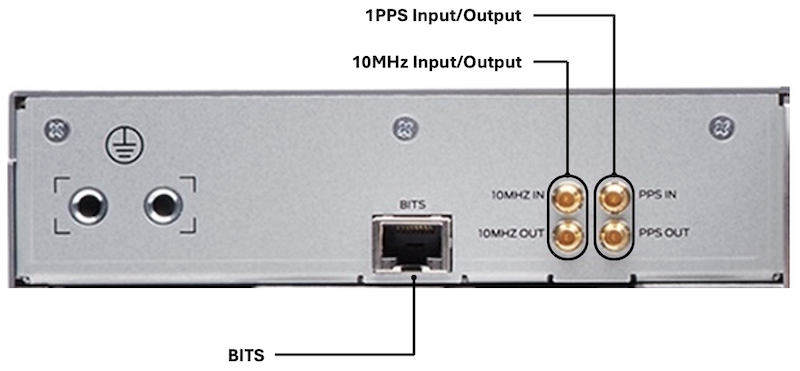

Internally, a dedicated timing circuitry is used, leveraging Juniper-developed PTP FPGA. Preliminary tests are showing even higher clock quality in certain cases. Stay tuned for more details.

### Security

**Image Validation**

PTX10002-36QDD is equipped with a Trusted Platform Module (TPM2.0) located on the RE board. It makes it fully compliant with the TPM standard as published by the Trusted Computing Group (TCG).

The TPM's non-volatile storage is used as a persistent, access-controlled area for component registration, location of policy, keys, etc.

Trusted extensions are integrated into the Icelake CPU and only it can access the TPM.

Hardware and firmware are designed to support FIPS 140-2 Level 2.

**MACsec**

The MACsec services are handled in the MAC part of the Port Groups. That means we don't need to rely on any additional components (a retimer or reverse gearbox) to provide L2 encryption. It can be activated or deactivated at the port level and supports all operating speeds from 10Gbps to 800Gbps. When you don't configure the service, the MACsec part is clock-gated automatically, reducing power usage.

**Firewall Filters**

Express 5 filters are powerful and flexible with five lookup engines operating in parallel and a unique lookup key width of 736-bit.

## Power Operation Modes and Energy Saving

We briefly introduced the different Power Supply Module options available in the PTX10002-36QDD:

- AC/HVAC/HVDC at 2200W
- DC at 2200W
- AC/HVAC/HVDC at 3000W
- DC at 3000W

Mixing 3000W and 2200W PSM in the same system is not supported.

The default behavior of the router will be different if you insert 3000W PSM or if you insert 2200W PSM. Let's explore these aspects now.

### 2200W PSM are Inserted

When these 2200W PSMs are present in PTX10002-36QDD, the system will automatically detect them and configure a "400G" mode also named "power-optimized" mode or sometimes "14.4Tbps" mode.

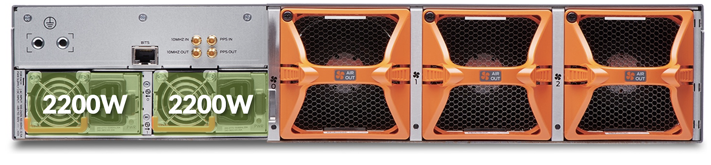

In this operational mode:

- Configuration is forced by the PSM 2200W presence.
- Express 5 clock is reduced to 65% of its capability.
- Ports are "limited" to 400Gbps and global forwarding is 14.4Tbps.
- All configuration modes, such as 4x 112Gbps or 8x 56Gbps are supported.
- Insertion of an 800Gbps or 2x400Gbps optic is not supported.
- Total power consumption will be reduced by roughly 30%.
- Support up to 25W optics in each port (example 400GigE ZR).

### 3000W PSM are Inserted

Here, we have 3000W PSMs inserted in the back of PTX10002-36QDD, the system will automatically detect them and configure an "800G" mode also named "28.8Tbps" mode.

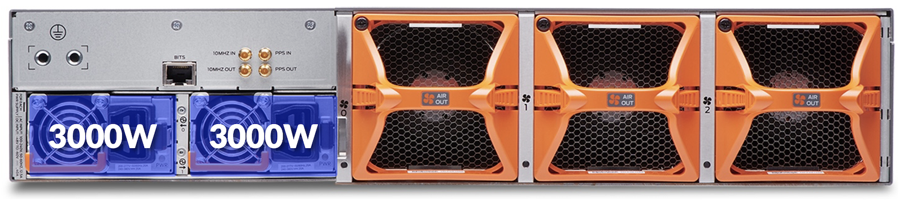

In this operational mode:

- Configuration is forced by the PSM 3000W presence.

Note that it represents the PSM capacity, depending on the configuration the system will draw much less power.
- Express 5 runs at full speed.
- Ports can be used with at 400GigE, 2x400GigE, 800GigE, etc...
- Support up to 30W optics in each port.

```
regress@ptx10002-36qdd> show chassis mode 
            FRU         Slot      Mode
            FPC         0         Normal Mode

regress@ptx10002-36qdd> show chassis power detail 
Chassis Power        Voltage(V)    Power(W)

Total Input Power                    543
  PSM 0
    State: Online
    Input 1             203          253
    Output               12        195.09
    Capacity           3000 W (maximum 3000 W)
  PSM 1
    State: Online
    Input 1             198          290
    Output               12        243.03
    Capacity           3000 W (maximum 3000 W)

Item                 Used(W)
  Routing Engine 0       71
  FPC 0                 332
  Fan Tray 0             10
  Fan Tray 1              9
  Fan Tray 2              9

System:
  Power mode:            Normal
  Zone 0:
      Capacity:          6000 W (maximum 6000 W)
      Allocated power:   2625 W (3375 W remaining)
      Actual usage:      543 W
  Total system capacity: 6000 W (maximum 6000 W)
  Total remaining power: 3375 W

regress@ptx10002-36qdd>         
```

### 3000W PSMs are Inserted and Power-Optimized Config is Committed

In this third option, the system detects 3000W PSMs, but we configured and committed "set chassis mode power-optimized". After a reload. This configuration makes the system behave very similarly to the 14.4Tbps mode with 2200W PSMs.

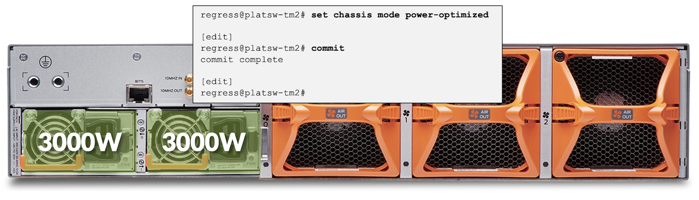

In this operational mode:

- Configuration is forced by CLI and reload.
- Express 5 speed is reduced to 65% of its capability.
- Ports are "limited" to 400Gbps and global forwarding is 14.4Tbps.
- Total power consumption will be reduced by roughly 30%.
- Support up to 25W optics in each port.

```
regress@ptx10002-36qdd> show chassis mode 
            FRU         Slot      Mode
            FPC         0         Power Optimized Mode

regress@ptx10002-36qdd> show chassis power detail 
Chassis Power        Voltage(V)    Power(W)

Total Input Power                    317
  PSM 0
    State: Online
    Input 1             202          137
    Output               12        103.51
    Capacity           3000 W (maximum 3000 W)
  PSM 1
    State: Online
    Input 1             198          180
    Output            11.99        145.42
    Capacity           3000 W (maximum 3000 W)

Item                 Used(W)
  Routing Engine 0       85
  FPC 0                   0
  Fan Tray 0              7
  Fan Tray 1              6
  Fan Tray 2              7

System:
  Power mode:            power-optimized
  Zone 0:
      Capacity:          6000 W (maximum 6000 W)
      Allocated power:   2150 W (3850 W remaining)
      Actual usage:      317 W
  Total system capacity: 6000 W (maximum 6000 W)
  Total remaining power: 3850 W

regress@ptx10002-36qdd>
```

We performed the test in the lab and measured the following:

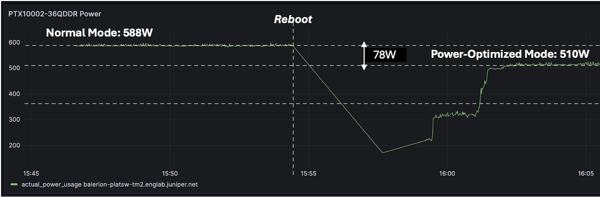

In this quick test, we notice around 80W of power saving between the two modes after reboot. Please note your mileage may vary depending on the optics inserted and environmental conditions.

### X-Chiplet Die Power Off

Since the Packet Forwarding Engine Express 5 powering the PTX10002-36QDD is a BXX design, it's possible to power off one of the chiplets. It will reduce the connectivity and the forwarding capability by half (to 18 ports and 14.4Tbps respectively), and will significantly reduce power usage.

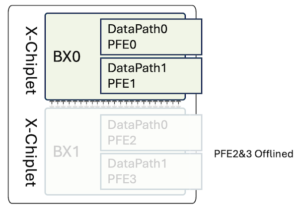

It's possible to power on and off the die, at will. Note that, at FRS, the power on/off of the PFEs will stall the routes and next-hop programming for approximately 30s.

The ports are directly mapped to the different datapaths/slices. Therefore, if we power off BX1, we will see 18 ports disappear from the IFD list (physical interfaces).

Table: Chiplet Die to Port Mapping

| X-Chiplet | PFE-Instance | PFE Port Mappinget-0/0/x |
|:--|:--|:--|
| BX0 | PFE0 / PFE1 | 9/10/11/12/13/14/15/16/1718/19/20/21/22/23/24/25/26 |
| BX1 | PFE2 / PFE3 | 0/1/2/3/4/5/6/7/827/28/29/30/31/32/33/34/35 |

The "power off" configuration can be performed at two levels: in config mode, or through request chassis command. The element we will configure here is the 7.2Tbps datapath/slice, which is called "PFE" from the router's perspective.

In CLI mode, we just need to request to "offline" one PFE of the pair (number 2 in our example), and it will automatically apply it to the second PFE (number 3 here). In the output below, we tried to offline the PFE3 and the system refused since this slice was already in the process of being shutdown.

```
regress@ptx10002-36qdd> show chassis fpc pfe all 
FPC 0
PFE-Instance    PFE           PFE-State
0               0             ONLINE               
0               1             ONLINE               
1               2             ONLINE               
1               3             ONLINE               
regress@ptx10002-36qdd> request chassis fpc slot 0 pfe 2 offline 
Warning: PFE 3 will also be offlined by this command. Proceed? [yes,no] (no) yes 
Fru Block offline initiated!
regress@ptx10002-36qdd> request chassis fpc slot 0 pfe 3 offline    
Warning: PFE 2 will also be offlined by this command. Proceed? [yes,no] (no) yes 
Fru Block cannot be offlined. Already in state TRANSITION_OFFLINE
regress@ptx10002-36qdd> show chassis fpc pfe all 
FPC 0
PFE-Instance    PFE           PFE-State
0               0             ONLINE               
0               1             ONLINE               
1               2             Offlined by CLI      
1               3             Offlined by CLI      
regress@ptx10002-36qdd>
```

In configuration mode, you will need to specifically power off both PFEs of the pair, otherwise Junos will refuse the commit.

```
regress@ptx10002-36qdd# set chassis fpc 0 pfe ?            
Possible completions:
  <pfe-id>             PFE(Packet forwarding engine) identifier (0..3)
[edit]
regress@ptx10002-36qdd# set chassis fpc 0 pfe 2 power off 
[edit]
regress@ptx10002-36qdd# commit 
[edit chassis fpc 0 pfe 2 power]
  'power off'
    pfe 2,3 need to be configured power on / off together. Config for these pfes need to be added / deleted / changed together.
error: commit failed: (validation hook evaluation failed)
[edit]
regress@ptx10002-36qdd# set chassis fpc 0 pfe 3 power off    
[edit]
regress@ptx10002-36qdd# commit 
commit complete
[edit]
regress@ptx10002-36qdd# run show chassis fpc pfe all 
FPC 0
PFE-Instance    PFE           PFE-State
0               0             ONLINE               
0               1             ONLINE               
1               2             Configured power off 
1               3             Configured power off 
[edit]
regress@ptx10002-36qdd# 
```

In our lab, we ran this quick test and measured the power saved in the process:

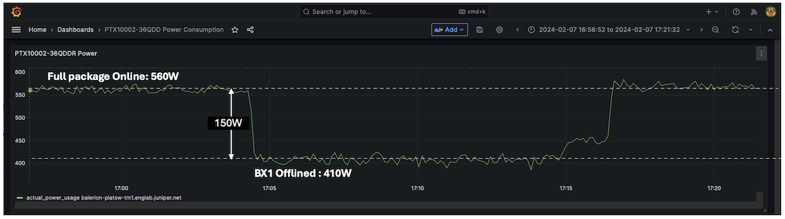

In this test above, we turn off BX1 and turn it back on. We notice around 150W of power saved here. Note that we have optics inserted in the ports mapped to BX0 but no optics were present on the BX1 side. Again, it's a lab exercise performed in a non-controlled environment and your mileage may vary a bit in other conditions. Nevertheless, it gives a good approximation of the savings we can expect.

You can also mix the two different approaches described above, meaning: you can enable the power-optimized mode (reducing the PFE clock and limiting the ports to 400Gbps) **and** you can turn off one of the two chiplets:

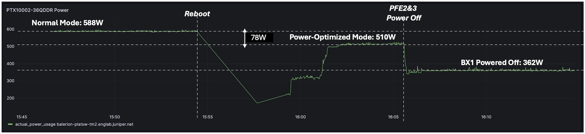

### Best Practice

In the diagram below, we describe a case where 18 ports are initially connected "randomly" and where a smart repositioning of the interfaces on BX0 allows powering off the second BX1.

It's particularly relevant when you consider a PAYG approach.

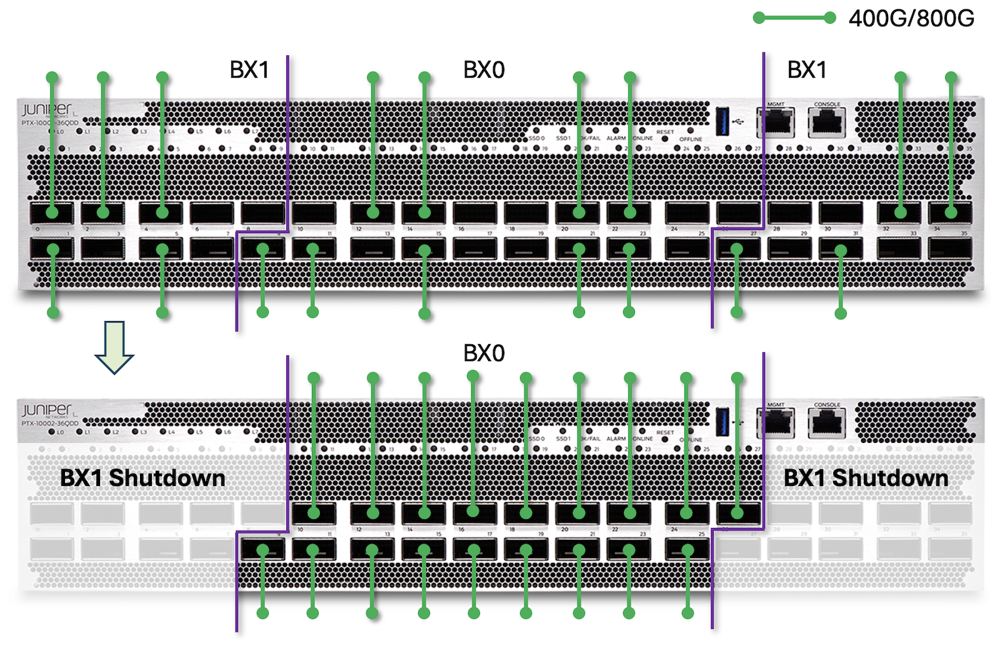

The logic here is very simple: it's recommended to populate the pluggable optics in ports et-0/0/9 to et-0/0/26 first, that way we can power off half of the PFEs.

## Conclusion

The PTX10002-36QDD is a highly compact and powerful router, offering unparalleled 800GigE and 400GigE port density in a 2RU form-factor. Built on a single Express 5 silicon chip with an optimized design, it delivers exceptional energy efficiency while also providing a comprehensive and continually expanding set of features and protocols.

This makes it an ideal choice for a wide range of applications, including core, peering, aggregation, data center edge, data center interconnect, and AI/ML clusters.

## Useful links

- [The Feed] Introducing the PTX10002-36QDD Packet Transport Router: [https://www.juniper.net/us/en/the-feed/topics/400g-and-800g/introducing-the-ptx10002-36qdd-packet-transport-router.html](https://www.juniper.net/us/en/the-feed/topics/400g-and-800g/introducing-the-ptx10002-36qdd-packet-transport-router.html)
- PTX10002-36QDD Datasheet: [https://www.juniper.net/us/en/products/routers/ptx-series/ptx10002-fixed-configuration-packet-transport-routers-datasheet.html](https://www.juniper.net/us/en/products/routers/ptx-series/ptx10002-fixed-configuration-packet-transport-routers-datasheet.html)
- PTX10002-36QDD Specifications: [https://www.juniper.net/us/en/products/routers/ptx-series/ptx10002-36qdd-packet-transport-router/specs.html](https://www.juniper.net/us/en/products/routers/ptx-series/ptx10002-36qdd-packet-transport-router/specs.html)
- Introduction to Express 5 TechPost blog: [https://juniper.github.io/techposts/express-5-overview/article](https://juniper.github.io/techposts/express-5-overview/article)
- FIB Compression blog: [https://juniper.github.io/techposts/ptx-fib-compression/article](https://juniper.github.io/techposts/ptx-fib-compression/article)

## Glossary

- ASIC: Application-Specific Integrated Circuit
- BIER: Multicast using Bit Index Explicit Replication
- BXX: Express 5 Package made of two X-chiplets back-to-back
- CLI: Command Line Interface
- CPU: Central Processor Unit
- DCI: DataCenter Interconnect
- DRAM: Dynamic Random Access Memory
- FIB: Forwarding Information Base
- FPGA: Field Programmable Gate Arrays
- FPC: Flexible PIC Concentrator
- GigE: Gigabit Ethernet
- HBM: High-Bandwidth Memory
- HQoS: Hierarchical Quality of Service
- INT-MD: Inband Network Telemetry Metadata
- LC: Little/Light Connector
- MACsec: Media Access Control Security
- MPLS: Multi-Protocol Label Switching
- MPO: Multi-Fibre Push-On/Off (Connector)
- PIC: Port Interface Card
- PPS: Packet Per Second
- PSM/PSU: Power Supply Module/Unit
- PTP: Precision Time Protocol
- QDD: QSFP Double Density
- RE: Routing Engine
- RGB: Reverse GearBox
- RIB: Routing Information Base
- SerDes : Serializer/Deserializer
- SoC: System on the Chip
- SRv6: Segment Routing IPv6
- SSD: Solid State Drive
- Sync-E: Synchronous Ethernet
- TPM: Trust Platform Module
- USB: Universal Serial Bus
- XSR: Extra Short Reach (SerDes)

## Acknowledgments

Thanks to Sharada Yeluri, Anand Beedi, Srinivas Seshadri and Dmitry Shokarev for the review and corrections.
