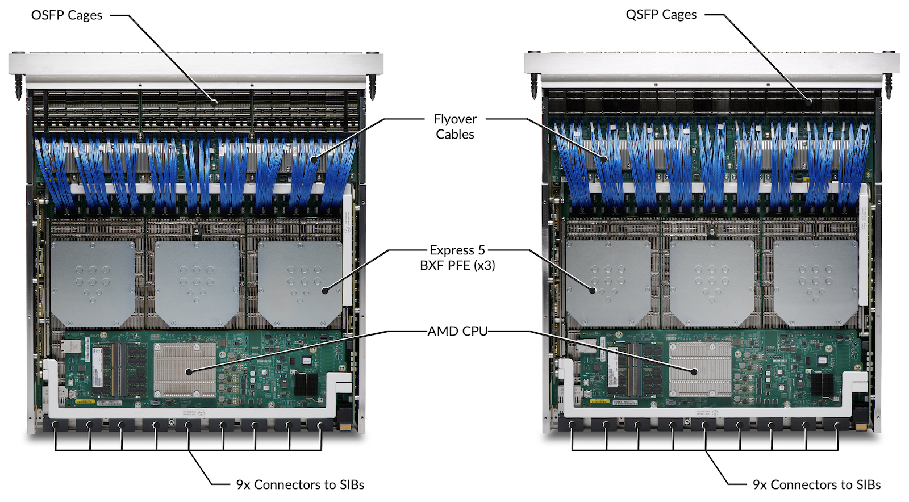

# Introducing PTX12000 Chassis

**Nicolas Fevrier - 02/25/2026**

- Introducing the PTX12000 Series (this blog)
- [Rethinking Fabric Redundancy](https://juniper.github.io/techposts/rethinking-fabric-redundancy/article)
- [Deepdive in the Fabric Topology](https://juniper.github.io/techposts/ptx12008-fabric-topology/article)
- [Fabric Self Healing and Recovery](https://juniper.github.io/techposts/self-healing-and-recovery-mechanisms-for-ptx12008/article)
- [Navigating the Front Panel Display](https://juniper.github.io/techposts/navigating-the-ptx12008-lcd-module/article)
- PTX12k Power Saving and Metrics (coming soon)

## Introduction

It's not every day you unveil a brand-new series product line, so it's with a lot of excitement we launched the PTX12000 modular chassis in February 2026.

The PTX12000 chassis sets new standards in terms of port density (800GbE today, 1.6TE will come next), cooling capacity and power efficiency. The new chassis completes the PTX10000 family by adding a different form factor and a fully redesigned architecture. Both the latest line cards and fabric cards for PTX10000 and PTX12000 use the same internal packet-forwarding engine: the Express 5 ASICs.

The new system will be released in two form factors:

- An 8-slot chassis that measures 22RU and is already shipping
- A 12-slot version, 32RU, planned for the end of the calendar year 2026 (contact your favorite HPE representative for the latest details).

And day 1, they can be populated with two types of line cards:

- 54 ports 800GbE OSFP
- 54 ports 800GbE QSFP-DD

This article will provide an extensive description of the hardware (line cards, fabric cards, routing boards, fan trays and power modules), but we will cover also the interfaces and the port capabilities.

Many other publications will follow and will be linked from this page when they appear online.

As a prerequisite, for more details on the Packet Forwarding Engine and the Express5 variants, we invite you to read the following blog posts first:

- Introduction to Express 5 TechPost blog: [https://juniper.github.io/techposts/express-5-overview/article](https://juniper.github.io/techposts/express-5-overview/article)
- [https://juniper.github.io/techposts/introducing-express5-in-ptx10k-chassis/article](https://juniper.github.io/techposts/introducing-express5-in-ptx10k-chassis/article)
(section "Main Forwarding Components")

A bit of vocabulary. In this document, we will talk about:

- "Package": to describe the Express 5 ASIC. Alternatively, we will use "chipset", "NPU" (for Network Processing Unit) or even "Forwarding Engine".
- "PFE-instance" to describe the BX chiplet, made of two datapath (DPs)
- "PFE" to describe a 7.2Tbps datapath in the PFE-instance.

## Chassis Description

In this section, we'll illustrate the description with details on the 8-slot chassis, but all these concepts apply to the 12-slot version too, unless otherwise specified.

## Front View

Figure 02 above provides a front view of the chassis in diverse situations:

- Left: with the EMI protective door installed
- Center: with line cards and routing engine inserted
- Right: without any FRU (Field Replaceable Unit) installed, except the fan trays and one fabric card.

Let's describe the chassis starting from the top.

In front of the power shelf (we will cover it later), you'll find a "Front Panel Display". It's a touch screen an on-site operator can use to visualize the various alarms and verify the chassis parts and interfaces states.

Below the display, two slots are available for the Routing and Control Boards (RCB), also called "Routing Engines" (RE). The system can be operated with one or two REs present. They handle the control and management planes functions, but they also control and monitor the entire chassis internals. If you operate the system with two REs, they become fully redundant (active/standby).

Below the REs, we have 8 or 12 horizontal slots for 2.75 inches line cards. At the date of this article creation, two flavors of line cards are available, both offering 54 ports 800GbE with different optics form-factors. It represents 43.2Tbps of port connectivity but also 43.2Tbps of forwarding capability (the cards are not oversubscribed). More line cards will be introduced in the future, and the system is designed to support 1.6T optics.

The following chart describes the maximum port density per interface type/speed at launch day:

| Pluggable Optics Modules | Maximum Port Densityper Slot | Maximum Port Densityper PTX12008 | Maximum Port Densityper PTX12012 |
|:--|:--|:--|:--|
| 800Gbps | 54 | 432 | 648 |
| 400Gbps | 108 (w/ 2x400G) | 864 | 1,296 |
| 100Gbps | 432 (w/ 8x100G) | 3,456 | 5,184 |
| 40Gbps | 54 (QSFP only) | 432 | 648 |
| 25Gbps | 216 (w/ 4x25G, QSFP only) | 1,728 | 2,592 |
| 10Gbps | 216 (w/ 4x10G, QSFP only) | 1,728 | 2,592 |

From a power and cooling perspective, it's possible to operate high-power optics ZR/ZRP on all ports with no restriction: 30W per QSFP port and 33W per OSFP port.

Note that you can only insert "PTX12K-LC" line cards in these slots (PTX12K-LC54OSFP/PTX12K-LC54QDD today, more in the future), but the PTX10000 cards, even those based on Express5, are not compatible. It's a totally different pitch, and different number of connectors to the fabric.

Below the line cards slots, at the bottom of the chassis, you'll find the ESD ground point:

## Back View

At the top, you'll find a power shelf. For the PTX12008, this shelf can host up to 20 (4x5) Power Supply Units (PSU). The PSU are also seen as Power Supply Modules (PSM) from the operating system's perspective. The PTX12012 has a higher power shelf (4x9).

Two PSM options are available at the moment of the publication of this article:

- JNP-PWR-3K-AC PSU: dual-feed 3,000W AC, High Voltage HVAC/HVDC
- JNP-PWR-3K-DC PSU: dual-feed 3,000W DC that can be operated at 60A or 80A

Mixing AC and DC in the same power shelf is not supported.

Below the PTX12008 shelf, you can see three large fan trays, each made of 10 (5x2) large counter-rotating fans. They guarantee the front-to-back cooling of the system and offer 2+1 redundancy.

Behind each fan tray, 3x fabric cards are inserted vertically. We have a total of 9x fabric cards in the chassis (both PTX12008 and PTX12012, but of course, the fabric cards are different for each chassis type). To operate, remove or insert, a fabric card, you need to unseat the facing fan tray. Please refer to the hardware guide for details on the operation.

From the back of the router, the ESD attach point and the earth ground points are located on the right of the fan trays.

## Let's Verify That on the Console

The following show command output displays the various parts of a PTX12008 with 2x RCBs, 8x Line Cards (QSFP and OSFP), 9x Fabric Cards, 3x Fan Trays, and 20x Power Supply Modules inserted in the shelf.

```
root@ptx12008-re0> show chassis hardware detail 
Hardware inventory:
Item             Version  Part number  Serial number     Description
Chassis                                FX032             PTX12008
Midplane 0       REV 01   750-180225   BCFZ3803          Midplane 8
FPM 0            REV 01   750-181246   BCGB4121          Front Panel Display
PSM 0            REV 05   740-143236   1GH1D130494       JNP 3000W HVAC/HVDC Power Supply
PSM 1            REV 05   740-143236   1GH1D130478       JNP 3000W HVAC/HVDC Power Supply
PSM 2            REV 05   740-143236   1GH1D130499       JNP 3000W HVAC/HVDC Power Supply
PSM 3            REV 05   740-143236   1GH1D130486       JNP 3000W HVAC/HVDC Power Supply
PSM 4            REV 05   740-143236   1GH1D130487       JNP 3000W HVAC/HVDC Power Supply
PSM 5            REV 05   740-143236   1GH1D130483       JNP 3000W HVAC/HVDC Power Supply
PSM 6            REV 05   740-143236   1GH1D130463       JNP 3000W HVAC/HVDC Power Supply
PSM 7            REV 05   740-143236   1GH1D130474       JNP 3000W HVAC/HVDC Power Supply
PSM 8            REV 05   740-143236   1GH1D130469       JNP 3000W HVAC/HVDC Power Supply
PSM 9            REV 05   740-143236   1GH1D130485       JNP 3000W HVAC/HVDC Power Supply
PSM 10           REV 06   740-143236   1GH1E430638       JNP 3000W HVAC/HVDC Power Supply
PSM 11           REV 06   740-143236   1F36E500027       JNP 3000W HVAC/HVDC Power Supply
PSM 12           REV 06   740-143236   1F36E500126       JNP 3000W HVAC/HVDC Power Supply
PSM 13           REV 06   740-143236   1F36E500007       JNP 3000W HVAC/HVDC Power Supply
PSM 14           REV 06   740-143236   1F36E500012       JNP 3000W HVAC/HVDC Power Supply
PSM 15           REV 05   740-143236   1GH1D130429       JNP 3000W HVAC/HVDC Power Supply
PSM 16           REV 05   740-143236   1GH1D130489       JNP 3000W HVAC/HVDC Power Supply
PSM 17           REV 05   740-143236   1GH1D130491       JNP 3000W HVAC/HVDC Power Supply
PSM 18           REV 05   740-143236   1GH1D130476       JNP 3000W HVAC/HVDC Power Supply
PSM 19           REV 05   740-143236   1GH1D130498       JNP 3000W HVAC/HVDC Power Supply
Routing Engine 0          BUILTIN      BUILTIN           PTX12K-RE
  nvme0 400088 MB  VTPM28ADCI400-BJ230005 63871-0006     NVMe Solid State Disk
  nvme1 400088 MB  VTPM28ADCI400-BJ230005 64442-0013     NVMe Solid State Disk
Routing Engine 1          BUILTIN      BUILTIN           PTX12K-RE
  nvme0 400088 MB  DSM28-400DP1KWAEFP-B553B Y5342501160070119 NVMe Solid State Disk
  nvme1 400088 MB  DSM28-400DP1KWAEFP-B553B Y5342501160070107 NVMe Solid State Disk
CB 0             REV 06   750-173945   BCFS1429          Control Board
CB 1             REV 12   750-173945   BCGR4043          Control Board
FPC 0            REV 29   750-173325   BCGJ3200          PTX12K-LC54QDD
  CPU            REV 05   750-173947   BCGF9527          PTX12K-LC54 PMB Board
  PIC 0                   BUILTIN      BUILTIN           PTX12K-54QDD800-LC-PIC
    Xcvr 0       REV 01   740-150874   1W1CSMAA07004     QSFP-DD800-800G-AOC-10M
    ...
    Xcvr 53      REV 01   740-150874   1W1CSMAA0700D     QSFP-DD800-800G-AOC-10M
  MEZZ 0         REV 09   750-175158   BCGF9428          PTX12K-LC54QDD MEZZ A Board
  MEZZ 1         REV 08   750-175159   BCGG0265          PTX12K-LC54QDD MEZZ B Board
  MEZZ 2         REV 06   750-175033   BCGF5395          PTX12K-LC54 Power Board Right
  MEZZ 3         REV 07   750-175031   BCGF4361          PTX12K-LC54 Power Board Left
FPC 1            REV 17   750-173322   BCFZ3747          PTX12K-LC54OSFP
  CPU            REV 04   750-173947   BCFZ6313          PTX12K-LC54 PMB Board
  PIC 0                   BUILTIN      BUILTIN           PTX12K-54OSFP800-LC-PIC
    Xcvr 0       REV 01   740-174938   1G1THKA95200Z     OSFP-8x100G-FR1
    Xcvr 13      REV 01   740-174938   1G1THKA95100L     OSFP-8x100G-FR1
    Xcvr 46      REV 01   740-174935   1W1CVXAA0400M     OSFP-2x400G-FR4-P
  MEZZ 0         REV 04   750-175154   BCFZ6245          PTX12K-LC54OSFP MEZZ A Board
  MEZZ 1         REV 04   750-175157   BCFZ7496          PTX12K-LC54OSFP MEZZ B Board
  MEZZ 2         REV 04   750-175033   BCFX9225          PTX12K-LC54 Power Board Right
  MEZZ 3         REV 05   750-175031   BCFZ2121          PTX12K-LC54 Power Board Left
FPC 2            REV 29   750-173325   BCGJ3197          PTX12K-LC54QDD
  CPU            REV 05   750-173947   BCGF9519          PTX12K-LC54 PMB Board
  PIC 0                   BUILTIN      BUILTIN           PTX12K-54QDD800-LC-PIC
    Xcvr 0       REV 01   740-150875   1W1CSNAA08008     QSFP-DD800-800G-AOC-15M
    ...
    Xcvr 53      REV 01   740-150876   1W1CSOAA04003     QSFP-DD800-800G-AOC-20M
  MEZZ 0         REV 09   750-175158   BCGF9424          PTX12K-LC54QDD MEZZ A Board
  MEZZ 1         REV 08   750-175159   BCGG0257          PTX12K-LC54QDD MEZZ B Board
  MEZZ 2         REV 06   750-175033   BCGF5402          PTX12K-LC54 Power Board Right
  MEZZ 3         REV 07   750-175031   BCGF4365          PTX12K-LC54 Power Board Left
FPC 3            REV 29   750-173322   BCGJ3189          PTX12K-LC54OSFP
  CPU            REV 05   750-173947   BCGF9523          PTX12K-LC54 PMB Board
  PIC 0                   BUILTIN      BUILTIN           PTX12K-54OSFP800-LC-PIC
  MEZZ 0         REV 09   750-175154   BCGF9247          PTX12K-LC54OSFP MEZZ A Board
  MEZZ 1         REV 08   750-175157   BCGF9432          PTX12K-LC54OSFP MEZZ B Board
  MEZZ 2         REV 06   750-175033   BCGF5418          PTX12K-LC54 Power Board Right
  MEZZ 3         REV 07   750-175031   BCGF4376          PTX12K-LC54 Power Board Left
FPC 4            REV 17   750-173322   BCFY2429          PTX12K-LC54OSFP
  CPU            REV 04   750-173947   BCFZ6306          PTX12K-LC54 PMB Board
  PIC 0                   BUILTIN      BUILTIN           PTX12K-54OSFP800-LC-PIC
    Xcvr 22      REV 01   740-174938   1G1THKA95200B     OSFP-8x100G-FR1
    Xcvr 37      REV 01   740-174933   1A1MVWA9400EZ     OSFP-800G-DR8-P
    Xcvr 43      REV 01   740-174933   1A1MVWA94008L     OSFP-800G-DR8-P
  MEZZ 0         REV 04   750-175154   BCFZ6255          PTX12K-LC54OSFP MEZZ A Board
  MEZZ 1         REV 04   750-175157   BCFZ7448          PTX12K-LC54OSFP MEZZ B Board
  MEZZ 2         REV 04   750-175033   BCFX9240          PTX12K-LC54 Power Board Right
  MEZZ 3         REV 05   750-175031   BCFZ2111          PTX12K-LC54 Power Board Left
FPC 5            REV 46   750-173322   BCGT8620          PTX12K-LC54OSFP
  CPU            REV 08   750-173947   BCGT9286          PTX12K-LC54 PMB Board
  PIC 0                   BUILTIN      BUILTIN           PTX12K-54OSFP800-LC-PIC
  MEZZ 0         REV 12   750-175154   BCGV2215          PTX12K-LC54OSFP MEZZ A Board
  MEZZ 1         REV 10   750-175157   BCGT9230          PTX12K-LC54OSFP MEZZ B Board
  MEZZ 2         REV 08   750-175033   BCGV2153          PTX12K-LC54 Power Board Right
  MEZZ 3         REV 09   750-175031   BCGV3115          PTX12K-LC54 Power Board Left
FPC 6            REV 17   750-173322   BCFY2414          PTX12K-LC54OSFP
  CPU            REV 04   750-173947   BCFZ6346          PTX12K-LC54 PMB Board
  PIC 0                   BUILTIN      BUILTIN           PTX12K-54OSFP800-LC-PIC
    Xcvr 5       REV 01   740-174933   1A1MVWAA160CS     OSFP-800G-DR8-P
...
    Xcvr 53      XXXX     NON-JNPR     31360             OSFP-PASSIVE-E-LPBK
  MEZZ 0         REV 04   750-175154   BCFZ6263          PTX12K-LC54OSFP MEZZ A Board
  MEZZ 1         REV 04   750-175157   BCFZ7453          PTX12K-LC54OSFP MEZZ B Board
  MEZZ 2         REV 04   750-175033   BCFX9243          PTX12K-LC54 Power Board Right
  MEZZ 3         REV 05   750-175031   BCFZ1900          PTX12K-LC54 Power Board Left
FPC 7            REV 17   750-173322   BCFY2416          PTX12K-LC54OSFP
  CPU            REV 04   750-173947   BCFZ6318          PTX12K-LC54 PMB Board
  PIC 0                   BUILTIN      BUILTIN           PTX12K-54OSFP800-LC-PIC
  MEZZ 0         REV 04   750-175154   BCFZ6281          PTX12K-LC54OSFP MEZZ A Board
  MEZZ 1         REV 04   750-175157   BCFZ7499          PTX12K-LC54OSFP MEZZ B Board
  MEZZ 2         REV 04   750-175033   BCFX9221          PTX12K-LC54 Power Board Right
  MEZZ 3         REV 05   750-175031   BCFZ2102          PTX12K-LC54 Power Board Left
SIB 0            REV 20   750-173308   BCGR7353          SIB-PTX12008-SF
  MEZZ 0         REV 04   750-176911   BCGS0396          SIB-PTX12008-SF Power Board
SIB 1            REV 20   750-173308   BCGR7344          SIB-PTX12008-SF
  MEZZ 0         REV 04   750-176911   BCGS0406          SIB-PTX12008-SF Power Board
SIB 2            REV 20   750-173308   BCGR7339          SIB-PTX12008-SF
  MEZZ 0         REV 04   750-176911   BCGS0379          SIB-PTX12008-SF Power Board
SIB 3            REV 22   750-173308   BCGV5056          SIB-PTX12008-SF
  MEZZ 0         REV 04   750-176911   BCGV2204          SIB-PTX12008-SF Power Board
SIB 4            REV 20   750-173308   BCGR7335          SIB-PTX12008-SF
  MEZZ 0         REV 04   750-176911   BCGS0407          SIB-PTX12008-SF Power Board
SIB 5            REV 22   750-173308   BCGV5055          SIB-PTX12008-SF
  MEZZ 0         REV 04   750-176911   BCGV2209          SIB-PTX12008-SF Power Board
SIB 6            REV 22   750-173308   BCGV5061          SIB-PTX12008-SF
  MEZZ 0         REV 04   750-176911   BCGV2196          SIB-PTX12008-SF Power Board
SIB 7            REV 22   750-173308   BCGV5059          SIB-PTX12008-SF
  MEZZ 0         REV 04   750-176911   BCGV2164          SIB-PTX12008-SF Power Board
SIB 8            REV 22   750-173308   BCGV5058          SIB-PTX12008-SF
  MEZZ 0         REV 04   750-176911   BCGT2281          SIB-PTX12008-SF Power Board
Fan Tray 0       REV 01   750-175846   BCFW3852          PTX12008 Fan tray
Fan Tray 1       REV 01   750-175846   BCFW3820          PTX12008 Fan tray
Fan Tray 2       REV 01   750-175846   BCFW3816          PTX12008 Fan tray
POWERSHELF 0              BUILTIN      BUILTIN           5 Row PSM POWERSHELF

{master}
root@ptx12008-re0>
```

## Dimension/Weight/Installation

With all Field Replacement Units (FRU) removed, an empty chassis weights 325 lb (147.4 kg). The chassis depth will vary depending on the cosmetics installed, cable management and the protective front door, as displayed in Figure 06 below.

Always refer to the hardware guide prior to the installation of the chassis in your facilities. The "Fast Track to Rack Installation" section will provide all the necessary details.

## Chassis Architecture

The PTX12000 chassis uses an "orthogonal-direct" (OD) architecture. In this layout, line cards slide in horizontally at the front of the chassis and connect straight to the fabric cards that sit vertically in its center. Because of this arrangement, no intermediate back-plane or mid-plane is needed. Each Packet Forwarding engine (PFE) links to every fabric engine on all fabric cards, creating a full-mesh interconnection.

Many hardware innovations have been brought during the building of this new chassis, starting from the power distribution. We will cover them in further details in follow up publications.

## Line Cards High-Level Description

The section "Line Card Architecture" will go in deeper internal details, block diagrams and port capabilities, but first, let's have a quick overview.

The line cards are inserted horizontally on the front side of the chassis and are connected to all the fabric cards (SIBs) present in the center. Nine SIBs are required to reach the full forwarding capacity. The combo LC/SIB forms an internal full mesh, or Clos topology, where every ingress port is one hop away from each egress port.

In Feb 2026, when we launch the PTX12000 chassis, two interface cards are available:

- PTX12K-LC54QDD
- PTX12K-LC54OSFP

If you have been in this industry for long enough, the first thing you'll notice is the height (or pitch) of these new cards. In a PTX10000 chassis, for example, the cards are slightly less than 5cm high, and the usual range you'll find in the market spans from 4.5 to 5.4cm. The two LC54 cards are **7cm** high or **2.75 inches**. This unique form-factor allows higher port density (54 interfaces on 3 rows) and improved cooling capacity.

The cards can be positioned in any slot without any restriction, mixed and matched as you wish. Powered by three Express 5 BXF Packet Forward Engine for 43.2Tbps of forwarding capacity, they offer the highest port density per card in the industry: 54x 800Gbps ports (and yes, we mean real 800GbE here, but also 2x 400GbE, 8x 100GbE and many other channelization/breakout options).

They are hot removable and insertable, without any specific impact on the chassis. The use of a specific CLI "request chassis fpc slot X offline/online" is required for a smooth operation.

The benefits of such a unique hardware architecture and port density will be elaborated in dedicated blog posts. Without spoiling them nor going into too many details, I want to emphasize some key aspects:

- It's a front-to-back cooling design, the cool air flow is received from the optics and goes towards the back of the chassis but also through the power shelf
- All ports, QSFP or OSFP, can host high power 800G optics (ZR, ZR+). Cooling and power budget is designed to support all ports, on all slots, with 30W and 33W optics.
- All ports can be encrypted at L2, line rate, with MACsec technology

The hardware guide will describe the cosmetics installation, cable management, etc.

Note that in normal operational conditions, the card is not equipped with ejector tool handles, they are only required for OIR (insertion/ejection). Here again, we invite you to carefully read the hardware guide for the exact procedure.

Considering the weight of the line cards (21kg of OSFP and 21.3kg and QSFP), we recommend two operators onsite or the use of specific lifting equipment to manipulate it.

## Fabric Cards

The PTX12000 chassis can be populated with a maximum of 9 fabric cards named "PTX12008-SF" and "PTX12012-SF".

This number of fabric cards is required to offer the maximum possible bandwidth per PFE/Datapath, Chipset/Package and line card. Running the system with less than nine SIBs is fully supported and some commercial bundles rely on this capability (described later in " Running the chassis with less than 9x SIB" section). It's particularly useful if you don't need 43.2Tbps per slot.

The SIBs are inserted from the back of the chassis and occupy a central part in the design. They have 8 of 12 connectors to link to the line cards. Each fabric card is behind a fan tray, and it will be necessary to eject the fans first to insert/remove/replace a SIB.

- SIB 0, 1 and 2 are behind Fan Tray 0
- SIB 3, 4 and 5 are behind Fan Tray 1
- SIB 6, 7 and 8 are behind Fan Tray 2

In these PTX12008-SF, you find 8x connectors to the cards, 6x retimers and 3x Express 5 BF ASICs (check figure 10 below). Each BF chipset can be seen as 144x144 crossbar with 106Gbps links and is designed to switch cells between the BXF PFEs.

```
root@ptx12008-re0> show chassis sibs   
Slot  State         Fabric links        Errors
 0    Online             Active         None   
 1    Online             Active         None   
 2    Online             Active         None   
 3    Online             Active         None   
 4    Online             Active         None   
 5    Online             Active         None   
 6    Online             Active         None   
 7    Online             Active         None   
 8    Online             Active         None   

{master}
root@ptx12008-re0> show chassis sibs detail 
Slot 0 information:
  State                               Online    
  Uptime                              2 days, 1 hour, 19 minutes, 32 seconds
  Fabric links                        Active
  Errors                              None
Slot 1 information:
  State                               Online    
  Uptime                              2 days, 1 hour, 17 minutes, 8 seconds
  Fabric links                        Active
  Errors                              None
Slot 2 information:
  State                               Online    
  Uptime                              2 days, 1 hour, 16 minutes, 51 seconds
  Fabric links                        Active
  Errors                              None
Slot 3 information:
  State                               Online    
  Uptime                              2 days, 1 hour, 17 minutes
  Fabric links                        Active
  Errors                              None
Slot 4 information:
  State                               Online    
  Uptime                              2 days, 1 hour, 16 minutes, 50 seconds
  Fabric links                        Active
  Errors                              None
Slot 5 information:
  State                               Online    
  Uptime                              2 days, 1 hour, 16 minutes, 56 seconds
  Fabric links                        Active
  Errors                              None
Slot 6 information:
  State                               Online    
  Uptime                              2 days, 1 hour, 16 minutes, 54 seconds
  Fabric links                        Active
  Errors                              None
Slot 7 information:
  State                               Online    
  Uptime                              2 days, 1 hour, 16 minutes, 57 seconds
  Fabric links                        Active
  Errors                              None
Slot 8 information:
  State                               Online    
  Uptime                              2 days, 1 hour, 16 minutes, 52 seconds
  Fabric links                        Active
  Errors                              None

{master}
root@ptx12008-re0>
```

Details on connectivity to the line cards will be covered in a dedicated article: link will come soon :)

## Running the chassis with less than 9x SIB

Operating the system with nine or fewer fabric cards will have a linear impact on the forwarding capability of each PFE/DataPath.

It's essential to understand this aspect: if you are not consuming the entire bandwidth of a DataPath, the remaining forwarding capability is not dynamically re-allocated to a busier PFE. The number of available fabric cards equally impacts all PFEs. This comprehension is key when positioning the interfaces.

| SIB | SIB BW per PFE/DP (in Tbps) | BW per slot (in Tbps) |
|:--|:--|:--|
| 9 | 7.2 | 43.2 |
| 8 | 6.4 | 38.4 |
| 7 | 5.6 | 33.6 |
| 6 | 4.8 | 28.8 |
| 5 | 4 | 24 |
| 4 | 3.2 | 19.2 |
| 3 | 2.4 | 14.4 |
| 2 | 1.8 | 9.6 |
| 1 | 0.8 | 4.8 |

Rule of the thumb: the 9 SIBs are necessary for line rate service, and each SIB lost will reduce linearly the forwarding capability by 11%.

Two options are available when ordering the system:

- PTX12008-BASE: **3x SIB**, 1x RE, 12x PSM
- PTX12008-PREMIUM: **9x SIB**, 2x RE, 20x PSM

## Routing and Control Board / Routing Engine

The Routing Engine (SKU: PTX12K-RE-BB/ PTX12K-RE-R) hosts the main compute capabilities of the chassis and centralizes most the control plane and management plane functions, on top of the supervision of the system itself.

Note: the slot in the chassis is marked "RCB" for Routing and Control Board and if the cards are name "RE" they are essentially RCBs.

| Component | Description |
|:--|:--|
| CPU | Intel Icelake-D 10C @ 2.9GHz |
| DRAM | 256GB DDR4 (4x 64GB DIMM) |
| SSD | 2x 400GB NVMe drives |
| TPM | Yes, 2.0 |
| Timing | HPE Juniper Timing FPGAConnectivity on the front:1PPS and 10MHz input and outputGPS 1pps input / outputG.703 TOD input portBITS (T1/E1) input / output1G SFP for GM port |

This powerful CPU is used by various HPE Juniper software components leveraging multi-core capabilities. For example, Routing Process Daemon (RPD) supports multithreading to process routing updates and routing resolution.

The storage subsystem is comprised of 400GB solid-state drives (SSDs). Two are provided for redundancy, plus reliable management of the software upgrades and rollbacks. These drives are not field-replaceable.

The RE has enough storage, DRAM capacity, and CPU power to host 3rd party applications. Some of these applications may include custom Service Assurance Agents or statistics collection agents developed by HPE Juniper partners and customers. Even full Telegraf, InfluxDB, Grafana stack can run on the router itself for data collection and visualization, check out the blog post ([https://juniper.github.io/techposts/telemetry-collector-and-dataviz-on-junos-evo/article](https://juniper.github.io/techposts/telemetry-collector-and-dataviz-on-junos-evo/article)).

From a security perspective, the RE is fully compliant with the TPM2.0 standard as published by the Trusted Computing Group (TCG). The TPM's non-volatile storage is used as a persistent, access-controlled area for component registration, location of policy, keys, etc.Trusted extensions are integrated into the Icelake CPU and only it can access the TPM. Hardware and firmware are designed to support FIPS 140-2 Level 2.

The first release supported on the PTX12008 is Junos Evo 26.2R1. Please reach out to your favorite HPE representative for more details. In Service Software Upgrade (ISSU) is not supported/planned.

## Control Board

The Routing Engine also hosts the control board, necessary for the internal operation of the entire chassis. The details are beyond the scope of this article, but we can say these functions guarantee the internal connectivity from the REs to all the components via an internal 10Gbps Ethernet switched network, but also via PCIe, and I2C networks. These networks are necessary to boot the system, transfer information between components but also monitor and control all conditions during the entire life of the router.

## Front Panel Display

The different line cards have no LED and an operator on site can use the Front Panel Display to inspect the different parameters relative to the chassis, line cards and ports. It's just a display and it's not possible to configure anything or interfere with the operation of the router from this screen.

In a couple of click, it's possible to inspect the state of the different FRUs and ports of the system. A dedicated post will be published on the topic of the FPD navigation. **Link will be added here soon.**

## Front-to-Back Cooling

Multiple fans are used to cool down and preserve the integrity of the system.

- In each PSU active in the power shelf
- In three fan trays installed vertically at the back of the router

These three PTX12008-FAN represent a total of 30 large fans operating simultaneously: 5 pairs of counter-rotating fans per tray (as shown in the output of the "show chassis fan" CLI below).

The PTX12012-FAN have a slightly different design, with 7 large single fans per tray.

Junos constantly collects and monitors dozens of temperature sensors scattered all around the chassis and adjust the rotation speed dynamically to maintain good operational environmental conditions.

```
root@ ptx12008-re0> show chassis environment monitored  
Class Item                           Status     Measurement
Power PSM 0 Inlet Temp Sensor        OK         24 degrees C / 75 degrees F
      PSM 0 Connector1 Temp Sensor   OK         29 degrees C / 84 degrees F
      PSM 0 Connector2 Temp Sensor   OK         29 degrees C / 84 degrees F
      PSM 0 Outlet Temp Sensor       OK         43 degrees C / 109 degrees F

<SNIP>

root@ptx12008-re0> show chassis environment monitored | count 
Count: 1329 lines

{master}

root@ptx12008-re0>
```

The system can operate with one faulty fan tray, the two others will be pushed to full speed. Therefore, it's possible to extract a fan tray in service to manipulate a SIB.

```
root@ptx12008-re0> show chassis fan    
      Item                      Status   % RPM     Measurement
      Fan Tray 0 Fan 0          OK       56%       5700 RPM                 
      Fan Tray 0 Fan 1          OK       62%       7200 RPM                 
      Fan Tray 0 Fan 2          OK       55%       5550 RPM                 
      Fan Tray 0 Fan 3          OK       62%       7200 RPM                 
      Fan Tray 0 Fan 4          OK       55%       5550 RPM                 
      Fan Tray 0 Fan 5          OK       62%       7200 RPM                 
      Fan Tray 0 Fan 6          OK       55%       5550 RPM                 
      Fan Tray 0 Fan 7          OK       62%       7200 RPM                 
      Fan Tray 0 Fan 8          OK       56%       5700 RPM                 
      Fan Tray 0 Fan 9          OK       63%       7350 RPM                 
      Fan Tray 1 Fan 0          OK       56%       5700 RPM                 
      Fan Tray 1 Fan 1          OK       62%       7200 RPM                 
      Fan Tray 1 Fan 2          OK       55%       5550 RPM                 
      Fan Tray 1 Fan 3          OK       62%       7200 RPM                 
      Fan Tray 1 Fan 4          OK       55%       5550 RPM                 
      Fan Tray 1 Fan 5          OK       62%       7200 RPM                 
      Fan Tray 1 Fan 6          OK       55%       5550 RPM                 
      Fan Tray 1 Fan 7          OK       62%       7200 RPM                 
      Fan Tray 1 Fan 8          OK       56%       5700 RPM                 
      Fan Tray 1 Fan 9          OK       61%       7050 RPM                 
      Fan Tray 2 Fan 0          OK       56%       5700 RPM                 
      Fan Tray 2 Fan 1          OK       62%       7200 RPM                 
      Fan Tray 2 Fan 2          OK       55%       5550 RPM                 
      Fan Tray 2 Fan 3          OK       62%       7200 RPM                 
      Fan Tray 2 Fan 4          OK       56%       5700 RPM                 
      Fan Tray 2 Fan 5          OK       62%       7200 RPM                 
      Fan Tray 2 Fan 6          OK       55%       5550 RPM                 
      Fan Tray 2 Fan 7          OK       61%       7050 RPM                 
      Fan Tray 2 Fan 8          OK       55%       5550 RPM                 
      Fan Tray 2 Fan 9          OK       62%       7200 RPM                 

{master}
root@ptx12008-re0>
```

## Power

On the top of the router sits a power shelf. It's the same shelf whether we use AC or DC modules. On PTX12008, the shelf can host 20 power supply modules (4x5) while the 12-slot version can accommodate up to 36 units (4x9).

In the figure 14 below, we present the PTX12008 shelf with 20x 3kW DC modules on the left and with AC modules on the right, total 60kW.

These modules convert the grid energy into a 52V current that will be distributed among all the internal FRUs. Both provide dual feed connectors.

Note: The JNP-PWR-3K-AC and JNP-PWR-3K-DC modules are Power Supply Units shared with other product lines like the PTX10000. Also, we can NOT mix AC and DC in the same power shelf. It's one or the other.

The follow show commands provide an exhaustive view of the different PSMs, their feeds, but also the consumption of all internal components in real time (a lot of parts in the chassis, it's a long output).

```
root@ptx12008-re0> show chassis power detail 
Chassis Power        Voltage(V)    Power(W)

Total Input Power                  22370
  PSM 0
    State: Online
    INP0                235          541
    INP1                236          561
    Output            52.49        1005.51
    Capacity           3000 W (maximum 3000 W)
  PSM 1
    State: Online
    INP0                236          559
    INP1                236          544
    Output            52.46        1018.18
    Capacity           3000 W (maximum 3000 W)
  PSM 2
    State: Online
    INP0                236          557
    INP1                236          557
    Output            52.47        1028.21
    Capacity           3000 W (maximum 3000 W)
  PSM 3
    State: Online
    INP0                236          564
    INP1                236          585
    Output            52.43        1078.28
    Capacity           3000 W (maximum 3000 W)
  PSM 4
    State: Online
    INP0                234          551
    INP1                234          558
    Output            52.46        1041.02
    Capacity           3000 W (maximum 3000 W)
  PSM 5
    State: Online
    INP0                235          569
    INP1                235          558
    Output            52.46        1060.77
    Capacity           3000 W (maximum 3000 W)
  PSM 6
    State: Online
    INP0                235          558
    INP1                235          579
    Output            52.48        1051.24
    Capacity           3000 W (maximum 3000 W)
  PSM 7
    State: Online
    INP0                234          538
    INP1                234          558
    Output            52.46        1008.23
    Capacity           3000 W (maximum 3000 W)
  PSM 8
    State: Online
    INP0                235          561
    INP1                235          551
    Output            52.48        1038.12
    Capacity           3000 W (maximum 3000 W)
  PSM 9
    State: Online
    INP0                235          541
    INP1                235          557
    Output            52.45        1013.07
    Capacity           3000 W (maximum 3000 W)
  PSM 10
    State: Online
    INP0                235          586
    INP1                236          568
    Output            52.47        1085.48
    Capacity           3000 W (maximum 3000 W)
  PSM 11
    State: Online
    INP0                236          560
    INP1                235          558
    Output            52.51        1033.9
    Capacity           3000 W (maximum 3000 W)
  PSM 12
    State: Online
    INP0                235          557
    INP1                234          552
    Output             52.5        1048.51
    Capacity           3000 W (maximum 3000 W)
  PSM 13
    State: Online
    INP0                235          557
    INP1                235          558
    Output            52.46        1036.25
    Capacity           3000 W (maximum 3000 W)
  PSM 14
    State: Online
    INP0                234          551
    INP1                236          555
    Output            52.45        1045.78
    Capacity           3000 W (maximum 3000 W)
  PSM 15
    State: Online
    INP0                234          554
    INP1                234          563
    Output            52.46        1018.14
    Capacity           3000 W (maximum 3000 W)
  PSM 16
    State: Online
    INP0                234          542
    INP1                234          569
    Output            52.49        1043.24
    Capacity           3000 W (maximum 3000 W)
  PSM 17
    State: Online                       
    INP0                236          586
    INP1                235          556
    Output            52.45        1019.55
    Capacity           3000 W (maximum 3000 W)
  PSM 18
    State: Online
    INP0                236          557
    INP1                235          561
    Output            52.47        1029.89
    Capacity           3000 W (maximum 3000 W)
  PSM 19
    State: Online
    INP0                235          568
    INP1                235          575
    Output            52.51        1056.87
    Capacity           3000 W (maximum 3000 W)

Item                 Used(W)
  Routing Engine 0      122
  Routing Engine 1      116
  FPC 0                2866
  FPC 1                2226
  FPC 2                3004
  FPC 3                2216
  FPC 4                2173
  FPC 5                1688
  FPC 6                2179
  FPC 7                2632
  SIB 0                 620
  SIB 1                 619
  SIB 2                 633
  SIB 3                 625
  SIB 4                 638
  SIB 5                 633
  SIB 6                 624
  SIB 7                 626
  SIB 8                 624
  Fan Tray 0            309
  Fan Tray 1            284
  Fan Tray 2            308

System:
  Zone 0:
      Capacity:          60000 W (maximum 60000 W)
      Allocated power:   51457 W (8543 W remaining)
      Actual usage:      20760 W
  Total system capacity: 60000 W (maximum 60000 W)
  Total remaining power: 8543 W

{master}
root@ptx12008-re0>
```

The same counters are also available through streaming telemetry.

## Line Cards Architecture



The LC54s are based on a simple/optimized architecture in the sense the ports are fixed (no modularity requiring additional mechanical elements, connectors, power distribution, etc.) and their ports are directly connected to the NPU.

Each port is mapped to an individual Port Group, terminating 8x SerDes operated at speeds from 10Gbps (or 25Gbps) to 106Gbps depending on the pluggable present in the optical cage. We don't use any intermediate retimer/ReverseGearBox between the port and the forwarding engine or between the PFE and the fabric connectors.

The only difference between the QSFP and OSFP versions can be found in the mezzanine boards and of course the optical cages. The rest of the card architecture is common to the two types.

They host three BXF instances and each of them contains two datapaths seen as PFE 0 to 5 as shown below.

```
root@ptx12008-re0> show chassis fpc 0 pfe-instance all 

FPC 0
PFE-Instance    PFE          PFE-State
0               0            ONLINE               
0               1            ONLINE               
1               2            ONLINE               
1               3            ONLINE               
2               4            ONLINE               
2               5            ONLINE               

{master}
root@ptx12008-re0>
```

Follow CLI output shows the bandwidth per PFE (7.2Tbps) and also exposes the line card CPU (Snowy Owl AMD 8-core at 2.5GHZ) with 64GB memory.

```
root@ptx12008-re0> show chassis fpc 0 detail 
Slot 0 information:
  State                               Online    
  Temperature                      51 degrees C / 123 degrees F (BX-0 HBM-0)
  Temperature                      52 degrees C / 125 degrees F (BX-0 HBM-1)
  Temperature                      50 degrees C / 122 degrees F (BX-1 HBM-0)
  Temperature                      49 degrees C / 120 degrees F (BX-1 HBM-1)
  Temperature                      52 degrees C / 125 degrees F (BX-2 HBM-0)
  Temperature                      52 degrees C / 125 degrees F (BX-2 HBM-1)
  Temperature                      49 degrees C / 120 degrees F (CPU)
  Total CPU DRAM                 65536 MB
  Start time                          2026-02-16 01:45:00 PST
  Uptime                              1 day, 9 hours, 48 minutes, 10 seconds
  Max power consumption           4900 Watts
  PFE Type                            Express-5

PFE Information:

 PFE  Power ON/OFF  Bandwidth         SLC
  0    On            7200                
  1    On            7200                
  2    On            7200                
  3    On            7200                
  4    On            7200                
  5    On            7200                

{master}
root@ptx12008-re0>
```

These line cards are not MPC per say (Modular PIC Concentrators), they are managed by the system as a single PIC, as displayed in the output below.

```
root@ptx12008-re0> show chassis fpc pic-status  
Slot 0   Online       PTX12K-LC54QDD                                
  PIC 0  Online       PTX12K-54QDD800-LC-PIC
Slot 1   Online       PTX12K-LC54OSFP                               
  PIC 0  Online       PTX12K-54OSFP800-LC-PIC

<SNIP>

{master}
root@ptx12008-re0>
```

To check real time utilization of the ingress and egress datapaths

```
root@ptx12008-re0> show chassis utilization forwarding fabric fpc 0    
FPC PFE Dir     Max   Used  Free        High Watermark           Threshold
                Limit             Value Timestamp            High  Low  Exceed?
0   0   Ingress 7742  291   7451  291   2026-02-16 17:17:00  95    90   false  
0   0   Egress  7742  291   7451  292   2026-02-16 11:30:38  95    90   false  
0   1   Ingress 7742  97    7645  97    2026-02-18 01:20:47  95    90   false  
0   1   Egress  7742  97    7645  97    2026-02-18 01:20:47  95    90   false  
0   2   Ingress 7742  97    7645  97    2026-02-17 19:08:29  95    90   false  
0   2   Egress  7742  97    7645  97    2026-02-17 08:50:28  95    90   false  
0   3   Ingress 7742  97    7645  97    2026-02-16 23:12:25  95    90   false  
0   3   Egress  7742  97    7645  97    2026-02-16 23:12:25  95    90   false  
0   4   Ingress 7742  291   7451  291   2026-02-16 04:30:21  95    90   false  
0   4   Egress  7742  291   7451  291   2026-02-16 13:40:01  95    90   false  
0   5   Ingress 7742  97    7645  97    2026-02-16 12:22:41  95    90   false  
0   5   Egress  7742  97    7645  97    2026-02-16 03:34:41  95    90   false  

{master}
root@ptx12008-re0>
```

Note: it's possible to turn off and on one or two PFEs in the LC54 without impacting the service of the remaining one(s). This feature can be leverage in a power saving strategy.

A dedicated article will be published on the power aspect: **the link will be updated here as soon as we will publish it.**

## Interface Configuration and Options

## Port Naming Logic (CIC)

The table below summarizes the interface's naming rules, including channelized ports.

All the ports follow the same rules based on the "Common Interface Configuration" model (CIC), regardless of their position in PICs.

Each physical port is mapped to a unique port group (PG) via 8x SerDes and no intermediate RGB, so we don't have any port combination limitation. You can use all ports with 2x400GigE or 8x100GigE without any constraint. Every port can be configured at the speed you need, but you can only support a unique speed for all members of the same physical port channelized (4x10GigE, 4x25GigE, 8x100GigE, 2x400GigE).

The port numbering on each line card is represented in the Figure 18 and 19 below:

The following illustrations describes the mapping between the ports' position, NPU, and DataPath.

With the bundle PTX12008-BASE (**3x SIB**, 1x RE, 12x PSM), the bandwidth available in each groups of 9 ports displayed above (PFE-0 or PFE-1, blue, green or purple) is reduced to 2.4Tbps total. It's doesn't mean you are limited to 3x 800GbE or 6x 400GbE optics: you can populate all 9 ports of the datapath. But the total bandwidth received or transmitted by all the interfaces of the DP will not exceed 2.4Tbps.

## Ports Capability

The complete list of supported interfaces will be updated soon on the Pathfinder; the following chart provides a couple of examples.

|  | Port Type | #SerDes and Rate (Gbps) | #SerDes Effective Rate (Gbps) |
|:--|:--|:--|:--|
| 800GigE | 1x 800GAUI-8 | 8x 106.25 | 8x 100 |
| 400GigE | 2x 400GAUI-4 | 4x 106.25 | 4x 100 |
| 400GigE | 1x 400GAUI-8 | 8x 53.125 | 8x 50 |
| 200GigE | 2x 200GAUI-4 | 4x 53.125 | 4x 50 |
| 100GigE | 8x 100GAUI-1 | 1x 106.25 | 1x 100 |
| 100GigE | 2x 100GAUI-4 | 4x 26.56254x 25.78125 | 4x 25 |
| 50GigE | 2x LAUI-2 | 2x 25.78125 | 2x 25 |
| 40GigE | 1x XLAUI | 4x 10.3125 | 4x 10 |
| 25GigE | 4x 25GAUI-1 | 1x 25.78125 | 1x 25 |
| 10GigE | 1x XFI | 1x 10.3125 | 1x 10 |

> Note that we will interchangeably use the "effective bandwidth" (amount of WAN traffic from revenue ports) or the actual bandwidth of the SerDes (106.25/100 or 53.125/50 for example).

As a quick on-box reference, the following CLI command shows transceivers plugged into the port, plus the port speed capabilities (note: it shows capabilities and not necessarily the software support. Please use the port checker and hardware compatibility tools on apps.juniper.net to verify the support).

In a nutshell, QSFP ports can be configured from 10GbE to 800GbE while OSFP can be configured from 100GbE to 800GbE.

QSFP ports capabilities:

```
root@ptx12008-re0> show chassis pic fpc-slot 0 pic-slot 0 
FPC slot 0, PIC slot 0 information:
  Type                             PTX12K-54QDD800-LC-PIC
  State                            Online    
  PIC version                   255.255
  Uptime                           1 day, 9 hours, 44 minutes, 27 seconds

PIC port information:
                         Fiber                    Xcvr vendor       Wave-                     Xcvr          JNPR     MSA               Short/Long
  Port Cable type        type  Xcvr vendor        part number       length                    Firmware      Rev      Version           Port
  0    800G-AOC 10M      MM    JUNIPER-1W1        740-150874        1311 nm                   3.6.00        REV 01   CMIS 5.1      L      

<SNIP>

  52   800G-AOC 10M      MM    JUNIPER-1W1        740-150874        1311 nm                   3.6.00        REV 01   CMIS 5.1      L      
  53   800G-AOC 10M      MM    JUNIPER-1W1        740-150874        1311 nm                   3.6.00        REV 01   CMIS 5.1      L      

Port speed information:

  Port  PFE      Capable Port Speeds
  0      0       1x10G 4x10G 4x25G 8x25G 1x40G 4x50G 8x50G 1x100G 2x100G 3x100G 4x100G 1x200G 2x200G 1x400G 5x100G 6x100G 7x100G 8x100G 3x200G 4x200G 1x400G 2x400G 1x800G 
  1      0       1x10G 4x10G 4x25G 8x25G 1x40G 4x50G 8x50G 1x100G 2x100G 3x100G 4x100G 1x200G 2x200G 1x400G 5x100G 6x100G 7x100G 8x100G 3x200G 4x200G 1x400G 2x400G 1x800G 
  2      0       1x10G 4x10G 4x25G 8x25G 1x40G 4x50G 8x50G 1x100G 2x100G 3x100G 4x100G 1x200G 2x200G 1x400G 5x100G 6x100G 7x100G 8x100G 3x200G 4x200G 1x400G 2x400G 1x800G 
  3      0       1x10G 4x10G 4x25G 8x25G 1x40G 4x50G 8x50G 1x100G 2x100G 3x100G 4x100G 1x200G 2x200G 1x400G 5x100G 6x100G 7x100G 8x100G 3x200G 4x200G 1x400G 2x400G 1x800G 
  4      0       1x10G 4x10G 4x25G 8x25G 1x40G 4x50G 8x50G 1x100G 2x100G 3x100G 4x100G 1x200G 2x200G 1x400G 5x100G 6x100G 7x100G 8x100G 3x200G 4x200G 1x400G 2x400G 1x800G 
  5      0       1x10G 4x10G 4x25G 8x25G 1x40G 4x50G 8x50G 1x100G 2x100G 3x100G 4x100G 1x200G 2x200G 1x400G 5x100G 6x100G 7x100G 8x100G 3x200G 4x200G 1x400G 2x400G 1x800G 
  6      0       1x10G 4x10G 4x25G 8x25G 1x40G 4x50G 8x50G 1x100G 2x100G 3x100G 4x100G 1x200G 2x200G 1x400G 5x100G 6x100G 7x100G 8x100G 3x200G 4x200G 1x400G 2x400G 1x800G 
  7      0       1x10G 4x10G 4x25G 8x25G 1x40G 4x50G 8x50G 1x100G 2x100G 3x100G 4x100G 1x200G 2x200G 1x400G 5x100G 6x100G 7x100G 8x100G 3x200G 4x200G 1x400G 2x400G 1x800G 
  8      0       1x10G 4x10G 4x25G 8x25G 1x40G 4x50G 8x50G 1x100G 2x100G 3x100G 4x100G 1x200G 2x200G 1x400G 5x100G 6x100G 7x100G 8x100G 3x200G 4x200G 1x400G 2x400G 1x800G 
  9      1       1x10G 4x10G 4x25G 8x25G 1x40G 4x50G 8x50G 1x100G 2x100G 3x100G 4x100G 1x200G 2x200G 1x400G 5x100G 6x100G 7x100G 8x100G 3x200G 4x200G 1x400G 2x400G 1x800G 
  10     1       1x10G 4x10G 4x25G 8x25G 1x40G 4x50G 8x50G 1x100G 2x100G 3x100G 4x100G 1x200G 2x200G 1x400G 5x100G 6x100G 7x100G 8x100G 3x200G 4x200G 1x400G 2x400G 1x800G 
  11     1       1x10G 4x10G 4x25G 8x25G 1x40G 4x50G 8x50G 1x100G 2x100G 3x100G 4x100G 1x200G 2x200G 1x400G 5x100G 6x100G 7x100G 8x100G 3x200G 4x200G 1x400G 2x400G 1x800G 
  12     1       1x10G 4x10G 4x25G 8x25G 1x40G 4x50G 8x50G 1x100G 2x100G 3x100G 4x100G 1x200G 2x200G 1x400G 5x100G 6x100G 7x100G 8x100G 3x200G 4x200G 1x400G 2x400G 1x800G 
  13     1       1x10G 4x10G 4x25G 8x25G 1x40G 4x50G 8x50G 1x100G 2x100G 3x100G 4x100G 1x200G 2x200G 1x400G 5x100G 6x100G 7x100G 8x100G 3x200G 4x200G 1x400G 2x400G 1x800G 
  14     1       1x10G 4x10G 4x25G 8x25G 1x40G 4x50G 8x50G 1x100G 2x100G 3x100G 4x100G 1x200G 2x200G 1x400G 5x100G 6x100G 7x100G 8x100G 3x200G 4x200G 1x400G 2x400G 1x800G 
  15     1       1x10G 4x10G 4x25G 8x25G 1x40G 4x50G 8x50G 1x100G 2x100G 3x100G 4x100G 1x200G 2x200G 1x400G 5x100G 6x100G 7x100G 8x100G 3x200G 4x200G 1x400G 2x400G 1x800G 
  16     1       1x10G 4x10G 4x25G 8x25G 1x40G 4x50G 8x50G 1x100G 2x100G 3x100G 4x100G 1x200G 2x200G 1x400G 5x100G 6x100G 7x100G 8x100G 3x200G 4x200G 1x400G 2x400G 1x800G 
  17     1       1x10G 4x10G 4x25G 8x25G 1x40G 4x50G 8x50G 1x100G 2x100G 3x100G 4x100G 1x200G 2x200G 1x400G 5x100G 6x100G 7x100G 8x100G 3x200G 4x200G 1x400G 2x400G 1x800G 
  18     2       1x10G 4x10G 4x25G 8x25G 1x40G 4x50G 8x50G 1x100G 2x100G 3x100G 4x100G 1x200G 2x200G 1x400G 5x100G 6x100G 7x100G 8x100G 3x200G 4x200G 1x400G 2x400G 1x800G 
  19     2       1x10G 4x10G 4x25G 8x25G 1x40G 4x50G 8x50G 1x100G 2x100G 3x100G 4x100G 1x200G 2x200G 1x400G 5x100G 6x100G 7x100G 8x100G 3x200G 4x200G 1x400G 2x400G 1x800G 
  20     2       1x10G 4x10G 4x25G 8x25G 1x40G 4x50G 8x50G 1x100G 2x100G 3x100G 4x100G 1x200G 2x200G 1x400G 5x100G 6x100G 7x100G 8x100G 3x200G 4x200G 1x400G 2x400G 1x800G 
  21     2       1x10G 4x10G 4x25G 8x25G 1x40G 4x50G 8x50G 1x100G 2x100G 3x100G 4x100G 1x200G 2x200G 1x400G 5x100G 6x100G 7x100G 8x100G 3x200G 4x200G 1x400G 2x400G 1x800G 
  22     2       1x10G 4x10G 4x25G 8x25G 1x40G 4x50G 8x50G 1x100G 2x100G 3x100G 4x100G 1x200G 2x200G 1x400G 5x100G 6x100G 7x100G 8x100G 3x200G 4x200G 1x400G 2x400G 1x800G 
  23     2       1x10G 4x10G 4x25G 8x25G 1x40G 4x50G 8x50G 1x100G 2x100G 3x100G 4x100G 1x200G 2x200G 1x400G 5x100G 6x100G 7x100G 8x100G 3x200G 4x200G 1x400G 2x400G 1x800G 
  24     2       1x10G 4x10G 4x25G 8x25G 1x40G 4x50G 8x50G 1x100G 2x100G 3x100G 4x100G 1x200G 2x200G 1x400G 5x100G 6x100G 7x100G 8x100G 3x200G 4x200G 1x400G 2x400G 1x800G 
  25     2       1x10G 4x10G 4x25G 8x25G 1x40G 4x50G 8x50G 1x100G 2x100G 3x100G 4x100G 1x200G 2x200G 1x400G 5x100G 6x100G 7x100G 8x100G 3x200G 4x200G 1x400G 2x400G 1x800G 
  26     2       1x10G 4x10G 4x25G 8x25G 1x40G 4x50G 8x50G 1x100G 2x100G 3x100G 4x100G 1x200G 2x200G 1x400G 5x100G 6x100G 7x100G 8x100G 3x200G 4x200G 1x400G 2x400G 1x800G 
  27     3       1x10G 4x10G 4x25G 8x25G 1x40G 4x50G 8x50G 1x100G 2x100G 3x100G 4x100G 1x200G 2x200G 1x400G 5x100G 6x100G 7x100G 8x100G 3x200G 4x200G 1x400G 2x400G 1x800G 
  28     3       1x10G 4x10G 4x25G 8x25G 1x40G 4x50G 8x50G 1x100G 2x100G 3x100G 4x100G 1x200G 2x200G 1x400G 5x100G 6x100G 7x100G 8x100G 3x200G 4x200G 1x400G 2x400G 1x800G 
  29     3       1x10G 4x10G 4x25G 8x25G 1x40G 4x50G 8x50G 1x100G 2x100G 3x100G 4x100G 1x200G 2x200G 1x400G 5x100G 6x100G 7x100G 8x100G 3x200G 4x200G 1x400G 2x400G 1x800G 
  30     3       1x10G 4x10G 4x25G 8x25G 1x40G 4x50G 8x50G 1x100G 2x100G 3x100G 4x100G 1x200G 2x200G 1x400G 5x100G 6x100G 7x100G 8x100G 3x200G 4x200G 1x400G 2x400G 1x800G 
  31     3       1x10G 4x10G 4x25G 8x25G 1x40G 4x50G 8x50G 1x100G 2x100G 3x100G 4x100G 1x200G 2x200G 1x400G 5x100G 6x100G 7x100G 8x100G 3x200G 4x200G 1x400G 2x400G 1x800G 
  32     3       1x10G 4x10G 4x25G 8x25G 1x40G 4x50G 8x50G 1x100G 2x100G 3x100G 4x100G 1x200G 2x200G 1x400G 5x100G 6x100G 7x100G 8x100G 3x200G 4x200G 1x400G 2x400G 1x800G 
  33     3       1x10G 4x10G 4x25G 8x25G 1x40G 4x50G 8x50G 1x100G 2x100G 3x100G 4x100G 1x200G 2x200G 1x400G 5x100G 6x100G 7x100G 8x100G 3x200G 4x200G 1x400G 2x400G 1x800G 
  34     3       1x10G 4x10G 4x25G 8x25G 1x40G 4x50G 8x50G 1x100G 2x100G 3x100G 4x100G 1x200G 2x200G 1x400G 5x100G 6x100G 7x100G 8x100G 3x200G 4x200G 1x400G 2x400G 1x800G 
  35     3       1x10G 4x10G 4x25G 8x25G 1x40G 4x50G 8x50G 1x100G 2x100G 3x100G 4x100G 1x200G 2x200G 1x400G 5x100G 6x100G 7x100G 8x100G 3x200G 4x200G 1x400G 2x400G 1x800G 
  36     4       1x10G 4x10G 4x25G 8x25G 1x40G 4x50G 8x50G 1x100G 2x100G 3x100G 4x100G 1x200G 2x200G 1x400G 5x100G 6x100G 7x100G 8x100G 3x200G 4x200G 1x400G 2x400G 1x800G 
  37     4       1x10G 4x10G 4x25G 8x25G 1x40G 4x50G 8x50G 1x100G 2x100G 3x100G 4x100G 1x200G 2x200G 1x400G 5x100G 6x100G 7x100G 8x100G 3x200G 4x200G 1x400G 2x400G 1x800G 
  38     4       1x10G 4x10G 4x25G 8x25G 1x40G 4x50G 8x50G 1x100G 2x100G 3x100G 4x100G 1x200G 2x200G 1x400G 5x100G 6x100G 7x100G 8x100G 3x200G 4x200G 1x400G 2x400G 1x800G 
  39     4       1x10G 4x10G 4x25G 8x25G 1x40G 4x50G 8x50G 1x100G 2x100G 3x100G 4x100G 1x200G 2x200G 1x400G 5x100G 6x100G 7x100G 8x100G 3x200G 4x200G 1x400G 2x400G 1x800G 
  40     4       1x10G 4x10G 4x25G 8x25G 1x40G 4x50G 8x50G 1x100G 2x100G 3x100G 4x100G 1x200G 2x200G 1x400G 5x100G 6x100G 7x100G 8x100G 3x200G 4x200G 1x400G 2x400G 1x800G 
  41     4       1x10G 4x10G 4x25G 8x25G 1x40G 4x50G 8x50G 1x100G 2x100G 3x100G 4x100G 1x200G 2x200G 1x400G 5x100G 6x100G 7x100G 8x100G 3x200G 4x200G 1x400G 2x400G 1x800G 
  42     4       1x10G 4x10G 4x25G 8x25G 1x40G 4x50G 8x50G 1x100G 2x100G 3x100G 4x100G 1x200G 2x200G 1x400G 5x100G 6x100G 7x100G 8x100G 3x200G 4x200G 1x400G 2x400G 1x800G 
  43     4       1x10G 4x10G 4x25G 8x25G 1x40G 4x50G 8x50G 1x100G 2x100G 3x100G 4x100G 1x200G 2x200G 1x400G 5x100G 6x100G 7x100G 8x100G 3x200G 4x200G 1x400G 2x400G 1x800G 
  44     4       1x10G 4x10G 4x25G 8x25G 1x40G 4x50G 8x50G 1x100G 2x100G 3x100G 4x100G 1x200G 2x200G 1x400G 5x100G 6x100G 7x100G 8x100G 3x200G 4x200G 1x400G 2x400G 1x800G 
  45     5       1x10G 4x10G 4x25G 8x25G 1x40G 4x50G 8x50G 1x100G 2x100G 3x100G 4x100G 1x200G 2x200G 1x400G 5x100G 6x100G 7x100G 8x100G 3x200G 4x200G 1x400G 2x400G 1x800G 
  46     5       1x10G 4x10G 4x25G 8x25G 1x40G 4x50G 8x50G 1x100G 2x100G 3x100G 4x100G 1x200G 2x200G 1x400G 5x100G 6x100G 7x100G 8x100G 3x200G 4x200G 1x400G 2x400G 1x800G 
  47     5       1x10G 4x10G 4x25G 8x25G 1x40G 4x50G 8x50G 1x100G 2x100G 3x100G 4x100G 1x200G 2x200G 1x400G 5x100G 6x100G 7x100G 8x100G 3x200G 4x200G 1x400G 2x400G 1x800G 
  48     5       1x10G 4x10G 4x25G 8x25G 1x40G 4x50G 8x50G 1x100G 2x100G 3x100G 4x100G 1x200G 2x200G 1x400G 5x100G 6x100G 7x100G 8x100G 3x200G 4x200G 1x400G 2x400G 1x800G 
  49     5       1x10G 4x10G 4x25G 8x25G 1x40G 4x50G 8x50G 1x100G 2x100G 3x100G 4x100G 1x200G 2x200G 1x400G 5x100G 6x100G 7x100G 8x100G 3x200G 4x200G 1x400G 2x400G 1x800G 
  50     5       1x10G 4x10G 4x25G 8x25G 1x40G 4x50G 8x50G 1x100G 2x100G 3x100G 4x100G 1x200G 2x200G 1x400G 5x100G 6x100G 7x100G 8x100G 3x200G 4x200G 1x400G 2x400G 1x800G 
  51     5       1x10G 4x10G 4x25G 8x25G 1x40G 4x50G 8x50G 1x100G 2x100G 3x100G 4x100G 1x200G 2x200G 1x400G 5x100G 6x100G 7x100G 8x100G 3x200G 4x200G 1x400G 2x400G 1x800G 
  52     5       1x10G 4x10G 4x25G 8x25G 1x40G 4x50G 8x50G 1x100G 2x100G 3x100G 4x100G 1x200G 2x200G 1x400G 5x100G 6x100G 7x100G 8x100G 3x200G 4x200G 1x400G 2x400G 1x800G 
  53     5       1x10G 4x10G 4x25G 8x25G 1x40G 4x50G 8x50G 1x100G 2x100G 3x100G 4x100G 1x200G 2x200G 1x400G 5x100G 6x100G 7x100G 8x100G 3x200G 4x200G 1x400G 2x400G 1x800G 

{master}
root@ptx12008-re0>
```

OSFP ports capabilities:

```
root@ptx12008-re0> show chassis pic fpc-slot 7 pic-slot 0    
FPC slot 7, PIC slot 0 information:
  Type                             PTX12K-54OSFP800-LC-PIC
  State                            Online    
  PIC version                   255.255
  Uptime                           1 day, 9 hours, 43 minutes, 53 seconds

PIC port information:
                         Fiber                    Xcvr vendor       Wave-                     Xcvr          JNPR     MSA               Short/Long
  Port Cable type        type  Xcvr vendor        part number       length                    Firmware      Rev    

  Version           Port
  0    OSFP-PASSIVE-E-LPBK n/a MULTILANE          ML4064-LB112-30W  n/a                       1.0           XXXX     CMIS 2.8      NA     

<SNIP>

Port speed information:

  Port  PFE      Capable Port Speeds
  0      0       1x100G 2x100G 3x100G 4x100G 1x200G 2x200G 1x400G 5x100G 6x100G 7x100G 8x100G 3x200G 4x200G 2x400G 1x800G 
  1      0       1x100G 2x100G 3x100G 4x100G 1x200G 2x200G 1x400G 5x100G 6x100G 7x100G 8x100G 3x200G 4x200G 2x400G 1x800G 
  2      0       1x100G 2x100G 3x100G 4x100G 1x200G 2x200G 1x400G 5x100G 6x100G 7x100G 8x100G 3x200G 4x200G 2x400G 1x800G 
  3      0       1x100G 2x100G 3x100G 4x100G 1x200G 2x200G 1x400G 5x100G 6x100G 7x100G 8x100G 3x200G 4x200G 2x400G 1x800G 
  4      0       1x100G 2x100G 3x100G 4x100G 1x200G 2x200G 1x400G 5x100G 6x100G 7x100G 8x100G 3x200G 4x200G 2x400G 1x800G 
  5      0       1x100G 2x100G 3x100G 4x100G 1x200G 2x200G 1x400G 5x100G 6x100G 7x100G 8x100G 3x200G 4x200G 2x400G 1x800G 
  6      0       1x100G 2x100G 3x100G 4x100G 1x200G 2x200G 1x400G 5x100G 6x100G 7x100G 8x100G 3x200G 4x200G 2x400G 1x800G 
  7      0       1x100G 2x100G 3x100G 4x100G 1x200G 2x200G 1x400G 5x100G 6x100G 7x100G 8x100G 3x200G 4x200G 2x400G 1x800G 
  8      0       1x100G 2x100G 3x100G 4x100G 1x200G 2x200G 1x400G 5x100G 6x100G 7x100G 8x100G 3x200G 4x200G 2x400G 1x800G 
  9      1       1x100G 2x100G 3x100G 4x100G 1x200G 2x200G 1x400G 5x100G 6x100G 7x100G 8x100G 3x200G 4x200G 2x400G 1x800G 
  10     1       1x100G 2x100G 3x100G 4x100G 1x200G 2x200G 1x400G 5x100G 6x100G 7x100G 8x100G 3x200G 4x200G 2x400G 1x800G 
  11     1       1x100G 2x100G 3x100G 4x100G 1x200G 2x200G 1x400G 5x100G 6x100G 7x100G 8x100G 3x200G 4x200G 2x400G 1x800G 
  12     1       1x100G 2x100G 3x100G 4x100G 1x200G 2x200G 1x400G 5x100G 6x100G 7x100G 8x100G 3x200G 4x200G 2x400G 1x800G 
  13     1       1x100G 2x100G 3x100G 4x100G 1x200G 2x200G 1x400G 5x100G 6x100G 7x100G 8x100G 3x200G 4x200G 2x400G 1x800G 
  14     1       1x100G 2x100G 3x100G 4x100G 1x200G 2x200G 1x400G 5x100G 6x100G 7x100G 8x100G 3x200G 4x200G 2x400G 1x800G 
  15     1       1x100G 2x100G 3x100G 4x100G 1x200G 2x200G 1x400G 5x100G 6x100G 7x100G 8x100G 3x200G 4x200G 2x400G 1x800G 
  16     1       1x100G 2x100G 3x100G 4x100G 1x200G 2x200G 1x400G 5x100G 6x100G 7x100G 8x100G 3x200G 4x200G 2x400G 1x800G 
  17     1       1x100G 2x100G 3x100G 4x100G 1x200G 2x200G 1x400G 5x100G 6x100G 7x100G 8x100G 3x200G 4x200G 2x400G 1x800G 
  18     2       1x100G 2x100G 3x100G 4x100G 1x200G 2x200G 1x400G 5x100G 6x100G 7x100G 8x100G 3x200G 4x200G 2x400G 1x800G 
  19     2       1x100G 2x100G 3x100G 4x100G 1x200G 2x200G 1x400G 5x100G 6x100G 7x100G 8x100G 3x200G 4x200G 2x400G 1x800G 
  20     2       1x100G 2x100G 3x100G 4x100G 1x200G 2x200G 1x400G 5x100G 6x100G 7x100G 8x100G 3x200G 4x200G 2x400G 1x800G 
  21     2       1x100G 2x100G 3x100G 4x100G 1x200G 2x200G 1x400G 5x100G 6x100G 7x100G 8x100G 3x200G 4x200G 2x400G 1x800G 
  22     2       1x100G 2x100G 3x100G 4x100G 1x200G 2x200G 1x400G 5x100G 6x100G 7x100G 8x100G 3x200G 4x200G 2x400G 1x800G 
  23     2       1x100G 2x100G 3x100G 4x100G 1x200G 2x200G 1x400G 5x100G 6x100G 7x100G 8x100G 3x200G 4x200G 2x400G 1x800G 
  24     2       1x100G 2x100G 3x100G 4x100G 1x200G 2x200G 1x400G 5x100G 6x100G 7x100G 8x100G 3x200G 4x200G 2x400G 1x800G 
  25     2       1x100G 2x100G 3x100G 4x100G 1x200G 2x200G 1x400G 5x100G 6x100G 7x100G 8x100G 3x200G 4x200G 2x400G 1x800G 
  26     2       1x100G 2x100G 3x100G 4x100G 1x200G 2x200G 1x400G 5x100G 6x100G 7x100G 8x100G 3x200G 4x200G 2x400G 1x800G 
  27     3       1x100G 2x100G 3x100G 4x100G 1x200G 2x200G 1x400G 5x100G 6x100G 7x100G 8x100G 3x200G 4x200G 2x400G 1x800G 
  28     3       1x100G 2x100G 3x100G 4x100G 1x200G 2x200G 1x400G 5x100G 6x100G 7x100G 8x100G 3x200G 4x200G 2x400G 1x800G 
  29     3       1x100G 2x100G 3x100G 4x100G 1x200G 2x200G 1x400G 5x100G 6x100G 7x100G 8x100G 3x200G 4x200G 2x400G 1x800G 
  30     3       1x100G 2x100G 3x100G 4x100G 1x200G 2x200G 1x400G 5x100G 6x100G 7x100G 8x100G 3x200G 4x200G 2x400G 1x800G 
  31     3       1x100G 2x100G 3x100G 4x100G 1x200G 2x200G 1x400G 5x100G 6x100G 7x100G 8x100G 3x200G 4x200G 2x400G 1x800G 
  32     3       1x100G 2x100G 3x100G 4x100G 1x200G 2x200G 1x400G 5x100G 6x100G 7x100G 8x100G 3x200G 4x200G 2x400G 1x800G 
  33     3       1x100G 2x100G 3x100G 4x100G 1x200G 2x200G 1x400G 5x100G 6x100G 7x100G 8x100G 3x200G 4x200G 2x400G 1x800G 
  34     3       1x100G 2x100G 3x100G 4x100G 1x200G 2x200G 1x400G 5x100G 6x100G 7x100G 8x100G 3x200G 4x200G 2x400G 1x800G 
  35     3       1x100G 2x100G 3x100G 4x100G 1x200G 2x200G 1x400G 5x100G 6x100G 7x100G 8x100G 3x200G 4x200G 2x400G 1x800G 
  36     4       1x100G 2x100G 3x100G 4x100G 1x200G 2x200G 1x400G 5x100G 6x100G 7x100G 8x100G 3x200G 4x200G 2x400G 1x800G 
  37     4       1x100G 2x100G 3x100G 4x100G 1x200G 2x200G 1x400G 5x100G 6x100G 7x100G 8x100G 3x200G 4x200G 2x400G 1x800G 
  38     4       1x100G 2x100G 3x100G 4x100G 1x200G 2x200G 1x400G 5x100G 6x100G 7x100G 8x100G 3x200G 4x200G 2x400G 1x800G 
  39     4       1x100G 2x100G 3x100G 4x100G 1x200G 2x200G 1x400G 5x100G 6x100G 7x100G 8x100G 3x200G 4x200G 2x400G 1x800G 
  40     4       1x100G 2x100G 3x100G 4x100G 1x200G 2x200G 1x400G 5x100G 6x100G 7x100G 8x100G 3x200G 4x200G 2x400G 1x800G 
  41     4       1x100G 2x100G 3x100G 4x100G 1x200G 2x200G 1x400G 5x100G 6x100G 7x100G 8x100G 3x200G 4x200G 2x400G 1x800G 
  42     4       1x100G 2x100G 3x100G 4x100G 1x200G 2x200G 1x400G 5x100G 6x100G 7x100G 8x100G 3x200G 4x200G 2x400G 1x800G 
  43     4       1x100G 2x100G 3x100G 4x100G 1x200G 2x200G 1x400G 5x100G 6x100G 7x100G 8x100G 3x200G 4x200G 2x400G 1x800G 
  44     4       1x100G 2x100G 3x100G 4x100G 1x200G 2x200G 1x400G 5x100G 6x100G 7x100G 8x100G 3x200G 4x200G 2x400G 1x800G 
  45     5       1x100G 2x100G 3x100G 4x100G 1x200G 2x200G 1x400G 5x100G 6x100G 7x100G 8x100G 3x200G 4x200G 2x400G 1x800G 
  46     5       1x100G 2x100G 3x100G 4x100G 1x200G 2x200G 1x400G 5x100G 6x100G 7x100G 8x100G 3x200G 4x200G 2x400G 1x800G 
  47     5       1x100G 2x100G 3x100G 4x100G 1x200G 2x200G 1x400G 5x100G 6x100G 7x100G 8x100G 3x200G 4x200G 2x400G 1x800G 
  48     5       1x100G 2x100G 3x100G 4x100G 1x200G 2x200G 1x400G 5x100G 6x100G 7x100G 8x100G 3x200G 4x200G 2x400G 1x800G 
  49     5       1x100G 2x100G 3x100G 4x100G 1x200G 2x200G 1x400G 5x100G 6x100G 7x100G 8x100G 3x200G 4x200G 2x400G 1x800G 
  50     5       1x100G 2x100G 3x100G 4x100G 1x200G 2x200G 1x400G 5x100G 6x100G 7x100G 8x100G 3x200G 4x200G 2x400G 1x800G 
  51     5       1x100G 2x100G 3x100G 4x100G 1x200G 2x200G 1x400G 5x100G 6x100G 7x100G 8x100G 3x200G 4x200G 2x400G 1x800G 
  52     5       1x100G 2x100G 3x100G 4x100G 1x200G 2x200G 1x400G 5x100G 6x100G 7x100G 8x100G 3x200G 4x200G 2x400G 1x800G 
  53     5       1x100G 2x100G 3x100G 4x100G 1x200G 2x200G 1x400G 5x100G 6x100G 7x100G 8x100G 3x200G 4x200G 2x400G 1x800G 

{master}
root@ptx12008-re0>
```

## Conclusion

This article, despite its length, only scratched the surface of the PTX12000 chassis. We explored at high level the various FRUs, the interface configuration and some basic management functions. Many more articles will come complete it in the next weeks. Stay tuned...

## Useful links

- Introduction to Express 5 TechPost blog: [https://juniper.github.io/techposts/express-5-overview/article](https://juniper.github.io/techposts/express-5-overview/article)
- PTX12000 Chassis Datasheet: [https://www.hpe.com/psnow/doc/a00155677enw?jumpid=in_pdfviewer-psnow ](https://www.hpe.com/psnow/doc/a00155677enw?jumpid=in_pdfviewer-psnow)
- Rethinking Fabric Redundancy: [https://juniper.github.io/techposts/rethinking-fabric-redundancy/article](https://juniper.github.io/techposts/rethinking-fabric-redundancy/article)
- Deepdive in the Fabric Topology: [https://juniper.github.io/techposts/ptx12008-fabric-topology/article](https://juniper.github.io/techposts/ptx12008-fabric-topology/article)
- Fabric Self Healing and Recovery: [https://juniper.github.io/techposts/self-healing-and-recovery-mechanisms-for-ptx12008/article](https://juniper.github.io/techposts/self-healing-and-recovery-mechanisms-for-ptx12008/article)
- Navigating the Front Panel Display: [https://juniper.github.io/techposts/navigating-the-ptx12008-lcd-module/article](https://juniper.github.io/techposts/navigating-the-ptx12008-lcd-module/article)
- PTX12k Power Saving and Metrics (coming soon)

## Glossary

- ASIC: Application Specific Integrated Circuit
- BIER: Multicast using Bit Index Explicit Replication
- BF: Express 5 Package with only F-chiplet and used in the SF5 cards
- BXF: Express 5 Package made of one X-chiplet for WAN connectivity and one F-chiplet for fabric connectivity
- CIC: Common Interface Configuration
- CLI: Command Line Interface
- CPU: Central Processor Unit
- DCI: DataCenter Interconnect
- DRAM: Dynamic Random Access Memory
- EMI: Electromagnetic Interference
- FIB: Forwarding Information Base
- FPGA: Field Programmable Gate Arrays
- FPC: Flexible PIC Concentrator
- FRU: Field Replacement Unit
- GigE: Gigabit Ethernet
- HBM: High-Bandwidth Memory
- MACsec: Media Access Control Security
- OD: Orthogonal Direct
- OSFP: Octal Small Form-factor Pluggable
- PIC: Port Interface Card
- PSM/PSU: Power Supply Module/Unit
- PTP: Precision Time Protocol
- QDD: QSFP Double Density
- RCB: Routing and Control Board
- RE: Routing Engine
- RGB: Reverse GearBox
- RIB: Routing Information Base
- SerDes: Serializer/Deserializer
- SIB: Switch Interface Board
- Sync-E: Synchronous Ethernet
- XSR: Extra Short Reach (SerDes)

## Acknowledgements

Many thanks to my colleagues for the help, review and corrections:

- Rafik P
- Kashif Nawaz
- Santo K
- Rahul Kulkarni
- Gurmeet Singh
- Girish Dadhich
- Rahul Unnikrishnan
