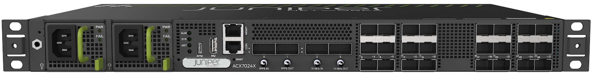

# Introducing the ACX7024X

**Nicolas Fevrier - 04/24/2024**

## Introduction

We launched the ACX7024 in mid-2022, with the following characteristics:

- 1RU Ethernet router.
- Built for the aggregation of SFP interfaces (1GE/10GE/25GE) to QSFP28 interfaces (40GE/100GE).
- 360Gbps of forwarding capacity powered by a Broadcom DNX Qumran2u.
- Class-D capable based on Juniper's PTP FPGA.
- Hardened device, categorized as i-temp (supports temperatures from -40 to +65C).
- AC or DC power modules, with 1+1 redundancy.
- 6x fixed fans (front to back cooling), 5+1 redundancy.

It was targeting markets like metro and aggregation where routing scale is not a key parameter. In these roles, high volumes of routers are deployed and cost pressure is very important.

That's why it was designed with these constraints in mind, and that reflected in the choice of the CPU and the memory size:

- Intel ATOM Deveron C3508 : 4 cores @ 1.6GHz, single-threaded
- 16GB DRAM

```
CPU INFO:
 ========
 Model name              : Intel(R) Atom(TM) CPU C3508 @ 1.60GHz
 Configured CPU Speed    : 1600.012 1600.019 1600.005 1600.049 MHz
 Physical cores          : 4
 Hyperthreaded cores     : 4
 L1 Cache size           : 224 kB
 L2 Cache size           : 8192 kB
 L23Cache size           :
 CPU PAIRS:
 =========
 Core 0 :
 Core 1 :  3
 Core 2 :  0
 Core 3 :
 SYSTEM MEMORY USAGE (MB):
 ========================
 MemTotal:       15995356 kB
```

Consequently, certain Qumran2u scale "maximum dimensions" can't be reached, the CPU memory being the first bottleneck.
Several features can't be enabled

- IPFIX
- FIB compression
- RIB sharding
- 3rd party App Hosting. Note: PAA (Paragon Active Assurance) is an exception to that rule and is supported on ACX7024.

And this CPU and DRAM are the key differences between ACX7024 and ACX7024X.

## Why the ACX7024X?



The ACX7024 (non-X) port density and form-factor happen to be very attractive for "light multi-service edge router" use-cases, particularly for enterprise and small CPEs. In these network roles, hardware hardening (i-temp) support is not required, the routers being operated in DC controlled environments. In the other hand, the support of features like sampling and potentially full IPv4 and IPv6 internet tables is required.

That's the main motivation behind the introduction of an ACX7024X that only differs from its predecessor at the CPU and DRAM level: same port density and forwarding capability, same ASIC, but a more powerful CPU:

- CPU:
  - Intel Atom Processor C Series (Denverton) C3758R
  - 8 cores (not hyperthread: 8 threads)
  - 2.4GHz

> More info: [https://www.intel.com/content/www/us/en/products/sku/204840/intel-atom-processor-c3758r-16m-cache-2-40-ghz/specifications.html ](https://www.intel.com/content/www/us/en/products/sku/204840/intel-atom-processor-c3758r-16m-cache-2-40-ghz/specifications.html)

- DRAM: 2x 32GB

```
CPU INFO:
 ========
 Model name              : Intel(R) Atom(TM) CPU C3758R @ 2.40GHz
 Configured CPU Speed    : 2400.014 2400.000 2399.977 2400.000 2399.998 2400.000 2399.995 2400.025 MHz
 Physical cores          : 8
 Hyperthreaded cores     : 8
 L1 Cache size           : 448 kB
 L2 Cache size           : 16384 kB
 L23Cache size           :
  
 CPU PAIRS:
 =========
 Core 0 :  0
 Core 1 :  5 6 7
 Core 2 :  1
 Core 3 :
 Core 4 :  2
 Core 5 :
 Core 6 :  3
 Core 7 :
  
 SYSTEM MEMORY USAGE (MB):
 ========================
 MemTotal:       65213484 kB
 MemFree:        55898420 kB
 MemAvailable:   60426500 kB
 Buffers:          483044 kB
 Cached:          4743236 kB
 SwapCached:            0 kB
 SwapTotal:       1048572 kB
 SwapFree:        1048572 kB
```

With this new control plane, the router supports commercial c-temp environments, and no longer i-temp.

Again, the same distribution, and port capabilities/configuration is available on ACX7024X:

```
regress@acx7024x-01> show chassis hardware detail 
Hardware inventory:
Item             Version  Part number  Serial number     Description
Chassis                                GC1723ANxxxx      JNP7024X [ACX7024X]
PSM 0            REV 03   740-134837   1F35D03xxxx       JPSU-400W-AC-AFI
PSM 1            REV 03   740-134837   1F35D03xxxx       JPSU-400W-AC-AFI
Routing Engine 0 REV 01   650-170107   GC1723ANxxxx      RE-ACX-7024X
  mmcblk0 38000 MB  MMC                1414xxxx          eMMC Disk
CB 0                      BUILTIN      BUILTIN           Control Board
FPC 0                     BUILTIN      BUILTIN           ACX7024X-FPC
  PIC 0                   BUILTIN      BUILTIN           MRATE- 24xSFP28 + 4xQSFP
    Xcvr 0       REV 01   740-067443   QI29xxxx          QSFP+-40G-SR4
    Xcvr 1       REV 01   740-061405   1ECQ14xxxx       QSFP-100GBASE-SR4-T2
    Xcvr 2       REV 01   740-032986   QD51xxxx          QSFP+-40G-SR4
    Xcvr 3       REV 01   740-061405   1ECQ132xxxx       QSFP-100GBASE-SR4-T2
    Xcvr 4       REV 01   740-021308   N9Lxxxx           SFP+-10G-SR
    Xcvr 5       REV 01   740-021308   N9Lxxxx           SFP+-10G-SR
    Xcvr 6       REV 01   740-021308   N9Lxxxx           SFP+-10G-SR
    Xcvr 7       REV 01   740-021308   N9Kxxxx           SFP+-10G-SR
    Xcvr 8       REV 01   740-021308   N9Lxxxx           SFP+-10G-SR
    Xcvr 10      REV 01   740-021308   MTKxxxx           SFP+-10G-SR
    Xcvr 13      REV 01   740-031980   A2Pxxxx           SFP+-10G-SR
    Xcvr 14      REV 01   740-031980   A2Pxxxx           SFP+-10G-SR
Fan Tray 0                BUILTIN      BUILTIN           ACX7024X Fan, Front to Back Airflow - AFO
regress@ acx7024x-01> 
```

and

```
regress@acx7024x-01> show chassis pic fpc-slot 0 pic-slot 0 
FPC slot 0, PIC slot 0 information:
  Type                             MRATE- 24xSFP28 + 4xQSFP
  State                            Online    
  PIC version                    00.00
  Uptime    1 day, 10 hours, 17 minutes, 18 seconds
<SNIP>
Port speed information:
  Port  PFE      Capable Port Speeds
  0      0       1x100G 1x40G 2x50G 4x25G 4x10G 
  1      0       1x100G 1x40G 2x50G 4x25G 4x10G 
  2      0       1x100G 1x40G 2x50G 4x25G 4x10G 
  3      0       1x100G 1x40G 2x50G 4x25G 4x10G 
  4      0       1x10G 1x1G 1x25G 
  5      0       1x10G 1x1G 1x25G 
  6      0       1x10G 1x1G 1x25G 
  7      0       1x10G 1x1G 1x25G 
<SNIP>
  25     0       1x10G 1x1G 1x25G 
  26     0       1x10G 1x1G 1x25G 
  27     0       1x10G 1x1G 1x25G 
  28     NA      1x10G  
regress@acx7024x-01> 
```

You can refer to the previous techpost article from Pankaj on ACX7024 for more details: [https://juniper.github.io/techposts/acx7024-deepdive/article](https://juniper.github.io/techposts/acx7024-deepdive/article)

### Other Differences?

With new CPU and larger DRAM, we expect less than 20W of power usage difference between the ACX7024X and the ACX7024.

## Benefits

On ACX7024X, we now support the four different MDB profiles.

```
regress@acx7024x-01# set system packet-forwarding-options hw-db-profile ?
Possible completions:
+ apply-groups         Groups from which to inherit configuration data
+ apply-groups-except  Don't inherit configuration data from these groups
  bng                  Selects BNG DB profile, restarts PFE
  carrier-ethernet     Selects Carrier Ethernet high scale MAC DB profile, restarts PFE
  cloud-metro          Selects Cloud-Metro DB profile, restarts PFE
  lean-edge            Selects Lean Edge max IPv4/IPv6 FIB DB profile, restarts PFE
[edit]
regress@ acx7024x-01#
```

By default, it will boot up in lean-edge mode and in the example below, the router receives a full internet view from an EBGP peer. That's almost 1 million IPv4 entries and more than 200,000 IPv6.

```
regress@rtme-acx7024x-01:pfe> show route summary 
IPv4 Route Tables:
Index         Routes     Size(b)  Prefixes     Aggr     Installed   Comp(%)  Errors
--------  ----------  ----------  ---------  ---------  ----------  ------  -------
Default       976921   181338360    954934    534232    170237     83         0
1                  0           0         0         0         0      0         0
50                 5         600         5         0         5      0         0
36738              5         600         5         0         5      0         0
<...>
IPv6 Route Tables:
Index         Routes     Size(b)  Prefixes     Aggr     Installed   Comp(%)  Errors
--------  ----------  ----------  ---------  ---------  ----------  ------  -------
Default       207095    35579400    204010     89400     55788     73         0
1                  0           0         0         0         0      0         0
50                 6         720         6         0         6      0         0
36738              6         720         6         0         6      0         0
<...>
regress@rtme-acx7024x-01:pfe>
```

It's of course an ideal case, since we have a single BGP neighbor. But still you can see the FIB compression in action with a ratio of 83% for IPv4 and 73% for IPv6.

In terms of resource occupation, that's the appid 12 here with 212k IPv4 and 66k IPv6 entries for a total 346k used out of the 1.18M capacity.

```
regress@rtme-acx7024x-01:pfe> show evo-pfemand resource appdb appid 12 
UNIT 0
App                          LPM-v4          LPM-v6
------------------------------------------------------
Route                         213294          66579
regress@rtme-acx7024x-01:pfe>

regress@rtme-acx7024x-01:pfe> show evo-pfemand resource terse-usage 
UNIT 0 MDB Profile: custom_lean_edge_jnpr
Resource        Usage           Capacity        size
COS_HR_ELEM     75              512             1
COS_VOQ         600             32768           1
COS_VOQ_CNCTR   600             49152           1
ECMP            3               32000           30
EEDB_7          4               16384           0
EEDB_8          43              16384           0
EGR_VSI         8               32768           30
FAILOVER        145             6000            30
FEC_1           4               32768           150
FEC_3           13              32768           150
IFL_STATS       4               8000            1
ING_MC_GRP      5               262144          1
ING_VSI         8               21846           90
INLIF_1         39              65536           60
ISEM_1          8               65536           30
KAPS            346452          1184000         0
LEM             2               393216          30
TCAM_IPMF1_80   560             0               1
TCAM_IPMF3_80   6               0               1
TCAM_PMF_ALL_INTRN_80566             26624           1
regress@rtme-acx7024x-01:pfe> 
```

So, we have plenty of room to grow.

Other features disabled on ACX7024 can now be used, like software jFlow and IPFIX.

## Conclusion

The ACX7024X is a very competitive 360Gbps router with 24x SFP, 1GE, 10GE or 25GE and 4 ports QSFP 40GE or 100GE. PTP class-D capable and with a large DRAM space for CPU-intensive features. It supports a full internet table (with both IPv4 and IPv6 routes) and can be used in multiple enterprise roles or for small-size CPEs.

## Useful links

- ACX7024 Deepdive article: [https://juniper.github.io/techposts/acx7024-deepdive/article](https://juniper.github.io/techposts/acx7024-deepdive/article)

## Glossary

- CPE: Customer Premises Equipment (router)
- CPU: Compute Processor Unit
- DRAM: Dynamic Random Access Memory
- FIB: Forwarding Information Base
- PTP: Precision Time protocol
- QSFP: Quad Small Form-Factor Pluggable
- RIB: Routing Information Base
- SFP: Small Form-Factor Pluggable

## Acknowledgements

Thanks to Anson Varghese Isaacs and Rajat Jain for the tests presented in this publication. Thanks to Ay-sha Jabeen who facilitated a lot these tests.
