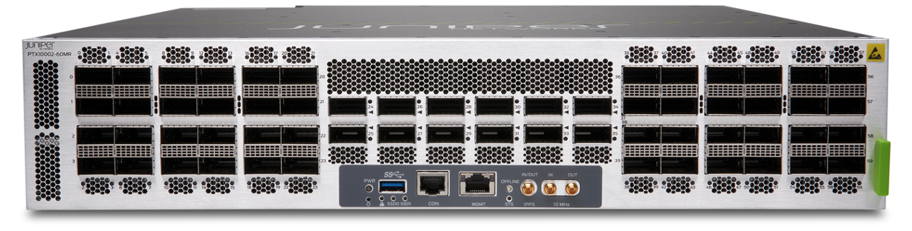
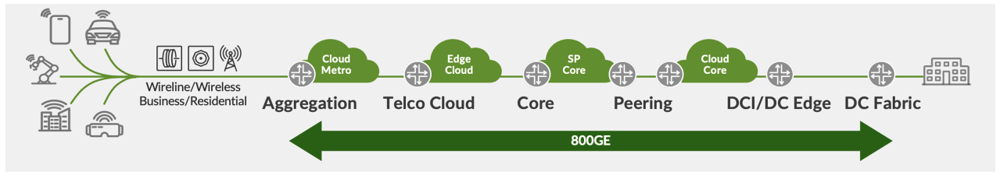
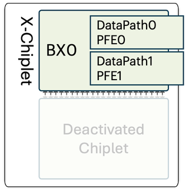
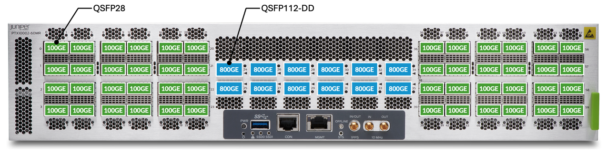
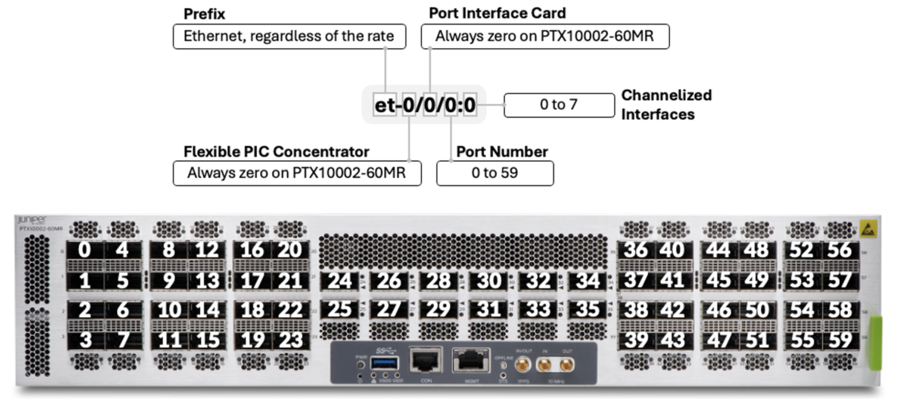

# Introducing the PTX10002-60MR

**Santo K - 03/19/2026**

The Juniper PTX10002-60MR is a 2RU router built on the Express 5 ASIC, delivering up to 14.4 Tbps of forwarding capacity. It offers dense mix of 12x 800GE QSFP112-DD and 48x 100GE QSFP28 ports, native ZR/ZR+ support, and is perfect for space- and power-constrained core, WAN, and AI-driven data-center deployments.

## Introduction

With our Industry first 800G platform PTX10002-36QDD, we set a new benchmark for performance and efficiency. Now, we're building on that success. With the introduction of the PTX10002-60MR, we are strengthening our 800G routing family, giving customers more choice and more flexibility as they prepare for the next wave of networking.



The PTX10002-60MR is a compact, high performance 2RU fixed form factor router delivering 14.4Tbps of throughput and built on top of Express5 ASIC. It offers 48x 100Gbps QSFP28 and 12x 800Gbps QDD ports.

The performance and power efficiency are two goals of the PTX10002-60MR. The Express5 "BXM" ASIC forwards 4.96 Billion packets/sec which is double the performance compared to Express4. The Express5 consumes as little as 0.05 W per Gbps which makes ideal for Power hungry AI data centres, Service Providers and Cloud operators.

The PTX10002-60MR supports 100G ZR modules on all 48 QSFP28 ports and 400G ZR or 800G ZR pluggables on all 12 QDD ports with no restriction. It supports MACSEC encryption on all ports at line rate.

## Target Use Cases



- Metro Aggregators
- Core
- Peering, IXPs, CDN
- DCI
- DC Edge
- DC Spine/Leaf

## Metro Aggregators

The 48x 100G ports help aggregate high-density access, enterprise, and mobile backhaul traffic into the metro transport layer. 100G ZR optics provide direct connectivity between access routers over distances of up to 120 km without amplification and up to 300 km with amplification. The 12x 800G ports connect all aggregated traffic towards the core network for high-capacity forwarding. The 800G ZR optics enable connectivity over distances up to 72 km without amplification and up to 120 km with amplification.

## Core

Core routing forms the high-speed, reliable backbone that transports massive volumes of data between geographically distributed network segments, data centers, and service provider PoPs. The PTX10002-60MR is well suited for this role with its high forwarding capacity and support for 100G, 400G, and 800G interfaces. Its deep buffer architecture, large FIB scale, and support for advanced technologies such as MPLS, SR-MPLS, SRv6, and RSVP-TE enable scalable and efficient traffic engineering across large backbone networks. Additionally, built-in MACsec support enhances link security, while its industry-leading watts-per-Gbps efficiency ensures highly power-efficient core deployments.

## Peering, IXPs, CDN

Peering routing enables two or more independent networks to interconnect directly---bypassing third-party transit providers---to reduce latency, lower transit costs, and improve overall network performance. The Juniper PTX10002-60MR is well suited for peering deployments with its high RIB and FIB scale (RIB: 40M--60M, FIB: 4M+), enabling it to handle full Internet routing tables and large route volumes. It supports up to 4K BGP peers, allowing connectivity with numerous transit providers, CDNs, and Internet exchanges. In addition, its non-blocking architecture, efficient load-balancing mechanisms, and fine-grained routing policy control, with support for 16K filters and 64K policy terms, provide the flexibility and scalability required for large-scale peering environments.

## DCI

Data Center Interconnect (DCI) enables high-speed connectivity between geographically distributed data centers to support workload mobility, data replication, disaster recovery, and large-scale AI workloads. The Juniper PTX10002-60MR is well suited for DCI deployments with its secure high-speed 400G and 800G interfaces and 14.4 Tbps switching capacity, enabling efficient transport of massive east--west data center traffic. Support for 100G ZR, 400G ZR, and 800G ZR optics enables efficient long-haul connectivity between data centers while reducing dependence on external optical transport systems. Additionally, its 64--128 ECMP path scale, 16 GB deep buffer capacity, and support for RoCEv2, PFC, and ECN ensure optimized performance for latency-sensitive and AI-driven workloads. Built-in line-rate MACsec encryption further provides secure inter--data center connectivity.

## Main Forwarding Component

The PTX10002-60MR is powered by a single Express 5 Packet Forwarding Engine (PFE). The Express 5 is not just a single chipset but more an ASIC family. It's the first in this industry to propose a design based on chiplets.

You will find more details on this blog post from Dmitry Shokarev: [https://juniper.github.io/techposts/express-5-overview/article](https://juniper.github.io/techposts/introducing-ptx10002-36qdd/article)

The PTX10002-60MR is a standalone platform with no fabric connectivity requirements. It is based on a single BXM package made of unique X-chiplet, presenting 144x WAN SerDes at 100Gbps (106/112Gbps with overhead).



```
regress@ptx10002-60mr> show chassis fpc pfe all 

FPC 0
PFE-Instance    PFE           PFE-State
0                         0             ONLINE               
0                         1             ONLINE               

regress@ptx10002-60mr>
```

## Router Description

The PTX10002-60MR is a 2RU form factor and its front panel is shown in the figure below. The front side Panel has 12x 800G QDD ports placed in the center and 24x 100G QSFP28 ports on both the sides. The Management ports are placed below the QDD ports.

The name of the product is very much self-explanatory:

- PTX10k Series
- 2RU
- 60 Ports Multi Rates



The key chassis specifications are listed in Table 1 below.

| Specifications | Details |
|:--|:--|
| System Throughput | 14.4Tbps |
| Forwarding Capacity | Up to 5BPPS |
| Dimensions | H (2RU) x W (445mm) x D (564mm)  3.5"x17.28"x29.13" (H x W x D) |
| Rack Units | 2 RU, 800 mm rack including cables |
| Rack Mounting | 2/4-post |
| Max Weight | 55lbs (24.94 kg) |
| Power Supply | 2 PSMs, 2200 PSU, AC, DC, HVAC, HVDC,(1+1 Redundancy) |
| Cooling | 3x 2RU Fan Tray, AFO, Hot swappable |
| Power Consumption | 705Wfor 15% Traffic Load for 25C, 6000ft, w/o optics, w/o MACSEC.1211Wfor 100% Traffic Load for 40C, 6000ft, w/o optics, w/o MACSEC. |
| Operating Temperature | 0-40C (6000 ft) |

## Platform Architecture

The usual "show chassis hardware details" provides a good overview of the internal parts.

```
regress@ptx10002-60mr> show chassis hardware 
Hardware inventory:
Item             Version  Part number  Serial number     Description
Chassis                                                  JG608              PTX10002-60MR [PTX10002-60MR]
FPM 0            REV 02   711-183788   BCGY8594          FPM-PTX10002
PSM 0            REV 02   740-148504   1GH5E490426       AC AFO 2200W PSM
PSM 1            REV 02   740-148504   1GH5E490482       AC AFO 2200W PSM
Routing Engine 0          BUILTIN      BUILTIN           RE-PTX10002-60MR
CB 0             REV 06   750-182877   BCGY8290          Control Board
FPC 0            REV 07   750-187625   BCGZ4353          FPC-PTX10002-60MR
  PIC 0                   BUILTIN      BUILTIN           12x800GE 48x100GE PIC
    Xcvr 0       REV 01   740-058734   1ACQ1041027         QSFP-100GBASE-SR4
    Xcvr 8       REV 01   740-073130   1A1C90A82400J       QSFP28-100G-BOAOC-1M
    Xcvr 12      REV 01   740-083294   1A1C97A8230B6       QSFP28-100G-BOAOC-30M
    Xcvr 20      REV 01   740-066424   1AMPK53616T         QSFP+-40G-ER4
    Xcvr 24      REV 01   740-150875   1F1CSNA80900J       QSFP-DD800-800G-AOC-15M
    Xcvr 25      REV 01   740-090170   1W2CSGAA23002       QSFP56-DD-400G-AOC-30M
    Xcvr 28      REV 04   740-157132   2E4CZFAA19009       QSFP56-DD-400G-ZR
    Xcvr 29      REV 01   740-084673   2E1CY2A826Z0B       QSFP28-DD-2X100GBASE-SR4
    Xcvr 32      REV 01   740-150875   1F1CSNA80900J       QSFP-DD800-800G-AOC-15M
    Xcvr 33      REV 01   740-120240   1W1CQVA95101M       QSFP28-100G-ZR4
    Xcvr 35      REV 01   740-084673   2E1CY2A826Z04       QSFP28-DD-2X100GBASE-SR4
    Xcvr 36      REV 02   740-054050   1FCPB52902V         QSFP+-4X10G-LR
    Xcvr 48      REV 01   740-096178   1W2CQGA74604U       QSFP28-100G-LR
    Xcvr 56      REV 01   740-064980   1YCS7535006         QSFP28-100G-AOC-30M
    Xcvr 57      REV 01   740-065630   1A1CS0A82201K       QSFP28-100G-BOAOC-1M
    Xcvr 58      REV 01   740-061002   1R1C43A0040RX       QSFP28-100G-CU5M
FTC 0            REV 03   711-183786   BCGY3602          Fan Control Board
Fan Tray 0       REV 02   760-187795   BCGZ9603          PTX10002 Fan Tray, Front to Back Airflow - AFO
Fan Tray 1       REV 02   760-187795   BCGZ9599          PTX10002 Fan Tray, Front to Back Airflow - AFO
Fan Tray 2       REV 02   760-187795   BCGZ9604          PTX10002 Fan Tray, Front to Back Airflow - AFO

regress@ptx10002-60mr> 
```

## Block Diagram

The diagram in Figure 5 illustrates the different components in a PTX10002-60MR. The Express 5 has 144x SerDes for WAN connectivity: 8x SerDes forms one Port Group (PG), so in total, we have 18x PGs (PG0 to PF17). The SerDes speed represented in the diagram between components are "maximum speeds". For example, a 100G links can actually be programmed at lower speeds: 50G, 25G or 10G.

You'll notice the presence of a PHY programmed in Reverse Gear Box (RGB) mode between the PFE and the QSFP28 cages. Their role is to increase the port fanout (lower speed port density) but they introduce certain constraints (see the "Port Break Out" section below).

Each pair of Reverse Gear Box is mapped to one PG and each 800Gbps port is also mapped to a dedicated PG.

## Routing Engine Overview

The internal PTX10002-60MR Routing Engine is powered by an **Intel Ice Lake-D 8-core processor **running at frequency up to 3.1GHz. Note it's a build-in RE, not a FRU (Field Replaceable Unit).

The Routing Engine is equipped with four 32 GB DDR4 RDIMMs (two DIMMs per channel), delivering a total memory capacity of **128GB** operating at a memory speed of 2400 MT/s. For local storage, the platform supports **two 200 GB NVMe SSDs**, which are mounted on the bottom side of the Routing Engine board. A mechanical design provision allows the SSDs to be removed and serviced from the bottom of the chassis, simplifying maintenance operations.

Additionally, the platform supports **Secure Boot mode**, ensuring system integrity by allowing only trusted software to run during the boot process.

The PTX10002-60MR includes a **Trusted Platform Module (TPM) 2.0** chip, which provides secure, non-volatile storage used as a persistent and access-controlled area for storing critical security information. This includes platform identity, cryptographic keys, security policies, and component registration data. The TPM enhances platform security by ensuring trusted system initialization and protecting sensitive information from unauthorized access.

## Management Port ViewFigure 6: Management Ports of PTX10002-60MR

The Juniper PTX10002-60MR provides several management and timing interfaces on the front panel to support system administration and network synchronization:

- **1x USB 3.0 port**
- **1x RJ-45 management (MGT) port**
- and **1x console (CON) port** for local and remote management access.

For precise timing and synchronization, the platform supports:

- **10 MHz** input/output
- **1PPS** (Pulse Per Second) input/output
- **PTP Class D**
- **Sync-E**

The front panel also includes status LEDs for Power, SSD0, SSD1, and Offline states, enabling quick visual monitoring of system health and operational status.

FANs and Power Supply Units:

The PTX10002-60MR has 3 RU fan trays. It uses **high-pressure 80 mm x 80 mm x 86 mm fans** designed to provide efficient cooling for high-performance routing components. The system supports **AFO (Airflow Out)** airflow. Each fan tray operates with a power consumption ranging **from 90W to 146W**, depending on system thermal conditions. The fan module is designed to function reliably across a wide operating temperature range of **--10degC to 70degC**. The fans operate at speeds of approximately **16,000 RPM** (+/-10%) at the inlet and **14,000 RPM** (+/-10%) at the outlet, ensuring adequate airflow and thermal management for the platform. Each Fan tray has dual counter rotating fans. The chassis supports single rotor failure cases.

The PTX10002-60MR chassis has 2 PSU Slots. The modules available are** 2,200W** AC (240V), DC and HVDC/HVAC options with single feed. The chassis supports 1+1 PSU or feed redundancy.

## Interfaces

The PTX10002-60MR (like all members of the PTX10k Series) is an Ethernet-only router.

As illustrated in Figure 3, the Express 5 BXM is made of two datapaths seen as **PFE0** and **PFE1** from the Operating System point of view.

Half of the ports will be mapped (directly or indirectly) to one Datapath/PFE. The Figure 10 above is displaying this mapping.

## Port Naming Logic

The system is made of a single Flexible PIC Card (FPC) and a single Physical Interface Card (PIC), it simplifies the port naming significantly: all interfaces are named et-0/0/[0-59]:[0-7].



Port numbering is shown in the figure above and ranges from **et-0/0/0** to **et-0/0/59**. In this format, the first number indicates the FPC slot, the second number indicates the PIC, and the last number represents the port. When breakout cables are used, a single port is divided into multiple logical interfaces. For example, et-0/0/0 can break out into et-0/0/0:0 to et-0/0/0:7.
Note that we can not enable channelization (break-out) on all ports.

The full list of supported interfaces will be updated soon on the Pathfinder Hardware Compatibility Tool (HCT), the following chart provides a couple of examples.

|  | Port Type | #SerDes and Rate (Gbps) | #SerDes Effective Rate (Gbps) |
|:--|:--|:--|:--|
| 800GigE | 1x 800GAUI-8 | 8x 106.25 | 8x 100 |
| 400GigE | 2x 400GAUI-4 | 4x 106.25 | 4x 100 |
| 400GigE | 1x 400GAUI-8 | 8x 53.125 | 8x 50 |
| 200GigE | 2x 200GAUI-4 | 4x 53.125 | 4x 50 |
| 100GigE | 8x 100GAUI-1 | 1x 106.25 | 1x 100 |
| 100GigE | 2x 100GAUI-4 | 4x 26.56254x 25.78125 | 4x 25 |
| 50GigE | 2x LAUI-2 | 2x 25.78125 | 2x 25 |
| 40GigE | 1x XLAUI | 4x 10.3125 | 4x 10 |
| 25GigE | 4x 25GAUI-1 | 1x 25.78125 | 1x 25 |
| 10GigE | 1x XFI | 1x 10.3125 | 1x 10 |

As a quick on-box reference, the following CLI command shows transceivers plugged into the port, plus the port speed capabilities (note: it shows capabilities and not necessarily the software support. Please use the port checker and hardware compatibility tools on apps.juniper.net to verify the support).

```
regress@ptx10002-60mr> show chassis pic fpc-slot 0 pic-slot 0 
FPC slot 0, PIC slot 0 information:
  Type                             12x800GE 48x100GE PIC
  State                            Online    
  PIC version                  255.09
  Uptime 5 days, 12 hours, 51 minutes, 17 seconds

<SNIP>

Port speed information:

  Port  PFE  Port-Group      Capable Port Speeds
  0      0       0                4x25G 1x100G 1x25G 1x40G 1x10G 4x10G 
  1      0       0                1x100G 1x25G 1x10G 
  2      0       0                1x100G 1x25G 1x10G 
  3      0       0                1x100G 1x25G 1x10G 
  4      0       0                4x25G 1x100G 1x25G 1x40G 1x10G 4x10G 
  5      NA      0                1x100G 1x25G 1x10G 
  6      NA      0                1x100G 1x25G 1x10G 
  7      NA      0                1x100G 1x25G 1x10G 
  8      0       1                4x25G 1x100G 1x25G 1x40G 1x10G 4x10G 
  9      0       1                1x100G 1x25G 1x10G 
  10     0       1                1x100G 1x25G 1x10G 
  11     0       1                1x100G 1x25G 1x10G 
  12     0       1                4x25G 1x100G 1x25G 1x40G 1x10G 4x10G 
  13     0       1                1x100G 1x25G 1x10G 
  14     0       1                1x100G 1x25G 1x10G 
  15     0       1                1x100G 1x25G 1x10G 
  16     0       2                4x25G 1x100G 1x25G 1x40G 1x10G 4x10G 
  17     0       2                1x100G 1x25G 1x10G 
  18     0       2           1x100G 1x25G 1x10G 
  19     0       2           1x100G 1x25G 1x10G 
  20     0       2           4x25G 1x100G 1x25G 1x40G 1x10G 4x10G 
  21     0       2           1x100G 1x25G 1x10G 
  22     0       2           1x100G 1x25G 1x10G 
  23     0       2           1x100G 1x25G 1x10G 
  24     0       3           5x100G 1x100G 1x25G 8x50G 4x10G 1x800G 4x100G 1x10G 7x100G 1x400G 3x100G 8x100G 1x40G 4x50G 6x100G 4x200G 2x200G 4x25G 1x200G 3x200G 2x100G 2x400G 
  25     0       4           5x100G 1x100G 1x25G 8x50G 4x10G 1x800G 4x100G 1x10G 7x100G 1x400G 3x100G 8x100G 1x40G 4x50G 6x100G 4x200G 2x200G 4x25G 1x200G 3x200G 2x100G 2x400G 
  26     0       5           5x100G 1x100G 1x25G 8x50G 4x10G 1x800G 4x100G 1x10G 7x100G 1x400G 3x100G 8x100G 1x40G 4x50G 6x100G 4x200G 2x200G 4x25G 1x200G 3x200G 2x100G 2x400G 
  27     0       6           5x100G 1x100G 1x25G 8x50G 4x10G 1x800G 4x100G 1x10G 7x100G 1x400G 3x100G 8x100G 1x40G 4x50G 6x100G 4x200G 2x200G 4x25G 1x200G 3x200G 2x100G 2x400G 
  28     0       7           5x100G 1x100G 1x25G 8x50G 4x10G 1x800G 4x100G 1x10G 7x100G 1x400G 3x100G 8x100G 1x40G 4x50G 6x100G 4x200G 2x200G 4x25G 1x200G 3x200G 2x100G 2x400G 
  29     0       8           5x100G 1x100G 1x25G 8x50G 4x10G 1x800G 4x100G 1x10G 7x100G 1x400G 3x100G 8x100G 1x40G 4x50G 6x100G 4x200G 2x200G 4x25G 1x200G 3x200G 2x100G 2x400G 
  30     1       17          5x100G 1x100G 1x25G 8x50G 4x10G 1x800G 4x100G 1x10G 7x100G 1x400G 3x100G 8x100G 1x40G 4x50G 6x100G 4x200G 2x200G 4x25G 1x200G 3x200G 2x100G 2x400G 
  31     1       16          5x100G 1x100G 1x25G 8x50G 4x10G 1x800G 4x100G 1x10G 7x100G 1x400G 3x100G 8x100G 1x40G 4x50G 6x100G 4x200G 2x200G 4x25G 1x200G 3x200G 2x100G 2x400G 
  32     1       15          5x100G 1x100G 1x25G 8x50G 4x10G 1x800G 4x100G 1x10G 7x100G 1x400G 3x100G 8x100G 1x40G 4x50G 6x100G 4x200G 2x200G 4x25G 1x200G 3x200G 2x100G 2x400G 
  33     1       14          5x100G 1x100G 1x25G 8x50G 4x10G 1x800G 4x100G 1x10G 7x100G 1x400G 3x100G 8x100G 1x40G 4x50G 6x100G 4x200G 2x200G 4x25G 1x200G 3x200G 2x100G 2x400G 
  34     1       13          5x100G 1x100G 1x25G 8x50G 4x10G 1x800G 4x100G 1x10G 7x100G 1x400G 3x100G 8x100G 1x40G 4x50G 6x100G 4x200G 2x200G 4x25G 1x200G 3x200G 2x100G 2x400G 
  35     1       12          5x100G 1x100G 1x25G 8x50G 4x10G 1x800G 4x100G 1x10G 7x100G 1x400G 3x100G 8x100G 1x40G 4x50G 6x100G 4x200G 2x200G 4x25G 1x200G 3x200G 2x100G 2x400G 
  36     1       11          4x25G 1x100G 1x25G 1x40G 1x10G 4x10G 
  37     1       11          1x100G 1x25G 1x10G 
  38     1       11          1x100G 1x25G 1x10G 
  39     1       11          1x100G 1x25G 1x10G 
  40     1       11          4x25G 1x100G 1x25G 1x40G 1x10G 4x10G 
  41     1       11          1x100G 1x25G 1x10G 
  42     1       11          1x100G 1x25G 1x10G 
  43     1       11          1x100G 1x25G 1x10G 
  44     1       10          4x25G 1x100G 1x25G 1x40G 1x10G 4x10G 
  45     NA      10          1x100G 1x25G 1x10G 
  46     NA      10          1x100G 1x25G 1x10G 
  47     NA      10          1x100G 1x25G 1x10G 
  48     1       10          4x25G 1x100G 1x25G 1x40G 1x10G 4x10G 
  49     1       10          1x100G 1x25G 1x10G 
  50     1       10          1x100G 1x25G 1x10G 
  51     1       10          1x100G 1x25G 1x10G 
  52     1       9           4x25G 1x100G 1x25G 1x40G 1x10G 4x10G 
  53     NA      9           1x100G 1x25G 1x10G 
  54     NA      9           1x100G 1x25G 1x10G 
  55     NA      9           1x100G 1x25G 1x10G 
  56     1       9           4x25G 1x100G 1x25G 1x40G 1x10G 4x10G 
  57     1       9           1x100G 1x25G 1x10G 
  58     1       9           1x100G 1x25G 1x10G 
  59     1       9           1x100G 1x25G 1x10G 

regress@ptx10002-60mr> 
```

From this output, we can differentiate three port capability cases

- QSFP28 ports on the top row supporting
  - 1x100G
  - 1x40G
  - 1x25G (with QSA)
  - 1x10G (with QSA)
  - 4x25G
  - 4x10G
- Other QSFP28 ports supporting
  - 1x100G
  - 1x25G (with QSA)
  - 1x10G (with QSA)
- QSFP112-DD supporting
  - 1x800G
  - 1x400G
  - 1x200G
  - 1x100G
  - 1x40G
  - 1x25G (with QSA)
  - 1x10G (with QSA)
  - 2x400G
  - 8x100G
  - 4x200G
  - 4x100G
  - 2x100G
  - 8x50G
  - 4x50G
  - 4x25G
  - 4x10G
  - 7x100G, 6x100G, 5x100G, 3x100G, 3x200G, 2x200G

It's important to understand we talk about port capability here, not port support. We expose what the physical port can do in terms of SerDes, clocks, etc. But it doesn't mean the software to support it has been implemented, or that it is fully tested. Again, we advise to use the port checker tool from pathfinder for authoritative information.

We need a QSA adapter to operate 25GE or 10GE as standalone interfaces.

## Breakout Ports Support

The PTX10002-60MR relies on PHY configured as RGB to offer a high 100GE port density. But it comes with some additional considerations (and potentially restrictions).

First, the "4x" breakout configuration is only supported on the **top row** **QSFP28** ports and many other options are supported on all the QSFP112-DD ports as illustrated below:

Example: if you configure port et-0/0/0 for channelization/breakout. You'll also need to configure the ports et-0/0/1, et-0/0/2 and et-0/0/3 as "unused". Otherwise, the commit will be refused.

The 2x50GE break-out option is technically feasible but not supported at FRS (inception of the product). It will come in a future release and will only be supported in **top and bottom rows** of QSFP28 ports.

## Mixing 25GE and 10GE Interfaces

A particular attention should be brought to the following point, particularly during the ports provisioning/allocation phase of a router deployment.

The 25GE and 10GE cannot be mixed within the same port group.

We have two different "speed groups".

- Speed group 1 supports 100G, 50G and 25G
- Speed group 2 supports 100G, 50G and 10G

A single port group can operate in only one speed group at a time. Therefore, ports within the same port group cannot simultaneously support both 25G and 10G.

In case of doubt, always check the Pathfinder Port Checker: [https://apps.juniper.net/port-checker/ptx10002-60mr/](https://apps.juniper.net/port-checker/ptx10002-60mr/)

## Max Ports Count

Below table shows the maximum port density in native more or with breakout:

| Port Speed | Port Position | Max Number of Ports | Total perPort Type | Max TotalPer System |
|:--|:--|:--|:--|:--|
| 800GE | [24-35] | 12 | 12 | 12 |
| 400GE | [24-35] | 12x (2x400G Dual LC) | 24 | 24 |
| 400GE | [24-35] | 12 (Native) | 12 | 12 |
| 200GE | [24-35] | 12x (4x200G BO) | 48 | 48 |
| 100GE | [24-35] | 12x (8x100G BO) | 96 | 144 |
| 100GE | [0-23]+[36-59] | 48 | 48 | 144 |
| 50GE | [24-35] | 12x (8x50G BO) | 96 | 144 |
| 40GE | [24-35] | 12x 40G | 12 | 24 |
| 40GE | 0/4/8/12/16/20/36/40/44/48/52/56 | 12x 40G | 12 | 24 |
| 25GE | [24-35] | 12x (4x25G BO) | 48 | 96 |
| 25GE | 0/4/8/12/16/20/36/40/44/48/52/56 | 12x (4x25G BO) | 48 | 96 |
| 10GE | [24-35] | 12x (4x10G BO) | 48 | 96 |
| 10GE | 0/4/8/12/16/20/36/40/44/48/52/56 | 12x (4x10G BO) | 48 | 96 |

## ZR/ZR+ Optics Support

PTX10002-60MR supports ZR capability on all ports. The QSFP28 ports supports 100G ZR which enables connecting devices across 120km. The QDD ports supports 400G ZR which connects devices across 80km to 128km. The QDD ports also supports 800G ZR which connects devices across 72km.

## MACSEC Support

The PTX10002-60MR supports MACSEC on all ports at line-rate. MACSEC is implemented using BXM ASIC. MACSEC block power will be turned off (clock-gated) by default at boot time. Hence, traffic will bypass the MACsec block by default. When the user configures MACsec on an interface, the power will be turned on and traffic flow will go through the MACsec block.

## Software Overview

The PTX10002-60MR is FRS'ed with the Junos EVO 26.2R1 release, delivering a comprehensive set of routing, security, and telemetry capabilities suitable for core, peering, and data center deployments.

Key software capabilities include:

- Full support for Core and Peering routing use cases
- 4M FIB scale for large routing table deployments (system can support much higher scale, 4M is the current validated number)
- 800GE interface capability with qualified 800G optics
- Support for 800G ZR and ZR+ coherent optics
- Precision timing features including Sync-E and PTP (Class D)
- MACsec encryption up to 800GE interfaces
- FIPS certification ready for enhanced security compliance
- Secure Zero-Touch Provisioning (Secure ZTP) for automated deployment
- Comprehensive protocol support including IP, MPLS, VPNs, Firewall Filters, CoS, and Telemetry
- 128-way ECMP for scalable load balancing
- Advanced multicast capabilities including Multicast, MVPN, MPLS BIER, and NG-MVPN
- Segment Routing(SR) support including SR-MPLS, SRv6, and SRv6 uSID
- Hierarchical QoS (HQoS) for advanced traffic management
- L2/L3 service support including VPLS, EVPN-VPWS, EVPN-MPLS, EVPN-VXLAN, and FAT-PW
- In-band Network Telemetry (INT) with Source, Transit, and Sink node support
- RoCEv2, PFC and ECN support.
- High Scale BGP, MPLS TE, SR-TE, BGP-LS, PCEP, SFLOW, JFLOW and IMON.

## SKUs

The configurable Stock Keeping Unit (SKUs) for PTX10002-60MR is PTX10002-60MR. This has below children SKUs

| SKU Description |  |
|:--|:--|
| PTX10002-60MR-BB | 1 |
| JUNOS-EVO-64-BB | 1 |
| JNP-2200W-AC2-BB | 2 |
| JNP-2200W-DC2-BB | 2 |
| JNP10K2-FAN-AFO | 3 |

The chassis FRU is PTX10002-60MR-S (S refers Spare). Below are the additional SKUs

| FRU | SKU | Installation/Slot | Hot-Swappable |
|:--|:--|:--|:--|
| Fan Tray | JNP10K2-FAN-AFO | Rear, horizontally mounted | Yes |
| Power Supply | JNP-2200W-AC2JNP-2200W-DC2 | Rear PSU slots (0, 1) | Yes |

## Key Benefits

- Massive Performance in a Compact Form Factor (14.4T in 2RU)
- High-Density 100G / 400G / 800G Connectivity
- Express5: Advanced Silicon for High Performance and Low latency
- Optimized Power, Space, and Cost per Bit
- Seamless Migration to 800G Networks
- Versatile Deployment Across Multiple Network Roles (core routing, peering, metro aggregation, data center edge, data center interconnect)

## Conclusion

The PTX10002-60MR brings together massive bandwidth, compact design, and operational efficiency to power the next generation of cloud and service provider networks. Delivering multi-terabit performance with **dense 100G** and** 400G/800G connectivity** in a space-efficient 2RU platform, it enables operators to scale capacity while optimizing power and cost per bit.

With support for advanced coherent optics, open programmability, and the robust capabilities of Junos OS, the PTX10002-60MR helps network builders simplify architectures and accelerate the deployment of **high-capacity WAN**, **peering**, **metro aggregation**, and **data center interconnect** infrastructures.

## Useful Links

- PTX10002-60MR Datasheet: [https://www.hpe.com/psnow/doc/a00155673enw?jumpid=in_pdfviewer-psnow](https://www.hpe.com/psnow/doc/a00155673enw?jumpid=in_pdfviewer-psnow)
- Introduction to Express 5 Tech Post blog: [https://juniper.github.io/techposts/express-5-overview/article](https://juniper.github.io/techposts/express-5-overview/article)
- Pathfinder Port Checker: [https://apps.juniper.net/port-checker/ptx10002-60mr/](https://apps.juniper.net/port-checker/ptx10002-60mr/)

## Glossary

- ASIC: Application Specific Integrated Circuit
- AFO: Air Flow Out
- BGP: Border Gateway Protocol
- BIER: Multicast using Bit Index Explicit Replication
- BF: Express 5 Package with only F-chiplet and used in the SF5 cards
- BXF: Express 5 Package made of one X-chiplet for WAN connectivity and one F-chiplet for fabric connectivity
- BXM: Express 5 Package made of one X-chiplet for WAN connectivity and one F-chiplet for fabric connectivity
- CDN: Content Delivery Network
- CLI: Command Line Interface
- CoS: Class of Service
- CPU: Central Processor Unit
- DC: DataCenter
- DCI: DataCenter Interconnect
- DDR4: Double Data Rate 4
- DRAM: Dynamic Random Access Memory
- ECMP: Equal Cost Multi Path
- ECN: Explicit Congestion Notification
- FIB: Forwarding Information Base
- FPC: Flexible PIC Concentrator
- FRS: First Release Software
- FRU: Field Replacement Unit
- GE: Gigabit Ethernet
- HBM: High-Bandwidth Memory
- HVAC: High Voltage Alternate Current
- HVDC: High Voltage Direct Current
- IXP: Internet Exchange Point
- IMON: Inline Monitoring
- JFLOW: Juniper's NetFlow
- MACSEC: Media Access Control Security
- MPLS: Multiprotocol Label Switching
- MVPN: Multicast Virtual Private Network
- NVMe: Non-Volatile Memory Express
- PCEP: Path Computation Element Protocol
- PFE: Packet Forwarding Engine
- PIC: Port Interface Card
- PFC: Priority Flow Control
- PSM/PSU: Power Supply Module/Unit
- PTP: Precision Time Protocol
- QSFP: Quad Small Form Factor
- QSA: QSFP-to-SFP Adapter
- QDD: QSFP Double Density
- RCB: Routing and Control Board
- RDIMM: Registered Dual In-Line Memory Module
- RDMA: Remote Direct Memory Access
- RoCEv2: RDMA over Converged Ethernet.
- RPM: Revolutions Per Minute
- RE: Routing Engine
- RGB: Reverse GearBox
- RIB: Routing Information Base
- SerDes: Serializer/Deserializer
- SFLOW: Sampled Flow
- SKU: Stock Keeping Unit
- SRv6: Segment Routing version 6
- SSD: Solid State Drives
- Sync-E: Synchronous Ethernet
- TE: Traffic Engineering
- uSID: Micro Segment Identifier
- VPN: Virtual Private Network
- NG-MVPN: Next Generation MVPN
- ZR: Extended Reach

## Acknowledgements

Many thanks to my colleagues for the help, guidance, knowledge sharing, product making decision, blog review and corrections:
Pradeep Chalicheemala, Mayuresh, Girish Dadhich, Anand Beedi, Dmitry S, Rafik P, Nicolas Fevrier, Dhaval Bodia, Muzammil A, Rajeshwar Sable, Aby Alex, Reji P, Amit Bohra, Karthic K, Radhika N, Nirmala J and the entire Whistler Team.
