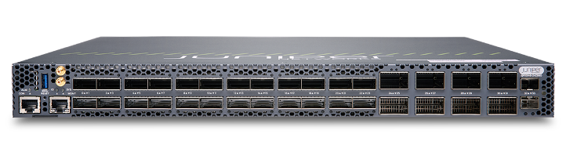
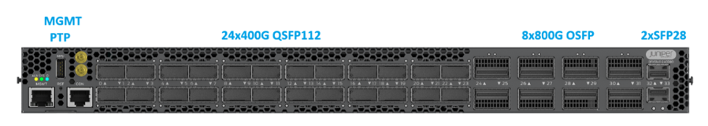
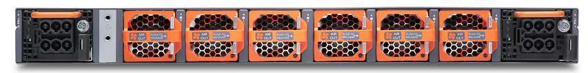

# Introducing the QFX5140

**Nicole Henry - 08/31/2026**




The HPE Juniper Networking QFX5140 is a 1RU fixed-configuration data center switch built on the Broadcom Trident 5 ASIC, delivering 16 Tbps of switching capacity in a single rack unit. It combines 24x 400GbE QSFP112 ports with native 112G PAM4 SerDes and 8x 800GbE OSFP800 ports, breaking out to up to 160x 100GbE interfaces. Purpose-built for AI inference and storage fabrics, it pairs low-microsecond latency and right-sized on-chip buffering with RoCEv2, PFC, DCQCN, and dynamic load balancing.

## Introduction

The QFX5140-24CD8O is a 1RU fixed-form-factor switch that delivers 16 Tbps of switching capacity and is built on the Broadcom Trident 5 ASIC. It provides 24 QSFP112 ports supporting speeds of up to 400GbE and 8 OSFP800 ports supporting speeds of up to 800GbE, along with two SFP28 ports for management or lower-speed connectivity. The switch delivers a maximum system power draw of 883 W, equivalent to approximately 0.055 W per Gbps at full load, and a typical power consumption of 543 W. The platform supports a range of Ethernet speeds and configurations, including 8 x 800GbE and 32 x 400GbE natively, as well as 40 x 400GbE, 80 x 200GbE, and 160 x 100GbE through breakout configurations. It also supports native 25GbE connectivity and 400ZR/800ZR optical configurations. This combination of high port density, flexible speed options, native 400GbE and 800GbE support, conventional air cooling, and Junos OS Evolved makes the QFX5140 well suited for use as a leaf, spine, or border leaf switch in IP fabric and EVPN-VXLAN architectures, as well as for inference and storage fabric applications.

## Target Use Cases

| Use Case | How the QFX5140 Fits |
|:--|:--|
| AI Inference Fabrics | Low-microsecond latency and right-sized on-chip buffering suit the predictable, low-jitter traffic patterns of inference serving, where consistency matters more than raw buffer depth. RoCEv2 with PFC and DCQCN supports efficient GPU-to-GPU communication over standard Ethernet. |
| Storage Fabrics | High-density 100G/200G/400G server-facing connectivity with lossless transport, well matched to NVMe-over-Fabrics and disaggregated storage back-ends. |
| Leaf in IP Fabric / EVPN-VXLAN | 24x QSFP112 breaking out to 96x 100GbE gives dense server-facing capacity, while the 8x OSFP800 ports provide 800G uplinks to the spine without oversubscribing the leaf. |
| Spine in Compact Fabrics | 8x 800GbE plus 24x 400GbE in 1RU delivers substantial spine capacity for small-to-medium fabrics that do not justify a chassis or a 64-port 800G platform. |
| Border Leaf | Flexible speed mixing (25G through 800G & support for ZR optics) makes it a practical handoff point between the fabric and external networks, services, or WAN edge |
| HPC Ethernet Fabrics | Low-latency east-west switching with congestion management for tightly coupled compute, where Ethernet flexibility is preferred over proprietary interconnects. |
| Cloud and General-Purpose DC | Standard leaf/spine roles with EVPN-VXLAN, large route scale, and Apstra intent-based automation. |

## Switch Description

The QFX5140 is a 1RU chassis. The front panel carries all network ports, management interfaces, and timing connections; power supplies and fan modules are at the rear.



Table: Components on the QFX5140 Front Panel

| Item | Description |
|:--|:--|
| USB port | USB 3.0 Type A, for manual Junos OS Evolved installation from USB storage |
| PTP and external clock connections | PTP grandmaster and external clock input/output |
| QSFP112 ports | 24 ports, up to 400 Gbps each (ports 0--23) |
| OSFP800 ports | 8 ports, up to 800 Gbps each (ports 24--31) |
| SFP28 ports | 2 ports, 10/25 Gbps (ports 32--33) |
| Management port | RJ-45, out-of-band management |
| Console port | RJ-45 serial, local CLI access |



Table: Components on the QFX5140 Rear Panel (AC Variant)

| Callout | Item | Description |
|:--|:--|:--|
| 1 | Power supply units | Two hot-swappable AC PSUs, 1+1 redundancy |
| 2 | Grounding lug / ground point | Two-hole protective earthing terminal |
| 3 | Fan modules | Six hot-swappable fan modules |

## Key Specifications

Table: Specifications

| Specification | Value |
|:--|:--|
| Form factor | 1 RU rack-mount |
| Switching capacity | 16 Tbps |
| Switch ASIC | Broadcom Trident 5 |
| Switching capacity | 16 Tbps |
| Ports | 24x QSFP112 (up to 400G), 8x OSFP (up to 800G), 2x SFP28 (10/25G) |
| Max port density (breakout) | 160x 100GbE |
| Dimensions (H x W x D) | 1.72 in. (4.3 cm) x 17.28 in. (44 cm) x 21.59 in. (53.59 cm) |
| Weight | 24.5 lb (11.1 kg) as shipped, AC model with PSUs and fans |
| Processor | Intel Ice Lake-D with 32 GB memory |
| Storage | Two M.2 SSDs (redundant boot) |
| Operating system | Junos OS Evolved |
| Power | Dual hot-swappable 1600 W PSUs, 1+1 redundancy. With Platinum 80+ efficiency level |
| Power consumption | 883 W maximum, 543 W typical |
| Cooling | Six hot-swappable fan modules, N+1 at rotor level; AFO and AFI variants |
| Timing | IEEE 1588, 1PPS and 10 MHz I/O, BITS, ToD |
| Operating temperature | 0 degC to 40 degC |
| Acoustic noise | 78 dBA typical |
| Seismic | Designed to meet Zone 4 earthquake requirements |

Note on power measurement: Maximum power consumption is measured at 40 degC ambient with SR optics at 100% load with IMIX traffic. Typical is measured at 25 degC with DACs at 50% load with IMIX traffic, excluding transceivers.

## Main Forwarding Component

The QFX5140 is powered by a single Broadcom Trident 5 ASIC that provides 16 Tbps of switching capacity. Two architectural characteristics are particularly relevant to deployment:

**Native 112G PAM4 SerDes. Each** QSFP112 port operates natively at 112G per lane. A 400GbE port uses four lanes rather than eight, enabling 24 x 400GbE ports plus 8 x 800GbE ports to be integrated into a 1RU chassis without requiring gearboxes or retimers in the datapath. This architecture also enables the QSFP112 ports to support 400GbE Linear Pluggable Optics (LPO), which removes the DSP from the transceiver and can provide meaningful reductions in per-port power consumption and latency.

**No fabric, no PHYs.** The QFX5140 uses a single-chip, non-blocking architecture in which the ports connect directly to the ASIC without external PHYs. Logical interfaces are created dynamically according to the configured port mode. This eliminates the need to provision an external fabric and avoids port-group PHY limitations that can occur on platforms using Reverse Gearboxes to increase low-speed port density.

## Platform Architecture

The QFX5140 architecture consists of a main board carrying the Trident5-X12 ASIC, a CPU subsystem based on Intel Ice Lake-D with 32 GB of memory, and modular field-replaceable components for power and cooling.

Storage is redundant: the switch has two M.2-based solid-state drives acting as primary and secondary boot devices (nvme0n1 and nvme1n1). If the primary disk fails, Junos OS Evolved boots from the secondary. At boot the switch first attempts to load an image from a USB flash drive if one is detected in the front-panel USB port; failing that, it tries the primary boot device, then the secondary.

```
root@qfx5140-24cd8o> show chassis hardware 
Hardware inventory:
Item             Version  Part number  Serial number     Description
Chassis                                                  QFX5140-24CD8O
PSM 0            REV 05   740-085431   1ED7D320858       AC AFO 1600W PSU
PSM 1            REV 05   740-085431   1ED7D320857       AC AFO 1600W PSU
Routing Engine 0          BUILTIN      BUILTIN           RE-QFX5140-24CD8O
CB 0             REV 04   650-187816   ZY3425AY0011      QFX5140-24CD8O
FPC 0                     BUILTIN      BUILTIN           QFX5140-24CD8O
  PIC 0                   BUILTIN      BUILTIN           24xQSFP112 + 8xOSFP
Fan Tray 0                                               QFX5140-24CD8O Fan Tray, Front to Back Airflow - AFO
Fan Tray 1                                               QFX5140-24CD8O Fan Tray, Front to Back Airflow - AFO
Fan Tray 2                                               QFX5140-24CD8O Fan Tray, Front to Back Airflow - AFO
Fan Tray 3                                               QFX5140-24CD8O Fan Tray, Front to Back Airflow - AFO
Fan Tray 4                                               QFX5140-24CD8O Fan Tray, Front to Back Airflow - AFO
Fan Tray 5                                               QFX5140-24CD8O Fan Tray, Front to Back Airflow - AFO
```

## Field-Replaceable Units

Table: QFX5140 FRUs

| FRU | Type |
|:--|:--|
| Power supply units | Hot-insertable and hot-removable, if redundant |
| Fan modules | Hot-insertable and hot-removable, if redundant |
| Transceivers | Hot-pluggable |

## Interfaces and Channelization

### Network Ports

Table: QFX5140 Network Ports

| Form Factor | Port Count | Port Numbers | Supported Speeds |
|:--|:--|:--|:--|
| QSFP112 | 24 | 0--23 | 100G, 200G, 400G, breakout modes |
| OSFP800 | 8 | 24--31 | 100G, 400G, 800G, breakout modes |
| SFP28 | 2 | 32--33 | 10G, 25G |

### Maximum Port Density

Table: Port Density

| Port Speed | From QSFP112 (0--23) | From OSFP800 (24--31) | Max Total |
|:--|:--|:--|:--|
| 800GbE | --- | 8 (native) | 8 |
| 400GbE | 24 (native) | 16 (2 x 400G BO) | 40[ST1] |
| 400GbE | 24 (native) | 8 (native) | 32 |
| 200GbE | 48 (2 x 200G BO) | 32 (4 x 200G BO) | 80 |
| 100GbE | 96 (4 x 100G BO) | 64 (8 x 100G BO) | 160 |
| 25GbE | via QSA28 | --- | + 2 native SFP28 |
| 10GbE | --- | --- | 2 native SFP28 |

### Port Naming Logic

With a single FPC and a single PIC, naming is straightforward: *type-fpc/pic/port:channel*

- type --- et for all Ethernet interfaces, 25G through 800G
- fpc --- fixed to 0
- pic --- fixed to 0
- port --- the port number from the front panel
- channel --- applicable only to channelized interfaces

Examples:

- Non-channelized: et-0/0/x, where x = 0 to 33
- Channelized: et-0/0/x:[0--7]

Note: the management interface follows the Junos OS Evolved convention: re0:mgmt-0, not fxp0. This trips up operators migrating configurations from Junos OS platforms.

### QSFP112 Channelization

Each QSFP112 port supports up to 4 logical channels.

Table: QSFP112 Channelization Modes

| Mode | Logical Interfaces | Lanes per Interface | Typical Use Case |
|:--|:--|:--|:--|
| 1 x 400G | 1 | 4 | Spine uplink / high-bandwidth link |
| 2 x 200G | 2 | 2 | Balanced aggregation |
| 4 x 100G | 4 | 1 | Server-facing / high-density |
| 4 x 50G, 2 x 50G | up to 4 | fractional | Sub-rate operation |
| 1 x 25G (QSA28) | 1 | adapted | Legacy compatibility |

### OSFP800 Channelization

Each OSFP800 port supports up to 8 logical channels.

Table: OSFP800 Channelization Modes

| Mode | Logical Interfaces | Lanes per Interface | Typical Use Case |
|:--|:--|:--|:--|
| 1 x 800G | 1 | 8 | Core spine / ultra-high bandwidth |
| 2 x 400G | 2 | 4 | Spine aggregation |
| 4 x 200G | 4 | 2 | Scalable aggregation |
| 8 x 100G | 8 | 1 | High-density breakout to leaf or servers |

The OSFP800 ports also support high-bandwidth coherent optics including ZR/ZR+, making them viable for data center interconnect. They carry correspondingly higher power and thermal requirements than the QSFP112 ports.

**A Channelization Constraint Worth Knowing:**

One platform-specific behavior deserves attention during port planning:

**QSFP28-supported speeds and QSFP112/QSFP56-supported speeds cannot be combined within a port pair.** For example, port 0 configured for a QSFP28 speed and port 1 configured for a QSFP112/QSFP56 speed is not supported, and vice versa. This applies to the QSFP ports, specifically ports 0 through 23.

In practice this means you should plan the QSFP112 bank in pairs, keeping each pair in a consistent speed family. Discovering this at commit time during a cutover is an unpleasant surprise; discovering it during design is a five-minute adjustment.

As always, the Pathfinder Port Checker is authoritative for what is actually supported in software, as opposed to what the hardware is physically capable of: [https://apps.juniper.net/port-checker/](https://apps.juniper.net/port-checker/)

For qualified optics and DAC cables, use the Hardware Compatibility Tool: [https://apps.juniper.net/hct/product/?prd=QFX5140](https://apps.juniper.net/hct/product/?prd=QFX5140)

## Power System

The QFX5140 uses two **1600 W AC power supply units **with 1+1 redundancy. The PSUs are factory-installed, hot-insertable, and hot-removable. If one PSU fails, the other balances the electrical load without interruption, and the failed unit can be replaced without powering off the switch. Each PSU has its own internal cooling fan.

Table: PSU Electrical Specifications (JPSU-1600W-1UACAFO)

| Specification | Value |
|:--|:--|
| Maximum power output | 1600 W |
| AC input voltage | 100--127 VAC (typical 120 VAC); 200--240 VAC (typical 230 VAC) |
| AC input line frequency | 50--60 Hz |

**The one thing to get right at design time**: PSU redundancy requires a high-voltage power source (200--240 VAC). Redundancy is not supported on low-voltage input (100--127 VAC). If the switch is fed from 110 V circuits, you have two power supplies but you do not have 1+1 redundancy. This needs to be settled with facilities before the rack is provisioned, not after.

> Note: The DC Power variant of the QFX5140 will FRS in late 2026.

## Cooling System and Airflow

The cooling system consists of six hot-swappable fan modules in the rear FRU panel. Each module houses two 40 mm x 40 mm counter-rotating rotors. Fans are numbered 0 through 5, starting from the module closest to the chassis grounding point. Redundancy is N+1 at the rotor level, not the module level. This distinction matters. If more than one rotor within any single fan module fails and the system cannot hold temperature within thresholds, chassis alarms are raised and the switch shuts down.

### AFO and AFI Variants

The QFX5140 ships in two airflow configurations:

- QFX5140-24CD8O-AO --- AFO, front-to-back (port-to-FRU). Cool air enters through the front vents; fans exhaust through the rear.
- QFX5140-24CD8O-AI --- AFI, back-to-front (FRU-to-port). Air intake is through the rear vents; hot air exhausts through the front panel.

Rack orientation note for AFI: In an AFI configuration, the chassis is installed with its rear panel facing the front of the rack and its port-side panel facing the rear. This orientation looks wrong to anyone racking the unit for the first time, but it is required for correct AFI airflow. Worth flagging in your installation runbook.

Two more airflow considerations:

- Acoustics differ by variant. Typical noise is 78 dBA, but the AFI variant can exceed this, reaching up to 83.6 dBA depending on the optics installed.
- Altitude derating differs by variant. The AO model operates from 0 to 6000 ft at 0--40 degC. The AI model operates from 0 to 6000 ft at 0--35 degC, and reaches 40 degC only at sea level.

Fan status is visible from the CLI:

```
 root@qfx5140-24cd8o> show chassis fan 
      Item                      Status   % RPM     Measurement
      Fan Tray 0 Fan 1          OK       50%       17250 RPM                
      Fan Tray 0 Fan 2          OK       49%       15300 RPM                
      Fan Tray 1 Fan 1          OK       49%       17100 RPM                
      Fan Tray 1 Fan 2          OK       49%       15300 RPM                
      Fan Tray 2 Fan 1          OK       49%       17100 RPM                
      Fan Tray 2 Fan 2          OK       49%       15450 RPM                
      Fan Tray 3 Fan 1          OK       49%       17100 RPM                
      Fan Tray 3 Fan 2          OK       49%       15300 RPM                
      Fan Tray 4 Fan 1          OK       49%       17100 RPM                
      Fan Tray 4 Fan 2          OK       49%       15450 RPM                
      Fan Tray 5 Fan 1          OK       49%       17100 RPM                
      Fan Tray 5 Fan 2          OK       49%       15300 RPM     
```

**Do not mix AFO and AFI modules --- fan trays or PSUs --- in a single chassis**. The AIR OUT label and the Juniper gold handle indicate front-to-back airflow.

## Management and Timing Interfaces

The front panel provides a full set of management and synchronization interfaces:

### Management access

- 1x RJ-45 management port (out-of-band)
- 1x RJ-45 console port (RS-232, 9600 baud default)
- 1x USB 3.0 Type A port
- Mini USB-B and USB-C console options (must be explicitly configured; the RJ-45 port is the active console by default)

For the Mini USB-B console port:

```
set system ports auxiliary port-type mini-usb
```

- For the USB-C console port:

```
set system ports auxiliary type ansi
```

Note: Both require a reboot before boot logs and the login prompt appear on the alternate console. Note that with USB-C, only Junos OS Evolved boot logs are visible.

## Software Overview

The QFX5140 runs Junos OS Evolved, preinstalled and ready to configure at power-on.

### Zero-Touch Provisioning

The switch ships with factory-default settings that enable ZTP and load it as soon as the switch powers on. For manual configuration, ZTP must be explicitly disabled during initial setup:

```
[edit]
root@qfx5140-24cd8o# delete system commit
root@qfx5140-24cd8o# delete chassis auto-image-upgrade
root@qfx5140-24cd8o# delete interfaces re0:mgmt-0
```

### Key Software Capabilities

AI/ML and lossless fabric

- RoCEv2 for large-scale AI/ML data movement with QoS
- PFC (Priority Flow Control) and ECN
- DCQCN congestion control
- Dynamic Load Balancing (DLB) and Global Load Balancing (GLB)
- End-to-end data center congestion control

Layer 3 and fabric

- EVPN-VXLAN for data center fabric architectures
- BGP, OSPF, IS-IS
- Multicast protocols
- Bidirectional Forwarding Detection (BFD)
- Routing policies, firewall filters, and traffic policers

Layer 2 and services

- Class of Service (CoS) and traffic management
- DHCP
- Standard Layer 2 switching

MPLS

- Static label-switched paths (LSPs)
- RSVP-based signaling of LSPs
- LDP-based signaling of LSPs
- LDP tunneling (LDP over RSVP)
- MPLS class of service (CoS)
- MPLS LSR support
- IPv4 L3 VPN (RFC 2547, RFC 4364)
- MPLS fast reroute (FRR)

Management and automation

- Apstra Data Center Director for intent-based networking
- Junos streaming telemetry
- Open APIs, Python, Ansible, NETCONF/YANG
- Secure Zero-Touch Provisioning
- Third-party tool and container support on Junos OS Evolved

For the complete and current feature list, see Feature Explorer: [https://apps.juniper.net/feature-explorer/](https://apps.juniper.net/feature-explorer/)

## Configurations and SKUs

Table: QFX5140 Hardware Configurations

| Name | Configuration |
|:--|:--|
| QFX5140-24CD8O-AO | AC system, 24x 400G QSFP112 + 8x 800G OSFP, AFO (front-to-back) cooling |
| QFX5140-24CD8O-AI | AC system, 24x 400G QSFP112 + 8x 800G OSFP, AFI (back-to-front) cooling |
| QFX514024CD8OCHAS | Chassis only, without PSU and fans |
| QFX5140-FANAO | Fan tray, front-to-back (AFO) airflow |
| QFX5140-FANAI | Fan tray, back-to-front (AFI) airflow |

Table: QFX5140 Accessory Kit Contents

| Component | Quantity |
|:--|:--|
| Tool-less Rack mount kit (JNP-4P-TL-1RU-RMK) | 1 |
| Grounding ring terminal lug, right-angled, non-insulated | 1 |
| ESD wrist strap with cable | 1 |
| Documentation roadmap card | 1 |

The tool-less four-post rack mount kit supports both square-holed and round/threaded-hole racks. Installation requires two people --- one to lift, one to secure. If installing above 60 in. (152.4 cm) from the floor, remove the PSUs and fan modules first to reduce weight.

## Key Benefits

- 16 Tbps in 1RU --- full 400G/800G capability without a chassis or a rack-unit penalty
- Native 112G PAM4 SerDes --- 400G in four lanes, enabling LPO support on all QSFP112 ports
- 160x 100GbE maximum density --- flexible breakout for high-density server-facing deployments
- Power efficiency --- 883 W maximum, ~0.055 W/Gbps at full load
- Air-cooled --- deploys in conventional data center racks with no liquid infrastructure
- AI-ready transport --- RoCEv2, PFC, ECN, DCQCN, DLB, and GLB for lossless inference and storage fabrics
- Operational resiliency --- 1+1 power, N+1 rotor-level cooling, redundant SSD boot
- Precision timing --- IEEE 1588, 1PPS, 10 MHz, BITS, and ToD
- Junos OS Evolved and Apstra --- consistent operations, open automation, intent-based management

## Conclusion

The HPE Juniper Networking QFX5140 Switch Series packages a high-radix, 16 Tbps Trident5-based forwarding engine, native 400G/800G port density, and AI-fabric congestion management into a single, fully redundant 1RU switch. Whether deployed as a leaf, spine, or border-leaf node, it gives data center operators a way to scale bandwidth for AI/ML, HPC, and traditional cloud workloads without moving away from the operational model of Junos OS Evolved and Apstra-driven fabric automation.

## Useful Links

- [QFX5140 Switch Series Datasheet](https://www.hpe.com/psnow/doc/a00159776enw)
- [QFX5140 Hardware Guide](https://www.juniper.net/documentation/us/en/hardware/qfx5140/qfx5140.pdf)
- [Hardware Compatibility Tool (specifications and transceivers)](https://apps.juniper.net/hct/product/?prd=QFX5140)
- [Pathfinder Port Checker](https://apps.juniper.net/port-checker/)
- [Power Calculator](https://apps.juniper.net/power-calculator/)
- [Feature Explorer](https://apps.juniper.net/feature-explorer/)
- [AI/ML Software Guide](https://www.juniper.net/documentation/us/en/software/junos/ai-ml-evo/index.html)
- [Junos OS Evolved Documentation](https://www.juniper.net/documentation/product/us/en/junos-os-evolved/)

## Glossary

- AFI: Air Flow In (back-to-front)
- AFO: Air Flow Out (front-to-back)
- ASIC: Application Specific Integrated Circuit
- BFD: Bidirectional Forwarding Detection
- BITS: Building Integrated Timing Supply
- CoS: Class of Service
- DAC: Direct Attach Copper
- DCQCN: Data Center Quantized Congestion Notification
- DLB: Dynamic Load Balancing
- ECN: Explicit Congestion Notification
- EVPN: Ethernet VPN
- FRU: Field Replaceable Unit
- FPC: Flexible PIC Concentrator
- GLB: Global Load Balancing
- HCT: Hardware Compatibility Tool
- IMIX: Internet Mix (traffic profile)
- LPO: Linear Pluggable Optics
- OSFP: Octal Small Form Factor Pluggable
- PAM4: Pulse Amplitude Modulation, 4-level
- PFC: Priority Flow Control
- PIC: Physical Interface Card
- PPS: Pulses Per Second
- PSU: Power Supply Unit
- PTP: Precision Time Protocol
- QSA: QSFP-to-SFP Adapter
- QSFP: Quad Small Form Factor Pluggable
- RoCEv2: RDMA over Converged Ethernet version 2
- SerDes: Serializer/Deserializer
- SSD: Solid State Drive
- ToD: Time of Day
- VXLAN: Virtual Extensible LAN
- ZTP: Zero Touch Provisioning

## Acknowledgements

Many thanks to Ridha Hamidi and Sushree Tripathy for guidance & corrections.