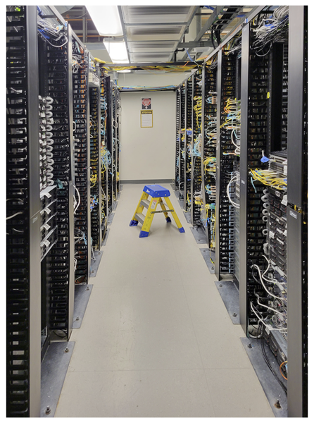
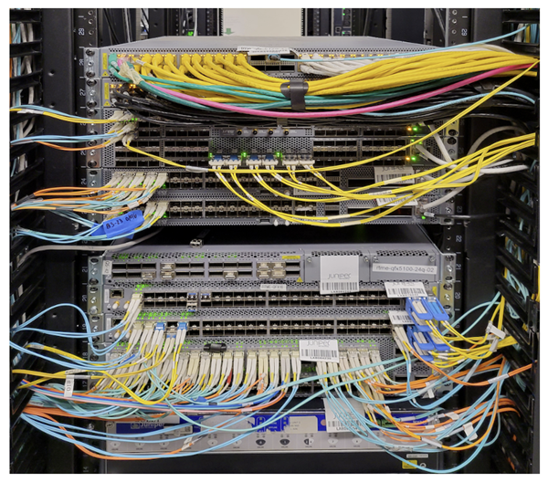
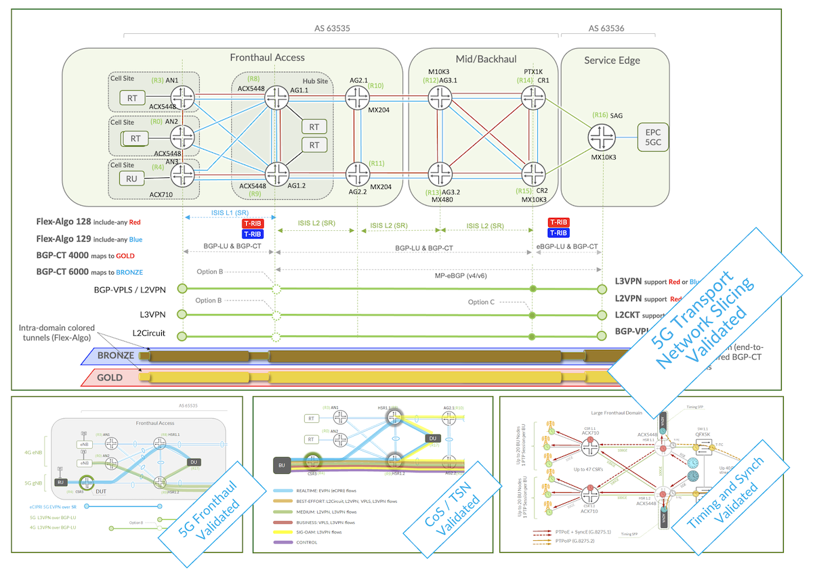

# Introducing the Validation Series

**Nicolas Fevrier - 06/26/2022**

Short introduction to the validation articles. What you should expect from these blog posts, unit testing or extracts of the Juniper Validated Designs.

Article co-written by Kevin Brown and Nicolas Fevrier

## Introduction

Before deploying a new product, technology, or network architecture most of our customers go through a validation / proof-of-concept (POC) phase. They build a lab environment mimicking the topology, scale and features they need in production. And they execute a series of tests to make sure:

- It delivers the expected services (aka "it works")
- It can be monitored accurately
- It can be automated

Sometimes, this testing is required during the pre-sales phases, to select or shortlist a vendor and a product.

In the Validation series of articles, you'll find information designed to reduce the time required to validate a product, a specific feature, or a solution.

One of our goals is to help you prepare for your POC with Juniper Networks products by sharing our own test experience in a collection of pre-selected unit or solution test cases. This is an example of the type of information you can expect:

- Test methodologies
- Configurations used on systems under test (DUT)
- Test success/fail criteria (and the show commands associated)
- Description of internal details to illustrate and explain the test results

Simply put, we want to facilitate your adoption of our products, starting from the validation phases.

We publish two types of Validation articles:

- Unit Tests
- Juniper Validated Designs

Read on for more information about each!

TME Lab in Sunnyvale, CA

## Unit Tests

Unit test articles describe test cases based on a single device and a single service or feature. To identify the most important scenarios, we collected and scrubbed test guides executed in Juniper Networks' Amsterdam, Herndon, Westford and Sunnyvale POC labs during the last 4 years. We extracted test cases that appear multiple times, reflecting what our customers want to see validated first.

Here is an example of the types of Unit Test cases you can expect:

- reboot time measurement
- maximum routing scale
- memory occupied by a full internet (v4+v6) table in FIB
- FIB programming / convergence speed
- load-balancing fairness on ECMP and link aggregation
- chassis fabric redundancy

To be as exhaustive as possible, we include details about:

- the test methodology and why it's the most appropriate way to approach a validation
- the key performance indicators (KPIs) we track to determine the success or failure
- the router's configuration, the flow's description, and the packet size
- the results we obtained in our lab

The test cases provide guidance and a benchmark for your own testing.

## Juniper Validated Design

Juniper Validated Designs (JVD) are a cross-functional collaboration between Juniper Solution Architects and Test teams to develop coherent multidimensional solutions for domain-specific use cases. The JVD team is comprised of technical leaders in the industry with a wealth of experience supporting complex customer use cases. The scenarios selected for validation are based on industry standards to solve critical business needs with practical designs that are fully supported at publication.

The key goals of the JVD initiative include:

- **Test** iterative multidimensional use cases.
- **Optimize** best practices and address solution gaps.
- **Validate** overall solution integrity and resilience.
- **Support** configuration and design guidance.
- **Deliver** practical, validated, and deployable solutions.

A reference architecture is selected for validation after ongoing cadence with Juniper global theaters and deep analysis of customer use cases. The design concepts deployed are formulated around best practices, leveraging relevant technologies to deliver the solution scope. KPIs are identified as part of an extensive test plan that focuses on functionality, performance integrity, and service delivery.

Once the required physical infrastructure is built, the design is sanity-checked and optimized. Our test teams conduct a series of rigorous validations to prove solution viability, capturing and recording results. Throughout the test process, our engineers engage with software developers to quickly address any issues found. Unsupported features are excluded from the scope.

The JVD publication series features technical solution recipes extracted from the validation process. The initial selected use cases are focused on Juniper Cloud Metro and 5G xHaul applications.

## Conclusion

The validation series will host a lot of collaterals to facilitate the adoption and deployment of new products, and technologies. Don't hesitate to reach out to use via this email address to suggest test cases you would like to see in this category.

## Useful links

The Juniper Validated Design series are organised as:

- [JVD Overview](https://juniper.github.io/techposts/introducing-the-validation-series/article) (present document)
- Mobile Backhaul Base

[Mobile Backhaul Overview](https://juniper.github.io/techposts/jvd-mobile-backhaul-overview/article)
[Seamless MPLS LDP with OSPF underlay](https://juniper.github.io/techposts/seamless-mpls-ldp-with-ospf/article)
[Building Border Agnostic Architectures with Seamless MPLS](https://juniper.github.io/techposts/building-border-agnostic-architectures-with-seamle/article)

## Glossary

- POC: Proof-of-Concept
- JVD: Juniper Validated Designs
- KPI: Key Performance Indicator

## Acknowledgements

Thanks to Vasily Mukhin and Frank Reade for the review of this introduction and Jose Aris Dimabuyu (Jad) for lab photos.
