# Introduction to Apstra Freeform

**Bill Wester - 10/25/2023**

From the basic constructs Freeform uses -- Tags, Device Contexts, Property Sets, and Config Templates -- to creating a simple Freeform blueprint, to a number of advanced case studies.

## Introduction

Juniper Apstra is a powerful automation and operations solution that manages the entire data center switching fabric's life cycle. The life cycle consists of the design, deployment, and operational phases of a network's life span. Apstra's Intent-Based Networking (IBN) approach helps network architects and operators automate data center network design, build, deployment, and validation. This is accomplished by translating high-level business requirements (called "intent") into an operational data center network.

The IBN approach provides a framework for managing complex networks using reference designs and stateful orchestration. The Apstra architecture and reference designs provide significant benefits, solving some of the most difficult data center networking issues:

- Helps operators deal with change reliably. This is possible through real-time query-able intent and operational context
- Simplifies all aspects of the network service life cycle, including Day 0, 1, and 2 operations, and simplicity reduces the likelihood of operator error
- Reduces operational risk through stateful orchestration, which leverages precondition validations, post-condition validations, automated configuration rendering, and automated expectations validation

Apstra lets you focus on scale and functionality while the system manages the low-level device configuration and operation. Designers input specifications via the Apstra user interface, where they are applied to the reference design and retained in a graph database. The specifications serve as the intended functionality of the network and are the Single Source of Truth (SSOT) in terms of what is expected. Apstra provides operational assurance by performing a continuous comparison of this model to the current state of all aspects of the network.

## Reference Designs

Apstra currently provides reference designs for 3 and 5-stage Clos fabrics, along with a collapsed fabric model for smaller/edge environments. Apstra provides virtualized overlay functionality via support of VXLAN encapsulation and an EVPN control plane. The architectural details of these reference designs are based on industry-recognized best practices, making them applicable to most data center design scenarios. However, there are situations where design flexibility is required beyond what is practical with these models. The Apstra team has introduced Freeform to address these design situations.

Being the latest addition to reference designs in the Apstra solution, it differs from the existing models in that control of all design elements is placed entirely into the architect's hands. Networks designed with Freeform are not restricted to the existing design frameworks in the Apstra data center reference designs. However, Freeform still takes advantage of the Apstra software architecture, as explained throughout this document.  It is important to note that unlimited design flexibility comes with inevitable trade-offs, primarily around the abstracted and automated user experience.

Apstra reference designs are purpose-built frameworks for capturing the architect's intent.  The reference designs govern:

- The roles and responsibilities of physical and logical components (functionality, scale, interconnectivity)
- How services are mapped to enforcement mechanisms
- The expectations that need to be met (i.e., situations to watch)

This structured approach results in a system that not only assures flawless configuration but provides unprecedented control, visibility, and validation of the infrastructure. Significant efficiencies are gained by this approach, including the elimination of configuration mistakes.

## Freeform Overview

A Freeform reference design differs from the other reference designs in that the network designer is responsible for creating and validating all device configurations. Any feature, protocol, or architecture that fits the deployment scenario can be leveraged. Devices and links are modelled in a topology editor, which creates objects representing the reference design in the graph database. As with the other reference designs, Freeform still leverages the context graph, Intent-Based Analytics (IBA), configuration validation, NOS management, Time Voyager, and numerous other Apstra software features.  But when compared to the more advanced reference designs, reduced depth of IBA capabilities is the trade-off for greater design flexibility.

Freeform consists of various design and build elements and views that each manage specific network design aspects.  Their function and usage are described in the following sections.

## Freeform Design

### Blueprints

When creating a new network with Freeform reference design, you start by creating a Blueprint. As with the other reference designs, the Blueprint contains all elements associated with an operating network managed by Apstra, but there are a few key differences in how Blueprints are structured and used in Freeform. The Data Center reference designs require design and build elements such as logical devices, interface maps, racks, and templates. These steps are unnecessary in a Freeform design because configuration details and device links are created directly into the Blueprint. When creating a new Blueprint, you simply select the Freeform Reference Design, as shown:

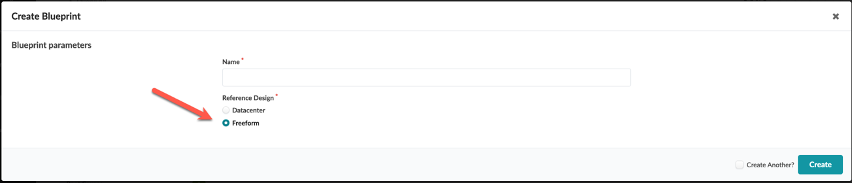

### Blueprint Import/Export

Freeform Blueprints can be imported and exported into and out of Apstra. This allows a user to simplify the migration of blueprints from one Apstra instance to another.  This feature can also be utilized to create a "catalog" of freeform reference designs that an engineer may use to standardize a network design by taking the information from the blueprint and implementing it as a standardized design for many Apstra implementations, these implementations could be considered templates or models of a design that is used by the organization in multiple geographic locations.  Another use case for this feature is the use of this for testing or evaluating designs and systems, all of these possibilities exist in Apstra Freeform.

To Export a Blueprint follow this simple workflow:

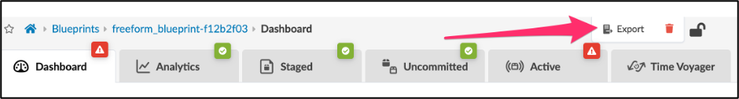

You can then choose what elements of the Blueprint you would like to Export, as shown below. If all of the toggles are "off," only the contents of the topology editor (discussed in the next section) are exported.

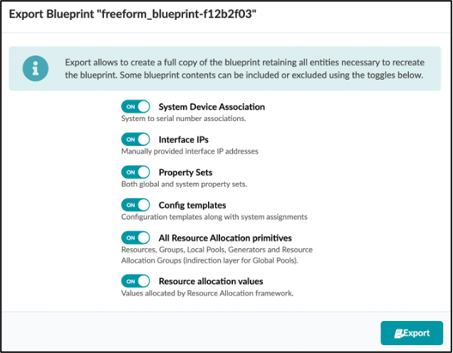

Once the export is complete, the user is presented the export in JSON format for use.

Import of a Blueprint is similar but even more simple, simply create a new Blueprint and then click on the import dialog.

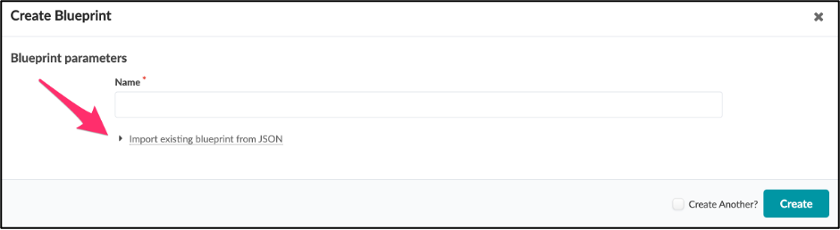

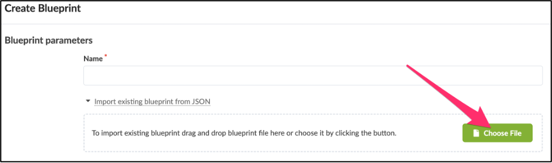

### Topology

After creating a new Freeform Blueprint, you can begin designing your network topology.  As with the DC Reference Architectures, all design work is done from the Staged Blueprint tab.  The Staged topology editor area in Freeform is where you interact with the elements to create your network design and architecture.  The topology editor is a new capability in Freeform that allows you to create bespoke network designs in an interactive manner.  You can select networking devices and connect them interactively by defining links between them.  These devices can be internal or external.

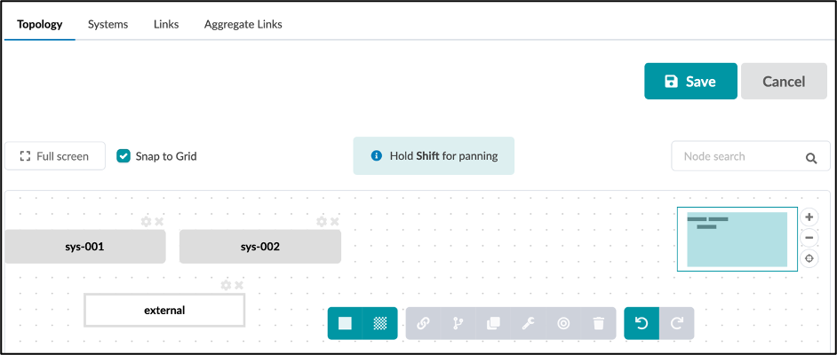

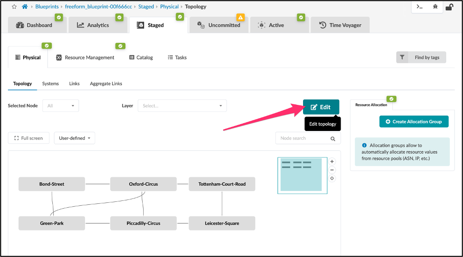

Internal devices are under Apstra management and must be mapped to device profiles that model the device capabilities and interact with the device using agents. External devices are not directly under the Apstra management umbrella but can still be modelled in the topology view for interaction with internal devices, for example, links and speeds.  External devices do not utilize device agents or models.

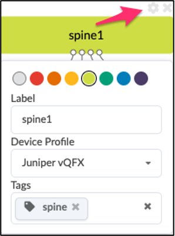

You can create links between devices, single or multiple, or even create aggregated links.  You can interact with the topology to re-arrange the design layout, add links, and edit colors or tags for devices and links. You can perform Create, Read, Update, and Delete (CRUD) operations by selecting the system's gear icon.  You have the option to perform CRUD operations for both individual objects and objects in bulk.

### Colors

You can use colors to create quick visual grouping and distinction between Apstra devices.  For example, devices connecting to firewalls can be red while devices doing IP-Forwarding only can be orange.

### Tags

In Apstra, Tags are a powerful feature.  Tags are a way for you to assign metadata to Apstra-managed resources.  These Tags can help you identify, organize, search for, and filter Apstra resources: currently devices and links. Tags are also useful to help you categorize resources by purpose, owner, environment, or other criteria.   Because Tags are metadata, they are not just used for visual labeling, but they are also applied as a property of the node in the Apstra graph database.  This node property, or device property, is then available for you to reference in Jinja for dynamic variables in config generation and the Apstra real-time analytics via Apstra's Live Query technology and Apstra Intent-Based Analytics.

For example, you can use tag `firewall` to render a specific description:

```

   description "this is a firewall facing interface";

```

See more examples of how to access and use tags in the Accessing the Device Context section and the Jinja Support section.

### Creating Systems

There are two ways to create a new System:

1. From the Stagged>Topology Tab> Topology Editor

Use the first two icons in the bottom menu to create either an internal or an external system. The new system will appear in the topology view. When creating an internal system, you can optionally specify which Device Profile to use and assign a System ID. See how to create and import Device Profiles into the Blueprint in the Device Profiles section.

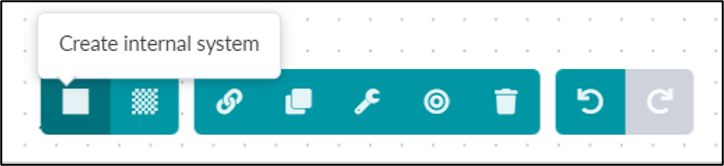

2. From the Staged>Systems Tab

This method will automatically add the new systems in the topology view. You can choose to create a new system from an existing managed device or create a new system with a specific device profile and assign a managed device later once the equipment is ready and part of the Apstra managed devices.

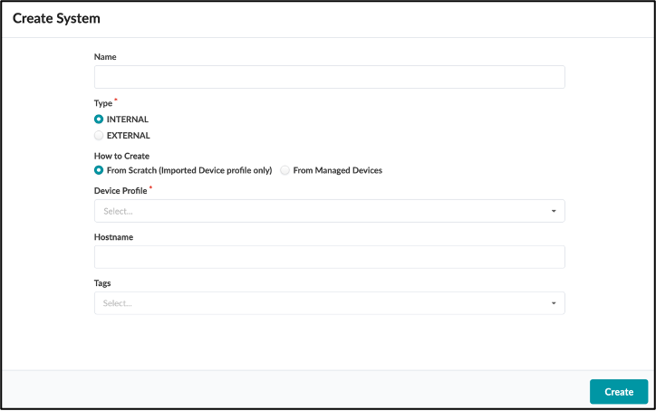

### Creating Links

Links are used to connect objects or devices together.  Links can be single or aggregate links.   These links can have parameters assigned to them via the topology editor "gear" icon.  The links can have IP addresses and tags assigned.

### LAGs (Link Aggregations)

Links can be a LAG or Link Aggregation.  The LAG editing area can be accessed by selecting the topology view, then selecting a device, and then selecting the LAG icon.

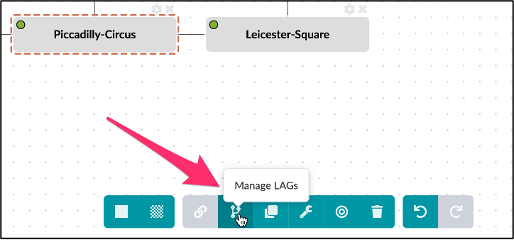

Below is a view of the Link aggregation user interface, selecting 2 links to form an aggregate:

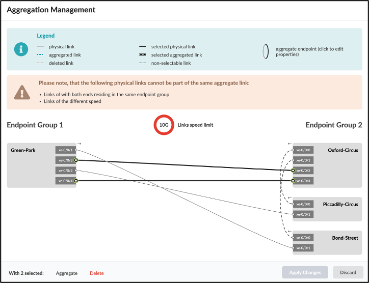

After we click Aggregate we see the changes:

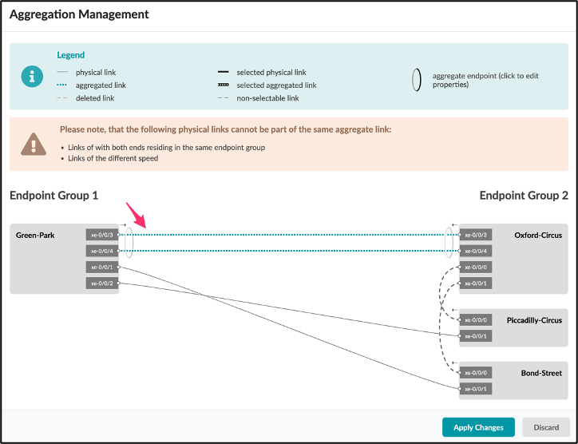

Now we Apply the changes and we see the topology editor updated:

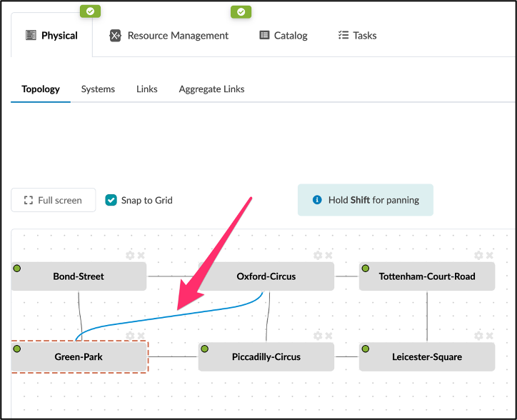

Here you can see the aggregate link is thicker and is colored blue.

Link & LAG management is very easy to use, considering the complexity that could be produced from the different permutations.

### Device Profiles

Device Profiles define the capabilities of supported hardware devices. Some feature capabilities have different behaviors across NOS versions; thus, capabilities can be expressed per NOS version.

> *Note: In the initial versions of Freeform, only Device Profiles for Juniper Networks devices are supported.*

Before you can create a blueprint, you must import Device Profiles into the Blueprint, then you can use those devices in the topology editor in the blueprint.

### Execute CLI Commands

Often, the users may want to interact with the devices by direct CLI interaction, for many reasons including statistics display or to check device status or interface health.  This capability is easy and fully interactive within Freeform.  We highlight this feature as it is more useful than ever in custom Freeform topologies. To access the CLI command functionality, navigate to the device and you will see the dialog:

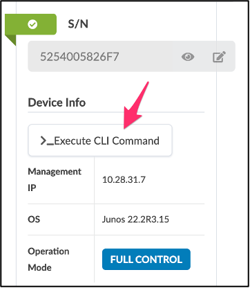

Click on the "Execute CLI Command" area and you can then interact with the device CLI by typing a command and you can then see what choices can be made through the menu structure of the CLI.

> *Note: As of this writing, only show commands are supported.*

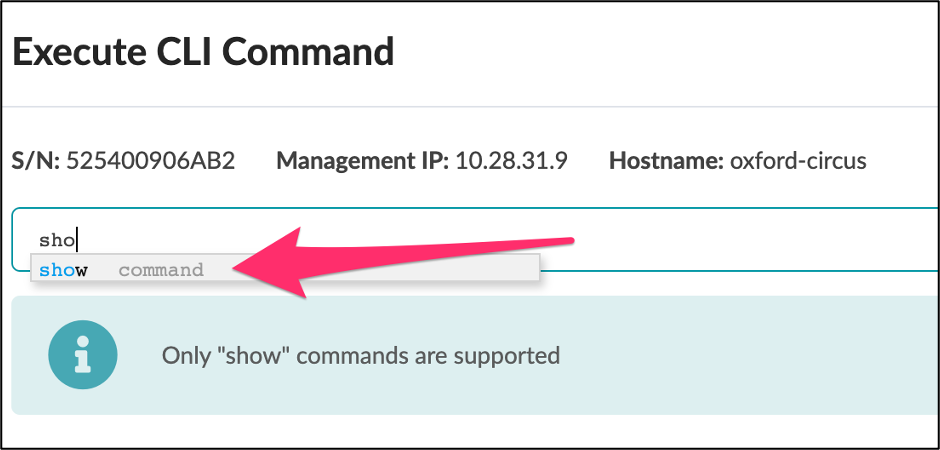

The "tab" key is also useful to auto-complete the command to the next hierarchical level.

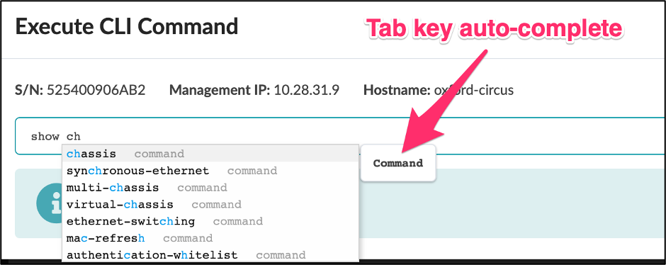

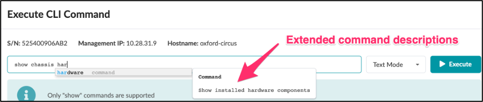

Here you can see an example output from the interactive command without having to open a terminal session and SSH to the device:

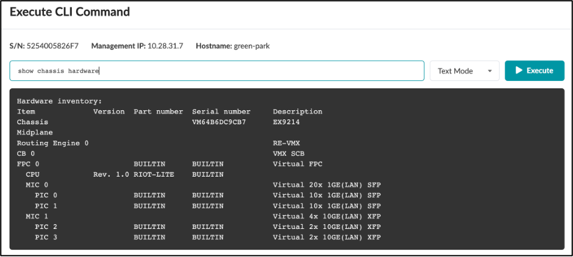

In addition to the text output shown here, you can also select XML or JSON output formats.

### Config Templates

Since the design of the network elements in Freeform is arbitrary, the device configurations are not automatically rendered by the Freeform reference design; rather, the configuration is left for you to define completely.  Beginning in Apstra 4.1.1, we introduce the concept of a Config Template specifically for Freeform to drive device configuration.  Config Templates can be very simple and static to very complex and programmatic depending on the use case and level of automation you are comfortable with. Config Templates support using Jinja2 template language, which can optionally interact with the device context and property sets.

### Nesting (Composable) Config Templates

As Config Templates support Jinja templating, a powerful nesting feature is supported that allows you to include a section of a config template from the list inside of another config template.  There are two main benefits nesting config templates.  The first is that with nesting you can separate various services, configuration sections, etc. out to common components and create dedicated config templates for them.

For example, assume that you have a base system stanza configuration for banners, logins, NTP, etc., for most of your Juniper devices. Instead of copying and pasting the same configuration into each of your device templates, you can create a dedicated config template for the base system config. Then, you just reference that template from within another template.

The second benefit is you need to link only one config template to the device, which would inherit all entities of any linked templates automatically.

As an illustration, the following config template junos_configuration.jinja is a single config template with several nested config templates such as junos_system.jinja.  The junos_system.jinja is rendering only the system hostname:

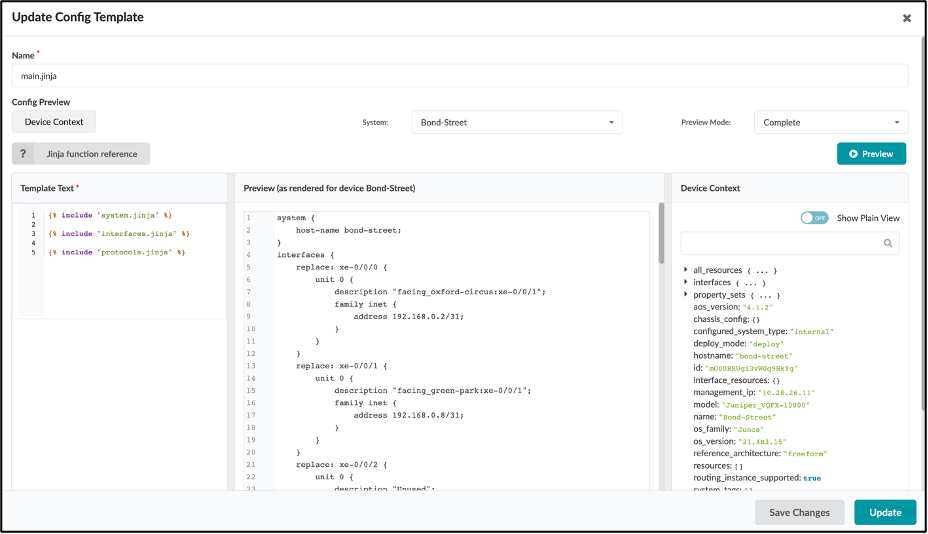

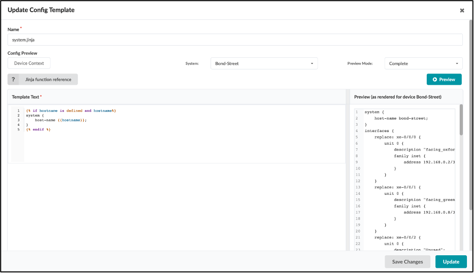

### Rendering Order

The configuration is rendered in the order of the config template.

### Property Sets

Property sets are collections of key-value pairs that you import into blueprint catalogs to use in Config Templates and IBA probes. The use of Property Sets is optional, but it provides a valuable capability that allows you to fully parameterize config templates to separate the unchanging portions of the config template from the actual variables.  Said another way, property sets allow you to enrich the Device Model used to render configuration arbitrarily and flexibly.

For example, the configuration of NTP on all devices in the enterprise may be consistent, but with differing time sources or strata per geography.  The NTP config template can be built using a different variable for each area.  In this case, you can use the property named "ntp".

> *Note: It's important to use the correct syntax, and remember that key values are case sensitive.*

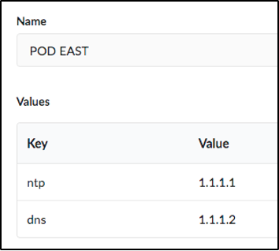

The config template is constructed with {{ntp}} instead of the IP address you wish to use for the NTP server.  The same Config Template is imported into all blueprints, but blueprints running in the East region would have the "EAST" Property Set imported, and blueprints running in the West region would have the " WEST" Property Set imported.  Property sets are by default blueprint wide, or global in context.

Freeform also supports property sets that can be assigned to a device specifically.  This would allow for you to set up specific property sets and assign them and use them only in a specified device.  Property Sets are part of the Graph and values can be used in IBA probes.

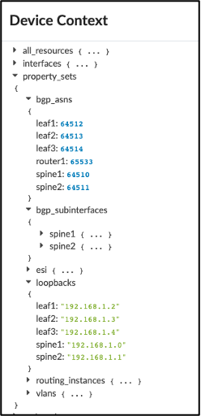

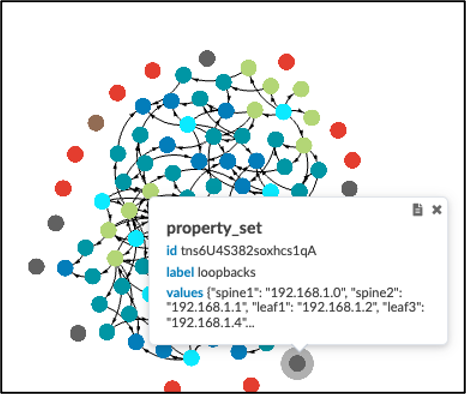

The examples above show that property sets can be accessed via the Device Context (left) or the graph (right).

### Data Structures in Property Sets

Freeform Property Sets support advanced data structures you can use to accomplish different use cases.  Freeform Property Sets support any of the typical Python data types, such as:

- Arrays (list of items)
- Boolean: True or False
- Integers: 1, 2, 3 etc.
- Float: 1.2, 3.65, etc.
- String: "Hello World"
- Dictionary: {"asn": 65432, "lo0": "1.2.3.4/32"}

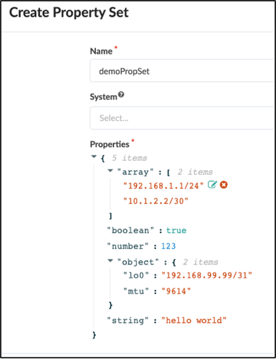

The Property set can be referenceable globally or assigned to a System in the Blueprint.

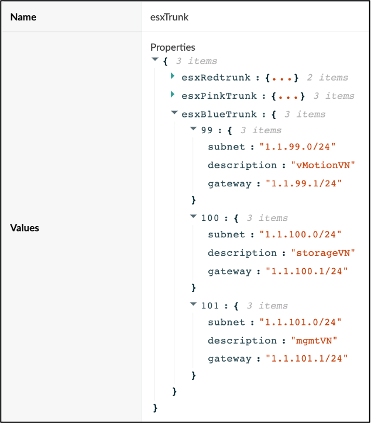

In the example above, you can recurse the dictionary using the keys and using the keys as values as required:

- esxRedTrunk is the link tag name to be used as an interface description
- 99, 100, 101 are the VLAN ID / trunk members & irb.<value> to be assigned
- subnet / description / gateway are also used to derive meaningful configuration

## Freeform Resources

### What are Resources in Apstra?

Resources are objects/items in Freeform that can be assigned for use in your network design. They can be everything from IP addresses to something as simple as an integer. Resources can be either statically defined or allocated from a pool of resources. You may want to think of a resource like an object in an IPAM system (IP Address Management) or a DHCP (Dynamic Host Configuration Protocol) Scope, where you define the scope and objects are created dynamically within that scope such that a single object is only used once until it is no longer used and then it is returned to the object pool for re-use. The same concepts apply to Generated Resources in Apstra Freeform.

### Types of Resource Objects

There are several types of resource objects in Freeform:

- **Allocation Groups** - define the type of resource and the pool from which you allocate resources. Resource generators use these groups to create resources.
- **Pools** - Pools are defined containers of resources that you can then allocate. These pools have a specific type associated with them, such as IP address or ASN.
- **Local Pools** - Objects that are pools but are assigned to a node (system). The pools can only be of type VLAN.
- **Local Pool Generator** - A resource that is generated dynamically from a graph scope but is assigned as a resource to a system. The pools can only be of type VLAN.
- **Resource** - a resource is a single instantiation of an object you want to create and use in your design. An example of a resource would be a single IPv4 address such as 192.168.1.24
- **Resource Generator** - An automation object consisting of parameters including a graph scope, and a type (IPv4 address, IPv6 address, Integer, ASN). This object generates resources for use in your design. Resource Generators live in Resource Groups.
- **Resource Groups** - An object that contains resources and resource generators. These groups can be used to organize your environment if it becomes complex, at least one group is required. There is a default group called Root, but that group is unusable for resource objects other than Groups.
- **Group Generators** - An object that creates resource groups dynamically based upon a defined scope. The group generator scope is set based on a graph query. This query creates dynamic groups based on the query response. Every element created under this group inherits this scope.

### The Importance of Scope, and the Graph

Resource Generators and Group Generators are both based on a scope. What is a scope? A scope is a query to the graph database that returns a set of objects. The generator then generates a resource based on the objects that are returned. It's important to understand that scopes can use filtering mechanisms such as identifying tags, and the type of object, such as a link or a system, can all be used to create the scope of generation of resources.

### Example Graph Queries

- All of the internal systems node('system', system_type='internal', name='target')
- All of the links to external systems node('link', role='external', name='target')
- Internal links marked with tag of "fabric" node('link', role='internal', tag='fabric', name='target')

### Groups

Groups are used like folders to group together resources and resource generators. There is one Group already created for you, which is the "Root" group. This group is the Group that holds all other groups. You cannot create resources in the Root group, but you must create a group in Root first. Once you have had that group new group under the "Root" group, you will then be able to create all the resources necessary.

### Group Generators

Group generators do as their descriptions say: They generate groups dynamically to help us manage resources. These dynamically created groups are created based on a graph query scope, just like in the past exercise with resource generators node('link', role='internal', name='target'). In our example, we will focus on managing the resources for each system, including a Loopback IP address and an ASN number for BGP peering. To accomplish this, we will use a scope graph query to return all the systems and create a group for each system. This way the Loopback IP and ASN for the system are grouped into the system's group.

### User Flow for Resource Allocation

In this section, we will outline the steps needed to enable resource allocation. If a user follows these steps, they should end up with created resources and their needed objects that they can use in Jinja.

#### Create a Resource Pool

The first step is to create a resource pool. Of course there are some pre-made resource pools that you could use. Resource pools are accessed on the left side menu:

####

#### Create an Allocation Group

Once you have created the resources you want to use, you must then create an allocation group. This 'allocation' group allows you to allocate resources to use in a resource generator. These allocation groups exist so you can group multiple resource pools together in a single entity that can be used in your resource generators.

Allocation groups are located in the blueprint under Staged -> Resource Management -> Allocation Groups:

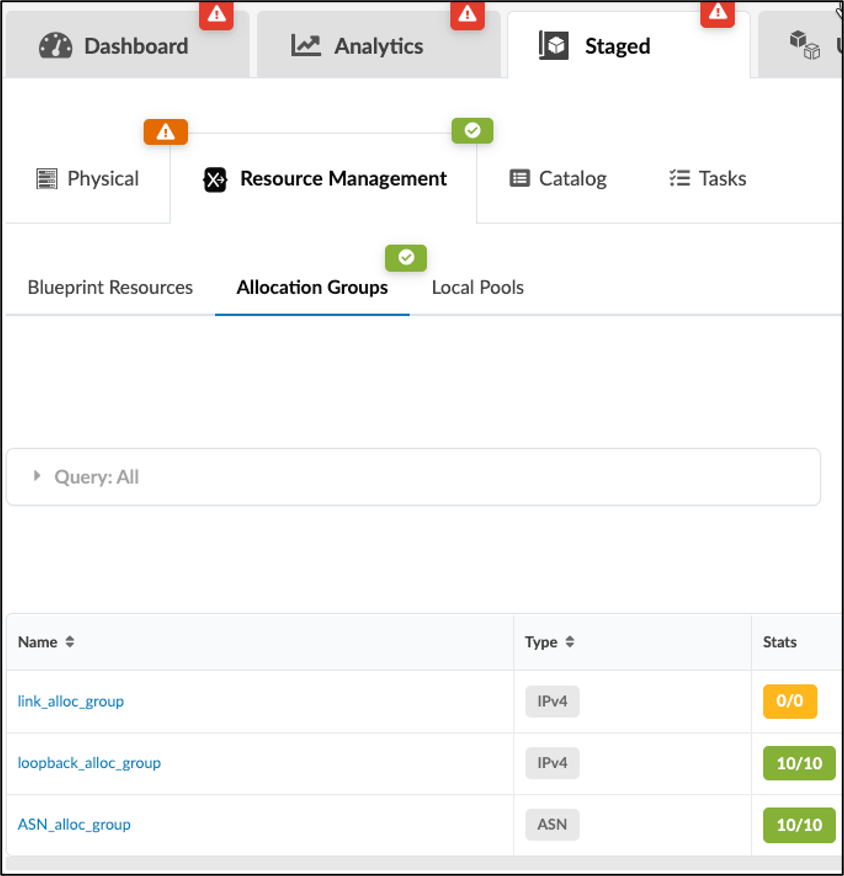

Details of an allocation group can be seen here, where you can select more than one resource pool for your allocation group:

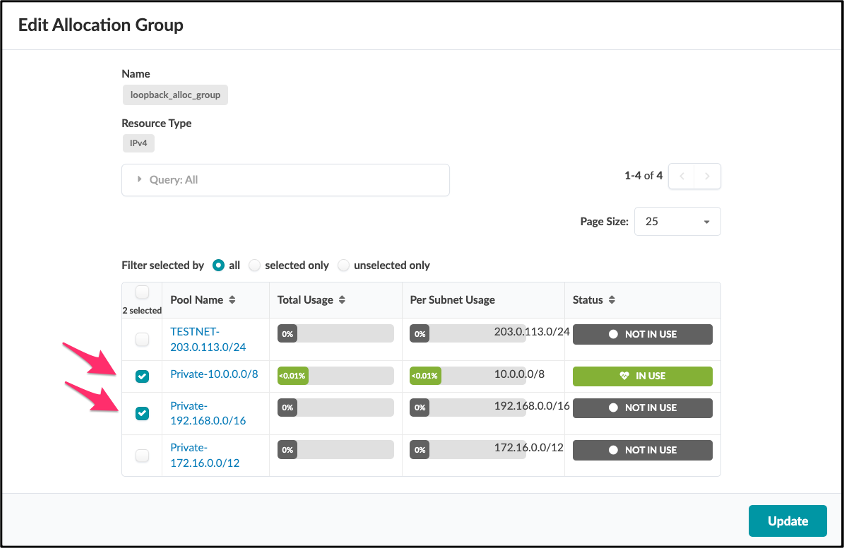

#### Create a Group

You now should have resource pools grouped into an allocation group. Let's create a resource "group" now. This group is where resources reside. There is a default group called "root," but it can only have groups inside of it, and not pure resources. Once you have created a group, we can move on.

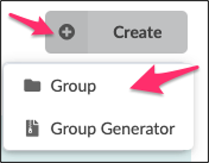

#### Create a Static Resource

Static resources are meant to be used where you want to assign the resource value statically without allowing the value to vary or change. This allows you to set resources that you may need to not change over time. In the example below, we create a static resource of type *Integer* and a value of 190:

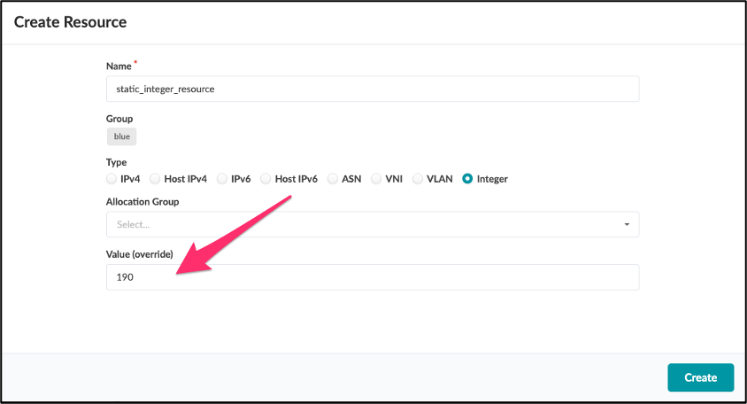

#### Create a Resource Generator

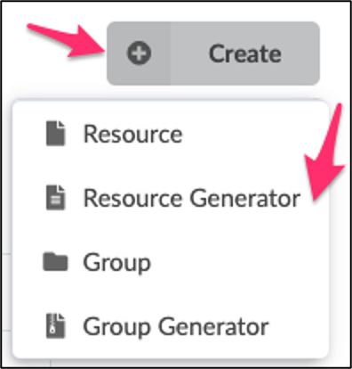

If we need dynamically created resources, create a Resource Generator inside the group. This Resource Generator will require a scope which is a graph query. This will help you to define how many resources are automatically created.

Below, we create a Resource Generator called "asn_generator" of type ASN using the ASN_alloc_group:

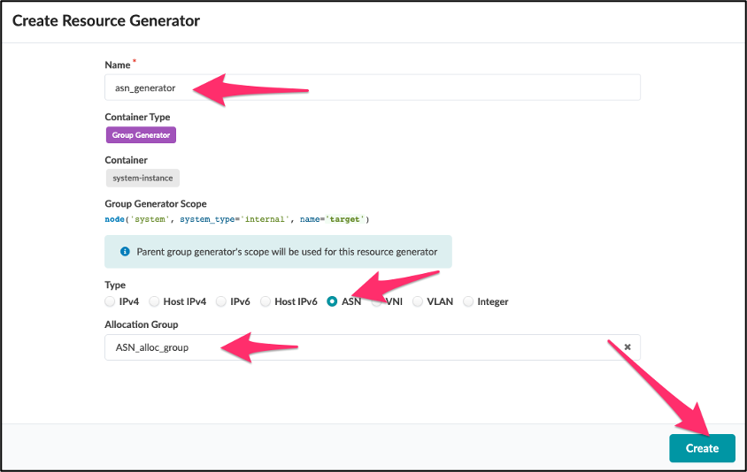

#### Create a Group Generator

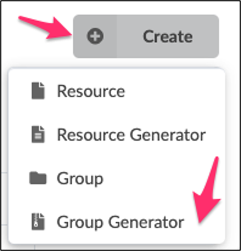

The Group Generator creates groups based on a scope. Think of a Group Generator as a resource that creates groups, and these groups automatically inherit the scope of the Group Generator. This allows you to set up specific Resource Generators in the Group Generator, automatically allocating resources and properly grouping them into the groups. For example, you may want to create a Group Generator per internal system in your network. These internal systems each may need a Loopback IP address and an ASN Number; if you create a Group Generator that includes those Resource Generators, it will automatically create the group for each internal system, and in that group, the ASN and Loopback will be created and organized into that group. Below, a Group Generator named "system-instance" is created:

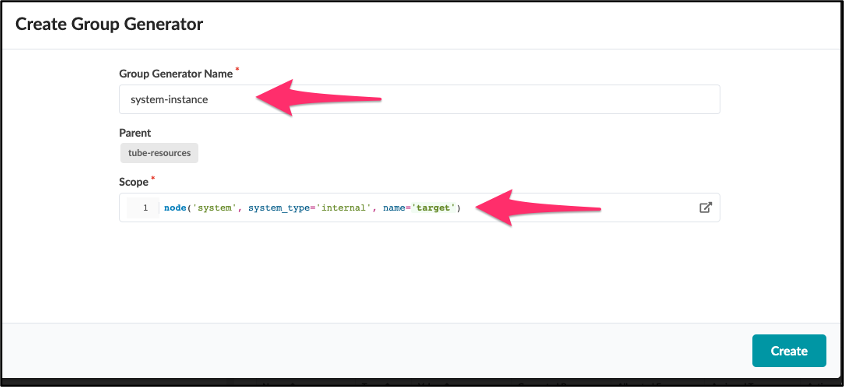

### Examine Resources in Jinja

The Config Template three-pane editor is the usual interface for interacting with the resources generated. The expectation is that the Jinja code can be utilized to find and include the resources from the resource tree.

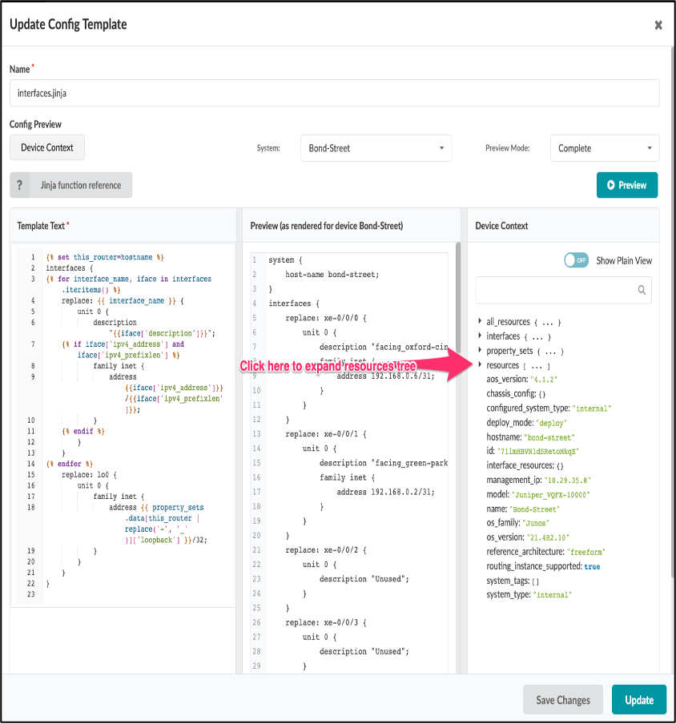

### Use a Resource in Jinja

Once Resources are created in the Blueprint, these resources can then be accessed via the device context.

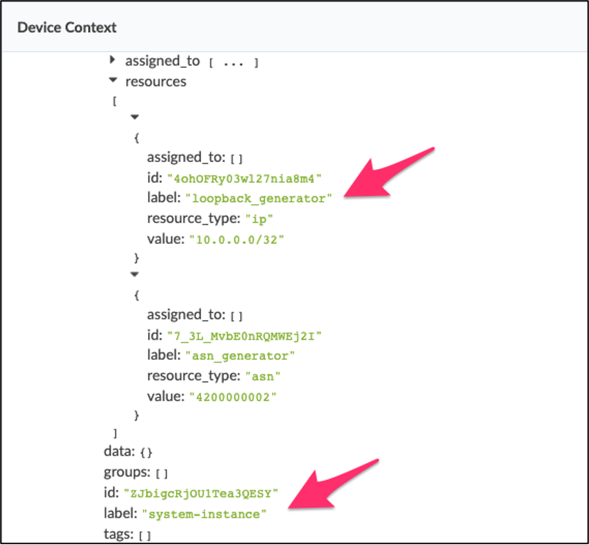

Here is an example of how you would use jinja to include a function to get the resource value for a resource called 'ipv4_loopback' inside the resource group structure called 'underlay':

``

### Use the Built-In Functions for Resources

Apstra includes some built-in functions that can and probably should be used in Jinja creation. These functions are documented inside the user interface. To access the function documentation, it's best to use the built-in editor in Jinja to access the documentation page via the UI. The link to the documentation is the Apstra server UI https://<apstra_ip>/static/jinja_docs/ for reference.

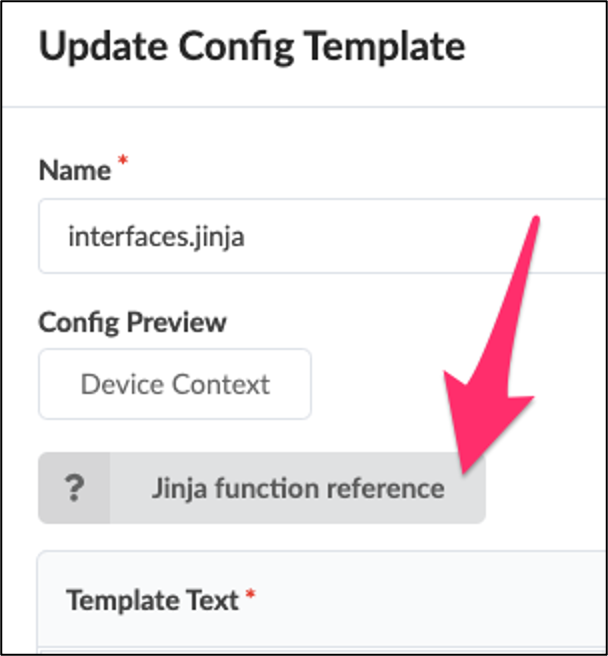

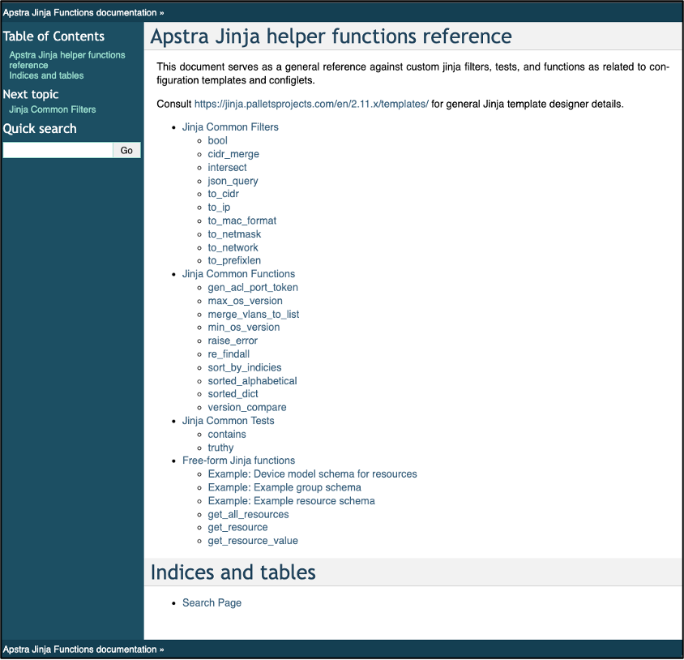

### Steps Needed in Order to Create a Resource Generator

Here is a list of the steps to create and use a Resource Generator in brief:

1. Create a pool
2. Create an Allocation Group
3. Create Resource Group under root
4. Create Resource Generator
5. Use Resource in Jinja

**Deploy Modes (Deploy / Ready / Drain)**

Like in Data Center Blueprints, users may set the Deploy Mode of systems in Freeform:

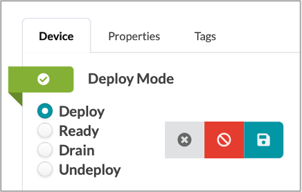

However, in Freeform, the user defines the configuration rendered when a system is in each mode.

Users can use the Deploy Mode to conditionally render different configurations, such as whether to render routing protocol sessions or to indicate how particular route maps would render on a device.  An example would be if the device was set to "Drain" it would have specific jinja to generate a configuration that removed the dynamic routing protocols.

The Deploy Mode of a system is exposed to the user in the Device Context, which can be referenced in Config Templates as Jinja variables:

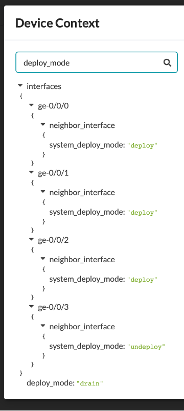

The Deploy Mode of neighboring systems are also available.

Changing the Deploy Mode of a system has no effect on the rendered configuration if it has not been referenced by the Config Template assigned to the system.

An example of how this could be accomplished in a Jinja Config Template is as follows:

```

    
    

````

In this example, both the protocols.jinja and policy_options.jinja become active when a given node is in either the 'deploy' or 'drain' state. The behavior can be modified to suite individual needs.

### Commit Check of Device Configurations

Apstra provides a function to complete a Junos configuration check for all devices in a Blueprint from a simple user interface.  This config check functionality is based upon the built-in functionality of Junos; it uses the devices config check utility to check the configuration before it is committed to see if there are any errors in the configuration.  Config check is viewed from the Uncommitted area of the Blueprint.

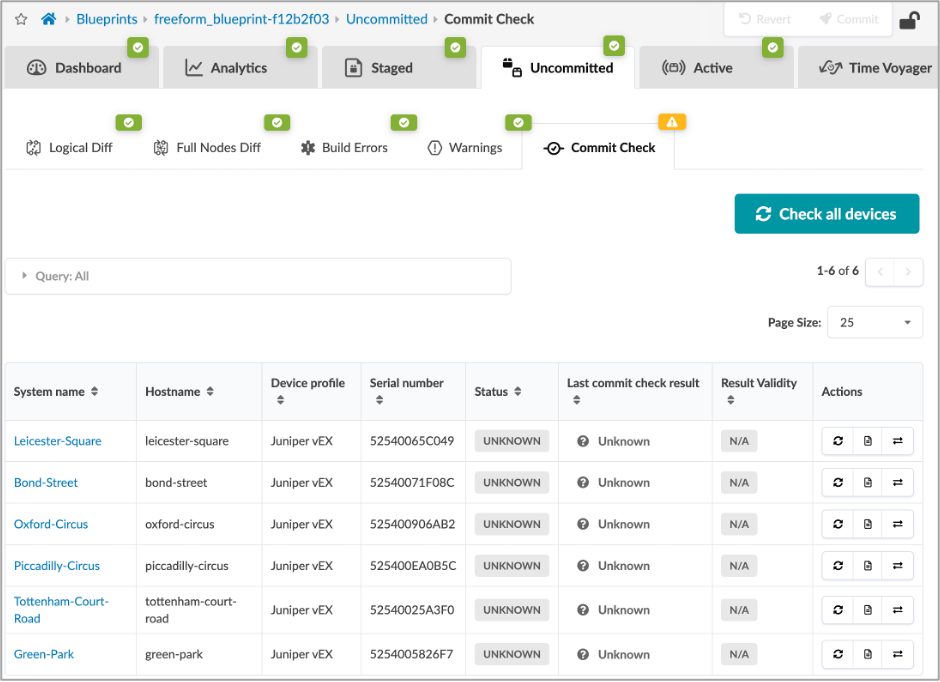

You can see here that the devices are listed with their Status and Result Validity; you can then perform the "Check All Devices" or check a single device.

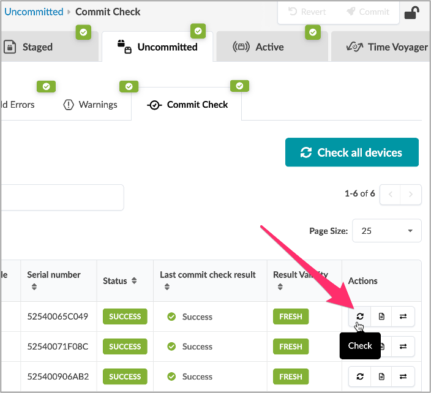

Checking all devices is easily accomplished:

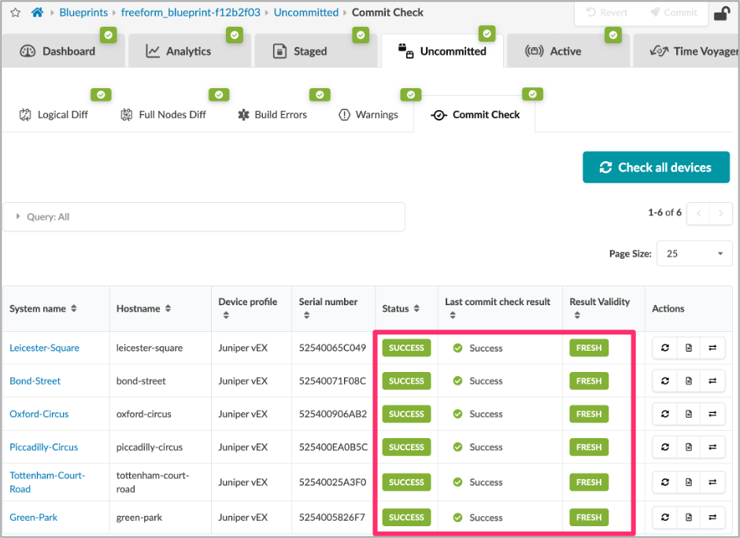

Results are straightforward and can be used before committing the changes to ensure the config is properly committable.

## Jinja Support in Config Templates

### Using Jinja in Config Templates

As previously mentioned, Config Templates support using Jinja template syntax. Jinja2 template language can optionally interact with the Device Context and Property Sets.  This allows for a high degree of automatic template evaluation and rendering of the end device configuration.  Using Device Context properties with Jinja syntax essentially serves to have dynamically built values for Config Templates based on the Apstra Single Source of Truth (SSOT) database.

This can be useful for use cases where you want to apply the Config Template to many switches or interfaces with parameterized values or you want the Config Template to include dynamic data (such as the switch's own Hostname) from the Blueprint.

### Accessing Values in the Apstra Device Context

There are a few different ways for you to view all the key values Apstra stores for each device.

One way is to select **Device Context** in either the staged or active topology view by navigating to an internal node and device details:

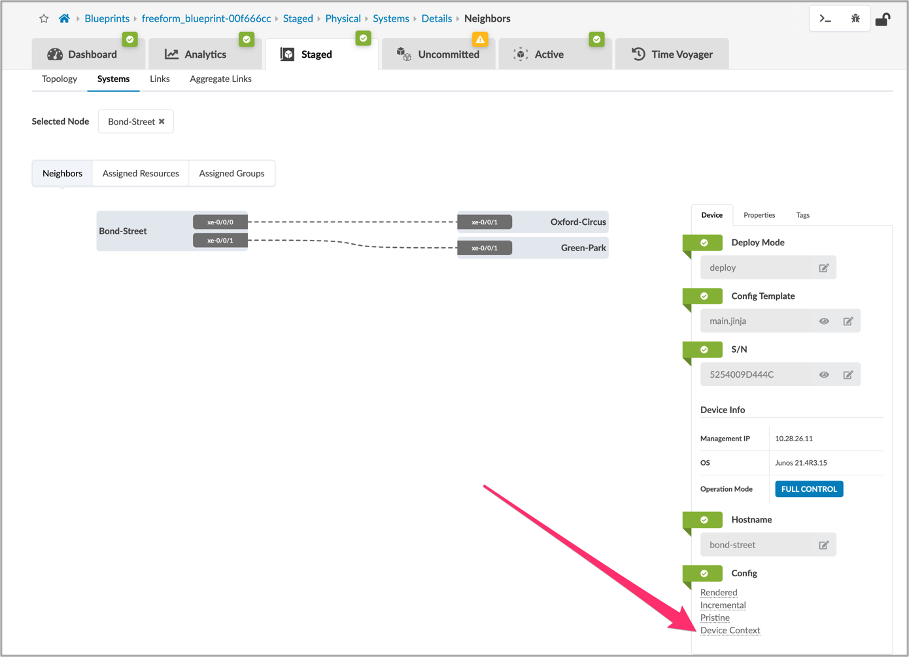

Alternatively, you can interactively view **Device Context** while creating a Config Template:

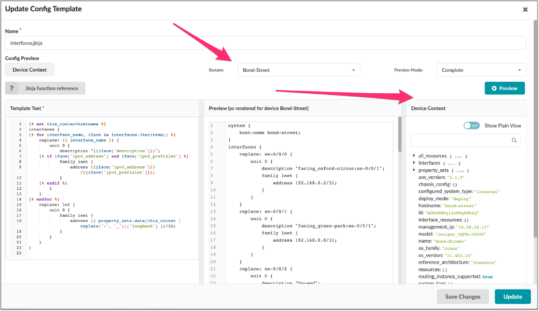

### Device Context via API

Finally, you can also access the device context via API:

`<apstra-ip>/api/blueprints/<bp-id>/nodes/<system-node-id>/config-context`

One way you can get the data needed for the API call is in the Blueprint UI. Select the device and take note of the Blueprint ID as well as the node ID in the URL:

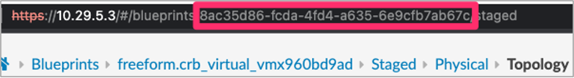

### Examples of Using Jinja in Config Templates

#### Hostname

Below is an example of a relatively simple static section of a Junos Config Template where a single Jinja template references a device's hostname variable, which is replaced by the value stored in the Apstra graph database.  The value is passed in when the template is rendered. This use of Jinja and variables is helpful with creating dynamic data from Apstra.

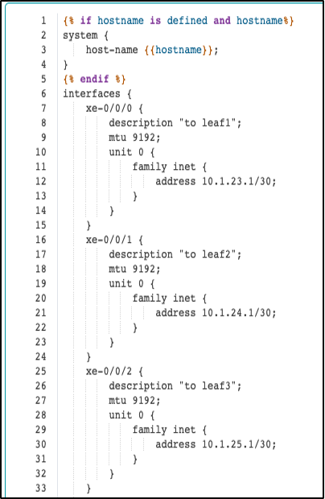

#### BGP ASN from Device Context

Similar to the example above, this example shows how you can call a key value of a device property stored in the Apstra graph database to build configuration dynamically.  Here, the keys bgpService.asn and bgpService.router_id are replaced by the values stored by Apstra and are passed in when the template is rendered:

```
Example Config Template
router bgp {{ bgpService.asn }}
{{ bgpService.router_id }}

Resulting Rendered Configuration
router bgp 64512
10.0.0.2
```

#### Defining Variables for Use in Loops

In some cases, you may find it useful to define and store variables directly in the config template that can be referred to during the rendering.  The following example shows how you can create an access-list using defined variables.

```
Example Config Template




   
       ip prefix-list BGP-vm-{{ direction }}-filter seq 1000 {{ entry.0 }} {{ entry.1 }}
   


Resulting Rendered Configuration
        ip prefix-list BGP-vm-in-filter seq 1000 permit 10.0.0.0/8
        ip prefix-list BGP-vm-out-filter seq 1000 deny 6.6.0.0/16
```

#### Property Sets and Jinja Loops

You can also use Jinja to loop over and evaluate a data model from a property set containing a list of elements.  Take the following SNMP configuration example where you can combine values in a property set with a Jinja for loop to render a final configuration with multiple dynamic lines of config.

Example Config Template:

```
ip access-list SNMP_RO

    permit ip host {{server}} any
    
    exit
    

snmp-server source-interface traps loopback 0
snmp-server community tempPassword group network-operator
snmp-server community tempPassword use-ipv4acl SNMP_RO

snmp-server host {{server}} traps version 2c mypass

```

Property Set 

```
Name: snmp
Properties: {{snmp_server}} --> 203.à.113.100,203.0.113.101 
```

Resulting Rendered Configuration:

```
ip access-list standard SNMP_RO
  permit host 203.0.113.100
  permit host 203.0.113.101
  exit
snmp-server source-interface loopback 0
snmp-server community tempPassword view mysystem ro SNMP_RO
snmp-server enable traps snmp authentication
snmp-server host 203.0.113.100 traps version 2c mypass
snmp-server host 203.0.113.101 traps version 2c mypass
```


### Building and Testing Your Config Templates with Jinja

Another innovative product enhancement with Freeform's introduction is the multi-pane Config Template editor.  This feature operates a bit like an Integrated Development Environment (IDE) for building Config Templates.

### Multi-Pane Config Template Editor

#### Template Text Pane

When creating and editing Config Templates you have multiple windows to work with.  The first is the ***Template Text*** area, where you build the Config Template.  This ***Template Tex**t* area supports syntax highlighting, autocomplete, and error notification.

#### Preview Pane

The second is a ***Preview*** pane which processes any included Jinja syntax and renders the final Config Template compilation.  This allows you to view the final processed configuration in real-time.  You have a choice of viewing the complete config or the incremental config.

#### Device Context Pane

The third is a ***Device Context*** pane that provides you with all the graph properties Apstra has available and stored for the selected device.  This lets you quickly see and search for values you can use in your Config Templates for dynamic variable substitution.

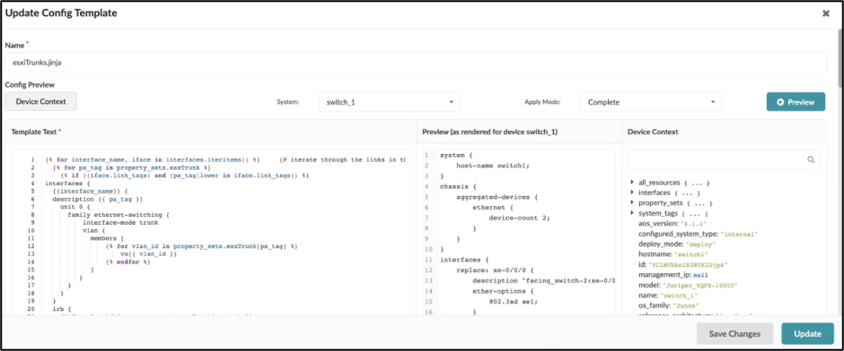

## Telemetry and IBA

### Active Anomaly Detection and Reporting

Freeform provides automated monitoring of key aspects of the active deployed system in the network.  These anomalies are dynamic and evaluated as the network is running.

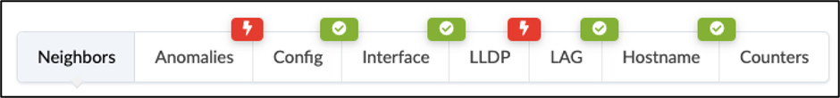

- **Neighbors** -- the list of neighbors connected to the device via the Graph
- **Anomalies** -- summary of any anomalies found on the device
- **Config** -- any config deviations or problems
- **Interface** -- Interface-focused anomalies (up/down etc.)
- **LLDP** -- Anomalies focused on LLDP data to make sure it matches intent
- **LAG** -- Anomalies in LAG groups and any issues
- **Hostname** -- Any issues in the hostname
- **Counters** -- List of counters for all interfaces and other information

## Putting It All Together

The following use cases are examples of different network designs that utilize different methods and techniques of the Apstra Freeform features we've discussed.  These examples are meant to help you better understand how the features of Apstra and Freeform could be used to address various networking use cases.

### Use Case #1:Small Version of London Tube (CloudLabs Topology)

This use case uses a small version of the London underground system as a map to design a network topology from arbitrary switches.  The concept here is to create a very simple network design using Jinja templates and a property set.   This use case demonstrates how you can create a complete network design using uncomplicated Jinja templating and property sets.

This use case is available as a hands-on lab using Juniper Apstra Cloudlabs (See the Useful Links section at the end of this article for more information about CloudLabs).  A GitHub repository includes the Jinja files and JSON property sets you can reference, contribute to, or even fork.

**1. Topology of the environment**

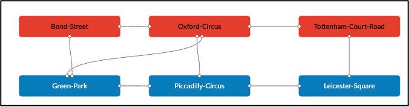

All system links showing tags and IP addresses assigned via the topology editor/API:

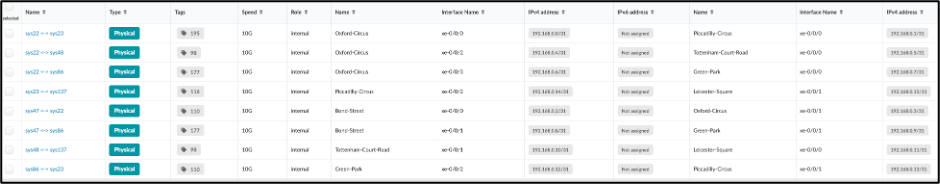

**2. End-state rendered configurations**

For the Bond-Street device here is an example of the rendered configuration:

The Interfaces Block:

```
interfaces {
    replace: xe-0/0/0 {
        unit 0 {
            description "facing_oxford-circus:xe-0/0/1";
            family inet {
                address 192.168.0.2/31;
            }
        }
    }
    replace: xe-0/0/1 {
        unit 0 {
            description "facing_green-park:xe-0/0/1";
            family inet {
                address 192.168.0.8/31;
            }
        }
    }
    replace: lo0 {
        unit 0 {
            family inet {
                address 10.0.0.2/32;
            }
        }
    }
}
```

The Policy-Options Block:

```
policy-options {
    policy-statement send-direct {
        term 1 {
            from protocol direct;
            then accept;
        }
    }
    policy-statement add-med-110 {
        term 1 {
            from {
                route-filter 0.0.0.0/0 longer;
            }
            then {
                metric add 110;
                accept;
            }
        }
    }
    policy-statement add-med-177 {
        term 1 {
            from {
                route-filter 0.0.0.0/0 longer;
            }
            then {
                metric add 177;
                accept;
            }
        }
    }
}
```

The Protocols Block:

```
protocols {
    lldp {
        port-id-subtype interface-name;
        port-description-type interface-description;
        neighbour-port-info-display port-id;
        interface all;
    }
    replace: rstp {
        bridge-priority 0;
        bpdu-block-on-edge;
    }
    bgp {
        group external-peers {
            type external;
            export send-direct;
            neighbor 192.168.0.3 {
                peer-as 22;
                export add-med-110;
            }
            neighbor 192.168.0.9 {
                peer-as 86;
                export add-med-177;
            }
        }
    }
}
routing-options {
    autonomous-system 47;
}
```

**3. Show Config Templates**

Config Template system.jinja:

```
system {
    host-name {{hostname}};
}
```

**Description:** This is the main.jinja config template.  This template is the system.jinja template that uses the builtin "hostname" variable from the device context to set the system host-name to this.

Config Template interfaces.jinja: 

```
 
interfaces {

    replace: {{ interface_name }} {
      unit 0 {
        description "{{iface['description']}}";
        family inet {
          address {{iface['ipv4_address']}}/{{iface['ipv4_prefixlen']}};
        }
      }
    }

    replace: lo0 {
      unit 0 {
          family inet {
              address {{ property_sets.data[this_router]['loopback'] }}/32;
          }
      }
   }
}
```

**Description:** Set the variable this_router=hostname

For loop that walks through the interfaces and inserts the proper interface stanza syntax for junos including the description of the interface and the family inet address and prefix length from the device context.  You can populate these values via the links in topology editor. This inserts the property_set data for this router's loopback address into the loopback stanza.

Config template protocols.jinja:

```

policy-options {
  policy-statement send-direct {
      term 1 {
          from protocol direct;
          then accept;
      }
  }


{#
  this may create multiple identical policy-statements, but JunOS is smart enough
  to squash them.
#}
  policy-statement add-med-{{ link_med }} {
          from {
            route-filter 0.0.0.0/0 longer;
          }
          then {
            metric add {{ link_med }};
          }
          then  {
            accept
          }
  }

}

protocols {
  lldp {
      port-id-subtype interface-name;
      port-description-type interface-description;
      neighbour-port-info-display port-id;
      interface all;
  }
  replace: rstp {
    bridge-priority 0;
    bpdu-block-on-edge;
  }


  bgp {
    group external-peers {
      type external;
      export send-direct;
      
      neighbor {{ iface.neighbor_interface.ipv4_address }} {
        
        peer-as {{ property_sets.data[peer_hostname]['asn'] }};
        export add-med-{{ iface.link_tags[0] }};
      }
      
    }
  }
}

routing-options {
  autonomous-system  {{ property_sets.data[this_router]['asn'] }};
}
```

**Description:** Set the variable this_router = hostname from the device context. Set a policy-options stanza to send all directly attached routes. Walk the interface tree. Set the variable link_med to the tag set on the interface via the topology.

**4. Property Set**

Property Set "data":

```
{
  "bond-street": {
    "asn": 47,
    "loopback": "10.0.0.2"
  },
  "green-park": {
    "asn": 86,
    "loopback": "10.0.0.4"
  },
  "tottenham-court-road": {
    "asn": 48,
    "loopback": "10.0.0.3"
  },
  "leicester-square": {
    "asn": 137,
    "loopback": "10.0.0.5"
  },
  "piccadilly-circus": {
    "asn": 23,
    "loopback": "10.0.0.1"
  },
  "oxford-circus": {
    "asn": 22,
    "loopback": "10.0.0.0"
  }
}
```

**Description:** The property set is very straightforward represented  as a list of dictionaries that include the following:
- Name of the system or station is the key, and inside that key are two parameters
- Asn which is the autonomous system number for BGP peering 
- Loopback which is the loopback address of the system/station to peer with.

### Use Case #2: Tags and Property Sets to Drive Day-2 Configuration

#### Introduction

The small topology shown below has been constructed in the Freeform topology editor. It has three switches and two external systems named ESXi-1 & ESXi-2. The links facing the two hosts are tagged with esxBlueTrunk and esxRedTrunk respectively. This use case aims to show how you can use the Freeform feature to dynamically build the switch trunk facing the ESXi hosts, determined by the entries in the Property Set and the tags assigned in the topology.

The role of the tag in this instance is to indicate where the trunk should be configured/created. In this instance, the Property Set's role is to hold the relevant data required to configure the trunk members, the VLANs, and the IRBs.

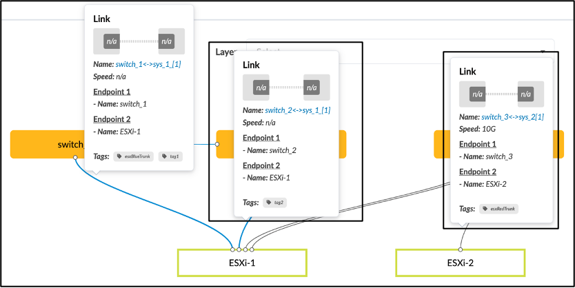

This example describes the power of utilizing a carefully crafted Configuration Template (Jinja2), Tags, and Property Sets to build configurations without the need to re-craft the Config Template. As new tags are assigned to the topology or new VNs are assigned to the property set, the associated config will be dynamically built for these trunks.

#### End-State Configuration

For the interface tagged with esxBlueTrunk, the final Junos configuration will include:

The Interfaces Block:

```
interfaces {
  ae2 {
  description esxBlueTrunk
    unit 0 {            
      family ethernet-switching {
          interface-mode trunk
          vlan {
            members [
                    vn99
                    vn100
                    vn101
            ]
         }
      }          
    }
  }
```

The IRB Block:

```
irb {
    unit 99 {
        family inet {
            mtu 9000;
            address 1.1.99.1/24;
        }
    }
    unit 100 {
        family inet {
            mtu 9000;
            address 1.1.100.1/24;
        }
    }
    unit 101 {
        family inet {
            mtu 9000;
            address 1.1.101.1/24;
        }
    }
  }
}
```

The VLAN Block: 

```
vlans {
  vn99 {
    vlan-id 99;
    description vMotionVN-99;
    l3-interface irb.99;
  }
  vn100 {
    vlan-id 100;
    description storageVN-100;
    l3-interface irb.100;
  }
  vn101 {
    vlan-id 101;
    description mgmtVN-101;
    l3-interface irb.101;
  }
}
```

#### esxTrunk Property Set

The Property Set includes the necessary details needed to build the Junos Trunk config:

The esxTrunk Property Set (to the left) has been constructed as a dictionary of dictionaries for good reason: to enable recursive lookup. The esxBlueTrunk dictionary has been expanded to show values 99, 100, 101 which in this instance are used as both VLAN IDs, and as a key to the dictionary below it. The dictionaries below provide key : value pairs for the subnet, the gateway, and the description. In this example, the subnet is not required and exists purely for reference. 

With the data organized in this way, the Config Template has been designed to recurse through two data structures to search for matching tags:

1. The esxTrunk Property Set
2. The topology from the topology editor

When the tag in both data sets match, the Config Template produces the desired configuration. By cross-referencing the Property Set to the left with the Junos configuration output above, you can see that:

- The values esx[Red | Blue | Pink]Trunk, are used as the tags to match, as we walk through both datasets. 
- The values 99, 100, 101 are used as the VLAN IDs
- The gateway is used as the IRB address
- The description is used to overwrite the original interface description (as required)
- Both the esx(Red / Pink)Trunk, hold similar information as the esxBlueTrunk

To enable efficient recursive walking of both the Property Set to the left and the tags assigned to the links in the topology, the tags have been purposely assigned the same values
- esxRedTrunk
- esxBlueTrunk
- esxPinkTrunk

#### Jinja2 Base Config Template State Machine

The Config Template esxTrunks.jinja flow is described below.

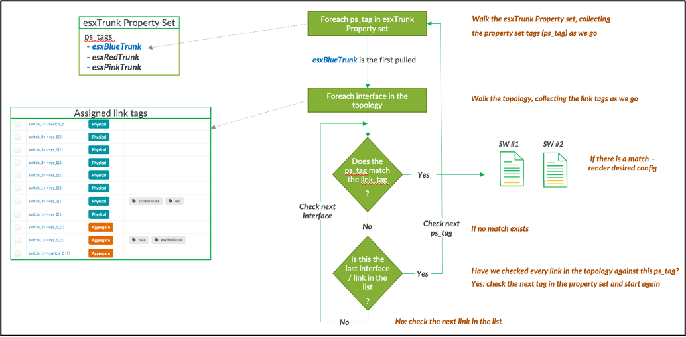

#### Jinja2 base Config Template

The Jinja2-based Config Template shown here utilizes both the assigned tag and the Property Set to build the required config.

```


   
    
interfaces {
  {{interface_name}} {
  description {{ ps_tag }}
    


  unit 0 {            
      family ethernet-switching {
          interface-mode trunk
          vlan {
            members [
                
                
                    vn{{ vlan_id }}
                
            ]
         }
      }          
    }
  }
  
    
  
  
irb {


    unit {{ vn }} {
        family inet {
            mtu 9000;
            address {{ property_sets.esxTrunk[tag][vn]['gateway'] }};
        }
    }
    
  }
}
vlans {


  vn{{ vn }} {
    vlan-id {{ vn }};
    description {{ property_sets.esxTrunk[tag][vn]['description'] }}-{{ vn }};
    l3-interface irb.{{ vn }};
  }
  
}
```

### Use Case #3: Advanced Example using CRB (CloudLabs Topology)

This final use case is a complete CRB example that has been written by Apstra Engineering.  This example is built completely with static Jinja templates, and all of the data is in Property Sets for the network and devices.  This allows the users of this CRB example to operate, expand, and change the network just by editing Property Sets and allowing you not to touch the underlying Jinja templates.  This use case aims to give you an example of the art of the possible and demonstrate the flexibility and power of the Freeform feature.  All the configuration templates, property sets, and Jinja templates and functions have embedded documentation to help you understand the use and function.

This use case is available to you as a fully deployed hands-on sandbox using Juniper Apstra Cloudlabs.  There is also a GitHub repository that includes all the same files.  You can use this as an example of performing certain functions to make your own advanced Config Templates for your use case.

*The Advanced CRB templates are modular in nature and start at a root level and then include others. Below is a diagram of how the rendered configuration is developed based on the different Jinja templates.*

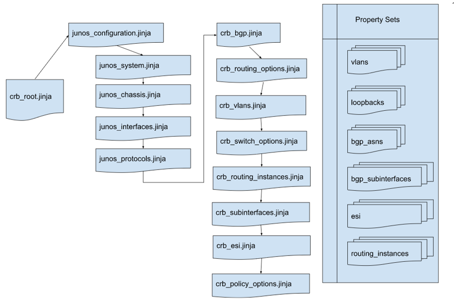

Property Sets are available to any Jinja Config Templates and act as global variables.

The Advanced CRB example is useful to understand how far you can take using jinja and property sets in your design.
Instead of including all of the Config Templates and Property Sets here we will just outline a few examples and discuss them in detail to explain the key takeaways.

First, it important to understand that the crb_root.jinja includes another whole set of jinja which is called junos_configuration.jinja and this is included with the Freeform standard distribution.

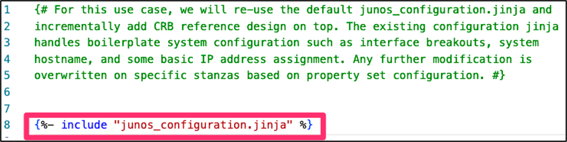

In this example we use the following Property Set, called routing_instances.json:

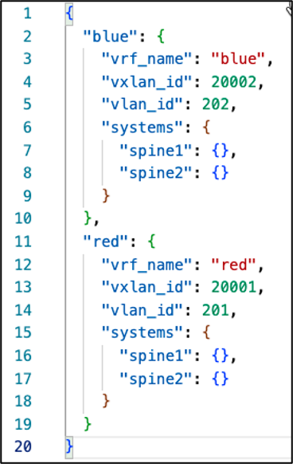

As you can see there are two dictionaries and inside, they have the systems listed that they apply to, so from this we can use the following Jinja to check if the system name matches the property set.  The Jinja for crb_policy_options.jinja is primarily static as it is the same for most devices but if the device is a spine we need to provide external connectivity, so we need to add some more info to that section of the configuration.  The **if** statement below checks if the systems value contains the hostname of the device, and if it does, then it adds the external policy and route filters.

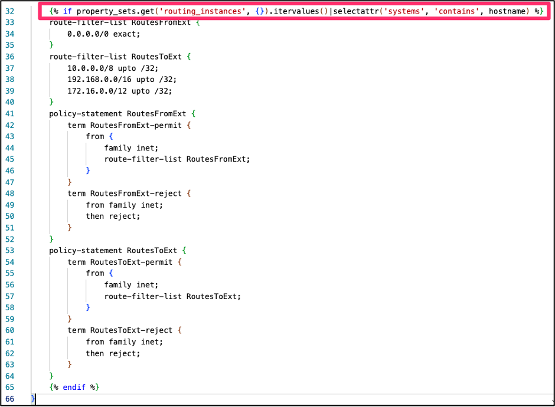

Next, lets take a look at crb_routing_instances.jinja it uses a complex Jinja "**for**" loop that looks up values for all IRB interfaces that are bound to the system selected and renders the interfaces irb.x. The code is documented clearly and shows the power of the "." notation in Jinja with the 'systems.%s.ipv4_address' use.  First, let's examine the vlan "20" in the Property Set vlans.json.

The %s syntax is a string representing selectattr('systems.%s.ipv4_address' % hostname) where hostname is the name of the system.  So, this line basically returns the key 20 in this example:

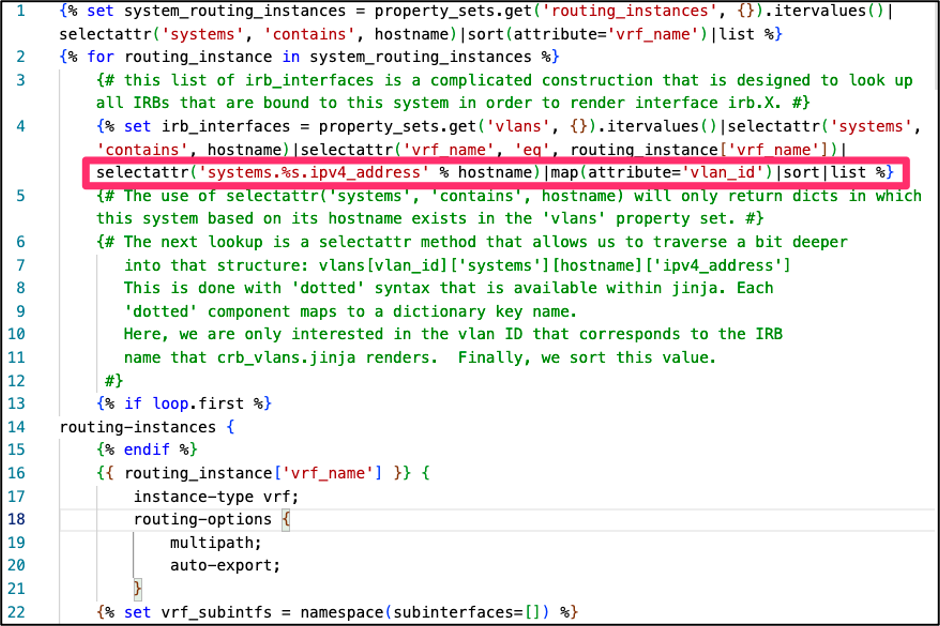

The complete set of Config Templates and Property Sets are available on the GitHub Repository referenced in the Useful Links section.  Most of the Config Templates are self-documented, so you can easily review the code and learn as you go.  Please use these examples of performing certain functions to make your own advanced Config Templates for your use case.

## Summary

Apstra's Data Center Reference Design is designed to be a plug-and-play solution, automating what goes on "under the hood" so that Day-0 through Day-2 operations are simplified. But sometimes our customers need a customized reference design for their data center fabric. Freeform is designed to meet those custom needs, providing you with the tools to specify your own reference design while still leveraging many of Apstra's Intent-Based Analytics capabilities.

This article takes the reader from the basic constructs Freeform uses -- Tags, Device Contexts, Property Sets, and Config Templates -- to creating a simple Freeform blueprint, to a number of advanced case studies.

## Useful links

- Jinja2 Tutorial with Cisco syntax: Jinja2 tutorial - [https://ttl255.com/jinja2-tutorial-part-1-introduction-and-variable-substitution/](https://ttl255.com/jinja2-tutorial-part-1-introduction-and-variable-substitution/)
- Documentation for editing Jinja docs: https://<apstra_ip>/static/jinja_docs/
- The de-facto reference for Jinja syntax and use is the "Jinja Template Designer Documentation". The current supported version of Jinja is 2.10.x: [https://jinja.palletsprojects.com/en/2.10.x/templates/](https://jinja.palletsprojects.com/en/2.10.x/templates/)
- Juniper CloudLabs: http://cloudlabs/
- Apstra Freeform Github repository: [https://github.com/Juniper-SE/apstra-freeform/tree/main/CRB_stage3](https://github.com/Juniper-SE/apstra-freeform/tree/main/CRB_stage3)
- Device Profiles documentation in the Juniper Apstra User Guide: [https://www.juniper.net/documentation/us/en/software/apstra4.1/apstra-user-guide/topics/topic-map/device-profiles-devices.html](https://www.juniper.net/documentation/us/en/software/apstra4.1/apstra-user-guide/topics/topic-map/device-profiles-devices.html)

## Glossary

- ASN: Autonomous System Number
- BGP: Border Gateway Protocol
- CRB: Centrally Routed Bridging
- CRUD: Create, Read, Update, Delete
- DC: Data Center
- DHCP: Dynamic Host Configuration Protocol
- EVPN: Ethernet Virtual Private Network
- IBN: Intent-Based Networking
- Intent-Based Networking: An approach to networking in which you express the "what" (intent or expectations), and the system takes care of the "how."
- IPAM: IP Address Management
- IRB: Integrated Routing and Bridging
- Jinja: A template engine created for Python, but used independently in Apstra Freeform
- JSON: JavaScript Object Notation
- LAG: Link Aggregation Group
- LLDP: Link-Layer Discovery Protocol
- NOS: Network Operating System
- NTP: Network Time Protocol
- SSoT: Single Source of Truth
- VLAN: Virtual Local Area Network
- VXLAN: Virtual Extensible Local Area Network
- XML: eXtensible Markup Language

## Acknowledgements

The following people contributed content or editorial changes to this document: Adam Grochowski, Kathy Tally and Jeff Doyle.
