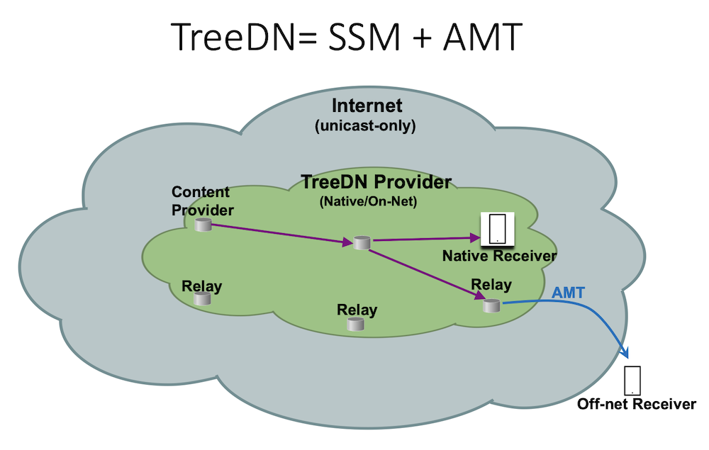
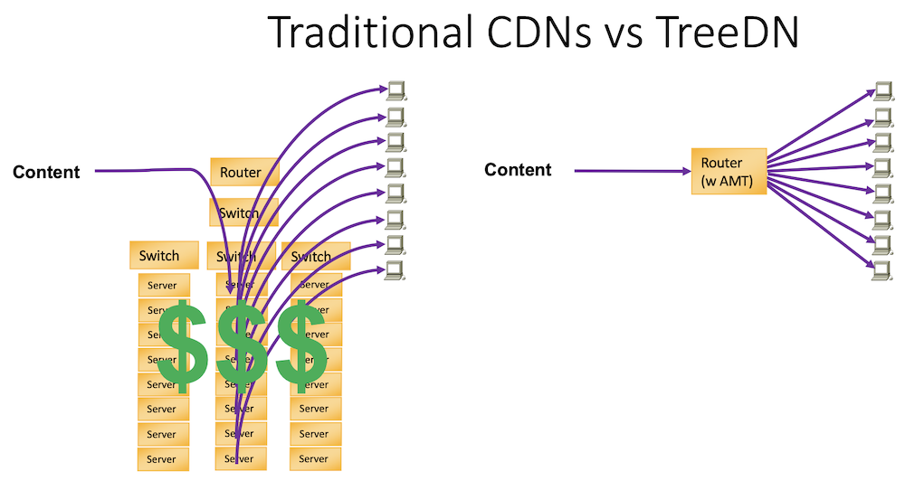

# TreeDN - The Fix for Catastrophically Successful Live Streaming Events

**Lenny Giuliano - 08/21/2025**

Live streaming audiences are now routinely reaching tens of millions of concurrent viewers.  Combined with increasing bitrates for 4K/8K/360deg video, is it time for a new approach to delivering this content?

## Introduction

The boxing match between Mike Tyson and Jake Paul on November 15, 2024 marked a historic moment for the Internet.  The event set records for Internet streaming with a reported [65 million concurrent streams... along with 85,000 complains and two class-action lawsuits](https://www.npr.org/2024/11/21/nx-s1-5198106/is-video-streaming-infrastructure-up-to-par) in response to the widespread technical difficulties for viewers.  This sparked an obvious question: is the Internet up to the challenge of supporting such a massive live streaming audience, or is catastrophic success inevitable for such events?

The predominant delivery mechanism for the Internet is unicast, where each end user receives a separate data stream from the server.  To support multi-destination content at high scale, Content Delivery Networks (CDNs) are usually used to perform replication of content such as streaming video as close as possible to the end viewer.  And for the most part, CDNs have handled the load reasonably well over the past few decades.  But more recently, live streaming has exploded to levels that put a strain on how well (and cost effectively) the Internet can handle this load.  For example, Comcast has reported that Thursday Night Football (TNF)  "[comprises roughly 25 percent of all internet traffic on Thursday nights.](https://www.hollywoodreporter.com/business/business-news/nfl-mlb-nba-streamingtv-sports-1235756577/)"   These mass audience events can no longer be dismissed as "one-offs"; audiences sizes are now [regularly reaching tens of millions of simultaneous viewers](https://www.streamingmediablog.com/2023/10/largestlivestreaminghistory.html), and network resources must be planned and provisioned to accommodate these peaks.

Live content, particular sports, is especially demanding of the network.  Whereas on-demand streaming (eg, movies) can leverage long playout buffers that can conceal underlying network problems like congestion and reconvergence events, such delays for live content could result in receiving a text message from a friend about the game-winning score a minute before watching it on the screen.  Further, on-demand streaming, while voluminous, exhibits predictable, somewhat smooth, daily patterns on the network; with mass audience live events, the network sees sudden spikes as viewers all tune in just as the game is starting.

TreeDN is a tree-based CDN architecture designed to address these live streaming challenges.  Recently published as [RFC9706](https://datatracker.ietf.org/doc/rfc9706/), TreeDN leverages multicast to transport streams efficiently from Content Provider origins to the edge of multicast-enabled networks, where it is tunneled to viewers on unicast-only networks using Automatic Multicast Tunneling (AMT).  AMT builds dynamic tunnels from end users to AMT Relays, which sit at the boundary between the multicast and unicast worlds.

### Wait, multicast?  No one uses multicast on the Internet because it's too complex and difficult to operate!

TreeDN is a hybrid unicast-multicast solution that leverages the best of both worlds - the efficient delivery of multicast and the ubiquity of unicast - to deliver live content far more scalably and cost-effectively than traditional CDNs.  Unicast can also be used to provide feedback channels from the receiver to the Content Provider for things like encryption key exchange, bespoke ad insertion, viewer experience telemetry, etc.  On the multicast side, a simplified, evolved model of delivery, known as Source-Specific Multicast (SSM), is used.  In the past, multicast was indeed complex, difficult to operate, filled with security and addressing headaches; not so with SSM.  Times have changed!

### But how is this any different than CDNs?

CDNs indeed do roughly the same thing - ingest one stream from Content Provider origin and replicate it at the edge of the network to send to individual viewers.  This prevents many (potentially millions) of duplicated streams from having to traverse the network by using a replication point that is topologically close to the viewer.  But those replication points are comprised of racks upon racks of expensive servers, connected to expensive switches and router ports, all of which need to be powered and cooled and occupy precious space in data centers.  With AMT, the replication point can be a router performing this function inline.  The servers, switches and router ports needed to connect to the CDN complexes can all be eliminated, creating a vastly more cost-effective and sustainable (greener!) solution.  Further, it simplifies the tasks of CDNs by eliminating the need for storing and securing the data before forwarding and not needing to participate in key exchange; with TreeDN, the AMT Relays simply forward packets without ever storing them.  In one notable deployment, it was estimated that a multicast-based architecture [reduced the cost of delivery by an order of magnitude compared to traditional CDNs](https://youtu.be/cT_74CRBsQs?t=1592).

In a perfect world, native multicast is available from Content Provider origin to each viewer, and delivery is perfectly efficient such that no link ever carries more than one copy of the stream.  But we don't live in a perfect world, so for now AMT Relays at the edge of a network sitting inline along the path from origin to viewer can replace the racks of expensive, power-hungry servers and switches that provide this replication function today.

### But live streaming seems to work fine now, why change?

Well, viewers of the Tyson-Paul fight might disagree.  But at smaller audience sizes, it's certainly true that the current model is good enough for today's content.  For example, TNF draws an audience of 10-15 million viewers every Thursday evening during the NFL regular season, and it does seem to work well enough (assuming you see nothing concerning with a quarter of all Internet traffic being needed to carry a single game).  But it is worth noting that TNF games are not available in 4K, which would roughly triple the current bitrate.  For those wondering if viewers actually care about 4K, I recommend a visit to your local Best Buy and asking any sales associate in the TV section what they think.  And what about even higher bitrate streams like 360deg video?  The beauty of the Internet is how it makes possible newer, more immersive experiences that previously were unfeasible with incumbent technologies.  In the case of live streaming today, the technology aspires mainly to deliver a viewing experience that is roughly as good as what broadcast television has provided for the last 70 years or so.  TreeDN provides a path to something much better.

### OK, sounds lovely, but is anyone really doing this today?

Yes!  EUMETSAT, a European operational satellite agency, leverages the TreeDN service provided by GEANT, a European Research and Education Network (REN), to deliver real-time critical atmospheric and weather data to organizations across the globe.  [This fascinating short talk on EUMETCast](https://tnc25.geant.org/recordings/?session=s792) describes how this TreeDN deployment supports a number of longstanding challenges for multicast, such as unicast-only receivers, encryption, reliability, public cloud integration and NAT traversal.

EUMETCast is a model for how all players in the value chain can benefit from TreeDN.  For the CDNs, this architecture is radically more cost-effective for live streaming and scales to support larger audiences and higher bitrates.  For Content Providers, these efficiencies should lead to dramatically lower costs for live streaming, as well as opening the door to new live streaming innovations (and thus new revenue streams) that previously weren't technically viable (eg, 360deg Live Streaming).  And for the end user, who generally doesn't care if the content is delivered via unicast or multicast, the end result is a better, potentially more immersive experience.

### What hardware/software is needed to be an AMT Relay?

AMT Relay capabilities are supported on all linecards for all MX platforms in all supported Junos releases.  This is an inline capability built into the Trio chipset- no additional licenses or service blades are needed.  With TreeDN, any existing MX router, with just a few simple lines of configuration, can essentially replace a CDN complex of servers/switches and offer Replication-as-a-Service (RaaS) to Content Providers.

## Conclusion

TreeDN is a new CDN technology designed to scale to support sustainable, high-bitrate live streaming to massive audiences.  Interested in deploying TreeDN?  Contact me at lenny@juniper.net for more info and any questions you might have.

## Useful links

- TNC Talk on EUMETCast: [https://tnc25.geant.org/recordings/?session=s792](https://tnc25.geant.org/recordings/?session=s792)
- RFC 9706: [https://datatracker.ietf.org/doc/rfc9706/](https://datatracker.ietf.org/doc/rfc9706/)
- NANOG Talk on TreeDN: [https://www.youtube.com/watch?v=wRUwsvept-8](https://www.youtube.com/watch?v=wRUwsvept-8)
- Juniper AMT Documentation: [https://www.juniper.net/documentation/us/en/software/junos/multicast/topics/topic-map/mcast-amt.html](https://www.juniper.net/documentation/us/en/software/junos/multicast/topics/topic-map/mcast-amt.html)
- IETF Talk on EUMETCast: [https://youtu.be/cT_74CRBsQs?t=1592](https://youtu.be/cT_74CRBsQs?t=1592)
- The Tyson-Paul fight had tech issues. Can streaming handle more major live events? [https://www.npr.org/2024/11/21/nx-s1-5198106/is-video-streaming-infrastructure-up-to-par](https://www.npr.org/2024/11/21/nx-s1-5198106/is-video-streaming-infrastructure-up-to-par)
- Sports Rights Arms Race Reshapes the Streaming Wars:
[https://www.hollywoodreporter.com/business/business-news/nfl-mlb-nba-streamingtv-sports-1235756577/](https://www.hollywoodreporter.com/business/business-news/nfl-mlb-nba-streamingtv-sports-1235756577/)
- A List of the Largest Live Streaming Events in History and How They Are Measured:
[https://www.streamingmediablog.com/2023/10/largestlivestreaminghistory.html](https://www.streamingmediablog.com/2023/10/largestlivestreaminghistory.html)

## Glossary

- AMT: Automatic Multicast Tunneling
- CDN: Content Delivery Network
- RaaS: Replication-as-a-Service
- REN: Research and Education Network
- SSM: Source-Specific Multicast
- TNF: Thursday Night Football (NFL)
- TreeDN: Tree-based Content Delivery Network

## Acknowledgements

The author wishes to thank Julian Lucek and Rajat Setia for their thoughtful reviews.
