# IP VPN Network Apstra Freeform

**Elisabeth Rodrigues - 09/19/2023**

Illustration of an IP/VPN MPLS network provisioned and operated with Apstra Freeform.

## Introduction

Juniper Apstra is our specialized intent-based networking software. Juniper Apstra reference designs are DataCenter validated designs that provide comprehensive guidance from the initial setup (day 0) to ongoing operations (day 2). Our automation tool assists in the build, validation, deployment and monitoring of multivendor Datacenter fabrics.

In 2022, we introduced a new Apstra design called Freeform. With Apstra Freeform, network architects take charge of creating the topology and configuration templates. This design leverages notable features such as intent-based analytics, configuration validation, NOS management, and Time Voyager.
Presently, Apstra Freeform is not compatible with multiple vendors but works seamlessly with Juniper devices supported by the Datacenter reference designs.

In this blog post, we will demonstrate the application of Apstra Freeform design using a real-world example outside the Datacenter domain: a small MPLS network with IPVPN service.

With this example, we'll observe how the utilization of Apstra's graph database along with resource management and templating can significantly enhance the standardization of configurations. This approach also proves beneficial for managing day 1 and day 2 operations across various networks and topologies.

Disclaimer: I am a network engineer, the templates provided in the document can be optimized.

## Example description

This example utilizes Apstra release 4.1.2.

The automated network is a small MPLS backbone consisting of:

- PE devices completely managed by Apstra:
    - Device lifecycle
    - Complete configuration
    - Health and network monitoring
- CE devices not managed by Apstra
- Resources: IP addresses, ASN, RTs/RDs

Apstra is the Single Source of Truth. The MPLS backbone will use IPv4, OSPF, LDP and full mesh iBGP.

## Network design with the topology editor

We will start the network with 4 PE devices and 3 CE devices.

For that, we create a Freeform Blueprint and then use the topology editor in Staged -> Physical -> Topology.

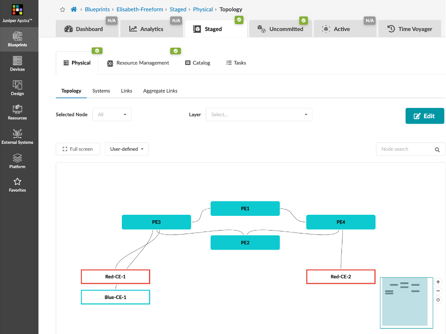

PE devices are Internal Systems and CE devices are External Systems.

In order to facilitate the config automation, we add tags to the devices and the links.

All PEs are tagged "backbone_device"

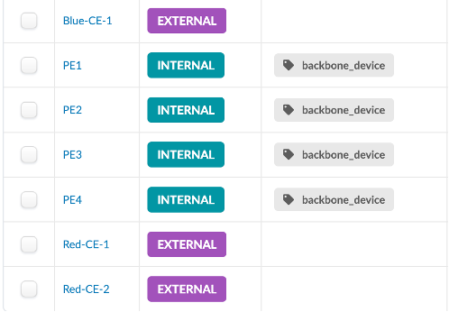

All links are tagged "mpls_interface"

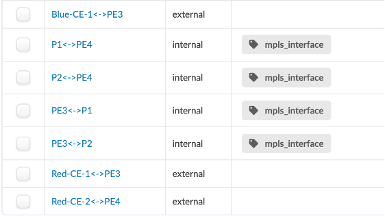

Several tags can be added to each device or link. This method is very useful to identify a group of objects and apply a specific configuration to it.

## Resource management

The resources are the IP addresses, ASN and RT/RD.

In the Resources menu, we create the following pools:

- ASN pool from 65001 to 65099 that will be used to allocate ASN to CE devices.


ASN 65000 is used by the MPLS backbone, we don't need a pool for it
- IP Pool for the loopbacks: 10.0.10.0/24
- IP pool for the links inside the MPLS backbone: 192.168.0.0/24
- IP pool for the links between the CE and PE devices: 172.16.0.0/24
- Integer pool that will be used to generate the RT/RDs for the VRFs

We allocate those pools to the blueprint in Staged -> Resource Management -> Allocation Groups.

In Staged -> Resource management, we organize the resources of our network and use Graph database queries to assign the resources to the devices.

First, we create a group called MyNetwork where we statically assign the backbone ASN 65000.

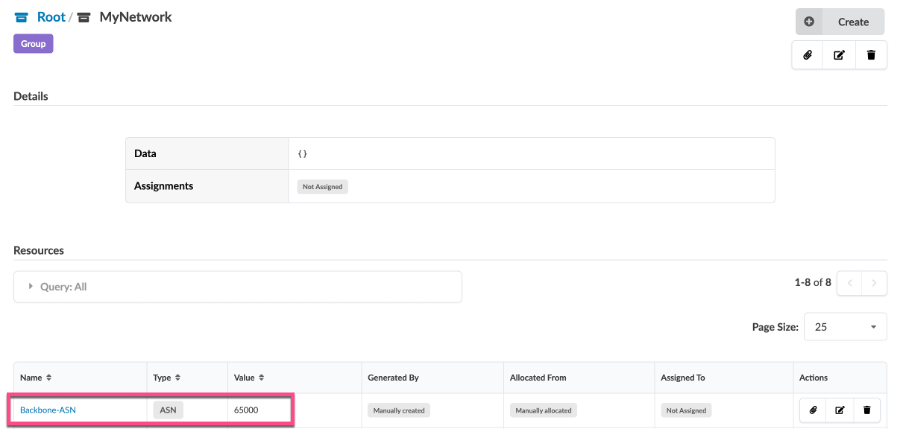

From this group, we create a resource generator called Backbone-Links that will automatically generate a /31 network to each backbone link.

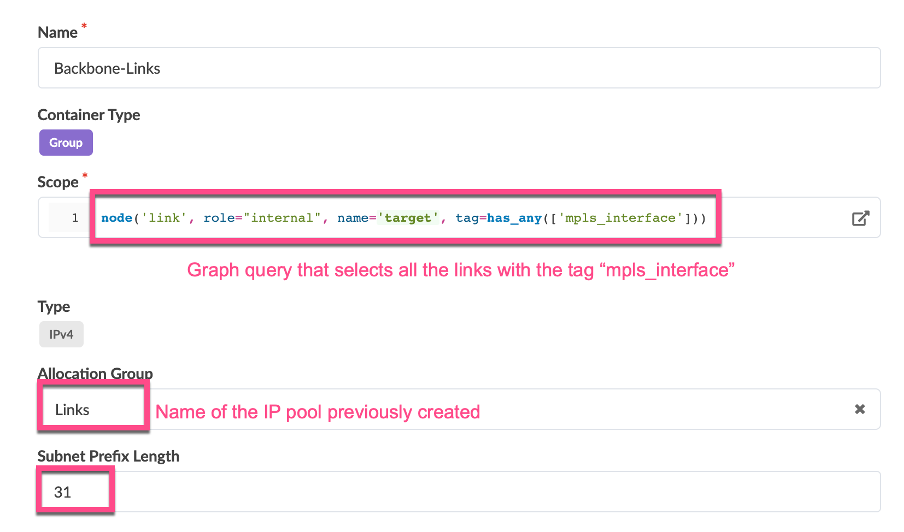

We can see the result directly in the resource management menu and in the links tab:

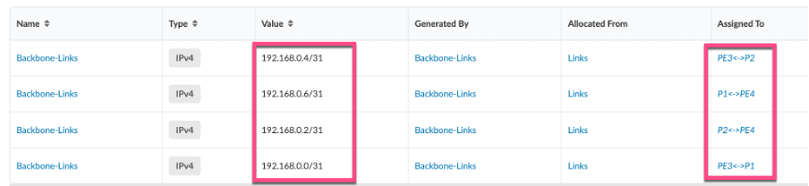

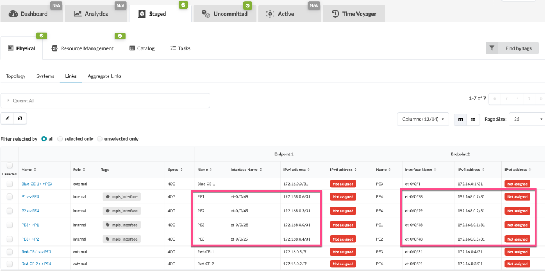

We do the same operation for the links between the CEs and the PEs:

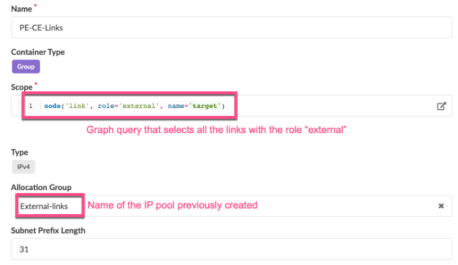

We can see the result directly in the resource management menu and in the links tab:

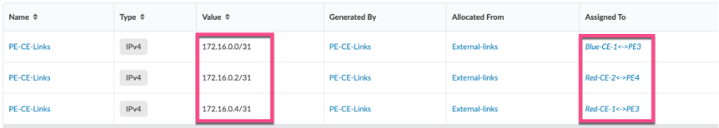

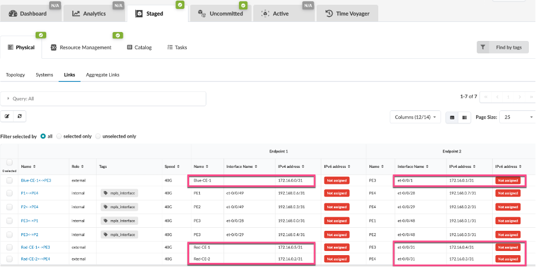

For better clarity in the web UI, we create a group generator for the PEs and another one for the CEs:

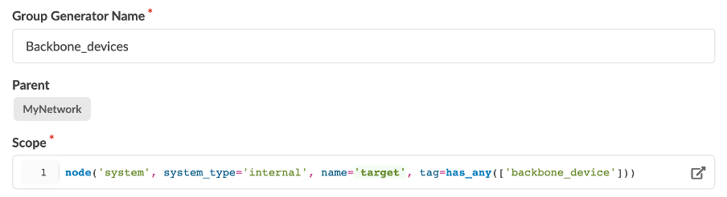

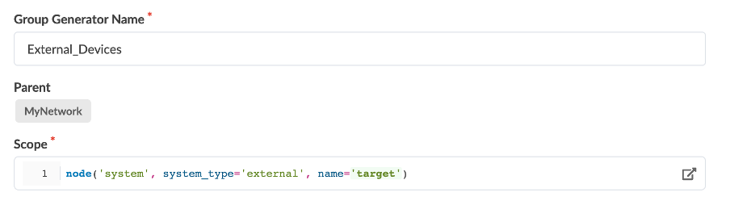

Inside the backbone devices group, we generate a loopback IP:

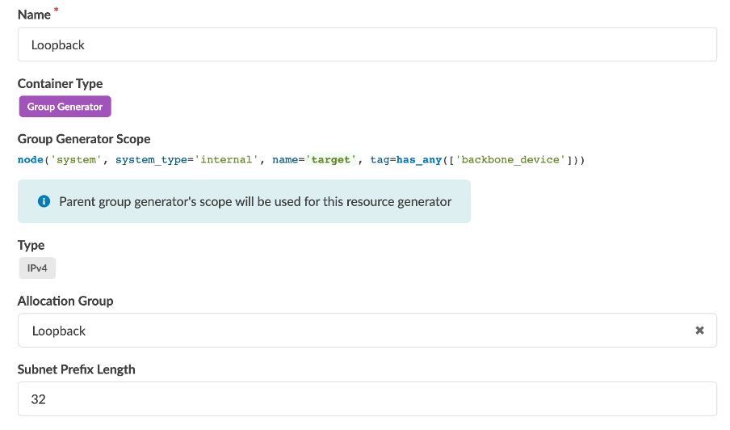

Inside the external devices group, we generate an ASN:

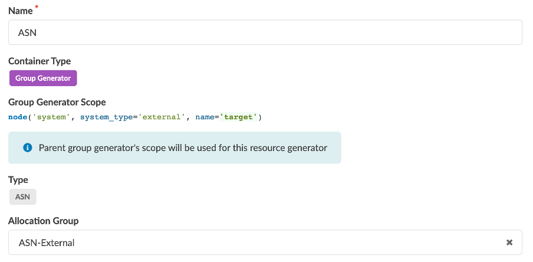

All the generated resources can be monitored in the Resource management menu but also in the Device Context of each device.
We will use the Device Context to access the resources from the config templates.

Here is an example for PE4 :

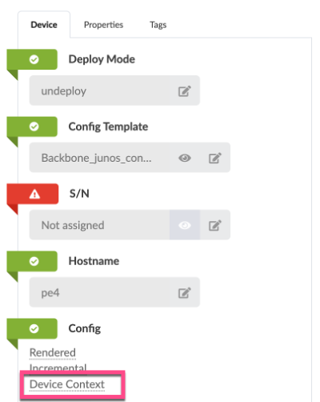

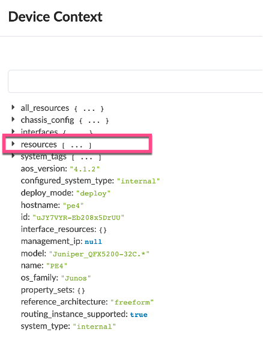

With all resources now generated, we can proceed to generate the configurations for each individual device.

## MPLS Network Config Templates

Our objective is to develop dynamic configuration templates using jinja, which will automatically generate the appropriate configuration file whenever a new device is added to the network.

Let's create the following templates:

- "loopback.jinja"
- "MPLS-OSPF.jinja"
- "ASN.jinja"
- "Fullmesh-iBGP.jinja"
- "Backbone_junos_configuration"

The functions used in those templates to get the resources are documented in the Jinja function reference page provided with the Apstra instance.

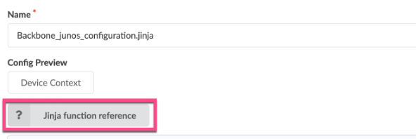

### loopback.jinjaThis template configures the loopback IP as well as the router-id of all backbone devices :

```
 
interfaces {
    lo0 {
        unit 0 {
            family inet {
                address {{loopback_ipv4}};
            }
        }
    }
}

routing-options {
    replace: router-id {{router_id}};
}
```

Configuration rendering on PE3:

```
interfaces {
    lo0 {
        unit 0 {
            family inet {
                address 10.0.10.3/32;
            }
        }
    }
}
routing-options {
    replace: router-id 10.0.10.3;
}
```

### MPLS-OSPF.jinja

This template configures LDP and OSPF on all backbone interfaces as well as the loopback interface:

```
protocols {
    replace: ldp {
    interface lo0.0;
}
    replace: ospf {
        area 0.0.0.0 {
            interface lo0.0 {
                passive;
            }
        }
    }
}


  
interfaces {
    {{interface_name}} {
    unit 0 {
        family mpls;
        }
    }
}
protocols {
    ldp {
        interface {{interface_name}}.0;
    }
    mpls {
        interface {{interface_name}}.0;
    }
    ospf {
        area 0.0.0.0 {
            interface {{interface_name}}.0;
        }
    }
}
  

```

Configuration rendering on PE3:

```
protocols {
    replace: ldp {
    interface lo0.0;
}
    replace: ospf {
        area 0.0.0.0 {
            interface lo0.0 {
                passive;
            }
        }
    }
}
interfaces {
    et-0/0/28 {
    unit 0 {
        family mpls;
        }
    }
}
protocols {
    ldp {
        interface et-0/0/28.0;
    }
    mpls {
        interface et-0/0/28.0;
    }
    ospf {
        area 0.0.0.0 {
            interface et-0/0/28.0;
        }
    }
}
interfaces {
    et-0/0/29 {
    unit 0 {
        family mpls;
        }
    }
}
protocols {
    ldp {
        interface et-0/0/29.0;
    }
    mpls {
        interface et-0/0/29.0;
    }
    ospf {
        area 0.0.0.0 {
            interface et-0/0/29.0;
        }
    }
}
```

### ASN.jinja

This template configures the ASN on all backbone devices:

```


routing-options {
    replace: autonomous-system  {{asn}};
}
```

Configuration rendering on PE3:

```
routing-options {
    replace: autonomous-system  65000;
}
```

### Fullmesh-iBGP.jinja

This template create a full mesh iBGP peering between all PE devices:

```


protocols {
    bgp {
        group full_mesh {
            type internal;
            local-address {{local_IP_no_mask}};
            family inet-vpn {
                unicast;
            }
        }
    }
}
protocols {
    bgp {
        group full_mesh {
        
            
            
                
                neighbor {{IP}};
            
            
        
        }
    }
}
```

Configuration rendering on PE3:

```
protocols {
    bgp {
        group full_mesh {
            type internal;
            local-address 10.0.10.3;
            family inet-vpn {
                unicast;
            }
        }
    }
}
protocols {
    bgp {
        group full_mesh {
                neighbor 10.0.10.0;
                neighbor 10.0.10.2;
                neighbor 10.0.10.1;
        }
    }
}
```

### Backbone_junos_configuration

This template includes all templates including the initial template provided by default with the Apstra instance.

This template will be assigned to all devices.

```
{# junos_system.jinja handles the system hostname #}


{# junos_chassis.jinja handles chassis options, such as fpc config for
   channelized port break-outs on certain device platforms.  This also handles
   aggregate-devices ethernet device-count for port-channel (aeX) interfaces. #}


{# junos_interfaces.jinja handles front-panel interface configuration, including
   interface description, ipv4/ipv6 address assignment, and physical link properties
   derived from device profiles. #}


{# junos_protocols.jinja initiates LLDP collection on all ports for telemetry
   purposes #}





```

## IPVPN design and configuration

This network provides IPVPN services. Let's design our Freeform Blueprint to provision IPVPNs.

In the resource management menu, we create a group for each IPVPN : Blue_VRF and Red_VRF.  Each VRF needs an RT, an RD, a loopback IP and PE-CE interfaces.  We'll generate the RT/RD with the RT_RD integer previously created and we'll generate the loopback IP with a resource generator.

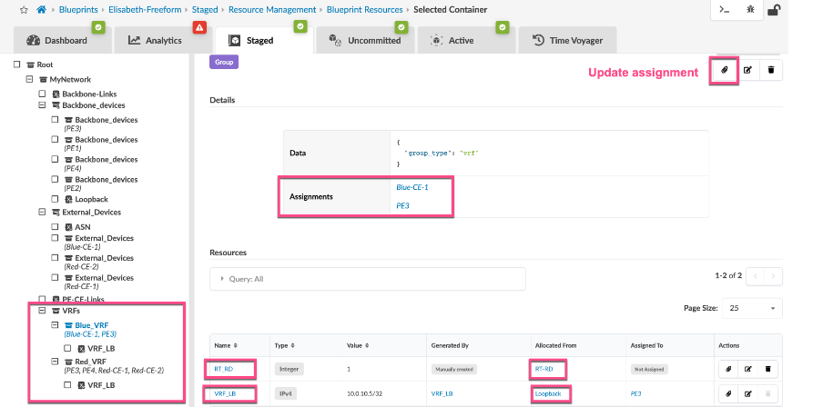

Here is the jinja template to configure the VRFs:

```


    
    
    
    
        
        
        
            
         
    
    
interfaces {
    lo0 {
        unit {{RT_RD}} {
            family inet {
                    address {{VRF_loopback}};
            }
        }
    }
}
routing-instances {{ns.name}} {
    instance-type vrf;    
    interface lo0.{{RT_RD}};
    route-distinguisher {{loopback_no_mask}}:{{RT_RD}};
    vrf-target target:{{asn}}:{{RT_RD}};
    vrf-table-label;
    
     
        
            
                
                    
    interface {{ interface_name }}.0;
    protocols {
        bgp {
            group CE {
                        
                peer-as {{peer_asn}};
                neighbor {{nb['ipv4_address']}};
            }
        }
    }
                    
                
             
        
    
}
       

```

Here is the rendered configuration for Blue_VRF on PE3:

```
interfaces {
    lo0 {
        unit 1 {
            family inet {
                    address 10.0.10.5/32;
            }
        }
    }
}
routing-instances Blue_VRF {
    instance-type vrf;    
    interface lo0.1;
    route-distinguisher 10.0.10.3:1;
    vrf-target target:65000:1;
    vrf-table-label;
    interface et-0/0/1.0;
    protocols {
        bgp {
            group CE {
                peer-as 65003;
                neighbor 172.16.0.0;
            }
        }
    }
}
```

## Operations and troubleshooting

By default, Freeform provides many monitoring features. For example, Apstra checks the status of the network against the intent described in the Freeform blueprint: configuration files, interfaces state, cabling, hostname...

Here is the main dashboard:

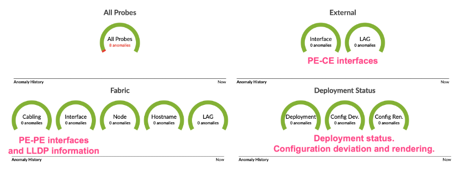

In the Analytics dashboard, Apstra monitors much more information: health of the devices (CPU, memory, temperature, power supplies, fans...).

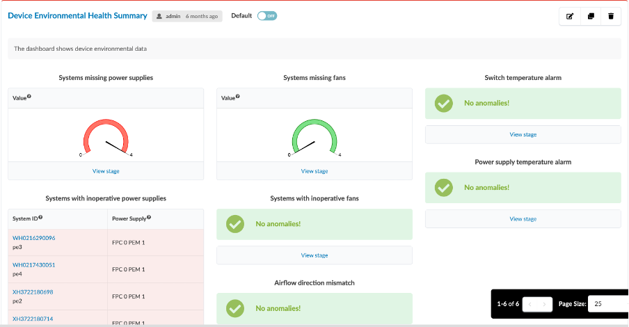

All interface counters are monitored and stored allowing the administrator the observation of network's bandwidth and configuring an anomaly threshold:

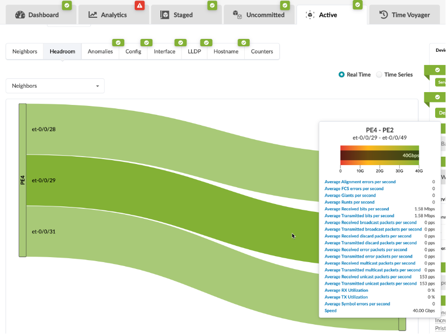

It is also easy to monitor other states like BGP peerings, optics.

In this example, we monitor BGP peerings inside RED_VRF:


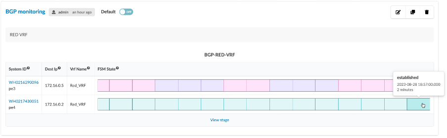

## Conclusion

Freeform proves to be a robust and powerful automation tool that helps you configure, operate and monitor any network composed of Juniper supported devices.

Apstra Freeform offers numerous other interesting features beyond what has been presented in this blogpost:

- device management with ZTP, inventory and NOS upgrade,
- time voyager that allows to rollback the network to any saved state,
- more analytics and Junos schema driven telemetry
- use of property sets to enrich jinja templates
- RBAC
- logging

## Glossary

- ASN: Autonomous System Number
- BGP: Border Gateway Protocol
- ESI: Ethernet Segment Identifier
- EVPN: Ethernet Virtual Private Network
- MPLS: MultiProtocol Label Switching
- NOS: Network Operating System
- RBAC: Role Based Access Control
- RD: Route Distinguisher
- RT: Route Targer
- ZTP: Zero Touch Provisionning

## Acknowledgments

I would like to thank Andy Ford for reviewing this article.
