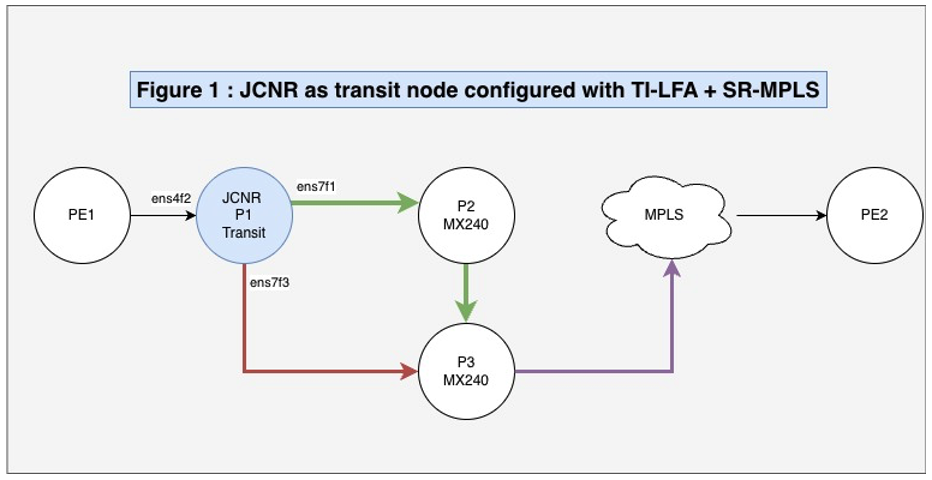
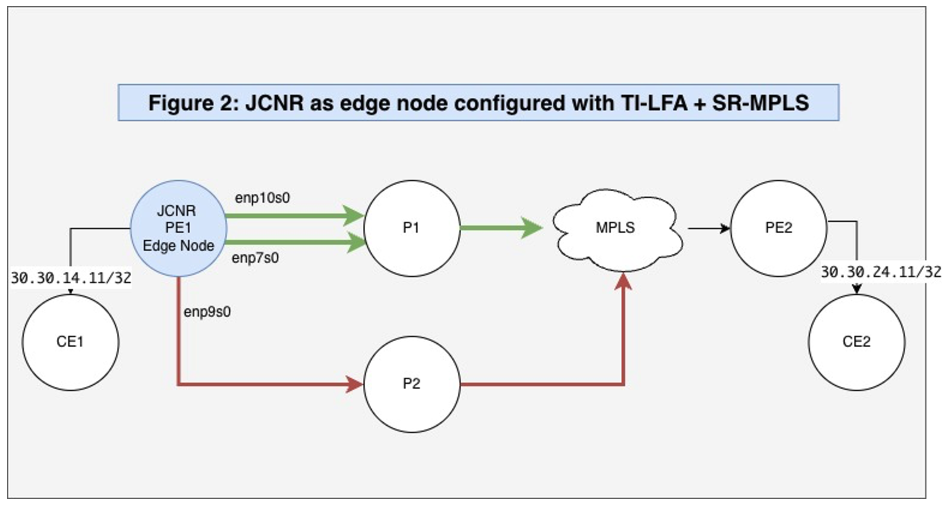

# JCNR and Topology-Independent Loop-Free Alternates (TI-LFA)

**Lavanya Kumar Ambatipudi - 11/15/2025**

The Juniper Cloud-Native Router (JCNR) integrates modern forwarding and resilience mechanisms, specifically Segment Routing with MPLS (SR-MPLS) and Topology-Independent Loop-Free Alternate (TI-LFA), to deliver sub-50 ms failover and full coverage in cloud-scale IP/MPLS networks. It presents two deployment use-cases (transit node and edge node) demonstrating how JCNR implements TI-LFA within SR-MPLS environments to achieve high availability and operational efficiency.

## Introduction

The Juniper Cloud-Native Router (JCNR) represents a transformative approach to modern networking, designed to meet the demands of cloud-scale environments with agility, scalability, and operational efficiency. Built on a microservices architecture and leveraging containerized network functions, JCNR enables service providers and enterprises to deploy routing capabilities in a flexible, programmable, and highly resilient manner. Unlike traditional hardware-centric routers, JCNR operates within cloud-native platforms such as Kubernetes, allowing seamless integration with DevOps workflows. This innovation empowers network operators to deliver high-performance routing services while optimizing resource utilization and reducing operational overhead.

This document outlines TI-LFA and SR-MPLS solution offered by JCNR.

## Technical

Segment Routing with MPLS (SR-MPLS) is a modern forwarding paradigm that simplifies network operations by encoding the path a packet should follow directly into the packet header using MPLS labels. Each segment in the path is represented by a Segment Identifier (SID), which can denote a node, an adjacency, or a service. SR-MPLS eliminates the need for complex signaling protocols like RSVP-TE or LDP, enabling scalable and flexible traffic engineering. It integrates seamlessly with existing IGPs (OSPF, IS-IS) and supports centralized or distributed control models, making it suitable for both service provider and enterprise networks.

Topology-Independent Loop-Free Alternate (TI-LFA) is a fast reroute (FRR) mechanism designed to provide sub-50ms protection against link or node failures in SR-MPLS networks. Unlike traditional LFA and remote LFA, which are topology-dependent and may not offer complete coverage, TI-LFA guarantees 100% coverage by leveraging the post-convergence path as the backup route. It uses precomputed segment routing label stacks to construct loop-free alternate paths, ensuring rapid failover without transient congestion or suboptimal routing.

Together, **SR-MPLS and TI-LFA** provide a robust foundation for building resilient, scalable, and programmable IP/MPLS networks, capable of meeting stringent SLA requirements and supporting advanced services like traffic engineering, service chaining, and network slicing.

## JCNR, SR-MPLS and TI-LFA

The Juniper Cloud-Native Router (JCNR) can be deployed as an edge router or a transit router in modern IP/MPLS networks to deliver high-performance, resilient, and programmable routing services. When positioned at the network edge, JCNR leverages **Segment Routing with MPLS (SR-MPLS)** to simplify path computation by encoding routing decisions directly into packet headers using Segment Identifiers (SIDs). This eliminates the need for complex signaling protocols and enables centralized control via IGPs like IS-IS and OSPF.

To ensure rapid failover and service continuity, JCNR integrates **Topology-Independent Loop-Free Alternate (TI-LFA)** mechanisms. TI-LFA provides sub-50ms protection against link and node failures by precomputing backup paths using segment routing label stacks. These backup paths are guaranteed to be loop-free and topology-independent, offering 100% coverage even in complex network scenarios. Though JCNR is cloud native software router, ***it offers sub-50ms** failover matching provider grade offerings for cloud.*

This solution empowers service providers and enterprises to build robust edge architectures that are agile, fault-tolerant, and optimized for cloud-era networking demands.

## TI-LFA and SR-MPLS Solution with JCNR

This article presents two solution scenarios that demonstrate JCNR's support for Topology-Independent Loop-Free Alternate (TI-LFA) in conjunction with Segment Routing over MPLS (SR-MPLS):

- **Use Case 1**: JCNR deployed as a transit node within an SR-MPLS network, providing Fast Reroute (FRR) capabilities via TI-LFA. This configuration is illustrated in Figure 1.
- **Use Case 2**: JCNR functioning as an edge node delivering L3VPN services, integrated with SR-MPLS and TI-LFA-based FRR. This setup is depicted in Figure 2.

In both use cases, the primary forwarding path is represented by green lines, while the backup path is shown in red, highlighting JCNR's ability to ensure rapid failover and service continuity.

## Use Case 1: JCNR as transit node in SR-MPLS network



This use case illustrates JCNR functioning as a transit node within a broader SR-MPLS network, where label switching is performed. As a transit node, JCNR (P1) receives packets with multiple MPLS labels, which are applied by PE1 based on the intended path. JCNR uses the outer label for forwarding decisions. In this topology, JCNR interoperates with MX240 routers (P2 and P3) and is configured with IS-IS and TI-LFA to support fast reroute (FRR) across two paths. This scenario demonstrates JCNR's capability to deliver TI-LFA protection in an SR-MPLS environment using IS-IS as the IGP.

In this topology, JCNR (P1) FRR state has two paths. One primary and one secondary.

- Primary path: P1 --> P2 --> P3
- Secondary path: P1 --> P3

In this fast reroute (FRR) scenario, JCNR (P1) operates with a single primary and a single secondary path. As a transit node in the SR-MPLS network, it expects incoming packets with MPLS label 401003, applied by PE1 to guide the packet's path.

The primary path utilizes interface ens7f1. Upon failure of ens7f1, JCNR (P1) initiates an FRR within 50 milliseconds, switching traffic to the secondary interface ens7f3. For enhanced observability and troubleshooting, JCNR logs the exact time taken to trigger the FRR.

The configuration and data path states, both before and after the FRR event, are detailed below.

### Configuration

```
set interfaces ens4f2 unit 0 family inet address 50.1.1.1/24
set interfaces ens4f2 unit 0 family inet6 address 5050::1/120
set interfaces ens4f2 unit 0 family iso
set interfaces ens7f1 unit 0 family inet address 21.1.1.1/24
set interfaces ens7f1 unit 0 family inet6 address 2001::1/64
set interfaces ens7f1 unit 0 family iso
set interfaces ens7f3 unit 0 family inet address 11.1.1.1/24
set interfaces ens7f3 unit 0 family inet6 address 1001::1/64
set interfaces ens7f3 unit 0 family iso
set interfaces lo0 unit 0 family inet address 100.100.100.100/32
set interfaces lo0 unit 0 family inet6 address abcd::100:100:100:100/128
set interfaces lo0 unit 0 family iso address 49.0001.000a.0a0a.0a00
set interfaces lo0 unit 0 family mpls
set policy-options policy-statement pplb then load-balance per-packet
set policy-options policy-statement pplb then accept
set policy-options policy-statement prefix-sid term 1 from route-filter 100.100.100.100/32 exact
set policy-options policy-statement prefix-sid term 1 then prefix-segment index 1000
set policy-options policy-statement prefix-sid term 1 then prefix-segment node-segment
set policy-options policy-statement prefix-sid term 1 then accept
set policy-options policy-statement prefix-sid term 2 from route-filter abcd::100:100:100:100/128 exact
set policy-options policy-statement prefix-sid term 2 then prefix-segment index 2000
set policy-options policy-statement prefix-sid term 2 then prefix-segment node-segment
set policy-options policy-statement prefix-sid term 2 then accept
set routing-options router-id 100.100.100.100
set routing-options autonomous-system 100
set routing-options forwarding-table export pplb
set routing-options forwarding-table channel vrouter export pplb
set protocols isis interface ens7f1 level 2 post-convergence-lfa
set protocols isis interface ens7f3 level 2 post-convergence-lfa
set protocols isis interface lo0.0 passive
set protocols isis source-packet-routing srgb start-label 400000
set protocols isis source-packet-routing srgb index-range 64000
set protocols isis source-packet-routing node-segment ipv4-index 1000
set protocols isis source-packet-routing node-segment ipv6-index 2000
set protocols isis source-packet-routing explicit-null
set protocols isis level 2 wide-metrics-only
set protocols isis level 1 disable
set protocols isis backup-spf-options use-post-convergence-lfa maximum-labels 5
set protocols isis backup-spf-options use-post-convergence-lfa maximum-backup-paths 5
set protocols isis export prefix-sid
set protocols isis strict-dual-isis holdown 15
set protocols mpls label-range dynamic-label-range 500000 550000
set protocols mpls label-range label-limit 8000
set protocols mpls interface ens7f3
set protocols mpls interface ens7f1
set protocols mpls interface ens4f2
set protocols mpls interface lo0.0
```

### ISIS Adjacency

```
root@warthogserver-g.englab.juniper.net# run show isis adjacency
Interface             System         L State         Hold (secs) SNPA
ens7f1                rpd-warthog-mx240-b 2 Up                23  3c:61:4:3a:7d:a0
ens7f3                rpd-warthog-mx240-a 2 Up                 8  44:f4:77:bd:ed:a1
```

### MPLS label (401003) state from JCNR Control Path before FRR trigger

Let's examine initial state before FRR trigger. We will see the label 401003 has two paths. One primary and one secondary.

```
root@warthogserver-g.englab.juniper.net> show route table mpls.0 label 401003 detail

mpls.0: 24 destinations, 24 routes (24 active, 0 holddown, 0 hidden)
401003 (1 entry, 1 announced)
        *L-ISIS Preference: 14
                Level: 2
                Next hop type: Router, Next hop index: 0
                Address: 0x56169790351c
                Next-hop reference count: 1, Next-hop session id: 0
                Kernel Table Id: 0
                Next hop: 21.1.1.2 via ens7f1 weight 0x1, selected
                Label operation: Swap 0
                Load balance label: Label 0: None;
                Label element ptr: 0x56169a228f78
                Label parent element ptr: (nil)
                Label element references: 4
                Label element child references: 0
                Label element lsp id: 0
                Session Id: 0
                Next hop: 11.1.1.2 via ens7f3 weight 0xf000
                Label operation: Swap 401003
                Load balance label: Label 401003: None;
                Label element ptr: 0x56169a229998
                Label parent element ptr: (nil)
                Label element references: 4
                Label element child references: 0
                Label element lsp id: 0
                Session Id: 0
                State: <Active Int>
                Local AS:   100
                Age: 10:49      Metric: 10
                Validation State: unverified
                ORR Generation-ID: 0
                Task: IS-IS
                Announcement bits (3): 1-KRT MFS 2-KRT 4-KRT-vRouter
                AS path: I
                Thread: junos-main
```

### FRR state from JCNR data path before FRR trigger

The JCNR data path includes a utility called frr, which displays the Fast Reroute (FRR) status for each interface in the system. In this scenario, VIF 3 serves as the primary interface and VIF 5 as the secondary. The output below shows FRR entries for both interfaces, where each set of values represents the composite and component next-hops used for FRR.

The mpls command reveals the path associated with label 401003 prior to an FRR trigger. In this topology, the label is mapped to a composite next-hop comprising one primary and one secondary path. The nhchain utility provides a detailed view of the sequence of next-hops used in forwarding.

```
bash-5.1# frr --dump
FRR VIF Entry Table

Flags: Delete Marked=Dm, Active=A
VifID    Type      Flags    Count    NH(Composite,Component)
------------------------------------------------------------
    4    VIF                  0
    5    VIF         A       12    (30,46), (69,46), (70,43), (73,46), (74,45), (75,44), (78,45), (79,45), (51,46), (52,46), (53,45), (57,45),
    3    VIF         A       12    (30,28), (69,28), (70,28), (73,28), (74,29), (75,29), (78,29), (79,29), (51,28), (52,24), (53,29), (57,25),

bash-5.1# mpls --get 401003
MPLS Input Label Map

   Label    NextHop
-------------------
  401003        51
bash-5.1# nhchain --get 51
Id:51         Type:Composite      Fmly: AF_INET  Rid:0  Ref_cnt:2          Vrf:0
              Next NH:0 NH Label:0 NH Hit Count:7670074
              Flags:Valid, Policy, Weighted Ecmp, FRR, Etree Root,
              Sub NH(label): 28(0) 46(401003)
              ECMP Weights: 1, 61440,
              FRR State: 0 -> 1 FRR Updates: 0
              FRR State Valid List: 1, 1,

Id:28         Type:Tunnel         Fmly: AF_MPLS  Rid:0  Ref_cnt:6          Vrf:0
              Next NH:24 NH Label:0 NH Hit Count:750843155
              Flags:Valid, Policy, Etree Root, MPLS,
              Oif:3 Len:14 Data:3c 61 04 3a 7d a0 40 a6 b7 96 46 c9 88 47 Number of Transport Labels:0

Id:24         Type:Encap          Fmly:AF_INET/6  Rid:0  Ref_cnt:6          Vrf:0
              Next NH:-1 NH Label:0 NH Hit Count:750842605
              Flags:Valid, Policy, Etree Root,
              EncapFmly:0806 Oif:3 Len:14
              Encap Data: 3c 61 04 3a 7d a0 40 a6 b7 96 46 c9

Id:46         Type:Tunnel         Fmly: AF_MPLS  Rid:0  Ref_cnt:6          Vrf:0
              Next NH:43 NH Label:0 NH Hit Count:2404
              Flags:Valid, Policy, Etree Root, MPLS,
              Oif:5 Len:14 Data:44 f4 77 bd ed a1 40 a6 b7 96 46 cb 88 47 Number of Transport Labels:0

Id:43         Type:Encap          Fmly:AF_INET/6  Rid:0  Ref_cnt:265        Vrf:0
              Next NH:-1 NH Label:0 NH Hit Count:3048470
              Flags:Valid, Policy, Etree Root,
              EncapFmly:0806 Oif:5 Len:14
              Encap Data: 44 f4 77 bd ed a1 40 a6 b7 96 46 cb

bash-5.1# vif --get 5
Vrouter Interface Table

vif0/5      PCI: 0000:ca:00.3 (Speed 10000, Duplex 1) NH: 14 MTU: 1500
            Type:Physical HWaddr:40:a6:b7:96:46:cb IPaddr:11.1.1.1
            IP6addr:1001::1
            DDP: ON SwLB: OFF
            Vrf:0 Mcast-Vrf:65535 Flags:TcL3Vof QOS:0 Ref:17
            RX port   packets:59079 errors:0
            RX queue errors to lcore 0 0 0 0 0 0 0 0 0 0 0 0 0 0 0 0 0 0 0
            Fabric Interface: 0000:ca:00.3  Status: UP  Driver: net_ice
            RX packets:59079  bytes:7731124 errors:0
            TX packets:3066241  bytes:379828109 errors:0
            Drops:0
            TX port   packets:3066241 errors:0

bash-5.1# vif --get 3
Vrouter Interface Table

vif0/3      PCI: 0000:ca:00.1 (Speed 10000, Duplex 1) NH: 10 MTU: 1500
            Type:Physical HWaddr:40:a6:b7:96:46:c9 IPaddr:21.1.1.1
            IP6addr:2001::1
            DDP: ON SwLB: OFF
            Vrf:0 Mcast-Vrf:65535 Flags:TcL3Vof QOS:0 Ref:17
            RX port   packets:18202 errors:0
            RX queue errors to lcore 0 0 0 0 0 0 0 0 0 0 0 0 0 0 0 0 0 0 0
            Fabric Interface: 0000:ca:00.1  Status: UP  Driver: net_ice
            RX packets:18202  bytes:2008144 errors:0
            TX packets:1073659260  bytes:128839646669 errors:0
            Drops:0
            TX port   packets:1073659260 errors:0
```

### FRR state from data path after primary path went down

When the primary interface (ens7f1) goes down, label 401003 is redirected to the secondary path through an FRR trigger in the data plane. This is followed by control plane convergence, which updates the routing to use the secondary path exclusively---eliminating the need for an FRR state, as no primary path remains.

The data path output below reflects the JCNR state after the failover. The frr command confirms that interface VIF 3 (ens7f1) no longer maintains an FRR entry for label 401003 next-hops we saw earlier.

```
bash-5.1# mpls --get 401003
MPLS Input Label Map

   Label    NextHop
-------------------
  401003        49
bash-5.1# nhchain --get 49
Id:49         Type:Tunnel         Fmly: AF_MPLS  Rid:0  Ref_cnt:2          Vrf:0
              Next NH:43 NH Label:0 NH Hit Count:433948
              Flags:Valid, Policy, Etree Root, MPLS,
              Oif:5 Len:14 Data:44 f4 77 bd ed a1 40 a6 b7 96 46 cb 88 47 Number of Transport Labels:1 Transport Labels:401003,

Id:43         Type:Encap          Fmly:AF_INET/6  Rid:0  Ref_cnt:270        Vrf:0
              Next NH:-1 NH Label:0 NH Hit Count:3484868
              Flags:Valid, Policy, Etree Root,
              EncapFmly:0806 Oif:5 Len:14
              Encap Data: 44 f4 77 bd ed a1 40 a6 b7 96 46 cb

bash-5.1# frr --dump
FRR VIF Entry Table

Flags: Delete Marked=Dm, Active=A
VifID    Type      Flags    Count    NH(Composite,Component)
------------------------------------------------------------
    4    VIF                  0
    5    VIF         A        2    (52,46), (57,45),
    3    VIF         A        2    (52,24), (57,25),
```

### FRR logs from JCNR data path after primary link went down

The log file located at /var/log/contrail/contrail-vrouter-dpdk.log captures detailed FRR trigger events within the JCNR data path, including the time taken to activate the FRR state. These logs are instrumental in verifying whether FRR was successfully triggered and measuring its responsiveness.

JCNR supports sub-50ms failover, and in the example provided, next-hop 28, designated as the primary in the FRR table, is processed by the JCNR data path during the failover event, confirming the rapid transition.

```
2025-11-05 21:23:49,121 DPCORE: vr_nexthop_frr_cb_function: FRR turnaround time for vif: 3, composite_nh: 30, component_nh: 28: 0 ms, Current changed:false Next changed:false
2025-11-05 21:23:49,121 DPCORE: vr_nexthop_frr_cb_function: FRR turnaround time for vif: 3, composite_nh: 69, component_nh: 28: 0 ms, Current changed:false Next changed:false
2025-11-05 21:23:49,121 DPCORE: vr_nexthop_frr_cb_function: FRR turnaround time for vif: 3, composite_nh: 70, component_nh: 28: 0 ms, Current changed:false Next changed:false
2025-11-05 21:23:49,121 DPCORE: vr_nexthop_frr_cb_function: FRR turnaround time for vif: 3, composite_nh: 73, component_nh: 28: 0 ms, Current changed:false Next changed:false
2025-11-05 21:23:49,121 DPCORE: vr_nexthop_frr_cb_function: FRR turnaround time for vif: 3, composite_nh: 74, component_nh: 29: 0 ms, Current changed:false Next changed:false
2025-11-05 21:23:49,121 DPCORE: vr_nexthop_frr_cb_function: FRR turnaround time for vif: 3, composite_nh: 75, component_nh: 29: 0 ms, Current changed:false Next changed:false
2025-11-05 21:23:49,121 DPCORE: vr_nexthop_frr_cb_function: FRR turnaround time for vif: 3, composite_nh: 78, component_nh: 29: 0 ms, Current changed:false Next changed:false
2025-11-05 21:23:49,121 DPCORE: vr_nexthop_frr_cb_function: FRR turnaround time for vif: 3, composite_nh: 79, component_nh: 29: 0 ms, Current changed:false Next changed:false
2025-11-05 21:23:49,121 DPCORE: vr_nexthop_frr_cb_function: FRR turnaround time for vif: 3, composite_nh: 51, component_nh: 28: 1 ms, Current changed:true Next changed:false
2025-11-05 21:23:49,121 DPCORE: vr_nexthop_frr_cb_function: FRR turnaround time for vif: 3, composite_nh: 52, component_nh: 24: 1 ms, Current changed:true Next changed:false
2025-11-05 21:23:49,121 DPCORE: vr_nexthop_frr_cb_function: FRR turnaround time for vif: 3, composite_nh: 53, component_nh: 29: 1 ms, Current changed:true Next changed:false
2025-11-05 21:23:49,121 DPCORE: vr_nexthop_frr_cb_function: FRR turnaround time for vif: 3, composite_nh: 57, component_nh: 25: 1 ms, Current changed:true Next changed:false
2025-11-05 21:23:49,121 DPCORE: VR FRR: FRR time for vif: 3 is 4 ms
2025-11-05 21:23:49,121 VROUTER: Port ID: 2 Link Status: DOWN intf_name:0000:ca:00.1 drv_name:net_ice
```

This use case demonstrates JCNR operating as a transit node in an SR-MPLS network, delivering TI-LFA protection with a single primary and a single secondary path. As confirmed by the logs, TI-LFA was successfully triggered within sub-50ms.

## Use Case 2: JCNR as an edge node in SR-MPLS network



In this use case, JCNR functions as an edge router delivering VPN services. Toward the core network, it is configured with OSPF and Segment Routing over MPLS (SR-MPLS), with OSPF providing Fast Reroute (FRR) through TI-LFA. BGP is configured toward PE2 to support VPN connectivity.

Additionally, TI-LFA node protection is enabled on JCNR. Although node protection is an upcoming feature slated for future releases, this document highlights its planned capabilities along with new supporting utilities.

This scenario also showcases JCNR's support for TI-LFA FRR with multiple primary paths and a single secondary path. The topology includes the following programmed path combinations:

- Primary 1: PE1--enp10s0 --> P1--> <MPLS Network> --> PE2
- Primary 2: PE1--enp7s0 --> P1 --> <MPLS Network> --> PE2
- Secondary 1: PE1--enp9s0 --> P2 --> <MPLS Network> --> PE2

The following section provides reference outputs for the configuration, protocol state, and FRR state from the JCNR data path corresponding to the described topology.

### Configuration

```
set groups cni routing-instances untrust instance-type vrf
set groups cni routing-instances untrust routing-options rib untrust.inet6.0 static route 181:1:1::1/128 qualified-next-hop 181:1:1::1 interface vhostge-0_0_0-18521225-6723-43f
set groups cni routing-instances untrust routing-options static route 181.1.1.1/32 qualified-next-hop 181.1.1.1 interface vhostge-0_0_0-18521225-6723-43f
set groups cni routing-instances untrust routing-options static route 111.1.1.0/24 qualified-next-hop 181.1.1.1 interface vhostge-0_0_0-18521225-6723-43f
set groups cni routing-instances untrust interface vhostge-0_0_0-18521225-6723-43f
set groups cni routing-instances untrust route-distinguisher 10:10
set groups cni routing-instances untrust vrf-target target:10:10
set groups cni routing-instances trust instance-type vrf
set groups cni routing-instances trust routing-options rib trust.inet6.0 static route 181:2:1::1/128 qualified-next-hop 181:2:1::1 interface vhostge-0_0_1-18521225-6723-43f
set groups cni routing-instances trust routing-options static route 1.21.1.1/32 qualified-next-hop 1.21.1.1 interface vhostge-0_0_1-18521225-6723-43f
set groups cni routing-instances trust interface vhostge-0_0_1-18521225-6723-43f
set groups cni routing-instances trust route-distinguisher 11:11
set groups cni routing-instances trust vrf-target target:11:11
set groups cni routing-instances srmpls instance-type vrf
set groups cni routing-instances srmpls routing-options rib srmpls.inet6.0 static route 1234::1e1e:e0b/128 qualified-next-hop 1234::1e1e:e0b interface vhostnet5-a7dcb19c-9cb2-468a-a2
set groups cni routing-instances srmpls routing-options static route 30.30.14.11/32 qualified-next-hop 30.30.14.11 interface vhostnet5-a7dcb19c-9cb2-468a-a2
set groups cni routing-instances srmpls interface vhostnet5-a7dcb19c-9cb2-468a-a2
set groups cni routing-instances srmpls vrf-target target:64512:4
set groups configlet-ospf-tilfa system processes routing bgp tcp-listen-port 278
set groups configlet-ospf-tilfa interfaces lo0 unit 0 family inet address 23.23.23.23/32
set groups configlet-ospf-tilfa interfaces lo0 unit 0 family inet6 address 3333::1/128
set groups configlet-ospf-tilfa interfaces lo0 unit 0 family mpls
set groups configlet-ospf-tilfa interfaces enp7s0 unit 0 family mpls
set groups configlet-ospf-tilfa interfaces enp9s0 unit 0 family mpls
set groups configlet-ospf-tilfa interfaces enp10s0 unit 0 family mpls
set groups configlet-ospf-tilfa policy-options policy-statement srmpls-pol term 1 from route-filter 23.23.23.23/32 exact
set groups configlet-ospf-tilfa policy-options policy-statement srmpls-pol term 1 then prefix-segment index 2400
set groups configlet-ospf-tilfa policy-options policy-statement srmpls-pol term 1 then prefix-segment node-segment
set groups configlet-ospf-tilfa policy-options policy-statement srmpls-pol term 1 then accept
set groups configlet-ospf-tilfa policy-options policy-statement srmpls-pol term 2 from route-filter 3333::1/128 exact
set groups configlet-ospf-tilfa policy-options policy-statement srmpls-pol term 2 then prefix-segment index 2600
set groups configlet-ospf-tilfa policy-options policy-statement srmpls-pol term 2 then prefix-segment node-segment
set groups configlet-ospf-tilfa policy-options policy-statement srmpls-pol term 2 then accept
set groups configlet-ospf-tilfa policy-options policy-statement pplb then load-balance per-packet
set groups configlet-ospf-tilfa routing-options route-distinguisher-id 23.23.23.23
set groups configlet-ospf-tilfa routing-options router-id 23.23.23.23
set groups configlet-ospf-tilfa routing-options forwarding-table export pplb
set groups configlet-ospf-tilfa routing-options forwarding-table channel vrouter export pplb
set groups configlet-ospf-tilfa protocols bgp tcp-connect-port 278
set groups configlet-ospf-tilfa protocols bgp group PE-jcnr3-jcnr4 type internal
set groups configlet-ospf-tilfa protocols bgp group PE-jcnr3-jcnr4 multihop
set groups configlet-ospf-tilfa protocols bgp group PE-jcnr3-jcnr4 local-address 23.23.23.23
set groups configlet-ospf-tilfa protocols bgp group PE-jcnr3-jcnr4 family inet-vpn unicast
set groups configlet-ospf-tilfa protocols bgp group PE-jcnr3-jcnr4 family inet6-vpn unicast
set groups configlet-ospf-tilfa protocols bgp group PE-jcnr3-jcnr4 local-as 64512
set groups configlet-ospf-tilfa protocols bgp group PE-jcnr3-jcnr4 neighbor 24.24.24.24
set groups configlet-ospf-tilfa protocols mpls ultimate-hop-popping
set groups configlet-ospf-tilfa protocols mpls ipv6-tunneling
set groups configlet-ospf-tilfa protocols mpls interface lo0.0
set groups configlet-ospf-tilfa protocols mpls interface enp7s0
set groups configlet-ospf-tilfa protocols mpls interface enp9s0
set groups configlet-ospf-tilfa protocols mpls interface enp10s0
set groups configlet-ospf-tilfa protocols ospf backup-spf-options use-post-convergence-lfa maximum-backup-paths 1
set groups configlet-ospf-tilfa protocols ospf backup-spf-options use-source-packet-routing
set groups configlet-ospf-tilfa protocols ospf source-packet-routing adjacency-segment hold-time 180000
set groups configlet-ospf-tilfa protocols ospf source-packet-routing prefix-segment srmpls-pol
set groups configlet-ospf-tilfa protocols ospf source-packet-routing srgb start-label 10000
set groups configlet-ospf-tilfa protocols ospf source-packet-routing srgb index-range 25000
set groups configlet-ospf-tilfa protocols ospf area 0.0.0.0 interface enp9s0 interface-type p2p
set groups configlet-ospf-tilfa protocols ospf area 0.0.0.0 interface enp9s0 hello-interval 30
set groups configlet-ospf-tilfa protocols ospf area 0.0.0.0 interface enp9s0 dead-interval 65535
set groups configlet-ospf-tilfa protocols ospf area 0.0.0.0 interface enp9s0 post-convergence-lfa node-protection
set groups configlet-ospf-tilfa protocols ospf area 0.0.0.0 interface enp7s0 interface-type p2p
set groups configlet-ospf-tilfa protocols ospf area 0.0.0.0 interface enp7s0 hello-interval 30
set groups configlet-ospf-tilfa protocols ospf area 0.0.0.0 interface enp7s0 dead-interval 65535
set groups configlet-ospf-tilfa protocols ospf area 0.0.0.0 interface enp7s0 post-convergence-lfa node-protection
set groups configlet-ospf-tilfa protocols ospf area 0.0.0.0 interface enp10s0 interface-type p2p
set groups configlet-ospf-tilfa protocols ospf area 0.0.0.0 interface enp10s0 hello-interval 30
set groups configlet-ospf-tilfa protocols ospf area 0.0.0.0 interface enp10s0 dead-interval 65535
set groups configlet-ospf-tilfa protocols ospf area 0.0.0.0 interface enp10s0 post-convergence-lfa node-protection
set groups configlet-ospf-tilfa protocols ospf area 0.0.0.0 interface lo0.0 passive
set groups configlet-ospf-tilfa protocols ospf export srmpls-pol
```

In this topology, all routers are JCNR instances functioning as both edge and transit nodes.

### OSPF neighbors

JCNR supports TI-LFA with both IS-IS and OSPF as Interior Gateway Protocols (IGPs). In this use case, OSPF is used as the IGP, while BGP is configured to provide VPN services.

```
root@jcnr3-kvm> show ospf neighbor
Address          Interface              State           ID               Pri  Dead
192.168.200.2    enp10s0                Full            2.2.2.2          128  65513
192.168.133.2    enp7s0                 Full            2.2.2.2          128  65516
192.168.155.6    enp9s0                 Full            6.6.6.6          128  65512
```

### BGP Summary

```
root@jcnr3-kvm> show bgp summary
Threading mode: BGP I/O
TCP listen port: 278
Default eBGP mode: advertise - accept, receive - accept
Groups: 1 Peers: 1 Down peers: 0
Table          Tot Paths  Act Paths Suppressed    History Damp State    Pending
bgp.l3vpn.0
                       4          4          0          0          0          0
bgp.l3vpn-inet6.0
                       3          3          0          0          0          0
Peer                     AS      InPkt     OutPkt    OutQ   Flaps Last Up/Dwn State|#Active/Received/Accepted/Damped...
24.24.24.24           64512       4895       4895       0       0 1d 12:35:23 Establ
  bgp.l3vpn.0: 4/4/4/0
  bgp.l3vpn-inet6.0: 3/3/3/0
  untrust.inet.0: 1/1/1/0
  trust.inet.0: 1/2/2/0
  srmpls.inet.0: 1/1/1/0
  untrust.inet6.0: 1/1/1/0
  trust.inet6.0: 0/1/1/0
  srmpls.inet6.0: 1/1/1/0
```

### CE2 VPN route from JCNR Control Path on PE1

```
root@jcnr3-kvm> show route 30.30.24.11/32 detail

srmpls.inet.0: 3 destinations, 3 routes (3 active, 0 holddown, 0 hidden)
30.30.24.11/32 (1 entry, 1 announced)
        *BGP    Preference: 170/-101
                Route Distinguisher: 10.87.3.248:4
                Next hop type: Indirect, Next hop index: 0
                Address: 0x5906af9115fc
                Next-hop reference count: 4
                Kernel Table Id: 0
                Source: 24.24.24.24
                Next hop type: Router, Next hop index: 0
                Next hop: 192.168.200.2 via enp10s0 weight 0x1, selected
                Label operation: Push 34, Push 14400(top)
                Label TTL action: prop-ttl, prop-ttl(top)
                Load balance label: Label 34: None; Label 14400: None;
                Label element ptr: 0x5906ad31ef60
                Label parent element ptr: 0x5906ad31e5d0
                Label element references: 4
                Label element child references: 0
                Label element lsp id: 0
                Session Id: 0
                Next hop: 192.168.133.2 via enp7s0 weight 0x1
                Label operation: Push 34, Push 14400(top)
                Label TTL action: prop-ttl, prop-ttl(top)
                Load balance label: Label 34: None; Label 14400: None;
                Label element ptr: 0x5906ad31ef60
                Label parent element ptr: 0x5906ad31e5d0
                Label element references: 4
                Label element child references: 0
                Label element lsp id: 0
                Session Id: 0
                Next hop: 192.168.155.6 via enp9s0 weight 0xf000
                Label operation: Push 34, Push 17(top)
                Label TTL action: prop-ttl, prop-ttl(top)
                Load balance label: Label 34: None; Label 17: None;
                Label element ptr: 0x5906afa28288
                Label parent element ptr: 0x5906afa282d0
                Label element references: 2
                Label element child references: 0
                Label element lsp id: 0
                Session Id: 0
                Protocol next hop: 24.24.24.24
                Label operation: Push 34
                Label TTL action: prop-ttl
                Load balance label: Label 34: None;
                Indirect next hop: 0x5906ad550488 191 INH Session ID: 0, INH non-key opaque: (nil), INH key opaque: (nil)
                State: <Secondary Active Int Ext ProtectionCand>
                Peer AS: 64512
                Age: 38         Metric2: 2
                Validation State: unverified
                Task: BGP_64512_64512.24.24.24.24
                Announcement bits (3): 2-KRT MFS 3-KRT 5-KRT-vRouter
                AS path: I
                Communities: target:64512:4
                Import Accepted
                VPN Label: 34
                Localpref: 100
                Router ID: 24.24.24.24
                Primary Routing Table: bgp.l3vpn.0
                Thread: junos-main
```

The output above illustrates JCNR's support for Fast Reroute (FRR) in a topology with multiple primary paths and a single secondary path.

### FRR state from JCNR (PE1) data path before FRR trigger

Let's examine the FRR state before FRR trigger for VPN routes in JCNR. VIFs 1 and 2 serve as primary interfaces, while VIF 4 acts as the secondary. In the FRR state, JCNR establishes FRR entries for all three interfaces.

```
bash-5.1# frr --dump
FRR VIF Entry Table

Flags: Delete Marked=Dm, Active=A
VifID    Type      Flags    Count    NH(Composite,Component)
------------------------------------------------------------
    4    VIF         A       10    (53,18), (54,24), (57,18), (58,18), (73,24), (76,74), (77,74), (78,74), (79,74), (83,74),
    1    VIF         A       12    (53,46), (54,56), (57,56), (58,61), (71,46), (72,56), (73,46), (76,61), (77,61), (78,61), (79,61), (83,61),
    2    VIF         A       10    (54,50), (57,50), (71,50), (72,48), (73,48), (76,51), (77,51), (78,51), (79,51), (83,51),

bash-5.1# rt --get 30.30.24.11/32 --vrf 3
Match 30.30.24.11/32 in vRouter inet4 table 0/3/unicast

Flags: L=Label Valid, P=Proxy ARP, T=Trap ARP, F=Flood ARP, Ml=MAC-IP learnt route
vRouter inet4 routing table 0/3/unicast
Destination           PPL        Flags        Label         Nexthop    Stitched MAC(Index)
30.30.24.11/32          0           PT          -             81        -

bash-5.1# nhchain --get 81
Id:81         Type:Indirect       Fmly: AF_INET  Rid:0  Ref_cnt:2          Vrf:0
              Next NH:77 NH Label:0 NH Hit Count:6509475
              Flags:Valid, Etree Root,

Id:77         Type:Composite      Fmly: AF_INET  Rid:0  Ref_cnt:2          Vrf:0
              Next NH:0 NH Label:0 NH Hit Count:6509475
              Flags:Valid, Policy, Weighted Ecmp, FRR, Etree Root,
              Sub NH(label): 61(34) 51(34) 74(34)
              ECMP Weights: 1, 1, 61440,
              FRR State: 0 -> 1 FRR Updates: 0
              FRR State Valid List: 1, 1, 1,

bash-5.1# nhchain --get 77
Id:77         Type:Composite      Fmly: AF_INET  Rid:0  Ref_cnt:2          Vrf:0
              Next NH:0 NH Label:0 NH Hit Count:6625699
              Flags:Valid, Policy, Weighted Ecmp, FRR, Etree Root,
              Sub NH(label): 61(34) 51(34) 74(34)
              ECMP Weights: 1, 1, 61440,
              FRR State: 0 -> 1 FRR Updates: 0
              FRR State Valid List: 1, 1, 1,

Id:61         Type:Tunnel         Fmly: AF_MPLS  Rid:0  Ref_cnt:7          Vrf:0
              Next NH:56 NH Label:0 NH Hit Count:6625699
              Flags:Valid, Policy, Etree Root, MPLS,
              Oif:1 Len:14 Data:52 54 00 4b 16 43 52 54 00 48 cc 3f 88 47 Number of Transport Labels:1 Transport Labels:14400,

Id:56         Type:Encap          Fmly:AF_INET/6  Rid:0  Ref_cnt:11         Vrf:0
              Next NH:-1 NH Label:0 NH Hit Count:6625699
              Flags:Valid, Policy, Etree Root,
              EncapFmly:0806 Oif:1 Len:14
              Encap Data: 52 54 00 4b 16 43 52 54 00 48 cc 3f

Id:51         Type:Tunnel         Fmly: AF_MPLS  Rid:0  Ref_cnt:6          Vrf:0
              Next NH:50 NH Label:0 NH Hit Count:0
              Flags:Valid, Policy, Etree Root, MPLS,
              Oif:2 Len:14 Data:52 54 00 ee 73 9b 52 54 00 fe c1 b8 88 47 Number of Transport Labels:1 Transport Labels:14400,

Id:50         Type:Encap          Fmly:AF_INET/6  Rid:0  Ref_cnt:11         Vrf:0
              Next NH:-1 NH Label:0 NH Hit Count:0
              Flags:Valid, Policy, Etree Root,
              EncapFmly:0806 Oif:2 Len:14
              Encap Data: 52 54 00 ee 73 9b 52 54 00 fe c1 b8

Id:74         Type:Tunnel         Fmly: AF_MPLS  Rid:0  Ref_cnt:6          Vrf:0
              Next NH:18 NH Label:0 NH Hit Count:0
              Flags:Valid, Policy, Etree Root, MPLS,
              Oif:4 Len:14 Data:52 54 00 00 a9 14 52 54 00 a0 7c 7f 88 47 Number of Transport Labels:1 Transport Labels:17,

Id:18         Type:Encap          Fmly:AF_INET/6  Rid:0  Ref_cnt:17         Vrf:0
              Next NH:-1 NH Label:0 NH Hit Count:0
              Flags:Valid, Policy, Etree Root,
              EncapFmly:0806 Oif:4 Len:14
              Encap Data: 52 54 00 00 a9 14 52 54 00 a0 7c 7f

bash-5.1# vif --get 1
Vrouter Interface Table

vif0/1      PCI: 0000:0a:00.0 NH: 6 MTU: 9000
            Type:Physical HWaddr:52:54:00:48:cc:3f IPaddr:192.168.200.3
            DDP: OFF SwLB: ON
            Vrf:0 Mcast Vrf:65535 Flags:L3Vof QOS:0 Ref:11
            RX device packets:16897  bytes:1366043 errors:0
            RX port   packets:16897 errors:0
            RX queue  packets:16006 errors:0
            RX queue errors to lcore 0 0 0 0 0 0 0 0 0 0 0 0 0 0 0 0 0
            Fabric Interface: 0000:0a:00.0  Status: UP  Driver: net_virtio
            RX packets:16897  bytes:1366043 errors:0
            TX packets:6997  bytes:619574 errors:0
            Drops:0
            TX queue  packets:6551 errors:0
            TX port   packets:6997 errors:0
            TX device packets:7012  bytes:620872 errors:0

bash-5.1# vif --get 2
Vrouter Interface Table

vif0/2      PCI: 0000:07:00.0 NH: 8 MTU: 9000
            Type:Physical HWaddr:52:54:00:fe:c1:b8 IPaddr:192.168.133.3
            DDP: OFF SwLB: ON
            Vrf:0 Mcast Vrf:65535 Flags:L3Vof QOS:0 Ref:11
            RX device packets:8745  bytes:734002 errors:0
            RX port   packets:8745 errors:0
            RX queue  packets:6691 errors:0
            RX queue errors to lcore 0 0 0 0 0 0 0 0 0 0 0 0 0 0 0 0 0
            Fabric Interface: 0000:07:00.0  Status: UP  Driver: net_virtio
            RX packets:8745  bytes:734002 errors:0
            TX packets:18638  bytes:1480527 errors:0
            Drops:0
            TX queue  packets:16768 errors:0
            TX port   packets:18638 errors:0
            TX device packets:18654  bytes:1481955 errors:0

bash-5.1# vif --get 4
Vrouter Interface Table

vif0/4      PCI: 0000:09:00.0 NH: 12 MTU: 9000
            Type:Physical HWaddr:52:54:00:a0:7c:7f IPaddr:192.168.155.3
            DDP: OFF SwLB: ON
            Vrf:0 Mcast Vrf:65535 Flags:L3Vof QOS:0 Ref:15
            RX device packets:6893  bytes:614723 errors:0
            RX port   packets:6847 errors:0
            RX queue  packets:5956 errors:0
            RX queue errors to lcore 0 0 0 0 0 0 0 0 0 0 0 0 0 0 0 0 0
            Fabric Interface: 0000:09:00.0  Status: UP  Driver: net_virtio
            RX packets:6847  bytes:608077 errors:0
            TX packets:6843  bytes:614550 errors:0
            Drops:0
            TX queue  packets:6398 errors:0
            TX port   packets:6843 errors:0
            TX device packets:6894  bytes:620209 errors:0
```

In the outputs above, only the primary next-hop (61) shows an increasing NH count, indicating that traffic is being forwarded exclusively through the primary path. The NH counts for the other next-hops remain at zero.

Next, I will sequentially trigger FRR for each primary link and demonstrate how the transition occurs, along with how it can be verified within the JCNR data path.

### FRR logs from JCNR after first primary interface enp10s0 down

```
2025-11-06 19:28:06,632 DPCORE: vr_nexthop_frr_cb_function: FRR turnaround time for vif: 1, composite_nh: 53, component_nh: 46: 0 ms, Current changed:false Next changed:false
2025-11-06 19:28:06,632 DPCORE: vr_nexthop_frr_cb_function: FRR turnaround time for vif: 1, composite_nh: 54, component_nh: 56: 0 ms, Current changed:true Next changed:true
2025-11-06 19:28:06,632 DPCORE: vr_nexthop_frr_cb_function: FRR turnaround time for vif: 1, composite_nh: 57, component_nh: 56: 0 ms, Current changed:true Next changed:true
2025-11-06 19:28:06,632 DPCORE: vr_nexthop_frr_cb_function: FRR turnaround time for vif: 1, composite_nh: 58, component_nh: 61: 0 ms, Current changed:false Next changed:false
2025-11-06 19:28:06,632 DPCORE: vr_nexthop_frr_cb_function: FRR turnaround time for vif: 1, composite_nh: 71, component_nh: 46: 0 ms, Current changed:false Next changed:false
2025-11-06 19:28:06,632 DPCORE: vr_nexthop_frr_cb_function: FRR turnaround time for vif: 1, composite_nh: 72, component_nh: 56: 0 ms, Current changed:true Next changed:false
2025-11-06 19:28:06,632 DPCORE: vr_nexthop_frr_cb_function: FRR turnaround time for vif: 1, composite_nh: 73, component_nh: 46: 0 ms, Current changed:true Next changed:true
2025-11-06 19:28:06,632 DPCORE: vr_nexthop_frr_cb_function: FRR turnaround time for vif: 1, composite_nh: 76, component_nh: 61: 0 ms, Current changed:true Next changed:true
2025-11-06 19:28:06,632 DPCORE: vr_nexthop_frr_cb_function: FRR turnaround time for vif: 1, composite_nh: 77, component_nh: 61: 0 ms, Current changed:true Next changed:true
2025-11-06 19:28:06,632 DPCORE: vr_nexthop_frr_cb_function: FRR turnaround time for vif: 1, composite_nh: 78, component_nh: 61: 0 ms, Current changed:true Next changed:true
2025-11-06 19:28:06,632 DPCORE: vr_nexthop_frr_cb_function: FRR turnaround time for vif: 1, composite_nh: 79, component_nh: 61: 0 ms, Current changed:true Next changed:true
2025-11-06 19:28:06,632 DPCORE: vr_nexthop_frr_cb_function: FRR turnaround time for vif: 1, composite_nh: 83, component_nh: 61: 0 ms, Current changed:true Next changed:true
2025-11-06 19:28:06,632 DPCORE: VR FRR: FRR time for vif: 1 is 0 ms
2025-11-06 19:28:06,632 VROUTER: Port ID: 3 Link Status: DOWN intf_name:0000:0a:00.0 drv_name:net_virtio
```

The logs indicate that Fast Reroute (FRR) was successfully triggered for VIF 1, corresponding to interface enp10s0. The failover occurred in under 1 millisecond, recorded as 0 ms in the VM test environment. Composite Next-Hop 77, which was associated with the VPN route, was actively involved in the FRR process. The logs also confirm that FRR was initiated for NH 77 along with other next-hops linked to VIF 1.

### FRR state from JCNR after first primary interface enp10s0 down

After the link failure, we can validate the data path FRR state. The VPN route (30.30.24.11/32) now utilizes a single primary and a single secondary path. The FRR state associated with VIF 1 is removed for this route. Following the FRR trigger, the control plane converges and establishes a new FRR state that retains the same tunnel next-hops but reflects the updated path configuration. Traffic is now forwarded via enp7s0, the second primary next-hop, while the secondary path shows zero packet activity, confirming it remains unused under normal conditions.

```
bash-5.1# rt --get 30.30.24.11/32 --vrf 3
Match 30.30.24.11/32 in vRouter inet4 table 0/3/unicast

Flags: L=Label Valid, P=Proxy ARP, T=Trap ARP, F=Flood ARP, Ml=MAC-IP learnt route
vRouter inet4 routing table 0/3/unicast
Destination           PPL        Flags        Label         Nexthop    Stitched MAC(Index)
30.30.24.11/32          0           PT          -             46        -

bash-5.1# nhchain --get 46
Id:46         Type:Indirect       Fmly: AF_INET  Rid:0  Ref_cnt:2          Vrf:0
              Next NH:61 NH Label:0 NH Hit Count:2710144
              Flags:Valid, Etree Root,

Id:61         Type:Composite      Fmly: AF_INET  Rid:0  Ref_cnt:2          Vrf:0
              Next NH:0 NH Label:0 NH Hit Count:2710144
              Flags:Valid, Policy, Weighted Ecmp, FRR, Etree Root,
              Sub NH(label): 51(34) 24(34)
              ECMP Weights: 1, 61440,
              FRR State: 0 -> 1 FRR Updates: 0
              FRR State Valid List: 1, 1,

bash-5.1# nhchain --get 61
Id:61         Type:Composite      Fmly: AF_INET  Rid:0  Ref_cnt:2          Vrf:0
              Next NH:0 NH Label:0 NH Hit Count:2960544
              Flags:Valid, Policy, Weighted Ecmp, FRR, Etree Root,
              Sub NH(label): 51(34) 24(34)
              ECMP Weights: 1, 61440,
              FRR State: 0 -> 1 FRR Updates: 0
              FRR State Valid List: 1, 1,

Id:51         Type:Tunnel         Fmly: AF_MPLS  Rid:0  Ref_cnt:12         Vrf:0
              Next NH:50 NH Label:0 NH Hit Count:3217248
              Flags:Valid, Policy, Etree Root, MPLS,
              Oif:2 Len:14 Data:52 54 00 ee 73 9b 52 54 00 fe c1 b8 88 47 Number of Transport Labels:1 Transport Labels:14400,

Id:50         Type:Encap          Fmly:AF_INET/6  Rid:0  Ref_cnt:267        Vrf:0
              Next NH:-1 NH Label:0 NH Hit Count:3217248
              Flags:Valid, Policy, Etree Root,
              EncapFmly:0806 Oif:2 Len:14
              Encap Data: 52 54 00 ee 73 9b 52 54 00 fe c1 b8

Id:24         Type:Tunnel         Fmly: AF_MPLS  Rid:0  Ref_cnt:8          Vrf:0
              Next NH:18 NH Label:0 NH Hit Count:0
              Flags:Valid, Policy, Etree Root, MPLS,
              Oif:4 Len:14 Data:52 54 00 00 a9 14 52 54 00 a0 7c 7f 88 47 Number of Transport Labels:1 Transport Labels:17,

Id:18         Type:Encap          Fmly:AF_INET/6  Rid:0  Ref_cnt:18         Vrf:0
              Next NH:-1 NH Label:0 NH Hit Count:0
              Flags:Valid, Policy, Etree Root,
              EncapFmly:0806 Oif:4 Len:14
              Encap Data: 52 54 00 00 a9 14 52 54 00 a0 7c 7f

bash-5.1# frr --dump
FRR VIF Entry Table

Flags: Delete Marked=Dm, Active=A
VifID    Type      Flags    Count    NH(Composite,Component)
------------------------------------------------------------
    4    VIF         A       12    (47,20), (54,18), (57,18), (59,24), (60,20), (64,24), (65,18), (66,24), (67,24), (68,24), (69,24), (61,24),
    1    VIF         A        1    (72,56),
    2    VIF         A       13    (72,48), (47,50), (54,50), (57,51), (59,50), (60,48), (64,48), (65,48), (66,51), (67,51), (68,51), (69,51), (61,51),
```

We can also confirm that VIF 1 has had its FRR state cleared for VPN route next-hop 77.

Next, by bringing down the second primary interface, we should observe traffic seamlessly transitioning to the secondary next-hop as part of the FRR mechanism.

### FRR logs from JCNR after second primary interface enp7s0 down

```
2025-11-06 19:30:33,616 DPCORE: vr_nexthop_frr_cb_function: FRR turnaround time for vif: 2, composite_nh: 72, component_nh: 48: 0 ms, Current changed:true Next changed:false
2025-11-06 19:30:33,616 DPCORE: vr_nexthop_frr_cb_function: FRR turnaround time for vif: 2, composite_nh: 47, component_nh: 50: 0 ms, Current changed:true Next changed:false
2025-11-06 19:30:33,616 DPCORE: vr_nexthop_frr_cb_function: FRR turnaround time for vif: 2, composite_nh: 54, component_nh: 50: 0 ms, Current changed:true Next changed:false
2025-11-06 19:30:33,616 DPCORE: vr_nexthop_frr_cb_function: FRR turnaround time for vif: 2, composite_nh: 57, component_nh: 51: 0 ms, Current changed:false Next changed:false
2025-11-06 19:30:33,616 DPCORE: vr_nexthop_frr_cb_function: FRR turnaround time for vif: 2, composite_nh: 59, component_nh: 50: 0 ms, Current changed:true Next changed:false
2025-11-06 19:30:33,616 DPCORE: vr_nexthop_frr_cb_function: FRR turnaround time for vif: 2, composite_nh: 60, component_nh: 48: 0 ms, Current changed:true Next changed:false
2025-11-06 19:30:33,616 DPCORE: vr_nexthop_frr_cb_function: FRR turnaround time for vif: 2, composite_nh: 64, component_nh: 48: 0 ms, Current changed:true Next changed:false
2025-11-06 19:30:33,616 DPCORE: vr_nexthop_frr_cb_function: FRR turnaround time for vif: 2, composite_nh: 65, component_nh: 48: 0 ms, Current changed:false Next changed:false
2025-11-06 19:30:33,616 DPCORE: vr_nexthop_frr_cb_function: FRR turnaround time for vif: 2, composite_nh: 66, component_nh: 51: 0 ms, Current changed:true Next changed:false
2025-11-06 19:30:33,616 DPCORE: vr_nexthop_frr_cb_function: FRR turnaround time for vif: 2, composite_nh: 67, component_nh: 51: 0 ms, Current changed:true Next changed:false
2025-11-06 19:30:33,616 DPCORE: vr_nexthop_frr_cb_function: FRR turnaround time for vif: 2, composite_nh: 68, component_nh: 51: 0 ms, Current changed:true Next changed:false
2025-11-06 19:30:33,616 DPCORE: vr_nexthop_frr_cb_function: FRR turnaround time for vif: 2, composite_nh: 69, component_nh: 51: 0 ms, Current changed:true Next changed:false
2025-11-06 19:30:33,616 DPCORE: vr_nexthop_frr_cb_function: FRR turnaround time for vif: 2, composite_nh: 61, component_nh: 51: 0 ms, Current changed:true Next changed:false
2025-11-06 19:30:33,616 DPCORE: VR FRR: FRR time for vif: 2 is 0 ms
2025-11-06 19:30:33,616 VROUTER: Port ID: 0 Link Status: DOWN intf_name:0000:07:00.0 drv_name:net_virtio
```

The logs confirm that FRR was triggered for next-hops associated with VIF 2. Composite Next-Hop 61, which corresponds to the VPN route, was also exercised and subsequently removed. As with the previous test, the FRR activation time was under 1 millisecond, recorded as 0 ms in the VM environment.

### FRR state from JCNR after second primary interface enp7s0 down

After the second primary interface went down, we can verify that the FRR state for VIF 2 has been cleared. The traffic is now being forwarded through the secondary path, as indicated by the updated next-hop (NH) counters.

```
bash-5.1# frr --dump
FRR VIF Entry Table

Flags: Delete Marked=Dm, Active=A
VifID    Type      Flags    Count    NH(Composite,Component)
------------------------------------------------------------
    4    VIF         A        1    (59,24),
    1    VIF                  0
    2    VIF         A        1    (59,50),
bash-5.1# rt --get 30.30.24.11/32 --vrf 3
Match 30.30.24.11/32 in vRouter inet4 table 0/3/unicast

Flags: L=Label Valid, P=Proxy ARP, T=Trap ARP, F=Flood ARP, Ml=MAC-IP learnt route
vRouter inet4 routing table 0/3/unicast
Destination           PPL        Flags        Label         Nexthop    Stitched MAC(Index)
30.30.24.11/32          0          LPT         34             45        -
bash-5.1# nhchain --get 45
Id:45         Type:Indirect       Fmly: AF_INET  Rid:0  Ref_cnt:2          Vrf:0
              Next NH:23 NH Label:0 NH Hit Count:2729760
              Flags:Valid, Etree Root,

Id:23         Type:Tunnel         Fmly: AF_MPLS  Rid:0  Ref_cnt:7          Vrf:0
              Next NH:18 NH Label:0 NH Hit Count:2729760
              Flags:Valid, Policy, Etree Root, MPLS,
              Oif:4 Len:14 Data:52 54 00 00 a9 14 52 54 00 a0 7c 7f 88 47 Number of Transport Labels:1 Transport Labels:14400,

Id:18         Type:Encap          Fmly:AF_INET/6  Rid:0  Ref_cnt:530        Vrf:0
              Next NH:-1 NH Label:0 NH Hit Count:2743094
              Flags:Valid, Policy, Etree Root,
              EncapFmly:0806 Oif:4 Len:14
              Encap Data: 52 54 00 00 a9 14 52 54 00 a0 7c 7f
```

With both primary paths down, only a single next-hop remains in the forwarding list. As a result, no FRR state is maintained, as reflected in the current data path state. The VPN route now points to the tunnel that previously served as the secondary path.

JCNR supports TI-LFA with Segment Routing over MPLS (SR-MPLS) in both cloud and on-premises environments, utilizing virtual NICs or PF functions of physical NICs. However, VF interfaces are not supported for TI-LFA FRR. Current JCNR releases support TI-LFA with a single primary and single secondary path, while support for multiple primary paths with a single secondary is coming in future updates along with support for node protection.

## Useful Links

- JCNR Landing Page: [https://www.juniper.net/documentation/product/us/en/juniper-cloud-native-router/](https://www.juniper.net/documentation/product/us/en/juniper-cloud-native-router/)
- JCNR Troubleshooting guide: [https://www.juniper.net/documentation/us/en/software/cloud-native-router25.2/cloud-native-router-deployment-guide/topics/topic-map/jcnr-troubleshoot-deployment.html](https://www.juniper.net/documentation/us/en/software/cloud-native-router25.2/cloud-native-router-deployment-guide/topics/topic-map/jcnr-troubleshoot-deployment.html)
- JCNR tool list: [https://www.juniper.net/documentation/us/en/software/contrail-networking20/contrail-analytics-troubleshooting-guide/topics/concept/contrail-tools.html](https://www.juniper.net/documentation/us/en/software/contrail-networking20/contrail-analytics-troubleshooting-guide/topics/concept/contrail-tools.html)
- Segment Rouring with JCNR: [https://www.juniper.net/documentation/us/en/software/cloud-native-router24.4/cloud-native-router-user/topics/concept/segment-routing.html ](https://www.juniper.net/documentation/us/en/software/cloud-native-router24.4/cloud-native-router-user/topics/concept/segment-routing.html)
- TILFA with SR-MPLS using JCNR: [https://www.juniper.net/documentation/us/en/software/cloud-native-router25.2/cloud-native-router-user/topics/topic-map/ti-lfa-tm.html ](https://www.juniper.net/documentation/us/en/software/cloud-native-router25.2/cloud-native-router-user/topics/topic-map/ti-lfa-tm.html)

## Glossary

- BGP: Border Gateway Protocol: a routing protocol used for exchanging routing information between autonomous systems.
- CNF: Containerised Network Function: a network function implemented as a container in cloud-native architectures.
- CNI: Container Network Interface: a standard interface for configuring network interfaces in containers, typically within Kubernetes.
- D-RAN: Distributed Radio Access Network: a radio access network architecture where radio units are distributed closer to users, often used in 5G.
- DU: Distributed Unit: part of a 5G radio access network that handles real-time functions, often located closer to the user equipment.
- eBPF: Extended Berkeley Packet Filter: a Linux kernel technology that enables sandboxed programs to run in the kernel context for packet processing and other purposes.
- ECMP: Equal-Cost Multi-Path: a routing strategy where traffic is distributed across multiple paths that have the same cost.
- FRR: Fast Reroute: mechanisms designed to quickly switch traffic to a backup path upon a failure to maintain service continuity.
- IGP: Interior Gateway Protocol: a routing protocol used within an autonomous system (e.g., OSPF, IS-IS).
- IS-IS: Intermediate System to Intermediate System: an interior gateway protocol used for routing in large networks.
- L3VPN: Layer 3 Virtual Private Network: a VPN solution where routing between customer sites is handled by the service provider's network at layer 3.
- LDP: Label Distribution Protocol: a protocol used to distribute labels in MPLS networks to build label-switched paths.
- LFA: Loop-Free Alternate: a pre-computed backup path mechanism that avoids loops and offers traffic protection in case of failure.
- MPLS: Multi-Protocol Label Switching: a packet forwarding technique that uses labels to make forwarding decisions rather than IP addresses alone.
- OSPF: Open Shortest Path First: an interior gateway routing protocol that uses a link-state algorithm to compute shortest paths.
- PE: Provider Edge: a router at the edge of the provider's network that interfaces with customer networks (in MPLS/VPN contexts).
- PLR: Point of Local Repair: the router that detects a failure and locally triggers a backup path or mechanism.
- Q-Space: (in TI-LFA theory): the set of nodes that can reach the repairing node without traversing the failed component.
- SR: Segment Routing: a forwarding paradigm that encodes the path (via segments) a packet should follow directly into the packet header.
- SR-MPLS: Segment Routing over MPLS: the implementation of Segment Routing using MPLS labels for path encoding.
- SRLG: Shared-Risk Link Group: a group of network components (links) that share the same failure risk (e.g., same fiber bundle) and must be considered together in protection planning.
- TI-LFA: Topology-Independent Loop-Free Alternate: an advanced fast-reroute mechanism that provides guaranteed coverage (100 %) for link/node failures by leveraging segment routing and post-convergence paths.
- VPN: Virtual Private Network: a network extension that uses public infrastructure to provide private network connectivity among sites.

## Acknowledgments

Special thanks to Bharath R, Vinay Agrawal and Anruddha Gupta who worked with me on these projects.
