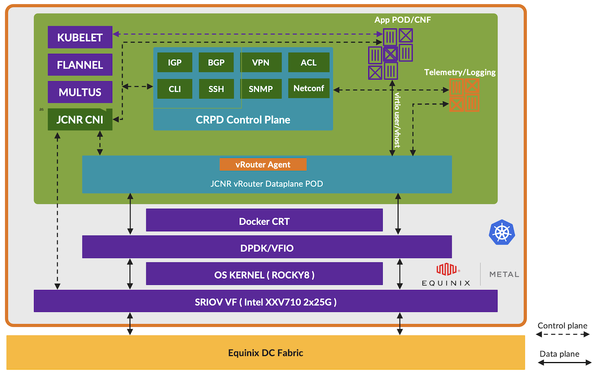
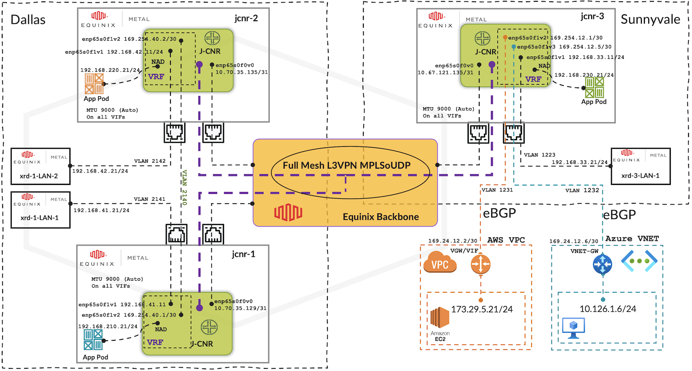
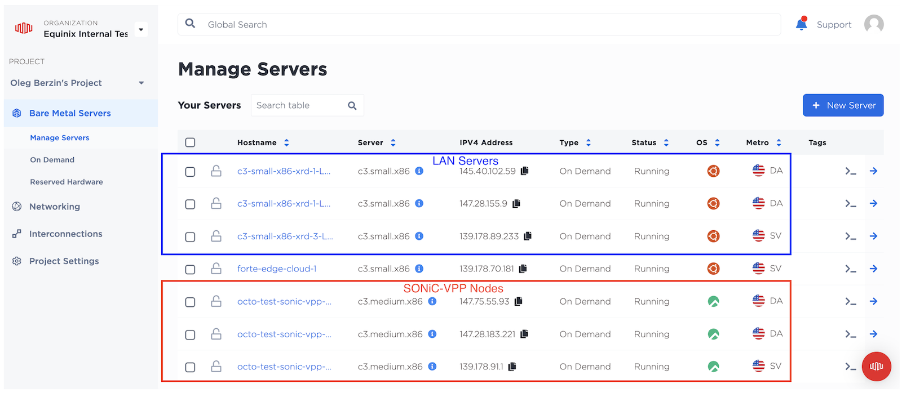

# JCNR for Equinix Metal

**Vivek Shenoy - 01/31/2024**

JCNR brings a lot of value by providing seamless connectivity between workloads across locations, public cloud boundaries, and workload form-factor, by providing full router functionality.

Author would like to acknowledge and thank Oleg Berzin and Vinod Nair (Juniper Networks) for their help in putting this solution together in such a short time.

## Problem Statement

In this day and age of hybrid cloud, it is very common for applications for a given user or organization to span across different datacenter (on-prem or colo) locations, across multiple public cloud providers. Furthermore, they may exist in the form of bare metal, virtual machine or container form-factors.  Often apps require seamless connectivity at both Layer 2 and Layer 3 that cuts across cloud boundaries, which is not easy to achieve. Moreover, the typical VPC networking provided by public cloud environments is use-case specific and poses a lot of restrictions as compared to traditional DC networking constructs. This is where JCNR brings a lot of value by providing seamless connectivity between workloads across locations, public cloud boundaries, and workload form-factor, by providing full router functionality.

### Technology Centric Quote

"Juniper Cloud Native Router (JCNR) is a new breed of Cloud-native Network Functions (CNFs) that have been designed to integrate directly and organically with Kubernetes and deliver a rich set of advanced multi-tenant networking features as well as very-high packet processing and forwarding performance using minimal CPU resources. These characteristics make JCNR applicable not only to the Telco/5G use cases but to a wide variety of enterprise scenarios including hybrid multi-cloud networking. With Equinix Metal and Fabric we can demonstrate that customers can deploy and configure performant hybrid multi-cloud networks using JCNR software on Equinix infrastructure to enable multi-metro, multi-cloud private low latency connectivity for their applications in the matter of minutes."

***Oleg Berzin - Senior Distinguished Engineer, Technology and Architecture, Office of the CTO, Equinix.***

## Introduction

Equinix Metal is a bare metal infrastructure, which is based on dedicated physical servers, that center on time-to-market, overhead reductions, cloud-like consumption, and integration with other Equinix services in addition to providing high-speed connectivity to public cloud infrastructure using Equinix's high-speed global network infrastructure.

Juniper Cloud-Native Router (JCNR) is a Kubernetes container-based software router that combines the Junos cRPD control and management plane and the vRouter forwarding plane. Telcos are deploying JCNR in their production environments for use-cases such as a cloud-native Cell Site Router (CSR) in the case of 5G Distributed Radio Access Network (D-RAN) and to provide advanced network connectivity and segmentation for 5G Core workloads hosted on public cloud environments.

In addition to the 5G use cases, JCNR is an attractive solution for Enterprises to achieve multi-site, multi-cloud networking for application workloads which this article focuses on.

## High-Level Architecture of an Equinix Metal Node with JCNR as Kubernetes CNI

The diagram below shows the high-level architecture of JCNR running on top of an Equinix Metal server that is orchestrated on the Equinix Metal infrastructure. Equinix Metal infrastructure along with Equinix's global high-speed backbone provides the required fabric connectivity (L3) between the various JCNR nodes to achieve seamless connectivity between the applications across clouds.

As shown in the diagram below the key JCNR components consists of the following:



- Juniper Containerized Route Processing Daemon or cRPD is the brain of JCNR that runs as a stateful-set on each of the Kubernetes nodes providing advanced networking capabilities for Kubernetes application pods and which talks to the JCNR forwarding plane (vRouter) using GRPC APIs to program configuration data, control-plane state information and to exchange operational state with the vRouter forwarding plane.
- CRPD, just like Junos running on a physical Juniper router, provides support for most of the Layer2/Layer3 networking protocols and features such as OSPF, ISIS, BGP, MPLS L2/L3 VPNs, EVPN-VXLAN, Segment-Routing, ACLs, TWAMP, QOS, etc. In addition, there are a variety of options to manage/automate the JCNR configuration using helm-charts, Netconf-SSH, CLI, etc.
- JCNR forwarding plane (vRouter) is a high-performance, DPDK-based forwarding plane developed by Juniper Networks that has direct access to the physical and virtual functions (VF/PF) on the fabric interfaces for high-performance traffic forwarding. In addition, pods can be attached to the JCNR through Kubernetes Network Attachment Definition (NAD) construct using vhost (DPDK application-based pod) or veth (kernel mode) interfaces.
- JCNR vRouter forwarding plane also provides a native telemetry interface for fetching rich telemetry and metrics information that can be ingested into any standard 3rd party telemetry importer such as Prometheus.
- To provide seamless integration of JCNR for Kubernetes workloads, Juniper provides its own JCNR CNI which sits below the Multus meta plugin. The job of the JCNR CNI is to keep a watch on the Kubernetes configuration changes and translate them to equivalent JCNR configuration constructs as and when required.

> *Note: For in-depth architecture of JCNR please refer to the Junos documentation and other JCNR blog URLs provided at the end of this article in the references section.*

## JCNR Equinix Solution Architecture:

This section explains in detail the solution architecture and the use cases that were tested. At a high level, the JCNR Equinix solution aligns with the Equinix Network Edge architecture, a reference architecture from Equinix for connecting multiple locations and clouds. JCNR is deployed in a DIY fashion and plays the role of vGW in this architecture. We will not cover the details of JCNR installation in this post as a detailed installation guide can be found under JCNR Technical documentation for various OS types and environments.



Use case and test details:

- In the Dallas region, 2 JCNR instances are running on 2 separate Equinix metal nodes, and in the Sunnyvale region we have 1 JCNR node. These bare metal servers act as independent Kubernetes clusters for hosting JCNR and other application pods. This is depicted in the diagram as shown above.
- Each of these servers is equipped with a dual-port Intel XXV710 25G NIC with the first 25G port connected to Equinix global backbone TOR switches for high-speed inter-POP connectivity. The second port is used for intra-POP connectivity in the Dallas region and in the Sunnyvale region connection towards public cloud AWS-VPC/Azure-VNET.
- As indicated in the diagram above, the first 25G port on each of the servers is configured as an untagged port with a single SRIOV-VF allocated to JCNR, whereas multiple SRIOV-VFs are configured on the second 25G port, and are connected to bare metal servers and towards public cloud VPC/VNET interconnects (using different VLANs).
- In addition, each metal node has an application pod/CNF attached to JCNR using a Kubernetes native construct known as Network Attachment Definition (NAD).
- All the above-mentioned workloads have their JCNR interfaces part of Layer3 VRF vpic-cust1 which is configured on the three JCNR instances. The inter-metro communication between workload endpoints is achieved using the BGP-based L3VPN  MPLSoUDP overlay tunnels that are constructed between the three JCNR nodes.
- One use case not mentioned in the above diagram is internet connectivity for the above workloads. But that can be achieved very easily by service chaining JCNR with cSRX (which provides Firewall and NAT functions) and breaking out locally on the local metal server for internet access. That's a topic that deserves its own blog!

## Solution validation

> *Note: For the sake of brevity, JCNR Junos configuration and the cli capture from the Linux host and JCNR are provided in the blog repo whose link is provided at the end. Only key verification commands are covered in this document in the next section.*

### Status of Equinix metal servers



### JCNR verification

> *Note: The JCNR verification o/p is shown on jcnr-3. For other nodes, the o/p will be similar.*

```
[root@octo-test-jcnr-3 ~]# kubectl get pod -A --field-selector metadata.namespace!=kube-system
NAMESPACE         NAME                                    READY   STATUS    RESTARTS       AGE
contrail-deploy   contrail-k8s-deployer-584f55bdc-fcvb4   1/1     Running   0              14d
contrail          contrail-vrouter-masters-dc6n6          3/3     Running   0              14d
jcnr              kube-crpd-worker-sts-0                  1/1     Running   0              14d
jcnr              syslog-ng-f55rn                         1/1     Running   0              14d
kube-flannel      kube-flannel-ds-bfk75                   1/1     Running   1 (14d ago)    14d
vpic-cust1        vpic-kernel-pod-3                       1/1     Running   0              14d

[root@octo-test-jcnr-3 ~]#
[root@octo-test-jcnr-3 ~]# kubectl exec -n jcnr -it kube-crpd-worker-sts-0 -- cli
Defaulted container "kube-crpd-worker" out of: kube-crpd-worker, jcnr-crpd-config (init), install-cni (init)
root@octo-test-jcnr-3> show version
Hostname: octo-test-jcnr-3
Model: cRPD
Junos: 23.2R1.14
cRPD package version : 23.2R1.14 built by builder on 2023-06-22 13:51:13 UTC

root@octo-test-jcnr-3> show interfaces terse | grep "(cni)|(flannel)|(eth)|(enp)|(lo)"
cni0             UP             10.244.0.1/24 fe80::cc5:e0ff:fe73:5e9/64
enp65s0f0        UP
enp65s0f0v0      UNKNOWN        10.67.121.135/31 fe80::9034:865b:5119:e7e1/64 fe80::bc58:efff:fed2:c549/64
enp65s0f0v1      UNKNOWN        139.178.88.65/31 fe80::5f16:bda5:e915:6e22/64 fe80::d0f5:25ff:fed2:6f9c/64
enp65s0f0v2      UP             fe80::fc0a:40cc:a3f8:2b8/64
enp65s0f0v3      UP             fe80::58e8:bd44:5758:7da7/64
enp65s0f1        UP             fe80::42a6:b7ff:fe70:dae1/64
enp65s0f1v0      UNKNOWN        fe80::938e:77c9:78cc:9ef9/64 fe80::f023:11ff:fe1b:3057/64
enp65s0f1v1      UNKNOWN        192.168.33.11/24 fe80::2010:5cff:fe28:9f2d/64
enp65s0f1v2      UNKNOWN        169.254.12.1/30 fe80::9830:96ff:fe66:a92e/64
enp65s0f1v3      UNKNOWN        169.254.12.5/30 fe80::6c01:97ff:fed6:5ba3/64
eth0             UNKNOWN        169.254.152.42/32 fe80::3cda:1aff:fee5:7d7d/64
flannel.1        UNKNOWN        10.244.0.0/32 fe80::e873:eeff:fe74:fd90/64
lo               UNKNOWN        127.0.0.1/8 1.2.3.4/32 ::1/128
lo0.0            UNKNOWN        fe80::38a1:81ff:fee8:87ed/64
veth370be25d@if4 UP             fe80::4816:37ff:fee0:e29c/64
vethc9ef06f8@if4 UP             fe80::8086:d7ff:fe94:ed0f/64
vethde65034f@if8 UP             fe80::d475:1fff:fee7:c837/64

root@octo-test-jcnr-3> show bgp summary
Threading mode: BGP I/O
Default eBGP mode: advertise - accept, receive - accept
Groups: 4 Peers: 6 Down peers: 0
Table          Tot Paths  Act Paths Suppressed    History Damp State    Pending
bgp.l3vpn.0
                       7          7          0          0          0          0
inet.0
                       2          1          0          0          0          0
Peer                     AS      InPkt     OutPkt    OutQ   Flaps Last Up/Dwn State|#Active/Received/Accepted/Damped...
10.70.35.129          65000     461416     456029       0       0 20w4d 17:44:55 Establ
  bgp.l3vpn.0: 3/3/3/0
  vpic-cust1.inet.0: 3/3/3/0
10.70.35.135          65000     192350     190108       0       8 8w4d 8:05:34 Establ
  bgp.l3vpn.0: 4/4/4/0
  vpic-cust1.inet.0: 4/4/4/0
169.254.12.2          65029      73371      78541       0       1 3w3d 22:12:15 Establ
  vpic-cust1.inet.0: 5/5/5/0
169.254.12.6          12076     423072     456046       0       0 20w4d 17:44:45 Establ
  vpic-cust1.inet.0: 0/0/0/0
169.254.255.1         65530     489511     456023       0       0 20w4d 17:44:51 Establ
  inet.0: 1/1/1/0
169.254.255.2         65530     489575     456022       0       0 20w4d 17:44:47 Establ
  inet.0: 0/1/1/0

root@octo-test-jcnr-3>

root@octo-test-jcnr-3> show dynamic-tunnels database terse
*- Signal Tunnels #- PFE-down
Table: inet.3

Destination-network: 10.70.35.129/32
Destination                      Source          Next-hop                 Type       Status
10.70.35.129/32                  10.67.121.135   0x563bc26e3f9c nhid 0    UDP        Up

Destination-network: 10.70.35.135/32
Destination                      Source          Next-hop                 Type       Status
10.70.35.135/32                  10.67.121.135   0x563bc4d1661c nhid 0    UDP        Up
10.70.35.135/32                  10.67.121.135   0x563bc4d16cdc nhid 0    UDP        Up
10.70.35.135/32                  10.67.121.135   0x563bc4d16a9c nhid 0    UDP        Up

root@octo-test-jcnr-3>

root@octo-test-jcnr-3> show route table vpic-cust1.inet.0

vpic-cust1.inet.0: 20 destinations, 20 routes (20 active, 0 holddown, 0 hidden)
+ = Active Route, - = Last Active, * = Both

169.254.12.0/30    *[Direct/0] 20w6d 01:48:24
                    >  via enp65s0f1v2
169.254.12.1/32    *[Local/0] 20w6d 01:48:24
                       Local via enp65s0f1v2
169.254.12.4/30    *[Direct/0] 20w6d 01:48:24
                    >  via enp65s0f1v3
169.254.12.5/32    *[Local/0] 20w6d 01:48:24
                       Local via enp65s0f1v3
172.29.62.0/24     *[BGP/170] 2w0d 11:52:49, localpref 100
                      AS path: 65029 65029 65021 ?, validation-state: unverified
                    >  to 169.254.12.2 via enp65s0f1v2
172.29.63.0/24     *[BGP/170] 2w0d 11:52:49, localpref 100
                      AS path: 65029 65029 65021 ?, validation-state: unverified
                    >  to 169.254.12.2 via enp65s0f1v2
172.29.64.0/24     *[BGP/170] 2w0d 11:52:49, localpref 100
                      AS path: 65029 65029 65021 ?, validation-state: unverified
                    >  to 169.254.12.2 via enp65s0f1v2
172.29.66.0/24     *[BGP/170] 2w0d 11:52:49, localpref 100
                      AS path: 65029 65029 65021 ?, validation-state: unverified
                    >  to 169.254.12.2 via enp65s0f1v2
173.29.0.0/16      *[BGP/170] 3w5d 06:14:48, localpref 100
                      AS path: 65029 I, validation-state: unverified
                    >  to 169.254.12.2 via enp65s0f1v2
192.168.33.0/24    *[Direct/0] 20w6d 01:48:24
                    >  via enp65s0f1v1
192.168.33.11/32   *[Local/0] 20w6d 01:48:24
                       Local via enp65s0f1v1
192.168.41.0/24    *[BGP/170] 20w6d 01:48:14, localpref 100, from 10.70.35.129
                      AS path: I, validation-state: unverified
                    >  via Tunnel Composite, UDP (src 10.67.121.135 dest 10.70.35.129), Push 16
192.168.42.0/24    *[BGP/170] 8w5d 16:01:35, localpref 100, from 10.70.35.135
                      AS path: I, validation-state: unverified
                    >  via Tunnel Composite, UDP (src 10.67.121.135 dest 10.70.35.135), Push 19
192.168.42.21/32   *[BGP/170] 8w5d 16:01:35, localpref 100, from 10.70.35.135
                      AS path: I, validation-state: unverified
                    >  via Tunnel Composite, UDP (src 10.67.121.135 dest 10.70.35.135), Push 19
192.168.101.0/24   *[BGP/170] 20w6d 01:03:37, localpref 100, from 10.70.35.129
                      AS path: I, validation-state: unverified
                    >  via Tunnel Composite, UDP (src 10.67.121.135 dest 10.70.35.129), Push 16
192.168.210.0/24   *[BGP/170] 20w5d 22:48:15, localpref 100, from 10.70.35.129
                      AS path: I, validation-state: unverified
                    >  via Tunnel Composite, UDP (src 10.67.121.135 dest 10.70.35.129), Push 16
192.168.220.0/24   *[BGP/170] 8w5d 16:05:07, localpref 100, from 10.70.35.135
                      AS path: I, validation-state: unverified
                    >  via Tunnel Composite, UDP (src 10.67.121.135 dest 10.70.35.135), Push 17
192.168.221.0/24   *[BGP/170] 8w5d 16:05:07, localpref 100, from 10.70.35.135
                      AS path: I, validation-state: unverified
                    >  via Tunnel Composite, UDP (src 10.67.121.135 dest 10.70.35.135), Push 18
192.168.230.0/24   *[Direct/0] 20w5d 22:39:24
                    >  via jvknet1-51e5c20
192.168.230.21/32  *[Local/0] 20w5d 22:39:24
                       Local via jvknet1-51e5c20

[root@octo-test-jcnr-3 ~]#
```

### Validation of end-end connectivity

1. Check for the Intra Metro traffic with ping and iperf3 TCP throughput between LAN1 and LAN2 BMS servers via JCNR-1 -- VLAN2140 -- JCNR-2.

```
root@c3-small-x86-xrd-1-LAN-1:~# ping 192.168.42.21 -I 192.168.41.21 -c 5
PING 192.168.42.21 (192.168.42.21) from 192.168.41.21 : 56(84) bytes of data.
64 bytes from 192.168.42.21: icmp_seq=1 ttl=62 time=1.93 ms
64 bytes from 192.168.42.21: icmp_seq=2 ttl=62 time=0.827 ms
64 bytes from 192.168.42.21: icmp_seq=3 ttl=62 time=0.737 ms
64 bytes from 192.168.42.21: icmp_seq=4 ttl=62 time=0.664 ms
64 bytes from 192.168.42.21: icmp_seq=5 ttl=62 time=0.750 ms

--- 192.168.42.21 ping statistics ---
5 packets transmitted, 5 received, 0% packet loss, time 4065ms
rtt min/avg/max/mdev = 0.664/0.982/1.934/0.478 ms 
[root@octo-test-jcnr-3 ~]#

root@c3-small-x86-xrd-1-LAN-2:~# iperf3 -c 192.168.41.21 -B 192.168.42.21 -t 5
Connecting to host 192.168.41.21, port 5201
[  4]  local 192.168.42.21 port 44433 connected to 192.168.41.21 port 5201
[ ID]  Interval         Transfer     Bandwidth       Retr   Cwnd
[  4]  0.00-1.00 sec    1.05 GBytes  8.98 Gbits/sec  4      1.32 MBytes
[  4]  1.00-2.00 sec    1.06 GBytes  9.08 Gbits/sec  2      4.25 MBytes
[  4]  2.00-3.00 sec    1.06 GBytes  9.08 Gbits/sec  0      4.32 MBytes
[  4]  3.00-4.00 sec    1.05 GBytes  9.05 Gbits/sec  0      3.25 MBytes
[  4]  4.00-5.00 sec    1.05 GBytes  9.06 Gbits/sec  2      4.32 MBytes
- - - - - - - - - - - - - - - - - - - - - - -
[ ID]  Interval         Transfer     Bandwidth       Retr
[  4]  0.00-5.00 sec    5.27 GBytes  9.05 Gbits/sec  6            sender
[  4]  0.00-5.00 sec    5.26 GBytes  9.04 Gbits/sec               receiver
[root@octo-test-jcnr-3 ~]#
```

2. Check for the Inter Metro traffic with ping and iperf3 TCP throughput between LAN2 and LAN3 BMS servers via JCNR-2 -- L3VPNoMPLSoUDP -- JCNR-3.

```
root@c3-small-x86-xrd-1-LAN-1:~# ping 192.168.33.21 -I 192.168.41.21 -c 5
PING 192.168.33.21 (192.168.33.21) from 192.168.41.21 : 56(84) bytes of data.
64 bytes from 192.168.33.21: icmp_seq=1 ttl=62 time=43.9 ms
64 bytes from 192.168.33.21: icmp_seq=2 ttl=62 time=42.8 ms
64 bytes from 192.168.33.21: icmp_seq=3 ttl=62 time=42.9 ms
64 bytes from 192.168.33.21: icmp_seq=4 ttl=62 time=43.0 ms
64 bytes from 192.168.33.21: icmp_seq=5 ttl=62 time=43.0 ms

--- 192.168.33.21 ping statistics ---
5 packets transmitted, 5 received, 0% packet loss, time 4007ms
rtt min/avg/max/mdev = 42.825/43.107/43.866/0.382 ms
root@c3-small-x86-xrd-1-LAN-1:~#

root@c3-small-x86-xrd-3-LAN-1:~# iperf3 -c 192.168.42.21 -B 192.168.33.21 -t 5
Connecting to host 192.168.42.21, port 5201
[  4]  local 192.168.33.21 port 52317 connected to 192.168.42.21 port 5201
[ ID]  Interval         Transfer     Bandwidth       Retr   Cwnd
[  4]  0.00-1.00 sec    130 MBytes   1.09 Obits/sec   0     12.1 MBytes
[  4]  1.00-2.00 sec    172 MBytes   1.45 Gbits/sec   0     12.1 MBytes
[  4]  2.00-3.00 sec    179 MBytes   1.50 Gbits/sec   0     12.1 MBytes
[  4]  3.00-4.00 sec    174 MBytes   1.46 Gbits/sec   0     12.1 MBytes
[  4]  4.00-5.00 sec    174 MBytes   1.46 Gbits/sec   2     6.33 MBytes
- - - - - - - - - - - - - - - - - - - - - - -
[ ID]  Interval         Transfer     Bandwidth       Retr
[  4]  0.00-5.00 sec    829 MBytes   1.39 Gbits/sec   2           sender
[  4]  0.00-5.00 sec    825 MBytes   1.38 Gbits/sec               receiver
[root@octo-test-jcnr-3 ~]#
```

3. Check for the iperf3 TCP throughput between AWS EC2 instance and Equinix Metal LAN-3 server via JCNR-3 over a 500Mbps AWS Direct Connect Circuit.

```
ubuntu-173-29-5-21:~$ iperf3 -c 192.168.33.21 -B 173.29.5.21 -M 3000
Connecting to host 192.168.33.21, port 5201
[  5]  local 173.29.5.21 port 41875 connected to 192.168.33.21 port 5201
[ ID]  Interval          Transfer      Bitrate          Retr   Cwnd
[  5]  0.00-1.00  sec    65.7 MBytes   551 Mbits/sec    285    147 KBytes
[  5]  1.00-2.00  sec    52.5 MBytes   440 Mbits/sec     4     243 KBytes
[  5]  2.00-3.00  sec    53.8 MBytes   451 Mbits/sec     9     157 KBytes
[  5]  3.00-4.00  sec    58.8 MBytes   493 Mbits/sec     8     137 KBytes
[  5]  4.00-5.00  sec    61.2 MBytes   514 Mbits/sec     6     126 KBytes
[  5]  5.00-6.00  sec    55.0 MBytes   461 Mbits/sec     6     168 KBytes
[  5]  6.00-7.00  sec    57.5 MBytes   482 Mbits/sec     9     119 KBytes
[  5]  7.00-8.00  sec    57.5 MBytes   482 Mbits/sec     7    83.4 KBytes
[  5]  8.00-9.00  sec    58.8 MBytes   493 Mbits/sec     5     158 KBytes
[  5]  9.00-10.00 sec    58.8 MBytes   493 Mbits/sec     7     137 KBytes
- - - - - - - - - - - - - - - - - - - - - - - -
[ ID]  Interval         Transfer     Bitrate           Retr
[  5]  0.00-10.00 sec   579 MBytes   486 Mbits/sec     346      sender
[  5]  0.00-10.00 sec   576 MBytes   483 Mbits/sec              receiver
```

4. Check for the iperf3 TCP throughput between Azure VM instance and Equinix Metal LAN-3 server via JCNR-3 over a 500Mbps Azure Express Route Circuit.

```
pceiadmin@PCEI.11M-01:~$ iperf3 -c 192.168.33.21 -8 18.126.1.7 -M 3000
Connecting to host 192.168.33.21, port 5201
[  4] local 10.126.1.7 port 41069 connected to 192.168.33.21 port 5281
[ ID]  Interval          Transfer      Bitrate         Retr   Cwnd
[  4]  0.00-1.00  sec    73.9 MBytes   619 Mbits/sec   1883   217 KBytes
[  4]  1.08.2.00  sec    59.8 MBytes   502 Mbits/sec   100    218 KBytes
[  4]  2.00-3.00  sec    55.8 MBytes   468 Mbits/sec    42    273 KBytes
[  4]  3.00-4.00  sec    64.1 MBytes   537 Mbits/sec   137    180 KBytes
[  4)  4.00-5.00  sec    58.1 MBytes   488 Mbits/sec    62    179 KBytes
[  4]  5.00-6.00  sec    53.9 MBytes   452 Mbits/sec    51    235 KBytes
[  4]  6.00-7.00  sec    68.2 MBytes   572 Mbits/sec   145    214 KBytes
[  4]  7.08-8.00  sec    59.5 MBytes   499 Mbits/sec    64    216 KBytes
[  4]  8.00-9.00  sec    55.4 MBytes   465 Mbits/sec    45    283 KBytes
[  4]  9.00.10.00 sec    65.0 MBytes   545 Mbits/sec   156    192 KBytes
- - - - - - - - - - - - - - - - - - - - - - - -
[ ID]  Interval         Transfer      Bitrate          Retr
[  4]  0.00-10.00 sec   614 MBytes    515 Mbits/sec    2685       sender
[  4]  0.00-10.00 sec   611 MBytes    513 Mbits/sec               receiver
```

5. Check for iperf3 TCP throughput between AWS EC2 and Azure VM instances through JCNR-3 over a combination of Azure Express Route and AWS Direct Connect VCs with 500Mbps.

```
ubuntu@ip-173-29-5-21:~$ iperf3 -c 19.126.1.7 -B 173.29.5. 1 -M 1412
Connecting to host 10.126.1.7, port 5201
[  5] local 173.29.5.21 port 37001 connected to 10.126.1.7 port 5201
[ ID]  Interval          Transfer      Bitrate         Retr      Cwnd
[  5]  8.00-1.00  sec    57.4 MBytes   481 Mbits/sec    73       776 KBytes
[  5]  1.00-2.00  sec    60.9 MBytes   504 Mbits/sec     0       821 KBytes
[  5]  2.00-3.00  sec    58.8 MBytes   493 Mbits/sec     2       627 KBytes
[  5]  3.00-4.00  sec    45.8 MBytes   377 Mbits/sec     3       281 KBytes
[  5]  4.00-5.00  sec    55.0 MBytes   461 Mbits/sec     0       397 KBytes
[  5]  5.00-6.00  sec    60.0 MBytes   503 Mbits/see     0       495 KBytes
[  5]  6.00-7.00  sec    55.0 MBytes   461 Mbits/sec     0       569 KBytes
[  5]  7.00-8.00  sec    60.0 MBytes   503 Mbits/sec     0       641 KBytes
[  5]  8.00-9.00  sec    60.0 MBytes   503 Mbits/sec     0       706 KBytes
[  5]  9.00-10.00 sec    46.2 MBytes   388 Mbits/sec     4       300 KBytes
- - - - - - - - - - - - - - - - - - - - - - - -
[ ID]  Interval          Transfer      Bitrate         Retr          
[  5]  9.08-10.00 sec    557 MBytes    468 Mbits/sec    82           sender
[  5]  0.09-10.00 sec    554 MBytes    465 Mbits/sec                 receiver
```

## Conclusion

The demonstration of the above use case shows how Juniper Cloud Native Router can be used to provide seamless connectivity between various types of workloads that seamlessly cuts across cloud boundaries. In essence what this means to network operators and enterprise architects is the transformational benefits of a cloud-native networking model while maintaining operational consistency with the existing infrastructure, which means lower opex, faster speed of business, and carrier-grade reliability.

## Useful links

- JCNR configurations, server inventory, and JUNOS verification logs: [https://github.com/pvs2401/Techposts/wiki](https://github.com/pvs2401/Techposts/wiki)
- JCNR Documentation: [https://www.juniper.net/documentation/product/us/en/juniper-cloud-native-router/](https://www.juniper.net/documentation/product/us/en/juniper-cloud-native-router/)

## Glossary

- ACL: Access List
- AWS: Amazon Web Services
- BGP: Border Gateway Protocol
- CNI: Container Network Interface
- cRPD: Containerized Route Processing Daemon
- CSR: Cell Site Router
- D-RAN: Distributed Radio Access Network
- DPDK: Data Plane Development Kit
- EVPN-VxLAN: Network Attachment Definition
- JCNR: Juniper Cloud-Native Router
- NAD: Network Attachment Definition
- GRPC: Google Remote Procedure Call
- QoS: Quality of Service
- TWAMP: Two-Way Active Measurement Protocol
- VPC: Virtual Private Cloud

## Acknowledgements

Many thanks to Oleg Berlin from Equinix who was instrumental in putting together this JCNR solution with Equinix Metal.

Author would like to thank Vinod Nair (Juniper Networks) for his help in putting this solution together in such a short time.

Special thanks to Julian Lucek, Guy Davies for their review of this article.
