# Juniper Apstra  Introducing a True IBNS

**Aninda Chatterjee - 11/30/2022**

What a true IBN system is? How relational and graph databases are different? And why graph databases are ideal for network infrastructure?

## Introduction

This post will look at what Intent-Based Networking truly is, and what an Intent-Based Networking System (IBNS) looks like.

We'll then take a bit of a detour and talk about databases - it is important to (at minimum) gain a basic understanding of relational and graph databases and why one is better suited than the other for network infrastructure. Graph databases form a crucial pillar of Apstra.

Finally, we'll close this out by looking at some generic workflows within Apstra - I've broken this down into simple, high-level flows without going into too much detail. Not to worry, the details will come in subsequent posts.

Let's get started!

## Apstra -- the What and the Why

Juniper Apstra is a **multivendor** solution for Data Center automation and insights. It falls under the general bracket of Intent-Based Networks/Networking (IBN) - this is a term thrown around by many vendors today, but Apstra really exemplifies this and is essentially an IBN system. The goal is to maintain and validate the network as a whole, and not just individual components of the network.

The network itself is driven by intent - intent that is provided by the end user but converted into deployable network elements by Apstra. As a user, the intent is captured in the form of various inputs - how many racks in a Data Center, how many leafs per rack, how many (and what kind) of systems are connected to these leafs, what kind of redundancy is required per rack and so on. This is then converted into the vendor-specific configuration by Apstra (thus providing a level of abstraction) and pushed via NETCONF over SSH to the respective devices to bring your intent to life.

In his book called 'IBN for Dummies', Jeff Doyle has a great statement about IBN systems - "self-operates, self-adjusts and self-corrects within the parameters of your expressed technical objective". What is the expressed technical objective? It is nothing but the intent.

As an IBN system, Apstra provides/is:

- Base automation and orchestration - conversion of intent into a vendor-specific configuration, eliminating any human error and conforming to reference designs built for different deployment models.
- A single source of truth - this is important because you cannot have uniform and non-conflicting intent with multiple sources of truth. Idempotency can only exist with a single source of truth. In the case of Apstra, the 'Blueprint' is the source of truth.
- Closed loop validation - this is continuous verification, in real-time, of the current network state with the intended state, to flag any potential deviation. This eventually leads to self-correction and self-operation.
- Self-operation - Only through closed-loop validation, can the network self-correct or at minimum, alert the user that the network is out of compliance and provide possible remediation steps.

These, as you may have guessed, are the main tiers of an IBN system as well.

## Topology

This is the topology that we'll be working with for the majority of this series. Juniper Apstra is installed as a thin VM on ESXi and is connected to all network devices via an OOB network. This is crucial to remember because Apstra only offers an OOB connection and nothing else as of today.

There are three Juniper vQFXs acting as leafs, 2 vQFXs as spines, one Arista vEOS as a leaf, and one Cisco NXOSv as a leaf.

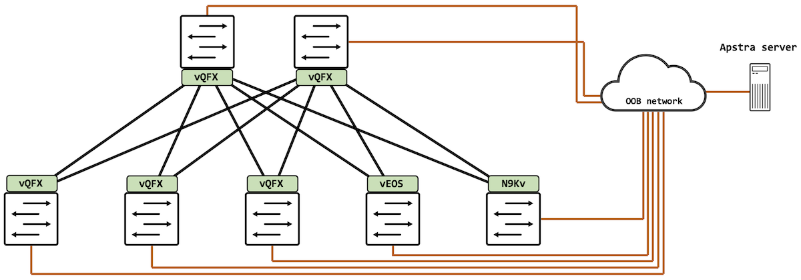

## A brief look at databases

Databases are broadly divided into relational databases and non-relational databases. It is important to understand what a graph database is (since this is a founding pillar that Apstra was built on), and how it is different from relational databases. In this section, we'll take a brief look at relational databases and how they are structured, and then understand how graph databases are different and why they are ideal for network infrastructure.

### Relational databases

Relational databases (also called SQL databases) are structured as tables (rows and columns). These are typically fixed schemas, and used for data that does not change very often. Let's take a simple example: we have a table called 'networkdevice' that is a database for network inventory.

There are several fields in this database that describe a network device - hostname, software version, and management IP address. This can be visualized as so:

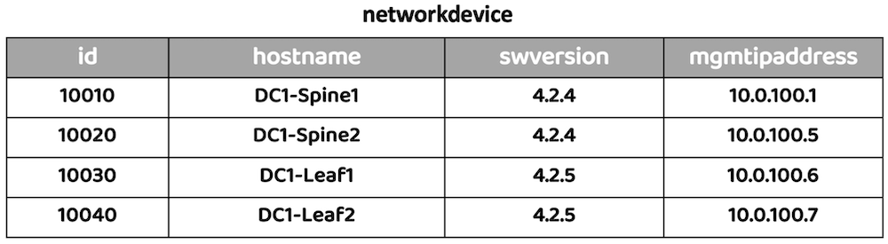

Naturally, there are many other pieces of data that we might want to store or link to a network device. It doesn't make sense to have everything in one table itself. This is where relationships are built, hence the term "relational" database.

For example, let's say we'd like to have some device-specific settings like AAA enabled or not, the site name or site ID, its role in the network (spine/leaf/other), and so on. We could have another table for this called 'devicesettings' that has all of this information, and build a relationship between this table and our 'networkdevice' table. This is done using something called 'foreign keys'. A foreign key is simply a column that uniquely identifies a row in another table.

Let's add another column in our 'networkdevice' table, and we'll call it 'device_id'. This is the foreign key that will connect our two tables. Visually, this would be something like this:

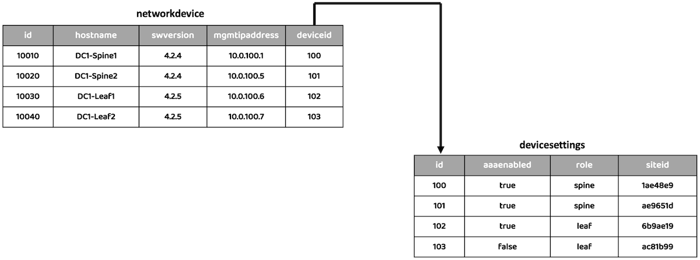

Relational databases, despite the name, are not great at capturing data that is connected. Because multiple tables need to be queried to get the final data, the computation becomes increasingly expensive. This is usually okay when only a low number of tables exist, but this is hardly the case in real-world deployments - the number of tables in use, and related, will likely be quite high.

### Graph Databases

Graph databases are a type of NoSQL database (non-relational databases), which are ideal for navigating connected data. They are essentially nodes linked via edges, where the edges are called 'relationships'. Relationships are treated as first-class citizens - it has a relationship-first approach to storing and querying data.

One of the biggest factors for using graph databases for network infrastructure is that graphs make it very easy to do dependency analysis and they are very good at finding out indirect relationships - what is the impact of shutting a link, bringing down a node, making a policy change and so on. A natural extension of this is that RCA is greatly improved - feeding a graph into machine learning pipelines generates far better outcomes and decisions as compared to feeding in isolated data sets.

For the scope of our discussions here, we will look at something called labeled property graphs. Property graphs allow you to store properties against a node, as well as the relationship itself. These are stored in a 'key:value' format. They are also called 'labeled' property graphs because you can assign labels to a node, describing the 'type' of the node.

Visually, this looks like so:

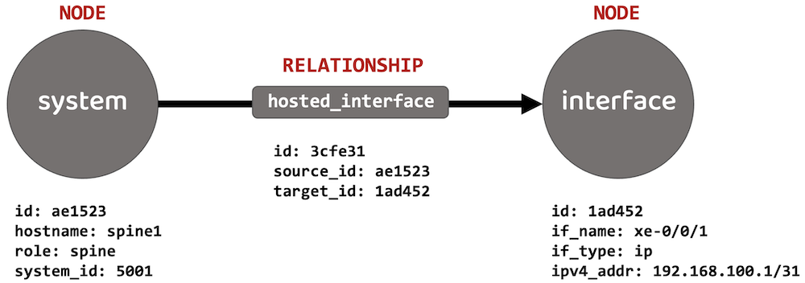

I didn't want to reinvent the wheel, so the above is just a stripped-down version from a Data Center deployment (which we'll look at) in Apstra. I've just focused on two nodes and the relationship between them.

The nodes here are a 'system' and an 'interface'. The relationship between them is 'hosted interfaces', essentially implying that the system (with its listed properties) has an interface (with its listed properties).

As you can see, the 'system' node has 'key:value' properties assigned to it - these include a base identifier called 'id', the name of the system ('spine1', in this case), its role in the network, and so on. Similarly, the 'interface' node has some 'key:value' properties assigned to it as well - again, an identifier, the interface name, IPv4 address, and so on.

Finally, the relationship has some 'key:value' properties also, largely to specify the direction, indicated via a source ID (which matches the 'system' node) and a destination ID (which matches the 'interface' node).

These are just two nodes that I've shown as an example - the entire blueprint that is deployed in Apstra is instantiated as a graph that can be traversed. We'll take a more detailed look at it once we deploy a blueprint in later posts.

## Navigating the UI

This is your first look at Juniper Apstra (at least the first within the context of this technical post). This is Apstra version 4.1.0.

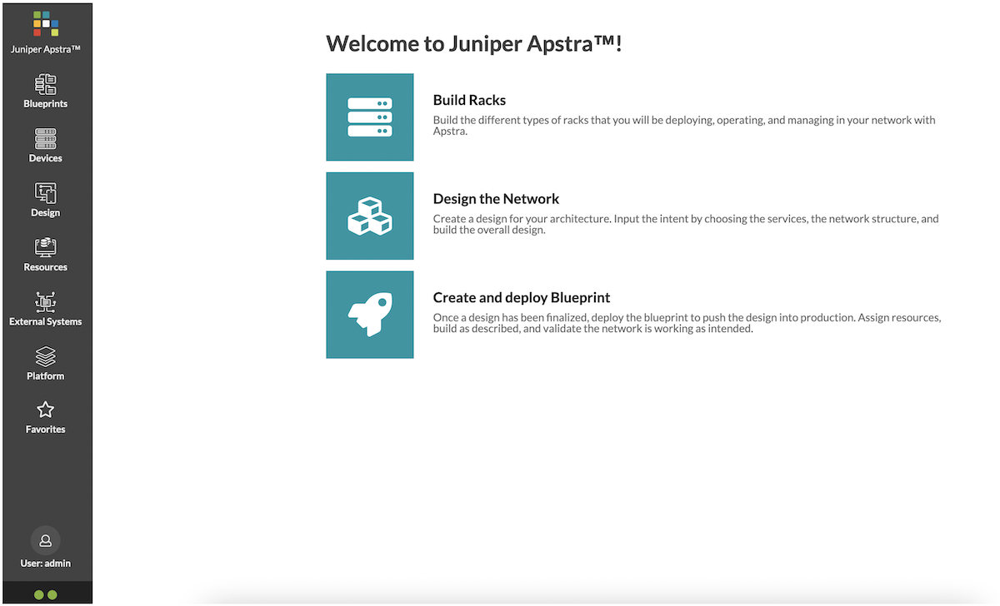

On this main page, a simple workflow is provided - build racks, design the network, and create and deploy a blueprint. Of course, it is a little more involved than this and we're going to break it down in this post, and several others that will follow.

On the left-hand side, there is a pane with several elements. A lot of the work is done within the 'Devices', 'Design', and 'Resources' tabs. In this post, we're going to focus on these only.

The 'Devices' tab has the following options:

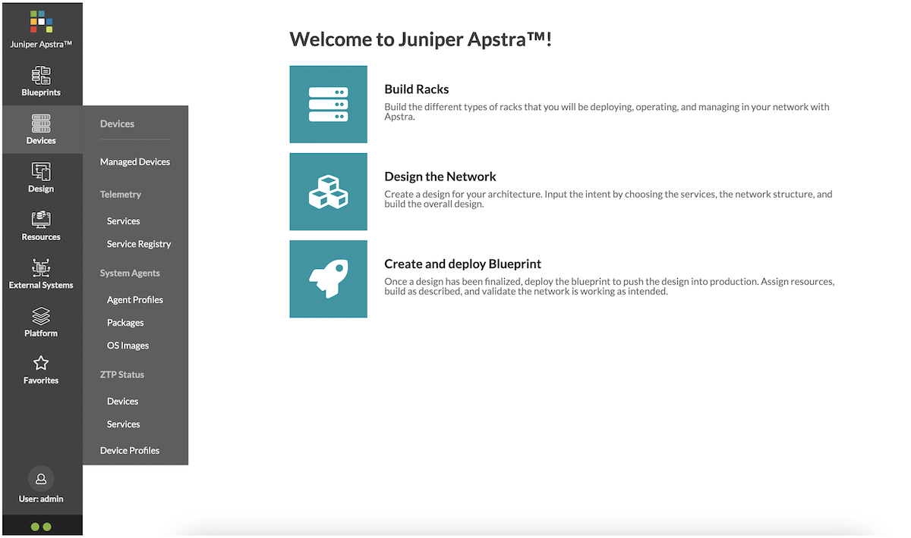

Here, you can create agents for devices that need to be onboarded (we'll detail the process in a subsequent post), create agent profiles, create or view device profiles, and so on.

The 'Design' tab has the following options:

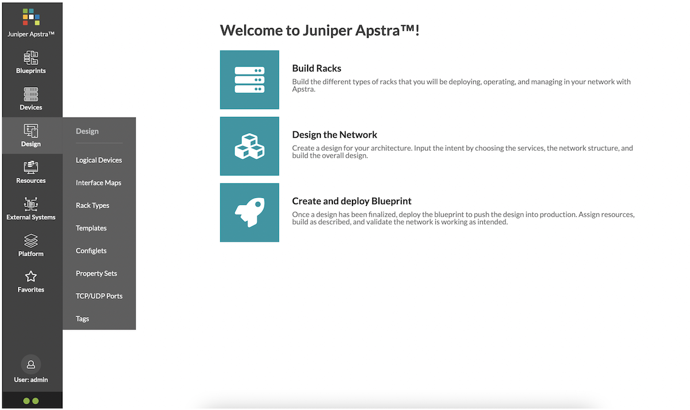

'Design' is where you start to sculpt what your Data Center will look like. We'll look at this in more detail shortly as well.

Finally, 'Resources' is fairly straightforward:

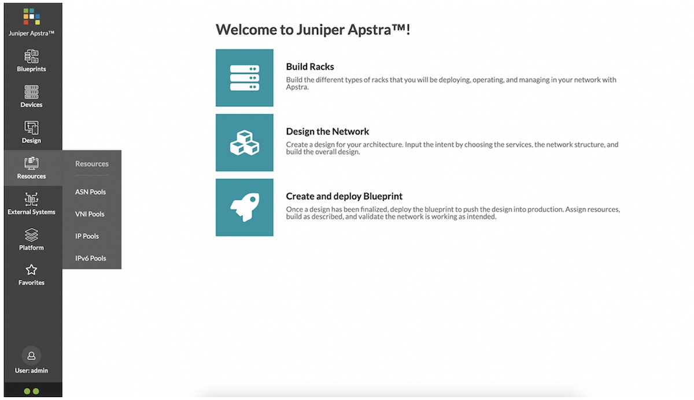

These are various resources that Apstra will use to automate your Data Center deployment.

## General workflow within Apstra

The first step in any SDN system or IBN system is typically to get devices registered and onboarded to be able to manage them.

A high-level workflow for this is as follows:

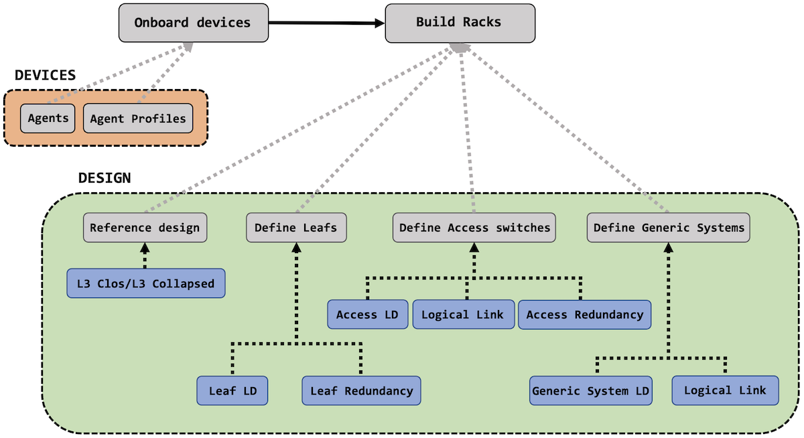

In Apstra, devices are onboarded and managed through something called 'Agents'. You can also create different 'Agent Profiles' to cater to different kinds of network operating systems, vendors, and logins.

Once your devices are in the system, you get to the 'designing' part. Here, you are largely building a rack or racks for your Data Center. Several parameters are fed into a rack and this is fairly involved but very logical.

A rack will typically have one or more leafs, it may or may not have redundancy between these leafs, there may be some access switches connected to the leafs and finally, there will be some hosts in the rack. All of these are options that you control and define. The 'LD' in the workflow above stands for 'Logical Device' - we'll look at all of this and how to define these options in more detail in subsequent posts.

Once a rack (or racks) have been created, you can move on to creating a template for your Data Center. The template has several feeds as well, including many important options for your Data Center - ASN allocation, overlay and underlay details, leaf, and spine information, and so on.

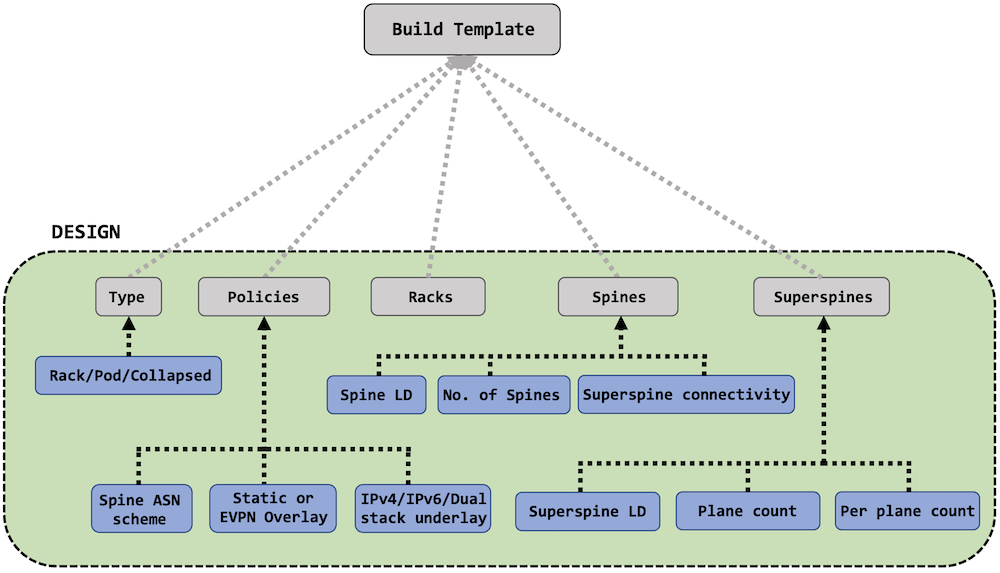

Finally, once a template is ready, you can create a blueprint for your data center. The blueprint is built from the template itself and takes in various resources to start mapping out actual tangible and deployable network elements. These are things like Autonomous System numbers, IP pools, and interface maps.

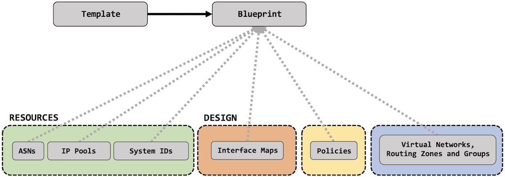

In the next post, we'll start to do all of this - we'll design our racks, build out a template, and create all these resources that we just talked about. All of the fun stuff! Stay tuned, lot's more to follow!

## Useful links

- IBN for Dummies by Jeff Doyle: [https://www.juniper.net/content/dam/www/assets/ebooks/us/en/intent-based-networking-for-dummies.pdf](https://www.juniper.net/content/dam/www/assets/ebooks/us/en/intent-based-networking-for-dummies.pdf)

## Glossary

- IBN - Intent-Based Network
- IBNS - Intent-Based Networking System
- OOB - Out of Band
- SQL - Structured Query Language
- SDN - Software Defined Network/Networking
- NETCONF -- Network Configuration Protocol
- SSH -- Secure Shell or Secure Socket Shell

## Acknowledgement

Thanks to Ridha Hamidi, DJ Spry, Kyle Baxter, Emmeline Wong for the review of this article.
