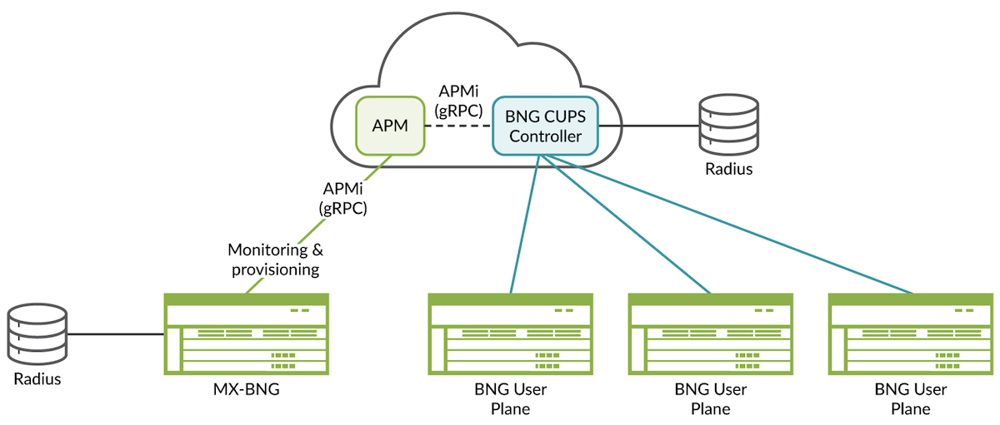
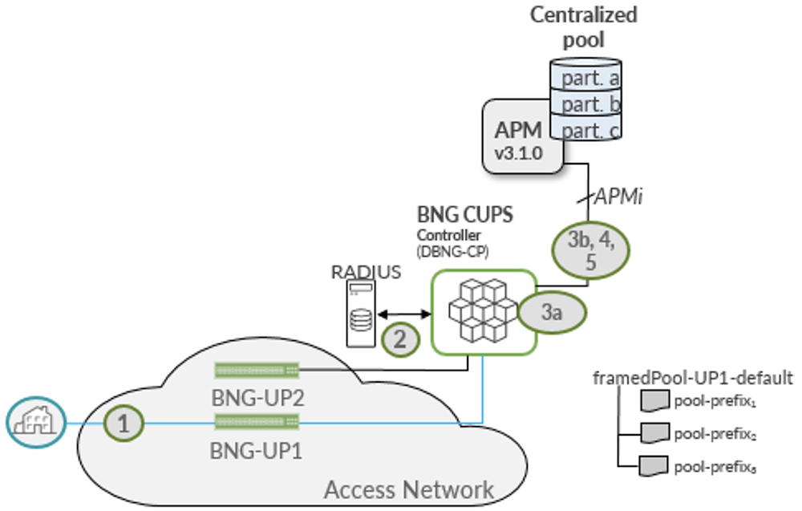
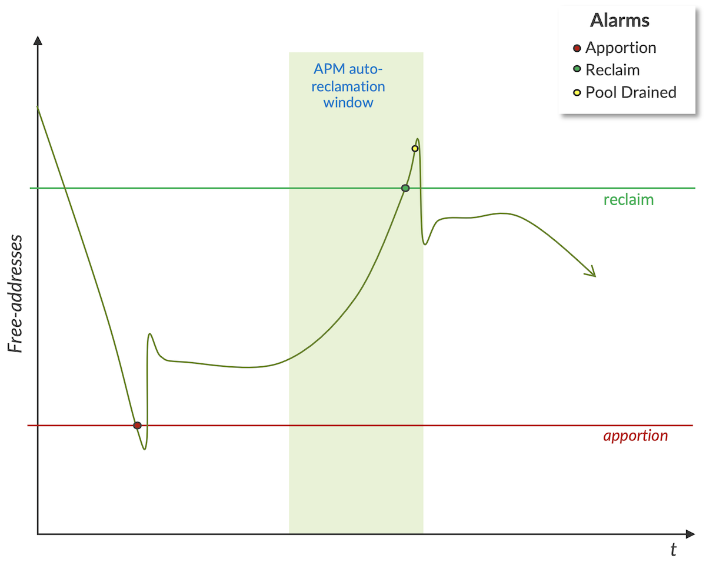

# Juniper BNG CUPS  Address Pool Management

**Horia Miclea - 05/30/2024**

Another innovation for CUPS that enables unified Address Pool Management across CUPS controller(s) and Integrated BNGs. This use case simplifies the service provider operations and cost optimizes the public IPv4 address space usage.

## Introduction

As the long-time global leader in BNG technology, Juniper Networks is leading the industry in bringing new broadband innovations to service providers. In the past year, we've expanded and enhanced the Juniper Networks(R) [MX Series Universal Routers](https://www.juniper.net/us/en/products/routers/mx-series.html) and [ACX Series Universal Metro Routers](https://www.juniper.net/us/en/products/routers/acx-series.html) to enable a more distributed IP/MPLS Access Network and the distribution of service edges closer to the subscriber.

The Juniper BNG CUPS solution is the next step in delivering both cloud agility and economics to service providers. Juniper BNG CUPS is among the industry's first architectures to bring the disaggregation vision defined in the Broadband Forum (BBF) TR-459 standard to real-world networks. In fact, Juniper played a leading role in developing the standard and is heavily involved in initiatives with BBF and others to define tomorrow's more disaggregated, converged, and cloudified CSP networks.

Through these efforts, Juniper is helping service providers around the world enable more flexible, intelligent broadband architectures. With solutions like Juniper BNG CUPS, CSPs can meet customers' ever-growing demands for capacity and performance, while transforming their network economics.

## Juniper BNG CUPS Service Use Cases

What can you do with a more flexible, disaggregated BNG architecture? Quite a lot. Having all subscriber state information natively maintained in a centralized SDB makes a huge difference. In a traditional BNG architecture, each platform only has knowledge of the local subscribers anchored to that platform, making it very difficult to support network engineering and maintenance functions in an open, interoperable way.

With state information for all subscribers accessible centrally, the cloud-hosted controller can manage a range of downstream user planes of various types and capabilities. And the possibilities for more cloudlike, centrally controlled traffic management and network optimization are practically limitless. To start, you can choose from among the five innovative Juniper BNG CUPS use cases detailed below.


*Juniper BNG CUPS use cases*

### 1. Smart Subscriber Load Sharing

In traditional broadband networks, user planes act as siloed entities. If you want to distribute BNG user planes, you're always at risk of running out of capacity, which means you typically must overprovision. With the centralized control enabled by Juniper BNG CUPS, you can group user planes together and treat them as a shared pool of resources.

In this model, you group together user planes that will be part of the virtual resource pool. The controller then proactively monitors their subscriber or bandwidth loads. If a user plane exceeds a given threshold, the controller begins shifting sessions to a less-loaded user plane.

The result, you no longer must worry about accurately forecasting or overprovisioning subscriber scale for a given market. Instead, you can share user planes as needed and continually maximize all available resources in the infrastructure.

Read more details in this post gathering both Smart LB and HA: [https://juniper.github.io/techposts/juniper-bng-cups-smart-load-balancing-with-ha/article](https://juniper.github.io/techposts/juniper-bng-cups-smart-load-balancing-with-ha/article)

### 2. Centralized Address Pool Management

IPv4 addresses have become a precious resource. If you don't have enough available, subscribers can't access the network. Yet purchasing new addresses has become enormously expensive, if you can get them at all. You would think CSPs would do everything in their power to stretch IP address pools as far as possible. Unfortunately, traditional networks make this very hard to do. CSPs typically must allocate addresses to each BNG node, based on little more than an educated guess of what that node will need. Since BNG nodes function in silos, they can't easily share unused addresses either.

Juniper makes it possible to manage IP address pools as a shared resource, and automatically allocate IP addresses to a subscriber on any user plane across the network. With the cloud-native Address Pool Manager, CSPs can:

- Improve operational efficiency by automatically adding IP addresses when needed: APM delegates IP address pools across all integrated BNG and CUPS Controller entities in the network, as required, on a need basis. If a control plane crosses a predefined utilization threshold, the CUPS controller raises an apportionment alarm to APM that automatically provides a new address pool. You get the IP address resources you need, where and when you need them, without having to manage address pools manually or build and maintain homegrown tools.
- Lower costs by maximizing IP address utilization: CUPS Controllers automatically release the unused address pools and APM can re-allocate them as required. In a traditional network, those unused (and expensive) addresses would sit idle. APM automatically reclaims and redistributes them across the network where needed, optimizing operational costs for public IPv4 address management.

The current article covers this use-case in details.

### 3. Hitless User Plane Maintenance

In traditional vertically integrated networks, most maintenance tasks, changing line cards, updating software, and more, require a scheduled maintenance window. Since you're bringing down the node and all subscribers attached to it, you always risk disrupting services, and frustrating subscribers. Additionally, since maintenance windows are typically scheduled late at night, you pay higher overtime costs for that maintenance. A centralized control plane and shared state information make planned maintenance much simpler and less disruptive.  The process is straightforward:

- Technicians use the centralized control plane to transfer all subscriber state information from the current user plane to a new one.
- They configure the transport network to send traffic to the new user plane instead of the old.
- Since the new user plane already has state information for all subscribers, it exists in a "hot standby state" and quickly brings up those sessions without service disruption.
- Technicians perform the maintenance and, once complete, reverse the process and orchestrate traffic back to the original user plane.

The whole procedure can be handled in a streamlined, low-risk way during normal business hours, with subscribers never noticing a thing. This means you can continually update your network more easily and inexpensively, while improving customer satisfaction and supporting more stringent, and profitable, SLAs.

You can find more details in this techpost:[https://juniper.github.io/techposts/juniper-bng-cups-hitless-user-plane-maintenance/article](https://juniper.github.io/techposts/juniper-bng-cups-hitless-user-plane-maintenance/article)

### 4. BNG User Plane Redundancy

In this use case, Juniper BNG CUPS enables the same kind of hitless failover as in planned maintenance, but for unplanned failures. You define redundancy groups among user planes, identifying one or more backups that will activate if the primary fails. The cloud-hosted controller then pre-stages those platforms and, depending on the redundancy option used, continually programs backup user planes with the relevant state information. In the event a primary user plane fails, the controller automatically activates the pre-staged backup and re-routes traffic accordingly.

You'll be able to choose from two redundancy options, depending on the level of disruption tolerable for a given service or service level agreement (SLA):

- **Hot standby:** The controller continually programs session state information on the backup user planes, enabling hitless failover that's practically undetectable to users.
- **Warm oversubscribed standby:** The Backup user-plane holds full subscriber state on the Routing-Engine (RE), full state on the line card but only partial state- (or forwarding state)- is programmed on the Packet Forwarding Engine/ASIC (PFE).
- Whether to have **Hot or Warm Oversubscribed standby** subscriber sessions while in the Backup state can be set on a subscriber group (SGRP) basis.

Read more details in this post gathering both Smart LB and HA: [https://juniper.github.io/techposts/juniper-bng-cups-smart-load-balancing-with-ha/article](https://juniper.github.io/techposts/juniper-bng-cups-smart-load-balancing-with-ha/article)

### 5. Flexible Service Steering

An exciting standards-based use case currently under development is the concept of service steering  ([see BBF WT-474](https://www.broadband-forum.org/bbf-wt-474-subscriber-session-steering-demo)). This standard will give CSPs even more flexibility in architecting their networks by allowing the BNG control plane to steer subscriber sessions from one user plane to another.

Imagine, for example, that you have distributed user planes out at central offices (COs) or metro locations supporting Internet-only traffic, while more advanced platforms deeper in the network support more sophisticated services, such as deep packet inspection (DPI) or URL filtering. The distributed BNGs can act as generic gateways for most subscribers coming in from that location. But now, the controller can automatically direct subscribers requiring more advanced services to more advanced user planes.

With this intelligence, you can apply more sophisticated services to subscribers anywhere, without having to deploy more advanced and expensive user planes wherever you want to offer those services. And you can program custom traffic flows for specific services, SLAs, and even individual enterprise customers. Effectively, you bring the concept of network slicing to your broadband architecture.

BBF WT-474 is still in development and likely won't be fully productized for a while.

Other blogs cover the other use cases, please refer to the references.

## Address Pool Management Use Case

Juniper Address Pool Manager (APM) is a cloud-native, container-based application running in a Kubernetes environment that manages IPv4 address pools in the network across integrated BNGs and CUPS enabled user planes. It can be deployed in the same or different Kubernetes cluster as the CUPS Controller. It automatically provisions prefixes from a centralized address pool to broadband network gateways (integrated BNGs or CUPS Controllers) before they deplete their address pools.

Address Pool Manager maintains centralized collections of IP prefixes for a BNG CUPS Controller and its associated BNG User Planes. Each collection is called a partition.  Pool domains are created upon request from the BNG CUPS Controller. The controller creates a pool domain for each combination of domain profile, subscriber group, and routing instance that request dynamic address allocation.  The pool domain defines a linked-address pool and a set of attributes that include the partition from which pool prefixes are apportioned from/reclaimed-to, the preferred pool prefix size, the thresholds used to drive apportionment and reclamation, and the reclamation hold-down time.  The pool-domain attributes consist of BNG configured values (from the domain-profile) and APM configured values (from the pool-domain-profile).

Address Pool Manager and the BNG CUPS Controller or the integrated BNGs communicate through the Juniper APMi (APM application interface), a gRPC-based protocol interface. The APMi includes primitives for synchronizing pool data upon initial connection. Also, the APMi is used by BNG CUPS Controller to initiate pool domain creation, raise alarms for apportionment and reclamation, and to convey pool domain statistics to APM.

As subscribers login and request address assignment, the BNG Controller's control-plane instance (CPi) matches the Framed-Pool attribute returned from the authentication step to a configured domain-profile in the given routing instance.  If a pool-domain has been created from the domain profile that matches the subscriber's SGRP and routing instance, the address allocator will attempt to allocate an address from the associated linked-address pool for that domain.  If no domain exists, the BNG CUPS Controller's CPi will initiate the creation of a pool domain with APM.  The new domain will be named from the domain-profile name, the subscriber's SGRP name, and the target routing instance, e.g. iroh-sgrp003-default. The partition configured for the subscriber's user-plane, the attributes from APM's pool domain profile, and the CPi's domain profile are used to create the domain.   Once the domain is created, the CPi raises an apportion alarm to APM to add pools to the domain.  The number of pools the CPi requests is a function of the session-setup-rate; the CPi uses a dynamic algorithm to ensure that logins to the domain will not stall waiting for an apportionment from APM. In response to the apportion alarm, APM apportions prefixes of appropriate length from the domain's associated partition and returns these prefixes as pools in the alarm response to the CPi.  Once the domain has been apportioned pools, the CPi can complete address allocation and the subscriber can complete login.

When the number of available addresses in the domain reaches or falls below the apportionment threshold, the BNG CUPS Controller will again raise an apportion alarm to trigger one or more prefixes to be added to the set of pools in the domain. As pools are added to the domain discard routes using the route-tag configured for the user plane are installed, if configured to do so. You can use the tag as a selector to import pool prefixes in the associated routing policies.



*Address Pool Manager High Level Architecture with Integrated BNGs and BNG CUPS Controller*

BNG CUPS Controller can manage multiple BNG User Planes. In time, the operations can dynamically add or remove the BNG User Planes. Therefore, it is inefficient and impractical to pre-provision address pools on the BNG CUPS Controller for worst-case subscriber loads. The CUPS deployment may include a mix of integrated BNGs and CUPS controllers for long while, and APM as standalone application mediates this migration.   lso, you might want to coordinate which prefixes a BNG User Plane uses (or sets of BNG User Planes use) in address pools for routing purposes. Address Pool Manager and the CUPS CP can be configured to automate pool management in these more complex routing environments.

In conclusion the Juniper APM application enables the service provider to :

- **Improve operational efficiency by automatically adding IP addresses when needed**: APM proactively monitors IP address pools across all BNG entities in the network. If a BNG CUPS controller or integrated BNG crosses a predefined threshold, APM automatically apportions a new address pool. You get the IP address resources you need, where and when you need them, without having to manage address pools manually or build and maintain homegrown tools.
- **Lower costs by maximizing IP address utilization**: By monitoring all BNG CUPS controllers and integrated BNGs, APM can identify any BNG nodes with large, underutilized address pools. In a traditional network, those unused (and expensive) addresses would sit idle. APM automatically reclaims and redistributes them across the network where needed, optimizing operational costs for public IPv4 address management.

The next figure illustrates the Address Pool Management use case, detailing how the BNG CUPS controller uses APM to enable automated, just-in-time IP address allocation from a shared pool.



*Juniper Centralized Address Pool Management in action*

1. Subscribers log in through the user planes (UP), the two BNG-UP1 and BN-UP2 may be configured in subscriber redundancy group. Login (control) traffic is handled on the control plane (CP).

2. Logins are authenticated at the CUPS Controller Control Plane (CP). The Control Plane instance (CPi) microservice has an APMi session with APM:

```
root@cpi-boston> show network-access address-assignment address-pool-manager status 
APM:
    State: connected
    SystemId: 198.19.224.212
    Security: clear-text
Apportionment: Remote
```

RADIUS server returns a framed-pool attribute for address allocation.

- a. Framed-pool matches a configured domain-profile.
- b. If a domain has been created for this SGRP and routing instance and the domain has a free address to allocate, an address is allocated from one of the domain's pools.

3. If no domain exists, CP sends a domain creation request to APM with the preferred prefix length and the partition from which to allocate pool prefixes. APM returns domain thresholds. CP raises an apportion alarm to get initial pools/prefixes.

4. Each time the number of free addresses in the domain drops below the apportion threshold, CP raises an apportion alarm to APM to add pool prefixes to the domain.

Each time the number of free addresses in the domain exceeds the reclamation threshold, CP requests that APM drain and reclaim a pool from the domain.

In the APM CLI output below, 544 subscribers logged-in from subscriber group sgrp003 and five /24 pools were apportioned from APM.  We can see in the output that the CPi's dynamic apportionment algorithm overshot the number of pools it needed based on the session-setup rate and allocated two additional pools, iroh-sgrp003-default-0002, and iroh-sgrp003-default-0003.

```
root@jnpr-apm-mgmt-747544ff99-mfpzh> show apm entity id cpi-boston pool-domain iroh-sgrp003-default   
Entity Statistics:
  Entity ID:  cpi-boston
  Name     :  cpi-boston
  APMi Ver :  1
  Security :  clear-text
  Status   :  reachable
  Pool Domain Statistics:
    Pool Domain     :  iroh-sgrp003-default
    Source Partition:  westford
    Free Addresses  :  731
    Pools           :  5
    Thresholds:
      Apportion  :  200
      Reclamation:  457
    Events:
      Last Discovery  :  2024-05-24T15:06:22Z
      Last Allocation :  2024-05-24T15:06:32Z
      Allocations     :  5
      Reclamations    :  0
    Alarms:
      Apportion   :  3
      Reclamation :  0
      Pool-drained:  0
    Pool                                   Prefix              Total Addrs    Used Addrs
    iroh-sgrp003-default                   192.168.11.0/24     255            255           
    iroh-sgrp003-default-0000              192.168.12.0/24     255            255           
    iroh-sgrp003-default-0001              192.168.13.0/24     255            34            
    iroh-sgrp003-default-0002              192.168.14.0/24     255            0             
    iroh-sgrp003-default-0003              192.168.15.0/24     255            0
```

The CPi will initiate reclamation of the additional, unused pools after the expiration of the reclamation-hold-down timer (default is 60 seconds).  An indeed, we see two reclamations have occurred the next time we look at the detailed pool-domain statistics.

```
root@jnpr-apm-mgmt-747544ff99-mfpzh> show apm entity id cpi-boston pool-domain iroh-sgrp003-default   
Entity Statistics:
  Entity ID:  cpi-boston
  Name     :  cpi-boston
  APMi Ver :  1
  Security :  clear-text
  Status   :  reachable
  Pool Domain Statistics:
    Pool Domain     :  iroh-sgrp003-default
    Source Partition:  westford
    Free Addresses  :  221
    Pools           :  3
    Thresholds:
      Apportion  :  200
      Reclamation:  457
    Events:
      Last Discovery  :  2024-05-24T15:06:22Z
      Last Allocation :  2024-05-24T15:06:32Z
      Last Reclamation:  2024-05-24T15:07:38Z
      Allocations     :  5
      Reclamations    :  2
    Alarms:
      Apportion   :  3
      Reclamation :  2
      Pool-drained:  2    
    Pool                                   Prefix              Total Addrs    Used Addrs
    iroh-sgrp003-default                   192.168.11.0/24     255            255           
    iroh-sgrp003-default-0000              192.168.12.0/24     255            255           
    iroh-sgrp003-default-0001              192.168.13.0/24     255            34
```

The reclaimed pools are added back to the pool domain's source partition and are available for any other BNG or CPi using the same partition.

As we log out all subscribers in the SGRP, the CPi will continue to initiate reclamation procedures to return the pool prefixes to the APM partition.  Looking at the corresponding CLI output from the CPi reveals the pools in the process of reclamation (draining, drained, reclaimed/deleted):

```
{master}
root@cpi-boston> show network-access address-assignment domain name iroh-grp003-default    
Pool Name                     Prefix                Addresses  Used     Status      Type
iroh-sgrp003-default          192.168.11.0/24       255        0        Drained     Remote   
iroh-sgrp003-default-0000     192.168.12.0/24       255        50       Active      Remote   
iroh-sgrp003-default-0001     192.168.13.0/24       255        12       Draining    Remote
```

Once the domain is down to its last pool, the CPi again waits for a reclamation-hold-down period before reclaiming the last pool.  This adds some hysteresis in the event that subscribers log back into the SGRP.

```
{master}
root@cpi-boston> show network-access address-assignment domain name iroh-grp003-default    
Pool Name                     Prefix                Addresses  Used     Status      Type
iroh-sgrp003-default-0000     192.168.11.0/24       255        0        Active      Remote
```

Once the last pool has been reclaimed, the domain itself is removed.

```
{master}
root@cpi-boston> show network-access address-assignment domain name iroh-grp003-default    
No such pool domain.
```

To enable the BNG CUPS Controller to integrate with APM, the following commands are required:

1. For each User Plane, define the partition name used in APM Central Pool to allocate pool prefixes from.

```
[edit groups bbe-bng-director bng-controller]
groups {
   bbe-bng-director {
       bng-controller {
           bng-controller-name region-bng;
           user-planes {
               caelum {
                   transport {
                       inet 198.19.231.59;
                       inactive: security-profile test;
                   }
                   dynamic-address-pools {
                       partition demo;
                       v6-na-partition v6-na-partition;
                       v6-dp-partition v6-dp-partition;
                   }
                   user-plane-profile upp-dhcp-ppp-common
                }
            }
         }
     }
}
```

2. At the Access stanza level, configure first the APM contact information and Per-RI Address-Assignment. Next, configure the Domain-profiles, match RADIUS FramedPool VSA, define preferred prefix length and whether to install a discard route on UP or not.

```
[edit access]
address-pool-manager {
    inet 10.9.160.21;       # APM address
    port 20557;
}
address-assignment {
    domain-profile v4pool {
        family {
            inet {
                preferred-prefix-length 24;
                excluded-address last-octet 255;
                install-discard-routes;
            }
        }
    }
}
```

To enable the BNG Controller's control-plane-instance to establish a session to APM, ensure that APM's configuration has an entity-match entry matching the name of the control-plane instance and that there are prefix partition matching the named partitions for the user planes in the BNG Controller's configuration.

The APM workflow logic relies on the APMi (gRPC based API) interaction with the BNGs and CUPS controllers. In APM, the Pool Domain defines a pool context that represents a set of linked pools with several associated attributes: address utilization thresholds, source partition, allocation behavior like preferred prefix length, number of prefixes to allocate at a time and auto-reclamation behavior.

The BNGs and CUPS controllers initiate Pool Domain creation. APM manages pools/prefixes within the domain based on BNG or CUPS controller Domain Alarms: Apportion, Reclaim and Pool Drained.

The figure below explains the workflow between APM and BNGs and CUPS controllers:



## References

### Industry References

- [Global Market Data Forecast by ITU](https://www.researchgate.net/figure/Global-mobile-data-traffic-forecast-by-ITU-Overall-mobile-data-traffic-is-estimated-to_fig1_331159423)
- [Point Topic Global Broadband Subscribers in Q3 2023](https://www.point-topic.com/post/global-broadband-subscribers-q3-2023)
- [LightReading article on Broadband Forum BNG CUPS work ](https://www.lightreading.com/regulatory-politics/broadband-forum-unveils-bng-disaggregation-project)
- [BNG CUPS Introduction and Motivations (BBF Marketing Report)](https://www.broadband-forum.org/pdfs/mr-459-1-0-0.pdf)
- [Improving Service Resiliency with Disaggregated BNG (BBF Marketing Report)](https://www.broadband-forum.org/pdfs/mr-459.2-1-0-0.pdf)

### Juniper and ACG Networks References:

- [Juniper BNG CUPS Architecture](https://juniper.github.io/techposts/juniper-bng-cups-architecture/article)
- [Juniper BNG CUPS Documentation](https://www.juniper.net/documentation/product/us/en/juniper-bng-cups/)
- [Juniper BNG CUPS Hitless User Plane Maintenance](https://juniper.github.io/techposts/juniper-bng-cups-hitless-user-plane-maintenance/article)
- Juniper BNG CUPS Address Pool Management (coming soon)
- [Juniper Address Pool Manager Documentation](https://www.juniper.net/documentation/product/us/en/address-pool-manager-apm/)
- [ACG -- Juniper TCO Benefit for Distributed Broadband with CUPS](https://juniper.highspot.com/items/63b607f251d3ea6ca3d4bb63)
- [Juniper MX series routers](https://www.juniper.net/us/en/products/routers/mx-series.html)
- [Juniper ACX 7100 and 7300 series routers](https://www.juniper.net/us/en/products/routers/acx-series.html)

## Glossary

- AAA: Authentication, Authorization, and Accounting
- APM: Juniper Address Pool Manager application
- APMi: Juniper APM gRPC application interface
- BBF (TR): BroadBand Forum (Technical Report)
- BNG:  Broadband Network Gateway
- CP: CUPS Control Plane
- CPi: Control Plane instance microservice
- CUPS: Control and User Plane Separation
- CSP: Content Service Provider
- DHCP: Dynamic Host Configuration Protocol
- DPI: Deep Packet Inspection
- PFCP: Packet Forwarding Control protocol
- PFE: Packet Forwarding Engine
- PMO: Present Mode of Operation
- PoP: Point of Presence
- PPPoE PTA: Point-to-Point Protocol over Ethernet / PPP Termination and Aggregation
- QoE: Quality of Experience
- QoS: Quality of Service / HQoS (Hierarchical QoS)
- RADIUS: Remote Authentication Dial-In User Service
- RE: Routing Engine
- SDB: Session DataBase
- SGRP: Subscriber Group Redundancy Pools
- SLA: Service Level Agreement

## Acknowledgments

Many thanks to my peer PLMs, Paul Lachapelle, Sandeep Patel and Pankaj Gupta for their guidance, support, and review and to the engineering leads John Zeigler, Steve Onishi and Cristina Radulescu-Banu for making these use cases reality.
