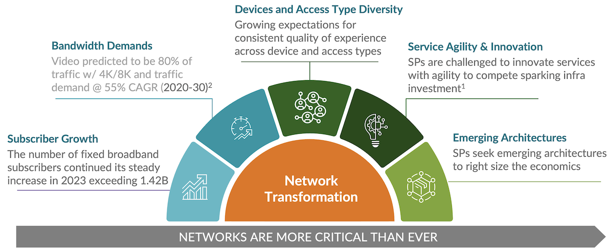
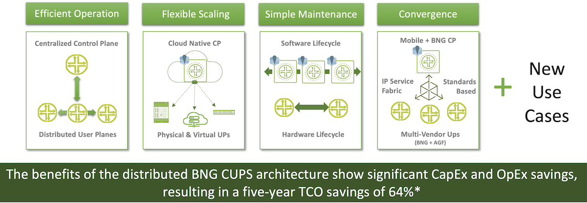
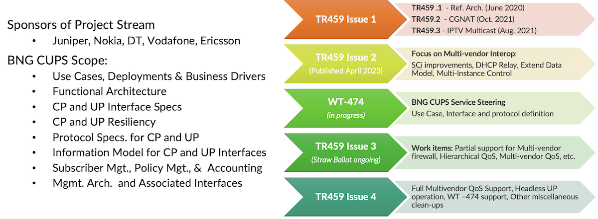
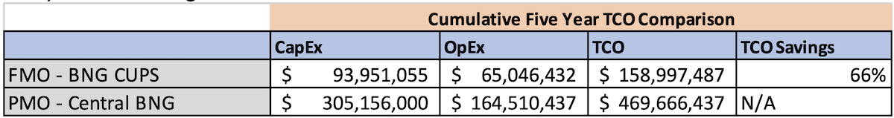
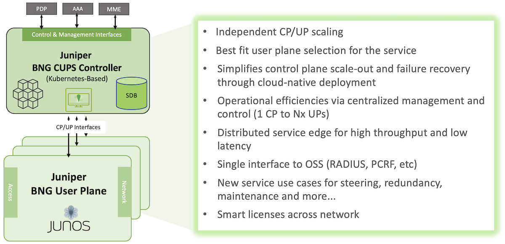
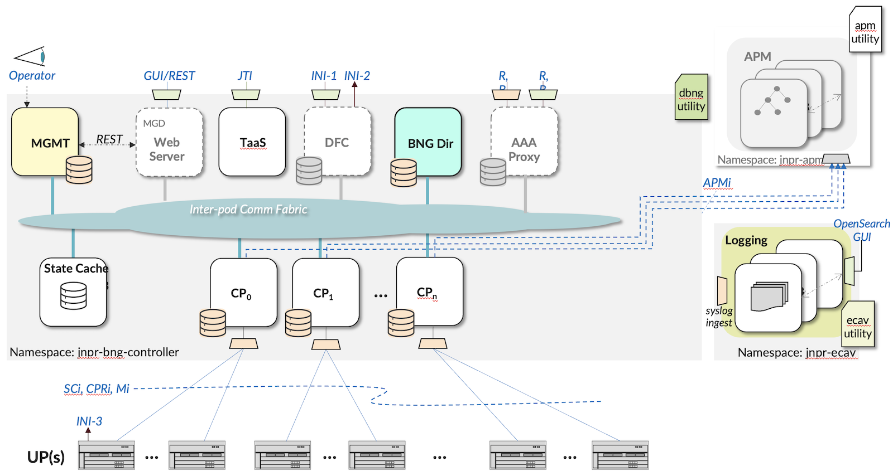
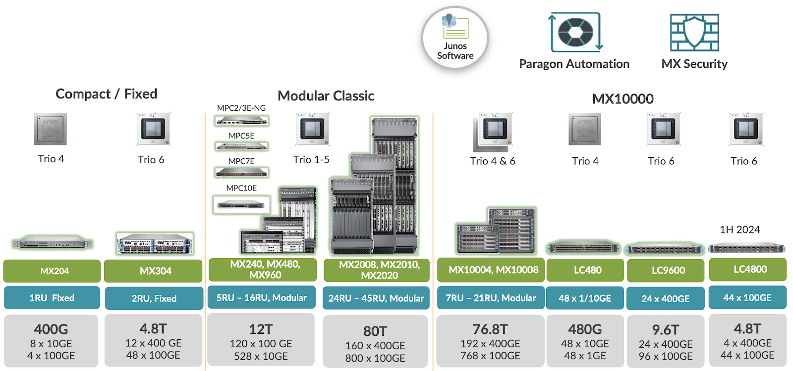
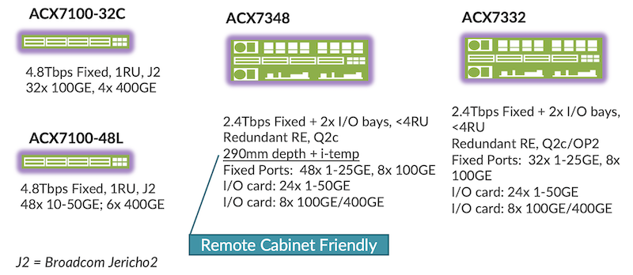
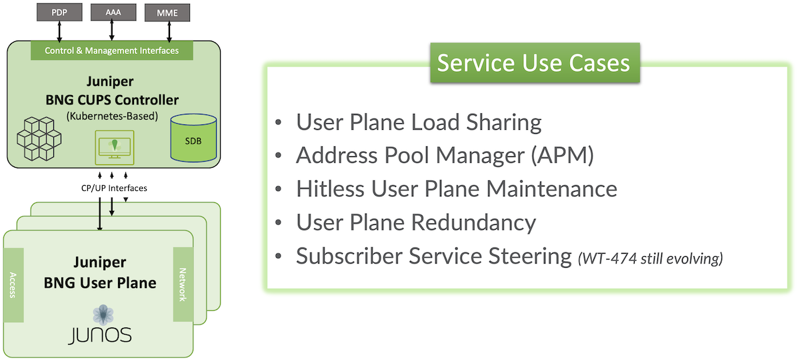

# Juniper BNG CUPS Architecture

**Horia Miclea - 05/13/2024**

Juniper BNG CUPS (Control and User Plane Separation) is an emerging broadband architecture for control plane and user plane separation compliant with Broadband Forum TR-459 Issue 2. It dramatically improves the Service Provider's Total Cost of Ownership and introduces new architecture use cases that were not possible or were based on vendor proprietary solutions.

## Introduction

Fixed broadband is the engine driving digital connectivity for billions of consumers and most of the world's enterprises. In Q3 2023, there were more than 1.42 billion broadband subscribers globally, and the market continues to grow.  While wireline broadband isn't going anywhere, Content Service Providers (CSPs) are looking to improve overall economics with simplified operations when designing next generation broadband networks.

Explosive growth in cloud and software-as-a-service (SaaS) traffic, as well as bandwidth-intensive applications like 4K video and gaming, naturally demand more capacity. They also bring stringent latency and performance requirements, requiring CSPs to position more resources and intelligence closer to subscribers. That's especially true for emerging latency-sensitive applications such as augmented reality and virtual reality (AR/VR), advanced Internet of Things (IoT) deployments, home automation, real time gaming and others. In addition, high-definition video streaming with Content Delivery Networks (CDNs) drives improves economics with a distributed BNG user plane. For applications like these, CSPs would like to:

- Have the flexibility to distribute Broadband Network Gateway (BNG) service nodes closer to subscribers: Analysts estimate that video now makes up 80% of network traffic and will grow at 55% CAGR through 2030.  That's to say nothing of growth in gaming, AR/VR, and other latency-sensitive applications. To deliver the Quality of Experience (QoE) customers expect, CSPs need to service more applications locally in the cloud metro network. Doing so would also reduce the costs associated with unnecessarily backhauling subscriber traffic back to centralized BNG Points of Presence (POP).
- Simplify operations: Traditional broadband networks typically rely on centralized architectures, using vertically integrated routing platforms with massive internal fabrics to serve hundreds of thousands of subscribers. This model works well for many CSPs. In some cases, though, it creates bottlenecks that increase the complexity and costs of engineering and maintaining the network. For these operators, the option to use an alternative, more modular approach to a BNG, that offers simplified device configuration, software release, and planned and unplanned maintenance procedures, looks increasingly attractive.
- Align network investments with business growth: In the past, CSPs have met growing subscriber demand by scaling up: swapping out centralized chassis with bigger, more powerful platforms or adding additional BNG nodes which can add operational complexities. Today, CSPs would like the option to scale out as well: to expand some markets and services incrementally by adding smaller, less expensive platforms as needed. This would also have the benefit of tying CapEx more closely to demand with a pay as you grow investment model.
- Evolve to an architecture for Wireline and Wireless Convergence (WWC): Many SPs run both fixed and mobile operations, and some wireline providers want to use Fixed Wireless Access to expand their service reach.

Today, industry groups like the Broadband Forum (BBF) are exploring ways to meet these challenges. They're developing new standards with the goal of making broadband networks more distributed, cloud native converged, and software driven. Among the most important early products of these efforts is the BBF TR-459 standard, which defines BNG CUPS.

BNG CUPS disaggregates the traditional BNG architecture, separating user and control planes, into a user plane and a control plane network element, while allowing each to be independently engineered and scaled. The user plane handles traffic routing, service enforcement, and redirects network control-traffic to the control plane.  The control plane handles client-protocol termination, tracks client session state, provides authentication, authorization, accounting (AAA) and telemetry services, and programs flow-state rules on the user plane for the subscriber's data traffic handling. This disaggregation makes sense from a purely technical standpoint, as user plane functions have more stringent memory, throughput, and latency requirements. More importantly, this model offers far more flexibility in architecting, operating, and evolving broadband networks.

This architecture enables the CUPS control plane element to control multiple BNG user planes and lets you position BNG user planes anywhere in the network giving you flexibility to meet changing customer requirements in more economical ways. Instead of always relying on huge, centralized service fabrics, you have the option to use smaller, less expensive edge platforms and scale out incrementally with demand. Where you do, each distributed user plane supports fewer subscribers, reducing the "blast radius" in the event of failure.

You can introduce cloud hyperscale concepts like spine-leaf architectures to deliver broadband services with improved efficiency and resiliency. And even though these architectures employ a larger number of BNG platforms, operations get simpler, because you are managing dozens of downstream user planes, and millions of subscribers, with a unified control plane and single interface into back-office systems.

Juniper has been heavily involved in BBF standards efforts. Juniper engineers provide significant contributions to the BNG CUPS and Wireless Wireline Convergence (WWC) standards development efforts as work stream leads and/or editors.  As the industry moves toward a unified, cloud-based control model for all CSP networks, Juniper will continue shaping these transformative standards.  Broadband Forum TR 459 Issue 2 was published in April 2023. It defines the baseline SCi (Session Control Interface) information elements enabling the first step towards CUPS multi-vendor deployments. Session Control Interface (SCi) is based on PFCP (Packet Forwarding Control Protocol), is DTLS protected (Data Transport Layer Security) and implements the User Plane node management and the BNG session management and control. In addition, it enables statistics reporting. Additional phases are in progress to add Quality of Service (QoS), Firewall, Service Steering capabilities and to conclude the multi-vendor enablement. In addition to Juniper, there are other vendors and service providers contributing to this standardization process.

## Value Proposition

The Juniper BNG CUPS solution implements the BBF TR-459 standard to bring the flexibility and scalability of disaggregation to broadband networks. The Juniper BNG CUPS solution enables the following benefits to Service Providers considering disaggregating their broadband networks:

- **Drive down operational complexity and costs:** Juniper BNG CUPS lets you distribute user planes wherever they're needed in the network, while managing everything with a centralized, cloud-hosted controller. With subscriber state information for all distributed user planes stored in one place, it's much simpler to move user planes from one location to another, perform maintenance, recover from failures, and more.
- **Reduce CapEx:** With a disaggregated, distributed BNG architecture, you can choose the best-fit user plane platform for the specific services offered at any location in the network. You can optimize for performance, throughput, latency, or other demands in locations that require it, while using less expensive options in those that don't.
- **Align network investments with demand:** With independent scaling of user and control planes, you can use cloud scale-out models to add capacity. No longer do you need to forecast growth in each market, overprovision, and hope you guessed right. Instead, just add more user planes when and where they're needed and pay as you grow.
- **Reduce time to market:** BNG CUPS improves business agility by providing a single, centralized control point for broadband services, even as you add subscribers and expand into new markets. Critically, you no longer need to update back-office systems every time you expand BNG infrastructure. You can continually add user planes to support more subscribers and services, using the same control plane and same interface to operational support/business support systems (OSS/BSS).
- **Deliver consistently excellent subscriber QoE: **With BNG CUPS, you can push the service edge closer to subscribers. This makes it easier to meet throughput and latency requirements for the most demanding applications, today and in the future. Additionally, with each user-plane platform anchoring fewer subscribers, and using hyperscale-style high availability techniques, you reduce the impact of failures and other network issues.
- **Support innovative new broadband use cases:** By disaggregating the control plane from downstream user planes and maintaining session information for all subscribers in one place, you can do things that weren't possible before. New options for efficiently managing IP address pools, performing maintenance, building redundancy, and more become feasible.
- **Build a foundation for tomorrow's converged architectures:** BNG CUPS isn't the only innovation coming to CSP networks. Industry groups like BBF and Third-Generation Partnership Project (3GPP) are developing 5G WWC standards that will let service providers manage both mobile and fixed access networks with a single, converged user plane, a single subscriber profile, and policies that can be applied regardless of access type. If you already use a standards based BNG CUPS architecture, implementing WWC is a much simpler, cost-effective evolution.

ACG Research has developed a total cost of ownership (TCO) model comparing the present mode of operation (PMO) with the future mode of operation (FMO). The PMO architecture uses 1:1 redundant BNG service nodes in regional central offices. The FMO architecture uses a distributed BNG user plane and a centralized BNG control plane. BNG user planes are located in both regional and edge central offices. The FMO also uses a spine-leaf architecture to interconnect access nodes with BNG user plane nodes. Our TCO model compares the PMO and FMO scenarios for a medium size CSP broadband network. The benefits of the distributed BNG CUPS architecture lead to significant CapEx and OpEx savings, resulting in a five-year TCO savings of 66%.

The complete TCO analysis whitepaper is available on the [ACG Research site](https://www.acgcc.com/media/reports/files/ACG_-_Juniper_TCO_Benefits_of_Distributed_Broadband_Services_with_CUPS_2022.pdf).

## Juniper BNG CUPS Architecture

Juniper BNG CUPS is one of the industry's first architectures to bring the disaggregation vision defined in BBF TR-459 to real-world networks. It is available and compliant with Broadband Forum TR459 Issue 2. It features two basic components:

- **Juniper BNG CUPS Controller:** This virtualized, cloud-native controller provides the full range of BNG control plane functions (subscriber session management, authentication and authorization, policy enforcement, and more), plus a session database (SDB) for network-wide subscriber state information, in a single, centralized solution. Juniper BNG CUPS controllers are highly available, microservices-based, Kubernetes-orchestrated cloud instances. They can be instantiated, scaled, and moved quickly and automatically, using the same mechanisms employed in the world's largest hyperscale clouds.
- **Juniper BNG User Planes:** Juniper offers BNG user plane functions on MX and ACX platform series, in multiple physical and virtual form factors, including smaller, streamlined platforms designed for distributed scale-out architectures. Operators can distribute these BNG user plane functions closer to subscribers while controlling them all centrally, with a single interface to back-office systems. BNG CUPS user planes can support DHCP IPoE dual stack (IPv4/IPv6), PPPoE PTA dual stack, and LAC sessions.

### BNG CUPS Controller

The Juniper BNG CUPS controller is a new cloud-based application running in a Kubernetes cluster that can be deployed on bare metal servers or virtual machines running Ubuntu controlling the user planes based on the BBF TR459 Issue 2 specifications and providing the BNG control plane functions including the OSS AAA and Lawful Intercept (LI) interactions. As part of the CUPS controller software package, we provide a script utility called "*bbecloudsetup*" that automates a basic (three master/worker) Kubernetes cluster based on Helm charts.

The Juniper CUPS controller enables a multi services architecture that can scale out. It can scale to multiple Control Plane Instance (CPi) microservice instance that can cover hundreds of user planes and millions of sessions. The controller handles all traditional control plane functions and back-office interfaces, including session management and control; Authentication, Authorization, and Accounting (AAA); Remote Authentication Dial-In User Service (RADIUS) interaction; and Dynamic Host Configuration Protocol (DHCP) relay or server. The solution implements these functions as highly available, microservices-based, Kubernetes-orchestrated cloud instances. Components of the controller architecture include:

- **BNG Director** microservice is responsible for instantiating, tracking, and monitoring control-plane instances.
- **AAA Proxy** microservice consolidates the AAA interfaces across all CPi instances into a single interface to OSS.
- **CPi** microservice implements the control plane for a range of user planes. With multiple CPi instances the controller can scale out. All CPi instances synchronize their state into the State Cache micro-service. CPi instances communicate with their UPs based on BBF TR459 Issue 2 interfaces: Session Control Interface (SCi) that provides UP and Session control and management and Control Plane Redirection Interface (CPRi) that provides redirection for the DHCP/PPPoE/L2TP protocols from UP to CPi.
- **Management (MGMT)** microservice implements the user management and API functions for the control plane and, ultimately, to downstream user planes.
- **Telemetry as a Service (TaaS)** microservice provides the telemetry infrastructure for the controller.
- **State Cache** microservice enables a database service for storing the subscriber session state and for enabling the control plane instance's resiliency and the controller redundancy.
- **Address Pool Manager (APM)** is a standalone cloud application that centrally monitors and manages IP address pools usage for all BNGs (including integrated BNGs or BNG CUPS controllers) in the architecture. It can be deployed in the same or different Kubernetes cluster as the CUPS controller.

### MX and ACX User Planes

Juniper Networks supports BNG CUPS user planes from the MX and ACX platform families.

MX platform series include compact and modular chassis options, with new modular designs like MX10000 series and compact designs like MX304 enabling higher per slot and chassis capacities based on the latest inhouse developed Trio 6 ASIC.  The Trio6 ASIC enables 1.6 Tbps throughputs and up to 100Mbps per subscriber assuming full H-QOS and scale. These platforms are specifically targeted as BNG CUPS user planes in mature markets, covering centralized or distributed options, while addressing cloud streaming with high-definition video distribution, 4K and beyond resolutions. They scale in throughput per chassis from 4.8Tbps for MX304 up to 76.8Tbps for MX10008 with LC9600 line cards.

Meanwhile, classic MX models, modular chassis like MX240-480-960 and compact like MX204 that are widely deployed as integrated BNG can be easily migrated to BNG CUPS user planes with a software upgrade. They are based on previous Trio ASIC generations most recent like Trio 5 and 4, that support up to 500Gbps throughputs and up to 15Mbps per subscriber with full H-QOS and scale. The scale in throughput per chassis from 400Gps for MX204 up to 12Tbps for MX960 with MPC10E line cards

Juniper Networks also offers the ACX platform series, based on Broadcom ASICs. These are Cloud Metro platforms, deployable as access leaves or spines, in a CLOS fabric architecture that scales to multiple Tbps in aggregate and per link up to 400Gbps, scalable horizontally. They provide a carrier grade transport for fixed and mobile aggregation networks based on IP/MPLS, Segment Routing (SR MPLS or SRv6) and universal transport service be that P2P, MP or P2MP based on EVPN.

The models based on the Broadcom Jericho 2 ASIC series are capable to support BNG CUPS user plane, with reasonable scale with thousands of sessions and rich service profile (including subscriber management via AAA, session accounting, Lawful Intercept with up to 128 simultaneous taps, 3 level hierarchical scheduling and shaping. Target ACX platforms as BNG CUPS user planes are in the figure below, ACX7100-32C, ACX7100-48L and ACX7348 are based on Jericho2 and Jericho2c while ACX7332 includes the OP2 TCAM. The ACX7348 is cabinet friendly and i-TEMP (supports industrial environments).

## Juniper BNG CUPS Service Use Cases

What can you do with a more flexible, disaggregated BNG architecture? Quite a lot. Having all subscriber state information natively maintained in a centralized SDB makes a huge difference. In a traditional BNG architecture, each platform only has knowledge of the local subscribers anchored to that platform, making it very difficult to support network engineering and maintenance functions in an open, interoperable way.

With state information for all subscribers accessible centrally, the cloud-hosted controller can manage a range of downstream user planes of various types and capabilities. And the possibilities for more cloudlike, centrally controlled traffic management and network optimization are practically limitless. To start, you can choose from among the five innovative Juniper BNG CUPS use cases detailed below.

### 1. Smart Subscriber Load Sharing

In traditional broadband networks, user planes act as siloed entities. If you want to distribute BNG user planes, you're always at risk of running out of capacity, which means you typically must overprovision. With the centralized control enabled by Juniper BNG CUPS, you can group user planes together and treat them as a shared pool of resources.

In this model, you group together user planes that will be part of the virtual resource pool. The controller then proactively monitors their subscriber or bandwidth loads. If a user plane exceeds a given threshold, the controller begins shifting sessions to a less-loaded user plane.

The result, you no longer must worry about accurately forecasting or overprovisioning subscriber scale for a given market. Instead, you can share user planes as needed and continually maximize all available resources in the infrastructure.

Read more details in this post gathering both Smart LB and HA: [https://juniper.github.io/techposts/juniper-bng-cups-smart-load-balancing-with-ha/article](https://juniper.github.io/techposts/juniper-bng-cups-smart-load-balancing-with-ha/article)

### 2. Centralized Address Pool Management

IPv4 addresses have become a precious resource. If you don't have enough available, subscribers can't access the network. Yet purchasing new addresses has become enormously expensive, if you can get them at all. You would think CSPs would do everything in their power to stretch IP address pools as far as possible. Unfortunately, traditional networks make this very hard to do. CSPs typically must allocate addresses to each BNG node, based on little more than an educated guess of what that node will need. Since BNG nodes function in silos, they can't easily share unused addresses either.

Juniper makes it possible to manage IP address pools as a shared resource, and automatically allocate IP addresses to a subscriber on any user plane across the network. With the cloud-native Address Pool Manager, CSPs can:

- Improve operational efficiency by automatically adding IP addresses when needed: APM delegates IP address pools across all integrated BNG and CUPS Controller entities in the network, as required, on a need basis. If a control plane crosses a predefined utilization threshold, the CUPS controller raises an apportionment alarm to APM that automatically provides a new address pool. You get the IP address resources you need, where and when you need them, without having to manage address pools manually or build and maintain homegrown tools.
- Lower costs by maximizing IP address utilization: CUPS Controllers automatically release the unused address pools and APM can re-allocate them as required. In a traditional network, those unused (and expensive) addresses would sit idle. APM automatically reclaims and redistributes them across the network where needed, optimizing operational costs for public IPv4 address management.

Read more in this article: [https://juniper.github.io/techposts/juniper-bng-cups-address-pool-management/article](https://juniper.github.io/techposts/juniper-bng-cups-address-pool-management/article)

### 3. Hitless User Plane Maintenance

In traditional vertically integrated networks, most maintenance tasks, changing line cards, updating software, and more, require a scheduled maintenance window. Since you're bringing down the node and all subscribers attached to it, you always risk disrupting services, and frustrating subscribers. Additionally, since maintenance windows are typically scheduled late at night, you pay higher overtime costs for that maintenance. A centralized control plane and shared state information make planned maintenance much simpler and less disruptive.  The process is straightforward:

- Technicians use the centralized control plane to transfer all subscriber state information from the current user plane to a new one.
- They configure the transport network to send traffic to the new user plane instead of the old.
- Since the new user plane already has state information for all subscribers, it exists in a "hot standby state" and quickly brings up those sessions without service disruption.
- Technicians perform the maintenance and, once complete, reverse the process and orchestrate traffic back to the original user plane.

The whole procedure can be handled in a streamlined, low-risk way during normal business hours, with subscribers never noticing a thing. This means you can continually update your network more easily and inexpensively, while improving customer satisfaction and supporting more stringent, and profitable, SLAs.

You can find more details in this techpost:[https://juniper.github.io/techposts/juniper-bng-cups-hitless-user-plane-maintenance/article](https://juniper.github.io/techposts/juniper-bng-cups-hitless-user-plane-maintenance/article)

### 4. BNG User Plane Redundancy

In this use case, Juniper BNG CUPS enables the same kind of hitless failover as in planned maintenance, but for unplanned failures. You define redundancy groups among user planes, identifying one or more backups that will activate if the primary fails. The cloud-hosted controller then pre-stages those platforms and, depending on the redundancy option used, continually programs backup user planes with the relevant state information. In the event a primary user plane fails, the controller automatically activates the pre-staged backup and re-routes traffic accordingly.

You'll be able to choose from two redundancy options, depending on the level of disruption tolerable for a given service or service level agreement (SLA):

- **Hot standby:** The controller continually programs session state information on the backup user planes, enabling hitless failover that's practically undetectable to users.
- **Warm oversubscribed standby:** The Backup user-plane holds full subscriber state on the Routing-Engine (RE), full state on the line card but only partial state- (or forwarding state)- is programmed on the Packet Forwarding Engine/ASIC (PFE).
- Whether to have **Hot or Warm Oversubscribed standby** subscriber sessions while in the Backup state can be set on a subscriber group (SGRP) basis.

Read more details in this post gathering both Smart LB and HA: [https://juniper.github.io/techposts/juniper-bng-cups-smart-load-balancing-with-ha/article](https://juniper.github.io/techposts/juniper-bng-cups-smart-load-balancing-with-ha/article)

### 5. Flexible Service Steering

An exciting standards-based use case currently under development is the concept of service steering  ([see BBF WT-474](https://www.broadband-forum.org/bbf-wt-474-subscriber-session-steering-demo)). This standard will give CSPs even more flexibility in architecting their networks by allowing the BNG control plane to steer subscriber sessions from one user plane to another.

Imagine, for example, that you have distributed user planes out at central offices (COs) or metro locations supporting Internet-only traffic, while more advanced platforms deeper in the network support more sophisticated services, such as deep packet inspection (DPI) or URL filtering. The distributed BNGs can act as generic gateways for most subscribers coming in from that location. But now, the controller can automatically direct subscribers requiring more advanced services to more advanced user planes.

With this intelligence, you can apply more sophisticated services to subscribers anywhere, without having to deploy more advanced and expensive user planes wherever you want to offer those services. And you can program custom traffic flows for specific services, SLAs, and even individual enterprise customers. Effectively, you bring the concept of network slicing to your broadband architecture.

BBF WT-474 is still in development and likely won't be fully productized for a while.

## References

### Industry References

- [Global Market Data Forecast by ITU](https://www.researchgate.net/figure/Global-mobile-data-traffic-forecast-by-ITU-Overall-mobile-data-traffic-is-estimated-to_fig1_331159423)
- [Point Topic Global Broadband Subscribers in Q3 2023](https://www.point-topic.com/post/global-broadband-subscribers-q3-2023)
- [LightReading article on Broadband Forum BNG CUPS work ](https://www.lightreading.com/regulatory-politics/broadband-forum-unveils-bng-disaggregation-project)
- [BNG CUPS Introduction and Motivations (BBF Marketing Report)](https://www.broadband-forum.org/pdfs/mr-459-1-0-0.pdf)
- [Improving Service Resiliency with Disaggregated BNG (BBF Marketing Report)](https://www.broadband-forum.org/pdfs/mr-459.2-1-0-0.pdf)

### Juniper and ACG Networks References

- [Juniper BNG CUPS Documentation](https://www.juniper.net/documentation/product/us/en/juniper-bng-cups/)
- [Juniper Address Pool Manager Documentation](https://www.juniper.net/documentation/product/us/en/address-pool-manager-apm/)
- [ACG -- Juniper TCO Benefit for Distributed Broadband with CUPS](https://juniper.highspot.com/items/63b607f251d3ea6ca3d4bb63)
- [Juniper MX series routers](https://www.juniper.net/us/en/products/routers/mx-series.html)
- [Juniper ACX 7100 and 7300 series routers](https://www.juniper.net/us/en/products/routers/acx-series.html)

## Glossary

- 3GPP: Third-Generation Partnership Project
- AAA: Authentication, Authorization, and Accounting
- APM: Address Pool Manager
- AR VR: Augmented Reality and Virtual Reality
- ASIC: Application-Specific Integrated Circuit
- BBF (TR): BroadBand Forum (Technical Report)
- BNG:  Broadband Network Gateway
- BSS: Business Support System
- CAGR: Compound Annual Growth Rate
- CDN: Content Delivery Network
- CO: Central Office
- CPi: Control Plane Instance
- CPRi: Control Plane Redirection Interface
- CUPS: Control and User Plane Separation
- CSP: Content Service Provider
- DHCP: Dynamic Host Configuration Protocol
- DPI: Deep Packet Inspection
- DTLS: Datagram Transport Layer Security
- FMO: Future Mode of Operation
- I-Temp: Industrial Temperatures
- IoT: Internet of Things
- MGMT: Management service
- LAC: L2TP Access Concentrator
- LI: Lawful Intercept
- OSS: Operational Support System
- PFCP: Packet Forwarding Control protocol
- PFE: Packet Forwarding Engine
- PMO: Present Mode of Operation
- PoP: Point of Presence
- PPPoE PTA: Point-to-Point Protocol over Ethernet / PPP Termination and Aggregation
- QoE: Quality of Experience
- QoS: Quality of Service / HQoS (Hierarchical QoS)
- RADIUS: Remote Authentication Dial-In User Service
- RE: Routing Engine
- SaaS: Software-as-a-Service
- SCi: Session Control Interface
- SDB: Session DataBase
- SGRP: Subscriber GRouP
- SLA: Service Level Agreement
- SR(v6): Segment Routing (v6)
- TaaS: Telemetry as a Service
- TCAM: Ternary Content-Addressable Memory
- TCO: Total Cost of Ownership
- WWC: Wireless Wireline Convergence

## Acknowledgments

This was guided by: Paul Lachapelle and Sandeep Patel, and the others colleagues in the Juniper AWAN team, who think Broadband and CUPS shape the future of the world by enabling people to connect.

And developed and created by a large team of engineers, their leaders are: John Ziegler, Steve Onishi, Cristina Radulescu-Banu
